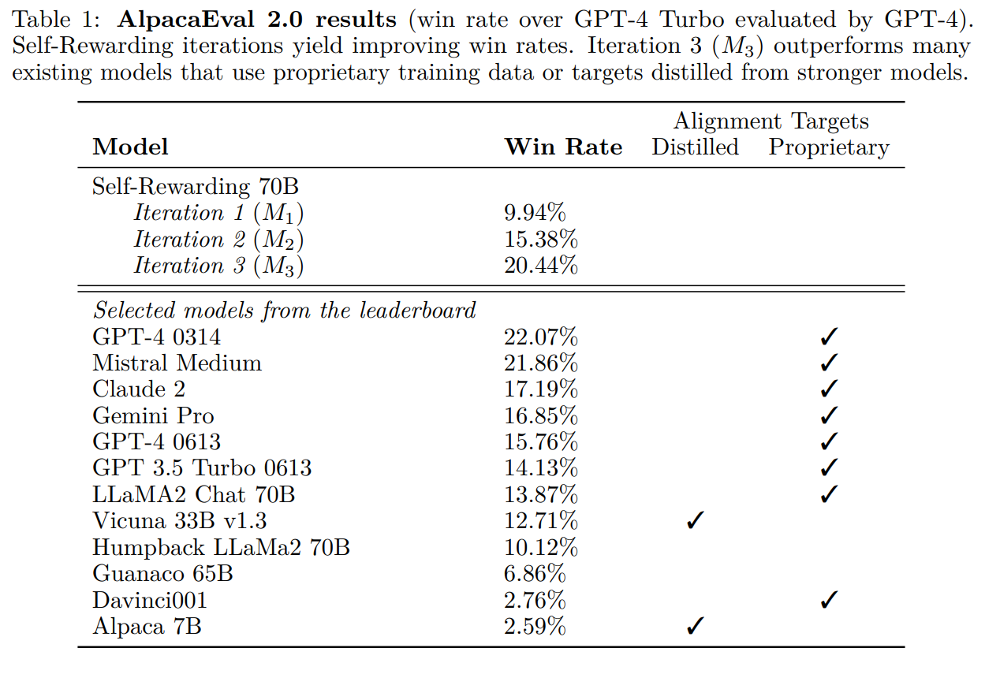
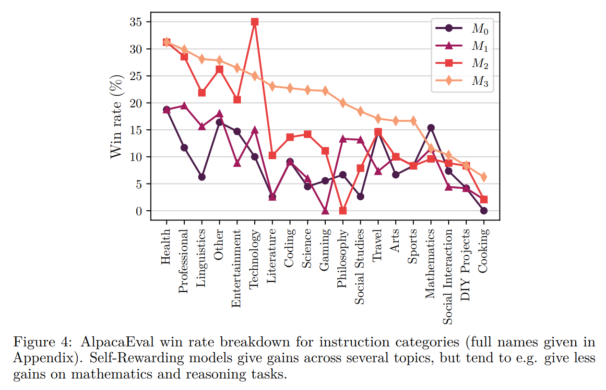
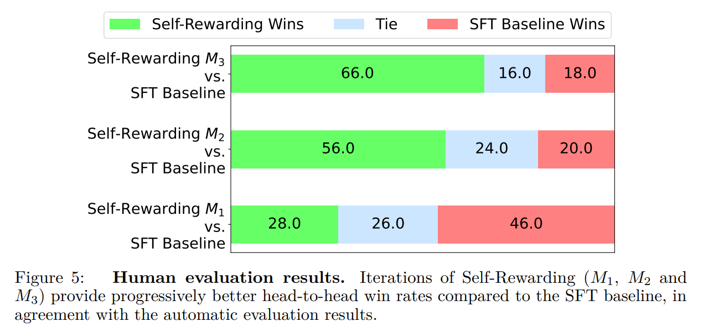
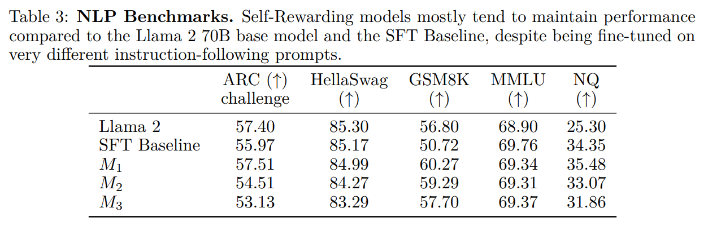
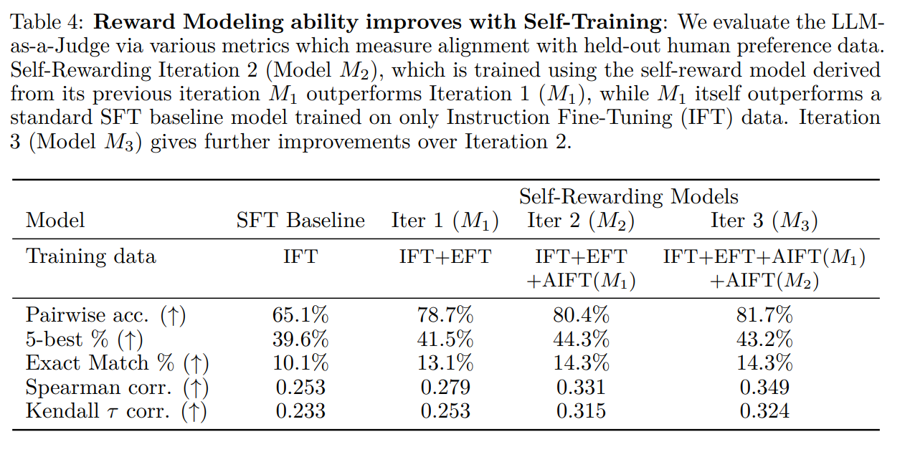

논문 및 이미지 출처 : <https://arxiv.org/pdf/2401.10020>

# Abstract

superhuman agent 를 달성하기 위해서는, 미래의 model 이 충분한 training signal 을 제공하기 위해 superhuman-level feedback 이 필요하다고 주장한다. 현재 접근법들은 일반적으로 human preference 로부터 reward model 을 학습시키는데, 이는 첫째로 인간의 성능 수준에 의해 병목될 수 있으며, 둘째로 이러한 별도로 고정된 reward model 은 LLM training 과정에서 스스로 향상될 수 없다.

본 연구에서는 **Self-Rewarding Language Model** 을 다룬다. 

* 여기서 language model 자체가 LLM-as-a-Judge prompting 을 통해 training 중 스스로 reward 를 제공한다. 
* 저자는 Iterative DPO training 과정에서 instruction following 능력뿐 아니라, 스스로에게 고품질의 reward 를 제공하는 능력 또한 향상된다는 것을 보인다.

Llama 2 70B 를 저자의 접근법으로 세 번의 iteration 을 통해 fine-tuning 한 결과, 해당 model 은 AlpacaEval 2.0 leaderboard 상에서 Claude 2, Gemini Pro, GPT-4 0613 을 포함한 여러 기존 system 을 능가하는 성능을 보였다.

아직 탐구해야 할 부분이 많지만, 본 연구는 두 축 모두에서 지속적으로 향상될 수 있는 model 의 가능성을 제시한다.

# 1 Introduction

Human preference data 를 사용하여 Large Language Model (LLM)을 alignment 하면 pretrained model 의 instruction following 성능을 크게 향상시킬 수 있다. 

* **Reinforcement Learning from Human Feedback (RLHF)** 의 표준 접근법은 이러한 human preference 로부터 reward model 을 학습한다. 
* 이후 **reward model** 은 frozen 되고, PPO 와 같은 RL 방법을 통해 LLM 을 학습시키는 데 사용된다. 

최근에는 reward model 학습 자체를 생략하고, human preference 를 직접 사용하여 LLM 을 학습시키는 **Direct Preference Optimization (DPO)** 방법도 제안되었다.

그러나 두 접근법 모두 human preference data 의 크기와 품질에 의해 병목된다. 특히 RLHF 의 경우, 이러한 데이터로 학습된 frozen reward model 의 품질에도 의존한다.

이에 본 연구에서는 이러한 병목을 피하기 위해, 고정되지 않고 LLM alignment 과정 동안 지속적으로 갱신되는 **self-improving reward model** 을 학습할 것을 제안한다. 

* 이러한 접근법의 핵심은 training 중 필요한 모든 능력을 별도의 model 로 분리하지 않고, 하나의 agent 가 모두 갖추도록 하는 것이다. 
* 즉, reward model 과 language model 을 구분하지 않고 하나의 통합된 system 으로 구성한다. 
* 이는 pretraining 및 multitask training 이 다양한 instruction following task 를 동시에 학습함으로써 task transfer 를 가능하게 하는 것과 유사하다. 
* reward model 을 동일한 system 에 통합함으로써, reward modeling task 와 instruction following task 간의 task transfer 도 가능하게 된다.

따라서 본 연구에서는 다음 두 가지 역할을 수행하는 Self-Rewarding Language Model 을 제안한다.

(i) 주어진 prompt 에 대해 응답을 생성하는 instruction following model 로서의 역할,  
(ii) 새로운 instruction following 예시를 생성하고 이를 평가하여 자신의 training set 에 추가하는 역할.

이러한 model 은 Xu et al. 의 연구에서 제시된 Iterative DPO framework 와 유사한 방식으로 학습된다. 

* seed model 로부터 시작하여, 각 iteration 마다 Self-Instruction creation 과정이 수행된다. 
* 이 과정에서 model 은 새롭게 생성된 prompt 에 대해 candidate respone 을 생성하고, 동일한 model 이 LLM-as-a-Judge prompting 을 통해 해당 응답에 reward 를 부여한다. 
  * 이는 또 다른 instruction following task 로 해석될 수 있다. 
* 이렇게 생성된 데이터로부터 preference dataset 이 구성되고, 다음 iteration 의 model 은 DPO 를 통해 학습된다 (Fig. 1 참조).

실험에서는 Open Assistant 로 fine-tuning 된 Llama 2 70B 를 seed model 로 사용하여 위의 학습 과정을 수행하였다. 그 결과, Self-Rewarding LLM alignment 는 baseline seed model 과 비교했을 때 instruction following 성능이 향상되었을 뿐 아니라, 고정되지 않고 학습되는 reward modeling 능력 또한 향상되었다.

이는 iterative training 중 각 iteration 에서 model 이 이전 iteration 보다 더 높은 품질의 preference dataset 을 스스로에게 제공할 수 있음을 의미한다. 이러한 효과는 실제 환경에서 일정 수준에서 포화될 가능성이 있지만, 인간이 만든 초기 seed data 만으로 학습된 model 보다 더 우수한 reward model (따라서 LLM) 을 얻을 가능성을 시사한다.

# 2 Self-Rewarding Language Models

본 연구의 접근법은 먼저 pretrained language model 과 소량의 human-annotated seed data 에 접근할 수 있다고 가정한다. 그 후 model 이 다음의 두 가지 능력을 동시에 갖추도록 학습시킨다.

1. *Instruction following*: 사용자의 요청을 설명하는 prompt 가 주어졌을 때, 고품질이며 유용하고 (또한 해가 없는) 응답을 생성하는 능력.
2. *Self-Instruction creation*: 새로운 instruction-following 예시를 생성하고 이를 평가하여 자신의 training set 에 추가하는 능력.

이 두 가지 능력은 model 이 self-alignment 를 수행하기 위한 핵심 구성 요소로, AI Feedback (AIF) 을 사용하여 스스로를 반복적으로 학습시키는 데 사용된다.

*Self-instruction creation* 은 candidate respone 을 생성하고, model 자체가 그 품질을 평가하는 과정을 포함한다. 

* 즉, external reward model 의 필요 없이, model 이 스스로 reward model 로 동작한다. 
* 이 과정은 LLM-as-a-Judge 메커니즘을 통해 구현된다. 이는 응답의 평가 과정을 또 하나의 instruction following task 로 구성하는 방식이다. 
* 이렇게 생성된 self-created AIF preference data 는 이후 training set 으로 사용된다.

전체 *self-alignment* 절차는 iterative 하게 진행되며, 각 iteration 마다 새로운 model 을 구축하여 이전보다 개선되도록 한다. 

* 중요한 점은, model 이 응답 생성 능력을 향상시킬 뿐 아니라, 동일한 생성 메커니즘을 통해 스스로 reward model 역할을 수행함으로써 reward modeling 능력 또한 iteration 을 거치며 향상된다는 것이다. 
  * 이는 기존 접근법에서 reward model 이 고정되어 있던 것과는 대조적이다. 
* 이러한 구조는 self-improvement 의 잠재적 상한을 높이고, 기존의 병목을 제거할 수 있을 것으로 저자는 본다.

이 절차의 세부 단계는 아래와 같으며, 전체 접근법의 개요는 Fig. 1 에 나타나 있다.

## 2.1 Initialization

#### Seed instruction following data

초기 단계에서는 인간이 작성한 (instruction prompt, response) 쌍으로 구성된 seed set 이 주어진다. 이 데이터는 pretrained base language model 을 supervised fine-tuning (SFT) 방식으로 학습시키는 데 사용된다. 이후 이 데이터를 Instruction Fine-Tuning (IFT) data 라고 부른다.

#### Seed LLM-as-a-Judge instruction following data

또한 (evaluation instruction prompt, evaluation result response) 형태의 seed set 도 제공된다고 가정한다. 이러한 데이터는 필수적이지는 않지만, IFT data 만으로 학습한 model 도 LLM-as-a-Judge 로 학습이 가능하더라도, 이 데이터를 추가로 사용하면 성능이 향상됨을 저자는 보인다 (자세한 결과는 Appendix A.3 참조).

이 데이터에서 prompt 는 model 에게 특정 instruction 에 대한 응답의 품질을 평가하도록 요청한다. 제공된 evaluation result response 는 chain-of-thought reasoning (정당화 과정) 과 최종 점수 (실험에서는 5 점 만점) 으로 구성된다. 

저자는 Fig. 2 에 나타난 prompt 형식을 사용하였으며, 여기서는 LLM 이 응답을 다섯 가지 가산 기준—relevance, coverage, usefulness, clarity, expertise—에 따라 평가하도록 지시한다. 이러한 기준들은 품질의 다양한 측면을 포괄한다.

이후 이 데이터를 Evaluation Fine-Tuning (EFT) data 라고 부른다.

저자는 학습 과정에서 IFT 와 EFT 두 가지 seed set 을 함께 사용한다.

## 2.2 Self-Instruction Creation

학습된 model 을 사용하여, model 이 스스로의 training set 을 수정(self-modify)하도록 만들 수 있다. 구체적으로는 다음 iteration 의 학습에 사용할 추가 training data 를 생성한다.

이 과정은 다음 단계들로 구성된다.

1. 새로운 prompt 생성:  
   few-shot prompting 을 사용하여 새로운 prompt $x_i$ 를 생성한다. 이때 원래의 seed IFT data 로부터 prompt 들을 sampling 하며, Wang et al. 과 Honovich et al. 의 접근법을 따른다.

2. candidate respone 생성:  
   주어진 prompt $x_i$ 에 대해 model 로부터 $N$ 개의 다양한 candidate respone 
   $\{y_i^1, \ldots, y_i^N\}$ 을 sampling 을 통해 생성한다.

3. candidate respone 평가:  
   동일한 model 의 LLM-as-a-Judge 능력을 사용하여, 각 candidate respone 의 품질을 평가하고 점수 $r_i^n \in [0, 5]$ 를 부여한다 (prompt 형식은 Fig. 2 참조).

## 2.3 Instruction Following Training

앞서 설명한 바와 같이, 초기 학습은 seed IFT 및 EFT data (Sec. 2.1)를 사용하여 수행된다. 이후 이 데이터는 AI (Self-)Feedback 을 통해 생성된 추가 데이터로 확장된다.

#### AI Feedback Training

Self-Instruction creation 절차를 수행한 후, 생성된 새로운 예시들을 추가하여 training data 를 확장할 수 있다. 이러한 데이터를 AI Feedback Training (AIFT) data 라고 한다.

이를 위해, 다음 형태의 *preference pair* 를 구성한다. $(\text{instruction prompt } x_i, \text{winning response } y_i^w, \text{losing response } y_i^l)$

winning 과 losing pair 는 Sec. 2.2 에서 평가된 $N$ 개의 candidate respone 중 가장 높은 점수와 가장 낮은 점수를 갖는 응답으로 구성한다 (Xu et al. 의 방식을 따름). 두 응답의 점수가 동일한 경우 해당 pair 는 버린다.

이러한 preference pair 들은 preference tuning algorithm 으로 학습에 사용될 수 있으며, 본 연구에서는 *DPO (Direct Preference Optimization)* 를 사용한다.

## 2.4 Overall Self-Alignment Algorithm

#### Iterative Training

전체 절차는 일련의 model $M_1, \ldots, M_T$ 를 학습시키는 iterative framework 로 구성된다. 

각 단계의 model $M_t$ 는 이전 단계의 model $M_{t-1}$ 이 생성한 augmented training data 를 사용하여 학습된다. 즉, $\text{AIFT}(M_t)$ 는 model $M_t$ 가 생성한 AI Feedback Training data 를 의미한다.

#### Model Sequence

각 model 과 그 training data 는 다음과 같이 정의된다.

* $M_0$: base pretrained LLM (fine-tuning 없음)
* $M_1$: $M_0$ 을 초기화하고, IFT + EFT seed data 로 SFT 수행
* $M_2$: $M_1$ 을 초기화하고, $\text{AIFT}(M_1)$ data 로 DPO 학습
* $M_3$: $M_2$ 를 초기화하고, $\text{AIFT}(M_2)$ data 로 DPO 학습

이러한 iterative training 절차는 Pairwise Cringe Optimization 과 유사하며, Xu et al. 이 제안한 Iterative DPO 접근법에 해당한다. 다만, Xu et al. 의 연구에서는 외부의 고정된 reward model 을 사용하였던 반면, 본 연구에서는 model 자체가 reward model 의 역할을 수행한다.

# 3 Experiments

## 3.1 Experimental Setup

#### Base Model

실험에서는 Llama 2 70B 를 base pretrained model 로 사용하였다.

### 3.1.1 Seed Training Data

#### IFT Seed Data

Instruction fine-tuning 을 위해 Open Assistant dataset 에 포함된 인간 작성 예시를 사용하였다. Li et al. 의 접근을 따라, 영어로 작성된 첫 번째 대화 턴 중 human annotated rank 가 가장 높은 (rank 0) 고품질 예시 3,200 개를 sampling 하였다.

실험에서는 base model 을 이 data 로만 supervised fine-tuning 한 model 을 SFT baseline 으로 설정하여 비교하였다.

#### EFT Seed Data

Open Assistant dataset 은 각 prompt 에 대해 여러 human response 를 순위 형태로 제공하므로, 이를 이용해 evaluation fine-tuning data 를 구성할 수 있다. 이를 train/evaluation set 으로 분할한 후, Fig. 2 에 제시된 입력 형식(평가 기준 설명, 평가할 instruction 및 response 포함)에 맞게 LLM-as-a-Judge data 로 변환하였다.

training target 으로 필요한 chain-of-thought reasoning (정당화) 과 5 점 만점의 최종 점수는 original data 에 직접 제공되지 않기 때문에, SFT baseline model 을 사용하여 각 입력에 대한 평가 출력을 생성하였다. 생성된 평가 결과 중에서, 예측된 점수의 순위가 human ranking 과 일치하는 경우에만 training set 에 포함시켰다.

또한 score distribution 의 불균형을 방지하기 위해, 가장 자주 등장하는 점수(주로 4점)를 받은 데이터 일부를 제거하여 training set 을 resampling 하였다.

이 결과, 1,630 train examples 와 541 evaluation examples 를 얻었으며, 이들은 IFT data 와 중복되지 않는다.

### 3.1.2 Evaluation Metrics

본 연구에서는 Self-Rewarding model 의 성능을 두 축에서 평가하였다.  
(1) Instruction following 능력  
(2) Reward modeling 능력

#### Instruction Following

다양한 model 간의 instruction following 성능을 평가하기 위해, GPT-4 를 evaluator 로 사용하였다.
256 test prompts (IFT test data) 를 이용하였으며, 이들은 Li et al. 의 접근을 따라 여러 출처로부터 추출되었다. 평가에는 AlpacaEval evaluation prompt 가 사용되었다.

각 모델의 응답을 쌍대 비교(pairwise) 하였으며, prompt 의 순서를 바꾸어 두 방향 모두 평가하였다. GPT-4 의 평가 결과가 일치하지 않을 경우 해당 항목은 무승부 (tie) 로 처리하였다.

또한, 동일한 테스트를 인간 평가자(저자) 가 직접 수행한 결과도 보고하였다.

추가적으로, AlpacaEval 2.0 leaderboard 형식의 평가도 수행하였다. 여기서는 805 개의 prompt 를 사용하며, baseline GPT-4 Turbo model 에 대한 승률(win rate)을 GPT-4 평가 기준으로 계산하였다.

이외에도, 수학, 코딩, 롤플레이, 글쓰기 등 다양한 분야의 multi-turn 질문으로 구성된 MT-Bench dataset 에서 평가를 수행하였다. 여기서는 GPT-4 가 각 응답을 10 점 만점으로 채점한다.

마지막으로, 9 개의 NLP benchmark dataset 에 대해서도 모델을 평가하였다.

* ARC-Easy
* ARC-Challenge
* HellaSwag
* SIQA
* PIQA
* GSM8K
* MMLU
* OBQA
* NQ

#### Reward Modeling

Reward modeling 성능은 Sec. 3.1.1 에서 설명한 Open Assistant 기반 evaluation set 을 이용하여 평가하였다.

각 instruction 은 평균 2.85 개의 human-ranked response 를 가진다. 이를 통해 model 이 예측한 평가 점수 순서와 human ranking 간의 일치도를 측정하였다.

평가 지표는 다음과 같다.

* Pairwise accuracy: 모든 가능한 응답 쌍의 순서가 human ranking 과 일치하는 비율.
* Exact match count: model 의 전체 순서가 human ranking 과 정확히 일치하는 비율.
* Spearman correlation 및 Kendall’s τ: 순위 상관계수.
* Perfect-5 agreement: model 이 5/5 로 평가한 응답이 human 기준으로도 최고 순위인 비율.

이러한 평가를 통해, model 의 self-evaluation (reward modeling) 능력을 정량적으로 분석하였다.

### 3.1.3 Training Details

#### Instruction following training

Instruction following 학습에 사용된 hyperparameter 는 다음과 같다.

* SFT 단계:
  * learning rate: $5.5 \times 10^{-6}$ → (cosine decay) → $1.1 \times 10^{-6}$
  * batch size: 16
  * dropout: 0.1
  * loss 계산: 전체 sequence 가 아닌 target token 에 대해서만 수행
* DPO 단계:
  * learning rate: $1 \times 10^{-6}$ → (decay) → $1 \times 10^{-7}$
  * batch size: 16
  * dropout: 0.1
  * $\beta$ 값: 0.1

early stopping 은 200 step 마다 checkpoint 를 저장하고, validation generation 을 평가하는 방식으로 수행하였다.

Validation 은 Claude 2 를 evaluator 로 사용하였으며, Li et al. 의 접근을 따라 다양한 출처로부터 수집된 253 개의 validation example 에 대해 평가하였다.

각 step 의 생성 결과를 이전 step 의 결과와 pairwise 비교하였고, 평가에는 AlpacaEval evaluation prompt format 을 사용하였다.

#### Self-Instruction creation

새로운 prompt 생성을 위해 Llama 2-Chat 70B model 을 고정하여 사용하였다. 8-shot prompting 설정을 적용하였으며, Self-Instruct 접근을 따랐다.

* IFT data 로부터 6 개의 demonstration, model 이 생성한 데이터로부터 2 개의 demonstration 을 sampling
* decoding parameter: $T = 0.6$, $p = 0.9$
* prompt template: classification task 가 아닌 경우 Self-Instruct 의 prompt template 사용
* filtering: ROUGE-L similarity check, keyword filtering, length filtering 적용

prompt 생성 단계를 제외한 나머지 과정(응답 생성, 평가)은 현재 학습 중인 Self-Rewarding model 을 사용하였다.

* candidate respone 생성:
  * $N = 4$ 개의 candidate response 생성
  * decoding parameter: $T = 0.7$, $p = 0.9$
* candidate respone 평가:

  * 평가 점수의 분산을 줄이기 위해 동일한 decoding parameter 로 3 회 sampling
  * 각 평가 결과의 평균값 사용

생성된 preference pair 수는 다음과 같다.

* $AIFT(M_1)$: 3,964 개 → $M_2$ 학습에 사용 (DPO)
* $AIFT(M_2)$: 6,942 개 → $M_3$ 학습에 사용 (DPO)

이와 같은 절차를 통해 iterative self-rewarding 학습 cycle 을 완성하였다.

## 3.2 Results

### 3.2.1 Instruction Following Ability

Head-to-head 성능 결과는 Fig. 3 에 제시되어 있다.

#### EFT+IFT seed training performs similarly to IFT alone

* Evaluation Fine-Tuning (EFT) task 를 추가하여 학습하더라도, Instruction Fine-Tuning (IFT) 데이터만 사용할 때와 비교했을 때 instruction following 성능에는 거의 차이가 없었다 (30.5% vs. 30.9% win rate).
* 이는 긍정적인 결과로, model 의 self-reward 능력을 강화해도 다른 능력에는 부정적인 영향을 주지 않음을 의미한다.
* 따라서 IFT + EFT 학습 결과를 Self-Rewarding model 의 Iteration 1 ($M_1$) 으로 설정하고, 이후의 iteration 학습을 진행하였다.

#### Iteration 2 ($M_2$) improves over Iteration 1 ($M_1$) and SFT Baseline

* Self-Rewarding 학습의 Iteration 2 ($M_2$) 는 Iteration 1 ($M_1$) 대비 뚜렷한 향상을 보였다.
* head-to-head 평가에서 $M_2$ 는 55.5% win rate 을 기록했으며, $M_1$ 은 11.7% 에 불과했다.
* 또한 SFT Baseline 대비로도 $M_2$ 는 49.2% win rate 을, baseline 은 14.5% 만을 기록하였다.

즉, Iteration 1 의 reward model 이 생성한 $\text{AIFT}(M_1)$ preference data 를 사용함으로써, $M_1$ → $M_2$ 로의 학습에서 성능이 크게 향상되었음을 확인할 수 있다.

#### Iteration 3 (M3) improves over Iteration 2 (M2)

Iteration 3 (M3) 은 Iteration 2 (M2) 대비 명확한 추가 성능 향상을 보였다.

* head-to-head 평가 결과, M3 의 승률은 47.7%, M2 는 12.5% 로 나타났다.
* 또한 SFT Baseline 대비로도 M3 의 승률은 62.5% vs. 9.8% 로, M2 보다 훨씬 더 자주 승리하였다.

즉, Iteration 2 의 reward model 이 생성한 AIFT(M2) preference data 를 사용하여 학습함으로써, M2 → M3 단계에서도 큰 성능 향상이 이루어졌음을 보여준다.

#### Self-Rewarding models perform well on AlpacaEval 2 leaderboard

저자는 model 을 AlpacaEval 2.0 leaderboard 형식으로 평가하였으며, 결과는 Tab. 1 에 제시되어 있다.

head-to-head 평가에서와 동일하게, 학습 iteration 이 진행될수록 GPT-4 Turbo 대비 win rate 이 지속적으로 향상되었다.

* Iteration 1: 9.94%
* Iteration 2: 15.38%
* Iteration 3: 20.44%

특히 Iteration 3 model 은 해당 지표에서 Claude 2, Gemini Pro, GPT-4 0613 을 포함한 여러 기존 model 을 능가하였다.

Tab. 1 에는 leaderboard 의 일부 대표 model 결과가 함께 제시되어 있다.

* 주목할 점은, 대부분의 경쟁 model 들이 대규모 proprietary alignment data (e.g., 100만 건 이상의 annotation, Touvron et al.) 를 사용하거나, 상위 model 로부터 distillation 된 target 을 활용한다는 것이다.
* 반면, 본 연구의 Self-Rewarding model 은 Open Assistant 로부터 얻은 소규모 seed data 로 시작하여, 이후 model 자체가 target 과 reward 를 생성함으로써 iterative 학습을 수행했다는 점에서 근본적인 차이를 보인다.

#### Fine-grained analysis

AlpacaEval 에서 iteration 이 진행될수록 전체 성능이 향상된다는 점은 앞서 보였다. 이를 세부적으로 분석하기 위해, 각 성능 향상이 어떤 유형의 task 에서 비롯된 것인지 조사하였다.

이를 위해 GPT-4 를 이용해 AlpacaEval test set 의 instruction 들을 세 가지 기준으로 cluster 하였다.

1. Instruction category
2. Instruction complexity
3. Expected response length

분석 방법과 prompting 세부 사항은 Appendix A.6 에 기술되어 있다.
Instruction category 에 대한 결과는 Fig. 4 에, 나머지 두 기준에 대한 결과는 Appendix Fig. 11 에 제시되어 있다.

결과로부터 다음의 결론을 도출할 수 있다.

* Self-Rewarding model 은 대부분의 category 에서 win rate 을 크게 향상시키지만, 수학적 계산 및 논리적 추론과 같은 일부 task 에서는 개선이 거의 없다.
  * 이는 본 연구의 학습 접근법이 기존 지식을 더 효과적으로 활용하도록 만드는 데 주로 기여함을 시사한다.
* Self-Rewarding training 을 통해, model 의 win rate 은 거의 모든 난이도의 task 에서 향상되며, 특히 난이도 5–7 (10점 척도 기준) 수준의 중간 난이도 task 에서 가장 큰 향상이 나타난다.
* Instruction 의 예상 응답 길이가 달라지더라도, iteration 이 진행될수록 win rate 이 지속적으로 상승한다는 점을 확인하였다.

요약하면, Self-Rewarding LLM 은 iteration 을 거듭할수록 지식 활용 효율성과 응답 품질이 모두 개선되며, 소량의 seed data 로부터 지속적인 자기 강화 학습(self-improvement) 이 가능함을 실증적으로 보여준다.

#### Data distribution analysis

IFT, EFT, 그리고 $\text{AIFT}(M_1)$ 데이터의 분포를 분석하기 위해 t-SNE 시각화를 수행하였다 (Appendix A.1 참조).

그 결과, IFT 와 $\text{AIFT}(M_1)$ 예시 간에는 높은 수준의 overlap 이 관찰되었으며, 이는 학습된 Self-Rewarding model 이 원래의 instruction distribution 을 잘 유지하고 있음을 의미한다.

반면 EFT 예시들은 임베딩 공간의 다른 영역에 위치하며, 이러한 분리된 분포는 EFT 가 IFT 성능에 영향을 주지 않았던 이유를 설명해준다.

또한, AlpacaEval 데이터에서 model 이 생성한 응답의 평균 길이는 iteration 에 따라 점진적으로 증가하였다.

* $M_1$: 1,092 tokens
* $M_2$: 1,552 tokens
* $M_3$: 2,552 tokens

즉, iteration 이 진행될수록 model 이 더 길고 자세한 응답을 생성하는 방향으로 학습되고 있음을 확인할 수 있다. 이는 상대적 성능 향상의 요인 중 하나로 작용했을 가능성이 있다.

#### Human evaluation

자동 평가 결과(GPT-4 평가)와 인간의 판단이 일치하는지를 검증하기 위해 human evaluation 을 수행하였다.

SFT baseline 과 Self-Rewarding model ($M_1$, $M_2$, $M_3$) 의 응답을 비교하는 방식으로 진행하였다.

* IFT test set 에서 50 개의 instruction 을 무작위로 선택
* 각 instruction 에 대해 baseline vs. $M_1$, baseline vs. $M_2$, baseline vs. $M_3$ 의 세 쌍(pair) 생성
* 각 pair 에 대해 3 명의 평가자(저자) 가 blind evaluation 을 수행
* 다수결(majority vote) 로 우수한 응답을 결정

* 평가 결과(Fig. 5 참조), iteration 이 진행될수록 Self-Rewarding model 이 SFT baseline 대비 명확한 우위를 보였다.
* 이는 GPT-4 의 자동 평가 결과와 일관되며, iterative training 절차의 효과성을 뒷받침한다.

#### MT-Bench performance further validates these results

MT-Bench 성능 결과는 Tab. 2 에 제시되어 있다.

SFT baseline 과 Self-Rewarding model 의 iteration 별 성능을 비교한 결과, iteration 이 진행될수록 점수가 꾸준히 향상되었다.

* $M_1$: 6.78 / 10
* $M_2$: (중간 향상)
* $M_3$: 7.25 / 10

특히 humanities, STEM, roleplay, writing, extraction 분야에서 더 큰 상대적 향상을 보였으며, math, code, reasoning 분야에서는 상대적으로 작은 향상을 보였다.

이는 Open Assistant 의 seed prompt 들이 reasoning 기반 task 를 충분히 포함하지 않았기 때문으로 보인다.

또한, 이러한 향상은 MT-Bench 가 multi-turn evaluation 임에도 불구하고, 본 연구의 학습 방법이 single-turn prompt 에 기반함에도 성취된 결과라는 점에서 의미가 크다.

#### Self-Rewarding models did not lose ability on NLP Benchmarks

* Tab. 3 에 제시된 결과에 따르면, 대부분의 NLP benchmark task 에서 Self-Rewarding model 의 성능은 baseline 과 유사한 수준을 유지하였다.
  * 세부적인 dataset 별 결과는 Appendix Table 9 에 포함되어 있으며, 동일한 경향을 보인다.
* 이는 본 연구에서 사용한 training data (seed data 및 synthetic data)가 Open Assistant 의 prompt 를 기반으로 하기 때문에, Tab. 3 의 benchmark 들에서 요구되는 특정 언어적/논리적 능력과 직접적인 연관성이 낮기 때문이다.
  * 따라서, 해당 task 들에서는 성능이 유지되거나 소폭 감소하는 경향이 나타났다.
  * 예를 들어, InstructGPT 연구에서도 RLHF fine-tuning 중 일부 public NLP dataset 에서 성능이 하락하는 현상이 관찰되었으며, 이를 “alignment tax” 라고 표현하였다.

향후 연구 방향으로는, Self-Rewarding 패러다임을 이러한 다양한 task 에까지 확장하는 것이다.

즉, Open Assistant 기반 seed prompt 에만 의존하지 않고, 더 다양한 dataset 으로부터 seed prompt 를 확보하여 model 의 자기 학습 능력을 폭넓게 일반화하는 것이 필요하다.

### 3.2.2 Reward Modeling Ability

Reward modeling 평가 결과는 Tab. 4 에 제시되어 있다.

#### EFT augmentation improves over SFT baseline

먼저, Evaluation Fine-Tuning (EFT) data 를 추가하여 학습할 경우, Instruction Fine-Tuning (IFT) data 만을 사용할 때보다 LLM-as-a-Judge 역할 수행 능력이 향상되었다.

IFT data 는 일반적인 instruction task 들을 폭넓게 포함하므로 SFT Baseline 도 어느 정도 응답 평가 능력을 갖지만, EFT data 는 명시적으로 평가 과제의 예시를 제공하기 때문에 해당 능력을 더욱 강화시킨다.

측정된 다섯 개의 평가 지표 모두에서 IFT+EFT 가 IFT 단독보다 성능이 향상되었으며, 예를 들어 pairwise accuracy (human ranking 과의 일치도) 는 65.1% → 78.7% 로 증가하였다.

#### Reward Modeling ability improves with Self-Training

Self-Rewarding training 을 한 번 수행하면, model 의 instruction following 능력뿐 아니라 스스로에게 reward 를 제공하는 능력 또한 향상된다.

* $M_2$ (Iteration 2) 는 $M_1$ (Iteration 1) 의 reward model 을 사용해 학습되었으나, $M_1$ 대비 모든 평가 지표에서 성능이 향상되었다.  
  예: pairwise accuracy = 78.7% → 80.4%
* $M_3$ (Iteration 3) 는 $M_2$ 대비 일부 지표에서 추가적인 향상을 보였으며,  
  예: pairwise accuracy = 80.4% → 81.7%

이러한 성능 향상은 추가적인 EFT data 없이 달성된 것이다. 또한 Self-Instruction creation loop 에서 생성된 예시들은 LLM-as-a-Judge 학습 예시와 직접적으로 유사하지 않음에도 불구하고, 향상이 지속적으로 나타났다.

저자는 그 이유를 다음과 같이 가정한다: model 의 전반적인 instruction following 능력이 향상될수록, 자연스럽게 평가(inference-level judging) 능력 또한 개선되기 때문이다.

#### Importance of the LLM-as-a-Judge Prompt

본 연구에서는 Fig. 2 에 제시된 LLM-as-a-Judge prompt format 을 사용하였다.

사전 실험에서는 다양한 prompt 변형을 시도하여 가장 효과적인 형식을 선택하였다. 예를 들어, Li et al. 의 연구에서는 동일하게 5점 척도를 사용하지만, 각 점수를 품질 구간(quality bucket) 의 multiple-choice 형식으로 제시하였다 (Appendix Fig. 7 참조).

반면, 본 연구에서 사용한 prompt 는 가산적(additive) 평가 방식으로, 품질의 여러 측면(e.g., relevance, clarity, coverage, usefulness, expertise)을 통합하여 점수를 산출한다.

두 형식 간에는 성능 차이가 매우 컸다.

* 본 연구의 prompt: 65.1% pairwise accuracy
* Li et al. 의 prompt: 26.6% pairwise accuracy

즉, 평가 기준을 additive 하게 구성한 본 연구의 prompt 가 LLM-as-a-Judge 학습에 훨씬 효과적임을 확인하였다.

자세한 분석은 Appendix A.2 에 기술되어 있다.

# 4 Related Work

대형 language model 을 자동적으로 개선하거나 self-correcting 하는 연구는 최근 빠르게 성장하고 있는 분야이다. Pan et al. 은 이를 종합적으로 다룬 survey 를 제시하였지만, 해당 분야는 매우 빠르게 발전하고 있어 이미 그 이후에도 새로운 유망한 연구들이 등장하고 있다.

#### Reinforcement Learning from Human Feedback (RLHF)

Ziegler et al., Stiennon et al., Ouyang et al., Bai et al. 등의 연구에서는 human preference data 로부터 고정된 reward model 을 학습한 뒤, 이 reward model 을 이용해 reinforcement learning (RL), 예를 들어 Proximal Policy Optimization (PPO) 방식으로 LLM 을 학습시킨다.

즉, reward signal 은 본질적으로 이미 model 에 의해 생성되지만, human data 에서 distillation 된 형태로 사용된다. 이러한 접근은 일반적으로 Reinforcement Learning from Human Feedback (RLHF) 로 불린다.

한편, Direct Preference Optimization (DPO) 은 reward model 학습 자체를 생략하고, human preference 를 직접 사용하여 LLM 을 학습시키는 접근이다. 이와 유사한 다양한 변형 기법들도 제안되었다. 예: Zhao et al., Zheng et al., Yuan et al.

그중에서도 Pairwise Cringe Optimization (PCO) 는 본 연구와 유사하게 iterative training scheme 을 사용하지만, 고정된 reward model 을 사용한다는 점이 다르다. 또한 해당 연구에서도 Iterative DPO 가 DPO 단일 학습보다 향상된다는 점을 보였다.

이외에도 iterative preference training 을 다룬 다른 연구로 Adolphs et al., Gulcehre et al., Xiong et al. 등이 있다.

#### Reinforcement Learning from AI Feedback (RLAIF)

Constitutional AI 는 LLM 이 스스로 feedback 을 제공하고 응답을 개선하는 방식을 제안하였다. 이렇게 생성된 데이터를 이용해 reward model 을 학습한 뒤, 이를 통해 language model 을 RL 로 학습시킨다.
이 방식은 Reinforcement Learning from AI Feedback (RLAIF) 로 불린다.

Lee et al. 은 RLAIF 와 RLHF 절차를 비교한 결과, 두 방법의 성능이 유사하다고 보고하였다.

* 이들은 사전 학습된 off-the-shelf LLM 을 이용해 LLM-as-a-Judge prompting 을 수행하고, 이를 기반으로 고정된 reward model 을 학습시킨 후 RL 학습에 사용하였다.
* 또한, 고정된 LLM-as-a-Judge model 을 PPO 내부에서 직접 사용하는 실험도 수행했지만, 이는 계산 비용이 매우 크다는 단점이 있었다.
* 반면, 본 연구에서 사용한 iterative 접근은 이러한 judge 평가 단계를 offline 단계에서 수행하므로 훨씬 계산 효율적(computationally cheap) 이다.

마지막으로, SPIN (Chen et al.) 은 최근 연구에서 reward model 자체를 완전히 제거하고, Iterative DPO 유사 framework 를 통해 학습하는 방법을 제시하였다.

* 이 방법에서는 human label 이 주어진 응답을 winning response 로, 이전 iteration 의 model 생성 응답을 losing response 로 사용한다.

그러나 저자들은 이 접근이 다음과 같은 한계를 가진다고 지적하였다.

* model 의 생성 능력이 human 수준에 도달하면, 더 이상 개선할 수 없는 병목 현상(bottleneck) 이 발생한다.
* 각 입력 prompt 에 대해 human annotated response 가 반드시 필요하다.

이는 저자의 방법과 달리, model 자체가 reward 를 생성하고 학습에 활용할 수 있다는 점에서 중요한 차이를 보인다.

#### Improving LLMs via data augmentation (and curation)

여러 연구에서는 fine-tuning 성능을 높이기 위해 training data 를 (self-)생성하거나 정제(curation) 하는 방식으로 LLM 을 개선하였다.

Self-Instruct (Wang et al.) 는 model 스스로 prompt 와 response 를 생성하는 self-instruction creation 방법으로, 이를 통해 base LLM 의 성능을 향상시킨다.

저자의 연구 역시 이와 유사한 기법을 사용하지만, 여기에 더해 self-reward model 을 이용해 생성된 예시를 평가하고 점수를 부여한다.

또한, 강력한 LLM 으로부터 distillation 하여 training data 를 생성함으로써, 상대적으로 작은 model 이 높은 성능을 달성할 수 있음을 보인 연구들도 있다.

예를 들어,

* Alpaca 는 Llama 7B model 을 대상으로, text-davinci-003 이 self-instruct 스타일로 생성한 instruction 으로 fine-tuning 하였다.
* Alpagasus 는 ChatGPT 를 LLM-as-a-Judge 로 사용하여 Alpaca dataset 을 필터링(curation)하고, 더 작은 고품질 subset 을 만들어 성능을 개선하였다.
* Instruction Backtranslation 은 web document 로부터 prompt 를 예측하는 backtranslation 방식을 통해 training data 를 확장하고 정제하였다.
  * 이때 데이터 정제(curation)는 LLM-as-a-Judge 가 수행하므로, 이는 특정 상황에 한정된 self-rewarding model 의 사례로 볼 수 있다.
* 또한 Reinforced Self-Training (ReST) 은 fixed external reward 를 사용해 고품질 예시를 반복적으로 선별(curate)하고 training set 에 추가함으로써 성능을 향상시켰다.

저자의 실험에서는 이와 유사하게 positive example 만 추가하는 방식은 성능 향상에 도움이 되지 않았으나, preference pair (선호 쌍) 을 사용하는 방식은 유의미한 향상을 가져왔다 (자세한 내용은 Appendix Sec. A.4 참조).

#### LLM-as-a-Judge

LLM-as-a-Judge prompting 을 이용해 language model 의 출력을 평가하는 것은 이미 표준적인 접근으로 자리 잡았다. 이 접근은 reward model 학습이나 data curation 과정에도 널리 활용되고 있다.

일부 연구, 예를 들어 Kim et al. 은 LLM 이 judge 역할을 잘 수행하도록 하는 별도의 training data 를 제작하였다. 그러나 저자의 연구와 같은 방식으로, judge 능력 학습과 일반적인 instruction following 능력 학습을 동시에 결합한 사례는 알려진 바가 드물다.

즉, 본 연구의 Self-Rewarding Language Model 은 instruction generation, self-evaluation (judging), data creation, alignment improvement 의 전 과정을 하나의 통합적 학습 루프로 수행한다는 점에서 기존 접근과 차별화된다.

# 5 Conclusion

본 연구에서는 Self-Rewarding Language Model 을 제안하였다. 이 model 은 자신이 생성한 응답을 스스로 평가(judging)하고 이를 기반으로 재학습함으로써 self-alignment 를 수행할 수 있다.

본 방법은 iterative 학습 구조를 따르며, 각 iteration 에서 model 이 자신의 preference 기반 instruction training data 를 생성한다.

구체적으로, model 이 LLM-as-a-Judge prompting 을 통해 자신의 응답에 reward 를 부여하고, 이를 이용해 Iterative DPO 로 preference 를 학습한다.

실험 결과, 이러한 학습은 iteration 이 진행될수록 model 의 instruction following 능력과 reward modeling 능력을 모두 향상시켰음을 보였다.

이 접근은 특히 흥미로운 의미를 가진다. 즉, model 이 향후 iteration 에서 스스로 더 나은 reward 를 할당할 수 있게 되어, instruction following 성능 향상이 다시 self-reward 향상을 촉진하는 선순환 구조 (virtuous circle) 가 형성되기 때문이다.

이러한 향상이 현실적인 환경에서는 일정 수준에서 포화될 가능성이 있지만, 그럼에도 불구하고 인간의 preference data 에 의존하지 않고 지속적으로 self-improvement 가 가능한 model 의 가능성을 보여준다.

# 6 Limitations

본 연구의 실험 결과는 유망하지만, 아직 예비적(preliminary) 성격을 지닌다.
그 이유는 탐구해야 할 여러 추가 연구 주제가 남아 있기 때문이다.

그 중 주요한 한계점과 향후 연구 방향은 다음과 같다.

* (1) Iterative training 의 한계 및 scaling law 분석 필요  
  본 연구에서는 세 번의 iteration 만 수행하였으며, 그 결과 instruction following 및 reward modeling 능력이 모두 향상됨을 확인하였다.  
  향후 연구에서는 iteration 횟수를 늘리거나, 다른 규모(capability)와 설정을 가진 language model 에 대해 이 효과의 scaling law 를 규명할 필요가 있다.
* (2) 응답 길이 증가 현상 및 품질 간의 상관 관계 분석 필요  
  실험에서 model 의 응답 길이가 iteration 이 진행될수록 길어졌으며, 일반적으로 응답 길이와 품질 평가는 양의 상관 관계를 보인다.  
  따라서 이러한 경향이 실제 품질 향상의 결과인지, 혹은 단순한 길이 효과(length bias)에 기인한 것인지 더 깊은 분석이 필요하다.
* (3) Reward-hacking 가능성 검증 필요  
  본 framework 내에서 “reward-hacking” 이 발생할 수 있는지, 그리고 어떤 조건에서 발생하는지를 탐구해야 한다.  
  특히 본 연구에서는 language model 을 reward 부여에 사용하고, 일부 benchmark 에서는 language model (GPT-4) 을 최종 평가자로 사용하였다.  
  비록 서로 다른 model 이지만, 동일한 구조 내 평가 체계가 잠재적으로 편향을 초래할 가능성이 있어, 이에 대한 심층적인 분석이 요구된다.
* (4) Human evaluation 의 확장 및 검증  
  본 연구의 human evaluation 결과는 자동 평가 결과와 일관성을 보였으나, 보다 다양한 조건과 평가자를 포함한 후속 연구가 필요하다.
* (5) Safety evaluation 및 안전 학습(safety training) 확장 필요  
  향후 연구의 중요한 방향은 model 의 안전성 평가 및 안전 중심 학습(safety alignment) 을 Self-Rewarding framework 에 통합하는 것이다.  
  기존 system (e.g., Touvron et al.) 에서는 별도의 reward model 을 safety 목적에 한정하여 구축하였다.  
  본 연구의 접근법에서는 LLM-as-a-Judge 절차를 안전성 평가에 특화시켜 적용함으로써, 안전한 self-rewarding training 이 가능할 것으로 보인다.

특히, 본 연구에서 보인 바와 같이 reward modeling 능력이 iteration 을 거치며 향상된다면, model 의 safety capability 또한 시간이 지남에 따라 함께 개선될 가능성이 있다. 즉, 후속 iteration 에서는 초기 iteration 이 감지하지 못한 더 복잡한 safety 문제를 포착하고 완화할 수 있을 것이다.
