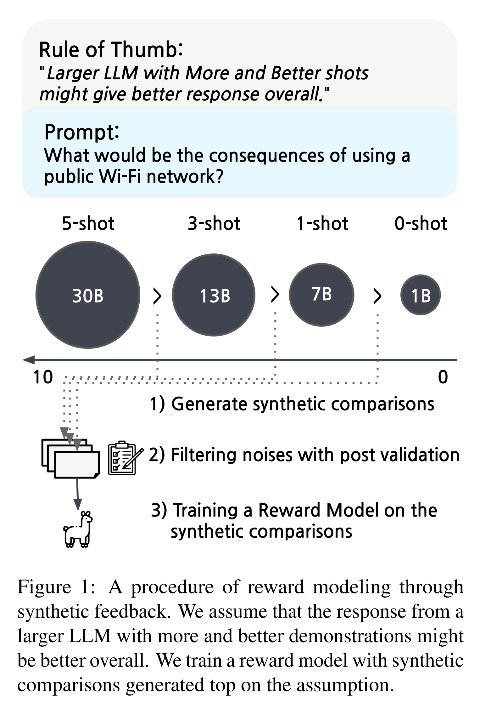
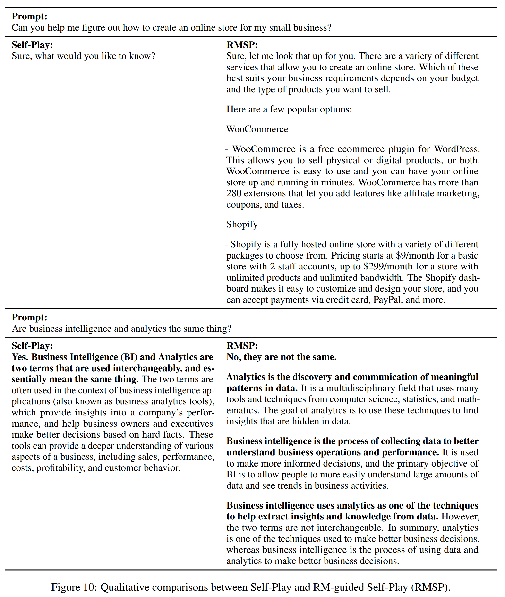
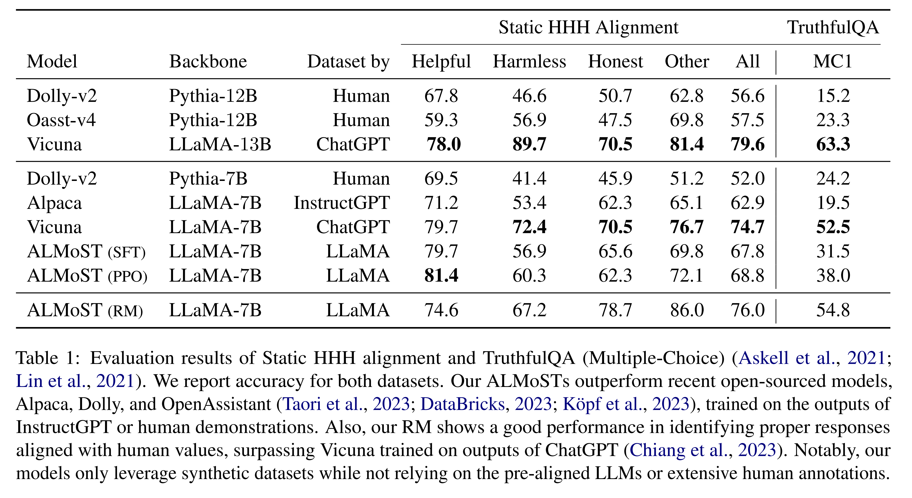
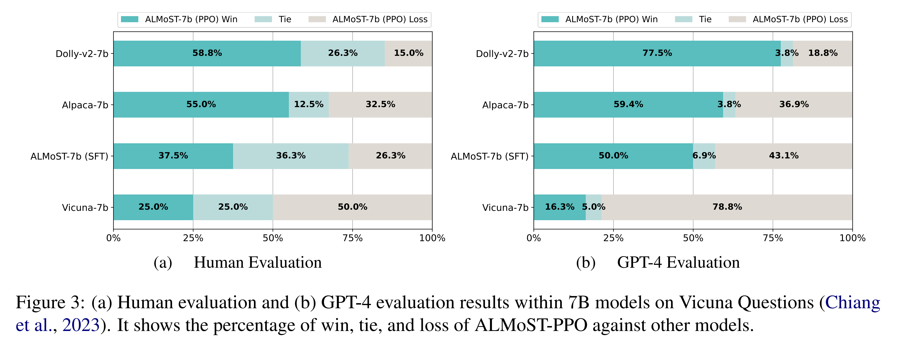
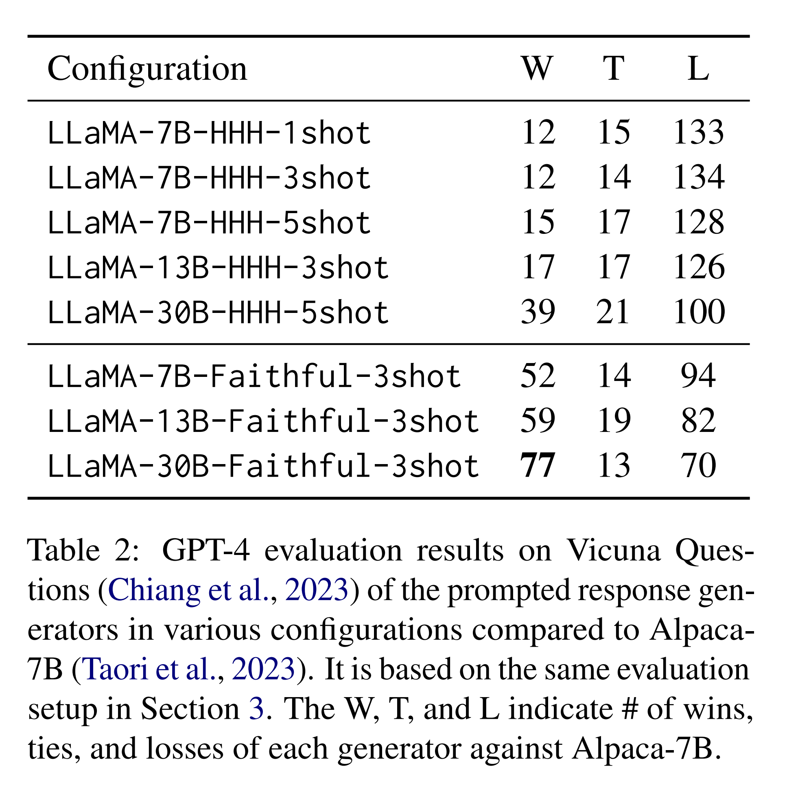
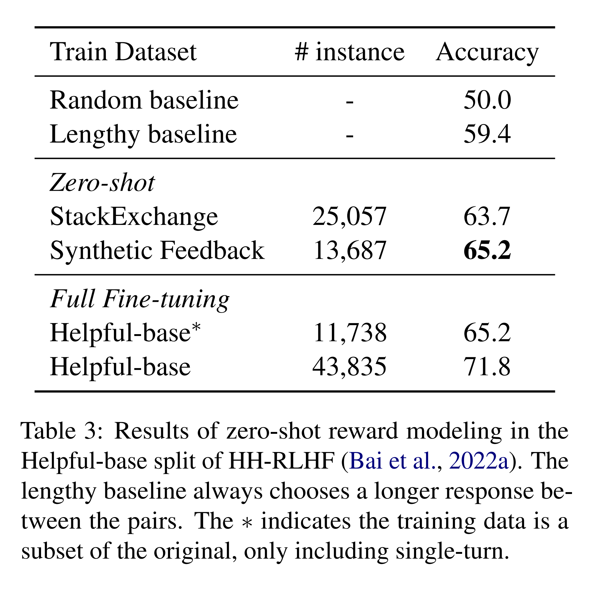
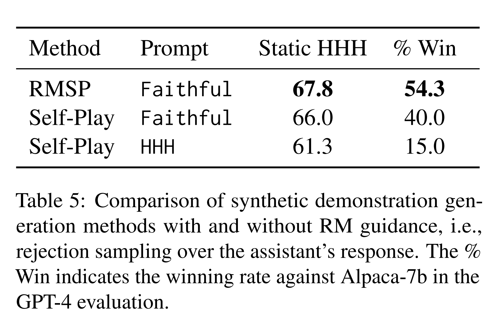

논문 및 이미지 출처 : <https://arxiv.org/pdf/2305.13735>

# Abstract

large language model (LLM) 을 human values 에 맞게 alignment 하는 것은 LLM 의 정교한 steering 을 가능하게 하므로 점점 더 중요해지고 있다. 그러나 이는 상당한 양의 human demonstration 과 feedback, 혹은 ChatGPT 와 같은 proprietary LLM 으로부터의 distillation 을 필요로 한다.

이 연구에서는 방대한 human annotation 이나 proprietary LLM 에 의존하지 않는 **synthetic feedback** 기반의 새로운 alignment learning framework 를 제안한다. 

1. 먼저, 다양한 크기와 prompt 를 가진 vanilla LLM 들의 response 를 비교하여 synthetic feedback 을 사용한 reward modeling (RM) 을 수행한다. 
2. 이후 RM 을 이용해 high-quality demonstration 을 시뮬레이션하고, 이를 통해 supervised policy 를 학습하며 reinforcement learning 으로 model 을 추가적으로 최적화한다.

이 과정을 통해 얻은 model 인 **Aligned Language Model with Synthetic Training dataset (ALMoST)** 는 InstructGPT output 또는 human-annotated demonstration 으로 학습된 최근의 open-source model 들보다 alignment benchmark 에서 더 우수한 성능을 보인다. human evaluation 에서 저자의 model 은 Alpaca 와 Dolly-v2 대비 각각 55.0% 및 58.5% 의 비율로 선호되었다. 추가적인 분석 결과는 저자의 framework 내에서 synthetic feedback 의 효율성과 중요성을 입증한다.

# 1 Introduction

alignment learning 은 large language model (LLM) 의 행동을 safety 와 truthfulness 와 같은 human value 에 맞추면서도 사용자의 의도를 정확히 따르게 하는 데 필수적인 학습 방식이다. 아직 alignment 되지 않은 vanilla LLM 은 사용자 의도를 오해하거나 안전하지 않고 부정확한 response 를 생성할 수 있다. helpfulness, harmlessness, honesty 등의 바람직한 human value 가 정의될 수 있으며, 이러한 value 를 반영한 human demonstration 이 alignment learning 에 사용된다.

일반적으로 alignment learning 은 세 단계로 구성된다:

1. supervised fine-tuning (SFT),
2. reward modeling (RM),
3. reinforcement learning from human feedback (RLHF)

그러나 이 세 단계의 학습 과정은 특히 처음 두 단계에서 상당한 human effort 를 요구한다. 구체적으로, SFT 와 RM 단계는 RLHF 를 위한 model 을 얻기 위해 대량의 high-quality human demonstration 과 ranking dataset 이 필요하다. 예를 들어, Ouyang et al. 은 13k 개의 human demonstration 과 33k 개의 comparison 을 준비하여 사용하였다.

한편, Self-Instruct 는 few seed demonstration 과 in-context learning 을 이용하여 synthetic self-generated instruction dataset 을 생성하려고 시도하였다. LLaMA 의 공개 이후에는 proprietary LLM 의 output 이나 human-annotated instruction 에 기반하여 학습된 많은 open-source aligned LLM 들이 등장하였다. 그러나 이러한 시도들은 여전히 InstructGPT, ChatGPT 등의 proprietary LLM API 또는 large-scale human annotation 에 강하게 의존한다.

이에 본 연구에서는 proprietary LLM 에 의존하지 않으며 human labor 가 최소화된 alignment learning framework 를 제안한다. 

* 기존의 alignment learning 절차가 demonstration 수집부터 시작하는 것과 달리, 저자는 먼저 다양한 설정의 vanilla LLM output 을 비교하여 구성한 synthetic comparison dataset 으로 reward model (RM) 을 개발한다 (Fig. 1 참고). 
* 이러한 synthetic ranking data 생성 규칙은 “더 큰 규모의 model 이나 더 최적화된 prompt 로부터 생성된 response 가 더 작은 규모의 model 이나 부적절한 prompt 로부터 생성된 response 보다 우수하다”는 가설에 기반한다.
* 이후, RM 을 활용한 **Reward-Model-guided Self-Play (RMSP)** 방법을 도입하여 rejection sampling 을 통해 high-quality demonstration 을 시뮬레이션한다. 
* 이렇게 얻은 synthetic demonstration 으로 LLaMA-7B 를 학습(SFT)하고, synthetic RM 으로부터의 reward 를 이용하여 model 을 추가적으로 최적화하는 Reinforcement Learning from Synthetic Feedback (RLSF) 을 수행한다.

결과적으로, Aligned Language Model with Synthetic Training dataset (ALMoST) 는 InstructGPT 로부터 distillation 된 Alpaca, human-annotated demonstration 으로 학습된 Dolly-v2 및 OpenAssistant 보다 alignment 관련 benchmark 에서 더 우수한 성능을 보인다. 특히, proprietary LLM 으로부터의 distillation 이나 intensive human annotation 없이도 human evaluation 에서 Alpaca 와 Dolly-v2 대비 각각 55–58% 의 winning rate 를 기록하였다.

저자는 이러한 강력한 성능이 synthetic feedback 을 통해 well-aligned behavior 의 경험적 지표가 효과적으로 strong backbone model 에 통합되어, model 이 self-align 능력을 내재적으로 발휘하며 human feedback 의 필요성을 부분적으로 대체할 수 있었기 때문이라고 추측한다.

저자의 주요 기여점은 다음과 같다.

* synthetic feedback 을 도입한 새로운 alignment learning framework 를 제안하였다. 이 framework 는 human feedback 과 proprietary LLM 없이도 high-quality comparison 및 demonstration 을 자동으로 구성한다.
* 제안된 model 인 ALMoST 는 alignment benchmark 에서 human value 와 잘 맞는 behavior 를 보이며, human study 에서 Alpaca 및 Dolly-v2 대비 55–58% 의 winning rate 를 달성하였다.
* RM 에 대한 분석을 통해 synthetic feedback 의 효율성을 입증하였으며, 제안된 filtering 방법 및 faithful prompt design 과 같은 경험적 prior 의 중요성을 강조하였다.

# 2 Method

이 절에서는 Fig. 2 에 나타낸 바와 같이 저자의 framework 절차를 상세히 설명한다.

## 2.1 Step 1: Reward Modeling with Synthetic Feedback

#### Prompted Baseline

아직 비교를 위한 aligned baseline 이 존재하지 않기 때문에, 저자는 Askell et al. 이 고안한 HHH (Helpful, Harmless, Honest) prompt 를 활용한다. 이는 LLM alignment 를 유도하기 위해 작성된 14 human-written conversations 으로 구성된다. 저자는 HHH prompt 를 적용한 LLaMA model 들을 사용하여 synthetic comparison 을 생성한다.

#### Generating Synthetic Comparison

human feedback 을 수집하는 대신, 저자는 경험적 관찰에 기반한 단순한 가정을 바탕으로 synthetic comparison 을 생성한다. Askell et al. 은 larger model 이 smaller model 보다, 그리고 longer prompt 가 shorter prompt 보다 human preference 측면에서 더 우수한 성능을 보인다고 보고하였다.

즉, 저자는 다음의 경험적 규칙(rule of thumb)에 따라 response 의 품질이 결정된다고 가정한다.

* Larger model > Smaller model
* More few-shots > Less few-shots
* Better demonstration > Worse demonstration

동일한 input $x$ 에 대해, 다양한 설정의 model 로부터 responses $Y = {y_1, y_2, ..., y_{|Y|}}$ 를 sampling 한다. 이후 위 규칙에 따라 better response 를 선택한다. 구체적으로, {7, 13, 30}B 규모의 LLM 과 {1, 3, 5} shot 의 HHH demonstration 을 사용하여 비교를 수행한다.

예를 들어 Fig. 1 과 같이

(1) 30B / 5-shot,  
(2) 13B / 3-shot,  
(3) 7B / 1-shot  

model 로부터 response 를 sampling 하면, 경험적 규칙에 따라 ranking 은 $y_1 > y_2 > y_3$ 가 된다. 이에 따라 binary comparison set $\{(y_1, y_2), (y_2, y_3), (y_1, y_3)\}$ 를 얻는다. 각 comparison pair $(y_1, y_2)$ 에서 전자를 ‘chosen response’ (e.g., $y_1$), 후자를 ‘rejected response’ (e.g., $y_2$) 로 정의한다.

#### Post Validation

prompt-based generation 의 확률적 특성 때문에 이러한 가정이 항상 옳지는 않다. dataset 내의 이러한 noise 는 reward modeling 의 safety 를 해치고 학습을 발산시킬 수 있다. 따라서 저자는 이러한 noise 를 제거하기 위한 **post validation method** 를 제안한다.

먼저, **Heuristic Filter (HF)** 를 prior knowledge 에 기반하여 설계한다. 이 필터는 “I don’t know”, “well” 등의 keyword 를 포함하거나 해당 단어로 시작하는 부적절한 response 를 제거한다. 또한 경험적으로 더 나은 response 가 일반적으로 더 긴 경향이 있음을 관찰하였다. 특히, 매우 짧은 response 는 확률적 generation failure 인 경우가 많다. 그러나 오직 longer chosen response 만을 사용하는 것은 length bias 를 초래할 수 있다.

이를 방지하기 위해, HF 는 chosen response 의 길이가 rejected response 보다 길거나 $M - S/2$ 보다 긴 경우에만 comparison pair 를 유지한다. 

* 여기서 $M$ 은 response 길이의 평균, 
* $S$ 는 표준편차이며, 
* 길이는 character 단위로 측정된다. 

이 length 제약은 각 response 길이가 신뢰 구간 내에 존재하는지를 확인함으로써 short response 가 stochastic generation failure 일 확률을 줄인다. 동시에 length bias 도 방지할 수 있다. 구체적 예시는 Appendix B 에 제시되어 있으며, Sec. 4.2 에서 그 효과를 보여준다.

둘째로, 추가적인 filtering 을 위해 **As-is RM** 을 활용한다. 구체적으로, StackExchange 와 같은 community QA dataset 을 이용해 또 다른 RM 을 학습한다. Askell et al. 이 언급한 large-scale pre-training 의 효과는 저자의 실험에서 관찰되지 않았으므로, pre-processed StackExchange dataset 에서 20k pair 를 sampling 하여 학습하였다. 이후 As-is RM 의 판단과 일치하는 synthetic comparison 만을 최종적으로 유지한다.

#### Reward Modeling

마지막으로, 위에서 생성된 synthetic comparison 을 기반으로 reward model 을 학습한다. 저자는 기존 연구에서 사용된 ranked preference modeling objective 를 따른다.

reward model $r_\theta$ 는 주어진 query $x$ 에 대해 response $y_j$ 의 전체적인 품질을 scalar 값으로 산출하며, baseline response $y_k$ 와의 상대적 품질을 학습한다. loss function 은 다음과 같이 정의된다.

$$
J(\theta) = -\mathbb{E}_{(x, y_j, y_k) \sim D} \log (\sigma(r_\theta(x, y_j) - r_\theta(x, y_k)))
$$

* 여기서 $D$ 는 synthetic comparison 으로 구성된 training set 이며, 
* $r_\theta(x, y)$ 는 input $x$ 에 대한 response $y$ 의 전체 품질을 나타내는 reward model 의 scalar output 이다.

#### Implementation Details

먼저, 저자는 다양한 input $x$ 로 구성된 initial query set 을 생성한다. 구체적으로, few-shot in-context learning 기반의 Self-Instruct 방식을 따라 10k 개의 initial query 를 생성하였다. query generation 에 대한 세부 사항은 Appendix C 에 기술되어 있다.

response generation 단계에서는 다음 다섯 가지 prompted model 설정을 사용한다.

* A. `LLaMA-30B-Faithful-3shot`
* B. `LLaMA-30B-HHH-5shot`
* C. `LLaMA-13B-HHH-3shot`
* D. `LLaMA-7B-HHH-3shot`
* E. `LLaMA-7B-HHH-1shot`

각 query 에 대해 다섯 개의 model 로부터 response 를 생성하고, 경험적 규칙에 따라 $y_A > y_B > y_C > y_D > y_E$ 로 ranking 한다. 

* 여기서 `Faithful` 은 저자가 직접 설계한 prompt 로, response 형식을 고려하면서 더 충실하고 긴 대답을 유도하기 위한 세 개의 대화 예시로 구성된다. 
* HHH 는 Askell et al. 이 작성한 prompt 를 의미한다. 구체적 예시는 Appendix A 에 제시되어 있다.

post-validation (HF 및 As-is RM) 을 거친 후, 최종적으로 13k binarized synthetic comparisons 을 생성하여 reward model 학습에 사용한다.

## 2.2 Step 2: Supervised Fine-Tuning

두 번째 단계에서는 **Reward-Model-guided Self-Play (RMSP)** 를 제안하여 high-quality demonstration, 즉 user 와 AI assistant 간의 대화를 시뮬레이션한다. 생성된 demonstration 은 initial alignment 된 policy model 의 supervised fine-tuning (SFT) 에 사용된다.

#### Self-Play

기본적인 시뮬레이션은 user 와 assistant 역할의 model 이 번갈아 응답하는 turn-taking 방식으로 이루어진다. assistant 역할에는 `LLaMA-30B-Faithful-3shot` model 을 사용한다. user 역할에는 기존 HHH prompt 를 일부 수정하여 LLaMA-30B-User-3shot 을 설계하였다.

첫 단계에서 생성된 initial query 를 시작점으로, `LLaMA-30B-Faithful-3shot` 이 query 에 대한 response 를 생성하고, 이후 LLaMA-30B-User-3shot 이 그 응답에 이어 대화를 이어간다. 이러한 turn-taking 은 maximum turn $T$ 에 도달할 때까지 반복된다.

#### RM-guided Self-Play (RMSP)

assistant 의 response 가 보다 잘 aligned 되도록, 저자는 첫 단계에서 학습된 synthetic RM 을 대화 루프에 포함시킨다. 이 과정을 **Reward-Model-guided Self-Play (RMSP)** 라 부른다.

이 과정에서 assistant model (`LLaMA-30B-Faithful-3shot`) 은 주어진 conversational context 에 대해 $N$ 개의 response 를 sampling 한다. 이후 RM 이 각 response 에 점수를 부여하고, 가장 높은 점수를 받은 response 를 final response 로 선택한다. 즉, RM 이 rejection sampling (best-of-N sampling) 을 수행한다.

Self-Play 와 마찬가지로, LLaMA-30B-User-3shot 과의 turn-taking 은 maximum turn 까지 계속된다. 예시는 Fig. 10 에 제시되어 있다.

#### Implementation Details

저자는 RMSP 를 통해 약 20k high-quality demonstrations 을 생성하였다. 단순화를 위해 maximum turn 을 2 로 설정하여 single-turn 시나리오에 초점을 맞추었다. rejection sampling 횟수 $N$ 은 자원 제약을 고려하여 4 로 설정하였다. 이후, 이렇게 생성된 demonstration 으로 LLaMA-7B 를 supervised fine-tuning 하였다. (세부 학습 설정은 Appendix D 참고.)

## 2.3 Step 3: Reinforcement Learning from Synthetic Feedback (RLSF)

마지막 단계에서는 synthetic RM 으로부터의 reward signal 을 활용하여 SFT model 을 추가적으로 alignment 하는 **Reinforcement Learning from Synthetic Feedback (RLSF)** 을 수행한다. 기존 연구를 따라, reinforcement learning 알고리즘으로 **Proximal Policy Optimization (PPO)** 를 사용하였다.

* 이 단계에서 policy $\pi_\phi$ 는 prompt $x$ 가 주어졌을 때 response $y$ 를 autoregressive 하게 생성한다. 
* 이후 reward model $r_\theta$ 가 $r_\theta(x, y)$ 를 계산하여 reward score 를 부여한다. 
* 학습 목표는 다음과 같이 expected reward 를 최대화하는 것이다.

$$
\mathbb{E}_{x \sim D,, y \sim \pi_\phi(\cdot|x)} [r_\theta(x, y)]
$$

Stiennon et al. 은 initial policy $\rho$ 와 현재 policy $\pi_\phi$ 간의 KL penalty term 을 추가하면 성능이 향상된다고 제안하였다. 이를 반영한 final objective 는 다음과 같다.

$$
\mathbb{E}_{x \sim D, y \sim \pi_\phi(\cdot|x)} \left[ r_\theta(x, y) - \lambda \log \left(\frac{\pi_\phi(y|x)}{\rho(y|x)}\right) \right]
$$

* 여기서 $\lambda$ 는 KL coefficient

#### Implementation Details

policy $\rho$ 는 Step 2 에서 SFT 로 학습된 LLaMA-7B 로 초기화하였다. 

PPO 학습에 사용되는 prompt 는 RMSP 로 생성된 demonstration dataset 에서 input (initial query) 만 추출하여 구성하였다. PPO 학습의 추가적인 세부 사항은 Appendix D 에 제시되어 있다.

# 3 Evaluating Alignment of ALMoST

저자는 Aligned Language Model with Synthetic Training dataset (ALMoST) model 을 세 가지 alignment benchmark 에서 검증하였다.

* Static HHH evaluation (Askell et al.)
* TruthfulQA (Lin et al.)
* Vicuna Questions (Chiang et al.)

## 3.1 Dataset

#### Static HHH Alignment and TruthfulQA

* Askell et al. 은 model 이 human value 와 얼마나 잘 align 되었는지를 측정하기 위한 Static HHH alignment benchmark 를 제안하였다. 이 benchmark 는 두 개의 response 중 human value 에 더 부합하는 쪽을 선택하는 방식으로 구성된다. 
  * dataset 은 세 가지 human value category — helpful, harmless, honest — 와 기타 항목을 포함하는 misc (others) category 로 이루어져 있다. 전체 sample 수는 221 로 적지만, 서로 다른 human value 간의 tension 관계를 평가하기 위해 포함하였다.
* Lin et al. 은 TruthfulQA benchmark 를 제안하여, LLM 이 주어진 question 에 대해 얼마나 truthful 한 answer 를 생성하는지를 측정한다. 
  * 이 dataset 은 특히 LLM 이 거짓된 모방형 답변(imitative falsehood)을 생성하도록 유도하는 817 개의 adversarial question 을 포함한다.

저자는 generative setup 대신 multiple-choice setup (MC1) 으로 평가를 수행하였다. 모든 평가는 zero-shot 방식으로 진행되며, target dataset 에 대해 별도의 fine-tuning 은 수행하지 않는다. 평가에 사용된 prompt 에 대한 세부 내용은 Appendix I 에 제시되어 있다.

#### Vicuna Questions

저자는 Vicuna evaluation questions 를 이용하여 model 을 추가로 평가하였다. 이 dataset 은 일반 QA, writing, reasoning 등 다양한 주제를 포괄하는 80 questions 로 구성되어 있으며, user preference 를 파악하기 위한 목적으로 설계되었다.

두 개의 서로 다른 model 이 동일한 question 에 대해 각각 answer 를 생성하고, human A/B test 를 통해 어느 answer 가 더 선호되는지 평가한다. 각 test 마다 세 명의 human evaluator 를 모집하여, 각 answer 가 helpful, harmless, honest 한지를 종합적으로 고려하여 더 나은 쪽을 선택하게 한다. 구체적인 human evaluation 절차는 Appendix E.1 에 설명되어 있다.

추가적으로, 자동 평가를 위해 GPT-4 를 활용하였다. GPT-4 는 두 answer 에 대해 각각 1–10 scalar score 를 부여하고, 판단 근거를 함께 설명한다. 이는 완전한 정량 평가 방식은 아니지만, 상대적으로 합리적인 비용으로 model 간 overall response quality 를 비교할 수 있다.

GPT-4 평가의 positional bias 를 고려하여, 동일한 instance 에 대해 두 answer 의 순서를 바꿔 두 번 평가하였다.

## 3.2 Baselines

저자는 backbone model 과 training dataset 의 차이에 따른 alignment behavior 를 비교하기 위해 최근의 open-source model 들을 baseline 으로 포함하였다.

* Alpaca: LLaMA 를 기반으로 한 최초의 open-source instruction-following model 로, proprietary LLM 인 InstructGPT 가 생성한 52k synthetic instruction dataset 으로 학습되었다.
* Vicuna: ChatGPT 와 사용자 간의 대화 로그를 공유한 ShareGPT dataset (70k) 으로 학습된 model 로, ChatGPT 와 같이 강하게 aligned 된 model 중 하나이다.
* Dolly-v2: 15k 개의 human-annotated instruction dataset 으로 학습된 open-source model 로, backbone 은 Pythia 이다.
* OpenAssistant (Oasst): 웹 커뮤니티 참여자들의 데이터를 기반으로 aligned LLM 을 구축한 open-source 프로젝트로, human-annotated dataset 으로 학습된 Oasst (SFT) model 도 함께 공개하였다.

## 3.3 Evaluation Results

#### Static HHH Alignment and TruthfulQA

* Tab. 1 에 제시된 결과에 따르면, 저자의 model 들은 proprietary LLM 으로부터의 distillation 이나 intensive human annotation 없이도 Alpaca, Dolly-v2, OpenAssistant 보다 우수한 성능을 보인다.
* 모든 model 규모에서 ALMoST 는 HHH 의 각 분할(Helpful, Harmless, Honest)과 TruthfulQA 에서 일관되게 높은 accuracy 를 보였다. 단, ChatGPT 의 output 으로 학습된 Vicuna 만이 일부 항목에서 우위를 보였다.
* 특히, 저자의 reward model (RM) 은 human value 기준에 따라 적절한 response 를 선택하는 능력에서 Vicuna-7B 보다도 뛰어난 성능을 보여주었다. 이는 Askell et al. 이 보고한 관찰 결과와 일관된다.
* 또한 ALMoST-PPO 는 HHH 평가 중 Helpful 항목에서 13B 규모의 model 을 포함한 모든 model 중 가장 높은 accuracy 를 달성하였다.
* SFT 와 PPO 학습 model 을 비교하면, PPO model 은 helpfulness, harmlessness, truthfulness 는 향상시키는 반면 honesty 는 다소 감소시킨다.
* honesty 와 truthfulness 는 유사하지만 미묘한 차이가 있다. honesty 는 불확실성을 표현하는 능력과 관련되고, truthfulness 는 adversarial falsehood 에 대한 model 의 견고함을 측정한다.

#### Human Evaluation on Vicuna Questions

저자는 human evaluation 을 통해 실제 human preference 에서도 ALMoST 의 강점을 확인하였다.

* Fig. 3a 에 따르면, human 평가에서 ALMoST 는 Dolly-v2 (58.8%), Alpaca (55.0%) 대비 더 높은 winning rate 를 보였다. 
* 또한 ALMoST-PPO 는 ALMoST-SFT 대비 winning rate (37.5%) 가 향상되었으며, tie rate (36.3%) 또한 가장 높게 나타났다. 
  * 이는 RLSF training 의 효과를 입증한다.
* 더 나아가, ALMoST 는 ChatGPT 에 의존하지 않았음에도 불구하고 Vicuna 와 비교 시 25% 의 winning rate 와 25% 의 tie rate 를 기록하였다. 
  * 이는 경쟁력 있는 성능을 의미하지만, 여전히 ALMoST 와 Vicuna 간에는 상당한 성능 차이가 존재함을 보여준다.

human 평가의 구체적 예시는 Appendix H 에 제시되어 있다.

#### GPT-4 Evaluation on Vicuna Questions

* Fig. 3b 에 따르면, GPT-4 평가 결과 역시 human 평가와 유사한 경향을 보였다. ALMoST-PPO 는 Dolly-v2, Alpaca, ALMoST-SFT 대비 일관되게 높은 winning rate 를 기록하였다.
* 다만 GPT-4 는 human 평가보다 tie rate 가 낮게 나타났으며, 동일한 answer 에 대해 같은 점수를 주지 않는 경향이 있었다. 또한 GPT-4 는 human 평가보다 Vicuna 의 response 를 더 높게 평가하는 경향을 보였다.
* 그럼에도 불구하고, GPT-4 평가를 통해 model 간의 전반적 성능 차이 를 합리적인 비용으로 효과적으로 비교할 수 있었다.
* 추가적으로 model 규모를 확장한 평가에서, ALMoST-7B 는 Alpaca-13B, Oasst-12B, Dolly-v2-12B 등의 12–13B baseline model 보다 더 나은 성능을 보였다 (Fig. 8 참고).

# 4 Analysis

## 4.1 Probing Main Hypothesis

저자는 synthetic feedback 의 가정들을 더 면밀히 검증하였다. 구체적으로, (1) model size, (2) demonstration 의 개수, (3) demonstration 의 품질 이 최종적으로 sampling 된 response 의 품질에 어떻게 기여하는지를 분석하였다.

이를 위해 Sec. 2.1 에서 synthetic feedback 생성을 위해 사용된 prompted response generator 들을 대상으로 Vicuna Questions 에 대해 GPT-4 evaluation 을 수행하였다. baseline model 로는 Alpaca-7B 를 사용하였으며, 결과는 Tab. 2 에 제시되어 있다.

* 예상대로 model size 는 response quality 에 크게 기여하였다. HHH prompt 와 Faithful prompt 모두에서 model 규모가 커질수록 Alpaca-7B 대비 winning rate 가 단조 증가하였다. 특히 13B 와 30B 사이의 성능 차이는 매우 컸다.
* LLaMA-7B-HHH-{1,3,5}shot model 을 비교한 결과, demonstration 의 개수가 늘어날수록 winning rate 가 향상되었으나, 그 향상 폭은 상대적으로 작았다.
* demonstration 의 품질 이 가장 중요한 요인으로 나타났다. 흥미롭게도, 잘 설계된 Faithful prompt 를 사용한 소형 model (LLaMA-7B-Faithful-3shot) 이 일반 prompt 를 사용한 대형 model (`LLaMA-30B-HHH-5shot`) 보다 더 높은 성능을 보였다.

이러한 intrinsic evaluation 결과를 통해, 저자의 synthetic feedback dataset 이 다양한 품질의 response 를 효과적으로 포괄하고 있음을 확인할 수 있다.

## 4.2 RM Evaluation

synthetic feedback 의 타당성을 검증하기 위해, 저자는 reward model (RM) 을 또 다른 comparison dataset 인 HH-RLHF (Bai et al.) 에서 평가하였다. HH-RLHF 는 학습 단계별로 다양한 split 을 포함하며, 여기서는 deploy 가능한 시스템이 없다고 가정하고 ‘Helpful-base’ split 에 초점을 맞추었다.

#### Reward Modeling

* Tab. 3 에 따르면, synthetic feedback 으로 학습된 저자의 RM 은 full training dataset 으로 학습된 상한선(upper bound) 대비 약 90% 의 성능을 달성하였다. 
* 또한, single-turn subset (Helpful-base*) 으로 fine-tuning 한 결과와 동일한 accuracy 를 보였다.
* 참고로 HH-RLHF 는 multi-turn context 를 포함하지만, 저자의 synthetic dataset 은 single-turn 시나리오에 초점을 두고 있다.

#### Effect of Post Validation

Sec. 2.1 에서 설명된 두 가지 post-validation 기법이 synthetic comparison 내의 noise 를 얼마나 효과적으로 제거하는지 평가하였다.

* Tab. 4 에 따르면, 각각의 filtering 방법이 RM 품질 향상에 기여하였다. 특히 length distribution 을 고려한 heuristic filter (HF) 가 synthetic data generation 에서 결정적인 역할을 한다는 점이 드러났다.
* HF 를 제거하면 RM 성능이 약 10%p 감소하였다. 또한 HF 는 Sec. 2.1 에서 논의된 length bias 문제를 방지하였다. 
* HF 를 적용하여 학습된 RM 은 단순히 longer response 를 항상 좋은 답변으로 간주하는 lengthy baseline 보다 높은 성능을 보였다.

#### RMSP vs Self-Play

RM-guided Self-Play (RMSP) 가 단순 Self-Play 대비 얼마나 이점을 가지는지 평가하였다. 이를 위해, 각각 RMSP 와 Self-Play 로 생성된 demonstration 으로 학습된 두 개의 SFT model 을 비교하였다.

* Tab. 5 에 따르면, RMSP 기반으로 학습된 SFT model 이 여러 benchmark 에서 Self-Play 기반 model 보다 우수한 성능을 보였다. 특히 GPT-4 평가에서 Alpaca-7B 와 비교 시, RMSP model 만이 winning rate 50% 이상을 달성하였다.
* 또한, prompt 설계의 중요성 역시 확인되었다. Faithful prompt 대신 HHH prompt 를 사용하면 alignment 관련 성능이 크게 하락하였다.
* 두 방법 간의 qualitative 비교 예시는 Tab. 10 에 제시되어 있다.

# 5 Related Work

#### Aligning LLMs with Human Values

language model 을 human value 에 맞게 conditioning 하는 것은 model 이 human-aligned text 를 생성하는 능력을 향상시킨다는 것이 알려져 있다. reward model 을 도입하여 생성된 text 가 human value 를 얼마나 잘 반영하는지를 평가하는 접근은, 더 잘 aligned 된 language model 을 학습할 수 있게 했으며, reinforcement learning from human feedback (RLHF) 의 핵심 구성 요소로 작용하였다.

RLHF 는 최근 LLM 을 human value 에 맞추기 위한 방법으로 폭넓게 연구되었다.

최근 Zhou et al. 은 Superficial Alignment Hypothesis 를 제시하며, LLM 의 대부분의 능력은 pre-training 단계에서 이미 학습되며, 소수의 curated dataset 에 대한 fine-tuning 만으로도 well-aligned behavior 를 유도할 수 있다고 주장하였다.

#### Distillation from Proprietary LLMs

최근의 open-source model 들인 Alpaca 등은 human demonstration 수집의 부담을 줄이기 위해 Self-Instruct 방식을 따른다. 그러나 이들은 vanilla LLM 이 아닌 InstructGPT 나 ChatGPT 와 같은 proprietary LLM 을 사용하여 synthetic instruction dataset 을 생성한다.

유사하게 Peng et al. 은 GPT-4 output 을 distillation 하여 alignment 학습을 시도하였다. Vicuna 또한 ChatGPT output 을 사용자들이 공유한 ShareGPT dataset (70k) 으로 학습된 open-source model 이다.

반면, Gudibande et al. 은 이러한 distillation 기반 접근의 한계를 지적하였다. synthetic dataset 의 규모를 확장해도 knowledge 관련 task 나 human preference 향상에는 도움이 되지 않으며, model size 확장이 주요한 요인임을 보였다. 즉, synthetic dataset 은 teacher knowledge 가 아니라 style 을 distillation 한다는 점을 경고하였다.

#### Self-Alignment Learning

* Askell et al. 은 저자들이 직접 설계한 few-shot demonstration 을 이용하여 initial policy 를 얻는 context distillation 방법을 제안하였다. prompt 없이 학습된 student model 은 few-shot demonstration 을 포함한 prompt 로 학습된 teacher model 로부터 distillation 된다.
* Self-Instruct 는 LLM 이 스스로 생성한 instruction dataset 을 통해 alignment 하는 접근이다. Wang et al. 은 175 개의 seed task 를 수동으로 설계하고, in-context learning 및 filtering 을 통해 자동으로 instruction dataset 을 생성하였다.

저자의 연구는 여기에 synthetic feedback 기반의 reward modeling 을 통합하여 발전시킨 것이다.

* 또한, Dromedary 는 저자와 유사한 목표를 가진 동시대 연구로, 최소한의 human effort 로 alignment learning 을 수행하고자 한다. 이들은 LLM 이 따를 수 있는 소수의 human-written “principle” 을 설계하고, in-context learning 을 통해 이러한 principle 에 기반한 aligned response 를 생성하도록 한다. 이는 Constitutional AI 와 유사한 접근이다.
* 구체적으로 Dromedary 는 약 200 개의 human annotation, 195 개의 seed prompt, 16 개의 principle, 5 개의 exemplar 를 필요로 하는 반면, 저자의 framework 는 단 18 개의 human annotation, 10 개의 seed prompt (query mining 용), 8 개의 demonstration 만을 필요로 한다.

# 6 Conclusion

이 연구에서는 synthetic feedback 을 도입하여 human value 에 맞게 LLM 을 alignment 하는 새로운 framework 를 제안하였다.

저자는 다양한 크기와 prompt 를 가진 vanilla LLM 들의 response 중 더 나은 응답을 경험적 prior knowledge 에 기반해 식별하였다. 먼저, synthetically 생성된 comparison 으로 reward model 을 학습하고, 이어 reward model 을 활용하여 aligned policy 학습을 위한 또 다른 synthetic dataset 을 생성하였다.

실험 결과, 제안된 framework 는 alignment benchmark 에서 탁월한 성능을 보여주며 synthetic feedback 의 효율성을 입증하였다.

저자는 이러한 강력한 성능이 synthetic feedback 을 통해 well-aligned behavior 의 경험적 지표를 효과적으로 통합한 결과라고 판단한다. 또한, 본 방법은 방대한 human demonstration 이나 proprietary LLM 에 의존하지 않기 때문에 비용 효율적 (cost-effective) 인 장점이 있다.

# Limitations

저자의 framework 는 여러 alignment 관련 benchmark (Askell et al., Lin et al., Chiang et al.) 에서 우수한 성능을 보였으나, 결과 model 의 다른 능력 측면을 충분히 평가하지는 못했다.  예를 들어, Gudibande et al. 은 pre-aligned LLM 으로부터 생성된 synthetic imitation dataset 의 한계를 지적하며, MMLU, HumanEval, Natural Questions 와 같은 knowledge-related benchmark 를 통해 이를 분석하였다.

또한, Askell et al. 및 Bai et al. 은 alignment 후 model 이 다른 NLP task 에서 성능이 저하되는 현상인 alignment tax 를 보고하였다. 저자 역시 Appendix F 에서 제시된 바와 같이, zero-shot MMLU 및 LAMBADA task 에서 PPO model 의 성능이 저하되는 유사한 결과를 관찰하였다. 이는 alignment tax 가 존재함을 시사한다.

일부 연구에서는 parameter 수가 10B 미만인 model 이 alignment tax 에 더 취약하며, model scale 을 확장하면 이러한 trade-off 가 완화된다고 보고하였다 (Bai et al.). 따라서 저자의 접근법은 helpfulness 와 같은 특정 목표 value 에 LLM 을 alignment 하는 데 초점을 두기 때문에, 이러한 trade-off 를 완전히 해소하지는 못한다는 한계가 있다.

향후 연구에서는 저자의 framework 에 대한 보다 총체적인 평가 (holistic evaluation) 와 alignment tax 완화 방안 을 탐구할 예정이다.
