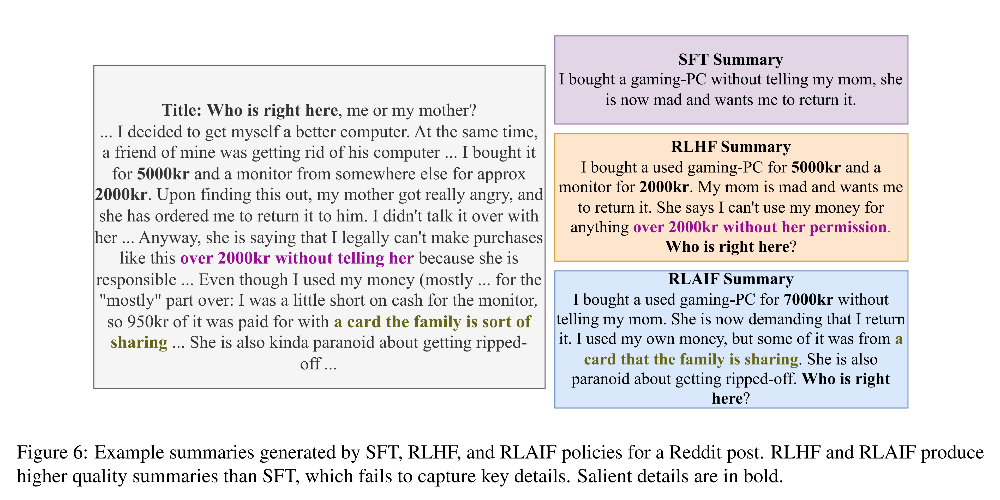
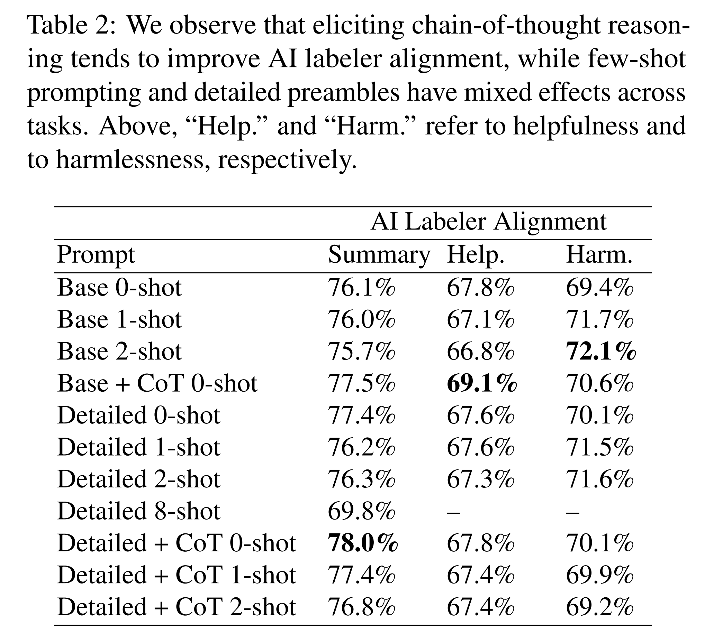
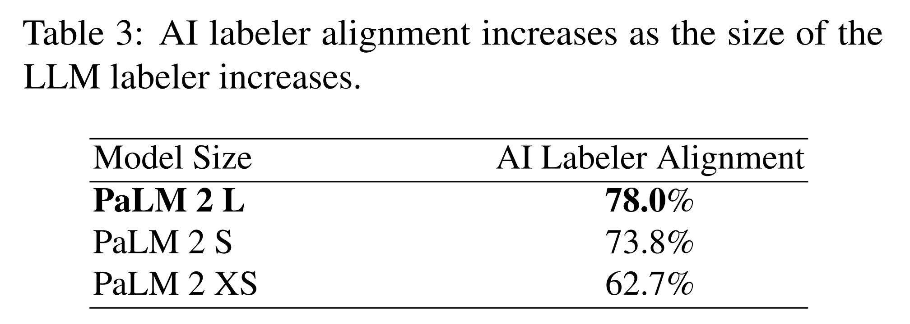

논문 및 이미지 출처 : <https://arxiv.org/pdf/2309.00267>

# Abstract

Human feedback 에 기반한 Reinforcement learning (RLHF) 은 large language model (LLM) 을 인간의 선호에 맞추는 데 효과적이라는 것이 입증되었지만, 고품질의 preference label 을 수집하는 것은 비용이 많이 든다. Bai et al. 이 제안한 **RL from AI Feedback (RLAIF)** 은 off-the-shelf LLM 이 생성한 preference 를 사용하여 reward model (RM) 을 학습하는 유망한 대안을 제시한다.

* Summarization, helpful dialogue generation, 그리고 harmless dialogue generation task 에서 RLAIF 는 RLHF 와 유사한 성능을 보인다. 
* 또한, 저자는 **self-improvement** 로의 한 걸음을 내딛으며, AI labeler 가 policy 와 동일한 크기이거나 심지어 initial policy 와 동일한 checkpoint 일 때조차 RLAIF 가 supervised fine-tuned baseline 을 능가할 수 있음을 보인다.

마지막으로, 저자는 RM 학습 과정을 생략하고 RL 중 off-the-shelf LLM 으로부터 directly reward 를 얻는 기법인 **direct-RLAIF** (d-RLAIF) 를 제안하며, 이는 기존 RLAIF 보다 우수한 성능을 달성한다. 이러한 결과는 RLAIF 가 human feedback 을 사용하는 경우에 필적하는 성능을 달성할 수 있으며, RLHF 의 확장성 한계를 해결할 수 있는 잠재적 해법임을 시사한다.

# 1. Introduction

Human feedback 에 기반한 **Reinforcement Learning (RLHF)** 은 language model 을 인간의 선호에 맞게 조정하는 효과적인 기법이다. RLHF 는 ChatGPT 및 Bard 와 같은 현대적 conversational language model 의 성공을 이끄는 핵심 요인 중 하나로 꼽힌다. Reinforcement Learning (RL) 을 사용하여 language model 을 학습하는 주요 이점은, 기존의 supervised fine-tuning (SFT) 방식으로는 미분 불가능한 복잡한 sequence-level objective 들을 최적화할 수 있다는 점이다.

그러나 RLHF 를 large-scale 로 적용하는 데에는 고품질의 human preference label 에 대한 의존도가 높은 것이 큰 장애물이다. 최근 large language model (LLM) 들은 인간의 판단과 높은 수준의 일치도를 보이고 있으며, 이는 LLM 이 생성한 preference label 이 human label 의 대체물로 활용될 가능성을 시사한다. Bai et al. 은 Reinforcement Learning from AI Feedback (RLAIF) 을 처음으로 탐구하였는데, 여기서 RL 은 human 과 AI preference 의 혼합 데이터로 학습된 reward model (RM) 을 사용하여 수행되었다. Constitutional AI self-revision 기법과 결합된 이 접근법은 conversational assistant 학습에서 supervised fine-tuning 을 능가하는 성능을 보였다. 그러나 human feedback 과 AI feedback 간의 효율성을 직접적으로 비교하지 않아, RLAIF 가 RLHF 의 적절한 대안이 될 수 있는지는 여전히 불분명했다.

본 연구에서는 summarization, helpful dialogue generation, harmless dialogue generation 의 세 가지 task 에 대해 RLAIF 와 RLHF 의 효과를 비교하였다 (Fig. 2). 

* 저자의 실험 결과, summarization 에서 human 평가자들은 RLAIF 와 RLHF 를 각각 71%, 73% 의 비율로 SFT baseline 보다 선호하였고, helpful dialogue generation 에서는 각각 63%, 64% 의 비율로 SFT 보다 선호하였다. 
* 두 경우 모두 RLAIF 와 RLHF 간의 차이는 통계적으로 유의하지 않았다. 또한 RLAIF 와 RLHF 를 직접 비교한 head-to-head 실험에서도 두 policy 간 선호도는 동등하게 나타났다.
* Harmless dialogue generation 에서는 human 평가자가 각 응답의 harmlessness 를 독립적으로 평가하였다. RLAIF 는 RLHF 보다 높은 harmless rate 을 기록하였으며, 두 방법 모두 SFT baseline 을 능가하였다 (각각 88%, 76%, 64%). 
  * 이러한 결과는 RLAIF 가 human annotation 에 의존하지 않으면서도 확장성 측면에서 매력적인 RLHF 의 대안이 될 수 있음을 시사한다.

또한 두 가지 추가 연구를 수행하였다.

1. LLM self-improvement 로의 진전으로서, AI labeler 가 policy model 과 동일한 크기일 때조차 RLAIF 가 SFT baseline 을 유의미하게 향상시킴을 보였다.
2. direct-RLAIF (d-RLAIF) 라는 새로운 기법을 제안하였다. 이는 reward model 학습 과정을 생략하고 RL 과정 중 off-the-shelf LLM 으로부터 직접 reward 를 획득하는 방법이다. 실험 결과, d-RLAIF 는 canonical RLAIF 와 동등하거나 더 나은 성능을 보였다. 특히 helpful dialogue generation task 에서, initial policy 와 reward 를 제공하는 LLM 이 동일한 checkpoint 일 때조차 성능 향상이 나타나, strict LLM self-improvement 의 사례를 보여주었다.

마지막으로, AI 가 생성한 preference 와 human preference 간의 alignment 를 극대화하기 위한 기법을 연구하였다. Chain-of-thought reasoning 을 유도하는 것이 alignment 를 지속적으로 향상시킴을 발견하였고, detailed preamble 과 few-shot prompting 은 특정 task 에서만 유의미한 개선을 보였다. 또한 LLM labeler 의 크기와 human preference alignment 간의 trade-off 를 분석하기 위해 scaling experiment 를 수행하였다.

본 연구의 주요 기여는 다음과 같다.

1. Summarization, helpful dialogue generation, harmless dialogue generation task 에서 RLAIF 가 RLHF 와 유사한 성능을 달성함을 보인다.
2. LLM labeler 가 policy 와 동일한 크기이거나 동일한 checkpoint 일 때에도 RLAIF 가 SFT policy 를 개선할 수 있음을 보인다.
3. RL 중 off-the-shelf LLM 으로부터 직접 reward 를 획득하는 direct-RLAIF (d-RLAIF) 를 제안하고, canonical RLAIF 와 동등하거나 더 우수한 성능을 달성함을 보인다.
4. AI 가 생성한 preference 와 human preference 간의 alignment 를 극대화하기 위한 기법을 분석한다.

# 2. Methodology

이 절에서는 LLM 으로 preference 를 생성하는 기법, reinforcement learning setup, 그리고 evaluation metric 을 설명한다. RLHF 의 기초는 Appendix A 에 제공한다.

## 2.1. Preference Labeling with LLMs

저자는 “off-the-shelf” LLM — 일반적 용도로 pre-trained 또는 instruction-tuned 되었지만 특정 downstream task 에 대해 fine-tuned 되지 않은 model — 을 사용하여 preference 를 주석화한다. 주어진 text 와 두 개의 candidate response 가 있을 때, LLM 에게 어떤 response 가 더 선호되는지 평가하도록 요청한다. Prompt 의 구조는 다음과 같다 (예시는 Tab. 15 와 Tab. 21 참조).

* **Preamble**: 현재 task 를 설명하는 소개 및 지시문
* **Few-shot exemplars (optional)**: 예시 input context, 두 개의 response, chain-of-thought rationale (optional), 그리고 preference label
* **Sample to annotate**: 라벨링할 input context 와 두 개의 response
* **Ending**: LLM 을 유도하는 마무리 text (e.g., “Preferred Response=”)

Prompt 를 LLM 에 제공한 뒤, tokens “1” 과 “2” 를 생성할 log-probability 를 추출하고, softmax 를 계산하여 preference distribution 을 얻는다.

LLM 으로부터 preference label 을 얻는 방법에는 다양한 대안이 있다. 예를 들어 자유 형식의 생성 응답에서 preference 를 추출하는 방법 (e.g., “The first response is better”), 혹은 preference distribution 을 one-hot encoding 으로 표현하는 방법이 있다. 그러나 저자는 구현이 간단하고, 분포적 표현을 통해 one-hot encoding 보다 더 많은 정보를 전달한다는 이유로 위의 방법을 선택한다.

저자는 두 가지 스타일의 preamble 을 실험한다. “*Base*” 는 본질적으로 어느 response 가 더 나은지 묻는 형태이고, “*Detailed*” 는 일반적으로 human annotator 에게 제공되는 상세한 rating instructions 를 닮았다 (summarization task 에서 사용한 preamble 은 Tab. 16 참조). 또한 in-context learning 을 실험하며, 다양한 주제를 포괄하도록 hand-crafted high-quality exemplar 를 사용한다.

### 2.1.1. ADDRESSING POSITION BIAS

LLM 에 candidate 를 제시하는 순서는 어떤 candidate 가 선호되는지에 bias 를 유발할 수 있다. 저자는 position bias 의 증거를 발견하며, 이는 특히 더 작은 LLM labeler 에서 두드러진다 (Appendix B 참조).

* Position bias 의 영향을 완화하기 위해, 각 candidate 쌍에 대해 두 번의 inference 를 수행한다. 
* 두 번째 inference 에서는 LLM 에 제시하는 candidate 의 순서를 뒤바꾼다. 
* 그런 다음 두 inference 의 결과를 평균하여 finaL preference distribution 을 얻는다.

### 2.1.2. ELICITING CHAIN-OF-THOUGHT REASONING

저자는 AI labeler 로부터 chain-of-thought (CoT) reasoning 을 유도하기 위해 two-step inference 절차를 실험한다. 

* 먼저, 표준 prompt 의 Ending 을 생각과 설명을 요구하는 문장으로 대체한다 (e.g., “각 summary 의 coherence, accuracy, coverage, overall quality 를 고려하고, 어느 것이 더 나은지 설명하라. Rationale:”). 
* 그리고 LLM 으로부터 response 를 decode 한다. 
* 다음으로, original prompt, 그 response, 그리고 standard Ending 문자열을 연결하여 Sec. 2.1 의 scoring 절차를 따라 preference distribution 을 얻는다. 

이 과정은 Fig. 3 이 설명한다.

* Zero-shot prompt 에서는 LLM 에 reasoning 이 어떤 형태여야 하는지의 예시를 제공하지 않는다. 
* Few-shot prompt 에서는 model 이 따를 수 있도록 CoT reasoning 의 예시를 제공한다. 

예시는 Tab. 17 과 Tab. 18 을 참조한다.

## 2.2. Reinforcement Learning from AI Feedback

### 2.2.1. CANONICAL RLAIF

이 절에서는 canonical RLAIF setup 에 대한 저자의 적용 방식을 설명한다. 별도로 언급되지 않는 한, RLAIF 는 이 방법으로 수행된다.

Reward model (RM) 은 Appendix A.2 의 방법론을 따르며 LLM 이 생성한 preference label 로 학습된다. 

* 저자의 접근법은 soft label (e.g., [0.6, 0.4]) 을 생성하므로, RM 은 RM 이 생성한 score 의 softmax 에 대해 cross-entropy loss 로 학습된다. 
* Softmax 는 RM score 을 확률 분포로 변환한다. 
* AI label 로 구성된 dataset 에 RM 을 학습하는 것은 model distillation 의 한 형태로 볼 수 있다.
* 마지막으로, Appendix A.3 에 기술된 바와 같이, RM 이 model response 에 reward 를 부여하도록 하여 reinforcement learning 을 수행함으로써 RLAIF policy model 을 학습한다.

### 2.2.2. DIRECT-RLAIF (D-RLAIF)

RLAIF 의 한 가지 문제는 policy 가 학습됨에 따라 reward model (RM) 이 “*stale*” 해질 수 있다는 점이다. 

일반적인 setup 에서 RM 은 initial policy 로부터 sampling 된 generation 으로 학습된다. 그러나 policy 가 점차 학습되면서 생성되는 trajectory 가 RM 학습 시의 dataset 분포에서 벗어나게 되고, 그 결과 성능이 저하된다. (Bai et al. 은 iterative RLAIF 를 제안하였는데, 이는 최신 policy 에 대해 주기적으로 새로운 RM 을 학습하는 방식이지만, 시간 소모가 크다.)

저자는 canonical RLAIF 의 단순한 대안으로 **direct-RLAIF (d-RLAIF)** 를 제안한다. 

* 이 방법은 LLM feedback 을 reinforcement learning 중 직접 reward signal 로 사용하는 것이다. 
* D-RLAIF 는 off-the-shelf LLM 이 학습 과정 없이 직접 생성된 response 에 점수를 부여하므로 RM staleness 문제를 해결한다. 
* 또한, AI preference labeling 과 RM 학습에 필요한 시간 소모적 과정을 제거한다. 

이 과정은 Fig. 4 에 설명되어 있다.

* D-RLAIF 에서 LLM 은 1 에서 10 사이의 점수로 generation 의 품질을 평가하도록 prompt 된다. 
* Sec. 2.1 과 유사하게, prompt 는 generation 을 평가하는 기준을 LLM 에 지시한다. 
* 이후 각 score token (1~10) 의 likelihood 를 계산하고, 이를 probability distribution 으로 정규화한다.
* Weighted score 는 다음과 같이 계산된다: $s(y|x) = \sum_{i=1}^{10} i P(i|y, x)$
* 마지막으로, score 는 $[-1, 1]$ 범위로 다시 정규화된다. 

Prompting 기법의 추가 세부 내용은 Appendix D 에 제시되어 있다.

이후 RL 은 canonical RLAIF 와 유사한 방식으로 수행되며, 단 RM score 대신 direct score 가 reward 로 사용된다.

## 2.3. Evaluation

저자는 세 가지 metric — **AI Labeler Alignment**, **Win Rate**, **Harmless Rate** — 으로 결과를 평가한다.

**AI Labeler Alignment** 는 AI-labeled preference 가 human preference 와 일치하는 정확도를 측정한다. single example 의 soft AI-labeled preference (e.g., [0.6, 0.4]) 는 binary representation ([1, 0]) 으로 변환된다. 이후 human preference 와 일치하면 1, 불일치하면 0 의 score 를 부여한다. 

Alignment 정확도 $z_{acc}$ 는 다음과 같이 정의된다.

$$
z_{acc} = \frac{1}{D} \sum_{i=1}^{D} \mathbf{1}[\argmax_j P^{AI}_{i,j} = p^H_i],
$$

* 여기서 $D$ 는 preference dataset size, 
* $P^{AI} \in \mathbb{R}^{D \times 2}$ 는 soft AI preference matrix, 
* $p^H \in \mathbb{R}^D$ 는 human preference vector 로, 각각 첫 번째 또는 두 번째 response 가 선호되는지를 0 또는 1 로 나타낸다.

---

**Win Rate** 는 두 policy 의 전반적인 품질을 평가하기 위한 지표로, human annotator 가 한 policy 의 output 을 다른 policy 보다 더 자주 선호하는 비율을 측정한다. 입력과 두 개의 generation 이 주어졌을 때, human annotator 는 더 선호하는 출력을 선택한다. Policy A 가 Policy B 보다 선호된 비율을 “A vs. B 의 win rate” 라 부르며, 50% 의 win rate 은 두 policy 가 동일하게 선호됨을 의미한다.

---

**Harmless Rate** 는 human evaluator 가 “무해하다고 판단한” 응답의 비율을 측정한다. 이 metric 은 harmless dialogue generation task 평가에 사용된다. 많은 응답이 동일하게 안전하다고 평가되는 경우가 많아 상대적 순위를 매기기 어렵기 때문이다.

# 3. Experimental Details

## 3.1. Datasets

저자는 다음 dataset 을 사용하여 실험을 수행한다.

* Reddit TL;DR — Reddit 게시물과 그 게시물에 대한 summary 로 구성된 dataset.
* OpenAI’s Human Preferences — Reddit TL;DR 의 일부 subset 으로부터 생성된 dataset. 각 예시는 게시물, 두 개의 candidate summary, 그리고 human annotator 가 어느 summary 를 선호하는지 표시한 rating 으로 구성된다.
* Anthropic Helpful and Harmless Human Preferences — human 과 AI assistant 간의 대화로 구성되며, 각 대화에는 human annotator 가 평가한 두 개의 가능한 AI 응답이 포함된다. 
  * Helpful task 의 경우 더 informative 하고 honest 한 응답, Harmless task 의 경우 더 안전한 응답이 선호된다.

Dataset 의 추가적인 세부 사항은 Appendix C 에 제시되어 있다.

또한 Stanford Human Preferences dataset 도 탐색하였으나, Appendix J 에서 설명한 length bias 수정 이후 RLHF 와 RLAIF policy 모두 SFT baseline 대비 의미 있는 향상을 보이지 않았다.

## 3.2. LLM Labeling

AI labeling 기법을 평가할 때 빠른 실험 반복을 가능하게 하기 위해, 각 preference dataset 의 training split 을 무작위로 downsample 하였다. Summarization task 에 대해서는 human annotator 가 높은 확신으로 한 summary 를 다른 것보다 선호한 예시만 포함하도록 추가적인 filtering 을 수행하였다. Downsampling 및 filtering 이후, 각 task 에 대해 약 3–4k 개의 예시가 남았다. AI labeler alignment 는 이 downsampled dataset 을 기반으로 계산되었다.

* Preference labeling 에는 PaLM 2 model family 를 사용하였다. 
* 모든 버전은 instruction-tuning 은 되어 있지만 RL 로 학습된 적은 없다. 
* 별도로 명시되지 않는 한, AI label 은 각 task 에 대해 Sec. 4.4 에 기술된 최적의 prompt 를 사용하여 PaLM 2 Large (L) 으로 생성하였다. 

LLM labeling 에 대한 자세한 내용은 Appendix D 에 제시되어 있다.

## 3.3. Model Training

모든 SFT model 은 PaLM 2 Extra-Small (XS) 로부터 초기화된다. Summarization task 에서는 PaLM 2 XS 를 Reddit TL;DR dataset 에 대해 fine-tuning 하여 SFT model 을 생성한다. 다른 모든 task 에 대해서는 task-specific fine-tuning 대신 instruction-tuned variant 의 PaLM 2 를 사용한다.

모든 RM 은 PaLM 2 XS checkpoint 로부터 학습된다. 각 RM 은 preference dataset 의 full training split 에 대해 fine-tuning 되며, AI feedback RM 의 경우 label 은 AI preference, human feedback RM 의 경우 label 은 human preference 이다. RM 의 정확도는 Appendix G 에 제시되어 있다.

RL 단계에서는, language modeling domain 에 맞게 수정된 *REINFORCE* 알고리즘을 사용하여 policy 를 학습한다 (Appendix E 참조). 최근 연구에서는 *Proximal Policy Optimization (PPO)* 을 주로 사용하지만, 본 연구에서는 단순하면서도 충분히 효과적인 REINFORCE with baseline 을 사용한다.

Policy 와 value model 모두 SFT model 로부터 초기화된다. Summarization task 에서는 Reddit TL;DR dataset 의 training split 을 사용하여 policy rollout 을 수행하며, 각 trajectory 의 initial state 는 Reddit post 자체이다. Helpful 및 harmless task 의 경우, initial state 는 해당 preference dataset 의 training split 에서 샘플링된다.

Summarization task 에 대해서는 RL 로 학습된 policy 가 생성한 response 에 간단한 post-processing 을 적용하며, 이는 Appendix H 에 설명되어 있다.

Model training 의 추가 세부 사항은 Appendix F 를 참조한다.

## 3.4. Human Evaluation

Win rate 을 측정하기 위해, 평가자에게 input context 와 서로 다른 policy (e.g., RLAIF, RLHF, SFT) 가 생성한 여러 response 가 제시된다. 평가자는 Fig. 5 와 같이, 동률 없이 응답의 품질 순서를 매기도록 요청받는다. Input context 는 각 dataset 의 test split 에서 추출되며, 이는 training 또는 다른 평가 단계에서 사용되지 않는다. 이렇게 얻은 ranking 을 바탕으로 policy 간의 win rate 을 계산한다.

Harmless dialogue generation task 의 경우, 평가자들은 각 response 를 독립적으로 “harmless” 또는 “harmful” 로 평가한다.

Human evaluation 에 대한 세부 사항은 Appendix I 에 제시되어 있다.

# 4. Results

## 4.1. RLAIF vs. RLHF

RLAIF 는 세 가지 task 모두에서 RLHF 와 동등하거나 더 나은 성능 향상을 달성한다 (Fig. 1 및 Tab. 1 참조). 구체적으로, summarization task 에서 human evaluator 들은 baseline SFT policy 보다 RLAIF 와 RLHF 를 각각 71%, 73% 의 비율로 선호하였다. Helpful dialogue generation task 에서는 각각 63%, 64% 의 비율로 선호되었다. RLAIF vs. SFT 와 RLHF vs. SFT 간의 win rate 차이는 통계적으로 유의하지 않았다. RLAIF 와 RLHF 를 직접 비교했을 때, 두 policy 간 선호도는 동일하게 나타났으며, 즉 win rate 은 50% 와 통계적으로 유의미한 차이를 보이지 않았다.

Harmless dialogue generation task 에서 RLAIF 는 88% 의 harmless rate 을 달성하며, RLHF (76%) 와 SFT (64%) 모두를 능가했다.

Fig. 6 은 SFT, RLAIF, RLHF 로 생성된 summary 예시를 보여준다. RLAIF 와 RLHF 의 차이를 더 깊이 이해하기 위해, 저자는 Sec. 5 에서 summarization task 에 대해 두 policy 가 생성한 응답을 질적으로 비교하였다.

* Stiennon et al. 의 연구와 유사하게, RLAIF 와 RLHF policy 는 SFT policy 보다 더 긴 응답을 생성하는 경향이 있음을 관찰하였다. 
  * 이는 human evaluation 에 bias 를 유발할 가능성이 있다. Length 를 통제하기 위한 사후 분석을 수행한 결과, 두 policy 는 여전히 SFT policy 보다 우수한 성능을 보였다 (Appendix J 참조).
* 또 하나의 자연스러운 질문은 human feedback 과 AI feedback 을 결합하는 것이 추가적인 가치를 가지는가이다. 
  * 저자는 두 종류의 feedback 을 결합한 실험을 수행했으나, human feedback 단독 사용을 넘어서는 개선은 관찰되지 않았다. 
  * 다만, 두 feedback 형태를 결합하여 더 나은 성과를 낼 수 있는 대안적 학습 구조가 존재할 가능성이 있으며, 이에 대한 논의는 Appendix K 에 제시되어 있다.
* 이러한 결과는 RLAIF 가 human annotation 에 의존하지 않는 RLHF 의 실질적 대안이 될 수 있음을 보여준다. 
  * Label 수집 시간을 단축할 뿐 아니라, AI labeling 의 또 다른 장점은 *비용 절감*이다. 
  * 저자는 LLM labeling 비용이 human annotation 대비 *10 배 이상 저렴*하다고 추정한다 (상세 분석은 Appendix L 참조).

## 4.2. Towards Self-Improvement

Sec. 4.1 의 실험에서는 preference labeling 에 사용된 LLM (PaLM 2 L) 이 학습되는 policy (PaLM 2 XS) 보다 훨씬 크다. 여기서 한 단계 더 나아가, 저자는 AI labeler 가 policy 와 동일한 크기일 때도 RLAIF 가 성능 향상을 달성할 수 있는지를 탐구한다.

Summarization task 에 대해, 저자는 PaLM 2 L 대신 PaLM 2 XS 를 AI labeler 로 사용하여 RLAIF 를 수행하였다. 나머지 setup 은 Sec. 4.1 의 실험과 동일하게 유지되었다. 이를 “same-size RLAIF” 라고 부른다.

* Same-size RLAIF 는 여전히 SFT baseline 대비 상당한 개선을 보였으며, human evaluator 들은 same-size RLAIF 를 SFT 보다 68% 의 비율로 선호하였다 (Tab. 1 참조). 
  * 참고로, policy 보다 큰 AI labeler 를 사용하는 RLAIF 는 71% 의 비율로 SFT 보다 선호되었다. 
  * 이 결과는 AI labeler 가 policy LLM 과 동일한 크기일 때에도 RLAIF 가 성능 향상을 이끌 수 있음을 보여준다.
* 다만, 이 실험은 “strict self-improvement” 의 예시는 아니다. AI labeler 는 instruction-tuned PaLM 2 XS 인 반면, initial policy 는 Reddit TL;DR summarization dataset 에 대해 fine-tuning 된 PaLM 2 XS 이기 때문이다. 
  * 그러나 저자는 다음 절에서 helpfulness task 에 대해 strict self-improvement 의 사례를 제시한다.

## 4.3. D-RLAIF

Sec. 4.1 및 4.2 에서는 AI feedback 을 reward model (RM) 에 distillation 하였다. 본 절에서는 summarization 과 helpfulness task 에 대해 d-RLAIF (Sec. 2.2.2 참조) 를 실험한다. 연산 비용을 줄이기 위해, 저자는 AI labeler 로 instruction-tuned PaLM 2 XS 를 사용한다.

* Summarization task 에서 human annotator 는 d-RLAIF 를 SFT 보다 74% 의 비율로 선호하였다 (Tab. 1 참조). 
* LLM feedback 을 직접 활용하는 것과 RM 으로 distillation 하는 것의 차이를 이해하기 위해, 저자는 Sec. 4.2 의 same-size RLAIF 와 결과를 비교한다. 
* 두 실험은 reward function 을 제외한 모든 설정이 동일하다. d-RLAIF 는 same-size RLAIF (68%) 보다 통계적으로 유의하게 높은 win rate 을 보였다. 
* 또한 두 결과를 나란히 제시했을 때, annotator 들은 d-RLAIF 를 same-size RLAIF 보다 60% 의 비율로 선호하였다.

저자는 이러한 개선이 RM 으로 preference 를 distillation 하지 않고 AI labeler 로부터 직접 preference 를 질의함으로써, 그리고 Sec. 2.2.2 에서 설명한 “staleness” 문제를 회피함으로써 이루어진 것으로 가설을 세운다.

* Helpful dialogue generation task 에서 d-RLAIF 는 SFT baseline 대비 66% 의 win rate 을 기록하였다. 
* 특히, feedback 을 제공하는 LLM 과 initial policy 가 동일한 model checkpoint 이므로, 이는 strict LLM self-improvement 의 명확한 사례를 구성한다.

## 4.4. Prompting Techniques

* 저자는 preamble specificity, chain-of-thought (CoT) reasoning, in-context learning 의 세 가지 prompting variation 을 실험하였다 (Tab. 2 참조). 
* Base prompt (“Base 0-shot”) 대비 최적의 prompt 는 summarization, helpfulness, harmlessness task 에서 각각 +1.9%, +1.3%, +1.7% 의 AI labeler alignment 향상을 보였다.
* Detailed preamble 은 summarization 에서는 alignment 를 개선하지만, helpful 및 harmless dialogue generation 에서는 혼합된 결과를 보였다. 
  * 저자는 summarization task 가 상대적으로 복잡하기 때문에 detailed preamble 의 효과가 크다고 가정한다. 
  * 반면 helpfulness 와 harmlessness 평가는 상대적으로 명확한 기준을 가지므로, 세부 지시문의 이점이 적을 수 있다.
* Chain-of-thought reasoning 은 전반적으로 alignment 를 향상시켰다. 
  * Summarization task 에서는 일관된 개선을 보였으며, helpful 및 harmless dialogue generation task 에서는 “Base” preamble 과 결합될 때만 alignment 향상을 보였다.
* 흥미롭게도, in-context learning 은 harmless dialogue generation 에서만 alignment 를 향상시켰다. 
  * Summarization 과 helpfulness task 에서는 exemplar 수가 증가할수록 alignment 가 점진적으로 감소하였다. 
  * Exemplar 선택이 부적절했을 가능성을 배제하기 위해, summarization task 에서 “Base 1-shot” 설정으로 10 회의 실험을 수행하였으며, 
  * 각 실험마다 서로 다른 exemplar 를 무작위로 선택하였다. 모든 실험 중 최대 AI labeler alignment 는 76.1% 로, 여전히 “Base 0-shot” 보다 낮았다.
* 저자는 summarization 과 helpful dialogue generation task 가 이미 off-the-shelf AI labeler 에 의해 충분히 이해되고 있기 때문에 exemplar 가 도움이 되지 않거나 오히려 혼란을 줄 수 있다고 가정한다. 
  * 또한 in-context learning 자체는 여전히 완전히 이해되지 않은 중요한 연구 영역이라는 점을 지적한다.

Summarization task 에 대해, 저자는 human inter-annotator agreement 와 비교하여 LLM labeler 의 절대적 성능을 평가하였다. Stiennon et al. 은 OpenAI human preference dataset 의 annotator 간 일치율을 73–77% 로 추정했으며, 저자의 off-the-shelf LLM 은 78% alignment 를 달성하여 절대적 기준에서도 우수한 성능을 보였다.

또한 저자는 self-consistency 를 실험하였다. 여기서는 temperature $T > 0$ 조건에서 여러 개의 CoT rationale 을 sampling 하고, LLM 이 생성한 preference distribution 들을 평균하여 최종 label 을 산출한다. 그러나 self-consistency 는 오히려 AI labeler alignment 를 악화시키는 것으로 나타났다 (Appendix M 참조).

저자는 AI labeler alignment 가 RLAIF policy 의 성능 향상에 직접적인 영향을 미친다고 가정한다. 이를 검증하기 위해, alignment score 가 서로 다른 두 AI label set 을 사용하여 두 개의 RLAIF policy 를 학습하였다. 결과적으로, alignment 가 높은 AI label 로 학습된 policy 가 유의미하게 높은 win rate 을 기록하였으며, 이는 저자의 가설과 일치한다. 다만, 본 연구에서는 두 policy 만 비교하였으므로, 확정적 결론을 도출하기 위해서는 더 체계적인 실험이 필요하다 (Appendix N 참조).

## 4.5. Size of LLM Labeler

* 대형 model 은 접근성이 낮고 실행 비용이 높다. Summarization task 에서 저자는 LLM 의 크기를 달리하여 preference labeling 을 수행하였으며, model size 와 alignment 간의 강한 양의 상관관계를 관찰하였다 (Tab. 3 참조).
* PaLM 2 L 을 PaLM 2 S 로 대체할 경우 alignment 가 4% 감소하였고, PaLM 2 XS 를 사용할 경우 추가로 11% 감소하였다. 이러한 추세는 다른 연구에서 관찰된 scaling behavior 와 일치한다 (Kaplan et al., 2020).
  * 이러한 경향의 한 요인은 단순한 model capability 의 감소 외에도, smaller LLM 이 larger position bias 를 보이는 경향이 있기 때문일 수 있다 (Appendix B 참조).
* 또 다른 관점에서 보면, AI labeler 의 크기를 확장함으로써 더 높은 품질의 preference label 을 생성할 수 있음을 시사한다. 
  * Canonical RLAIF 의 경우, AI labeler 는 한 번만 preference 예시 생성을 위해 사용되고 RL 학습 중에는 호출되지 않기 때문에, larger labeler 를 사용하는 것이 반드시 과도하게 비효율적이지는 않다.

# 5. Qualitative Observations

RLAIF 와 RLHF 의 차이를 보다 깊이 이해하기 위해, 저자는 summarization task 에서 두 policy 가 생성한 응답을 시각적으로 검토하였다. 두 policy 가 생성한 summary 는 대부분의 경우 유사하였으며, 이는 두 방법의 유사한 win rate 에 반영된다. 그러나 몇 가지 차이가 나타나는 패턴이 관찰되었다.

1. 일부 사례에서 RLHF 는 hallucination 을 일으키지만 RLAIF 는 그렇지 않았다. RLHF summary 의 hallucination 은 그럴듯하게 들리지만 원문과 일치하지 않았다. 
   * 예를 들어, Tab. 23 의 Example #1 에서 RLHF summary 는 작성자가 20세라고 언급하지만, 원문에는 해당 내용이 명시되거나 암시되지 않는다.
2. RLAIF summary 가 RLHF 보다 덜 유창한 경우도 관찰되었다. 
   * Tab. 24 의 예시에서, 세 개의 RLAIF summary 모두 run-on sentence 를 포함하고 있었다. 
   * 또한 RLAIF 응답이 문구를 반복하거나 원문의 의도를 정확히 전달하지 못하는 경우도 있었다. 예를 들어, 일부 summary 는 원문에 그런 질문이 포함되지 않았음에도 불구하고 “How do I get over this?” 라는 문장으로 끝났다.

저자는 70 개의 예시를 대상으로 소규모 평가를 수행하였다. Human annotator 들은 RLHF 와 RLAIF summary 를 accuracy, coverage, coherence 측면에서 블라인드 평가하여 순위를 매겼다. 그러나 두 방법 간의 점수 차이는 통계적으로 유의하지 않았다. 이러한 패턴이 large-scale 에서도 나타나는지를 규명하기 위해서는 보다 체계적인 분석이 필요하며, 이는 향후 연구로 남긴다.

# 6. Related Work

LLM 은 다양한 NLP task 에서 인상적인 성능을 보여왔다. 여러 task 에서 RL 은 효과적인 최적화 기법으로 부상하였으며, initial translation 및 summarization 연구에서는 자동 평가 metric 을 reward 로 사용하였다. 그러나 이러한 단순화된 reward formulation 은 인간의 품질 판단과 완전히 일치하지 않았다.

Human feedback-based RL 은 자연어 응답의 쌍 비교를 통해 reward model 을 학습하여 LLM 을 인간 선호에 직접 정렬시키는 기법으로 발전하였다. 이 접근법은 summarization, instruction following, dialogue, question answering 등 다양한 분야에서 성공적으로 적용되었다.

RL 의 안정성과 효율성 문제를 완화하기 위해, DPO (Rafailov et al., 2024) 는 학습 objective 를 classification loss 형태로 재정의하였고, RaFT 는 reward model 을 rejection-sampling fine-tuning 에 활용하였다.

LLM 은 data generation, augmentation, self-training 등 다양한 응용에서도 널리 사용되고 있다. 

* Bai et al. (2022b) 은 LLM 과 human label 을 함께 사용하여 helpfulness 와 harmlessness 두 objective 를 공동 최적화하는 RLAIF 개념을 제안하였다. 
* 이후 연구들은 LLM 으로부터 직접 reward signal 을 생성하는 관련 기법을 탐구하였다. 이러한 연구들은 LLM 이 RL fine-tuning 에 유용한 signal 을 생성할 수 있음을 보여주며, 본 연구의 동기 — 즉, LLM 이 human 대신 preference label 수집에 실질적인 대안이 될 수 있는가 — 에 영감을 주었다.

# 7. Conclusion

본 연구는 RLAIF 가 세 가지 text generation task 에서 RLHF 와 비슷한 수준의 성능 향상을 달성함을 보였다. Head-to-head 비교에서도, human evaluator 들은 RLAIF 와 RLHF 를 유사한 비율로 선호하였다.

또한, LLM self-improvement 의 증거를 제시하였다. 즉, AI labeler 가 policy 와 동일한 크기이거나, 심지어 initial policy 와 동일한 checkpoint 일 때조차 RLAIF 가 효과적으로 작동함을 보였다.

아울러, LLM 의 reward 를 RL 중 직접 활용하는 direct-RLAIF (d-RLAIF) 를 제안하였으며, 이는 LLM preference 를 별도의 RM 으로 distillation 하는 canonical RLAIF 설정보다 더 나은 성능을 보였다.

마지막으로, 다양한 AI labeling 기법이 human preference 와의 alignment 에 미치는 영향을 분석하였다.

RLAIF 는 human feedback 의 비용 및 확장성 한계를 극복할 수 있는 잠재적 대안으로서 큰 가능성을 보여준다. 향후 연구에서는 RLAIF 를 model-based RL 환경으로 확장하여 human 과 assistant 모두를 LLM 으로 모델링하는 방법, 또는 AI feedback 을 세밀한 credit assignment 에 활용하는 방법 등을 탐구할 예정이다.
