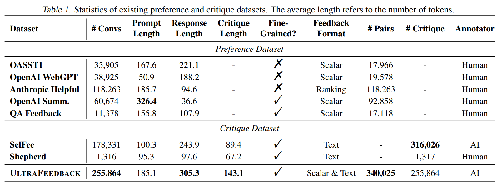
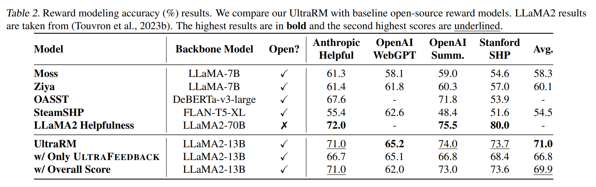
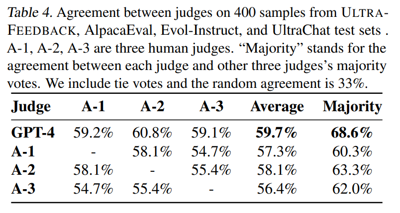
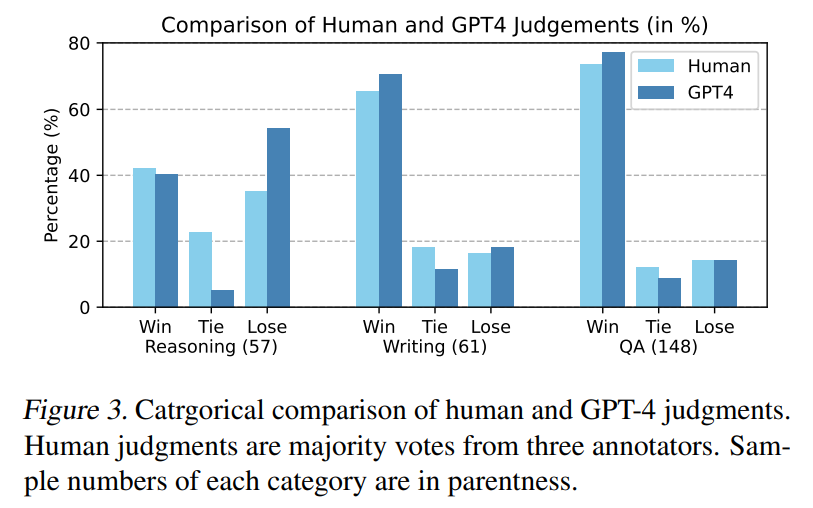
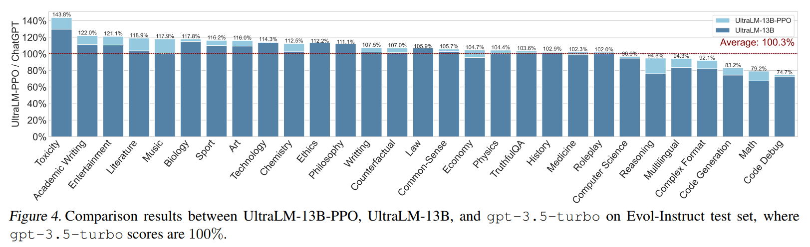

논문 및 이미지 출처 : <https://arxiv.org/pdf/2310.01377>

# Abstract

Human feedback 으로부터 학습하는 것은 large language model (LLM) 을 인간의 선호에 맞게 정렬시키는 핵심 기술로 자리 잡았다. 그러나 large-scale 이면서도 high-quality human feedback 을 수집하는 과정은 시간, 노동, 그리고 인간의 한계에 의해 제약을 받으며, 그 결과 현재의 dataset 은 규모가 작거나 주제가 제한적이다. 이러한 한계는 feedback learning 및 open-source 커뮤니티 내 alignment 연구를 모두 저해한다.

이 문제를 해결하기 위해, 본 연구는 human feedback 을 넘어 자동으로 high-quality **AI feedback** 을 수집하는 scalable 대안을 탐구한다. 

* 구체적으로, 저자는 feedback data 가 효과를 발휘하기 위한 핵심 요인으로 **scale** 과 **diversity** 를 식별한다. 
* 이에 따라, 더 넓은 범위의 user-assistant interactions 를 포괄하기 위해 instruction 과 response 를 양적으로, 그리고 주제적으로 확장한다. 
* 또한 annotation bias 를 완화하여 더 신뢰할 수 있는 AI feedback 을 얻기 위해 일련의 정교한 기법을 적용한다.

최종적으로, 저자는 **ULTRAFEEDBACK** — 250k 개의 user-assistant 대화에 대해 100만 개 이상의 GPT-4 feedback 을 포함하는 large-scale , high-quality, 그리고 다양성이 확보된 AI feedback dataset — 을 제시한다. 

ULTRAFEEDBACK 에 기반하여, 저자는 best-of-n sampling 및 reinforcement learning 을 통해 LLaMA 기반 model 을 정렬시켰으며, chat benchmark 에서 탁월한 성능을 입증하였다.

본 연구는 large-scale AI feedback data 가 강력한 open-source chat language model 구축에 효과적임을 검증하며, 향후 feedback learning 연구를 위한 견고한 기반을 제공한다.

# 1. Introduction

Large language model (LLM) 은 유창한 text 생성뿐 아니라 다양한 언어 중심 task 를 해결하는 능력을 보여왔다. 이러한 LLM 은 large-scale corpus 에 대해 likelihood maximization 기법으로 학습되어, 사용자 지시에 반응하여 다양한 task 를 수행할 수 있는 능력을 갖추었다. 그러나 imitation learning 에만 의존한 학습은 잘 알려진 문제를 야기한다 — 즉, LLM 은 설득력 있게 들리지만 실제로는 잘못되거나 안전하지 않은 content 를 생성하며, 이는 인간의 선호와 어긋날 수 있다.

LLM 을 인간의 선호에 더 잘 정렬시키기 위해 learning from human feedback 이 제안되었고, 주요 기업들에 의해 널리 채택되었다. 그러나 지금까지 feedback learning 은 주로 closed-source model 에 적용되어 왔으며, open-source model 에서는 거의 활용되지 않았다.

Open-source 커뮤니티에서 feedback learning 의 구현을 방해하는 요인은 여러 가지가 있으나, 그 중 가장 근본적인 문제는 data 이다. 

* 동일한 prompt 에 대해 서로 다른 response 를 평가하고 비교하는 preference data 는 feedback learning 의 핵심이다. 충분한 규모로 확장된 preference data 는 annotator 의 내재적 가치 판단을 반영할 수 있다. 
* 이러한 annotator 는 일반적으로 가장 유연하고 정확한 감독 신호를 제공할 수 있는 인간으로 가정되지만, 인간이 생성할 수 있는 data 는 resource, time, knowledge 제약으로 인해 심각하게 제한된다. 
* 그 결과, 기존의 preference dataset 은 소규모이거나, specific task 에만 한정된 형태를 보인다. 따라서 preference data 를 더 효율적이고 체계적으로 확장하는 방법이 필요하다.

본 연구는 feedback data 의 효율적인 확장을 목표로 한다. 이를 위해 저자는 human annotator 를 advanced LLM 으로 대체하는 AI feedback 을 탐구한다. AI feedback 은 human feedback 과 비교할 때 확장성(scalability) 면에서 명확한 이점을 지닌다. 즉,

1. 수집과 확장이 용이하고 비용이 낮으며,
2. LLM 의 능력이 향상될수록 feedback 의 품질도 향상된다.

기존 연구에서는 advanced AI system 이 chatbot 평가를 수행하거나, textual critique 를 생성하거나, human annotator 를 보조할 수 있음을 보였다. 그러나 open-source LLM 은 아직 feedback learning 관점에서 AI feedback 의 이점을 제대로 활용하지 못했다.

저자는 이러한 한계를 극복하기 위해 포괄적 AI feedback 수집 파이프라인을 구축하였다. Scalability 뿐 아니라, instruction 과 response 의 **diversity** 을 확보하여 보다 전면적인 language model alignment 를 지향한다. 구체적으로, 저자는

* 6만 개 이상의 다양한 instruction 과,
* 여러 source 의 17 개 model 로부터 폭넓은 주제와 품질의 comparative conversation 을 수집하였다.

또한 annotation bias 를 완화하고 feedback quality 를 극대화하기 위해 다음과 같은 기법을 적용하였다.

1. Annotation 문서를 instruction-following, truthfulness, honesty, helpfulness 의 4 가지 측면으로 분해하여 모호성을 감소시킴.
2. 객관적 평가 기준과 reference response 를 제공하여 score calibration 을 수행.
3. GPT-4 에게 score 를 부여하기 전에 chain-of-thought (CoT) 기반의 textual critique 를 생성하도록 요청.

이러한 절차를 모두 통합하여, 저자는 **ULTRAFEEDBACK** — open-source LLM alignment 를 위한 million-scale AI feedback dataset — 을 구축하였다.

* **ULTRAFEEDBACK** 을 기반으로, 저자는 LLaMA2-13B model 을 fine-tuning 하여 최첨단 reward model, UltraRM 을 구축하였으며, 이는 기존 open-source reward model 들을 크게 능가한다. 
* **UltraRM** 을 활용하여 powerful open-source model 인 UltraLM 을 best-of-$n$ sampling 및 PPO 로 향상시켰고, 두 방식 모두 모델 성능을 현저히 개선하였다. 
* 또한 model response 를 평가하고 비판할 수 있는 critique model 도 추가로 fine-tuning 하였다. 
* 더불어 AI feedback 과 human feedback 간의 일관성과 불일치를 정량적으로 분석하였다.

요약하면, 본 연구의 기여는 다음과 같다.

1. 저자의 지식으로는, scaled AI feedback 이 open-source chat LLM 의 성능을 향상시킬 수 있음을 처음으로 실증하였다.
2. high-quality·다양화된 AI feedback 을 large-scale 로 수집하는 체계적 파이프라인을 구축하였다.
3. Dataset, reward model, critique model 을 포함한 feedback learning 연구용 자원 세트를 공개하였다.

# 2. ULTRAFEEDBACK

## 2.1. Overview

Supervised fine-tuning 의 data engineering 원칙에서 영감을 받아, 저자는 preference data 의 generalizability 를 결정짓는 핵심 요인으로 scalability 와 diversity 를 식별하였다. 기존 preference data 는 이 두 요인 중 하나만 충족하는 경향이 있다고 주장한다.

구체적으로, human feedback 수집은 일반적으로 human annotator 가 두 개의 completion 을 비교하는 방식에 의존한다. 따라서 open-source 연구자들에게는 시간과 예산 제약으로 인해 data 를 large-scale 로 확장하기 어렵다. 반면, 기존의 AI feedback 접근법은 human involvement 를 줄이고, 고성능 LLM 을 활용하여 scalability 를 확보하지만, 특정 domain 또는 특정 형식에 한정되어 있어, 보다 폭넓은 맥락에서 LM 성능을 향상시키는 데 필요한 diversity 가 부족하다.

이러한 한계를 극복하기 위해, 저자는 preference data 수집 과정의 세 단계 — instruction 수집, completion sampling, comparison annotation — 모두에서 scalability 와 diversity 를 고려한다. 전체 데이터 수집 파이프라인의 개요는 Fig. 1 에 제시된다.

1. 먼저, 저자는 LLM 의 능력을 강화하기 위해 다음 네 가지 측면에서 large-scale 이면서도 다양화된 instruction set 을 수집한다.
   1. Follow Instructions: LLM 은 사용자의 요구 사항에서 벗어나지 않고 응답해야 한다.
   2. Helpful and Informative: LLM 은 주어진 문제에 대해 유용하고 정확한 답변을 제공해야 한다.
   3. Truthful: LLM 의 output 은 instruction 및 실제 지식에 기반해야 하며, 자기모순을 피해야 한다.
   4. Honesty: LLM 은 자신이 아는 것과 모르는 것을 구분하고, 불확실성을 명확히 표현해야 한다.
2. 두 번째 단계에서는, 비교 응답 간의 동질성(sameness) 을 피하기 위해, 서로 다른 capability 수준의 여러 model 로 구성된 completion sampling pool 을 구축한다.
3. 마지막으로, 기존 human feedback 연구에서 제기된 scalability (Nakano et al., 2021; Stiennon et al., 2020) 와 quality (Ethayarajh et al., 2022) 문제를 극복하기 위해, 저자는 GPT-4 로부터 scalable AI feedback 을 수집하고, reliability 향상을 위한 다양한 기법을 탐색한다.

다음 절에서는 이러한 data construction pipeline 을 단계별로 상세히 설명한다.

## 2.2. Instruction Collection

저자는 language model 의 네 가지 핵심 능력 — instruction-following, truthfulness, honesty, helpfulness — 을 목표로 하는 instruction 을 선정하였다. 구체적으로,

* Truthfulness: TruthfulQA 및 FalseQA training set 의 모든 instruction 을 포함하였다.
* Instruction-following 및 Helpfulness: Evol-Instruct 에서 10k 개, UltraChat 에서 10k 개, ShareGPT 에서 20k 개를 무작위로 샘플링하였다.
* Task diversity 향상을 위해, 다양한 NLP task 를 포함하는 FLAN dataset 을 추가로 포함하였다.

Sampling 은 Mukherjee et al. (2023) 을 따라 stratified sampling 전략을 사용하였다.

* *CoT* subset 에서는 3k 개의 instruction 을 무작위로 선택하였고,
* 나머지 세 subset 에서는 각 task 당 10 개의 instruction 을 샘플링하였다.
* 과도하게 긴 instruction 은 제외하였다.

특히 honesty 는 TruthfulQA 와 FLAN dataset 을 기반으로 평가된다. 두 dataset 모두 reference answer 를 포함하므로, annotator 가 LLM 의 불확실성 표현이 실제 정확성과 일치하는지를 판단하기 용이하다.

그 후 data contamination detection 을 수행하였다 (Appendix B 참조).

최종적으로, 저자는 여섯 개의 공개된 high-quality dataset 으로부터 총 63,967 개의 다양한 instruction 을 확보하였다.

## 2.3. Completion Sampling

수집된 response 가 충분히 비슷하지 않고(dissimilar), 고르게 분포(well-distributed) 되도록 보장하기 위해, 저자는 여러 model 을 포함하여 각 instruction 에 대한 completion 을 생성하였다. 

Dataset 내에서 text style 과 response quality 간의 spurious correlation 을 줄이기 위해, 저자는 서로 다른 series, size, architecture, training data 를 가진 다양한 model 을 선택하는 intervention 전략을 적용하였다. 이 접근법은 동일한 text style 도 model size 에 따라 서로 다른 품질 수준의 response 를 생성할 수 있게 하며, 특정 text style 이 항상 높은 품질과 연관되는 잘못된 상관관계가 형성되는 것을 방지한다.

구체적으로, 저자는 총 17 개의 model pool 을 구성하였다.

1. 상용 모델 (Commercial models): GPT-4, gpt-3.5-turbo (ChatGPT), Bard
2. LLaMA-series: UltraLM-13B/65B, WizardLM-7B-v1.1 / 13B-v1.2 / 70B-v1.1, Vicuna-33B-v1.3, LLaMA2-7B / 13B / 70B-Chat, Alpaca-7B
3. Non-LLaMA series: MPT-30B-Chat, Falcon-40B-Instruct, StarChat, Pythia-12B

각 instruction 에 대해 pool 에서 무작위로 4 개의 model 을 선택하여 completion 을 생성하였다.

다양성을 더욱 높이기 위해, 저자는 instruction completion 이전에 서로 다른 principle 을 부여하여 model behavior 를 달리 유도하였다. 

* Sun et al. (2023) 및 Mukherjee et al. (2023) 을 따라, 각 측면에 대해 human-handcrafted principle 을 하나 작성한 뒤, GPT-4 를 호출하여 해당 예시를 기반으로 10 개의 추가 principle 을 자동 생성하였다. 
* Dataset 특성에 따라 각 data source 에는 상이한 principle prompt 가 부여되었으며, 각 completion 마다 하나의 principle 을 무작위로 샘플링하여 system prompt 에 추가하였다. 

Principle 예시는 Appendix G.1 에 제시되어 있으며, 그 효과는 Fig. 6 에 시각화되어 있다.

## 2.4. AI Feedback Annotation

총 63,967 개의 instruction 에 대해 255,864 개의 completion 을 생성한 후, 저자는 GPT-4 를 사용하여 각 completion 에 대해 두 가지 유형의 feedback 을 제공하도록 하였다.

1. Scalar score — 여러 측면에서 세밀한 품질을 나타내는 수치형 점수
2. Textual critique — 각 completion 의 개선 방향에 대한 구체적 서면 피드백

그 결과 총 100만 개 이상의 feedback data 가 생성되었다.

#### Preference Annotation

GPT-4 annotation 의 주관성(subjectivity) 과 무작위성(randomness) 을 완화하기 위해, 저자는 annotation 품질을 높이는 네 가지 기법을 적용하였다.

1. Decomposition — 전체 품질 평가를 instruction-following, truthfulness, honesty, helpfulness 의 네 가지 세부 측면으로 분해하여 모호성을 줄임.
2. Standard — 각 측면에 대해 1~5 점 척도에 대한 구체적 문서를 제공하여 GPT-4 가 일관된 기준으로 평가하도록 함 (예시는 Appendix G.2 참조).
3. Reference — 평가의 일관성을 유지하기 위해, 하나의 instruction 과 그에 대한 네 개의 completion 을 하나의 prompt 로 묶어 동시에 평가하도록 함으로써 randomness 감소.
4. Rationale — GPT-4 가 각 completion 에 점수를 부여할 때, 문서의 기준에 따라 해당 점수를 부여한 이유를 chain-of-thought 형태로 설명하도록 요구함.

이 네 가지 절차를 결합하여, 각 response 마다 4 개의 세부 scalar score 와 대응 rationale 을 획득하였다.

#### Critique Generation

Scalar reward 외에도, 저자는 GPT-4 로부터 textual critique 를 수집하였다. GPT-4 는 tutor 역할로 prompt 되어, 각 completion 을 개선하기 위한 구체적 제안을 생성하도록 유도되었다. Critique 는 정답을 제시하는 대신, 개선 방향에 초점을 맞춘다. 이 과정은 비교 중심 annotation 과는 별도로 수행되며, 각 completion 에 대해 개별적으로 전체적 관점에서 작성된다. 관련 prompt 는 Appendix G.2 에 수록되어 있다.

## 2.5. Dataset Statistics

ULTRAFEEDBACK 을 기존 open-source dataset 과 비교한 결과는 Tab. 1 에 요약되어 있다. 

* LTRAFEEDBACK 은 규모 면에서 가장 크며, preference 및 critique dataset 모두에서 기존 dataset 보다 두 배 이상 큰 규모를 보였다. 
* 또한 completion 과 critique 의 text 길이도 가장 길었다.
* 특히 ULTRAFEEDBACK 은 scalar preference 와 textual feedback 을 모두 제공하는 유일한 dataset 으로, preference dataset 과 critique dataset 의 역할을 동시에 수행할 수 있다. 
* 결과적으로 ULTRAFEEDBACK 은 규모(scale) 와 다양성(diversity) 두 측면 모두에서 기존 dataset 을 능가하며, Sec. 3 에서 실험적으로 그 품질을 검증한다.

## 2.6. ULTRAFEEDBACK-Powered Models

ULTRAFEEDBACK 을 기반으로, 저자는 두 개의 model 을 개발하였다.

1. UltraRM — user instruction 에 따른 AI response 의 품질을 평가하는 open-source reward model
2. UltraCM — textual feedback data 로 학습된 critique model

이들은 human 및 AI assistant 와의 interactions 를 더 유연하게 수행할 수 있다.

#### UltraRM

Reward modeling 을 위해, UltraRM 은 LLaMA2-13B 을 기반으로 학습되었다. 저자는 세 가지 버전의 UltraRM 을 학습하였으며, ULTRAFEEDBACK 과 여러 open-source dataset 을 혼합하여 사용하였다. 사용된 open dataset 은 Stanford SHP, OpenAI Summarization, Anthropic Helpful 이다.

ULTRAFEEDBACK 의 품질을 검증하기 위해, dataset 의 fine-grained score 만을 사용하여 학습한 모델을 별도로 훈련하였다. 

* 여기서 각 측면의 preference score 를 평균하여 final reward score 을 계산하였다. 
* 또한, fine-grained score 와 overall score 의 효과를 비교하기 위해, fine-grained score 를 critique generation 의 assessment rating 으로 대체한 버전도 학습하였다. 

Dataset 처리 세부 사항은 Appendix E.1 에 기술되어 있다. Training objective 및 hyperparameter 설정은 Touvron et al. (2023b) 과 동일하게 유지하였다.

#### UltraCM

Textual feedback 학습을 통한 연구를 촉진하기 위해, ULTRAFEEDBACK critique data (총 255,864 texts) 로 UltraCM 을 학습하였다. UltraCM 은 UltraRM 과 동일한 초기화 상태에서 시작하였으며, critique data 만으로 fine-tuning 되었다.

주어진 response 에 대해 UltraCM 은 critique 을 수행하고, 오류를 식별하며, 개선 방향을 제안한다. 이는 향후 textual feedback 기반 학습 연구를 위한 핵심 기반 모델로 사용될 수 있다.

# 3. Experiments

AI feedback 의 효과를 검증하기 위해, 저자는 다음과 같은 순서로 실험을 수행하였다.

먼저 Sec. 3.1 에서 UltraRM 의 성능을 human preference benchmark 에서 평가한다. 그다음 Sec. 3.2 와 Sec. 3.3 에서, UltraRM 을 활용한 두 가지 chat language model 개선 전략 — best-of-n sampling 과 reinforcement learning — 을 검증한다. 마지막으로, Appendix E.3 에서 UltraCM 의 feedback 품질을 평가한다.

## 3.1. Reward Modeling

#### Setup

UltraRM 이 human preference 와 얼마나 일치하는지를 평가하기 위해, 네 개의 human-annotated preference dataset 에 대해 실험을 수행하였다.

* OpenAI WebGPT (Nakano et al., 2021)
* OpenAI Summarization (Stiennon et al., 2020)
* Anthropic HH-RLHF (Bai et al., 2022a)
* Stanford SHP (Ethayarajh et al., 2022)

각 dataset 에 대해, 동일한 prompt 에 대한 두 response 의 reward 를 계산하고, 어떤 response 가 더 선호되는지를 예측하였다.

* 비교 대상으로는 UltraRM 의 세 가지 변형 — UltraRM-UF, UltraRM-Overall, UltraRM (mixed) — 과 여러 open-source baseline model 들을 포함하였다.
* Baseline 으로는 Moss, Ziya, OASST 2, SteamSHP 를 사용하였고, 추가로 LLaMA2 의 결과도 보고하였으나, 해당 reward model 은 공개되어 있지 않다.

#### Results

Preference prediction accuracy 결과는 Tab. 2 에 요약되어 있다. 

* UltraRM 시리즈는 all open-source baseline reward model 을 큰 차이로 능가하였으며, closed LLaMA2 reward model (larger scale) 을 제외하면 최고 성능을 기록하였다.
* 특히 open-source dataset 을 혼합하지 않은 UltraRM-UF 단독 모델조차도 다른 모든 baseline 을 초과하는 성능을 보였다. 
  * 이는 ULTRAFEEDBACK dataset 이 human preference 와 높은 일관성을 가지며, 그 품질과 다양성(diversity) 이 강력한 out-of-distribution generalization 을 가능하게 함을 보여준다.
* 평균적으로, ULTRAFEEDBACK 만으로 학습된 UltraRM 은 open-source baseline 대비 약 6.3%p 높은 정확도를 보였다.
* 또한 open-source dataset 을 함께 혼합했을 때, ULTRAFEEDBACK 의 overall score 와 fine-grained score 를 각각 사용한 모델은 추가로 3.1%p, 4.2%p 향상을 보였다.

OpenAI WebGPT dataset 은 training/test split 이 존재하지 않으며, 대부분의 baseline 과 UltraRM 모두 이 dataset 에 대해 학습되지 않았기 때문에, reward model 의 일반화 성능(generalization ability) 을 평가하기 위한 공정한 기준으로 사용된다. UltraRM 시리즈는 해당 benchmark 에서도 현저히 뛰어나, baseline 대비 절대 2.6%p 개선을 보였다.

또한 open-source dataset 을 추가하더라도 WebGPT 성능 향상은 미미했는데, 이는 ULTRAFEEDBACK 의 높은 transferability 를 다시 한 번 입증한다.
Stanford SHP benchmark 에서도 UltraRM 은 매우 우수한 성능을 달성하였다.

흥미로운 점은, 다른 세 dataset 에서는 유사한 성능을 보이지만, overall score 로 학습된 reward model 이 WebGPT 에서 다른 두 변형보다 현저히 낮은 성능을 보였다는 것이다. 이에 대한 가능한 설명은 두 가지이다.

1. Fine-grained annotation 은 model output 을 여러 측면에서 세밀하게 평가하므로, 전체 점수 하나로 평가하는 aggregated annotation 보다 훨씬 정밀한 품질 판단을 제공한다.
2. Overall score annotation 과정에서는 각 sample 이 개별적으로 GPT-4 에 전달되지만, fine-grained rating 에서는 네 개의 completion 을 동시에 평가하므로 cross-reference 효과가 발생하여 일관되지 않은 기준을 방지하고 randomness 를 줄일 수 있다.

이러한 우위는 fine-grained preference data 의 높은 품질을 입증하며, 저자는 향후 연구에서 fine-grained annotation schema 와 동시 다중 completion 평가 방식을 채택할 것을 제안한다.

## 3.2. Best-of-n Experiments

#### Setup

UltraRM 이 response 품질의 신뢰할 만한 지표로 작동하는지를 검증하기 위해 best-of-n experiment 를 수행하였다.

AlpacaEval benchmark 에서, 저자는 UltraLM-13B 로부터 16 개의 completion 을 무작위로 sampling 하고, 각 completion 에 대해 UltraRM 으로 reward 를 계산하였다. 이후 best-of-$\{1, 2, 4, 8, 16\}$ completion 중 최고 점수를 얻은 response 를 최종 출력으로 선택하였다. Sampling parameter 는 temperature $= 1$, top-$p = 1$ 로 설정하였다.

#### Results

결과는 Fig. 2 에 제시되어 있다. 

AlpacaEval 에서 reward 가 증가함에 따라 win rate 도 비례적으로 증가함을 확인할 수 있었다. 이는 UltraRM 이 response 품질을 엄격하고 일관되게 반영하는 신뢰성 높은 reward signal 을 제공함을 입증한다.

특히 best-of-n sampling 은 매우 효과적이었다.

* 초기 UltraLM-13B 는 single sampling 시 76.53% win rate 을 기록하였고, 단순히 best-of-2 sampling 을 적용했을 때 84.64% 로 향상되었다.
* sample 수를 늘릴수록 더 high-quality response 를 선택할 수 있었으며,  최종적으로 best-of-16 설정에서는 91.54% win rate 에 도달하였다.

Best-of-n sampling 은 추가적인 학습 없이도 적용 가능한 범용적 성능 향상 전략이며, 다양한 model 및 task 에서 동일하게 유효하다. 구체적 예시는 Appendix F.2 에 제시되어 있다.

## 3.3. PPO Experiments

#### Setup

최신 UltraRM 을 활용하여 open-source chat language model 의 상한선을 높이기 위해, 저자는 RLAIF 기반 PPO (Proximal Policy Optimization) 를 적용하였다.

* 구체적으로, UltraLM-13B 에 PPO 를 수행하여 UltraLM-13B-PPO 를 얻었다. 
* ULTRAFEEDBACK 의 prompt 를 사용하여 80 iteration 동안 학습하였으며, 각 iteration 마다 512 개의 sample 을 수집하고, mini-batch size $= 64$ 로 policy model 을 업데이트하였다. 
* Learning rate 는 $1\times10^{-6}$ 으로 고정하였다.

#### Baselines

UltraLM-13B-PPO 는 다음과 같은 주요 open-source 및 상용 model 과 비교되었다.

* Open-source models: LLaMA2-Chat, Vicuna, WizardLM, OpenChat
* Proprietary model: ChatGPT

#### Benchmarks

세 가지 공개 benchmark 에 대해 평가를 수행하였다.

* AlpacaEval
* Evol-Instruct
* UltraChat

각 benchmark 에서 동일한 instruction 이 주어졌을 때, GPT-4 가 두 response 중 더 우수한 것을 판별하였다.

* AlpacaEval 은 text-davinci-003 과 비교하였고,
* Evol-Instruct 및 UltraChat 에서는 gpt-3.5-turbo 와 비교하였다.

비교 시 position bias 를 방지하기 위해 response 순서를 무작위로 변경하였다. 모든 model 은 동일한 decoding parameter (temperature $= 0.7$, top-$p = 1$) 를 사용하였다.

#### Results

결과는 Tab. 3 에 제시되어 있다. AlpacaEval leaderboard 의 공식 baseline 결과를 인용하였고, 나머지 benchmark 는 직접 평가하였다.

* 종합적으로, UltraLM-13B-PPO 는 세 benchmark 평균 최고의 win rate 을 기록하며, 모든 open-source model 을 능가하였다.
  * 특히 LLaMA 계열 model 중 UltraLM-13B-PPO 는 평균적으로 최소 3.6%p 높은 성능을 달성하였다.
* 또한, 훨씬 large-scale 인 LLaMA2-70B-Chat 과 비교하더라도 UltraLM-13B-PPO 가 여전히 우위를 점하며, RLAIF alignment 의 큰 효과를 보여주었다.
* UltraLM-13B-PPO 는 또한 Evol-Instruct 와 UltraChat 두 benchmark 에서 gpt-3.5-turbo 를 상회하는 최고 win rate 을 달성하였다.
  * 특히, original UltraLM-13B 대비 PPO 과정으로 인해 16.8%p 의 성능 향상이 발생하였다.

구체적 예시는 Appendix F.3 에 수록되어 있다.

# 4. Agreement with Human Preferences

Human preference 의 포괄성(inclusivity) 은 포착하기 어려운 것으로 알려져 있다. AI feedback 에 크게 의존하는 상황에서, AI 와 human preference 간의 consistency 를 정량적으로 측정하고 모니터링하는 것은 필수적이다.

본 절에서는 다음 두 가지를 분석한다.

1. AI annotation 이 human preference 와 얼마나 일관되는가 (Sec. 4.1)
2. AI 평가가 얼마나 신뢰할 수 있는가 (Sec. 4.2)

## 4.1. Annotation Consistency

Sec. 3.1 에서, ULTRAFEEDBACK 으로 학습된 reward model 이 human preference 를 높은 정확도로 예측함을 보였다. 이를 확장하여, AI feedback 이 human preference 를 얼마나 잘 포착하는지를 구체적으로 분석하였다.

이를 위해 ULTRAFEEDBACK, AlpacaEval, Evol-Instruct, UltraChat 의 test set 에서 각각 100 개씩, 총 400 개의 comparison pair 를 무작위로 추출하였다.

각 pair 에 대해 세 명의 독립된 human annotator (학부 및 대학원생) 가 win/tie/lose 기준으로 평가하였다.

Tab. 4 에는 GPT-4 와 human annotator 간의 일치율 및 annotator 간 상호 일치율을 함께 제시하였다.

* 결과적으로, GPT-4 의 판단은 human labeler 와 평균 59.7% 의 일치율을 보였으며, 이는 MT-Bench 에서 보고된 human 평가 수준과 유사하다. Annotator 간에도 비슷한 일치율이 관찰되었다.
* 흥미롭게도, GPT-4 와 세 명의 annotator 다수결 결과 간의 일치율은 68.6% 로 상승하였다. 이는 GPT-4 가 개별 인간의 판단보다는 집단적 human preference 를 더 잘 반영함을 의미한다.

## 4.2. Reliability of AI Evaluation

AI 평가의 신뢰성을 검증하기 위해, 추가로 Claude-3 Sonnet 을 evaluator 로 사용하여 GPT-4 와 다른 AI model 간의 평가 일치도를 비교하였다. Prompt 는 GPT-4 평가와 동일하게 설정하였다.

그 후, GPT-4 및 Claude-3 평가 결과를 human annotation 과 비교하여, AI 평가가 human 판단과 얼마나 상관되는지를 분석하였다.

특히, 세 명의 annotator 의 다수결 결과를 human reference 로 사용하였으며, 세 명 모두 다른 label 을 부여한 경우는 제외하였다.

남은 266 개의 비교 쌍에 대한 GPT-4, Claude-3, human 평가 결과는 Tab. 5 에 제시되어 있다.

* 전반적으로, Claude-3 의 판단은 GPT-4 와 유사한 경향을 보였으며, 일부 benchmark 에서는 model 의 win rate 을 더 높이는 결과를 나타냈다.
* Human 평가 또한 GPT-4 와 높은 일관성을 보였으며, 평균적으로 64.3% 대 67.3% 의 win rate 을 기록하였다.
* 다만, human labeler 들은 GPT-4 보다 tie (동률) 를 더 많이 부여하는 경향이 있어, 전체적으로 약간 낮은 win rate 이 관찰되었다.

#### Fine-Grained Analysis

보다 세밀한 분석을 위해, 평가 sample 을 reasoning, writing, QA task 로 구분하였다. 각 범주별 비교 결과는 Fig. 3 에 제시되어 있다.

* Human 평가와 GPT-4 평가의 일관성은 전반적으로 높았으며, writing 과 QA task 에서 두 평가자는 모두 저자의 model 을 더 선호하는 것으로 나타났다.
* 반면 reasoning task(coding, math, logic 포함) 에서는 차이가 발생하였다. GPT-4 는 human 에 비해 tie 수가 적고 loss 수가 많았으며, 이는 GPT-4 가 reasoning 성능을 과소평가하는 경향을 시사한다.

이 불일치를 더 자세히 조사하기 위해, 추가적인 전문가 annotator 가 각 질문의 ground-truth answer 를 결정하였다. 이때 모델의 평가 기준은 다음과 같다.

* 한 모델만 정답을 생성한 경우 → 해당 모델이 win
* 두 모델 모두 정답이거나 모두 오답인 경우 → tie
* 반대의 경우 → lose

이 방식으로 계산된 최종 win/tie/lose 비율은 42.1% / 26.3% / 31.6% 으로, human 평가 결과와 매우 유사하게 나타났다.

따라서 GPT-4 는 reasoning task 에서 저자의 model 성능을 다소 과소평가하는 경향이 있으며, 이 영역에서 여전히 개선의 여지가 있음을 시사한다.

# 5. Analysis

본 절에서는 ULTRAFEEDBACK 이 language model 의 성능을 다양한 주제(Section 5.1) 와 task 유형(Section 5.2) 에서 어떻게 향상시키는지를 분석한다.

## 5.1. Question Type Breakdown

Fig. 4 는 Evol-Instruct test set 에서 UltraLM-13B-PPO, UltraLM-13B, 그리고 gpt-3.5-turbo 의 question type 별 성능을 비교한 결과를 보여준다.

* UltraLM-13B-PPO 는 29 개 주제 중 22 개에서 ChatGPT (gpt-3.5-turbo) 를 능가하였으며, 특히 academic writing 등 writing 관련 task 에서 두드러진 성능 향상을 보였다. 
* 또한 toxicity, ethics, TruthfulQA 등 human value 와 관련된 영역에서 더 높은 점수를 기록하여, 모델이 인간의 가치 판단에 더 잘 정렬(aligned)되어 있음을 보여준다.
* 반면, roleplay, reasoning, counterfactual 과 같은 난이도 높은 주제에서는 여전히 ChatGPT 와 비슷한 수준의 성능을 유지하였으며, 이는 고급 reasoning 능력과 전반적 model robustness 를 반영한다.

기존 UltraLM-13B 와 비교했을 때, PPO 학습은 모델의 여러 능력을 향상시켰다. 특히,

* 전문 지식 영역(professional knowledge) — economy, chemistry, music, literature 등
* 추론 능력(reasoning ability) — reasoning, complex format, code generation, math 등
  에서 뚜렷한 개선을 보였다.
* 다만, math 및 code 관련 task 에서는 gpt-3.5-turbo 에 비해 성능이 다소 낮았으며, 이는 기반 모델(base model) 의 한계와 ULTRAFEEDBACK 내 관련 data 의 부족에 기인한 것으로 보인다.

Appendix E.5 의 Tab. 9 에 제시된 UltraChat test set 결과 또한 동일한 결론을 지지하며, 저자는 이 영역을 향후 연구 과제로 남긴다.

## 5.2. Does RLAIF Benefit Model Capability?

RLAIF 가 기본 model 의 능력(base model capability) 에 실질적인 영향을 미치는지 평가하기 위해, 저자는 9 개의 대표 benchmark(question answering 및 multiple-choice 문제 포함; Appendix E.4 참조) 에서 실험을 수행하였다.

* 비교 대상은 PPO 적용 전후의 UltraLM-13B 이며, Tab. 6 의 결과에 따르면 PPO 적용 후 평균 약 1%p 의 미세한 성능 향상이 관찰되었다.
* 이는 RLHF 관련 기존 결론(OpenAI, 2023) 과 일치하는데, 즉 RLHF (또는 RLAIF) 는 인간이 선호하는 응답을 생성하도록 model behavior 를 개선하지만, base model 의 근본적인 능력 향상에는 제한적인 영향을 미친다는 것이다.

# 6. Related Work

#### Feedback Learning for LLMs

Human feedback 을 imitation learning 또는 reinforcement learning 과 결합하는 것은 LLM 을 인간의 선호에 맞추기 위한 주류 접근법으로 자리 잡았다. 이러한 접근은 여러 주요 기관의 연구에서 활용되어 왔다.

그러나 human feedback 은 인간의 능력에 의존하기 때문에, large-scale 확장과 superhuman-level task 에 적용하기 어렵다. 이를 해결하기 위해 일부 연구자들은 scalable oversight, 즉 AI 모델이 스스로를 감독하도록 하는 접근을 제안하였다.

* LLM 에 대한 경험적 연구에서는 Bai et al. (2022b) 이 처음으로 Constitutional AI 를 제시하여, 사전에 정의된 규칙 집합에 따라 LLM 이 스스로 응답을 수정하도록 하였다. 
* 이후 Lee et al. (2023) 및 Burns et al. (2023) 은 AI feedback 으로 학습한 모델이 특정 task 에서 human feedback 기반 학습을 능가할 수 있음을 실증하였다.

저자의 연구는 이러한 흐름을 확장하여, scaled AI feedback 이 open-source chat model 의 전반적 능력을 향상시킬 수 있음을 검증하였다.

#### Data for LLM Alignment

Data 의 scalability 와 quality 의 중요성은 instruction tuning (SFT) 관련 문헌에서 널리 인식되어 왔다. 초기 연구에서는 다양한 NLP task 나 실제 사용자 대화를 수집하여 instruction tuning 을 수행하였으며, LLM 이 여러 task 간에 강한 generalization 능력을 보인다는 사실을 발견하였다.

ChatGPT 공개 이후의 SFT 연구들은 dataset data construction의 중요성을 강조하였으며, scalability, diversity, quality 가 최종 성능에 결정적이라는 결론에 도달하였다.

그러나 feedback learning 단계로 넘어오면, 이러한 data engineering 의 중요성은 충분히 조명되지 않았다.

기존 preference dataset 들은 다음과 같은 한계를 가진다.

* 특정 task 에 한정된 dataset: summarization (Stiennon et al., 2020), search-based QA (Nakano et al., 2021), safety-oriented scenario (Ji et al., 2023), math problem (Lightman et al., 2023) 등. 이러한 dataset 은 일반적인 chat model 을 향상시키는 데 한계가 있다.
* 소규모 dataset: Wu et al. (2023), Wang et al. (2023c) 등은 규모가 작다.
* 거친 선호 정보(coarse-grained preference) 만 제공: community vote 기반 dataset (Ethayarajh et al., 2022; Askell et al., 2021) 은 세밀한 annotation 이 부족하다.

따라서, open-source 커뮤니티에는 다양한 instruction 과 정교한(fine-grained) annotation 을 포함한 large-scale 범용 preference dataset 이 절실히 필요하며, 이러한 문제의식이 ULTRAFEEDBACK 구축의 동기가 되었다.

# 7. Conclusion

본 논문에서는 scaled AI feedback 을 활용하여 open-source LLM 을 향상시키는 방법을 제안하였다. 저자는 이를 위해 세밀하게 설계된 ULTRAFEEDBACK, 즉 large-scale 이면서 다양성이 확보된 AI feedback dataset 을 구축하였다.

이 dataset 을 기반으로, 저자는 AI feedback 의 다양한 활용 가능성을 종합적으로 탐구하였다 —

* human preference modeling,
* chat language model 성능 향상,
* critique model 학습 등.

또한 human 평가 일치도 및 model capability 분석을 수행하여 여러 중요한 통찰을 도출하였다.

저자는 AI feedback 이 향후 AI oversight 의 확장 가능하고 신뢰할 만한 원천이 될 것이라 확신하며, 본 연구가 open-source 커뮤니티의 연구자들에게 초기 탐색 및 데이터 자원으로서 기여하길 기대한다.

향후 연구에서는

* 다양한 domain 과 high-quality scalable preference data 구축,
* multi-turn dialogue,
* 복잡한 reasoning,
* coding 및 safety 관련 scenario 에 대한 AI feedback 확장을 지속적으로 탐구할 것이다.

# Impact Statement

고급 LLM 을 포함한 AI system 의 alignment 는, 안전성과 신뢰성을 확보하기 위한 핵심 과제이다.
저자는 scaled AI feedback 을 통해 open LLM 의 alignment 를 향상시키는 연구를 수행하였으며, 이는 효율적이고 비용이 낮은 새로운 방향성을 제시한다.

AI feedback 은 human labor 소비를 대폭 줄여 확장 가능한 alignment 를 가능하게 하지만, 동시에 몇 가지 한계와 위험성을 내포한다.

LLM 은 speicifc feature (e.g., 답변 위치, response length, 문체 등) 에 편향될 수 있으며, 이는 annotation 및 평가의 부정확성 혹은 불공정성으로 이어질 수 있다. 이러한 편향을 완화함으로써 더 정확하고 유용한 AI feedback 을 확보할 수 있다.

ULTRAFEEDBACK 은 다수의 open-source LLM 을 개선하고, 이들이 closed-source model 과의 격차를 줄이는 데 기여할 것으로 기대된다.

다만, dataset 설계 시 safety-oriented conversation 을 의도적으로 포함하지 않았기 때문에, adversarial prompt 하에서는 여전히 toxicity 혹은 비윤리적 행동이 나타날 가능성이 있다. 그럼에도 본 연구의 접근은 model safety 향상에 실질적 도움을 줄 것이며, 저자는 이를 지속적으로 발전시키고 있다.

본 연구는 feedback learning 연구용 모델 세트(reward model, critique model) 또한 공개한다. 이들은 LLM 을 인간이 더 선호하는 행동으로 직접 정렬시키는 데 사용될 수 있다.

한편, 저자의 model 들은 강력한 task-solving 및 feedback 제공 능력을 갖추고 있으나, 여전히 hallucination 및 오류 가능성을 내포한다. 따라서, open LLM 의 misuse 은 심각한 위협이 될 수 있으며, 이에 대한 적절한 규제 및 감독이 반드시 필요하다.

