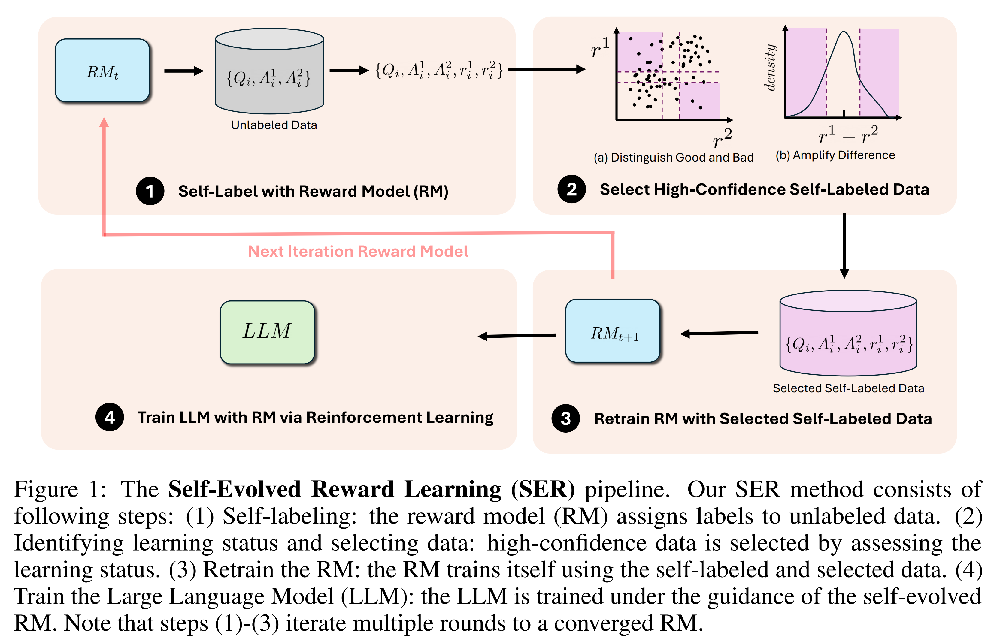
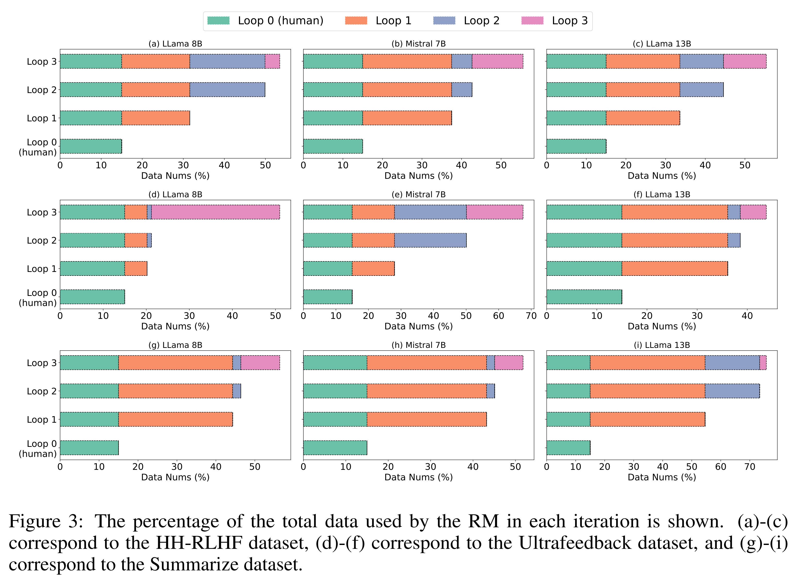
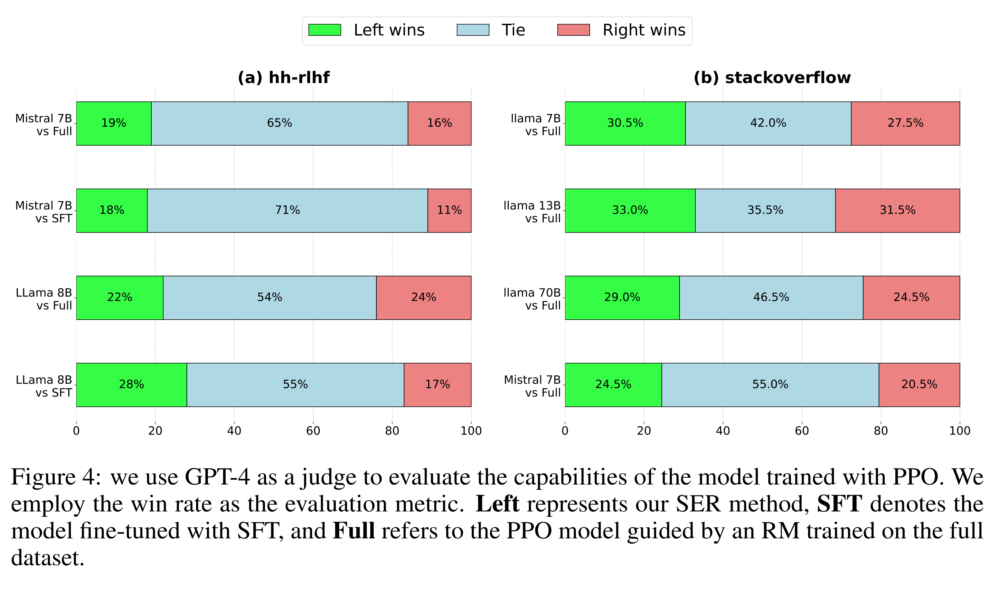

# Abstract

Reinforcement Learning from Human Feedback (RLHF) 는 language model 을 인간의 선호도에 맞게 정렬시키는 데 중요한 기술로, GPT-4, ChatGPT, Llama 2 와 같은 conversational model 의 성공에 핵심적인 역할을 한다. RLHF 를 적용하는 데 있어 핵심적인 어려움은 신뢰할 수 있는 reward model (RM) 을 학습하는 것이다. RM 은 일반적으로 인간 전문가나 고급 AI system 이 제공하는 고품질 label 에 의존한다. 이러한 방법은 비용이 많이 들며, language model 의 응답에 영향을 미칠 수 있는 bias 를 도입할 가능성이 있다. language model 이 발전함에 따라, 인간의 입력은 그 성능을 더욱 향상시키는 데 덜 효과적일 수 있다.

본 논문에서는 RM 이 추가적인 training data 를 생성하여 자기 스스로를 반복적으로 향상시키는 새로운 접근법인 **Self-Evolved Reward Learning (SER)** 을 제안한다. 저자는 *HH-RLHF* 와 *UltraFeedback* 과 같은 여러 dataset 에서 Mistral, Llama 3 등의 model 을 사용하여 광범위한 실험을 수행하고, SER 을 다양한 baseline 과 비교하였다.

실험 결과, 제한된 human-annotated data 만으로도 self-feedback 으로부터 학습하는 것이 RM 의 성능을 강건하게 향상시킬 수 있으며, 이는 결국 large language model (LLM) 의 성능 향상으로 이어짐을 보여준다.

# 1 Introduction

Reinforcement Learning from Human Feedback (RLHF) 는 Large Language Model (LLM) 을 인간의 선호 데이터에 맞게 정렬시키는 잘 확립된 접근법이다. 일반적인 절차는 인간의 선호도로부터 reward model (RM) 을 학습하고, 학습된 RM 을 고정한 뒤 *Proximal Policy Optimization (PPO)* 과 같은 Reinforcement Learning (RL) 기법을 사용하여 LLM 을 학습시키는 것이다. 또 다른 접근법으로는 RM 을 따로 학습하지 않고, 인간의 선호 데이터로부터 직접 LLM 을 학습하는 Direct Preference Optimization (DPO) 이 있다.

두 접근법 모두 humman-annotated preference data 의 양과 품질에 크게 의존한다. 그러나 이러한 데이터는 확보하기 어렵고 비용이 많이 들기 때문에 RL 접근법의 개발과 성능 향상에 중요한 병목 현상을 초래한다. 이러한 human-annotated data 에 대한 의존성은 더 높은 성능을 위해 방대한 양의 labeled data 가 필요한 강력한 LLM 의 확장성을 제한한다.

이 의존성을 줄이기 위해 최근 연구들은 AI feedback 을 활용하여 RM 을 학습하는 *Reinforcement Learning from AI Feedback (RLAIF)* 을 제안하였다. 이는 human-annotated data 에 대한 의존도를 줄이지만, LLM 이 고품질의 feedback 을 제공할 수 있다는 휴리스틱한 가정을 포함하며, 종종 feedback 생성을 위해 더 강력한 LLM 을 필요로 한다.

최근의 발전에 따르면, LLM 은 일정 수준에서 world model 로 작동할 수 있으며, 명시적인 인간 입력 없이도 세계 지식과 복잡한 패턴을 이해할 수 있는 능력을 지닌 것으로 보인다. 이러한 능력을 활용하면 LLM 은 평가와 feedback 을 제공할 수 있다. RLHF 와 RLAIF 의 맥락에서, LLM 의 이러한 능력은 RM 의 역할로 확장될 수 있으며, RL 접근법은 RM 에 강하게 의존한다.

저자는 제한된 human-annotated data 로 더 나은 RM 을 학습하기 위해, RM 이 자기 자신을 이용한 feedback loop 를 통해 self-evolve 하는 새로운 reward learning 접근법을 제안한다. 본 접근법에서 LLM 은 RM 의 역할을 수행하며, dataset 에 대한 feedback 을 생성하고, 그 feedback 이 다시 자신의 학습을 향상시키는 데 사용된다. 이 반복적인 “feedback-then-train” 루프는 RM 이 시간이 지남에 따라 self-evolve 하도록 하여, initial self-labeled data 에 다소 noise 가 있더라도 점진적으로 성능을 향상시킬 수 있게 한다.

그러나 반복이 진행됨에 따라 유사한 데이터는 점점 도움이 되지 않거나 오히려 성능을 저하시킬 수 있다. 이를 해결하기 위해, 저자는 각 iteration 에서 RM 의 learning status 를 식별하고, 높은 신뢰도의 데이터를 선택하기 위한 data filtering 전략을 도입하여 보다 강건한 RM 학습을 가능하게 한다.

이와 같은 self-evolved reward learning 과정에서 RM 은 지속적으로 자신의 feedback 으로부터 학습함으로써, large-scale human-annotated data 에 대한 의존도를 줄이면서도 성능을 유지하거나 오히려 향상시킬 수 있다.

저자의 기여점은 다음과 같다.

* 새로운 self-evolved reward learning framework 를 제안한다. 이를 통해 전체 human-labeled dataset 의 단 15% 만 사용하더라도 동일한 수준의 성능을 달성할 수 있음을 보여주며, 인간 데이터 의존도를 크게 줄인다.
* LLM 의 self-learning 패러다임의 광범위한 함의 를 제시한다. 특히 RM 을 강화함으로써 RL 을 향상시키는 데 있어 self-learning 의 잠재적 이점을 논의한다 (Sec. 4.1.2 참조).
* 광범위한 실험 결과 를 통해 제안된 self-evolved reward learning framework 가 다양한 LLM, model 크기, dataset 전반에서 일관된 성능 향상을 보임을 입증한다.

저자는 여러 dataset 과 다양한 크기의 LLM 을 사용하여 제안된 방법의 generalization 과 효율성을 검증하였다. 그 결과, few human-annotated data 만 사용하는 seed model 과 비교했을 때, 제안된 방법은 평균 7.88% 의 강건하고 유의미한 성능 향상을 달성하였다. 또한 여러 번의 iteration 이후, 최종적으로 전체 human-labeled dataset 을 사용하는 model 과 동일하거나 그 이상의 성능에 도달하였으며, 이는 model 의 self-improvement 에 대한 잠재적 해결책을 제시한다.

# 2 Related Work

## 2.1 Reinforcement Learning From External Feedback

Preference learning, 즉 현재 일반적으로 Reinforcement Learning from Human Feedback (RLHF) 라 불리는 접근법은 인간의 선호 데이터로부터 fixed reward model (RM) 을 학습하고, learned RM 을 Proximal Policy Optimization (PPO) 과 같은 Reinforcement Learning (RL) 기법을 통해 Large Language Model (LLM) 학습에 사용하는 방식이다.

RL 학습을 보다 안정적이고 효율적으로 만들기 위해 Direct Preference Optimization (DPO) 과 같은 방법이 제안되었다. DPO 는 RM 을 별도로 학습하지 않고, 인간의 선호 데이터를 직접 사용하여 LLM 을 학습한다. 이 밖에도 여러 연구들은 preference training 구조를 조정하여 성능과 안정성을 향상시키는 방법을 제시하였다.

그러나 인간의 선호 데이터를 획득하는 것은, 특히 고품질 데이터를 확보하는 것은 매우 비용이 많이 들고 시간이 많이 소요된다. 또한 데이터 다양성이 낮고, 일부 전문가가 주석한 데이터만 포함되는 경향이 있어 막대한 노력과 전문성을 필요로 한다. 데이터의 품질과 양은 결국 LLM 의 성능 병목을 결정한다.

이 문제를 완화하기 위해 *Reinforcement Learning from AI Feedback (RLAIF)* 접근법이 제안되었다. RLAIF 는 LLM 이 feedback 을 생성하여 RM 학습에 활용함으로써 human-annotated data 에 대한 의존도를 줄인다. 그러나 이 방법은 LLM 이 고품질·다양한 feedback 을 제공할 수 있다는 휴리스틱한 가정에 기반하며, 종종 feedback 생성을 위해 더 강력한 LLM 을 필요로 한다.

본 논문에서는 few human-annotated data 를 사용하여 RM 을 학습하고, 전체 주석 데이터를 사용하여 학습된 RM 과 유사한 성능을 달성한다. 이후 학습된 RM 은 PPO 를 통해 LLM 학습에 사용된다.

## 2.2 Self-Learning in LLMs

LLM 이 인간 수준을 넘어서는 superhuman-level 로 발전함에 따라, 인간의 성능 한계가 학습의 병목으로 작용할 수 있다. 인간의 자기 성찰을 통한 자기 개선과 유사하게, self-learning 은 최근 LLM 의 성능 향상을 위한 새로운 접근법으로 주목받고 있다.

Self-learning in LLM 은 외부의 감독 없이 model 의 능력을 향상시키는 데 초점을 맞춘다.

* SELF-ALIGN 은 원칙 기반 reasoning 을 통해 self-alignment 를 실현하며, model 이 내부 지침에 따라 자신의 출력을 조정할 수 있게 한다.
* ReSTEM 은 self-training 을 이용하여 문제 해결 능력을 향상시킨다.
* RLC 와 SCoRe 는 self-generated data 를 활용한 self-correction 및 self-improvement 방법을 보여준다.
* 또한, 일부 연구는 LLM 이 self-generated rationale-augmented answer 를 통해 reasoning 을 정교화하여 설명력을 향상시킬 수 있음을 보였다.
* MathShepherd 와 Self-Rewarding Language Models 연구에서는 model 이 스스로 고품질 reward 를 제공하는 self-rewarding 메커니즘을 제시하였다.

저자가 제안하는 접근법은 이러한 self-learning 패러다임에 속하며, RM 이 자기 자신을 위한 feedback 을 생성하여 이를 학습에 다시 활용하는 혁신적인 방법을 통해 강건한 RM 학습과 성능 향상을 달성한다.

# 3 Self-Evolved Reward Learning for Large Language Models

본 절에서는 Large Language Model (LLM) 을 위한 **Self-Evolved Reward Learning (SER)** 을 제안한다. 이 접근법은 RM 이 자신의 높은 신뢰도의 예측으로부터 학습함으로써 반복적으로 스스로를 향상시키도록 하며, 광범위한 human-annotated data 의 필요성을 줄인다.

초기에 RM 은 few human-annotated data 를 사용하여 좋은 답변과 나쁜 답변의 기본 개념을 학습한다. 이후 RM 은 self-labeling 과 반복적 재학습을 통해 진화한다. 이렇게 향상된 RM 은 Reinforcement Learning (RL) 접근법을 통해 LLM 학습을 안내하는 데 사용된다. 

본 절에서는 self-labeling, learning status 식별, data filtering, RM 재학습, 그리고 향상된 RM 을 이용한 LLM 의 RL 학습 과정을 상세히 기술한다.

## 3.1 Overview

Fig. 1 은 SER 방법의 전체적인 pipeline 을 보여준다. 이 반복적인 과정은 reward model 과 LLM 이 학습 주기 동안 지속적으로 정제되도록 보장한다. 저자의 Reward Model 학습 방법은 다음의 세 가지 반복 단계로 구성된다.

1. **Self-Label with Reward Model**:  
   RM 은 few human-annotated data 를 사용하여 초기 warm-up 학습을 수행한 후, unlabeled data 에 대해 self-labeling 을 수행한다.
2. **Identify the Learning Status of the Reward Model and Select High-Confidence Data**:  
   RM 이 현재 얼마나 좋은 답변과 나쁜 답변을 구별할 수 있는지, 또는 유사한 품질의 답변 간의 미묘한 차이를 얼마나 증폭시킬 수 있는지를 평가한다. 이 평가 결과에 따라 높은 신뢰도의 데이터를 선택한다.
3. **Retrain the Reward Model with Pairwise Loss**:  
   filtering 된 고신뢰도 데이터를 사용하여 RM 을 pairwise loss 로 재학습한다. 이 과정을 반복함으로써 RM 의 답변 품질에 대한 이해가 점진적으로 향상된다.

몇 차례의 self-evolved reward learning iteration 이후, RM 학습이 수렴하거나 더 이상 필터링 가능한 데이터가 없을 때 RM 학습을 중단한다. 이후 이 RM 은 RL 접근법을 통해 LLM 학습을 안내하는 데 사용된다. 수정된 PPO 알고리즘은 self-evolved reward signal 을 통합하여 LLM 의 policy 를 최적화한다.

저자의 방법은 RM 의 두 가지 주요 learning status (learning status)에 의존한다.

1. 명확한 좋은 답변과 나쁜 답변을 구별하는 능력
2. 유사한 품질의 답변 간의 차이를 세밀하게 구분하는 능력

이 두 가지 learning status 를 구분하는 이유는 다음과 같다.

* (a) **Targeted Skill Development**:  
  서로 다른 learning status 를 인식함으로써 RM 은 특정 능력에 집중할 수 있다. 초기에는 명확한 구분(e.g., 좋은 vs 나쁜 답변)에 집중하고, 학습이 진행됨에 따라 점점 더 미세한 구분 능력을 정제한다.
* (b) **Adaptive Data Filtering**:  
  data filtering 과정은 현재의 learning status 에 의해 결정된다. 이를 통해 model 이 가장 관련성 높은 데이터로 학습하도록 하며, 항상 적절한 성능 측면에서 개선이 이루어지도록 한다.
* (c) **Improved Self-Evaluation**:  
  learning status 를 지속적으로 모니터링함으로써 RM 은 학습의 초점을 언제 전환해야 하는지를 스스로 판단할 수 있다. 이러한 동적 접근법은 자기 주도적이고 curriculum-like 한 학습을 가능하게 한다.

또한 RM 이 각 질문에 대해 두 개의 답변을 비교하도록 함으로써, RM 은 두 learning status 모두에 중요한 paired example 을 제공받는다. 이는 RM 의 discrimination 능력과 comparative 능력을 향상시키며, 두 작업 모두에서 숙련된 RM 은 이후 RL 단계에서 LLM 을 효과적으로 안내할 수 있는 기반을 갖추게 된다.

#### Step 1: Self-Label with Reward Model

Fig. 1 에서 보이듯이, 먼저 현재 reward model (RM) 을 기반으로 모든 unlabeled data 에 대해 reward score 를 예측한다. 이는 다음과 같이 수식으로 표현된다.

$$
r_i = RM(Q_i, A_i)
\tag{1}
$$

이 reward score 는 현재 RM 의 성능에 따라 상당한 noise 를 포함할 수 있다. 저자는 이러한 reward score 를 사용하여 현재의 learning status 와 data selection 전략을 결정한다.

초기에는 few human-annotated data 를 사용하여 seed RM 을 얻는다. 본 연구에서는 전체 dataset 의 15% 만을 사용하여 seed RM 을 학습하였다.

#### Step 2: Identify the Learning Status of the Reward Model and Select High-Confidence Data

self-labeled dataset 에서 각 question $Q_i$ 에는 two possible answers $A^1_i$ 와 $A^2_i$ 가 존재하며, 이들은 다양한 관계를 가질 수 있다. RM 은 다음과 같은 상황을 구분해야 한다.

* 한 답변이 명확히 다른 답변보다 우수한 경우 (e.g., $A^1_i$ 가 좋고 $A^2_i$ 가 나쁘거나 그 반대)
* 두 답변이 모두 좋거나 모두 나쁘지만, 상대적으로 하나가 더 낫거나 더 나쁜 경우

RM 은 각 답변이 좋은 답변일 확률을 나타내는 $p^1_i$ 와 $p^2_i$ 를 할당한다. 목표는 이러한 다양한 경우에서 두 답변 간의 상대적 품질 차이를 구별하는 것이다.

training dataset 을 $D_{\text{train}} = \{(Q_i, A^1_i, A^2_i)\}_{i=1}^N$ 이라 하자. learning status $\mathcal{S}$ 는 두 답변의 예측 확률 차이에 따라 정의된다:

$$
\Delta_i = |p^1_i - p^2_i|
\tag{2}
$$

이때 learning status $\mathcal{S}$ 는 threshold $\tau_{\text{low}}$, $\tau_{\text{high}}$, $\tau_{\Delta}$ 에 의해 다음과 같이 정의된다:

$$
\mathcal{S} =
\begin{cases}
\text{Status}_1, & \text{if } (p^1_i > \tau_{\text{high}} \text{ and } p^2_i < \tau_{\text{low}}) \text{ or } (p^1_i < \tau_{\text{low}} \text{ and } p^2_i > \tau_{\text{high}}), \\
\text{Status}_2, & \text{else if } \Delta_i \geq \tau_{\Delta}, \\
\text{Stop}, & \text{otherwise.}
\end{cases}
\tag{3}
$$

* Status₁ 은 RM 이 명확하게 좋은 답변과 나쁜 답변을 구별할 수 있는 상태를 의미한다.
* Status₂ 는 유사한 품질의 답변 간 미세한 차이를 구별할 수 있는 상태를 나타낸다.
* Stop 은 RM 의 학습이 충분히 수렴하였음을 의미하며, 더 이상의 self-labeling 이 필요하지 않은 상태를 뜻한다.

이러한 learning status 판단은 이후의 data filtering 및 RM 재학습 단계의 핵심 기준으로 사용된다.

현재의 learning status 를 결정하기 위해, 저자는 현재 iteration 에서 학습된 reward model (RM) 을 사용하여 **unlabeled data** 에 대한 예측을 수행한다. Status 1 과 Status 2 모두 통계적으로 의미 있는 평가를 위해 특정 기준을 충족하는 충분한 수의 예측 결과가 필요하다.

본 논문에서는 RM 의 성능 향상에 가장 일관된 개선을 보였던 파라미터 설정값으로 $\tau_{\text{high}} = 0.55$, $\tau_{\text{low}} = 0.45$, $\tau_{\Delta} = 0.3$
을 사용하였다.

* Status 1 (Easier Task): 이 상태는 RM 이 positive sample 과 negative sample 을 효과적으로 구분할 수 있는지를 평가한다. 각 answer $A^k_j$ 에 대해 RM 이 예측한 확률 $p^k_j$ 를 기준으로 다음과 같이 평가한다.
  * $p^k_j > \tau_{\text{high}}$ 인 경우, RM 은 해당 답변이 positive 라고 높은 신뢰도로 판단한 것이다.
  * $p^k_j < \tau_{\text{low}}$ 인 경우, RM 은 해당 답변이 negative 라고 높은 신뢰도로 판단한 것이다.
  * 충분한 수의 고신뢰도 예측(e.g., HH dataset 에서 600 개 이상)이 존재한다면, RM 은 positive 와 negative sample 을 명확히 구별할 수 있음을 의미하며, Status 1 의 조건을 만족한다.
* Status 2 (Harder Task): 이 상태는 RM 이 유사한 품질의 답변 간의 미묘한 차이를 구분할 수 있는 능력을 평가한다. 즉, 두 답변이 모두 좋거나 모두 나쁘지만, 하나가 더 낫거나 더 나쁜 경우를 구별하는 과제이다.
  * 이를 위해 RM 은 동일한 질문에 대한 두 개의 답변의 예측 확률 차이를 계산한다: $|p^1_j - p^2_j| > \tau_{\Delta}$
  * 충분한 수의 paired 예측이 위 조건을 만족한다면, RM 은 유사한 품질의 답변들 사이에서 차이를 증폭(amplify) 할 수 있음을 의미한다. 
  * 이 과제는 Status 1 보다 더 어려운 수준의 과제로, RM 이 세밀한 차이를 인식하고 정량화해야 한다. Status 1 과 마찬가지로, 통계적으로 유의미한 판단을 위해 일정 수 이상의 예측(e.g., HH dataset 에서 600 개 이상)이 필요하다.

저자는 Status 1 → Status 2 의 순서로 상태를 점검한다. 그 이유는 Status 1 이 보다 기본적인 구분 능력(넓은 차이 구별)을 의미하고, Status 2 는 보다 복잡한 세밀한 분석 능력을 요구하기 때문이다.

* RM 이 Status 1 의 기준을 만족하지 못하면 (즉, $\tau_{\text{high}}$, $\tau_{\text{low}}$ threshold 를 만족하는 sample 이 충분하지 않으면),  
  → 다음 단계로 Status 2 여부를 점검한다.
* RM 이 Status 2 의 기준도 충족하지 못하면, 이는 모델이 더 이상 유의미한 성능 향상을 보이지 않음을 의미하므로,  
  → RM 학습이 수렴(convergence) 에 도달한 것으로 간주하고 추가 학습을 중단한다.

#### Step 3: Retrain the Reward Model with Filtered Data Using Pairwise Loss

Step 2 에서 결정된 RM 의 상태 $\mathcal{S}$ 에 따라, 서로 다른 data filtering 전략을 적용한다. filtering 함수는 다음과 같이 정의된다.

$$
F(D_{\text{unlabeled}}, S) =
\begin{cases}
{(Q_j, A^1_j, A^2_j) \mid (RM(Q_j, A^1_j) > \tau_{\text{high}} \text{ and } RM(Q_j, A^2_j) < \tau_{\text{low}}) \text{ or } (RM(Q_j, A^1_j) < \tau_{\text{low}} \text{ and } RM(Q_j, A^2_j) > \tau_{\text{high}})}, & \text{if } S = \text{Status}_1, \\
{(Q_j, A^1_j, A^2_j) \mid |RM(Q_j, A^1_j) - RM(Q_j, A^2_j)| > \delta}, & \text{if } S = \text{Status}_2, \\
\emptyset, & \text{if } S = \text{Stop.}
\end{cases}
\tag{4}
$$

여기서 $D_{\text{unlabeled}}$ 는 unlabeled data 를 의미한다.

* **Status 1** 에서는  
  $(RM(Q_j, A^1_j) > \tau_{\text{high}}$ 그리고 $RM(Q_j, A^2_j) < \tau_{\text{low}})$,
  혹은 그 반대의 조건을 만족하는 고신뢰도 데이터만을 선택한다.
  이를 통해 model 이 신뢰성 있는 sample 에서 학습하도록 한다.
* **Status 2** 에서는  
  두 답변의 reward 차이 $|RM(Q_j, A^1_j) - RM(Q_j, A^2_j)|$ 가 threshold $\delta$ 를 초과하는 pair 를 선택한다.
  이는 model 이 상대적인 품질 비교 판단(comparative judgment)을 더 세밀하게 학습하도록 돕는다.
* **Status Stop** 은 학습이 수렴 상태에 도달했음을 의미하며, 추가 데이터는 선택되지 않는다.

filtering 후, model 은 pairwise loss 를 사용하여 재학습된다. 이때 model 은 absolute label 에 의존하지 않고, 두 답변의 상대적인 품질 차이를 학습한다. 이는 absolute classification 보다 relative comparison 에 집중함으로써 일관된 성능 향상을 가져온다.

pairwise loss 함수는 다음과 같다:

$$
L_{\text{pair}} =
\frac{1}{|D_{\text{filtered}}|}
\sum_{(Q_j, A^1_j, A^2_j) \in D_{\text{filtered}}}
\max(0, \Delta - (RM(Q_j, A^1_j) - RM(Q_j, A^2_j)))
\tag{5}
$$

* 여기서 $\Delta$ 는 reward score 간의 원하는 margin 값이며, $D_{\text{filtered}} = D^n_{\text{filtered}} + D^{n-1}_{\text{filtered}}$ 이다. 
* $n$ 은 현재 self-evolution loop 의 iteration 횟수를 의미한다.
* 즉, 현재 loop 의 학습 데이터는 Eq. (4) 에 의해 filtering 된 데이터와 이전 loop 들에서 사용된 데이터를 함께 포함한다.

이와 같은 반복적 과정—즉, filtering 과 pairwise loss 를 이용한 재학습—을 통해 RM 은 점진적으로 자신의 판단 능력을 정제(refine)하며, 결국 수렴에 도달할 때까지 지속적으로 향상된다.

#### Step 4: Train the LLM via RL with Self-Evolved Reward Model

self-evolution 을 거친 RM 을 이용하여 LLM 을 Reinforcement Learning (RL) 로 학습시킨다. RM 으로부터 정제된 reward signal 을 반영하기 위해 Proximal Policy Optimization (PPO) framework 를 수정하였다.

LLM 학습은 policy optimization 문제로 정의된다. policy $\pi_\phi$ 는 inputs $Q$ 에 대해 responses $A$ 를 생성하며, objective 는 self-evolved RM 이 생성한 reward $r = RM(Q, A)$ 를 최대화하도록 $\pi_\phi$ 를 최적화하는 것이다.

즉, 최적화 목적식은 다음과 같다: $\max_\phi ; \mathbb{E}_{Q \sim D_\text{train}, A \sim \pi_\phi(\cdot | Q)} [RM(Q, A)]$

PPO 를 기반으로, RM $R_\theta$ 의 refined reward signal 을 통합하도록 policy update 를 수정하였다. 이를 통해 model 은 응답 품질의 미세한 차이를 더 잘 반영할 수 있다.

수정된 PPO 의 clipped surrogate objective 는 다음과 같다.

$$
L_{\text{PPO}} =
\mathbb{E} \left[
\min \left(
\frac{\pi_\phi(A | Q)}{\pi_{\phi_{\text{old}}}(A | Q)} A^R,
\text{clip}\left(
\frac{\pi_\phi(A | Q)}{\pi_{\phi_{\text{old}}}(A | Q)},
1 - \epsilon, 1 + \epsilon
\right) A^R
\right)
\right]
\tag{6}
$$

* 여기서 $A^R$ 은 RM 으로부터 얻은 reward 에 기반한 advantage function 이다.
* self-evolved RM 의 세밀한 reward signal 을 활용함으로써, LLM 의 policy update 는 응답 품질의 미묘한 차이에 더 잘 정렬된다.

저자의 SER 접근법의 상세 알고리즘 구조는 Appendix B 에 제시되어 있다.

## 3.2 Theoretical Analysis

본 절에서는 SER 의 이론적 타당성을 분석하며, 특히 RM 학습과 PPO 학습의 수렴 특성에 초점을 맞춘다. SER 방법의 효과를 뒷받침하는 구체적인 수학적 분석은 Appendix A 에 제시되어 있다. 그 주요 결론은 다음과 같다.

* (a) **Reward Model 의 수렴**: 합리적인 가정하에, RM 은 예측 확률을 기반으로 고신뢰도 데이터를 선택함으로써 반복적으로 성능을 향상시킨다. 이 과정은 RM 의 성능이 시간에 따라 향상되거나 최소한 안정적으로 유지됨을 보장한다.

* (b) **학습된 Reward Model 을 사용한 PPO 의 수렴**:  RM 이 self-labeling 을 통해 학습되더라도, reward 추정 오차가 충분히 작을 경우 PPO 는 근사 최적 정책(near-optimal policy)에 수렴함을 보인다.

이러한 결과는 reward model 과 LLM 모두가 최소한의 인간 감독(minimal human supervision) 으로도 높은 성능을 달성할 수 있음을 이론적으로 입증한다.

# 4 Experiment

본 절에서는 reward modeling 결과와 PPO 결과를 포함한 주요 실험 결과를 보고한다.

저자는 서로 다른 parameter 크기를 가진 여러 base model 들 — Llama 3 8B, Llama 2 13B, Llama 3 70B, Mistral 7B — 을 선택하여, StackOverflow, HH-RLHF, UltraFeedback, Summarize dataset 에서 제안된 방법의 효용성을 검증하였다.

실험 설정, dataset 통계, 평가 지표, 그리고 baseline 모델에 대한 세부 정보는 Appendix C 에 제시되어 있다.

## 4.1 Reward Modeling Results

주요 실험 결과는 Tab. 1 에 제시된다.

* 모든 실험 설정에서 SER 은 model 의 성능을 향상시켰으며, 결국 전체 human-labeled dataset 을 사용했을 때의 결과에 근접한 성능을 달성하였다.
* 일부 실험에서는 전체 human-labeled data 를 사용한 경우보다 더 높은 성능을 달성하기도 했으며, 이때 사용된 labeled data 는 단 15% 에 불과하였다.
* 이는 SER 이 데이터 부족(data-scarce) 환경에서 model 성능을 강화할 수 있는 상당한 잠재력을 지니고 있음을 보여준다.

### 4.1.1 Main Findings

#### SER consistently and effectively enhances model performance.

* Tab. 1 에서 볼 수 있듯이, 전체 데이터의 15% 만을 사용하는 baseline 과 비교했을 때, SER 은 self-labeled data 를 추가 학습에 활용함으로써 model 의 성능을 유의미하게 향상시킨다.
  * 여러 번의 iteration 을 거친 후, model 은 평균적으로 정확도 7.88% 향상을 달성하였다.
  * 또한 model 의 parameter 크기가 커질수록, 즉 기반 능력(foundation capability)이 강할수록, SER 의 self-improvement 잠재력이 더 크게 발현되었다.
  * 대형 parameter model 일수록 self-evolution 이후의 성능 향상 폭이 더 컸으며, 대부분의 실험 설정에서 LLaMA 13B model 의 성능이 두 개의 소형 model 을 능가하였다.
* 데이터가 풍부한 환경(StackOverflow)에서는 SER 의 성능 향상 폭이 상대적으로 작다.
  * 데이터가 많은 상황에서는 평균 2.4% 정도의 성능 향상이 관찰되었다.
  * 그러나 이러한 환경에서도 model 의 parameter 크기에 따른 명확한 scaling 경향이 존재했다.
  * 즉, model parameter 가 클수록 SER 의 self-improvement 효과가 커졌다.
  * 예를 들어,
    * Mistral 7B → +1.3%
    * LLaMA 8B → +1.8%
    * LLaMA 13B → +4.1%

#### SER can approach or even exceed the performance of full-scale human-labeled data

저자는 SER 과 전체 human-labeled data 를 사용한 model 을 비교하였다. 그 결과, SER 은 평균 0.3% 차이 이내로 full data 와 유사한 성능을 보였으며, 일부 경우에는 이를 초과하였다.

세부적으로,

* Mistral 7B / HH-RLHF dataset: SER 이 baseline 대비 +0.13% 향상
* Mistral 7B / Summarize dataset: +1.93% 향상
* LLaMA 8B / UltraFeedback dataset: +0.54% 향상

이와 함께 model 크기에 따른 경향성도 관찰되었다. SER 과 full human-labeled data 간 평균 성능 차이는

* Mistral 7B: +0.12%
* LLaMA 8B: +0.06%
* LLaMA 13B: −1.07%

이 결과는 대형 model 일수록 labeled data 를 더 효율적으로 활용하여 성능을 향상시킬 수 있음을 시사한다. 즉, SER 은 manual annotation 대신 self-labeling 을 통해 labeled data 를 효과적으로 scale up 하여 model 성능을 높일 수 있는 가능성을 보여준다.

데이터가 풍부한 상황에서는 이러한 경향이 더욱 뚜렷해진다. StackOverflow dataset 에서,

* LLaMA 8B 는 전체 데이터의 15% 만으로 full dataset 학습 성능에 근접했으며, SER 적용 후 full data 대비 +1.8% 향상을 달성하였다.
* LLaMA 13B 는 full data 대비 +0.5% 향상,
* Mistral 7B 는 baseline 대비 0.3% 낮은 성능을 보였다.

이러한 결과는 데이터가 풍부한 환경에서도, SER 의 self-evolution 과정이 data distribution 를 더욱 다양화시켜, model 의 성능 상한(performance ceiling) 을 한층 높일 수 있음을 의미한다.

### 4.1.2 FINE-GRAINED ANALYSIS

model 의 iteration 과정에서 어떤 변화가 발생하는지를 보다 세밀하게 분석하기 위해, Fig. 2 에 validation set 에서의 model 정확도 변화를 제시하고, Fig. 3 에는 iteration 별 학습 데이터 양의 변화를 나타낸다. 주요 결론은 다음과 같다.

#### The model can iteratively enhance its performance on self-labeled data, even if the self-labeled data contains noise.

* Fig. 2 에서 볼 수 있듯이, Loop1 은 모든 실험 설정에서 model 의 성능을 안정적으로 향상시킨다.
  * Loop1 단계에서는 model 의 초기 성능이 비교적 약하며, self-feedback 에 상당한 noise 가 존재할 수 있다.
  * 따라서 이 단계에서는 Status1 의 기준에 따라 high-confidence sample 을 선택하여 학습하는 것이 매우 중요하다.
  * 일반적으로 Loop1 단계의 성능 향상 폭이 모든 loop 중에서 가장 크며, 동시에 가장 많은 학습 데이터를 필터링하여 확보할 수 있다.
* Fig. 2 에 나타나듯, 평균적으로 Loop1 은 model 의 성능을 4.54% 향상시켰다. 이 결과는 또한 Theory 1 을 실증적으로 뒷받침한다.
  * 즉, model 의 초기 정확도가 50% 이상일 때, high-confidence sample 을 이용한 반복적 학습(iterative training)은 model 의 성능을 지속적으로 향상시킬 수 있다는 이론적 주장과 일치한다.

#### Similar data becomes marginally helpful after multiple iterations and may even harm the model’s performance.

Loop2 단계에서는 model 의 능력이 향상됨에 따라, Status1 단계에서 필터링된 단순한 sample 들이 가져오는 이득이 점점 줄어든다.

* Fig. 2 에서 볼 수 있듯이, Loop2 에서의 성능 향상은 모든 iteration 중 가장 미미하다.
  * 이는 명확히 구분되는 sample 의 수를 단순히 늘리는 것이 model 의 성능을 크게 향상시키지 못하며, 오히려 성능 저하로 이어질 수 있음을 보여준다 (e.g., LLaMA 13B / UltraFeedback dataset 에서 관찰됨).
* 따라서 학습 과정을 면밀히 관찰한 결과, 저자는 model 이 두 개의 유사한 sample 간 품질 차이를 더 잘 구별할 수 있도록 보다 모호하고 난이도 높은 sample 을 학습 과정에 포함시킬 필요가 있음을 확인하였다.

#### By adjusting the error reduction strategy, more diverse self-labeled data can be obtained, further enhancing the effectiveness of self-learning. 

학습 과정의 분석을 기반으로, model 이 단순한 데이터에 overfitting 되는 것을 방지하기 위해서는, 구분하기 어려운 유사 sample 에 학습의 초점을 맞춰야 한다. 이러한 전략은 model 이 두 sample 간의 미묘한 차이를 인식할 수 있도록 돕는다.

Loop3 단계에서는 learning status 2 의 data selection 전략을 적용한다. 이 단계에서는 model 이 ambiguous hard sample 간의 차이를 학습함으로써 성능이 더욱 향상된다.

* Fig. 6 에서 볼 수 있듯이, data filtering 전략을 수정하고 보다 다양한 sample 을 도입함으로써, Loop3 단계의 model 은 유사 sample 간의 score 차이를 확장시켰으며, 결과적으로 판별 능력(discriminative ability) 이 향상되었다.
* Fig. 2 에 나타나듯, hard sample 을 활용한 Loop3 학습은 model 의 성능을 추가로 향상시켜, 전체 human-annotated dataset 을 사용했을 때의 결과에 근접하거나 이를 초과하기도 한다.
* 여러 iteration 을 거치는 동안 사용된 전체 학습 sample 수와 training step 수는 full dataset 을 사용했을 때보다 적었으며, 일반적으로 전체 데이터의 약 50% 수준에 불과했다.

#### SER is more data and human-labor efficient than full fine-tuning.

* Fig. 3 에서 보이듯이, SER 방법에서는 전체 human-annotated data 의 15% 만으로 초기 model 을 학습시킨다. 이후 초기 model 의 feedback 을 기반으로 data 를 재선택(reselect)하여 성능 향상을 달성한다.
* 여러 dataset 에 대한 실험 결과, SER 은 다양한 상황에 효과적으로 일반화(generalize) 됨을 보여주었다.
* human-labeled preference data 의 높은 비용을 고려할 때, SER 은 이러한 비용을 효율적으로 절감할 수 있는 실질적 대안을 제공한다.

## 4.2 PPO Results

SER 의 효용성을 검증하기 위해, 앞서 학습된 RM 을 이용하여 PPO 학습을 수행하고 LLM 을 최적화하였다. 저자는 Anthropic HH-RLHF dataset 과 StackOverflow dataset 에서 실험을 진행하였으며, 결과는 Fig. 4 에 제시되어 있다.

* HH-RLHF dataset 에서 SER model 들은 모두 SFT baseline 보다 높은 win rate 을 보였으며, 이는 SER 접근법이 LLM 의 능력을 향상시킴을 의미한다.
* 또한, 전체 human-annotated data 로 학습된 RM 과 비교했을 때, PPO 실험에서의 win rate 추세는 RM 성능과 일관된 경향을 보였다.

예를 들어, Mistral 7B 의 경우 SER 기반 RM 의 정확도가 full dataset 으로 학습된 RM 보다 높았으며, PPO 실험에서도 full model 의 win rate 을 소폭 초과하였다.

추가적으로, SER 의 일반화 성능(generalizability) 을 검증하기 위해 동일한 실험을 StackOverflow dataset 에서 수행하였다. Fig. 4(b) 에서 볼 수 있듯이, SER model 은 full model 을 일정 수준 초과하는 성능을 보였으며, 이는 RM 의 정확도와 일관된 추세를 나타냈다.

주요 결론은 다음과 같다.

* SER 은 LLM 의 성능을 향상시키며, 그 향상 정도는 RM 의 성능과 양의 상관관계를 가진다.
  * self-evolution 접근법을 통해, 저자는 few human-annotated data 만으로도 RM 의 성능을 향상시킬 수 있었다.
    * 향상된 RM 을 활용하여 LLM 을 학습시킨 결과, 더 강력한 LLM 이 도출되었다.
* 이 과정은 이론적으로 반복 가능하다.
  * 더 강력한 LLM 은 더 높은 품질의 응답을 생성할 수 있으며, 이는 다시 RM 의 성능을 향상시켜 선순환(self-reinforcing loop)을 형성할 수 있다.
  * 다만 PPO 의 높은 계산 비용 때문에, 이러한 반복적 실험은 본 연구에서 수행되지 않았다.
* PPO 과정의 성능 향상은 RM 의 성능과 양의 상관관계를 가진다.
  * 즉, 더 강력한 RM 은 더 강력한 LLM 학습을 이끈다.

# 5 Discussion

본 연구는 직관적 동기에 기반한 self-evolved RM 을 통해 실증적으로 성능 향상을 보였으나, 그 효과성에 대한 엄밀한 이론적 분석은 향후 연구로 남아 있다.

현재의 data filtering 전략은 경험적(empirical) 접근에 기반하지만, 흥미롭게도 서로 다른 dataset 들이 각 iteration loop 에서 유사한 learning status (learning status)를 나타냈다.

향후 연구 방향은 다음과 같다.

* 보다 강건하고 자율적인 learning status 식별 및 self-labeled data filtering 방법을 개발하는 것.
* LLM 을 활용하여 더 다양한 응답을 생성함으로써, 보편적이고 견고한 reward model 을 구축하는 것.
  이를 통해 다양한 feedback 기반 학습 방법을 지원할 수 있다.
* SER loop 전체에 LLM 을 통합하는 것, 특히 각 iteration 에서 Step 4 를 포함시켜 LLM 이 직접 응답을 생성하고 RM 이 self-labeling 을 수행하도록 하는 방법을 연구하는 것.

이러한 방향은 강력한 LLM 의 성능 상한(performance ceiling) 을 돌파할 수 있는 잠재적 해결책을 제시한다.

# 6 Conclusion

본 연구에서는 Self-Evolved Reward Learning (SER) 을 제안하였다. SER 은 단순하지만 효과적인 self-evolution 방법으로, 다양한 dataset 과 model 에서 성능을 향상시킨다.

model 이 스스로 labeled data 를 생성하고, learning status 를 제어하여 적절한 데이터를 선택하도록 함으로써, SER 은 반복적 self-evolution 을 수행하며 결국 성능 상한(performance ceiling) 에 도달하거나 이를 초과한다.

광범위한 실험 결과, SER 의 핵심 설계 요소인 learning state 고려가 필수적임을 확인하였으며, iterative 과정 전반에서의 영향을 분석하였다.
이를 통해 SER 은 LLM 의 self-improvement 메커니즘에 대한 유용한 통찰을 제공한다.
