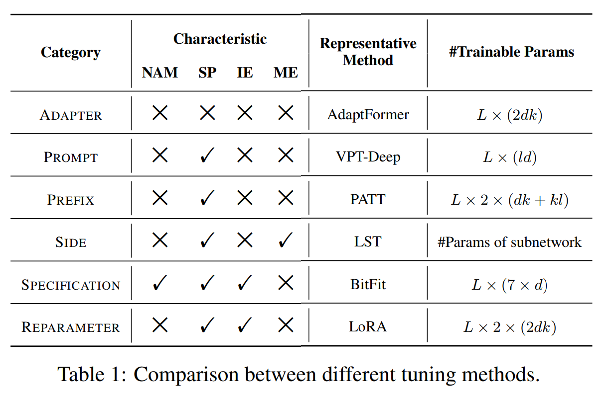
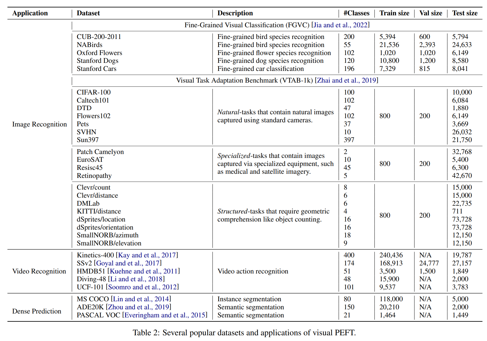

논문 및 이미지 출처 : <https://arxiv.org/pdf/2402.02242>

# Abstract

Large-scale pre-trained vision models (PVMs) 다양한 downstream vision tasks 에 적응 가능성을 보여주지만, B 또는 T parameter 로 성장하며 full fine-tuning 은 불가능 해지고 있음

이에 Parameter-Efficient Fine-Tuning (PEFT) 탐구가 나오며, parameter 를 최소화하며 full fine-tuning 성능을 능가하는 목표를 지님.

저자는 addition-based, partial-based, 및 unified-based 세 범주로 분류.

# Introduction

PVMs 의 powerful representation 으로, downstream task 학습에 fine tuning 이 인기 있지만, 상당한 계산 및 자원 필요.

B ~ T 이상의 prameter 를 가진 model 의 경우 매우 큰 비용이 듦. 또한 각 dataset 마다 별도의 model weight 를 유지해야하며 task 가 증가할수록 실용적이지 않음

parameter-efficient fine-tuning (PEFT) 는 이런 어려움을 극복하기 위한 해결책으로, 적은 parameter 만 업데이트하여 full fine-tuning 과 유사하거나 우수한 성능을 달성할 가능성 존재

이는 large-scale pre-trained model 이 강력한 일반화 능력을 가지며, PVMs 의 대부분의 parameter 가 new task 를 위해 공유할 수 있는 발전을 보여줌.

PEFT 는 learnable parameter 를 줄여, new task 에 효과적으로 적응하며 PVMs 내의 기존 knowledge 를 보호하는데도 기여

---

Fig. 1 고 같이 PEFT 는 addition-based, partial-based, 및 unified-based 로 분류 가능.

# 2. Preliminaries

## 2.1 Problem Definition

#### Definition 1. PEFT

$\theta$ 로 prameterize 된 pre-trained model M 및 downstream task $\mathcal{D} = \{ (x_i, y_i) \}^{|\mathcal{D}|}_{i=1}$ 이 있다 하자.

- $(x_i, y_i)$ : task $\mathcal{D}$ 의 ground-truth input-output pair

parameter-efficient fine-tuning 은 task $\mathcal{D}$ 에 $\theta$ 를 적응시키는 것

- task-specific parameters increment $\triangle \theta$ 는 $|\triangle \theta| \ll |\theta|$ 로 도입

optimal parameters 는 task $\mathcal{D}$ 의 loss $\mathcal{L}$ 을 optimizing 하는 것

$$
\begin{equation}
    \underset{\triangle \theta}{\min} \mathbb{E}_{(x_i, y_i) \in \mathcal{D}} \mathcal{L} (M_{\theta + \triangle \theta} (\hat{y_i} | x_i), y_i).
\end{equation}
$$

## 2.2 Vision Transformer

Vision Transformer 는 patch embedding layer 및 $L$ Transformer layers 로 구성

주어진 image $x \in \mathbb{R}^{H \times W \times C}$ 는 patch embedding layer 로 split 되며 image $x$ 를 sequence patches $x_p \in \mathbb{R}^{N \times (P^2C)}$ 로 flatten 된다.

- $(H,W)$ : input image 의 height 및 width
- $(P, P)$ : 각 image patch 의 resolution
- $C$ : channels number
- $N = HW/P^2$ : image tokens number

이후 $x_p$ 는 trainable linear projection 으로 $x_0 \in \mathbb{R}^{N \times d}$ 로 mapping

prepended [cls] token 및 $x_0$ 의 combination 은 Transformer encoder 로 input

각 transformer layer 는 multi-head attention (MHA) 및 multilayer perceptron (MLP) module 로 구성.

- MHA : query (Q), key (K) 및 value (V) representations 를 사용하여 projection metrices $W_q, W_k, W_v \in \mathbb{R}^{d \times d}$ 인 attention scores 계산
- $l$-th layer 에 $x_{l - 1}$ 주어졌을 때, attention 은 다음과 같이 계산

$$
\begin{equation}
    Q = x_{l-1}W_q, K = x_{l-1}W_k, V = x_{l-1}W_v,
\end{equation}
$$

$$
\begin{equation}
    x'_l = Attention(Q,K,V) = softmax(\frac{QK^T}{\sqrt{d}}V).
\end{equation}
$$

output token $x'_l$ 은 LayerNorm(LN) 및 MLP block 으로 보내지며 다음과 같이 계산

$$
\begin{equation}
    x_l = MLP(LN(x'_l)) + x'_l
\end{equation}
$$

- $x_l$ : $l$-th encoder layer 의 output

최근 ViT 의 진보는 vision task 에 상당한 성능 향상을 가져옴. 

- 일련의 연구는 ViT 를 추가 맥락 정보를 통합해 개선하며, notable models 는 Pyramid DeiT 및 Token to Token (T2T) ViT 이다.
- 다른 연구 라인은 hierarchical 설계로 다양한 scale 에서 spatial details 를 포착하는 multi-scale ViT 에 초점을 둠. standard ViT 는 fixed token number 및 dimension 으로 인해 이런 기능이 제한됨
  - 이의 주요 범주는 Pyramid ViT (PVT) 및 Sin Transformer 가 있음

## 2.3 Model Pre-training

#### Supervised pre-training

large annotated datasets (e.g., ImageNet) 에서 classification loss 를 사용해 pre-training

supervised pre-training 적용한 renowed pre-trained model 로는 SAM 이 있으며, pixel-level annotated dataset 에서 훈련되어 segmentation task 에서 우수한 결과 얻음

#### Self-supervied pre-training

자가 지도 학습은 현재 주요 사전 훈련 패러다임으로, 두 가지 방법으로 나뉩니다:

1) Contrastive learning, attracting similar (positive) 및 repelling dissimilar (negative) 에 중점을 둠. 여기에 SimCLR, MoCo, DINO 및 CLIP 과 ALIGN 같은 multi-modality based 의 방법들이 있음.

multimodal self-supervised models 의 경우, 다른 modality 는 무시하고 image-related module 만 집중.

2) Mask image modeling, image 일부를 masking 하고 이를 재구성하는 방식으로, MAE, SimMIM, EVA 가 있음

# 3. Methodology

## 3.1 Addition-based Methods

Addition-based methods 은 original PVMs 에 additional trainable modules 또는 parameters 를 통합하여 task-specific information 을 학습하는 방식.

대표적인 additional-based methods 네 가지 주요 범주에 대해 논의: adapter tuning, prompt tuning, prefix tuning, side tuning

#### Adapter Tuning

adapter 는 NLP domain 에서 성공적인 PEFT 를 위해 도입됐으며, 놀라운 효과로서, CV 분야에서도 성공적으로 채택됨. 

- 이 방법은 small neural modules, termed adapters 를 Transformer layer 에 통합한다.
- adaptation process 중, 이 adapters 만 fine-tuning 됨
- adapter architecture 는 $W_{down} \in \mathcal{R}^{d \times k}$ 로 parameterize 된 down-projection layer 및 $W_{up} \in \mathcal{R}^{k \times d}$ 로 parameterize 된 up-projection layer 로 구성된다.
- $k$ ($k \ll d$) : representation 의 dimension 을 lower rank 로 줄임
- ReLU layer 는 두 layer 사이에 위치해 non-linear projection 을 가능케 함
- input feature map $x_l \in \mathbb{R}^{N \times d}$ 이 주어지면, adapter 는 다음과 같이 optimized feature 를 생성

$$
\begin{equation}
    \hat{x_l} = ReLU (x_l W_{down})W_{up},
\end{equation}
$$

- $W = [W_{down}; W^T_{up}] \in \mathbb{R}^{d \times 2k}$ : adapter 의 all trainable parameters

---

CV domain 의 Adpater tuning 은 두 가지로 나눌 수 있음:

1) 다양한 vision task 에 대한 specific adapter architecture 설계 (e.g. image classification, video understanding)
   - [AdaptFormer](https://proceedings.neurips.cc/paper_files/paper/2022/file/69e2f49ab0837b71b0e0cb7c555990f8-Paper-Conference.pdf) : adapter 로 vision transformer 를 downstream visual recognition task 에 적응한 최초 사례
     - Adapter 구조를 변경하지 않고, NLP task 에 사용되는 sequential insertion 보다 parallel insertion 이 vision 에 더 효과적임을 입증
   - [Convpass](https://arxiv.org/pdf/2207.07039) : adapter 가 strong inductive bias 의 부족으로 성능이 제한된다는 점을 강조
     - 이를 극복하기 위해, trainable convolutional blocks 을 통합하여, CNN 의 강점을 통합함으로써 adapter 의 능력 향상
   - [AIM](https://arxiv.org/pdf/2302.03024) : spatial, temporal 및 joint domain 에 특화된 adapter 를 도입
   - [ST-Adapter](https://proceedings.neurips.cc/paper_files/paper/2022/file/a92e9165b22d4456fc6d87236e04c266-Paper-Conference.pdf) : spatiotemporal adapter 를 제공
     - AIM, ST-Adapter 는 video understanding tasks 를 위한 vision model 의 spatiotemporal 을 향상
   - [Rob-Adapter](https://arxiv.org/pdf/2304.06600) : 로봇 조작 분야에서, image classification 에서 흔히 사용하는 classic bottleneck architecture 를 적용하여 lossless adaptation 구현
2) adapter 의 trainable parameters 를 줄이기 위한 향상된 optimization 채용
   - [LoRand](https://openaccess.thecvf.com/content/CVPR2023/papers/Yin_1_VS_100_Parameter-Efficient_Low_Rank_Adapter_for_Dense_Predictions_CVPR_2023_paper.pdf) : low-rank synthesis 을 통해 compact adapter 구조를 만듬
     - 이 방법은 세 개의 low-rank matrices 의 곱셈을 통해 down-projection layer $W_{down}$ 및 up-projection layer $W_{up}$ 을 parameterizing 하여 parameter 를 줄임
   - [SCT](https://link.springer.com/article/10.1007/s11263-023-01918-3) : parameter cost 를 줄이기 위해 specific task-relevant channel tuning 에 초점을 둔 selective channel tuning 전략을 선택
   - [Polyhistor](https://proceedings.neurips.cc/paper_files/paper/2022/file/efb02f96766a3b599c76852abf4d42dd-Paper-Conference.pdf) : hyper-network 를 two separate hyper-networks 로 분해하고 adapter 의 weight matrix 를 two kernels 로 분해
     - 특히 multi-task architectures 에서 유익하며 parameter 수를 줄이는데 기여
   - [VMT-Adapter](https://ojs.aaai.org/index.php/AAAI/article/view/29541) : Polyhistor 를 확장하며, multiple vision tasks 에 효율적 적응을 위해 knowledge extraction modules 를 통합하여 parameter 및 training efficiency 모두 보여줌

#### Prompt Tuning

Visual prompt tuning 은 Transformer 에 learnable modules 를 주입하는 대안 방법 제공

- 여기서 original input (image embedding 또는 actual image)는 visual prompt 로 wrapping 된다.
- 이 프롬프트는 additional trainable parameters  또는 perturbation 으로 구성
- 이들은 uniquely adaptable parameters 로서 specific task 및 training data 에 따라 최적화 가능
- 주요 목표는 input distribution 을 task-specific prompt 와 함께 original pre-training 과 일치시키는 것

visual prompt tuning 연구는 일반적으로 두 가지 주요 범주로 나뉨

1) learnable parameters set 을 image embedding space 에 주입
   - [VPT](https://link.springer.com/chapter/10.1007/978-3-031-19827-4_41) : 선구 연구이며, 두 가지 변형을 제시
     - VPT-Shallow (Fig. 3(c)) : additional $l$ learnable prompts $P = [P_1], [P_2], \dots [P_l] \in \mathbb{R}^{l \times d}$ 를 input patch embeddings $x_0 \in \mathbb{R}^{N \times d}$ 에 통합
       - 이 prompts 는 patch embeddings 과 concat 되어 final input 을 형성
       - 이 과정은 다음과 같음
       - $x_0 = concat(P, x_0) = [P, x_0] \in \mathbb{R}^{(l + N) \times d}$
         - $[\cdot, \cdot]$ : token dimension 의 concatenation
     - VPT-Deep : VPT-Shallow 를 발전시켜, 각 Transformer layer 의 input space 에 prompt 를 추가하여, fine-tuning 동안 이 prompt 들만 update 하고 pre-trained parameter 는 freezing
       - 비용은 prompt length 및 token embedding dimension 에 따르며, longer prompt 가 더 나은 성능 보임
   - [DePT](https://arxiv.org/pdf/2210.04831) : data-efficient test-time domain adaptation 을 위해 Transformer 에 learnable visual prompts 도입
   - [CVP](https://proceedings.neurips.cc/paper_files/paper/2023/file/58be158bf831a706b1a66cffbc401cac-Paper-Conference.pdf) : robust visual perception 을 위해 self-supervised convolutional prompt 제안
   - [LPT](https://openreview.net/pdf?id=8pOVAeo8ie) : long-tailed dataset 에 대해 general features 추출을 위해 shared prompt 최적화
   - [IDPT](https://openaccess.thecvf.com/content/ICCV2023/papers/Zha_Instance-aware_Dynamic_Prompt_Tuning_for_Pre-trained_Point_Cloud_Models_ICCV_2023_paper.pdf) : pre-trained point cloud models 에 visual prompt tuning 을 적용
   - 일부 연구는 visual prompt 를 생성하기 위해 sub-network 설계에 중점을 두기도 함:
   - [Pro-Tuning](https://ieeexplore.ieee.org/stamp/stamp.jsp?tp=&arnumber=10295530) : 각 downstream input umage 에 대해 task-specific discriminative prompts 생성을 위해 세 가지 lightweight convolutional layers 로 구성된 lightweight prompt blocks 설계
   - [LION](https://ojs.aaai.org/index.php/AAAI/article/view/28345) : PVMs 의 시작과 끝에 위치한 두 개의 implicit layers 를 추가하여 visual input 및 representation 을 풍부하게 하는 visual prompt 작용
   - [ViPT](https://openaccess.thecvf.com/content/CVPR2023/papers/Zhu_Visual_Prompt_Multi-Modal_Tracking_CVPR_2023_paper.pdf) : RGB 및 auxiliary modal input 을 사용하여 처음엔 patch embed 로 처리하여 해당 RGB 및 prompt tokens 생성
2) learnable perturbations 을 original input image 의 around border 에 주입 : pixel level 에서 task-specific prompts 를 최적화하는 연구에 중점을 두고, 이런 prompt 를 input image 와 직접 통합
   - [VP](https://arxiv.org/pdf/2203.17274) : image border 주변에 learnable perturbations 를 수정하여 test 에 PVM 에 접근할 필요가 없음
   - [EVP](https://arxiv.org/pdf/2212.10556) : VP 를 기반으로, image 를 축소하고 data augmentations 를 거친 후, prompt 로 image 를 둘러싸는 전략
   - [DAM-VP](https://openaccess.thecvf.com/content/CVPR2023/papers/Huang_Diversity-Aware_Meta_Visual_Prompting_CVPR_2023_paper.pdf) : divide-and-conquer 전략으로, high-diversity datasets 을 subset 으로 분할하고, 각 subset 에 대한 separate prompts 를 학습하여 large data diversity 문제를 해결
   - 또한 이 카테고리의 방법은 image segmentation 및 point cloud analysis 같은 pixel-level task 에 특히 효과적:
   - [EVP-L](https://openaccess.thecvf.com/content/CVPR2023/papers/Liu_Explicit_Visual_Prompting_for_Low-Level_Structure_Segmentations_CVPR_2023_paper.pdf) : high-frequency segmentation tasks 에 input 의 high-frequency components 를 prompts 로 사용 
   - [ProSFDA](https://arxiv.org/pdf/2211.11514) : medical image segmentation 에서 target images 에 zero-initialiezd learnable prompt 추가
   - [P2P](https://proceedings.neurips.cc/paper_files/paper/2022/file/5cd6dc946ccc37ae6c9f4fc6b6181e1d-Paper-Conference.pdf) : point cloud data 를 colorful images 로 변환한 후, 이를 vision prompt 로 사용하여 다양한 point cloud alanysis tasks 에 PVM 을 적용
   - [ILM-VP](https://openaccess.thecvf.com/content/CVPR2023/papers/Chen_Understanding_and_Improving_Visual_Prompting_A_Label-Mapping_Perspective_CVPR_2023_paper.pdf) : visual prompt 의 효과를 더 잘 이해하고 개선하기 위해, source labels 를 target labels 로 자동으로 remapping 하여 visual prompt 의 target task accuracy 를 향상시킴

#### Prefix Tuning

prompt tuning 의 영감을 받은 Prefix-tuning 은 PVMs 의 MHA module 에 learnable prefix matrices 도입.

이는 MHA 의 key, values 에 two randomly initialized prefix matrices $P_k, P_v \in \mathcal{R}^{l \times d}$ 를 붙이며, Eq. 3 의 attention 계산을 한다.

$$
\begin{equation}
  Attention(Q,K,V) = softmax(\frac{Q[P_k, K]^T}{\sqrt{d}})[P_v, V]
\end{equation}
$$

하지만, random initialization 은 random noise 를 가져올 수 있으며 downstream task 의 fine-tuning 에 영향을 미칠 수 있다.

- [PATT](https://arxiv.org/pdf/2210.00788) : 이를 해결하기 위해, random initialization 없이 original attention module 에 parallel attention mechanism 을 제안하고, two linear layers (with parameters $W_{down} \in \mathbb{R}^{d \times k}$ 및 $W_{up} \in \mathbb{R}^{k \times l}$) 및 Tanh layers 를 사용하여 prefix matrices 를 transform (Fig. 3e)
  - 특히, $l$-th Transformer layer 의 경우, 이전 layer 의 output $x_{l-1}$ 가 주어지면, 다음 식을 통해 prefix matrices 의 pair 를 얻음
    - $P_k, P_v = Tanh(x_{l-1}W_{down})W_{up}.$
- [eTT](https://arxiv.org/pdf/2301.02419) : PATT 를 따른 eTT 는 attentive prefix tuning (i.e., new key-value pairs 생성) 으로 few-shot learning 
- [LAM](https://openaccess.thecvf.com/content/ICCV2023/papers/Gao_A_Unified_Continual_Learning_Framework_with_General_Parameter-Efficient_Tuning_ICCV_2023_paper.pdf) : continual learning framework 의 일부로 prefix tuning 포함
- [VQT](https://openaccess.thecvf.com/content/CVPR2023/papers/Tu_Visual_Query_Tuning_Towards_Effective_Usage_of_Intermediate_Representations_for_CVPR_2023_paper.pdf) : original Prefix-tuning 과 달리, value $V$ 및 key $K$ 가 아닌 query $Q$ 에만 prefix vectors 덧붙임

#### Side Tuning

이전 PEFT 와과 달리, additional modules 이나 parameters 를 PVM 에 삽입하는 대신, side tuning 은 Fig. 3(d) 에 표시된 대로 PVM 과 parallel 하여 작동하는 smaller 및 separate network 사용

1) earlier side tuning 방법은 parameter efficiency 에 중점을 두고 side network 를 설계하는 방법에 집중
   - [Side-Tuning](https://link.springer.com/chapter/10.1007/978-3-030-58580-8_41) : additive side network 로 4-layer convolutional network 를 사용
     - network 의 output 은 final layer 에서 PVMs 의 representation 과 합쳐져 다양한 task 의 해결을 촉진 
   - [SAN](https://openaccess.thecvf.com/content/CVPR2023/papers/Xu_Side_Adapter_Network_for_Open-Vocabulary_Semantic_Segmentation_CVPR_2023_paper.pdf) : two-branch side adapter network 를 가진 side adapter network 제안
     - 한 branch 는 mask proposals 를 예측하는 데 전념하고, 다른 branch 는 mask class recognition 을 위한 self-attention blocks 에 적용되는 attention biases 를 예측하는 데 초점을 둠 
   - [ViT-Adapter](https://arxiv.org/pdf/2205.08534) : spatial prior module 과 two feature interaction operations 를 설계하여, 재설계 없이 ViT architecture 에 image priors 정보를 통합할 수 있게 함
     - 이 구성은 dense prediction tasks 에 특히 유용하며, missing local information 을 보완하고 fine-grained 및 multi-scale features 를 re-organize 함
2) parameter efficiency 우선시하는 것 외에, side tuning 은 혁신적인 설계로 GPU memory efficiency 를 높일 수 있음이 밝혀짐
   - [LST](https://proceedings.neurips.cc/paper_files/paper/2022/file/54801e196796134a2b0ae5e8adef502f-Paper-Conference.pdf) : backbone model 에서 trainable parameters 를 분리하여 small Transformers network 를 생성하는 것 제안
     - 이 분리는 large backbone network 를 통한 costly backpropagation 필요성을 완전히 제거하여 GPU 메모리 크게 절약 
   - [SAM-LST](https://arxiv.org/pdf/2306.12737) : LST의 아이디어를 기반으로, SAM 내에 complementary encoder 로 additional convolutional neural network 를 통합
     - 이 통합은 faster training 및 reduced resource demands 로 이어짐.
   - [E$^3$VA](https://openaccess.thecvf.com/content/CVPR2023/papers/Yin_1_VS_100_Parameter-Efficient_Low_Rank_Adapter_for_Dense_Predictions_CVPR_2023_paper.pdf) : LST 가 Swin Transformer 와 같은 일부 PVM 에 직접 적용되지 않기 때문에, E$^3$VA 는 low-rank adapters 에 대한 gradient backpropagation highway 제공. 
     - 이 방법은 모든 PVM 과 호환되며 효율성을 더욱 향상 
   - [DTL](https://ojs.aaai.org/index.php/AAAI/article/view/29096) : ViT 에 대해 parameters 및 GPU memory efficiency 를 모두 달성하기 위해 특별히 설계된 compact side network 설계

## 3.2 Partial-based Methods

partial-based methods 는 adaptation 중 model 의 대부분의 parameters 를 변경하지 않고 inherent parameters 의 small subset 만 update 하는 데 중점 둠.

이러한 방법은 model 의 internal structure 를 변경하려고 하지 않음. 이 섹션에서는 specification tuning 및 reparameter tuning, 두 가지 전략을 다룸

#### Specification Tuning

Specification tuning 은 PVM 의 bias 및 LayerNorm 같은 downstream task 에 중요한 specific subset 을 직접 수정하는 efficient approach.

이 방법은 crucial parameters 에 집중하면서 less relevant 는 무시한다. 간단하지만 놀라울 정도로 효과적이라는 것이 입증됨. 

- [Linear Probe](https://openaccess.thecvf.com/content_CVPR_2019/papers/Kornblith_Do_Better_ImageNet_Models_Transfer_Better_CVPR_2019_paper.pdf) : PVM top 에 linear layer 를 도입하여 classifier 로 사용
  - 이 방법에선 PVM 의 all parameters 는 freezing 되어, PVM 의 pre-training capabilities 탐색 가능. 이 기술은 다양한 PEFT 방법의 표준 기준이 됨
- [BitFit](https://arxiv.org/pdf/2106.10199) : 모델 내의 bias terms 만 optimizing 하는 것이 효과적임을 보여주어, 다음과 같이 표현됨.
  - $x_l = x_{l-1}W_l + b_l$
  - weight parameters $W_l$ 은 freezing
  - bias $b_l$ 만 tuning process 중 optimizing
  - 이 방법은 model 성능의 95% 이상 성능을 유지
- [DP-BiTFiT](https://openreview.net/pdf?id=zoTUH3Fjup)
  - standard BiTFit 의 efficiency 를 결합하여 sensitive data 를 포함한 downstream task 를 differentially private algorithms 으로 SOTA 달성
- [DiffFit](https://openaccess.thecvf.com/content/ICCV2023/papers/Xie_DiffFit_Unlocking_Transferability_of_Large_Diffusion_Models_via_Simple_Parameter-efficient_ICCV_2023_paper.pdf) : diffusion model 의 specific layers 에서 bias term 및 newly add scaling factors 만을 fine-tuning 하며, training speed ups 및 reduced model storage costs 를 불러옴
- [AdapterBias](https://arxiv.org/pdf/2205.00305) : PVMs 의 bias 는 변경하지 않는 독특한 방식
  - 대신, MLP layer 의 bias term 을 목표로 하여 weight $a$ 및 tunable vector $v$ 를 갖는 linear layer 를 사용. 이는 다음과 같이 표현
  - $x_l = x_{l-1}W_l + b_l + a \otimes v$
- [LN-Tune](https://ojs.aaai.org/index.php/AAAI/article/view/28978) : bias term 만 tuning 하는 대신, PVMs 의 LayerNorm parameters 만 fine-tuning 하는 strong PEFT baseline

#### Parameter Tuning

Reparameter tuning 은 training stage 에서 new learnable parameter 를 도입하며, 이런 parameters 는 inference phase 에서 reparameterization 을 통해 original PVMs 에 통합될 수 있다.

- [LoRA](https://arxiv.org/pdf/2106.09685) : trainable low-rank matrices 를 Transformer layer 에 주입하여 weight update 를 근사함
  - pre-trained weight matrix $W_l$ 에 대해, LoRA 는 low-rank decomposition 을 통해 weight update 를 다음과 같이 나타냄
    - $W'_l = W_l + \Delta W = W_l + BA,$
      - B, A : trainable parameters
    - 일반적으로, LoRA 는 multi-head attention 에서 query 및 value projection matrices 를 update 한다.
- [KronA](https://arxiv.org/pdf/2212.10650) : LoRA 와 구고적 유사성을 공유하지만, LoRA 의 low-rank decomposition 을 Kronecker product decomposition 으로 대체하여 $\Delta W = B \otimes A.$ 로 표현
  - 이 수정은 computational efficiency 및 floating-point operation (FLOPs) 수를 줄임
- [KAdaptation](https://ojs.aaai.org/index.php/AAAI/article/view/25160) : update weight 를 shared slow weights $A_i$ 와 independent fast weights $B_i$ 간의 $n$ Kronecker product 로 분해하고, 추가로 $B_i$ 를 two low-rank matrices $u_i$ 및 $v_i$ 의 product 로 분해:
  - $W + \Delta W = W + \sum^n_{i+1} A_i \otimes B_i = \sum^n_{i=1} A_i \otimes (u_iv_i^T).$
  - 따라서, trainable parameters 는 상당히 감소
- [FacT](https://ojs.aaai.org/index.php/AAAI/article/view/25187) : PVMs 의 weight 를 single 3D tensor 로 tensorizing 하고, 이 increments 를 lightweight factors 로 decomposing 하는 tensorization-decomposition framework 를 제안
  - 이 방법은 weight increments 를 효율적으로 저장하며, PVM 의 parameter 를 다루는 새로운 방법
- [EFFT](https://arxiv.org/pdf/2311.06749) : FacT 를 따르며, computational latency 를 증가시키지 않으면서 layers 안, layer 간의 redundancies 를 최소화하는 것을 목표
  - 이 방법은 tensor decomposition 보다 효율적인 model tuning 에 활용하는 방법을 보여줌
- pre-trained wieght matrices 외에도 PVM 의 다양한 parameters 를 탐구:
- [SSF](https://proceedings.neurips.cc/paper_files/paper/2022/file/00bb4e415ef117f2dee2fc3b778d806d-Paper-Conference.pdf) : learnable scale 및 shift parameters 를 통합하여 features 를 조정하고, 이를 MLP layer 에 reparameterization
- [RepAdapter](https://arxiv.org/pdf/2302.08106) : adapter modules 가 structural reparameterization 을 통해 PVM 에 원활하게 통합될 수 있음을 보여주며, 따라서 inference 시 비용이 들지 않음

## 3.3 Unified-based Tuning

Unified-based tuning 은 다양한 fine-tuning 방법을 single, harmonized architecture 로 통합한 unified framework 를 제공한다.

이 방법은 process 를 간소화하고 fine-tuning 의 전반적인 효율성과 효과성을 향상

- [NOAH](https://arxiv.org/pdf/2206.04673) : Adapter, LoRA, VPT 를 각 Transformer block 에 통합하고, Neural Architecture Search (NAS) 를 사용하여 specific downstream tasks 에 대한 best design 을 결정.
  - 이 방법은 여러 기술을 결합하여 fine-tuning 을 최적화하는 종합적인 접근법 
- [LAM](https://openaccess.thecvf.com/content/ICCV2023/papers/Gao_A_Unified_Continual_Learning_Framework_with_General_Parameter-Efficient_Tuning_ICCV_2023_paper.pdf) : continual learning 을 위한 unified framework 제안
  - 이 framework 는 adaptable 하게 설계되어, 어떤 PEFT 든 continual learning 을 위한 competitive approach 로 재구성 
- [V-PEFT](https://arxiv.org/pdf/2210.00788) : video tasks 를 위해 PEFT 기술에 대한 통합 분석을 제공
  - 이 연구는 fine-tuning 의 중요한 측면을 조사하여 이러한 기술에 대한 일관된 관점을 제시
- [U-Tuning](https://arxiv.org/pdf/2303.00690) : 통합된 관점에서 PEFT 를 rethink 하여, 기존의 튜닝 패러다임을 재평가.
  - Adapter, Prefix, Prompt tuning 을 포함한 주류 튜닝 방법에 대한 parallel 형태를 식별하여, tuning structures 의 결합을 효과적으로 줄임

## 3.4 Discussion

#### Characteristic Analysis

PEFT 특성 요악을 Tab. 1 에 나타냄. 이 방법들은 4 가지 측면으로 비교

1) No-Additional Modules (NAM): Specification tuning 은 new modules 를 도입하지 않는 유일한 방법. 다른 방법들은 정도의 차이는 있지만 additional modules 나 parameters 를 도입 
2) Structure Preserving (SP): Adapter Tuning 은 PVMs 의 구조를 변경하는 반면, Prompt Tuning, Prefix Tuning, Side Tuning, Reparameter Tuning 은 original PVM 의 구조를 new modules 를 도입. Specification tuning 은 PVMs 의 일부 parameters 를 직접 최적화하므로 모델 구조를 변경하지 않는다. 
3) Inference Efficient (IE): additional modules 는 일반적으로 inference latency 를 증가시키지만, reparameterization tuning 은 reparameterizing 기법 덕분에 예외 
4) Memory Efficient (ME): side tuning 은 고유하게 메모리 효율을 달성하며, 이는 PVMs 를 포함하지 않는 gradient backpropagation 덕분이다. 

전반적으로 각 PEFT 방법은 고유한 장점과 한계를 가지고 있으며, 완벽한 PEFT 방법은 존재하지 않는다.

#### Parameter Analysis

정확하게 trainable parameter 수를 계산하기 위해, 각 분류법에서 대표적인 작업을 선택하여 Tab. 1 에 나타냄. 

BitFit 은 PVMs 에서 bias terms 만 업데이트하기 때문에 trainable parameters 가 가장 적은 반면에, LST 는 parallel subnetwork 덕에 가장 많은 trainable parameters 를 가지지만, 메모리 효율을 달성할 수 있음. subnetwork 구조의 최적화는 향후 중요한 과제가 될 수 있다.

또한, AdaptFormer, PATT, 그리고 LoRA 는 각 Transformer layer 에 유사한 구조를 주입하므로 유사한 parameter magnitudes 를 공유한다. 

VPT-Deep 은 BitFit 보다 약간 더 높은 parameter 수를 가지고 있습니다. 실용적인 응용에서, 이러한 방법들은 full fine-tuning 에 비해 trainable parameters 가 0.05% ~ 10% 에 불과하지만, downstream task 에서 comparable 또는 better performance 를 달성

# 4. Datasets and Applications

Tab. 2 처럼 visual PEFT 에서 인기 있는 dataset 과 applications 에 대해 간략히 논의

image recognition 은 PEFT 의 주요 benchmark 및 application 으로, FGVC (5 downstream tasks) 및 VTAB-1k (19 downstream tasks) 와 같은 dataset 이 이를 예시함. 

PEFT 는 다른 도메인에서도 큰 영향을 미친다. image classification 을 넘어, video action recognition 은 또 다른 주요 응용 분야로, Kinetics-400, SSv2, HMDB51 및 Driving-48 와 같은 dataset 을 포함

또한, PEFT 는 COCO, ADE20K 및 PASCAL VOC 같은 dataset 을 사용하여 dense prediction tasks 에 활용되었다.

더욱이, PEFT 의 사용은 점점 더 새로운 분야로 확장되고 있으며, 여기에는 point cloud analysis 및 robotic manipulation 이 포함된다. 

PEFT 는 다양한 domain 에 걸쳐 점점 더 많은 downstream task 에 적용되고 있음

# 5. Future Research Challenges

#### Explainability of Visual PEFT Methods.

상당한 발전에도, visual PEFT 의 효과에 대한 근본적인 원인은 불명확함. 특히 visual prompt 의 interpretability 측면. 

NLP 분야에서는 prompt 를 더 나은 설명으로 해석할 수 있으며, 이는 직관적인 반면, CV 분야에서는 visual prompt 가 unordered token-based prompt 로 학습되기 때문에 understandable format 으로 번역하기 어렵다는 주요 과제가 있다. 

Adapter 및 Prefix 같은 다른 튜닝 기술들도 interpretability 에서 어려움을 직면해 있다.

이러한 방법들은 large model 을 specific tasks 에 적응시키기 위해 필요한 parameter 수를 줄이는 데 중점을 둔다. 따라서 PEFT 의 interpretability 을 향상시키는 것은 향후 연구에 중요한 영역.

#### PEFT for Generative and Multimodal Models.

한편 CV 분야에서 대부분의 PEFT 방법은 image classification 및 video action recognition 같은 discriminative task 에 맞춰져 있다. 그러나 application in generative task 을 탐구하는 것은 매우 유망하다. 

Adapter 와 prompt 의 도움으로 연구자들은 특히 diffusion model 을 위한 몇 가지 PEFT 방법을 개발.

그럼에도, 이러한 모델들은 더 깊은 탐구의 여지가 많이 남아 있다. 한편으론, large multimodal models 는 single-modal models 에 비해 더 많은 계산 및 메모리 자원을 필요로 합니다. 

따라서 multi-modal domain 에서 PEFT 방법을 조사하는 것도 바람직하다. 

또한, PEFT 방법은 cross-modality alignment 을 촉진할 수 있어 downstream multi-modal task 에 상당한 개선을 가져올 수 있다. 

따라서 이 두 분야에서의 추가 탐구는 미래 연구를 위한 유망한 방향을 제시.

#### Building Visual PEFT Library.

vision domain 을 위한 수많은 PEFT 가 제안되었지만, 이를 직접적으로 사용하거나 비교하는 것은 일반적이지 않다. 

반면, NLP 도메인은 다양한 PEFT 방법 및 LLM 을 통합하여 downstream task 에서의 응용을 촉진하는 종합적인 라이브러리(huggingface PEFT)를 개발함.

따라서 vision domain 및 multi-modal domain 을 통합한 라이브러리를 개발하는 것이 바람직하며, 이는 PEFT 의 발전을 촉진할 수 있다.

# 6. Conclusion

이 논문에서, visual parameter efficient fine tuning 분야에 대한 종합적인 리뷰를 수행하여 기존 방법, dataset 및 application 에 대한 심층 분석을 제공.

저자는 이러한 방법들을 상세히 비교하고 이 분야에서 여러 잠재적인 연구 과제를 식별하여 결론을 맺음.