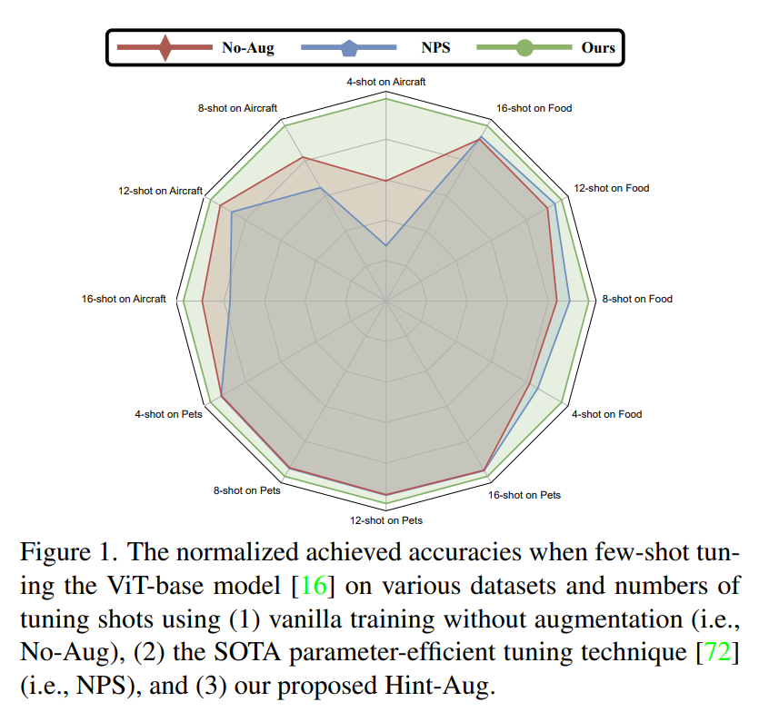
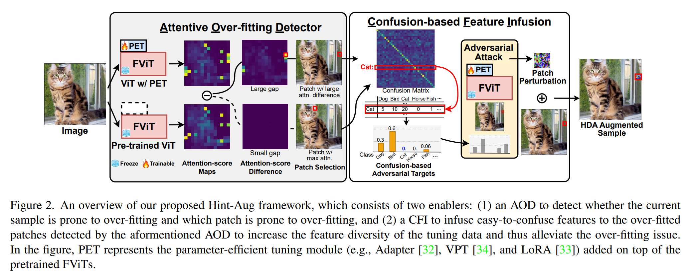
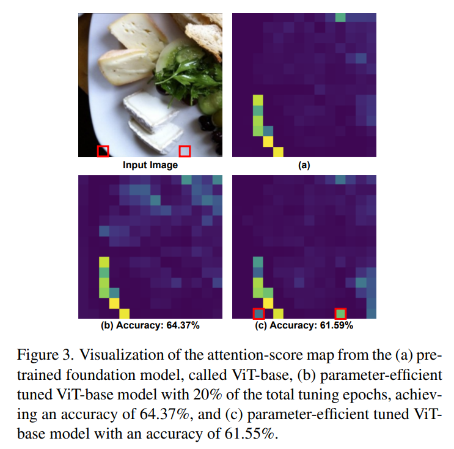
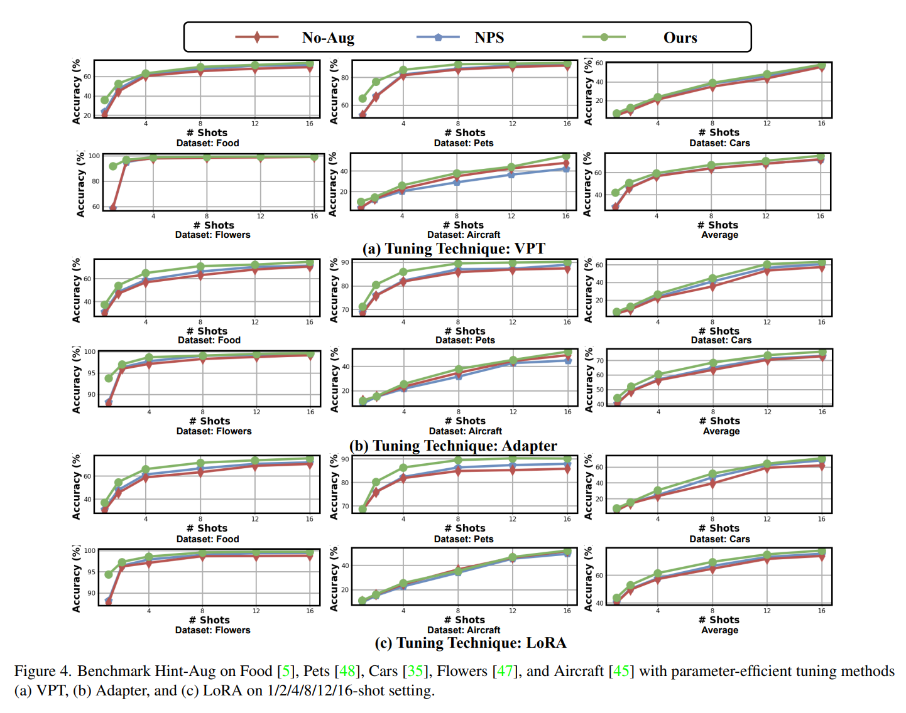
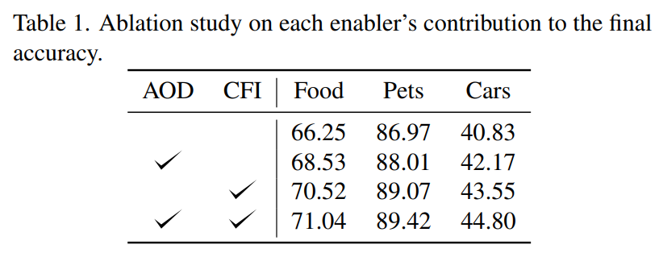
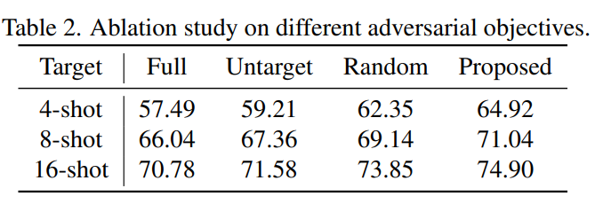
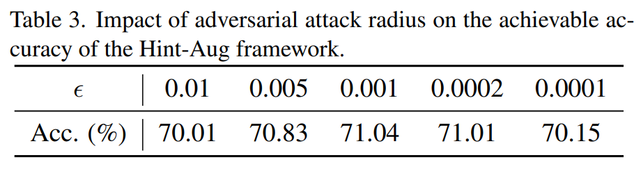
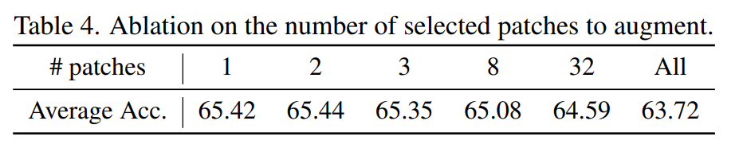
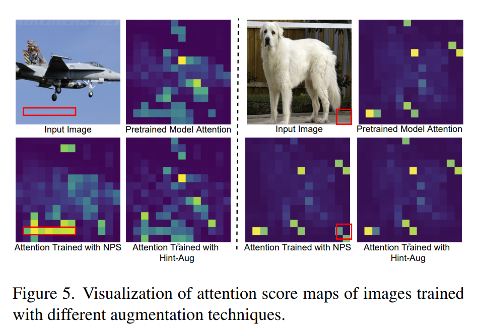
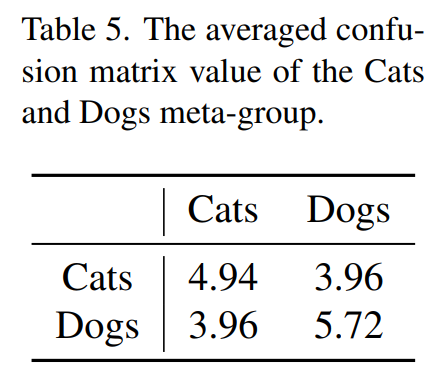

논문 및 image 출처 : <https://openaccess.thecvf.com/content/CVPR2023/papers/Yu_Hint-Aug_Drawing_Hints_From_Foundation_Vision_Transformers_Towards_Boosted_Few-Shot_CVPR_2023_paper.pdf>

# Asbtract

foundation vision transformers (FViTs)를 downstream task 에 맞게 tuning 하는 수요가 증가하고 있음에도 불구하고, data-limited scenarios (e.g., few-shot tuning)에서 FViTs 의 잠재력을 완전히 발휘하는 것은 data-hungry nature 로 인해 여전히 어려운 과제이다.

Common data augmentation 기술은 few-shot tuning data 에 포함된 limited features 때문에 이 상황에서 효과가 부족하다.

이 문제를 해결하기 위해, 저자는 few-shot tuning 에서 FViTs 의 가능성을 발견했다: 

- pre-trained FViTs 는 large-scale pretraining data 로부터 이미 매우 대표적인 특징들을 학습했으며, 이는 널리 사용되는 parameter-efficient tuning 에서 완전히 보존된다.
- 저자는 이러한 learned features 를 활용하여 tuning data 를 augment 하면 few-shot FViT tuning 의 효과를 높일 수 있다고 가정한다.

이를 위해 저자는 **Hint**-based Data **Aug**mentation (Hint-Aug)이라는 framework 를 제안하며, 이는 tuning samples 의 over-fitted parts 를 pre-trained FViTs 의 learned features 로 augmenting 하여 FViT 의 few-shot tuning 을 강화하는 것을 목표로 한다.

구체적으로, Hint-Aug 는 two enablers 를 통합:

1. foundation ViTs 에서 over-confident patches 를 탐지하여 few-shot tuning data 에서 over-fitting 을 잠재적으로 완화할 수 있는 **A**ttentive **O**ver-fitting **D**etector (AOD)
2. 위의 AOD 에 의해 탐지된 over-confident patches 에 pre-trained FViTs 의 easy-to-confuse features 를 주입하여 tuning 중에 feature diversity 를 강화하는 **C**onfusion-based **F**eature **I**nfusion (CFI) module 이다.

5 datasets 과 3 parameter-efficient tuning 기술에 대한 광범위한 실험과 ablation study 를 통해 Hint-Aug 의 효과가 일관되게 입증되었다:

- various low-shot setting 에서 SOTA 의 data augmentation 방법보다 0.04% ∼ 32.91% 더 높은 정확도를 기록.
- 예로, Pet dataset 에서 Hint-Aug 는 50% less training data 로 SOTA data augmentation 보다 2.22% 더 높은 정확도를 달성.

# 1. Introduction

Foundation Vision Transformers (FViTs)은 최근 다양한 downstream task 에서 큰 잠재력을 보여주고 있다. 

FViTs 의 성공은 deep learning 의 새로운 패러다임을 안내한다: large-scale dataset 에 FViT 를 pre-training 후, 최근 개발된 parameter-efficient tuning 방법들 (e.g., visual prompt tuning (VPT), visual prompting, LoRA 및 Adapter)을 사용해 limited tuning data 로 pre-trained FViT 를 tuning.

그러나, real-world applications, 특히 few-shot tuning scenarios 에서 pre-trained FViTs 를 효과적으로 tuning 하는 것은 여전히 어려운 과제이다.

그 이유는 parameter-efficient tuning 이 FViT 전용으로 설계되었으며 trainable parameters 를 줄여 overfitting 을 완화할 수 있지만, FViTs 의 data-hungry nature 는 완화되지 않으므로 data-limited scenarios (e.g., few-shot tuning scenarios) 에서 달성 가능한 정확도는 여전히 제한적이기 때문이다.

따라서 various downstream task 에서 few-shot tuning 으로 pre-trained FViTs 를 효과적으로 tuning 하는 방법은 여전히 해결되지 않은 질문이다.

---

few-shot scenarios 에서 parameter-efficient FViT tuning 의 효과를 높이기 위해, data augmentation 기술을 활용하여 tuning 중 모델의 data diversity 와 feature diversity 를 증가시키는 것이 유망한 방향이다.

그러나 기존의 data augmentation 기술은 few-shot tuning scenarios 에서 모델 정확도를 높이는 데 한계가 있다.

기존의 data augmentation 기술은 대부분 random-based (e.g., RandAugment, AutoAugment, color jitter, mixup 및 cutmix) 로, training data 에서 기존의 특징들을 무작위로 조합하기 때문에 new 및 meaningful features 를 생성할 수 없다.

Fig. 1 처럼, 저자는 널리 사용되는 random-based data augmentation 기술 (e.g., RandomAugment, color jitter 및 random erasing 을 포함한 전용 조합) 또는 data augmentation 없는 training 이 few-shot tuning 의 다양한 datasets 에서 만족스러운 정확도에 일관적으로 달성할 수 없는 것을 관찰한다.

특히, fine-grained classification tasks (e.g., Aircraft dataset) 에 적용될 때, 이러한 random-based data augmentation 기술들은 정확도를 떨어뜨리기도 한다.

그 이유는 random-based data augmentation 기술들이 out-of-manifold sample 을 쉽게 생성할 수 있으며, 이는 few-shot tuning scenarios 에서 limited training samples 로 인해 정확도를 크게 저하시킬 수 있다.

따라서, various downstream task 에서 FViT tuning 의 효과를 높이기 위해서는 주어진 training sample 을 다양한, 하지만 여전히 in-manifold 인 특징으로 adaptively augment 할 수 있는 data augmentation 기술을 개발하는 것이 중요하다.

이 연구는 효과적인 few-shot FViT tuning 에 대한 증가하는 수요와 기존 기술로 달성 가능한 정확도 사이의 격차를 좁히기 위해 시작되었다.

특히, few-shot parameter-efficient tuning 에서 pre-trained FViT 의 wegiht 는 tuning 동안 고정된다.

기존 연구에서는: (1) pre-trained transformer model 이 이미 복잡하지만 generalizable features 를 학습했다는 사실과, (2) gradient-based 방법이 pre-trained model 에서 learned features 를 추출한 후 이를 input images 에 추가할 수 있다는 사실에 주목했다.

따라서, FViT 의 few-shot tuning 정확도는 pre-trained FViT 의 learned feautres 를 활용함으로써 크게 향상될 수 있다고 가정했다.

구체적으로, 저자는 다음과 같은 기여를 했다:

- pre-trained FViT 의 learned features 을 활용하여 data augmentation 전략이 사용된 input-adative manner 의 training  dataset 을 guiding 하여 few-shot tuning scenarios 에서 FViT 의 달성 가능한 정확도를 높이는 것을 목표로 하는 **Hint**-based Data **Aug**mentation (Hint-Aug) framework 를 제안했다.
- Hint-Aug framework 는 두 가지 주요 요소를 통합했다:
  - (1) 주어진 training dataset 에서 over-fitting sample 과 patches 를 pre-trained FViT 의 attention map 을 이용해 식별하는 **A**ttentive **O**ver-fitting **D**etector(AOD)와,
  - (2) pre-trained FViT 의 learned features 들을 training data 에 adaptively infuse 하여 downstream 에 better tuning 을 효과적으로 하는 **C**onfusion-based **F**eature **I**nfusion(CFI) module
- 5 dataset 과 3 parameter-efficient tuning 기술에 대한 광범위한 실험과 ablation study 를 통해 제안된 Hint-Aug framework 의 효과가 일관되게 검증되었음.
  - 다양한 few-shot 설정에서 최신 data augmentation 방법들보다 0.04% ∼ 32.91% 더 높은 정확도를 기록했다. 
  - 예로, Pets dataset 에서는 SOTA augmentation 방법에 비해 50% less training data로 2.22% 더 높은 정확도를 달성했다.

# 2. Related Works

## 2.1. FViTs

최근 Vision Transformers (ViTs)의 성공에 영감을 받아, ViTs 의 model size 를 확장해 FViTs 를 구축하는 것이 주목받고 있다.

이는 large-scale neural language processing 의 성공을 CV 분야에 복제하려는 목표를 가지고 있다.

FViTs 개발에 대한 기존 연구는 크게 두 가지로 나뉜다: (1) ViTs 의 architecture 를 확장해 강력한 FViTs 를 구축하는 연구와, (2) FViTs 의 learned representations 를 downstream task 에 효과적으로 generalization 될 수 있도록 하는 self-supervised learning 기법을 개발하는 연구이다.

기존의 Convolutional Neural Networks (CNNs)와 달리, FViTs 는 global featuress= 를 추출하기 위해 self-attention 메커니즘을 광범위하게 사용하여 larger model (e.g., 10G FLOPs 이상)으로도 향상된 작업 정확도를 얻는다.

구체적으로, ViTs 에서는 $X = [x_1, \cdots, x_N]^\top \in \mathbb{R}^{N \times D}$ 에서 $D$ 가 embedding dimension 인 input image patches $N$ 가 ViT block 에 의해 순차적으로 처리된다.

각 블록에서 input 은 linear projection 을 통해 query $Q \in \mathbb{R}^{N \times d}$, key $K \in \mathbb{R}^{N \times d}$, value $V \in \mathbb{R}^{N \times d}$ 로 변환된 후 self-attention 을 계산한다.

self-attention 은 다음과 같이 계산된다:

$$
\begin{equation}
    \text {Attention}(Q,K,V) = \text{softmax} \left(\frac{QK^T}{\sqrt{d}}\right) V
\end{equation}
$$

이 output 은 feed-forward network 로 전달되어 channel dimesion 에서 정보를 추출하게 된다.

## 2.2. Parameter-efficient Tuning

FViTs 의 large-scale dataset 에 대한 인상적인 pre-training 성능에 힘입어, FViTs 를 real-world applications 에 적용하려는 관심이 커지고 있다.

일반적으로 pretraining-then-tuning 패러다임을 따라 pre-trained FViTs 를 다양한 downstream task 에 맞춰 tuning 한다. 그러나 conventional weight tuning 방식에서는 각 task 마다 additional model weight set 을 저장해야 하므로 storage overhead 가 과도해질 수 있다.

이를 해결하기 위해 various parameter-efficient tuning 방법이 제안되었다. parameter-efficient tuning 에선 pre-trained FViTs 에 tiny learnable module 을 추가하는 반면, tuning 중에는 FViTs 의 backbone weights 는 변경되지 않는다.

이 approach 는 두 가지 이점을 제공: (1) negligible additional parameters 로 FViTs 를 new downstream task 에 맞춰 tuning 할 수 있으며, (2) 추가된 parameter-efficient tuning module 을 제거하기만 하면 pre-trained FViTs 를 쉽게 복원할 수 있다.

최근 parameter-efficient tuning 기술 중, LoRA 는 backbone weight 위에 low-dimension 의 weight 를 학습하고, VPT 는 prompt tuning 아이디어를 사용해a dditional token 으로 task-specific prompt 를 삽입한다. 

더 최근에는 NPS 가 parameter-efficient tuning 기술과 해당 hyper-parameter 의 optimal combination 을 neural architecture search 를 통해 탐색하는 방법을 제안했다.

## 2.3. Few-shot Tuning

Few-shot tuning 은 class 당 limited samples 로 pre-trained model 을 new tasks 에 tuning 을 목표로 한다.

이는 많은 real-world applications 에서 high-quality data 가 부족하기 때문에 최근 몇 년간 점점 더 많은 주목을 받고 있다.

최근 몇 가지 선도적인 연구들은 ViTs 의 few-shot tuning 을 목표로 하여, self-attention module 의 지침 하에 meta-learning tasks 와 learning objectives 를 사용자 정의하는 방법을 제안했다.

본 논문에서는 few-shot tuning sample 을 adaptively augmenting 하여 부족한 다양한 특징을 보완함으로써 FViTs 의 few-shot tuning 정확도를 높이는 것을 목표로 한다.

## 2.4. Data Augmentation

data augmentation 은 data diversity 을 높이고, 따라서 model 의 feature diversity 를 증가시키는 것을 목표로 한다.

효과적인 data augmentation 전략은 data diversity 를 적절히 향상시키면서 동시에 과도한 augmentation intensity 에 의해 생성된 out-of-manifold data 를 생성하지 않아야 한다.

다양한 data augmentation 기술이 제안되었지만, few-shot tuning 환경에서 data 를 효과적으로 augmenting 하는 방법은 여전히 풀리지 않은 질문이다.

few-shot data 의 limited data diversity 에는 novel meaningful features 를 생성할 수 있는 기술이 필요하다.

이를 위해 대부분의 기존 few-shot data augmentation 기술은 in-domain data 를 생성하기 위해 generative models 를 채택하지만, 이는 FViTs tuning 의 memory 및 storage overhead 를 더욱 증가시킨다.

앞서 언급한 문제를 완화하는 한 가지 잠재적인 방법은 beneficial features 을 가진 sample 을 생성하기 위해 adversarial 기법을 사용하는 것이다.

그러나 이러한 연구의 대다수는 clean accuracy 향상이 아닌 adversarial robustness 를 향상시키는 데 초점을 맞추고 있다.

반면, 본 연구는 few-shot parameter-efficient tuning 중 clean accuracy 를 높이기 위해 beneficial features 을 생성할 수 있는 adversarial training 을 활용할 기회를 탐구한다.

# 3. The Proposed Hint-Aug Framework

## 3.1. Hint-Aug: Motivation

저자는 먼저 parameter-efficient tuning 과 pre-trained FViTs 의 특성이 FViTs 의 parameter-efficient tuning 에 독특한 기회를 제공한다는 것을 확인했다.

이 관찰에 기반하여, 이러한 특성을 활용하여 tuning 효과를 향상시키기 위한 Hint-Aug framework 를 제안한다. 

각 특성에 대해 자세히 설명하면 다음과 같다:

#### Characteristics of parameter-efficient tuning:

Sec 2.1 및 2.2 에서 언급했듯이, pre-trained FViTs 의 weights 는 tuning 중에 고정된다.

따라서, added tuning modules (e.g., Adapter, VPT, LoRA 등)이 제거되면 tuning 된 FViTs 는 pre-trained 버전과 동일하게 동작한다.

이 특성을 활용하여 pre-trained FViTs 를 활용해 few-shot tuning 정확도를 향상시킬 수 있는지를 고려하게 되었다.

#### Characteristics of pretrained FViTs:

기존 연구에 따르면, pre-trained FViTs 는 learned features 에 관해 두 가지 유망한 특성을 가진다: 

1. pre-trained FViTs 는 복잡하지만 meaningful features 식별할 수 있다, 심지어 tuning 하지 않은 unseen dataset 에 대해서도; 
2. FViTs 에서 learned features 는 gradient-based 방법을 사용하여 input image space 로 reversely project 될 수 있다.

이러한 parameter-efficient tuning 과 pre-trained FViTs 의 특성을 고려할 때, 저자는 pre-trained FViTs 를 효과적으로 활용하여 few-shot tuning data 를 augmenting 할 수 있는 독특한 기회를 제공할 것이라고 가정했다.

이 가설을 검증하기 위해, pre-trained FViTs 에서 learned features 을 활용하여 few-shot tuning 의 효과를 높일 수 있는 적절한 방법을 탐구하고자 한다. 특히, few-shot tuning 의 두 가지 주요 과제인 overfitting 과 tuning data 의 diversity lack 에 대해 다음과 같은 질문을 설정했다:

- **Q1**: pre-trained FViTs 가 few-shot tuning 중에 발생할 수 있는 overfitting 문제를 감지할 수 있는가?
- **Q2**: pre-trained FViTs 를 활용하여 data diversity 을 향상시킬 수 있는 meaningful features 를 생성할 수 있는가?

저자의 Hint-Aug framework 는 이러한 두 가지 질문에 대한 효과적인 솔루션을 제공한다.

## 3.2. Hint-Aug: Overview

저자는 먼저 제안하는 Hint-Aug framework 의 개요를 제공한다.

이 framework 는 parameter-efficient tuning 의 특성을 활용하여, tuning 중에 pre-trained FViTs 의 weight 가 업데이트되지 않으므로 pre-trained FViTs 에서 learned features 를 tuning data augmentation 에 활용하는 few-shot parameter-efficient tuning 을 위해 설계되었다. 

Fig. 2 에서 볼 수 있듯이, Hint-Aug 는 두 단계로 이루어진 detect-then-augment pipeline 을 채택했다.

- 특히, **Q1** 에 답하기 위해 Hint-Aug 는 AOD 를 사용하여 (1) tuned FViT 가 이 image 에 대해 overfitting 이 발생했는지, (2) image 의 어떤 patch 가 overfitting 에 더 취약한지를 탐지한다.
- **Q2** 에 대응하여, Hint-Aug 는 CFI module 에 easy-to-confuse features 를 주입하여 AOD 의 detected patch 를 augmenting 한다

## 3.3. Enabler 1: Attentive Over-fitting Detector

Over-fitting 은 few-shot tuning scenarios 에서 잘 알려진 문제이며, few-shot FViT tuning 동안 model size 와 data size 의 제한으로 인해 이 문제가 더욱 심화된다.

따라서 AOD 는 FViTs 의 parameter-efficient tuning 중 각 tuning sample 에 대해 실시간으로 overfitting 문제를 감지할 수 있는지 탐구하는 것을 목표로 한다.

이전 연구에서 FViTs 의 attention distribution 을 다양한 방식으로 시각화한 것을 참고하여, tuning 과정에서 attention distribution 의 변화가 overfitting 의 존재를 식별하는 숨겨진 단서를 포함하고 있다고 가정했다.

이 가설을 검증하기 위해, 저자는 FViT 의 attention distribution 에 대한 각 input image patch 의 영향을 정량화하기 위해 attention-score map 을 사용했다.

구체적으로, attention-score map 은 input image 의 각 patch 에 해당하는 attention-score 로 구성되며, attention-score 는 다음과 같이 정의하였다:

$l$-th layer 의 $h$-th head 의 $i$-th patch 에 대한 attention distribution $[a^{(l,h,i)}_1, \dots, a^{(l,h,i)}_N]$ 가 주어졌을 때, $k$-query patch 에 대한 $j$-th patch 의 attention-score $s^{l,k}_j$ 는 다음과 같이 정의된다:

$$
\begin{equation}
  s_j^{(l,k)} = \sum _{h}a_j^{(l,h,k)}
\end{equation}
$$

간단히 하기 위해, 이후 $l$ 과 $k$ 의 상첨자를 생략했다.

---

tuning 의 different stages 에서 attention-score 를 시각화함으로써, Fig. 3 에서 볼 수 있듯이 두 가지 관찰을 할 수 있다: 

1. pre-trained FViT 자체의 attention-score map (Fig. 3(a))은 half-tuned FViT model 의 map 과 높은 상관 관계를 가지며 (Fig. 3(b)), 상대적으로 higher tuning 정확도(e.g., 64.37%)는 해당 tuning stage 에서 overfitting 문제가 심각하지 않음을 시사한다;
2. tuning 이 완료된 후의 attention-score map (Fig. 3(c) 참조)은 pre-trained FViT 가 집중하지 않은 특정 patches(red)에 더 집중하며, lower tuning 정확도(e.g., 61.55%)는 overfitting 문제가 존재함을 나타낸다.
3. 추가적으로, newly attracted higher attention-score 를 얻은 patches(red)는 식별을 위한 human-readable information 을 포함하지 않는다는 점을 발견했다.
   - 예로, 일부 patches 는 단지 검은색 배경으로만 구성되어 있어 target class 를 식별하는 데 기여하지 않는다.
   - 이 발견은 이러한 patches 가 overfitting 의 원인이 될 수 있음을 시사한다.

위의 관찰을 바탕으로, 저자는 pre-trained FViT 와 해당 tuned model 의 attention-score map 차이를 사용하여 overfitting 의 존재와 overfitting 문제에 가장 크게 기여하는 patches 를 식별하기 위한 AOD module 을 제안했다.

구체적으로, pre-trained FViT(이하 $P$)에서 생성된 attention-score map $S^P = [s^P_1, \cdots, s^P_N]$ 와 tuning 될 FViT model(이하 $T$)에서 생성된 $S^T = [s^T_1, \cdots, s^T_N]$ 에 대해, over-fitting 지표를 다음과 같이 정의한다:

$$
\begin{equation}
  I=\left \{ \begin {array}{rl} 0, & \sum _{i}\|s_i^P - s_i^T\| < \lambda \sum _{i}\|s_i^P\| \\ 1, & \text {otherwise} \end {array} \right .
\end{equation}
$$

- $\lambda$ : overfitting 감지의 민감도를 조절하는 hyper-parameter.

over-fitting 이 발생하면 (i.e., $I = 1$), attention-score map 을 크게 변화시킨 patches 를 overfitting 문제를 완화하기 위해 augmenting 할 target patches 로 선택한다.

따라서 augmenting 할 patch $p$ 는 다음과 같이 정의된다:

$$
\begin{equation}
  p = \arg \max _i (\|s_i^P - s_i^T \|)
\end{equation}
$$

반면, over-fitting 문제가 감지되지 않은 경우, 해당 image 에서 attention-score 가 가장 높은 patch 를 augmenting 할 target patches 로 선택한다.

## 3.4. Enabler 2: Confusion-based Feature Infusion

위에서 AOD 로 선택된 over-fitted patch 를 강화하여 (1) over-fitting 문제를 완화하고 (2) meaningful features 로 tuning data 의 diversity 를 augmenting 하는 방법에 대한 남은 질문은 무엇인가? 이에 저자는 CFI 를 제안한다. 

이는 pre-trained FViT model 에서 learned features 을 추출하고 selected patch 에 주입하여 tuning data 의 feature diversity 을 meaningful way 로 향상시키는 목적으로 attack-based methods 를 사용한다.

그러나 few-shot tuning 정확도를 향상시킬 수 있는 meaningful features extraction 및 infusion 은 쉽지 않다.

흔히 사용되는 attack objectives (e.g., image 를 왜곡하여 correct class 의 model output logit 을 감소시키는 것)으로 samples 를 단순히 augmening 하면 결과적으로 out-of-manifold sample 이 발생할 수 있다.

이는 Sec. 4.3.2 에서의 실험 결과로 나타났다.\

이를 극복하기 위해 CFI module 은 injected features 를 활용하여 model prediction 을 synthetic target label 방향으로 유도한다.

이 target label 은 model 이 classes pair 간의 confusion 하기 쉬운 정도를 정량화하는 confusion matrix 를 사용하여 결정된다.

구체적으로, CFI 에서 confusion matrix $C \in \mathbb{R}^{M \times M}_{\geq 0}$ 을 구성한다. 

- $M$ : total number of classes

최근 open set detection 에 대한 연구에서 보여준 바와 같이, pre-softmax model output 은 sample 의 모델 불확실성을 보다 잘 보존할 수 있다.

따라서 저자는 $C$ 를 다음과 같이 정의한다:

$$
\begin{equation}
  C_{i,j} = \sum_{X:y(X)=j} \left( f_i(X) - \min_{i'} f_{i'}(X) \right)
\end{equation}
$$

- $i$ 와 $j$ 는 $C$ 의 좌표로, two classes 를 나타냄
- $y$ 와 $f ∈ \mathbb{R}^M$ 은 input image $X$ 에 대한 각각의 ground truth label 과 pre-softmax output 을 의미.
- generated confusion matrix $C$ 는 model 로 학습된 class-wise similarity 를 식별하고 model 이 쉽게 혼동하는 class pairs 를 구별하는 데 도움을 준다.

patch 에 easy-to-confuse feature 를 주입하기 위해, input $X$ 와 label $y$ 가 주어졌을 때, 저자는 attack label $\tilde{f}(X) \in \mathbb{R}^M_{\geq 0}$ 을 설계하기로 한다.

여기서 $i$-th element 는 다음과 같이 계산된다:

$$
\begin{equation}
  \tilde{f}_i(X) = \left\{
  \begin{array}{lr}
  \frac{C_{i,y}}{\sum_{j} C_{j, y} - C_{y,y}}, & \text{if } i \neq y \\
  0, & \text{if } i = y
  \end{array}
\right.
\end{equation}
$$

loss function 은 다음과 같이 정의된다:

$$
\begin{equation}
  \mathcal{L}_{tar} = \text{CrossEntropy}(\text{softmax}(f), \text{softmax}(\tilde{f}))
\end{equation}
$$

위 loss 를 minimizing 하기 위해 patch 를 optimizing 함으로써, generted features 는 모델이 current class 의 easy-to-confuse 를 고려하는 방향으로 shift 해준다.

이러한 shift 는 current class 와 easy-to-confuse 간의 구분을 학습하도록 하여, current class 의 decision boundary 를 효과적으로 확장한다.

# 4. Experimental Results

## 4.1. Experimental Setup

#### Datasets, Few-Shot Settings, Models, and Parameter-Efficient Tuning Techniques.

**_Datasets and Few-Shot Settings_.**

저자는 Food, Pet, Cars, Flowers, Aircraft 의 5 datasets 를 채택하여 Hint-Aug 을 다양한 few-shot tuning scenarios 에서 평가한다. 

각 dataset 에서 1/2/4/8/12/16-shot scenarios 를 기준으로 정확도를 평가한다.

**_Models_.**

실험은 널리 사용되는 FViT MODEL 인 ViT-Base 를 기반으로 진행한다.

**_Adopted Parameter-Efficient Tuning Methods_.**

Adapter, LoRA, VPT 등 세 가지 널리 사용되는 parameter-efficient tuning 방법을 고려한다.

#### Baselines.

제안된 Hint-Aug 을 두 가지 baselines 와 비교한다.

하나는 parameter-efficient FViT tuning 을 위한 SOTA data augmentation 기법인 NPS 이며, 다른 하나는 augmentation 없는 vanilla tuning (No-Aug) 를 수행한다.

data diversity 의 한계가 있는 few-shot tuning scenarios 에서, SOTA data augmentation 기법인 NPS 조차도 No-Aug 보다 성능이 떨어질 수 있기 때문에 No-Aug 을 baselines 으로 포함하는 것이 필요하다.

#### Tuning Settings.

실험에서 저자는 $l = 5$ 로 설정하고, 각 image 의 center patch 를 query patch 로 사용한다 (i.e., $k = 90$).

저자는 mixup 의 널리 채택된 few-shot tuning 설정을 따른다. 

구체적으로,

- model 을 100 epochs 동안 tuning
- batch size 256
- learning rate 0.01
- SGD optimizer
- ImageNet-pre-trained ViT-Base 사용
- NPS 를 따르며, data augmentation 기법으로 color-jitter (factor 0.4)와 RandAugment (9 의 크기와 0.5 의 표준 편차)을 사용
- Eq. (3) 에서 $\lambda$ 는 0.1 로 설정하고, FGSM 을 사용하여 attack radius $\epsilon = 0.001$ 의 adversarial samples 을 생성한다.
- 모든 실험은 세 번 실행하여 평균 정확도를 보고한다, NPS 를 따른다.

## 4.2. Benchmark on Few-Shot Image Classification

저자는 제안된 방법을 5 few-shot image classification datasets 에서 다양한 parameter-efficient tuning 기법과 few-shot settings 로 벤치마킹한다.

Fig. 4 에서 보이듯.

- SOTA augmentation baselines 인 NPS 는 fine-grained image classification dataset (e.g., Aircraft 에서 5.55% 정확도 감소)에서 Vanilla tuning 방법인 No-Aug 에 비해 상당한 정확도 감소를 겪는 반면,
- Hint-Aug 은 Adapter, VPT, LoRA tuning 을 사용할 때 baselines 보다 0.25% ~ 6.10%, 0.10% ~ 32.91%, 0.04% ~ 6.17% 더 높은 정확도를 기록.

특히, 두 가지 흥미로운 관찰 결과를 도출:

1. Hint-Aug 로 생성된 feature 는 부족한 tuning data 로 인한 문제를 보완하고, 더 엄격한 few-shot 설정에서 정확도를 향상시킬 수 있다.
   - 예로, Food 와 Pets dataset 에서 Adapter 와 LoRA 를 tuning 할 때 8-shot tuning 의 정확도를 2.45% ~ 4.96% 향상시키며, 12-shot tuning 에서 NPS 보다 0.73% ~ 2.22% 더 높은 정확도를 기록.
2. Hint-Aug 의 pre-trained FViT 에서 추출한 features 를 tuning data 로 주입하는 능력은 extreme few-shot scenarios (e.g., 1-shot tuning)에서 정확도를 상당히 향상시킬 수 있다.
   - 예로, Pets dataset 에서 Hint-Aug 을 사용하여 VPT 를 1-shot setting 으로 tuning 하면 NPS 보다 32.91% 높은 정확도를 달성했다.

## 4.3. Ablation Studies

### 4.3.1 Accuracy Improvement Breakdown

#### Setup.

Hint-Aug 의 각 구성 요소인 AOD 와 CFI 가 최종 정확도에 기여하는 정도를 이해하기 위해, 저자는 Adapter 를 사용하여 Food, Pets, Cars dataset 에서 8-shot tuning 을 수행하는 ablation study 를 진행한다.

이 실험은 다음과 같이 구성된다:

1. AOD 만 사용하는 경우, mixup 에서 제안된 data augmentation 방법을 사용하여 선택된 patch 를 augment.
2. CFI 만 사용하는 경우, $\mathcal{L}_\text{tar}$ loss 를 사용하여 sample 을 생성하고, 각 image 에서 무작위로 patch 를 선택하여 augment.

#### Observations.

Tab. 1 에 나타난 바와 같이, selected patch 를 augment 할 때 다음과 같은 결과를 관찰할 수 있다:

1. AOD 또는 CFI 중 하나만 사용해도, 각각 1.04% ~ 2.28% 및 2.10% ~ 4.27% 의 정확도 향상이 이루어진다 (baselines: AOD 와 CFI 모두 비활성화).
   - 이는 두 가지 주요 문제 (i.e., over-fitting 문제와 feature diversity lack)가 실제로 few-shot tuning 의 정확도에 악영향을 미치며, 제안된 두 가지 방법이 효과적으로 이러한 문제를 완화할 수 있음을 나타낸다.
2. AOD 와 CFI 를 모두 결합하면 두 방법의 장점을 모두 활용할 수 있어, 각각의 AOD 또는 CFI 만 활성화했을 때보다 0.35% ~ 2.63% 더 높은 정확도를 달성할 수 있다.

### 4.3.2 Ablation on Adversarial Objectives

#### Setup.

저자는 feature infusion 을 위해 adversarial sample 을 생성할 때 사용되는 loss function 의 선택을 검증하기 위해 ablation study 를 진행한다.

앞서 설명한 바와 같이, 서로 다른 loss function 이 tuning 정확도에 미치는 영향이 다를 수 있으며, 부적절한 loss function 는 clean accuracy 에 악영향을 미칠 수 있다.

Tab. 2 에서는 

- Food dataset 에서 Adapter 를 사용하여 tuning 할 때 "Full" 은 whole image 로 adversarial sample 을 생성하는 방법을 의미하며, 
- "Untarget" 은 correct class 의 model output logits 을 줄이는 conventional attack target 을 사용하여 선택된 patch 를 augmenting 하는 방법을 의미한다.
- "Random" 은 무작위로 선택된 class 쪽의 augmented image 의 output 으로 오도하도록 선택된 patch 를 augmenting 하는 방법을 의미한다.

#### Observations.

Tab. 2 에 나타난 바와 같이,

- "Full" 방법은 가장 낮은 정확도(0.80% ~ 1.72% 낮음)를 기록하며, "Untarget" 방법이 두 번째로 낮은 정확도를 기록한다.
- "Untarget" 은 또한 제안된 방법에 비해 3.32% ~ 5.71% 낮은 정확도를 기록한다.
- 이러한 두 가지 관찰 결과는 
  1. whole image attacking 이 FViT tuning 에 효과적이지 않으며, 
  2. "Untarget" attack 을 단순히 사용하는 것은 out-of-manifold data 로 이어질 수 있음을 시사한다.
- 또한, "Random" 방법이 "Untarget" 보다 1.78% ~ 3.14% 높은 정확도를 기록한 것은, other classes 에서 특징을 추가하는 간단한 방법이 tuning 에 도움이 될 수 있음을 나타낸다.
- 그러나 "Random" adversarial objective 는 more precise augmentation direction 의 부족으로 인해 정확도 향상이 제한되며, Hint-Aug 에서 사용된 adversarial objectives 보다 1.05% ~ 2.57% 낮은 정확도를 기록한다.

## 4.3.3 Sensitivity to Augmentation Intensity

최근 연구에 따르면, augmentation intensity 는 FViT tuning 에서 중요한 요소다.

따라서 저자는 adversarial attack radius $\epsilon$ 이 Hint-Aug 의 정확도에 미치는 영향을 조사한다.

Adapter 를 사용하여 Food dataset 에서 8-shot setting 으로 tuning 할 때, Hint-Aug 은 adversarial radius 가 급격히 변화해도 비교적 안정된 정확도를 달성한다.

구체적으로, Tab. 3 에 나타난 바와 같이,

- $\epsilon$ 을 5배 증가시키거나 감소시켜도 정확도 변화는 0.03% ~ 0.21% 에 불과하며, 
- $\epsilon$ 을 10배 변화시키면 0.89% ~ 1.03% 의 정확도 변화가 발생한다.
- 이는 Hint-Aug 이 hyper-parameter 선택에 대해 강인함을 입증한다.
- 주목할 만한 점은 $\epsilon$ 을 10배 변화시키는 것이 non-trivial change 라는 것이다
- [Patch-fool] 의 연구에 따르면, $\epsilon$ 을 8배 변화시키는 것만으로도 ImageNet 에서 DeiT-Tiny 에 대해 27.94% 이상의 정확도 변화가 발생한다.

### 4.3.4 Number of Patches to Augment

Hint-Aug 이 달성한 accuracy-data efficiency trade-off 에 영감을 받아, 각 image 에서 하나 이상의 patch 를 augmenting 하면 accuracy-efficient trade-off 를 더욱 개선할 수 있는지에 대한 흥미로운 질문이 제기된다.

이 질문에 답하기 위해, 저자는 Hint-Aug 을 사용하여 다양한 수의 augmented patches 를 실험하고, 8-shot VPT 로 tuning 할 때의 평균 정확도를 보고한다.

- 주목할 점은, all patches 를 증강하는 것 (Tab. 4 의 “All” column)은 patch information 을 고려하지 않고 whole image 를 augmenting 하는 것과 동등하다는 것이다.
- 실험 결과, 각 image 에서 1 ~ 3 patches 를 augmenting 한 경우 평균 정확도가 비슷하게 유지되며 (정확도 변화는 0.1% 미만), 그러나 8 patches 를 augmenting 한 경우 평균 정확도가 0.34% ~ 1.70% 감소한다.
- 이는 각 image 에서 over-fitting 되기 쉬운 patch 가 일부에 불과하다는 것을 고려할 때, 너무 많은 patches 를 augmenting 하면 오히려 attention-score map 이 손상되어 정확도가 감소할 수 있다고 추측된다.

## 4.4. Visualization of Attention Score Maps

Hint-Aug 의 over-fitting 문제 완화 효과를 검증하기 위해, 저자는 pre-trained FViT, FViT tuned by NPS, 그리고 FViT tuned by Hint-Aug 의 attention-score map 을 시각화한다.

Fig. 5 에서 볼 수 있듯이, 

1. Hint-Aug 으로 tuning 한 후, NPS 로 tuning 된 attention-score map 에서 일반적으로 관찰되는 over-fitting 된 patch(red)가 성공적으로 제거되었으며
2. Hint-Aug 에서 얻은 attention-score map 이 pre-trained FViT 에서 얻은 high-attention score patch 의 localtion 과 유사한 위치를 나타내며, 이는 Hint-Aug 이 효과적으로 over-fitting 문제를 완화했음을 나타낸다.

## 4.5. Visualization of the Confusion Matrix

발견된 class-wise similarity 를 이해하기 위해, Pets dataset 에서 4-shot Adapter tuning setting 을 사용하여 confusion matrix 시각화한다.

저자는 Cats 및 Dogs meta-groups 의 confusion matrix value 를 평균 계산하고 Tab. 5 에 시각화한다.

- FViT 가 Cat 과 Dog meta-groups 간의 구별보다는 Cat 또는 Dog meta-group 내에서 서로 다른 classes 를 구별하는 데 훨씬 더 혼동되는 것을 관찰한다.
- 이는 pre-softmax output 만을 사용하는 저자의 전략이 간단함에도 불구하고, 생성된 confusion matrix 이 혼동하기 쉬운 class paris 를 효과적으로 식별할 수 있으며, 따라서 CFI 에 올바른 방향을 제시할 수 있음을 시사한다.

### 5. 결론

이 논문에서는 FViT 의 few-shot parameter-efficient tuning 정확도를 향상시키기 위해 Hint-Aug 이라는 framework 를 제안한다.

구체적으로, Hint-Aug 은 AOD 와 CFI 라는 두 가지 주요 구성 요소를 특징으로 하며, 각각 over-fitting 문제와 data diversity  부족 문제를 완화하는 데 중점을 둔다.

광범위한 실험과 ablation study 를 통해 Hint-Aug 이 SOTA data augmentation 방법에 비해 0.04% ~ 32.91% 높은 정확도를 달성하며, pre-trained FViT 를 실제 low-data 환경에서 보다 효과적으로 tuning 할 수 있는 새로운 관점을 열어준다.