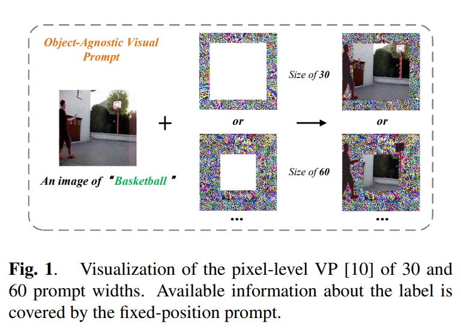
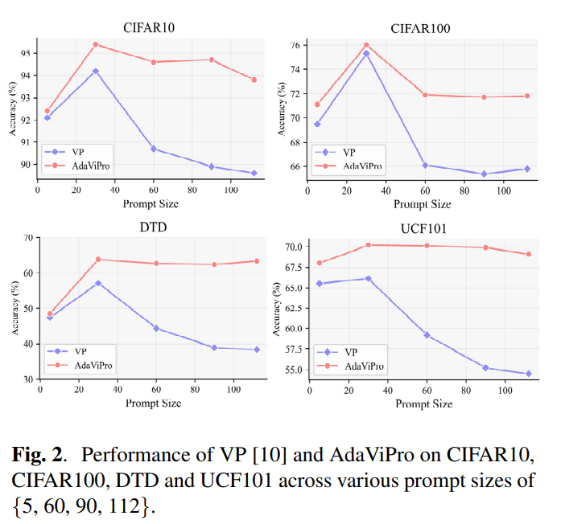
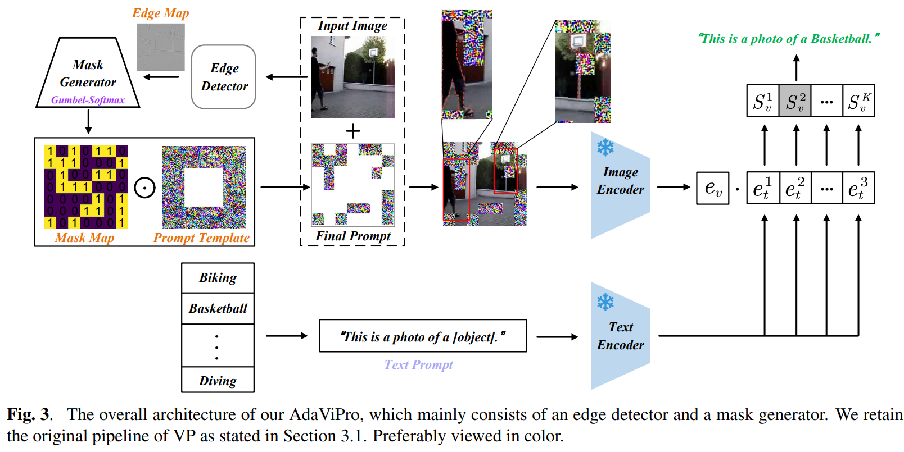
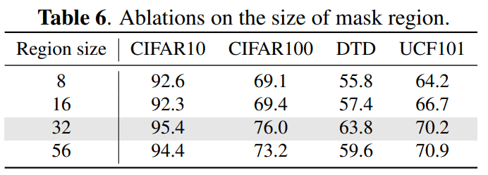
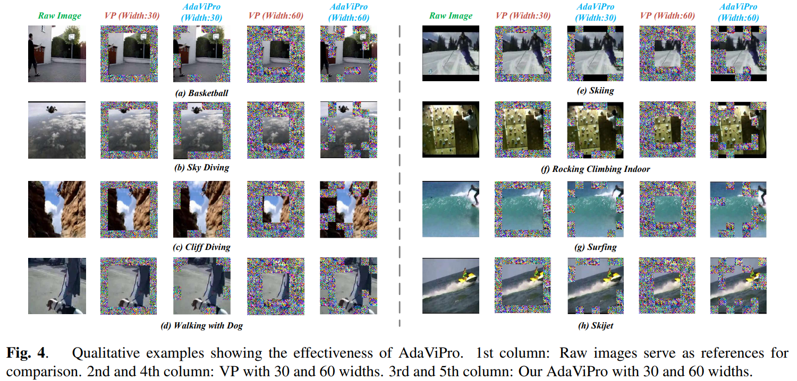

논문 및 이미지 출처 : <https://arxiv.org/pdf/2403.13282>

# Abstract

최근 prompt-based methods 가 새로운 대안으로 'parameter-efficient fine-tuning' 패러다임으로 떠오르고 있다.

그러나 기존 prompt 방법들은 주로 'what to add' 에 중점을 두고 있어 'where to add' 라는 또 다른 중요한 측면을 간과해 왔다.

일반적으로 수동으로 설계된 배치에 의존하고 있다. 

이에 저자는 'where to add' optimization 을 learning process 에 통합하는 region-based Adaptive Visual Prompt 인 AdaViPro 를 제안한다.

구체적으로, 

- 'where to add' optimization 을 regional decision-making 문제로 개념화한다.
- inference 중에 AdaViPro 는 whole image 에 대한 regionalized mask map 을 생성하여 각 specific area 에 prompt 를 적용할지 여부를 0 과 1 로 지정한다.
- 따라서 저자는 Gumbel-Softmax sampling 을 사용하여 AdaViPro 가 standard back-propagation 을 통해 end-to-end learning 이 가능하도록 한다.
- 체계적인 실험을 통해 AdaViPro 가 pre-trained model 을 adapting 하는데 있어 새로운 efficiency 와 accuracy 의 trade-off 를 제공함을 입증하였다.

# 1. Introduction

최근 label-free self-supervised learning 의 힘을 받아, Transformer 와 그 변형 모델들이 NLP, CV, ASP 등 다양한 분야에서 놀라운 성공을 거두었다.

그러나 model scale 이 커짐에 따라 기존의 pretraining-finetuning 패러다임이 비현실적이 된다.

이러한 large pre-trained model 들을 다양한 downstream task 에 fully fine-tuning 하는 것은 비용이 많이 들고 유연성이 떨어지는 동시에, downstream task 의 제한된 training data 로 인해 improper fine-tuning 은 pre-training 중 구축된 universal representation 을 훼손하여 그 효과를 감소시킬 수 있다.

이러한 딜레마를 해결하기 위해 prompt-based fine-tuning 이 large-scale pre-trained model 을 adapting 하는 대안적 패러다임이 도입됐다.

---

원래 NLP 에서 개발된 prompt tuning 은 fine-tuning 과정에서 parameter 를 freezing 상태로 유지한다. 이는 input format 을 task-relevant descriptions 로 전략적으로 수정하여 pre-training initialization 과 downstream task 간의 alignment 를 달성한다.

각기 다른 task 들은 task-specific adaption 에 대한 model 을 bootstrap 하기 위해 distinct descriptions 를 채택한다.

이 새로운 패러다임에서는 다양한 downstream task 가 동일한 pre-trained parameters 를 사용할 수 있어, PEFT process 를 촉진한다.

NLP의 성공을 이어받아, 이 간단하지만 효과적인 패러다임은 CV 에도 도입되었다.

최근의 몇몇 연구들은 learnable token 을 tokenized sequence 에 추가하거나 learnable noise 를 input image 에  겹치는 방식을 제안한다.

- 전자의 형식은 NLP 의 prefix tuning 과 유사하게 token sequence 를 수정하여, learnable token 울 original sequence 와 함께 model 에 추가 요소로 입력한다.
- 반면 후자의 형식은 pixel-level 에서 fixed position 에 task-specific 'mosaics' 를 직접 수정한다.
- 이러한 input modifications 덕분에 두 형식 모두 pre-trained model 을 downstream task 에 efficiently adapting 하며, tuning parameters 를 크게 줄였다.

---

prompt engineering  핵심 문제는 'what to add' 와 'where to add' 의 두 가지 측면에 초점을 맞춰야 한다. 기존 방법들은 'what to add' 에 주로 집중하면서, 'where to add' 라는 동등하게 중요한 측면을 간과해 왔다.

- 'what to add' optimizing 하기 위해, prompt 는 learnable parameter 로 추상화되어 end-to-end learning 에 참여한다. 그러나 그 위치는 수동으로 설정되어 최적의 효과를 달성하기 어렵다.
- Fig. 1(a) 같이, visual prompt 는 auxiliary information 을 제공하는 동시에 일부 raw information 을 희석하는 양날의 검이다.
  - prompt size 가 60 에 도달하면, label 에 대한 available information 이 거의 없어진다.
- Fig. 2 에서도 prompt size 가 증가함에 따라 VP 의 성능이 급격히 감소하는 것을 볼 수 있다.
  - 따라서 object 의 size 나 distribution 이 가변적이기 때문에 fixed-position prompt 는 이러한 가변성에 adapting 할 수 없으며, model 의 판단을 방해할 수 있다.

이를 고려해, 저자는 large-scale pre-trained models 를 downstream task 에 efficiently adapting 을 위해 region-based Adaptive Visual Prompt method 인 AdaViPro 를 제안한다.

기존의 수작업으로 설정된 prompt position 과 달리, AdaViPro 는 training 과정에 'where to add' optimization 을 통합한다.

구체적으로, 

- 'where to add' 의 문제를 region decision-making 으로 변환한다.
- AdaViPro 는 whole image 를 대상으로 regionalized mask map 을 생성하여, 각 특정 영역에서 prompt 를 적용할지 여부를 0 과 1로 표시한다.
- training 중에는 $\{0, 1\}$ 로 구성된 mask map 을 생성하는 것이 discrete 및 non-differentiable 하므로, 저자는 Gumbel-Softmax sampling 을 사용하여 standard back-propagation 을 통한 mask map generating 의 학습을 촉진한다.
- 다양한 prompt size 로 9 image benchmark 에서 광범위한 실험을 수행한 결과, AdaViPro 는 pre-trained model 을 adapting 하는데 있어 모든 prompt size 에서 transfer effectiveness 를 크게 향상시켰다. (Fig. 2)

주요 기여는 다음과 같이 요약:

- image-specific prompts 를 생성하는 region-based adaptive visual prompt 방법인 AdaViPro 를 제안하여 기존의 fixed-position prompt 와 대조.
- 저자는 standard back-propagation 을 사용한 end-to-end learning 을 촉진하기 위해 Gumbel-Softmax sampling 사용
- 9 image benchmark 에서 광범위한 실험을 통해 저자의 방법이 pre-trained model 을 adapting 시키는 효과를 크게 향상시킴을 입증.

# 2. Related Work

## 2.1. Large-scale Models

self-supervised learning 의 발전과 large-scale dataset 의 가용성으로 인해 high-capacity deep learning models 의 'data hunger' 문제가 효과적으로 해결되었다.

이러한 맥락에서, Transformer 의 확장 가능성은 지속적으로 탐구되고 있으며, 이는 강력한 능력을 발휘하는 NLP 분야의 large-scale model 개발로 이어지고 있다.

이러한 성공은 CV 및 multi-modal learning 분야에서도 반영되었다.

최근 연구들은 self-supervised learning pipeline 을 통해 large-scale foundational visual models 을 pre-training 하는 방법을 제안해, 여기에는 contrastive learning 및 masking image modeling 등 방법 포함된다.

저자의 연구는 foundational models 의 pre-training 과는 별개로, large pre-trained model 의 generalized representation 을 downstream task 로 transfer 하는 방법에 중점을 둔다.

## 2.2. Parameter-efficient Fine-tuning

training data 및 model size 가 증가함에 따라 각 downstream task 에 대해 fully fine-tuning 은 training cost 및 model storage 측면에서 매우 비싸고 비현실적이다. 이를 해결하기 위해, PEFT 가 처음에는 NLP 에서 도입되었다. 

최근 prompt fine-tuning 이 CV 에서도 연구되고 있다.

- VPT : input image 의 tokenized sequence 에 learnable tokens 를 추가
- VP : image 의 pixel space 를 수정
  - 이는 extra learnable noise 를 task-specific 'mosaics' 를 inpu image 에 겹쳐서 수정한다
- 그러나 이러한 방법들은 'what to add' 를 효과적으로 optimizing 하는 반면, 현재 수작업 전략으로 결정되는 'where to add' 라는 동등하게 중요한 측면을 간과하고 있다.
- 반면, 저자의 방법은 end-to-end learning pipeline 내에서 'what to add' 와 'where to add' 를 공동으로 optimizing 하여 image-specific visual prompt 를 adaptively generating

# 3. Method

## 3.1. Preliminaries

이 논문에서, 저자는 model-agnostic universal pixel-level prompt 인 VP 방법을 기반으로 AdaViPro 를 구축한다. 이 기술은 다재다능하여 다른 프롬프트 방법에도 적용될 수 있다. 

이해를 돕기 위해, 저자는 먼저 VP 의 주요 아이디어를 검토. 

특히, CLIP 을 예로 들면, $f(· | θ_v)$ 와 $f(· | θ_t)$ 는 각각 vision 및 text encoder 를 나타낸다. 

category collection $C = {c_1, c_2, ..., c_K}$ 와 image-text pair $M = {x_v, c_v}$ 가 주어졌을 때, VP 는 다음과 같이 공식화될 수 있다:

$$
\begin{equation}
  e_v = f(x_v ⊕ v_φ | θ_v), e^c_t = f(c_i | θ_t),
\end{equation}
$$

- $v_φ$ : pixel-level prompt 로 input image 와 동일한 크기를 가짐
- $⊕$ : matrices 의 element-wise summation
- 여기서 text prompt 의 설명은 VP 초점이 아니므로 생략

다음으로, image $x_v$ 와 category $e^c_t$ 의 similarity score $S^c_v$ 는 다음과 같이 구할 수 있다:

$$
\begin{equation}
  S^c_v = s(e_v, e^c_t)
\end{equation}
$$

- $s(· | ·)$ : cosine similarity function

$C$ 의 all category 에 대해, text encoder 는 이들의 embedding 을 pre-computes 하고, input image embedding $e_v$ 는 각각의 categories embedding 과의 similarity 를 계산한다.

training 중에는 vision encoder $f(· | θ_v)$ 와 text encoder $f(· | θ_t)$ 가 모두 frozen.

prompt $v_φ$ 의 parameter 는 ground-truth category 에 해당하는 similarity 를 maximizing 하도록 optimizing 된다.

## 3.2. Method Overview

Fig. 3 은 edge detector 및 mask generator 로 주로 구성된 AdaViPro 의 개요를 보여준다.

- AdaViPro 의 주요 동기는 prompt 의 'where to add' optimizing 하여 image-specific prompts 를 생성하는 것
  - 'where to add' 라는 질문을 각 region 에 대해 prompt 를 활성화할지 여부의 decision-making process 로 재구성
- 그러나 pixel-level prompt 의 경우 'where to add' 를 결정하는 것은 현실적이지 않음.
  - image size 가 커짐에 따라 potential configurations 의 exponential 증가로 인해 optimal prompt 생성을 pixel-level dense prediction task 로 처리하는 것이 불가능.
- 따라서 저자는 image 를 ViT 의 patch 와 유사한 $16 × 16$ 또는 $32 × 32$ size 의 multiple rectangular regions 로 나눠 smallest decision-making unit 으로 사용

inference 중에는 

1. 주어진 image 에 대해 edge detector 가 off-the-shelf edge detection 알고리즘으로 image 의 대략적인 object outlines 를 생성.
2. 이후 mask generator 가 edge feature map 을 pre-view 하고 prompt mask map 을 생성한다.
   - 이미지의 각 region 에는 해당 region 에서 prompt 를 사용할지 버릴지 여부를 나타내는 $\{0, 1\}$ 로 구성된 mask map mark 가 있음

training 중에는 Gumbel-Softmax sampling 을 활용하여 mask generator 의 training 을 촉진하고, standard back-propagation 을 통해 end-to-end training 을 유지한다.

## 3.3. Learning Region-based Adaptive Visual Prompt

**Edge Detector**.

앞서 언급했듯, 저자의 목표는 input image 내의 object 를 덮어쓰지 않도록 position 에 adaptively visual prompt 를 생성하는 것이다.

이를 염두하고, mask generator 가 image 내의 object size 및 distribution 에 주목할 수 있도록 처음엔 image 를 edge map 으로 preprocess

이 절차는 mask generator 의 feature extraction process 를 간소화하고 lightweight 보장

이를 위해 edge detector 내에 off-the-shelf laplacian edge detection 알고리즘 채택

- input image $x_v$ 에 대해, image 의 각 pixel $p = f(i, j)$ 에 대해 edge map $m_e$ 은 pixel coordinates $i$ 및 $j$ 에 대한 second-order partial derivatives sum 으로 계산
- 이는 다음과 같이 공식화

$$
\begin{equation}
  m_e(i, j) = \Delta f(i, j) = \frac{∂^2 f(i, j)}{∂ i^2} + \frac{∂^2 f(i, j)}{∂ j^2}.
\end{equation}
$$

parallel computation 및 implementation simplicity 를 위해, Laplacian operator 의 근사치인 fixedweight convolution kernel 을 edge detector 로 사용한다.

**Mask Generator**.

generator 는 주로 convergence module $F_c$ 와 policy module $F_p$ 로 구성한다. 둘 다 basic convolutions 로 구성된다.

- convergence module $F_c$ : local edge information 을 관찰하고 all region 의 information transfer 및 aggregation 을 실현하는 역할
- policy module $F_p$ : output mnap $m_p$ 의 size 를 표준화하여 preset decision region size 와 일치시키고, logit 을 $\{0, 1\}$ decision variables 로 mapping

inference 중엔, prompt template $P$ 와 edge feature map $m_e$ 가 주어졌을 때, mask map $m_p$ 는 다음과 같이 생성:

$$
\begin{equation}
  m_p = Φ(F_p(F_c(m_e)))
\end{equation}
$$

- $Φ$ : region-based mask 를 original image size 로 복원하는 dilation function

그 후 mask 는 prompt template 에서 point-wise 로 적용되어 final image-specific prompt $\hat{P}$ 을 제공:

$$
\begin{equation}
  \hat{P} = P ⊙ m_p
\end{equation}
$$

- $⊙$ : element-wise matrix multiplication 을 나타냄.

**Training with Gumbel-Softmax Sampling**.

AdaViPro 는 각 regions 에서 prompt 를 활성화할지 여부를 결정하기 위해 $\{0, 1\}$ 로 표시되는 discrete decisions 을 만든다

비록 decision process 는 간단하지만, discrete decision generation 을 통해 mask generator 의 policy module 은 non-differentiable 해진다.

이러한 complex hybrid traibning pipeline 을 피하기 위해, 저자는 Gumbel-Softmax sampling 을 도입하여 end-to-end optimization 을 위해 non-differentiability 를 해결한다.

Gumbel-Softmax sampling 은 discrete probability distribution 에서 differentiable sampling 을 허용하여 computation graph 내에서 discrete operation 의 gradient 를 근사화하는 대안을 제공한다.

구체적으로, training 중에는 policy module $F_p$ 가 먼저 convergence module $F_c$ 에서 나온 logit map 을  predefined size 에 따라 normalizing 한다.

그 후, Gumbel-Max trick 을 사용하여 각 region 에 대한 discrete decision marks $\hat{P}_{i,j}$ 를 생성:

$$
\begin{equation}
  \hat{P}_{i,j} = \arg \max_{k∈\{0,1\}} \left( \log e_{k,(i,j)} + G_{k,(i,j)} \right),
\end{equation}
$$

- $G_{k,(i,j)} = -\log(-\log U_{k,(i,j)})$ 는 standard Gumbel distribution 이고 $U_{k,(i,j)}$ 는 uniform distribution $Uniform(0, 1)$ 에서 sampling 된다.
- $argmax$ operation 이 non-differentiable 이기 때문에, $softmax$ operator 를 사용해 $\hat{P}_{i,j}$ 를 one-hit vector 로 생성:

$$
\begin{equation}
  \hat{P}_{l,(i,j)} = \frac{\exp(\log e_{l,(i,j)} + G_{l,(i,j)}) / τ}{\sum_{k∈{0,1}} \exp((\log e_{k,(i,j)} + G_{k,(i,j)}) / τ)},
\end{equation}
$$

- $j \in {0, 1}$ 및 $τ$ : probability distribution 의 shape 를 제어하고 exploration 및 exploitation 간의 밸런스를 조정하는 temperature parameter
- 이는 training 이 진행됨에 따라 점점 낮아지며, 각 epoch 에서 decay factor $\gamma$ 에 의해 곱해진다.
- Gumbel-Softmax sampling 은 training 중에 gradient 를 근사화하는 데만 사용된다.
- inference 중에는 $argmax$ operator 를 직접 사용하여 mask map $m_p$ 의 discrete decision marks 를 생성한다.

# 4. Experiments

## 4.1. Setup

**Datasets and evaluation metrics**.

비교 실험을 위해, AdaViPro 의 성능을 CIFAR10 & CIFAR100, DTD, Food, SUN, Flowers, UCF101, Eurosat, 및 Pets 을 포함한 9 datasets 에서 평가한다.

이 중 CIFAR10, CIFAR100, DTD, UCF101 은 ablation study 에 사용된다.

**Implementation Details**. 

- edge detector 에는 padding 이 1 인 2D-CNN layer 내에 4-neighborhood Laplacian kernel 을 캡슐화한다. 
- mask generator 에는 network structure 를 가능한한 간단하게 유지. 
- convergence module $F_c$ 와 policy module $F_p$ 에 각각 single convolution layer 를 사용
- 별도로 명시하지 않는 한, 저자는 VP 의 학습 세부사항을 따른다.
- Gumbel-Softmax sampling 의 initial temperature $τ$ 는 5 로 설정.
- mask generator 의 learning rate 는 1 로, prompt template 은 40 으로 설정
- 모든 실험은 batch size 256 인 NVIDIA RTX 3090 GPU 한 대에서 수행된다.

### 4.2. Comparison with Baseline Methods

**Main Results**.

이 섹션에선 adaptive prompt 효과를 입증하기 위해 위에서 언급한 baseline 방법들과 비교.

- 실험은 5 to 112 여러 prompt size 로 수행된다.
- prompt size 는 4 sides (top, bottom, left, right)의 single side prompt 를 나타냄
- size 를 112 로 설정하면 prompt vector 가 whole image 를 완전히 덮음.

Tab. 1 에서 알 수 있듯, 저자는 9 dataset 에서 VP 의 default prompt size 30 을 사용하여 AdaViPro 와 여러 baseline 의 성능 비교

- 결과, AdaViPro 가 all dataset 에서 TP 와 VP 를 상당한 차이로 능가하며, 평균적으로 성능이 향상됨을 보여줌.
- 특히 CIFAR10 과 EuroSAT 에선 AdaViPro 가 Linear fine-tuning 의 성능을 초과하여 각각 95.4% 와 96.8% 의 인상적인 정확도를 달성.
- 'where to add' optimization 에 전략적으로 포함시켜, AdaViPro 는 object 를 가리지 않는 adaptive prompt 를 생성하여 인식 성능을 향상시킴

Tab. 2 는 $\{5, 60, 90, 112}\$ 의 다양한 prompt size 로 비교한 결과를 보여준다.

- AdaViPro 는 all dataset 에서 all prompt size 에서 VP 를 능가하며, 평균적으로 9.0% 의 이점을 제공한다.
- prompt size 가 증가함에 따라 VP 의 성능은 특히 DTD 와 UCF101 에서 악화된다.
- prompt size 가 112 일 때, 정확도는 DTD 와 UCF101 에서 각각 38.4%와 54.5%로 현저히 떨어짐.
  - 유사한 결과는 Fig. 2 에서도 관찰할 수 있다.
- prompt size 가 증가함에 따라 VP 의 성능은 급격히 하락.
- prompt size 와 tunable parameter 수가 증가해도 성능 향상으로 이어지지 않으며, 오히려 input image 의 주요 정보를 잃게 된다.
- 반면 AdaViPro 는 DTD 에서 prompt size 가 112 일 때도 최고의 결과를 달성하며 일관된 성능을 유지한다.
- 이는 adaptive prompt 가 object 와 image 내 information 을 효과적으로 가리지 않도록 하는 instance-specific generation 을 입증

**Number of Tunable Parameters**. 

Tab. 3 에서 보여주듯, 저자는 AdaViPro 의 tunable parameter 수를 다양한 baseline 방법들과 비교한다.

- fully fine-tuning 은 model 의 all parameter 를 조정해야 하므로 매우 비용이 많이 든다.
- linear fine-tuning 과 VP 의 tunable parameter 수는 대략 동일하지만, VP 는 여전히 전자에 비해 상당한 성능 차이를 보인다.
- AdaViPro 는 0.13M 의 tunable parameter 만 추가하여 adaptive prompt generation 을 가능케 하며, accuracy 와 parameter efficiency 간의 균형 잡힌 절충안을 달성한다.

## 4.3. Ablation Studies

**Edge Detection**. 

AdaViPro 는 input image 내 object 보호를 위해 image-specific prompt 를 adaptively generation 으로 설계됨

따라서 mask generator 가 object 의 contour 에 집중하도록 유도하기 위해, 먼저 edge detector $F_e$ 를 통해 input image 의 edge map 을 pre-processing.

Tab. 4 는 edge detection 가 작동하는지 여부를 연구

- ablation study 결과, edge features 를 가진 model 이 4 dataset 모두에서 DTD 의 성능 면에 상당한 이점을 가지고 있음을 밝힘
- edge feature 가 없는 model 은  12.3% 의 급격한 성능 저하와 함께 붕괴되었으며, 이는 저자의 초기 가설과 일치.

**Temperature of Gumbel-Softmax**. 

Gumbel-Softmax sampling 의 temperature 는 probability distribution 의 sharpness 를 제어한다.

- lower temperature 는 특정 class 에 대해 other class 에 비해 상당한 higher probability 를 초래하고,
- higher temperature 는 보다 균일한 probability distribution 을 초래한다.
- 이를 통해, back-propagation 동안 temperature 를 조절하면 gradient 의 smoothness 에 영향을 미친다
- 따라서 temperature 를 조절하면 model 이 training 과정에서 exploration 및 exploitation 사이의 밸런스를 유지하도록 도와 early training stages 에서 local minima 를 피할 수 있다.

- 저자는 $\{0.9, 0.94, 0.98, 0.99\}$ 에서 temperature decay factor $\gamma$ 를 ablate 한다
- Tab. 5 에 나타난 바와 같이, 너무 크거나 작은 decay factors 는 learning 에 해롭다.
- 저자는 default factor 를 0.98 로 설정한다.

**Size of Mask Region**. 

pixel-level dense prediction 을 피하기 위해, image 를 multiple rectangular regions 로 나누었다.

- 이 regions 는 atomic decision units 로 작용하여 regionalized adaptive prompt 를 촉진한다
- 따라서 region size 는 adaptive generation 의 granularity 를 결정한다.

Tab. 6 처럼, 저자는 $\{8, 16, 32, 56\}$ 의 다양한 region size 로 실험 진행

- 흥미롭게, UCF101 에선 largest region size 인 56 이 70.9% 의 최고의 성능을 보였으며, other size 들은 32 에서 최상의 성능을 보임.
- all dataset 에 대해 optimal results 를 고려하여, 저자는 default size 32 사용

**Embedding Dimension of Mask Generator**. 

Tab. 7 처럼, 저자는 mask generator 의 embedding dimension 에 대한 ablation studty 수행

- 이는 convergence 효과에 영향을 미치며 model 의 tunable parameter 수에도 영향을 미친다.
- embedding dimension 을 8 로 설정했을 때, tunable parameter 수는 0.09M 으로, 이는 VP 의 original 0.07M 과 거의 동일하다.
- parameter 증가가 허용 가능한 범위 내에 있으므로, 저자는 성능이 가장 좋은 64 dimesion 을 default 로 사용한다

# 5. Qualitative Results

Fig. 4 는 다양한 category 에서 VP 와 AdaViPro 의 비교 결과를 보여준다.

- 저자는 각각 30 과 60 의 다른 크기에서 prompt 효과를 비교
- AdaViPro 는 다양한 prompt size 에서도 image 의 original information 을 일관되게 보존
- 그러나 fixed prompt 때문에, VP 는 image 내 object distribution 을 인식할 수 없으며, label 과 관련된 key information 에 상당한 손상을 초래한다.
- prompt size 가 60 인 경우, almost all examples 에서 label 과 직접 관련된 key information 이 손상되어, 심지어 인간인 우리에게도 이 카테고리들을 인식하는 것이 거의 불가능해진다.

# 6. Conclusion

이 논문에선 prompt 의 ‘where to add’ optimization 을 training process 에 포함한, region-based adaptive visual prompt 인 AdaViPro 를 제안한다.

- training 중 discrete decision-making 으로 nondifferentiability 을 해결하기 위해 Gumbel-Softmax sampling 을 활용하여 end-to-end optimization 수행
- 9 image benchmark 에 광범위한 실험을 통해, 저자의 방법이 pre-trained model 을 adapting 하는 효과를 크게 향상시킴을 입증