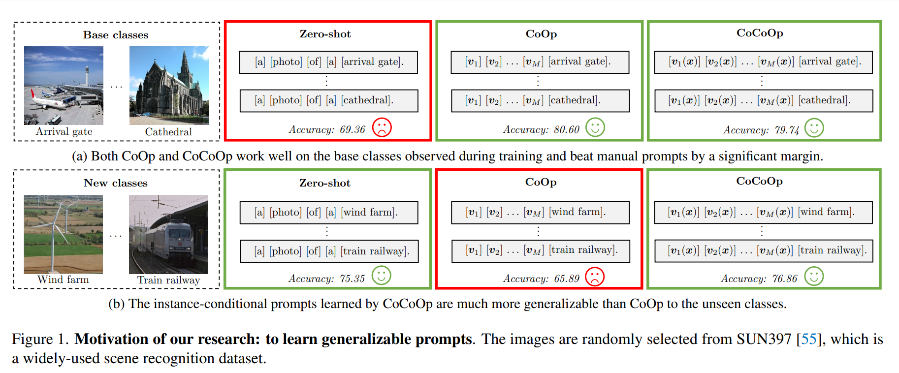
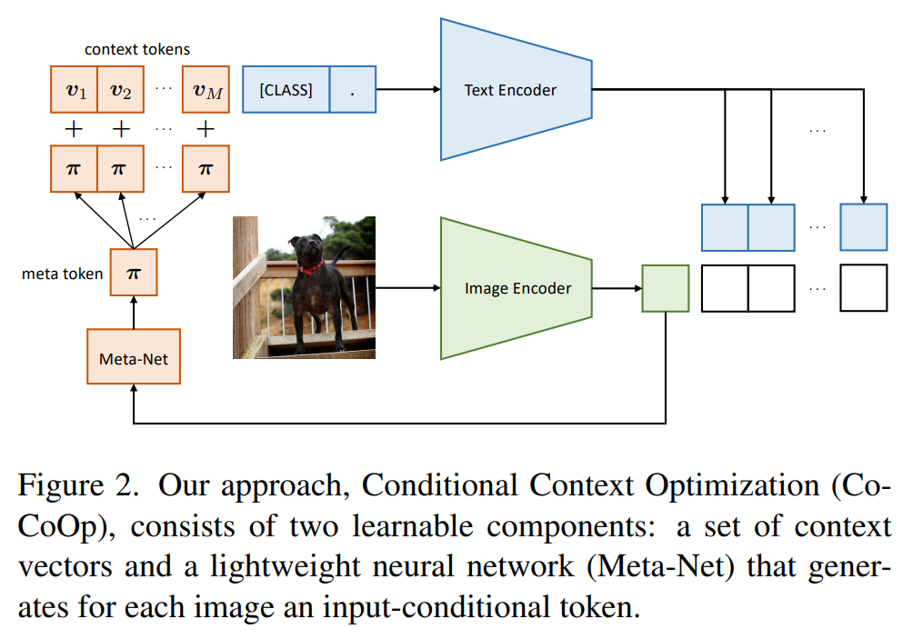
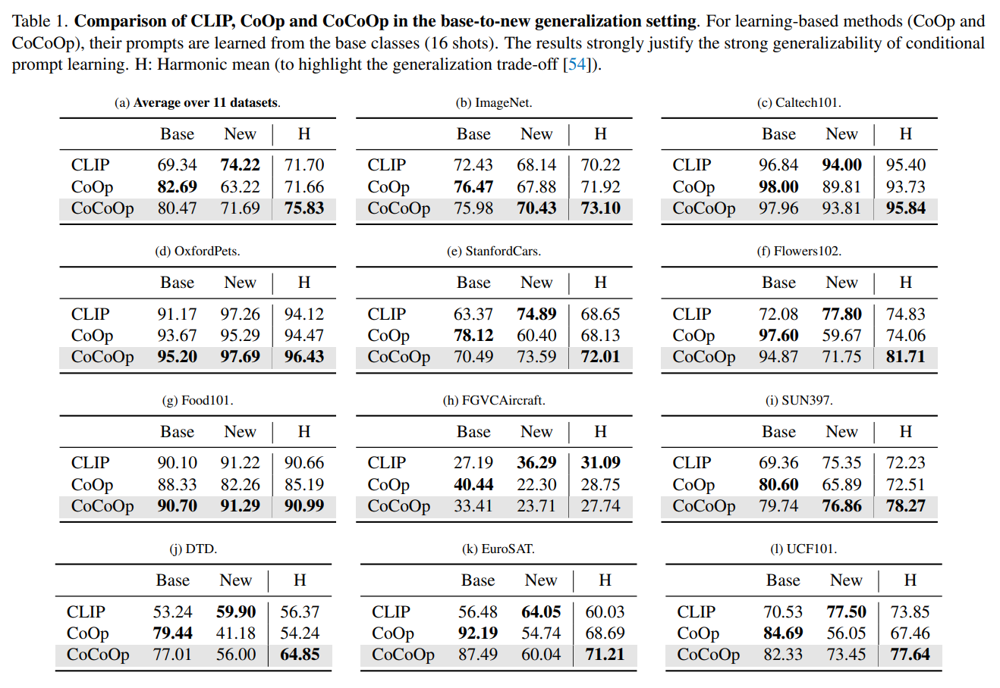
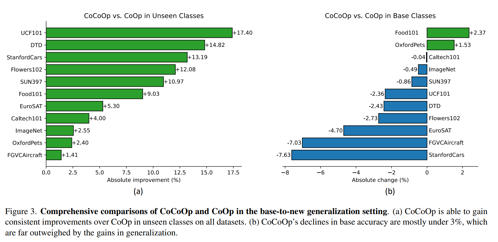
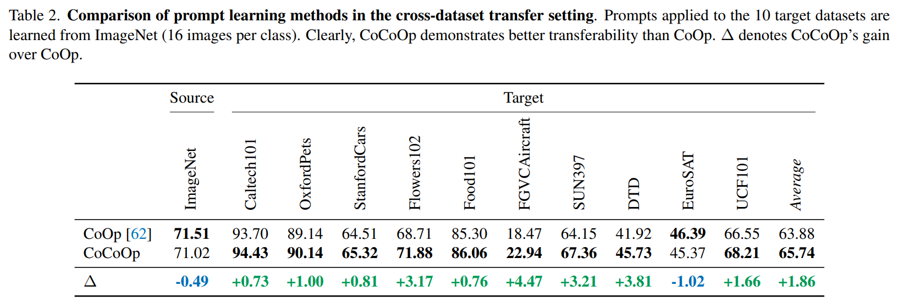
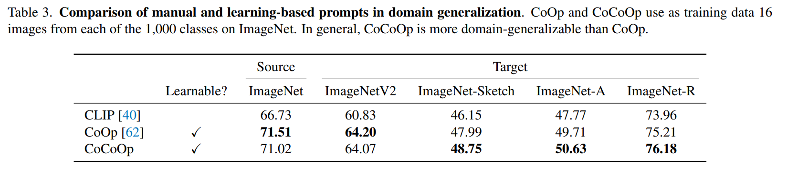
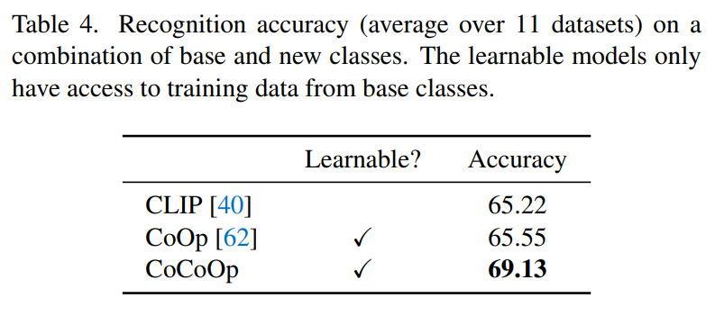
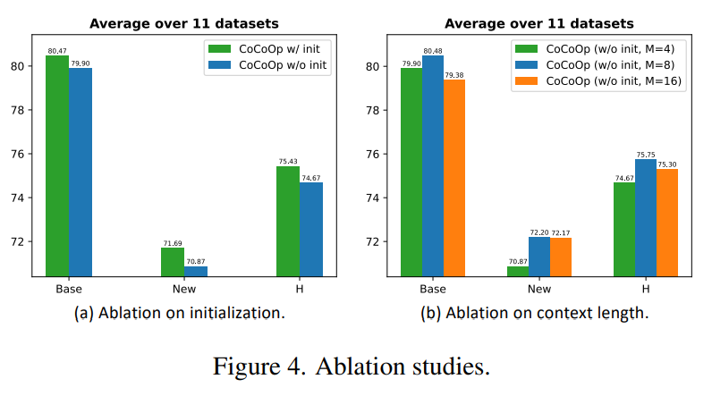
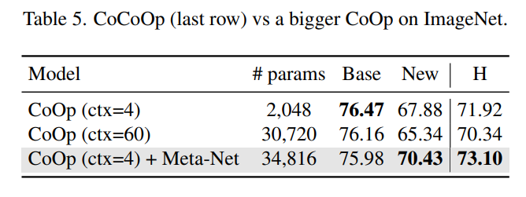

논문 및 이미지 출처 : <https://openaccess.thecvf.com/content/CVPR2022/papers/Zhou_Conditional_Prompt_Learning_for_Vision-Language_Models_CVPR_2022_paper.pdf>

# Abstract 
  
strong pre-trained vision-language model 인 CLIP 의 부상으로 이런 모델을 downstream dataset 에 적용하는 방법을 조사하는 것이 필수적이다.

최근 제안된 Context Optimization (CoOp) 은 NLP 의 prompt learning 을 vision domain 에 도입하여 pre-trained vision-language model 을 적용한다.

구체적으로 CoOp 는 prompt 의 context words 를 learnable vectors set 으로 바꾸며, learning 을 위한 few labeled images 만으로도  intensively-tuned manual prompt 보다 엄청난 향상을 이룰 수 있다.

저자는 CoOp 의 중요한 문제를 식별했다: learned context 가 같은 dataset 내에서 unseen classes 에 generalization 되지 않는다는 것으로, CoOp 이 training 중에 observed base classes base classes 에 over-fitting 되었음을 시사한다.

이 문제를 해결하기 위해, Conditional Context Optimization (CoCoOp)을 제안하며, 이는 CoOp 를 확장하여 각 image 에 대한 input-conditioned token (vector)을 생성하는  lightweight neural network 을 추가로 학습한다.

CoOp 의 static prompts 와 비교하여, dynamic prompts 는 각 instance 에 적응하여 class shift 에 덜 민감하다.

광범위한 실험은 CoCoOp 가 unseen classes 에 대해 CoOp 보다 훨씬 더 generalization 되며, 심지어 single dataset 을 넘어선 transferable 을 보여주고, stronger domain generalization 성능을 발휘한다는 것을 보여준다.

# 1. Introduction

large-scale vision-language pre-training 에 대한 최근 연구는 zero-shot image recognition 에서 놀라운 성능을 보여주며, 이 패러다임의 open-world  visual concepts learning 에 잠재력을 보여준다.

핵심 설계는 visual concepts 을 어떻게 modeling 하는지에 있다. label 이 discreted supervised learning 에선 각 categories 가 같은 category 를 포함하는 image 와의 distance 를 minimizing 하기 위해 학습되는 random initialized weight vectors 와 연관된다.

이러한 학습 방법은 closed-set visual concepts 에 초점을 맞추어, training 중 new unseen categories 에 대해 모델을 pre-defined categories list 에서 제한하며 확장성을 제한한다.

반대로, CLIP 과 ALIGN  같은 vision-language model 은 parameterized text encoder (e.g., Transformer)가 prompting 을 통해 classification weights 를 생성한다.

- 예로, 다양한 품종의 개와 고양이를 포함하는 pet images 를 구별하기 위해 “ “a photo of a {class}, a type of p” 같은 prompt template 을 text encoder 에 입력으로 채택할 수 있다.
- 그 결과 “{class}” token 을 real class name 으로 채워 분류를 위한 class-specific weights 를 합성할 수 있다.
- discrete label 과 비교할 때, vision-language model 의 supervision sources 는 nautral language 에서 나와, open-set visual concepts 을 넓게 탐구할 수 있으며, transferable representation learning 에 효과적임이 입증되었다.

이러한 strong vision-language model 의 부상으로, 최근 커뮤니티는 이 모델을 downstream dataset 에 효율적으로 적용하는 잠재적 솔루션을 조사하기 시작했다.

web-scale data 를 맞추기 위해, CLIP 이 사용하는 4M pairs images 와 texts 처럼, vision-language model 은 높은 용량을 갖도록 고안되었고, 이는 모델 크기가 M ~ B parameters 로 매우 클 것이다. 따라서, 흔히 채택되는 entire model fine-tuning 은 실용적이지 않고, 심지어 well-learned representation space 를 손상시킬 수도 있다.

---

안전한 approach 은 pet dataset 을 위해 언급된 “a type of pet” 과 같은 task 에 의미 있는 약간의 context 를 추가하여 prompt 를 tuning 하는 것으로, 이는 성능 향상에 효과적임이 밝혀졌다.

- prompt engineering 은 시도와 오류에 기반해야 하므로 time-consuming 이 크고 비효율적이며 optimal prompts 를 보장하지도 않는다.
- prompt engineering 을 자동화하기 위해, CoOp 은 pre-trained vision-language model 을 적용하기 위해 prompt learning 을 탐구했다.
- Context Optimization (CoOp)은 prompt 의 context words 를 learnable vector set 으로 변환하며, neural network 의 differentiable nature 를 활용한다.
- 학습을 위한 few labeled images 만으로, CoOp 는 광범위한 image recognition datasets 에서 intensively-tuned manual prompts 보다 엄청난 개선을 이룬다.

저자는 CoOp 의 중요한 문제를 식별했다: learned context 가 같은 task 내에서 unseen classes 에 generalization 되지 않는다는 것이다.

Fig. 1 은 이 문제를 보여준다:

- CoOp 가 학습한 context 는 “arrival gate” 와 “cathedral” 같은 base classes 를 구별하는 데는 잘 작동하지만, new (unseen) classes 인 “wind farm” 과 “train railway” 로 transfer 될 때는 정확도가 크게 떨어진다 — task 의 특성이 여전히 같음에도 불구하고, i.e., scenes recognition
- 결과는 learned context 가 base classes 에 over-fitting 되었음을 시사하며, broader scene recognition 을 위해 중요한 more generalizable elements 를 포착하는 데 실패한다.

이러한 문제가 CoOp 의 static design 으로 인해 발생한다고 주장한다:

- context 는 일단 학습되면 고정되어 specific (training) classes set 에 대해서만 optimizing 된다.
- 반대로, zero-shot 방법에 채택된 hand-crafted prompt 는 상대적으로 generalization 가능하다.

generalizability 문제를 해결하기 위해, 새로운 개념인 _conditional prompt learning_ 을 소개한다.

- 핵심 아이디어는 prompt 가 학습되면 고정하는 대신, 각 input instance (image)에 따른 conditioned prompt 를 만드는 것이다.
- model 을 parameter-efficient 로 만들기 위해, conditional prompt learning 의 간단하지만 효과적인 구현을 도입한다.
  - 구체적으로, CoOp 를 확장하여 각 image 에 대해 input-conditioned token (vector) 을 생성하는 lightweight neural network 을 추가로 학습한다.
  - 이를 Conditional Context Optimization (CoCoOp)이라 부른다. (Fig. 2) 
  - 흥미롭게도, CoCoOp 의 패러다임은 image captioning 과 유사하여 instance conditional prompts 가 더욱 generalization 이 가능한 이유를 설명한다: 이는 specific classes 에만 서비스를 제공하는 것이 아니라 각 instance 를 characterizing 하도록 optimizing 한다 (class shift 에 더 강력).

다양한 visual recognition tasks 를 다루는 11 datasets 에 대한 종합적인 실험을 제시한다.

- 구체적으로, model 이 먼저 base classes 를 사용하여 학습되고 completely new classes 로 테스트되는 base-to-new generalization 설정을 설계했다.
- zero-shot 방법 및 CoOp 과 비교할 때, 저자의 approach 은 최고의 전체 성능을 달성한다 (Tab. 1).
- 중요한 것은, CoCoOp 가 CoOp 보다 unseen classes 에서 상당한 개선을 얻어 manual 및 learning-based prompts 간의 격차를 크게 줄일 수 있다는 것이다 (Fig. 3(a)).

context 가 drastically different classes 를 가진 other tasks 로의 directly transfer 돠는 더 어려운 시나리오에서도, CoCoOp 는 여전히 CoOp 를 명확한 차이로 능가하며 (Tab. 2), instance-conditional prompts 가 more transferable 하고 larger scale 에서 성공할 잠재력이 있음을 시사한다.

CoCoOp 는 CoOp 보다 stronger domain generalization 성능도 획득하여 (Tab. 3), dynamic prompts 의 강점을 더욱 정당화한다.

요약하면, 

- prompt learning 의 generalization 가능성 문제에 대한 적절한 통찰력을 제공하며, 다양한 문제 시나리오에서 간단한 아이디어의 효과를 입증한다.
- 이 연구에서 제시된 발견이 generalizable-transferable-prompt learning 의 길을 열어준다

# 2. Related Work

#### Vision-Language Models 

저자는 주로 image 를 text 와 align 하여 joint embedding space 를 학습하는 데 초점을 맞춘 연구를 검토한다.

cross-modality alignment 의 아이디어는 새로운 것이 아니며, 오래 연구되어 왔지만 오늘날과는 매우 다른 기술이 사용되었다.

일반적인 vision-language model 은 세 가지 주요 요소로 구성된다: image 및 text encoding 와 이의 loss function

초기엔 images 와 texts 를 처리하는 model 이 종종 독립적으로 설계되고 학습되었으며, 그들의 output 은 align 하기 위한 extra modules (loss)로 연결되었다.

이미지는 종종 hand-crafted descriptor 또는 neural network 을 사용하여 encoding 되며, text 는 pre-trained word vectors 나 frequency-based  TF-IDF features 등을 사용하여 encoding 된다.

cross-modality alignments 의 일반적인 approach 로는 metric learning, multi-label classification, n-gram language learning 등이 있다.

최근 연구에 따르면, image captioning loss 로 vision 부분을 학습하면 visual representation 이 more trasferable 해진다.

---

최근 vision-language model 은 two encoders 를 함께 학습하여 two modalities 를 연결한다. 또한, 모델은 이제 훨씬 더 큰 neural network 으로 구축된다.

CoOp 에서 논의한 바인, 최근 vision-language model 의 성공은 주로 i) Transformers ii) contrastive representation learning iii) web-scale training datasets 의 발전에 기인한다.

대표적인 approach 은 CLIP 으로, contrastive loss 를 사용하여 image 와 text pairs 을 matching 하기 위해 two neural networks based encoders 를 훈련한다.

4M data pairs 를 처리한 후, CLIP 모델은 놀라운 zero-shot image recognition 능력을 보여준다.

CoOp 과 유사하게, 저자의 approach 은 CLIP 과 유사한 모델 연구와 직교하며, pre-trained vision-language model 을 downstream application 에 적용하기 위한 효율적인 솔루션을 제공하는 것을 목표로 한다.

#### Prompt Learning

prompt learning 은 NLP domain 에서 유래한 주제이다.

pre-trained language model 을 downstream tasks 에 유용한 정보를 끌어내는 knowledge base 로 보는 것이었다.

구체적으로, pre-trained language model 이 주어진 경우, 종종 "fill-in-the-blank" cloze test 로 공식화되며, 예로 “No reason to watch. It was [MASK]” 에서 masked token 을 "positive" 또는 "negative" 로 예측하도록 모델에게 요청한다.

hand-crafted prompt 를 설계하는 대신, prompt learning 에 대한 연구는 affordable-sized labeled data 를 활용하여 이 과정을 자동화하는 것을 목표로 한다.

- Jiang et al 은 text mining 과 paraphrasing 를 사용하여 candidate prompt groups 를 생성하고, highest training accuracy 를 가진 optimal prompt 를 선택
- Shin et al 은 AutoPrompt 를 제안했는데, 이는 label likelihood 에 기반하여 gradient 에서 greateest changes 인 optimal tokens 를 vocabulary 에서 선택하는 gradient-based approach 
- 저자의 연구는 주로 continuous prompt learning 과 관련이 있으며, 여기서 주된 아이디어는 prompt 를 continuous vector set 으로 변환하여 objective function 에 대해 end-to-end 로 optimizing 하는 것이다.

CV 에서 prompt learning 은 최근에야 탐구된 초기 연구 방향이다.

저자의 연구는 pre-trained vision-language model 의 adapting 을 위해 continuous prompt learning 을 vision domain 에 도입한 최초의 연구인 CoOp 을 기반으로 한다.

결정적으로, 저자의 approach 은 CoOp 의 weak generalization 문제를 해결하며, conditional prompt learning 이라는 간단한 아이디어에 기반하고 있다 — 이는 NLP context 에서도 새로운 것으로, NLP 커뮤니티에도 관심을 가질 수 있다.

#### Zero-Shot Learning (ZSL) 

Zero-Shot Learning (ZSL) 은 저자의 목표와 유사한 또 다른 관련 연구 영역이다.

즉, base classes 에만 훈련하여 novel classes 를 recognition하는 것이다. 또한, base classes 에서 훈련된 모델이 novel classes 에서 자주 실패하는 generalization 문제는 ZSL 문헌에서 제기된 "seen-class bias" 와 관련이 있다.

ZSL 에 가장 일반적인 approach 은 attributes 또는 word embeddings 같은 auxiliary information 을 기반으로 semantic space 을 학습하는 것이다.

기존 ZSL 방법과 달리, 저자의 연구는 large-scale vision-language model 의 adapting 이란 새롭게 부상하는 문제를 다루고 있으며, prompt 를 기반으로한 drastically different 기술을 사용한다.

# 3. Methodology

## 3.1. Reviews of CLIP and CoOp

#### Contrastive Language-Image Pre-training

CLIP 은 open-set visual concepts learning 의 잠재력을 잘 보여주었다.

CLIP 는 Fig. 2에 보여진 대로 image 와 text 를 위한 two encoders 를 사용하여 구축된다.

- image encoder 는 ResNet 또는 ViT 가 될 수 있으며, image 를 feature vector 로 변환한다.
- text encoder 는 Transformer 로, word tokens 의 sequence 를 입력으로 받아 다시 vectorized representation 을 생성한다.

training 동안 CLIP 는 contrastive loss 을 사용하여 two modalities 를 위한 joint embedding space 을 학습한다.

구체적으로,

- image-text pair 의 minibatch 에 대해, CLIP 은 각 image 와 matched text 간의 cosine similarity 를 maximization 하는 한편, all other unmatched text 와의 cosine similarity 를 minimizing 하며, loss 는 각 text 에 대해서도 유사하게 계산된다.
- training 후, CLIP 는 zero-shot image recognition 에 사용할 수 있다.
- $x$ 를 image encoder 가 생성한 image features 로, $\{w_i\}_{i=1}^K$ 를 text encoder 가 생성한 weight vectors (총 $K$ categories 가 있다 가정)로 두면, 각각의 $w_i$ 는 “a photo of a {class}” 같은 prompt 로부터 파생된다.
  - “{class}” token 은 $i$-th class name 으로 채워진다.
- prediction probability 는 다음과 같다:

$$
\begin{equation}
    p(y|x) = \frac{\exp(\text{sim}(x, w_y)/\tau)}{\sum_{i=1}^K \exp(\text{sim}(x, w_i)/\tau)}, 
\end{equation}
$$

- $\text{sim}(\cdot, \cdot)$ : cosine similarity
- $\tau$ : learned temperature parameter

#### Context Optimization (CoOp)

CoOp 은 pre-trained vision-language model 을 downstream application 에 더 잘 적응시키기 위해 prompt engineering 의 inefficiency problem 을 극복하려는 목적을 가진다.

CoOp 의 핵심 아이디어는 각 context token 을 data 로부터 end-to-end 로 learnable continuous vectors 로 modeling 하는 것이다.

구체적으로,

- “a photo of a” 대신, CoOp 는 $M$ learnable context vectors $\{v_1, v_2, \ldots, v_M\}$ 를 도입하며, 각각은 word embeddings 과 same dimension 을 가진다.
- $i$-th class 에 대한 prompt $t_i$ 는 이제 $t_i = \{v_1, v_2, \ldots, v_M, c_i\}$ 가 된다
  - $c_i$ : class name 의 word embeddings
  - context vectors 는 all classes 간에 공유됨.
- text encoder $g(\cdot)$를 사용하면, prediction probability 은 다음과 같다:

$$
\begin{equation}
    p(y|x) = \frac{\exp(\text{sim}(x, g(t_y))/\tau)}{\sum_{i=1}^K \exp(\text{sim}(x, g(t_i))/\tau)}.
\end{equation}
$$

downstream image recognition dataset 에 CLIP 을 적용하기 위해, cross-entropy loss 를 learning objective 로 사용할 수 있다.

text encoder $g(\cdot)$ 는 differentiable 하므로, gradient 는 context vectors 를 업데이트하기 위해 끝까지 전파될 수 있다.

CLIP 의 base model 은 entire training process 에서 고정되어 있다는 점에 유의해야 한다.

## 3.2. CoCoOp: Conditional Context Optimization

CoOp 는 downstream dataset 에서 few labeled images 만으로 context vectors 를 학습할 수 있는 data-efficient\ approach 다.

그러나 CoOp 는 동일한 작업 내에서 unseen classes 에 generalization 할 수 없다는 것이 논의되었다.

저자는 instance-conditional context 가 specific classes set 에 포커스를 벗어나 input instance 마다, 그리고 entire task 로 포커스를 옮기므로 더 잘 generalization 할 수 있다고 주장한다.

---

CoCoOp 을 구현하는 간단한 방법은 $M$ neural network 을 구축하여 $M$ context token 을 얻는 것이다.

그러나 이러한 설계는 CoOp 에서 $M$ context vectors 를 갖는 것보다 $M$ X neural network 이 필요할 것이며, 이는 훨씬 큰 규모가 된다.

여기서 저자는 실질적으로 잘 작동하는 parameter-efficient 인 설계를 제안한다.

구체적으로,

- $M$ context vectors 외에도, 저자는 Meta-Net 이라는 lightweight neural network 을 학습하여 각 input 에 대한 conditional token (vector)을 생성하고, 이를 context vectors 와 결합한다. (Fig. 2)
- $\theta$ 로 parameterizing 된 Meta-Net 을 $h_\theta(\cdot)$ 로 두면, 각 context token 은 $v_m(x) = v_m + \pi$ 로 얻어진다.
  - $\pi = h_\theta(x)$
  - $m \in \{1, 2, \ldots, M\}$
- $i$-th class 에 대한 prompt 는 inputr 에 따라 조정되며, i.e., $t_i(x) = \{v_1(x), v_2(x), \ldots, v_M(x), c_i\}$ 이다.
- prediction probability 은 다음과 같이 계산된다:

$$
\begin{equation}
    p(y|x) = \frac{\exp(\text{sim}(x, g(t_y(x)))/\tau)}{\sum_{i=1}^K \exp(\text{sim}(x, g(t_i(x)))/\tau)}.
\end{equation}
$$

- training 중, 저자는 context vectors $\{v_m\}_{m=1}^M$ 와 Meta-Net 의 parameters $\theta$ 를 함께 업데이트한다.
- 본 연구에서는 Meta-Net 을 two-layer bottleneck structure (Linear-ReLU-Linear) 로 구축하며, hidden layer 는 input dimension 의 16X 줄인다.
- Meta-Net 의 input 은 image encoder 가 생성한 output feature

# 4. Experiments

저자의 approach 은 주로 다음 세 가지 문제 설정에서 평가된다: 1) dataset 내의 base-to-novel classes 에 대한 generalization; 2) cross-dataset transfer; 3) domain generalization.

#### Datasets

- base-to-novel classes 에 대한 generalization 와 cross-dataset transfer 을 위한 two settings 는 CoOp 에서 사용된 11 image recognition datasets 사용.
  - general objects classification 를 위한 ImageNet 과 Caltech101; fine-grained classification 를 위한 OxfordPets, StanfordCars, Flowers102, Food101, FGVCAircraft; scene recognition 을 위한 SUN397; action recognition 을 위한 UCF101; texture classification 을 위한 DTD; satellite image recognition 을 위한 EuroSAT 를 포함한다.
- domain generalization 실험에서는 ImageNet 을 source dataset 으로 사용하고, domain shift 가 다른 ImageNet 의 네 가지 variants 인 ImageNetV2, ImageNet-Sketch, ImageNet-A, ImageNet-R 를 target dataset 으로 사용한다.

CoOp 을 따라 각 dataset 에서 few-shot training set 을 무작위로 추출하고, teset set 은 original test set 을 사용한다.

저자는 CoOp 에서 연구한 highest shot i.e., 16-shot 만 평가하며, 이는 저자의 approach 을 정당화하기에 충분하다.

learning-based model 의 경우, 3 runs 에서 평균한다.

#### Baselines

저자의 approach 과 직접적인 경쟁 상대는 CoOp 으로, 본질적으로 static prompts 를 학습한다(dynamic prompts 와 비교하여).

zero-shot 방식인 CLIP 도 비교 대상으로 사용되며, 이는 manual prompt 를 기반으로 한다.

각 dataset 에 대한 manual prompt 는 test data 의 all classes 를 사용하여 intensively tuning 되는 점을 언급한다.

#### Training Details

- 구현은 CoOp 의 코드를 기반으로 한다.
- 실험 전반에 걸쳐, 저자는 CLIP 에서 ViT-B/16 을 사용한다.
- CoOp 은 shorter context length 와 good initialization 이 더 나은 성능과 domain shift 에 대한 strong 내구성을 가져올 수 있다고 제안했다. 따라서 저자는 context length 4 로 고정하고, CoOp 와 CoCoOp 모두를 위해 “a photo of a” 의 pre-trained word embeddings 을 사용하여 context vectors 를 초기화한다.
- instance-conditional 설계로 인해, 저자의 approach 은 training 이 느리고 CoOp 보다 훨씬 더 많은 GPU 메모리를 소비한다. 따라서 모델이 GPU 에 맞도록 하고 training time 을 줄이기 위해, 저자는 CoCoOp 를 batch size 1 로 10 epochs 동안 훈련한다.

## 4.1. Generalization From Base to New Classes

CoOp 의 weak generalization 가능성 문제를 해결하는 것이 본 연구의 주요 초점이다.

- 11 datasets 각각에서 class 를 two groups 로 균등하게 나누어, 하나는 base classes , 다른 하나는 novel classes 로 설정한다.
- learning-based model, i.e., CoOp 와 CoCoOp 는 base classes 만을 사용하여 훈련하고, generalization 를 테스트하기 위해 base 와 novel classes 에서 각각 평가한다.

#### Failures of CoOp in Unseen Classes

이 split 은 two class groups 가 동일하게 어렵다는 것을 보장하지 못한다.

- CLIP 의 울퉁불퉁한 결과에서 알 수 있듯이, base 와 novel classes 의 정확도 수치는 극적으로 다르다.
- CoOp 의 novel classes 정확도는 거의 모든 dataset 에서 base 정확도보다 일관되게 약하며, 평균적으로 거의 20% 의 큰 격차(82.69% 대 63.22%)를 남긴다. 
- CoOp 는 평균 성능 측면에서 CLIP 보다 우위를 유지하고 있지만, base classes 에서의 CoOp 의 이득은 novel classes 에서의 치명적인 실패로 거의 무효화된다.
  - 이는 learning-based prompt 의 generalization 가능성을 향상시킬 필요성을 강조한다.

#### CoCoOp Significantly Narrows Generalization Gap

Tab. 1(a) 에 표시된 바와 같이,

- CoCoOp 는 unseen classes 에서의 정확도를 63.22% 에서 71.69% 로 향상시켰으며, 이는 manual prompt 와의 격차를 크게 줄였다.
- 결과는 instance-conditional prompt 가 더 generalization  가능하다는 것을 확인한다.
- dataset 별 개선 사항에 대한 보다 자세한 분석은 Fig. 3(a) 에 시각화되어 있으며, 5/11 datasets 에서 정확도가 10% 이상 증가한 것을 관찰할 수 있다.
- 특히, 도전적인 ImageNet dataset 에서 CoCoOp 의 67.88% 에서 70.43% 로의 상승은 비중이 큰 진전이다(70.43% 의 정확도는 CLIP 의 68.14% 를 능가).

#### CoCoOp’s Gains in Generalization Far Outweigh Losses in Base Accuracy

CoOp 과 비교할 때, CoCoOp 는 대부분의 dataset 에서 base classes 의 성능이 떨어진다 (Fig. 3(b))

- 이는 CoOp 가 base classes 에 특히 최적화된 반면, CoCoOp 는 entire tasks 에 대한 더 많은 generalization 를 얻기 위해 각 instance 에 최적화되기 때문에 합리적이다.
- 하지만 CoCoOp 의 base 정확도가 CoOp 보다 떨어지는 9 datasets 중, 대부분의 loss 는 3% 이하(정확히는 6/)로, Fig. 3(a) 에 표시된 unseen classes 에서의 이득을 훨씬 능가한다.
- 심지어 CoCoOp 가 biggest loss 를 겪는 경우에도, generalization 에서의 향상은 대부분 평균을 긍정적으로 돌릴 만큼 충분히 크다.
  - 예로, StanfordCars 에서는 -7.63% 의 worst base accuracy 를 보였지만, novel classes 에서 +13.19% 의 third-highest accuracy 향상을 가져와, CoCoOp 의 경우 5.56% 의 긍정적인 개선을 가져왔다.

#### CoCoOp Is More Compelling Than CLIP

base 와 novel classes 를 모두 고려할 때, CoCoOp 는 CLIP 보다 4% 이상 향상된 성능을 보여주며(75.83% 대 71.70%), instance-conditional prompt 가 recognition task 에 관련된 보다 generalization 가능한 요소를 포착할 수 있는 더 나은 잠재력을 가진다는 것을 시사한다.

이론적으로, learning-based prompt 는 manual prompt 보다 base classes 에 over-fitting 할 위험이 훨씬 높다. 따라서, CLIP 는 unseen classes 에서 이기기 어려운 strong 경쟁자이다.

CoOp 과는 달리, 저자는 CoCoOp 에 대해 유망한 결과를 얻었다: new accuracy 는 4/11 datasets 에서 CLIP 보다 더 우수하다(즉, ImageNet, OxfordPets, Food101, SUN397) 및 FGVCAircraft 를 제외한 나머지 dataset 에서는 CLIP 와 크게 차이나지 않는다.

context length 에 대한 ablation study 에서, FGVCAircraft 는 CoOp 의 연구 결과와 일치하게 더 긴 문맥으로부터 이익을 얻는 것으로 나타났다.

manual prompt 와 learning-based prompt 간의 격차를 unseen classes 에서 좁히거나 심지어 뒤집기 위해서는 더 많은 노력이 필요하다. 

## 4.2. Cross-Dataset Transfer

CoCoOp 의 한 dataset 내에서의 generalization 능력을 증명한 후, 이제 CoCoOp 이 single dataset 을 넘어 transferable 잠재력을 가지고 있음을 보여준다. 

이는 다른 dataset 들 사이에서의 근본적인 차이가 있을 수 있기 때문에 (e.g., object recognition 에서 texture classification 으로 transfer) 훨씬 더 도전적인 문제이다.

이 설정에서는 prompt learning 방법만을 고려한다.

저자는 ImageNet 에서 learned context 를 1,000 all classes 에 대해 다른 10 dataset 으로 trasfner 하면서 CoOp 과 CoCoOp 을 비교한다.

자세한 결과는 Table 2에 제시되어 있다. 

- source dataset 에서는 두 모델이 유사하게 작동한다. 반면에 target dataset 에서는 CoCoOp 이 CoOp 보다 대부분 명확하게 우수한 성능을 보인다.
- ImageNet 클래스가 주로 objects 와, 많은 수의 pet breeds 를 포함하고 있기 때문에, Caltech101 과 OxfordPets 같은 관련 target dataset 에서 높은 정확도를 보이는 것은 합리적이다.
- 이에 비해, 보다 fine-grained 및 specialized categories 를 가진 다른 dataset (e.g., FGVCAircraft 와 DTD 같은 다양한 texture 를 포함한 dataset)에서의 성능은 상당히 낮다.
- 그럼에도 불구하고 CoCoOp 은 언급된 두 datasets 뿐만 아니라 대부분의 fine-grained 및 specialized dataset 에서도 CoOp 보다 stonger transferability 를 보여준다.

## 4.3. Domain Generalization

out-of-distribution data 에 대한 generalization 는 real-world application 에 성공하기 위해 machine learning model 이 가져야 하는 능력이다.

CoOp 은 learnable prompt 가 domain shift 에 대해 manual prompt 보다 more robust 함을 밝혔다.

저자는 이전 실험에서처럼 instance-conditional prompt 가 여전히 이점을 유지하는지 알아보고자 한다.

CoOp 를 따르며, 저자는 ImageNet 에서 learned context 를 4 benchmarks 로 transfer 하여 CoCoOp 의 domain generalization  성능을 평가한다. 또한 CLIP 과의 비교도 포함한다.

Tab. 3 은 결과를 보여준다.

- both prompt learning 방법은 all target datasets 에서 CLIP 을 분명히 능가한다. 
- CoOp 과 비교했을 때, CoCoOp 은 ImageNetV2 에서 약간 낮은 성능을 보이지만 다른 세 곳에서 더 나은 성능을 보인다. 
- 결과는 instance-conditional prompt 가 더 domain generalization 가 가능하다는 것을 확인시켜 준다.

## 4.4. Further Analysis

#### Class-Incremental Test

base classes 들로 구성된 recognition target 이 완전히 novel classes 를 포함하도록 확장되는 실용적인 문제 시나리오를 고려한다.

이 문제는 기존의 지속적 continual learning 과 관련이 있지만, 여기서는 모델이 novel classes 의 어떤 training data 도 접근할 수 없고 zero-shot recognition 을 수행해야 한다는 점에서 다르다.

저자는 11 datasets 를 사용하여 CLIP, CoOp 및 CoCoOp 을 비교한다.

평균 결과는 Tab. 4 에 보고되어 있다.

- CoOp 는 CLIP 과의 경쟁력을 잃는데, 그들의 성능은 비슷하지만 전자는 training data 가 필요하기 때문이다. 
- 다시 한번, CoCoOp 은 두 경쟁자를 상당한 차이로 능가한다.

#### Initialization

저자는 word embedding-based initialization 와 random initialization 을 비교하는 ablation study 를 수행한다.

random initialization 의 경우, 저자는 CoOp 를 따라 0.02 표준 편차의 0-mean Gaussian distribution 에서 smapling 한다.

Fig. 4(a) 는 proper initialization 가 base 및 new classes 모두에 더 유익하다는 것을 시사한다.

#### Context Length

CoOp 을 따라 저자는 4, 8, 16 의 context tokens 을 연구한다.

공정한 비교를 위해, 모든 context tokens 에 대해 random initialization 를 사용한다.

Figure 4(b) 는 11 datasets 에 대한 결과를 요약한다.

base classes 에서의 차이는 상당히 적은 반면, new classes 에서는 longer context length 를 가진 모델이 명확히 더 좋은 성능을 보인다.

#### CoCoOp vs a Bigger CoOp

CoCoOp 은 Meta-Net 을 포함함으로써 CoOp 보다 더 많은 parameters 를 도입하기 때문에, 향상된 성능이 단순히 learning capacity 증가로 인한 것인지 의문이 들 수 있다.

이를 해소하기 위해, 저자는 Meta-Net 을 제거하고 CoOp 의 context tokens 수를 최대한 늘려 CoOp 과 CoCoOp 의 크기를 유사하게 만든다.

Tab. 5 의 결과는 parameter size 를 늘리는 것이 핵심이 아니라는 것을 보여준다.

# 5. Limitations

1. training efficiency: CoCoOp 은 학습이 느리고 batch size 가 1 보다 크면 상당한 양의 GPU 메모리를 소비한다. 
   - 그 이유는 CoCoOp 이 각 image 에 대해 독립적인 instance-specific prompt 를 text encoder 를 통해 forward pass 해야 하는 instance-conditional 설계를 기반으로 하기 때문이다.
   - 이는 minibatch 전체에 대해 prompt 를 text encoder 를 통해 한 번만 forward pass 하면 되는 CoOp 보다 훨씬 비효율적이다.
2. 7/11 datasets 에서 (Tab. 1) CoCoOp 의 unseen class 에 대한 성능이 여전히 CLIP 보다 뒤쳐져 있다는 것이다.
   - 이는 커뮤니티가 manual prompt 와 learning-based prompt 사이의 격차를 완전히 좁히거나 뒤집기 위해 더 많은 노력이 필요하다는 것을 나타낸다.

# 6. Discussion and Conclusion

저자의 연구는 large pre-trained AI 모델의 가용성으로 인해 발생하는 중요한 문제를 다룬다. 즉, 이러한 모델을 downstream  응용 프로그램에 어떻게 적응시키는가에 관한 것이다.

이러한 모델, i.e., foundation model 은 다양한 downstream tasks 에 대한 능력 때문에 vision 및 NLP 에서 주목받고 있다.

그러나 foundation model 은 data scale 과 computing resource 측면에서 pre-training 하는데 비용이 많이 들며, 충분한 용량을 개발하기 위해 일반적으로 엄청난 수의 parameter 를 포함한다.

예로, 저자의 실험에서 사용된 ViT-B/16 에 기반한 CLIP 모델은 150M parameter size 를 가지고 있다. 이러한 요인들은 foundation model 를 효율적인 적응 방법의 연구 필요성을 강조한다.

저자가 따라가는 parameter-efficient prompt learning 의 연구는 static prompt 의 generalization 문제에 대한 적절한 통찰력을 제공하고, 더 중요하게는 conditional prompt learning 을 기반으로 한 간단한 디자인이 다양한 문제 시나리오에서 탁월한 성능을 발휘한다는 것을 보여준다.

여기에는 base-to-new class generalization, cross-dataset prompt transfer 및 domain generalization 이 포함된다.