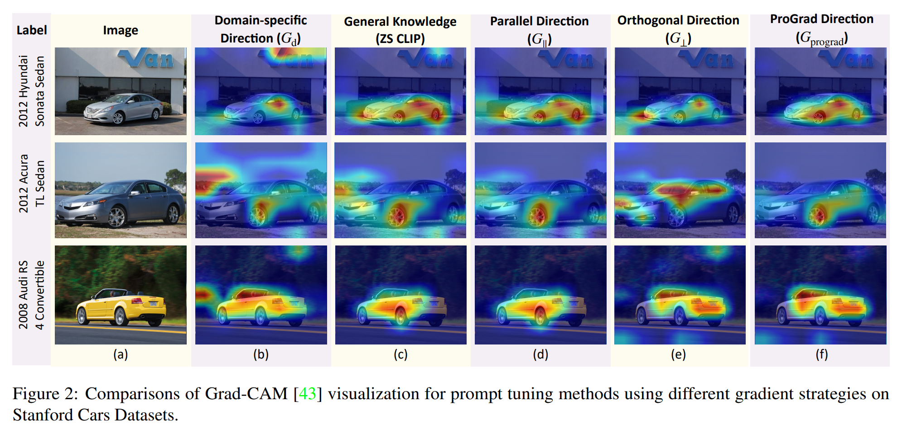
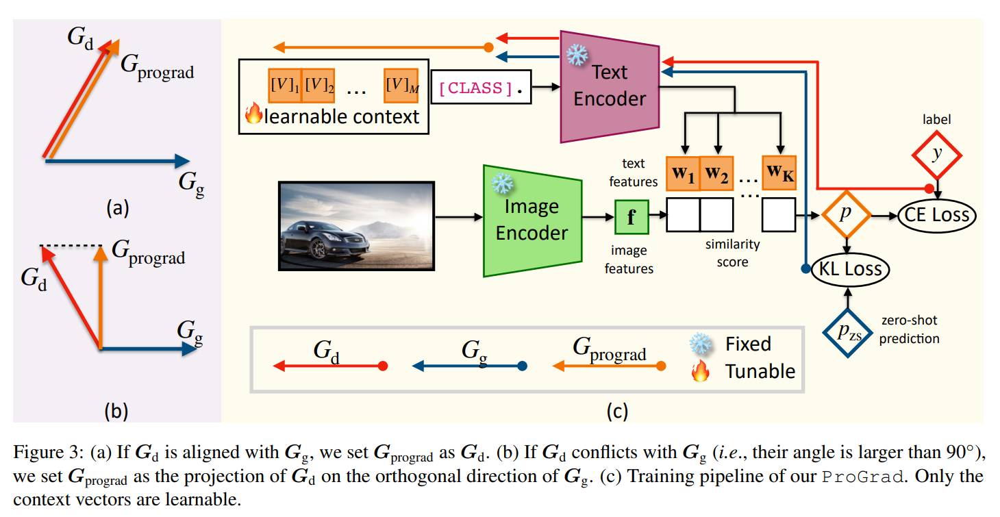
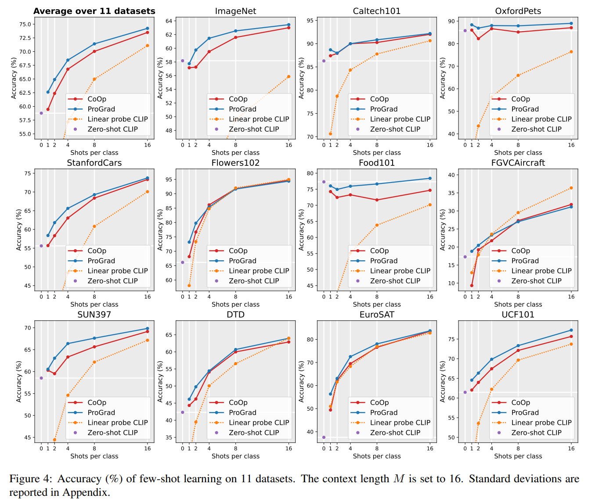
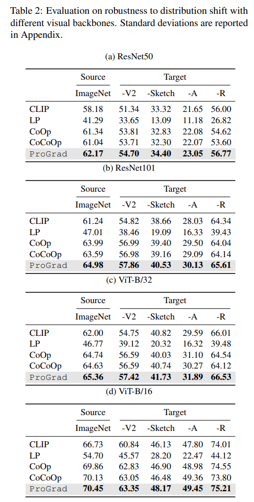
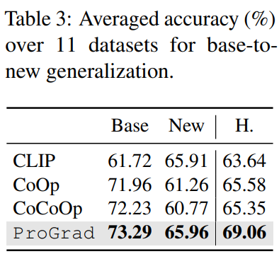
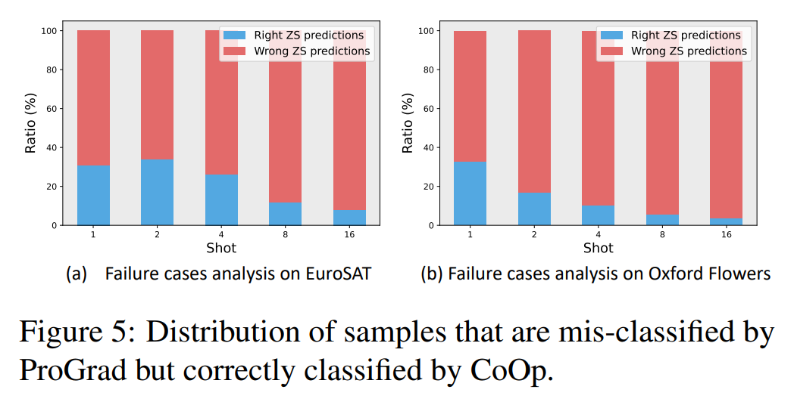
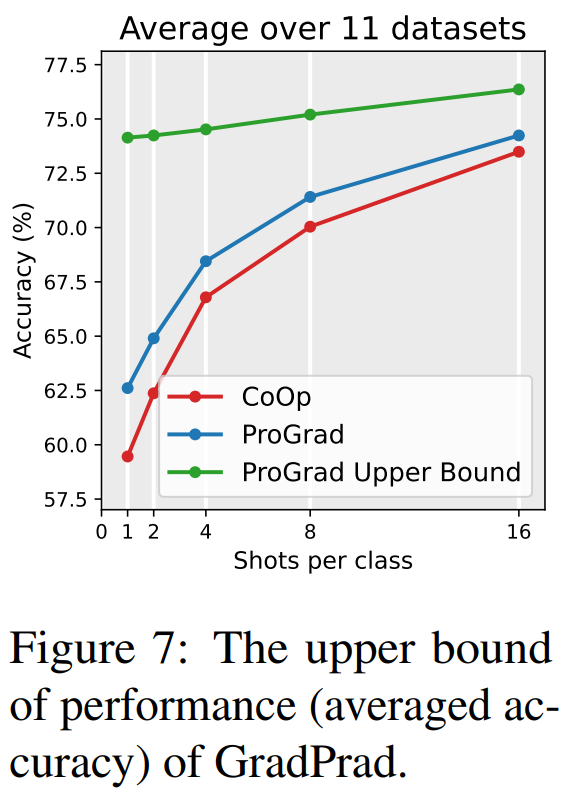
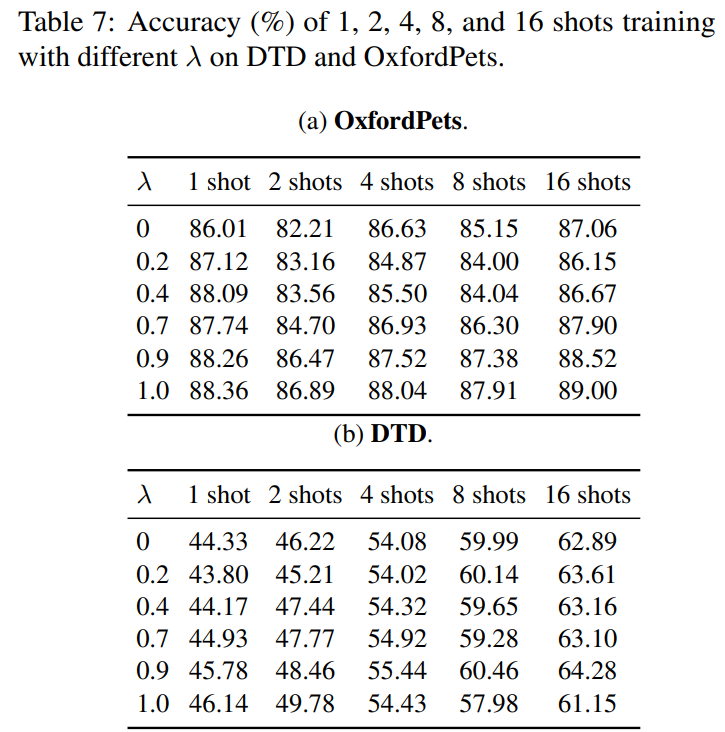

논문 및 image 출처 : <https://openaccess.thecvf.com/content/ICCV2023/papers/Zhu_Prompt-aligned_Gradient_for_Prompt_Tuning_ICCV_2023_paper.pdf>

# Abstract

large-scale pre-trained vision-language models (VLMs)인 CLIP 덕에, "[CLASS]" 라는 text 를 포함한 prompt sentence "a photo of a [CLASS]" 와 image 사이의 similarity 를 이용하여 image 가 "[CLASS]" 일 확률을 계산하는 식으로 zero-shot classifier 를 설계할 수 있다.

나아가, prompting 은 few samples 로 soft prompt 를 fine-tune 할 때 VLM 을 downstream tasks 에 fast adaptation 에 큰 잠재력을 보여준다. 

하지만, 저자는 improper fine-tuning 이나 extremely few-shot samples 로 학습할 경우 zero-shot prediction 보다 성능이 떨어질 수 있는 문제를 발견했다.

기존 방법들은 이를 여전히 early stopping 이나 data augmentation 과 같은 traditional overfitting 방지 기술로 해결하려 하고 있으며, 이는 prompt tuning 에 특화된 원칙적인 해결책이 부족하다.

이 논문에선 prompt tuning 이 VLM 에서 학습된 general knowledge forgetting 방지를 위해 Prompt-aligned Gradient, 줄여서 **_ProGrad_** 를 제안한다.

- 특히, **_ProGrad_** 는 general knowledge 과 align 하는(또는 non-conflicting) prompt 의 gradient 만 업데이트한다. 
- 이 general knowledge 은 pre-defined prompt predictions 에 의해 제공되는 optimization directions 로 표현된다.
- few-shot learning, domain generalization, base-to-new generalization, 그리고 cross-dataset transfer setting 에서의 광범위한 실험을 통해 **_ProGrad_** 가 SOTA prompt tuning 방법들에 비해 stronger few-shot generalization 능력을 갖추고 있음을 입증한다.

# 1. Introduction

수많은 image-text association pairs 를 보고 학습한 large-scale vision-language models(VLM) 는 어떤 visual patterns 가 어떤 text squence 와 대응하는지에 대한 **general knowledge**(a.k.a. encyclopedic knowledge)을 기억할 수 있다. 

VLM 의 strong language modeling 덕에, natural language 로 작성된 prompt 를 사용해 이러 general knowledge 을 구축할 수 있다. 

prompt 는 pre-trained model 과 downstream tasks(e.g., regression vs. classification) 간의 interface gap 을 additional fine-tuning 없이도 연결해준다.

예로, zero-shot image classification 을 위해 "a photo of a [CLASS]" 같은 구체적인 prompt 를 만들 수 있다. 

이를 통해, popular vision-language models 인 CLIP 을 사용해 image 를 vision module 및 prompt sentence 을 language module 에 입력하면, image 를 "[CLASS]" 로 분류할 확률을 나타내는 vision-language similarity 를 confidence score 로 얻을 수 있다.

---

- 실제로, prompt 를 이용한 zero-shot image classification 는 정확하지 않을 수 있는데, 이는 hand-crafted prompt 가 machine learning 에 optimization 되지 않았거나(e.g., "this is a picture of" 가 VLM training 시 문법적으로 더 우세할 수 있다), downstream domain 에 특화되지 않았기 때문이다(e.g., "a photo of a person doing" 이 action recognition 에서 더 나을 수 있다). 
- 최근 hand-crafted prompt 를 tunable word embedding vectors set 으로 대체하는 prompt tuning 또는 prefix tuning 이 제안되었다. 
  - 이 vectors 는 반드시 human-readable words 로 변환될 필요는 없다.
  - 그러나 prompt tuning 은 traditional fine-tuning 만큼 까다롭다. 
  - training continues 에서 generalization 능력이 감소하여 zero-shot baseline 보다 성능이 떨어질 수 있다.
- Fig. 1(a&b)에서 볼 수 있듯이, prompt tuning 인 CoOp 은 early stopping 을 통해 최고의 결과를 얻지만, training continues 에서 정확도가 최대 4% 까지 급격히 떨어진다.
  - 또한, Fig. 1(c&d) 에선 downstream tasks 에서 충분한 samples 가 없거나 data augmentation 이 없는 경우 CoOp 가 zero-shot CLIP 보다 성능이 떨어지는 것을 보여준다. 
  - 기존 방법들은 여전히 early stopping 이나 data augmentation 같은 traditional overfitting 방지 기술에 의존하고 있으며, 이는 improper prompt tuning 의 본질에 대한 원칙적인 해결책이 부족하다. 
- 더불어 Grad-CAM 시각화 결과는 fine-tuned prompt 가 VLM 이 적어도 foreground object 에 집중해야 한다는 general knowledge forgetting 을 만들 수 있음을 나타낸다.
  - CoOp (Fig. 2(b)) 와 zero-shot CLIP (Fig. 2(c)) 을 비교해보면, CoOp 모델이 background 에 attention 을 분산시키는 반면, CLIP 은 주로 foreground object 에 집중하고 있음을 알 수 있다. 
  - 이러한 결과는 특히 training samples 수가 extremely limited 인 경우(e.g., 1 또는 2개) 기존 prompt tuning 전략의 overfitting 위험을 입증한다.

---

이를 해결하기 위해, 저자는 CLIP 의 improperly biased tuning  극복하기 위해 **_ProGrad_** 라고 불리는 새로운 prompt tuning 방법을 제안한다. 

- **_ProGrad_** 의 원칙은 각 tuning step 이 original prompt, 예로 zero-shot CLIP prediction 에 의해 제공된 general knowledge 과 충돌하지 않도록 regularizing 한다. 
- 구체적으로, 저자는 _zero-shot prompted CLIP_ 과 few-shot fine-tuned model 의 prediction 간의 Kullback-Leibler (KL) divergence 의 gradient 를 사용하여 general knowledge direction $G_g$ 를 측정하며, 이를 _general direction_ 이라 부른다.
- 마찬가지로, 저자는 _ground-truth_ 와 few-shot fine-tuned model 간의 cross-entropy 의 gradient 를 사용하여 domain-specific knowledge direction $G_d$ 를 계산하며, 이를 _domain-specific direction_ 이라 부른다. 
- 저자는 domain-specific direction $G_d$ 를 두 가지로 분해한다: 
  1. general direction 과 직교하는 vector $G_\perp$, 이는 non-conflicting domain-specific knowledge 를 나타낸다; 
     - 이 gradient component 는 two orthogonal vectors 를 two non-conflicting base vectors 로 변환할 수 있기 때문에 general direction 을 무시하지 않는다.  
  2. general direction 과 평행한 vector $G_\parallel$, 이는 general knowledge 을 나타낸다.
     - 이 component 는 general direction 과 동일한 경우와 반대의 경우 두 가지 중 하나일 수 있다: 
       1. general direction 과 같은 경우, 이는 업데이트가 general knowledge 과 일치함을 나타낸다. 
       2. general direction 과 반대인 경우, 이는 충돌하는 업데이트를 나타내며, 이를 방지하기 위해 버려야 한다. 
- 전체적으로, _**ProGrad**_ 는 각 iteration 에서 general direction 과 acute angle 을 이루는 prompt-aligned direction 만 parameter 를 업데이트한다.
- CoOp 및 CLIP 과 비교할 때, $G_g$ 와 $G_\perp$ (Fig. 2(d&e))는 모두 모델이 foreground 에 집중하도록 regularization 하는데 도움을 주며, **_ProGrad_** (Fig. 2(f))는 visual response 를 더욱 향상시킨다.

CLIP, CoOp 및 CoCoOp 을 따라, 저자는 **_ProGrad_** 를 few-shot learning, domain generalization, base-to-new generalization, cross-dataset transfer setting 에서 15 image classification benchmark 를 통해 평가하며, 이는 generic object classification, fine-grained image recognition, action classification 을 포함한다. 

요약하자면, **_ProGrad_** 는 다음과 같은 성과를 거둔다: 

- 11 dataset 모두에서 CoOp 에 비해 명확한 개선; 
- CoOp 및 CoCoOp 에 비해 모든 11 dataset 에서 base 와 new classes accuracy 의 harmonic mean 에서 명확한 개선; 
- domain generalization 의 source 및 target dataset 모두에서 명확한 개선.

# 2. Related Work

#### VLMs Adaptation.

VLM 은 다양한 downstream tasks 에 적응할 수 있다. 

예로, visual question-answering, visual grounding, image retrieval, 그리고 semantic segmentation 등이 있다. 

저자는 image classification task 에 집중한다. 기존의 "pre-train then fine-tuning" 패러다임은 visual backbone 에 classifier 를 추가하고 downstream data 로 학습시키는 방식으로 널리 사용되어 왔다. 

- 예로, Linear Probe 가 있다 
- CLIP-Adapter 는 feature adapter 를 추가해 fine-tuning 결과를 향상시킨다. 
- 최근 NLP 에서 prompt 를 fine-tuning 하여 "fill-in-the-blank" cloze test 를 사용해 ground-truth token 을 maximizing 하는 "prompt-based learning" 패러다임을 도입했다.
  - 이 prompt-based learning 은 최근 CV 커뮤니티에도 적용됨.
- CoOp 은 hand-crafted prompt 대신, downstream data 에서 continuous prompt optimization 을 사용한다.
- CoCoOp 은 CoOp 을 확장해 image conditional prompt 를 학습하여 generalization 를 개선.
- ProDA 는 output embedding space 에서 prompt distribution 을 학습한다. 
- VPT 는 instance-specific underlying distribution 에서 sampling 된 residual vector 와 base learned prompt 를 결합하여 variational prompt tuning 을 도입한다. 
- TPT 는 training data 가 필요하지 않고, 서로 다른 augmenated view 에서 consistent predictions 를 달성하기 위해 prompt 를 optimization 하는 test-time prompt tuning 을 제안한다.

**_ProGrad_** 는 model structure modification 이나 pre-trained parameter tuning 없이, prompt-based learning 의 연장선에서 gradient 를 general direction 에 align 하여 few-shot generalization 능력을 향상시킨다.

#### Knowledge Transfer.

Forgetting mitigation 는 knowledge distillation 또는 memory replay 를 통해 incremental learning 에서 널리 사용된다.

그러나 prompt-based learning 은 pre-training data 를 사용할 수 없다는 점에서 incremental learning 과 근본적으로 다르다.

incremental learning 에선 memory storage 에 저장된 old data 를 사용해야 하기 때문이다. 

- 예로, OGD 는 new classes 의 gradient 를 previous task gradients 의 orthogonal directions 로 project 하지만, prompt tuning 에선 pre-training process 에 접근할 수 없기 때문에 previous task gradients 를 저장하는 것이 불가능하다. 
- 게다가, OGD 는 non-conflicting scenarios 에서 downstream tasks 의 gradients 를 수정하여 최적의 성능을 발휘하지 못할 가능성이 있다. 
- knowledge transfer 을 위해 gradient matching 을 활용하는 또 다른 관련 분야는 domain generalization 와 multi-task learning 이다. 

하지만 이 방법들은 prompt tuning 에 직접적으로 적용할 수 없는데, prompt tuning 의 trasfner direction 은 오직 general 에서 downstream 으로의 transfer 만 다루기 때문이다.

# 3. Methodology

## 3.1. Preliminaries

#### Contrastive language-image pre-training (CLIP).

CLIP 은 방대한 image 와 natural language description pairs 에 대해 contrastive language-image pre-training 패러다임을 채택한다. 

contrastive learning 에선 associated image 와 sentence 을 positive samples 로, non-associated pairs 를 negative samples 로 취급한다. 

contrastive objective 는 positive pairs 의 similarity 을 maximizing 하고 negative pairs 의 similarity 을 minimizing 하는 것이다.

#### Zero-shot transfer inference

Zero-shot transfer inference 은 pre-trained CLIP 을 fine-tuning 없이 downstream tasks 에 적응시킨다. 

예로 image classification task 에선 image-text matching 문제로 공식화하여 zero-shot transfer 이 가능해진다.

이때 text 는 “[CLASS]” name 을 "a photo of a [CLASS]." 같은 template 으로 확장하여 얻어진다. 

CLIP 은 이러한 simple template 이 pre-trained text inputs 과의 distribution gap 을 좁힌다는 것을 발견했다. 

image-class matching score 는 image feature $f$ 와 $i$-th class 에 대한 class-extended text feature $w_i$ 사이의 cosine similarity $< w_i, f >$ 를 기반으로 측정된다. 

image $x$ 에 대한 image feature $f$ 는 image encoder 에서 추출되며, $i$-th class 에 대한 text feature $w_i$ 는 prompt description 을 text encoder 에 입력하여 얻어진다. 

$i$-th class 의 probability 는 다음과 같이 구해진다:

$$
\begin{equation}
  p_\text {zs}(\bm {w}_i|\bm {x})=\frac {\exp (<\bm {w}_i,\bm {f}>/\tau )}{\sum _{j=1}^K\exp (<\bm {w}_j,\bm {f}>/\tau )},
\end{equation}
$$

- $K$ : class 수
- $\tau$ : CLIP 으로 학습된 temperature

#### Prompt-based learning

prompt-based learning 은 CLIP model 의 transferring 능력을 더욱 강화하고, downstream tasks 에서 few samples 만으로 prompt 를 자동으로 학습함으로써 prompt engineering 을 회피한다. 

- fixed hand-crafted prompt 를 사용하는 zero-shot transfer 과 달리, CoOp 은 $M$ continuous context vectors $v = \{v_1, v_2, ..., v_M\}$ 를 tunable prompt 으로구성 fine-tuning 한다.  
- 구체적으로, prompt $t_i = \{v_1, v_2, ..., v_M, c_i\}$ 는 learnable context vectors $v$ 와 class token embedding $c_i$ 를 결합하며, 이를 text encoder $g(·)$ 에 입력한다. 
- CoOp 은 ground-truth token 의 negative log-likelihood 를 minimizing 함으로써 static context vectors $v$ 를 optimization 한다:

$$
\begin{equation}
  \begin {split}
    \mathcal {L}_\text {ce}(\bm {v})&=-\sum _i \bm {y}_i \log p(\bm {t}_i|\bm {x}), \\
    p(\bm {t}_i|\bm {x})&=\frac {\exp (<g(\bm {t}_i),\bm {f}>/\tau )}{\sum _{j=1}^K\exp (<g(\bm {t}_j),\bm {f}>/\tau )}, 
  \end {split}
\end{equation}
$$

- $y$ : one-hot ground-truth annotation
- $K$ : class 수

## 3.2. Prompt-aligned Gradient

CoOp 은 annotation 수가 매우 제한적인 경우(e.g., 1 per class) transfer 성능이 떨어지는 문제를 겪었으며, zero-shot transfer 보다 성능이 낮아지는 경우도 있었다. 

또한, CoOp 은 early stopping 과 data augmentation 같은 anti-overfitting 기술에 크게 의존한다. 

이런 overfitting 문제를 극복하기 위해, 저자는 few-shot downstream knowledge 와 large-scale general knowledge 을 align 하기 위한 effective 및 efficient fine-tuning  패러다임인 **_ProGrad_** 를 제안한다.

- knowledge transfer 에서 knowledge distillation 의 성공에 영감을 받아, 저자는 zero-shot CLIP predictions 를 general knowledge 로 활용하고, fine-tuned predictions 와 general knowledge 를 비교하여 gradient direction 을 regularizaing 한다.
- 구체적으로, model prediction $p(t_i|x)$ 와 ground-truth $y$ 사이의 cross-entropy $\mathcal{L}_{ce}(v)$ 를 기반으로 domain-specific direction 을 얻고, zero-shot CLIP predictions $p_{zs}(w_i|x)$ 와의 Kullback-Leibler (KL) divergence 를 기반으로 general knowledge 방향을 얻는다:

$$
\begin{equation}
  \mathcal {L}_\text {kl}(\bm {v})=-\sum _i p_\text {zs}(\bm {w}_i|\bm {x})\log \frac {p(\bm {t}_i|\bm {x})}{p_\text {zs}(\bm {w}_i|\bm {x})}.
\end{equation}
$$

- $\mathcal{L}_{kl}(v)$ 와 $\mathcal{L}_{ce}(v)$ 의 gradient 를 각각 $G_g = ∇_v \mathcal{L}_{kl}(v)$ 와 $G_d = ∇_v \mathcal{L}_{ce}(v)$ 로 나타낸다.
- $G_g$ 와 $G_d$ 의 관계는 두 가지로 나뉜다.
  1. 그 각도가 90 보다 작다 (Fig. 3(a)).
     - 이는 few-shot downstream knowledge 의 optimization direction 이 general knowledge 과 충돌하지 않음을 의미한다. 
     - 이 경우, 저자는 updated gradient direction $G_{prograd}$ 를 $G_d$ 로 설정한다. 
  2. 그 각도가 90 보다 크다 (Fig. 3(b)).
     - 이는 few-shot downstream knowledge 이 general knowledge 과 충돌함을 의미한다.
     - 다시 말해, $G_d$ 를 따르는 context vectors 의 optimization 는 pre-trained general knowledge 의 forgetting 을 초래할 수 있다. 
     - 이 경우, 저자는 KL loss 증가를 피하기 위해 $G_d$ 를 $G_g$ 의 orthogonal directions 로 project 하여 모델을 optimization 한다. 
- **_ProGrad_** 전략은 다음과 같이 수학적으로 공식화된다:

$$
\begin{equation}
  G_{prograd} = \left \{ \begin {array}{ll} G_{d} , & \text {if}\ G_{d} \cdot G_{g} \geq 0 \\ G_{d} - \lambda \cdot \frac {G_{d} \cdot G_{g} }{\|G_{g} \|^2}G_{g} ,& \text {otherwise}. \end {array} \right .
\end{equation}
$$

Fig 3(c)는 **_ProGrad_** 의 pipeline 을 보여준다. 

- 저자는 CoOp 같이 $G_d$ 를 사용해 context vectors 를 업데이트하는 대신, $G_{prograd}$ 를 사용해 context vectors 를 optimization 하여 gradient direction 이 few-shot downstream samples 에 over-fitting 되지 않도록 한다.
- 또한, 저자는 Eq. (4) 에서 $\lambda$ 를 도입하여 general knowledge 지침의 강도를 유연하게 조절할 수 있도록 했다. 
  - 특히, $\lambda = 1$ 로 설정하면 $G_d$ 를 $G_g$ 의 orthogonal directions 로 project 하고 (Fig. 3(b)), $\lambda = 0$ 으로 설정하면 **_ProGrad_** 는 CoOp 으로 퇴화된다. 
  - 즉, CoOp 은 저자의 전략의 특수한 경우이다.

#### Generalization Error Analysis. 

저자는 **_ProGrad_** 의 generalization error 를 이론적으로 분석한다. 

**_ProGrad_** 는 downstream domain 에 대한 empirical risk 을 optimization 할 때, pre-trained domain 의 optimal value 를 유지한다.

이러한 업데이트 규칙에 따라 학습된 모델 $\hat{f}_{prograd}$ 는 pre-trained domain 과 downstream domain 에 대한 empirical risk 를 optimization 하는 것으로 볼 수 있다:

$$
\begin{equation}
  \hat{f}_{prograd} = \argmin _{f\in \mathcal {F}} \hat{\mathcal{R}}_{dp} (f)=\argmin _{f\in \mathcal {F}} \hat{\mathcal{R}}_d (f)+ \hat{\mathcal{R}}_p (f),
\end{equation}
$$

- $\mathcal{F}$ : function class
- $\mathcal{R}(·)$ 과 $\hat{\mathcal{R}}(·)$ : expected risk 및 empirical risk
- 저자는 Rademacher Complexity 와 [Generalization bounds for domain adaptation.] 의 Theorem 6.2 를 통해 **_ProGrad_** 의 generalization error 를 제한한다.

#### Theorem 1

$X^{N_d}_1 = \{x^{(d)}_n\}^{N_d}_{n=1}$ 및 $X^{N_p}_1 = \{x^{(p)}_n\}^{N_p}_{n=1}$ 를 downstream domain $\mathcal{D}_d$ 와 pre-trained domain $\mathcal{D}_p$ 에서 추출된 two i.i.d set 이라 하자.

그러면 어떤 $\epsilon > 0$ 에 대해서도 다음이 성립할 probability 가 최소 $1 - \epsilon$ 이상이다:

$$
\begin{equation}
  \begin {aligned}
    \mathcal{R}_d (\hat{f}_{prograd} ) &\leq \hat{\mathcal{R}}_{dp} (\hat{f}_{prograd} ) + \frac {1}{2}\gamma _\mathcal{F}(D,P) \\
     &+\mathfrak {R}_p(\mathcal {F})+\mathfrak {R}_d(\mathcal {F}) +\frac {3}{2}\sqrt {\frac {\ln (4/\epsilon )}{2N_d}} \\
     &+\frac {3}{2} \sqrt {\frac {\ln (4/\epsilon )}{2N_p}}+\frac {1}{2}\sqrt {\frac {\ln (4/\epsilon )}{2}\left (\frac {1}{N_d}+\frac {1}{N_p}\right )},
     \end {aligned}
\end{equation}
$$

- $\gamma_\mathcal{F}(D, P)$ : pre-trained domain 과 downstream domain 의 distribution gap 을 측정하는 Integral Probability Metric (IPM)
- $\mathcal{R}_d(\mathcal{F})$ 및 $R_p(\mathcal{F})$ : $\mathcal{F}$ 의 Rademacher complex

---

$R(\mathcal{F})$ 의 bound 는 training samples 수에 반비례한다는 점에 주목하자.

Theorem 1 은 **_ProGrad_** 의 generalization error $\mathcal{R}_d(\hat{f}_{prograd})$ 가 empirical training risk $\hat{\mathcal{R}}_{d+p}(\hat{f}_{prograd})$, two domain gap $\gamma_\mathcal{F}(D, P)$, 그리고 estimation error 에 의해 bound 가 설정된다고 보여준다. 

- empirical training risk 는 high capacity 의 DNN 을 사용할 때 arbitrary small value 로 minimizing 될 수 있다.
- $N_p$ 와 관련된 estimation error 는 sample size $N_p$ 가 무한대로 증가함에 따라 점근적으로 0 에 수렴한다. 
- large-scale pre-training samples $N_p$ 덕에 저자는 generalization error bound 를 다음과 같이 근사할 수 있다:

$$
\begin{equation}
  \begin {aligned} 
    \mathcal{R}_d (\hat{f}_{prograd} ) & \leq \frac {1}{2}\gamma _\mathcal {F}(S,P) + \mathfrak {R}_d(\mathcal {F}) \\ &+\frac {3}{2}\sqrt {\frac {\ln (4/\epsilon )}{2N_d}} +\frac {1}{2}\sqrt {\frac {\ln (4/\epsilon )}{2}\frac {1}{N_d}}. \end {aligned}
\end{equation}
$$

유사하게, CoOp $\hat{f}_{coop}$ 의 generalization error 에 대해서도 다음과 같은 결과를 얻을 수 있다:

$$
\begin{equation}
  \mathcal{R}_d (\hat{f}_{ce} ) \leq 2\mathfrak {R}_d(\mathcal {F}) +3\sqrt {\frac {\ln (4/\epsilon )}{2N_d}} +\sqrt {\frac {\ln (4/\epsilon )}{2}\frac {1}{N_d}}.
\end{equation}
$$

pre-trained domain 과 downstream domain 간의 gap $\gamma(P, D)$ 가 작다는 가정 하에, CoOp 의 estimation error bound $\mathcal{R}_d(\hat{f}_{coop})$ 는 **_ProGrad_** 의 $\mathcal{R}_d(\hat{f}_{prograd})$ 보다 최소 두 배 크다.

few-shot 환경에선 $N_d$ 가 매우 작다는 점을 고려할 때, **_ProGrad_** model $\hat{f}_{prograd}$ 는 CoOp 같은 기존의 fine-tuned model $\hat{f}_{coop}$ 보다 훨씬 낮은 error bound 를 달성한다.

# 4. Experiments

## 4.1. Datasets and Implementation Details

**_ProGrad_** 의 효과를 네 가지 설정에서 검증한다: (1) Few-shot classification, (2) Domain generalization, (3) Base-to-new generalization, (4) Cross-dataset transfer.

#### Datasets.

Few-shot learning, Base-to-new generalization, Cross-dataset transfer 를 위해 11 dataset 을 사용한다. 

이는 generic object classification 을 위한 ImageNet 과 Caltech101, fine-grained image recognition 을 위한 OxfordPets, StanfordCars, Flowers102, Food101, FGVCAircraft, satellite image classification 를 위한 EuroSAT, action classification 를 위한 UCF101, texture classification 을 위한 DTD, 그리고 scenes recognition 을 위한 SUN397 을 포함한다. 

Domain generalization 을 위해서는 ImageNet 을 source dataset 으로 사용하고, ImageNet-V2, ImageNet-Sketch, ImageNet-A, ImageNet-R 을 target dataset 으로 선택한다.

#### Training Details.

- Few-shot learning 에선 CoOp 와 CLIP 을 따라 모든 모델을 각각 {1, 2, 4, 8, 16} shot 으로 training 후 full test split 에서 평가한다.
- Domain generalization 과 base-to-new generalization 에선 4-shot 성능을 평가하여 low-shots 환경에서의 robustness 를 검증한다.
- learning-based models 의 모든 결과는 3 random seeds 에서 평균을 낸다.
- 별도로 명시되지 않는 한, ResNet-50 을 image encoder 의 backbone 으로 사용한 CoOp 설정을 따른다.
- CoOp 및 CoCoOp 에 따르면, context tokens 의 길이 $M$ 은 few-shot classification 에서 16 으로, 나머지 3 settings 에선 4 로 설정된다.
- $\lambda$ 는 1 이 default 이며, 16-shot 에선 0.8 로 설정된다. 
- CoOp 의 training settings, 예로 training epochs, training scheduler, data augmentation settings 등을 채택

#### Baselines.

**_ProGrad_** 를 네 가지 방법과 비교한다: (1) Zero-shot CLIP (2) Linear probe (3) CoOp 및 (4) CoCoOp.

저자의 방법이 CLIP-Adapter 같은 다른 fine-tune 방법들을 이길 수 있음에도 불구하고, 저자는 single prompt-based learning 방법에 초점을 맞춘다.

## 4.2. Few-Shot Classification

#### Setup.

two zero-shot CLIP 모델, 즉 single prompt 를 사용하는 CLIP 와 prompt ensemble 을 사용하는 CLIP++와 비교한다.

**_ProGrad_** 와 **_ProGrad_**++ 는 각각 single prompt 와 prompt ensemble 을 general knowledge 으로 사용해 **_ProGrad_** 를 구현하는 것을 의미한다. 

저자는 hand-crafted prompt ensemble 만 사용해 $G_g$ 를 생성하며, 이는 더 정확한 general direction 을 제공한다. 

따라서, **_ProGrad_**++ 는 16 learnable tokens 가 있는 single prompt 를 여전히 optimization 하며, 이는 CoOp 의 크기와 동일하다.

- 전반적으로, **_ProGrad_** 는 평균 성능에서 baselines 를 명확히 능가한다. 
- 구체적으로, **_ProGrad_** 는 FGVCAircraft, EuroSAT, Flowers102에서 각각 1-shot learning 시 CoOp 보다 9.5%, 6.9%, 5.1% 더 우수하며, 평균 개선율은 3.2% 이다. 
- 이러한 결과는 training samples 가 극도로 제한될 때 **_ProGrad_** 의 anti-overfitting 능력을 입증한다. 
- 더욱이, prompt ensemble 을 활용하면 ProGrad 의 잠재력을 더욱 탐색할 수 있다. 
- Tab. 1 에서 보듯이, prompt ensemble 을 통해 제공되는 더 정확한 general knowledge 으로 인해 CLIP++ 는 zero-shot CLIP 의 정확도를 58.77%에서 59.38% 로 개선하고, **_ProGrad_**++ 는 **_ProGrad_** 의 정확도를 16-shot 에서 74.28% 에서 75.03% 로 증가시킨다.

## 4.3. Domain Generalization

**_ProGrad_** 를 source dataset 인 ImageNet 에서 3 random seeds 로 training 후, ImageNet-V2, ImageNet-Sketch, ImageNet-A, ImageNet-R 에서 평가한다. 

이 설정은 source domain 과 다른 target domain 에서의 generalization 능력을 평가한다. 

specific domain 에서 제한된 데이터로 fine-tuning 을 할 경우, 모델이 잘못된 상관관계나 in-distribution patterns 을 학습하여 unseen domain 에선 성능이 떨어지는 biased model 이 될 수 있다. 

반면, zero-shot CLIP 은 해당 distribution 에서 학습되지 않았기 때문에 이러한 잘못된 상관관계나 patterns 를 이용하지 않는다. 

Pre-trained domain 에서 knowledge 를 활용하여 specific distribution 의 fine-tuning 을 규제함으로써, **_ProGrad_** 는 distribution shift 에 강한 것으로 예상된다. 

- source dataset 에 노출되었음에도 불구하고, **_ProGrad_** 는 ResNet 과 ViT-based backbone 모두에서 target dataset 뿐만 아니라 source dataset 에서도 다른 방법들보다 명확하게 우수한 성능을 보인다.

## 4.4. Base-to-New Generalization

CoCoOp 을 따라, 본 설정에선 unseen classes 의 generalization 성능을 평가한다. 

all classes 는 base classes 와 new classes 로 균등하게 나누어지며, 모든 방법은 base classes 에서만 훈련되고 base classes 와 new classes 에서 모두 테스트된다. 

Base classes 와 new classes 의 정확도의 harmonic mean 이 보고되며, 이는 trade-off 를 평가하기 위함이다. 

- **_ProGrad_** 는 all metrics 에서 최고 평균 성능을 보여준다. 
- 반면 CoOp 와 CoCoOp 는 new classes 에서 일관되게 zero-shot CLIP 보다 낮은 성능을 보이며, new classes 에 대한 성능이 저조하다. 
- 이러한 결과는 **_ProGrad_** 가 base classes 와 new classes 모두에 대해 뛰어난 generalization 능력을 가지고 있음을 강조한다.

## 4.5. Cross-Dataset Transfer

모든 모델은 ImageNet 에서 source dataset 으로 훈련되고, 나머지 10 target dataset 에서 평가된다. 

이 설정의 목표는 single dataset 을 넘어서는 transferability 를 보여주는 것이다. 

- **_ProGrad_** 는 source dataset 에서 최고 성능을 달성할 뿐만 아니라, 9/10 target dataset 에서 다른 baselines 보다 우수한 성능을 보인다.

## 4.6. Further Analysis

#### Comparison with Learning without Forgetting (LwF).

**_ProGrad_** 는 knowledge distillation loss 의 gradient direction 을 regularization 형태로 사용한다. 

저자의 접근법이 기존 knowledge distillation 와 동일한지 확인하기 위해, 간단한 knowledge distillation 방법, 즉 $\mathcal{L}_{total} = \mathcal{L}_{ce} + \alpha \cdot \mathcal{L}_{kd}$ 와 성능을 비교했다. 

이는 Learning without Forgetting (LwF) 의 구현과 동일하다. 

다양한 $\alpha$ values 로 11 dataset 에서 few-shot 실험을 반복하고, 평균 결과를 Tab. 5에 보고했다. 

- 결과는 **_ProGrad_** 가 다양한 few-shot settings 에서 knowledge distillation(KD)를 능가한다는 것을 보여준다. 
- 비록 작은 $\alpha \leq 1$ 로 CoOp 의 성능을 low-shot (e.g., 1, 2, 4-shot)에서 향상시킬 수 있지만, shot 수가 증가하면 (e.g., 8, 16 shot) 성능이 떨어진다. 
- 이러한 발견은 **_ProGrad_** 가 KD (LwF)와 다르게 작동하며, samples 수에 더 강인하다는 것을 시사한다.

#### Failure cases.

**_ProGrad_**  모델이 실패하고 CoOp 가 성공한 사례를 분석했다. 

구체적으로, zero-shot CLIP 모델도 실패한 사례의 비율을 Fig. 5 에서 계산했다. 

- failure cases 의 높은 비율이 zero-shot CLIP 에서도 잘못 분류되었음을 발견했는데(Fig. 5 의 red bar), 이는 $G_g$ 가 나타내는 zero-shot general knowledge 의 부정확성이 model generalization 에 해롭다는 것을 의미한다. 
- sample size 증가함에 따라, $G_d$는 downstream knowledge 를 more accurately 및 less bias 되게 나타낸다. 
  - 예상대로, red bar 는 더 커진다.

#### Conflict of knowledge.

**_ProGrad_** 는 updated gradient direction 이 general knowledge 의 gradient direction 과 acute 를 이루도록 요구한다. 

이 constraint 가 domain-specific knowledge 와 general knowledge 의 conflicts 를 어떻게 완화하는지 알아보기 위해, training 중에 이들의 대표적인 gradient 간의 angle ($G_d$ 와 $G_g$ 간의 angle)을 시각화했다. 

- $G_{prograd}$ 없이 $G_d$ 와 $G_g$ 간의 angle 은 "all high-dimensional random vectors 는 거의 항상 서로 orthogonal 하다" 는 사실 때문에 90 에 수렴한다.
- 직관적으로, 어떤한 constraint 없이 optimization direction $G_d$ 는 general direction 과 독립적이며, average angle 는 직교하게 된다.
- 반면, $G_{prograd}$ 를 활용하면 angle 은 obtuse angle 로 수렴한다.
- 그 이유는 $G_{prograd}$ 가 모델이 general knowledge 과 일치하는 downstream knowledge 을 학습하도록 개입하며, general knowledge 과 호환되지 않는 downstream knowledge 의 불충분한 학습을 초래하기 때문이다. 
- 훈련이 안정되면, $G_d$ 는 conflicting knowledge 를 학습하려고 노력하며, $G_g$ 에 대해 abtuse angle 을 반영한다. 
- **_ProGrad_**  덕에, 저자는 이러한 conflicting knowledge 를 버려 forgetting  피할 수 있다.

#### Upper Bound of Performance.

general gradient direction $G_g$ 가 개선의 핵심이기 때문에, hand-crafted prompt 가 아닌 oracle general direction $G_g^{full}$ 를 찾을 수 있다면 성능의 상한선을 찾는 것에 관심이 있다. 

이를 달성하기 위해, full dataset 에서 plain cross-entropy loss 로 prompt 를 optimizing 하여 $G_g^{full}$ 를 생성한 후, 이 gradients 를 사용해 **_ProGrad_** 를 구현했다. 

- 11 dataset 에 대한 평균 성능은 Fig. 7에 나타나 있으며, 더 정확한 regularization direction $G_g^{full}$ 가 stronger **_ProGrad_** model 을 이끌어냄을 나타낸다.

#### Applying **_ProGrad_** to conventional fine-tuning.

저자는 또한 기존의 “pre-train then fine-tune” 패러다임에 **_ProGrad_** 의 효과에 관심이 있다.

구체적으로, visual backbone 위에 additional cosine classifier 를 삽입하고 few-shot classification 의 11 dataset 에 대한 평균 성능을 비교했다.

- Tab. 6 은 기존 fine-tuning 이 **_ProGrad_** 의 혜택을 받을 수 있음을 보여준다.

#### Effect of hyper-parameter $λ$.

Sec. 3.2 에서 설명한 Eq. (4) 의 hyper-parameter $\lambda$ 의 효과를 추가로 분석했다. 

- Sec. 3.2 에서 논의했듯이, small $\lambda$ 는 general knowledge regularization 을 약화시키며, 대부분의 dataset 에서 low-shot settings 에서 성능이 저하된다. 
- 그러나 Tab. 7 의 DTD 에선, general knowledge regularization 을 줄이기 위해 $\lambda = 0.9$ 를 사용하는 것이 16-shot 결과를 개선할 수 있다.
- 가능한 이유 중 하나는 DTD 의 texture image 가 web-collected pre-trained image 와 큰 차이가 있기 때문에, downstream data 가 충분할 경우 pre-trained knowledge 로부터의 strong regularization 이 fine-tuning 성능에 해로울 수 있다.

# 5. Conclusion

이 논문에선 few-shot generalization 을 위한 기존 prompt tuning 방법의 overfitting 문제를 지적했다.

이는 early stopping 과 data augmentation 에 크게 의존한다. 

저자는 hand-crafted prompt 의 general knowledge 과 충돌하지 않도록 각 tuning step 를 regularizing 하는 prompt tuning 방법 **_ProGrad_** 를 제안했다. 

11 dataset 에서의 few-shot classification, base-to-new generalization, domain generalization 및 cross-dataset transfer 실험은 **_ProGrad_** 의 효과와 효율성을 입증한다.