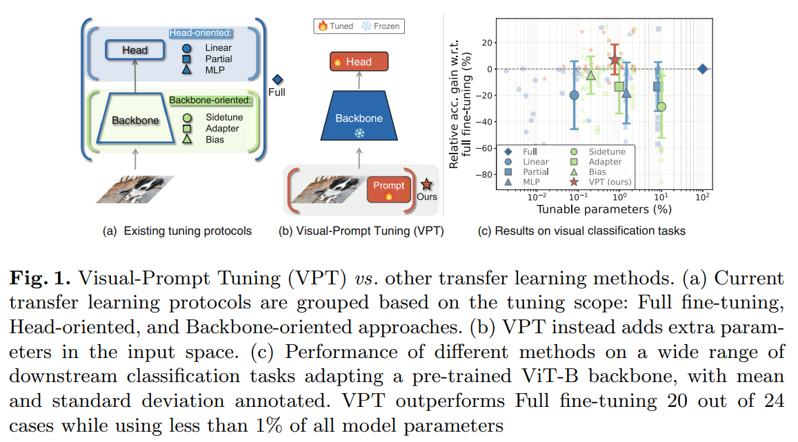
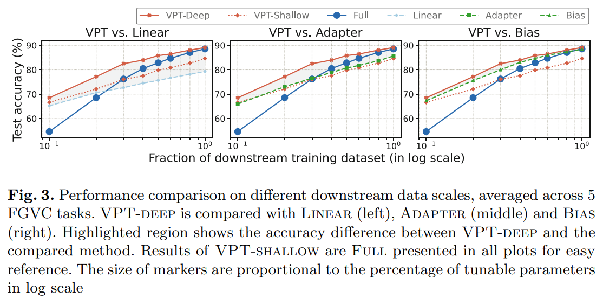
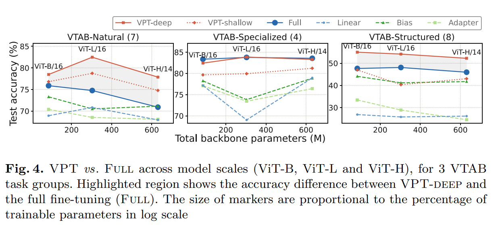
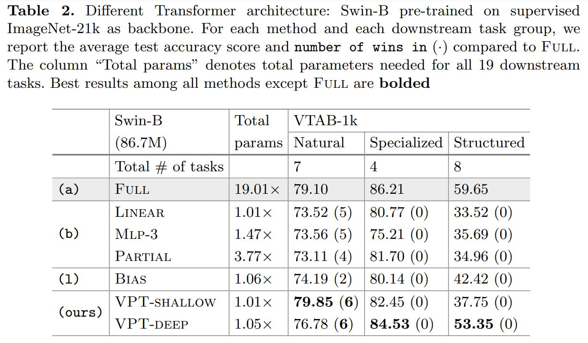
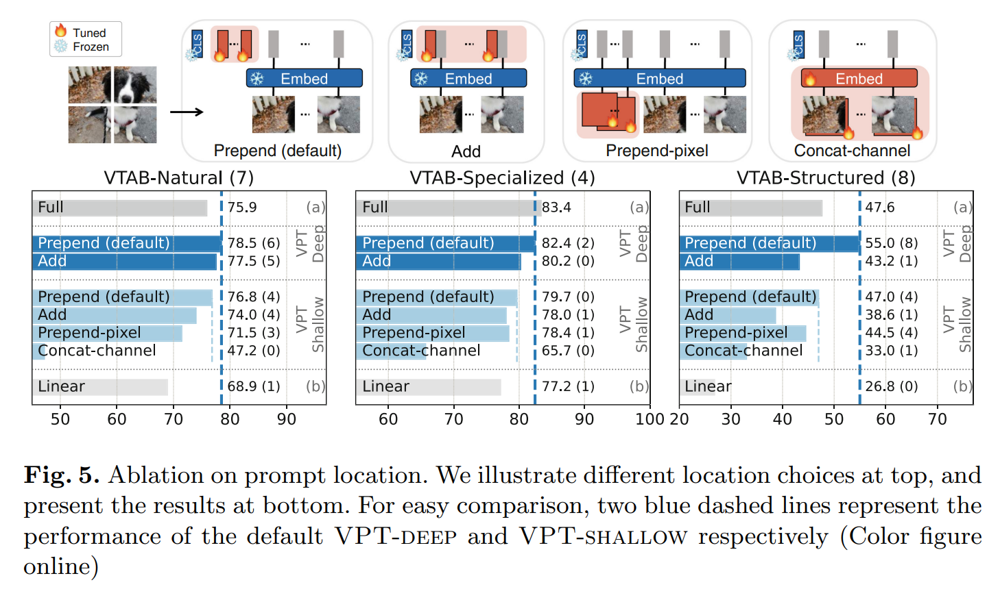
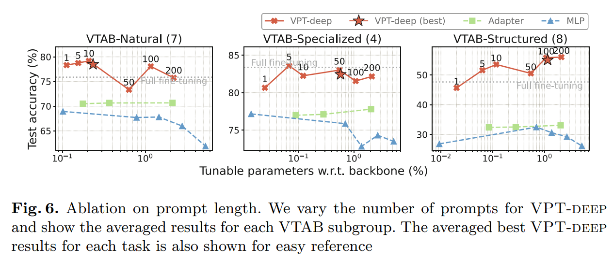
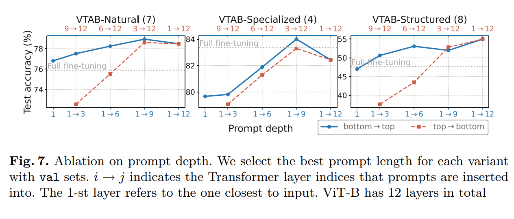
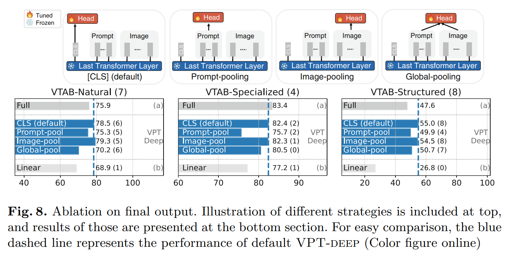
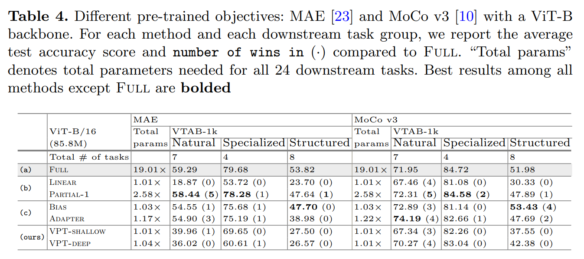
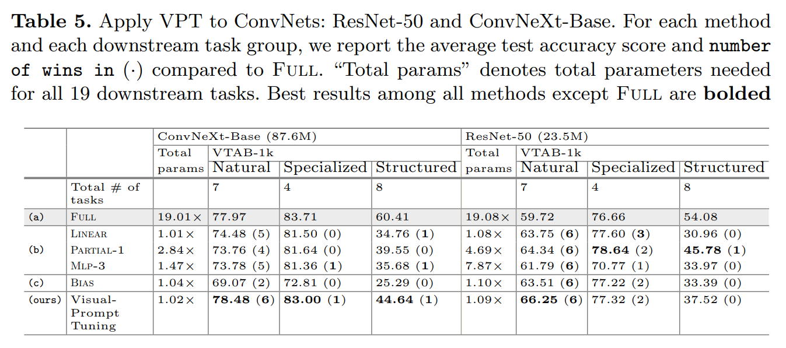

논문 및 이미지 출처 : <https://link.springer.com/chapter/10.1007/978-3-031-19827-4_41>

# Abstract

현재 pre-trained model 을 adapting 하는 일반적인 방법은 모든 backbone parameter 를 업데이트하는, full fine-tuning 이다.

본 논문은 large-scale Transformer 에서 full fine-tuning 을 대체할 효율적이고 효과적인 방법으로 Visual Prompt Tuning (VPT)을 소개

large language model 을 효율적으로 tuning 하는 최근의 발전에서 영감을 받아, VPT 는 input space 에 model parameter 의 1% 미만에 해당하는 small trainable parameters 만 도입하고 model backbone 은 그대로 둔다.

다양한 downstream recognition task 에 대한 광범위한 실험을 통해 VPT 가 다른 parameter-efficient tuning protocol 에 비해 상당한 성능 향상을 이룬다는 것을 보여줌.

가장 중요한 것은, VPT 가 모델 용량과 training data scales 에 상관없이 많은 경우 full fine-tuning 보다 뛰어난 성능을 발휘하면서도 작업별 저장 비용을 줄인다는 점이다.

# 1. Introduction

다양한 recognition applications 분야에서 가장 정확한 결과는 massive curated 또는 raw data 에 대한 pre-trained large foundation models 을 adapting 하여 얻어짐.

최신 foundation model 활용으로 여러 recognition problem 에 빠른 진전이 있지만, 이런 large model 을 downstream task 에 _adapting_ 하는 데에 자체적인 어려움이 있다.

- pre-trained model 을 해당 task 에 end-to-end 으로 _fully fine-tuning_ 하는 것.
  - 이 전략은 각 task 마다 backbone parameter 를 별도 copy 르 저장하고 deploy 하는 것을 의미
  - 이는 매우 expensive 및 infeasible
- 현대 _Transformer_-based  architecture 는 CNN 보다 훨씬 큼
  - 예로, ViT-Huge (632M parameters) vs. ResNet-50 (25M parameters)
- 따라서, 저자는 large pre-trained Transformers 를 효과적이고 효율적으로 downstream task 에 adapting 하는 최선의 방법을 탐구

---

직관적인 접근 방식은 CNN 을 new task 에 adapting 하기 위해 완성한 다른 전략을 사용하는 것 (Fig. 1(a)).

- 인기 있는 접근 방식은 classifier head 나 bias terms 같은 subset parameters 만 fine-tuning
- 이전 연구에선 backbone 에 residual blocks (or _adapters_)을 추가하는 것을 살펴봄
- 이러한 전략을 Transformer 에도 구현할 수 있지만 일반적으로 이러한 전략은 정확도에서 full fine-tuning 보다 성능이 떨어짐

---

본 논문은 다른 경로를 탐구.

pre-trained Transformer 자체를 변경하거나 fine-tuning 하는 대신, Transformer 의 input 을 수정

최근 NLP 에서 prompt 진보를 바탕으로, 저자는 downstream vision tasks 를 위해 Transformer model 을 adapting 하는 새로운 간단하고 효율적인 방법인 **Visual-Prompt Tuning** (**VPT**)을 제안 (Fig. 1(b)). 

- 저자의 방법은 downstream training 동안, pre-trained Transformer backbone 을 freezing 하는 동안 input space 에 small task-specific learnable parameters 만 도입
- 실제로, 이러한 additional parameters 는 단순히 각 Transformer layer 의 input sequence 에 prepend 되고 linear head 와 함께 fine-tuning 중 학습됨

---

- pre-trained ViT backbone 을 사용해 다양한 domain 에 걸친 24 downstream recognition task 에 VPT 는 다른 transfer learning baseline 을 능가하며, 20 에선 full fine-tuning 을 능가
- 동시에 각 개별 task 에 대해 fewer parameters (backbone parameters 의 1% 미만)를 저장하는 이점을 유지 (Fig. 1(c)).
- 이 결과는 visual prompting 의 독특한 강점을 보여줌.
- NLP 에서는 prompt tuning 이 특정 상황에서만 full fine-tuning 과 match
  - VPT 는 특히 low-data 환경에서 효과적이며, data scales 전반에 걸쳐 그 장점을 유지
- 마지막으로, VPT 는 다양한 Transformer 규모와 설계(ViT-Base/Large/Huge, Swin)에 대해 경쟁력이 있음
- 종합적으로, 저자의 결과는 VPT 가 계속해서 커지는 vision backbone 을 adapting 하는 가장 효과적인 방법 중 하나임을 시사

# 2. Related Work

#### Transformer

Transformer model 은 NLP 에서 큰 성공을 이룸. 이는 image classification, object detection, semantic, panoptic segmentation, video understanding 및 few-shot learning 같은 다양한 vision task 로 확장되어, 이전 SOTA 접근 방식을 능가

Transformer 는 최근 self-supervised pre-training 에서도 널리 사용되고 있음. CNN 과 비교하여 성능이 우수하고 규모가 훨씬 큰 Transformer 를 다양한 vision task 에 효율적으로 adapting 하는 방법은 여전히 중요한 미해결 문제

저자의 VPT 는 유망한 해결책을 제공

#### Transfer learning

transfer learning 은 CNN vision task 에 광범위하게 연구되었으며, side tuning, residual adapter, bias tuning 등의 여러 기술이 도입

상대적으로 vision Transformer adapting 에 대한 관심은 적었으며, 앞서 언급한 방법들이 이 새로운 유형의 아키텍처에서 얼마나 잘 작동하는지는 알려지지 않았다.

반면, large-scale pre-trained Transformer-based language model 의 지배력을 고려할 때, 많은 접근 방식이 다양한 downstream NLP task 에 효율적으로 LM 을 fine-tuning 하기 위해 제안

이 중 저자는 벤치마킹 목적으로 실험에서 두 가지 대표적인 방법에 초점을 맞춤: Adapters 와 BitFit

- Adapter : 각 Transformer layer 내에 lightweight module 추가
  - 한 adapter module 은 linear up-projection 과 residual connection 으로 구성
- BitFit : new module 삽입 대신, CNN 을 fine-tuning 할 때 bias term 을 업데이트하고 나머지 backbone parameter 를 freezing 하는 방법이 있었으며, 이 기술은 Transformer 에 적용하여 LM tuning 에 효과를 검증

저자의 연구는 일반적으로 VPT 가 Transformer 을 vision task 에 적응시키는 데 있어서 앞서 언급한 두 가지 잘 확립된 NLP 방법보다 향상된 성능을 제공함을 보여줌

#### Prompting

Prompting 은 원래 input text 에 language instruction 을 추가하여 pre-trained LM 이 task 를 "understand" 하도록 하는 것을 의미.

manually chosen prompts 를 사용해 GPT-3 은 few-shot 또는 zero-shot 설정에서 downstream task 에 강력한 generalization 을 보여줌.

더 나은 prompt text 를 구성하는 방법에 대한 후속 연구 외에도, 최근 작업들은 prompt 를 task-specific continuous vector 로 간주하고 fine-tuning 중 gradient 로 직접 optimizing 하는 방법 제안

- 이를 prompt tuning 이라고 하며, full fine-tuning 과 비교할 때, 이는 성능은 유사하지만 1000x less parameters storage 요구
- 최근 prompt 가 vision-language model 에도 적용되었지만, 여전히 text encoder input 에 한정되어 있다.
- vision 과 language modality 간의 차이로 인해, 이 논문에서는 동일한 방법이 image encoder 에도 성공적으로 적용될 수 있는지 묻는다
  - 저자는 이 질문을 다루고 여러 domain 과 backbone architecture 에 걸친 다양한 recognition task 에 대한 광범위한 실험을 통해 visual prompt 의 일반성과 실행 가능성을 조사하는 최초의 연구

# 3. Approach

저자는 large pre-trained vision Transformer models 을 adapting 하기 위한 **Visual-Prompt Tuning** 을 제안

VPT 는 small learnable parameters 를 Transformer input space 에 주입하고 downstream training stage 중 backbone 은 freezing 한다

전체 framework 는 Fig. 2 에 있음.

## 3.1 Preliminaries

$N$ layers 의 Vition Transformer (ViT) 의 경우, input image 가 $m$ fixed-sized patches $\{ I_j \in \mathbb{R}^{3 \times h \times w} \}$ 로 분할된다.

- $h, w$ 는 image patches 의 height 와 weight 
- 각 patch 는 먼저 $d$-dimensional latent space 로 positional encoding 과 함께 embedding 화 됨

$$
\begin{equation}
  e^j_0 = \text{Embed}(I_j) \qquad e^j_0 \in \mathbb{R}^d, j = 1, 2, \dots, m .
\end{equation}
$$

- 저자는 image patch embeddings collection $\text{E}_i = \{ e^j_i \in \mathbb{R}^d | j \in \mathbb{N}, 1 \le j \le m \}$ 을 $(i+1)$-th Transformer layer $(L_{i+1})$ 의 input 으로 표기
- extra learnable classification token ($[\text{CLS}]$) 와 함께, ViT 전체를 다음과 같이 공식화

$$
\begin{equation}
  [x_i, \text{E}_i] = L_i ([x_{i-1}, \text{E}_{i-1}]) \qquad i = 1, 2, \dots, N
\end{equation}
$$

$$
\begin{equation}
  y = \text{Head}(x_N),
\end{equation}
$$

- $x_i \in \mathbb{R}^d$ : $L_{i+1}$ 의 input space 의 $[\text{CLS}]$ embedding
- $[\cdot, \cdot]$ : sequence length dimension 의 stack 및 concatenation, 즉, $[x_i, \text{E}_i] \in \mathbb{R}^{(1+m) \times d}$
- 각 layer $L_i$ 는 LayerNorm 및 residual connection 과 함께 Multiheaded Self-Attention (MSA) 및 Feed-Forward Networks (FFN) 으로 구성
- neural classification head 는 final layer $[\text{CLS}]$ embedding $x_N$ 을 predicted class probability distribution $y$ 로 mapping 하는데 사용

## 3.2 Visual-Prompt Tuning (VPT)

pre-trained Transformer 을 사용하여, 저자는 Embed layer 후의 input space 에 dimension $d$ 의 $p$ continuous embeddings (즉, _prompts_)을 도입

fine-tuning 동안 task-specific prompts 에 대한 prompt 만 업데이트되며, Transformer backbone 은 freezing 유지

Transformer layer 수에 따라, 저자의 접근 방식은 VPT-shallow 과 VPT-deep 의 두 가지 변형으로 나뉨 (Fig. 2 참조)

#### VPT-Shallow

Prompt 는 first Transformer layer $L_1$ 에만 삽입

- 각 prompt token 은 learnable $d$-dimensional vector.
- $p$ prompts 의 collection 은 $\text{P} = \{ p^k \in \mathbb{R}^d | k \in \mathbb{N}, 1 \le k \le p \},$ 로 표시되며, shallow-promped ViT 는 다음과 같다.

$$
\begin{align}
  [x_1, Z_1, E_1] &= \textcolor{skyblue}{L_1}([\textcolor{skyblue}{x_0}, \textcolor{red}{\text{P}}, E_0]) \\
  [x_i, Z_i, E_i] & = \textcolor{skyblue}{L_1}([x_{i-1}, Z_{i-1}, E_{i-1}]) \qquad i = 2, 3, \dots, N \\
  y &= \textcolor{red}{\text{Head}}(x_N),
\end{align}
$$

- $Z_i \in \mathbb{R}^{p \times d}$ : $i$-th Transformer layer 에 의해 계산된 features 를 나타내며, $[x_i, Z_i, E_i] \in \mathbb{R}^{(1 + p + m) \times d}$ 이다.
- colors $\textcolor{red}{\cdot}$ 및 $\textcolor{skyblue}{\cdot}$ : $\textcolor{red}{\text{learnable}}$ 및 $\textcolor{skyblue}{\text{frozen}}$ parameters
- 특히 ViT 의 경우, $x_N$ 은 prompts 가 positional encoding 후에 삽입되기 때문에, prompts location 은 불변
  - 예로, $[x_0, P, E_0]$ 와 $[x_0, E_0, P]$ 는 수학적으로 동일. 이는 VPT-Deep 에도 적용

#### VPT-Deep

Prompts 는 각 Transformer layer 마다 input space 에 도입

- $(i+1)$-th Layer $L_{i+1}$ 의 경우, input learnable prompts collection $P_i = \{p^k_i \in \mathbb{R}^d | k ∈ \mathbb{N}, 1 \le k \le m\}$ 로 나타냄
- deep-prompted ViT 는 다음과 같이 공식화

$$
\begin{align}
  [x_i, \_, E_i] &= \textcolor{skyblue}{L_i}([x_{i-1}, \textcolor{red}{\text{P}_{i-1}}, E_{i-1}]) \qquad i = 1,2, \dots, N \\
  y &= \textcolor{red}{\text{Head}}(x_N).
\end{align}
$$

#### Storing Visual Prompts

VPT 는 multiple downstream tasks 에서 유리.

- 저자는 learned prompts 및 classification head 만 저장하고 pre-trained Transformer model 의 original copy 를 재사용하면 되므로 저장 비용이 크게 줆.
- 예로, ViT-Base 의 86M parameters 와 $d = 768$ 이 주어졌을 때, 50 shallow prompts 및 deep prompts 는 추가적으로 $p \times d = 50 \times 768 = 0.038M$ 및 $N × p × d = 0.46M$ 를 생성하여 각각 전체 parameter 의 0.04% 및 0.53% 에 불과

# 4. Experiments

저자는 pre-trained Transformer backbone 을 사용해 광범위한 downstream recognition task 에서 VPT 평가

## 4.1 Experiment Setup

#### Pre-trained Backbones.

저자는 Vision Transformers (ViT) 와 Swin Transformers (Swin) 두 가지 Transformer architecture 를 실험

이 섹션의 모든 backbone 은 ImageNet-21k 에서 pre-training 됨

저자의 original configurations, 예로 divided image patches 수, [CLS] 의 존재 등을 따름

#### Baselines.

VPT 의 두 가지 변형을 다음과 같은 일반적으로 사용되는 fine-tuning protocol 과 비교:

(a) **Full** : _all_ backbone 과 classification head parameters 를 fully updates

(b) **classification head 에 초점을 맞춘 방법** : pre-trained backbone 을 feature extractor 로 간주하고, tuning 중에 weight fixing:
- **Linear** : classification head 로 linear layer 만 사용
- **Partial-k** : backbone 의 last $k$ layer 룰 fine-tuning 하고 나머지는 freezing
- **MLP-k** : linear layer 대신 multilayer perceptron(MLP) $k$ layer 를 classification head 로 사용

(c) **subset backbone parameters 를 update 하거나 fine-tuning 중 backbone 에 new trainable parameters 를 추가하는 방법**:
- **Sidetune** : "side" network 를 훈련시키고 pre-trained features 및 side-tuned features 를 linear interpolate 한 후 head 로 전달
- **Bias** : pre-trained backbone 의 bias terms 만 fine-tuning
- **Adapter** : Transformer layer 내에 new MLP 를 residual connection 과 함께 삽입

#### Downstream Tasks.

저자는 다음 두 가지 dataset collections 를 실험:
- **FGVC**: CUB-200–2011, NABirds, Oxford Flowers, Stanford Dogs, Stanford Cars 를 포함한 5 benchmarked Fine-Grained Visual Classification tasks 로 구성
  - 특정 dataset 이 공개된 train 및 test set 만 있는 경우, train set 을 무작위로 train (90%) 과 val (10%) 으로 나누고, val 을 사용하여 hyperparameters 선택
- **VTAB-1k**: 19 diverse visual classification tasks 로 구성된 collection. 이는 세 그룹으로 구성:
  - _Natural_ : standard camera 로 포착한 자연 이미지 포함
  - _Specialized_ : 의료 및 위성 이미지와 같은 특수 장비로 캡처된 이미지 포함
  - _Structured_ : object counting 같은 같은 기하학적 이해가 필요한 task
  - 각 VTAB 에는 1000 training examples 포함
  - 저자는 제공된 800-200 train set split 을 사용하여 hyperparameter 를 결정하고 full training data 를 사용하여 final evaluation 실행
  - test set 에서 3 runs 를 실행한 평균 정확도 보고

저자는 FGVC dataset 의 평균 정확도와 VTAB 의 각 그룹에서의 평균 정확도를 보고.

## 4.2 Main Results

Tab. 1 은 pre-trained ViT-B/16 을 4 diverse downstream task groups 에 대한 fine-tuning 평균 결과를 제시하며, VPT 와 다른 7 tuning protocols 를 비교.

이를 통해 우리는 다음과 같은 사실을 알 수 있음:

1. **VPT-Deep 은 3 out of 4 problem classes  (20 out of 24 tasks) 에서 Full 능가**하면서, fewer total model parameters (1.18x vs. 24.02x) 사용. 따라서 저장 공간은 문제되지 않더라도 VPT 는 더 큰 Transformer 을 adapting 하는 유망한 방법. 이 결과는 NLP 의 prompt tuning 이 full fine-tuning 과 일치하지만 초과하지 않는 것과는 대조적
2. **VPT-Deep 은 all task groups 에서 other parameter-efficient tuning protocols 를 능가하며**, 이는 VPT-Deep 이 저장 공간이 제한된 환경에서 best fine-tuning 전략임을 나타냄
3. VPT-Deep 보다는 sub-optimal 이지만, VPT-Shallow 은 Tab. 1(b) 에 head-oriented tuning 방법보다 여전히 비약적인 성능 향상을 제공하며, 이는 저장 공간 제약이 심한 경우, multi-task fine-tuned models 를 배포하는 데 있어 VPT-Shallow 이 가치 있는 선택임을 나타냄

#### VPT on Different Downstream Data Size.

저자는 FGVC task 에서 training data size 가 정확도에 미치는 영향을 살펴봄. (VTAB 는 1k training examples).

training data 를 10% 에서 80% 로 다양하게 조정하고 모든 방법을 비교. 동일한 pre-trained ViT-B 가 downstream training 에 사용

다양한 training data scales 에 대한 각 방법의 task-averaged results 는 Fig. 3 에 제시

Fig. 3 은 VPT-Deep 이 data scales 전반에 걸쳐 다른 모든 baselines 를 능가하는 것을 보여줌

- 더 깊이 살펴보면, less trainable parameters 를 사용하는 방법들, 즉 VPT, Linear, Adapter, Bias 가 low-data 상황에서 Full 을 능가
- 그러나 이 경향은 more training data 를 사용할 수 있을 때, Linear 와 Adapter 에 대해 역전됨
- 반면, VPT-deep 은 training data sizes 에 관계없이 여전히 Full 을 일관되게 능가
- 비슷한 이점을 제공하는 Bias 도 있지만, 여전히 VPT-deep 보다는 전체적으로 약간의 성능 저하가 있음 (Fig. 3 right)

#### VPT on Different Backbone Scales

Fig. 4 는 3 backbone scales 에서 VTAB-1k 성능을 보여줌: ViT-Base/Large/Huge. 

- VPT-deep 은 3 backbone 선택지와 VTAB-1k 의 3 subgroups 전반에 걸쳐 Linear 및 VPT-shallow 보다 상당히 우수
- 더 중요한 것은, VPT-deep 이 Full 보다 더 큰 모델 스케일에서도 여전히 우수
- 즉, VPT-deep 은 _Natural_ 및 _Structured_ groups 에서 Full 을 크게 능가하며, _Specialized_ 에서는 거의 동일한 성능을 제공

#### VPT on Hierarchical Transformers

저자는 local shifted window 내에서 MSA 를 사용하고 deeper layers 에서 patch embeddings 를 병합하는 Swin 으로 VPT 를 확장

- 단순함과 일반성을 잃지 않기 위해, prompt 는 local windows 내에 attend 하지만 patch merging stages 에서는 무시하는 가장 간단한 방식으로 VPT 를 구현
- 실험은 ImageNet-21k supervised pre-trained Swin-Base 에서 수행
- VPT 는 여전히 모든 VTAB 3 subgroups 에 대해 other parameter-efficient fine-tuning (b, c) 들을 능가하지만, 이 경우 Full 이 전체적으로 가장 높은 정확도 점수를 제공 (total parameters 에서 큰 비용이 듭니다) (Tab. 2).
- _Natural_ 에서는 VPT-deep 이 VPT-shallow 보다 우세한 점이 줄어드는 것이 놀라움: VPT-shallow 은 full fine-tuning 보다 약간 더 나은 정확도 점수를 제공

## 4.3 Ablation on Model Design Variants

저자는 supervised ImageNet-21k pre-trained ViT-Base 에 대해 다양한 모델 설계 선택을 분석하고 VTAB 에서 이를 평가.

#### Prompt Location.

VPT 와 다른 방법의 주요 차이점은 Transformer layer 의 input 우로 도입되는 extra learnable parameters.

Fig. 5 에서 input space 에서 prompt 를 삽입하는 방법과 위치가 final performance 에 어떻게 영향을 미치는지 다양한 선택을 분석

_**Prepend or Add?**_

prompt 를 image patches embeddings $E_i$ 의 sequence 에 추가하는 대신, prompts element-wise 로 직접 embeddings 에 추가하여 Transformer 의 input sequence length 를 이전과 동일하게 유지할 수도 있음

- 이 variant 는 일부 경우 (e.g, VTAB-_Natural_) 에서 Full 과 competitive 하지만, 일반적으로 default **Prepend** setting 의 deep 및 shallow 모두에서 성능이 떨어짐

_**Latent or pixel space**_

first Transformer layer 의 latent vectors 로 삽입하는 대신, prompt 를 Eq. (1) 에서 Embed layer 이전의 _pixel level_ 에서 도입할 수 있음. 즉, **Prepend-pixel** 과 **Concat-channel**. 

Fig. 5 는 이러한 두 variants 가 adapting performance 가 감소하는 것을 보여줌

- 예로, projection layer 이전에 shallow prompts (Prepend-pixel) 을 추가하면 VTAB-_Natural_ 에서 기본적으로 embedding space 에 추가하는 것 (Prepend)과 비교하여 정확도 점수가 6.9% 떨어짐.
- input image 에 새 채널을 추가하는 경우 (Concat-channel) 성능은 더욱 악화 (심지어 VTAB-_Natural_ 에서 30 point 감소)

이러한 관찰은 prompts 가 Transformer 의 latent input space 에서 condensed task-dependent signals 를 학습하는 것이 더 쉽다는 것을 시사

#### Prompt Length.

이는 full fine-tuning 과 비교하여 VPT 를 위해 tuning 해야하는 유일한 additional hyper-parameter.

저자는 또한 MLP 및 Adapter 의 indivisual addtional hyper-parameters (i.e., layer number 및 reduction rate) 에 대한 두 가지 baselines 분석

주목할 만하게, prompt 가 단 하나만 있어도 VPT-Deep 은 여전히 다른 두 baseline 을 크게 능가하며, VTAB-Structured 및 Natural 에서 full fine-tuning 과 비교하여 competitive 하거나 더 나은 성능 유지

#### Prompt Depth.

Fig. 7 은 어떤 layer 에 몇 개의 prompt 를 삽입할 지를 분석.

- 각 variant 는 val set 으로 선택한 best prompt length 를 보고
- 일반적으로 VPT 의 성능은 prompt depth 와 긍정적으로 상관관계가 있음
- 그러나 top to bottom 으로 prompt 를 삽입하면 정확도가 떨어지는데, 이는 Transformer 의 초기 레이어의 프롬프트가 후반 레이어의 프롬프트보다 더 중요하다는 것을 시사

#### Final Output.

ViT 의 original configuration 에 따라, 저자는 [CLS] 의 final embeddings 를 사용. 즉, $x_N$ 를 classification head input 으로 사용하며, 이는 ViT 실험의 기본 설정.

Fig. 8 에서 보이듯,

- image patch output embeddings $E_N$ 에 대해 average pooling 을 final output 으로 사용하면 결과는 본질적으로 동일하게 우지 (e.g., VTAB-Specialized 에서 82.4 vs 82.3)
- 하지만, final prompt output $Z_N$ 을 pooling 에 포함하면 (Prompt-pool 및 Global-pool), 정확도가 최대 8 point 떨어짐

# 5. Analysis and Discussion

#### Visualization.

Fig. 9 는 VTAB 의 3 tasks (SVNH, EuroSAT, Clevr/count) 에 대한 last Transformer layer 이후, classification head 이전의 [CLS] embedding 인 $x_N$ 의 t-SNE visualization 을 보여줌

- 모든 plots 에서 VPT-Deep 은 Full 보다 less parameters 를 사용하면서도 linearly separable representations 를 가능하게 함.
- 또한, 각 Transformer layer 에 extra tunable parameters 를 추가하는 VPT-Deep 은 first layer input 에만 prompts 를 삽입하는 VPT-shallow 에 비해 성능이 향상됨을 관찰
- 특히 Clevr/count (Fig. 9(c)) 에선 VPT-Deep 과 Full 이 task 의 기본 manifold structure (image 에서 counting object vs. 거리 번호나 풍경 인식)를 복원하는 반면, VPT-shallow 와 Linear 는 그렇지 못함

#### Apply VPT to More Vision Tasks.

VPT 의 가능성을 탐색하기 위해, Transformer (SERT-PUP) 을 사용하여 ADE20K semantic segmentation task 를 평가

이 모델은 segmentation 수행을 위해 ViT backbone 에 standard CNN 추가. 사실상 approach 는 CNN head 와 함게 pre-trained backbone 을 full fine-tuning 하는 것 (Full).

비교를 위해 두 protocols 를 더 포함: head layers 만 업데이트 (Head Only), backbone 의 bias vector 와 head layer 를 업데이트 (Bias). 

Tab. 3 에서 multi-scale inference 를 포함한 유무에 따른 val mIoU 결과를 보고

- parameter-efficient protocols 는 Full 과 경쟁할 수 없지만, VPT 는 Bias 와 비교할 만한 결과를 제공
- 특히, VPT 는 significantly less parameters (15M vs 64M)를 tuning 하면서도 full fine-tuned SOTA CNN (DeepLab v3+)과 유사한 결과를 제공

#### Apply VPT to More Pre-training Methods.

backbones pre-trained with labeled data  외에, 두 가지 self-supervised objectives: MAE 및 MoCo v3 에도 실험 진행

Tab. 4 는 ViT-B 와 함께 VTAB-1k 에서의 결과를 보고

- 두 가지 VPT variants 모두 Linear 보다 뛰어남을 관찰, 그러나 다른 기술들과의 비교는 덜 명확
- MAE 의 경우, other parameter-efficient 방법들, e.g., Partial-1 이 VPT 와 Linear 보다 뛰어남
- MoCo v3 의 경우, VPT 는 더 이상 최고 성능을 보이지 않지만, 여전히 다른 방법들과 competitive
- 이는 이러한 두 self-supervised ViT 가 이전 섹션의 supervised 와 근본적으로 다르다는 것을 시사

#### Apply VPT to ConvNets.

CNN 의 input space 에 learnable parameter 를 추가하는 아이디어 검토: input image 의 height, width 를 $p$ learnable pixel 로 padding

이 작업은 unconventional 할 수 있지만, Transformer 와 유사한 location-invariant prompts 를 추가할 명확한 해결책이 없어, 이러한 VPT 를 구현

이 approach 는 이전에 adversarial attack 에서 탐구된 바가 있다.

저자의 실험에서 $p$ 값은 이전 연구보다 2 제곱 작은 값이다: 예로, 5 vs 256

중요한 점은 transfer learning 관점에서의 해석

Tab. 5 는 ConvNeXt-B (pre-trained on ImageNet-21k) 와 ResNet-50 (pre-trained on ImageNet-1k) 에 대한 결과 제시

- VPT 는 더 큰 CNN backbone 인 ConvNeXt-B 에 더 잘 작동, 다른 sparse tuning protocols (b, c) 보다 높은 정확도 제공
- 19 case 중 8 에서 Full 보다 우수한 성능
- VPT 의 장점은 더 작은 ConvNet (ResNet-50) 에서는 감소하여, 모든 19 VTAB-1k task 에서 명확한 승자가 없음.

# 6. Conclusion

저자는 다양한 downstream task 를 위해 large vision transformer 를 활용하는 new parameter-efficient approach 인 Visual Prompt Tuning (VPT) 제안

- VPT 는 input space 에 task-specific learnable prompts 를 도입하여, pre-trained backbone 을 freezing 한 상태를 유지
- VPT 는 다른 fine-tuning protocols (종종 full fine-tuning 포함)을 능가하면서도 저장 비용을 극적으로 줄일 수 있음을 보여줌
- 저자의 실험은 또한 서로 다른 pre-training objective 를 가진 vision transformer 의 fine-tuning 과 더 넓은 vision recognition task 로 효율적으로 transfer 하는 흥미로운 질문들을 제기