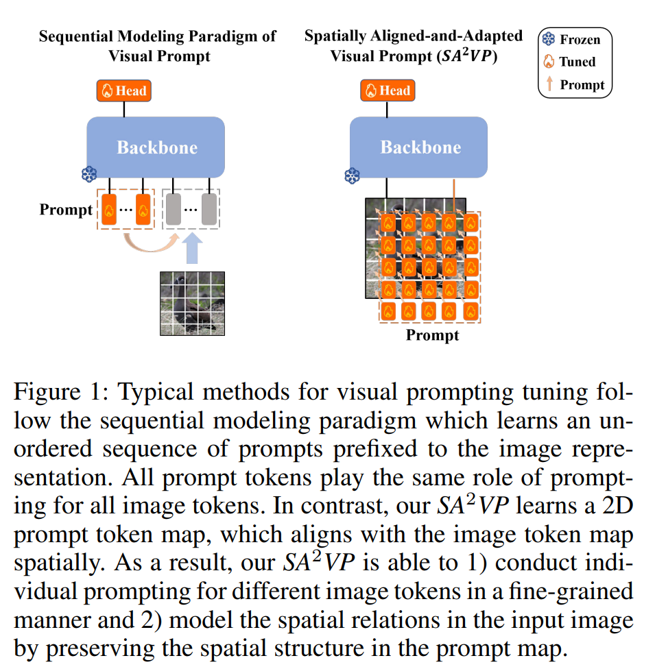
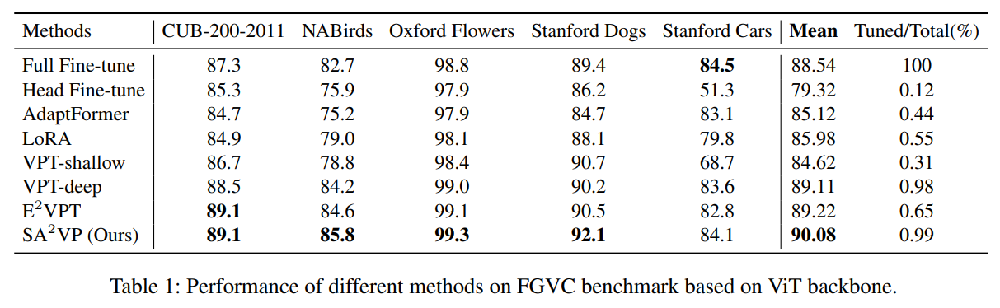
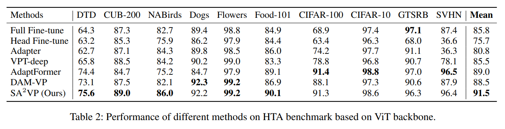
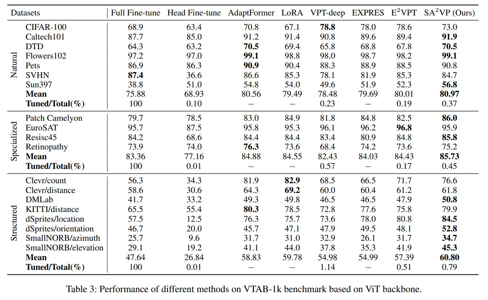
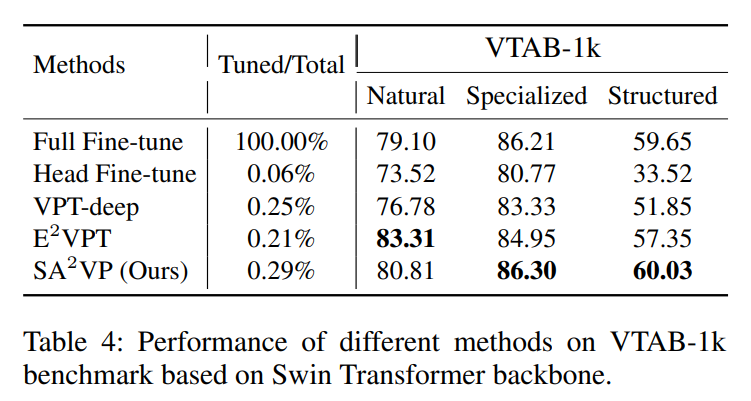
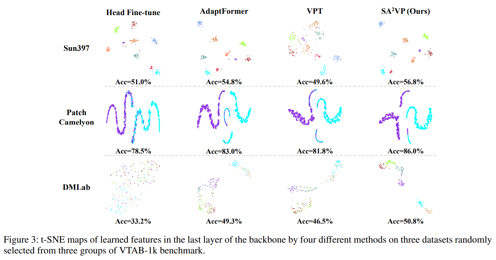
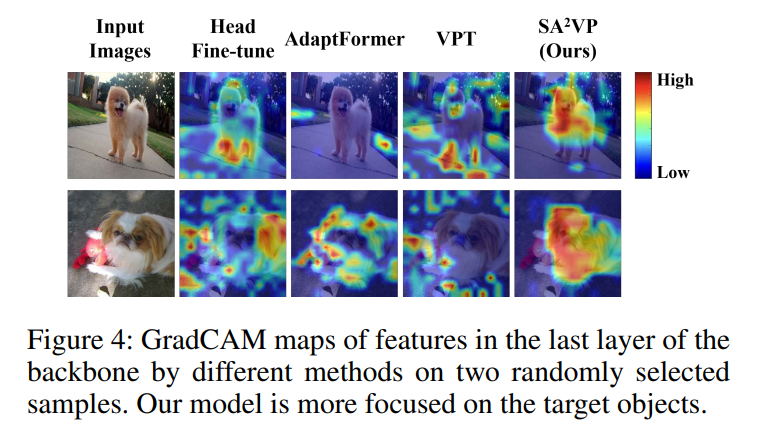
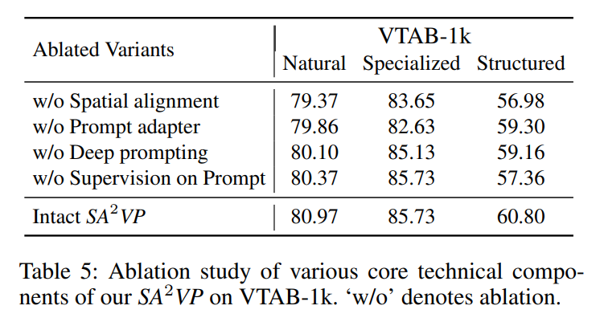
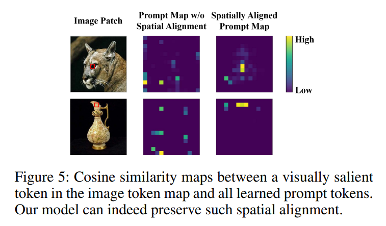

논문 및 이미지 출처 : <https://arxiv.org/abs/2312.10376>

# Abstract

NLP 내의 주요 PEFT 인 prompt tuning 이 vision 에서도 탐구되고 있음.

전형적인 visual prompt tuning 방법은 NLP 에서 유래한 sequential modeling 패러다임을 따름.

- 이 방법은 input image 를 token embedding 의 flattened sequence 로 나타낸 후 sequence representation 에 prefix 되는 unordered parameterized token set 을 학습하여 large vision models 의 task adaptation 을 위한 visual prompt 로 사용
- 이러한 sequential modeling 패러다임의 visual prompt 는 큰 잠재력을 보였지만, 두 가지 잠재적 한계가 있음
  1. learned visual prompts 는 image encoding 에 중요한 input image 의 spatial relations 를 모델링할 수 없음.
  2. all prompt tokens 는 all image tokens 에 대해 동일한 역할을 하여 individual prompting 에 대한 fine-grained prompting capability 가 부족
     - 즉, 각기 다른 image tokens 에 대한 individual prompting 이 없음

이 연구에서는 Spatially Aligned-and-Adapted Visual Prompt model (SA$^2$2VP) 을 제안

- 이 model 은 image token map 과 동일하거나 축소된 크기의 two-dimensional prompt token map 을 학습하여 image map 과 spatially align 될 수 있음
- 각 prompt token 은 공간적으로 대응하는 image token 에 대한 knowledge 를 제공하도록 지정됨
- 결과적으로, 저자의 모델은 다양한 image token 에 대해 fine-grained manner 로 individual prompting 을 수행할 수 있음.
- 또한 learned prompt token map 이 spatial structure 를 보존하는 기능 덕분에, _SA$^2$VP_ 는 input image 와 spatial relations 를 modeling 할 수 있어 더 효과적인 prompt 를 제공
- image classification 을 위한 3 benchmark 에서 광범위한 실험을 통해 다른 SOTA prompt tuning 들보다 우수한 성능을 보여줌.

# 1. Introduction

large pre-trained vision model 을 specific downstream vision task 에 adaptation 하는 것은 PEFT 를 통해 effective 및 efficient 전략으로 입증됨.

- 이는 training data 가 제한된 시나리오에서 특히 유용
- PEFT 는 pre-trained model 에서 downstream task 와 관련된 prior knowledge 를 추출하여 성능을 향상시킬 뿐만 아니라, small parameters 만 tuning 하여 training efficiency 를 크게 개선
- 대표적인 PEFT 방법인 prompt tuning 은 NLP 분야에서 큰 성공을 거두었으며, vision 분야에서도 그 잠재력이 탐구되고 있음

---

기존 visual prompt tuning 방법들은 NLP 에서 prompt 학습 방식에서 유래한 sequential modeling 패러다임을 따름

- 예로 VPT 는 input image 를 pre-trained vision transformer model 을 사용한 sequential representation 으로 encoding 하고, image representation 에 auxiliary input 으로 prompt token 을 학습
- learned vision prompts 는 pre-trained model 에서 관련 knowledge 를 추출하여 pre-trained model 을 downstream target task 에 adapting 하는 역할을 함
- 이러한 sequential modeling 패러다임은 큰 가능성을 보여주었지만 두 가지 잠재적 한계가 있음.
  - prompt token 의 unordered sequence structure 로 인해 spatial structure 를 capture 할 수 없으므로 image 의 feature learning 에 중요한 underlying spatial relations 을 modeling 할 수 없음
  - sequential modeling 패러다임에서 all visual prompts 는 all image tokens 에 대해 동일한 역할을 하여, 다양한 image tokens 이 fine-grained prompting 을 갖도록 individual prompting 을 수행할 수 없음.
    - 그러나 서로 다른 image tokens 는 서로 다른 의미를 가질 수 있으므로 specific prompting 이 필요할 수 있음

위의 두 가지 한계를 해결하기 위해, 저자는 Spatially Aligned-and-Adapted Visual Prompt model (SA$^2$VP)을 제안. Fig. 1 에서 보이듯

- sequential modeling 패러다임에서 unordered sequence 의 visual prompt 를 학습하는 대신, SA2VP 는 image token map 과 동일한 크기 (or scaled) 의 two-dimensional prompt token map 을 학습
- 또한, pre-trained model 의 positional embeddings 를 prompt token map 에 통합하여 spatial structure 를 보존
- 결과적으로, SA2VP 는 prompt token map 을 image token map 과 spatially align 될 수 있으며, 이는 두 가지 중요한 장점을 제공
  - prompt token map 에서 spatial structure 가 잘 보존되므로, input image 의 spatial relations 를 학습할 수 있어, vision prompt 를 통해 더 효과적인 knowledge 를 추출할 수 있음
  - 각 prompt token 은 공간적으로 대응하는 image token 에 대해서만 prompting 을 수행하도록 지정되어, 다른 image token 에 대해 fine-grained manner 로 수행할 수 있다.

논문의 기여는 다음과 같음

- 저자는 2D spatial space 에서 image token map 과 align 할 수 있는 novel visual prompt structure 를 설계. 이러한 설계는 SA2VP 가 input image 의 spatial relations 를 modeling 할 뿐만 아니라 fine-grained manner 로서 individual prompt 를 수행할 수 있도록 함
- 저자는 SA2VP 에 대한 간단하면서도 효과적인 기술 구현을 고안. 제안된 spatially-aligned cross attention operation 을 기반으로 한 two pathways 간의 bilateral interaction 이 있는 siamese dual-pathway architecture 를 따름
- 저자는 세 가지 도전적인 image classification benchmark 에서 광범위한 실험을 수행하여, 1) 저자의 모델이 visual prompt tuning 의 SOTA 와 비교하여 우수함을 보여주며, 2) 필수 설계 요소의 효과를 검증하는 실험을 통해 그 효과성을 입증

# 2. Related Work

#### Parameter-Efficient Fine-Tuning.

PEFT 방법은 freezing pre-trained model 과 small additional learnable parameters 를 도입해 task adapting 을 수행하며, 이는 고전적인 full fine-tuning 패러다임보다 더 효율적이다.

PEFT 방법은 일반적으로 prompt tuning 과 adapter tuning 의 두 범주로 나뉨

- adapter tuning : 일반적으로 large pre-trained models 의 middle layers 에 lighrweight transformation module 을 삽입해 task apdatation 을 위한 feature transformation 수행
- adapter 의 parameter 만 학습 가능하므로 standard fine-tuning 보다 더 효율적
- AdaptFormer 는 AdaptMLP 라는 plug-and-play module 을 설계해 ViT 의 primitive MLP block 을 대체
- 저자는 adapter 에서 영감을 받아 SA2VP 의 prompt adapter 를 고안하여 prompted knowledge 를 downstream task 에 adapting

#### Prompt Tuning in NLP.

prompt tuning 은 NLP 에 처음 연구되여, pre-trained LLM 이 task adapting 을 위해 관련 knowledge 를 추출하도록 guide 하는 것을 목표로 함

prompt 는 hand-craft 될 수 있으며, 이는 인간에 크게 의존하거나 자동으로 검색될 수 있다.

또는 parameterized modeling 방식으로 생성될 수 있다.

#### Visual Prompt Tuning

NLP 의 prompt tuning 의 큰 성공에 영감을 받아 vision 에서도 탐구되고 있다.

visual prompt 를 hand-craft 로 작성하는 것은 어려우므로 object bound box, mask 도는 target object 내의 salient points 같은 prior knowledge 를 나타내거나 automatically  parameterized embedding 을 modeling 한다.

후자의 경우, visual prompt 는 일반적으로 image representation 에 prefix 로 붙는 일련의 embedding 으로 학습된다.

이는 sequential modeling 패러다임은 image data 의 spatial structure 를 모델링할 수 없으며, all prompt token 이 all image token 에 대해 동일한 prompt 역할을 하기 때문에 서로 다른 image token 에 대한 fine-grained prompt 를 수행할 수 없다.

SA2VP 는 이러한 제한 사항을 해결하기 위해 제안되었다.

# 3. Approach

#### Preliminaries.

visual prompt tuning 은 large pre-trained vision model 을 downstream task 에 fewer parameter tuning overhead 로 adapting 하는 것을 목표로 한다.

이 방법은 일반적으로 prompt 를 auxiliary input 으로 학습하여 pre-trained model 로부터 downstream task 관련 knowledge 를 추출하도록 유도한다.

visual prompt tuning 의 대표적인 방법은 VPT 로, 이는 sequential modeling 패러다임을 사용한다.

### Sequential Modeling Paradigm of Visual Prompt.

주어진 input image $I$ 에 대해, prompt tuning 을 위한 sequential modeling paradigm 은 먼저 image 를 $N$ equal-sized patches 로 나누고, 이를 token embedding sequence 로 encoding 하여 $E \in \mathbb{R}^{N \times d}$ 를 만든다.

- $N$ tokens 각각은 하나의 image patch 에 해당하고 $d$ 는 feature dimension

그런 다음, visual prompt 로 학습된 $p$ parameterized token embedding $P \in \mathbb{R}^{p \times d}$ 를 sequence representation $E$ 에 prefix 로 추가

- formed sequence 는 pre-trained vision model $\mathcal{F}_M$ 에 입력되어 downstream task 의 prediction $O$ 를 생성:

$$
\begin{equation}
  O = \mathcal{F}_M([P, E]).
\end{equation}
$$

- $\mathcal{F}_M$ 의 all parameter 는 freezing 되고, $P$ 와 classification head 만 learnable. 이는 overhead 를 크게 줄인다.

직관적으로, downstream task 에 관련된 knowledge 는 training 중에 pre-trained model 로부터 learned visual prompt 로 distill 됨

결과적으로, pre-trained model 은 modeling inference 에 distilled knowledge 를 통합함으로써 downstream task 에 adapting 할 수 있다.

이러한 sequential learning paradigm 은 큰 가능성을 보여주었지만, 저자는 visual prompt tuning 의 잠재력을 더 발휘하기 위해 두 가지 제한 사항을 조사:

1. sequential structure 의 learned visual prompts 는 image encoding 에 중요한 input image 의 spatial relations 를 capture 할 수 없음.
2. all visual prompts 가 all image token 에 대해 동일한 역할을 수행하므로, 이 학습 패러다임은 다양한 image token 에 대해 individual prompt 를 fine-grained manner 로 수행할 수 없음

#### Spatially Aligned-and-Adapted Visual Prompt Siamese Dual-Pathway Architecture.

sequential modeling 패러다임의 두 가지 제한 사항을 해결하기 위해, 저자는 Fig. 2 처럼 Spatially Aligned-and-Adapted Visual Prompt (SA$^2$VP) 를 설계.

- 이는 visual prompt 학습을 위한 Prompt pathway $\mathcal{P}$ 와 visual prompts 의 knowledge prompting 에 기반한 image feature 를 학습하기 위한 Base pathway $\mathcal{B}$ 라는 two pathways 로 구성.
  - 두 pathway 모두 backbone 으로 same pre-trained vision model 을 사용하며, parameter 는 freezing
- 여기서 pre-trained vision model 구현의 예로 ViT 를 사용하지만, 저자의 모델은 Swin Transformer 나 ResNet 같은 다른 standard vision model 에도 적용할 수 있다.
  - 따라서 제안된 SA2VP 는 two pathways 간의 bilateral interactions 을 특징으로 하는 siamese architecture 를 따른다
  - Prompt pathway 는 Base pathway 와의 interaction 을 통해 downstream task 에 관련된 knowledge 를 distilling 하고, Base pathway 는 Prompt pathway 를 통해 제공된 knowledge 를 획득

#### Spatial-Structure-Preserved Prompt Map.

SA$^2$VP 의 핵심 설계는 sequential modeling 패러다임의 sequential prompt 와 대조적으로 visual prompt token 의 spatially aligned 2D structure 에 있음

Fig. 2 에서 보이듯,

- SA$^2$VP 는 image token map 과 동일한 크기 (scaled) 의 2D prompt token map 을 학습.
- 동시에, pre-trained model 의 pre-learned positional embedding 을 각 prompt map 의 token 에 추가하여 spatial structure 를 잘 보존할 수 있다.
- 그 결과, SA$^2$VP 는 prompt token map 과 image token map 을 spatially align 가능하며, 이는 sequential modeling 패러다임의 두 가지 제한 사항에 대응하는 두 가지 주요 이점을 제공:
  - 각 prompt token 은 공간적으로 해당하는 image token 에 대해 prompting knowledge 를 제공하는 역할을 하므로, 저자의 SA$^2$VP 는 fine-grained prompting 을 수행할 수 있다.
  - prompt token map 과 image token map 간의 spatial alignment 덕에 learned prompt token map 은 image 의 spatial structure 를 잘 보존할 수 있으며, 이를 통해 input image 에 포함된 spatial relations 를 modeling 할 수 있다
  - 이는 보다 효과적인 image encoding 에 유리하다.

#### Bilateral Interaction by Spatially-Aligned bidirectional Cross Attention.

Prompt pathway 와 Base pathway 는 bidirectional manner 로 설계된 spatially-aligned cross attention operation 을 통해 same depth 의 layers 에서 interaction 수행

구체적으로, Prompt pathway 의 prompt token 은 cross attention 의 query 로 작동하여 base path 에서 downstream task 에 관련된 knowledge 를 distilling 한다. 반대로, Base pathway 의 image token 은 Prompt pathway 를 query 하여 prompting knowledge 를 획득한다.

Fig. 2 에서 보이듯, two direction 의 interaction 은 asynchronous 로 수행.

- 일반적인 cross attention 이 각 attention operation 에 대해 query token 과 all value token 간의 global interactions 를 수행하는 것과 달리, 저자의 spatially corresponding location 의 value token 에만 attention 한다
- Base pathway 에서 Prompt pathway 로의 interaction 을 위한 cross attention 을 예로 들면, Base pathway 의 $l$-th layer 에서 $\langle x,y \rangle$ 에 위치한 token 이 query $q^{\mathcal{B},l}_{\langle x,y \rangle}$ 로 작동하며, $l$-th layer 의 Prompt pathway 에서 $\langle x,y \rangle$ center 의 $c \times c$ squared window 의 token 인 $R^{\mathcal{P}, l}$ 에 attention:

$$
\begin{equation}
  \begin{align*}
    q = q^{\mathcal{B},l}_{\langle x,y \rangle} W^q, \quad K = R^{\mathcal{P},l} W^K, \quad V = R^{\mathcal{P},l} W^V, \\
    o^{\mathcal{B},l}_{\langle x,y \rangle} = \text{softmax}( \frac{q K^\top}{\sqrt{d_s}} ) V + q^{\mathcal{B},l}_{\langle x,y \rangle}.
  \end{align*}
\end{equation}
$$

- $R_{\mathcal{P},l}$ : $l$-th layer 의 Prompt pathway 에서 $\langle x,y \rangle$ center 의 $c \times c$ size 의 window 내의 token set 을 나타냄
- $d_s$ : scaling factor
- cross attention 후에 Residual Connection 사용
- Eq. 2 에 포함된 all parameter, 즉 $W^q$, $W^K$ 및 $W^V$ 는 pre-trained vision model 의 $l$-layer 에서의 self-attention operation 에서 재사용되어 learning overhead 를 제거한다.
- $c$ : local specificity 와 global smoothness 사이의 균형을 맞추는 hyper-parameter
- $c = 1$ : most fine-grained prompting 에 해당함

#### Prompt Adapter.

pre-trained backbone model 로부터 downstream task 의 prompted knowledge 를 adaptation 하기 위해, 저자는 cross attention operation 후에 lightweight prompt adapter 를 추가로 삽입.

Fig. 2 에서 볼 수 있듯,

- prompt adapter 는 두 개의 MLP layer 와 그 사이의 ReLU layer 및 layer normalization 으로 구성
- 따라서 $\langle x,y \rangle$ 의 prompted feature 는 다음과 같이 adapting:

$$
\begin{equation}
  o^{\mathcal{B},l}_{\langle x,y \rangle} = \text{ReLU}(\text{LN}(o^{\mathcal{B},l}_{\langle x,y \rangle}) \cdot W_{\text{down}}) \cdot W_{\text{up}}, 
\end{equation}
$$

- feature dimension 은 learnable matrix $W_{\text{down}} \in \mathbb{R}^{d \times t}$ 에 의해 먼저 $d$ to $t$ ($t \ll d$) 로 축소된 다음 $W_{\text{up}} \in \mathbb{R}^{t \times d}$ 에 의해 다시 $d$ 로 확장
- adapted prompt feature $o^{\mathcal{B},l}_{\langle x,y \rangle}$ 는 backbone 의 $l$-th layer 에서 original output feature $f^{\mathcal{B},l}_{\langle x,y \rangle}$ 와 weighted addition 에 의해 결합:

$$
\begin{equation}
  f^{\mathcal{B},l}_{\langle x,y \rangle} = f^{\mathcal{B},l}_{\langle x,y \rangle} + \gamma o^{\mathcal{B},l}_{\langle x,y \rangle},
\end{equation}
$$

- $\gamma$ : validation set 의 tuned balancing weight
- 저자의 prompt adapter 는 prompted knowledge 를 adapting 하는데 중점을 두고 있으며, 이는 각 layer 의 backbone network 에서 feature adapting 을 수행하는 classic design adapters 와 약간 다르다.

#### Inter-layer Prompt Fusion

VPT 와 유사하게, 저자는 first layer 에서만 visual prompt 를 학습하는 'shallow mode' 또는 multiple ViT layer 에서 prompt 를 학습하는 'deep mode' 를 사용할 수 있다.

일반적으로 deep mode 에서 더 많은 layer 의 visual prompt 가 shallow mode 보다 더 많은 학습 용량을 가지고 있다. 또한 서로 다른 layer 의 visual prompt 는 backbone netowkr 의 서로 다른 depth 의 feature 에 해당하는 다양한 level 의 knowledge 를 distilling 하고 prompting 할 수 있다.

저자의 deep mode 에선, backbone 의 Layer-0, 4, 8 에서 각각 세 개의 prompt layer 를 학습하며, 이는 경험적으로 설정되며 backbone 의 세 가지 다른 depth 에 해당한다.

---

SSF 의 powerful feature adapting capability 에서 영감을 받아, 저자는 Prompt pathway 로 융합하기 전에 newly learned prompt token map 에 대해 유사한 transformation 을 수행하여 그들 간의 feature gap 을 해소한다.

Fig. 2 에서 볼 수 있듯,

- backbone 의 $l$-th layer 에서 새로 학습된 prompt token map $P^l \in \mathbb{R}^{h^l \times w^l \times d}$ 에 대해, 저자는 parameterized scaling vector $e \in \mathbb{R}^d$ 를 학습하고 이를 공간적으로 복제하여 $P^l$ 과 동일한 spatial size $(h^l \times w^l)$ 를 갖는 $E \in \mathbb{R}^{h^l \times w^l \times d}$ 로 만듦
- 그런 다음 $E$ 와 $P^l$ 간의 Hardmard product 를 통해 feature scaling 을 수행하고, Prompt pathway 의 $l$-th layer 에서 feature map $O^{\mathcal{P},l}$ 에 scaling 된 결과를 추가하여 layer 간 prompt fusion 을 수행:

$$
\begin{equation}
  O_{\mathcal{P},l} = E \odot P^l + O^{\mathcal{P},l}.
\end{equation}
$$

#### Prompt Learning.

일반적인 실험 설정을 따르면, 저자는 pre-training 과 downstream task 모두 image classification 을 사용하고, 서로 다른 source data 를 사용한다.

저자의 SA$^2$VP 를 optimizing 하는 직접적인 방법은 supervised learning 을 위해 Cross-Entropy loss 를 사용하는 것이다.

Base pathway 에서의 output feature 은 inference 시 최종적으로 classification 에 분류에 사용되므로, 저자는 주로 Base pathway 에서 Cross-Entropy loss 를 수행한다. 또한, visual prompt 가 downstream task 에 관련된 knowledge 를 학습하는 능력을 명시적으로 향상시키기 위해, 저자는 Prompt pathway 에서 auxiliary loss 로 Cross-Entropy loss 를 수행하여 model 을 supervising

따라서 저자의 모델은 다음과 같이 supervising:

$$
\begin{equation}
  L_{\text{all}} = \lambda L^\mathcal{B}_\text{CE}(y_r, y^*) + (1 - \lambda) L^\mathcal{P}_\text{CE}(y_p, y^*),
\end{equation}
$$

- $y_p$ 와 $y_r$ 는 각각 Prompt pathway 와 Base pathway 의 예측 결과이며, $y^*$ 는 해당되는 grouth truth
- $\lambda$ 는 two losses 간의 균형을 맞추는 hyper-parameter

# 4. Experiments

## 4.1 Experimental Setup

#### Datasets.

저자는 세 가지 challenging benchmarks (FGVC, HTA, VTAB-1k)에서 실험 진행

- FGVC : 5 image datasets 를 포함해, 여기에는 CUB, NABirds, Oxford Flowers, Stanford Dogs 및 Stanford Cars 포함
  - VPT 를 따라 data 를 training 및 test
- head tuning adaptation benchmark (HTA) : CIFAR10, CIFAR100, DTD, CUB-200, NABirds, Stanford-Dogs, Oxford-Flowers, Food101, GTSRB 및 SVHN 을 포함한 10 datasets 으로 구성
  - default train-val-test 로 분할하여 공정한 비교를 위해 DAM-VP 의 실험 구성을 따름
- VTAB-1k benchmark 는 3 group tasks 에 속한 19 datasets 구성
  - standard camera 로 natural objects 를 포학한 ‘Natural’ group 
  - 위성 또는 의료 기기와 같은 전문 장비를 사용하여 사진을 찍는 ‘Specialized’ group 
  - counting 및 distance perception 같은 기하학적 이해를 수행하는 ‘Structured’ group
  - VTAB-1k 의 각 dataset 은 1000 training images 를 포함하며, 그 중 800 training, 나머지는 validation

#### Implementation Details.

- VPT 를 따라 주로 ViT-B/16 pre-trained on ImageNet21K 을 사용하여 실험을 수행
- 또한, Swin Transformer pre-trained on ImageNet-21K 로 인스턴스화된 모델도 평가
- training 중  중 backbone parameter 를 고정시키고 prompt map 과 classification head 만 learnable 하게 함
- 최적화에는 AdamW 을 사용하며, initial learning rate 은 $1e^{-3}$, weight decay $1e^{-4}$, batch size 는 64 또는 128
- 모든 실험은 모든 벤치마크에서 image classification 을 위해 수행되므로, 저자는 classification accuracy 를 evaluation metric 으로 사용

## 4.2 Comparison with State-of-the-art Methods

저자는 4 types 의 fine-tuning 방법과 SA$^2$VP 를 비교

- backbone parameter 를 fine-tuning 하는 'Full Fine-Tune' 또는 linear classification head 만 fine-tuning 하는 'Head Fine-Tune' 으로 불리는 standard fine-tuning
- 대표적인 'AdaptFormer' 를 포함한 adapter tuning 방법
- 'VPT', 'E2VPT', 'EXPRES', 'DAM-VP' 를 포함한 visual prompt tuning. 'VPT', 'E2VPT', 'EXPRES' 는 모두 visual prompt 의 sequential modeling
- tunable parameters 의 변화를 직접 학습하여 pre-trained model 의 일부 parameter 를 tuning 하는 LoRA

#### Quantitative Evaluation with ‘ViT’ backbone.

Tab. 1 의 FVGC benchmark 실험 결과는 SA$^2$VP 가 best mean performance 달성함을 보여줌.

- 특히, SA$^2$VP 는 sequential modeling paradigm 을 따르는 VPT 와 E$^2$VPT 를 능가
- 또한, SA$^2$VP 는 AdaptFormer 를 큰 차이로 능가

Tab. 2 는 HTA benchmark 에서의 SA$^2$VP 가 mean metric 측면에서 모든 다른 방법을 큰 차이로 능가함을 보여줌.

- 특히, SA$^2$VP 는 all subdatasets 에서 일관되게 우수한 성능을 보여주어 모델의 strong robustness 를 드러냄

Tab. 3 의 VTAB-1k 결과는 SA$^2$VP 가 3 groups datasets 에서 best mean performance 를 달성함을 보여줌

- 특히 'Structured' groups 는 객체 카테고리 분류보다 구조 정보(예: 카운팅이나 거리 인식)를 이해하는 것이 일반적으로 더 어려워 다른 두 그룹보다 훨씬 더 도전적입니다. 우리 모델은 '구조화된' 그룹에서 다른 방법들을 크게 능가합니다. 또한, 우리 모델은 시각적 프롬프트의 순차적 모델링 패러다임을 따르는 모든 방법(VPT, EXPRES, E2VPT)을 능가하여 모델의 우수성을 드러냅니다.

#### Quantitative Evaluation with ‘Swin Transformer’ backbone.

Tab. 4 는 backbone 을 Swin Transformer 로 인스턴스화했을 때 저자의 모델과 다른 방법들을 비교한 결과를 보여줌.

- 결과는 SA$^2$VP 이 'Specialized' 및 'Structured' groups 에서 best performance 를 달성했으며, 'Natural' group 에서 두 번째로 순위를 기록했음을 보여줌
- 주목할 점은 SA$^2$VP 이 모든 세 groups 에서 VPT 를 큰 차이로 능가했으며, tunable parameter 비율이 유사하다는 점

#### Qualitative Evaluation.

classification 을 위한 feature learning 에 대한 prompt tuning 의 효과를 평가하기 위해 2 qualitative evaluation set 을 추가 수행

1. VTAB-1k benchmark 에서 무작위로 선택된 subdataset 에 대해 다른 방법으로 backbone(ViT) 의 last layer 에서 추출된 feature 의 t-SNE map 을 시각화

Fig. 3 은 SA$^2$VP 가 다른 방법보다 다양한 class 에 대해 더 정확한 clustering 을 가지고 있음을 분명히 보여주어 SA$^2$VP 이 학습한 feature 의 quality 가 더 높음을 나타냄. 

2. 이러한 방법에 대해 backbone 의 last layer 의 feature 의 GradCAM map 을 시각화하여 각 방법이 learned feature 의 attention area 를 나타낸다.

Fig. 4 의 결과는 SA$^2$VP 가 다른 방법보다 target objects 에 더 attending 하고 있음을 보여줌.

## 4.3 Ablation Study

#### Effect of spatially aligned prompting.

spatially aligned prompting 의 효과를 검증하기 위해, bilateral interaction 중 spatially aligned cross attention 대신 global cross attention 을 수행하여 본빌적으로 VPT 와 유사한 global variant 를 얻는다.

Tab. 5 에서 global variant 와 original model 간의 큰 성능 차이는 spatially aligned prompting 의 효과를 입증.

spatial alignment 의 효과를 더 깊이 이해하기 위해, learned prompt map 과 image token map 간의 similarity relations 를 시각화.

image feature map 에서 object 의 object 의 visually salient token 을 무작위로 선택하고, salient token 간의 cosine similarity 계산.

SA$^2$VP 의 결과를 global variant 와 비교.

Fig. 5 는 SA$^2$VP 이 learned prompt map 과 image feature map 간의 spatially alignment 를 실제로 유지할 수 있음을 나타내며, 이는 visual prompt 에서 spatial relations 를 포착하는 데 잠재적으로 유익할 수 있음을 보여줌.

#### Effect of Prompt adapter

Tab. 5 는 designed prompt adapter 가 all 3 groups 의 dataset 에서 SA$^2$VP 의 성능에 유익함을 보여줌.

- 이는 prompt tuning 과 adapter 가 성능을 향상시키기 위해 다른 역할을 하기 때문에 합리적.
- prompt 는 pre-trained model 에서 relevant knowledge 를 추출하고, prompt adapter 는 pre-trained model 과 downstream task 간의 feature gap 를 추가로 연결

#### Deep prompting mode vs shallow prompting mode.

Tab. 5 에서 'Deep' prompting 과 'shallow' prompting mode 의 성능을 비교한 결과, 'Natural' 과 'Specialized' groups 에서 shallow mode 가 약간 더 낮은 성능을 보이는 것을 알 수 있음.

그럼에도 불구하고, deep mode 는 더 도전적인 'Spetialized' group 에서 shallow mode 보다 큰 우월성을 보임.

#### Effect of supervision on Prompt pathway.

마지막으로, prompt pathway 의 supervision 효과를 조사.

Tab. 5 는 이러한 설계가 두 groups 에 효과적임을 보이며 특히 더 도전적인 'Spetialized' 효과적.

# 5. Conclusion

이 연구에선 Spatially Aligned-and-Adapted Visual Prompt model (SA$^2$VP) 를 제시

- visual prompting 을 위한 sequential modeling paradigm 이 prompt 의 unordered sequence 를 학습하는 것과 달리, SA$^2$VP 는 image feature map 과 spatially aligned 2D prompt map 을 학습
- 각 prompt token 은 spatially corresponding image tokens 에만 knowledge 를 제공하도록 지정됨.
- 그 결과, SA$^2$VP 는 fine-grained 하게 다른 image token 에 대해 individual prompting 을 수행할 수 있음
- 또한 input image 의 spatial relations 를 포착할 수 있음.