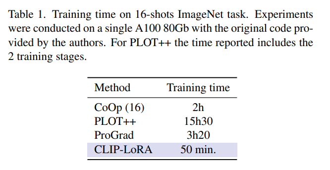
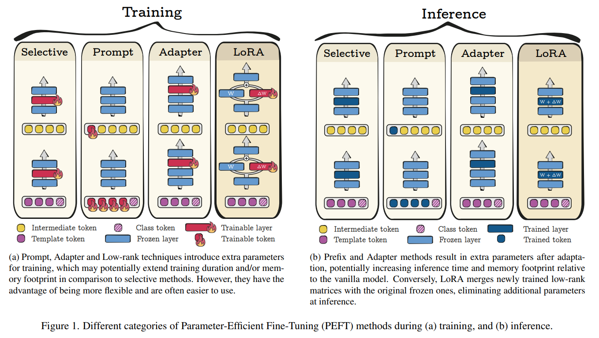
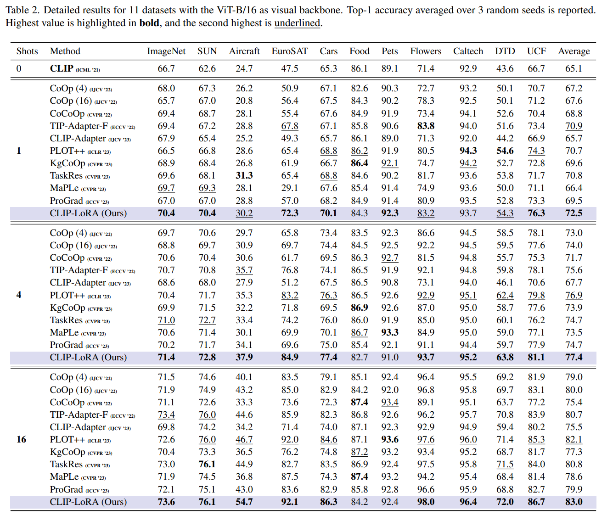
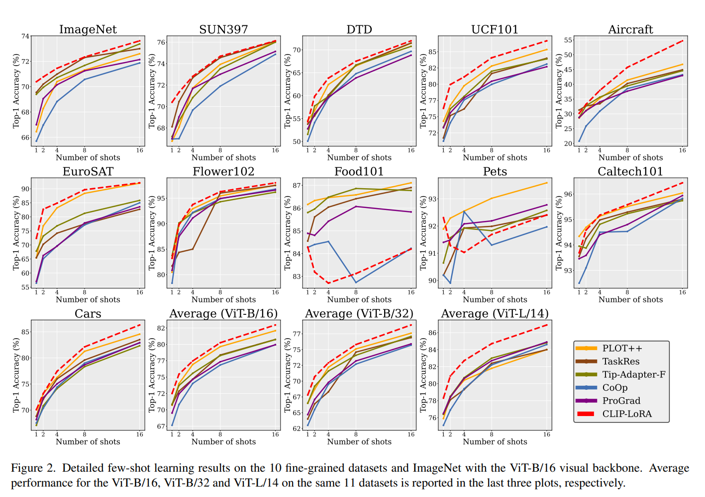
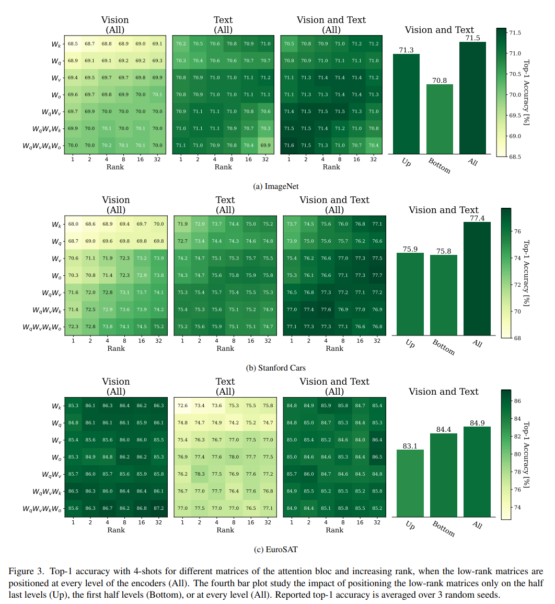

논문 및 이미지 출처 : <https://openaccess.thecvf.com/content/CVPR2024W/PV/papers/Zanella_Low-Rank_Few-Shot_Adaptation_of_Vision-Language_Models_CVPRW_2024_paper.pdf>

# Abstract

최근에 Vision-Language Models (VLMs) 의 few-shot adaptation 분야에서 few labeled samples 만으로도 target downstream tasks 에서의 generalization 능력을 크게 향상시키는 연구가 이루어졌다.

그러나 이러한 유망하고 이미 상당히 풍부한 few-shot 연구 문헌은 주로 prompt learning 에 초점을 맞추었고, adapters 에 대해서는 다소 덜 주목했으며, Parameter-Efficient Fine-Tuning (PEFT) 에 대한 최근의 발전을 간과했다.

더구나, VLMs 의 기존 few-shot learning 방법은 무거운 학습 절차와 신중하게 선택된 task-specific hyper-parameter 에 의존하는 경우가 많아 그 적용 가능성을 저해할 수 있다.

이에 대응하여, 저자는 Low-Rank Adaptation (LoRA) 를 VLMs 의 few-shot learning에 도입하고, SOTA prompt- 및 adapter-based approaches 와 비교하여 11 datasets 에서 그 잠재력을 보여준다.

놀랍게도, 단순한 CLIP-LoRA 방법은 훈련 시간을 단축하고, 모든 target tasks 에서 동일한 hyper-parameter 를 유지하면서도 상당한 개선을 보여준다.

물론, 놀라운 결과가 prompt-learning 과 adapter-based research 의 잠재력을 배제하는 것은 아니다. 하지만, 저자는 strong baseline 이 few-shot VLMs 의 이 떠오르는 분야에서의 진전을 평가하는 데 사용될 수 있다고 믿는다.

# 1. Introduction

Vision-Language Models (VLMs), 예로 CLIP 은 cross-modal representations learning 을 위한 powerful tools 로 부상했다.

광범위한 image-text pairs 를 contrastive objective 를 사용해 pre-training 하여, VLMs 는 이 two modalities 를 align 하여, images 의 visual embeddings 와 target tasks 을 나타내는 text descriptions (prompts) 를 일치시킴으로써 zero-shot prediction 을 가능하게 한다.

이 visual 및 textual features 의 joint representation space 는 Pre-training, Fine-tuning, Prediction 패러다임에서 task-specific labeled data 의 극히 적은 양으로 적응할 수 있는 새로운 가능성을 열었다, 즉 _few-shot adaptation_ 이다.

그럼에도 불구하고, 이들의 효율성은 종종 transformer-based architectures 의 사용에 의존하며, 이 경우 larger model 가 smaller ones 보다 상당히 더 우수한 성능을 보인다.

예로, CLIP 의 ViT-L/14 models 은 ImageNet 에서 ViT-B/16 버전보다 정확도가 6% 이상 높으며, 이 차이는 모델의 few-shot adaptation 후에도 지속된다.

이는 large models 에 scalable 한 efficient  visio-language fine-tuning 방법의 필요성을 강조한다.

- 최근 부상하는 few-shot vision-language 연구 문헌은 이미 상당히 풍부하지만, fine-tuning 전략의 computational overhead 와 memory footprint 은 간과되었다.
  - 이는 additional trainable parameters 로 model 을 장착하는 이른바 _adapters_ 와 input text prompts 를 fine-tuning 하는 popular _prompt-learning_ 방법의 경우도 마찬가지다.
  - 이는 이미 상당한 크기의 모델의 computational demand 와 size 를 증가시킬 수 있다.
- 이러한 fine-tuning stage 와 관련된 문제는, NLP 에서 foundational models 의 크기가 빠르게 증가하면서 광범위한 관심을 끌었다.
  - 일부 모델은 176B parameters 를 자랑하며, 심지어 540B 에 이르는 경우도 있다.
  - 이러한 문제를 해결하기 위해,_ Parameter Efficient Fine-Tuning (PEFT)_ 방법, 즉 (original large models 에 비해) small parameters 만 fine-tuning 하려는 방법이 상당한 주목을 받았다.
  - popular PEFT 방법으로는 기존 parameters 의 일부를 선택하는 것, adapters 라는 small trainable modules 추가, 또는 trainable (prompt) token 추가 등이 있다.
- 최근에, low-rank 의 matrices 만을 fine-tuning 하는 새로운 접근법인 Low-Rank Adaptation (LoRA) 이 실용적이고 유망한 방법으로 부상했다.

LoRA 같은 PEFT 접근법은 large-language models 의 fine-tuning 하여 single GPU 에서도 billion-parameters model 을 관리할 수 있게 했다. 

computational efficiency 향상 것뿐만 아니라, large-scale fine-tuning setting 에서 LoRA 가 all model parameters 를 업데이트하는 성능에 필적하거나 이를 능가할 수 있다는 경험적 증거가 있다.

_그러나 very promising/popular PEFT 문헌은 주로 prompt-tuning 이나 adapters 에 초점을 맞춘 few-shot vision-language 분야에서 거의 반향을 일으키지 못했다._

- original CLIP 논문은 더 나은 text descriptions 가 zero-shot prediction 에 큰 영향을 미칠 수 있음을 입증했다.
-   이 관찰은 prompt tuning 의 출현에 strong 동기가 되었으며, 이는 CoOp 의 선구적 연구 이후 vision-language 커뮤니티 내에서 널리 채택된 전략이다.
-   CoOp 은 few-shot VLMs 설정에서 prompt tuning 을 대중화했다.
-   이는 few-shot 및 unsupervised settings 에서 VLMs 의 prompt-learning 성능을 향상시키기 위한 상당한 최근 문헌을 촉발시켰다.
-   prompt learning 은 zero-shot 성능을 향상시키지만, fine-tuning 을 위한 무거운 computational overhead 를 발생시키며 최적화하기 어려울 수 있다.
-   이는 input 의 각 gradient update 가 entire model 을 거쳐 back-propagating 을 필요로 하기 때문이다 (Tab. 1).

이 expanding prompt-tuning 문헌과 함께, adapters 에 의존하는 few-shot VLMs 를 위한 대안 접근법을 제안하려는 몇 가지 시도가 있었다. 그러나 이러한 adapters 의 성능은 learning rate , epochs 수, image 및 text embeddings 의 혼합을 제어하는 parameters 와 같은 일련의 hyper-parameter 에 강하게 의존하며, 이는 각 target dataset 에 대해 구체적으로 찾아야 한다.

이는 validation sets 에 대한 intensive searches 를 통해 이루어지며, additional labeled samples 가 필요하고 computational overhead 가 증가하여 new tasks 로의 이동성을 줄인다.

**Contributions.**

- 이 연구에서 저자는 이미 상당히 풍부한 문헌에서 prompt-learning 및 adapter-based strategies 가 지배적인 few-shot VLMs 의 맥락에서 Low-Rank Adaptation (LoRA) 의 배치를 조사
- 저자는 LoRA 를 이 맥락에서 배치하기 위한 다양한 설계 선택, 즉 encoder(visual, language 또는 both), apdating 할 specific weight matrices, matrices 의 rank 선택을 철저히 조사
- 저자는 포괄적인 empirical ablations 및 comparisons 를 수행하여, 11 datasets 에 걸쳐, baseline 에 대한 best design 선택을 강조하고 기존의 SOTA prompt- 및 adapter-based 방법과 비교한다.
- 놀랍게도, LoRA baseline 은 중요한 마진으로 few-shot VLMs 에서 SOTA 를 능가하며, computational overhead 을 줄인다.
- 또한, 모든 target tasks 에서 일관된 hyper-parameter 구성을 유지하면서 data-specific validation sets 에 대한 intensive searches 의 필요성을 완화한다.
- 저자의 놀라운 결과가 prompt-learning 및 adapter-based 전략의 잠재력을 무효화하지는 않지만, 저자는 이 strong baseline 이 few-shot VLMs 의 이 떠오르는 주제에서의 진전을 평가하는 데 사용될 수 있다고 믿는다.

# 2. Related Work

#### Parameter-Efficient Fine-Tuning (PEFT).

PEFT 는 large-scale models 의 fine-tuning 에 드는 높은 비용을 줄이기 위해 상대적으로 small parameters 를 (re-)training 하는 데 중점을 둔다.

이러한 기술은 주로 학습할 parameters 선택에 따라 4 groups 로 분류할 수 있다.

이는 종종 memory footprint, computational overhead, performance 간의 trade-offs 를 야기한다. 요약은 Fig. 1 에 나와 있다.

가장 간단하게 full fine-tuning 을 피하는 방법은 선택적 방법으로, 기존 model weights 의 일부에 집중하는 것이다.

- 이 중에서 BitFit 은 transformer blocks 의 attention 과 MLP layers 의 biases 만을 fine-tuning 하며, 다른 접근법은 모델을 잘라서 task-specific parameters subset 을 만든다.
- adapters 는 additional trainable modules 을 original frozen architecture 에 통합한다.
  - 예로, deep features 의 shift 및 scaling 을 통해 통합한다.
  - adapters 는 vision 과 language 를 포함한 다양한 작업에서 그 다재다능성과 효율성을 입증한다.
  - 하지만 adapters 사용의 주요 단점은 adapting 후 parameters 수가 증가해 higher inference latency 수가 증가할 수 있다.
  - 하지만 몇몇 최근 연구는 이 문제를 완화하려는 시도를 하고 있다.
- prompt tuning 또는 token-based tuning 이 있다. 이 방법은 input 이나 intermediate sequences 에 learnable tokens 를 추가하는 것이다.
  - 이 전략은 특히 few-shot 과 zero-shot learning 을 위해 vision-language 분야에서 인기가 높으며, 설계하기 어려운 template prompts 를 trainable soft prompts 로 대체한다.
  - 초기에는 text prompts 에 적용되었지만, 최근 연구는 이 기술을 transformer-based architectures 내에서 visual tokens 를 학습하는 것으로 확장했다.
  - 이 연구 방향은 few-shot vision-language 분야에서 관심을 끌기 시작했다.
- 마지막으로, Low-Rank Adaptation (LoRA) 는 original parameters 를 고정한 상태에서 weight changes 를 명시적으로 나타내는 low-rank matrices 를 추가한다.
  - 이러한 explicit changes 는 inference 전 original weights  와 병합할 수 있으며, vanilla model 에 비해 additional inference latency 를 유발하지 않는다.
  - LoRA 는 fine-tuning 과정에서 필요한 업데이트가 낮은 "intrinsic rank" 를 보인다는 가설에 따라 작동하며, 이 속성은 각 weight change matrices 의 rank 로 직접 제어할 수 있다.
  - 이 점에서 LoRA 는 선택적 방법으로 볼 수 있지만, inference stage 에서 extra parameters 가 필요 없다는 이점을 제공한다.
  - original LoRA 의 몇 가지 버전이 등장했으며, 일부는 각 matrices 의 rank 를 적응시키는 데 초점을 맞추고, 다른 일부는 성능을 향상시키거나 양자화로 memory footprint 을 줄이려고 한다.

#### Few-shot learning in Vision-Language

large scale VLMs 는 여러 vision task 에서 뛰어난 결과를 보여주었다.

이러한 성공은 general knowledge 를 활용하는 adapting 기술 개발에 대한 관심을 불러일으켰다.

이 중 prompt tuning 은 few labeled data 로 VLMs 를 adapting 하는 주요 방법으로 떠올랐다.

- CoOp : class name 에 attached learnable common continuous tokens 를 optimizing 하여 context optimization 을 수행한다.
- CoCoOp : image 를 기반으로 instance-conditioned tokens 를 생성하기 위해 neural networks 를 훈련한다.
- ProGrad 및 KgCoOp 등은 learning 중 initial knowledge 를 보존하기 위해 gradient projection 을 사용하여 prompt 를 predefined handcrafted ones 로 유도한다.

prompt-learning 연구 중에서,

- PLOT : text 와 image modalities 를 jointly adapting 하는 최초의 방법 중 하나이다.
  - 이들은 optimal transport formulation 을 통해 learned prompts 를 fine-grained visual features 와 align 하도록 제안.
  - 이러한 cross-modal adaptation 은 Sec. 6 에서 논의한 것처럼 저자의 접근 방식에서도 중요한 요소이다.
- 비슷한 궤적을 따라, MaPLe 은 vision 및 text encoder 내에 intermediate learnable tokens 를 도입하고, 이를 각 level 에서 interdependent 로 만든다.
  - 이들은 two modality branches 를 adapting 하는 것이 downstream tasks 에서 더 많은 유연성을 허용한다는 것을 보여준다.

adapter-based 방법은 대안적 전략을 제공하며, vision-language 에서 점점 더 많이 연구되고 있다.

- CLIP-Adapter 는 adapted 및 original features 를 결합하기 위해 visual apdater 를 학습한다.
- 몇몇 다른 방법은 final embedding state 만 액세스하여 이러한 모델의 knowledge 를 활용하는 것을 제안한다.
  - 예로 zero-shot 시나리오를 위한 parameter-free plug attention, 또는 Tip-Adapter(-F) 가 few-shot learning 에서 cache model 을 사용하는 경우가 있다.
  - 비슷한 맥락에서, TaskRes 는 original text weights 를 고정하고, initial knowledge 를 기반으로 구축된 task-specific adapter 를 학습하기 위해 task residual tuning 을 도입한다.

# 3. Few-shot fine-tuning for VLMs

이 섹션에선 Fig. 1 에 요약된, VLMs 를 위한 최근 few-shot fine-tuning 방법에 대한 개괄적인 개요를 제공한다.

- vision-language model 에 기반한 classification task 을 다룰 때, $K$ candidate classes set 를 주어지면, 각각의 class 에 해당하는 text descriptions, 이른바 prompt 를 만든다.
  - 예로, $c_k$ 는 `a photo of a [kth class name]` 에 대한 tokenized version 을 나타내며, $k = 1, \ldots, K$ 이다.
- $t_k = \theta_t(c_k)$ 는 해당하는 normalized(unit-hypersphere) text embeddings representation 을 나타내며, $\theta_t$ 는 language encoder 의 parameters 를 나타낸다.
- 마찬가지로, 각 image $x_i, i = 1, \ldots, N$ 은 visual encoder $\theta_v$ 를 사용하여 same dimension 의 normalized embedding space 로 투영된다: $f_i = \theta_v(x_i)$.

zero-shot prediction 은 VLMs 를 downstream tasks 에 적응시키는 가장 간단한 형태이며, pre-training procedure 를 따른다.

각 text embeddings $t_k$ 와 test image $x_i$ 의 visual embedding $f_i$ 를 짝지어, 이들의 cosine similarity 를 측정하여 prediction logit 을 산출할 수 있다:

$$
\begin{equation}
  l_{i,k} = f_i^\top t_k.
\end{equation}
$$

이는 또한 test input $x_i$ 가 주어진 class $k$ 의 posterior softmax probability 형태로 probabilistic prediction 을 산출한다:

$$
\begin{equation}
  p_{i,k} = \frac{\exp(l_{i,k}/\tau)}{\sum_{j=1}^K \exp(l_{i,j}/\tau)}
\end{equation}
$$

- $\tau$ : softmax-temperature parameters.

따라서, image $x_i$의 zero-shot classification 은 highest posterior probability 를 가진 class 를 찾아서 이루어진다: $\hat{k} = \arg\max_k p_{i,k}$.

---

few-shot setting 에서, 그리고 이러한 models 를 더 adapting 하기 위해, 저자는 각 target class 에 대해 $N/K$ labeled samples, 이른바 _support set_ 에 접근할 수 있다고 가정한다.

- $N$ : support sample 의 total number
- $N/K$ (per class shots number) 는 는 일반적으로 작음 (less 16).
- $y_{ik}$ : labeled support image $x_i$ 에 대한 one-hot encoded label. i.e., $y_{ik} = 1$ 은 image $x_i$ 의 class 가 $k$ 일 경우이고, 그렇지 않으면 0.
- 그런 다음, cross-entropy (CE) loss 를 minimizing:

$$
\begin{equation}
  -\frac{1}{N}\sum_{i=1}^N \sum_{k=1}^K y_{ik} \ln p_{i,k}
\end{equation}
$$

- 이는 (i) CoOp 의 연구을 따르는 prompt-tuning 처럼 input prompts $c_k, k = 1, \ldots, K$ 를 fine-tuning 함으로써, 
- 혹은 (ii) adapters 같이 additional parameters set 을 업데이트함으로써 이루어진다.
- 다른 방법들은 additional intermediate tokens tuning 을 제안하며, 저자는 이것을 보다 일반적인 용어로 "prompt tuning" 범주에 포함시킨다.

저자는 이제 VLMs 에서 사용되는 두 가지 현재 전략을 자세히 설명할 것이다: prompt tuning(P) 과 adapters(A).

#### Prompt tuning (P).

VLMs 에서 prompting 를 수행하는 방식은 결과적인 성능에 상당한 영향을 미칠 수 있다.

이 문제를 해결하기 위해, soft prompt tuning 은 text-input token 을 optimizing 하며, 이는 intermediate layers 로 확장될 수 있다.

유사하게, transformer-based architecture 가 사용될 경우, 이러한 learnable tokens 은 vision model 에 삽입될 수 있다. 

few-shot VLMs 의 맥락에서, CoOp 을 도입했으며, 이는 continuous trainable vectors 로 text input  $c_k$ 를 구성한다:

$$
\begin{equation}
  c_k = (v_1^k, \ldots, v_M^k, [\text{class}_k])
\end{equation}
$$

- $M$ : hyper-parameter
- $(v_l^k)_{1 \leq l \leq M}$ : trainable text tokens
- $[\text{class}_k]$ : $k^{th}$ class name 의 word embedding vector

이러한 trainable vectors 는 Eq. (3) 에서 standard supervised CE classification loss 와 few-shot labeled samples 를 사용하여 task-specific text prompts 로 업데이트된다.

prompt tuning 은 task 마다 specifically engineered text prompts 를 휴리스틱하게 선택할 필요성을 제거하여, adapter-based methods 에 비해 명확한 이점을 제공하며, prompt choice 는 성능에 상당한 영향을 미칠 수 있다.

prompt-tuning 방법은 classification 의 성능을 크게 향상시키지만, fine-tuning 에 대한 높은 computational overhead 를 야기하며, optimization 이 어려울 수 있다. 왜냐하면 text input 의 모든 gradient update 는 entire model 을 통한 back-propagation 이 필요하기 때문이다 (Tab. 1 time ref).

#### Adapters (A).

text prompts 를 업데이트하는 대신, adapters 라고 불리는 다른 방법은 기존 parameters 를 고정하면서 additional parameters 로 pre-trained model 을 augmeing 한다.

이는 trainable parameters 수를 효율적으로 제어하는 방법을 제공한다.

이 아이디어는 최근 few-shot vision-language setting 에서 탐구되었다.

이 설정에서 adapters 는 encoder 의 bottleneck 에 appending 된 일부 multi-layer modules 를 통해 feature transformation 으로 볼 수 있다.

이는 image 와 text feature 를 혼합하는 변환을 학습할 수 있게 하며, logits 는 다음과 같은 형태를 갖는다:

$$
\begin{equation}
  l_{i,k} = \theta_a(f_i, t_k)
\end{equation}
$$

- $\theta_a$ : adapters 의 additional trainable parameters

이들은 Eq. (5) 에 의한 transformed logits 로, labeled support set 을 사용하여 Eq. (3) 에서 CE loss 를 minimizing 함으로써 fine-tuning 된다.

- 예로, CLIP-Adapter 는 multi-layered perceptron 을 추가하여 features 를 수정했다.
- Tip-Adapter 는 class scores 를 labeled samples 의 features 간의 일부 pairwise similarities 를 통해 평가하는 module 을 추가했으며, 이러한 scores 를 text prompts 의 embeddings 와 통합했다.

이러한 방법은 prompt-tuning 기술과 비교하여 computational overhead 를 줄인다. 그러나 CLAP 의 최근 실험에서 지적한 바와 같이, 그들의 성능은 특정 downstream tasks 마다 구체적으로 조정해야 하는 몇 가지 key hyper-parameter 에 크게 의존하는 것으로 보인다.

이는 validation sets 에 대한 intensive searches 을 통해 이루어지며, addtional labeled samples 가 필요하고, 이는 new tasks 로의 이식성을 감소시킨다.

# 4. CLIP-LoRA

Low-Rank Adaptation (LoRA) 는 downstream tasks 의 "intrinsic rank" 개념에 기반하여 pre-trained weights 의 점진적 업데이트를 two small matrices $A$ 와 $B$ 의 product 로 modeling 한다.

input $x$, hidden state $h$, weight matrix $W \in \mathbb{R}^{d1 \times d2}$의 경우, LoRA module 적용 후 modified forward pass 는 다음과 같다:

$$
\begin{equation}
  h = Wx + \gamma \Delta Wx = Wx + \gamma BAx
\end{equation}
$$

- $A \in \mathbb{R}^{r \times d2}$, $B \in \mathbb{R}^{d1 \times r}$, $\Delta W \in \mathbb{R}^{d1 \times d2}$ : rank $r$ 의 matrices
- $r \ll \{ d1, d2\}$ 
- $\gamma$ : scaling factor
- $A$ 의 값은 Kaiming initialization 을 통해 randomly initialization
- $B$ 는 0 으로 채워진다.
- 이는 training 이전에 점진적 업데이트가 없으며, 따라서 output 이 변경되지 않음을 의미한다.

LoRA 논문에서, low-rank matrices 는 transformer-based architectures 의 attention matrices 에 적용된다.

이들은 일반적으로 multi-head attention (MHA) module 을 포함하는 $L$ stacked blocks 로 구성된다:

$$
\text{headi} = \text{Softmax} \left( \frac{xW_{q_i} (xW_{k_i})^T}{\sqrt{d}} \right) (xW_{v_i})
$$

$$
\text{MHA}(x) = \text{concat}(\text{head}_1, \ldots, \text{head}_H)W_o
$$

- $d$ : scaling factor
- $W_{Ki}$, $W_{Qi}$, $W_{Vi}$, $W_o$ : 각각 key, query, value, output matrices 에 해당하는 weight matrices
- 다른 연구들은 이 접근 방식을 feed-forward module 의 weight matrices 로 확장한다.

#### LoRA for VLMs.

- vision-language 에 LoRA 를 적용하는 직관적인 방법은 vision 및 text encoder 의 all matrices 에 이를 적용하는 것이다.
  - 그러나 few-shot setting 의 상대적으로 small supervision 으로 인해, 저자는 query, key, value matrices 에 대해서만 $r = 2$ 로 low-rank matrices 를 적용한다.
- 저자는 LoRA module 의 input 을 $p = 0.25$ 의 dropout layer 로 regularizing 한다.
- iterations 은 $N/K$ 와 동일한 500 times (per class labeled samples)
- $2 * 10^{-4}$ 의 learning rate 을 사용하고, cosine scheduler 와 32 batch size 를 사용하여 all training 을 24Gb single GPU 에서 수행할 수 있도록 했다.
- 이러한 hyper-parameter 는 모든 실험에 걸쳐 고정된다.
- input prompts 은 단순히 all datasets 에 대해 `a photo of a [kth class name]` 로 설정되어, complex initial manual prompting 에 의존하지 않고 CLIP-LoRA 의 적용 가능성을 강조한다.
- LoRA module 은 두 encoder 의 모든 levels 에 위치한다.
- LoRA module 의 location 에 대한 영향은 Sec. 6 에서 연구되어, 특정 tasks 에 대해 two modalities 를 모두 adapting 하는 것이 필요할 수 있음을 증명한다.

# 5. Few-shot learning

저자는 CoOp 의 설정을 따른다.

fine-grained classification 에 대한 10 datasets - scenes (SUN397), aircraft (Aircraft), satellite imagery (EuroSAT), automobiles (StanfordCars), food items (Food101), pet breeds (OxfordPets), flowers (Flower102), general objects (Caltech101), textures (DTD), human actions (UCF101) 그리고 ImageNet 을 고려한다.

#### Comparative methods.

저자는 CLIP-LoRA 를 여러 prompt-based methods: 4 learnable tokens 의 CoOp (4), 16 learnable tokens 의 CoOp (16), CoCoOp, transformer 에 특화 설계된 original PLOT 을 개량한 PLOT++, KgCoOp, "base-to-new" setting 의 training procedure 를 따르는 MaPLe, 16 tokens 의 ProGrad, 와 비교한다

저자는 또한 adapters-based methods: Tip-Adapter-F (저자는 validation sets 를 적절한 크기 min(n shots, 4 줄임), TaskRes (이 경우 all datasets/shots/backbone 에 대해 이용할 수 없으므로 향상되지 않은 base performance 만 보고)와 비교한다.

일부 의심스러운 임의 선택에도 불구하고, 저자는 그들의 특정 hyper-parameter 를 유지한다.

CLIP-LoRA 는 all tasks 에 대해 동일한 hyper-parameter 를 사용한다.

#### CLIP-LoRA outperforms, on average, adapter- and prompt-based few-shot methods.

- Tab. 2 에서 가장 strong adapter-based method 는 Tip-Adapter-F 이지만, 각 dataset 에 대해 임의의 hyper-parameter (i.e., $\alpha, \beta$ 의 starting value 는 validation 중의 search range) 에 의존하는 CLIP-LoRA 와는 경쟁력이 없다
  - 저자는 TaskRes 에 대해서도 동일한 결론을 내릴 수 있으며, TaskRes 는 또한 주어진 dataset 에 대해 임의의 선택에 의존한다. 
  - 예로, ImageNet 의 specifc learning rate 와 Flowers dataset 의 specific scaling factor 가 있다.
- prompt-based approach 에 관해서, Tab. 2 는 CoOp 와 ProGrad 가 큰 차이로 성능이 낮다는 것을 보여준다.
  - strongest competitor 는 의심할 여지 없이 PLOT++ 이다.
  - PLOT++ 은 two-stage training (각각 ImageNet 에 대해 50 epochs) 을 필요로 하며, optimal transport formulation 을 위해 여러 data-specific text template 을 필요로 하여 다른 downstream tasks 으로의 이식성을 줄인다.
- 전반적으로, CLIP-LoRA 는 특히 ImageNet, UCF101, Aircraft 에서 더 나은 성능을 발휘하면서도 실용적이다.
  - 그러나 Food101 과 OxfordPet dataset 에서는 성능이 떨어지며, few-shot learning 에서 minimal improvement 를 제공한다.
  - 이는 단순한 cross-entropy loss 를 사용하는 것을 고려할 때, regularization lack 에 기인할 수 있다.
  - CoOp 에서도 유사한 경향이 관찰되는 반면, ProGrad 와 같이 명시적인 regularization 을 포함하는 접근법은 이러한 문제가 나타나지 않는다.

#### CLIP-LoRA performances are consistent across various vision encoders.

Fig. 2 와 같이, 

- CLIP-LoRA 는 평균적으로 ViT-B/32 architecture 와 larger ViT-L/14 모두에서 다른 few-shot 방법을 능가한다.
- 이는 저자의 접근법의 다재다능함을 더욱 지지한다.

#### CLIP-LoRA is computationally and memory efficient.

Tab. 1 은 주요 prompt-learning methods 의 training time 을 비교한다.

- CLIP-LoRA 는 더 짧은 학습으로 더 나은 성능을 달성한다. 게다가, 가장 성능이 좋은 adapter 방법, 즉 Tip-Adapter-F 는 all classes 의 all instances 에 대한 embedding 을 저장하는 large cache model 에 의존한다.
- 대조적으로, LoRA 는 inference stage 에서 adapted matrices 를 병합하여, original model 이 필요한 것 이외의 additional memory 를 필요로 하지 않는다.

# 6. How to apply LoRA for VLMs?

이 섹션에서는 LoRA module 을 활용하는 세 가지 주요 설계 고려 사항에 대해 논의한다: (1) vision encoder , text encoder 또는 둘 다 조정하는 선택, 조정할 specific layer 포함; (2) 조정할 attention matrices 의 선택; (3) 이러한 matrices 에 대한 적절한 rank 결정.

이 세 가지 측면을 ImageNet, Stanford Cars, EuroSAT 세 가지 dataset 에서 탐구한다. 

ImageNet 은 광범위한 다양성 때문에 선택되었으며, 나머지 두 datasets 는 독특한 동작 때문에 선택되었다.

결과는 증가하는 rank 값에 따라 adjusted attention matrices 의 7 groups 에 대해 Fig. 3 에 나타나 있다.

#### Adapting both encoders leads to the best results on average.

- EuroSAT 의 경우 vision encoder 만 적응시키는 것이 약간 더 안정적인 결과를 보이지만, two encoders 를 동시에 조정하는 것이 가장 효과적인 전략으로, 상당한 성능 향상을 이끌어낸다.
- 이는 CoOp 에서 볼 수 있는 것처럼 text-only prompt tuning 으로 달성할 수 있는 것 이상의 성능을 향상시키기 위해 additional vision tokens 를 통합하는 최근 접근법과 일치한다.

#### Tuning more attention matrices can lead to better results but...

- 연구된 4 attention matrices 중, value 또는 output matrices ($W_v$와 $W_o$) 를 적응시키는 것이 가장 좋은 전략으로, 일관된 성능 차이를 보인다.
- LoRA 논문 및 후속 연구에서 논의된 것처럼, 더 많은 weight matrices 을 적응시키는 것이 더 나은 결과를 가져올 수 있다.
- 그러나 이는 ImageNet 과 Stanford Cars 에서 high rank 로 인해 성능이 저하될 수도 있음을 보여준다.
- 이는 matrices 의 랭크를 동적으로 조정하려는 최근 방법과 일치한다.

#### Choosing the location of LoRA modules requires careful consideration.

LoRA module 을 lower half (bottom) 또는 upper lower (up) 에 배치할 때의 영향은 Fig. 3 의 막대 그래프로 성능이 다양하게 나타나며 명확한 우승자는 없다.

- all layers 에 LoRA 모듈을 추가하는 것이 더 효과적이라는 것을 발견했다. 
- 비교해보면, LLMs 의 문맥에서 AdaLoRA 는 first layer 보다 moddle 및 last layer 에 larger rank 를 할당하는 것이 더 나은 결과를 가져온다고 제안한다. 

# 6. Conclusion

fixed hyper-parameter 를 사용하여 Vision-Language Models (VLMs) 의 few-shot adaptation 에서 일관되게 prompt- 및 adapter-based methods 를 능가하는 strong baseline 을 세웠다.

또한, LoRA module 을 사용하여 적응할 matrices 을 선택하고 대응하는 rank 를 결정하여 성능을 극대화하는 것이 간단하지 않다는 것을 보여주었다.