논문 및 이미지 출처 : <https://link.springer.com/chapter/10.1007/978-3-031-19833-5_29#keywords>

# Abstract

Contrastive Vision-Language Pre-training(CLIP)은 large-scale image-text pairs 를 사용하여 visual representations 을 학습하는 새로운 패러다임을 제공한다.

이는 zero-shot knowledge transfer 를 통해 downstream tasks 에서 인상적인 성능을 보여준다.

CLIP adapting 능력 향상을 위해, 기존엔 additional learnable modules 를 fine-tuning 하도록 제안하였으며, 이는 few-shot 성능을 향상시키지만 extra training time 과 computational resources 를 요구한다.

본 논문은 CLIP 의 few-shot classification 수행을 위한 Training-free adaption 방법인 Tip-Adapter 를 제안한다. 

이는 zero-shot CLIP 의 training-free 장점을 유지하면서도 학습이 필요한 다른 접근법들과 유사한 성능을 발휘한다.

Tip-Adapter 는 few-shot training set 에서 key-value cache model 을 통해 adapter 를 구성하고, feature retrieval 을 통해 CLIP 에 encoded prior knowledge 를 업데이트한다.

추가적으로, Tip-Adapter 의 성능은 cache model 을 기존 방법들보다 10x fewer epochs 만 fine-tuning 하여 ImageNet 에서 SOTA 성능을 달성할 수 있다.

본 논문에서는 11 dataset 에서 few-shot classification 에 대한 광범위한 실험을 통해 제안된 방법의 우수성을 입증한다.

# 1. Introduction

vision 과 language 는 세상을 인식하는 다양한 상호작용을 수행하는 two modalities 다.

classification, detection, 3D understanding 등 visual tasks 의 정확도는 더 나은 neural net 설계와 정교하게 설계된 framework 덕에 크게 향상되었다.

language generation 과 understanding 관련된 tasks 역시 mask prediction 을 통한 pre-training 과 web-scale data collecting 을 포함한 large-scale self-supervised methods 덕분 크게 개선되었다. 

vision 과 language 는 보통 complementary information 을 포함해, multi-modality representation 의 joint learning 은 visual question answering, image captioning, referring expression 같은 다양한 tasks 에서 매우 효과적임이 입증되었다.

이전과 달리, CLIP 은 paired natural language supervision 의 visual features 를 학습하여 별도의 dataset 에서 독립적으로 vision 및 language representation 을 학습하는 대신, zero-shot image classification 능력을 발휘하였다.

vision 과 language 간의 상호작용 덕분에, encoded visual representations 은 additional re-training 없이 open-vocabulary 인식에 사용할 수 있다.

---

후속 연구들은 few-shot data 로 CLIP 의 downstream tasks 에 대한 적응 능력을 향상시키기 위해 제안되었다.

- CoOp : learnable text tokens 를 통해 pre-trained CLIP 을 fine-tuning 하여 few-shot image classification 에서 강력한 성능을 달성했다.
- CLIP-Adapter : CLIP 을 parametric feature adapter 로 장착하여, adapted features 를 생성하고 이를 original CLIP 에 encoded feature 와 residual connection 을 통해 결합하도록 제안되었다.
  - 이는 prompt design 을 사용하지 않고도 few-shot classification 에서 유망한 성능을 보였다. 
- CoOp 과 CLIP-Adapter 이 few-shot classification 벤치마크에서 강력한 성능을 보여주었지만, Zero-shot CLIP 과 Linear-probe CLIP 에 비해 새롭게 도입된 learnable parameters 를 fine-tuning 하는 데 더 많은 computational resources 을 필요로 한다.

따라서, 저자는 다음과 같은 질문을 제기한다: CLIP 의 zero-shot classification 에 대한 training-free 속성을 활용하면서도 few-shot classification 에 대한 강력한 성능을 동시에 달성할 수 있는가?

이를 달성하기 위해, 저자는 CLIP 을 위한 Training-free adaption 방법인 Tip-Adapter 를 제안한다. 

- 기존 방법과 달리, extra training 이 필요 없으며 novel non-parametric adapter 로 weight-frozen CLIP 모델에 추가된다.
- few-shot dataset 에서 query-key cache model 로 adapter 를 설계한다.
  - Tip-Adapter 는 CLIP 의 visual encoder 로 few-shot image 의 visual features 을 추출하고, 해당 label 을 one-hot encoding 으로 변환한다.
  - 그런 다음, few-shot visual features 과 one-hot label 을 포함하는 cache model 이 생성되며, 이는 paired keys 와 values 로 간주된다.
- cache model 을 통해, Tip-Adapter 의 training-free 구조는 전통적인 Stochastic Gradient Descent (SGD) 에 비해 큰 효율성을 나타낸다.
  - inference 중에는, test image 는 먼저 cached keys 와의 feature similarities 을 계산하고, 그런 다음 cached values 을 aggregate 하여 adapter 의 prediction 을 형성한다.
    - 이는 cache model 에서 few-shot knowledge 를 검색하는 것으로 볼 수 있다. 
  - 그 후, adapter 의 prediction 은 residual connection 을 통해 original CLIP 의 prediction 과 결합된다. 
  - 이 방식으로, Tip-Adapter 는 pre-trained CLIP 과 few-shot learning dataset 의 knowledge 를 동시에 활용한다.
- 놀랍게도, training 없이 Tip-Adapter 는 fine-tuned CoOp 및 CLIP-Adapter 와 유사한 성능을 발휘할 수 있었다.
- 게다가, cached keys 를 learnable parameters 로 설정하고 추가로 fine-tuning 하면, Tip-Adapter 의 성능이 few training epochs 만으로도 크게 향상될 수 있다.
  - 저자는 이 fine-tuned version 을 Tip-Adapter-F 로 명명하며, ImageNet 에서 CoOp 및 CLIP-Adapter 가 200 epochs 를 사용하는 것에 비해 단 20 epochs로 SOTA 성능을 달성할 수 있다.
- Tab. 1 에서는 ImageNet 에서 16-shot classification 에 대한 all baselines 의 성능, training time 및 inference speed 를 비교하여 우리 방법의 뛰어난 accuracy-efficiency trade-off 를 나타낸다.

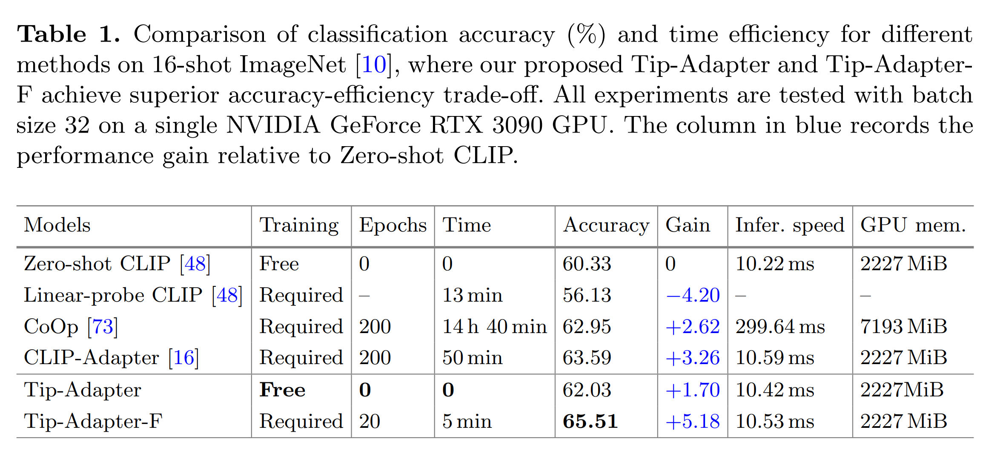

**Contributions**:

1. 저자는 CLIP 을 위한 training-free adaption 방법인 Tip-Adapter 를 제안하며, adapter 를 cache model 로 직접 설정하여 전통적인 SGD-based training 을 배제한다.
2. cache model 의 keys 를 learnable parameters 로 설정하고 fine-tuning 하여, Tip-Adapter-F 는 super-fast convergence 를 통해 SOTA 성능을 달성한다.
3. 저자는 Tip-Adapter 와 Tip-Adapter-F 를 few-shot classification 를 위해 널리 채택된 11 dataset 에서 평가하고, 특성을 입증하기 위해 광범위한 ablation studies 를 수행한다.

# 2. Related Work

#### Data-Efficient Transfer Learning.

large-scale dataset 으로 DNN 의 능력이 드러나지만 데이터를 수집하는 것은 long-tail distribution, noisy annotations, increasing labeling cost 때문에 어렵고 비용이 많이 든다.

이를 완화하기 위해 transfer learning 이 제안되었으며, 이는 인기 있는 연구 분야가 되었다. 

image classification 에서의 supervised pre-training 은 detection 및 segmentation 같은 downstream tasks 에 대해 fine-tuning 의 기본으로 널리 채택되었다.

MoCo 와 BYOL 같은 self-supervised learning 은 supervised signals 의 필요성을 버리고 robust feature learning 을 위한 contrastive pretext task 를 구축한다.

최근에는 CLIP, DeCLIP, ALIGN 이 단순한 contrastive vision-language paris 에서 학습하여 다양한 dataset 에 대한 zero-shot 인식을 위한 transferable features 를 얻는 것을 보여준다.

이에 더하여, CoOp, CLIP-Adapter, WiSE-FT 은 pre-trained weights 를 고정하고 additional learnable modules 을 학습함으로써 limited training data 로 CLIP 을 크게 향상시켰다.

이와 달리, 제안된 Tip-Adapter 는 training 없이 pre-trained CLIP model 에 few-shot supervisions 를 직접 주입하는 것을 목표로 한다. 

이를 통해 Tip-Adapter 의 구축은 few-shot training set 의 특징을 한 번 계산한 후 이를 cache 에 저장하는 것만으로, time 및 memory 측면에서 훨씬 효율적이다.

#### Cache Model.

cache model 은 training images 와 그 label 의 features 를 key-value database 로 저장한다. 

inference 중에, test samples 에서 encoded features 는 similarity-based retrieval 을 통해 cache model 에서 정보를 aggregate 하기 위한 query 로 처리된다. 

이 과정은 non-parametric 이며, parameters update 를 포함하지 않는다.

cache model 은 kNN-LMs, Unbounded Cache, Matching Network 등 다양한 모델에서 vision 또는 language model 의 성능을 향상시키기 위해 사용되었다.

단순한 cache model 은 유망한 결과를 보여주었지만, training data 를 위한 막대한 저장 예산은 많은 응용 프로그램에 부담이 된다. 

이를 줄이기 위해 highly-optimized similarity search system 을 사용한  approximate kNN 이 제안되었지만, 이는 느리고 오류가 발생하기 쉽다.

pure vision 또는 language cache 를 사용한 이전 설정과 달리, 저자는 CLIP 의 contrastive multi-modality pre-training 을 통해 blended vision-language cache model 을 구축한다.

중요한 것은, limited training samples 을 사용한 few-shot settings 덕에 전체 cache size 가 작으며, retrieval 은 two cascaded matrix multiplications 으로 효율적으로 계산될 수 있다.

더욱이, Tip-Adapter 의 cache model 은 learnable 하며 Stochastic Gradient Descent (SGD)를 통해 동적으로 업데이트되어 성능이 더욱 향상될 수 있다.

# 3. Method

## 3.1 Training-Free Adaption of CLIP

저자는 CLIP 의 few-shot classification 성능을 향상시키기 위한 training 이 필요 없는 적응 방법인 Tip-Adapter 를 제안한다. 

저자는 few-shot training set 에서 key-value cache model 을 non-parametric 방식으로 구성한다. 

놀랍게도, 이 well-designed cache model 을 통해 Tip-Adapter 는 fine-tuning 없이도 CoOp 및 CLIP-Adapter 같은 training 이 필요한 방법들과 비교해도 유사한 성능을 달성할 수 있다.

추가적으로, training 이 허용된다면, Tip-Adapter-F 는 cached keys 를 fine-tuning 하여 super-fast convergence 로 SOTA 성능을 뛰어넘는다 (Fig. 1).

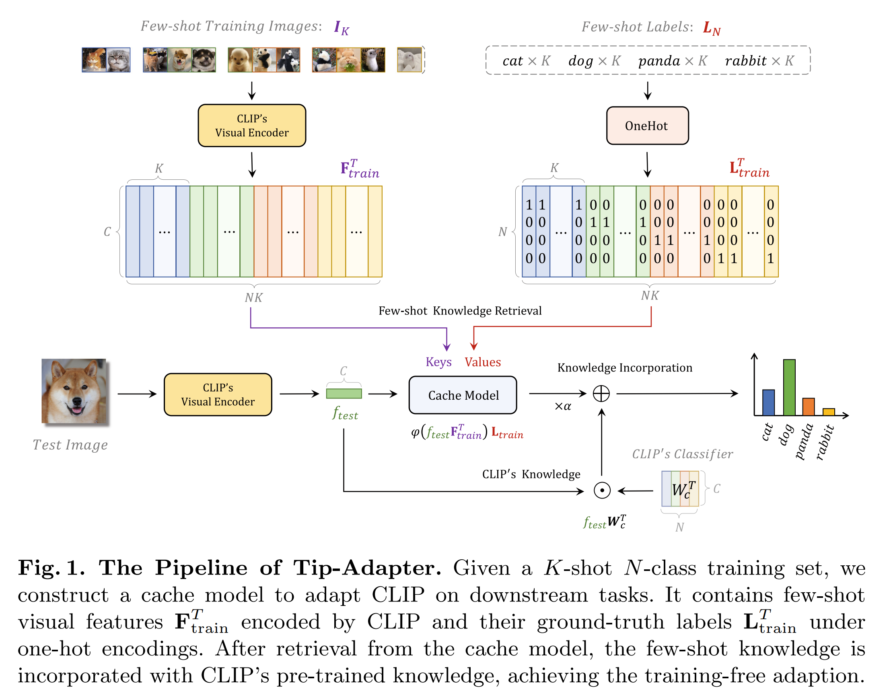

#### Cache Model Construction.

pre-trained CLIP model 과 few-shot classification 를 위한 K-shot N-class training samples 을 포함하는 new dataset 이 주어지면, 각 N categories 에는 K annotated images 가 있으며, 이를 $I_K$ 와 그 label $L_N$ 로 나타낸다.

저자는 N classes 내에 few-shot knowledge 을 포함하는 feature adapters 로서 key-value cache model 을 만드는 것을 목표로 한다.

- 각 training images 에 대해, 저자는 CLIP 의 pre-trained visual encoder 를 활용하여 $C$-dimension 의 $L2$ normalized feature 를 추출하고,해당 label 을 $N$-dimensional one-hot vector 로 변환한다.
- all $NK$ training samples 에 대해, visual features 과 해당 label vectors 를 $F_{train} \in \mathbb{R}^{NK \times C}$ 및 $L_{train} \in \mathbb{R}^{NK \times N}$로 나타낸다.

$$
\begin{equation}
  F_{train} = \text{VisualEncoder}(I_K),
\end{equation}
$$
$$
\begin{equation}
  L_{train} = \text{OneHot}(L_N).
\end{equation}
$$

- key-value cache 에서, CLIP 으로 encoded representations $F_{train}$ 은 keys 로 처리되며, one-hot label vector $L_{train}$ 은 values 로 사용된다.
- 이러한 방식으로 key-value cache 는 few-shot training set 에서 추출된 new knowledge 를 기억하며, 이는 pre-trained CLIP 에 encoded prior knowledge 를 업데이트하는 데 사용된다.

#### Tip-Adapter.

cache model 을 구축한 후, CLIP 의 adapting 은 two matrix-vector multiplications 으로 간단히 달성될 수 있다.

inference 시, test image 의 $L2$ normalized feature $f_{test} \in \mathbb{R}^{1 \times C}$ 는 CLIP 의 visual encoder 에 의해 먼저 추출되며, key-value cache 에서 retrieving 을 위한 query 로 사용된다.

query 와 key 사이의 affinities 는 다음과 같이 추정할 수 있다.

$$
\begin{equation}
  A = \exp(-\beta(1 - f_{test}F_{train}^T)),
\end{equation}
$$

- $A \in \mathbb{R}^{1 \times NK}$
- $\beta$ : modulating hyper-parameters
- query 및 key features 모두 $L2$ normalizing 되어, $f_{test}F_{train}^T$ 항은 test feature $f_{test}$ 와 all few-shot learning features $F_{train}^T$ 간의 cosine similarity 와 동등하다.
- exponential function 는 similarity 를 non-negative values 로 변환하기 위해 사용되며, $\beta$ 는 그 sharpness 를 조절한다. 
- 그 후, cache model 에 대한 prediction 은 query-key affinities 에 의한 weighed cached values 의 linear combination 으로 얻어지며, 이는 $AL_{train} \in \mathbb{R}^{1 \times N}$ 로 나타낼 수 있다.

few-shot training set 에서 cache model 의 retrieved few-shot knowledge 외에도, pre-trained CLIP 의 prior knowledge 은 $f_{test}W_c^T \in \mathbb{R}^{1 \times N}$ 에 의해 계산되며, 여기서 $W_c$ 는 pre-trained textual encoder 로 생성된 CLIP 의 classifier weights 를 나타낸다.

both predictions 을 residual connection 을 통해 혼합함으로써, Tip-Adapter 에 의한 test image 의 output logits 은 다음과 같이 계산된다.

$$
\begin{equation}
  \begin{align*}
    \text{logits} &= \alpha AL_{train} + f_{test}W_c^T \\
    &= \alpha \varphi(f_{test}F_{train}^T)L_{train} + f_{test}W_c^T,
  \end{align*}
\end{equation}
$$

- $\alpha$ :  residual ratio
- $\varphi(x) = \exp(-\beta(1 - x))$
- Tip-Adapter 의 prediction 엔 two terms 가 포함되며, former term 은 few-shot training set 에서 정보를 적응적으로 요약하고, latter term 은 CLIP 의 classifier $W_c^T$ 의 prior knowledge 를 보존한다.
  - two terms 는 weight $\alpha$ 로 균형을 맞춘다.
  - 경험적으로, pre-trained tasks 와 downstream few-shot tasks 간의 domain gap 이 클수록 $\alpha$ 를 크게 설정하며, 이는 few-shot set 에서 더 많은 knowledge 를 요구하기 때문이다. 그렇지 않으면 $\alpha$ 를 작게 설정한다.

#### Tip-Adapter with Fine-Tuning. 

Tip-Adapter 는 few-shot training set 의 new knowledge 를 통합하여 CLIP 을 크게 향상시킬 수 있다. 그러나 more shots 이 주어지면, training 없는 Tip-Adapter 는 점차 trainin 이 필요한 CoOp 및 CLIP-Adapter 보다 뒤처지게 된다.

이 gap 을 해소하면서도 efficiency 를 유지하기 위해, 저자는 Tip-Adapter-F 를 제안한다.

- cache model 의 keys 를 learnable parameters 로 간주하고, 이를 SGD 로 fine-tuning 한다. 
- cache model 의 유리한 시작점 덕분에, Tip-Adapter-F 는 CoOp 및 CLIP-Adapter 의 200 epochs training 과 비교하여 ImageNet 에서 단 20 epochs 의 fine-tuning 으로 SOTA 성능을 달성한다.
- 좀 더 구체적으로, 저자는 cached keys $F_{train}$ 을 해제하지만, values $L_{train}$ 과 pre-trained CLIP 의 two encoders 는 여전히 고정된 상태로 유지한다.
  - 이 직관은 cache model 에서 keys 를 업데이트함으로써, test image 와 training images 간의 cosine similarity 를 보다 정확하게 계산할 수 있는 affinities estimation 이 향상된다는 것이다. 
  - 반면, cache model 의 values 는 ground-truth annotation 을 나타내는 one-hot encoding 이므로, category information 을 잘 기억하기 위해 고정 상태로 유지해야 한다.

#### Relations with CLIP-Adapter.

language 처리에 사용되는 adapter 를 따른 CLIP-Adapter 는 pre-trained CLIP model 에 light-weight two layer Multi-Layer Perceptron (MLP) 을 추가하고, SGD 를 통해 그 parameters 를 optimizing 한다.

- 구체적으로, input test image 에 대해, CLIP 의 pre-trained visual encoder 에 의해 visual features  $f_{test}$ 가 먼저 얻어진다.
- 그런 다음, randomly initialized parameters $W_1$, $b_1$, $W_2$, $b_2$ 를 가지는 MLP-based adapter 가 추가되어 adapted feature 을 출력한다:

$$
\begin{equation}
  f_{test}^a = \varphi(f_{test}W_1^T + b_1)W_2^T + b_2,
\end{equation}
$$

- $\varphi$ : MLP 에서 사용하는 activation function
- 이후, adapted feature $f_{test}^a$ 는 pre-trained CLIP 의 feature $f_{test}$ 과 linearly combining 되고, 
- hyper-parameters $\alpha \in [0, 1]$ 로 final classification logits 을 출력한다:

$$
\begin{equation}
  \text{logits} = \alpha f_{test}^a W_c^T + f_{test} W_c^T,
\end{equation}
$$

- $W_c^T$ : CLIP 의 classifier weights

Eq. (4) 와 (6) 의 first term 은 각각 Tip-Adapter 와 CLIP-Adapter 가 few-shot knowledge 을 얻는 방법을 나타낸다.

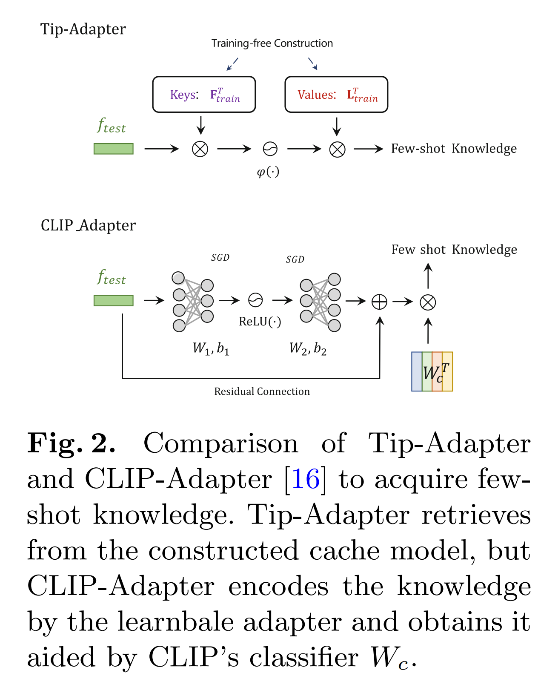

- Fig. 2 에서 보이듯, Tip-Adapter 는 cache model 에서 knowledge 를 retrieval 하는 반면, CLIP-Adapter 는 learnable adapter 를 먼저 사용해 adapted feature 을 예측한 다음, 이를 CLIP 의 $W_c^T$ 와 곱하여 final knowledge 를 출력한다.
- Eq. (4) 와 (6) 을 더 분석해 보면, CLIP-Adapter 는 Tip-Adapter 의 특별한 형태로 볼 수 있다:

$$
\begin{equation}
  W_1 = F_{train}, \quad W_2 = L_{train}^T W_c^{-1}, \quad b_1 = 0, \quad b_2 = 0,
\end{equation}
$$

$$
\begin{equation}
  \varphi(x) = \exp(-\beta(1 - x)), \quad \text{where} \quad x \in [0, 1].
\end{equation}
$$

이 두 방법에는 두 가지 중요한 차이점이 있다. 

1. CLIP-Adapter 는 cache model 의 keys 와 values 를 각각 $W_1$ 과 $W_2$ 로 randomly initializing 하고, 이를 SGD 로 training 하는 반면, Tip-Adapter 는 training 없이 $F_{train}$ 과 one-hot encoded ground-truth label $L_{train}$ 을 사용해 이를 직접 구성한다. 
2. Tip-Adapter 의 bottleneck dimension 은 $NK$ 와 동일하지만, CLIP-Adapter 는 training 으로 인한 over-fitting 을 방지하기 위해 lower-dimensional bottleneck 을 선택한다.
   - 저자의 cache model 이 few-shot dataset 에서 over-fitting 문제를 더 잘 완화시켜, large-scale pre-trained model 의 fitting power 를 더 잘 발휘할 수 있음을 나타낸다. 
3. Tip-Adapter 는 Eq. (7) 에서 나타난 activation function 을 도입한다.
   - 이 activation function 의 input 은 normalized feature space 내의 distances 이므로 자연스럽게 0 과 1 사이에 제한된다.
   - 그러나 CLIP-Adapter 에서는 common activation function 인 ReLU(·) 를 선택하여 unbounded inputs 를 처리한다.

요약하자면, Tip-Adapter 는 training 없이 잘 작동하는 adapter 를 얻으며, 이는 few-shot classification 에서 더 효율적이다.

#### Relations with Cache-Based Networks.

few-shot learning data 에서 cache model 을 얻는 것은 Matching Network, Prototypical Networks, MAML, Relation Network 등 여러 이전 방법에서 탐구되어 왔다.

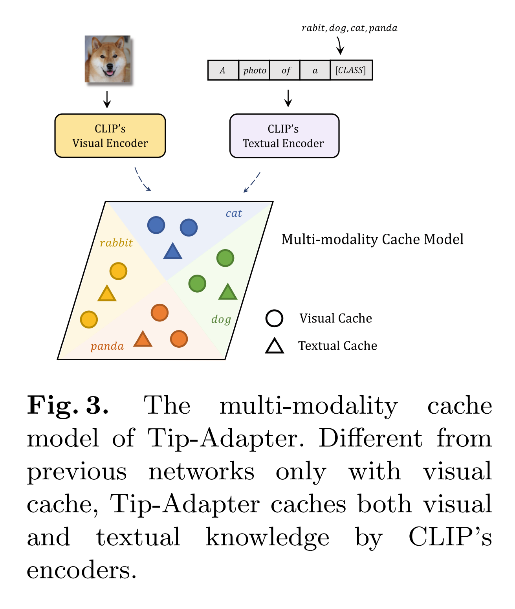

저자의 모델은 구체적인 방법과 실험 설정 모두에서 두 가지 점에서 이들과 다르다.

1. 이전 연구들은 visual features 만을 cache 로 구성하지만, Tip-Adapter 는 CLIP 으로부터 추출된 visual 및 textual features 를 모두 포함하는 multi-modality heterogeneous cache model 을 채택한다.
   - Fig. 3 에서 보이듯, keys $F_{train}$ 와 values $L_{train}$ 로 구성된 앞서 언급한 cache model 은 visual cache 로 작용.
     - 여기서 $F_{vis}$ 와 $L_{vis}$ 로 표기
   - CLIP 의 classifier $W_c$ 는 textual encoder 에 의해 category texts 로부터 계산되므로, $W_c \in \mathbb{R}^{N \times C}$ 는 textual cache 의 keys 로 작용하는 language features $F_{tex}$ 로 볼 수 있다.
   - textual cache 의 values 는 identity matrix $L_{tex} \in \mathbb{R}^{N \times N}$ 로 표기되며, $W_c$ 는 각각 $N$ category knowledge 를 encoding 하고, 그 row vector 는 특정 category 에 해당하기 때문이다.
   - 이러한 관점에서, Eq. (4) 는 다음과 같이 재구성된다:

$$
\begin{equation}
  \text{logits} = \alpha \varphi(f_{test} F_{vis}^T) L_{vis} + (f_{test} F_{tex}^T) L_{tex}, \quad (9)
\end{equation}
$$

- two terms 는 visual 및 textual cached knowledge 로부터의 knowledge retrieval 를 나타낸다.

1. 이전 연구들은 동일한 dataset 을 different categories 의 3 sub-sets 로 나누어 각각 training, support, query sets 로 사용한다.
   - 이들은 new categories set 으로 구성된 query set 에서 테스트하지만, 여전히 동일한 semantic domain 내에 있다.
   - 반면, Tip-Adapter 는 평가를 위해 pre-trained CLIP 을 완전히 새로운 dataset 에 적응시키며, 이는 new domain 으로 generalization 되므로 더 도전적이다.
   - 중요한 점은, 저자는 full test sets 에서 모델을 테스트하며, 이는 full training set 로 학습된 기존 방법과 동일하다.
   - small query sets 에서 테스트된 기존 연구와 비교하여, 저자의 효과성은 new categories 의 훨씬 더 많은 test image 들로 검증된다.

# 4. Experiments

## 4.1 Training Settings

- Tip-Adapter 와 Tip-Adapter-F 에 대한 실험은 11 image classification dataset 에서 진행된다: ImageNet, StanfordCars, UCF101, Caltech101, Flowers102, SUN397, DTD, EuroSAT, FGVC-Aircraft, OxfordPets, Food101. 
- few-shot learning 에서는 1, 2, 4, 8, 16 few-shot training set 를 비교하고 full test sets 에서 성능을 테스트한다.
- CLIP backbone 으로 ResNet-50 을 visual encoder 로, transformer 을 textual encoder 로 활용한다.
- two encoders 의 pre-trained weight 는 CLIP 에서 얻어오며, training 중에는 이를 freezing 함
- data preprocessing protocol 은 CLIP 을 따르며, 여기에는 random cropping, resizing, random horizontal flip 이 포함된다.
- CoOp 에서 learnable prompts 를 제외하고, ImageNet 에서는 prompt ensembling 을, 다른 10 dataset 에서는 single handcrafted prompt 를 사용한다. 
- Tip-Adapter-F 는 batch size 256, learning rate 0.001, AdamW optimizer 와 cosine scheduler 를 사용하여 fine-tuning 된다.
- EuroSAT dataset 은 100 epochs 동안 학습하고, 다른 10 dataset 은 단 20 epochs 만 학습한다.

---

- 성능 비교는 Zero-shot CLIP, Linear-probe CLIP, CoOp, CLIP-Adapter 사이에서 이루어진다.
  - Zero-shot CLIP : additional training samples 없이 pre-trained knowledge 만으로 classification 수행
  - Linear-probe CLIP : weight 가 고정된 CLIP 위에 additional linear classifier 를 few-shot training set 에서 학습시킨다.
  - CoOp : learnable prompts 를 채택하며, 저자는 class tokens 를 16-token prompt end 에 배치하고 class-specific context 없이 가장 성능이 좋은 variants 를 선택
  - CLIP-Adapter : feature adapters 를 추가하여 pre-trained features 와 downstream tasks 간의 domain gap 을 좁힌다.
- 저자는 CLIP-Adapter 의 learnable visual adapter 만 사용하는 best variants 도 함께 보고하며, 공정한 비교를 위해 논문에서 보고된 official scores 를 인용한다.

## 4.2 Comparison on ImageNet

#### Performance Analysis.

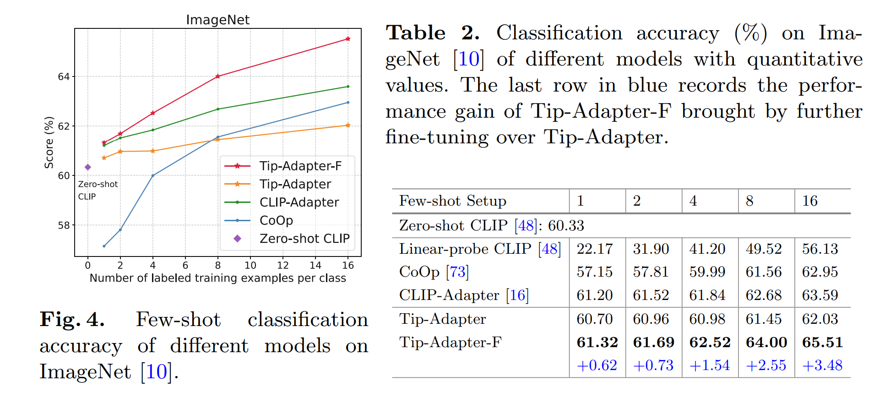

Fig. 4 와 Tab. 2 에서 볼 수 있듯이, Tip-Adapter 와 Tip-Adapter-F 모두 다른 baselines 보다 우수한 성능을 보여준다.

- Tip-Adapter 는 Zero-shot CLIP 에 비해 지속적으로 뛰어난 성능을 나타내며, 이는 training 없이도 가능하다.
- training samples 수가 제한될 때, Tip-Adapter 는 1-shot 과 2-shot settings 에서 Linear-probe CLIP 을 각각 +38.53%, +29.06% 더 능가한다.
- additional fine-tuning 을 통해, Tip-Adapter-F 는 cache model 의 keys 를 업데이트하여 모든 방법 중 few-shot settings 에서 최상의 성능을 달성한다. 
- Tip-Adapter 에 대한 성능 향상은 training samples 수가 증가할수록 더 커지며, 1-shot 의 +0.62% 에서 16-shot 의 +3.44% 로 증가한다.
  - 이는 더 많은 training samples 을 통한 fine-tuning 이 network 가 더 강력한 cache model 을 구축하도록 한다는 것을 의미한다.
- Tab. 3에서는 ResNet [22]과 ViT [13] backbone 을 사용하는 다양한 visual encoder 를 통해 다른 모델들을 구현한 결과, Tip-Adapter-F 가 여전히 가장 뛰어난 성능을 보인다.

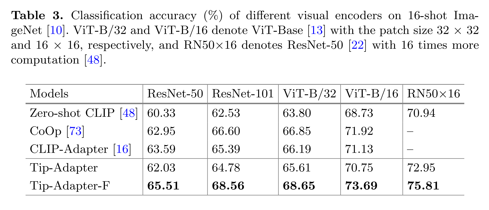

#### Efficiency Comparison.

Tab. 1 에서는 다양한 모델의 training time 과 inference speed 를 비교한다.

- CLIP-Adapter, Tip-Adapter, Tip-Adapter-F 는 모두 CLIP 의 textual features 를 처음에 cache 하고 training 또는 inference 중에 이를 로드할 수 있지만, CoOp 는 learnable prompts 를 채택하여 매 iteration 마다 full textual encoder 를 온라인으로 계산해야 한다.
- Linear-probe CLIP 은 logistic regression 을 사용하므로, training time 을 epochs 로 측정할 수 없고 GPU 에서의 inference speed 도 측정할 수 없다.
- 비교 결과, CoOp 는 prompts 를 학습하는 데 가장 많은 시간을 소모하며, Zero-shot CLIP 에 비해 +2.26% 의 성능 향상을 보인다.
- CLIP-Adapter 는 training time 을 크게 단축하면서도 +3.26% 의 성능 향상을 이루지만, 여전히 200 epochs 의 training 이 필요하다.
- cache model 을 이용한 Tip-Adapter 는 +1.70% 의 성능 향상을 이루지만 additional training time 이 필요하지 않으므로 performance 와 efficiency 사이에서 좋은 균형을 이룬다.
- Tip-Adapter-F 는 CLIP-Adapter 와 CoOp 의 training epochs 의 1/10 만으로 SOTA accuracy 에 도달하여 두 마리 토끼를 모두 잡는다.
- inference speed 와 GPU 메모리 사용량의 경우, Tip-Adapter 와 Tip-Adapter-F 는 Zero-shot CLIP 에 비해 marginal extra latency 만 발생시키며, CoOp 에 비해 많은 GPU 메모리를 절약하므로 애플리케이션에서 매우 효율적이다.

## 4.3 Performance on Other Datasets

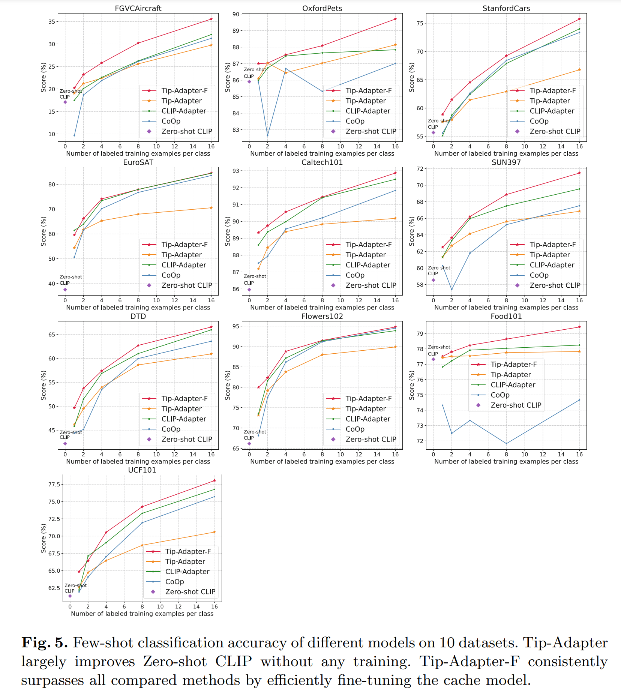

Fig. 5 는 Sec 4.1 에 나열된 다른 10 dataset 에서의 성능 비교를 보여준다. 

- training 이 필요 없는 Tip-Adapter 는 Zero-shot CLIP 에 비해 classification 정확도를 크게 향상시키며, 대부분의 dataset 에서 1 또는 2-shot 으로 학습된 CoOp 를 능가한다.
- Tip-Adapter 는 more shot 으로 학습된 CoOp 와 CLIP-Adapter 에 비해 성능이 떨어지지만, Tip-Adapter-F 는 fewer-epochs 의 fine-tuning 으로 그 gap 을 해소하고, 다른 모든 모델을 능가하여 전반적으로 뛰어난 성능을 달성한다.
- 10 dataset 에 걸친 Tip-Adapter-F 의 일관된 우수성은 제안된 cache model 의 효과성과 일반성을 완전히 입증한다.

## 4.4 Ablation Studies

이 섹션에서는 ImageNet 에서 Tip-Adapter 에 대한 여러 ablation studies 를 수행한다.

모든 실험은 training 없이 16-shot settings 을 채택한다.

#### Residual Ratio $\alpha$.

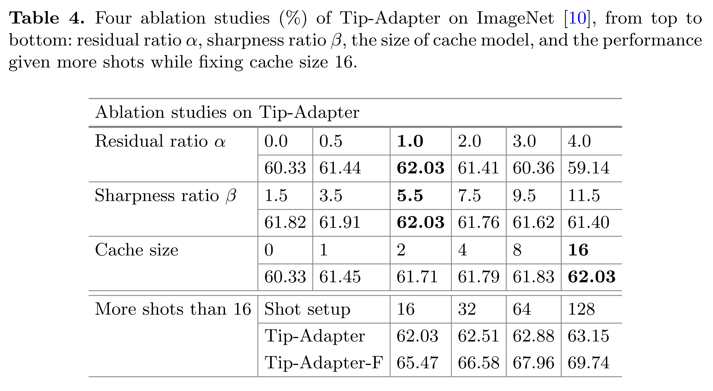

hyper-parameters $\alpha$ 는 cache model 에서 newly adapted predictions 와 pre-trained CLIP 의 predictions 를 얼마나 combining 할지를 조절하며, 이는 Eq. 9 처럼 visual 과 textual cache 의 weights 를 조정하는 것으로 해석할 수 있다.

- 앞서 서술한 대로, $\alpha$ 가 클수록 few-shot training set 에서 더 많은 knowledge 를 사용하게 되며, 반대의 경우도 마찬가지이다.
- $\alpha$ 를 0.0 부터 5.0 까지 다양하게 설정하고, hyper-parameters $\beta$ 는 5.5 로 설정한다.
- $\alpha $가 0.0일 때 모델은 few-shot knowledge 을 사용하지 않고 Zero-shot CLIP 과 동일하다.
- Tab. 4 의 상단에서 볼 수 있듯이, $\alpha$ 가 0.0 에서 1.0 으로 증가함에 따라 classification 정확도가 향상되며, 1.0 에서 최고의 성능인 62.03% 를 달성한다.
  - 이는 CLIP 의 prior knowledge 와 cache model 의 few-shot knowledge 이 동일하게 중요하다는 것을 나타낸다.

#### Sharpness Ratio $\beta$.

- Eq. (3) 에서 $\beta$ 는 activation function $\varphi$ 에서 affinities 의 sharpness 를 조절한다.
- $\beta$ 가 클수록 embedding space 에서 test image 와 가장 유사한 training samples 만이 prediction 에 큰 영향을 미치며, 그 반대도 마찬가지이다.
- $\alpha$ 를 1.0 으로 설정한 상태에서 Tab. 4 의 두 번째 부분에서는 $\beta$ 의 variation 이 제한된 영향을 미치며, $\beta$ 가 5.5 로 설정될 때 Tip-Adapter 가 최상의 성능을 발휘함을 관찰할 수 있다.

#### Size of the Cache Model.

Tip-Adapter 에서 cache model 의 size 가 성능에 미치는 영향을 탐구한다.

- 16-shot training set 를 주어졌을 때, per-category 16 samples 를 모두 cache 하는 대신, size 를 0 이상 16 미만으로 설정하여 cache 를 구성한다. 
  - 예로 8 로 설정할 때, 16 samples 를 randomly 8 uniform groups 로 나누고, 각 group 의 2 samples 의 features 를 평균화하여 8 prototypes 를 얻는다.
  - 이러한 randomly sample splits 가 성능에 영향을 미칠 수 있으므로, 5 runs 에 대한 평균 점수를 보고한다.
- Tab. 4 의 세 번째 부분의 결과는, more samples 를 cache 하여 더 많은 few-shot knowledge 을 보존할수록 Tip-Adapter 가 더 높은 정확도를 달성할 수 있음을 보여준다.

#### Scaling Up to More Shots.

16-shot 을 초과하는 경우에도 cache size 를 16 으로 제한하고 메모리와 계산에 대한 잠재적 부담을 피하는 방법을 탐구한다.

- 예로 64-shot settings 에서, 위의 분할 전략을 따라 4 groups 에서 16 prototypes 를 얻어 cache model 을 구성한다.
- Tab. 4 의 마지막 부분은 cache size 가 16 으로 제한되어 있어도, Tip-Adapter 가 per-category 32, 64, 128 training samples 에서 knowledge 를 잘 포착할 수 있음을 나타낸다.
- 또한, more samples 를 제공될수록 성능 향상이 점차 둔화되며, 이는 trainikng 없이 cache size 16 의 한계를 시사할 수 있다.
- 그러나 Tip-Adapter-F 는 keys 를 fine-tuning 하여 이러한 한계를 극복하고 more shots 로 training 하여 더 나은 성능을 달성할 수 있다.

#### Prompt Design.

기본적으로 Zero-shot CLIP, CLIP-Adapter, Tip-Adapter 에는 CLIP 의 7 templates 를 이용한 prompt ensembling 을 사용한다.

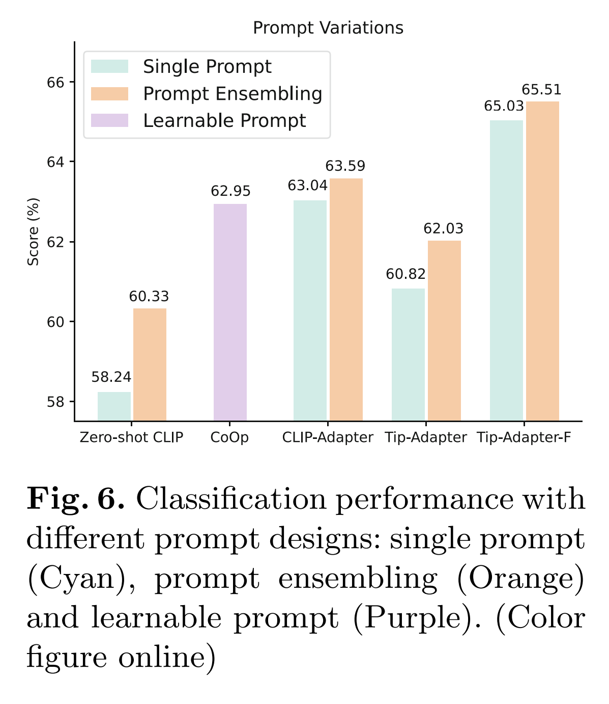

- Fig. 6 에서는 "a photo of a [CLASS]." 라는 single prompt 만을 사용해 테스트하며, 약간의 성능 저하를 관찰할 수 있다.
- 정확도 저하는 Tip-Adapter-F 와 CLIP-Adapter 에서는 더 작고, Tip-Adapter 와 Zero-shot CLIP 에서는 더 크며, 이는 더 성능이 좋은 모델일수록 prompt variations 에 덜 영향을 받음을 나타낸다.

## 4.5 Distribution Shift

Tip-Adapter 와 Tip-Adapter-F 가 한 dataset 에서 학습하고 다른 dataset 에서 테스트할 때의 distribution shifts 에 대한 성능을 평가한다. ImageNet 을 16-shot training set 를 제공하는 source dataset 으로 설정하고, two target datasets 인 ImageNetV2 와 ImageNet-Sketch 를 테스트에 사용한다.

이 dataset 들은 ImageNet 과 호환 가능한 category 를 포함하지만, semantic gaps 가 존재한다.

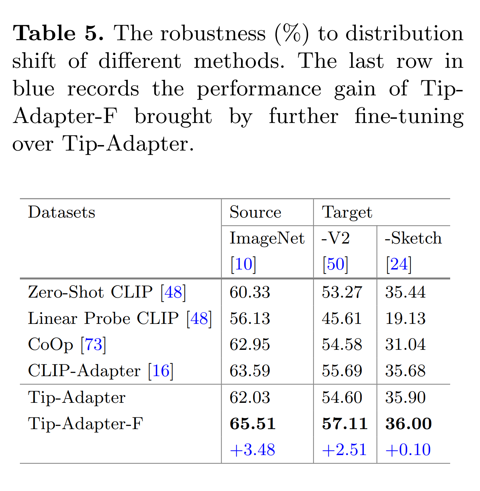

- Tab. 5에서 볼 수 있듯이, training 없이도 Tip-Adapter 는 distribution shift 에 대한 탁월한 robustness 를 발휘하여 ImageNet-V2 에서 CoOp 을, ImageNet-Sketch 에서 CLIP-Adapter 를 능가한다.
- 이는 cache model 이 source dataset 에 대한 over-fitting 의 위험을 완화하는 training 이 필요 없는 구조로, distribution shift 에 대한 평가에서 더 유리하다는 것을 나타낸다.
- 또한, Tip-Adapter-F 는 cache model 로 인해 강력한 distribution shift 성능을, fine-tuning 을 통해 뛰어난 in-distribution performance 를 동시에 달성한다.

# 5. Visualization

fine-tuning 동안 cache model 의 variation 을 더 잘 보여주기 위해, t-SNE 를 사용하여 Fig. 7 에서 keys $ F_{train} $ 을 시각화한다.

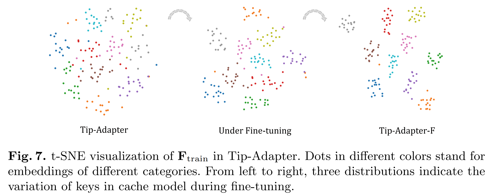

다른 색상의 점들은 16-shot ImageNet 의 10 categories 를 나타내며, 이들의 relative distances 는 category embedding 의 high-dimensional distributions 를 반영한다.

- 왼쪽에서 오른쪽으로 3 sub-figures 는 각각 training 이 필요 없는 Tip-Adapter, fine-tuning 중인 Tip-Adapter, final Tip-Adapter-F 를 나타낸다.
- training 전에도 적절하게 설계된 cache model 구조 덕분에 distribution 이 이미 좋은 구별력을 보여주고 있다.
- fine-tuning 이 진행되면서 동일한 카테고리의 embedding 이 점차 convergence 하고, 서로 다른 cluster 는 더 대조적이고 분리되며, 이는 더 강력한 classification 능력을 기여한다.

# 6. Conclusions

Tip-Adapter 는 CLIP 의 non-parametric adaptation 방법을 제안하며, few-shot training set 에서 구축된 cache model 을 통해 adapter 를 획득한다. 

이를 통해 few-shot knowledge 이 cache model 에서 검색되고, training 없이 CLIP 의 pre-trained knowledge 와 결합된다.

이와 더불어, Tip-Adapter 는 cached keys 를 몇 epochs 동안 fine-tuning 하여 더욱 향상될 수 있으며, 이를 Tip-Adapter-F 라고 명명하고, baselines 중 최고 성능을 달성한다.

한계점을 고려할 때, Tip-Adapter-F 는 ImageNet 에서 best cache model 을 학습하기 위해 여전히 20 epochs 의 fine-tuning 이 필요하지만 이는 미미한 수준이다.