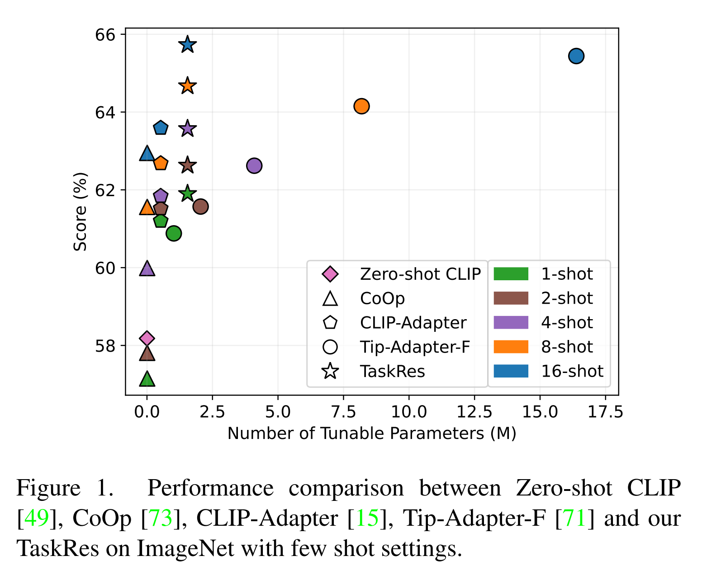
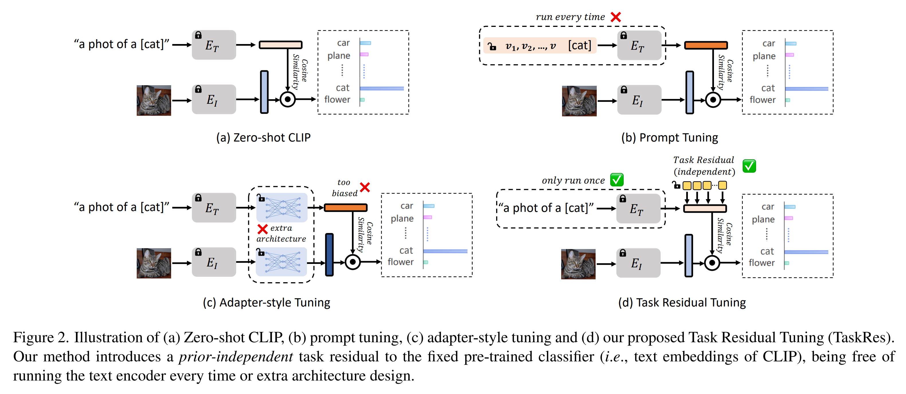
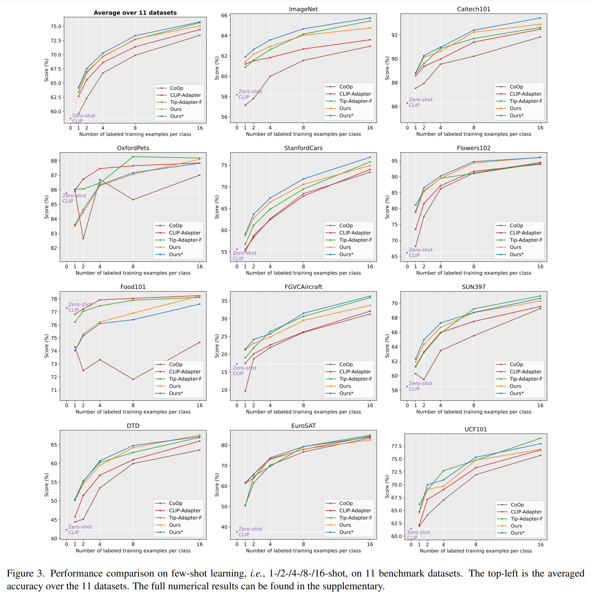
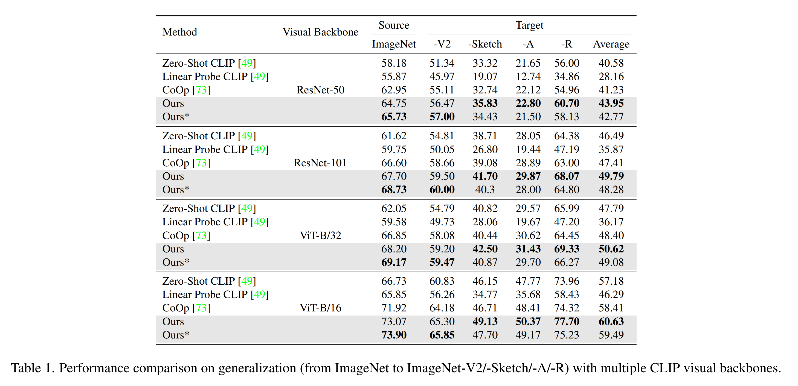
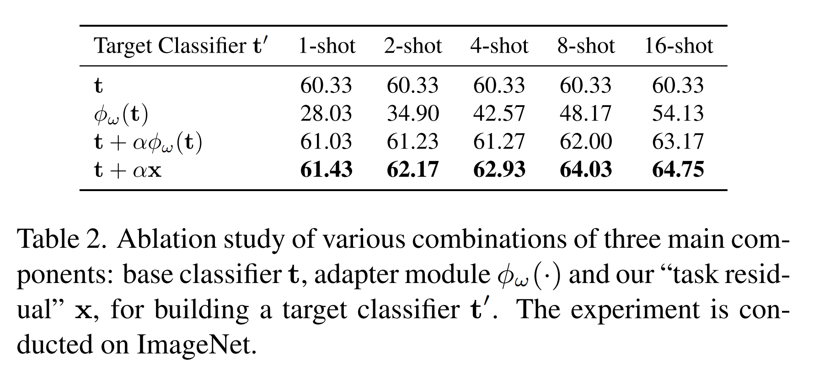
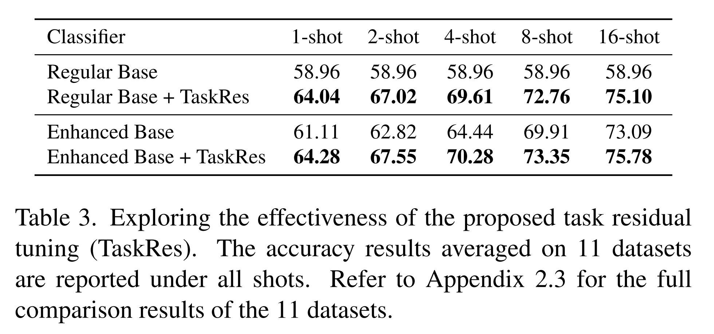
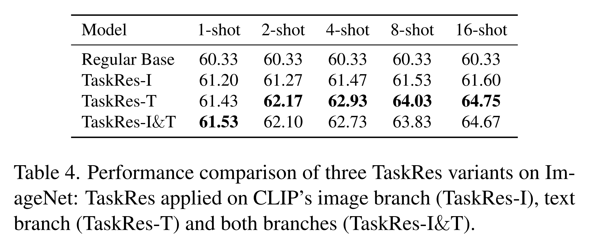
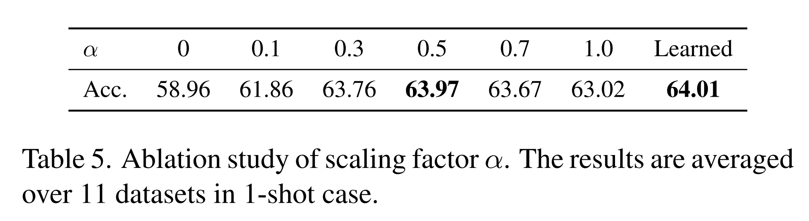
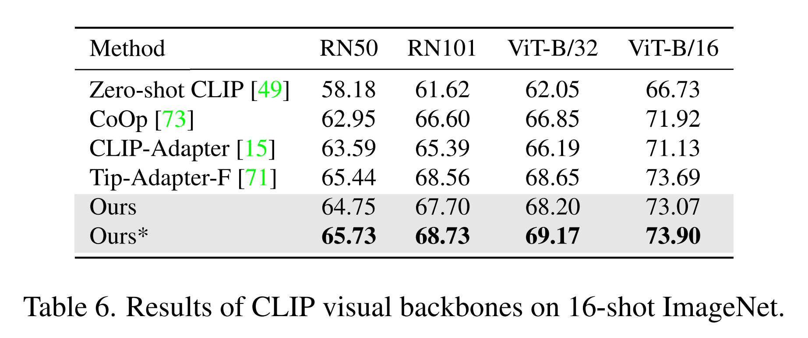
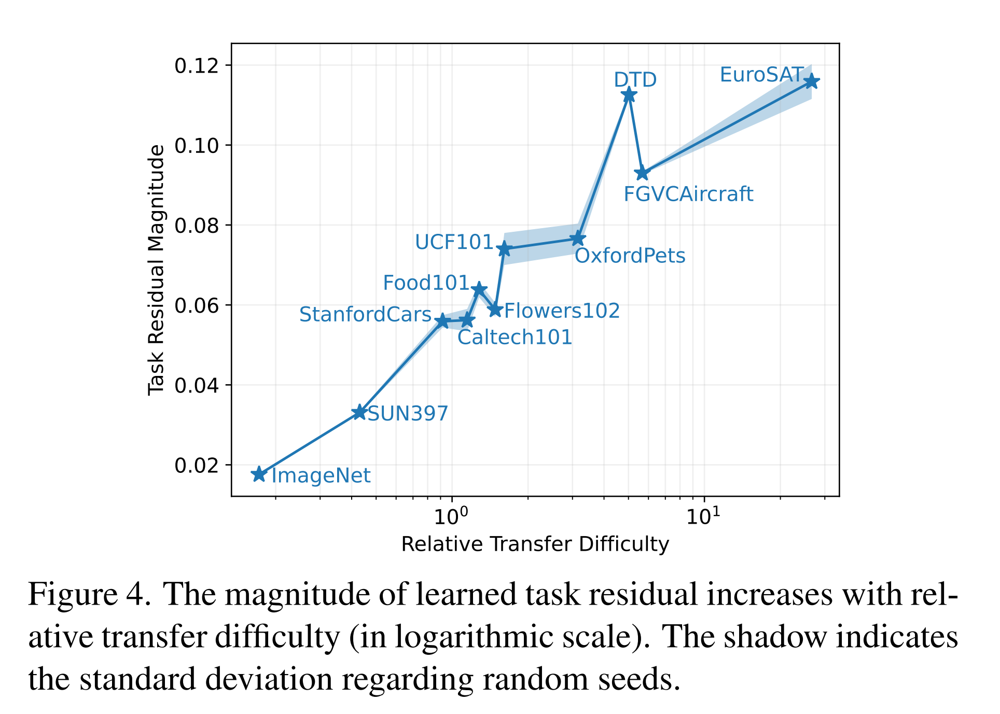

논문 및 이미지 출처 : <https://openaccess.thecvf.com/content/CVPR2023/papers/Yu_Task_Residual_for_Tuning_Vision-Language_Models_CVPR_2023_paper.pdf>

# Abstract

large-scale vision-language models (VLMs)은 billion-level data 를 pre-training 하면서 일반적인 visual representation 과 광범위한 visual concepts 를 학습했다. 

VLMs 의 well-trained knowledge structure 는 limited data 를 가진 downstream tasks 로 transfer 될 때 적절하게 계승되어야 한다. 

그러나 대부분의 기존 efficient transfer learning(ETL) 은 VLMs 의 pre-trained knowledge 를 손상시키거나 지나친 biased towards 가 있다. 

예로, prompt tuning(PT)은 pre-trained text-based classifier 를 폐기하고 new classifier 를 구축하는 반면, adapter-stype tuning(AT)은 pre-trained features 에 전적으로 의존한다. 

이를 해결하기 위해, 저자는 Task Residual Tuning(TaskRes) 라는 new efficient tuning approach 를 제안한다. 

- 이는 text-based classifier 에서 직접 수행되며, pre-trained model 의 prior knowledge 와 target task 에 대한 new knowledge 를 명확하게 분리한다. 
- 구체적으로, TaskRes 는 VLMs 의 original classifier weights 를 동결하고, original weights 에 독립적인 parameter set 을 residual tuning 하여 new target task 에 대한 classifier 를 얻는다. 
- 이를 통해 prior knowledge 의 reliable preservation 와 task-specific new knowledge exploration 이 가능해진다. 
- TaskRes 는 간단하지만 효과적이며, 구현에 최소한의 노력이 필요하면서도 11 benchmark dataset 에서 이전의 ETL 방법들(e.g., PT 및 AT)보다 크게 우수한 성능을 보인다.

# 1. Introduction

DNN-based recognition models 는 큰 성공을 거두어, 이런 SOTA models 는  large image 및 discrete label pairs 로 학습되는 경우가 많다. 

discrete label 은 "American curl cat" 같은 detailed textual description 을 간단한 scalar 로 변환하여 생성되며, 이는 loss function 의 계산을 상당히 용이하게 만든다. 

그러나 이로 인해 두 가지 명백한 한계가 발생한다: (i) textual description 에 담긴 rich semantics 가 충분히 활용되지 않으며, (ii) trained models 는 closed-set classes 만 인식할 수 있다는 점이다.

---

- 최근 large-scale vision-language models(VLM) pre-training 은 textual supervision 을 통해 visual representation 을 학습함으로써 이러한 한계를 극복한다. 
  - 예로, texts 와 images 는 pre-training 동안 contrastive loss 를 통해 unified space 로 encoding 및 mapping 된다.
- pre-trained text encoder 는 대응하는 natural language description 을 기반으로 image recognition 을 위한 text-based classifier 를 생성하는 데 사용될 수 있다(Fig. 2 (a)). 
  - 이러한 pre-trained VLM 들은 다양한 downstream tasks 에서 zero-shot 방식으로 strong transferability 를 보여주었다. 
- 그러나 이런 모델들의 효과는 large-scale architecture 와 training dataset 에 크게 의존한다. 
  - 예로, CLIP 은 428M parameters 를 가지고 있으며 0.4B text-image pairs 로 학습되었고, Flamingo 는 80B parameters 를 가지고 있으며 2.1B pairs 로 학습되었다. 
  - 이는 low-data regime 에서 downstream tasks 에 대해 모델을 fully fine-tuning 은 비현실적이라는 것을 의미한다.

이러한 이유로, pre-trained VLM 에 대한 efficient transfer learning(ETL) 이 인기를 얻고 있다. 

ETL 은 parameter- 및 data-efficiency 를 모두 충족하는 방식으로 downstream tasks 에 transfer learning 을 수행한다. 

ETL 의 핵심은 두 가지로 요약된다: (i) 이미 전이 가능한 VLM 의 well-trained knowledge structure 를 적절히 계승하는 것, (ii) limited data 를 가지고 task-specific knowledge 을 효과적으로 탐구하는 것. 

- 그러나 대부분의 기존 ETL 접근법, 즉 prompt tuning(PT) 과 adapter-stype tuning(AT) 은 VLM 의 prior knowledge 를 손상시키거나, task 의 new knowledge 를 부적절하거나 불충분하게 학습한다. 
  - 예로, CoOp (Fig. 2 (b))은 pre-trained text-based classifier 를 사용하는 대신 continuous prompt 를 학습하여 완전히 new classifier 를 생성하는데, 이는 필연적으로 prior knowledge 의 손실을 초래한다. 
  - 그 결과, CoOp 은 1-/2-shot learning 에서 zero-shot CLIP 보다 ImageNet 에서 각각 1.03%/0.37% 낮은 성능을 보인다 (Fig. 1). 
- 반면에, CLIP-Adapter 는 pre-trained classifier 를 유지하지만, new task 를 학습할 때 지나치게 prior knowledge 에 편향되어 있어 (Fig. 2) new knowledge exploration 이 부족하고 결과적으로 더 낮은 정확도를 나타낸다(Fig. 1 참조).

pre-trained VLM 에 대해 더 나은 ETL 을 위해, 저자는 Task Residual Tuning(TaskRes)이라는 new efficient tuning approach 를 제안한다. 

- TaskRes 는 text-based classifier 에서 직접 수행되며, pre-trained model 의 prior knowledge 와 target task 에 대한 new knowledge 를 명확하게 분리한다. 
- 이 분리는 VLM 에서 prior knowledge 를 더 잘 계승하고 task-specific knowledge 을 더 유연하게 탐구할 수 있게 해준다. 
- 구체적으로, original classifier weights 를 동결하고, weights 에 더해지는 _prior-independent_ parameter set 을 도입한다. 
  - 이러한 additive parameters 는 target task 에 대한 adaptation 을 위해 tuning 되며, 이를 "task residual"이라고 부른다.

TaskRes 에 대한 통찰을 얻기 위해, 저자는 11 benchmark dataset 에 걸쳐 광범위한 실험을 수행하고, learned task residual 에 대한 조사를 수행했다. 

- 실험 결과, task residual 을 도입하면 transfer 성능이 크게 향상될 수 있음을 보여주었다. 
- 저자는 learned task residual 의 크기와 pre-trained model 을 downstream tasks 로 transfer 하는 데 어려움 사이의 상관관계를 시각화했고, 그 크기가 transfer 의 어려움에 따라 증가한다는 것을 관찰했다. 
- 이는 residual 이 task 에 맞게 자동으로 적응하여 new knowledge 를 충분히 탐구할 수 있음을 시사하며, 이를 통해 11 dataset 에서 SOTA 를 달성할 수 있었다. 
- 더 나아가, 이 방법은 구현이 매우 간단하며, 코드 한 줄만 추가하면 된다.

저자의 기여는 다음과 같이 요약된다:

- pre-trained VLM 에서 downstream tasks 로의 proper knowledge inheritance 의 필요성을 처음으로 강조하고, 기존 tuning paradigms 의 함정을 밝혀내며, 기존 pre-trained knowledge 와 new task-specific knowledge 을 분리하는 것이 핵심임을 심층 분석을 통해 나타낸다.
- 저자는 Task Residual Tuning(TaskRes)이라는 new efficient tuning approach 를 제안하며, 이를 통해 VLM 의 prior knowledge 를 더 잘 계승하고, task-specific knowledge 을 더 유연하게 탐구할 수 있다.
- TaskRes 는 few tuning parameters 만 필요하며, 구현이 매우 용이하다.

# 2. Related Work

## 2.1. Vision-Language Models

주로 language-driven visual representation learning(LDVRL) 에 관한 vision-language models(VLMs)의 문헌을 검토한다. 

LDVRL 의 핵심은 texts(language)와 images 를 common space 에 mapping 하여 text representations 를 visual classification 에 사용할 수 있도록 하는 것이다. 

이를 위해 각각의 texts 와 images 를 위한 two encoders 및 regularization 로서 specific loss function 가 필요하다.

초기 연구들은 text embedding 을 위해 unsupervised trained models 이나 skip-gram text modeling 을 탐구했으며, visual encoding 을 위해 sparse coding 및 vector quantization 또는 Classeme features 를 사용했다. 

training objective 로는 MSE, self-supervised topic probabilities matching 또는 multi-class logistic loss 가 채택되었다. 

그러나 이 방법들은 small dataset 과 약한 대표성을 가진 encoding backbones 에 제한되어 있어 transfer learning 능력을 크게 저해했다.

반면에, 최근 연구들은 web-scale billion-level data 의 image-text pairs 와 strong neural network, 예로 Transformers 를 활용하여 이전 연구들을 발전시켰다.

large-scale VLMs 는 contrastive loss 를 사용한 end-to-end pre-training 을 통해 다양한 downstream tasks 에서 zero-shot evaluation 방식으로 뛰어난 transfer learning 능력을 보여주었다. 

저자는 large-scale vision-language pre-training 의 strong transferability 을 기반으로 efficient transfer learning 의 잠재력을 추가로 탐구한다.

## 2.2. Efficient Transfer Learning

large-scale dataset (e.g., ImageNet 및 WebImageText) 에서 neural network 을 pre-training 한 후 downstream tasks 에 대해 fine-tuning 하는 것은 transfer learning 의 일반적인 단계였다. 

여기선 pre-trained VLMs 에 대한 efficient transfer learning(ETL)에 주로 초점을 맞춘다. 

ETL 은 small parameters 를 tuning 하고 small-scale dataset 을 활용하는 parameter- 및 data-efficient transfer learning 을 의미한다. 

기존의 ETL 연구들은 prompt tuning 과 adapter-stype tuning(AT) 으로 나눌 수 있다. 

구체적으로, prompt engineering 은 처음에는 downstream tasks 을 위한 proper discrete prompt 를 생성하기 위해 탐구되었다. 

이후 new task 에 더 잘 적응할 수 있는 continuous prompt 를 학습하는 것이 더 발전된 성능을 보여주었다. 

그러나 이러한 방법들은 두 가지 문제에 직면한다: (i) pre-trained text encoder 가 whole training 에 참여해야 하므로 scalability 가 제한되고 computational overhead 가 증가한다; (ii) pre-trained text-based classifier 를 버리고 new classifier 를 생성하므로 VLMs 의 prior knowledge 을 잃게 된다.

AT-based methods 는 text-based classifier 를 한 번 생성한 후 text/image feature 만을 적응시키는 방식으로 위의 문제를 해결한다. 

이 간단한 설계는 더 나은 성능을 얻을 수 있지만, prior knowledge/pre-trained features 에 크게 의존하여 new knowledge 탐색이 부족하게 된다. 

이를 해결하기 위해, 저자는 더 나은 그리고 더 유연한 task-specific knowledge 학습을 위해 _prior-independent_ "task residual"을 사용하는 new efficient tuning approach, Task Residual Tuning (TaskRes)을 제안한다.

## 2.3. Few-Shot Learning

Few-shot learning(FSL)은 handful labeled examples 를 사용하여 모델을 new tasks/classes 에 적응시키는 것을 목표로 한다. 

기존의 FSL 방법들은 종종 base classes 의 abundant data 를 meta-learning 하여 적응 능력을 키운다. 

그러나 base dataset 에서 학습해야 하는 요구사항은 확장성을 제한한다. 

최근 VLM pre-training 연구들은 base dataset 을 필요로 하지 않는 효과적인 대안을 제공한다. 

이들은 pre-trained model 이 많은 downstream tasks 에서 zero-shot 방식으로 놀라운 성능을 이미 달성할 수 있음을 보여준다. ETL 은 성능을 더욱 향상시킬 수 있다. 

이 연구에서는 VLMs 를 downstream tasks 에 적응시키기 위한 새로운 ETL 방법을 제안하고, 이를 Few-shot tasks 에서 평가한다.

# 3. Preliminaries

## 3.1. Contrastive Language-Image Pre-training

CLIP 은 natural language supervision 을 통해 visual representation 을 얻기 위해 설계되었다. 

- 이는 4M image-text pairs 으로 학습되었으며, image encoder 에서 얻은 image features 와 text encoder 에서 얻은 text features 가 통합된 embedding space 내에서 contrastive learning loss 를 사용해 정렬된다. 
- 이를 통해 CLIP 은 폭넓은 visual concepts 를 효과적으로 포착하고 general visual representation 을 학습할 수 있게 된다. 
- testing 시, CLIP 은 query image 가 $K$ possible categories 중 하나로 분류될 수 있도록 한다. 
- 이는 image encoder 로부터 projection 을 통해 얻어진 query image embedding $z$ 와 text branch 에 texts (e.g., “a photo of a {class}”) 를 입력하여 얻어진 text embedding $\{t_i\}_{i=1}^{K}$ 간의 cosine similarity 를 계산함으로써 이루어진다. 
- class $i$에 대한 예측 확률은 다음과 같이 공식화된다:

$$
\begin{equation}
    p(y = i|z) = \frac{\exp(sim(z, ti)/τ)}{\sum_{j=1}^{K} \exp(sim(z, tj)/τ)}, 
\end{equation}
$$

- $sim(·, ·)$ : cosine similarity 
- $τ$ : CLIP 이 학습한 temperature

## 3.2. Revisiting Previous Tuning Paradigms

NLP 에서 성공한 ETL 접근법, 예로 prompt tuning 과 adapter 에 영감을 받아, 최근의 발전 (e.g., CoOp 및 CLIP-Adapter)은 VLMs 에 대한 ETL 에 이 아이디어를 차용했다.

- CoOp 은 처음으로 VLMs 에 prompt tuning 을 도입했다.
  -  "a photo of a" 와 같은 fixed text prompts context 를 사용하는 대신, CoOp 은 task-specific template 으로서 $M$ learnable context vectors $\{v_m\}_{m=1}^{M}$ 를 사용하도록 제안한다. 
  -  text encoder 에 주어진 prompts 는 $\{v_1, v_2, · · · , v_M, c_i\}$가 되며, 
     -  $c_i$ : class $i$ 의 embedding
  -  whole training process 동안 CoOp 은 pre-trained VLMs 의 parameters 를 freezing 하고, learnable vectors $\{v_m\}_{m=1}^{M}$ 만 tuning 한다
- adapter-stype tuning 은 tunable parameters $ω$ 를 가진 additional modules $ϕ_ω(·)$ 을 pre-trained model 에 도입하여 pre-trained features $f$ 를 new features $f'$ 로 변환한다.
  - 일반적으로 adapter-stype tuning 은 다음과 같이 공식화될 수 있다:

$$
\begin{equation}
    f' = f + αϕ_ω(f),
\end{equation}
$$

- $\alpha$ : scaling factor
- CLIP-Adapter 에선 adapter module $\phi_\omega$ 이 two linear transformation layers 및 그 사이에 ReLU activation 으로 구성된다. 
- CLIP-Adapter 는 visual adapter 와 text adapter 모두를 조사하며, 즉, adapter module 을 CLIP 의 image branch 및 text branch 에 각각 적용한다. 
- 이 연구는 two adapters 모두 유사한 성능을 보인다고 보여준다. 
- downstream tasks 에서의 training 동안, adapter-stype methods 는 오직 adapter module 만을 조정한다.

# 4. Approach

## 4.1. Pitfalls of Existing ETL Paradigms on VLMs

저자는 pre-trained VLMs 의 prior knowledge 사용과 downstream tasks 에 대한 new knowledge 습득을 재고한다. 

- 한편으로는, large-scale VLMs 는 amount data 를 통해 general visual concepts 를 학습하였으며, 이는 다양한 downstream vision tasks 에 대해 동질화를 가능하게 한다. 
  - 이러한 prior knowledge 은 transfer process 에서 잘 보존되어야 한다. 
- 다른 한편으로, pre-training 에 사용된 data 가 방대하더라도 downstream tasks 에서는 domain shifts 나 uncertain concepts 이 존재할 수 있다. 
  - downstream tasks 에 특화된 new knowledge 은 prior knowledge 에 적절히 보강되어야 한다. 

그러나 기존 ETL 패러다임은 이러한 원칙을 충분히 고려하지 않으며, 다음과 같은 두 가지 문제가 있다.

#### Pitfall 1: Lack of guarantees of prior knowledge preservation in prompt tuning.

Prompt tuning paradigm 에서 pre-trained text branch modules (e.g., text encoder 및 projection)의 weights 를 동결하지만, original well-trained classification boundary 가 어느 정도 손상될 수 있다. 

이는 input prompts tuning 이 new boundary 를 만들어내면서 old knowledge 를 잊어버리게 하기 때문이다. 

결과적으로, prompt tuning 의 성능은 제한적이다. 

예로, CoOp 의 성능은 Fig. 1 에서 보여주는 바와 같이 1-/2-shot learning 에서 Zero-shot CLIP 보다 좋지 않다.

#### Pitfall 2: Limited flexibility of new knowledge exploration in adapter-style tuning

downstream tasks 의 data distribution 는 pre-training distribution 과 다를 수 있으며, 일부 task-specific 또는 fine-grained visual concepts/representations 는 pre-trained VLMs 에서 충분히 학습되지 않을 수 있다. 

예로, CLIP 에서 satellite dataset EuroSAT 으로의 경우가 그렇다. 

따라서 downstream tasks 에 대한 new knowledge 은 적절히 탐색되어야 한다. 

저자는 adapter-style tuning 이 prior/pre-trained features 에 엄격히 limited input 을 사용하므로 task-specific knowledge 를 충분히 탐색하지 못한다고 관찰했다. 

결과적으로 adapter-style tuning 은 new knowledge 를 학습하는 데 유연성이 제한된다.

## 4.2. Task Residual Tuning

#### Fixed base classifier.

Fig. 2(d) 와 같이, TaskRes 는 text-based classifier(i.e., text embedding) 에 directly tuning 을 수행한다. 

_base classifier 는_ pre-trained vision-language model (e.g., CLIP) 의 text embedding 이다. 

- 저자는 base classifier 를 $t \in \mathbb{R}^{K \times D}$ 로 나타낸다
  - $K$ : category 수
  - $D$ : feature dimension
- 저자는 base classifier 의 weights 를 동결하여 base classifier 가 손상되는 것을 명시적으로 방지한다.

#### Prior-independent task residual

task-specific knowledge 를 prior knowledge 에 제한되지 않고 학습하기 위해, 저자는 task residual 를 제안한다. 

- 이는 base classifier 에 의존하지 않는 tunable parameters set 이다.
- task residual 은 scaling factor $α$ 로 tuning 되며, base classifier 에 element-wise 로 추가되어 new classifier $t'$ 를 형성한다. 

수식으로는 다음과 같이 표현된다:

$$
\begin{equation}
    t' = t + \alpha x
\end{equation}
$$

#### Tuning for downstream tasks

- tuning 중 base classifier (image branch 포함)를 고정하고 prior-independent task residual 만 tuning 한다. 
  - 이를 통해 old knowledge 의 신뢰할 수 있는 보존과 new knowledge 의 유연한 탐색이 가능하다. 
- image 가 주어지면, CLIP 의 frozen image branch 는 embedding $z$를 추출한다. 

class $i$에 대한 predicted probability 는 다음과 같이 계산된다:

$$
\begin{equation}
    p(y = i | z) = \frac{\exp(\text{sim}(z, t'_i) / \tau)}{\sum_{j=1}^K \exp(\text{sim}(z, t'_j) / \tau)}.
\end{equation}
$$

- predicted probability 를 기반으로, downstream task loss(e.g., cross-entropy loss)은 standard backpropagation 을 통해 task residual 만 업데이트한다.

# 5. Experiment

## 5.1. Setup

기존 efficient transfer learning(ETL) 연구를 따르며, 11 benchmark dataset (i.e., ImageNet, Caltech101, OxfordPets, StanfordCars, Flowers102, Food101, FGVCAircraft, SUN397, DTD, EuroSAT, UCF101)에서 few-shot evaluation 을 수행한다. 

이 dataset 들은 generic object classification, fine-grained object classification, action, scenes 등 다양한 visual recognition tasks 를 포함한다. 

특히, ETL 모델은 각각 1/2/4/8/16 shots 으로 훈련되며, full test sets 에서 평가된다. 또한, CoOp 을 따라, ImageNet 에서의 model generalization 성능을 ImageNet 의 variants (i.e., ImageNetV2, ImageNet-Sketch, ImageNet-A, ImageNet-R)에서 테스트한다.

## 5.2. Implementation

저자의 접근 방법에는 base classifier 와 task residual 두 가지 주요 구성 요소가 있다. 

base classifier 에는 두 가지 버전이 있다. 

- 하나는 pre-trained CLIP 의 text embedding weights 를 직접 사용하는 _regular base classifier_ 이며, 
- 다른 하나는 저자의 task residual tuning 전에 target task 에 대해 CLIP 의 text projection layer 를 tuning 하여 얻은 enhanced base classifier

---

- task residual 는 learnable parameters 로 채워진 matrix 이며, 초기값은 0 으로 설정된다. 
- task residual 는 base classifier 와 same shape 를 가지며, $α$ factor 로 scaling 되고 base classifier 에 element-wise 로 추가된다. 
- 기본적으로, $α$ 의 값은 all dataset 에서 0.5 로 설정되며, Flowers102 의 경우 1 을 사용한다. 
- 또한, 후속 연구에서 learnable $α$ 의 사용도 탐색한다. 
- 모든 모델은 pre-trained CLIP 을 기반으로 하며, 특별히 명시되지 않는 한, image branch 에 ResNet-50 backbone 을 사용하는 ResNet-50 버전의 CLIP 을 사용한다. 
- 저자의 모델은 1-/2-/4-shot 실험에는 100 epochs, 8-/16-shot 실험에는 200 epochs 동안 training 하며, batch size 는 256이다. 
- 또한, enhanced base classifier 는 50 epochs 동안 조정된다. 
- 저자의 모델은 Adam 으로 최적화되며, initial learning rate 는 2e-3 이고 ImageNet 의 경우 2e-4 로 설정된다. 
- CoOp 를 따라, optimization process 는 cosine learning rate decay scheduler 와 warmup scheme 을 채택 (i.e., first epoch 의 learning rate 를 1e-5 로 고정). 
- training 후 모델 성능을 테스트하며, 모든 실험 결과는 3 random seeds 에서 평균화.

## 5.3. Performance Comparison

### 5.3.1. Few-Shot Learning

저자는 두 가지 버전의 TaskRes (i.e., regular base classifier 및 enhanced base classifier 를 _Ours/Ours*_) 를 개발하며, 이를 Zero-shot CLIP 및 SOTA ETL (i.e., CoOp, CLIP-Adapter, Tip-Adapter-F)과 비교한다. 

- 전반적으로, Ours 와 Ours*는 11 dataset 에서 모든 few-shot setting 에서 최신 성능(SOTA) 또는 SOTA 에 준하는 성능을 달성하며, Zero-shot CLIP 보다 상당히 우수하다. 
- 몇 가지 관찰 사항은 다음과 같다. 
  1. shots 수가 증가함에 따라 Tip-Adapter-F 는 저자의 성능에 가까워지지만, Fig. 1 에서 볼 수 있듯이 tunable parameters 수가 선형적으로 증가하여 확장성이 제한된다. 
  2. TaskRes 는 OxfordPets 와 Food101에서 성능이 떨어진다. 이 두 가지 fine-grained dataset 에서 few-shot 으로 학습할 때 over-fitting 되는 경향이 있으며, 이는 CoOp 에서도 발견된 바 있다. 
  3. TaskRes 는 많은 클래스를 인식해야 할 때 (e.g., 1000 ImageNet classes 와 397 SUN397 classes 에서 1-shot 의 경우) 우수한 성능을 보인다. 
     - 이는 TaskRes 가 pre-trained 특징에 지나치게 편향되지 않으므로 극단적인 상황에서도 task-specific knowledge 을 더 잘 탐색할 수 있기 때문이다.

### 5.3.2. Domain Generalization

CoOp 의 지적처럼, specific domain 에서 훈련된 ETL 모델은 unseen domain 으로 일반화할 때 잘못된 상관관계를 학습할 위험이 있다. 

저자는 domain generalization 과 관련하여 모델을 평가한다. 

저자는 16-shot ImageNet 에서 모델을 훈련하고, trained models 의 generalization 성능을 4 unseen ImageNet variants dataset (ImageNet-V2, -Sketch, -A, -R)에서 테스트한다. 

- TaskRes 는 다양한 CLIP visual backbone(ResNet-50, ResNet-101, ViT-B/32, ViT-B/16)에서 비교된 모델(Zero-shot CLIP, Linear Probe CLIP, CoOp)을 일관되게 능가한다. 
- 또한, 저자의 TaskRes 는 regular base classifier (Ours)보다 enhanced base classifier(Ours*) 를 사용할 때 더 높은 정확도를 달성하지만, source dataset 에서 약간의 over-fitting 으로 인해 generalization 성능이 다소 감소하는 경향이 있다.

## 5.4. Ablation Study

#### Importance of prior knowledge preservation and priorindependent tuning.

저자는 4 target classifier $t'$ 를 구축하여 prior knowledge preservation 과 prior-independent tuning 의 중요성을 조사한다. 

구체적으로, original pre-trained classifier 인 $t'$ (i.e., regular base classifier), directly-adapted classifier $t' = \phi_{\omega}(t)$, adapter-style classifier $t' = t + \alpha \phi_{\omega}(t)$, 그리고 TaskRes classifier $t' = t + \alpha x$ 를 비교한다. 

저자는 ImageNet 에서 all few-shot setting 에 대해 실험을 진행하며, scaling factor $\alpha = 0.5$ 를 사용한다. 

Table 2의 결과는 다음을 지지한다: (i) prior knowledge 의 explicit preservation 이 중요하며, directly-adapted classifier 는 original pre-trained classifier 와 adapter-style 의 classifier 보다 성능이 훨씬 낮다. (ii) prior-independent parameter tuning 이 더 효과적이며, TaskRes classifier 가 adapter-style classifier 보다 확연히 우수하다.

#### Effectiveness of task residual learning.

저자는 TaskRes 의 도입 효과에 대한 ablation study 를 수행한다. 

- 11 dataset 에서 regular base classifier 와 TaskRes 를 장착한 모델 (i.e., Ours) 의 few-shot 결과를 평균화하여 보여준다.
- TaskRes 는 regular base classifier 를 크게 개선하며, 예로 16-shot setting 에서 16.14% 의 정확도 향상을 보여준다. 
- 또한, enhanced base classifier 에서도 성능 향상이 인상적이다. 
- 이는 TaskRes 가 downstream tasks 에 적응할 때 항상 pre-trained base classifier 에 이점을 제공할 수 있음을 나타낸다.

#### Variants of TaskRes

제안된 "task residual"는 CLIP 의 image branch 에도 적용할 수 있으며, 이를 _TaskRes-I_ 로 나타낸다. 

default TaskRes (i.e., Ours) 는 text branch 에 적용된 것을 나타내며, two branches 모두에 적용된 것을 _TaskRes-I&T_ 로 나타낸다. 

- ImageNet 성능 비교 결과는 TaskRes-T 가 TaskRes-I 보다 일관되게 우수함을 보여준다. 
- TaskRes-I 는 shots 수가 증가함에 따라 성능이 훨씬 더 느리게 증가하며, 이는 TaskRes-I 가 training 및 test image embedding 의 차이로 인해 over-fitting 문제를 겪기 때문이다. 
  - text embedding 에 대한 조정은 이러한 문제를 피할 수 있다. 
- 또한, image embedding 이미지 임베딩의 다양성이 text embedding 보다 커서 task-level information 을 학습하기 어렵다. 
- TaskRes-I&T 는 TaskRes-T 보다 약간 낮은 성능을 보인다. 
  - 이는 updated image embedding 과 base classifier 사이의 misalignment 로 인한 것일 수 있다.

#### Scaling factor.

저자는 scaling factor $\alpha$ 의 효과를 조사하며, manual value 및 learnable value 를 모두 Table 5에 보여준다. 

- manually set $\alpha$ 의 경우, $\alpha = 0.1$ 로 scaling 해도 TaskRes 에서 주목할 만한 향상이 관찰되며, highest accuracy 는 $\alpha = 0.5$ 에서 얻어진다. 
- 반면, learnable $\alpha$ 는 성능을 더 향상시킬 수 있다.

#### Visual backbone

저자는 다양한 CLIP visual backbone (i.e., ResNet-50 (RN50), ResNet-101 (RN101), ViT-B/32, ViT-B/16)에서 모델을 추가로 평가한다. 

Table 6 에 따르면, 저자의 방법은 사용되는 backbone 에 관계없이 다른 대안들보다 일관되게 우수하다.

## 5.5.  Investigation of Learned Task Residual

저자는 learned task residual 가 실제로 CLIP 을 downstream tasks 로 transferring difficulty 와 관련이 있는지 조사한다. 

먼저, _relative transfer difficulty_ 를 정의하여 pre-trained model 을 target task 로의 transferring difficulty 를 평가한다. 

- 구체적으로, relative transfer difficulty 는 baseline classifier precision 과 pre-trained model 의 zero-shot precision 의 비율로 정의된다. 
- baseline classifier 로는 random classifier 를 사용하며, 이 classifier 의 precision 은 $1/K$ ($K$ : downstream tasks 의 classes 수)이다. 
- 그런 다음, CLIP 의 relative transfer difficulty 를 11 benchmark dataset 에 대해 계산하며, 16-shot setting 에서 각 dataset 의 learned task residual 의 평균 크기를 측정한다. 

- 몇 가지 흥미로운 발견이 있으며, 예로, CLIP 을 ImageNet(1000 classes)으로 transfer 이 가장 쉬운 반면, EuroSAT(10 classes)으로의 transfer 는 가장 어려운 것으로 나타났다. 
  - 이는 ImageNet 의 inherent difficulty 가 크지만 CLIP 에게 "familiar" data distribution 와 object 를 포함하고 있는 반면, EuroSAT 은 반대이기 때문. 
- 또한, TaskRes 가 relative transfer difficulty 가 큰 task 에서 더 많은 역할을 할 수 있음을 보여준다. 
  - 예로, EuroSAT (1-shot 정확도 향상: 23.71%) 와 DTD (1-shot 정확도 향상: 7.85%)에서의 향상은 그러한 예이다.

# 6. Conclusion, Limitation and Future Work

본 연구에서는 VLMs 를 조정하기 위한 새로운 접근 방식인 TaskRes 를 제안한다. 

TaskRes 는 VLMs 에서 efficient transfer learning(ETL)을 수행하며, classifier 를 두 가지 핵심 부분으로 명시적으로 분리한다: rich prior knowledge 을 갖춘 손상되지 않은 base classifier 와 base classifier 에 독립적인 task residual 를 통해 task-specific knowledge 을 더 잘 탐색할 수 있게 한다. 

흥미롭게도, learned task residual 의 크기는 pre-trained VLMs 를 target downstream tasks 로 transfer difficulty 와 밀접하게 관련이 있다.

이는 ETL 을 새로운 시각으로 바라보는 데 영감을 줄 수 있으며, 예로 "task-to-task transfer difficulty" modeling 을 고려할 수 있다. 

광범위한 실험을 통해 TaskRes 의 효과성이 입증되었다.

---

그럼에도 불구하고 여기에는 몇 가지 한계가 있다. 예로, OxfordPets (1-shot)와 Food101 (1-/2-/4-/8-shot) dataset 에서 negative transfer 문제가 발생한다. 

이러한 문제는 두 가지 조건에서 발생한다고 추측한다: (i) downstream tasks 이 high relative transfer difficulty 를 갖고 있으며 (Fig. 4) (ii) Zero-shot CLIP 이 이미 공정한 정밀도를 달성한 경우이다. 

또한, 본 연구에서 transfer difficulty 의 평가는 휴리스틱적이다. 

foundation model 의 급속한 발전에 따라, pre-trained foundation model 을 downstream tasks 로의 transfer difficulty 를 정확하고 신뢰할 수 있는 metric 으로 평가하는 것이 점점 더 중요해지고 있다. 

distribution analysis 를 포함한 포괄적인 transfer difficulty 연구가 요구된다. 

또한, transfer difficulty 를 concept-wise level 로 확장하고, visual concepts 의 currence frequency 와 성능 간의 상관관계를 조사하기 위해 특정 dataset 에서 훈련된 CLIP (e.g., SLIP 을 YFCC15M 에서 훈련한 모델)을 탐색할 수 있다.