논문 및 이미지 출처 : <https://arxiv.org/pdf/2311.03774v2>

# Abstract

contrastive vision-language pre-training 인 CLIP 은 open-world visual concept 를 인식하는 데 있어 뛰어난 잠재력을 보이며, 효과적인 zero-shot image recognition 을 가능하게 한다. 그러나 CLIP 기반의 few-shot learning 방법은 일반적으로 few-shot sample 에 대해 parameter 를 offline 으로 fine-tuning 해야 하며, 이는 inference 시간이 길어지고 특정 domain 에서 over-fitting 위험이 발생한다. 

이러한 문제를 해결하기 위해, 저자는 few-shot sample 에 의해 online 방식으로 CLIP feature 를 정제하는 lightweight residual-style adapter 인 **Meta-Adapter** 를 제안한다. few training sample 만으로, 이 방법은 효과적인 few-shot learning 기능을 가능하게 하고, 추가 fine-tuning 없이도 unseen data 나 task 로 일반화할 수 있으며, 경쟁력 있는 성능과 높은 효율성을 달성한다. 

* 추가적인 복잡한 기법 없이, 제안한 방법은 8 image classification datasets 에서 SOTA online few-shot learning 방법 대비 평균 3.6% 높은 성능을 보이며 inference 속도도 더 빠르다. 
* 또한, 제안한 model 은 단순하고 유연하여 downstream task 에 바로 적용 가능한 plug-and-play module 로 활용될 수 있다. 
* 추가 fine-tuning 없이도 Meta-Adapter 는 open-vocabulary object detection 및 segmentation task 에서 성능 향상을 보인다.

# 1 Introduction

contrastive vision-language pre-training 인 CLIP 은 open-world visual concept 를 modeling 하는 데 있어 놀라운 잠재력을 보이며, image recognition 과 open-vocabulary perception 을 포함한 다양한 vision task 에 도움이 된다. 이는 large-scale dataset 과 고도화된 pre-learning technique 덕분이다. visual category 에 기반하여 prompt 를 구성함으로써, CLIP 은 효과적인 zero-shot image classification 성능과 unseen data 에 대한 generalization 능력을 보인다. 최근, CLIP 기반의 few-shot learning 이 점점 더 많은 연구 관심을 받고 있다. NLP 분야에서 feature adapter 와 prompt tuning 이 성공한 것에 영감을 받아, CLIP 을 위한 다양한 few-shot 접근법이 제안되고 연구되었다.

CLIP 의 few-shot learning 방법은 unseen category 의 few-shot sample 에 대해 fine-tuning 이 필요한지 여부에 따라 offline 과 online 방법으로 나눌 수 있다. Offline 방법은 parameter optimization 을 통해 few-shot sample 로부터 지식을 추출한다. 대표적인 예로, 

* CoOp 과 CoCoOp 은 CLIP 의 hand-crafted template 을 few-shot sample 로 fine-tuning 하여 learnable continuous token 으로 대체한다. 
* 또한, CLIP-Adapter 는 few-shot sample 로부터 task-specific knowledge 를 학습하여 feature adapter 를 CLIP 에 도입한다. 

그러나 이러한 추가 구성 요소는 promising few-shot learning 기능을 제공하지만, 추가 training cost 를 발생시키고 특정 data distribution 에서 심각한 over-fitting 문제를 겪는다. 이러한 training cost 를 제거하기 위해, Tip-Adapter 라는 online 방법이 제안되었다. 이 방법은 category embedding 과 few-shot visual embedding 간 비율을 조절하는 hand-crafted modulation function 을 제안하여, fine-tuning 없이 few-shot sample 로부터 knowledge 를 얻고 zero-shot 대비 성능 향상을 보였다. 그러나 복잡한 hyper-parameter search scheme 때문에, Tip-Adapter 는 seen data distribution 에서 여전히 over-fitting 되는 경향이 있어 generalization capability 가 제한된다. 이전의 방법들과 달리, 저자는 새로운 관점으로 *meta-learning 을 통한 CLIP 에 대한 online few-shot learner 를 학습한다.*

이를 달성하기 위해, 저자는 Tip-Adapter 의 hand-crafted modulation function 과 searching scheme 을 *lightweight residual-style network* 로 대체한 **Meta-Adapter** 를 제안한다. 

* Offline few-shot learning 방법은 unseen category 의 few-shot sample 에 대해 추가 fine-tuning 이 필요하지만, 제안한 접근법은 meta-testing mechanism 을 사용하므로, 학습 시의 category 와 테스트 시의 category 가 달라도 된다. 
* 제한된 수의 few-shot data 를 사용하여 Meta-Adapter 는 few-shot learning 기능을 학습할 수 있으며, 추가 fine-tuning 없이도 다른 unseen data 로 일반화하여 online 방식으로 few-shot sample 로부터 지식을 추출할 수 있다.

효율성을 위해, Meta-Adapter 는 *gated multi-head attention mechanism* 기반의 lightweight network 로 구성되며, 각 category 에 대해 few-shot image feature 와 textual feature 간의 간극을 메운다. 이 과정은 few-shot image 에 의해 category embedding 을 정제하는 learnable filter 로 볼 수 있다. 

* Meta-Adapter 는 추가 fine-tuning 이 필요하지 않아 zero-shot 대비 계산 오버헤드가 미미하다.
* Tip-Adapter 대비 over-fitting 문제를 완화하며 dataset 전반에서 더 나은 generalization 을 보인다.
* 또한, Meta-Adapter 는 단순하며 다양한 CLIP 기반 방법에 plug-and-play module 로 적용 가능해, 많은 open-vocabulary downstream task 에 유연하게 사용할 수 있다.

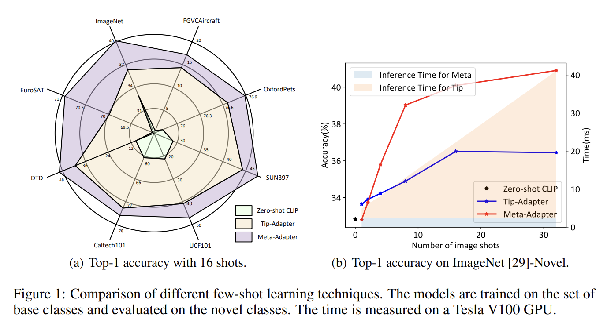

광범위한 실험을 통해 Meta-Adapter 의 효과와 효율성이 image classification, object detection, segmentation 에서 입증된다. Generalizability 검증을 위해 cross-category generalization, cross-dataset generalization, cross-task generalization 등 일련의 ablation study 를 수행했다. 

* Fig. 1(a) 에서 보이듯, base class 데이터로 학습 시 Meta-Adapter 는 16-shot setting 에서 8 개 image classification dataset 의 novel class 에 대해 Tip-Adapter 대비 평균 3.6% 절대 향상을 달성했다. 
* 더 많은 image shot 을 사용할수록 Tip-Adapter 대비 성능 향상이 증가하며, 이는 Fig. 1(b) 에 나타난다. 
* 또한, ImageNet pre-trained model 을 다른 7 개 classification dataset 에 직접 평가한 결과, 제안한 방법은 Tip-Adapter 대비 평균 4.9% 성능 향상을 보였다. 
* 더 나아가, Meta-Adapter 는 open-vocabulary object detection 과 같은 다른 task 개선 가능성을 보이며, object detection 과 instance segmentation 모두에서 일관된 성능 향상을 이끈다. 
* ImageNet pre-trained Meta-Adapter 를 open-vocabulary object detection framework 인 ViLD 와 통합했을 때, rare category 의 APr 평균 precision 에서 1.0% 절대 향상을 달성했다.

# 2 Related Work

## 2.1 Vision-Language Pretrained Models

CV 와 NLP 분야에서 pre-trained model 이 성공한 데에 영감을 받아, vision 과 language modality 를 모두 처리할 수 있는 large-scale model 을 pre-train 하려는 많은 연구가 제안되었다. 전형적인 vision-language model 은 vision encoder, language encoder, fusion encoder, loss function 의 네 가지 핵심 구성 요소로 이루어진다. 

최근, CV 와 NLP 의 base model 이 성공함에 따라, multi-modal learning 커뮤니티는 이러한 large-scale base model 을 활용하여 성능을 더 높일 수 있게 되었다. VisualBERT, OSCAR, Uniter 는 BERT 를 사용하여 raw text 를 전처리하며, visual question answering (VQA) 과 같은 multi-modal task 에서 뛰어난 성능을 보인다. 

또한, 이러한 방법들은 cross-modal interaction 을 통합하기 위해 잘 설계된 fusion encoder 가 필요하다. 최근에는 CLIP, DeCLIP, ALIGN 이 vision-language contrastive learning 이 transferable feature 를 생성할 수 있으며, vision 과 language embedding 간 dot product 계산만으로도 multi-modal interaction 을 잘 해석할 수 있음을 보였다. 추가적인 self-attention 또는 cross-attention module 없이도 multi-modal embedding 은 사전에 계산하고 저장할 수 있어, 효율적이며 다른 task 에 쉽게 적용할 수 있다.

## 2.2 Vision-Language Model Adaption

최근 많은 연구에서는 vision-language model 을 downstream task 에 적응시키기 위한 효과적이고 효율적인 접근 방식을 탐구하고 있으며, 이는 prompt-tuning 방법 (e.g., Context-Optimization (CoOp))과 feature adapter 방법(e.g., Tip-Adapter)로 구분된다. 

Prompt learning 의 성공에서 영감을 받아, 

* CoOp 은 hand-crafted template 을 continuous token 으로 대체하고 이를 전통적인 fine-tuning 방식으로 최적화한다. 
* 또한, CoCoOp 은 심각한 over-fitting 문제를 완화하기 위해 shallow MLP 로 학습된 image-specific token 을 추가로 통합한다. 
* 수작업으로 설계된 prompt template 과 비교해, CoOp 과 CoCoOp 은 few-shot image classification 에서 뛰어난 성능을 달성했다. 

이러한 prompt tuning 방법과 달리, CLIP-Adapter 와 Tip-Adapter 는 residual feature blending 을 수행하여 few-shot knowledge 를 CLIP 의 zero-shot knowledge 와 결합한다. 

* 이들은 CLIP 의 모든 parameter 를 고정한 채 소수의 추가 weight 만 fine-tuning 하며, few-shot image classification 에서 좋은 성능을 보인다. 
* 또한, Tip-Adapter 는 linear weight 를 few-shot knowledge (즉, cache model) 로 초기화함으로써, 학습 없이도 우수한 성능을 내는 방식으로 확장 가능하다. 

그러나 이러한 방법들은 특히 source 와 target dataset 간 domain gap 이 클 때 over-fitting 문제가 발생한다.

## 2.3 Meta-Learning

Meta-learning 은 “learning-to-learn” 으로 해석되며, 주어진 task family 에 가장 적합한 algorithm (inductive bias) 을 탐색하여 generalization 을 향상시키는 것을 의미한다. 반면, 전통적인 machine learning algorithm 은 특정 single task 에 대해 더 많은 data 가 주어질수록 성능이 향상되는 것을 기대한다. 

일반적으로, meta-learning 은 task family 에서 sampling 한 learning instance 를 학습하며, 이를 통해 해당 family 에서 sampling 된 new task 에서 잘 작동하는 base learning algorithm 을 시뮬레이션한다. 

또한, 특정한 경우에는 모든 training instance 가 single task 에서 sampling 될 수 있다. Vision-language model 을 downstream task 에 적응시키는 맥락에서, meta-learning 은 서로 다른 task 나 dataset 에서 일관된 성능 향상을 가져오는 일반적인 fine-tuning algorithm 을 학습하는 것으로 볼 수 있다. 

현재의 방법들은 주로 특정 task 나 dataset 의 성능을 향상시키는 데 집중한다. 저자의 알기로, 본 논문은 vision-language model adaption 분야에서 meta-learning 의 가능성을 연구한 최초의 사례이다.

# 3 Method

본 절에서는 제안하는 Meta-Adapter 를 소개한다. Sec. 3.1 에서는 먼저 CLIP 과 Tip-Adapter 를 다시 살펴보고, Sec. 3.2 에서는 제안한 Meta-Adapter 의 구현 방법을 상세히 설명한다. Sec. 3.3 에서는 다른 관련 연구와의 차이점을 논의한다.

## 3.1 Revisiting CLIP and Tip-Adapter

vision-language pre-training model 인 CLIP 은 large-scale noisy image-text pair 를 사용한 contrastive learning 을 통해 open-world visual representation 을 modeling 하는 데 뛰어난 zero-shot learning 가능성을 보여주었다. Zero-shot image classification 을 위해 CLIP 은 image feature 와 각 class 의 textual feature 간 cosine distance 를 계산하여 classification score 를 구한다.

구체적으로, 주어진 image $y$ 에 대해, $f \in \mathbb{R}^{D \times 1}$ 는 query image 의 feature 이고, $\{w_i\}_{i=1}^N$, $w_i \in \mathbb{R}^{D \times 1}$ 는 text encoder 에 의해 생성된 category embedding 집합이라고 하자. 여기서 $D$ 는 embedding space 의 차원이고, $N$ 은 전체 category 의 개수이다. 각 class 의 textual feature $w_i$ 는 hand-crafted template 로부터 생성되며, 전형적인 형태는 “a photo of [CLASS]” 이다. 이때 [CLASS] 토큰은 “Alp” 또는 “Lemon” 과 같은 특정 category 이름으로 대체된다. 주어진 image $y$ 가 $i$-th class 에 속할 확률에 대한 predicted logits 는 다음과 같이 정의된다.

$$
\text{logits}(y_c = i) = \frac{w_i^\top f}{\|w_i\| \ \|f\|}, \tag{1}
$$

Tip-Adapter 는 few-shot sample 로부터 knowledge 를 학습하는 online 방법을 제안한다. 이 방법은 stochastic hyper-parameter search 전략과 함께 간단한 modulation function 을 사용하여 특정 domain 에서 뛰어난 few-shot 성능을 달성한다. 구체적으로, $\alpha$ 와 $\beta$ 두 개의 hyper-parameter 를 사용하여 dataset 마다 visual feature 와 textual feature 간 비율을 조정한다. $N$-way, $K$-shot 의 support image set $x = \{x_i\}_{i=1}^N$ 가 주어졌을 때, Tip-Adapter 의 predicted logits 는 다음과 같이 표현된다.

$$
\text{logits}(y_c = i \ | \ x, \alpha, \beta) = \frac{w_i^\top f}{\|w_i\| \ \|f\|} + \alpha \cdot \exp \left( -\beta \left( 1 - \frac{F_j^\top f}{\|F_j\| \ \|f\|} \right) \right) L_j, \tag{2}
$$

* 여기서 $F_i \in \mathbb{R}^{D \times K}$ 는 few-shot sample 의 support embedding 이고, 
* $L_i \in \mathbb{R}^{N \times K}$ 는 $i$-th class 의 one-hot label 이다. 

Tip-Adapter 는 few-shot sample 에 대해 추가적인 학습 없이도 우수한 성능을 보인다. 그러나 Tip-Adapter 는 target dataset 에서의 hyper-parameter search 전략에 크게 의존하므로, 특정 data distribution 에 과적합되기 쉽고 out-of-distribution generalization 능력이 제한된다.

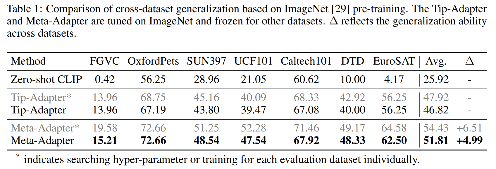

* Tab. 1 에 나타나듯이, ImageNet 에서 search 한 hyper-parameter 를 고정한 채 다른 7 개 dataset 에 대해 Tip-Adapter 성능을 직접 평가하면, dataset 간 distribution 이 다를 때 일반화 성능이 저하되는 것을 확인할 수 있다. 
* Dataset 마다 개별적으로 search 한 경우에 비해, Tip-Adapter 의 성능이 눈에 띄게 하락한다.

## 3.2 Meta-Adapter

일반화 성능 저하 문제를 해결하기 위해, 저자는 Tip-Adapter 의 hand-crafted modulation function 과 searching strategy 를 learnable 한 Meta-Adapter 로 대체한다. Tip-Adapter 와 달리, 저자는 few-shot learning 을 visual-language scheme 내에서 few-shot image sample 의 guidance 를 받아 textual feature 에 작용하는 learnable filter 로 모델링하여, 더 구별력 있는 category embedding 을 얻는다. 이는 computer vision 의 non-local filter 에서 영감을 받아, *gated multi-head attention mechanism* 기반의 Meta-Adapter 로 구현된다.

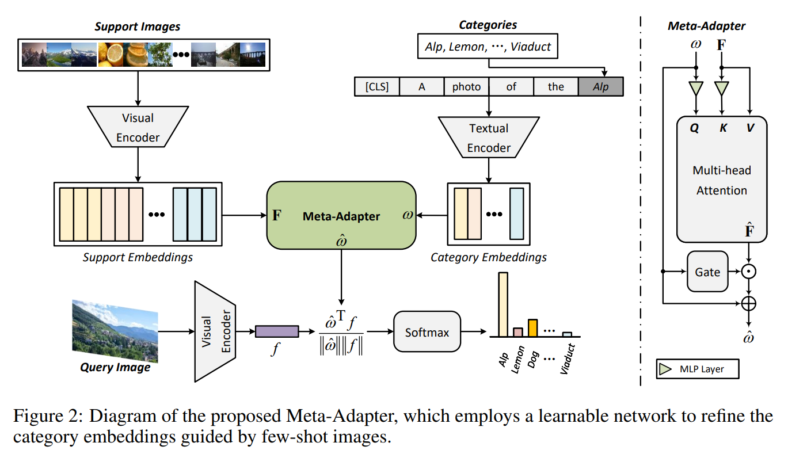

* Fig. 2 에서 보이듯, CLIP encoder 를 통해 먼저 few-shot image 의 support embedding 과 category embedding 을 추출한다. 
* Meta-Adapter 는 이후 visual feature 로부터 few-shot knowledge 를 추출하여 textual feature 로 전달함으로써, 정제된 category embedding 을 얻는다. 
* 구체적으로, original category embedding 을 query 로, support embedding 을 key 와 value 로 사용하여 multi-head attention block 에 입력한다. 
* standard transformer encoder 와 달리, 저자의 접근법은 query 와 key 에 대해서만 Multilayer Perceptron (MLP) layer 를 적용한다. 이는 value 에 대해 feature 변환을 수행하지 않으므로, training 후에도 zero-shot 성능이 일반적으로 변하지 않게 하는 중요한 전략이다.

제안한 Meta-Adapter 의 predicted logits 는 다음과 같이 표현된다.

$$
\text{logits}(y_c = i \ | \ x) = \frac{\hat{w}_i^\top f}{\|\hat{w}_i\| \ \|f\|}, \quad \text{where} \quad \hat{w} = \text{MetaAdapter}(w, F). \tag{3}
$$

여기서 $\hat{w}$ 는 정제된 category embedding 이다. 

Fig. 2 오른쪽에서 보듯, 제안한 방법은 category 와 few-shot image 간의 affinity 에 따라 support embedding 을 적응적으로 집계한다. 이 과정은 cross-attention mechanism 으로 구현될 수 있다.

$$
\hat{F} = F^\top \ \sigma \left( \frac{(F W_1^\top) (w W_2^\top)^\top}{\sqrt{D}} \right), \tag{4}
$$

* 여기서 $W_1$ 과 $W_2$ 는 MLP layer 의 weight 를 나타내며, 
* $\sigma$ 는 Softmax function 이고, 
* $\hat{F}$ 는 집계된 support feature 를 의미한다. 

직관적으로, non-local filter 와 유사하게 Meta-Adapter 는 category 설명과 더 관련 있는 sample 에 집중하면서 outlier sample 은 무시할 수 있어, 더욱 견고한 feature representation 을 제공한다.

또한, few-shot learning 에서 textual feature 와 visual feature 의 중요도는 data distribution 에 따라 다르다. 따라서, 저자는 modulation scalar 를 생성하는 learnable gating block $g(\cdot)$ 을 제안하여, category embedding 과 집계된 support embedding 간 비율을 적응적으로 제어한다. 이에 따라, 정제된 category embedding 은 다음과 같이 구할 수 있다.

$$
\hat{w} = w + g(w) \odot \hat{F}, \tag{5}
$$

여기서 $\odot$ 는 Hadamard product 를 나타낸다. Few-shot sample 학습을 통해 gating block 은 category description 에 따라 비율을 조정할 수 있으며, 이를 통해 few-shot knowledge 와 zero-shot knowledge 를 효과적으로 통합할 수 있다.

## 3.3 Comparison with Counterparts

CLIP-Adapter 나 CoOp 같은 offline 방법과 비교하면, 

* 제안한 Meta-Adapter 는 target sample 에 대한 추가 fine-tuning 이 필요하지 않아 inference 시 계산 비용을 크게 줄인다. 
* 또한, Tip-Adapter 와 같은 online 방법과 비교하면, 제안 기법은 handcrafted hyper-parameter search 과정을 support sample 기반의 learnable network 로 대체한다. 
* Tab. 1 에서 보이듯, Meta-Adapter 는 over-fitting 문제를 더 효과적으로 완화하고, 추가 fine-tuning 없이도 dataset 간 generalization 을 보여준다. 더 나아가, Meta-Adapter 는 textual embedding feature 의 차원을 변경하지 않고 직접 정제하기 때문에, CLIP 기반의 다양한 downstream task 에 자연스럽게 적용될 수 있다.

# 4 Experiments

training set 과 testing set 의 distribution 은 동일할 수도, 다를 수도 있으며, Meta-Adapter 가 두 상황 모두에서 잘 작동하는 것이 중요하다. 또한, Meta-Adapter 의 downstream task 에서의 잠재력도 매우 중요하다. 저자는 이 세 가지 상황을 각각 “*cross-category generalization*”, “*cross-dataset generalization*”, “*cross-task generalization*” 이라 부른다.

구체적으로, “*cross-category generalization*” 을 위해 각 dataset 의 전체 category 를 Zero-shot CLIP 이 예측한 per-category accuracy 에 따라 base set 과 novel set 으로 분할한다. 이때 base set 은 easy sample, novel set 은 hard sample 을 포함한다. 이러한 dataset 분할 전략은 dataset-irrelevant 접근 방식을 학습할 수 있는지를 검증하기 위해 특히 어려운 상황을 시뮬레이션하며, hard sample 에 대한 성능을 중점적으로 확인한다.

#### Datasets

cross-category generalization 실험에는 8 개의 대표적인 image classification dataset 을 사용한다: ImageNet, FGVCAircraft, OxfordPets, SUN397, UCF101, Caltech101, DTD, EuroSAT. 이들은 다양한 classification task 를 포함한다.
cross-dataset generalization 실험에서는 ImageNet 을 source dataset 으로 사용하고, ImageNet-A, ImageNet-R, ImageNet-Sketch 의 세 가지 변형을 target dataset 으로 사용한다. 또한, Meta-Adapter 의 open-vocabulary detection 잠재력을 탐구하기 위해 LVIS dataset 에서 실험을 수행한다.

#### Baselines

Meta-Adapter 는 training-free 방법인 Zero-shot CLIP 과 Tip-Adapter 와 비교한다.

#### Training Details

CLIP backbone 으로는 대부분의 실험에서 visual encoder 로 ResNet50, textual encoder 로 transformer 를 사용한다. Prompt ensemble 전략을 채택하여, 7 개의 template 을 CLIP textual encoder 에 입력한 뒤 평균하여 최종 prompt embedding 으로 사용한다. Meta-Adapter 는 base set 에 대해 batch size 64 로 학습하며, AdamW optimizer 와 learning rate 0.0001, cosine scheduler 로 5 epoch 동안 학습한다.

## 4.1 Cross-Category Generalization

경험적 연구에 따르면, Tip-Adapter 는 특정 dataset 에 적용될 때 일반적으로 큰 hyper-parameter $(\alpha, \beta)$ 값을 필요로 한다. 이 hyper-parameter 는 classification distribution 을 smoothing 하고 few-shot knowledge 에 큰 가중치를 부여하는 데 사용된다. 이는 Tip-Adapter 가 ImageNet 과 같이 비교적 일반적인 dataset 에 대해서도 few-shot knowledge 에 크게 의존함을 의미한다. 그 결과, overfitting 문제가 발생하여 일반화 능력이 저하된다.

* Tab. 6 에 따르면, UCF101 과 Caltech101 같은 dataset 에서 Tip-Adapter 는 training set 에서 Meta-Adapter 보다 약간 높은 classification accuracy 를 보인다. 
* 그러나 novel sample 에 대해서는 Tip-Adapter 가 Meta-Adapter 보다 크게 뒤처진다 (e.g., UCF101 에서 40.26% vs 47.72%). 이는 Tip-Adapter 가 과도한 hyper-parameter search 전략 때문에 특정 localized distribution 에 지나치게 맞춰지기 때문임을 시사한다.
* 반면, Meta-Adapter 는 설계상 일반화 가능한 ensemble 접근 방식을 사용하므로 base set 에서도 유사한 성능을 유지하면서 novel set 에서 우수한 성능을 보인다. 
* Fig. 1(b) 에서 보이듯, ImageNet dataset 에서 Meta-Adapter 는 다른 방법들보다 우수하다. 
* Zero-shot CLIP 대비, 모든 few-shot 설정에서 일관되게 더 높은 성능을 보인다. 
* Tip-Adapter 와 비교하면, 두 방법 모두 shot 수가 증가함에 따라 성능이 향상되지만, shot 수가 4 미만일 때 Tip-Adapter 가 소폭 우세하다. 이는 두 가지 이유 때문이다.
  1. Tip-Adapter 는 few-shot feature 와 해당 one-hot label 로부터 직접 classification logits 를 계산하므로, Meta-Adapter 의 일반적 ensemble 접근 방식보다 더 단기적인 해결책이 될 수 있다.
  2. Tip-Adapter 는 특정 dataset 에서 최고 accuracy 를 찾기 위한 hyper-parameter search 전략을 사용하여 few-shot knowledge 의 잠재력을 적극적으로 활용한다.
* 그러나 shot 수가 증가하면, Meta-Adapter 는 Tip-Adapter 를 명확히 앞서며, classification accuracy 가 꾸준히 상승하는 반면, Tip-Adapter 는 shot 수가 32 일 때 성능이 하락하여 성능 한계 가능성을 시사한다. 
* Fig. 1(a) 에서 보이듯, 16-shot 설정에서 다른 7 개 dataset 에 대한 정량적 비교에서 Meta-Adapter 는 Zero-shot CLIP 대비 큰 폭의 accuracy 향상을 보이며, Tip-Adapter 대비 최대 +7.46% 까지 성능 향상을 달성한다. 

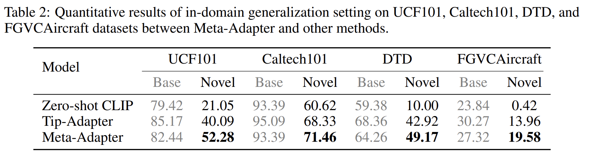

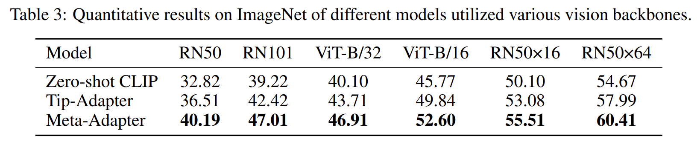

Meta-Adapter 의 효과성을 추가로 검증하기 위해, 모든 방법에 대해 서로 다른 visual encoder 를 적용하고 ImageNet 에서 실험을 수행했다. 

* Tab. 3 의 정량적 비교 결과, visual encoder 선택과 관계없이 Meta-Adapter 는 Tip-Adapter 대비 우위를 유지한다. 
* 더 고급 backbone (e.g., ViT-B/16) 을 사용하면 Meta-Adapter 의 classification accuracy 는 더욱 향상된다. 
  * 이는 더 강력한 vision-language model 을 사용하면 Meta-Adapter 의 학습 잠재력이 향상될 수 있음을 시사한다.

요약하면, 기존 training-free 방법과 비교했을 때 Meta-Adapter 는 over-fitting 문제를 효과적으로 완화하면서도 우수한 일반화 능력을 유지하며, novel set 에서 SOTA classification accuracy 를 달성한다.

## 4.2 Cross-Dataset Generalization

학습된 classifier 가 서로 다른 distribution 을 가진 다양한 dataset 을 다룰 때도 유사한 성능을 유지하는 것은 매우 중요하다. 이는 dataset 간 appearance 와 shape 이 완전히 다를 수 있기 때문에 (e.g., ImageNet 의 object recognition 과 DTD 의 texture classification) 더 어려운 문제다. 또한, Meta-Adapter 가 dataset-irrelevant 한 구별력 있는 ensemble 접근 방식을 학습할 수 있는지도 확인하고자 한다.

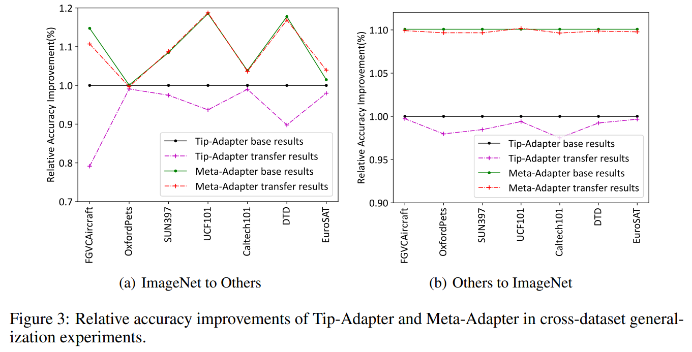

이를 위해, Tip-Adapter 의 경우 source dataset 에서 search 한 최적 hyper-parameter 를 target dataset 에 그대로 적용하고, Meta-Adapter 의 경우 source dataset(base set) 에서 학습한 뒤 모든 learnable parameter 를 freeze 한 상태로 target dataset(novel set) 에서 평가한다. 두 실험 모두 16-shot 설정에서 수행된다. Fig. 3(a) 에는 ImageNet(전체 category 사용)에서 다른 7 개 dataset 으로 transfer 했을 때의 상대 accuracy 향상을 보고한다. 

* Fig. 3(a) 에서 Tip-Adapter 의 base 결과를 baseline 으로 설정했으므로, 해당 상대 accuracy 향상 값은 항상 1.0 이다.
* ImageNet 이 다양한 class(e.g., 여러 종류의 동물, 차량 종류)를 포함하므로, 두 모델 모두 counterpart 와 비교해 유사한 accuracy 를 유지하는 것은 놀랍지 않다. 
* 그러나 Tip-Adapter 는 Meta-Adapter 대비 명확한 성능 저하를 보인다. 
  * 특히, ImageNet 에서 SUN397, UCF101, EuroSAT 으로 transfer 할 경우, target dataset 에 직접 학습한 baseline 을 초과하는 성능을 보이며, 
  * 이는 Meta-Adapter 의 학습 잠재력이 일반화된 dataset 으로부터 이익을 얻을 수 있음을 시사한다.
* 또한 Fig. 3(b) 에는 OxfordPets, Caltech101 등 7 개의 소규모 classification dataset (전체 category 사용)에서 ImageNet 으로 transfer 했을 때의 상대 accuracy 향상을 보고한다. 
* 놀랍게도, Meta-Adapter 는 안정적인 성능을 유지하지만, Tip-Adapter 는 특히 OxfordPets 와 Caltech101 에서 명확한 성능 저하를 보인다. 
  * 따라서 Meta-Adapter 가 다양한 distribution 과 domain shift 상황에서 더 나은 transferability 를 유지한다고 결론지을 수 있다.

추가로, CoCoOp 와 동일하게 domain generalization 실험을 수행한다. 사람은 자연스럽게 out-of-distribution data 에 일반화할 수 있는 능력을 갖고 있으며, Meta-Adapter 가 동일한 장점을 가질 수 있는지가 궁금하다. 이를 위해, Tip-Adapter 의 경우 ImageNet 에서 search 한 최적 hyper-parameter $(\alpha, \beta)$ 를, Meta-Adapter 의 경우 ImageNet 에서 search 및 최적화한 weight 를 각각 세 가지 변형 dataset (ImageNet-A, ImageNet-R, ImageNet-Sketch) 에 그대로 transfer 한다. 또한, Zero-shot CLIP 의 세 dataset 에 대한 성능을 baseline 으로 보고한다.

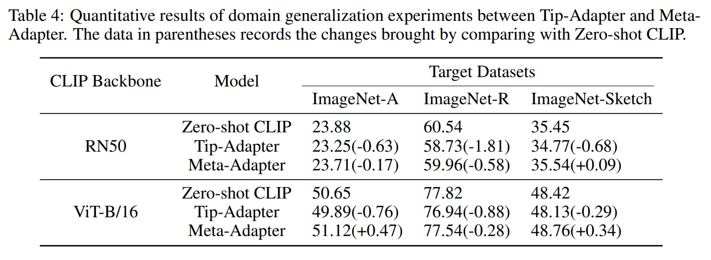

* Tab. 4 의 정량적 결과에서 보듯, ImageNet 에서 search 한 Tip-Adapter 의 최적 hyper-parameter 를 변형 dataset 에 직접 적용하면 성능이 떨어지며, Zero-shot CLIP 보다도 낮아진다. 
  * 이는 Tip-Adapter 가 hyper-parameter 설정에 민감하고, 심각한 over-fitting 문제를 겪는다는 이전 분석과 일치한다. 
* 반면, Meta-Adapter 는 domain shift 에 더 잘 적응하며, Zero-shot CLIP 과 유사한 성능을 보여준다.

## 4.3 Cross-Task Generalization

few-shot learning 방법이 downstream task 에서도 이점을 제공할 수 있는지는 중요한 문제다. 이를 위해, 저자는 Meta-Adapter 와 Tip-Adapter 를 open-vocabulary object detection 방법인 ViLD 와 통합한다. ViLD 는 CLIP 을 활용하여 open-vocabulary 가능성을 탐구하며, object detection framework 의 일반적인 classifier 를 CLIP 의 text encoder 로 생성된 textual feature 로 대체하고, knowledge distillation 을 통해 textual feature 와 ROI feature 를 정렬한다.

먼저 LVIS 의 annotation 을 기반으로 pre-processed region feature 를 few-shot sample 로 생성한다. ViLD 의 방식에 따라, LVIS dataset 의 object category 는 training set 내 빈도에 따라 “frequent”, “common”, “rare” 로 구분된다. 이 중 866 개 frequent 와 common category 를 base set 으로, 337 개 rare category 를 novel set 으로 사용한다. Tip-Adapter 의 경우, ViLD 의 prediction logits 에 추가적인 few-shot term 을 더해 수정한다.

$$
\text{logits}(\hat{r}) = f(\hat{r}) W^\top + \alpha \cdot \phi(f(\hat{r})F^\top) L, \quad \phi(x) = \exp(-\beta(1 - x)) \tag{6}
$$

* 여기서 $f(\hat{r})$ 는 proposal $\hat{r}$ 의 region feature, 
* $\phi(\cdot)$ 는 Tip-Adapter 에서 사용된 modulation function, 
* $F$ 와 $L$ 은 각각 few-shot region feature 와 해당 one-hot label 을 나타낸다. 
* Eq. 6 은 ViLD 에서 소개된 ViLD-text 와 ViLD-image 모두에 적용된다.

Tip-Adapter 의 hyper-parameter $(\alpha, \beta)$ 설정과 관련하여, ImageNet 에서 search 한 값을 그대로 사용하면 ViLD 가 collapse 되는 현상이 나타났다. 따라서 $\alpha = 0.05$, $\beta = 1$ 로 설정하여, ViLD 가 collapse 를 피하고 CLIP knowledge 에 더 의존하도록 한다. Meta-Adapter 의 경우, ImageNet 으로 pre-train 한 모델을 사용하여 LVIS few-shot knowledge 를 원본 textual feature 에 통합한다. ViLD 는 DetPro 에서 제안한 재구현 버전을 사용하며, pre-trained ResNet-50 을 self-supervised pre-trained SoCo 로 대체한다.

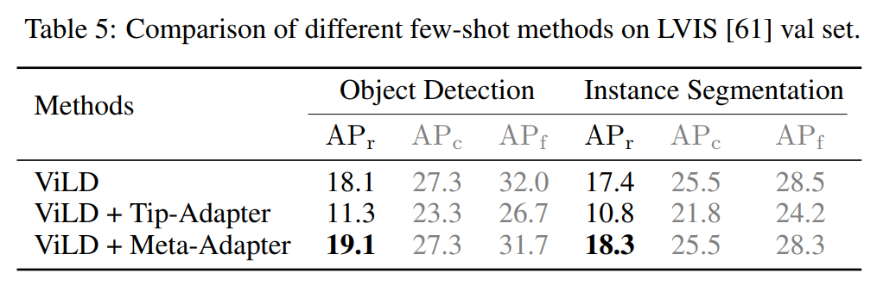

* Tab. 5 의 평균 precision 결과에서, Meta-Adapter 는 rare category 의 detection 성능을 명확하게 향상시키지만, Tip-Adapter 는 poor transferability 와 ViLD 의 원래 prediction score 를 수정해야 하는 구조적 특성 때문에 detection 성능을 저하시킨다. 
* 또한, LVIS annotation 의 일부는 크기가 약 $10 \times 10$ 픽셀인 작은 bounding box 를 포함하고 있어, LVIS few-shot dataset 의 품질이 image classification counterpart 만큼 좋지 않을 수 있다. 
* 앞서 언급했듯, Tip-Adapter 는 few-shot knowledge 에 과도하게 의존하므로 open-vocabulary object detection 에서 성능 저하의 주요 원인이 될 수 있다. 
* 반면, Meta-Adapter 는 일반적인 ensemble 접근 방식을 학습하며, prediction score 공식을 변경하지 않고도 open-vocabulary object detection 방법에 쉽게 통합될 수 있다.

## 4.4 Comparison with Offline Methods

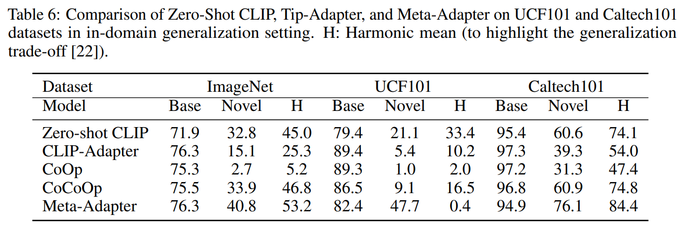

* Tab. 6 에서 제안한 Meta-Adapter 와 다른 offline 방법(CoCoOp, CoOp, CLIP-Adapter) 간의 ablation study 를 제공한다. 
* 공정한 비교를 위해, CoCoOp 과 유사하게 base-to-novel generalization 설정을 사용한다. 결과적으로, 제안한 방법은 novel class 일반화에서 뚜렷한 장점을 보이며, 예를 들어 ImageNet 에서 CoCoOp 대비 6.9% 향상된다.
* 또한, 이전 연구와 동일하게 base 와 novel class 의 전체 성능을 측정하기 위해 Harmonic Mean 을 도입한다. 
* 결과에서 제안한 방법이 전반적인 성능 측면에서도 명확한 우위를 보임을 확인할 수 있다. 
* 더 중요한 점은, 제안한 방법은 새로운 dataset 이나 task 에 적용할 때 추가 fine-tuning 이 필요하지 않다는 것이다.

## 4.5 More Ablation Studies of the Meta-Adapter

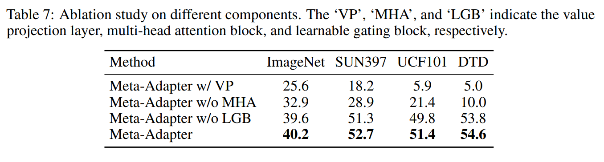

* Tab. 7 의 결과에서 보듯, multi-head attention 이 accuracy 향상에 가장 크게 기여한다. 
* 제안한 learnable gating block 은 성능을 추가로 향상시키지만, value projection 을 도입하면 generalization 능력이 감소한다. 

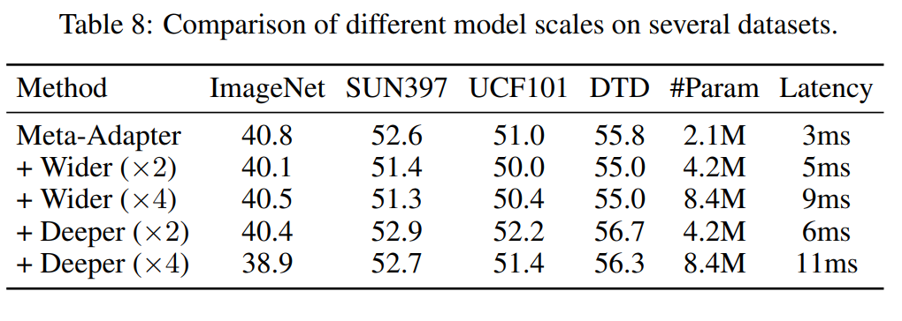

* 또한, Tab. 8 에서는 projection layer 의 폭을 넓히는 방법(Wider)과 여러 모듈을 연속적으로 쌓는 방법 (Deeper)으로 meta-adapter 의 model scale 을 증가시켰다. 
* 결과적으로, 모듈 수를 늘리면 parameter 수와 accuracy 가 소폭 향상되지만, 효율성이 크게 떨어진다.

# 5 Limitations and Conclusion

#### Limitations

Tab. 6 의 결과에 따르면, Zero-shot CLIP 의 classification accuracy 가 높은 경우(UCF101, Caltech101)에는 Meta-Adapter 의 학습 잠재력이 제한될 수 있음을 확인할 수 있다. 이는 image-image similarity score 와 text-image similarity score 의 결합이 few-shot learning 의 잠재력을 저해할 수 있기 때문이다. 다시 말해, 이러한 상황에서 Meta-Adapter 는 few-shot knowledge 보다 zero-shot knowledge 를 선호하게 되어 두 지식 간 균형이 무너질 수 있다.

또한, 경험적 연구에 따르면, Meta-Adapter 는 high-quality few-shot dataset 확보가 어려운 open-vocabulary semantic segmentation task 에 적용하는 데 어려움을 겪는다. 외부 데이터를 통합하는 방식이 이러한 문제를 완화하는 데 도움이 될 가능성이 있다. 이러한 도전 과제는 향후 연구 과제로 남겨둔다.

#### Conclusion

본 논문은 CLIP 을 위한 새로운 few-shot learning 방법인 Meta-Adapter 의 잠재력을 입증했다. Meta-Adapter 는 이전 방법들의 일반화 능력 저하와 낮은 효율성 문제를 해결하도록 설계되었으며, meta-testing mechanism 과 lightweight residual-style network 를 활용해 few-shot sample 로부터 추가 fine-tuning 없이 지식을 추출한다. 이를 통해 over-fitting 문제를 완화하면서도 높은 효율성을 유지한다.

Meta-Adapter 는 image classification, object detection, segmentation 을 포함한 다양한 task 에서 우수한 성능을 보였으며, dataset 및 task 전반에서 뛰어난 generalization 능력을 입증했다. 향후 연구에서는 Meta-Adapter 를 더욱 정교화하고, 다른 vision task 에서의 잠재적 활용 가능성을 탐구함으로써 visual concept modeling 분야의 few-shot learning 기법 발전을 도모할 수 있다.
