논문 및 이미지 출처 : <https://aclanthology.org/2023.emnlp-main.629.pdf>

# Abstract

input text prompt 의 선택은 CLIP 과 같은 Vision-Language Pretrained (VLP) model 의 성능에 중요한 역할을 한다. 저자는 Vision-Language model 을 위해 Adapter 와 Prompt learning 을 결합한 **unified multi-modal approach** 인 APoLLo 를 제안한다. 이 방법은 few-shot setting 에서 fine-tuning 될 때 VLP model 의 generalization 능력을 크게 향상시키도록 설계된다. 

vision encoder 와 language encoder 와 함께 trainable cross-attention 기반 adapter layer 를 도입하여 두 modality 간 alignment 를 강화한다. 또한, augmented input 을 받는 각 encoder branch 간의 일관성을 강제하여 downstream task 에서 overfitting 을 방지한다. 

저자의 방법은 세 가지 대표적인 task — novel class 에 대한 generalization, cross-dataset evaluation, unseen domain shift — 에 대해 평가된다. 실제로 APoLLo 는 10 개의 다양한 image recognition dataset 에서 novel class 에 대해 MaPLe (SOTA) 대비 최대 6.03% 의 상대적 성능 향상을 달성한다.

# 1 Introduction

최근 몇 년간 large-scale pre-trained language model 과 visual model 의 성공은 multi-modal downstream task 를 위한 pre-trained Vision-Language model 의 급격한 증가로 이어졌다. 이러한 VLP model (e.g., CLIP) 은 일반화 성능 면에서 상당히 성공적이지만, few-shot learning 기반 downstream task 에 대해 fine-tuning 하기에는 어려움이 크다. 이는 model 의 대규모 파라미터 수와 학습 데이터 부족이 결합된 결과이다. 최근 연구에서는 prompting 과 adapter 기법을 도입하여 이러한 model 을 fine-tuning 하는 방법을 제안한다. prompting 은 하나 이상의 modality 에 tunable embedding parameters 를 삽입하는 방식이고, adapter 는 보통 prediction head 근처에 in-situ 조정을 추가하는 방식이다.

이러한 fine-tuning 기반 방법들이 효과적이긴 하지만, 최근 연구에서는 pre-training 단계에서 획득한 유용한 knowledge 를 충분히 활용하지 못하고 downstream task 에 overfitting 되는 문제를 지적한다. 특히 text-based prompt learning 연구는 많지만, visual pipeline 에 대한 연구는 여전히 미흡하다.

**Main Results:** 저자는 few-shot 환경에서의 일반화 문제를 해결하기 위해 VLP model 에 대한 unified adapter 및 prompt learning Approach 인 APoLLo 를 제안한다. intra-modal encoder 간의 일관성을 consistency-guided contrastive loss 를 사용하여 강제하며, 이를 통해 query 와 의미적으로 유사한 negative in-batch key 간의 연관성을 학습하도록 한다. 또한 cross-modal alignment 를 강화하기 위해 modality-specific adapter layer 에 cross-attention 을 적용하여 multi-modal feature 인식 능력을 향상시킨다. 다양한 recognition dataset 에 대한 실험 결과는 제안 방법의 효율성을 입증한다.

본 연구의 주요 기여점은 다음과 같다.

1. 저자의 방법은 adapter 와 prompt tuning 을 VLP model (e.g., CLIP) 에서 통합적으로 결합한 최초의 방법이다. 이를 통해 zero-shot generalization 을 유지하면서 few-shot 환경에서 새로운 task 를 학습할 수 있다.
2. LLM 을 활용하여 text branch 에서 descriptive text 를 augmented sample 로 생성하고, text-conditioned diffusion model 을 사용하여 image branch 에서 image augmentation 을 생성하는 새로운 multi-modal augmentation 전략을 제안한다.
3. multi-modal cross-attention adapter layer 의 새로운 적용을 통해 text-guided visual feature 와 visual-guided text feature 를 생성하여 두 modality 간의 gap 을 해소하고 시너지를 촉진한다.
4. 10 challenging datasets 에 대한 광범위한 평가에서 APoLLo 는 기존 방법을 크게 능가하며 base-to-novel generalization, cross-dataset recognition, domain generalization 등 다양한 downstream task 에서 새로운 SOTA 를 달성한다.

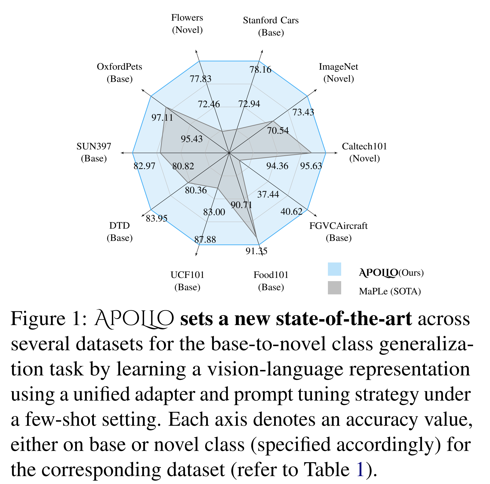

# 2 Related Works

## 2.1 Vision Language Models

최근 연구에서는 image-text pair 를 효과적으로 활용하면 VLP model 이 unimodal framework 와 비교했을 때 관련 downstream task 에서 매우 우수한 성능을 달성할 수 있다는 점을 보여준다. 예를 들어, CLIP, ALIGN, Florence 와 같은 model 은 다양한 few-shot 및 zero-shot visual recognition task 에서 탁월한 성능을 발휘한다. 그러나 이러한 model 은 복잡한 downstream task 에 적용하기에는 실용성이 떨어진다. 

기존 연구에서는 object detection 과 few-shot image recognition 을 위해 특별히 설계된 접근 방식을 제안했으며, 이는 off-the-shelf VLP model 에 비해 훨씬 더 나은 성능을 보였다. 본 논문에서는 CLIP 기반 model 이 few-shot 및 zero-shot visual recognition task 에서 잘 generalize 할 수 있도록 unified adapter 및 prompt learning 을 위한 새로운 image 및 text augmentation 기반 기법을 제안한다.

## 2.2 Prompt Tuning

Prompt tuning 은 downstream task 에 대한 이해를 높이기 위해 input text 앞에 language instruction 을 추가하는 것을 의미한다. 예를 들어, ‘a photo of a \<CLASS\>’ 와 같은 fixed template 대신, task-specific 한 additional information 을 제공하면 model 에 더 도움이 될 수 있다. 이러한 tuning 기반 방법은 전체 finetuning 과 유사한 성능을 달성하면서도 파라미터 수를 약 1000 배 줄일 수 있다. 

* Context Optimization (CoOp) 은 hand-crafted prompt 를 learnable soft prompt 로 대체하는 방식을 제안했지만, zero-shot setting 에서는 일반화 능력이 부족하고 성능이 최적 수준에 미치지 못한다. 
* CoCoOp 은 prompt tuning 을 통해 image-conditional context 와 text conditioning 을 함께 생성하며, ProDA 는 prompt 의 사전 분포 학습을 통합한다. 
* ProGrad 는 gradient 가 기존 prompt 의 지식과 정렬되도록 prompt update 를 수행한다. 
* 최근 연구에서는 multi-modal prompting (image + text) 기법을 사용하여 modality 간의 자연스러운 연관성을 활용하고 있다.

## 2.3 Adapter Tuning

Adapter 기반 방법은 pre-trained model 에 additional tranable parameters 를 삽입하여 downstream task 에 맞춤 학습을 가능하게 한다. 기존 연구에서는 prediction head 근처에 additional layer 를 도입하여 pre-trained model 을 보강하는 방식을 사용했다. CV task 를 위한 초기 adapter 방법은 incremental learning 과 domain adaptation 접근법에서 시작되었다. APoLLo 는 adapter 와 prompting 을 결합하여 downstream task 에서의 성능을 향상시키고, contrastive-consistency loss 를 통해 model 의 일반화 능력을 보장한다.

# 3 Methodology

## 3.1 Brief Review of CLIP

기존 Vision-Language model 중 CLIP 은 zero-shot image recognition 에서 강력한 일반화 성능을 보인다. multi-modal framework 로서 image encoder 와 text encoder 모듈로 구성되며, 본 연구에서는 transformer 기반 image encoder $\theta$ 와 text encoder $\phi$ 를 사용한다.

### 3.1.1 Image Encoder

저자의 patch-based image embedding module 은 $K$ transformer layers 로 구성되며, input image 를 $M$ fixed-sized patch 로 분할한 뒤 patch embedding $\mathcal{E}_0 \in \mathbb{R}^{M \times d_v}$ 로 변환한다. patch embedding $\mathcal{E}_i$ 는 learnable class token $c_i$ 와 함께 다음 transformer block 으로 전달된다 ($i \in {1, \dots, \mathcal{K}}$).

$$
\begin{equation}
    [c_{i+1}, \mathcal{E}_{i+1}] = \theta_{i+1}([c_i, E_i])
\end{equation}
$$

last transformer layer 의 class token $c_K$ 는 공통 latent space 로 projection 되어 final image representation $u$ 를 생성한다.

$$
\begin{equation}
u = \mathcal{I}Proj(c_\mathcal{K}), \quad u \in \mathbb{R}^{d_{vl}}
\end{equation}
$$

### 3.1.2 Text Encoder

Text encoder 는 word sequence 를 tokenizing 하여 feature embedding 을 생성한다. $(i+1)^{th}$ step 에서 $\mathcal{W}_i$ 가 transformer text encoder 로 입력된다.

$$
\begin{equation}
[\mathcal{W}_{i+1}] = \phi_{i+1}(\mathcal{W}_i), \quad \forall i \in {1, \dots, \mathcal{K}}
\end{equation}
$$

last transformer block $\phi_K$ 의 text embedding $w_K$ 는 shared latent space 로 projection 되어 final text representation $v$ 를 얻는다.

$$
\begin{equation}
v = \mathcal{T}Proj(w_K), \quad v \in \mathbb{R}^{d_{vl}}
\end{equation}
$$

### 3.1.3 Zero-Shot Classification

Zero-shot inference 시, class label $y \in {1, 2, \dots, C}$ 에 대한 text prompt 가 제공된다. input image $x$ 와 각 class text embedding $v_i$ 간 cosine similarity $sim(\cdot)$ 를 계산하고, temperature parameter $\tau$ 를 사용하여 highest cosine similarity $\hat{y}$ 를 선택한다.

$$
\begin{equation}
p(\hat{y} \mid x) = \frac{\exp(sim(u, v_{\hat{y}})/\tau)}{\sum_{i=1}^C \exp(sim(u, v_i)/\tau)}
\end{equation}
$$

이러한 template 기반 접근은 domain 전반에서 최적의 결과를 내지 못했다. 이를 해결하기 위해 CoOp 은 hand-crafted prompt 대신 learnable context vector 를 사용하여 task-specific text embedding 을 생성하고, 기존 word embedding 과 결합한다. 유사하게 learnable context vector 를 patch embedding 과 concat 하는 방법도 제안되었다. 저자는 MaPLe 을 확장하여 zero-shot classification 환경에서 다양한 downstream task 에 대한 일반화를 보장하는 새로운 multi-modal prompt learning 방법을 제안한다.

## 3.2 Our Approach: APoLLo

기존 방법들은 uni-modal prompt tuning 으로 CLIP 을 fine-tuning 하여 image recognition downstream task 를 수행했다. MaPLe 은 multi-modal prompt tuning 을 사용하는 유일한 방법이지만, 저자는 여기에 새로운 augmentation 전략을 결합한 unified adapter 및 prompt learning 방법을 제안한다. 이를 위해 adapter layer 에 multi-modal cross-attention module 을 추가하여 text 와 image modality 가 정렬되도록 한다.

Text input 은 pre-trained LLM 을 거쳐 더 설명적인 표현을 생성하고, image branch 는 text-conditioned diffusion model 을 사용하여 input image 의 augmentation 을 생성한다.

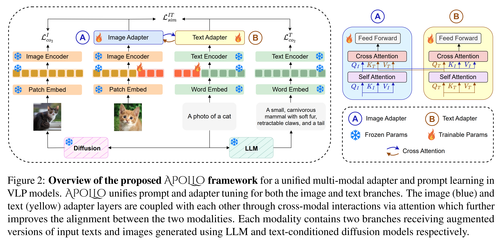

### 3.2.1 Image and Language Prompting

저자는 CLIP 의 image 및 text transformer backbone 의 계층 전반에 걸쳐 learnable token 을 삽입하여 deep image 및 language prompting 을 수행한다. 선행 연구에 따르면, 연속된 transformer block 에서 prompt 를 공유하는 방식이 독립적인 prompt 를 사용하는 것보다 feature 학습에 더 직관적이다.

### 3.2.2 Input Augmentation

최근 generative data augmentation 이 제안되었지만 multi-modal context 에 적용된 사례는 거의 없다. 본 연구에서는 frozen encoder branch 의 input 에 해당 modality 의 augmentation 을 사용하여 regularization 을 추가한다.

* **Text branch**: pre-trained frozen LLM 을 사용하여 주어진 object 에 대한 특징을 설명하는 문장을 생성한다. 예를 들어, ‘a photo of a \<CLASS\>’ template 에서 CLASS 가 Cat 인 경우, LLM 은 ‘a small carnivorous mammal with soft fur, retractable claws, and a tail’ 과 같은 설명을 생성한다. KgCoOp 또한 textual augmentation 을 제안하지만, 여러 문장의 평균 embedding 을 사용하는 반면, 저자는 단일 문장을 on-the-fly 로 생성하여 더 다양하고 간단하게 한다.
* **Image branch**: text-conditioned diffusion 기반 augmentation 을 사용하여 동일 class 의 새로운 이미지를 생성한다.

실험적으로 이 두 개별 prompt module 을 추가하여 실제로 성능이 향상되었다 (Sec. 4.4).

### 3.2.3 Multi-modal Cross-attention Adapter (MCA)

Adapter layer 는 downstream task 적응을 위한 fine-tuning 에서 중요한 역할을 한다. 일반적으로 adapter layer 는 encoder 위에 추가되어 embedding vector 를 변환하는 trainable parameters 이다. 저자는 각 encoder 에 trainable cross-attention 기반 adapter layer 를 두어 inter-modal alignment 를 강화한다.

### 3.2.4 Loss Formulation

저자의 학습 방식은 multi-modal encoder 간 두 가지 loss 를 계산한다.

* **Intra-modal Contrastive Consistency**: 일반적인 contrastive learning 에서는 query 와 다른 in-batch negative 간의 유사성을 무시하여 suboptimal representation learning 을 초래한다. 이를 완화하기 위해 consistency-based contrastive loss 를 사용하여 intra-modal branch 간 일관성을 강제한다.

$$
\begin{equation}
\mathcal{L}_{con} = \alpha_1 \cdot \mathcal{L}^{I}*{CO2} + \alpha_2 \cdot \mathcal{L}^{T}*{CO2}
\end{equation}
$$

실험에서는 $\alpha_1 = \alpha_2 = \alpha$ 로 설정한다.

* **Inter-modal Similarity Maximization**: mini-batch 의 image-text pair 를 encoder 와 adapter layer 를 거친 후, normalized embedding 을 사용해 Image-Text Contrastive (ITC) loss $\mathcal{L}^{IT}_{sim}$ 을 계산한다.

총 loss 는 두 loss 의 가중합으로 계산된다.

$$
\begin{equation}
\mathcal{L}_{total} = \mathcal{L}^{IT}*{sim} + \alpha \cdot \mathcal{L}*{con}
\end{equation}
$$

# 4 Experimental Details

## 4.1 Downstream Tasks

**Base-to-Novel Class Generalization**: zero-shot 평가와 few-shot fine-tuning 을 결합한 base-to-novel generalization 표준 절차를 따른다. dataset 을 base class 와 novel class 로 나누고, model 은 base class 로 학습한 뒤 base 와 novel category 모두에서 평가한다.

**Cross-Dataset Evaluation**: APoLLo 의 zero-shot 일반화 성능을 분석하기 위해 cross-dataset 평가를 수행한다. 이를 위해 ImageNet dataset 으로만 학습된 model 을 다른 9 개 dataset 에 적용한다. 기존 연구와의 일관성을 위해 MaPLe 및 CoCoOp 과 동일하게 few-shot setting 에서 학습을 진행하여 공정한 비교를 수행한다.

**Domain Generalization**: 보다 강력한 평가를 위해, model 의 out-of-distribution 일반화 능력을 분석한다. cross-dataset 평가와 유사하게, ImageNet 으로 학습한 model 을 ImageNetV2, ImageNetS, ImageNetA, ImageNetR 네 가지 변형 dataset 에 적용한다. 이들은 충분한 domain shift 를 포함하는 것으로 알려져 있다.

## 4.2 Datasets

다양한 setting 에서 model 을 폭넓게 평가하기 위해, 총 10 개의 image classification dataset 을 사용하며, 이는 다음과 같은 recognition task 를 포함한다.

* **Object classification**: ImageNet, Caltech 101
* **Fine-grained classification**: OxfordPets, StanfordCars, Flowers 102, Food101, FGVCAircraft
* **Scene recognition**: SUN397
* **Action recognition**: UCF101
* **Texture recognition**: DTD

Domain generalization 평가는 ImageNet 의 네 가지 변형 dataset — ImageNetV2, ImageNetSketch, ImageNet-A, ImageNet-R — 에 대해 수행한다.

## 4.3 Main Results

### 4.3.1 Base-to-Novel Class Generalization

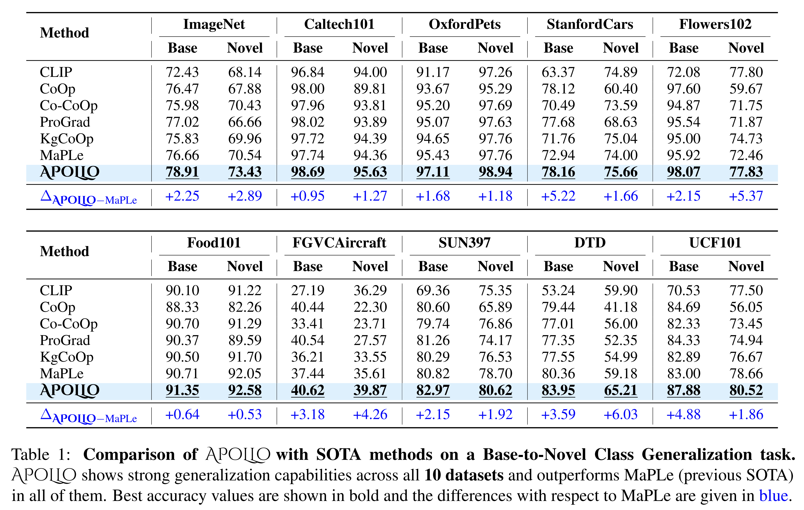

평가는 두 가지로 나눈다.

**Generalization to Unseen Classes**: Tab. 1 에서 제안 방법을 CLIP, CoOp, CoCoOp, ProGrad, KgCoOp, MaPLe 과 novel class 성능에서 비교한다. 실험 결과, 제안 방법은 zero-shot generalization 에서 모든 기존 방법을 상당한 폭으로 능가하며, 최신 baseline 대비 최대 6.03% 의 상대적 향상을 달성한다. 10 datasets 전체에서 novel category 기준 MaPLe 대비 평균 2.69% 향상되었다. 기존 방법 중 MaPLe 을 제외하고는 pre-trained CLIP 을 능가하지 못하는데, 이는 few-shot learning 으로 새로운 task 를 배우면서도 만족스러운 zero-shot 성능을 달성하는 것이 어렵다는 점을 보여준다. 제안 방법은 novel class 에서 CLIP 대비 평균 2.80% 향상되었으며, 이는 vision 과 language modality 간 상호 연관성을 활용하는 unified multi-modal adapter 및 prompting 기법 덕분이다.

**Generalization and Performance on Base Classes**: CoCoOp 은 image-conditioned prompt 를 도입해 CoOp 대비 일반화 성능을 개선하고 상당한 성능 향상을 보였으나, base class 성능에서는 10 개 dataset 중 2 개만 개선되고 평균 성능은 크게 하락했다. 반면, MaPLe 은 대부분의 dataset 에서 CoCoOp 보다 나은 성능을 보였다. CoOp 은 base class 에 과도하게 overfitting 되어 novel class 일반화 성능이 부족하다. 이에 비해 APoLLo 는 이러한 한계를 완화하여 새로운 class 학습 시에도 base class 성능을 안정적으로 유지한다. 제안 방법은 모든 dataset 에서 기존 benchmark 를 능가하며, base category few-shot 성능은 최대 5.22%, 전체 평균은 2.66% 향상되었다. 이는 zero-shot setting 의 향상이 few-shot 성능에 부정적인 영향을 주지 않으며, 그 반대의 경우도 마찬가지임을 시사한다.

# 4.3.2 Cross-Dataset Evaluation

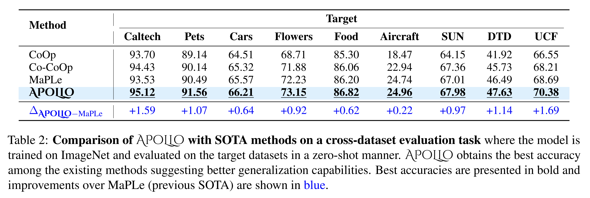

Tab. 2 는 cross-dataset 평가 결과를 보여준다. model 은 ImageNet dataset 으로만 학습하고, zero-shot setting 에서 다른 9 개 dataset 에 대해 평가한다. APoLLo 는 모든 다른 방법을 능가하며, UCF dataset 에서 MaPLe (SOTA) 대비 1.69% 의 zero-shot 최고 향상을 기록했다.

# 4.3.3 Domain Generalization

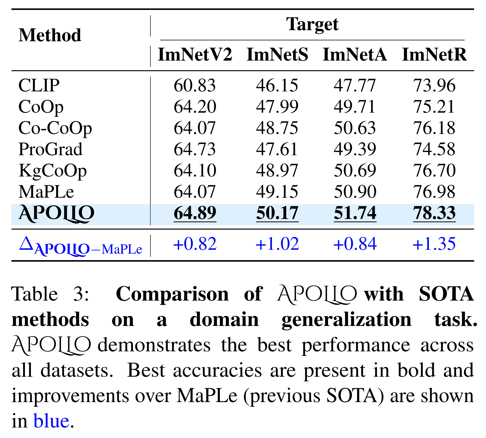

Tab. 3 은 APoLLo 의 domain generalization 결과를 보여준다. ImageNet dataset 을 base 로 사용하고, ImageNetV2, ImageNetS, ImageNetA, ImageNetR 네 가지 변형 dataset 에 대해 model 을 평가한다. 이들은 모두 서로 다른 분포를 가진다. APoLLo 는 모든 기존 baseline 을 능가하며, ImageNetR dataset 에서 MaPLe 대비 1.35% 의 zero-shot 최고 향상을 달성하며 강력한 domain 간 일반화 성능을 보였다.

# 4.4 Ablations

**Impact of Intra-modal Contrastive Consistency, Adapter, and Cross-attention**: APoLLo 의 주요 구성 요소 각각의 중요성을 분석하기 위해 Base-to-Novel Class Generalization task (10 개 dataset 평균 정확도) 결과를 보고한다 (Tab. 4). 주요 구성 요소는 Intra-modal Contrastive Consistency, Adapter Layer, Cross-attention 전략이며, Prompt Learning 은 모든 실험에서 포함된다. Intra-modal consistency 를 사용할 경우 input augmentation 도 함께 적용한다.

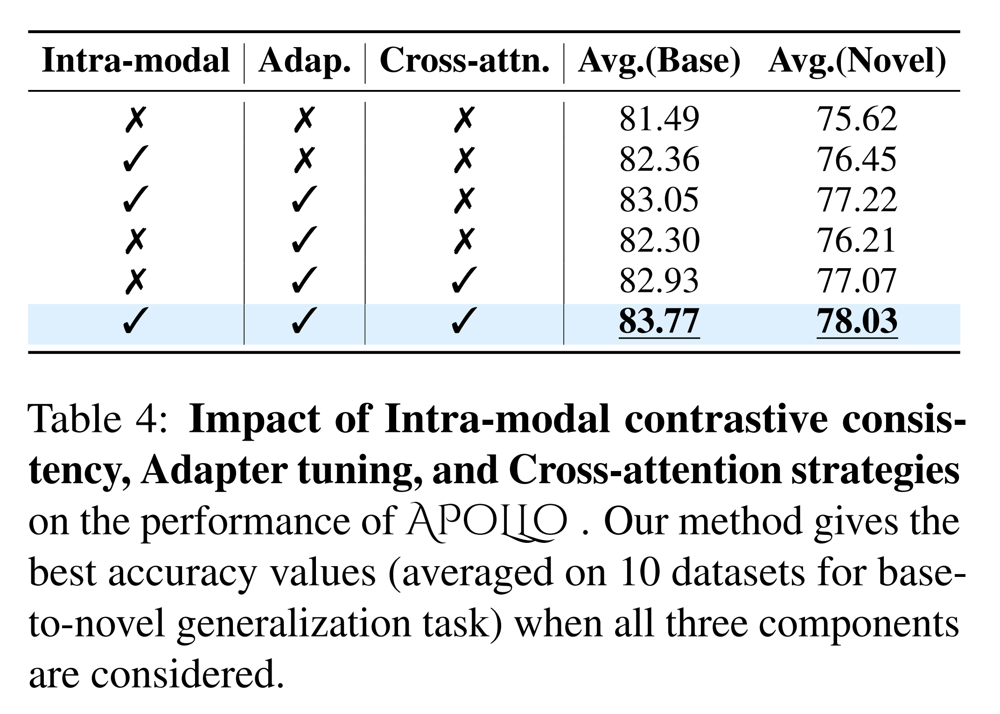

* Prompt learning 만 사용하는 경우(1행) 성능이 가장 낮다.
* Intra-modal contrastive consistency 를 추가하면 base 와 novel 각각 +0.87%, +0.83% 의 성능 향상이 나타난다. 이는 동일 modality 간 상호 시너지가 다양한 dataset 에서 더 나은 generalization 으로 이어짐을 보여준다.
* Intra-modal consistency 에 adapter 를 결합하면 base 와 novel 에서 각각 +0.69%, +0.77% 추가 향상이 나타나 두 기법이 상호 보완적임을 시사한다.
* 마지막으로 adapter layer 에 cross-attention 을 적용하면 base 와 novel 에서 각각 +0.63%, +0.86% 의 추가 향상이 나타난다.

**Impact of Prompt Layers**: base-to-novel generalization task 에서 prompt depth(= prompt layer 수)에 따른 10 개 dataset 평균 성능을 평가했다 (Fig. 3). MaPLe 과 달리 vision encoder 와 language encoder 모두에서 동일한 depth 를 적용했다. 

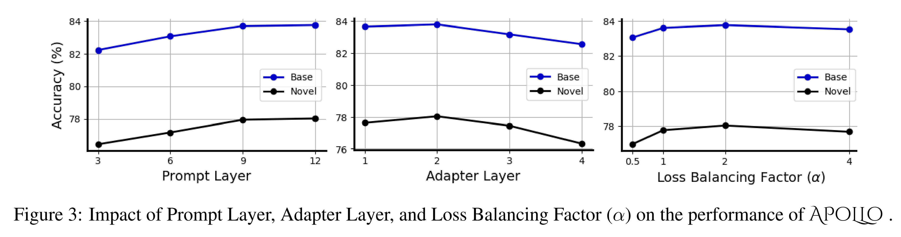

전반적으로 prompt depth 가 증가하면 성능이 향상되는 경향을 보였다. MaPLe 과 달리 prompt depth 가 9 에서 12 로 증가할 때 약간의 정확도 향상이 나타났는데, 이는 adapter layer 와 intra-modal contrastive consistency loss 의 존재로 인해 depth 증가에 따른 부정적인 영향을 완화했기 때문으로 해석된다. 따라서 모든 실험에서 prompt depth 는 12 로 설정했다.

**Impact of Adapter Layers**: adapter 의 중요성을 평가하기 위해 두 가지 전략을 사용했다.

1. **단일 modality adapter**: 개별 modality 에 adapter 를 적용한 경우(text adapter vs image adapter) text adapter 가 더 효과적이었다. 이는 Gao et al. 의 결과와 일치한다. 그러나 저자의 방법에서는 두 modality 모두에 adapter 를 적용했을 때 정확도가 더 높아졌다. 이는 cross-attention 의 존재가 alignment 에 중요한 역할을 하기 때문이며, intra-modal contrastive consistency 또한 중요한 요소임을 보여준다. 이는 naive few-shot tuning 에서는 dual-modality adapter 가 이득이 없지만, cross-attention 과 intra-modal consistency 를 함께 사용하면 더 많은 tunable parameter 를 가진 dual-modality adapter 가 더 나은 일반화를 달성함을 의미한다.

2. **Adapter depth**: adapter layer 수를 4 가지 설정으로 비교했다 (Fig. 3). depth 가 1 에서 2 로 증가하면 성능이 향상되며, 이는 cross-modal alignment 를 통해 두 modality 간 더 복잡한 관계를 학습하기 때문으로 보인다. 그러나 depth 가 2 를 초과하면 성능이 하락하는데, 이는 few-shot setting 에서 overparameterization 이 overfitting 문제를 유발할 수 있음을 시사한다.

# Impact of Input Augmentations

Augmentation 은 서로 다른 branch 간의 일관성을 강화하는 데 중요한 역할을 한다. text augmentation 에 대해서는 **Easy Data Augmentation (EDA)** 와 **LLM 기반 augmentation** 두 가지 전략을 사용했다. Tab. 9 결과, object 에 대해 LLM 으로 생성한 더 설명적인 text 가 EDA 기반 방법보다 intra-modal consistency 학습에 더 효과적이었다.

image augmentation 에 대해서는 **표준 image augmentation**(cropping, flipping, solarization, color inversion 등)과 **text-conditioned diffusion 기반 augmentation** 두 가지를 비교했다. 실험 결과, 후자가 본 연구 환경에서 더 나은 성능을 보였다 (Tab. 9).

# Impact of Loss Balancing Factor

Loss Balancing Factor $(\alpha)$ 의 영향을 분석하기 위해, Base-to-Novel Generalization task 에서 10 개 dataset 의 Base 및 Novel class 평균 정확도를 보고했다. Fig. 3 에 따르면, $\alpha$ 값이 증가하면 intra-modal loss 의 가중치가 inter-modal similarity loss 대비 커져 성능이 향상된다. 최적 결과는 $\alpha = 2$ 에서 나타나, 모든 실험에 이 값을 사용했다. 그러나 intra-modal loss 비중이 과도하게 커지면 cross-modal alignment 가 약화되어 전체 성능이 저하된다.

# Different LLMs as Text Augmentors

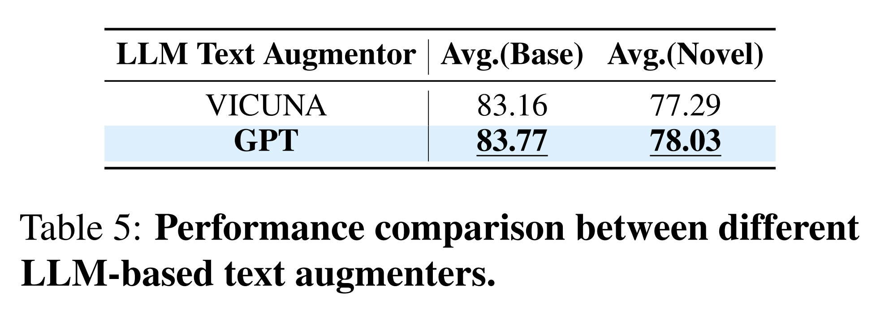

Tab. 5 는 서로 다른 LLM 기반 text augmentation 기법을 적용했을 때 APoLLo 의 성능을 보여준다.

# Adapters on Different Image and Text Branches

본 방법은 두 개의 image branch 와 두 개의 text branch 를 사용한다 (Image Branch 1: augmented image, Image Branch 2: original image, Text Branch 1: original text, Text Branch 2: augmented text). Tab. 6 은 adapter layer 를 서로 다른 image-text branch 조합에 적용했을 때의 결과를 보여준다. 모든 조합은 self-attention 과 cross-attention 을 포함한다.

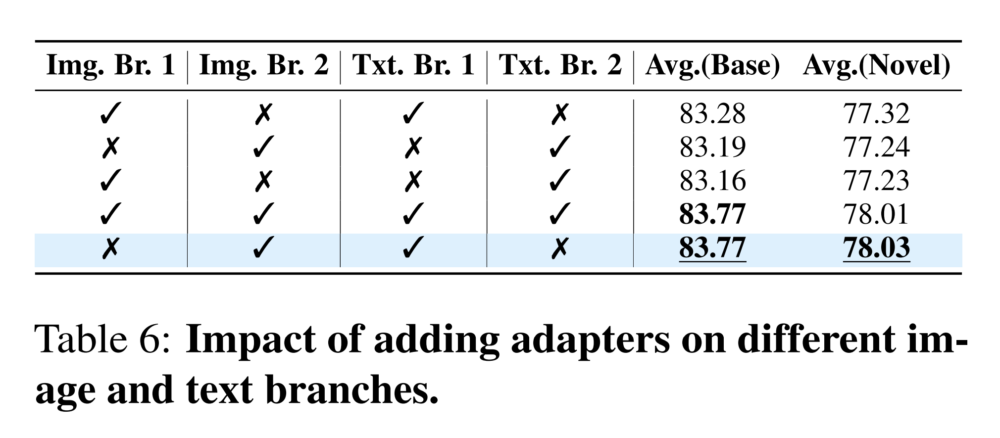

다음 두 경우에서 유사한 정확도가 나타났다.
(a) Image Branch 2 – Text Branch 1 조합
(b) 네 개 branch 모두 사용

그러나 (a) 의 경우 trainable parameter 수가 (b) 의 절반이므로 효율성 측면에서 (a) 를 선택했다. 또한, (a) 조합은 base 와 novel class 평균 정확도에서 가장 높은 값을 기록했다.

# Incorporating Attentions in Adapter Layers

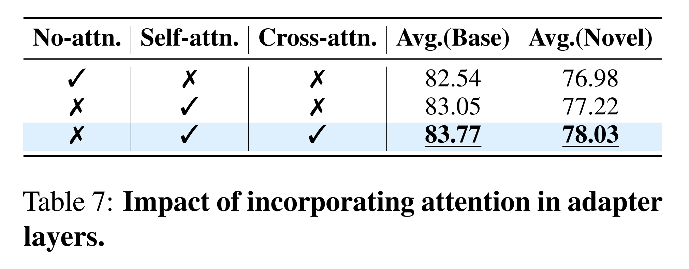

Adapter layer 에 attention 을 포함하는 방식에 대해 세 가지 경우를 비교했다 (Tab. 7).
(a) attention 없음
(b) self-attention 만 포함
(c) self-attention + cross-attention 포함

실험 결과, cross-attention 을 adapter 간에 적용한 (c) 방식이 가장 높은 성능을 기록했으며, 이는 multi-modal alignment 를 크게 개선했다.

# 4.5 Qualitative Results

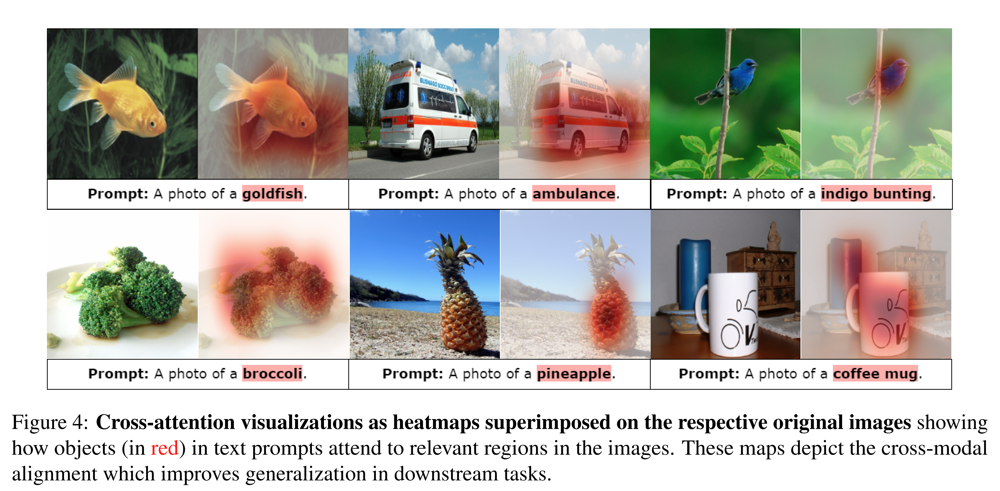

Fig. 4 와 Appendix Fig. 6 을 통해, 해당 text prompt 로 유도된 cross-attention map 을 시각화했다. object 를 지칭하는 text token(각 prompt 에서 빨간색으로 표시됨)과 image 간의 cross-attention score 를 추출하고, 이를 bilinear interpolation 하여 image 크기에 맞춘 뒤 원본 image 에 겹쳐 표시했다. 이러한 map 은 fish, food, vehicle 등 다양한 class 에서 image 와 해당 text 간의 alignment 를 보여준다. 이러한 cross-modal 인식은 downstream task 성능 향상으로 이어진다.

**Qualitative Analysis on Multi-object Setting**: Fig. 5 는 여러 object 가 포함된 image 에서의 cross-attention 시각화 예시를 보여준다.

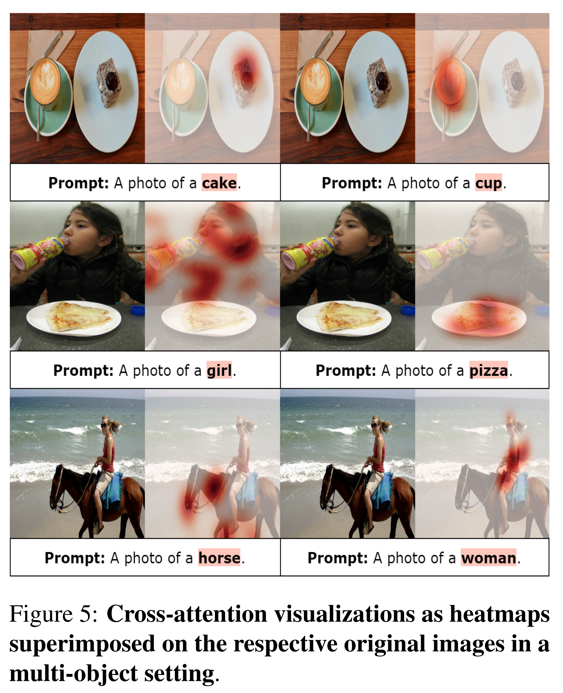

각 image 는 둘 이상의 object category 를 포함하며, 각 object 에 대해 동일한 template ‘A photo of a \<CLASS\>’ 를 사용해 text prompt 를 생성했다. attention map 은 해당 object 에 대응하는 영역에서 활성화되어, APoLLo 가 multi-category 환경에서도 세밀한 alignment 를 수행함을 보여준다. 이 예시에서는 ImageNet 으로 학습된 model 을 본 방법으로 zero-shot transfer 하여 결과를 얻었다.

# 5 Conclusions and Future Work

본 논문에서는 zero-shot generalization 을 유지하면서 few-shot 학습을 가능하게 하는 unified multi-modal adapter 및 prompt tuning 방법인 **APoLLo** 를 제안했다. 이를 위해 contrastive-consistency loss 를 활용하고 cross-modal synergy 를 보장하여, base-to-novel generalization, cross-dataset evaluation, domain generalization 의 세 가지 downstream task 에서 성능을 향상시켰다. 이는 10 개 benchmark dataset 실험 결과에서 확인되었다.

또한, ablation 분석을 통해 각 sub-module 의 기여도를 명확히 했다. 향후 연구로는, 여전히 해결되지 않은 fine-grained task 에서 본 프레임워크의 성능을 평가하는 것이 가능하다. 아울러, adapter layer 가 초과 파라미터화를 유발할 수 있으므로, 이를 최적화하는 방향으로 후속 연구를 진행할 수 있다.
