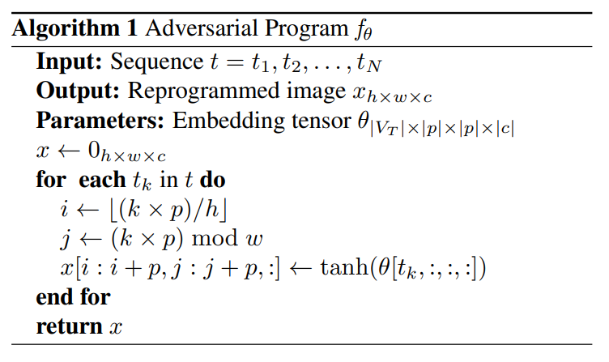
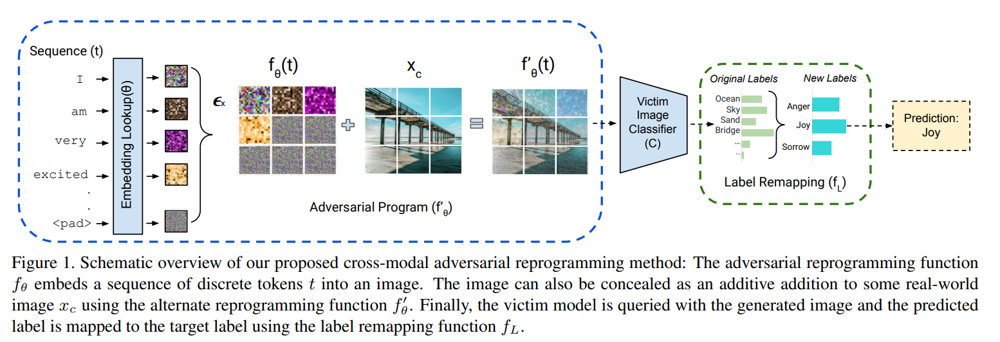
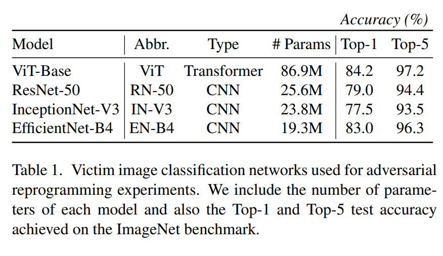
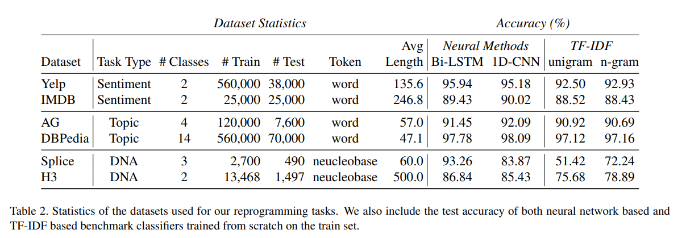
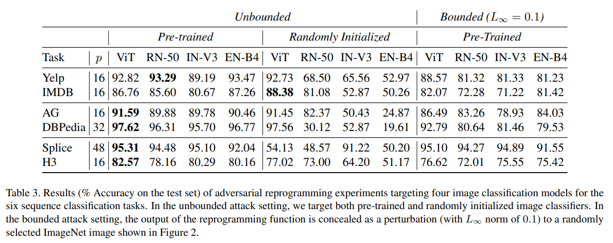
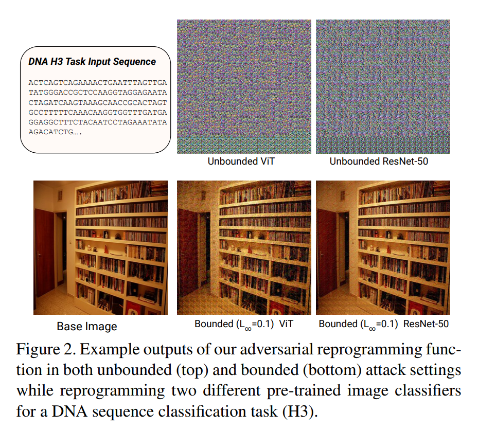
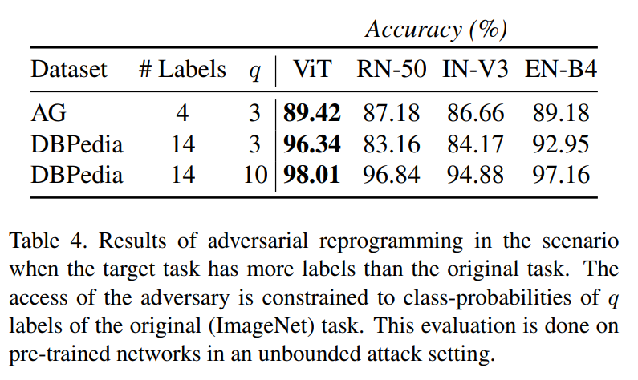

이미지 및 출처 : <https://openaccess.thecvf.com/content/WACV2022/papers/Neekhara_Cross-Modal_Adversarial_Reprogramming_WACV_2022_paper.pdf>

# Abstract

large-scale deep learning model 의 풍부함 덕분에, pre-trained network 를 new tasks 에 재사용하는 것이 가능해졌다.

최근의 연구들은 adversarial reprogramming 을 통해 network architecture 나 parameters 를 수정하지 않고도 neural networks 를 다른 tasks 에 재사용할 수 있음을 보여주었다.

그러나 이 연구들은 original tasks 과 target task 가 동일한 data domain 내에 있을 때만 이를 고려한다.

이 연구에서는 adversarial reprogramming 의 범위를 original task 의 data modality 를 넘어 확장한다.

image classification neural networks 을 Natural Language Processing (NLP) 및 기타 sequence classification tasks 에 adversarially reprogramming 하는 것이 가능한지를 분석한다.

저자는 sequence 의 discrete token 들을 이미지로 mapping 하여 image classification model 이 desired class 로 분류할 수 있도록 하는 efficient adversarial program 을 설계한다.

highly efficient adversarial program 을 사용하여, image classifier 를 reprogramming 하여 network 를 re-training 하지 않고도 다양한 text 및 sequence classification benchmark 에서 경쟁력 있는 성능을 달성할 수 있음을 입증한다.

# 1. Introduction

Transfer learning 과 adversarial reprogramming 은 well-trained neural networks model을 new tasks 에 재사용하는 데 사용되는 밀접하게 관련된 두 가지 기술이다.

neural networks 은 특정 task 를 위해 large-scale dataset 에서 학습되면, 여러 관련 task 에서 유용할 수 있는 features 을 학습하게 된다.

Transfer learning 은 이런 learned representation 을 활용해 pre-trained neural networks 을 다른 task 에 맞게 조정하는 것을 목표로 한다.

일반적으로, neural networks 의 last few layers 를 new output space 에 맞게 수정한 후, target task 의 dataset 에 대해 network parameters 를 fine-tuning 한다.

이러한 기술들은 target task 에 사용할 수 있는 training data 가 제한적인 경우에 특히 유용하다.

---

Adversarial reprogramming 은 network architecture 나 parameters 를 수정할 수 없다는 추가적인 제약 조건이 있다는 점을 제외하면 transfer learning 과 동일한 목표를 공유한다.

대신, adversary 는 network 의 input 및 output interface 만 조정하여 new adversarial task 를 수행할 수 있다. 이러한 제약된 문제 설정은 neural networks 에 대한 보안 문제를 제기한다. 

- adversary 는 클라우드에 호스팅된 ML model 을 재사용하여 new tasks 을 수행하게 할 수 있으며, 이는 계산 자원의 도난으로 이어질 수 있다.
- 또한, adversary 는 서비스 제공자의 윤리를 위반하는 task 을 수행하기 위해 model 을 reprogramming 할 수 있다.
  - 예로, adversary 는 스팸 계정을 생성하기 위해 captchas 를 해결하는 작업에 클라우드에 호스팅된 ML API 를 재사용할 수 있다.

이전의 adversarial reprogramming 연구들은 계산 비용이 적게 드는 input 및 label transformation function 을 사용하여 new tasks 을 위해 DNN 을 성공적으로 reprogramming 한 사례들을 보여주었다.

[Adversarial reprogramming of neural networks.] 에서 흥미로운 발견 중 하나는 new tasks 의 training data 가 original data 와 전혀 유사하지 않아도 neural networks 을 reprogramming 할 수 있다는 점이다.

저자들은 ImageNet classifier 를 MNIST digits 에 대해 재사용하면서, pixel 이 섞인 경우에서도 transfer learning 이 adversarial reprogramming 의 성공을 완전히 설명하지 못함을 실증적으로 보여준다.

이러한 결과는 neural networks 회로가 반드시 관련이 있는 여러 tasks 에서 유용할 수 있는 특성을 가지고 있음을 시사한다.

따라서 neural networks reprogramming 은 보안 위협을 제기할 뿐만 아니라, inference 시 neural networks backbone 의 shared computation 을 가능하게 하여 더 재사용 가능하고 efficient ML 시스템의 가능성을 제시한다.

---

기존 adversarial reprogramming 연구에서, target adversarial task 는 original tasks 과 동일한 data domain 을 가진다.

최근 연구들은 Transformer model 에 기반한 network architecture 가 language, audio, vision benchmark 에서 SOTA 결과를 달성할 수 있음을 보여주며, Transformer network 가 다양한 domain 에서 good inductive bias 를 제공할 수 있음을 시사한다.

이러한 domain 간 neural networks architecture 의 공통성을 고려할 때, vision Transformer model 을 language task 에 재사용할 수 있을지에 대한 흥미로운 질문이 제기된다.

Cross-modal adversarial reprogramming 은 neural networks 이 재사용될 수 있는 target task 의 범위를 넓힌다.

이 연구에서는 image classification network 를 sequence classification task 에 adversarially reprogramming 하는 기술을 개발한다.

- 저자는 sequence 의 discrete token 을 image 에 embedding 하고, original tasks 과 new tasks 의 label 간의 mapping 에 따라 이 adversarial program 을 학습시키는 간단하고 계산 비용이 적게 드는 adversarial program 을 제안한다.
- 저자는 CNN 과 Vision Transformer architecture 를 기반으로 한 여러 image classification neural networks 을 다양한 sequence classification benchmark 에 대해 reprogramming 하여 경쟁력 있는 성능을 달성할 수 있음을 입증한다.
- 추가적으로, real-world image 에서 adversarial program 을 perturbation 으로 위장할 수 있음을 보여주며, 이는 더 강력한 보안 위협을 제기한다.

이 논문의 기술적 기여는 다음과 같이 요약된다:

- Cross-modal Adversarial Reprogramming 이라는 novel approach 를 제안하여, original image classification task 를 위해 훈련된 ML model 을 sequence classification task 에 재사용한다. (최초의 연구)
- 저자는 network 를 re-training 하지 않고도 여러 sequence classification benchmark 에서 network 를 reprogramming 할 수 있는 방법을 제안하고, 이 방법이 여러 sequence classification task 에서 경쟁력 있는 성능을 달성할 수 있음을 입증한다.
- 저자는 adversarial reprogramming 이 Transformer model architecture 에 제기하는 위협을 처음으로 보여주며, Vision Transformer model 을 sequence classification task 에 reprogramming 하여, 5/6 task 에서 다른 architecture를 능가하는 성능을 달성한다.

# 2. Background and Related Work

## 2.1. Adversarial Reprogramming

neural networks 은 perturbation 을 가한 input 에 의해 실수를 유발하는 adversarial examples 에 취약하다는 것이 밝혀졌다.

Adversarial Reprogramming 은 neural networks 을 new tasks 에 재사용할 수 있도록 하는 새로운 형태의 adversarial threat 으로, [Adversarial reprogramming of neural networks.] 에서 처음 소개되었다.

제안된 기술은 all inputs 에 추가될 수 있는 single adversarial perturbation 을 학습하여, adversary 가 선택한 new tasks 을 수행하도록 대상 model을 reprogramming 한다.

adversary 는 먼저 adversarial task 의 output label 을 classifier 의 label space 로 mapping 하는 hardcoded one-to-one label mapping function 를 정의하고, new tasks 의 input space 에서 classifier 의 input space 으로 input 을 변환하는 adversarial reprogramming function 를 학습한다.

저자들은 white-box 환경에서 ImageNet classification model 을 MNIST 및 CIFAR-10 data 를 분류하도록 reprogramming 함으로써 이 attack algorithm 의 실행 가능성을 입증했다. 이 환경에서는 adversary 가 victim model 의 parameters 에 접근할 수 있다.

위의 attack 은 victim model 의 parameters 나 architecture 를 변경할 필요가 없지만, [Adversarial reprogramming of neural networks] 에서 제안된 adversarial program 은 original task 과 adversarial task 의 input space 이 continuous 한 경우에만 적용 가능하다.

discrete data domain 에서의 attack 가능성을 이해하기 위해, [Adversarial reprogramming of text classification neural networks] 에선 discrete input space 에서 sequence 로 작동하는 alternate task 를 위해 text classification neural networks 을 reprogramming 하는 방법을 제안했다.

이 attack algorithm 은 new sequence set 을 위해 victim classification model 을 reprogramming 하기 위해 계산 비용이 적게 드는 context-based vocabulary remapping 방법을 사용했다. 

이 연구는 adversary 가 victim model 의 architecture 와 parameters 에 접근할 수 있는지 여부에 상관없이, 즉 white-box 와 black-box 설정 모두에서 이러한 input transformation function 을 학습하기 위한 알고리즘을 설계한 최초의 연구였다.

저자들은 LSTM, bi-directional LSTMs, 그리고 CNN 을 포함한 여러 text classification model 을 alternate text classification classification task에 대해 adversarially re-purposing함으로써 제안된 reprogramming function의 성공을 입증했다.

최근 연구들은 reprogramming 기술이 efficient training 방법으로 볼 수 있으며, transfer learning 의 우수한 대안이 될 수 있다고 주장한다.

특히 [Transfer learning without knowing: Reprogramming black-box machine learning models with scarce data and limited resources] 은 현재의 transfer learning 기술의 주요 한계 중 하나는 pre-trained neural networks 을 fine-tuning 하기 위해 target domain data 가 많이 필요하다는 점이라고 주장한다.

저자들은 기존 ML model 을 alternate task 에 재사용하기 위해 reprogramming 기술을 사용하는 것이 training data 가 부족한 경우에도 가능함을 보여주었다.

저자들은 input-output model 응답에서 반복적으로 learnable black-box adversarial reprogramming 방법을 설계했으며, 이 방법이 autism spectrum disorders, melanoma detection 등 medical image task 를 위해 ImageNet model 을 reprogramming 하는 데 성공적임을 입증했다.

이러한 기존의 모든 reprogramming 기술들은 target adversarial task 와 original task 의 data domain 이 동일할 때만 ML model 을 reprogramming 할 수 있다.

저자는 image classification model 을 natural language processing 및 protein sequence classification 와 같은 sequence classification task 에 reprogramming 할 수 있는 adversarial input transformation function 를 설계함으로써 이 한계를 해결한다.

## 2.2. Transformers and Image Classifiers

CNNs 는 오랜 기간 동안 vision benchmark 에서 SOTA 성능을 달성해왔지만, 최근 제안된 Vision Transformers 는 여러 image classification task 에서 CNN 을 능가하는 성과를 보여주었다.

Transformers 는 NLP 에서 SOTA 성능을 달성하는 것으로 잘 알려져 있다.

image classification task 을 위해 transformers 를 학습시키기 위해, 저자들은 image 를 patches 로 나누고 이 patches 들의 linear embedding sequence 를 transformer 에 input 으로 제공했다. 

image patches 는 NLP 응용 프로그램에서 tokens(words) 와 동일하게 취급되며, model 은 supervised manner 로 image classification 에 대해 학습된다.

저자들은 ViTs 가 large-scale image dataset 에서 학습될 때, 여러 image recognition benchmark 에서 경쟁력 있고 또한 SOTA model 을 능가한다고 보고했다.

Transformers 가 sequence embedding 으로 language 와 vision data 를 유사하게 modeling 할 수 있으므로, 저자는 Vision Transformer 를 text classification task 에 reprogramming 할 수 있는지 탐구해보고자 한다.

이 과정에서 CNN network architecture 도 discrete sequence classification task 에서 경쟁력 있는 성능을 달성하도록 reprogramming 할 수 있음을 발견했다.

# 3. Methodology

## 3.1. Problem Definition

victim image classifier $C$ 가 images $x \in X$ 를 label $l_X \in L_X$ 로 mapping 하도록 학습되었다고 가정한다.

즉, 

$$ C : x \mapsto l_X $$

이때, adversary 는 이 victim image classifier 를 sequence $t \in T$ 를 label $l_T \in L_T$ 로 mapping 하는 alternate text  classification task $C'$ 에 사용하고자 한다. 즉, 

$$ C' : t \mapsto l_T $$

이를 달성하기 위해, adversary 는 original task 와 new tasks 의 input 및 output space 간의 적절한 mapping function 을 학습해야 한다.

이를 해결하기 위해, 먼저 two tasks 의 label space 을 mapping 하는 label 재rmapping $f_L$ 을 정의한다: $f_L : l_X \mapsto l_T$; 그리고 sequence $t \in T$ 를 image $x \in X$ 로 변환하는 corresponding adversarial program $f_\theta$ 를 학습한다. 즉, $f_\theta : t \mapsto x$로서 $f_L(C(f_\theta(t)))$이 target classifier $C'$ 로 작동하도록 한다.

저자는 adversary 가 victim image classifier 의 architecture 와 model parameters 에 대한 완전한 지식을 가지고 있는 white-box adversarial reprogramming 환경을 가정한다.

## 3.2. Adversarial Program

저자의 adversarial program 의 목표는 discrete token sequence $t \in T$ 를 image $x \in X$ 로 mapping 하는 것이다.

일반성을 잃지 않기 위해, $X = [-1, 1]^{h \times w \times c}$ 로 정의된 image classifier $C$ 의 scaled input space 이라고 가정한다.

- $h$, $w$ : input image 의 height 및 width
- $c$ : channel 수
- sequence $t$ 의 token 은 특정 vocabulary list $V_T$ 에 속한다.
- sequence $t$ 는 $t = t_1, t_2, \dots, t_N$ 으로 나타낼 수 있다
  - $t_i$ : vocabulary list $V_T$ 에서 sequence $t$ 의 $i_{th}$ token vocabulary index

Adversarial program 을 설계할 때, reprogramming function $f_\theta$ 의 계산 비용을 고려하는 것이 중요하다.

이는 만약 classification task $C'$ 를 위해 동일하게 성능이 좋은 classification model 을 처음부터 학습시키는 것이 reprogramming function 보다 계산적으로 더 저렴하다면, adversarial reprogramming 의 목적이 무색해지기 때문이다.

이를 염두에 두고, 저자는 tokens $t_i$ 의 embedding 을 조회하고 이를 classifier $C$ 에 입력으로 제공되는 이미지의 continuous patches 로 배치하는 reprogramming function 를 설계한다.

수학적으로, reprogramming function $f_\theta$ 는 learnable embedding tensor $\theta_{|V_T| \times |p| \times |p| \times |c|}$ 로 parameterizing 되며, Algorithm 1 에 따라 transformation $f_\theta : t \mapsto x$ 를 수행한다.

patch size $p$ 와 image size $h$, $w$ 는 이미지로 encoding 할 수 있는 sequence $t$ 의 maximum length 를 결정한다.

저자는 all input sequences $t$ 를 최대 허용 sequence 길이까지 pad token 으로 padding 하고, 허용 길이를 초과하는 sequence 는 끝에서부터 잘라낸다. 

#### Concealing the adversarial perturbation:

대부분의 기존 adversarial reprogramming 연구들은 reprogrammed image 가 real-world image 와 유사할 필요가 없는 unconstrained attack 설정을 고려했다.

그러나 [Adversarial reprogramming of neural networks.] 에 의해 지적되었듯이, reprogrammed image 를 real-world image 에 은폐하는 것이 가능하다.

저자는 reprogramming function 의 output 을 제한하여 reprogrammed image 를 real-world base image $x_c$ 에 additive perturbation 으로 숨길 수 있다.

이때 alternate reprogramming function $f'_\theta$ 는 다음과 같이 정의된다:

$$
\begin{equation}
    f'_\theta(t) = \text{Clip}[-1,1](x_c + \epsilon.f_\theta(t))
\end{equation}
$$

- original reprogramming function $f_\theta$ 의 output 이 $[-1, 1]$ 사이로 제한되므로, parameters $\epsilon \in [0, 1]$ 을 사용하여 added perturbation 의 $L_\infty$  norm 을 제어할 수 있다.

#### Computational Complexity:

Fig. 1 에서 보이듯, 

- inference 중에 adversarial program 은 sequence $t$ 의 token embedding 만을 조회하고 이를 image tensor 에 배치하며, 선택적으로 이를 base image 에 추가할 수 있다.
- 비대칭적으로, 이 adversarial program 의 Computational Complexity 는 sequence $t$ 의 길이에 비례하는 linear complexity 를 가진다.
- Adversarial program 에는 matrix-vector multiplication 포함되지 않으므로, 이는 sequence-based neural classifier 의 embedding layer 와 계산적으로 동등하다.
- 따라서 adversarial program 의 inference cost 은 sequence-based neural classifier 보다 상당히 적다. 

Tab. 1 은 다양한 sequence-based neural classifier 와 저자의 adversarial program 의 sequence length 500 에 대한 real-world inference time 을 비교한다.

## 3.3. Label Remapping and Optimization Objective

기존 adversarial reprogramming 연구들은 target task 의 label 수가 original task 의 label 수보다 적다고 가정했다.

저자는 이 제약을 완화하고 다음 두 시나리오에 대해 label remapping function 를 제안한다:

1. **Target task has fewer labels than the original task:**
   - 초기 adversarial reprogramming 연구들은 original task 과 new tasks 의 label 간의 one-to-one mapping 을 정의했다. 그러나 최근 연구는 여러 source label 을 one target label 에 mapping 하는 것이 one-to-one mapping 보다 성능을 향상시키는 데 도움이 된다고 발견했다.
   - 저자는 cross-modal reprogramming 에 대한 초기 실험에서 이 결과를 확인했지만, final target label $l_t$ 의 score 를 집계하는 방식에서 차이가 있다 — 이전 연구에선 mapped original label 의 score 의 평균을 target label 의 final score 로 사용했다.
   - 저자는 mapped original labels 들 중 maximum 을 취하는 것이 학습 속도를 더 빠르게 만든다는 것을 발견했다.
   - Max reduction 을 사용할 또 다른 장점은 inference 중에 original predicted label 을 직접 저자의 target label 에 mapping 할 수 있어, other label 의 probability score 에 접근할 필요가 없다는 것이다.

target task label $l_t$ 가 many-to-one label remapping function $f_L$ 아래에서 original task 의 label subset $L_{St} \subset L_S$ 에 mapping 되었다 가정하자.

저자는 이 target task label 에 대한 score 를 classifier $C$ 에 의해 mapping 된 각 label $l_i \in L_{St}$ 의 score 중 maximum 으로 얻는다. 즉, 

$$
\begin{equation}
    Z'_{l_t}(t) = \max_{l_i \in L_{S_t}} Z_{l_i} (f_\theta(t))
\end{equation}
$$

- $Z_k(x)$ 및 $Z'_k(t)$ : 각각 classifier $C$ 와 $C'$ 에 의해 label $k$ 에 할당된 score (softmax 이전)를 나타냄.

label remapping $f_L$ 을 정의하기 위해, 임의로 $m$ source labels 를 target label 에 할당하는 대신, 먼저 base image $x_c$ (또는 unbounded attack 의 걍우 zero image)에서 model prediction 을 얻고, 얻은 score 로 label 을 정렬한다.

그런 다음 round-robin strategy 를 사용하여 각 target label 에 highest scored source labels 를 할당하여 $m$ source labels 를 각 target label 에 할당한다.

training 중에는 (white-box attack 설정을 가정하여) 개별 class scores 에 접근할 필요가 있지만, inference 중에는 실제로 다양한 label 에 할당된 score 를 알 필요 없이 highest predicted label 을 target label 에 mapping 할 수 있다.

2.  **Original task has fewer labels than the target task:** 
    - 이 시나리오에선 original label 에 대한 probability distribution 을 target label 에 대한 class score distribution 으로 mapping 하기 위해 learnable linear transformation 을 사용한다. 즉,

$$
\begin{equation}
    Z'(t) = \theta'_{|L_T| \times |L_X|} \cdot \text{softmax}(Z(f_\theta(t))).
\end{equation}
$$

- $Z'(t)$ : target label space 에 대한 class scores (logits)를 나타내는 vector.
- $\theta'_{|L_T| \times |L_X|}$ : 이 linear transformation 의 learnable parameters 이며, 이는 reprogramming function $f_\theta$ 의 parameters 와 함께 potimizing.
- 이 설정에서는 training 및 inference 중에 original label 에 대한 probability scores 에 접근할 수 있다고 가정한다.

#### Optimization Objective:

Adversarial program 의 parameters $\theta$ 를 학습하기 위해, 저자는 Eq. 2 또는 Eq. 3 에서 얻은 model score predictions 과 target label 사이의 cross-entropy loss 를 사용한다.

또한 test set 에서의 더 나은 generalization 를 위해 $L$2 regularization loss 를 포함하여, bounded attack 의 경우 더 감지하기 어려운 perturbation 을 유도한다.

따라서 저자의 final optimization objective 는 다음과 같다:

$$ P_{l_t} = \text{softmax}(Z'(t))_{l_t} $$

$$ E(\theta) = -\sum_{t \in T} \log(P_{l_t}) + \lambda ||\theta||^2_2. $$

- $\lambda$ : regularization hyper-parameters
- $P_{l_t}$ : sequence $t$ 에 대한 correct label $lt$ 의 predicted class probability
- 저자는 Adam optimizer 을 사용하여 target task 의 dataset 에서 mini-batch gradient descent 을 사용하여 optimization 문제를 해결한다

# 4. Experiments

## 4.1. Victim Image Classifiers

Cross-modal adversarial reprogramming 을 입증하기 위해 ImageNet dataset 에 대해 학습된 4 neural architecture 에서 실험을 수행한다.

저자는 CNN 과 최근 제안된 Vision Transformers (ViT) 을 victim image classifier 로 선택했다.

저자는 ViT-Base, ResNet-50, InceptionNet-V3, 그리고 EfficientNet-B7 architecture 를 선택했다. 

저자는 pre-trained network 와 randomly initialized network 모두에 대해 실험을 수행한다.

## 4.2. Datasets and Reprogramming Tasks

본 연구에서는 앞서 언급한 image classifier 들을 여러 discrete sequence classification task 에 맞게 재목적화한다.

저자는 understanding language 나 g sequential biomedical data 같은 다양한 응용 프로그램을 위해 cross-modal adversarial reprogramming 의 성능을 분석하고자 한다.

예로 생의학 dataset 은 종종 language-based dataset 보다 training sample 이 적으며, 이러한 제한이 reprogramming 기법에 부정적인 영향을 미칠 수 있는지 확인하고자 한다.

Sementic analysis 와 topic classification 은 인기 있는 NLP task 다.

그러나 이러한 작업을 해결하기 위해 sequence 의 기본 의미를 분석하는 것은 종종 필요하지 않다. 왜냐하면 word-frequency based statistics 가 strong discriminatory features 으로 작용할 수 있기 때문이다.

반면, DNA sequence classification 같은 task 는 입력의 순차적인 의미를 분석해야 하며, 단순한 unifram 이나 n-gram 의 frequency analysis 로는 이 task 에서 경쟁력 있는 성능을 달성할 수 없다.

이러한 시나리오에서 adversarial reprogramming 의 효과를 평가하기 위해 저자는 다음과 같은 작업과 dataset 을 실험에 고려한다:

### 4.2.1 Sentiment Classification

1. **Yelp Polarity Dataset (Yelp) [36]**: 이 dataset 은 Yelp의 리뷰로 구성되어 있으며, Semantic classification task을 위해 긍정적 Semantic과 부정적 Semantic의 이진 클래스로 분류된다.
2. **Large Movie Review Dataset (IMDB) [18]**: 이 dataset 은 강한 극성을 가진 IMDB 영화 리뷰에서 긍정적 Semantic과 부정적 Semantic을 이진 분류하기 위한 dataset 이다.

### 4.2.2 Topic Classification

1. **AG’s News Dataset (AG)**: 1M news articles 를 포함하는 collection. 뉴스 기사는 2000 이상의 news sources 에서 수집되었으며, 4 classes: World, Sports, Business, Sci/Tech 로 구성.
2. **DBPedia Ontology Dataset (DBPedia)**: DBpedia 2014 에서 14 non-overlapping categories 로 구성되어 있다. sample 은 각 Wikipedia 기사에 대한 카테고리와 요약본으로 구성되어 있다.

### 4.2.3 DNA Sequence Classification

1. **Splice-junction Gene Sequences (Splice)**: 이 dataset 은 DNA sequence 에서 splice junctions 를 검출하기 위해 model 을 학습시키기 위해 수집되었다.
   - DNA 에는 두 가지 종류의 splice junction 영역이 있다: Exon-Intron (EI) junction 과 Intron-Exon (IE) junction.
   - 이 dataset 은 60 염기 서열 길이를 가진 DNA sequence 샘플로 구성되며, EI, IE, 그리고 EI 나 IE 영역이 포함되지 않은 “N”이라는 3 classes 로 분류된다.
2. **Histone Protein Occupancy in DNA (H3)**: 이 dataset 은 특정 DNA sequence 가 H3 히스톤 단백질을 감싸는지 여부를 나타낸다.
   - 각 sample 은 500 염기 서열 길이를 가지며, positive sample 은 DNA 영역이 히스톤 단백질을 감싸고 있는 반면, negative sample 은 그러한 DNA 영역이 포함되지 않는다.

이 dataset 들의 통계는 Tab. 2에 포함되어 있다.

이 task 들에 대해 달성할 수 있는 성능을 benchmark 하기 위해, 저자는 각 task 의 dataset 에서 다양한 classifier 를 scratch training 시킨다.

저자는 neural networks 기반의 classification model 과 TF-IDF 와 같은 frequency-based statistical
models 을 benchmark 로 고려한다.

Semantic 및 Topic classification task 에는 word level 의 token 을 사용하고, DNA sequence classification task 에는 염기 서열 수준의 token 을 사용한다.

- TF-IDF 방법은 input data 에서 feature vectors 를 생성하기 위해 unigram 또는 n-gram 을 사용할 수 있다.
- n-gram model 의 경우, 최대 길이 3 까지의 n-gram 을 고려하며, hold-out set 에서 가장 높은 classification accuracy 를 달성하는 값을 선택한다.

---

- 저자는 feature vectors 를 target class 중 하나로 분류하기 위해 Stochastic Gradient Descent (SGD) classifier 를 학습시킨다.
- 추가적으로, 저자는 위의 tasks 에서 Bi-LSTM 및 1D CNN model 과 같은 DNN 기반의 text classifier 를 scratch training 한다.
- 모든 classification model 에 대해 randomly initialized token embedding 을 사용하며, 이는 network parameters 와 함께 학습된다.
- Bi-LSTM 의 경우, 예측을 위해 첫 번째와 마지막 타임스텝의 출력을 결합한다.

위에서 언급한 classifier 의 test set 에 대한 정확도를 Tab. 2 에 보고한다.

- 저자는 neural networks 과 frequency based methods TF-IDF 모두 Semantic 및 Topic classification task 에서 잘 작동하는 반면, neural networks 이 DNA sequence classification task 에서 TF-IDF 보다 훨씬 뛰어난 성능을 보인다는 것을 발견했다.
- 이는 후자가 키워드에 의존하기보다는 sequence 의 구조적 분석을 필요로 하기 때문일 것으로 추정된다.

## 4.3. Experimental Details

#### Input image size and patch size:

- 본 연구에서 사용한 ViT-Base model은 384 × 384 size 의 image 로 학습되었으며, 16 × 16 size 의 image patches 로 작업한다.
- 모든 실험에서 input image size 를 384 × 384 로 고정한다.
- sequence 의 single token 을 encoding 하기 위해 16 × 16 size 의 patches 를 사용할 경우, 최대 576 tokens 를 하나의 이미지에 encoding 할 수 있다.
- 초기 실험에서 더 작은 sequence 를 위해 larger patch size 를 사용하는 것이 target task 에서 더 높은 성능을 달성하는 것을 발견했는데, 이는 sequence 를 image 의 spatially larger area 에 encoding 하기 때문이다.
  - 따라서 target task dataset 에서 longest sequence 를 encoding 할 수 있는 16 의 가장 큰 배수를 patch size 로 선택한다.
  - 다양한 작업에 사용된 patch size $p$ 는 Tab. 3 에 나와 있다.

#### Training hyper-parameters:

- 각 adversarial program 을 single Titan 1080i GPU 에서 batch size 4 로 학습시킨다. 
- learning rate 는 unbounded attacks 의 경우 0.001 로 설정하고, bounded attacks 의 경우 Equation 1에 따라 0.001 × ε⁻¹ 로 설정한다. 
- 모든 실험에서 $L$2 regularization hyper-parameters λ 를 1e-4 로 설정하고, unbounded attack 설정에서는 최대 100k mini-batch iteration, bounded attack 설정에서는 200k mini-batch iteration 까지 adversarial program 을 학습시킨다.
- target task 의 label 수가 original task 의 label 수보다 적은 경우, 10 original label 을 각 target label 에 mapping 한다.

# 5. Results

## 5.1. Pre-trained vs untrained victim models

제안된 cross-modal reprogramming 방법의 실험 결과는 Tab. 3 에 보고되어 있다. 이 실험에서 original task 은 target task 보다 더 많은 label 을 가지고 있으므로 Eq. 2 에 따른 label remapping function 를 사용한다.

먼저, adversarial program 의 output 을 real-world image 에 숨길 필요가 없는 unbounded attack 설정을 고려한다. 

이러한 실험에서는 Algorithm 1 에 설명된 reprogramming function $f_\theta$ 를 사용한다.

이전 reprogramming 연구들의 주요 평가는 unbounded attack 설정에서 이루어진다는 점도 주목할 만하다.

- pre-trained image classifier 를 attack 할 때, all victim image classifier model 에서 여러 작업에 대해 경쟁력 있는 성능을 달성했다(Tab. 2 에 보고된 scratch trained benchmark classifier 와 비교하여). 
- original dataset 에 대해 victim model 을 pre-training 하는 것이 얼마나 중요한지 평가하기 위해, untrained randomly initialized network 를 reprogramming 하는 실험도 수행했다.
- randomly initialized neural networks 은 reprogramming function 가 활용할 수 있는 풍부한 구조를 가질 수 있다. 
  - 이전 연구에서는 wide neural networks 이 Gaussian processes 처럼 행동할 수 있으며, 많은 다른 작업을 수행하기 위해 intermediate layer 의 특정 weight 를 학습할 필요가 없다고 보여줬다.
  - 그러나 저자 실험에서는 CNN-based image classifier 의 경우, all tasks 에서 randomly initialized network 를 reprogramming 하는 것보다 pre-trained neural networks 을 reprogramming 하는 것이 훨씬 더 성능이 좋다는 것을 발견했다.
  - 이는 이전의 reprogramming 연구와 일치하는 결과로, image domain 에서의 adversarial reprogramming 이 pre-trained CNN 을 타겟으로 할 때 더 효과적임을 보고하고 있다.
  - ViT model 의 경우, pre-trained model 이나 randomly initialized model 을 reprogramming 할 때 Semantic 및 Topic classification task 에서 경쟁력 있는 성능을 달성할 수 있었다. 
  - 특히, untraned ViT 를 reprogramming 할 때 IMDB classification task 에서 가장 높은 정확도를 얻었다.
  - 그러나 sequence 의 구조적 분석이 필요한 DNA sequence classification task(Splice 및 H3)에서는, randomly initialized Transformer model 보다 pre-trained ViT model 을 reprogramming 할 때 성능이 훨씬 우수했다.
- ViT model 은 unbounded attack 설정에서 5/6 task 에서 다른 architecture 를 능가했다.
  - 특히, 유전자 sequence 에서 splice-junction 을 검출하는 task 에서는 pre-trained ViT model 을 reprogramming 할 때, scratch trained TF-IDF 및 neural classifier 보다 뛰어난 성능을 보였다.
  - 주로 키워드 탐지가 필요한 Semantic 및 Topic classification task 의 경우, 일부 reprogramming  방법은 Tab. 2 에 보고된 benchmark 방법과 경쟁력 있는 성능을 달성했다.
- 추가적으로, target task 을 해결하는 데 victim classifier 가 얼마나 중요한지 평가하기 위해, victim classifier 없이 adversarial reprogramming function 와 linear classification head 만을 사용하여 task 을 해결할 수 있는 정도를 연구했다.

#### Concealing the adversarial perturbation:

real-world image 에서 adversarial program 의 output 을 숨기기 위해, Eq. 1 에 정의된 adversarial reprogramming function 를 따른다. ImageNet dataset 에서 임의로 이미지를 선택하여(base image $x_c$ 는 Fig. 2 에 표시됨), 동일한 base image 를 대상으로 다양한 image classifier 를 겨냥한 adversarial program 을 학습시킨다. 

reprogrammed image 와 base image $x_c$ 간의 $L_∞ = 0.1$ (pixel value scaling 에서 0 ~ 1) 왜곡에서의 결과는 Tab. 3 오른쪽에 나와 있다. 

- 성능이 일부 감소하더라도, input sequence 를 real-world image 에 숨기면서 adversarial reprogramming 을 수행할 수 있음을 알 수 있다.

## 5.2. Target task has more labels than original task

실제 attack 시나리오에서는, adversary 가 target task 의 label 수보다 적은 label을 가진 victim image classifier 만을 사용할 수 있을 가능성이 있다. 

이러한 상황에서 adversarial reprogramming 을 평가하기 위해, adversary 가 ImageNet classifier 의 $q$ label 의 class-probability scores 에만 접근할 수 있도록 제한한다. 

adversary 가 접근할 수 있는 original label 로는 most frequent $q$ 의 ImageNet label 을 선택하고, AG News (4 label)와 DBPedia(14 label)라는 가장 많은 label 을 가진 두 task 에서 실험을 수행한다.

Eq. 3 에 따른 label remapping function 를 사용하고, $q$ original label 에 대한 prediction probability distribution 을 target task label score 로 mapping 하기 위해 linear transformation 을 학습한다.

저자는 더 제한된 설정에서도 adversarial reprogramming 을 수행할 수 있음을 입증한다. 

target task 의 label 수에 가까운 $q$ 을 사용할 때, Tab. 3 에 보고된 many-to-one label remapping 시나리오와 비교해 유사한 성능을 달성한다.

이는 output interface 에 대한 additional mapping function 를 학습하기 때문인데, 이는 더 나은 최적화를 가능하게 할 수 있다. 

그러나 단점으로, 이 설정에서는 adversarial label 을 예측하기 위해 all $q$ classes probability scores 에 접근해야 하는 반면, 이전 many-to-one label remapping 시나리오에서는 가장 높은 점수를 받은 original label 만 알면 이를 adversarial label 중 하나에 mapping 할 수 있다.

# 6. Conclusion

저자는 Cross-modal Adversarial Reprogramming 을 제안하며, 이는 pre-trained image classification model 을 sequence classification task 에 재목적화할 수 있음을 처음으로 입증.

저자는 계산 비용이 적은 adversarial program 이 신경 회로를 재목적화하여 sequence 의 구조적 분석을 요구하는 작업을 해결할 수 있음을 보여준다.

저자의 결과는 다양한 data modality 와 data structure 에 걸쳐 작업을 위해 reprogramming 할 수 있는 더 유연한 neural networks model 을 학습할 가능성을 시사한다. 

더 중요한 것은, 이 연구는 공공 ML API 에 대한 더 광범위한 보안 위협을 드러내며, 기존의 보안 원시 개념을 재고할 필요성을 보여준다.