논문 및 이미지 출처 : <https://openaccess.thecvf.com/content/CVPR2023/papers/Chen_Understanding_and_Improving_Visual_Prompting_A_Label-Mapping_Perspective_CVPR_2023_paper.pdf>

# Abstract

저자는 vision tasks 를 위한 input prompting 기술인 visual prompting (**VP**) 을 revisit 하고 발전시킴

VP 는 단순히 universal prompts (input perturbation patterns)를 downstream data points 에 통합하여 fixed pre-trained source model 을 reprogramming 하여 target domain 의 downstream task 를 수행할 수 있게 한다

- 그러나 source classes 및 target classes 간의 **ruleless** label mapping (**LM**) 이 주어져도 VP 가 효과적인 이유는 여전히 명확하지 않다
- 위의 내용을 바탕으로, 저자는 다음과 같은 질문을 던짐: LM 은 VP 와 어떻게 상호 관련이 있는가? 그리고 이러한 관계를 어떻게 활용하여 target tasks 의 정확도를 향상시킬 수 있는가?
  - 저자는 LM 이 VP 에 미치는 영향을 살펴보고, LM 의 더 나은 '_quality_' (mapping precision 및 explanation 에 의해 평가되는) 가 VP 의 효과성을 일관되게 향상시킬 수 있는 긍정적인 answer 를 제공한다. 
  - 이는 LM factor 가 빠져 있던 이전 연구와는 대조적
- LM 을 optimizing 하기 위해, 저자는 ILM-VP (iterative label mapping-based visual prompting) 라는 new VP framework 을 제안하여, source labels 을 target labels 로 automatically re-map 하고 VP 의 target task 정확도를 progressively improve
- 또한, contrastive language-image pre-trained (CLIP) model 을 VP 에 사용할 때, CLIP 의 text prompt selection 을 지원하고 target task 정확도를 향상시키기 위해 LM process 를 통합할 것을 제안
- 광범위한 실험을 통해, 저자의 제안이 SOTA VP 방법을 크게 능가한다는 것을 입증
- ImageNet-pretrained ResNet-18 을 13 target tasks 를 reprogramming 할 때, ILM-VP 는 baseline 보다 상당한 차이로 성능이 우수함을 보여줌
  - 예로, Flowers102 및 CIFAR100 dataset 에서 각각 7.9% 와 6.7% 의 정확도 향상을 달성
  - 또한, CLIP-based VP 는 Flowers102 및 DTD 에서 각각 13.7% 와 7.1% 의 정확도 향상을 제공

# 1. Introduction

### 텍스트 번역

new knowledge 학습 시, 인간은 익숙한 지식과 비교 및 연결을 한다. 이 아이디어는 ML 에도 적용되어, "pretraining + finetuning" 패러다임이 ML model (e.g. DNN)에 처음에 (large) _source_ dataset 에서 학습된다.

관련 downstream task 가 있을 때, pre-trained model 은 _target_ dataset 을 통해 fine-tuning 된다

이 Learning paradigm 은 classical transfer learning 및 deep representation learning 에 지배적이다.

---

하지만 pre-trained model 을 fine-tuning 하려면 model modifications 가 필요하다.

pre-trained model 이 큰 경우, 각 downstream task 마다 modified pre-trained model copy 를 저장하는 것은 비용이 많이 들고 비효율적인 반면, 

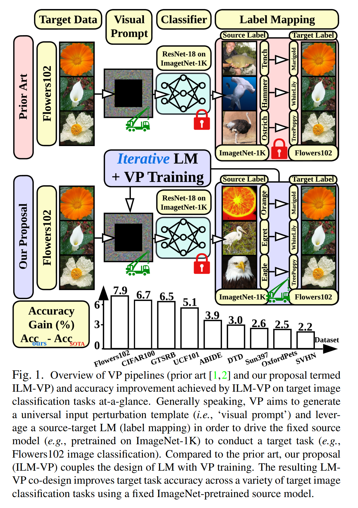

- visual prompting (**VP**) (Fig. 1), model reprogramming 또는 adversarial reprogramming 이라 하는 것은, fine-tuning 에 대한 새로운 대안을 제공
- pre-trained source model 을 직접 수정하는 대신, VP 는 _input transformation_ and/or _output transformation_ 을 통합하여 _fixed_ source model 을 new target task 를 수행하도록 reprogramming 한다
- Fig. 1 의 VP 예시처럼, 
  - input transformation 은 일반적으로 input samples 에 (data-agnostic) input perturbation (i.e., prompts) 을 통합함으로써 실현되며, 
  - output transformation 은 source labels 를 target labels 로 mapping 하는 function 에 의해 제공된다
- 최근 VP 는 pre-trained vision model 부터 language-vision model 에 이르기까지 다양한 응용 분야에서 큰 잠재력을 보여주었다

---

prompt learning 아이디어는 NLP 의 in-context or prompting 에서 시작.

그러나 vision domain 에 도입되어, 새로운 질문 생김

1. 최근 연구는 target task 가 source domain 에서 크게 벗어나도 VP 가 여전히 강력함을 보여줌
  - 예로, fixed ImageNet pre-trained source model 을 reprogramming 하기 위해 VP 를 사용할 때, target medical datasets 에서 new performance 기록
  - 이 예에서 LM 은 겉보기에 관련 없는 source 와 target domain 간에 수행된 "mystery"
  - interpretability lack 에도 불구하고, VP 는 여전히 이러한 connected source labels 와 source model 을 활용하여 target data points 를 효과적으로 예측
  - 이는 첫 번째 질문을 제기: _LM 의 합리성은 무엇이며 VP 에 미치는 영향을 어떻게 탐구할 수 있을까?_
2. NLP domain 의 prompt learning 과 달리 vision domain 의 input prompt 는 일반적으로 image pixel 에 대한 "noisy" perturbations 로 제공: Fig. 1
   - LM 의 interpretability lack 과 함께, 두 번째 질문은: _VP 에서 LM 과 겉보기엔 random perturbation pattern 을 어떻게 해석할 수 있을까?_

---

위 언급처럼, LM 의 이해 부족과 VP 의 poor interpretability 는 이 연구의 동력.

저자는 LM 과 prompt learning (i.e. input prompt generation) 사이의 interactive 및 explainable design 를 제공하는 new visual prompting framework 인 **ILM-VP** (iterative label mapping-based visual prompting); Fig. 1

- 저자의 제안은 source domain 과 target domain 간의 LM 을 자동으로 조정하여 mapping precision 및 explanation 을 모두 고려하며, optimized LM 을 활용하여 prompt learning 의 accuracy 와 explainability 를 더욱 향상시킬 수 있다.
- 일부 이전 연구는 LM 의 품질과 VP 의 전반적인 성능을 향상시키려고 시도했지만, 두 가지 주요 측면에서 저자의 제안과 다름
  1. 이전 연구 중 어느 것도 none co-designed LM and VP
     - 예로, 이전 연구는 pre-prompt prediction frequency 를 사용하여 LM 기능을 결정
     - 그러나 저자는 동일한 source model 의 pre-prompt 와 post-prompt prediction frequency 사이에 상당한 불일치를 발견하여, 현재 VP 방법의 sub-optimality 를 설명
  2. 이전 연구에서는 VP 를 여전히 'black box' 로 취급
      - 하지만 저자의 설계는 VP 의 기본 메커니즘에 대한 graceful visual explanations 을 제공
  3. 저자는 처음으로 LM 이 VP 의 정확성을 향상시키기 위해 visual 및 language-vision source model 을 모두 re-purpose 하는 unified solution 제공

저자의 기여:

1. 저자의 VP 에서 LM 문제를 재검토하고 기존 LM 방법의 결함, 즉 mapping precision 및 explanation lack 을 밝혀냄
2. LM 의 중요성을 감안하여, 저자는 novel bi-level optimization 관점을 통해 ILM-VP 라는 LM-VP co-design framework 제안
3. vision model 을 위한 LM 을 넘어, 저자는 LM 이 CLIP 의 text prompt selection 을 지원하고 CLIP 을 사용하여 VP 의 target task accuracy 를 향상시킬 수 있음을 보여줌.
4. 저자는 여러 source model 과 target dataset 에서 저자의 제안의 accuracy 및 explanation 장점을 실증적으로 입증

# 2. Related Work

#### Prompting in NLP.

prompting 은 language model 이 주어진 task 를 더 잘 수행하도록 input text 에 language instruction 을 추가하는 방법이다. 이는 large pre-trained language models (e.g. GPT-3) 의 generalization ability 에 크게 기여하지만, experts 가 직접 prompt design 의 단점이 있음

최근 prompting embedding 을 직접 최적화하고 model 을 경량으로 fine-tuning 하는 _prompt tuning_ 이 제안됨.

이 방법은 full language model 의 fine-tuning 과 competitive performance 를 달성하면서도 효과적이고 효율적임이 입증

#### Visual prompting and model reprogramming.

VP 는 NLP 의 prompting 을 모방하여 처음 정의.

이전의 유사한 아이디어가 CV 에 _model reprogramming or adversarial reprogramming_ 으로 사용됨

- 이들은 fixed pre-trained vision model 을 new task 에 re-purpose 하기 위해, universal input pattern 과 output LM function 을 활용하는데 초점을 둠
- VP 는 transfer learning 에서 full fine-tuning 보다 성능이 뛰어나진 않지만, parameter-efficient fine-tuning 의 이점을 제공
  - smaller parameter storage space 만 필요하며, less training data 로 수렴 가능
  - traditional pre-trained vision models 를 넘어, vision-language model CLIP 에서 VP 의 효과를 연구
  - CLIP 의 도움으로 VP 는 source-target label mapping 을 하지 않고도 image data 의 prompting pattern 생성
- Multi-modal prompt learning : CLIP 모델에서 VP 와 text prompt 를 jointly optimizing 으로 더 나은 성능 달성
- _unadversarial learning_ 은 VP 와 유사한 아이디어로, pre-trained model 의 out-of-distribution generalization ability 를 향상시키기 위해 class 별 prompt 생성에 중점 둠

---

VP 는 점점 더 많은 주목을 받으며, 

- BAR 는 black box source model 을 re-purpose 로 사용하여 다양한 target dataset 에서 SOTA 성능을 달성
- 생화학 분야 같은 data-scarce 에서 VP 는 효과적인 cross-domain transfer learning 가능
- transfer learning 외에도, VP 는 adversarial robustness 및 fairness 같은 다양한 metric 을 개선하기 위해 in-domain setting 에서도 사용
- vision domain 에서 input prompting 이 가장 일반적으로 사용되는 prompt learning 이지만, source model 의 intermediate layer 에서 prompting parameters 를 학흡하는 일반화도 개발됨
  - 이 기술들은 visual prompt tuning 라 하며, 주로 ViT 에 제한

# 3. Problem Statement

VP 에 대한 배경 제공

이를 바탕으로, source model prediction label 을 target data class 로 mapping 하는 label mapping (LM) 소개

이는 domain 간 VP 에서 처음 마주하는 문제지만, literature 에서 종종 간과.

#### Preliminaries on visual prompting

VP 는 pre-trained _source_ model (e.g. ImageNet-1K-pre-trained ResNet-18) 을 task-specific model modification 없이 _target_ downstream task (e.g., Flowers102 dataset 의 flower classification)에 adapting 을 다룸

본 논문은 VP (model reprogramming) 에 초점을 맞추며, raw target image 에 carefully-designed universal perturbation pattern 을 포함시켜 source model 이 target domain 으로 transfer 되도록 함 (Fig. 1)

- 구체적으로, source dataset $\mathcal{S}$ 및 target dataset $\mathcal{T}$, pre-trained parameters $\theta_s$ 의 _source model_ 를 $f_{\theta_s}$ 으로 나타냄.
- $f_{\theta_s}$ 가 _supervised classifier_ 라 하면, 이는 input data $x \in \mathbb{R}^{N_s}$ 를 source label space $\mathcal{Y}_s \subseteq \mathbb{R}^{K_s}$ 에 mapping 하는 것을 정의
  - 즉, $f_{\theta_s}(x) = y_x \in \mathcal{Y}_s$
    - $N_s$ : source data point 의 dimension
    - $K_s$ : source data classes 수
    - $y_s$ : source class label
    - $f_{\theta_s}$ : $\mathcal{S} 에 기반하여 학습되며, 예로 경험적 위험 최소화
- **VP 의 목표** 는 $f_{\theta_s}$ 를 task-specific fine-tuning 하지 않고도 $\mathcal{T}$ 에 정의된 target task 를 수행하도록 reprogramming 하는 것
  - 이를 위해, VP 는 target data $x_t$ ($N_t$ dimension)에 task-designated input perturbation pattern $\delta$ 를 주입하여 수정
  - 이는 다음으로 부터 input prompting operation 을 수행

$$
\begin{equation}
  x'(\delta) = h(x_t, \delta) \in \mathbb{R}^{N_s}, x_t \in \mathbb{R}^{N_t}
\end{equation}
$$

- $x_t$ : target datapoint
- $h(\cdot,\cdot)$ : $x_t$ 와 input perturbation $\delta$ 를 통합하여 source data dimension $N_s$ 의 수정된 datapoint $x'(\delta)$ 를 생성하는 input transformation
- BAR 에 따르면, $h$ 는 target data sample 외부에 $\delta$ 를 padding 하는 additive perturbation model 로 지정 가능 (Fig. 1)

---

- input prompting model 를 고려할 때, VP 는 pre-trained source model $f_{\theta_s}$ 사용할 때, target task accuracy 을 개선하기 위해 optimal $\delta$ 을 찾는다.
- 이는 일반적으로 다음과 같은 prompt generation problem 로 나타냄

$$
\begin{equation}
  \underset{\delta}{\text{minimize}} \quad \mathbb{E}_{(x_t, y_t) \in \mathcal{T}_{tr}} [\ell_{VP}(f_{\theta_s}(x'(\delta)), y_t)],
\end{equation}
$$

- $\mathcal{T}_{tr}$ : $\mathcal{T}$ 내의 feature $x_t$ 와 training sample $y_t$ 를 가진 supervised training set
- $\ell_{VP}(\cdot)$ : prompted input $x'(\delta)$ 와 ground-truth target label $y_t$ 를 기반한 visual prompting loss function
- problem 해결을 위해, standard stochastic gradient descent (SGD) 사용
- inference 시 designed $\delta$ 를 test-time target datapoints 에 통합하고, $\mathcal{T}$ 에서 source model $f_{\theta_s}$ 를 호출하여 downstream prediction 수행

#### Label mapping : Existing methods and questions

input prompting operation 은 original $x_t$ 를 source dimension-aligned datapoint $x'$ 로 변환하지만, VP 의 성공적인 실현을 위해선 ($K_s$ classes 의 source label space $\mathcal{Y}_s$ 에서) source model 의 prediction 을 ($K_t$ classes 의 target label space $\mathcal{Y}_t$ 의) target task data label 로 mapping 해야 한다.

'pre-training + fine-tuning' 패러다임에선 일반적으로 $K_t \leq K_s$ 임. 따라서 LM (label mapping) 문제가 발생한다:

```latex
(**LM problem**) source model $f_{\theta_s}$ 가 주어졌을 때, source label space $\mathcal{Y}_s$ 에서 target label space $\mathcal{Y_t}$ 로의 mapping 을 어떻게 구축하여 model 의 prediction 을 correct target label 로 향하도록 할까?
```

명백하겐, desired prompt generation 은 source model 의 prediction $f_{\theta_s}(x'(\delta))$ 및 target data class $y_t$ 사이의 one-to-one ccorrespondence 를 정의하는 LM 체제에 의존

하지만 거의 모든 기존 연구에선 prompt generation 및 adapting 에 미치는 영향을 소홀히 하고 다음 중 하나를 채택한다: (1) simplest random mapping 또는 (2) pre-defined, one-shot frequency-based mapping

1. Random label mapping (RLM) : LM process 를 가이드하는데 어떠한 사전 지식이나 source model information 을 사용하지 않음
   - mapped (target domain 으로) source labels 는 random
   - 예로, ImageNet (source) + CIFAR-10 (target) 의 경우, 기존 VP 는 top 10 ImageNet indices 를 사용해 CIFAR-10 label 을 coding
   - 즉, ImageNet label $i \rightarrow$ CIFAR-10 label $i$; interpretation lack
2. Frequency-based label mapping (FLM) : source model 의 zero-padded target datapoints 에 대한 prediction frequencies 에 기반하여  target label 을 source label 에 mapping
   - 즉, $\delta = 0$ 인 경우, $f_{\theta_s}(x'(\delta))$ 와 같은 방식으로 예측
   - 여기서 $x'(0) = h(x_t, 0)$ 임을 상기하자. 더 구체적으로, target label $y_t$ 는 다음과 같은 source label $y_s^*$ 로 mapping:

$$
\begin{equation}
  y^*_s (y_t) = \argmax_{y_s} \Pr \{ \text{Top-1 prediction of} f_{\theta_s}(h(x_t, 0)) \text{is} | \forall_{x_t} \in \mathcal{T}_{y_t} \}
\end{equation}
$$

- $y^*_s(y_t)$ : mapped source label 이 target label 에 의존함을 명시적으로 표현
- $\mathcal{T}_{y_t}$ : class $y_t$ 에 있는 target  타겟 데이터 셋을 나타내고, $\Pr\{⋅\}$ 은 $\mathcal{T}_{y_t}$ 에 있는 zero-padded target data points 에서 source class $y_s$ 의 Top-1 prediction 이 이루어질 확률을 의미

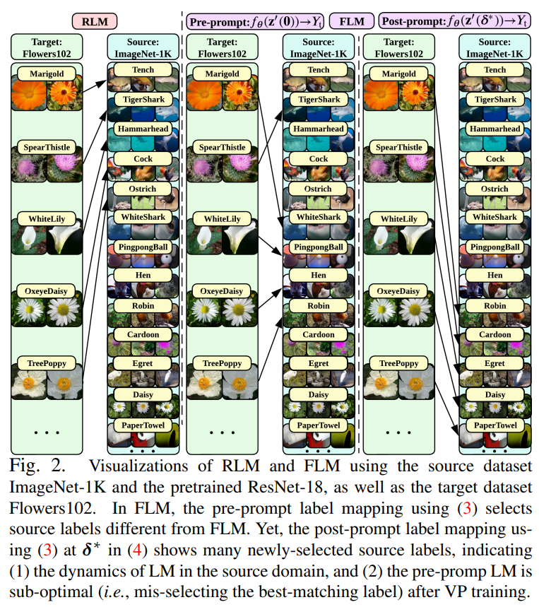

그림 2에 나와 있듯이, 

- FLM 은 RLM 과 다른 매핑 체계를 결과로 도출하지만, 얻어진 LM 결과를 해석하기는 여전히 어렵고, LM 의 품질이 VP 성능에 미치는 영향도 불분명
- 본 논문의 나머지 부분에선, LM 체계를 신중하게 설계하고, 다양한 source 및 downstream task 에서 언제 그리고 왜 LM 이 중요한지에 대해 설명하면서 VP 를 개선하는 방법에 대해 다룰 것

# 4. Method: Iterative Label Mapping-based VP

여기서 이전 연구에서 간과한, VP 의 source task domain 에서 존재하는 LM 의 _hidden dynamic_ 을 밝히는 것

이 발견은 novel VP framework 인 Iterative LM-based VP (**ILM-VP**) 를 개발하는 동기가 됨

기존 VP 와 비교하여, ILM-VP 는 LM 과 prompt generation 간의 루프를 닫아줌으로써 VP 의 explanation 및 target task accuracy 를 동시에 향상

#### The 'missing' dynamics of LM in the source domain.

Sec. 3 처럼, prompt learning pipeline 은 주로 세 단계 구성:

(A1) : input prompt modeling

(A2) : LM (source label set $\mathcal{Y}_s$ 에서 target label set $\mathcal{Y}_s$)

(A3) : prompt generation

이전 연구들은 pipeline (A1)→(A2)→(A3) 를 따라 desired prompt $\delta*$ 을 생성하여 source model 이 target tasks 를 수행하도록 함.

하지만 _source_ domain 관점에서 prompt updating 이 $\delta = 0$ 에서 $\delta^*$ 로 진행됨에 따라 source model $f_{\theta_s}$ 의 prediction dynamics 가 발생.

즉,

$$
\begin{equation}
  f_{\theta_s} (x'(0)) \rightarrow f_{\theta_s} (x' (\delta^*)),
\end{equation}
$$

- $x'(\delta)$ : source data point 와 동일한 dimension 을 가진 $\delta$-perturbed target data 를 나타냄
- 이 dynamics 를 이해하는 것은 selected source labels 가 target labels 로 mapping 될 때의 안정성을 반영하므로 중요

---

- Fig. 2 는 'ImageNet (source) + Flower102 (target)' 상황에서 FLM-oriented VP approach 를 사용할 때의 dynamics 를 구체화
- prompt generation 시작 전에, FLM method 를 사용하여 Flowers102 target labels 가 ImageNet source labels 에 mapping
  - 이는 prompt learning (A2) step 에 해당 프롬프트 학습의 단계 (A2)에 해당
- 이로써 _pre-prompt_ target-source mapping 이 이루어지며, 이는 $f_{\theta_s}(x'(0)) \overset{\text{FLM}}{\rightarrow} \mathcal{Y}_t$ 로 표시
- 유사하게, (A3) 을 따라 prompt $\delta^*$ 를 생성한 후, FLM method 를 사용하여 _post-prompt_ target-source mapping 인 $f_{\theta_s}(x'(\delta^*)) \overset{\text{FLM}}{\rightarrow} \mathcal{Y}_t$ 을 얻을 수 있음
- Fig. 2 는 pre-prompt LM 과 post-prompt LM 사이에 상당한 차이가 있음을 보여줌
  - 이는 post-prompt 단계에서 새롭게 선택된 source labels (‘Cardoon’, ‘Egret’, ‘Daisy’, ‘Paper Towel’)로 증명
  - 이는 LM 에서의 dynamics 를 정당화하지만, 기존의 source domain 에서의 LM dynamics 로 인해 pre-prompt target-source LM 이 prompt generation 에 대해 _sub-optimal_ 이라는 _new concern_ 을 제기

### ILM-VP: A bi-level optimization viewpoint of VP.

LM 의 dynamics 는 현재 VP pipeline: (A1)→(A2)→(A3) 의 최적성을 재고함

이를 개선하기 위해, 저자는 LM dynamics 를 prompt learning process 에 포함시키는 것을 제안

- 이는 기존 VP pipeline 을 (A1)→(A2)⇄(A3) 로 수정하여, LM 과 prompt generation 을 폐쇄 루프로 만듦
- LM 의 설계가 prompt generation 과 상호작용하게 되므로, 제안된 새로운 설계를 ILM-VP 라고 부름

다음으로, 저자는 bi-level optimization (**BLO**) 의 lens 를 통해 ILM-VP 를 공식적으로 제시

- 일반적으로, BLO 는 two levels (즉, upper 및 lower levels)의 optimization task 를 포함하는 hierarchical learning framework 를 제공하며, 하나의 task 가 다른 task 내부에 중첩됨 (즉, upper-level 문제의 objectives 와 variables 는 lower-level 문제의 optimizer 에 의존)
- ILM-VP 의 맥락에서 저자는 prompt generation problem 을 upper-level optimization task 로, LM problem 을 lower-level problem 으로 간주

이는 다음을 산출.

$$
\begin{equation}
  \underbrace{\underset{\delta}{\text{minimize}} \quad \mathbb{E}_{(x_t, y_t) \in \mathcal{T}_{tr}} [\ell (f_{\theta_s} (x'(\delta)), y_s^*(y_t))] }_{\text{Upper-level prompt optimization}} \quad \text{subject to} \quad \underbrace{y^*_s(y_t) \text{ is obtained by (3) at (non-zero) prompt } \delta}_{\text{Lower-level LM design at currect prompt} \delta \text{for every target label } y_t}
\end{equation}
$$

- 여기서 visual prompt $\delta$ 는 upper-label variable 이고, $\ell$ 은 cross-entropy loss 이다.
- mapped source label $y_s$ 는 주어진 target label $y_t$ 에 대한 lower-level variable 이다.
- 또한 (5) 에는 lower-level constraint 가 존재함을 주목해야 함. 
  - 이 constraint 는 source class 가 target class 에 mapping 되면, new target class 에 mapping 될 때, 제외되도록 한다.
- 나아가 (5) 에서 visual prompt $\delta$ 와 LM $y^*_s$ (vs. $y_t$) 의 설계가 서로 얽혀 있다는 것이 분명하다.

---

problem (5) 해결을 위해, 저자는 upper-level prompt generation 과 lower-level LM 을 번갈아 실행하는 alternating optimization (AO) 방법을 사용

알고리즘 세부 사항은 Algorithm 1 에 요약되어 있으며, 도식적인 개요는 Fig. A2 에 제공

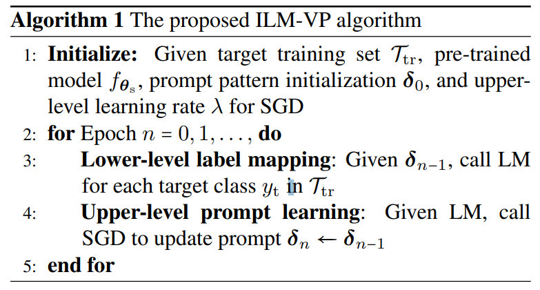

#### An interpretation merit of ILM-VP.

VP 가 source model 을 reprogramming 하여 target task 를 수행할 수 있는 이유를 해석하는 것을 어려움.

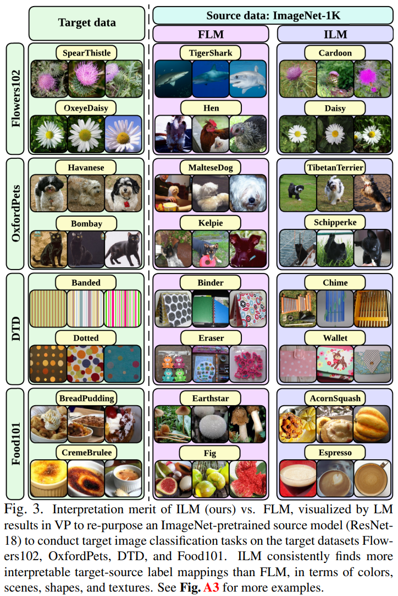

VP 를 해석하는 데 주요 장애물은 LM 단계에 있음:

- semantics-irrelevant source labels 을 왜 target label 에 mapping 해야 하는지 명확하지 않음
- 그러나 저자는 ILM-VP 가 이러한 해석의 어려움을 상당 부분 완화할 수 있음을 발견
  - 저자는 Fig. 3 에서 실증 연구를 통해 ILM-VP 의 해석적 장점을 보여줌
  - 여기서 target dataset 은 Flowers102 로, source dataset 은 ImageNet-1K 로 설정
- 저자는 target labels, baseline FLM method 를 사용한 mapped source labels, ILM-VP 를 사용하여 identified source labels 를 이미지 예시와 함께 나열
  - 보이다시피, ILM-VP 는 target label 과 source label 이 다른 주제를 설명하더라도 interpretable target-source mapping 을 발견
  - 예를 들어, 'Spear Thistle' label 의 target image 와 'Cardoon' label 의 source image 는 비슷한 색상과 객체 모양을 공유
  - 다른 target-source label mappings 와 해당 data instance 에서도 동일한 관찰
  - 이 발견은 매우 고무적이며 FLM 과는 뚜렷한 대조를 이룸
- Sec. 5 에서 명확히 할 것처럼, BLO-oriented ILM-VP (5)는 alternating optimization 이 진행됨에 따라 LM 의 수렴을 강제할 것임
  - 결과적으로, 가장 유사한 개념(e.g., 색상, 장면, 모양 및 재료)을 공유하는 source label 과 target label 이 식별될 것임
  - 또한 LM 의 향상된 interpretation 이 VP 의 target task accuracy 를 일관되게 향상시키는 것을 보여줌

# 5. Experiments

## 5.1. Experiment setups

#### Datasets and models

- source domain : ImageNet-1K pre-trained ResNet-18 및 ResNet-50 과 Instagram pre-trained ResNeXt-101-32x8d 을 source model 로 고려
- target domain : ILM-VP 의 성능을 다음 13 target dataset 에서 평가
  - Flowers102, DTD, UCF101, Food101, GTSRB, SVHN, EuroSAT, OxfordPets, StanfordCars, SUN397, CIFAR10/100, ABIDE

#### Baselines and evaluations.

- VP 패러다임에선 random LM-based VP (**RLM-VP**) 및 frequency LM-based VP (FLM-VP) 를 baselines 로 포함.
- VP 는 source model 을 target image classification task 에 사용할 수 있게 하는 fine-tuning 이 필요 없는 방법.
- VP baseline 을 구현할 때, 공식 레포지토리 설정을 따름

prompting 외에도, 

- linear probing (**LP**) 및 end-to-end full fine-tuning (**FF**) 을 포함한 finetuning-based method 다룸
- finetuning 은 source model parameters 를 수정하기 때문에, more parameters 및 computationally intensive 요구

모든 방법의 성능은 test-time 의 target task accuracy 와 VP 또는 finetuning 이 처리해야 하는 parameter size 측면에서 평가

- 또한, 다양한 VP 의 visual explanation quality 를 평가하기 위해 post-hoc model explanation method 인 Explanation-by-Example (EBE) 를 사용
- EBE 의 핵심 아이디어는 queried test datapoint 와 most similar feature representation 을 가진 train-time datapoints 를 찾아 이 identified training samples 을 사용해 model 의 test samples prediction 을 설명하는 것
- VP 의 맥락에서, EBE 는 prompted target test data 에 대한 model prediction 을 설명할 수 있는 source training samples 를 찾는 데 도움을 줄 수 있으며, 이는 Fig. 3 의 source examples 와 같음

## 5.2. Experiments results

#### Overall performance of ILM-VP.

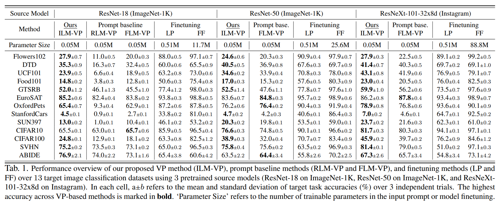

Table 1 은 다양한 source models 및 target datasets 에서의 ILM-VP 및 VP baselines (RLM-VP 및 FLM-VP) 간의 효과를 보여줌. 비교를 위해 LP 또는 FF 를 사용하여 target dataset 에서 model finetuning 도 제시.

- FLM-VP 는 일반적으로 RLM-VP 보다 우수한데, 이는 latter 가 prompt learning 을 guide 하기 위해 random label mapping 만을 사용하기 때문. 따라서 ResNet-18 을 사용할 때만 RLM-VP 결과만 보여줌
- Tab. 1 처럼, ILM-VP 는 거의 모든 data-model setup 에서 다른 VP baselines 큰 폭으로 능가. e.g., target dataset 인 Flowers102, CIFAR100, GTSRB 에서 각각 7.9%, 6.7% 및 6.5% 의 정확도 향상을 보임
- 또한 finetuning 은 일반적으로 prompt 보다 transfer learning 에서 더 효과적
  - 이는 source model 이 수정될 수 있고, trainable parameter size 가 증가하기 때문 (Tab. 1 의 'Parameter Size' 참조)
- Sec. 6 에서 볼 수 있듯이, language-vision sourc emodel 을 사용하면 VP 의 정확도가 더욱 향상
- 그럼에도 불구하고, target dataset ABIDE 에선 prompting 방법이 full model finetuning (FF) 보다 우수할 수 있음
  - ABIDE 는 새로운 의료 데이터셋으로, 원래 1D 숫자 의료 입력 시퀀스를 이미지 유사 데이터 형식 (즉, brain-regional correlation graphs)으로 변환
  - 이 데이터셋의 크기는 의료 데이터 수집의 높은 비용으로 인해 매우 작아 LP 와 FF 의 성능을 제한. 반면, VP 는 이 설정에 적합
- 마지막으로, model finetuning 패러다임에서는 source model 의 용량이 클수록 일반적으로 더 나은 target task accuracy 제공
  - 예로, ResNet-50 과 ResNet-18 의 finetuning 결과. 
  - 그러나 VP 패러다임에선 이 믿음이 반드시 성립하지 않을 수 있음. 예로, target datasets 인 Flowers102, EuroSAT, CIFAR100 및 ABIDE 에서 ResNet-50 에서 prompting-induced target accuracy 가 감소

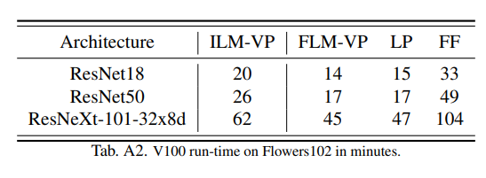

Tab. A2 에선  ILM-VP 가 FLM-VP 와 LP 보다 약간 더 많은 실행 시간을 필요로 하지만, FF 보다는 빠르다는 것을 보여줌

- 이는 former 가 일반적인 single-level minimization 보다 약간 더 높은 계산 복잡성을 가지는 alternating optimization 을 채택하기 때문에 놀랍지 않다.
- 최근의 동시 연구에선 VP 와 통합하기 전에, 이미지를 적절히 크기 조정하면 downstream task 의 성능이 더욱 향상될 수 있음을 보여준다.
- 또한 CIFAR10/100, GTSRB 및 SVHN 에서 VP 에 대한 이미지 크기 조정의 동일한 이점을 발견 (e.g., 원본 이미지 크기를 128×128 로 upscaling)
- 그러나 기존 VP baseline (RLM-VP) 과의 비교를 쉽게 하기 위해, 저자의 실험에서는 VP 에 이미지 크기 조정 트릭을 적용하지 않음

#### LM is key to improving the accuracy of VP.

다음으로, ILM-VP 를 사용할 때 LM 이 target prediction accuracy 에 미치는 영향을 조사.

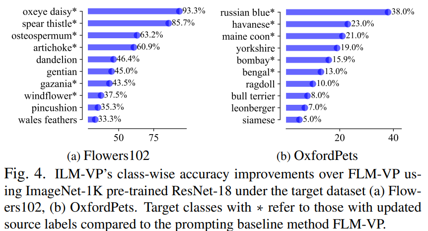


Fig. 4에서 

- target dataset Flowers102 와 OxfordPets 에서 highest 10 class 에 대해 prompt-injected datapoint 의 test accuracy 향상을 보여줌
- OxfordPets 는 ImageNet 과 가장 유사한 label space 공유 (e.g., both beagles, boxers, bassets, 등)
- Fig. 4 에선 ILM-VP 도중, source label 이 remapped source label 을 $*$ 로 표시하고, FLM-VP 와 동일한 source labels 를 유지하는 target data class 를 non-$*$ 로 나열
- 큰 정확도 향상을 보이는 target class 는 대개 ILM 이 필요하다는 것을 관찰
  - 이는 prompt learning 중 target-source label remapping 의 이점을 입증
  - 또한, target class (e.g., OxfordPets 의 ‘yorkshire’) 의 source labels 가 remapping 되지 않더라도 ILM-VP 는 여전히 정확도 향상을 가져옴
    - 이는 LM 이 all classes 에 coupling 효과를 가지며 BLO framework (5) 가 LM 뿐만 아니라 prompt learning 도 상호작용 방식으로 개선할 수 있음을 의미

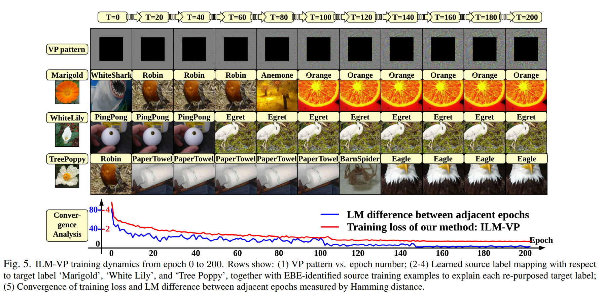

Fig. 5 는 ILM-VP 의 training dynamics 와 training epochs 수에 따른 수렴을 보여준다.

- early training epochs 에서 target class 의 source label 이 업데이트되지만, later training 단계에서 수렴하는 경향이 있음
- LM 차이와 VP training loss 의 수렴에서도 유사한 경향을 볼 수 있음.
- 또한 VP pattern 과 LM 이 jointly updating 을 알 수 있습니다.
- training 진행됨에 따라 mapped source labels 의 설명 가능성도 증가
  - 예로, target label ‘Marigold’ 는 EBE-identified examples 에서 시각화된 것처럼 color 및 shape 에서 source label ‘Orange’ 와 유사성을 공유
  - EBE 는 source dataset 과 target dataset 을 직접 연결할 수 있게 해주어 VP 의 원리를 더 잘 이해하는 데 도움을 줌. 

#### How target dataset scale affects VP?

많은 수의 target dastasets 에 대한 실험을 통홰, ILM-VP 가 larger target label space 의 task 에서 더욱 강력해진다는 것을 발견

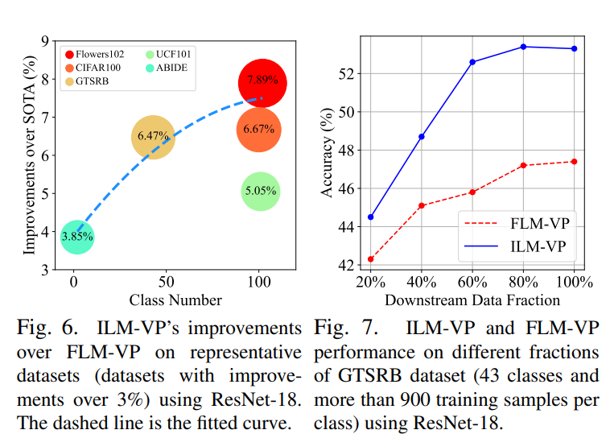

- 예로, Fig. 6 은 ResNet-18 에서 ILM-VP 가 FLM-VP 에 비해 적어도 3% 이상의 정확도 향상을 보이는 target dataset 을 보여줌
- target class 수가 가장 많은 target dataset 은 ILM-VP 가 가져온 가장 큰 정확도 향상과 일치
- 다음으로, target dataset 을 고정하고, downstream training dataset size 에서 VP 가 어떻게 동작하는지 연구
  - 여기서 target task 로 GTSRB 를 선택한 이유는 GTSRB 가 충분한 양의 traikning data 를 포함하고 있어 training dataset partition 을 수행하기에 적합하기 때문
- Fig, 7 은 target training dataset size (전체 training 20% 에서 100% 까지)를 기준으로 ILM-VP 와 FLM-VP 의 성능을 비교
  - ILM-VP 는 FLM-VP baseline 을 일관되게 능가하며, 데이터 규모가 커질수록 향상이 더욱 두드러짐

# 6. Extension: LM in Text Domain for CLIP

이전 섹션에선 pre-trained vision model 을 reprogramming 하여 downstream target vision task 를 수행할 때 LM 이 VP 에서 중요한 역할을 할 수 있음을 보여줌

이 섹션에선 vision source model 에서 CLIP(Contrastive Language-Image Pretraining)이라는 vision-language model 로 초점을 이동.

CLIP 은 VP 분야에서 점점 더 많은 관심을 받고 있다.

저자는 CLIP 이 multi-modal learning architecture 덕에 image label 간의 source-target mapping 이 필요로 하지 않더라도, 반복적인 LM 에 대한 제안된 아이디어를 _text prompt selection_ 에 확장하여 target task 의 정확도를 향상시킬 수 있음을 보여줌

#### LM for CLIP.

vision-only model 과 달리, CLIP 은 target data labels 를 textual input 으로 직접 받아 source-target label mapping 문제를 완화할 수 있다.

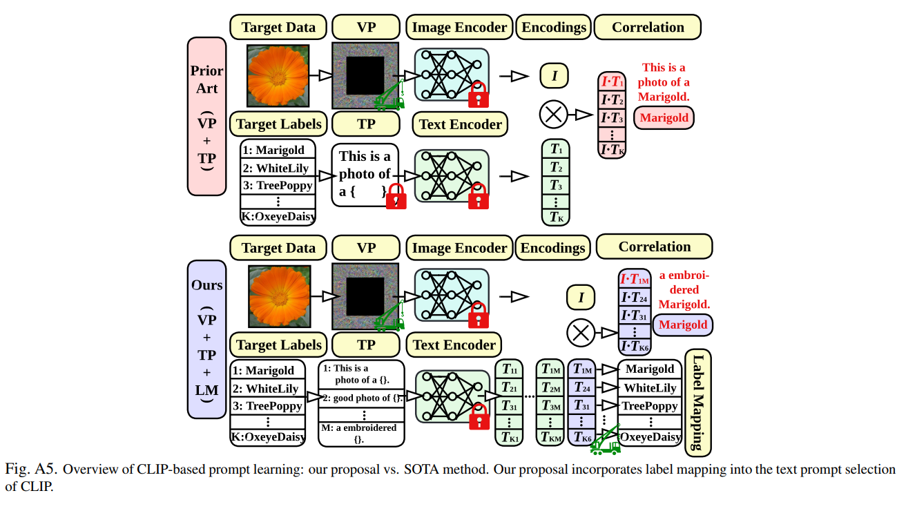

- 이 setting 에선 LM 이 불필요해 보일 수 있지만, 이는 image domain 에서 VP 에만 적용한다.
- 저자는 CLIP 이 text label 의 다양성을 고려할 때 여전히 암묵적인 LM 이 필요하다고 주장
  - 즉, CLIP 은 text label 을 제안된 다양한 context prompt templates (81 templates) 과 결합하여 여러 text label instance 를 만들 수 있다.
  - 예로, target label 'dog' 는 'A photo of a big {label}'과 'A photo of a small {label}'과 같은 context prompt 와 결합될 수 있다. 
  - 따라서, $m$ context prompts 와 $K_t$ target data labels 를 고려할 때, $mK_t$ 'virtual source labels' 를 생성할 수 있으며, 이는 $K_t$ target label 에 mapping 되야 한다
  - 따라서 LM 문제가 발생하며, optimal solution 은 text domain 의 prompted image data 에 대한 optimal prompt selection 을 특징으로 함
- BLO 방법 (5) 과 유사하게, CLIP model 을 사용하여 VP 에 반복적인 LM 을 적용할 수 있으며, lower-level image label mapping 을 context-fused text label mapping 으로 대체
- BLO 는 CLIP 과 쉽게 호환될 수 있는 unified prompt learning framework 를 제공

#### LM improves VP's accuracy using CLIP.

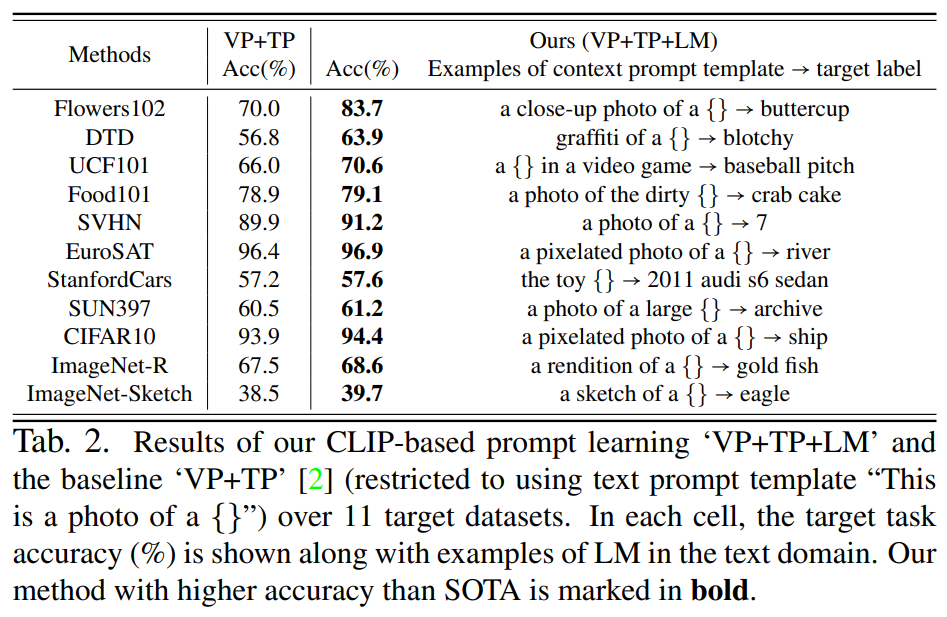

Tab. 2 에선, Flowers102 와 DTD 같은 몇 가지 도전적인 target task 에서 VP 기반 CLIP 모델의 성능을 보여줌.

- 저자의 방법을 ‘VP+TP+LM’ 이라고 부르며, 여기서 BLO-enabled LM 방법이 'virtual source labels' (즉, context prompt template 및 target label 의 조합)을 realistic target image labels 에 mapping 하는 역할을 함
- 비교를 위해, VP 를 위한 visual prompt 를 생성할 때 'This is a photo of a {label}' 라는 pre-defined fixed context prompt template 을 사용하는 기준 방법인 ‘VP + TP’ 의 성능도 제시
- 저자의 제안이 baselines 를 상당한 차이로 능가하는 것을 볼 수 있음
  - 예로, Flowers102 와 DTD 에서 각각 13.7%와 7.1% 의 정확도 향상을 얻음

또한 LM 이 해석 가능성을 가져온다는 점을 발견

- 저자의 selcted context prompt templates 은 baselines 에서 사용된 것보다 더 나은 의미를 가지고 있음.
  - 예로, Flowers102 를 위한 VP 는 'buttercup' label 의 target image 에 대해  ‘a closeup photo of a {}’ 이란 text prompt 를 선택하는 반면, baseline 은 ‘This is a photo of {}’ 를 사용
  - 또 다른 예로, CIFAR10 을 위한 VP 는 ‘a pixelated photo of a {}’ 이라는 text prompt 선호
  - 특, domain shift datasets (ImageNet-R 및 ImageNet-Sketch) 에선 selected prompts 가 domain information 을 나타낼 수 있다.

# 7. Conclusion

이 논문은 VP framework 에서 LM 의 중요성을 밝혀냄

VP 를 최적화하는 prediction dynamics 에서 영감을 받아, 저자는 VP 문제를 BLO (bi-level optimization)의 관점에서 공식화.

저자의 공식화에 따라 input pattern training 및 LM 기능을 jointly optimizing 하는 새로운 ILM-VP 알고리즘을 제안

13 dataset 에서 저자의 방법이 SOTA VP baseline 보다 상당한 정확도 향상을 가져오는 것을 보여줌

또한, 저자의 방법을 CLIP 으로 확장하여 downstream task performance 를 향상시킴