논문 및 이미지 출처 : <https://openaccess.thecvf.com/content/CVPR2023/papers/Huang_Diversity-Aware_Meta_Visual_Prompting_CVPR_2023_paper.pdf>

# Abstract

저자는 Diversity-Aware Meta Visual Prompting (DAM-VP)을 제안

- 이는 pre-trained models 를 frozen backbone 으로 다양한 downstream task 에 효과적으로 transfer 하기 위한 효율적이고 효과적인 prompting 방
- visual prompting 의 한 어려운 문제는 image dataset 이 종종 다양성이 크며, 각 dataset 마다 generic prompt 는 pretraining data 의 complex distribution shift 를 제대로 처리하기 어렵다는 점이다

이를 해결하기 위해, dataset **D**iversity-**A**ware promptiong 전략을 제안하며. 이 initialization 은 **M**eta-prompt 를 통해 이루어짐.

- 구체적으로, downstream dataset 을 diversity-adaptive 방식으로 small homogeneity subset 으로 clustering 하며, 각 subset 은 별도의 optimized prompt 를 갖는다
  - 이런 divide-and-conquer 설계는 optimization 어려움을 크게 줄이고 prompting 성능을 크게 향상
  - 또한, all prompt 는 여러 dataset 을 거쳐 학습된 meta-prompt 로 초기화된다
- 이는 이전 dataset 에서 학습한 probing knowledge 가 new dataset 에서 빠르게 수렴하고 더 나은 성능을 발휘할 수 있다는 주요 관찰에 기반한 bootstrapped paradigm
- inference 중, input 과 각 subset 간의 feature distance 를 기반으로, 각 input 에 적절한 prompt 를 동적으로 선택한다.

광범위한 실험을 통해, DAM-VP 는 우수한 효율성과 효과를 보여주며, 다양한 pre-trained model 에 대해 downstream dataset 에서 이전 prompting 방법을 명확히 능가.

# 1. Introduction

training data 와 model size 증가와 함께, pretraining-finetuning paradigm 은 NLP, CV 등 여러 분야에 성과를 이룸.

하지만 각 downstream task 에 large pre-trained model 을 fully fine-tuning 하는 것은, 사본 유지 및 저장 배포에 문제가 있으며 이는 특히 downstream task 의 수가 증가함에 따라 비용이 더욱 커지며 비효율적이다.

---

이를 해결하기 위해, pre-trained model 을 특정 dataset 에 efficiently transfer 하기 위한 노력들이 있다.

Prompting 은 NLP 에서 연구된 방법으로, input sequence 앞에 few tokens 를 append 하여 task-specific knowledge 를 제공함으로써 fine-tuning 하지 않고도 downstream task 에 잘 적응되도록 한다.

이에 영감을 받아, 최근 vision model 을 위한 visual prompting 이 제안되었다.

input image 에 learnable noise 를 추가하거나 model input sequence 에 learnable token 을 추가하여 pre-trained model 은 다양한 downstream task 에서 promising results 를 보여준다.

---

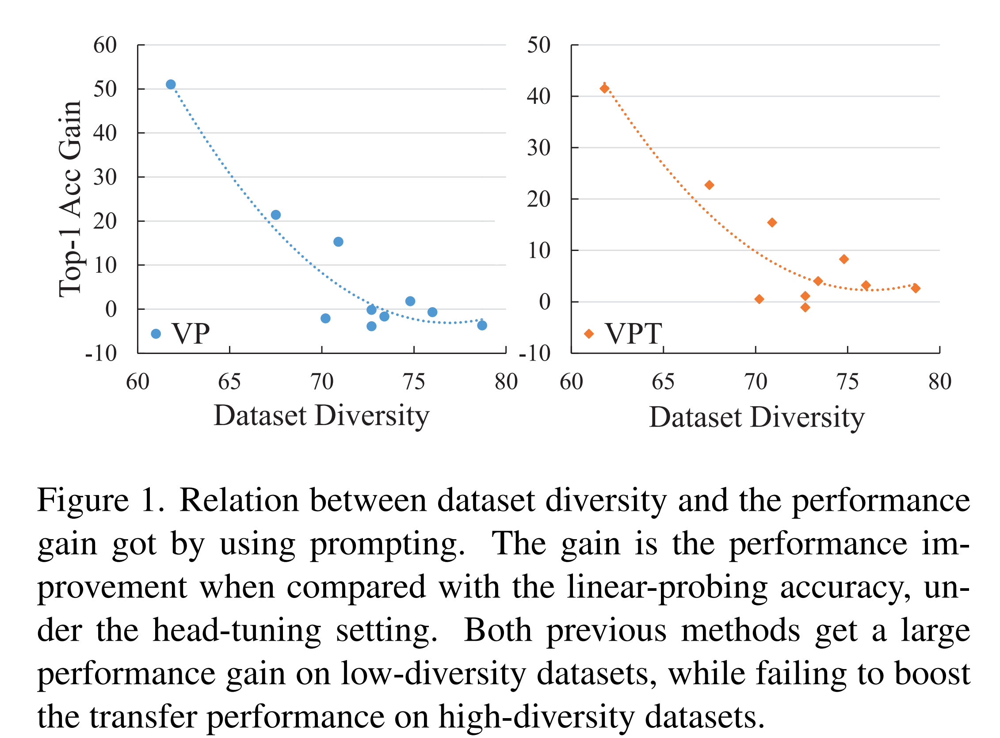

하지만 이 방법들은 image dataset 의 다양한 distribution property 를 무시하며, 각 dataset 의 모든 iamge 에 single prompt 를 사용하는 것이 최적이 아님을 주장.

Fig. 1 은 prompting 의 gain 및 dataset 의 diversity 간의 관계를 보여줌

- 여기서 gain 은 linear probing setting 과 비교한 정확도 향상을 나타냄
- VP 및 VPT 모두 low-diversity dataset 에서 model 정확도를 크게 향상시키지만, high-diversity dataset 에선 small gain 을 얻는 것을 발견
  - 예로, low-diversity dataset 인 street view house number dataset (SVHN) 에선 all images 가 similar content 를 가지고 있어 unified prompt 로 충분하다
  - 반면, high-diversity dataset 인 ImgaeNet 에선 매우 다양한 class 를 포함하며 class 간의 pre-trained relationship 이 없기 때문에, "car" 및 "dog" 같은 all image 에 대한 single prompt 사용이 어렵다.

이 관찰에 영감을 받아, 저자는 Diversity-Aware Meta Visual Prompting (DAM-VP)을 제안한다.

이는 두 핵심 설계를 가진다.

1) high-diversity dataset 의 각 image 에 적절한 prompt 제공을 위해, 저자는 clustering-based prompt selection method 를 제안.
   - 구체적으로, pre-trained vision model 과 downstream dataset 이 주어졌을때, off-the-shelf clustering method 를 사용하여 downstream data 의 features 를 여러 coarse-grained subset 으로 clustering 하고, 각 custer 가 own prompt separetely 로 학습하도록 guide
   - same clustered data 의 strong homogeneity 를 기반으로, cluster-specific visual prompt 의 optimization 이 크게 촉진되고 데이터 공통점도 쉽게 다룰 수 있다. 
2) cluster 또는 dataset 간의 prompt 가 일부 공통 패턴을 가질 수 있으며, 이를 통해 모델이 new dataset 에 더 빨리 적응하고 더 나은 성능을 얻을 수 있다고 주장
   - 이는 meta-learning-based method 를 도입하여 meta promp 를 학습하고 각 cluster 의 prompt 를 초기화하도록 한다.

---

저자는 다양한 data diversity 를 가진 dataset 에서 실험을 수행하고, 다른 pre-trained model 과의 transfer performance 평가.

- 널리 사용되는 head-tuning setting 과 더 어려운 head-freezing/missing setting 에서 성능 보고
- DAM-VP 는 이전 방법들을 큰 차이로 성능이 우수하며, 특히 high-diversity dataset 에서 그럼.
  - 예로, ImageNet22K pre-trained ViT-B 를 사용하여, DAM-VP 는 다양한 DTD dataset 에서 head-tuning setting 에서 top-1 accuracy 73.1% 을 얻으며, VP 및 VPT 보다 각각 +13.6% 및 +7.3% 더 우수
- DAM-VP 가 효율적임을 발견했으며, 10 epochs tuning 만으로 10 dataset 에서 평균 top-1 accuracy 85.7% 를 얻으며, 100 epochs tuning 에선 이전 방법들 (VP - 83.4%, VPT - 85.5%) 와 comparable

---

주요 기여는 다음과 같이 요약

- 이전 visual prompting 의 한계를 분석하고, vision-suitable prompting 은 dataset diversity 를 고려해야 함을 지적
- 이에 따라, 우리는 새로운 Diversity-Aware Meta Visual Prompting (DAM-VP) 방법을 제안
  - 이는 high-diversity dataset 을 subset 으로 clustering 하고 각 subset 에 대한 separate prompt 를 학습하는 meta prompt learning 설계와 협력하여 divide-and-conquer 아이디어를 사용
- 광범위한 실험을 통해, DAM-VP 는 우수한 성능을 보여주며, 다양한 pre-trained model 에 대해 일련의 downstream dataset 에서 SOTA 달성

# 2. Related Work

#### Prompt learning.

prompting 은 original PLM 을 downstream task 에 adapting 하기 위해 NLP 분야에서 등장.

downstream data 를 pre-training stage 에서 학습한 model knowledge 로 재구성하여, model parameter 를 tuning 하지 않고도 frozen pre-trained model 이 task 를 이해할 수 있게 하는것.

이 목표는 task-specific template 과 label words 가 포함된 pure text template 을 구성하여 cloze test 를 수행하는 방식

예로, hand-craft prompt 와 generative text prompts 가 있지만, 여전히 specialized linguistic expertise 가 필요했으며 이를 완화하기 위해 Prompt Tuning 에 대한 노력이 집중되고 있음.

이는 tunable prefix tokens 으로 task specific contunuous vector 를 학습함. 이 tokens 는 gradient 를 통해 최적화되어 task adaptation 에 prompt 가 작용하며, pre-trained model 은 그대로 유지된다.

language prompt 성공에 힘입어 CoOP 및 coCoOP 같은 multi-modal 상황에 visual-related prompting 탐구가 급속히 증가하지만, 여전히 실질적으로는 text prompting 에 집중한다.

language 및 image 사이의 information density gap 으로 인해 vision model 을 위한 prompting 은 어렵다.

---

prefix tuning 에 영감을 받은 VPT 는 model input 에 learnable token set 을 추가하여 ViT 를 downstream task 에 적응시킨 첫 연구이며, 동시에 VP 는 pixel level 관점에서 input image 와 unified task-specific patch 를 최적화한다.

두 성공에도 불구하고, 이들은 prompt 수를 지정해야 하며, 다양한 dataset 을 유연하게 처리하는 데 한계가 있음을 발견한다. 반면에 저자의 방법은 다양성 adapting solution 을 사용하여 이 문제를 잘 해결한다.

#### Transfer learning

transfer learning 은 new task 를 다룰 때, superviserd 또는 un-/self-supervised pre-trained model 을 효율적으로 fine-tuning 하는 데 중점을 둔다.

전통적인 transfer learning 은 new task 의 training data 에 대해 all model parameter 를 fully fine-tuning 하여 pre-trained knowledge 를 model initialization 으로 사용하는 것이다.

그러나 모델 용량이 증가함에 따라 fully fine-tuning 의 비효율성이 드러나고, downstream task 에서 parameter efficient learning 의 필요성이 대두된다. 

즉, few parameter 를 선택 또는 추가하여 tuning 하고 나머지 model 은 freezing 하는 것이다.

이 주제는 NLP 에서 transformer input 에 extra learnable tokens 또는 feature vectors 를 추가하는 방식으로 광범위하게 탐구되었다

그러나 vision 분야에서는 여전히 ConvNets 에 초점을 두며, 새로운 vision transformer 에 대해선 거의 연구되지 않았다.

이 gap 을 해소하기 위해, 최근에는 self-attention block 의 MLP module 에 parallel trainable down-to-up branch 를 도입하거나, learned features 를 scaling 및 shifting 하여 vision transformer 를 효율적으로 transfer 하는 방법이 탐구되었다.

VPT 는 visual prompting 을 위한 learnable prefix tokens/features 를 활용한 선구적 연구지만, 수렴 시간 측면에서 효율적이지 않다.

이를 바탕으로 DAM-VP 는 도입된 learnable parameters 양이 비슷하면서도 tuning 을 더 빠르게 학습하려 노력한다

# 3. Method

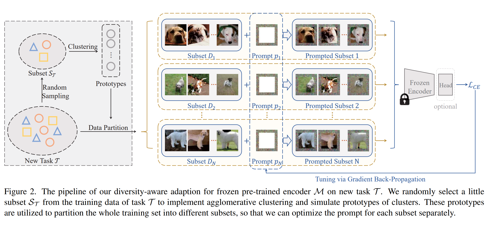

Diversity-Aware Meta Visual Prompting (DAM-VP) 소개.

DAM-VP 는 diverse downstream tasks 에 효과적이고 효율적으로 적응하는 새로운 prompting 방법.

Fig. 2 와 같이, 주어진 dataset 을 이용하여 DAM-VP 는 먼저 unsupervised 으로 specific prototypes 를 추출하여 pre-processing.

이후, dataset 을 prototypes 에 따라 다양한 subset 으로 나눈다. 각 subset 에는 specific prompt 를 할당하고 tuning loss 를 통해 optimizing 한다.

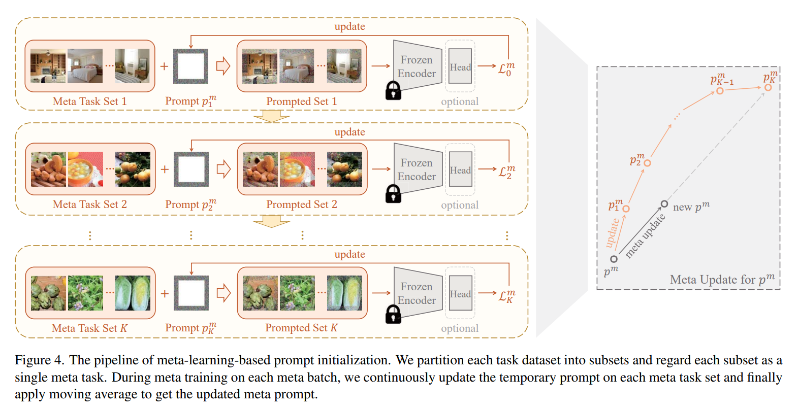

random initialization 대신, 모든 prompt 는 Fig. 4 처럼 서로 다른 dataset 에서 학습된 meta prompt 로 초기화된다.

#### Diversity-adaptive dataset partition.

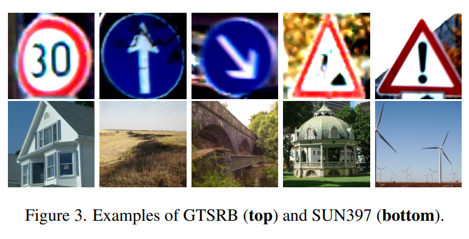

서로 다른 image dataset 은 서로 다른 distribution diversity 를 가지고 있다.

예로, Fig. 3 의 교통 표지만 dataset 과 비교하여, scene dataset 은 각도, 조명, 내용의 복잡성 등에 더 다양하다.

prompting 은 target downstream dataset 과 model pretraining data 사이의 distribution gap 을 줄이기 위해 설계되었으며, similar content 를 가진 dataset 은 transfer 이 용이하다는 것이 직관적이다.

따라서, diverse dataset 을 small subsets 로 나누고, 각 subset 에 다른 prompt 를 적용하는 것이 직관적인 아이디어다.

---

이를 위해, visual prompting design 에 divserity property 를 고려하고, task data 의 diversity 에 자동으로 적응하는 adaptive dataset partition 전략을 제안한다.

- 구체적으로, frozen pre-trained backbone $\mathcal{M}$ 을 new task $\mathcal{T}$ 에 adapting 할 때, 먼저 $\mathcal{T}$ 의 training set 에서 small subset $\mathcal{S}_\mathcal{T}$ 을 randomly sampling
- 그런 다음 prompting 없이 frozen $\mathcal{M}$ 을 사용하여 subset $\mathcal{S}_\mathcal{T}$ 의 feature 를 추출
- 이 feature 를 $\{\mathcal{M}(s)|s \in \mathcal{S}_\mathcal{T}\}$ 로 표시하고, off-the-shelf clustering method 를 사용하여 이를 여러 cluster 로 집계
- clustering procedure 는  time efficient (total tuning time 의 1% 미만) 하며, clusters 수 $N$ 은 pre-defined threshold 에 따라 dataset 의 diversity 에 자동으로 adapting
- cluster 가 구성되면, 각 cluster 의 featre average values 를 cluster-specific prototypes $\{ c_i \}^N_{i=1}$ 로 계산. 즉,

$$
\begin{equation}
  c_i = \frac{1}{|\mathcal{S}_i|}\sum_{s\in \mathcal{S}_i}\mathcal{M}(s), \quad i = 1, \cdots, N,
\end{equation}
$$

- $\mathcal{S}_i$ : $|\mathcal{S}_1| + |\mathcal{S}_2| + \cdots + |\mathcal{S}_N| = |\mathcal{S}_\mathcal{T}|$ 를 만족하는 $i^{th}$ cluster 에 해당하는 data samples

unsupervised mechanism 은 자연스럽게 higher diversity dataset 을 더 많은 cluster 로 나눌 수 있도록 보장하며, lower diversity dataset 은 fewer cluster 또는 single cluster 로 나눌 수 있다.

실무에선 $N$ 을 적절한 범위 내로 유지하기 위해 clustering threshold 를 설정하여, 일반적으로 data category number 보다 적게 함

#### Diversity-aware prompt selection.

simulated prototypes $\{ c_i \}^N_{i=1}$ 를 사용하여, task $\mathclap{T}$ 의 whole training dataset $\mathcal{D}_\mathcal{T}$ 를 small subsets $\{ \mathcal{D}_i \}^N_{i=1}$ 으로 쉽게 분할할 수 있다.

이에 따라 각 subset 에 one visual prompt 를 할당하여 총 $N$ visual prompts $\{ p_i \}^N_{i=1}$ 을 얻습니다. 

VP 의 설계와 유사하게, photo-frame-like pixel-level prompting 을 사용한다.

- 이는 model input 과 동일한 size 를 가지며 input image 에 직접 추가된다.
- 이 설계에는 두 가지 장점이 있다.
  1. inference 중 추가 비용이 발생되지 않으며, VPT 의 prefix token prompting 은 input length 를 증가시켜 더 큰 계산 비용을 초래한다.
  2. 이러한 pixel level 의 prompting 은 모델 유형에 무관하여 최근 인기 있는 ViT 모델과 전통적인 CNN 모두에 사용 가능. 반면, prefix token prompting 은 token list 유형 입력을 위해 특별히 설계되어 ViT 에만 사용 가능

training set 에서 image-label pair $(x,y)$ 가 주어지면, prompting 없이 frozen $\mathcal{M}$ 을 통해 $x$ 를 전달하여 original feature 를 얻고, 그 feature 와 앞서 언급한 각 prototype 간의 euclidean distance 를 계산한다.

minimal distance 에 해당하는 prompt 가 $x$ 에 추가된 prompt 로 간주된다.

공식적으로, prompted image $x^p$ 는 다음과 같이 정의된다.

$$
\begin{equation}
  x^p \triangleq x + p_t, \quad \text{s.t.} \quad t = \argmin_i || \mathcal{M}(x) - c_i||^2_2.
\end{equation}
$$

- input image $x$ 는 $t^{th}$ image subset $\mathcal{D}_t$ 로 할당됨

#### Prompt learning

본 논문에서는 다양한 설정에서 활용할 수 있는 more general prompting 을 모색.

1. VPT 에서 사용된 head tuning setting 으로, learnable classification heads 가 prompt 와 함께 optimizing
2. prompt 만 learnable 한 setting 의 head-freezing/missing
   - 이 setting 은 더 어려운 task 지만, real-world 에서 더 유연하게 사용 가능한 형식: 서로 다른 task 에 대해 input 에 다른 prompt 를 추가하기만 하면 frozen pre-trained model 을 유지

---

- head-tuning 의 경우, VPT 의 설계를 따라, target task 의 $k$ categories 에 대해 new $k$-class classification head 를 optimizing
- 유사하게, head-freezing 의 경우, frozen head 의 first $k$ classes 를 new task 에 할당한다.
- pre-trained model 에 head-missing 인 경우 (self-supervised pre-trained model), simple hard-coded mapping solution 은 output features (e.g., ViT/16-Base encoder 의 768 channels output feature)를 classification logits 으로 변환하는 것
  - 그러나 저자는 이러한 hard-coded mapping 은 inefficient 하다 주장
  - 왜냐하면 fixed position 에 있는 neurons 가 충분히 활성화되지 않으면 optimization 이 제한될 수 있기 때문
  - 따라서 random noise input 에 직면했을 때, 각 position output 의 variances 를 측정하여 $\mathcal{M}$ 의 output layer 에서 active top-$k$ neurons 를 선택하는 activate-based mapping method 를 제안

위 설계에 기반해, 저자는 $\mathcal{D}_\mathcal{T}$ 에서 visual prompts 를 tuning 하기 위해 prompted image $x^p$ 의 logits 과 ground-truth label $y$ 의 cross-entropy loss 를 minimizing 할 수 있다. 즉,

$$
\begin{equation}
  p^*_1, \dots, p^*_N = \argmin_{p_1,\dots,p_N} \frac{1}{|\mathcal{D}_\mathcal{T}|} \sum^N_{i=1} \sum_{x \in \mathcal{D}_i} \mathcal{L}_{CE}(\mathcal{M}(x + p_i), y).
\end{equation}
$$

well-optimized prompt 는 inference 시, prototype 을 사용하여 input image 를 categorizing 하고 이에 해당하는 subset 에 할당할 수 있다. 이후 해당 prompt 를 input image 에 포함시켜 promped input 으로 classification logits 을 얻는다.

#### Prompt boosting via Meta-learning.

real-world 사용에서, frozen model $\mathcal{M}$ 은 여러 downstream task 로 transfer 되어야 한다. 

이는 prompting 의 두 가지 유리한 특성을 요구한다.

1. 몇 epochs 의 tuning 만으로 좋은 결과를 얻을 수 있어야 함
2. 이전 tasks 에서 학습된 prompt 가 new tasks 에서 더 나은 prompt 를 학습하는 데 도움이 되어야 함.

이는 meta-learning 의 아이디어를 바탕으로 한다.

- diversity-aware learning 을 boost 하기 위해 quick algorithm Reptile 을 통합한다.
  - 주요 아이디어는 meta training data 로 준비된 여러 task datasets $\{ \mathcal{D}^m_i \}^M_{i=1}$ 에서 meta prompt $p^m$ 을 학습하고, well-trained $p^m$ 을 diversity-aware adaption 의 initial prompt 를 사용하는 것
  - 구체적으로, 각 task dataset 을 subset 으로 분할한다.
    - 예로, dataset $\mathcal{D}^m_i$ 은 $\mathcal{D}^m_{i,1}, \mathcal{D}^m_{i,2}, \dots, \mathcal{D}^m_{i,K_i}$ 로 나뉜다.
    - 이후, 각 subset 을 single meta task 로 간주하고 각 subset 에서 image 를 sampling 하여 meta training batch $\mathcal{B}$ 를 구성
    - 즉, dataset $\mathcal{D}^m_i$ 는 $\mathcal{B}$ 에 대해 총 $K_i$ 개의 meta task set 을 제공

공식적으로, meta training batch 는 다음과 같이 구성된다.

$$
\begin{equation}
  \mathcal{B} = \bigcup^K_{j=1} \mathcal{B}_j \quad \text{s.t.}\quad \mathcal{B}_j \in \mathcal{G}_j.
\end{equation}
$$

- $K$ : $K = K_1 + K_2 + \cdots + K_M$ 을 만족하는 subset 의 전체 수
- 각 subset 을 group $\mathcal{G}_j$ 로 이름을 바꾸어 사용하며, 이는 $\bigcup^M_{i=1} \bigcup^{K_i}_{k=1}\mathcal{D}^m_{i,k} = \bigcup^K_{j=1}\mathcal{G}_j.$ 를 만족한다.

sampled meta training batch $\mathcal{B}$ 를 사용하여, cross-entropy loss $\mathcal{L}^m_j$ 를 minimizing 함으로써 각 meta task set $\mathcal{B}_j$ 에서 temporary prompt $p^m_j$ 를 업데이트할 수 있다. 즉,

$$
\begin{equation}
  p^m_j = p^m_{j - 1} - \eta \triangledown_{p^m_{j-1}} \frac{1}{|\mathcal{B}_j|} \sum_{x\in \mathcal{B}_j} \mathcal{L}^m_j, \quad \text{s.t.} \quad \mathcal{L}^m_j = \mathcal{L}_{CE} (\mathcal{M}(x + p^m_{j-1}), y),
\end{equation}
$$

- $y$ : $x$ 의 ground-truth label

마지막으로, meta batch $\mathcal{B}$ 에서 training 후, moving average 를 사용하여 new meta prompt 를 얻기 위해 meta update 를 구현

$$
\begin{equation}
  p^m \leftarrow p^m + \gamma \frac{1}{K} \sum^K_{j=1} (p^m_j - p^m),
\end{equation}
$$

# 4. Experiments

## 4.1. Setup

#### Datasets. 

실험을 위해 CIFAR10, CIFAR100, DTD, CUB200, NABirds, Stanford-Dogs, Oxford-Flowers, Food101, GTSRB, SVHN, SUN397, STL10, Fru92, Veg200, Oxford-IIIT Pet 및 EuroSAT 을 포함한 16 popular image datasets 선택

- 여기서 처음 10 datasets 는 prompt evaluation 에 사용되고, 나머지 6 은 meta prompt initialization 을 위해 준비
- data preprocessing 을 위해, input image 를 256 × 256 size 로 randomly resize 후 224 × 224 로 자름

#### Models

- ImageNet-1k supervised ViT-B16, supervised ResNet-50, MoCo v3 learned ViT-B16; ImageNet-22k supervised ViT-B/16 및 Swin-Base; 400M web data contrastive learning ViT-B/16 model CLIP 을 포함한 6 pre-trained vision models 포함
- DAM-VP 는 classification heads 가 없는 model 과 standard CNN 에 사용할 수 있음

#### Baselines

parameter tuning 및 prompt tuning 모두와 비교

- parameter tuning 을 위해 fuuly-tuning, linear probing 을 baseline 으로 report, efficient-tuning 인 adapter 포함
- prompt tuning 은 VP 및 VPT 비교

#### Diversity metrics.

주어진 dataset 의 data diversity 를 정량적으로 측정하기 위해, VP 를 따라 각 dataset 에서 randomly sample 10,000 image pairs 및 각 pair 의 LPIPS distance 계산

average LPIPS 는 주어진 dataset 의 perceptual diversity 측정을 위해 사용

#### Implementation details.

- meta learning based prompt initialization 을 위해, update learning rate $\eta$ (Eq. (5)) 및 meta step size $\gamma$ (Eq. (6)) 을 0.5 로 설정
- 다양한 pre-trained backbone 의 meta prompt 는 Adam optimizer 및 cosine scheduler 로 200 epochs 동안 동일하게 학습
- 각 meta task 에서 temporary prompt 를 updating stage 수는 4 로 설정
- diversity-aware adaptation 을 위해, subset size $|\mathcal{S}_\mathcal{T}|$ 를 1000 default 설정

## 4.2 Comparison with Baseline Methods

#### Quantitative results.

저자는 Sec. 4.1 에서 언급한 baseline 과 저자의 방법을 종합적으로 비교

두 가지 시나리오를 고려:

1. **head-freezing/missing adaption**, 즉, prompts 같이 도입된 모듈만 tuning 하고 extra task-specific head 는 없는 경우
2. **head-tuning adaption**, 즉, prompts 같이 도입된 모듈과 함께 task-specific head 를 학습하는 경우

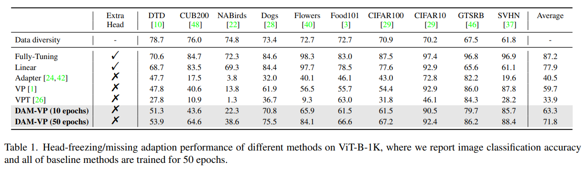

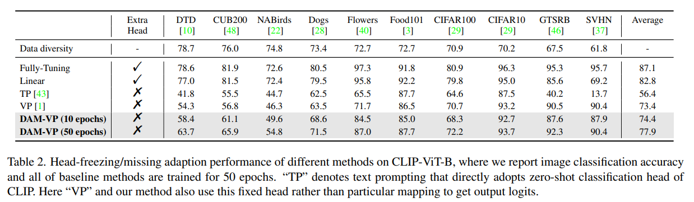

Tab. 1, 2 는 DAM-VP 와 다른 adapting method 간의 head-freezing/missing setting 의 정량적 비교 결과를 보여줌

- 저자의 방법은 prompt 가 10 epochs 만 학습되어도 baseline 을 현저히 능가

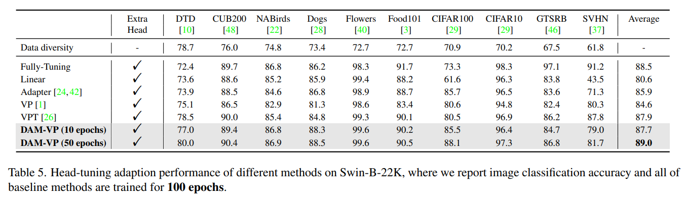

Tab. 4, 5 는 DAM-VP 와 다른 adapting methods 간의 head-tuning setting 의 정량적 비교 결과를 보여줌

- DAM-VP 가 다양한 image dataset 에서 pre-trained model 이 일반화되도록 돕는 강령한 성능을 보여줌
- fewer training epochs 와 higher recognition accuracy 로 다른 방법들을 능가하는 것을 쉽게 발견
- 게다가, DAM-VP 는 ViT-B-22K 과 Swin-B-22K 에서 50 epochs tuning 만으로 fully-tuning 능가

#### Qualitative results.

각 방법의 adaption performance 를 더 잘 관찰하기 위해, first 50 training epochs 동안의 Top-1 accuracy curve 를 그려 차이를 조사

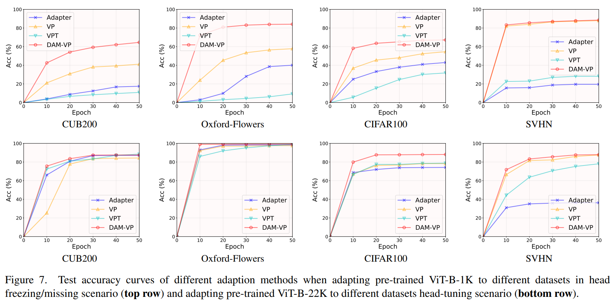

Fig. 7 은 head-freezing/missing 및 head-tuning 상황 모두에서 DAM-VP 와 다른 세 가지 baseline 의 curve 결과를 보여주며, 서로 다른 diversities 를 가진 4 dataset 을 선택.

- 초기 단계에서, 특히 10 epochs 동안 DAM-VP 의 성능이 크게 앞서 있음을 알 수 있음
  - 이 현상은 각 prompt 가 이미 상당한 동질성을 가진 image group 에서 학습하기 때문에 저자의 diversity-aware 전략이 prompt optimization 의 효율성을 높일 수 있음을 나타냄.
- meta-prompt initialization 의 설계는 good start point 를 가지고 있어 저자의 방법이 빠르게 수렴하는 데에도 도움이 됨

## 4.3 Ablation Study

#### Component ablation.

먼저 서로 다른 diversity 를 가진 4 aforementioned dataset 에 diversity-awrae 전략 및 meta-prompt initialization 의 중요성을 검증한다.

Tab. 3 처럼,

- 두 conponents 모두 prompting performance 향상에 크게 기여하며, 특히 high diversity 의 task data 처리 시 더욱 그럼.

#### Prompt learning stability

이전 방법들은 주로 prompt randomly initialization 을 했기 때문에, 다른 random seeds 로 인해 성능이 불안정해질 수 있는 반면, meta-prompt 설계는 optimization 을 위한 good initialization 을 제공하여 prompt performance 를 향상시키며 training stability 를 개선한다.

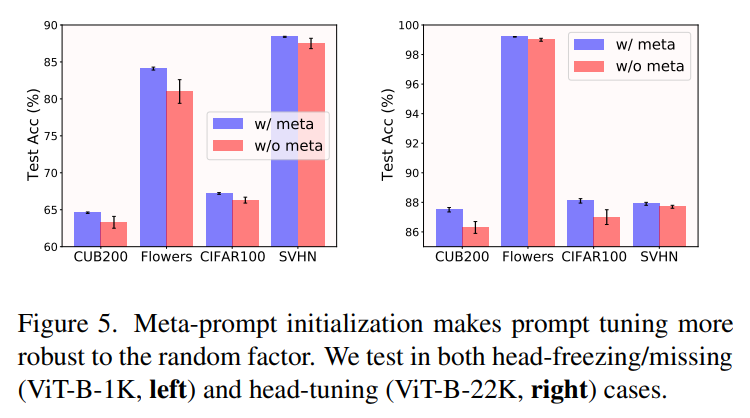

random seeds 의 영향을 없애기 위해, 저자는 5 random seeds 를 테스트 하고 Fig. 5 에 report

- meta-prompt initialization 은 서로 다른 training random seeds 에서도 뛰어난 stability 를 제공하는 반면, random initialized prompt 는 불안정하다.

#### Meta-prompt dataset number.

Sec. 4.1 의 설명처럼, meta-prompt learning 을 위해 6 datasets 을 준비하여, 이를 default setting 으로 사용.

여기서 meta dataset 수를 줄여가며 이 설정을 분석한다.

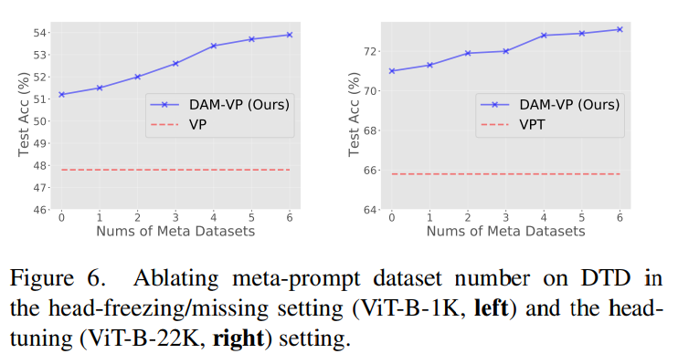

Fig. 6 처럼,

- meta dataset 수가 0, 즉, no meta-prompt 일 경우, DVM-VP 는 이전 baselines 보다 더 나은 합리적인 결과를 얻음.
- meta dataset 수의 증가에 따라, head-freezing/missing 및 head-tuning 모두에서 prompting performance 가 일반적으로 향상됨
- 이는 이전 data 에서 얻은 더 많은 prompt knowledge 가 downstream task 와 pre-trained task 간의 data distribution gap 을 줄이는 데 매우 유용함을 증명

#### Meta-prompt update step size $\eta$

step size $\eta$ 는 meta-prompt update 에 적용되는 중요한 hyper-parameter

여기서 0.1 에서 0.7 까지 다양한 step sizes 를 분석하고 결과를 Fig. 8 에 제공

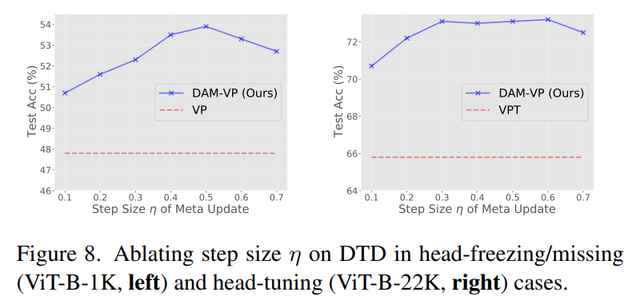

- baseline 과 비교했을 때, 성능은 다양한 step sizes 에 대해 상대적으로 robust
- 저자는 $\eta = 0.5$ 를 default 로 구성

#### Different size of subset $\mathcal{S}_\mathcal{T}$

subset $\mathcal{S}_\mathcal{T}$ size 는 clustering 결과에 직접적으로 영향을 미칠 수 있으며, 나아가 저자의 diversity-adaptive dataset partition 동안 partition 에 영향을 미칠 수 있다.

그러므로, 200 to 1000 까지 다양한 subset size 를 적용하여 prompting ability 를 탐구한다.

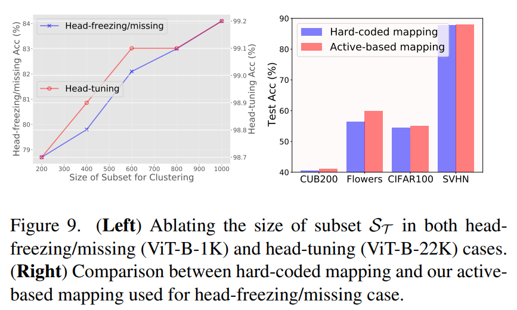

Fig. 9 (left) 에서 볼 수 있듯,

- $\mathcal{S}_\mathcal{T}$ size 가 증가함에 따라 두 시나리오 모두에서 높은 성능 얻음
- 한편, divide-and-conquer 설계는 매우 효율적으로, 단 200 images 만으로도 DAM-VP 는 이전 방법보다 큰 차이로 능가
- 일부 dataset 의 training images 가 제한되어 있음을 고려하여, 이 연구에선 $\mathcal{S}_\mathcal{T}$ 의 default size 는 1000 채택

#### Hard-coded mapping _vs._ Active-based mapping.

Sec. 3 의 논의와 같이, 저자는 head-freezing/missing 시나리오에 대해 VP 가 사용한 hard-coded mapping 이 비효율적이라 주장.

이는 output feature 의 활성도가 충분하지 않는 일부 채널을 최화할 수 있기 때문에(즉, diverse model input 에 상대적으로 견고함), 이를 완화하기 위해 active-based mapping 을 제안

Fig. 9 (right) 는 VP 에서 이 두 mapping 방법을 비교한 결과로, ViT-B-1K 에서 테스트

# Conclusion

본 논문은 pre-trained vision model 을 prompting 하는 downstream task adaption 에서 diversity property 를 고려.

저자는 이전 방법에서 채택된 per-dataset generic prompt 가 large data diversity 를 가진 dataset 을 다루기 어렵다 주장

이를 해결하기 위해, diversity-adaptive dataset 및 prompt selection 을 기반으로 한 DAM-VP 를 제안하며, 저자의 prompting 은 quick meta learning algorithm 을 통해 prompt 를 초기화한다.

광범위한 실험으로 head-freezing/missing 및 head-tuning 모두에서 DAM-VP 의 뛰어난 성능을 입증