논문 및 이미지 출처 : <https://arxiv.org/pdf/2310.08381>

# Abstract

Visual Prompting (VP)는 pre-trained vision model 을 various downstream image-classification tasks 에 adapting 하기 위한 parameter-efficient fine-tuning approach 로 떠오르고 있습니다.

그러나 현재까지 VP 의 design space 에 대한 체계적인 연구가 부족하며, 그 성능을 평가하기 위한 명확한 benchmark 도 존재하지 않는다.

이러한 격차를 해소하기 위해, 저자는 VP design choices 를 automating 하기 위한 end-to-end expandable framework 인 **AutoVP** 를 제안하며, 12 downstream image-classification tasks 를 포함한 holistic VP-performance benchmark 를 제공한다.

우리의 design space 는 

1. prompt 의 joint optimization
2. image classifiers 와 text-image encoders 를 포함한 pre-trained models 의 selection
3. nonparametric 및 trainable label mapping 을 포함한 model output mapping strategies

광범위한 실험 결과, AutoVP 는 현재 가장 잘 알려진 VP 방법을 상당한 차이로 능가하며, 최대 6.7% 의 정확도 향상을 보였고, Linear-Probing (LP) baselines 와 비교했을 때 최대 27.5% 의 성능 향상을 달성했다.

따라서 AutoVP 는 VP design choices 에 대한 hyper-parameter tuning 을 위한 efficient tool 로서, 그리고 VP 개발을 가속화할 수 있는 comprehensive benchmark 로서 두 가지 기여를 한다.

# 1. Introduction

NLP 분야에서 시작된 prompt 는 pre-trained model 을 downstream task adapting 을 위한 parameter-efficient fine-tuning approach 로 상당한 인기를 얻었다.

이런 Prompting 방법론은 최근 CV 분야로 확장되어, 여기선 Visual Prompting (VP) 로 불립니다.

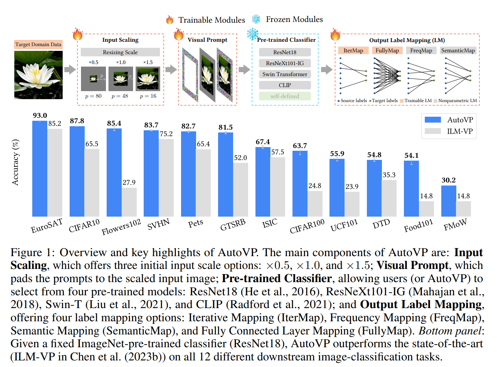

가장 단순한 형태로 VP 는 in-domain model reprogramming 기술 로 인식될 수 있다. 구체적으로,

- pre-trained vision model 의 weight 나 architecture 를 변경하지 않고 input 과 output 을 조정해 downstream image classification task 를 해결한다.
- fully fine-tuning, LP, 또는 zero-shot 을 포함하는 기존 transfer learning 과는 대조적
- 예로, Fig. 1 처럼 VP 는 model-input stage 에서 target sample 에 universal trainable data frame 을 추가하고, output stage 에서 source 및 target label 을 연결하기 위해 명시적으로 정의되거나 암시적으로 학습된 mapping function 을 사용한다.

VP 는 엄청난 잠재력을 가지고 있지만, 연구 및 개발을 제한하는 두 가지 중요한 문제가 있다.

1. _systematic VP framework 의 obsence_. 즉, prompt size 와 shape, source model, label-mapping (LM) 전략같은 VP design choice 은 지금까지 별도로 연구되었으며, 주로 downstream task accuracy 를 높이기 위해 그들의 distinct roles 를 기술하는데 사용되었다. 
   - 이상적으로는 이러한 systematic framework 가 performance optimization 을 위해 best configuration 을 automatically search 되야 한다.
   - 예로, VP 는 padding size 를 변경하면 final accuracy 가 약 15% 변할 수 있음을 입증했다. 
   - VP 는 ResNet50 같은 pure vision models 보다 CLIP 같은 large text-image models 을 증강하는 데 더 나은 것으로 관찰되었다.
   - ILM-VP 연구에서는 training 중 _iterative label mapping_ (ILM)이 fixed label mapping 전략보다 최대 13.7% 더 나은 정확도를 달성.
2. _unified performance brenchmark 의 lack_. 기존 문헌에서는 제안된 VP 방법의 성능을 임의로 선택된 downstream dataset 에 대해 보고하여, 서로 다른 방법 간의 비교를 어렵게 만들었다.

이 격차를 해소하기 위해, 본 논문의 AutoVP 는

1. joint optimization 을 위한 automate 및 extendable framework 을 제공
   1. input-image scaling (i.e., prompt size)
   2. visual prompts
   3. source model selection
   4. output label mapping
2. source model pre-training 에 사용된 dataset (e.g., ImageNet) 과의 quantifiable content-similarity 를 갖춘 12 diverse image-classification tasks 로 구성된 unified benchmark 제공

Fig. 1 에서 보이듯, AutoVP 의 구성요소는

1. input scaling 은 prompt 와 original image size 간의 optimal ratio 결정 
2. visual prompt 는 learnable parameter 로서, backpropagation phase 에서 iterative update
3. pre-trained model 은 pertinent feature 를 추출하고 source domain 내의 prediction 을 render 
4. output label mapping 은 source 및 target domain 의 label space 간의 연결을 설정해 downstream domain 에서 정확한 예측을 가능하게 함.

AutoVP 의 modularity 는 이러한 4 components 에 대한 다양한 설계를 원활하게 통합하고 쉽게 확장할 수 있게 함.

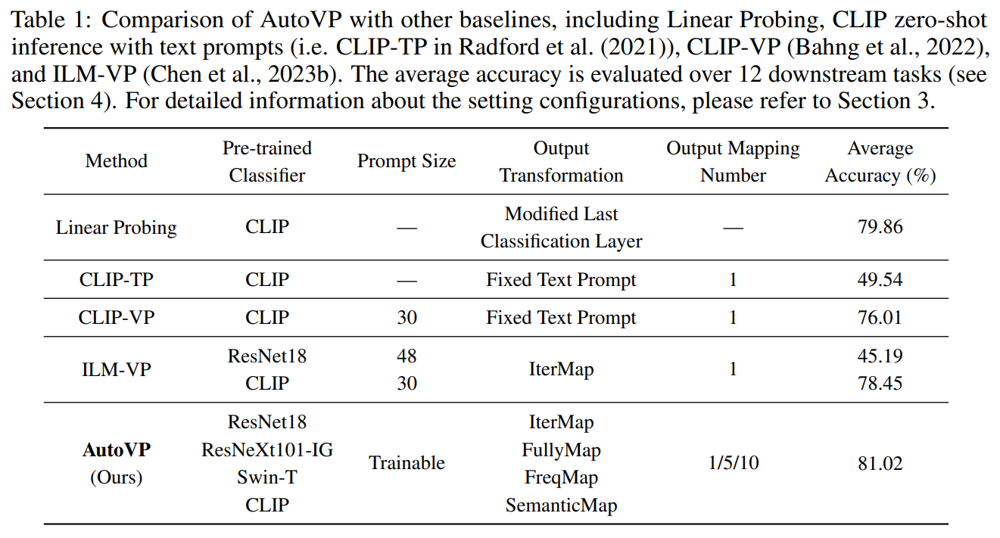

Tab. 1 은 AutoVP 를 기존 VP 제안 및 지금까지 제안된 두 가지 baselines: LP 및 text prompt (TP)-based zero-shot inference 과 비교.

Table 에서 알 수 있듯이, 

- AutoVP 는 VP 성능에 영향을 미칠 수 있는 광범위한 설정을 고려한 유일한 framework.
- 또한 이러한 설정의 collective optimization 덕에, AutoVP 의 구성은 12 disinct downstream task 에서 평균 정확도의 획기적인 향상을 이룸.
- 예로, CLIP 을 pre-trained model 로 사용할 때 (Tag. 2 참조), AutoVP 의 평균 정확도는 CLIP-VP 보다 4.6% 높고 ILM-VP 보다 2.1% 높음.
- 또한, AutoVP 는 LP 의 평균 정확도보다 0.7% 높아, transfer learning 측면에서 LP 에 대한 경쟁력 있는 대안임을 시사.

주요 기여:

- AutoVP 는 input scaling, visual prompt, pre-trained model selection 및 output label mapping 전략의 설계를 동시에 고려한 최초의 end-to-end VP framework. 이 modular approach 은 VP 엔지니어링의 유연성을 제공하며, 12 downstream image-classification dataset 을 기반으로 한 종합적인 performance benchmark 제공.
- proposed hyper-parameter tuning process 는 individual downstream dataset 에 맞춘 optimal configuration 을 식별할 수 있다. 또한, automated input scaling 및 weight initialization 같은 novel components 는 VP 의 전반적인 효능을 크게 향상.
- 본 논문은 다양한 조건(e.g., 고정된 source model 또는 output-mapping)에서 optimal configuration 을 종합적으로 탐색하는 first stage 로서, 각 downstream dataset 에 대한 VP 성능에 미치는 domain similarity 의 영향을 분석.
- 본 논문은 data-limited settings 에서 LP 보다 AutoVP 의 우수한 성능을 강조하며(Fig. 2), LP 보다 더 나은 out-of-distribution robustness 를 보여준다 (Fig. 4).

# 2. Background and Related Work

#### Background of Visual Prompts.

전통적으로, task-specific machine-learning 을 얻기 위해 all parameter 를 훈련하거나 업데이트해야 했다.

그러나 powerful foundation model 의 발전으로 인해 model fine-tuning 및 scratch 는 time-consuming 및 parameter-inefficient 였으며, 대량의 training data 및 storage space 를 필요로 한다.

이러한 문제를 해결하기 위해, in-domain model reprogramming 으로 알려진 VP 는 다양한 domain-specific task 를 위한 machine learning model 을 얻기 위한 효과적인 수단으로 등장.

source domain 의 well-developed pre-trained model 을 거의 변형하지 않은 targe tdata 로 사용하여 target domain task 를 수행할 수 있다.

예로, ImageNet pre-trained model 을 사용하여 medical image 를 분류할 수 있다.

또한, VP 는 temperature scaling 및 model confidence 와 accuracy 를 맞추기 위한 post-processing calibration 방법으로도 사용될 수 있다

전통적인 접근 방식인 transfer learning, model fine-tuning 및 scratch training 과 비교할 때, VP 는 low-comlexity 및 model-agnostic 전력으로서, low-data domain 에 적합하다.

#### The Design of Visual Prompts.

VP framework 는 _input transformation_ 및 _output transformation_  을 위한 two trinable modules 로 나눌 수 있다.

이 모듈들은 각각 pre-trained model 의 input 및 output ends 에 배치된다.

- input transformation 의 경우, 이전 문헌에서는 visual prompt 를 생성하고 배치하는 다양한 방법을 제안.
  - 가장 인기 있는 접근 방식 중 하나는 target task image 주위에 frame 을 추가하고, trainable additive-input perturbation (prompt) 를 채우는 것이다.
- 이후, source pre-trained model 의 output logits 은 여전히 source domain 에 있으므로, target domain logits 을 얻기 위해 further output transformation (e.g., LM)이 필요하다.
  - 이를 달성하는 단순한 방법은 $m$ source label 을 target label 로 randomly mapping (RandMap).
  - BAR 은 target domain data 의 source label prediction distribution 에서 LM 을 구성하는 frequency-bsaed LM (FreqMap)이 downstream task 의 정확도를 더욱 향상시킬 수 있음을 발견
  - 그러나 ILM-VP 은 FreqMap 이 interpretability 가 부족하고 VP 와의 상호 작용을 측정하기 어렵다고 주장.
- 위 문제를 해결하기 위해, 저자는 LM 과 visual prompt 를 동시에 설계할 수 있는 iterative LM (IterMap) 을 제안.
  - 한편, SEMAP 은 similar semantic meansings 를 가진 source 및 target class 를 맞추는 semantics-based LM approach 제안
  - VPTM 은 mask token 을 downstream labels 에 mapping 하는 prototypical verbalizer 를 사용하여 LM 에 대한 다른 관점을 제공.

이 논문에선 VP 의 비슷한 설계를 따르며, input transformation 을 위해 image 주위에 visual prompt 를 배치하고, output transformation 을 위한 4 mapping methods 가 있다.

#### Non-universal Visual Prompts. 

universal input prompts 사용 대신, 일부 연구자들은 input-aware prompting models 설계에 중점을 둠.

- 예로, ILM-VP 는 class-wise visual prompt 를 생성하여 model robustness 향상.
- 유사하게, NeuralFuse 는 low-voltage-induced bit errors 로 인한 정확도 저하 문제를 해결하기 위해 add-on module 을 제안하여 robust prompt 생성
- PGN 은 input image 기반 visual prompt token vector 를 생성하여 more adaptive 및 context-aware prompting 을 가능하게 하는 prompt generation network (PGN)를 제안.

input prompting 은 일반적으로 target image 에 직접 적용되지만, 연구자들은 다른 프롬프트 방법도 개발.

- 예로, self-supervision task 를 통해 prompt parameter 를 small convolutional structure 에 학습하는 _Convolutional Visual Prompt_ 
- source model 의 intermediate layers 에서 prompt parameter 를 학습하는 visual prompt tuning 이 있다.

이 논문에선 각 image-classification task 에 대해 task-specific prompt model 을 사용하는 pixel-level VP approach 를 중점으로 다룬다.

따라서, 저자의 접근 방식은 pre-trained source model 이 수정되지 않고 외부 변형이 내부적으로 도입되지 않는 실제 시나리오와 밀접하게 닮아 있다.

# 3. AutoVP Framework

Fig. 1 의 AutoVP 시스템 개요에 따라, 우리는 4 components 와 이의 joint optimization 을 가능하게 하는 hyper-parameter tuning 기능 제시.

#### Input Scaling.

AutoVP 의 구현에서 저자는 frame-shape prompts 를 default prompting template 으로 선택. 따라서 visual prompt size $p$ 는 frame width 를 나타내며, actual parameter 수는 $2cp(h + w - 2p)$ 이다.

- $c$, $w$, $h$ 는 각각 color channels, width, height

input image size 는 source model 에 의해 결정되지만, source model 에서 downstream dataset 으로 fine-tuning 할 때, target images 를 resizing 하고 remaining space 를 visual prompts 로 사용할 수 있는 자유도가 있다.

- 예로, source model 이 $224 × 224$ size 의 input image 를 받을 경우, target image size 를 $128 × 128$ 로 scaling 하면 final visual prompt size 는 $p = (224 - 128)/2 = 48$ 이 된다.
- VP 와 ILM-VP 에서 prompt size $p$ 가 VP 성능에 중요한 역할을 한다고 보여주었다.

image resizing scale optimizing 과정을 자동화하기 위해, 저자는 Kornia library 의 `kornia.geometry.transform()` 을 사용하여 _input scaling module_ 을 구현하는 gradient-based optimization algorithm 을 설계한다.

- `transform()` function 은 2D images 의 differentiable image scaling 을 포함한 다양한 geometric transformations 를 deep learning 으로 통합한다.

image resizing 외에도,

- prompt size $p$ 도 remaining space 를 채우기 위해 scale up/down 된다.
- 또한 image resizing optimization 을 촉진하고 bad local minima 를 피하기 위해, default image size 를 128 로 설정하고 최적화할 3 initial scales: 0.5, 1.0, 1.5 을 설정
- 이와 관련된 prompt size $p$ 는 각각 80, 48, 16
- 결과적으로, input scaling module 은 AutoVP 가 optimal image resizing scale 및 prompt size $p$ 를 얻을 수 있도록 한다.

#### Visual Prompt.

visual prompt module 의 경우, AutoVP 는 all (resized) input images 주위에 universal pixel-level prompts 를 추가한다.

- $x_t \in \mathbb{R}^{N_t}$ 를 _target_ (flattened) input image ($N_t$ dimension) 로 나타내고, 
- $\tilde{x_t} \in \mathbb{R}^{N_s}$ 를 prompted image 로 나타내며, 이는 pre-trained source model $f_{\theta_s}$ ($\theta_s$ 는 model weights) 의 input diension ($N_s$)에 맞춘다.
- $\delta \in \mathbb{R}^{N_s}$ 는 trainable universal perturbation 이고,
- $\mathcal{M}_p \in \{0, 1\}^{N_s}$ 는 prompting area 를 나타내는 prompt size $p$ 의 binary mask 다.
- 따라서, prompted image $\tilde{x_t}$ 는 다음과 같이 공식화:

$$
\begin{equation}
    \tilde{x_t} = \mathcal{P}(x_t) = \text{InputScaling}_p(x_t) + \underbrace{\mathcal{M}_p \odot \sigma(\delta)}_\text{Prompts}.
\end{equation}
$$

- prompt 는 0 으로 초기화되고 공식적으로 $\mathcal{M}_p \odot \sigma(\delta)$ 로 정의
  - $sigma$ : input 을 0 과 1 사이의 값으로 mapping Sigmoid function (scaled inpput pixel value range)
- 저자는 gradient descent 를 사용하여 $\delta$ 를 update

#### Pre-trained Classifier.

preceding stage 에서 resized image 에 prompts 를 적용한 후, prompted image 는 source domain 에서 prediction 을 생성하기 위해 feature extractor 로서 pre-trained model 에 주입된다.

AutoVP framework 에 4 pre-trained models: ResNet18, ResNeXt101-IG, Swin-T, 및 vision-language multi-modal model CLIP 로, ViT-B/32 vision encoder backbone 을 사용한다.

AutoVP 에선 pre-trained classifiers 의 weight 가 고정되어 변경되지 않는다.

#### Output Label Mapping.

pre-trained model 은 target data 를 source labels 로 예측하며, VP 의 last mile 은 source labels 에 대한 prediction 을 target classes 에 대한 mapping 이다.

Fig. 1 설명처럼, AutoVP 는 4 types output mapping 을 제공하며, 이는 일반적으로 two groups 로 분류될 수 있다.

1. _nonparametric_ label mapping: frequency mapping(FreqMap) 및 semantic mapping (SemanticMap)
   - 이는 VP training 의 initialization 동안 정의되며 training process 동안 변경되지 않음.
2. _trainable_ label mapping: iterative label mapping (IterMap) 및 fully connected layer mapping (FullyMap)
   - 이 두 방법은 prompted images 기반으로 mapping 을 동적으로 조정

다음은 4 types output mapping approaches 에 대한 개요.

- **Frequency Mapping (FreqMap)**: BAR 에서 제안한 방법. target domain data 의 source-label prediction distribution 을 이용하여 각 target class 를 top-$m$ frequent source classes 에 mapping 한다
  - $\mathcal{Y}_s = \{0, \cdots, K_s -1\}$ 및 $\mathcal{Y}_t = \{0, \cdots, K_t -1\}$ 를 source 및 target labels set 으로 나타내며,
    - $K_s/K_t$ : source/target classes 수 
  - $\tilde{\mathcal{X}_t}$ 는 target domain $\mathcal{D}_t$ 의 label $y_t$ 를 가진 all prompted images collections 이라 하자.
  - $m = 1$ 일 때, $y_t$ 의 mapping 은 다음과 같이 정의될 수 있다:
  - $$\begin{equation}\begin{align*}y_t \leftarrow y_s^* = \arg \max_{y_s \in \mathcal{Y}_s}( \sum_{\tilde{x_t} \in \tilde{\mathcal{X}_t}} Pred(f_{\theta_s}(\tilde{x_t}), y_s)), \\ Pred(f_{\theta_s}(\tilde{x_t}), y_s) = \begin{cases}1, & \text{if } y_s = \arg \max f_{\theta_s}(\tilde{x_t}) \\0, & \text{otherwise} \end{cases}.\end{align*}\end{equation}$$
  - FreqMap 의 objective 는 target label $y_t$ 를 source label $y_s^*$ 에 대한 mapping 으로, 이는 $f_{\theta_s}$ 가 $\tilde{\mathcal{X}_t}$ 를 분류한 most frequent label
  - source class 가 multiple target classes 에 대해 moist frequent predicted class 인 경우, highest count prediction 을 가진 target class 에 할당
  - many-to-one frequency mapping algorithnm 은 Algorithm 1 에 제공
  - 또한, random label mapping (RandMap)은 target label 에 source label 의 subset 을 무작위로 할당하여 FreqMap 의 특수한 사례로 볼 수 있음.
  - 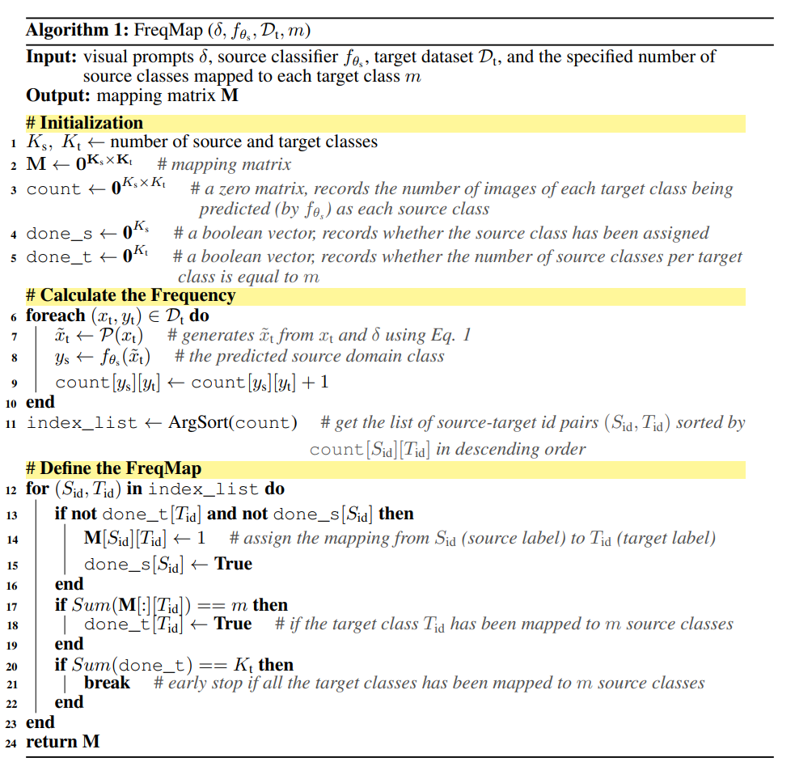
- **Iterative Mapping (IterMap, or ILM)**: ILM-VP 이 제안한 방법으로, FreqMap 을 업데이트하기 위한 iterative approach.
  - IterMap 은 각 training epoch 시작 시 frequency mapping 을 수행하여 updated prompts 에 맞는 new mapping distribution 을 얻는다.
- **Semantic Mapping (SemanticMap)**: SEMAP 과 AR-SCR 의 연구를 따릅니다.
  - 저자는 CLIP 의 text encoder 를 사용하여 source 및 target class name 의 embeddings 를 생성한다.
  - 이후, 각 class embedding 사이의 cosine similarity score 를 기반으로 source-target pair 를 mapping
  - 따라서, SemanticMap 은 ResNet18, Swin-T, ResNeXt101-IG 같은 3 pre-trained vision model 에서 target class 를 ImageNet-1K 의 semantically similar class 와의 mapping 에 사용 가능
  - 그러나, CLIP 의 경우 명시적인 source domain classes set 이 없으므로 SemanticMap 을 적용할 수 없다.
- **Fully Connected Layer Mapping (FullyMap)**: Reprogrammable-FL 이 제안한 방법으로, linear layer 를 사용하여 source output logits 을 target class 로 mapping. FullyMap 은 $L_t = w \cdot L_s + b$ 로 표현 가능.
  - $L_s$ : source pre-trained model 의 output logits
  - $w$ 와 $b$ : linear layer 의 weight 및 bias vector
  - $L_t$ : linear layer 의 output 으로 VP model 의 final output logits 역할을 함.

#### End-to-end Hyper-parameter Tuning.

AutoVP 의 overall tuning procedure 은 Fig. A.2 와 같다.

AutoVP 는 flexibility 및 modaularity 를 가지고 있어 사용자는 다양한 설정 ($n = 222$)을 고려해야 한다.

이 설정에는 initial input images 의 size, trainable resizing moudle 사용 여부, 채택할 pre-trained classifier, 구현할 output-mapping 방법, 각 target label 에 mapping 할 source label 의 수 등이 포함

tuning operation 을 가속화하고 computational resources 를 절약하기 위해, 저자는 Ray Tune 과 early-stop 을 사용하여 poor trails 는 종료한다.

실험에서 all configurations 을 테스트하기 위해 grid search 를 수행하며, ASHA scheduler 를 사용하여 top-$n$ tasks 를 유지하고 remaining task 는 early stop

실험적으로 $n = 2$ top tasks 가 optimal setting 을 충분하다는 것을 확인하였다.

few-epoch tuning process (training 2-5 epochs)이 완료되면, highest test accuracy 를 가진 setting 을 선택하고 그 setting 을 사용하여 complete training 을 수행한다.

hyper-parameter tuning 을 통해 AutoVP 는 VP 의 best configuration 을 효율적으로 찾고, downstream tasks 의 정확도 향상을 이끌어낼 수 있다.

# 4. Experiments

#### Experimental Setup.

AutoVP 의 성능을 평가하기 위해 12 downstream dataset (CIFAR10, CIFAR100, ISIC, SVHN, GTSRB, Flowers102, DTD, Food101, EuroSAT, OxfordIIITPet, UCF101, FMoW)을 사용.

이는 transfer learning generalization 을 측정할 때 흔히 사용되는 dataset 이다.

각 AutoVP 실험은 세 번 반복 수행했으며, CLIP 에 대해서는 SGD optimizer 와 learning rate 40 을 사용했고, 다른 pre-trained model 에는 Adam optimizer 와 learning rate 0.001 을 사용했다.

baselines (CLIP-VP 및 ILM-VP)의 결과는 해당 논문에서 보고된 accuracy 를 참고 했다.

실험은 NVIDIA GeForce RTX 3090 에서 수행되었으며, PyTorch 로 구현.

## 4.1 Experimental Results

#### Comparison of AutoVP and Prior Work.

AutoVP 와 이전에 제안된 VP 접근 방식의 공정한 비교를 보장하기 위해, AutoVP 의 source model 을 고정하고 other hyper-parameter tuning 을 완화했다.

sourc emodel 로 CLIP 을 사용할 때의 결과는 Tab. 2 에 제시되며, optimal settings 도 함께 제공된다.

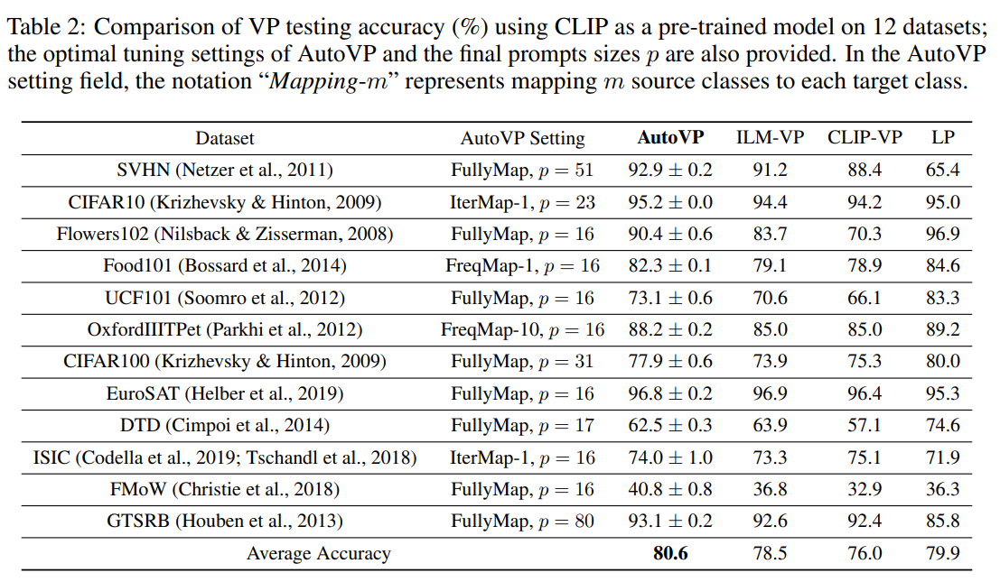

AutoVP 는 LP 와 두 가지 SOTA VP baselines (CLIP-VP 와 ILM-VP)과 비교했으며, 이들의 configuration 도 Tab. 1 에서 확인 가능

- tuning process 를 통해 선택된 optimal configuration 으로 AutoVP 는 9/12 target dataset  에서 최대 6.7% 까지 성능이 향상.
- 또한, AutoVP 는 SVHN dataset 에서 최대 27.5% 까지 LP baseline 보다 높은 성능을 보임.
- AutoVP 는 average accuracy 또한 가장 높았음.
- AutoVP 는 대부분의 dataset 에서 output transformation 으로 FullyMap 을 사용했다.
  - 이는 linear layer 가 더 많은 parameter 를 가지고 있어 더 나은 결과를 얻을 수 있기 때문으로 추측.
- 또한, AutoVP 는 initial image sclaes 를 선택할 때 상대적으로 small prompt size 의 image 를 확대하는 경향이 있다.
  - 이로 인해 VP model 이 image 자체에 more attention 을 하게 되어 전반적인 성능이 향상되었다.
- Fig. 1 에 나타난 바와 같이, ResNet18 을 source model 로 사용할 때 AutoVP 는 ILM-VP 보다 평균 24.8% 더 높은 성능을 보다. 더 자세한 것은 Tab. C.1 에 제공

#### AutoVP with Source Model Selection.

AutoVP 가 downstream task 에 적합한 optimal source model 을 search 할 수 있게 함.

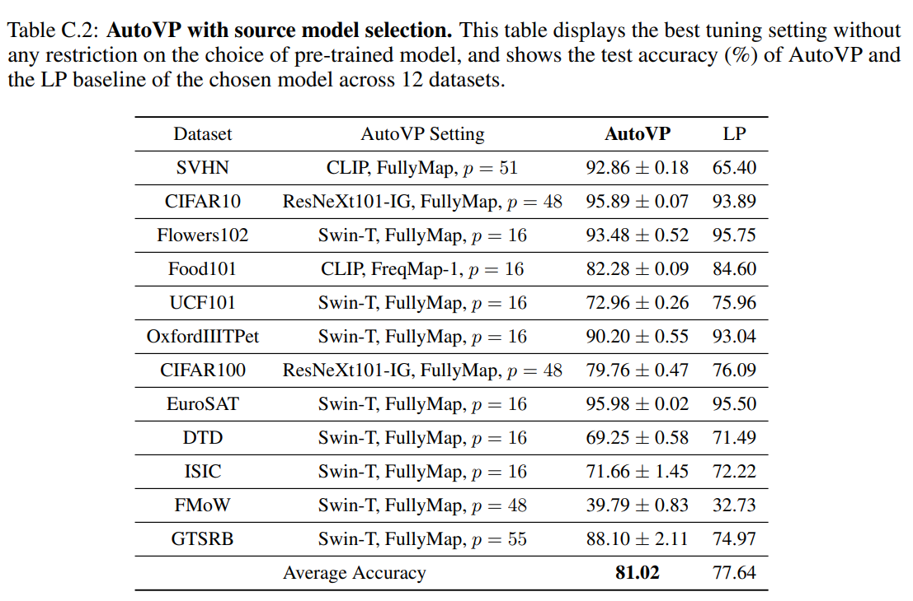

AutoVP 에 의해 선택된 optimal setting 과 실험 결과 비교는 Tab C.2 에서 확인 가능.

실험 결과에 따르면, 

- Swin-T 가 가장 적합한 pre-trained model 로 가장 자주 선택되었으며, 8/12 dataset 에서 Swin-T 가 선택됨.
- 평균적으로 Swin-T 를 사용할 경우 CLIP 을 fixed pre-trained backbone 으로 사용할 때보다 0.43% 더 높은 정확도를 기록.
- 그러나 DTD 와 Flowers102 dataset 에선 Swin-T 의 성능이 CLIP 보다 각각 6.80% 와 3.08% 더 뛰어난 결과를 보였음.
- 이러한 결과는 다양한 dataset 에서 성능 향상을 위해 multiple pre-trained model 을 활용할 수 있음을 강조.

#### Data Scalability.

AutoVP 가 data-limited 환경에서 어떻게 성능을 발휘하는지 이해하기 위해, 저자는 training data 양을 점진적으로 감소시켜 50%, 25%, 10%, 마지막으로 1% 로 줄였다.

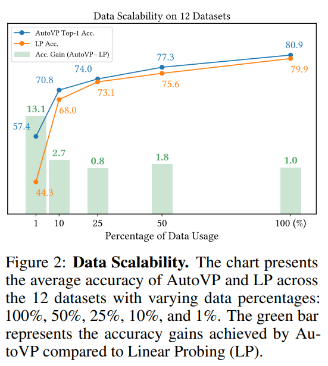

Fig. 2 의 실험 결과는 AutoVP 가 12 datasets 모두에서 LP 보다 일관되게 높은 성능을 보였으며, 특히 lowest data 의 two scenarios (10% 및 1%)에서 상대적인 성능이 특히 높았음을 보여줌.

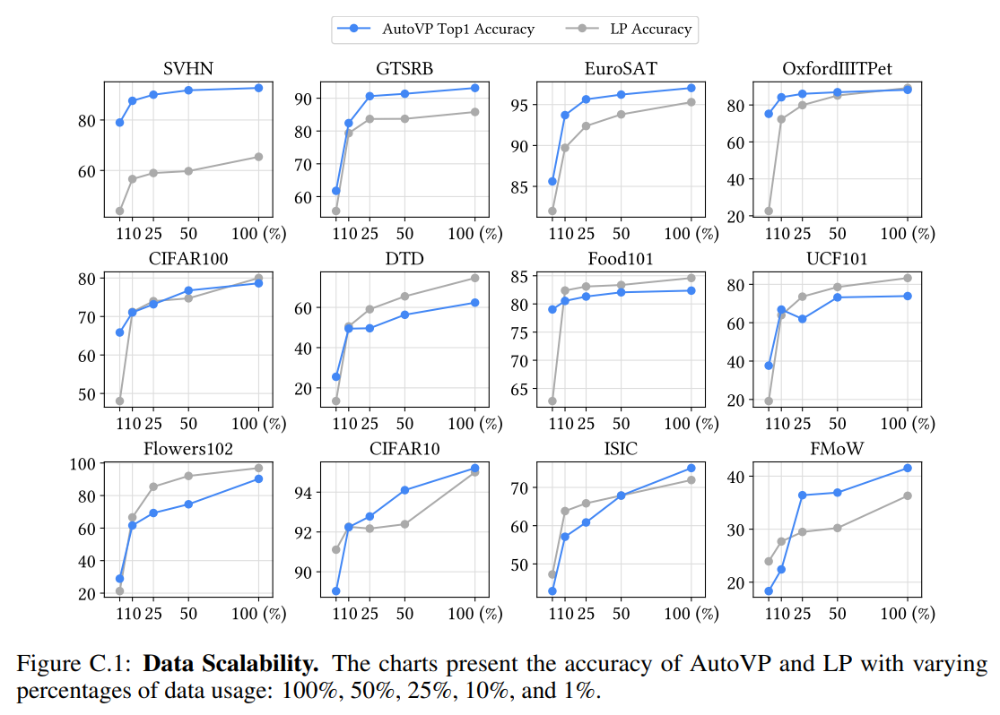

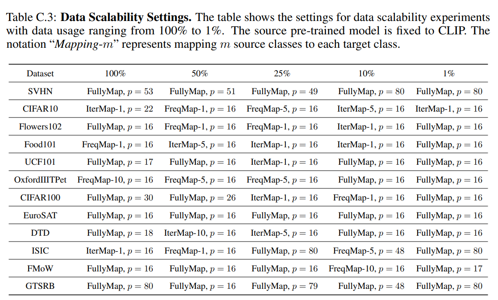

## 4.2 Ablation Studies of AutoVP

AutoVP 의 various components 를 검토하기 위해 여러 모델 아키텍처를 실험적으로 설계했다.

이러한 VP 아키텍처의 비교에는 다음이 포함: 1) FullyMap 의 weight-initialization 전략 사용, 2) CLIP text encoder 의 포함 여부, 3) visual prompts 의 존재 여부, 4) learned VP 의 frequency analysis

#### Weight Initialization of FullyMap with CLIP.

CLIP 을 pre-trained model 로 사용할 때, FullyMap output transformations 는 FreqMap 과 IterMap 에 비해 성능이 현저히 떨어짐 (Fig. 3)

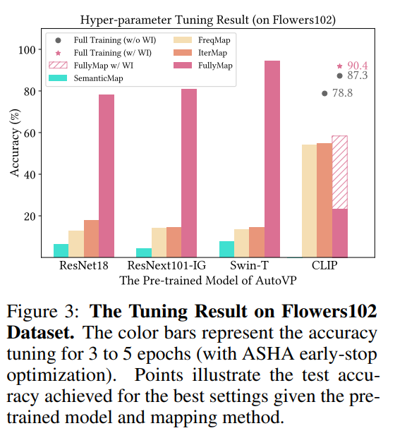

- 이는 FreqMap 과 IterMap 이 CLIP 의 zero-shot property 와 label 의 semantic meanings 를 활용할 수 있는 반면, fully connected layers 는 random state 에서 mapping 을 학습해야 하기 때문
- 결과적으로, FullyMap 은 hyper-parameter tuning process 에선 성능이 좋지 않지만, 200 epochs training 후에는 더 높은 정확도를 달성할 수 있다.
  - 예로, Fig. 3 에선 AutoVP 가 CLIP 과 함께 Flowers102 에 optimal output transformations 로 IterMap 을 제안하지만, 실제로는 FullyMap 이 200 epochs training 후 더 나은 성능 (87.3%, IterMap 의 78.8% 에 비해)을 보임.
- FullyMap 의 hyper-parameter tuning bottleneck 을 해결하기 위해 weight initialization (WI)를 도입.
  - 이를 통해 FullyMap 은 class name 의 semantics 를 기반으로 더 유용한 mapping 으로 초기화할 수 있다.
  - Sec. 3 언급처럼, AutoVP 의 FullyMap 은 linear layer 로 구성되어, 이를 $L_t = w \cdot L_s + b$ 로 나타낼 수 있다.
    - weight $w$ : $K_t \times K_t^T$ 의 real matrix
    - $K_t$ : target class 수
    - $T$ : CLIP text encoder 에서 사용된 template 수
  - WI 는 $w$ diagonal(대각선) 을 1 로 설정하고 나머지는 0 으로 설정하여 $w = (I_{K_t} | 0)$ 로 만든다.
    - $I_{K_t}$ : size $K_t$ 의 identity matrix
    - $0$ : $K_t \times K_t(T - 1)$ 의 zero matrix
    - 이는 각 target class `class_name` 과 해당 text promptㄴ ("this is a photo of a [`class_name`]") 간의 연결을 의미
- 이 개념을 시각적으로 표현한 내용은 Fig. A.1 에 확인 가능.
- Fig. 3 에서, CLIP 을 pre-trained model 로 사용할 때 적절한 WI 를 가진 FullyMap (hatched bar)이 other mapping approach 보다 성능이 우수하다는 것을 보여줌.

#### Impact of the Non-inclusion of Text Encoder in CLIP.

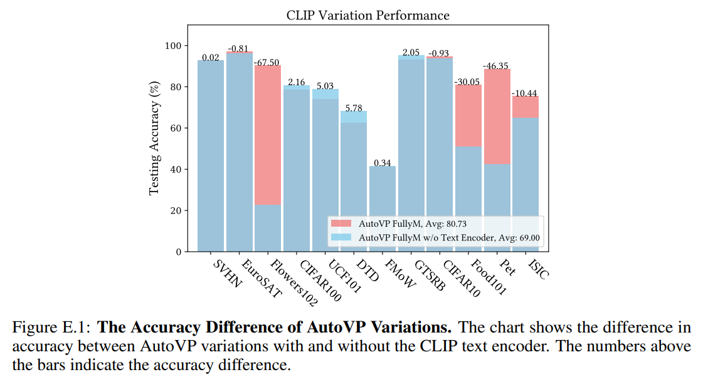

Tab. 2 에 제시된 실험 설정을 복제하고 CLIP image encoder 와 직접 연결을 설정할 때, text encoder 를 포함하지 않으면 평균 정확도가 69.0% 로 크게 감소 (Fig. E.1). 

- dataset 별 정확도 감소는 특히 Flowers102, Food101, OxfordIIITPet 에서 두드러진다. 
- 이러한 결과는 label semantrics 가 해당 dataset 에서 중요한 역할을 한다는 것을 시사.

#### The Impact of Visual Prompts.

AutoVP pipeline 에서 pre-trained model 과 output-mapping modules 를 유지하면서 visual prompt module 을 제거했을 때 전체  성능에 미치는 영향을 조사했다.

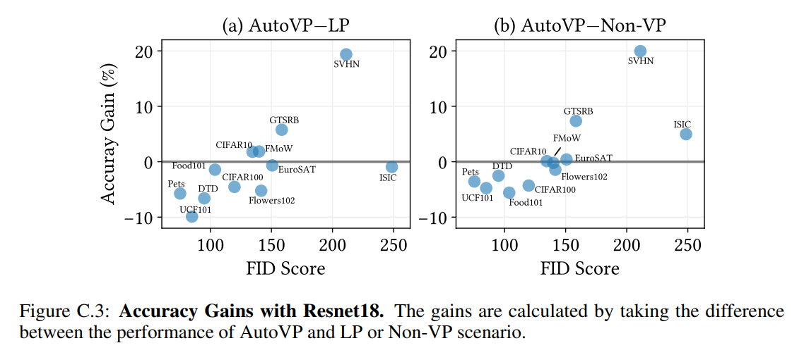

- ResNet18 model 을 사용할 때, visual prompt 를 남기는 것이 12 dataset 중 SVHN, GTSRB, ISIC 의 3 dataset 에서만 더 나은 성능을 보였다(Fig. C.3).
- remaining dataset 에선 visual prompt 를 포함한 것이 오히려 성능이 감소했다.
  - 이는 상대적으로 작은 source model 을 사용했을 때는 Fully Connected Layer Mapping 이 주요 성능 향상을 가져오며, visual prompt 가 noise 로 인식될 수 있음을 시사
- 반면, CLIP model 을 사용할 때는 대부분의 dataset 에서 visual prompt 를 포함했을 때 성능이 향상되었다 (Fig. 5).
  - 이는 CLIP 이 VP task 에 ResNet18 보다 더 적합하다는 것을 나타냄.

#### Frequency Analysis of the Learned Visual Prompts.

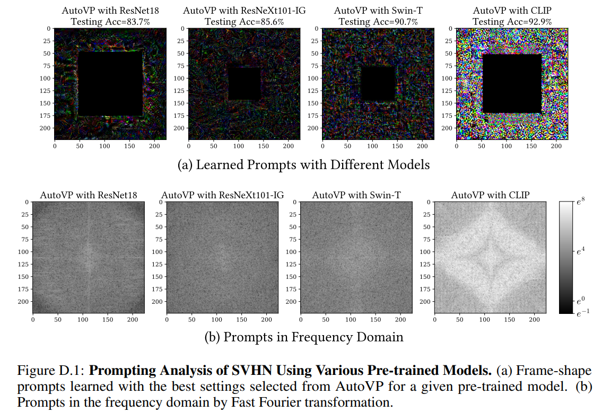

Fig. D.1 에서는 visual prompt pattern 의 generalization 연구를 위해 frequency 관점에서 분석 수행.

결과 CLIP 을 사용한 prompting 효과성을 강조했으며, 이는 target domain에 generalization 되는 low-frequency features 를 활용하는 것임.

# 5. Discussions

#### Tuning Selection.

AutoVP 는 multiple configuration 의 joint optimization 을 제공하며, target tasks 에 따라 다양한 parameter 를 선택한다.

output label mapping 측면에서 FullyMap 은 vision model 에서 우수한 성능을 보이지만, IterMap 또는 FreqMap 은 CLIP 과 같은 text-image model 의 성능을 향상시키는 것으로 보인다.

이 context 에서, FullyMap 의 WI 는 CLIP 에서 중요한 역할을 하며, 이 옵션은 자주 선택되는 output mapping 전략 중 하나이다. (Tab. 2).

또한, larger image scales 를 활용하고 더 많은 source classes 에 대한 mapping 하는 novel design 이 성능 향상에 기여하는 경향이 있었다.

hyper-parameter tuning 중 선택 선호도에 대한 더 많은 정보는 Fig. D.4 에서 확인 가능하다.

#### AutoVP Robustness

CIFAR10 에서 AutoVP 를 훈련하고, 18 types filter 또는 noise 로 구성된 corrupted dataset CIFAR10-C 에서 강건성을 평가했다.

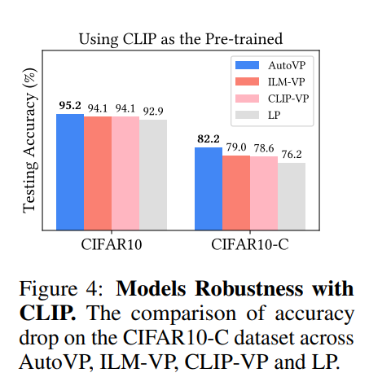

Fig. 4 에 나타난 바와 같이, AutoVP 는 ILM-VP, CLIP-VP, LP 보다 더 robustness 를 유지했다.

정확도 손실이 상대적으로 작았으며, 이는 AutoVP 가 training data 에 대한 overfitting 정도가 낮고 noise 의 영향을 저항하는 능력이 더 높다는 것을 시사한다.

#### Performance Evaluation on ID/OOD Downstream Tasks.

각 데이터셋의 out-of-distribution(OOD) 정도를 pre-trained CLIP 과 비교하여 average confidence score 와 CLIP zero-shot inference 를 고려하여 평가한다.

VP 를 통해 달성된 정확도 향상(Fig. 5)은 AutoVP 와 LP 또는 non-VP approaches(i.e. visual prompt 를 제거하고 output mapping 을 유지한 경우) 간의 정확도 차이로 계산되었다.

in-distribution(ID) dataset 에서 confidence score 와 zero-shot accuracy 가 높을수록 VP 를 통한 정확도 향상이 적었고, OOD dataset 에서는 정확도가 더 많이 향상되다.

ResNet18 을 ImageNet-1K 에서 pre-training 한 경우 (Fig. C.3)와 ImageNet-1K 와 other downstream dataset 간의 domain differences 를 평가하기 위해 FID score 를 계산했다.

결과는 CLIP 을 사용할 때와 일관되다. 결론적으로, AutoVP 는 source domain dataset 보다 OOD 특성이 더 두드러진 dataset 에 적합하다.

# 6. Limitations

이 연구에는 몇 가지 제한 사항이 있다.

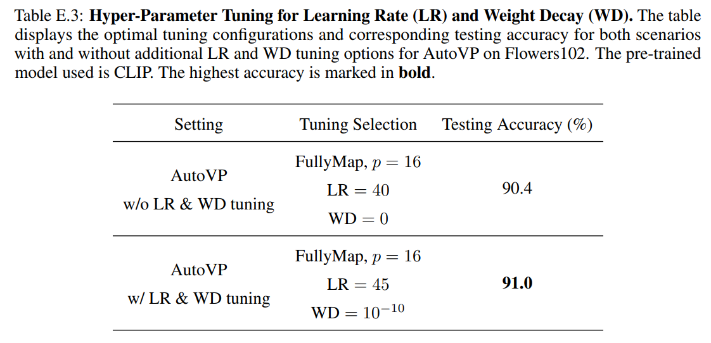

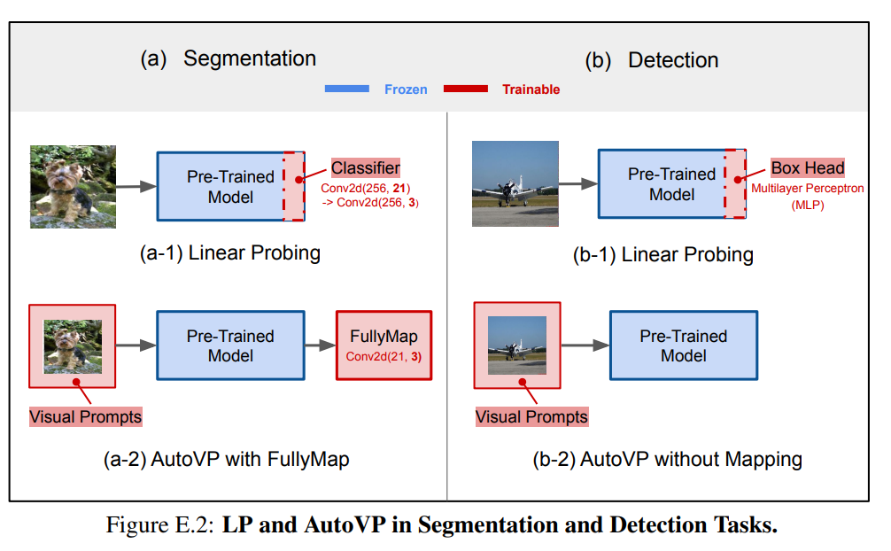

1. optimization process 에서 learning rate 및 weight decay 같은 특정 hyper-parameter 를 포함하지 않았다.
   - 이는 VP training 의 best configuration 을 식별하는 데 주로 집중했기 때문이며, 이러한 hyper-parameter 를 포함하면 실행 작업량이 크게 증가했을 것이다.
2. 또한, target dataset 에서 fine-tuning 할 best pre-trained model 선택에 관해서는, LogME 도 일반적으로 sophisticated fine-tuning 기법 (e.g., regularization)이 downstream task 에서 pre-trained model 의 순위를 변경하지 않을 것이라고 주장했다. 그럼에도 불구하고, 다양한 learning rate 와 weight decay 를 포함한 supplementary tuning 을 수행했다. (Fig. E.3)
   - 실제로, AutoVP 의 initial hyperparameter tuning phase 후에 learning rate, weight decay 및 기타 모델 parameter tuning 을 활성화할 것을 제안한다.
   - default hyper-parameter tuning 은 최근 generalization metric 을 활용하여 optimal hyperparameter configuration 을 식별하는 기술로 가속화될 수 있으며, 이는 향후 연구 주제로 탐색될 수 있다.
3. AutoVP 가 classification task 에 초점을 맞추고 있다는 점이다.
   - 저자는 AutoVP 를 segmentation 및 detection task 에 적용하는 확장을 수행했다 (Fig. E.2)
   - 최근 연구는 generative task 에서 visual prompt 의 성공을 보여주지만, generative task 에 대한 지원을 확장하려면 GANs, VAEs 또는 Diffusion Models 같은 suitable pre-trained generative model 을 통합하고 tailored prompt design 이 필요하다.

# 7. Conclusion

본 논문은 downstream dataset 에 대해 optimal VP configuration 을 자동으로 선택하는 end-to-end framework 인 AutoVP 를 소개한다.

AutoVP 는 다른 최신 VP 방법 및 transfer learning baseline 보다 우수한 성능을 보여주며, standard 및 sample-reduced fine-tuning settings 모두에서 성능을 발휘한다.

이 연구는 optiomal VP configuration, downstream data 특성이 VP 에 미치는 영향, image corruption 에 대한 robustness 향상 방법에 대한 중요한 통찰을 제공한다.