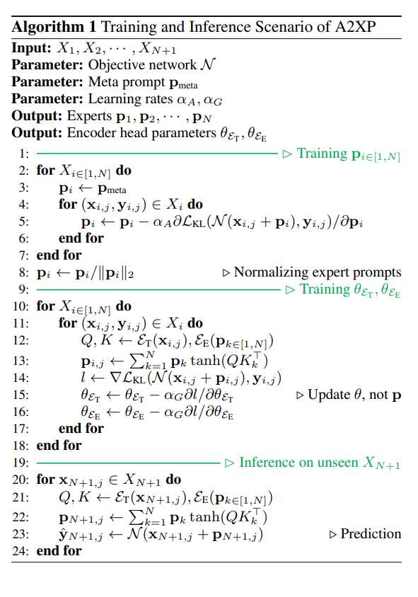
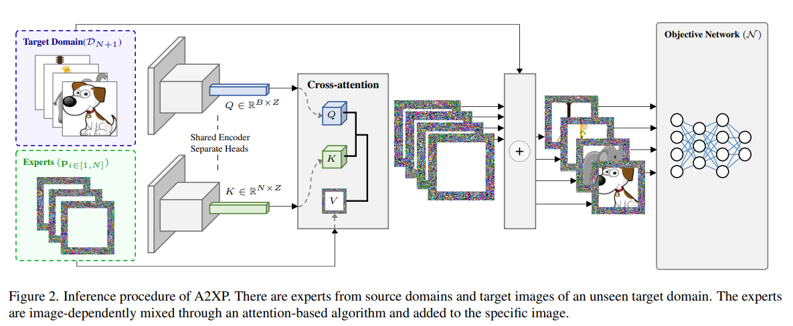
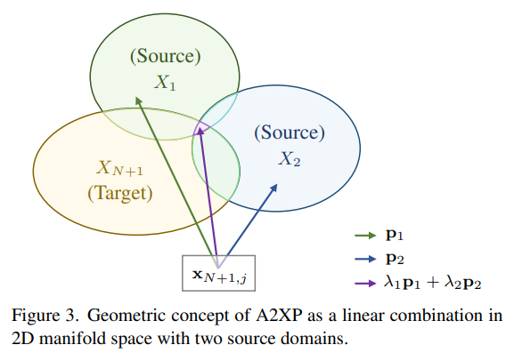
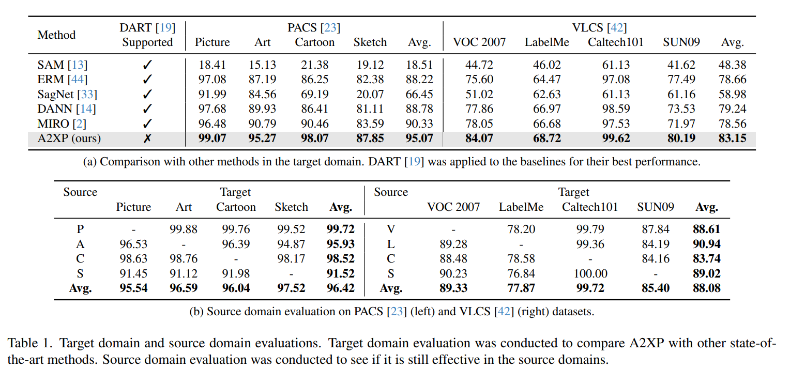
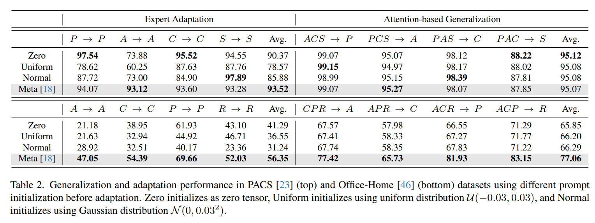
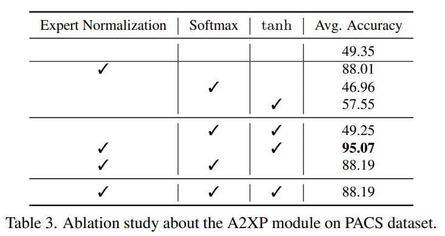
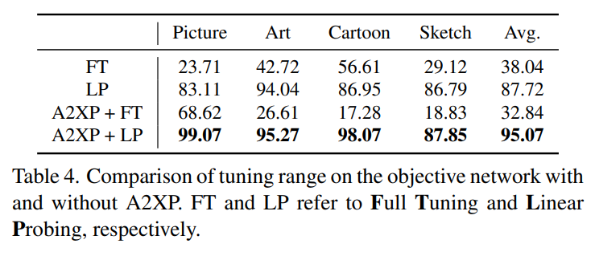
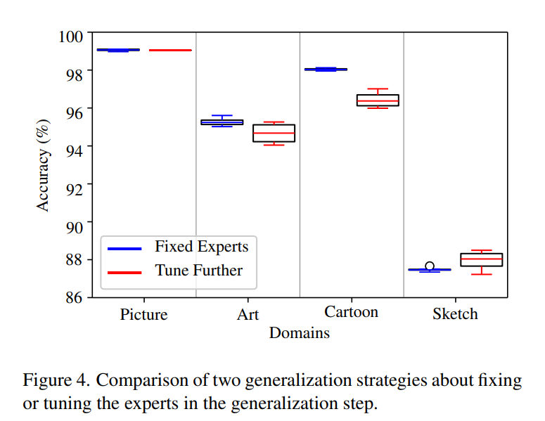
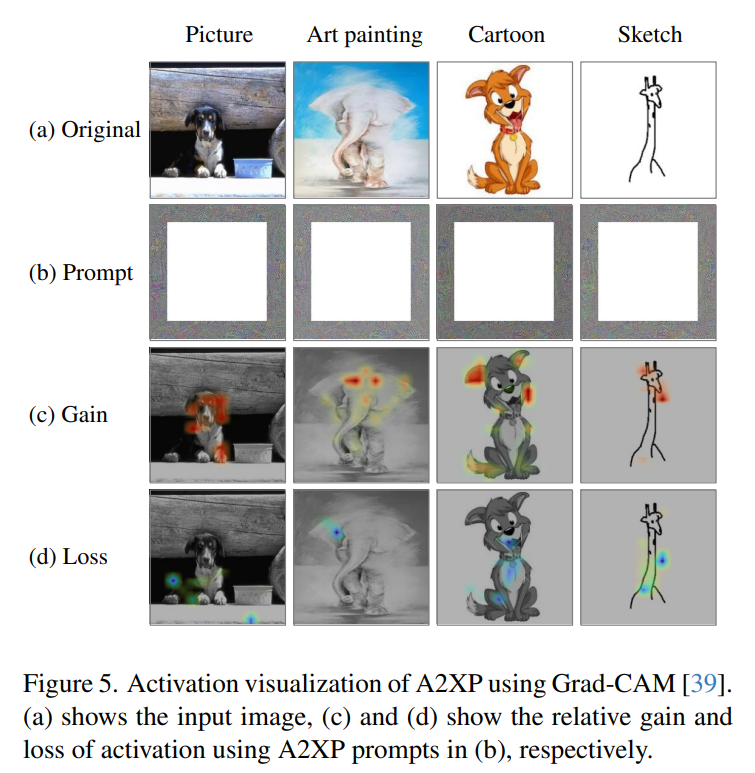
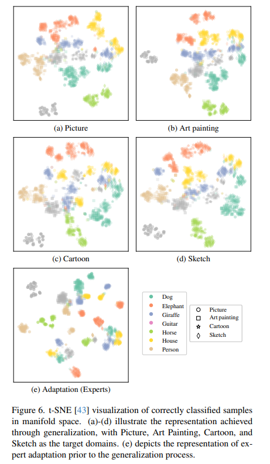

논문 및 이미지 출처 : <https://openaccess.thecvf.com/content/CVPR2024/papers/Yu_A2XP_Towards_Private_Domain_Generalization_CVPR_2024_paper.pdf>

# Abstract

DNN 은 특히 CV 분야에서 기존 방법을 능가하며 엄청난 성과를 내고 있다. 

이러한 model 을 배포할 때 가장 큰 문제는 different domain (e.g., image style, environmental conditions) 간의 data 에 내장된 bias 로 domain gap 을 초래한다.

따라서 biased training data 에서 general representation learning 기술이 필요한데, 이를 domain generalization 라고 한다.

이 논문에서는 'Attened to eXpert Prompts' (A2XP)라는 network architecture 의 privacy 및 integrity 를 보존하는 domain generalization 에 대한 novel approach 를 소개한다.

A2XP 는 two phases: Expert Adaptation 및 Domain Generalization 으로 구성된다.

1. 각 source domain 마다 optimal direction 으로 model 을 guide 하는 prompt 를 optimizing
2. two embedder networks 는 optimal output 을 목표로 이러한 expert prompts 를 효과적으로 통합하도록 훈련된다.

광범위한 실험 결과, A2XP 는 기존 non-private domain generalization method 보다 훨씬 우수한 성과를 보여준다.

이 approach 은 DNN 의 domain generalization 문제를 해결할 뿐만 아니라 CV 분야에서 privacy-preserving 을 제공하며 효율적인 솔루션을 제공한다.

# 1. Introduction

DNN 은 machine learning 에서 가장 강력한 model 로 인정받고 있다. 특히 CV 분야에서 DNN 은 이전의 방법들을 능가하는 놀라운 성공을 거두었다.

DNN 은 versatile 및 universal function approximator 이지만, 처리하는 data 는 image style, sensor parameters, painting style 같은 요소와 관련된 biases 가 자주 포함되어 있다. 이러한 biases 은 domain 이라고 불리는, distinct distribution 을 형성하며, 이들 사이에는 inherent gaps 가 있다.

DNN 이 이러한 domain 간에 generalizing 못하는 문제는 model 의 biases 를 줄이기 위해 엄청나게 많은 양의 unbiased training data 가 필요함을 의미한다.

따라서 biased training data 에서 general representation 을 학습할 수 있는 기술 개발이 중요하다.

이 문제는 domain generalization 라고 하며, 여러 연구에서 광범위하게 다루어져 왔다.

---

generalization 문제를 해결하기 위해, domain adaptation, meta-learning, transfer learning 등 다양한 연구 주제가 탐구되었다.

Domain adaptation 은 domain 간 차이를 줄이는 것을 목표로 하며, domain generalization 와 유사한 점이 있지만, target domain 의 가시성 여부에 차이가 있다. 

Domain adaptation 에선 target domain 이 알려져 있으며, 목표는 이 specific domain 에 model 을 adaptation 시키는 것이다.

- 이는 기존 knowledge 를 활용하여 target domain 에서 new knowledge 를 학습하는 것을 포함한다.
- 반면 domain generalization 는 target domain data 를 필요로 하지 않으며, network 를 source domain 에서 unknown target domain 으로 shift 하는 것을 robust 하게 만드는 데 중점을 둔다.

이 두 접근법은 서로 다르지만, domain adaptation 이 domain shift 를 이해하는 능력은 domain generalization 에 유익할 수 있다

저자의 접근법은 이 개념에 기반을 두고 있다. network 가 arbitrary domain 에서 input 을 generalized manifold space 로 effectively mapping 될 수 있다면, domain generalization 문제를 regression problem 으로 변환할 수 있다고 제안한다.

이 시나리오에서 adaptation strategies 는 이 regression 방향을 결정하는 데 중요한 통찰을 제공할 수 있다.

---

domain 간 차이를 줄이는 대부분의 방법은 target network 의 architecture 와 parameters 에 접근할 필요가 있다.

예로, Domain Adversarial Neural Network (DANN) 과 Style-Agnostic Network (SagNet) 는 domain-agnostic features 를 추출하기 위해 backbone network 를 fine-tuning 한다.

유사하게, Common and Specific Visual Prompt Tuning (CSVPT)은 prompt token 을 Vision Transformer (ViT)와 결합하여 이러한 문제를 해결한다.

그러나 이러한 접근법은 network 의 architecture 나 parameter 를 변경해야 하므로 상당한 privacy 우려가 발생할 수 있다.

---

Visual Prompting (VP) 는 network 의 architecture 나 parameter 를 변경하지 않고 adversarial reprogramming 을 통해 objective network 를 fine-tuning 하여 privacy 우려를 해결한다.

이것은 network embed 가 아닌 input image 에 추가되는 prompt 로 알려진 additional parameter 를 tuning 하는 방식이다.

저자는 이를 통해 input 에 prompt 를 추가하여 privacy 문제를 해결했다. 그러나 VP 는 prompt 의 pixel 수가 많으면 training 을 방해할 수 있는 한계가 있다. 

이를 극복하기 위해 저자는 "experts" 라고 불리는 multiple prompts 를 training 하고 attention mechanism 을 사용하여 이를 통합한다.

이 전략은 domain generalization 문제를 direction regression problem 으로 해결하는 개념과 일치하며, 이러한 experts 는 generalization 을 위한 optimal direction 을 찾는 guiding 을 제공한다

이번 연구에서는 domain generalization 문제를 two steps 로 나누어 해결하고자 한다: expert adaptation 및 domain generalization, objective network 의 privacy 를 유지하면서. 이 문제를 해결하는 novel domain generalization 방법인 **A**ttend **to** e**X**pert **P**rompts (A2XP)를 제안한다.

expert adaptation step 에선, 각 source domain 에 대한 prompt 를 optimizing 하여 optimal direction 을 찾기 위한 힌트를 준비한다.

domain generalization step 에선, two embedder networks 가 expert prompts 를 적절히 혼합하여 optimal direction 의 output 을 내도록 학습한다.

주요 기여는 다음과 같다:

- VP 에 영감을 받아 privacy 를 보호하면서 간단한 domain generalization 방법인 A2XP 를 소개.
- generalization 문제를 linear combination 문제의 optimization 으로 수학적 분석 수행
- 광범위한 실험을 통해 A2XP 와 그 components 의 효과와 특성을 입증한다.
- A2XP 는 기존의 non-private domain generalization 방법에 비해 lower computational resource 으로 SOTA 를 달성한다.

# 2. Related Works

## 2.1. domain generalization 

domain generalization 의 objective 는 visible source domain 과 unseen target domain 간의 차이를 줄이는 것이다.

이는 domain alignment, meta learning, ensemble learning, representation disentanglement 등의 여러 approach 이 있다.

- DANN : network 가 domain-agnostic features 를 찾을 수 있도록 domain 을 구별
- SagNet : content bias 과 style bias 을 adversarially learning 하여 domain 을 구별
- MIRO : domain 간의 mutual information 을 기반으로 loss function 에 regularization term 을 추가하여 domain 을 align
- DART : source domain 을 다양화하고, 독립적으로 diverse features 를 포착하기 위해 data augmentation 을 적용하고, 여러 network 를 집계한 후 이를 반복하는 ensemble learning
  - DART 는 generalization 성능을 향상시킬 수 있지만, 많은 메모리가 필요하다.

저자의 approach 는 기본적으로 domain alignment 와 ensemble learning 의 아이디어를 따르고 있다.

저자는 각 source domain 을 align 하는 multiple expert prompt 를 training 한다.

그런 다음, 이 expert 들을 집계하여 novel target domain 을 align 한다.

expert 들은 실시간으로 target domain 의 optimal direction 을 찾는 힌트를 제공하며, 저자는 target domain 의 각 sample 에 대해 다른 simple generalization steps 를 수행한다.

## 2.2. Prompt Tuning in Computer Vision

Prompt tuning 은 tiny parameters 만을 필요로 하는 transfer learning 기법이다.

CV 에서의 prompt tuning 은 Visual Prompt Tuning (VPT) 에 의해 처음 도입되었으며, small parameter 를 사용한 transfer learning 을 가능케 한다.

VPT 는 prompt tuning 이 full fine-tuning 과 linear probing 보다 stronger transfer learning 임을 입증했다.

그러나 VPT 를 적용하려면 network의 architecture 변경이 필요하다. 

VP 는 general pre-training 위해 vision-language relationships 를 사용하는 adversarial reprogramming-based prompt 를 도입했다.

이들은 optimized perturbation 만을 사용하여 visual 및 lingual representation 을 성공적으로 통합했다.

이를 저자는 "input prompting" 라고 부를 것이다.

- DAM-VP : diverse representation distribution 를 포함한 target dataset 으로 network 를 transfer 하는 방법 제안
  - DAM-VP 는 data 를 cluster 로 나누고 각 cluster 를 사용하여 prompt 를 update 한 다음, all cluster 에서 prompt 를 모아 data distribution 의 다양성을 포착하고 all data distribution 를 자세히 표현한다.

저자는 DAM-VP 에서 영감을 받아 source domain 에서 data distribution 의 다양성을 포착하고 target domain 을 generalization 했다.

## 2.3. Attention Mechanism

attention mechanism 의 핵심 아이디어는 important features 를 활성화하고 less important features 를 침묵시키는 것이다.

현대엔 attention mechanism 을 사용하고 있다.

- Squeeze-and-Excitation Networks 는 large feature map 의 각 channel 에 weight 를 부여한 후, 이를 집계하는 데 중점을 둔다.
- Transformer : attention mechanism 을 핵심으로 하는 가장 효과적인 architecture 중 하나이다.
  - 이는 "query" 의 출처가 다른 두 type 의 attention mechanism 을 가지고 있다.
  - cross-attention 은 "key" 와 "value" 의 동일한 출처로부터 "query" 를 생성하며,
  - self-attention 은 다른 출처로부터 생성된다.
  - cross-attention 은 다른 data 와의 관계에 따라 "value" 의 중요성을 포착하는 데 사용된다.

저자는 multiple expert 를 적절히 결합하기 위해 cross-attention 을 사용했다.

# 3. Methods

## 3.1. Algorithm Overview

A2XP 는 two-phase approach 를 통해 작동한다.

처음엔 각 source domain 에 대해 specific adaptation prompt 인 ‘experts’ 를 제작하여 source-wise adaptation 을 수행한다.

1. 이 step 는 주로 error backpropagation 을 통해 end-to-end end-to-end 로 수행된다.
2. subsequent step 은 domain generalization 에 전념하며, input image 별로 target domain 의 image-specific prompt 를 attention 기반 알고리즘을 통해 결정되는 all experts 의 weights 를 평균내어 생성한다.
   - 이 step 에선 two separate trainable encoders: input image 를 위한 하나와 pre-trained experts 를 위한 하나 를 사용한다.

expert 의 weight 는 encoded input image 와 expert 의 embedding 사이의 similarity 에서 파생된다.

이 steps 들을 각각 _Expert Adaptation_ 과 _Attention-based Generalization_ 라 한다.

## 3.2. Idea Formulation

저자의 아이디어를 구체적인 지침으로 형성하여 자세히 이해할 수 있도록 한다.

input prompting 을 사용한 domain generalization 는 다음과 같이 형성될 수 있다. 

$N + 1$ domain $X_{i∈[1,N+1]}$ 에 대해, $X_{N+1}$ 을 target domain 으로 선택할 수 있고, 나머지는 source domain 으로 선택할 수 있다.

network $\mathcal{N}$ 은 fixed pre-trained parameters 를 가지며, network 의 decision boundaries 가 존재한다.

$i$-th domain 의 expert 를 $p_i ∈ R^{d_{prompt}}$ 라 하면, 여기서 $d_{prompt}$ 는 prompt 의 dimension.

그러면 $p_{i∈[1,N]}$ 는 source domain 에서 inputs 을 shift 하는 optimal direction 을 나타내며, known source data 를 사용하여 이를 optimizing 할 수 있다.

target domain 의 prompt $p_{N+1}$ 는 target domain 이 보이지 않기 때문에 directly optimizing 할 수 없다.

저자는 $p_{N+1}$ 을 다음과 같은 $p_{i∈[1,N]}$ 의 linear combination 으로 근사한다:

$$
\begin{equation}
    p _{N+1} = \sum _{i=1}^{N}{\lambda _i p _i}, \quad \lambda _i = \Lambda (p _i \vert x \in X_i) 
\end{equation}
$$

- $\Lambda$ : $x ∈ X_i$ 가 주어질 때 $p_i$ 에 대한 optimal weights 를 나타내는 conditional function.

다음과 같은 objective function 을 가정하자:

$$
\begin{equation}
    J(\lambda _i)=\operatorname {KL}(\mathcal{N} (x _{N+1} + p _{N+1}) \Vert \mathcal{D} _{N+1})
\end{equation}
$$

- $x_{N+1} ∈ X_{N+1}$, $\mathcal{D}_{N+1}$ : $x_{N+1}+p_{N+1}$ 에 대한 $\mathcal{N}$ 의 target distribution
- KL : KL-Divergence function

그러면 likelihood function $L$ 은 다음과 같은 관계를 갖는다:

$$
\begin{equation}
    L (\mathcal{D} _{N+1} \vert \mathcal{N} (x _{N+1} + p _{N+1})) \propto e^{-J(\lambda _i)}.
\end{equation}
$$

이 공식은 다음을 보여준다:

$$
\begin{equation}
    J(\lambda _i) \propto -\log L (\mathcal{D} _{N+1} \vert \mathcal{N} (x _{N+1} + p _{N+1})),
\end{equation}
$$

- $\Lambda$ 를 훈련하여 $J$ 를 minimize 하는 것은 $L$ 을 maximize 하는 것과 같다.
- 이는 다음과 같이 설명될 수 있다.
  - 각 domain 에 대한 optimal prompt 의 범위가 있다면, expert 란 그 범위 내의 한 point 를 의미한다.
  - 그리고 target prompt 는 Eq. (1)과 같이 형성되므로, prompt space 의 기하학적 구조는 Fig. 3 과 같이 개념적으로 시각화할 수 있다.

## 3.3. Expert Adaptation

저자의 목표는 multiple expert prompt 를 single prompt 로 혼합하는 것이다.

이를 효과적으로 하기 위해 각 expert 는 자신의 primary field, 즉 domain 에서 능숙하게 훈련되어야 한다.

저자는 이러한 expert 들을 adaptation 시키기 위해 간단한 gradient-based method 인 adversarial reprogramming 을 사용한다.

이 approach 은 specific scenarios 에선 충분하지만, pre-training domain 과 크게 다른 domain 에서는 부족하다.

이를 해결하기 위해 저자는 meta prompts 를 사용하여 expert prompts 를 초기화했다. 

meta prompt 는 visual prompt 를 초기화하는 데 사용할 수 있는 pre-trained prompts 를 의미한다.

## 3.4. Attention-based Generalization

저자의 핵심 아이디어는 unseen domain 의 image 를 올바르게 분류하도록 expert 를 결합하는 것이다.

- 저자는 weight-averaging 를 통해 expert 를 결합했다.
  - weight 는 주어진 specific image 에 대해 expert 가 얼마나 필요한지를 나타내야 한다. 이 요구사항은 cross-attention mechanism  을 사용하여 구현할 수 있다.
  - 이 경우 expert 들은 “keys”($K$) 와 “value”($V$) 가 되고, target image 는 attention 의 “query”($Q$) 가 된다.
- attention weight 는 $Q$ 와 $K$ 간의 similarity 로 계산된다.
  - $Q$ 와 $K$ 를 직접 비교하는 대신, 저자는 embedding vector 를 사용했다.
- 저자는 pre-trained network 를 shared embedder network 로 사용하고, 각각 $Q$ 와 $K$ 에 대해 two different trainable head linear layers 를 사용했다.
  - $Q$ 와 $K$ 는 shared encoder 와 각각의 linear head 를 통해 embedding 된다.
  - 그런 다음 expert 의 수만큼 scalar attention weights 를 얻어지며, $V QK^\top$ 은 target image 의 prompt 가 된다.

그러나 두 가지 문제가 있다. 

1. experts 들은 different domains 에서 independently optimizing 되어 scales 에서 큰 차이가 발생한다.
   - 저자는 이를 각 expert 자신들의 $L_2$-norm 으로 나누어 normalizing 하여 해결했다. 
2. weight 는 `softmax` function 같은 scaling 없이 독립적으로 계산되기 때문에 너무 포화될 수 있다는 것이다.
   - `tanh` function 을 사용하여 weight 를 $[-1, 1]$ 로 mapping 하여 완화할 수 있다.
   - 결과적으로 $k$-th target image $(x_{N+1,k} ∈ X_{N+1})$ 의 prompt $(p_{N+1,k})$ 는 다음과 같이 형성될 수 있다:

$$
\begin{equation}
    p _{N+1,k} = \sum _{i=1}^{N} \frac {p _i}{\Vert p _i \Vert _2} \mathcal {E}_{\textnormal {T}}(x _{N+1,k}) \mathcal {E}_{\textnormal {E}}(\frac {p _i}{\Vert p _i \Vert _2})^\top,
\end{equation}
$$

- $\mathcal{E}_T$ 와 $\mathcal{E}_E$ 는 각각 target image 와 expert 를 위한 embedder 를 나타낸다.
- generlaization 가 한번 훈련되면, expert 의 embedding vectors 는 고정된다. 왜냐하면 expert 들은 변경되지 않을 것이기 때문이다. 따라서 evaluation 에선 더 이상 expert embedding proceduer 가 필요하지 않다.

# 4. Experiments and Analysis

PACS 와 VLCS dataset 을 중심으로, Office-Home dataset 을 일부 사용하여 leave-one-domain-out evaluation 및 보다 광범위한 실험을 수행하여 A2XP 의 효과와 특성을 입증한다.

- PACS dataset : 그림, 예술화, 만화, 스케치의 4 domain 으로 구성되어 있다.
- VLCS dataset : 각기 다른 domain 을 나타내는 4 subdataset 으로 구성: VOC 2007, Label Me, Caltech101, SUN09.
- Office-Home dataset : 예술화, 클립아트, 제품, 실제 이미지의 4 domain 으로 구성
- 실험은 Intel Xeon Gold 6226R 2.90GHz 와 NVIDIA RTX 3090 이 장착된 Ubuntu Server 18.04 에서 수행

## 4.1. Implementation Details

본 연구에선 CLIP-pre-trained ViT 을 objective network 로 선택했다.

- 이 framework 내의 expert 들은 end-to-end backpropagation 을 통해 최적화되었다.
- prompt size 는 VP 의 사양에 따라 padding size 30 으로 선택되었다.
- optimization 을 위한 learning rate 1.0E-4 와 momentum 을 사용한 stochastic gradient descent 를 사용했다.
- A2XP 의 shared embedder network 에는 tiny network 도 충분하기 때문에, backbone 으로 ImageNet-pre-trained-ResNet18 을 선택했다.
- shared encoder 다음에는 $Q$ 와 $K$ 로 features 를 특화하기 위해 two distinct trainable linear heads 가 붙어 있다.
- A2XP 의 효율성을 입증하기 위해 1,000 update 로 제한했다.
- generalization 중 optimization 를 위해 AdamW 을 사용했다.
- entire generalization procedure 에 걸쳐 Cosine Annealing with Warm Restarts 알고리즘을 사용하여 초기 값의 10% 까지 learning rate 을 감소시켰다.

## 4.2. Leave-One-Domain-Out Evaluation

저자는 domain generalization 성능을 평가하기 위해 leave-one-domain-out 평가를 수행했으며, 결과는 Tab. 1a 에 자세히 나와 있다.

- 이 실험에서는 SagNet, DANN, MIRO 와 같은 domain generalization 방법뿐만 아니라 SAM 과 ERM 같은 non-domain generalization  방법을 평가했다.
  - 이러한 5 baselines 은 DART 를 사용하여 증강되었다.
- A2XP 는 PACS 와 VLCS dataset 의 각 target domain 에서 다른 모든 방법을 능가했다.
- 특히, PACS dataset 에선 평균 정확도가 4.74% 증가했고, VLCS dataset 에선 4.99% 증가했다.
- DART 는 objective network 의 privacy 를 보장하지 않는다는 점을 언급할 필요가 있다.

## 4.3. Evaluation on Source Domains

domain generalization 는 unseen domain 뿐만 아니라 known source domain 에도 model 을 adaptation 시키는 데 중점을 둔다.

저자는 이러한 domain 의 experties 를 활용하여 source domain 에서 A2XP 의 generalization 가능성을 평가했다. 

모든 source domain 에서의 평가도 target domain 에서만큼 잘 수행되었으며, Tab.1b 에 나타나 있다.

특히, PACS 에서는 domain adaptation 성능보다 평균 정확도가 2.9% 높았다 (Tab. 2).

## 4.4. Importance of Expert Processing

저자의 연구는 expert 를 normalizing 및 scaling 하는 것이 A2XP module 이 expert 를 효과적으로 혼합하는 데 중요함을 보여준다.

저자는 expert normalization, softmax 및 hyperbolic tangent function 의 세 가지 측면에 중점을 두고 ablation study 를 수행했으며, 결과는 Tab.3 에 자세히 나와 있다.

- 각 factor 의 성능 향상은 other two factors 의 모든 combination 의 평균 향상으로 계산했다.
- expert normalization 은 Eq. (5) 의 normalization 을 따라 expert 들이 초기에는 동일한 scale 을 갖도록 한다.
  - 이 normalization 은 leave-one-domain-out evaluation 에서 39.09% 의 유의미한 정확도 향상을 기여했다.
- softmax function 은 attention weight 의 amplifier (증폭기)로 작용한다. 
  - 이는 평균 정확도를 4.35% 감소시키는 것으로 관찰되었으며, 이는 차이가 미미한 경우에도 attention weight 가 낮은 expert 의 효과를 크게 감소시키는 경향 때문이다.
  - attention weight 는 각 weight calculation 이 다른 expert 와 독립적으로 이루어지기 때문에 training 중에 포화될 수 있다.
- Hyperbolic tangent function 은 이러한 포화 문제를 방지하기 위해 적용되었고, 4.39%의 정확도 향상을 가져왔다.

결과적으로, softmax function 을 제외한 expert normalization 과 hyperbolic tangent function 의 combination 이 tested factor combinations 중 가장 효과적임이 증명되었다.

## 4.5. Impact of Prompt Initialization

본 실험에서는 여러 initialization strategies (zero, uniform distribution, Gaussian distribution, meta prompt initialization)을 비교하여 meta prompt initialization 의 효과를 입증한다.

simpler task 에서는 good initialization 이 선택적일 수 있으나, task complexity 가 증가할수록 그 중요성이 커진다.

- 예로, Tab.2 에서 볼 수 있듯이, meta prompt initialization 은 adaptation  성능이 뛰어나지 않은 상황 (PACS 결과 참조)에서는 큰 장점을 보여주지 않았다. 
- 그러나 Office-Home dataset 같은 더 어려운 상황에서는 meta prompt initialization 가 expert training 에서 generalization training 에 이르기까지 성능을 크게 향상시켰다.
  - 예로, zero initialization 의 adaptation 성능은 다른 방법들 중에서 가장 좋았으나, 정확도가 15.06% 낮았다.
  - 따라서 zero initialization 의 generalization 성능은 meta prompt initialization 보다 11.21% 낮았다.
- Office-Home dataset evaluation 를 위해 10K update 로 설정한다.
- 다른 initialization 전략들 간에는 큰 차이가 없었으며, adaptation 과 generalization 사이의 상관관계는 선형적이지 않았다.
- 이는 효과적인 expert adaptation 이 A2XP 의 중요한 기반이며, good initialization 가 good adaptation 을 달성하는 데 중요한 요소임을 시사한다.

## 4.6. Effectiveness of A2XP Module

저자는 objective network 로 CLIP-pre-trained ViT 를 사용했으며, 이는 well-generalized pre-trained model 로도 인식된다.

일반적으로 사용되는 fine-tunig 방법 (e.g., linear probing 및 full fine-tuning)과 함께 A2XP module 의 정확도 향상 효과를 정량화하여 그 효능을 입증하기 위해 ablation study 를 수행했다.

- 처음에는 A2XP 없이 linear probing 이 domain generalization 에서 전체 조정보다 우수했다.
- 구체적으로, linear probing 은 평균 정확도 38.04% 를 달성한 반면, full tuning 은 32.84% 를 기록했다.
- Tab.4 에서 알 수 있듯이, hidden layers 의 tuning 은 output layer 의 tuning 에 부정적인 영향을 미치는 것으로 나타났다.
- A2XP 를 linear probing 에 통합하면 all tested domain 에서 정확도가 크게 향상되었다.
  - 그러나 full tuning 의 경우 A2XP 의 포함이 역효과를 초래했다.
  - 저자는 full tuning 이 본질적으로 불안정하기 때문에 hidden layers 앞에 위치한 A2XP module 이 부정적인 영향을 받았다고 분석했다.

요약하면, 특정 scenarios 에서 further tuning 이 평균 정확도를 향상시킬 수 있지만, 일반적으로 정확도가 감소하고 성능 불안정성을 초래한다는 것을 시사한다.

또한, domain adaptation 을 통한 expert training 이 domain generalization 보다 더 유익하고 효과적이라는 것을 암시한다.

### 4.7. Further Expert Tuning

network 에만 집중하지 않고 expert 에 대한 추가 조정을 통해 generalization 전략에 중점을 두고 추가 실험을 수행했다.

expert 의 generalization phase 동안 expert 를 futher tuning 하면 domain-specific knowledge sharing 이 촉진된다는 가정 하에, PACS dataset 에서 fixed random seed 를 사용하여 10번의 training 을 반복했다.

이 실험의 결과는 Fig. 4에 나타나 있다.

- Picture domain 에선 평균 정확도가 약간 떨어졌지만, 통계적으로 유의미하지 않았다.
- Art 및 Cartoon domain 에선 평균 정확도가 각각 0.60% 와 1.60% 감소했으며, 두 domain 모두 표준 편차가 0.40% 크게 증가했다.
- 반면, Sketch domain 에선 평균 정확도가 0.48% 상승했으며, 이와 유사한 증가인 0.48% 의 표준 편차 증가를 보였다.
  - 이는 expert 의 further tuning 이 specific domain 에서는 향상을 가져올 수 있지만, 다른 domain 에선 성능 변동성을 더 크게 만들 수 있음을 나타낸다.

### 4.8. Visualization

A2XP 가 network 의 집중에 미치는 영향을 이해하기 위해 activation map 을 시각화했다.

Tab.4 는 linear probing 이 일종의 generalized way 로 이루어졌음을 보여준다. 

이는 A2XP 없이 linear probing 이 합리적으로 효과적인 activation map 을 생성하며, A2XP 의 통합이 이러한 activation map 을 더욱 정제하고 향상시킨다는 것을 시사한다.

따라서 activation map 뿐만 아니라 activation 의 gains 와 losses 를 포함한 시각화를 확장하여 Fig. 5 에 나타냈다.

- (b) 에 나타난 prompt 는 (c) 및 (d) 에서 보여지는 만큼 activation map 을 변경한다.
- prompt 는 동일한 expert 에서 왔기 때문에 유사한 표현을 가지지만, 강도가 다르거나 일부는 반전된 것으로 보인다.
  - 이는 expert 가 target image 에 따라 다른 비율로 혼합된다는 것을 의미한다.
- A2XP 는 network 가 얼굴 표현에 더 집중하게 만들고 배경이나 동물의 몸과 같은 다른 표현의 활성화를 억제한다는 것을 보여준다.
- 특히 Picture domain 에선 (c) 가 주로 개의 귀를 활성화하고 배경을 비활성화한다.
- Scetch domain 에선 머리 주변의 표현을 활성화하고, 목과 몸 옆의 배경을 비활성화하여 분류에 덜 관련된 단서를 제거한다.

---

또한, last hidden layer 에서 추출한 features 의 manifold space 을 시각화하여 class 와 domain 이 2-dimentional space 에서 어떻게 표현되는지 관찰했다.

- Fig. 6a–6d 는 target domain 에 상관없이 generalized features 가 유사하게 mapping 된다는 것을 보여준다. 
- 또한, 동일한 class 에 속하는 sample 은 different domain 에서 왔더라도 밀접하게 그룹화되어 있다.
- 반면, Fig. 6e 에서 보이듯이, 동일한 class label 을 가진 sample 이지만 different domains 에선 뚜렷하게 mapping 된다.
- 이는 expert 가 독립적으로 훈련되며, other prompt 와 관련성을 고려하지 않고 훈련되기 때문으로 이해된다.

### 4.9. Space Complexity Analysis

A2XP 의 space complexity 를 DART 와 비교하여 계산했다. 

DART 는 augmentation presets 수($M$) 에 비례하는 메모리를 요구하는 반면, A2XP 는 $N$ expert prompt 로 훨씬 적은 메모리 공간을 요구한다.

objective network 의 parameter 수를 $\mathcal{S}_\mathcal{N}$ 이라고 하면, DART 와 A2XP 의 big-**O** 표기법은 다음과 같다:

$$
\begin{equation}
    \mathbf{O}_\textnormal{DART}(M) = M S_\mathcal{N},
\end{equation}
$$
$$
\begin{equation}
    \mathbf{O}_\textnormal{A2XP}(N) = N S_p + S_\mathcal{N} + S_\mathcal{E} = N S_p,
\end{equation}
$$

- $Sp$ 와 $S_\mathcal{E}$ 는 각각 single prompt 와 encoder 의 parameter 수를 나타낸다.
- 이는 저자의 방법이 비교 접근법에 비해 메모리 사용량이 줄어든다는 주요 장점을 보여준다.

### 5. 결론 및 향후 연구 방향

본 연구에서는 novel domain generalization 방법인 A2XP 를 제안하였다.

- A2XP 는 domain generalization 문제를 direction repression 문제로 해결하며, 이를 two steps: domain adaptation 과 domain generalization step 으로 분리하여 접근한다.
  - domain adaptation step 에선 각 source domain 에서 expert 를 훈련시켜 힌트 역할을 하게 한다.
  - domain generalization step 에선 network 가 target image 에 따라 이러한 expert 를 적절히 혼합하도록 훈련한다.
- A2XP 는 objective network 의 architecture 나 parameter 를 변경할 필요가 없어 network 의 privacy 를 유지하는 데 핵심적인 역할을 한다.
- A2XP 는 PACS, VLCS dataset 에서 limited update number 로 SOTA 를 능가하며, target domain 뿐만 아니라 source domain 에서도 성공적으로 수행되었다.
- 저자는 이 문제 정의를 수학적으로 likelihood maximization 을 기반으로 입증했으며, 광범위한 실험을 통해 효과성과 특징을 입증하였다.

저자의 연구는 domain generalization 에서의 privacy 문제를 제기하고 strong domain generalization 방법을 제안했지만, 몇 가지 한계점도 존재한다. 

- A2XP 는 domain generalization step 에서 well-trained expert 를 필요로 한다.
- 그러나 저자가 아는 바에 따르면, 일부 dataset 은 input prompt 로 adaptation 하기 어려울 수 있다.
  - A2XP 가 널리 사용되기 위해서는 adaptation 기술의 문제를 개선해야 한다.
