논문 및 이미지 출처 : <https://openaccess.thecvf.com/content/CVPR2024/papers/Zhang_Exploring_the_Transferability_of_Visual_Prompting_for_Multimodal_Large_Language_CVPR_2024_paper.pdf>

# Abstract

MultiModal Large Language Models(MLLMs)이 유망한 다재다능한 능력을 보여주었지만, 여전히 downstream task 에선 specialized model 보다 성능이 떨어져 그 유용성을 향상시키기 위해 adaptation 이 필요하다.

그러나 fine-tuning 방법은 각 model 마다 independent training 을 요구하여 huge computation 및 memory overhead 를 초래한다.

본 논문에서는 downstream task 를 위해 optimized shared parameters group 을 사용하여 다양한 MLLMs 의 성능을 향상시키는 novel setting 을 제안한다.

이를 달성하기 위해, Transferable Visual Prompting (TVP)를 제안

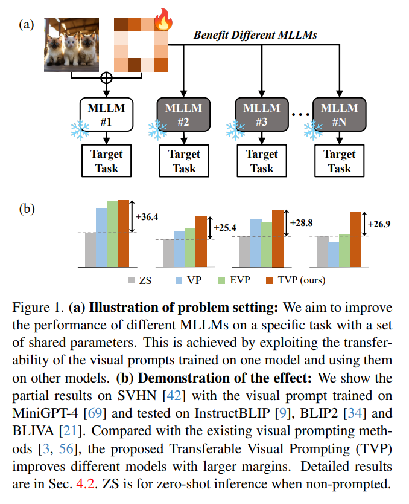

- 이는 one model 에만 훈련된 후, 다양한 model 로 transfer 이 가능한 visual prompts 를 생성하여 downstream task 의 성능을 향상시키고 간단하고 효과적인 접근법 (Fig. 1)
- 기존의 visual prompt 의 cross-model feature corruption 을 해결하고 learned prompts 의 transferability 향상을 위해 두 가지 전략을 도입.
  1. Feature Consistency Alignment : task-agnostic knowledge 를 유지하기 위해 prompted feature changes 에 제약을 가하는 방법
  2. Task Semantics Enrichment : language guidance 를 통해 prompted image 가 richer task-specific semantics 를 포함하도록 장려하는 방법
- 저자는 object recognition 및 counting 부터 multimodal reasoning 및 hallucination correction 까지 다양한 task 에서 6 SOTA MLLMs 를 사용하여 광범위한 실험 수행으로 TVP 의 효과 검증

# 1. Introduction

Large Language Models (LLMs)의 성공은 multimodal tasks 를 해결하는 능력을 탐구하도록 연구자들을 자극했다.

visual input 을 text embedding 과 조화롭게 결합하여 다루는 다양한 방법들이 개발되었고, 이를 통해 다양한 task 에서 뛰어난 성능을 발휘하는 Multimodal Large Language Models (MLLMs)가 탄생했다.

이러한 models 는 image understanding 및 reasoning 에서 주목할 만한 성과를 거두며, 여러 task 의 "foundation model" 로서 기능하다.

그러나 이런 우수한 generalization performance 에도 불구하고, 기존의 MLLMs 는 종종 specialized SOTA 에 비해 성능이 떨어진다. (e.g., image classification 같은 downstream task 의 zero-shot 평가).

이는 MLLMs 가 주로 massive data 으로 pre-training 되고, small modality alignment 및 instruction data 로 fine-tuning 되기 때문이다.

따라서 사용자가 MLLMs 를 downstream task 에 활용할 때 그 성능이 만족스럽지 않을 수 있는 gap 을 좁히고 task-specific 에 대한 MLLMs 의 유효성을 향상시킬 수 있는 효과적이고 효율적인 전략을 개발하는 것이 필수적이다.

MLLMs 를 downstream task 에 adapting 하기 위해 전통적으로는 task-specific data 에 fine-tuning 이 필요하다. 이는 과학 및 생명과학 분야에서 효과적이지만, billions parameters 를 가진 모델에게는 computationally demanding 및 storage-intensive 가 문제가 된다.

이러한 문제를 해결하기 위해, Adapters, LoRA, prompt tuning 을 포함한 다양한 parameter-efficient fine-tuining (PEFT) 기법이 제안되었다. 이들 방법은 downstream task 를 위해 model-specific parameter 의 gradient-based optimization 을 수행한다.

그러나 이러한 방법들은 optimizing 을 위해 방대한 memory 가 필요하며, 결과적으로 얻어진 parameter 는 다른 models 간의 generalization 능력이 부족하다.

실제 상황에서 PEFT 에 대한 prior knowledge 가 없고 limited computation resource 를 가진 사용자들은 추가적인 fine-tuning 없이도 자신의 model 을 개선할 수 있는 auxiliary parameters (e.g., prompt)를 선호할 것이다.

이로 인해 저자는 한 개 또는 소수의 model 에만 optimizing 하면서 동일한 task 에 대한 여러 MLLMs 에 이익을 줄 수 있는 _shnared parameters_ set 을 개발하는 것을 목표로 한다.

이 방법은 resource-friendly 및 flexible 하며, model weight 접근 없이 다양한 model 을 task 에 맞게 adapting 을 쉽게 만들 수 있다.

또한, 이는 "Prompt as a Service" (PaaS) 패러다임과 일치한다. 여기서 사용자는 PaaS 제공업체에게 downstream task 에 대한 prompt 를 요청할 수 있으며, 동시에 local model confidential 을 유지할 수 있다.

---

MLLMs 가 image 를 input 으로 취급하기 때문에, image pixel space 는 parameter learning 에 유망한 shared space 이다.

이전 방법들은 Visual Prompting (VP) 를 사용하여 pre-trained model 을 downstream task 에 adapting 하기 위해 image 주변의 pixel space 에서 parameter 를 학습했다.

VP 의 transferability 에 영감을 받아, 저자는 다른 models 의 성능을 향상시키기 위해 learned visual prompts 를 transfering 하는 것을 가능한 solution 으로 삼고 있다.

그러나 다른 models 를 위해 learned visual prompt 의 transferability 는 아직 연구되지 않은 상태이다.

저자는 VP 가 prompt training 에 사용된 model 의 성능을 효과적으로 향상시킬 수 있지만, 다른 models 에 대해서는 성능 향상이 제한적이거나 크게 저하될 수 있음을 발견했다.

이는 learned prompt 가 이들의 training 을 위해 visual features 에 상당한 변화를 일으키고, _cross-model feature corruption_ 으로 정의되기 때문이다.

이는 transfer 될 때 model 의 성능에 부정적인 영향을 미치며, large-scale pre-training 으로 얻은 plenty knowledge 를 다른 models 로 transfer 하는데 장애물이 된다.

본 논문에선 **Transferable Visual Prompting (TVP)** 을 제안하여 MLLMs 간 visual prompt 의 transferability 를 향상시키고 이러한 models 를 동시에 개선하는 것을 목표로 한다.

이를 위해, 저자는 다양한 task 에 대해 MLLMs 에 대한 VP 의 unified framework 를 정립합니다.

저자는 두 가지 주요 전략을 제안하여 general knowledge 와 task-specific representation 을 강화한다.

1. 저자는 **Feature Consistency Alignment (FCA)** 를 제안하여 transferability 를 크게 억제하는 feature corruption 문제를 완화한다.
   - FCA 는 prompt 적용 후 visual feature 에 제약을 가하며, essential inner knowledge 를 보존합니다.
   - 결과적으로, 이는 model 이 개선을 위해 task-agnostic representation 을 더 잘 유지하고 활용할 수 있도록 돕는다.
2. 저자는 **Task Semantics Enrichment (TSE)** 을 도입하여 visual prompt 에 task information 을 명시적으로 더욱 embed 한다
   - CLIP 을 활용해 TSE 는 prompted image 가 specific task 에 맞춘 text features 와 semantic similarity 를 나타내도록 유도
   - 이는 단순히 task-specific objectives 를 사용하는 end-to-end learning 이 아니라, model 이 더 나은 shareable task-specific semantics 를 추출하고 target task 에서 개선될 수 있도록 한다.

저자는 TVP 의 성능을 충분한 실험을 통해 평가한다.

- one single model 로 훈련된 visual prompt 는 recognition 및 counting 같은 visual task 부터 multimodal reasoning 및 hallucination correction 에 이르는 10 dataset 에서 6 SOTA MLLM 의 전반적인 성능을 향상시킬 수 있으며, 이는 기존의 visual prompt-based method 를 크게 초월한다.
- model ensembling 을 통해 성능이 더욱 향상된다.
- 저자는 TVP 가 다양한 data scale 에서 서로 다른 model 을 향상시키고, 다른 dataset 에 generalization 되며, image corruption 에 견딜 수 있음을 보여주며,, 실제 시나리오에서 저자의 방법의 실용성을 강조한다.
- 기존 fine-tuning 과 비교를 통해, shared parameter 로 여러 model 을 개선하는 가능성과 TVP 의 효과성 제시

# 2. Related Works

## 2.1. Multimodal Large Language Models

language-centric tasks 를 위한 LLMs 의 중요한 발전은 다양한 multimodal contexts 에서 잠재적 응용을 탐구하게 했다.

이런 활용은 주로 modality alignment 와 instruction tuning 에 중점을 둔 연구에서 나타난다.

이들 model 은 MLLMs 의 foundation 을 마련했으며, 이후 많은 후속 연구들이 in-context learning, efficient training, richer modalities 등과 관련된 성능 개선을 목표로 제안되었다.

여러 benchmark test 에서 MLLMs 이 visual recognition 및 understanding 에서 versatile capabilities 를 보이는 것으로 나타났지만, specific task 에선 specialized model 에 비해 성능이 부족하여 특정 시나리오에서의 적용이 제한된다.

게다가, MLLMs 는 안전성과 신뢰성 관련 문제, 예로 value alignment 및 hallucination 문제에 직면하고 있으며, 이러한 문제를 해결하기 위해 추가적인 tuning 이 필요하다.

## 2.2. Adaptation for Large-Scale Pre-trained Models

adapting MLLMs 은 주로 large-scale models (e.g., LLMs , CLIP) 에 대한 방법을 따른다.

downstream task 에 대한 fine-tuning 은 직관적이지만, computation 및 storage cost 가 많이 든다.

Adapters, LoRA, prompt tuning 와 같은 parameter-efficient fine-tuning 방법이 이러한 문제를 완화하기 위해 등장했다.

최근의 고급 연구들은 routing 과 skipping 을 통해 효율적인 modality bridging 및 adaptation 에 중점을 두고 있다.

그러나 이런 방법들은 본질적으로 model-specific 이며, multiple models 의 resource-friendly 및 flexible manner 로 apdating 하기 위해 single parameters set 을 optimizing 하는 것이 저자의 목표와는 다르다.

Visual Prompting 의 최근 발전은 adversarial reprogramming 에 영감을 받아, image 의 pixel space 에서 learnable perturbations 를 도입함으로써 model adaptation 을 위한 유망한 솔루션을 제공한다.

pixel space 는 다양한 모델에 대해 공유되는 domain 이므로, parameter tuning 을 위한 자연스러운 선택이 된다.

많은 후속 연구들은 성능 개선 과 data generalization 같은 주제를 탐구했지만, visual prompt 의 model 간 generalization 이나, adversarial attack 에서 정의된 transferability 는 연구되지 않았다.

CoOp, VPT, MaPLe 같은 prompt tuning 의 인기 있는 연구들은 model 의 early layers 에서 soft prompt 를 활용하지만, 이들은 input 으로서 discrete text 와 image 만 접근 가능한 완전한 blackbox 조건에선 무효하다.

본 논문에서는 learned visual prompt 를 다른 MLLMs 에 transfer 하여 adapting 하는 방법을 연구한다.

이는 computation 및 storage overloads 를 줄이고, "Prompt as a Service" (PaaS) 와 같은 다양한 응용 시나리오에서 더 편리하고 유연한 솔루션을 제공한다.

여기서 사용자는 PaaS 로부터 specific task 에 대한 visual prompt 를 요청하여 local model confidentiality 유지가 가능하다

# 3. Methods

Visual Prompting 은 CLIP 같은 vision-language model 을 fine-tuning 없이 downstream vision task 에 adapting 할 수 있는 효과적인 수단을 제공한다.

본 연구에서는 VP 의 적용을 MLLMs 으로 확장하고, 다양한 models 전반에 걸쳐 성능을 향상시키는 잠재력을 조사한다.

기존의 방법들은 prompt learning 을 통해 모델 성능을 향상시킬 수 있지만, 이러한 learned prompt 는 다른 모델에 적용될 때 feature corruption 과 관련된 문제로 인해 성능이 저하되는 경우가 많다.

이를 해결하기 위해, 저자는 Transferable Visual Prompting (TVP) 방법을 소개하여 다양한 MLLMs 에서 visual prompt 의 transferability 를 향상시키고자 한다.

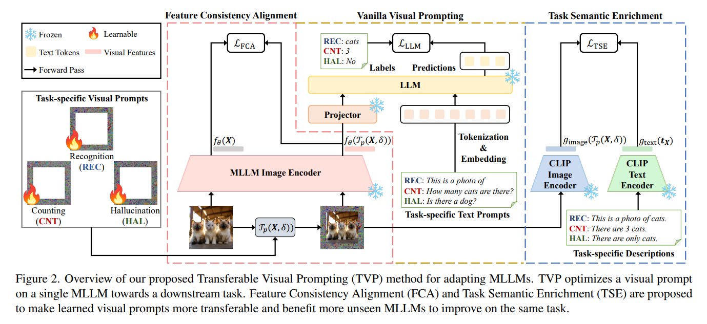

Fig. 2 는 TVP 의 개요

## 3.1. Preliminaries

#### Multimodal Large Language Models.

MLLMs 은 주로 visual feature 를 text embedding 공간으로 project 하여 image 와 LLMs 를 통합하는 아키텍처를 사용한다.

구체적으로, 저자는 visual encoder $f_\theta$, LLM $P_\phi$ 및 projector $h_\psi$ 를 가지고 있다고 가정한다.

image input $\mathbf{X}$ 와 text input $\mathbf{t}$ 가 주어졌을 때, MLLM 의 textaul response $\mathbf{r}$ 는 다음과 같은 likelihood 에 따라 autoregressive 하게 결정된다:

$$
\begin{equation}
    \mathbf{r}_i \sim P_\phi (\mathbf{r}_i \mid h_\psi (f_\theta (\mathbf{X})), \mathbf{t}, \mathbf{r}_{<i}),
\end{equation}
$$

- $\mathbf{X} \in \mathbb{R}^{3 \times H \times W}$ : RGB image
- $\mathbf{t} \in \mathbb{V}^N$ : vocabulary $\mathbb{V}$ 의 $N$ tokens 를 가진 text
- image features $f_\theta(\mathbf{X})$ : text 와 align 하도록 projector $h_\psi$ (e.g., MLP)에 의해 mapping 되어 text token 과 결합하여 downstream LLM 에 unified input 으로 사용.

#### Visual Prompting.

VP methods 에서 제안된 바와 같이, learnable visual prompt $\mathbf{\delta} \in \mathbb{R}^{3 \times H \times W}$ 는 pixel space 에서 학습되며, 다양한 transformations $\mathcal{T}$ (e.g., global perturbations, padding)과 함께 clean images 에 적용되어 model 을 특정 downstream task 에 adapting 한다.

본 논문에서는 일반적인 VP 의 관행을 따르며, resized input image 주위에 universarl pixel-level prompt 를 추가한다.

수학적으로, visual prompt process 를 다음과 같이 설명:

$$
\begin{equation}
    \mathcal{T}_p(\mathbf{X}, \boldsymbol{\delta}) = \text{Resize}_{H \times W \rightarrow H' \times W'}(\mathbf{X}) + \underbrace{M_p \odot \boldsymbol{\delta}}_{\text{visual prompt}},
\end{equation}
$$

- $p$ : visual prompt width
- $M_p$ : value 가 1 인 width $p$ 의 border 를 가진 binary mask
- original image $\mathbf{X}$ 의 size $H \times W$ 는 $H' \times W' = (H - 2p) \times (W - 2p)$ 로 resizing 되어 prompted image 가 $\delta$ 와 겹치지 않게 원본과 동일한 크기를 갖도록 한다.
- default 로 $H = W = 224$ 및 $p = 30$ 을 사용.

## 3.2. Problem Formulation

VP 를 확장하여 MLLMs 을 downstream task 에 adapting 하며 massive parameter finr-tuning 의 heavy computation 부담을 피하는 것을 목표로 한다.

이를 더 일반화하기 위해, 다양한 visual task 를 text completion 으로 통합하고, VP 의 training objective 로 autoregressive loss (i.e., vocabulary 에 대한 cross-entropy loss)을 설정한다.

dataset $\mathcal{D}$ 에 대한 task 를 고려할 때, 이는 다음과 같이 공식화:

$$
\begin{equation}
    L_{\text{LLM}}(\delta) = \underset{(\mathbf{X}, \mathbf{t}, \mathbf{r}) \sim \mathcal{D}}{\mathbb{E}}\left[ \sum_{i=1}^{N_r} -\log P_\phi (\mathbf{r}_i \mid h_\psi (f_\theta (\mathcal{T}_p(\mathbf{X}, \boldsymbol{\delta}))), \mathbf{t}, \mathbf{r}_{<i}) \right].
\end{equation}
$$

- $(\mathbf{t}, \mathbf{r})$ : task 를 위한 prompt-target text pair
- $N_r$ :  $\mathbf{r}$ 의 length

이 연구에서 visual prompt 의 transferability 를 활용합니다. 이는 adversarial robust 분야의 transfer attack 에서 영감을 받았다.

저자는 one-time trained prompt 를 other model 로 transfer 하여 성능을 향상시키고자 한다.

구체적으로, 

- 저자는 한 MLLM 에서 loss $\mathcal{L}_{\text{LLM}}$ 을 minimizing 하면서 prompt $\delta$ 를 optimizing 하고, 이 learned prompt 를 다른 arbitrary MLLM 에 적용했을 때 loss $\mathcal{L}'_{\text{LLM}}$ 을 낮추는 것을 기대한다.
- 즉, 해당 prompt 를 target task 에 대해 추가 fine-tuning 없이 적용했을 때 성능을 향상시키려는 것이다.

기존 VP 방법을 다양한 model 에서 시험해본 결과, generated visual prompts 의 transferability 가 낮아 보통의 성능 향상 또는 현저한 성능 저하를 초래함을 확인했다.

저자는 이 현상의 원인을 “_cross-model feature corruption_” 으로 지목한다.

이는 한 model 에서 학습된 visual prompt 가 other model 에서 visual feature 를 상당히 변화시킬 수 있음을 나타낸다.

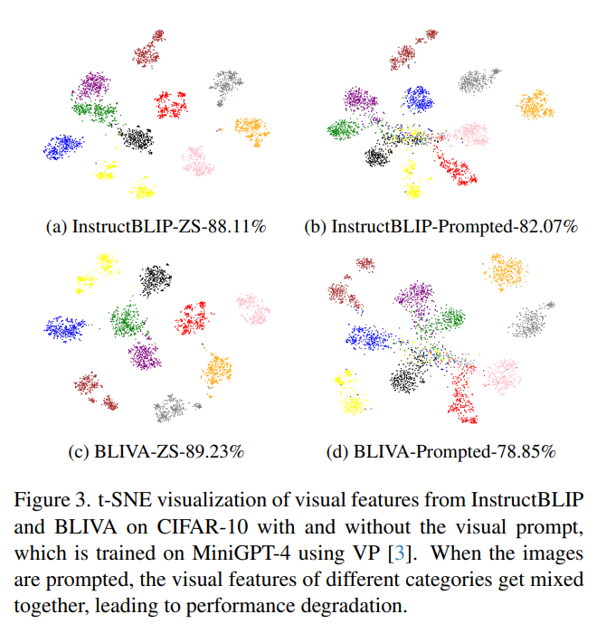

Fig. 3에서 보듯이, 

- CIFAR-10 에서 다양한 models 에서 추출된 prompted visual feature 의 t-SNE plot 을 통해, 성능이 저하된 model 의 경우 prompted image feature 가 clean image 에 비해 혼합되는 것을 확인할 수 있다.
- 이는 visual prompt learning 때, 주로 현재 model 에만 유용한 task-specific feature 를 증폭시킨다
  - 즉, training 중 model 에 overfitting 함
- 하지만, other models 의 feature 변경으로 인해 pre-training 의 knowledge 가 ineffective 및 prompt learning 없이 해당 모델에 대한 prediction 이 disrupt 된다

## 3.3. Transferable Visual Prompting

feature corruption 문제를 완화하고 transferability 향상을 위해, 저자는 기존 VP 기술과 두 가지 새로운 전략을 통합한 Transferable Visual Prompting(TVP) 을 제안

### 3.3.1. Feature Consistency Alignment

위 분석에서 visual prompt 가 image feature 를 상당히 변형시켜 pre-trained general knowledge 가 손실되고, model 간 transferring 시 성능이 저하됨을 알 수 있었다.

이를 해결하기 위해, 저자는 prompted features 와 non-prompted features 간의 차이에 대해 specific constraint 를 부여할 것을 제안한다.

이는 exceptional feature corruption 을 방지하고 prompt learning 중 task-agnostic general knowledge 을 유지하도록 유도한다.

prompted features 가 original features 와 일관되도록 유도하기 위해 FCA loss 를 사용합니다.

주어진 white-box model $(P_\phi, f_\theta, h_\psi)$ 와 input tuple $(\mathbf{X}, t, r)$ 에 대해, 저자는 visual encoder $f_\theta(\mathbf{X})$ 로부터 plain image 의 feature 를 얻고, prompted feature $f_\theta(\mathcal{T}_p(\mathbf{X}, \delta))$ 를 얻는다.

이 features 간의 $\ell_2$ distance 를 측정하는 데 사용하며, FCA loss 는 다음과 같이 계산:

$$
\begin{equation}
    L_{\text{FCA}}(\delta) = \underset{(\mathbf{X}, \mathbf{t}, \mathbf{r}) \sim \mathcal{D}}{\mathbb{E}} \left[ \frac{1}{2} \|f_\theta (\mathcal{T}_p(\mathbf{X}, \boldsymbol{\delta})) - f_\theta (\mathbf{X})\|^2_2 \right].
\end{equation}
$$

- 저자는 prompted feature 가 original feature 와 조정되어 feature 변화가 억제되고, 효과적인 task-agnostic semantic information 이 유지되도록 한다.
- 이는 unseen model 의 useful visual representation 을 활용하기 위해 prompt 가 mild 해지기 때문에 learned visual prompt 의 more transferable 이 되도록 한다

다른 관점에서, FCA loss 는 prompted feature space 에 적용되는 regularization 의 형태로 볼 수 있으며, 이는 generalization 을 강화하는 수단으로 작용한다.

Regularization 기법은 overfitting 을 방지하고 model 의 generalization 을 보장하기 위해 일반적으로 사용된다.

주요 차이점은 기존 연구는 주로 data 간의 generalization (e.g., base-to-novel, domain generalization)에 초점을 맞추었으나, 저자의 연구는 model 간의 generalization 에 중점을 둔다.

prompted feature 에 regularization 을 적용함으로써, supervised task 의 성능을 극대화하면서도 다양한 모델의 embedded knowledge 를 유지하려고 한다

### 3.3.2. Task Semantic Enrichment

end-to-end supervised training 외에도, visual prompt 가 richer task-specific semantic information 을 포함하도록 하여 visual prompt 의 성능을 더욱 향상시키고자 한다.

이는 다양한 model 에서 target task 의 성능을 향상시킬 수 있도록, 이들 간의 shared semantic 향상을 촉진하는 것을 목표로 한다.

CLIP 은 image-text alignment 를 통해 abundant knowledge 를 가진 vision-language foundation model 이다.

많은 연구들이 CLIP 을 visual task 에 대한 additional supervision 및 guidance 로 활용했다.

그러나 prompt learning 의 context 에서 CLIP 을 target model 이 아닌 guidance 로 사용하는 것에 대해서는 널리 연구되지 않았다.

---

저자는 CLIP 을 활용하여 prompted image 의 task-related semantics 를 명시적으로 향상시키기 위해 Task Semantic Enrichment (TSE) loss 를 제안한다.

CLIP 은 visual encoder $g_{\text{image}}$ 와 text encoder $g_{\text{text}}$ 로 구성되며, image input $\mathbf{X} \in \mathbb{R}^{3 \times H \times W}$ 와 text input $\mathbf{t} \in V^N$ 을 각각 shared embedding space $\mathbb{R}^d$ 으로 mapping 한다.

image 와 text 간의 correspondence 는 그들의 feature 간의 distance 를 계산하여 얻을 수 있다.

images 에 맞는 task-specific description 을 설계함으로써, 이들의 similarity 를 극대화하여 task semantics 를 prompted image 에 잘 embed 할 수 있다.

CLIP 의 contrastive loss 를 참고하여, 다음과 같은 auxiliary loss 를 제시:

$$
\begin{equation}
    L_{\text{TSE}}(\delta) = \underset{(\mathbf{X}, \mathbf{t}_{\mathbf{X}}) \sim \mathcal{D}}{\mathbb{E}} \left[ \exp \left(\tau \text{sim} \left(g_{\text{image}}(\mathcal{T}_p(\mathbf{X}, \boldsymbol{\delta})), g_{\text{text}}(\mathbf{t}_{\mathbf{X}}) \right) \right) \right],
\end{equation}
$$

- $\text{sim}(\cdot, \cdot)$ : cosine similarity
- $\tau$ : temperature
- $\mathbf{t}_{\mathbf{X}}$ : target task 의 image $\mathbf{X}$ 의 text description

FCA loss 와 TSE loss 을 Eq. (3) 의 supervision loss $\mathcal{L}_{\text{LLM}}$ 과 함께 통합하여, visual prompt 가 task-agnostic 및 task-specific representation 을 강화하고 모델 성능을 향상시키도록 유도한다.

overall training objective 는 다음과 같은 형태:

$$
\begin{equation}
    \mathcal{L}(\boldsymbol{\delta}) = \mathcal{L}_{\text{LLM}}(\boldsymbol{\delta}) + \lambda_1 \mathcal{L}_{\text{FCA}}(\boldsymbol{\delta}) - \lambda_2 \mathcal{L}_{\text{TSE}}(\boldsymbol{\delta}),
\end{equation}
$$

- $\lambda_1$ 및 $\lambda_2$ : hyper-parameter

이 training objective 를 위해, 저자는 EVP 를 따른다. EVP 는 input diversity 및 gradient normalization 개념을 도입하여 성능을 향상시키며, step $t$ 에 따른 learnable prompt 를 다음과 같이 update:

$$
\begin{equation}
    \boldsymbol{\delta}^{t+1} = \boldsymbol{\delta}^t - \gamma \frac{\nabla_{\boldsymbol{\delta}^t} \mathcal{L}(\boldsymbol{\delta}^t)}{\|\nabla_{\boldsymbol{\delta}^t} \mathcal{L}(\boldsymbol{\delta}^t)\|_2},
\end{equation}
$$

- $\gamma$ : learning rate

# 4. Experiments

## 4.1. Experimental Settings

여기에서는 실험의 basic setting 을 간단히 나열.

#### Datasets and Metrics

다양한 visual 또는 multimodal tasks 를 포함하는 10 datasets 고려

- visual task 를 위해, object recognition (e.g., CIFAR-10, ImageNette, SVHN) 및 object counting (e.g., CLEVR) 에 대한 8 dataset 사용
- 또한, multimodal problems 인 multimodal reasoning (Hatefulmemes) 및 hallucination (POPE)을 중점적으로 다루어 TVP 의 효과를 MLLM 분야에서 더욱 잘 보여줌
- Hatefulmemes 에는 AUC score 를, 나머지 dataset 에는 top-1 accuracy 를 metric 으로 사용

#### Models

6 MLLMs 을 선택하여, 제안된 TVP 방법으로 생성된 visual prompt 가 다양한 모델의 성능을 보편적으로 향상시킬 수 있음을 보여줌.

구체적으로, MiniGPT-4 와 InstructBLIP 에서 visual prompt 를 학습하고, 이를 BLIP2, VPGTrans, BLIVA, VisualGLM 에 transfer

#### Baselines.

다양한 models 간의 visual prompt transferability 에 중점을 두며, TVP 방법을 일반적인 visual prompting 방법인 VP 및 EVP 와 비교한다.

이는 다양한 data distribution 간의 generalization 에 중점을 두지 않는 방법이다.

#### Implementations.

TVP 의 hyperparameter 에는 제안된 loss terms 에 대한 two balance weights 가 포함된다.

validation set 에서 작은 범위 내에서 grid-search 로 optimal 을  설정한다.

## 4.2. Main Results

MiniGPT-4 또는 InstructBLIP 에서 visual prompt 를 학습하고, 이를 6 models 에서 평가

결과는 Tab. 1 에 나타나 있다. 

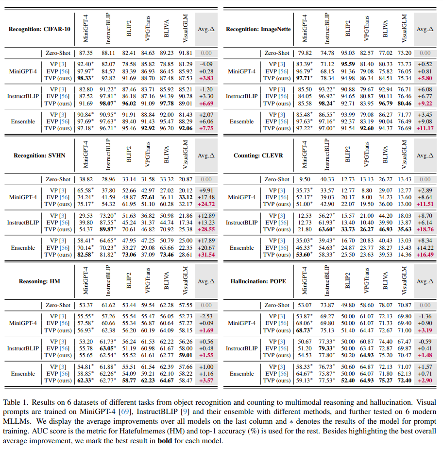

몇 가지 주요 발견 사항은 다음과 같습니다.

1. visual prompt 기법이 recognition 외에 reasoning 을 포함한 multimodal task 에서도 효과적임을 입증한 것은 이 논문이 처음
   - 그 외에도, VP 는 가장 불리한 결과를 나타내며, 종종 전반적인 성능 저하를 초래하여 transferability 가 낮다
   - EVP 는 normalized gradient 로 stable optimization 을 통해 model 의 visual prompt learning 에 더 큰 개선을 가져오지만, other models 에 대한 이점이 제한적
   - 대조적으로, TVP 는 training model 에 대해 유사한 효과를 달성하면서도 other models 의 성능을 더 크게 향상.
   - 전체적인 효과는 6 models 에서 all downstream task 에 걸쳐 highest average delta 로 나타나며, 이는 shared external parameters 의 single set 이 다양한 models 를 향상시키는 우리의 목표를 잘 달성.
2. TVP 의 결과에 대해 더 깊은 통찰을 얻음
   - VisualGLM 의 개선 사항은 other models 에 비해 상대적으로 미미
     - 이는 visual prompt 를 VisualGLM 으로의 transferring 이 더 어려운 것으로 보임
     - VisualGLM 의 language model 은 GLM 인 반면, 나머지 models 는 LLaMA 아키텍처를 기반으로 함.
     - 이러한 language model 의 차이가 효과적인 prompt transferring 의 어려움을 초래할 수 있음.
   - 또한, InstructBLIP 에서 생성된 visual prompt 의 trasferability 가 MiniGPT-4 보다 전반적으로 더 좋다는 것을 알 수 있음.
     - 비슷한 아키텍처를 공유하지만, InstructBLIP 은 13 vision-language dataset 에서 체계적으로 조정되었으며, 이는 MiniGPT-4 보다 훨씬 풍부.
     - 이는 InstructBLIP 이 visual-language task 에 대한 더 많은 internal knowledge 를 보유하고 있어 visual prompt learning 을 도와주고, other models 에 더 많은 개선을 가져오는 데 도움이 됨.

이와 유사한 결론은 실용적인 dataset 인 CIFAR-100, Oxford-Pets, FGVC-Aircraft, Food101 에 대해서도 Tab. 6 에서 도출됨.

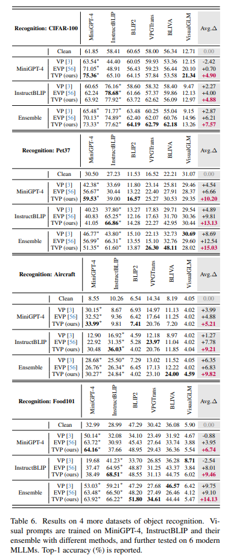

## 4.3. Model Ensemble

ensembling 기법은 model generalization 을 향상시키고, transfer attack 에 효과적임이 입증.

이 아이디어는 transferable visual prompt 에도 적용될 수 있다.

직관적으로, visual prompt 가 여러 models 에 대해 효과적이라면, 더 많은 shareable informative semantic 를 포함하고 other models 로의 transfer 이 더 잘될 가능성이 큼.

저자는 단순히 서로 다른 models 의 loss 를 평균하여 visual prompt 를 optimizing 하며, 여기서는 MiniGPT-4 와 InstructBLIP 을 ensembling 함.

ensemble prompt learning 의 결과는 Tab. 1 에 제시.

- model ensemble 이 다양한 방법으로 학습된 visual prompt 의 transferability 를 향상시킬 수 있는 일반적인 기법임을 알 수 있음.
- 한편, TVP 가 가장 좋은 성능을 보이는 추세는 변하지 않으며, ensemble 의 도움으로 4 task 에서 최상의 전반적인 개선을 달성. 
- 그러나 더 많은 models 를 사용하는 것은 compuational 및 storage overhead 를 증가시키므로, 이 기술을 채택할 때는 training cost 와 prompt transferability 간의 균형을 찾아야 함.

## 4.4. Ablation Studies

TVP 의 설계를 추가로 검증하기 위해 ablation study 수행.

### 4.4.1 Strategies of FCA and TSE

먼저, 제안된 FCA 와 TSE 가 MiniGPT-4 로 학습된 visual prompt 의 성능에 미치는 영향을 살펴본다.

Tab. 2 에서 볼 수 있듯이, 

- 각각의 전략을 개별적으로 적용하면 average performance 가 어느 정도 개선됨.
- 두 전략을 함께 사용하면 다양한 모델에 대한 visual prompt 의 지원을 극대화할 수 있다.
- 이는 FCA 가 촉진하는 task-agnostic prior knowledge 와 TSE 가 향상시키는 task-related feature extraction 이 visual prompt 의 transferability 에 기여할 수 있음을 나타냄.
- Fig. 4 의 visualization 은 TVP 가 모델이 task completion 에 유용한 object 를 더 잘 찾도록 도와줄 수 있음을 제안.

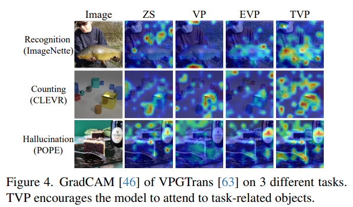

### 4.4.2 Prompt Width

Prompt width 는 TVP 의 성능에 중요할 수 있다.

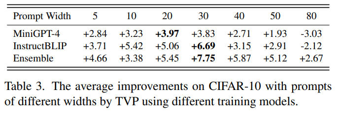

Tab. 3 의 CIFAR-10 결과는 learnable parameter 의 수가 scaled image size 간의 균형을 보여주며, TVP 의 성능은 20-30 사이의 적당한 prompt width 에서 최고조에 달하며, 이는 저자가 선택한 30 을 검증.

## 4.5. In-depth Analyses

다양한 조건에서 TVP 의 효과를 입증하고 실제 시나리오에서의 실용성을 검증하기 위해 몇 가지 심층 분석을 제시.

#### 4.5.1 데이터 규모 (Data Scale)

adaptation 을 위한 data 가 실제 시나리오에서 제한될 때가 많기 때문에, learned visual prompt 의 성능에 대한 training data size 의 영향을 연구하는 것이 중요.

VPT, EVP 를 따르며, data 양이 1% 에서 100% 까지 변경됨에 따라 다양한 방법의 추세를 조사한다.

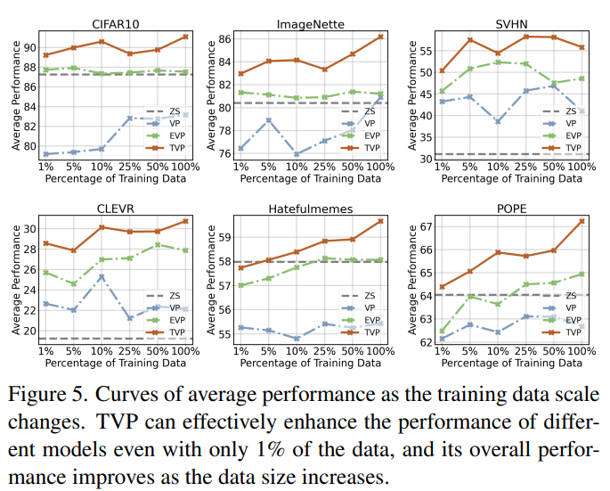

Fig. 5 에서 MiniGPT-4 로 학습된 visual prompt 를 사용하여 다양한 모델의 average performance curves 를 plotting

- 예상대로, data scale 이 증가함에 따라 TVP 의 성능이 일반적으로 향상되는 경향.
- data size 에 관계없이 TVP 가 VP 및 EVP 보다 더 나은 성능을 발휘한다는 결론은 일관되게 유지.
- TVP 는 data size 가 1% 에 불과할 때도 여러 모델의 전체 성능을 향상시킬 수 있으며, 때로는 complete dataset 으로 학습된 것과 유사한 효과를 보인다.
- 이는 저자의 방법의 효과를 더욱 설명하며, 실제 시나리오에서의 적용 가능성을 더욱 높인다.

### 4.5.2 Generalization across Datasets

trained visual prompt 의 generalization 을 조사하여 TVP 의 실제 시나리오에서의 실용성을 더욱 확인하는 것이 중요하다.

object recognition 을 예로 든다.

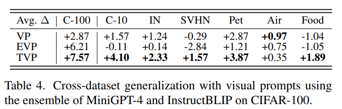

- prompt learning 의 일반적인 방법을 따르며, CIFAR-100 에서 생성된 visual prompt 를 other recognition task 의 dataset 에 적용한다.
- Tab. 4 에 나타난 바와 같이, source dataset 에서의 최고의 transferability 외에도 TVP 는 other dataset 에서 가장 많은 또는 비교 가능한 개선을 이루어내며, same task 내에서 다양한 dataset 간의 우수한 generalization 을 보여준다.

### 4.5.3 Robustness to Corruptions

visual prompt 가 common image corruptions 에 대한 robustness 를 test.

MiniGPT-4 에서 TVP 로 생성된 visual prompt 는 CIFAR-10-C 에서 평균 2.30% 의 성능 개선을 보였으며, VP 와 EVP 는 각각 -6.62% 와 -3.87% 의 성능 저하를 초래했다.

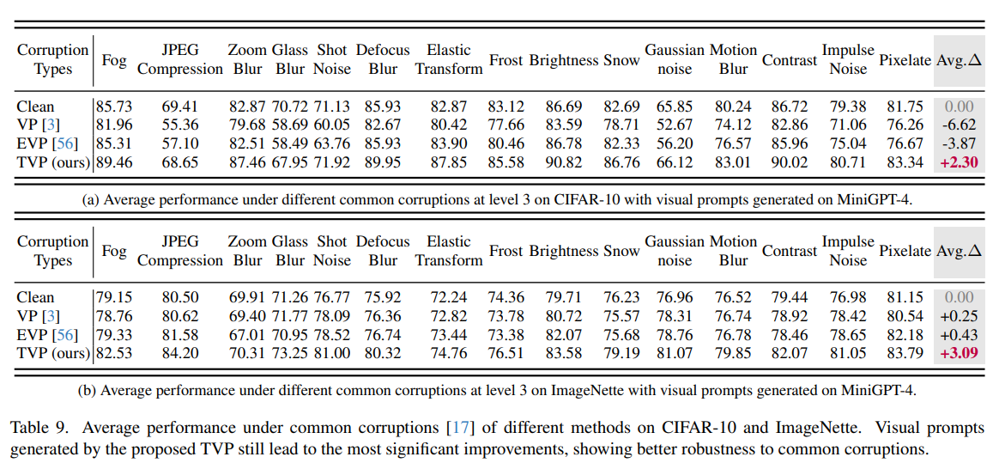

### 4.6. 계산 효율성에 대한 논의 (Discussion on Computational Efficiency)

TVP 와 other fine-tuning 및 visual prompt 방법의 성능과 효율성을 비교하여 제안된 문제와 TVP 의 대응 솔루션의 동기를 지원한다.

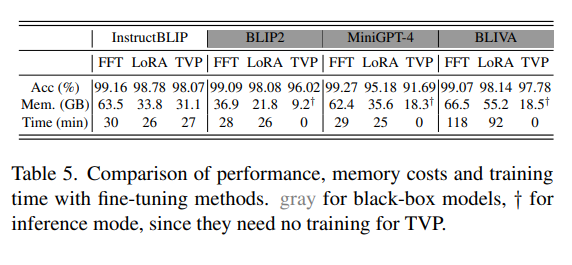

### 5. 결론 (Conclusion)

본 논문에서는 다양한 MLLM 을 downstreamn task 에 adapting 하기 위한 resource-friendly 및 flexible manner 로 _shared parameters_ set 을 optimizing 하는 방법 제안

이는 model-specific fine-tuning 으로 인한 computation 및 storage overhead 를 피할 수 있다.

구체적으로, **Transferable Visual Prompting** 을 도입하여 visual prompt 를 shared parameter 로 채택하고, one model 에 대한 one-time training 으로 transferability 를 향상시키는 방법을 제안.

기존의 visual prompt 방법은 일반적으로 feature corruption 으로 인해 uinseen models 를 개선하는 데 실패한다.

저자는 이를 Feature Consistency Alignment 와 Task Semantics Enrichment 라는 두 가지 주요 전략으로 해결하여 large-scale pre-trained model 의 inner prior knowledge 를 유지하고 모델에서 추출한 task-related features 를 강화한다.

recognition 및 counting 에서 multimodal reasoning 및 hallucination correction 에 이르기까지 다양한 task 의 10 dataset 에 대한 광범위한 실험을 통해 제안된 TVP 의 효과성을 입증하였으며, 다양한 모델을 동시에 촉진할 수 있음을 보여줌.