논문 및 이미지 출처 : <https://link.springer.com/article/10.1007/s11263-022-01653-1>

# Abstract

large-scale pre-trained vision-language model 인 CLIP 은 다양한 downstream tasks 에서 활용 가능한 representation learning 에 큰 잠재력을 보였다.

주로 discretized label 에 기반을 둔 전통적인 representation learning 과 달리, vision-language pre-training 은 images 와 texts 를 common feature space 에 align 하여, class 에서 classification weights 를 합성하는 _prompting_ 을 통해 downstream tasks 으로의 zero-shot transfer 을 가능하게 한다.

본 연구에서는 이런 모델을 실제로 배치할 때의 주요 과제가 prompt engineering 임을 보여준다.

이 과정은 domain expertise 가 필요하고 매우 시간이 많이 소요되며, wording 의 약간의 변화가 성능에 큰 영향을 미칠 수 있기 때문에 words tuning 에 많은 시간을 할애해야 한다.

최근 NLP 의 prompt learning 연구의 발전에 영감을 받아, 저자는 CLIP 같은 vision-language model 을 downstream image recognition 을 위해 adapting 하는 간단한 접근 방식인 _Context Optimization (CoOp)_ 을 제안한다.

구체적으로,

- CoOp 은 learnable vectors 로 prompt 의 context words 를 modeling 하는 반면, all pre-trained parameters 는 고정된다. 
- 다양한 image recognition task 를 처리하기 위해, 저자는 CoOp 의 두 가지 구현을 제공한다: unified context 와 class-specific context.
- 11 datasets 에  대한 광범위한 실험을 통해, CoOp 이 one or two shots 만으로 hand-crafted prompts 를 상당히 앞지르며, more shots 가 있을 경우 prompt engineering 에 비해 상당한 개선을 얻을 수 있음을 증명한다.
- 예로, 16-shots 로 평균 이득은 약 15% 이며, 최고 45% 이상의 향상을 보인다.
- learning-based approach 임에도 불구하고, CoOp 은 hand-crafted prompts 를 사용하는 zero-shot model 과 비교할 때 뛰어난 domain generalization 성능을 달성한다.

# 1. Introduction

최신 visual system 의 일반적인 접근 방식은 ResNet 이나 ViT 같은 vision model 을 사용해 discrete label 로 고정된 object categories 를 예측하는 것이다.

이는 visual model 이 생성한 image features 와 randomly initialized fixed weights 를 일치시켜 달성된다. 

training categories 는 "goldfish" 나 "toilet paper" 같은 textaul form 을 가질 수 있지만, cross-entropy loss 계산을 쉽게 하기 위해 discrete label 로 변환되며, texts 의 encapsulated semantics 는 대체로 활용되지 않는다.

이러한 학습 패러다임은 new categories 에 대한 additional data 를 요구하기 때문에 closed-set visual concepts 에만 제한된다.

최근 CLIP 과 ALIGN 같은 vision-language pre-training 이 visual representation learning 을 위한 유망한 대안으로 등장했다.

핵심 아이디어는 two separate encoders (각각 modality 하나)를 사용해 image 와 raw text 를 align 하는 것이다.

- 예로, CLIP 과 ALIGN 모두 learning objective 를 contrastive loss 로 formulate 하여, images 와 text descriptions 을 feature space 에서 서로 가깝게 당기고, 일치하지 않는 pairs 는 멀리 밀어낸다.
- large-scale 로 pre-training 하여, 모델은 다양한 visual concepts 를 학습하고, _prompting_ 을 통해 어떤 downstream tasks 에도 쉽게 trasfner 될 수 있다.
- 특히, new classification task 를 위해, task-relevant categories 를 설명하는 senteces 를 text encoder 에 제공하여 classification weights 를 먼저 합성한 후, image encoder 가 생성한 image features 과 비교할 수 있다.

pre-trained vision-language model 에서는 text input, 즉 prompt 가 downstream dataset 에서 핵심적인 역할을 한다.

하지만 right prompt 를 식별하는 것은 쉽지 않은 작업이며, words tuning 에 상당한 시간이 소요된다.

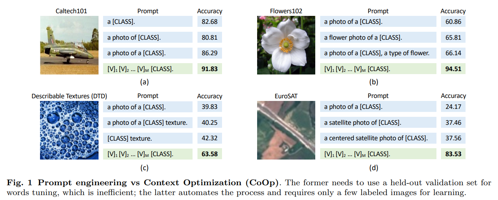

- 예를 들어, Caltech101 에서 (Fig. 1(a), 2nd vs 3rd prompt), class token 앞에 "a" 를 추가하면 정확도가 5% 이상 향상된다.
- 또한 prompt engineering 에는 작업에 대한 prior knowledge 가 필요하며, 이상적으로는 language model 의 근본적인 메커니즘에 대한 이해도 필요하다.
- 이는 Fig. 1(b-d) 에서 보여지듯이 task-relevant context 를 추가하면, 즉 "flower" 는 Flowers102에, "texture" 는 DTD 에, "satellite" 는 EuroSAT 에 추가하면 성능이 크게 향상될 수 있다.
- sentence structure 를 tuning 하면 추가적인 향상을 가져올 수 있는데, 예로 Flowers102 에선 class token 뒤에 "a type of flower" 를, DTD 에서는 "texture" 만을 context 에 남기고, EuroSAT 에서는 "centered" 를 "satellite photo" 앞에 추가하는 것 등이 있다.
- 그러나 광범위한 tuning 에도 불구하고, resulting prompts 가 이러한 downstream tasks 에 optimal 이란 보장은 없다.

---

NLP 에서의 최근 prompt learning 연구에 영감을 받아, 저자는 pre-trained vision-language model 을 위한 prompt engineering 을 자동화하는 간단한 approach 인 _Context Optimization (CoOp)_을 제안한다.

구체적으로,

- CoOp 은 prompt 의 context words 를 learnable vectors 로 modeling 하며, 이는 random values 나 pre-trained word embeddings 로 초기화될 수 있다(Fig. 2).
- 다양한 tasks 를 처리하기 위해, 저자는 두 가지 구현을 제공한다:
  - 하나는 unified context 를 기반으로 하며, all classes 와 동일한 context 를 공유하고 대부분의 categories 에 잘 작동한다.
  - 다른 하나는 class-specific context 를 기반으로 하며, 각 class 에 대한 specific context token set 을 학습하고 fine-grained categories 에 더 적합하다.
- training 중 저자는 learnable context vectors 에 대한 prediction errors 를 minimizing 하는 간단한 cross-entropy loss 을 사용하며, all pre-trained parameters 는 고정된 상태로 유지한다.
- gradient 는 text encoder 를 통해 전부 back-propagation 될 수 있으며, task-relevant context 를 학습하기 위해 parameters 에 encoded rich knowledge 를 추출한다.

CoOp 의 효과를 입증하기 위해, 저자는 general objects, scenes, actions 및 fine-grained categories 에 대한 classification 뿐만 아니라 texture 및 satellite image recognition 를 포함하는 다양한 visual recognition tasks 를 다루는 11 datasets 에서 수행했다.

- 결과는 CoOp 이 pre-trained vision-language model 을 data-efficient visual learner 로 효과적으로 전환하며, one-, two-shot 으로도 hand-crafted prompts 를 상당한 차이로 능가할 수 있음을 보여준다.
- more shots (e.g., 16) 을 사용하면 성능이 더욱 향상될 수 있으며, hand-crafted prompts 에 비해 평균적으로 약 15% 의 차이가 나고, 최고로는 45% 이상에 도달한다. 
- CoOp 은 strong few-shot learning baseline 으로 알려진 linear probing model 을 능가한다.
- 더욱이, CoOp 은 learning based approach 임에도 불구하고, hand-crafted prompts 를 사용하는 zero-shot model 보다  domain shifts 에 대한 훨씬 strong robustness 을 보여준다.

요약하자면:

1. 최근 제안된 vision-language model 을 downstream 응용에 적응하는 연구를 제시하고, deployment efficiency 와 관련된 중요한 문제, 즉 prompt engineering 을 식별한다.
2. pre-trained vision-language model 을 위한 prompt engineering 을 자동화하기 위해, continuous prompt learning 에 기반한 간단한 approach 을 제안하고, 다양한 recognition tasks 를 처리할 수 있는 두 가지 구현을 제공한다.
3. 처음으로 제안된 prompt learning 기반 approach 이 downstream transfer learning 성능과 domain shifts 에 대한 robustness 측면에서 hand-crafted prompts 와 linear probing model 을 모두 능가한다는 것을 보여준다.

# 2. Related Work

## 2.1 Vision-Language Models

최근 vision-language model 은 일반적인 visual representation learning 과 prompting 을 통한 다양한 downstream classification task 의 zero-shot transfer 에서 큰 잠재력을 보여주고 있다.

현재까지, vision-language learning 의 최근 발전은 주로 다음 세 가지 영역에서의 진보에 의해 주도되었다: 

- Transformer 를 통한 text representation learning
- large-minibatch 를 활용한 contrastive representation learning
- web-scale 의 training datasets—CLIP 은 4M image-text pairs 를, ALIGN 은 1.8B noisy image-text pairs 을 활용한다.

images 와 texts 를 common embeeding space 에 mapping 하는 아이디어는 오래됐지만, 기술적으로는 크게 달랐다.

초기 연구에서는 주로 pre-trained word vector 나 TF-IDF 와 같은 hand-crafted feature 를 활용하여 text feature 를 추출했다.

images 와 text features 을 matching 하는 metric learning, multi-label classification, n-gram language learning, 그리고 최근 제안된 captioning 으로 formulate 되었다.

저자는 연구는 이러한 vision-language model 의 최근 연구와 직교적이며, 이러한 모델이 downstream dataset 에 적응하고 배포될 수 있도록 촉진하는 것을 목표로 한다.

## 2.2 Prompt Learning in NLP

large-scale pre-trained language model 을 위한 knowledge probing, 즉 “fill-in-the-blank" cloze test 는 최근 NLP 에서 prompt learning 연구에 대한 관심을 불러일으켰다.

knowledge probing 의 기본 아이디어는 cloze-style prompts 를 주어 pre-trained language model 이 답변을 생성하도록 유도하는 것이다.\

이는 semantic analysis 같은 여러 downstream tasks 에 유용할 수 있다. 

- Jiang et al. (2020) 은 text minig 및 paraphrasing 을 통해 candidate prompts 를 생성하고, highest training accuracy 의 optimal ones 를 식별하는 방법을 제안했다.
- Shin et al. (2020) 은 label likelihood 에서 largest gradient changes 를 보이는 token 을 검색하는 gradient-based approach 소개.

저자의 연구와 가장 관련된 것은 word embedding space 에서 continuous vectors 를 optimizing 하는 continuous prompt learning 방법이다.

이러한 방법의 단점은 discrete token 을 검색하는 것에 비해 vector 로 학습된 word” 를 명확하게 시각화할 방법이 부족하다는 점이다.

저자는 prompt learning 을 CV 의 large-scale vision-language model adaptation 에 처음으로 적용했으며, prompt learning 이 transfer learning 성능 측면에서 CV task 에 상당한 개선을 가져올 뿐만 아니라 domain shifts 를 처리할 수 있는 견고한 모델을 생성한다는 것을 정당화한다.

# 3. Methodology

## 3.1 Vision-Language Pre-Training

저자는 CLIP 에 중점을 둔 vision-language pre-training 을 간단히 소개한다.

저자의 approach 은 CLIP 과 유사한 vision-language model 에 널리 적용 가능하다. 

#### Models

CLIP 은 images 와 texts 를 각각 encoding 하는 two encoders 로 구성된다.

- image encoder 는 high-dimensional images 를 low-dimensional embedding space 에 mapping 하는 것을 목표로 한다.
  - image encoder 의 architecture 는 ResNet-50 같은 CNN 이나 ViT 형태를 취할 수 있다.
- text encoder 는 Transformer 를 기반으로 하며 natural language 로부터 text representation 을 생성하는 것을 목표로 한다.
  - 구체적으로, “a photo of a dog” 같은 words (tokens) sequence 를 주어진 경우, CLIP 은 우선 각 token (punctuation 포함)을 lower-cased byte pair encoding (BPE) representation 으로 변환한다. 이는 unique numeric ID 이다.
  - CLIP 의 vocabulary size 는 49,152 이다.
  - minibatch processing 을 용이하게 하기 위해, 각 text sequence 는 `[SOS]` 와 `[EOS]` token 으로 감싸고 fixed length 77 로 제한된다.
  - 이후, ID 는 512-D word embedding vector 로 mapping 되어 Transformer 에 전달된다.
  - 마지막으로, `[EOS]` token position 의 features 는 layer normalizing 된 후 linear projection layer 에 의해 추가로 처리된다.

#### Training

CLIP 은 각각 learned images 와 texts embedding space 을 align 되도록 훈련된다. 

구체적으로, learning objective 는 contrastive loss 로 formulate 된다.

image-text pairs 의 barch 를 고려할 때, CLIP 은 matched pairs 에 대한 cosine similarity 을 maximizing 하고 all other unmatched pairs 에 대한 cosine similarity 을 minimizing 한다.

더 다양하고 transferable visual concepts 를 학습하기 위해, CLIP 는 4M image-text pairs 로 구성된 large training dataset 을 수집했다.

#### Zero-Shot Inference

CLIP 은 image 가 text descriptions 과 일치하는지 예측하도록 pre-training 되었기 때문에, zero-shot recognition 에 자연스럽게 적합하다. 

이는 text encoder 가 생성한 classification weights 를 image features 과 비교하여 달성된다.

text encoder 는 관심 class 를 지정하는 text descriptions 을 input 으로 받는다.

공식적으로, 

- $f$ 를 image $x$ 에 대해 image encoder 가 추출한 image features 이라고 하고, 
- $\{w_i\}_{i=1}^K$ 를 text encoder 가 생성한 weight vectors set 이라 하자.
- $K$ 는 class 의 수를 나타내고,
- 각 $w_i$ 는 “a photo of a [CLASS].” 형식의 prompt 에서 specific class name (e.g., “cat”, “dog”, “car”)으로 대체된 class token 에서 파생된다.

prediction probability 은 다음과 같이 계산된다.

$$
\begin{equation}
    p(y = i \mid x) = \frac{\exp(\cos(w_i, f)/\tau)}{\sum_{j=1}^K \exp(\cos(w_j, f)/\tau)},
\end{equation}
$$

- $\tau$ : CLIP 이 학습한 temperature parameter 
- $\cos(\cdot, \cdot)$ : cosine similarity 을 나타낸다.

random vectors 로 학습된 closed-set visual concepts 의 traditional classifier learning approach 와 비교할 때, vision-language pre-training 은 high-capacity text encoder 를 통해 open-set visual concepts 를 탐색할 수 있게 하여, 더 넓은 semantic space 를 형성하고 learned representation 을 downstream tasks 에 more transferable 하게 된다.

## 3.2 Context Optimization

저자는 manual prompt tuning 을 피하기 위해 Context Optimization(CoOp)을 제안한다. 

CoOp 은 데이터에서 continuous vector 로 context words 를 modeling 하면서 large-scale pre-trained parameters 를 고정시킨다.

개요는 Fig. 2에 나와 있다.

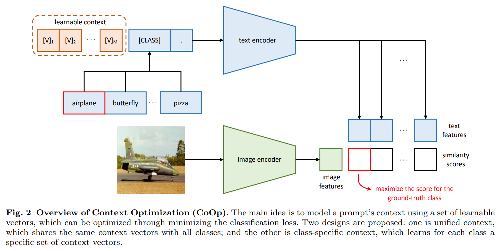

#### Unified Context

먼저 all classes 와 동일한 context 를 공유하는 unified context 를 소개한다.

구체적으로, text encoder $g(\cdot)$ 에 제공되는 prompt 는 다음과 같은 형식으로 설계된다.

$$
\begin{equation}
    t = [V]_1[V]_2 \ldots [V]_M [CLASS],
\end{equation}
$$

- 각 $[V]_m (m \in \{1, \ldots, M\})$ : word embedding 과 same dimension 의 vector (i.e., CLIP 의 경우 512)
- $M$ : context token 수 지정하는 hyper-parameter
- prompt $t$ 를 text encoder $g(\cdot)$ 에 전달하면, visual concepts (`[EOS]` token position 에서도 여전히 동일) 을 나타내는 classification weights vector 를 얻을 수 있다.
- prediction probability 은 다음과 같이 계산된다:

$$
\begin{equation}
  p(y = i \mid x) = \frac{\exp(\cos(g(t_i), f)/\tau)}{\sum_{j=1}^K \exp(\cos(g(t_j), f)/\tau)},
\end{equation}
$$

- 각 prompt $t_i$ 내의 class token 은 $i$-th class name 의 해당 word embedding vector(s) 로 대체된다.

Eq. (2) 처럼 sequence 끝에 class token 을 배치하는 것 외에, 

$$
\begin{equation}
  [V]_1 \ldots [V]_{\frac{M}{2}}[CLASS][V]_{\frac{M}{2}+1} \ldots [V]_M,
\end{equation}
$$

처럼 moddle 에 배치할 수 있다. 이를 통해 prompt 는 latter cells 를 supplementary descriptions 으로 채우거나 full stop 같은 termination signal 을 사용하여 문장을 조기에 잘라낼 수 있다.

#### Class-Specific Context

또 다른 옵션은 class-specific context (CSC)를 설계하는 것으로, context vectors 가 각 class 에 독립적이다. i.e., $i \neq j$ 에 대해 $[V]_1^i[V]_2^i \ldots [V]_M^i \neq [V]_1^j[V]_2^j \ldots [V]_M^j$ 이고, $i, j \in \{1, \ldots, K\}$ 이다.

unified context 의 대안으로, CSC 는 일부 fine-grained classification task 에 특히 유용하다는 것을 발견했다.

#### Training

training 은 standard classification loss 를 minimizing 하도록 수행되며, gradient 는 text encoder $g(\cdot)$ 를 통해 back-propagation 될 수 있어, context 를 optimizing 하기 위해 parameter 에 encoding 된 rich knowledge 를 활용할 수 있다.

continuous representation 의 설계는 word embedding space 에서 full exploration 을 가능하게 하여, task-relevant context learning 을 촉진한다.

## 3.3 Discussion

저자의 approach 은 CLIP 같은 최근에 제안된 large-scale vision-language model 의 adaptation 이란 새로운 문제를 구체적으로 다룬다.

저자의 approach 은 language model 을 위한 NLP 에서 개발된 prompt learning  방법과 몇 가지 차이점이 있다 (e.g., GPT-3).

1. CLIP 같은 모델과 language model 의 backbone architecture 는 분명히 다르다.
   - 전자는 visual data 와 text data 를 모두 입력으로 받아 image recognition 에 사용되는 align scores 를 생성하는 반면, 후자는 text data 만 처리하도록 맞춰져 있다.
2. pre-training objective 가 가 다르다: contrastive learning vs autoregressive learning.
   - 이는 모델의 다른 동작을 초래하고, 따라서 다른 모듈 설계를 필요로 한다.

# 4. Experiments

## 4.1 Few-shot Learning

#### Datasets

저자는 CLIP 에서 사용된 11 image classification datasets 을 선택한다: ImageNet, Caltech101, OxfordPets, StanfordCars, Flowers102, Food101, FGVCAircraft, SUN397, DTD, EuroSAT, UCF101.

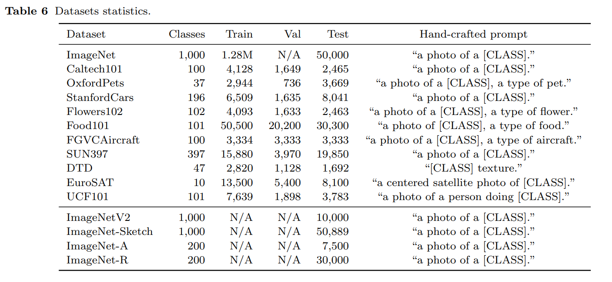

이 datasets 은 general objects, scenes, action 및 fine-grained categories classification 뿐만 아니라 texture 및 satellite image 를 recognition 하는 것과 같은 특수 작업을 포괄하는 다양한 vision tasks 의 종합적인 벤치마크를 구성한다.

저자는 CLIP 에 채택된 few-shot evaluation 프로토콜을 따르며, 각각 1, 2, 4, 8, 16 shot 으로 훈련하고 full text set 에 모델을 배치한다.

비교를 위해 3 runs 에 대한 평균 결과를 보고한다.

#### Training Details

- CoOp 는 class token 을 end 또는 middle 에 배치하는 4 version 이 있다.
- 달리 명시되지 않는 한, ResNet-50 을 image encoder 의 backbone 으로 사용하고, context tokens 의 수 $M$ 은 16으로 설정된다. 
- 모든 모델은 CLIP 의 open-source code 를 기반으로 구축된다. 
- CoOp 의 context vectors 는 표준 편차가 0.02 인 zero-mean Gaussian dstribution 에서 추출하여 randomly init 된다.
- Training 은 SGD 와 initial learning rate 0.002 로 이루어지며, cosine annealing rule 에 따라 decay 된다
- 최대 epochs 는 16/8 shot 은 200, 4/2 shot 은 100, 1 shot 은 50 으로 설정된다 (ImageNet 의 경우 최대 epochs 는 50 고정).
- early training iterations 에서 관찰되는 explosive gradient 를 완화하기 위해, 저자는 first epochs 동안 learning rate 을 $1e-5$ 로 고정하는 warmup trick 을 사용한다.

#### Baseline Methods

저자는 CoOp 를 두 가지 baselines 와 비교한다.

1. hand-crafted prompt 에 기반한 zero-shot CLIP.
   - 저자는 CLIP 이 소개한 prompt engineering 지침을 따른다.
   - general objects와 scenes 의 경우, “a photo of a [CLASS].”
   - fine-grained categories 에 대해서는 OxfordPets 의 “a type of pet” 및 Food101 의 “a type of food” 같이 task-relevant context 가 추가된다. 
   - DTD 에서 texture recognition 같은 특수 작업의 경우, prompt 는 “[CLASS] texture.” 이며 class name 은 “bubbly” 와 “dotted” 와 같은 형용사이다.
2. linear probing model. 
   - CLIP 과 few-shot learning 에 관한 최근 연구(Tian et al., 2020)에 따르면, high-quality pre-trained model (e.g., CLIP) 의 features 에 기초하여 linear classifier 를 훈련시키면 종종 훨씬 더 정교한 few-shot learning 방법과 동등한 성능을 쉽게 달성할 수 있다. 
   - 저자는 CLIP 이 사용한 동일한 훈련 방법을 따라 linear probing model 을 훈련시킨다.

#### Comparison with Hand-Crafted Prompts

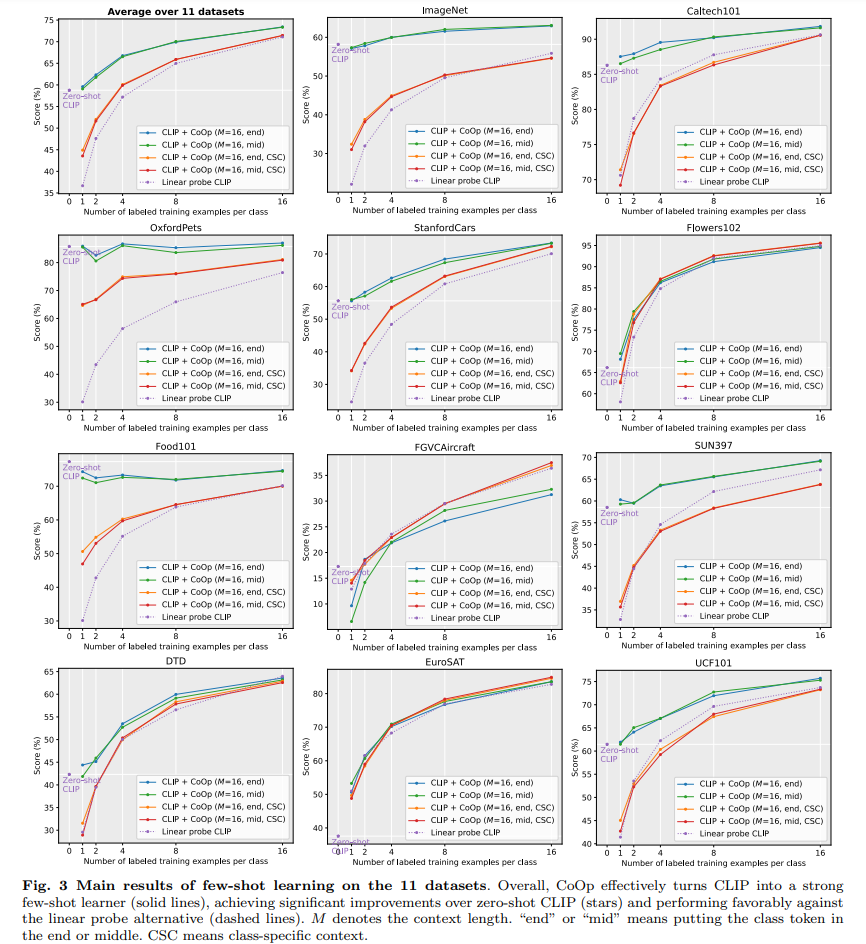

Fig. 3 은 결과를 요약한다.

저자의 default model 은 class token 이 end 에 배치된 CLIP+CoOp 이다. 

class token 을 배치하는 두 가지 다른 방법은 curves 가 크게 겹쳐서 유사한 성능을 달성한다.

- top-left 의 평균 성능에서, CLIP+CoOp 가 strong few-shot learner 로, 평균적으로 2-shot 만으로 zero-shot CLIP 보다 상당한 차이를 얻을 수 있음을 관찰한다.
- 16-shot 으로 훈련할 경우, CoOp 로 인한 평균 격차는 약 15% 까지 더욱 증가할 수 있다.

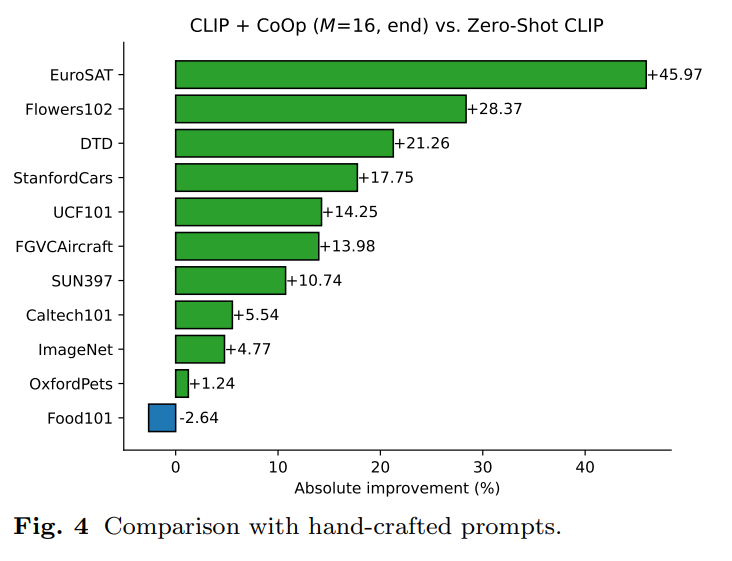

Fig. 4 는 hand-crafted prompt 대비 16-shot 에서 CoOp 로 얻은 절대적 향상을 보여준다.

- 성능 향상이 45% 이상과 20% 이상에 달하는 EuroSAT 와 DTD 와 같은 특수 작업에서 큰 향상이 관찰된다.
- Flowers102, StanfordCars, FGVCAircraft 등 대부분의 fine-grained dataset 과 scenes 및 action recognition datasets (SUN397 & UCF101)에서도 성능이 크게 향상된다 (10% 이상).
- ImageNet 은 1,000 classes 를 포함하는 도전적인 dataset 이기 때문에 4.77% 의 향상도 주목할 만하다.
- 이에 반해, OxfordPets 와 Food101 두 개의 fine-grained dataset 에서의 증가는 덜 매력적이다.
  - Fig. 3 에서 이 두 dataset의 CLIP+CoOp curves 를 보면, more shots 를 사용해도 성능 개선의 동력이 상실되어 보이는 over-fitting 문제가 있는 것으로 보인다.
  - 잠재적인 해결책은 weight decay 를 늘리는 것과 같은 higher regularization 를 적용하는 것이다.
- 그럼에도 불구하고, 전반적인 결과는 CoOp 의 data-efficienct manner 의 task-relevant prompt learning 능력을 입증하기에 충분히 강력하다.

#### Comparison with Linear Probe CLIP

전반적인 성능 측면에서 (Fig. 3, top-left), CLIP+CoOp 는 linear probe model 에 비해 뚜렷한 장점을 보여준다.

- Linear probe model 은 zero-shot 의 성능을 달성하기 위해 평균 4-shot 이상의 shot 이 필요하지만, CoOp 는 4-shot 만으로 이미 인상적인 평균 이득을 보인다. 
- 1-, 2-shot 같은 극도로 낮은 data 영역에서는 차이가 훨씬 더 크게 나타나며, 이는 CoOp 가 few-shot learning 을 위해 처음부터 linear classifier 를 학습하는 것보다 훨씬 더 효과적임을 시사한다.
- Linear probe model 이 two specialized tasks (DTD 및 EuroSAT)뿐만 아니라 몇몇 fine-grained datasets (Flowers102와 FGVCAircraft)에서 CLIP+CoOp 와 비슷한 성능을 보이는 것도 관찰된다.
- 이는 pre-trained CLIP space 가 강력하다는 것이 증명되었기 때문에 linear probe model 이 강력한 경쟁자가 될 수 있다는 것은 놀랍지 않다.
- 그럼에도 불구하고, CoOp 의 CSC version 은 앞서 언급한 dataset 에서 linear probe CLIP 을 능가할 수 있으며, more shots 사용이 가능해지면 훨씬 더 나은 잠재력을 보여준다.
- 나중에 CoOp 가 domain generalization 에서 linear probe model 보다 훨씬 더 강력한 성능을 얻는 것을 보여줄 것이다.

#### Unified vs Class-Specific Context

평균적으로, unified context 를 사용하면 더 나은 성능을 얻을 수 있다. CSC 를 적용할지 말지에 대한 저자의 제안은 다음과 같다.

- general objects(ImageNet 및 Caltech101), scenes(SUN397) 및 동작(UCF101)의 경우, unified context 를 사용하는 것이 명백히 더 좋다.
- unified context 는 OxfordPets 와 Food101 을 포함한 일부 fine-grained dataset 에서도 더 잘 작동하지만, StanfordCars, Flowers102 및 FGVCAircraft 와 같은 다른 dataset에서는 CSC 버전이 더 선호된다.
- 특히 16-shot 에서 CSC 는 two specialized tasks, DTD 및 EuroSAT 에서 더 나은 성능을 제공한다.
- 그러나 CSC 는 주로 도전적인 low-data scenarios(fewer than 8-shot)에서 unified context 보다 성능이 떨어지며, 이는 CSC 가 unified context 보다 more parameters 를 가지고 있고 훈련에 more data 를 필요로 하기 때문에 이해할 수 있다.

## 4.2 Domain Generalization

CoOp 는 specific data distribution 의 training 이 필요하기 때문에, 최근 연구에서 제안된 바와 같이, unseen distribution(domain)에서 generalization 에 해로운 부적절한 상관 관계를 학습할 위험이 있다.

반면에, zero-shot CLIP 는 specific data distribution 에 묶이지 않고 distribution shifts 에 대한 strong robustness 를 보여주었다.

이 섹션에서는 zero-shot CLIP 및 linear probe model 과 비교하여 CoOp 가 distribution shifts 에 얼마나 robust 한지 밝히고자 한다.

#### DAtasets

source dataset 은 ImageNet 이다. target dataset 은 ImageNetV2, ImageNet-Sketch, ImageNet-A 및 ImageNet-R 이며, 모두 ImageNet 과 호환되는 class name 을 가지고 있어 CoOp 가 learnable prompts 를 원활하게 전환할 수 있다.

- ImageNetV2 는 다른 source 를 사용하여 재생성된 test set 이며 ImageNet 의 데이터 수집 과정을 따랐다. 
- ImageNet-Sketch 에는 동일한 1,000 ImageNet classes 에 속하는 sketch images 가 포함되어 있다.
- ImageNet-A 와 -R 은 모두 ImageNet 의 1,000 classes 중 일부에서 파생된 200 classes 를 포함한다.
- 전자는 현재 ImageNet classifier 가 낮은 결과를 생성하는 real-world 의 adversarially filtered images 로 구성되어 있으며, 후자는 회화, 만화 및 조각과 같은 다양한 스타일로 ImageNet class 를 표현한 특징이 있다.

#### Results

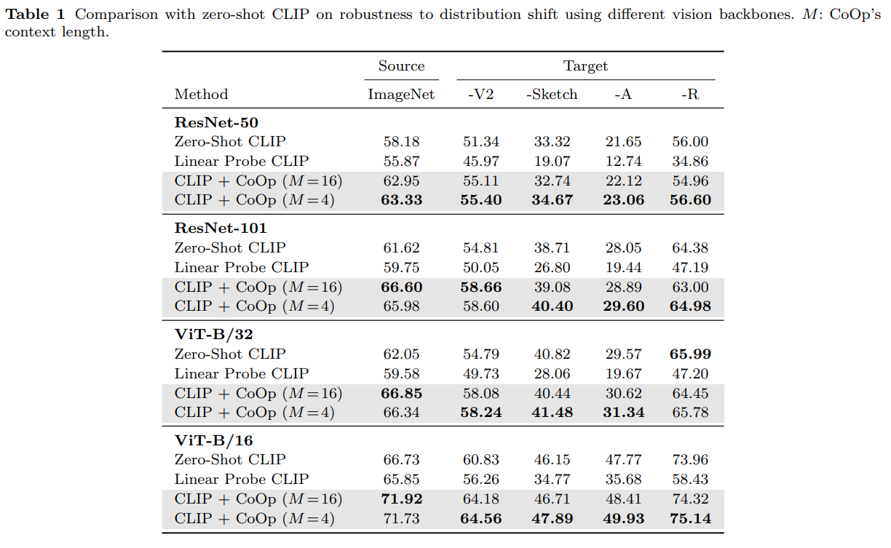

Tab. 1 은 다양한 CV backbone 을 사용한 결과를 요약한다.

- CoOp 가 source dataset 에 노출됨에도 불구하고 CLIP 의 distribution shifts 에 대한 robustness 를 강화한다는 점이 놀랍다.
  - 이는 learned prompts 가 generalization 될 수 있음을 시사한다.
- 게다가, fewer context tokens 을 사용하는 것이 더 나은 robustness 를 이끈다는 것이 흥미롭다.
- 반면에, linear probe model 은 이러한 target dataset 에서 훨씬 더 나쁜 결과를 얻어, domain generalization 에서의 약점을 드러낸다.

## 4.3 Further Analysis

#### Context Length

몇 개의 context tokens 을 사용해야 할까? 그리고 더 많은 context tokens 이 있는 것이 더 나은가?

Sec. 4.2 결과는 shorter context length 가 domain generalization에 도움이 된다는 것을 시사한다(아마 fewer parameters 가 학습되어 overfitting 이 덜 발생하기 때문일 것.).

여기선 source dataset 에 대한 이 hyper-parameter 를 연구한다.

구체적으로, context length 를 4, 8, 16 으로 바꿔가며 11 datasets 에 대해 실험을 반복한다.

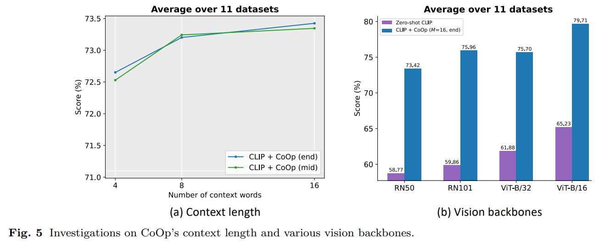

평균 결과는 Fig. 5(a)에 나타나 있으며,

- more context tokens 을 가지는 것이 더 나은 성능을 가져오며 class token 을 middle 에 위치시키는 것이 longer context length 에서 더 많은 momentum 을 얻는다는 것을 보여준다.
- 요약하자면, 성능과 distribution shifts 에 대한 robustness 사이의 균형을 맞춰야 하기 때문에 perfect context length 를 선택하기 위한 golden rule 은 없다.

#### Vision Backbones

Fig. 5(b)는 CNNs 와 ViTs 를 모두 포함하는 다양한 vision backbone 을 사용하여 11 datasets 에 대한 결과를 요약한다.

예상대로, backbone 이 더 발전할수록 성능이 더 좋아진다.

CoOp 와 hand-crafted prompts 간의 격차는 모든 아키텍처에서 상당하다.

#### Comparison with Prompt Ensembling

CLIP 은 “a photo of the large [CLASS].”, “a bad photo of the [CLASS].”, “an origami [CLASS].” 같이 서로 다른 scale, view 및 abstraction 을 반영하는 여러 hand-crafted prompts 를 사용하여 생성된 multiple zero-shot classifier 를 ensembling 하면 추가적인 개선이 가능하다고 제안했다.

저자는 CoOp 가 learned prompts 가 prompt ensembling 과 비교했을 때도 여전히 장점을 유지할 수 있는지 알고 싶다.

공정한 비교를 위해 ImageNet 에서 광범위하게 튜닝된 CLIP 의 select prompts 를 사용하여 ensemble classifier 를 구성한다.

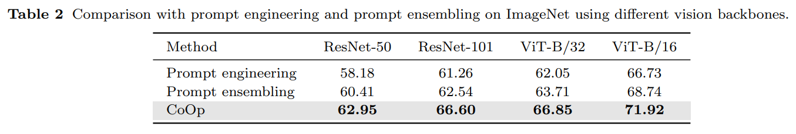

Tab. 2 는 비교를 보여주며 CoOp 의 우월성을 정당화한다.

prompt ensembling 의 잠재력을 감안할 때, 향후 연구는 앙상블 관점에서 CoOp 를 개선하는 방법을 조사할 수 있다.

#### Comparison with Other Fine-tuning Methods

저자는 추가로 CoOp 를 other fine-tuning 과 비교한다:

1. CLIP 의 image encoder fine-tuning;
2. text encoder output 에 추가된 transformation layer optimizing;
3. text encoder output 에 추가된 bias terms optimizing

결과는 Tab. 5에 나와 있다.

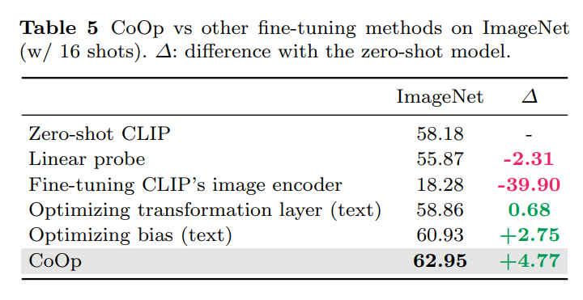

- 명백히, image encoder 를 fine-tuning 하는 것은 잘 작동하지 않는다.
- transformation layers 를 추가하면 zero-shot model 에 약간의 개선이 이루어진다.
- bias terms 를 추가하는 것은 유망한 결과를 보여주지만, 여전히 CoOp 에 비해 성능이 크게 떨어지며, 이는 text encoder 를 통과한 gradient 가 더 유용한 정보를 제공한다는 것을 시사한다.

#### Initialization

저자는 random initialization 과 manual initialization 을 비교한다.

manual initialization 는 11 datasets 에 대해 “a photo of a” 의 embedding 을 사용하여 context vectors 를 초기화한다. 

공정한 비교를 위해 random initialization 를 사용할 때도 context length 를 4 로 설정한다.

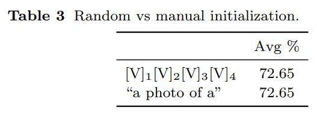

Tab. 3 은 “good initialization 이 큰 차이를 만들지 않는다는 것을 시사한다.

initialization words 를 추가로 tuning 조정하면 도움이 될 수 있지만, 실제로는 간단한 random initialization 방법을 사용하는 것을 권장한다.

#### Interpreting the Learned Prompts

learned prompts 는 continuous space 에서 optimizing 되기 때문에 해석하기 어렵다.

저자는 Euclidean distance 를 기준으로 learned vectors 에 가장 가까운 단어를 찾는 간접적인 방법을 사용한다.

CLIP 이 tokenization 을 위해 BPE representation 을 사용하므로, vocabulary 에는 “hu”(“hug” 와 “human” 같은 여러 단어에 포함됨)와 같이 text 에 자주 나타나는 subwords 가 포함된다.

Tab. 4 는 몇몇 dataset에서 검색된 결과를 보여준다.

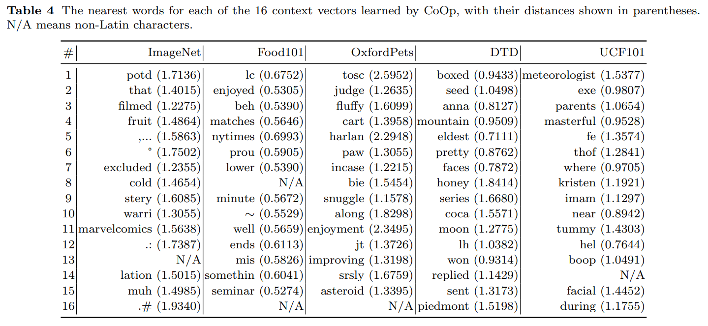

- Food101 의 “enjoyed”, OxfordPets 의 “fluffy” 와 “paw”, DTD 의 “pretty”  같이 일부 단어가 과제와 다소 관련이 있음을 관찰할 수 있다.
- 하지만 가장 가까운 단어들을 모두 연결해도 prompt 는 큰 의미를 가지지 않는다. 또한 manual initialization (e.g., “a photo of a”)를 사용할 때 converged vectors 에 가장 가까운 단어는 대개 초기화에 사용된 단어임을 관찰했다.
- learned vector 가 기존 vocabulary 를 넘어서는 의미를 encoding 할 수 있다고 추측한다.
- 전반적으로, learned prompts 를 해석하기 위해 가장 가까운 단어를 사용하는 것이 부정확할 수 있기 때문에, 이러한 관찰에 기반하여 확고한 결론을 내리기는 어렵다—vectors 의 semantics 가 반드시 가장 가까운 단어와 상관관계가 있는 것은 아니다.

# 5. Conclusion, Limitations and Future Work

large pre-trained vision-language model 은 다양한 downstream 응용에서 놀라운 강력한 능력을 보여주었다.

그러나 이러한 모델, 즉 “vision-based model” 은 “본질적으로 중심적이지만 불완전한” 특성을 가지므로, downstream 성능과 효율성을 향상시키기 위해 자동화된 기법으로 적응해야 한다.

저자의 연구는 CLIP 와 같은 모델을 prompt learning 을 사용하여 data-efficient learner 로 바꿀 수 있는 적절한 통찰력을 제공하며, CoOp 가 learning-based approach 임에도 불구하고 domain generalization 에서 manual prompt 보다 훨씬 뛰어나다는 것을 밝혀낸다.

이러한 결과는 large-scale vision model 에 대한 prompt learning 의 잠재력을 보여주는 강력한 증거로 작용한다.

저자의 논문이 prompt learning 을 통해 large-scale vision model 을 적응시키는 것에 대한 첫 번째 포괄적 연구라는 점은 주목할 만하다.

---

CoOp 의 성능이 우수하지만, 다른 NLP 의 continuous prompt learning 과 마찬가지로 결과를 해석하기는 상대적으로 어렵다.

실험은 또한 CoOp 가 Food101 에서의 약한 성능(Tab. 5)으로 인해 noisy label 에 민감하다는 것을 드러낸다. 그럼에도 불구하고, CoOp 의 단순성은 향후 작업에 대한 손쉬운 확장을 허용하며, cross-dataset transfer 및 test-time adaptation 같은 탐구할 많은 흥미로운 질문이 남아 있다.