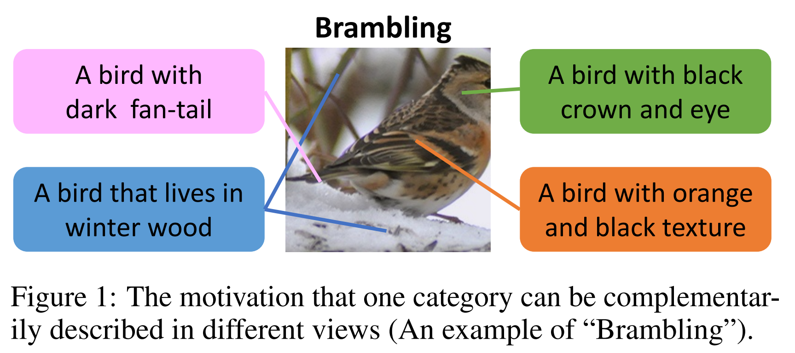
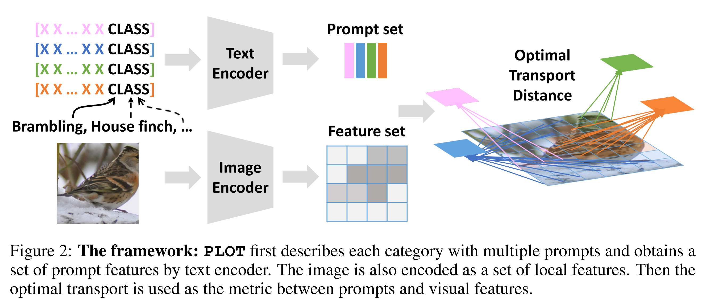
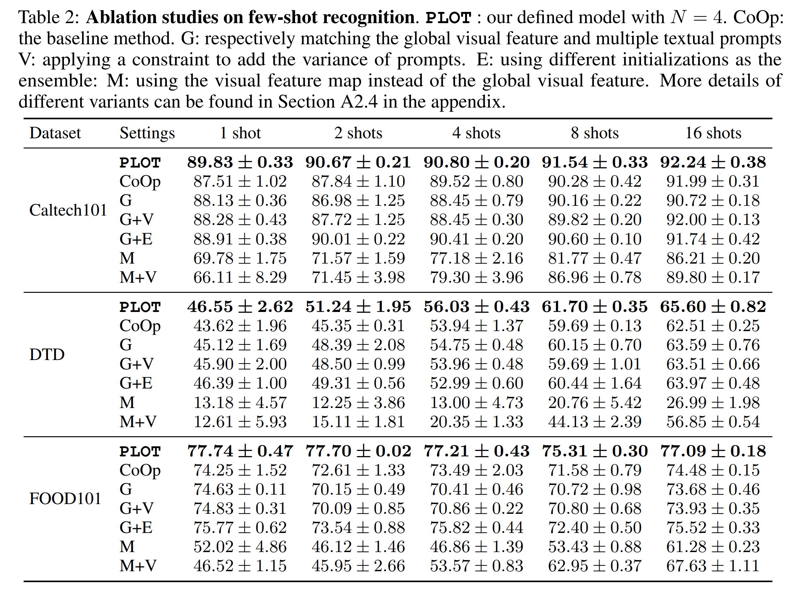
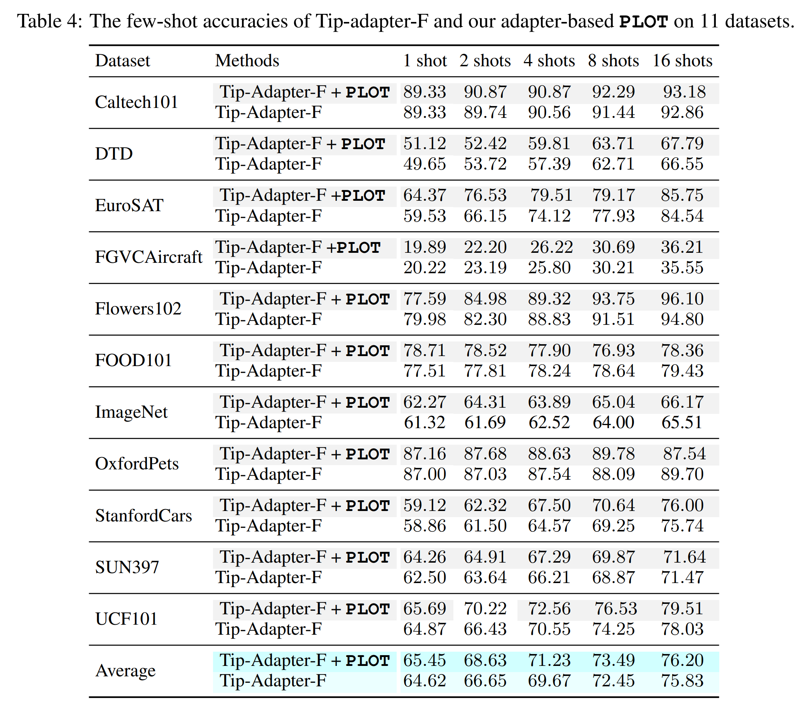
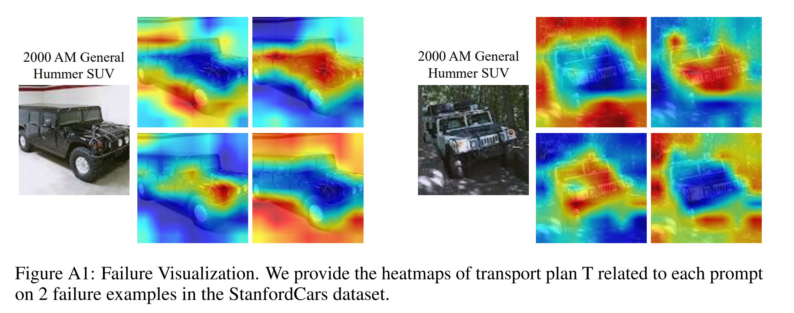
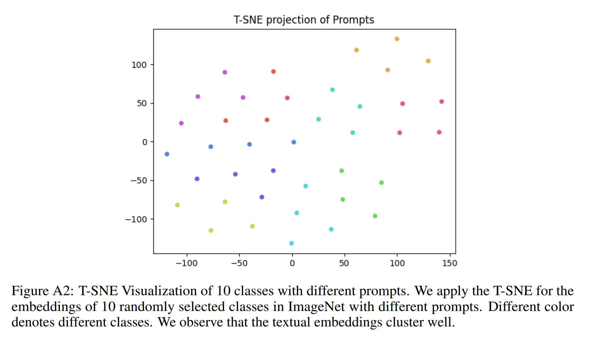

논문 및 이미지 출처 : <https://arxiv.org/pdf/2210.01253>

# Abstract 

최근 CLIP 과 같은 large-scale vision-language model 에 대한 관심이 증가함에 따라, efficient prompts 를 구축하기 위한 상당한 노력이 기울여지고 있다.

기존의 방법들은 보통 single prompt 만 학습하는 반면, 저자는 다양한 특성(e.g., intrinsic attributes 나 extrinsic contexts)을 설명할 수 있는 multiple comprehensive prompts 를 학습할 것을 제안한다.

그러나 각 prompt 를 동일한 visual feature 에 directly matching 은 문제를 일으킬 수 있는데, 이는 prompts 가 one point 에 수렴하도록 만들기 때문이다. 

이를 해결하기 위해, 저자는 vision 과 text modalities matching 을 위해 optimal transport 을 적용할 것을 제안한다.

- 저자는 먼저 image 와 category 를 visual 및 textual feature set 으로 modeling 한다.
- 그 다음, two-stage optimization 을 적용하여 prompts 를 학습한다.
- inner loop 에선 Sinkhorn algorithm 을 사용하여 visual feature 과 prompts 를 align 하기 위한 optimal transport distance 를 optimization 하고, 
- outer loop 에선 supervised data 에서 이 distance 로 prompts 를 학습한다.

다양한 실험을 few-shot recognition tasks 에서 수행하였으며, 개선 결과는 저자의 방법의 우수성을 입증한다.

# 1. Introduction

CLIP, ALIGN, BLIP 같은 large-scale vision-language pre-training (VLP) models 가 open-world visual concept learning 에 놀라운 성공을 거두었다.

이들은 새로운 가능성을 열어주었지만, 이러한 models 가 일반 사용자들이 re-training 하기엔 큰 규모를 가지고 있기 때문에, pre-trained knowledge 를 어떻게 효율적으로 downstream tasks 에 adapting 할 것인가 하는 새로운 문제를 제기한다.

전통적인 방법 중 하나는 “pre-training, fine-tuning” 으로, 이는 pre-trained network 의 구조를 고정하고, task-specific objective functions 로 parameters 를 tuning 하는 방법이다.

parameters fine-tuning 외에 NLP 분야에서 사용된 prompt learning 개념을 vision domain 에 도입하여 few-shot visual classification 에서 놀라운 성과를 거두었다.

- 이들은 model parameters 를 고정하고 template sentence 를 learnable vectors set 으로 변환하여 suitable prompts 를 학습한다.
- 그런 다음, 이 prompts 는 visual feature 과 prompt-based language features 간의 distance 를 minimizing 하여 학습된다.
- manual prompts 보다 상당한 개선이 있었지만, single sentence 만 학습하는 것은 class representation 에 직관적으로 부족하다.
- one class 는 여러 가지 intrinsic characteristics 과 extrinsic context relations 로 설명될 수 있다. 따라서 one object 에 대해 다양한 특성에 초점을 맞춘 multiple prompts 후보가 있을 수 있다.
  - 예로, “Brambling” class 를 날개 색, 눈 색상, 꼴 색상 및 모양, 서식지 정보 등 다양한 관점에서 설명할 수 있다.
- 이러한 이유로, 저자는 class 를 포괄적으로 표현하고 classification 을 용이하게 하기 위해 multiple prompts 를 학습하는 것을 제안한다.

가장 자연스러운 해결책은 

- 각 prompt 를 visual feature 과 각각 matching 하여 multiple prompts 를 직접 학습하는 것이다.
- 그러나 이는 prompt features 와 visual features 의 mean 을 matching 하는 것과 같다.
- 이러한 접근은 all prompts 가 one point 에 가까워지도록 유도하여 동일한 특성을 학습하게 된다. 
  - 이는 comprehensive prompts 를 학습하려는 목적에 맞지 않는다.
- 이를 해결하기 위해, 저자는 prompts 간 distance 를 멀리하게 하는 constraints 를 추가하는 것을 시험했지만, 이러한 방법은 여전히 대표적이고 comprehensive prompts 를 학습하는 데 실패했다.
  - 이는 visual representation 을 one single point 로 취급하며, 다양한 prompts 가 one 또는 subset 특성만 초점으로 삼는다는 사실을 무시한다.

---

이를 해결하기 위해, 본 논문에선 Prompt Learning with Optimal Transport (**PLOT**)을 제안한다. 

- local visual features 및 multiple textual prompts 을 align 하기 위한 Optimal Transport (OT) 를 적용 
- OT 는 multiple sampling 형태의 two distributions 간의 distance 를 계산할 수 있다.
- 저자의 prompt learning framework 에선 local visual feature 과 multiple prompts 를 two discrete distributions 의 sampling 으로 설정하고, OT 를 사용하여 fine-grained cross-modal matching 을 촉진한다.
- 구체적으로, 다양한 semantic clues 를 가진 local visual feature 을 얻기 위해, single global representations 가 아니라 all feature maps 를 visual representation 으로 추출한다. 
- 다행히도, 저자는 CLIP 의 visual encoder 에서 multi-head self-attention layer 의 all outputs 를 사용하여 visual feature maps 을 쉽게 얻을 수 있다. 
- 그 다음, two feature sets 간의 distance 를 계산하는 문제가 남는다.

이를 해결하기 위해, 저자는 optimal transport theory 을 도입하고 feature sets 을 discrete probability distribution 으로 공식화한다.

- 각 특징은 동일한 probability value 를 가지며, extra model parameters 를 피하고 computational cost 를 줄이기 위해 two-stage optimization 전략을 사용하여 prompts 를 학습한다.
- first stage 에선 inner loop 에서 visual 및 textual features 를 고정하고, fast Sinkhorn distance algorithm 을 통해 optimal transport 문제를 optimization 한다.
- 그 다음, outer loop 에선 all optimal transport parameters 를 고정하고 gradient 를 back-propagate 하여 다양한 특성을 가진 prompts 를 학습한다.
- conventional distance (e.g., mean features 의 Euclidean distance)와 비교할 때, optimal transport 은 각 local prompt 에 대해 different visual feature 을 align 할 수 있으며, 이는 visual misalignment 에 대해 more robust 하고 feature shift 에 잘 견디는 특성이 있다.
  - 이는 OT 가 feature 를 align 하기 위해 adative transport plan 을 학습하기 때문이다.

저자는 CLIP 및 CoOp 의 standard settings 를 따르는 11 datasets 실험을 수행하여 평가하였다.

이러한 실험은 generic objects, scenes, actions, fine-grained category  등 visual classification 을 포함한다.

결과적으로 PLOT 은 대표적이고 포괄적인 prompts 를 효과적으로 학습할 수 있음을 보여준다.

# 2. Related Work

#### Optimal Transport

Optimal Transport (OT)은 여러 항목을 동시에 이동시킬 때 비용을 줄이는 문제를 해결하기 위해 처음 도입되었다.

최근 OT 이론이 distribution 간의 비교를 통해 machine learning 및 CV 에서 널리 주목받고 있다.

distribution matching 의 뛰어난 특성 덕분에 OT 는 generative models, structural matching (e.g., sequence matching 및 graph matching), image matching, 그리고 clustering, distribution estimation, causal discovery 같은 다른 distribution-based tasks 에도 적용되고 있다.

본 논문에선 OT 를 사용하여 vision 과 language modalities 의 feature 를 align 하며, adaptive transport plan 을 학습한다.

#### Vision-Language Pre-trained Models

vision-language pre-training(VLP) model 은 large-scale pre-training 을 통해 vision 과 language modalities 간의 semantic correspondence 를 탐구하는 것을 목표로 한다.

최근 VLP models 는 few-shot visual recognition 에 뛰어난 성과를 보여주었으며, 이는 언어의 도움으로 open-world visual understanding 을 촉진할 큰 잠재력을 가지고 있음을 보여준다.

목표에 따라 VLP 방법은 reconstruction, contrastive matching, 또는 combination two 으로 나눌 수 있다.

또한, VLP 분야의 최근 진전은 large-scale pair dataset 덕에 많은 혜택을 보고 있다.

예로, CLIP 은 400M image-text pairs 를 사용하여 contrastive learning 을 수행한다.

recognition 외에도 이러한 VLP models 은 dense prediction, image generation, actions understanding 등 다른 downstream applications 에도 큰 잠재력을 보여준다.

#### Prompt Learning

prompt learning 은 large-scale language model 을 downstream tasks 에 효율적으로 적응시키기 위해 NLP 분야에서 도입되었다. 

traditional “pre-training, fine-tuning” 패러다임이 pre-trained model 을 초기화하고 parameters 를 downstream tasks 의 objective function 으로 조정하는 것과 달리, prompt learning 은 text prompts 를 사용하여 downstream tasks 을 original pre-trained task 로 재구성한다.

prompt 를 사용으로 pre-trained task 와 downstream application 간의 domain shift 를 줄이고, pre-trained knowledge 를 downstream tasks 에 더 쉽게 adapting 할 수 있다.

prompt learning 의 개념은 GPT 시리즈의 성공에서 시작되었다. 초기 prompt learning 방법은 항상 human knowledge 를 기반으로 template 을 수동으로 생성하였다.

이후 일부 mining-based method 와 gradient-based methods 가 suitable template 을 자동으로 검색하기 위해 제안되었다.

discrete space search 를 넘어, prompt 가 word” 여야 한다는 제약을 제거하고 대신 continuous embedding space 에서 prompts 를 학습한다.

최근 CoOp 과 그 확장인 CoCoOp 이 open-world visual understanding 에 prompt learning 을 도입하여 large-scale vision-language pre-training model 의 knowledge 를 적응시키고, few-shot visual recognition 에서 큰 성과를 얻었다.

CoOp 와 비교하여, PLOT 은 optimal transport distance 를 도입하여 multiple local prompts 를 학습하고 fine-grained vision-language matching 을 달성함으로써 prompt learning 을 더 향상시킨다.

PDL 은 보다 다양한 prompts 에서 동기 부여를 받아 prompt 를 parameter distribution 으로 가정하고 학습 중에 parameter 를 맞추지만, PLOT 은 parameter distribution  없이 multiple prompts 를 학습한다.

# 3. Approach

## 3.1 A Revisit of CoOp

CoOp 은 vision-language pre-training knowledge (e.g., CLIP) 을 사용하여 downstream open-world visual recognition 을 위한 prompts 를 학습하는 선구적인 방법 중 하나이다.

CLIP 이 manual prompt template 을 설계하는 것과 달리, CoOp 은 template 의 일부 context words 를 continuous learnable parameter 로 설정하여 few-shot data 로부터 학습할 수 있도록 한다.

그런 다음, classification weights 는 learned prompts 와 visual feature 간의 distance 로 표현된다.

- 구체적으로, image $x$ 가 주어지면, visual encoder $f$ 를 통해 visual feature  $f = f(x)$ 를 얻는다.
- 그런 다음, textual prompt 는 $t_k = \{ \omega_1, \omega_2, \ldots, \omega_L, c_k \}$ 로 구성될 수 있으며,
  - $c_k$ : class name 의 word embedding
  - $\omega = \{ \omega_l \mid l = 1, \ldots, L \}$ : learnable vectors 로 각 vector 는 original word embedding 과 동일한 dimension 가짐
  - $L$ : context workd length
- prompt $t_k$ 를 입력으로 하여 text encoder $g$ 는 textual feature $g_k = g(t_k)$ 을 출력한다.
- final prediction probability 는 다음과 같이 matching score 로 계산된다:

$$
\begin{equation}
  p(y = k \mid x) = \frac{\exp(\text{sim}(f, g_k) / \tau)}{\sum_{k' = 1}^K \exp(\text{sim}(f, g_{k'}) / \tau)},
\end{equation}
$$

- $\text{sim}(\cdot, \cdot)$ : cosine similarity 같은 metric function
- $\tau$ : softmax temperature

그런 다음, prediction 과 labeled target 간의 cross-entropy loss 를 통해 $\{vec_l \mid^L_{l=1}\}$의 parameter 를 optimizing 할 수 있다.

## 3.2 Optimal Transport

optimal transport(OT) distance 는 distribution 를 비교하는 데 널리 사용되는 metric 이다.

여기서는 저자의 framework 와 더 관련이 깊은 discrete 상황에만 집중한다.

two sets of points (features) 가 주어졌을 때, discrete distribution 는 다음과 같이 표현된다:

$$
\begin{equation}
  U = \sum_{m=1}^M u_m \delta_{f_m} \quad \text{and} \quad V = \sum_{n=1}^N v_n \delta_{g_n},
\end{equation}
$$

- $u$ 와 $v$ : 합이 1 인 discrete probability vector
- $\delta_f$ : embedding space 의 support point $f$ 에 배치된 Dirac delta function

total distance 는 다음과 같이 표현된다:

$$
\begin{equation}
  \langle T, C \rangle = \sum_{m=1}^M \sum_{n=1}^N T_{m,n} C_{m,n}.
\end{equation}
$$

- $C$ : cost matrix 로 각 point 는 $f_m$ 과 $g_n$ 사이의 cost 을 나타낸다
  - 예로 $C_{m,n} = 1 - \text{sim}(f_m, g_n)$
- $T$ : total distance 를 minimizing 하기 위해 학습되는 transport plan

optimal transport 문제는 다음과 같이 형식화된다:

$$
\begin{equation}
  \begin{align*}
    d_{OT}(u, v \mid C) &= \min_{T} \langle T, C \rangle \\
    \text{subject to} \quad &T \mathbf{1}_N = u, \quad T^\top \mathbf{1}_M = v, \quad T \in \mathbb{R}^{M \times N}_+.
  \end{align*}
\end{equation}
$$

- 위 objective 를 directly optimizing 하면 time-consuming 이 크므로, entropy constraint 를 사용해 fast optimization 를 위해 Sinkhorn distance 를 적용한다.
- entropy constraint 의 Lagrange multiplier 와 함께 optimization 문제는 다음과 같다:

$$
\begin{equation}
  \begin{align*}
    d_{OT, \lambda}(u, v \mid C) &= \min_{T} \langle T, C \rangle - \lambda h(T) \\
    \text{subjecto to} \quad &T \mathbf{1}_N = u, \quad T^\top \mathbf{1}_M = v, \quad T \in \mathbb{R}^{M \times N}_+,
  \end{align*}
\end{equation}
$$

- $h(\cdot)$ : entropy
- $\lambda \geq 0$ : hyper-parameter

다음과 같이 few iterations 만으로 fast optimization 솔루션을 얻을 수 있다:

$$
\begin{equation}
  T^* = \text{diag}(u^{(t)}) \exp(-C / \lambda) \text{diag}(v^{(t)}),
\end{equation}
$$

- $t$ : iteration
- 각 iteration $u^{(t)} = u / ((\exp(-C / \lambda) v^{(t-1)}) \ \text{and} \ v^{(t)} = v / ((\exp(-C / \lambda)^T u^{(t)})$ 로 계산된다
- initiation $v^{(0)} = 1$.

## 3.3 Prompt Learning With Optimal Transport

Fig. 2 에 나타난 바와 같이, image $x$ 가 주어지면, 먼저 CLIP 의 visual encoder branch 에 입력된다. 

- global visual feature $f$ 외에도, 저자는 local features set $\{ f_m \mid^M_{m = 1} \}$ 을 얻을 수 있다.
- visual encoder 는 glocal feature 와 local feature sets (feature map)의 조합을 입력으로 받아 $R^{(H \times W + 1) \times C}$ 형태의 tensor 를 출력하는 multi-head attention pooling layer 를 갖는다.
  - $H$ 와 $W$ : feature map 의 height 및 width
  - $C$ : feature dimension
- 따라서 $M = H \times W$ local features 와 glocal feature 를 얻을 수 있다.
- 동시에 class $k$ 에 대해, 저자는 learnable vectors $\{ \omega_n \mid^N_{n = 1} \}$ 을 갖는 $N$ local prompt $\{ t_{k,n} \mid^N_{n = 1} \}$ 을 초기화할 수 있다.
  - 이 prompt 는 CoOp 의 prompt 와 동일.
- visual 및 textual encoder 를 사용하여 저자는 local visual feature  $F = \{ f_m \mid^M_{m = 1} \} \in \mathbb{R}^{M \times C}$ 및 prompt features $G_k = \{ g_n \mid^N_{n = 1} \} \in \mathbb{R}^{N \times C}$ 을 얻을 수 있다.

inner loop 에선 fixed support sets $F$ 와 $G_k$ 로 transport plan $T$ 를 학습하며, 다음과 같이 OT distance 를 minimizing 하여 $G_k$ 를 $F$ 로 푸시한다:

$$
\begin{equation}
  d_{OT}(k) = d_{OT}(u, v \mid 1 - F^T G_k),
\end{equation}
$$

- $C = 1 - F^T G_k$ 는 $F$ 와 $G_k$ 사이의 cosine distance 를 cost matrix 로 사용함을 나타낸다.
- 그런 다음, 다음과 같은 형태로 transport plan $T^*$ 의 솔루션을 Eq. 6 으로 얻고 final OT distance 를 $d_{OT}(k)$ 로 계산한다.

주어진 OT distance $d_{OT}(k)$ 를 기반으로 prediction probability 을 다음과 같이 재구성한다:

$$
\begin{equation}
  p_{OT}(y = k \mid x) = \frac{\exp((1 - d_{OT}(k)) / \tau)}{\sum_{k' = 1}^K \exp((1 - d_{OT}(k')) / \tau)}.
\end{equation}
$$

outer loop 에선 transport plan $T^*$ 를 고정하고, cross-entropy 를 통해 $\{vec_l \mid^{L,N}_{l=1, n=1} \}$ 을 optimizing 한다:

$$
\begin{equation}
  L_{CE} = - \frac{1}{|X|} \sum_{x \in \mathcal{X}} \sum_{k = 1}^K y_{x,k} p_{OT}(y = k \mid x),
\end{equation}
$$

- $y_x$ : one-hot label vector

optimal transport 과 prompt optimization 전략은 two-stage 로 이루어지지만, whole training flow 는 end-to-end 이다.

이는 transport plan 이 small matrix multiplications 로 forward module 로 계산되기 때문이다. 

이러한 matrix multiplications 의 gradients 는 back-propagate 를 위해 기록되며, 이로 인해 whole system 이 fully differentiable (PyTorch 와 같은 autograd library 로 구현 용이)하다.

# 4. Experiments

## 4.1 Dataset

저자는 CoOp 실험 설정을 따라 few-shot learning 평가를 진행했다.

- 11 visual recognition dataset 에서 수행되었으며, 이에는 Caltech101, DTD, EuroSAT, FGVCAircraft, Flowers102, Food101, ImageNet, OxfordPets, StanfordCars, SUN397, UCF101 포함.
- 이 dataset 은 generic objects, scenes, actions, fine-grained category 등을 포함한 visual classification 을 아우르며, 포괄적인 평가를 제공한다.
- 모든 실험은 CLIP 및 CoOp 에 사용된 few-shot evaluation protocol 을 채택하였으며, model training 을 위해 각각 1, 2, 4, 8, 16 shot 을 선택하고 original test set 을 평가.
- 또한, domain transfer 의 robustness 평가하기 위해 ImageNet 을 source domain 으로 사용하고, ImageNetV2, ImageNet-Sketch, ImageNet-A, ImageNet-R 같은 ImageNet-based robustness evaluation dataset 으로 우리 방법을 평가했다.

## 4.2 Implementation Details

CoOp 을 주요 경쟁자로 선택하여 저자의 방법을 평가하였다.

- CoOp 가 one class 에 대해 global prompt 만 학습하는 것과 달리, PLOT 은 multiple local prompts 를 학습하고 OT distance 를 적용하여 fine-grained align 을 수행한다.
- 또한, CLIP features 를 사용하여 linear classifier 를 학습한 성능과 CoOp 의 conditional version 인 CoCoOp 의 성능도 보고.
- 이들은 pre-trained knowledge 를 downstream tasks 에 adapting 하기 위해 널리 사용되는 방법들.
- CoCoOp 를 동일한 설정에서 평가하여 공정한 비교를 진행(base-to-new setting).
- original CoOp 은 다양한 class token positions 와 parameter initialization 을 가진 버전이 있다.
  - 비교를 용이하게 하기 위해, “end” token position, “random” initialization, 16 context tokens, RN50 backbone 을 가진 버전 중 하나를 baseline 으로 선택하였다.

## 4.3 Comparison with CoOp

#### Few-shot Learning

- CoCoOp 와 CoOp 의 setting 이 다르기 때문에, CoOp setting 에서 CoCoOp 방법을 다시 실행.
- all prompt learning 방법이 linear probing 을 크게 초월하는 것으로 관찰되었다. 또한, PLOT 은 대부분의 dataset 에서 CoOp 및 CoCoOp 보다 더 뛰어난 성능을 보인다.
  - 예로, average accuracy(left top)에서, PLOT 은 각각 1, 2, 4, 8, 16 shot 에서 CoOp 에 비해 3.03%, 3.45%, 2.13%, 1.38%, 0.61% 성능 향상을 얻었다.
- all dataset 중에서 PLOT 은 FOOD101과 DTD dataset 에서 CoOp 에 비해 더 큰 향상을 달성하였으며, StanfordCars dataset 에선 유사한 성능을 달성하였다.
  - 이는 StanfordCars dataset 에서 discriminative characters 가 서로 일치하여, one global prompt 와 one global visual feature 가 잘 작동할 수 있기 때문일 수 있다.
- class-specific context 를 사용하지 않기 때문에, fine-grained classification dataset 에서 성능이 낮은 경우가 있다.
  - 예로, FGVCAircraft 에서 CoOp 와 PLOT 모두 class-specific context 없이 linear probing 보다 낮은 성능을 보인다.
  - 이러한 성능 비교는 multiple local prompt 와 OT distance 가 vision-language model 의 prompt learning 을 촉진함을 실험적으로 입증하는 데 도움이 된다.

#### Domain Generalization

robustness 는 실제 환경이 training data 와 큰 domain gap 을 가질 수 있기 때문에 모델 응용에서 중요한 역할을 한다.

따라서 저자는 PLOT 으로 학습된 모델의 transferability 를 조사하기 위해 robustness  평가를 수행하였다.

Tab. 1 은 4 ImageNet-based robustness evaluation dataset 에서 PLOT 과 CoOp 의 결과를 요약.

- 두 방법 모두 ImageNet 에서 per-class 16 shot 으로 모델을 훈련하였다. 
- PLOT 의 경우, prompt 수를 $N = 4$ 로 설정.
- 결과적으로, PLOT 은 source domain 과 target domain 모두에서 CoOp 을 일관되게 초월하는 것으로 나타났다. 
- 이러한 실험 결과는 저자의 multiple prompt learning 방법이 single-domain overfitting 에 의존하지 않는 성능 향상을 가져온다는 것을 보여준다.

## 4.4 Ablation Studies and More Analysis

다양한 components 효과를 조사하기 위해 ablation study 를 수행하여 다음과 같은 질문에 답함.

**Q: prompt ensemble 을 global visual feature 과 matching 하여 multiple prompts 를 directly learning 이 될까?**  
**A: No**

Tab. 2에서, 저자는 prompt ensemble 을 global visual feature (“G”)과의 directly matching 성능을 Caltech101, DTD, FOOD101의 세 dataset 에서 보고한다.

- 이 방법의 CoOp 에 대한 성능 향상은 제한적이며 PLOT 보다 훨씬 낮다.
- 이는 “G” 가 indistinguishable prompts 를 학습하도록 유도되기 때문에, multiple comprehensive prompts 를 학습하려는 저자의 목적과 상충하기 때문이다.

**Q: prompts 의 variety 을 유도하는 ensemble methods 가 잘 작동하는가?**  
**A: No** 

Tab. 2에서, prompts variety 를 유도하기 위해 two methods 를 적용한 후 global feature 와 matching 하는 방법을 사용했다.

- method “V” 에선 모든 two prompts 사이의 distance 를 regularization 항으로 추가하는 objective function 를 추가.
- method “E” 에선 randomly initialization 대신 “a photo of a”, “this is a photo”, “this is a”, “one picture of a” 같은 pre-defined different initializations 를 사용하였다.
- 그러나 “G+V” 는 “G” 에 비해 일관된 개선을 보이지 않았다. 
- “G+E” 는 명확한 개선을 보였지만, PLOT 은 “G+E” 보다 일관되게 우수한 성능을 보였으며, 이는 OT distance 의 효과를 더욱 입증한다.

**Q: 개선이 주로 all feature maps 를 사용하는 것에서 오는가?**  
**A: No** 

- PLOT 에선 visual encoder 의 all feature maps 를 적용하여 각 feature 가 spatial position 에서 local embedding 을 형성한다.
- 그러나 PLOT 의 개선은 all feature maps 를 사용하는 것에만 의존하지 않는다. 반대로, feature maps 을 직접 사용하여 global feature 을 대체하면 성능이 크게 저하된다.
  - 예로, all 3 dataset 에서 feature map(“M” 또는 “M+V”)을 직접 사용하는 경우, global visual feature 을 사용하는 경우에 비해 약 20% 의 1-shot 정확도 감소를 보인다. 
  - 이는 original CLIP 모델이 global visual feature 과 language feature 를 일치시키는 방식으로 훈련되었기 때문이다.
- OT 방법을 사용하지 않으면, feature maps 와 multiple textual prompts 간의 distance 는 각 feature-prompt pair 의 mean distance 로 퇴화된다.

**Q: 몇 개의 prompts 가 필요한가?**  
**A: 4 prompts 면 충분.** 

PLOT 에서 중요한 hyper-parameter 는 prompt 수이다. 

prompt 수의 효과를 분석하기 위해, 1, 2, 4, 8 prompts 를 사용하여 3 dataset 에서 실험을 수행하였다. 

- prompt 수를 1 to 4 로 늘리면 성능이 명확히 향상된다.
  - 예로, PLOT (N=4)는 3 dataset 에서 각각 1.36%, 2.64%, 1.68%의 1 shot 정확도 향상을 보인다.
  - 그러나 prompt 수를 더 증가시키면 개선이 일관되지 않는다.
- 개선과 비용의 균형을 맞추기 위해, 저자는 PLOT 모델의 default setting 을 $N = 4$ 로 설정하였다.
- 실험에선 Caltech101 dataset 에서 이 hyper-parameter 를 조정하고 다른 dataset 에 적용하였다.

**Q: PLOT 이 Adapter-based methods 에 이점을 줄 수 있나?**  
**A: Yes** 

Adapter-based methods 는 pre-trained vision-language model 의 efficient adaptation 을 위한 또 다른 연구 방향이다.

prompt learning 이 model parameters 를 고정하고 language prompts 를 조정하는 것과 달리, Adapter-based methods 는 network 일부를 fine-tuning 하거나 extra model  을 훈련에 추가하는 것을 허용한다.

최근 Adapter-based methods 도 few-shot visual recognition 에서 좋은 성능을 달성하였다.

---

저자는 Tip-adapter-F 를 기본 방법으로 사용하였으며, 이 방법은 visual feature 과 all training samples 간의 similarity 로 하나의 이미지를 설명하는 $Linear(d, N_{cls} × K_{shots})$ model 을 학습한다.

- $d$ : visual feature 의 dimension
- $N_{cls}$ : category  수 (e.g., ImageNet 의 경우 1000)
- $K_{shots}$ : shot 의 수

final similarity 는 original visual feature 과 prompt ensemble 간의 distance 와 learned feature 와 label 의 one-hot vector 간의 new distance 로 구성된다 (dimension 은 $(N_{cls} × K_{shots}, N_{cls})$).

PLOT 을 이 framework 에 도입하기 위해, 저자는 global feature 을 대체하기 위해 feature map 을 사용한 후, multiple linear model 을 학습하였다.

결과적으로, 다양한 local feature 과 different linear models 를 통해 $M × N$ distance matrix 를 얻고 Sinkhorn algorithm 을 적용하여 OT distance 를 계산할 수 있다.

또한, learned prompts 를 ensemble prompt 의 공동 파트너로 사용하여 final similarity 를 개선할 수 있다.

Tab. 4 는 original Tip-Adapter-F 과 저자의 Adapter-based PLOT 방법의 few-shot recognition 결과를 11 datasets 요약.

**Q: PLOT 이 zero-shot learning 에 이점을 줄 수 있나?**  
**A: No** 

PLOT 은 zero-shot learning setting 에서 이점을 제공하지 못한다. 

- CLIP 연구에서는 hand-crafted prompts 가 여전히 좋은 성능을 낼 수 있음을 보여준다.
  - 저자는 ImageNet dataset 에서 prompt engineering 을 통해 7 prompts 를 얻었으며, 이를 ensembling 하여 60.38% 의 top-1 accuracy 를 얻을 수 있었다.
- 여기서 global visual features 와 prompt ensemble 간의 cosine distance 를, feature mapes 와 all 7 prompts 간의 OT distance 를 사용하여 대체했다. 그러나 training 없이 OT distance 는 58.78% 의 정확도만을 얻었다. 
  - 이는 PLOT 이 여전히 optimization 을 위한 few-shot data 가 필요하며, zero-shot setting 에 직접적으로 적용될 수 없다는 한계점이다. 
  - OT distance 가 training 없이 효과를 발휘하지 못하는 이유는 두 가지로 추정된다: 1) prompt engineering 은 feature maps 와의 OT distance 가 아닌, global features 와 cosine distance 에 기반하여 prompts 선택한다; 2) selected prompts 는 모두 global features 와 가깝고 complementarity 가 부족하다.

**Q: PLOT 의 extra computation time cost 는 CoOp 에 비해 얼마나 되는가?**  
**A: 약 10% 의 inference speed 와 5% 의 training time 증가가 있다.** 

Tab. A4 에 제시된 바와 같이, 저자는 baseline 인 CoOp 과 PLOT 의 prompt 개수에 따른 training time 및 inference 를 비교하였다.

Food101 dataset 의 1-shot setting 에서 한 epoch 당 training time 과 model 이 1초 동안 처리한 image 수를 보고하였다.

예로, prompt 개수 $N = 4$ 를 기준으로 보면, PLOT 은 inference speed 가 9.2% 정도 감소하고, training time 은 4.9% 정도 더 소요된다. 

하지만 성능 향상을 고려하면 이 정도는 수용할 만한 수준이다.

## 4.5 Visualization

Fig. 4 에서 different prompts (N=4)와 관련된 transport plan $T$ 의 시각화 예제를 제공한다.

이러한 시각화 예제에 대한 자세한 분석과 learned prompts 해석, T-SNE prompt 시각화, 잘못된 사례 시각화 등 추가 시각화 결과는 다음과 같다.

# 5. Conclusion

이 논문에선 PLOT 이란 방법을 제안하여 하나의 category 를 설명하기 위해 multiple comprehensive prompts 를 학습한다.

convergence 방지를 위해, 저자는 vision 과 language domain 간의 fine-grained align 을 달성하기 위해 optimal transport 를 적용한다.

저자는 two-stage optimization 전략을 적용하여 inner loop 에선 prompts 를 고정하고 transport plan 을 학습하여 cross domain distance 를 계산하며, outer loop 에선 이 distance 를 사용하여 prompt learner 를 optimizing 한다.

저자의 방법은 CoOp 를 기반으로 구축되었으며, 다양한 dataset 에서 few-shot recognition tasks 에서 상당한 개선을 달성하였으며, 이는 single prompt 대신 multiple prompts 를 학습하는 것이 유리하다는 것을 보여준다.