논문 및 image  출처 : <https://arxiv.org/pdf/2102.05918>

# Abstract

- pre-trained representations 는 NLP 및 perception task 에 중요. NLP 는 훈련에 human annotation 이 필요 없지만, visual/vision-language representation 는 여전히 의존.
- ImageNet 이나 OpenImage 같은 explit class label 이 포함된 dataset 에서 대부분의 representation 학습. 
- 반면 vision-language 는 Conceptual Captions, MSCOCO 같은 dataset 이 모두 non-trivial data collection 과정이 필요해서 비용이 크고 선별 과정은 dataset size 를 제한하고, 훈련 모델 확장을 방해한다.

본 논문은 Conceptual Captions dataset 에 비용 및 후처리 단계 없이 1B 넘는 image alt-text pair 의 noisy dataset 을 활용함.

- simple dual-encoder architecture 는 contrastive loss 로 image 및 text pair 의 visual 및 language representation 를 align 을 학습
- corpus scale 은 noisy 를 상쇄할 수 있으며, 간단한 학습 방법으로 SOTA 달성
- ImageNet 및 VTAB 같은 classification task 로 전환 시 강력한 성능 발휘
- aligned visual 및 language representation 은 zero-shot image classification 을 가능케 하며, Flickr30K 및 MSCOCO image-text retrieval benchmark 에서도 cross-modality model 과 비교해 SOTA 달성
- 이 representation 은 compex text 및 text + image queries 와의 cross-modality search 를 가능케 함

# Introduction

기존 visual 및 vision-language representation learning 대부분 다른 training data sources 를 사용해 별도로 연구함.

vision domain 에선 ImageNet, OpenImages, JFT-300M 같은 supervision dataset 에 대한 pre-training 이 transfer learning 을 통한 downstream task 성능 향상에 중요한 것을 입증. 이런 pre-training datasets 의 curation 에는 data 수집, sampling, 인간 주석이 필요해 확장이 어려움

vision-language modeling 도 pre-training 접근법을 사용하지만 Conceptual Captions, Visual Genome Dense Captions, ImageBERT 같은 vision-language pre-training dataset 은 인간 주석, semantic parsing, cleaning 및 balancing 잡기에 더 많은 작업 필요함. 이런 dataset scale 은 ~10M examples 수준에 불과하며 이는 vision domain 의 couterpars dataset 보다 한 자릿수 작고 NLP pre-training 을 위한 인터넷의 large-scale corpora text 보다 훨씬 작음.

---

본 논문에서 1B noisy image 가 있는 image alt-text pairs 를 활용해 visual 및 vision-language representation learning 의 scale 을 확장.

- Conceptual Captions dataset 절차를 따라 large-scale noisy dataset 을 만듦. 그러나 (Fixing the train-test resolution discrepancy.) 에서 제안한 complex filtering 및 post-processing steps 을 적용하는 대신, simple frequency-based filtering 만 적용
  - 얻어진 데이터셋은 noisy 가 있지만 Conceptual Captions dataset 보다 두 자릿수 더 큼
- 저자는 이 exascale dataset 으로 pre-training 된 visual 및 vision-language representation 이 다양한 task 에 매우 강력한 성능을 달성한다는 것을 보여줌

---

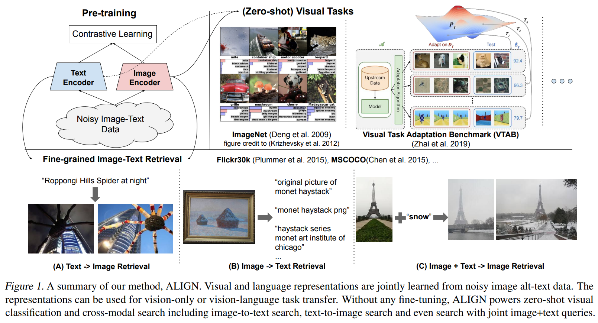

- 모델 훈련을 위해 simple dual encoder 를 사용해 visual 및 language representation 을 shared latent embedding 에 align 하는 objective 사용
- 이와 유사한 objective 는 visual-semantic embeddings (VSE) learning 에 적용되어 옴
  - 저자는 이 모델을 ALIGN (**A** **L**arge-scale **I**ma**G**e and **N**oisy-text embedding)이라 명명
- image 및 text encoder 는 contrastive loss (normalized softmax 형태) 를 통해 학습되는데, 이는 matched image-text pair 의 embedding 을 가까이 당기고 non-matched image-text pair 는 멀리 밀어냄
  - 이는 self-supervised 및 supervised representation learning 에서 가장 효과적인 loss function 중 하나
- text 를 image 의 fine-grained labels 로 간주하면 image-to-text contrastive loss 는 기존 label-based classification objective 와 유사하며, 핵심 차이는 text encoder 가 "label" weights 를 생성한다는 것임

---

aligned image 및 text representation 은 cross-modality matching/retrieval task 에 적합하며, benchmark 에 SOTA 달성.

- ALIGN은 Flickr30K 및 MSCOCO 의 대부분의 zero-shot 및 fine-tuning R@1 metrics 에서 이전 SOTA 보다 7% 이상 우수한 성능을 보임
- 또한 이러한 cross-modality matching 은 text encoder 에 classnames 를 입력해 zero-shot image classification 을 가능케 하며, ImageNet 의 training samples 를 사용하지 않고도 76.4% 의 top-1 accuracy 달성
- image representation 자체도 다양한 downstream visual tasks 에 우수한 성능을 보임
  - 예로, ALIGN 은 ImageNet 에서 88.64% 의 top-1 accuracy 달성
  - Figure 1 bottom 은 ALIGN 으로 구축된 real retrieval system 에서 가져온 cross-modality retrieval example 을 보여줌

# 2. Related Work

high-quality visual representation 을 classification 또는 retrieval 에 사용하기 위해 보통 large-scale labeled dataset 을 사용함. 최근엔 self-supervised 및 semi-supervised learning 이 대안으로 연구되고 있음

근데 이 방법으론 trained model 을 downstream task 로의 transferability 이 제안적임.

---

image 및 natural language captions 의 활용은 learning visual representation 의 또 다른 방향이며 (Joulin et al. (2015); Li et al. (2017); Desai & Johnson (2020); Sariyildiz et al. (2020); Zhang et al. (2020)) 은 image 로부터 caption 을 예측하여 우수한 visual representation 학습을 보여주며, 이는 저자에게 영감을 줌

그러나 이런 연구들은 Flickr 와 COCO Captions 같은 small dataset 에 국한되며, 결과적으로 cross-modality retrieval 같은 task 에 필요한 vision-language representation 을 생성하지 못함

---

vision-language representation learning domain 에서 visual-semantic embeddings (VSE) 및 향상된 visions (예, obvject detectors, dense feature maps, 또는 multi-attention layer 를 활용) 을 (Socher et al., 2014; Karpathy et al., 2014; Kiros et al.; Nam et al., 2017; Li et al., 2019; Messina et al., 2020; Chen et al., 2020a) 에서 제안

최근엔, cross-modal attention layer (Liu et al., 2019a; Lu et al., 2019; Chen et al., 2020c; Huang et al., 2020b) 을 갖춘 진보된 모델들이 등장하며 image-text matching task 에서 우수한 성능을 보였다.

하지만 이 모델들은 속도가 매우 느려 real world 의 image-text retrieval system 에 실용적이지 못한 반면, 저자의 모델은 가장 단순한 VSE 형태를 유지하면서도 image-text matching benchmark 에서 이전의 모든 cross-attention models 를 능가한다.

---

저자의 연구와 밀접한 CLIP 은 유사한 contrastive learning 에서 language supervision 을 통한 vision representation learning 을 제안한다. 

다른 vision 및 language encoder architecture 를 사용하는 것 외에 주요 차이점은 training dataset 에 있다: ALIGN 은 raw alt-text data 의 natrual distribution 를 따르는 반면, CLIP 은 english wikipedia 의 high-frequency visual concepts 의 allowlist 로 구성하여 dataset 을 수집한다.

저자는 전문가의 지식이 필요하지 않은 dataset 으로도 강력한 visual 및 vision-language representation 을 학습할 수 있음을 보여줌

# 3. A Large-Scale Noisy Image-Text Dataset

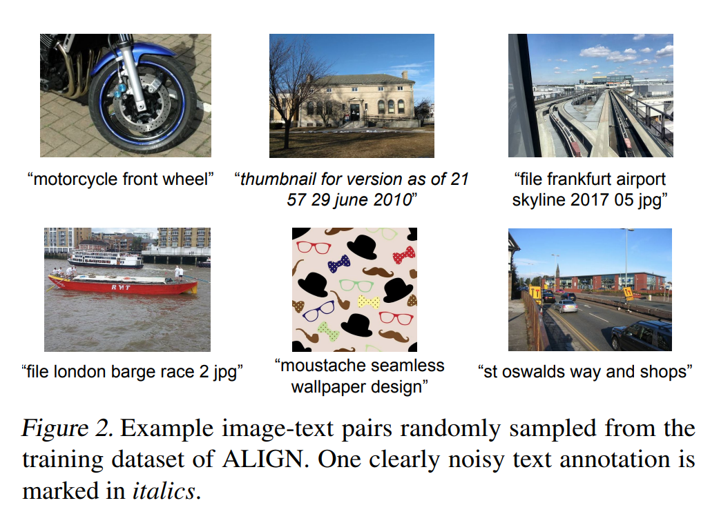

연구 초점은 visual 및 vision-language representation learning 을 확장하는 것.

이를 위해 기존 보다 훨씬 큰 dataset 사용.

- 구체적으로 Conceptual Captions dataset 을 구축하는 방법론을 따라 raw English alt-text data (image 및 alt-text pairs) 의 버전을 얻음
- Conceptual Captions dataset 은 철저한 filtering 및 post-processing 을 통해 정리
- 저자의 확장은 원본 작업에서 대부분 cleaning  steps 로 완화하여 quality 를 trade 하고 scale 을 늘림
  - minimal frequency-based filtering 적용
  - 결과, 훨씬 더 크지만 (1.8B image-text pairs) 더 많은 noisy 가 포함
  - Fig. 2 는 dataset 에서 sample 한 image-text pairs 보여줌

#### Image-based filtering

- Sharma et al. (2018) 을 따르며, pornographic images 를 제거하고 shorter dimension 의 길이가 200 pixels 보다 크고 가로세로 비율이 3 보다 작은 image 들만 유지.
- 1000 개 이상의  alt-text 가 연결된 image 는 제외
- test images 에서 훈련되지 않도록 하기 위해, 모든 downstream evaluation datasets (e.g., ILSVRC-2012, Flickr30K, MSCOCO) 에서 test image 와 중복되거나 거의 중복인 image  제거

#### Text-based filtering

- 10 개 이상의 image 와 공유되는 alt-text 제외
- 이러한 alt-text 는 종종 image 의 내용과 관련없음 (e.g., "1920x1080", "alt img", "cristina"). 또한, dataset 내에 100M 의 가장 빈번한 unigrams 및 bigrams 에 속하지 않는 rare token 을 포함한 alt-text 와 너무 짧은(< 3 unigrams) 또는 너무 긴(> 20 unigrams) alt-text 도 제외
- 이 과정은 "image tid 25&id mggqpuweqdpd&cache 0&lan code 0" 같은 noisy 가 많은 text 나 너무 일반적이어서 유용하지 않은 text 를 제거

# 4. Pre-training and Task Transfer

## 4.1 Pre-training on Noisy Image-Text Pairs

ALIGN 은 dual-encoder architecture 사용하여 pre-training.

- 모델는 image 및 text encoder pair 로 구성되며 top 에 cosine-similarity combination function 이 함께 있음
- image encoder 는 global pooling (classification head 의 1x1 conv layer 는 학습하지 않음) 이 있는 EfficientNet 을 사용
- text encoder 는 [CLS] token embedding 을 사용하는 BERT 사용 (training dataset 에서 생성된 100K wordpiece vocabulary 사용)
  - BERT encoder top 에 image tower 의 dimension 과 일치시키기 위해 linear activation 을 가진 fully-connected layer 를 추가
- image 및 text encoder 는 scratch training 됨

image 및 text encoder 는 normalized softmax loss (Zhai & Wu, 2019)을 통해 optimizing

training 에서, matched image-text pairs 를 positive 로, training batch 에서 형성될 수 있는 other random image-text pairs 를 negative 로 간주

저자는 image-to-text classification 을 위해서 image-to-text classification 하나:

$$
\begin{equation}
  L_{i2t} = -\frac{1}{N} \sum^N_i \log \frac{\exp (x_i^\top y_i/\sigma)}{\sum^N_{j=1} \exp (x_i^\top y_i/\sigma)}
\end{equation}
$$

다른 하나는 text-to-image classification:

$$
\begin{equation}
  L_{t2i} = -\frac{1}{N} \sum^N_i \log \frac{\exp (y_i^\top x_i/\sigma)}{\sum^N_{j=1} \exp (y_i^\top x_i/\sigma)}
\end{equation}
$$

두 losses 의 합을 minimizing

- $x_i$ 및 $y_i$ 는 각각 image 의 $i$-th 및 text 의 $j$-th pair 의 normalized embedding
- $N$ : batch size
- $\sigma$ : logits scale 의 temperature 

in-batch negatives 가 더 효과적이도록 하기 위해, 모든 computing cores 의 embeddings 를 연결하여 훨씬 더 큰 batch 를 형성.

temperature variable 은 image 및 text embeddings 이 L2-normalize 되기 때문에 중요함.

optimal temperature 를 수동으로 탐색하는 대신, 저자는 모든 other parameters 와 함께 효과적으로 학습될 수 있음을 발견.

## 4.2 Transferring to Image-Text Matching & Retrieval

저자는 ALIGN 을 image-to-text 및 text-to-image retrieval task 를 fine-tuning 없이 평가, 두 dataset betchmark : Flickr30K 및 MSCOCO

또한 MSCOCO 에 caption-caption, image-image 및 image-caption pairs 에 대한 human semantic similarity judgments 를 추가로 MSCOCO 의 확장인 Crisscrossed Captions (CxC) 도 평가

확장된 CxC 는 image-to-text, text-to-image, text-to-text 및 image-to-image retrieval, semantic textual similarity (STS), semantic image similarity (SIS) 및 semantic image-text similarity (SITS) 를 포함한 semantic similarity tasks 로 four intra- 및 inter-modal retrival task 포함

training set 은 original MSCOCO 와 동일하여, MSCOCO fine-tuned ALIGN model 을 CxC annotations 에 직접 평가 가능

## 4.3 Transferring to Visual Classification

먼저 ALIGN 의 zero-shot transfer 을 ImageNet ILSVRC-2012 와 그 변형들에 대해 visual classification tasks 에 적용. 

- 변형에는 ImageNet-R (endition) (예술, 만화, 스케치와 같은 비자연적 image ), ImageNet-A (dversarial) (머신러닝 모델에 더 어려운 image ), ImageNet-V2 가 포함
- 이 변형들은 모두 동일한 (또는 부분적인) ImageNet 클래스를 따르지만, ImageNet-R 과 ImageNet-A 의 image 는 ImageNet 과는 매우 다른 distribution에서 샘플링

또한 image encoder 를 downstream visual classification tasks 으로 transfer

- 이를 위해 ImageNet 과 함께 Oxford Flowers-102, Oxford-IIIT Pets, Stanford Cars, Food101 와 같은 smaller fine-grained classification dataset 을 사용
- ImageNet 의 경우, 두 가지 setting 에서 결과를 report : top classification layer 만 training (with frozen ALIGN image encoder) 과 full fine-tuning 설정
  - fine-grained classification benchmark 에선 후자 설정만 report
- Kolesnikov et al. (2020) 을 따라, 저자는 Visual Task Adaptation Benchmark (VTAB) 에서 모델의 robustness 를 평가함
  - VTAB 은 각각 1000 training samples 를 가진 19 diverse (자연, 특수 및 구조화된 image  classification task을 다루는) visual classification tasks 로 구성

# 5. Experiments and Results

ALIGN model 을 scratch training 을 위해, EfficientNet 의 open source implementation 을 image encoder 로, BERT 를 text encoder 로 사용.

분석 연구를 제외하고는, image encoder 로 EfficientNet-L2, text encoder 로 BERT-Large 를 사용하는 ALIGN 결과를 사용한다.

- 모든 EfficientNet 변형에서 image encoder 는 $289 × 289$ pixels resolution 로 학습된다. 
- input image 는 먼저 $346 × 346$ resolution 로 resizing 한 후, training 중엔 random crop(additional random horizontal flip 포함)하고, evaluation 시엔 center crop 을 수행한다.
- BERT 에선 최대 64 tokens 로 이루어진 wordpiece sequence 를 사용하며, input text 는 20 미안의 unigram 으로 구성된다.
- softmax temperature value 는 1.0 으로 초기화되며(이 temperature value 는 image-to-text loss 와 text-to-image loss 간에 공유됨), softmax loss 에서 label smoothing parameter 로 0.1 을 사용한다.
- 저자는 LAMB optimization 와 weight decay ratio 1e-5 를 사용한다.
- learning rate 는 10k step 에서 0 to 1e-3 까지 선형적으로 증가하며, 이후 1.2M step(약 12 epoch) 동안 선형적으로 0 으로 감소.
- model 은 1024개 Cloud TPUv3 코어에서 16 positive paris 를 각 코어에서 학습한다. 
- 따라서 총 유효 batch size 16384

## 5.1.  Image-Text Matching & Retrieval

저자는 ALIGN 을 Flickr30K 와 MSCOCO cross-modal retrieval benchmark 에서 zero-shot 와 fully fine-tuning 설정에서 평가

(Karpathy & Fei-Fei, 2015) 및 대부분의 기존 연구을 따라 train/test split 을 얻는다.

- Flickr30K 의 경우, standard 1K test set 에서 평가하고 30K training set 에서 fine-tuning
- MSCOCO 의 경우, 5K test set 에서 평가하며, 82K training images 와 5K validation 또는 5K test set 에 포함되지 않은 30K additional validation images 에서 fine-tuining

fine-tuning 중에도 동일한 loss function 을 사용한다. 그러나 batch size 가 training sample 수와 유사할 때 false negatives 가 발생할 수 있다.

- 따라서 global batch size 를 16384 에서 2048로 줄인다.
- 또한 initial learning rate 를 1e-5 로 줄이고, Flickr30K 와 MSCOCO 에서 각각 3K 와 6K steps 동안 학습한다 (linear decay). 
- 다른 hyper-parameters 는 pre-training 과 동일하게 유지한다.

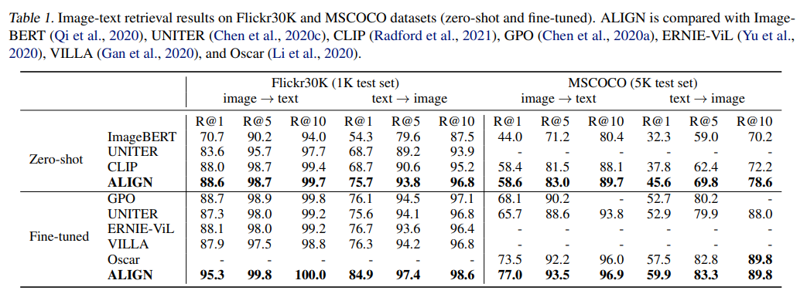

Tab. 1 은 ALIGN 이 이전 연구과 비교하여 Flickr30K 와 MSCOCO benchmark 의 all metrics 에서 SOTA 결과를 달성했음을 보여준다.

-  zero-shot 설정에서 ALIGN 은 이전 SOTA 인 CLIP 대비 image retrieval task 에서 7% 이상의 개선을 보였다. 
-  fine-tuning 을 통해 ALIGN 은 ImageBERT, UNITER, ERNIE-ViL, VILLA, Oscar 같은 더 복잡한 cross-modal attention layer 를 사용하는 방법을 포함한 모든 기존 방법을 큰 폭으로 능가했다.

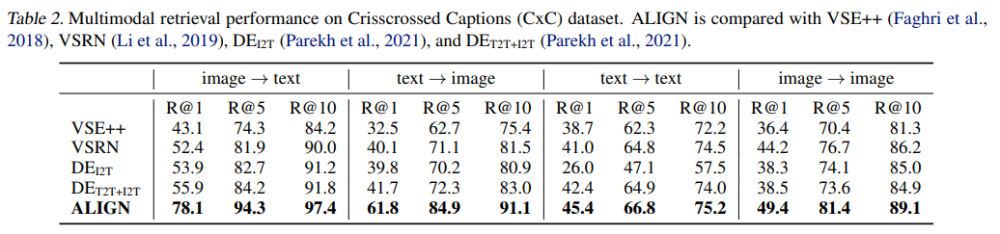

Tab. 2 는 Crisscrossed Captions (CxC) retrieval task 에서 ALIGN 의 성능을 보고한다.

- 다시 한번 ALIGN 은 all metrics 에서 SOTA 결과를 달성했으며, 특히 image-to-text (+22.2% R@1) 및 text-to-image (+20.1% R@1) task 에서 큰 격차를 보였다.

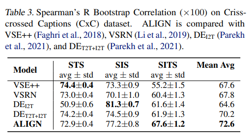

Tab. 3 은 ALIGN 이 SITS task 에서도 5.7% 의 개선으로 이전 SOTA를 능가했음을 보여준다.

- 흥미로운 관찰 중 하나는, ALIGN 이 inter-modal task 에서 훨씬 뛰어난 성능을 보였음에도 불구하고, intra-modal task 에서는 인상적이지 않다는 것이다.
  - 예로, text-to-text 및 image-to-image retrieval task(특히 전자)에서의 개선은 image-to-text 및 text-to-image task 에서의 개선에 비해 덜 두드러진다. 
  - STS 및 SIS task 에서의 성능도 VSE++ 및 DEI2T 보다 약간 떨어진다. 
  - 저자는 ALIGN 의 training objective 가 intra-modal matching 대신 cross-modal matching (image-to-text matching)에 중점을 두기 때문이라고 추측한다.
  - Parekh et al.(2021) 은 multi-task learning 이 더 균형 잡힌 표현을 만들어낼 수 있다고 제안한다. (이는 향후 연구)

## 5.2. Zero-shot Visual Classification

classname test 를 text encoder 에 직접 입력하면, ALIGN 은 image-to-text retrieval 을 통해 image 를 candidate class 에 분류할 수 있다.

Tab. 4 는 Imagenet 및 그 variants 에서 ALIGN 과 CLIP 을 비교한 것이다.

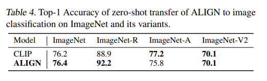

- CLIP 과 유사하게, ALIGN 은 다양한 image  distribution 에서 classification task 에 대해 뛰어난 robustness 를 보여준다.
- 공정한 비교를 위해, CLIP 에서 정의한 prompt ensembling 방법을 동일하게 사용한다.
- 각 classname 은 "A photo of a {classname}" 와 같은 CLIP 에서 정의한 prompt template set 으로 확장된다.
- class embedding 은 all template 의 embedding 을 평균한 후 L$_2$-normalization 을 통해 계산된다.
- 이러한 ensembling 은 ImageNet 의 top-1 accuracy 를 2.9% 개선하는 것으로 나타났다.

## 5.3. Visual Classification w/ Image Encoder Only

ImageNet benchmark 에서 저자는 learned visual features 를 frozen 상태로 classification head 만을 훈련시키고, 이후에 all layers 를 fine-tuning 했다.

- data augmentation 은 Szegedy et al. (2015)와 동일하게 random crop 및 horizontal flip 을 포함하며, 평가 시에는 비율 0.875 의 single center crop 을 적용한다.
- Touvron et al. (2019)을 따라 train 및 eval 간 resolution 불일치를 완화하기 위해 0.8 scale ratio 를 사용한다. 
  - 구체적으로, visual features 가 고정된 경우 train/eval resolution 는 289/360 이고, 모든 values 를 fine-tuning 할 때는 475/600 이다.
- training 의 두 stages 모두에서 global batch size 는 1024이며, momentum 0.9 를 가진 SGD optimization 를 사용하고, learningrate 는 30 epochs 마다 0.2 비율로 감소하며 총 100 epochs 동안 학습한다.
- weight decay 는 0 으로 설정된다.
- visual features 가 고정된 경우 initial learning rate 는 0.1 이다.
- all layers 를 fine-tuning 할 때는 initial learning rate 를 0.01 로 설정하고, backbone network 에선 classification head 에 비해 10배 작은 learning rate 를 사용한다.

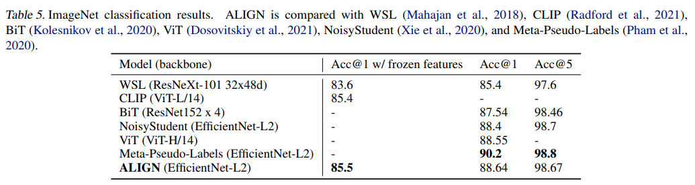

Tab. 5 는 ImageNet benchmark 에서 ALIGN 과 이전 방법들을 비교한다. 

- visual features 가 고정된 경우 ALIGN 은 CLIP 보다 약간 우수하여 85.5% 의 top-1 accuracy 로 SOTA 결과를 달성했다.
- all layers 를 fine-tuning 한 후 ALIGN 은 BiT 와 ViT 보다 높은 정확도를 달성했으며, ImageNet training 과 large-scale unlabeled data 간의 깊은 상호작용이 필요한 Meta Pseudo Labels 만큼은 높지 않았다.
- EfficientNet-L2 를 사용하는 NoisyStudent 및 Meta-Pseudo-Labels 와 비교하여 ALIGN 은 smaller test resolution (800 대신 600)를 사용하여 44% 의 FLOPS 를 절약했다.

---

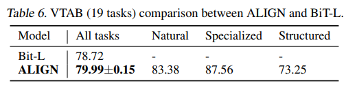

- VTAB eval 에서는 (Zhai et al., 2019) 의 hyper-parameter sweep 을 따라 각 task 에 대해 50 trials.
- 각 task 는 800 image 로 학습되고, hyper-parameter 는 200 image 로 구성된 validation set 을 사용하여 선택된다. 
- sweep 후 선택된 hyper-parameter 는 각 task 에 대해 1000 images 로 구성된 train/eval set 을 결합한 데이터에서 학습하는 데 사용된다.
- Tab. 6 은 3 fine-tuning runs 에서 표준 편차를 포함한 평균 정확도(각 subgroups 의 세부 결과 포함)를 보고하며, ALIGN 이 비슷한 hyper-parameter 선택 방법을 적용한 BiT-L 을 능가했음을 보여준다.

---

smaller fine-grained classification benchmark 를 평가하기 위해, 저자는 all tasks 에 대해 간단한 fine-tuning 전략을 채택했다.

- ImageNet fine-tuning 과 동일한 data augmentationb 및 optimizer 를 사용한다.
- 마찬가지로, 먼저 classification head 를 학습한 다음, batch norm statistics 는 frozen 상태로 all layers 를 fine-tuning 한다.
- train/eval resolution 는 289/360 으로 고정된다.
- batch size 는 256 이고 weight decay 는 1e-5 이다. 
- initial learning rate 는 각각 1e-2 와 1e-3 으로 설정되며, 20k steps 에서 cosine learning rate decay 를 사용한다.

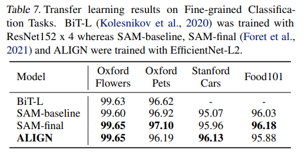

Tab. 7 은 ALIGN 과 BiT-L 및 all tasks 에 대해 동일한 fine-tuning hyper-parameters 를 적용한 SAM 을 비교한다.

- 이러한 small tasks 에선 fine-tuning 의 세부 사항이 중요한다. 따라서 optimization 알고리즘을 사용하지 않고 SAM optimization 을 사용하지 않은 상태의 기준 결과를 (Foret et al., 2021) 에 나열하여 공정한 비교를 한다.
- 저자의 결과(average 3 runs)는 optimization 알고리즘에 대한 세부 조정 없이 SOTA 결과와 비슷하다.

# 6. Ablation Stduy

ablation study 에선 MSCOCO zero-shot retrieval 및 ImageNet K-Nearest-neighbor (KNN) tasks 에서 모델 성능을 주로 비교한다.

이 two metrics 가 대표적이며, 위 섹션에서 보고된 other metrics 와 잘 상관관계가 있음을 발견했다. 

언급되지 않은 경우, analysis factor 외의 hyper-parameter 는 기본 모델과 동일하게 유지된다.

## 6.1. Model Architectures

저자는 먼저 다른 image 와 text backbone 을 사용하는 ALIGN model 의 성능을 연구한다. 

image encoder 로 EfficientNet 을 B1에서 L2 까지, text encoder 로 BERT-Mini 에서 BERT-Large 까지 학습시킨다.

B1, B3, B5 및 L2 의 globally-pooled features 에 추가적인 linear activation 이 있는 fully-connected layer 를 추가하여 B7 의 output dimension (640)을 맞춘다.

all text encoder 에도 유사한 linear layer 를 추가한다. 

similar linear layer 를 절약하기 위해 분석에서는 training steps 를 1M 으로 줄인다.

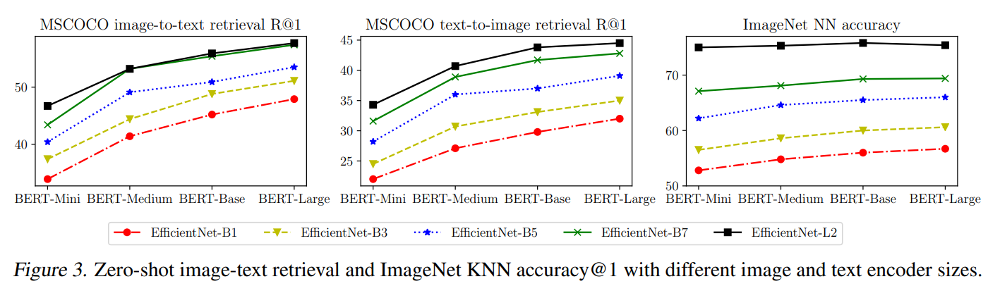

Fig. 3 은 MSCOCO zero-shot retrieval 및 ImageNet KNN 결과를 다양한 image 및 text backbone combinations 를 보여준다.

- model quality 는 larger backbone 에서 확실히 개선되지만, BERT-Base 에서 BERT-Large 까지의 ImageNet KNN metric 은 EfficientNet-B7 및 EfficientNet-L2 와 함께 포화 상태에 이르렀다.
- 예상대로 image encoder 용량을 확장하는 것이 vision task 에 더 중요하다(e.g., BERT-Mini text tower 를 사용하더라도 L2 는 BERT-Large 와 함께 B7 보다 더 나은 성능을 보인다).
- image-to-text retrieval task 에서는 image 및 text encoder 용량이 동일하게 중요하다.
- Fig. 3 에 나타난 nice scaling property 를 기반으로, Sec. 5 에서 보고된 대로 EfficientNet-L2 + BERT-Large 를 사용하여 모델을 fine-tuning 한다.

---

이후 embedding dimension, batch 내 random negatives 및 softmax temperature 같은 주요 아키텍처 hyper-parameter 를 연구한다.

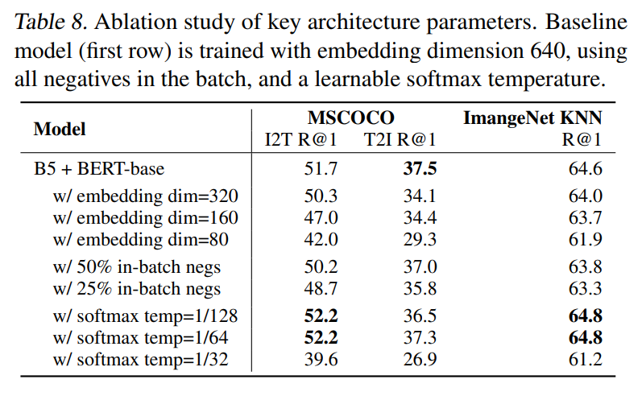

Tab. 8 은 BERT-Base text encoder, embedding dimension 640, batch 내 random negatives 및 trainable softmax temperature 를 사용하여 학습된 EfficientNet-B5 image encoder 를 baseline model (first row)과 여러 model variants 를 비교한다.

- Tab. 8 의 Rows 2~4 는 higher embedding dimensions 가 성능을 개선한다는 것을 보여준다. 따라서 저자는 diemsion 이 더 큰 EfficientNet backbone(L2 사용 시 1376)으로 scaling 한다
- Tab. 8 의 Rows 5, 6 은 softmax loss 에서 batch 내 random negatives 수를 줄이는 것이(50% 및 25%) 성능을 저하시킨다는 것을 보여준다.
- Tab. 8 의 Rows 7~9 은 softmax loss 의 temperature parameter 의 영향을 연구한다.
  - temperature parameter 를 학습하는 baseline model (약 1/64 로 수렴됨)과 비교하여, 일부 hand-selected, fixed temperature 가 약간 더 나을 수 있다.
  - 그러나 learnable temperature 를 사용하는 것이 경쟁력 있고 학습을 더 쉽게 만들어주기 때문에 이 방법을 선택한다.
  - 또한 temperature 는 보통 첫 100k step 에서 converged value 의 약 1.2배로 빠르게 감소한 후 학습이 끝날 때까지 서서히 수렴한다는 것을 확인했다.

## 6.2. Pre-training Datasets

모델이 다양한 크기의 dataset 으로 훈련되었을 때 어떻게 성능이 달라지는지를 이해하는 것도 중요하다.

- 이를 위해, 저자는 두 가지 모델(EfficientNet-B7 + BERT-base와 EfficientNet-B3 + BERT-mini)을 3 (full ALIGN training data, randomly sampled 10% 의 ALIGN training data, 그리고 Conceptual Captions(CC-3M, 약 3M images))으로 훈련시켰다.
- CC-3M 은 samller dataset 이기 때문에, 모델을 default steps 의 1/10 로 훈련한다.
- 모든 모델은 scratch training 한다.

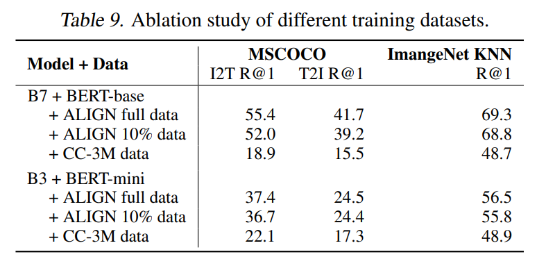

Tab. 9 에서 볼 수 있듯이, 

- large-scale training set 은 모델을 확장하고 더 나은 성능을 달성하는 데 필수적이다.
  - 예로, ALIGN data 로 훈련된 모델은 CC-3M data 로 훈련된 모델보다 명확히 우수하다.
  - CC-3M 에선 B7+BERT-base 가 overfit 되기 시작하여 B3+BERT-mini 보다도 성능이 떨어진다.
- 반대로, larger dataset 을 완전히 활용하려면 더 큰 모델이 필요하다.
  - small B3+BERT-mini model 은 ALIGN data 의 10% 에서 거의 포화 상태에 도달하는 반면, larger B7+BERT-base model 은 full ALIGN data 를 사용할 때 명확히 개선된다.

---

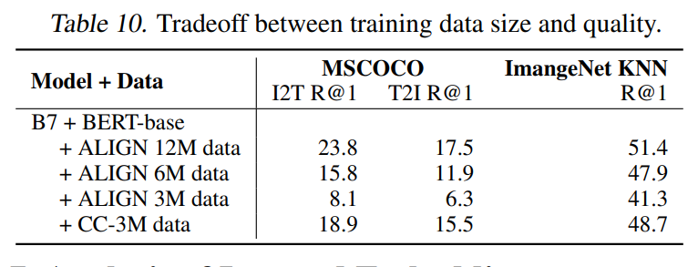

data size scaling 이 increased noise 를 이겨내는 방식을 더 잘 이해하기 위해, 저자는 ALIGN training data 3M, 6M, 12M 을 randomly sampling 하고, 이들을 B7+BERT-base model 에서 CC-3M data 와 비교했다. 

- Tab. 10 은 ALIGN data 가 동일한 크기(3M)로 CC data 보다 훨씬 열악하게 수행되지만, 6M 및 12M ALIGN data 로 훈련된 모델의 품질이 빠르게 따라잡는다는 것을 보여준다.
- noise 가 있음에도 불구하고, ALIGN data 는 CC data 보다 4배 큰 크기만으로 이를 능가한다.

# 7. Analysis of Learned Embeddings

저자는 ALIGN 으로 훈련된 embedding 의 동작을 연구하기 위해 간단한 image retrieval system 을 구축했다.

시연 목적으로, training set 과는 별도로 160M CC-BY 라이선스 이미지를 포함하는 인덱스를 사용했다.

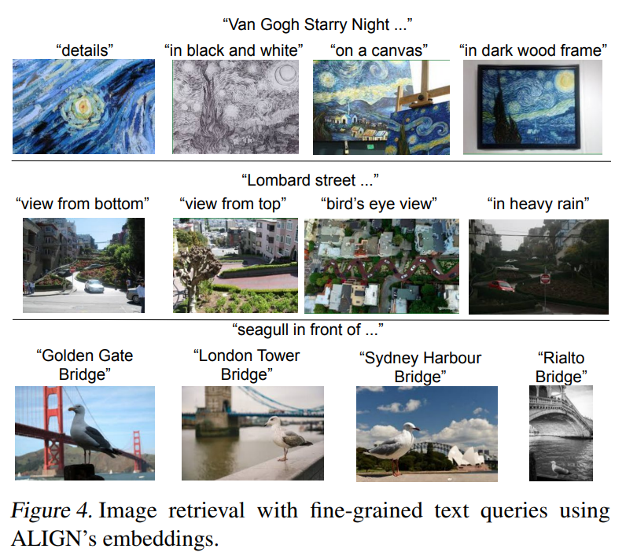

Fig. 4 는 training data 에 존재하지 않는 일부 text query 에 대한 text-to-image retrieval 의 top-1 결과를 보여준다.

- ALIGN 은 장면의 세부 묘사나 랜드마크 및 예술 작품과 같은 세밀한 개념을 정확하게 검색할 수 있다.
- 이 예들은 ALIGN 모델이 similar semantic 을 가진 image 및 text 를 align 할 수 있으며, 복잡한 새로운 개념에 generalizing 할 수 있음을 보여줍니다.

---

이전에 word2vec 는 word vector 가 문장과 단락에서 인접 단어를 예측하도록 훈련되면서 word vector 간 linear relationships 가 형성된다고 보여줬다.

저자는 ALIGN 에서도 image 와 text embedding 간의 linear relationships 가 형성된다는 것을 보여준다.

image+text query 로 image retrieval 를 수행했다. 구체적으로, query image 와 text string 이 주어진 상태에서 그들의 ALIGN embedding 을 더하고 이를 사용해 관련 이미지를 검색한다.

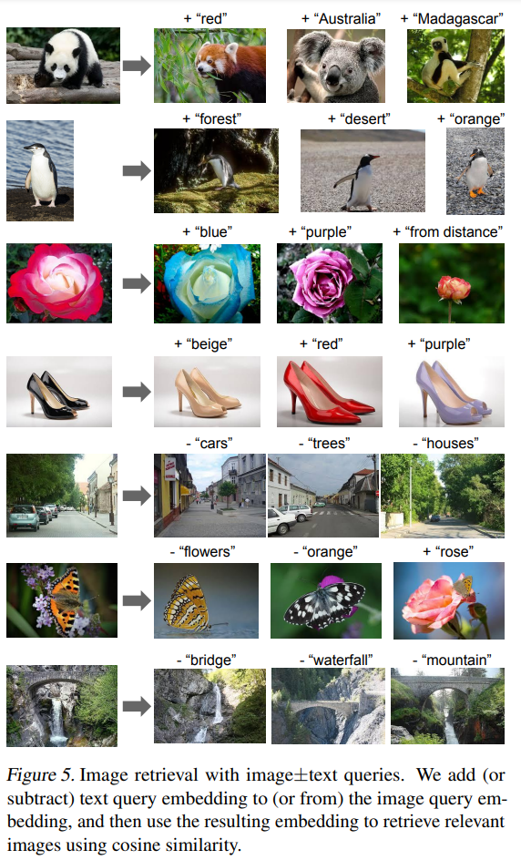

Fig. 5 는 다양한 iomage+text query 에 대한 결과를 보여준다.

- 이 예들은 ALIGN embedding 이 vision 및 language domain 간의 뛰어난 조합성을 보여줄 뿐만 아니라, text 또는 image query 만으로는 어렵던 "multi-modal query retrieval" 의 새로운 패러다임이 가능함을 보여준다.
- 예로, 이제는 "“Australia”" 또는 "Madagascar" 와 같은 팬더를 찾거나 검은 신발 쌍을 "beige" 같은 색으로 동일하게 보이도록 바꿀 수 있다.
- 마지막으로 Fig. 5 의 마지막 3 row 에서 보여지듯, embedding space 에서 빼기를 수행하여 장면에서 objects/attributes 를 제거하는 것도 가능하다.

# 8. Multilingual ALIGN Model

ALIGN 의 한 가지 장점은 모델이 simple filter 를 사용해 noisy web image text data 로 훈련된다는 점이며, filter 중 어느 것도 특정 언어에 한정되지 않는다는 점이다.

이에 따라, conceptual caption data processing pipeline 의 언어 제한을 해제하여 dataset 을 multilingual (100+languages) 로 확장하고, english dataset (1.8B image-text pair)과 크기를 일치시켰다.

이 데이터로 multilingual model ALIGNmling 을 훈련시켰다.

all languages 를 포괄하기 위해 크기 250k 의 new multilingual wordpiece vocabulary 를 생성했다.

---

저자는 multilingual image text retrieval dataset 인 Multi30k 에서 multilingual model 을 test 했다.

이 데이터셋은 Flickr30K 를 독일어(de), 프랑스어(fr), 체코어(cs) 로 확장한 것이다.

dataset 은 영어와 독일어로 이미지당 5 captions, 프랑스어와 체코어로는 이미지당 1 caption 이 포함된 31,783 images 로 구성되어 있다.

train/eval/test 분할은 Young et al. (2014) 에 정의되어 있다. 저자는 ALIGN 의 zero-shot model 성능을 평가하고 이를 M3P 및 UC2 와 비교했다.

evaluation metric 은 image-to-text retrieval 및 text-to-image retrieval task 에서 Recall@1, Recall@5, Recall@10 의 평균 점수를 계산하는 평균 리콜(mR)이다.

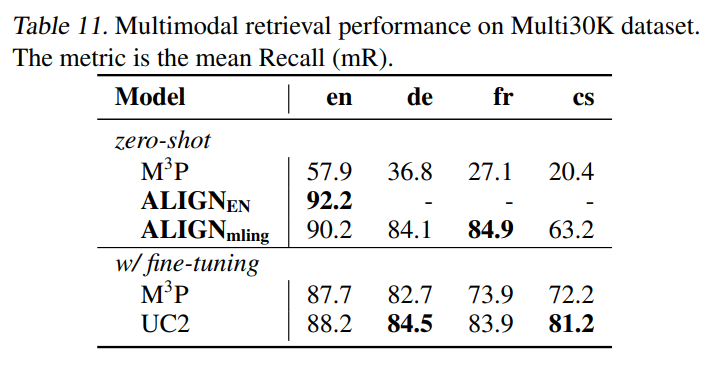

- Tab. 11 은 ALIGNmling 의 zero-shot 성능이 모든 언어에서 M3P 를 큰 차이로 능가하며, 프랑스어에서 가장 큰 57.8 점의 절대 mR 개선을 보여준다.
- ALIGNmling 의 zero-shot 성능은 체코어를 제외하고, fine-tuned M3P 및 UC2 와 비교할 만한 수준이다.
- 영어에서는 ALIGNmling 이 EN 전용 데이터로 훈련된 ALIGNEN 보다 약간 낮은 성능을 보인다.

### 9. 결론

저자는 large-scale noisy image-text data 를 활용하여 vision 및 vision-language representation learning 을 확장하는 간단한 방법을 제시한다.

이 방법은 data curation 및 annotation task 를 크게 줄이고, minimal frequency-based cleaning 만을 필요로 한다.

이 dataset 에서 저자는 contrastive loss 을 사용하여 간단한 dual-encoder model 을 훈련시켰다.

결과적으로, ALIGN model 은 cross-modal retrieval 이 가능하며 SOTA VSE 및 cross-attention vision-language model 을 크게 능가한다.

vision-only downstream task 에서 ALIGN 은 large-scale labeled data 를 사용해 SOTA 모델과도 비교 가능하거나 이를 능가하는 성능을 보인다.
