논문 및 이미지 출처 : <https://arxiv.org/pdf/2103.00020.pdf>

# Abstract

SOTA vision system 은 fixed predetermined object categories set 을 예측하도록 훈련된다. 이는 label 확장이 필요하여 일반성과 사용성이 제한된다.

- 저자는 simple pre-training task 인 caption 과 image 의 관련성을 예측하는 것이 400M dataset (image, text) 에서 SOTA image representation 을 효과적이고 확장 가능한 방식으로 scratch learning 함을 보여줌
- pre-training 후 natural language 로 learned visual concepts (or describtion new one) 을 참조하거나 model 을 downstream task 로 zero-shot transfer
- 이 방법으로 OCR, action recognition video, geo-localization 및 여러 유형의 fine-grained object classification 등 30개 이상의 vision dataset 에 연구
- 비교적 대부분의 task 에 쉽게 transfer 되며, 특정 dataset 은 훈련 없이 fully supervised baseline 과 경쟁력 있다.
  - 예로, ImageNet zero-shot 에서 기존 ResNet-50 의 accuracy 와 일치하지만, ResNet-50 이 훈련한 1.28M training example 이 필요가 없음

# 1. Introduction and Motivating Work

- BERT, GPT 등이 NLP 에서 raw text 를 직접 학습하는 pre-training 으로 성과를 이루었다. 
- auto-regressive 및 masked language modeling 같은 task-agnostic objective 는 모델 및 데이터에 여러 단계로 확장하여 꾸준히 향상시켰다.
- T5, GPT 는 input-output interface 개발로 task-agnostic architecture 가 downstream task 에 zero-shot transfer
- GPT-3 는 specific training data 필요 없이도 경쟁력을 가짐

이는 web-scale 의 pre-training 이 제공하는 aggregate supervision 이 고품질의 crowd-labeled NLP dataset 보다 뛰어남을 시사. 하지만 vision 분야는 ImageNet 같은 crowd-labeled dataset 이 표준적이며, web-scale 에서 직접 학습하는 확장 가능한 pre-training 이 vision 에서도 가져올지 의문.

- Mori et al. (1999) : image-text pair 의 document 에서 명사와 형용사를 예측하여 컨텐츠 기반 이미지 검색을 개선
- Quattoni et al. (2007) : image caption 에서 단어를 예측하는 classifier 의 weight space 에서 manifold learning 을 통해 더 효율적인 data representation 을 학습할 수 있다는 것을 입증 
- Srivastava & Salakhutdinov (2012) : low-level image 및 text tag 기능 위에 multimodal Deep Boltzmann 을 훈련시킴으로써 deep representation learning 탐구
- Joulin et al. (2016) : 이러한 연구를 현대화하고 image caption 에서 단어를 예측하는 데 훈련된 CNN 이 유용한 image representation 을 학습 
  - YFCC100M dataset(Thomee et al., 2016)의 이미지 제목, 설명 및 해시태그 메타데이터를 bag-of-word multi-label classification task 로 변환
- AlexNet : 이러한 label 을 예측하도록 pre-training 하여 이러한 label 로 표현된 것이 ImageNet-based pre-training on trasfer tasks
- Li et al. (2017) : 이 접근 방식을 확장하여 개별 단어 외에 구문 n-gram 도 예측하고 visual n-grams 및 highest score 하나를 예측하는 것으로 다른 image classification dataset 으로의 zero-shot system 의 능력을 입증

VirTex, ICMLM 및 ConVIRT 같은 최신 architecture 및 pre-training approach 를 채택하여, language modeling, masked language modeling 및 contrastive objective 를 사용해 text 로부터 image representation 을 잠재력을 시연

이런 image prepresentation learning 을 위해 natural supervision 사용이 드문데, 성능이 대안법보다 훨씬 낮기 때문

- Li et al (2017) : zero-shot setting 에서 ImageNet 정확도가 11.5% 에 불과
  - 이는 88.4% 정확도 (당시 SOTA)보다 훨씬 낮음
  - 고전적인 접근법의 50% 보다도 낮음
  - 대신, 범위를 좁게 설정하지만 well-targeted weak supervision 사용이 성능을 향상 
- Mahajan et al (2018) : Instagram image 에서 ImageNet 관련 hashtag 예측이 효과적인 pre-training task 임을 보여줌
  - pre-training model 이 ImageNet 에 맞게 조정면 정확도가 5% 이상 향상
- Kolesnikov et al (2019), Dosovitskiy et al (2020) : noisy 가 있는 JFT-300M dataset 의 class 예측하기 위해 모델을 pre-training 하여 보다 넓은 범위의 transfer benchmark 에서 큰 이득

이런 연구는 제한된 양의 supervision "gold-labels" 로 학습하는 것과 실제로 제한되지 않은 raw text 로부터 학습하는 것 사이의 중간 지점이지만, 타협되지 않음

- 두 방식 모두 supervision 을 1000 및 18291 class 로 각각 설계하고 제한
- natural language 는 일반성을 통해 훨씬 넓은 visual concepts 를 표현하고, 따라서 supervise 가능
- 두 방식 모두 static softmax classifier 를 사용하여 예측하며, dynamic output mechanism 이 없음
- 이는 그들의 유연성을 심각하게 제한하고 "zero-shot" 기능을 제한

이러한 weakly supervised models 과 최근의 자연어에서 image representation 을 학습하는 탐구의 주요 차이점은 규모다. 

- Mahajan 등 (2018), Kolesnikov 등 (2019) : 1M 에서 1B images 에 대해 accelerator years 동안 모델을 훈련시켰지만, VirTex, ICMLM 및 ConVIRT 는 accelerator days 에 해당하는 시간에 1 ~ 200K images 이미지에 대해 훈련
- 이 연구는 large-scale natural language spervision 하에 훈련된 image classifier 의 행동을 연구하여 이 차이를 해소

web 의 public large-scale dataset 으로  우리는 400M dataset (image, text) 을 생성하고, 이를 **CLIP** (**C**ontrastive **L**anguage-**I**mage **P**re-training)라는 ConVIRT 의 단순화된 버전을 scratch learning 하여 natural supervision 으로 학습하는 효율적인 방법임을 입증

- CLIP 의 확장 가능성을 연구하고 transfer 성능이 계산량의 smoothly predicable function 임을 관찰
- CLIP 이 GPT 와 유사하게 pre-training 중 OCR, geo-localization, action recognition 등 많은 task 를 수행하는 것 발견
- 30 dataset 에 대한 zero-shot transfer 성능을 평가하여 이전 연구인 task-specific supervised models 와 경쟁력이 있음을 확인
- 또한 linear-probe representation 분석으로 결과를 확인하고, CLIP 이 ImageNet 모델들보다 우수한 성능을 보여주면서도 계산적으로 효율적임을 보여줌
- zero-shot CLIP 이 동등한 정확도의 supervision ImageNet 모델들보다 훨씬 더 robust 함을 발견하며, 이는 task-agnostic model 의 zero-shot 평가가 모델의 능력을 훨씬 더 잘 대표한다는 것을 시사

# 2. Approach

## 2.1 Natural Language Supervision

접근법의 핵심은 _natural language supervision_ 으로 perception learning 이다.

- 새로운 아이디어는 아니며, Zhang et al (2020), Gomez et al (2017), Joulin et al (2016) 및 Desai & Johnson (2020) 는 image 와 text 에서 visual representation 을 학습하는 법을 소개하며, 각각 이들 방법을 unsupervision, self-supervision, weakly supervised 및 supervised 라 설명
- natural language 를 training signals 로 인식하는 것이 위 연구 라인의 공통점이라는 점을 강조
- 이런 방식은 natural language supervision 으로부터 학습하며, 이는 다른 방법에 비해 여러 장점 존재
  - image classification 을 위한 crowd-labeled 보다 훨씬 쉬운데, "gold-label" 이 필요하지 않기 때문
  - web 의 large-scale text 에 포함된 supervision 을 수동으로 학습
  - unsupervised 또는 self-supervised learning 과 비교하여 장점이 있는데, 단훈히 representation learning 이 아니라 representation 을 language 에 연결하여 유연한 zero-shot learning 가능

## 2.2 Creating a Sufficiently Large Dataset

기존 연구는 3 dataset: MS-COCO, Visual Genome 및 YFCC100M 를 사용

- MS-COCO 및 Visual Genome 은 현대 기준에 비해 작으며 각각 약 100,000 training image 존재
- 다른 vision system 은 최대 3.5B 인스타그램 사진에서 훈련(Mahajan et al, 2018)
- YFCC100M 은 100M images 로 대안이 될 수 있지만, 각 image 의 metadata 는 희소하며 품질이 다름

---

natural language supervision 동기 중 하나는 web large-scale dataset 이 공개 사용 가능하다는 것.

- 기존 dataset 은 이러한 가능성을 반영하지 않아 잠재력을 과소 평가할 수 있음. 이에 대응해 web public large-scale source 400M pairs (image, text) dataset 을 구축
- visual concepts 포괄을 위해 500,000 queries 중 하나를 포함하는 pairs (image, text)를 구성하는 것이 목표
- query 당 20,000 pairs (image, text) 을 포함하여 대략적으로 class balance 맞춤
- GPT-2 훈련에 사용된 WebText dataset 과 유사한 total word count

## 2.3 Selecting an Efficient Pre-Training Method

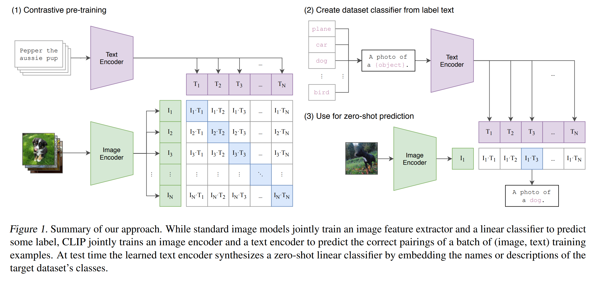

natural language 에서 visual concepts learning 은 어려울 수 있지만, 저자는 training efficiency 이 natural language supervision 의 성공적인 확장에 필수적임을 발견하여, 이 metric 을 final pre-training method 로 선택

- 초기 방식은 VirText 와 유사하게 image CNN 과 text transformer 를 함께 scratch training 하여 image caption 을 예측하는 것
  - 이를 효율적으로 확장하는데 어려움이 있음
  - Fig. 2 처럼 ResNet-50 image encoder 의 2배 계산을 사용하는 63M parameter transformer language model 을 사용하여, ImageNet class 인식에 simpler baseline 인 bag-of-words encodings 보다 3배 느리게 학습

---

- image 에 대한 contrastive representation learning 최신 연구에서 contrastive objectives 가 동일한 predictive objective 들보다 representations 을 더 잘 학습함을 발견
- 다른 연구에선 image generative model 이 high quality image representation 을 학습할 순 있지만 동일한 성능을 내려면 contrastive model 보다 더 많은 계산이 필요함을 발견

이를 고려해, text 의 exact word 를 예측하는 대신, 어느 text 가 어느 image 와 pair 를 이루는지만 예측하는 더욱 쉬운 proxy task 를 해결하는 시스템으로 훈련하는 것을 연구.

Fig. 2 같이 baseline 을 시작으로 contrastive object 로 predictive object 를 바꾸고, ImageNet 으로의 zero-shot trasnfer rate 에서 4x efficiency 향상을 관찰

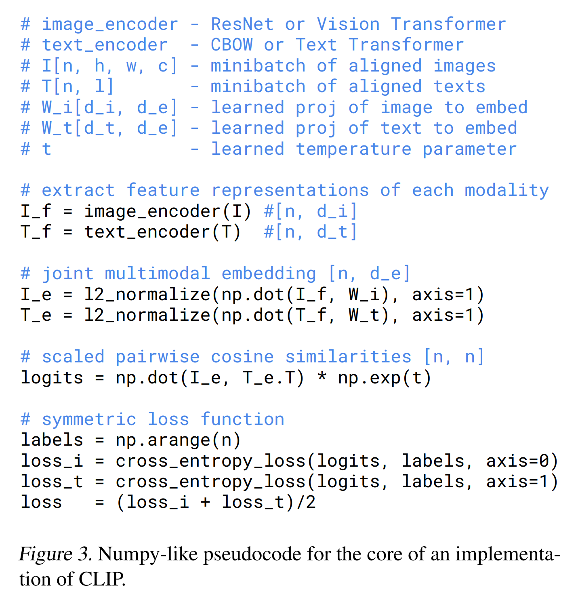

- $N$ (image, text) pair batch 가 주어지면, batch 전역에서 발생한 $N \times N$ possible (image, text) pair 중 어떤 것인지 예측하도록 훈련
- 이를 위해, batch 내의 $N$ real pairs 의 image 및 text embeddings 의 cosine similarity 를 maximizing 하고 $N^2 - N$ incorrect pairs 의 embeddings 의 cosine similarity 는 minimizing 하여 multi-modal embedding space 를 학습
- 이러한 similarity scores 에 대해 symmetric cross entropy loss 를 optimizing
- Fig. 3 은 CLIP 의 핵심 구현의 의사 코드를 포함
- 이러한 batch construction 및 objective 는 _multi-class $N$-pair loss_ 같은 deep metric learning Sohn (2016) 에서 도입
- Oord et al (2018)에 의해 contrastive representation learning 이 인기를 얻었으며, 최근에는 Zhang et al (2020)의 medical imaging domain 에서 contrastive (text, image) representation learning 으로 적용

---

- pre-training dataset 이 매우 커서 overfitting 은 고려사항이 아니며, training 세부 사항은 Zhang et al (2020)의 구현과 비교하여 단순화
- 저자는 image encoder 를 ImageNet weight 로 초기화하거나 text encoder 를 pre-trained weight 로 초기화하지 않고 CLIP 을 scratch training
- representation 과 contrastive embedding space 간의 non-linear projections 을 사용하지 않음
  - 이는 Bachman et al (2019)에 의해 도입되었고 Chen et al (2020b)에 의해 보급
  - 저자는 각 encoder 의 representation 을 multi-modal embedding space 로 mapping 하기 위해 linear projection 만 사용
  - 두 버전 간에 training efficiency 차이를 관찰하지 못했으며 non-linear projection 이 self-supervised representation learning 에서 현재 이미지의 세부 사항과 함께 상호 적응될 수 있음을 추측
- 또한 많은 (image, text) pair 가 CLIP 의 pre-training dataset 에서 single sentence 일 때 $t_v$ 가 샘플링하는 텍스트에서 균일하게 single sentence 를 사용하므로 Zhang et al (2020)의 텍스트 변형 기능을 제거
- 또한 image transformation function $t_v$ 를 단순화
- 조정된 이미지의 random square crop 이 training 중에 사용되는 유일한 data augmentation
- 마지막으로, softmax 의 logits 범위를 제어하는 temperature parameter $\tau$ 는 hyper-parameter 로서 변환되지 않도록 직접 training 중에 optimizing

## 2.4 Choosing and Scaling a Model

image encoder 는 두 architecture 를 고려

1. ResNet-50
   - He et al (2019) 의 ResNetD 개선과 Zhang (2019) 의 antialiased rect-2 blur pooling 으로, 기존 버전을 여러 가지 수정
   - global average pooling layer 를 attention pooling mechanism 으로 대체
   - attention pooling 은 image 의 global average-pooled representation 에 conditioning 되는 query 로 구현
2. Vision Transformer (ViT)
   - 조금 다른 초기화를 사용하여 combined patch 및 position embeddings 이전에 추가적인 layer normalization 을 제외하고 이들의 구현을 따름
   - 

text encoder 는 GPT 같이 수정된 Transformer

- 63M parameter 12-layer 512-wide model with 8 attention heads 사용
- Transformer 는 text 의 byte pair encoding (BPE) representation 에서 작동하며 49,152 vocab size 가짐
- computational efficiency 를 위해 max sequence length 76 으로 제한
- text sequence 는 [SOS] 및 [EOS] token 으로 표시되며, transformer 의 highest layer 의 activation 은 [EOS] token 에서 text representation 으로 취급되며, layer normalizaing 되고, 이후 multi-modal embedding space 로 linear projection
- text encoder 에선 masked self-attention 을 사용하여 pre-trained language model 을 초기화하거나 language modeling 을 auxiliary objective 로 추가할 수 있도록 보존

---

이전 vision 연구에서 model width or depth 만 증가 시키지만, ResNet image encoder 의 경우 Tan & Le (2019) 의 방식 채택

- 이는 model width, depth 및 resolusion 모두에 추가 계산을 할당하는 것이 model dimension 중 하나에만 할당하는 것보다 우수한 것을 발견
- Tan & Le (2019) : EfficientNet 을 위해 각 차원에 할당된 계산 비율을 조정
- 저자는 추가 계산을 model width, depth 및 resolusion 모두 증가시킨 것만 baseline 으로 사용

text encoder 의 경우, text encoder 의 용량에 대한 CLIP 의 성능이 덜 민감한 것을 발견하여 model width 만 증가시키고 depth 는 전혀 증가시키지 않음

## 2.5 Training

5 ResNet 및 3 ViT 훈련

- ResNet 의 경우, ResNet-50, ResNet-101 을 훈련하고 EfficientNet 스타일의 model scaling 을 따르는 3 개의 model 추가 훈련
- 각각 ResNet-50의 약 4x, 16x, 64x 계산 사용
  - 이들 각각 RN50x4, RN50x16, RN50x64 로 표시
- Vision Transformer 의 경우 ViT-B/32, ViT-B/16, ViT-L/14 를 훈련
- 모든 모델을 32 epoch 동안 훈련
- Adam optimizer 를 사용하고 모든 가중치에 대해 적용되는 decoupled weight decay regularization 를 사용하여 learning rate 를 cosine schedule 에 따라 감소
- initial hyper-parameter 는 ResNet50 모델을 1 epoch 동안 훈련할 때 greedy search, random search 및 manual tuning  의 조합을 사용하여 설정
- 계산 제약으로 인해 hyper-parameter 는 이후 더 큰 모델에 대해 휴리스틱하게 조정
- learnable temperature parameter $\tau$ 는 Wu et al, 2018 와 동등한 값인 0.07 로 초기화
- training instability 방지를 위해, logits 100배 이상 확장하지 않도록 clipping
- very large minibatch size 32,768 사용
- Mixed-precision 를 사용하여 training 을 가속화하고 메모리 절약
- 추가 메모리 절약을 위해, gradient checkpointing, half-precision Adam statistics 및 half-precision stochastically rounded text encoder weights 사용
- embedding similarity 계산은 각 GPU 가 local batch 에 필요한 pairwise similarities subset 만을 계산하도록 sharding
- largest ResNet RN50x64 는 592 V100 GPU 에서 18 days training, largest Vision Transformer 는 256 V100 GPU 에서 12 days training
- ViT-L/14 의 경우 성능 향상을 위해, 추가로 336 pixel resolution 에서 한 epoch 동안 pre-training
  - 이 모델을 ViT-L/14@336px 로 표시
- 그 외의 경우 "CLIP" 으로 보고된 모든 결과는 가장 우수한 성능을 보여준 이 모델을 사용

# 3. Experiments

## 3.1 Zero-Shot Transfer

### 3.1.1 Motivation

vision 에서의 zero-shot learning 은 unseen object 에 대한 generalizing 연구를 의미.

저자는 더 넓은 의미로 unseen dataset 으로의 generalizing 연구를 한다.

- Larochelle et al. (2008) 의 zero-data learning 논문에서 추구하는 것처럼 unseen task 수행을 위한 대리로써의 역할
- unsupervised learning 의 많은 연구는 _representation learning_ 능력에 중점을 두지만, 저자는 zero-shot transfer 을 연구함으로써 _task-learning_ 능력을 측정하는 것을 동기부여
- 이 관점에서 dataset 은 specific distribution 의 성능을 평가
  - 하지만 많은 vision dataset 은 image classification 을 지원하기 위해 연구 공동체에 의해 주로 만들어졌음
  - SVHN : Google Street View 사진의 분포에서 street number task 를 측정
  - CIFAR-10 :어떤 "real" task 를 측정하는지는 명확하지 않지만, 추출된 분포는 명확 - TinyImages
- 이런 dataset 에서 zero-shot transfer 은 CLIP 의 distribution shift 및 domain generalization 에 대한 robustness 평가가 task generalization 보다 더 중요

저자는 zero-shot transfer 을 NLP 의 task learning 에 영감을 받음

- language model 로 wikipedia document 를 생성하는 학습을 진행할 때 이름을 다른 언어로 번역하는 능력을 갖추게 되는 "unexpected side-effect" 으로 task learning 을 처음 식별
- GPT-1 은 supervised fine-tuning 개선을 위한 transfer learning 을 집중했지만, 아무런 supervised adaption 없이도 네 가지 heuristic zer-shot transfer methods 의 성능이 지속적으로 향상되는 것을 보여주는 연구를 포함한 실험을 수행
- 이 분석은 task learning 을 전적으로 연구하는 데 초점을 맞춘 GPT-2 의 기초

### 3.1.2 Using CLIP For Zero-Shot Transfer

CLIP 은 dataset 에서 image 와 text snippet 이 함께 연결되어 있는지 예측하도록 pre-training

- zero-shot classification 수행을 위해, 위 능력을 재사용
- 각 dataset 의 모든 class name 을 potential text pair set 으로 사용하고 CLIP 에 따라 most probable (image, text) pair 를 예측 (e.g. "A photo of a {class}.")
  - 먼저 각 image 와 possible texts 의 feature embedding 을 해당 encoder 로 계산
  - 이러한 embedding 의 cosine similarity 는 temperature parameter $\tau$ 로 scaling 되고 softmax 를 통해 probability distribution 으로 normalizing
  - 이 prediction layer 는 L2-normalized inputs, L2-normalized weight, no bias 및 temperature scaling 인 logistic regression  classifier
- 이렇게 해석하면 image encoder 는 image 의 feature representation 을 계산하는 vision backbone 이고, text encoder 는 class 가 나타내는 visual concepts 를 지정하는 text 에 기반한 linear classifier 의 weight 를 생성하는 hypernetwork
- 이 해석을 계속 적용하면 CLIP pre-training 의 모든 단계를 포함하여 무작위로 생성된 proxy 의 성능을 최적화하고 한 예제당 클래스를 포함하고 natural language descriptions 을 통해 정의된 총 32,768 total classes 를 포함하는 vision dataset 에 대한 CLIP 의 성능을 볼 수 있음
- zero-shot 평가는 text-encoder 에 의해 계산된 zero-shot classifier 를 캐싱하고 이를 dataset 의 모든 subsequent predictions 에 재사용합. 이를 통해 생성 비용을 dataset 의 모든 예측에 걸쳐 분할 가능

### 3.1.3 Initial Comparison to Visual N-Grams

Tab. 1 에서 Visual N-Grams 와 CLIP 비교

- best CLIP 은 ImageNet 의 proof concept 의 11.5% to 76.2% 로 accuracy 향상
  - 1.28M crowd-labeled training examples 를 사용하지 않음에도 original ResNet-50 의 성능과 일치
- CLIP 의 top-5 accuracy 는 top-1 accuracy 보다 뚜렷하게 높으며, 95% top-5 accuracy 를 가지며 Inception-V4 와 일치
  - 강력한 fully supervised baselines 을 zero-shot setting 에서 일치시키는 능력은 CLIP 가 유연하고 실용적인 zero-shot vision classifier 로의 중요한 발전임을 시사
- Visual N-Grams 와의 비교는 CLIP 의 contextualizing 하기 위한 것이며, CLIP 와 Visual N-Grams 사이의 직접적인 비교로 해석되어서는 안됨
  - 이 두 시스템 사이의 많은 성능 관련 차이점이 제어되지 않았기 때문
  - 예로, 저자는 10x larger dataset 에서 훈련하고, 예측 당 거의 100x computing 필요로하는 vision model 을 사용했으며, 아도 training computing 량은 Visual N-Grams 의 1000x 이상일 것
  - 그리고 Visual N-Grams 가 발표될 때는 존재하지 않았던 Transformer 기반 모델을 사용
- 가까운 비교로, Visual N-Grams 가 훈련된 YFCC100M dataset 에서 CLIP ResNet-50 을 훈련시키고 이 모델이 보고된 ImageNet 성능과 일치하는 것을 발견
  - 이 기준 성능은 Visual N-Grams 처럼 pre-trained ImageNet weight 로 초기화된 것이 아니라 scratch training
- CLIP 은 다른 2 reported dataset 에서도 Visual N-Grams 를 능가
  - Yahoo 에서 CLIP 는 error number 를 95% 줄이고, SUN 에선 Visual N-Grams 의 accuracy 두 배 이상 늘림
- 더 포괄적인 분석과 스트레스 테스트를 수행을 위해, 30 dataset 을 포함하고, 50 vision systems 와 비교

### 3.1.4 Prompt Engineering And Ensembling

대부분의 standard image classification dataset 은 natural language based zero-shot transfer 을 가능케하는 class name 을 지정하거나 설명하는 정보를 후속처리한다.

- 대부분 image 를 numeric id 만으로 annotation 처리하고 이 id 를 english name 으로 다시 매핑하는 파일 포함
  - Flowers102 와 GTSRB 등은 zero-shot transfer 을 완전히 방지하여 이런 매핑이 없다.
  - 많은 데이터셋에서 이러한 label 은 다소 무작위로 선택되어 zero-shot transfer 과 관련된 문제를 예상하지 않음

---

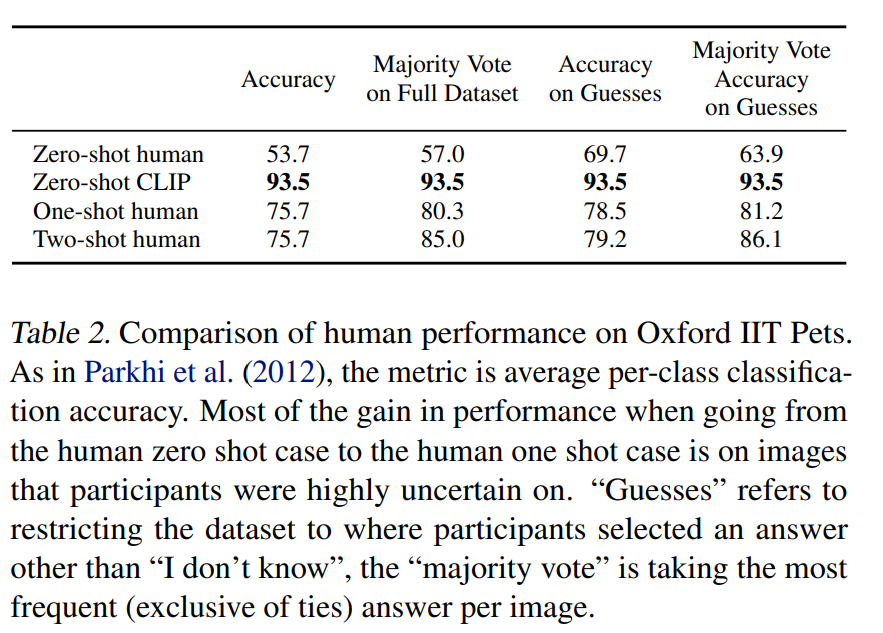

- 일반적인 문제는 다의성 (polysemy) 이다. class name 이 CLIP 의 text encoder 에 제공된 유일한 정보일 때, context 부재로 어떤 단어 의미를 지칭하는지 구분할 수 없음
  - 경우에 따라 동일한 단어의 여러 의미가 동일한 데이터셋의 서로 다른 클래스로 포함될 수 있음
  - 이는 건설 크레인과 비행하는 크레인을 모두 포함하는 ImageNet 에서 발생
  - 다른 예로는 Oxford-IIIT Pet 의 클래스. 문맥에서 명백하게 개종의 품종을 지칭하지만, 문맥이 없는 text encoder 에게는 개종이라는 단어가 그냥 종류의 스포츠 선수일 수도 있음
- 다른 문제는 pre-training dataset 에서 image 와 함께 연결된 text 가 일반적으로 single word 가 아니라는 것
  - 일반적으로, text 는 어떤 방식으로든 이미지를 설명하는 전체 문장. 이 distribution gap 을 줄이기 위해 "A photo of a {label}" 같은 prompt template 를 사용하는 것이 이미지의 내용에 대한 text 임을 명시하는 good default 임을 발견
  - 이렇게 하면 label text 만 사용하는 baseline 보다 ImageNet 의 정확도가 1.3% 향상
- "prompt engineering" 에 대해서는 GPT3 처럼 각 task 에 대한 prompt text 를 사용자 정의하여 zero-shot 성능을 크게 향상시킬 수 있다는 것을 발견
  - image classification dataset 에서 카테고리 지정이 도움이 됨
    - 예로, Oxford-IIIT Pets 에서 "A photo of a {label}, a type of pet." 을 사용하여 context 를 제공하는 것이 잘 작동
    - Food101 에선 음식 유형을 지정하고, FGVC Aircraft 에선 항공기 유형을 지정하는 것이 도움
    - OCR 에선 텍스트나 숫자 주위에 따옴표를 넣는 것이 성능을 향상
    - 마지막으로, 위성 이미지 분류 데이터셋에서 이미지가 이러한 형식의 것임을 명시하는 것이 도움이 되었으며 "a satellite photo of a {label}" 의 변형을 사용
- 또한 성능을 향상시키는 다른 방법으로 여러 zero-shot classifier 를 ensemble 을 시도
  - 이러한 classfier 는 "A photo of a big {label}" 과 "A photo of a small {label}" 같은 다른 context prompt 를 사용하여 계산
  - probability space 가 아닌 embedding space 에서 ensemble 구성
    - 이를 통해 computing cost 를 많은 예측에 걸쳐 분할할 때 앙상블의 계산 비용이 single classifier 사용하는 것과 동일해짐
  - 저자는 many generated zero-shot classifier 를 거친 앙상블을 통해 신뢰할 수 있는 성능 향상을 관찰했으며 대부분의 데이터셋에 대해 이를 사용
    - ImageNet 에선 80 different context prompts 를 사용하여 앙상블을 구성하며, 위 설명인 single default prompt 보다 3.5% 추가 성능 향상
  - 종합적으로, 프롬프트 엔지니어링과 앙상블링은 ImageNet 의 정확도를 거의 5% 향상
  - Fig. 4 에서 프롬프트 엔지니어링과 앙상블링이 컨텍스트 없는 baseline 에 비해 CLIP 모델의 일련의 성능을 어떻게 변화시키는지를 시각화

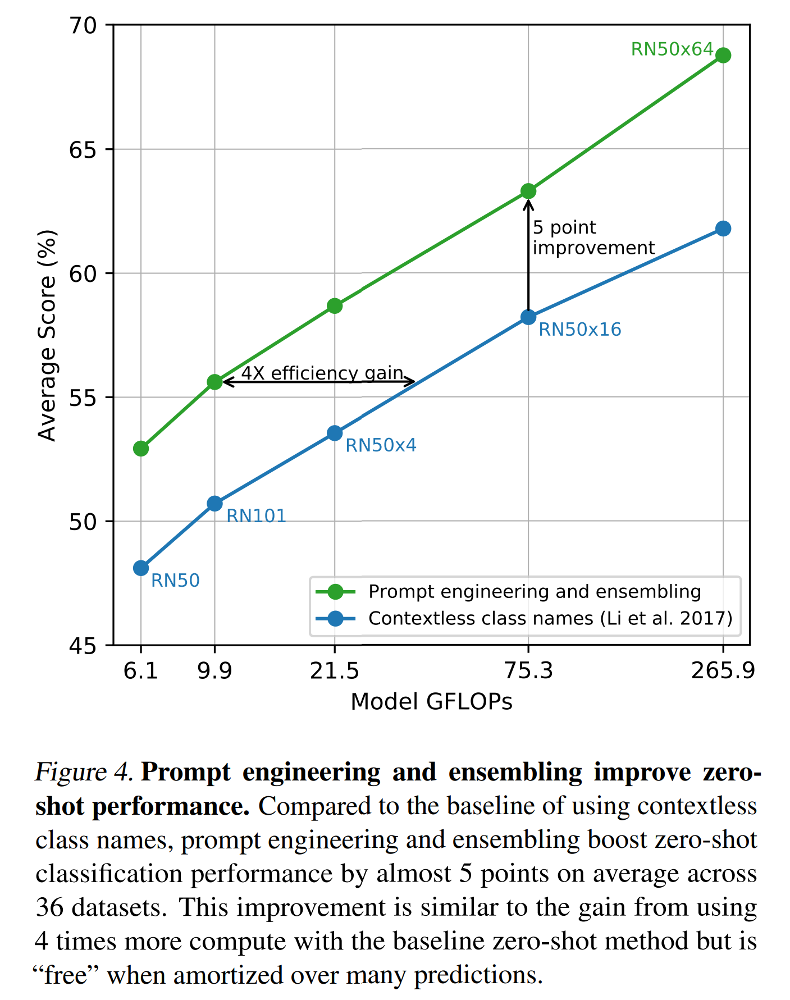

### 3.1.5 Analysis of Zero-Shot CLIP Performance

CLIP zero-shot classifier 의 여러 특성을 연구

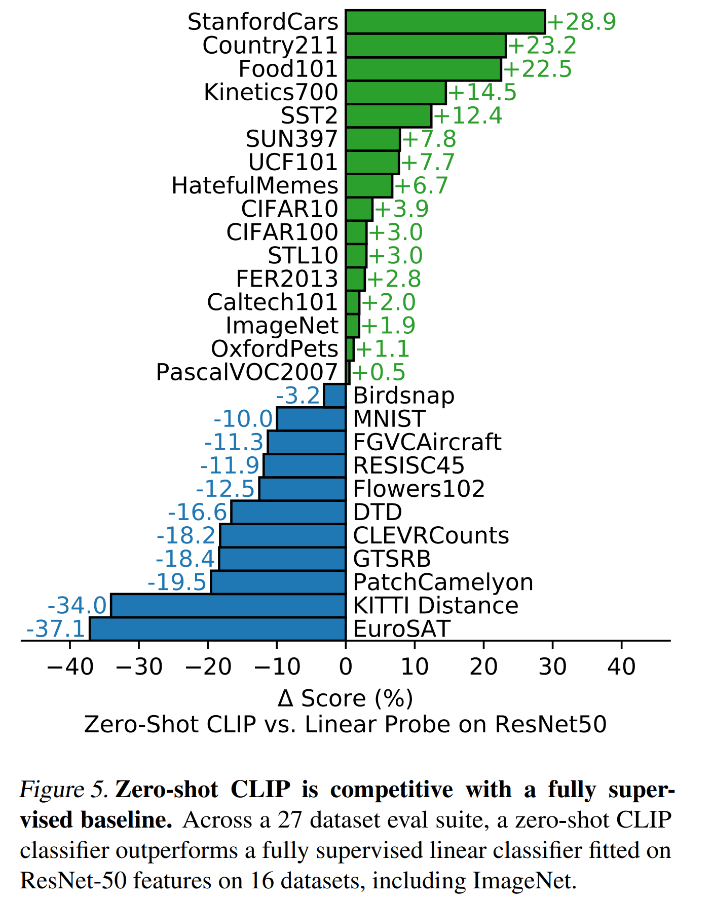

1. zero-shot classifier 의 성능을 살펴봄
   - simple off-the-shelf baseline: ResNet-50 의 feature 에 fitting fully supervised, regularized, logistic regression classifier 에 교차 검증
   - Fig. 5 에서 27 dataset 에서 비교
   - Zero-shot CLIP 이 baseline 보다 더 자주 성능이 우수. 16 dataset 에서 우승
   - individual datasets 를 살펴보면 몇 가지 흥미로운 동작이 관찰
     - fine-grained classification tasks 에서 성능에 큰 차이가 있음을 알 수 있음
     - Stanford Cars 및 Food101 에서 zero-shot CLIP 은 ResNet-50 특성의 logisitc regression 보다 20% 이상 우수한 반면, 다른 2 dataset 인 Flowers102 및 FGVCAircraft 에선 10% 이상 성능이 떨어짐
     - OxfordPets 및 Birdsnap 에선 성능은 훨씬 비슷
     - 이런 차이는 WIT 와 ImageNet 간의 다양한 수준의 task supervision 이 주된 이유로 추측
     - "general" opbject classification dataset 인 ImageNet, CIFAR10/100, STL10 및 PascalVOC2007 의 성능은 모두 비교적 유사하며 모든 경우에서 zero-shot CLIP 에 약간의 이점이 있음
   - STL10 에선 CLIP 은 전체적으로 99.3% 정확도를 달성하여 훈련 예제를 사용하지 않은 SOTA 수준인 것으로 보임
   - zero-shot CLIP 는 비디오에서 행동 인식을 측정하는 2 dataset 에서 ResNet-50 보다 높은 성능을 보임
   - Kinetics700 에서 CLIP 는 ResNet-50 보다 14.5% 우수한 성능, UCF101 에서 ResNet-50 보다 7.7% 우수한 성능
     - 이는 명사 중심의 object supervision 과 비교하여 동사를 포함하는 visual concept 자연어가 넓은 supervision 을 제공하므로 추정
   - zero-shot CLIP 가 뚜렷하게 성능이 떨어지는 영역을 살펴보자
     - zero-shot CLIP 가 위성 이미지 분류 (EuroSAT 및 RESISC45), 림프 결절 종양 감지 (PatchCamelyon), 합성 장면에서 물체 수 계산 (CLEVRCounts), 자율 주행 관련 작업 (GTSRB), 가장 가까운 자동차까지의 거리 인식 (KITTI Distance)과 같이 특화된, 복잡한 또는 추상적인 task 에 상당히 약함
     - 이 결과는 더 복잡한 작업에 대한 zero-shot CLIP 의 능력이 부족함을 강조
     - 대조적으로, non-expert humans 는 몇 가지 작업, 예를 들어 계산, 위성 이미지 분류 및 교통 신호 인식과 같은 작업을 강력하게 수행할 수 있으므로 향후 개선의 많은 여지가 있다는 것을 시사
     - 그러나 우리는 거의 모든 인간 (및 가능성 있는 CLIP)에게 사전 경험이 없는 림프 결절 종양 분류와 같은 어려운 task 에 대한 zero-shot transfer 을 측정하는 것이 의미가 있는지 여부는 명확하지 않음

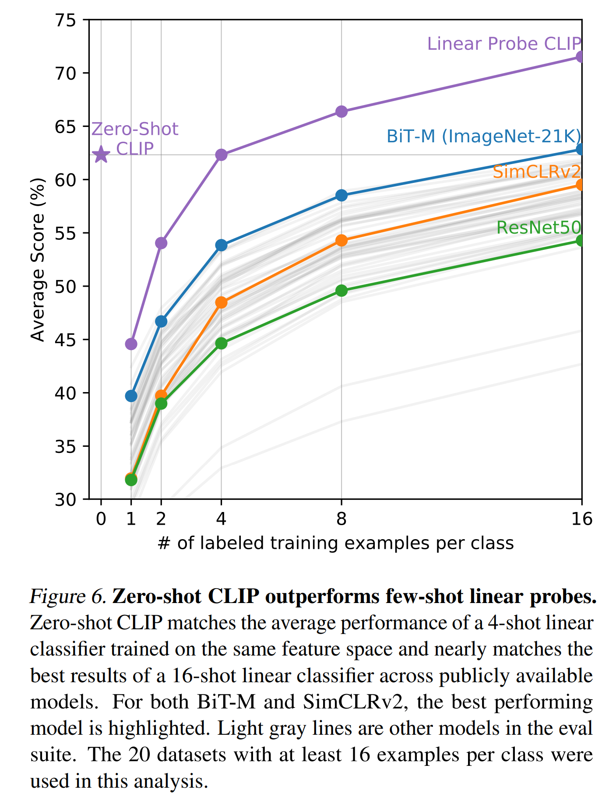

2. 1 에서 zero-shot 을 fully supervised model 과 비교하는 한편, 2 에선 few-shot 비교
   - Fig. 6 에서 zero-shot CLIP 가 best ImageNet model, self-supervised learning 및 CLIP 자체를 포함한 여러 image model 의 feature 에 대한 few-shot logistic regression 과 비교한 결과를 시각화
   - zero-shot 이 1-shot 보다 성능이 떨어질 것으로 직관적으로 기대되지만, 실제로 4-shot logistic regression 성능과 일치
   - 이는 zero-shot 과 few-shot 방식 사이의 주요 차이 때문
     - 먼저, CLIP 의 zero-shot classifier 는 visual concepts 를 직접 지정할 수 있는(““communicated””) natural language 를 통해 생성
     - 반면, "normal" supervised learning 은 training example 에서 visual concepts 를 간접적으로 추론해야 함
     - context-less example-based learning 은 많은 다른 가설이 데이터와 일관될 수 있으며, 특히 1-shot 의 경우는 더 그럼
     - single image 는 종종 많은 다른 visual concept 를 포함
     - capable learner 는 visual cues 와 heuristics 를 활용할 수 있지만, 이미지에서 시연되는 개념이 주요 객체임을 가정하는 등의 보장은 없음
   - 이런 zero-shot 과 few-shot 성능의 차이를 해소하는 잠재적인 방법은 few-shot classifier 의 weights 에 대한 CLIP 의 zero-shot classifier 를 사전 정보로 사용하는 것
     - 직접적인 구현으로는 생성된 가중치에 대한 L2 penalty 를 추가하는 것이지만, 이 regularizer 값이 너무 큰 경우 few-shot classifier 는 zero-shot classifier 가 될 수 있다는 것을 발견
     - 다른 모델의 특성에서 zero-shot CLIP 과 few-shot logistic regression 을 비교할 때, CLIP 는 최고의 성능을 발휘하는 16-shot classifier 와 거의 같은 성능을 보임

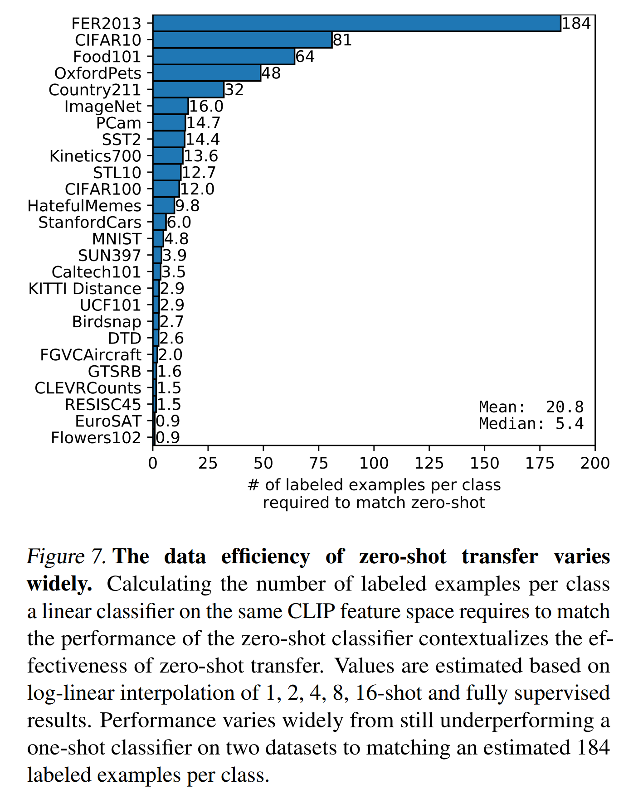

3. 개별 데이터셋에서의 성능도 조사
   - Fig. 7 에서 zero-shot CLIP 성능을 맞추기 위해 동일한 feature space 에서 logistic regression classifier 가 필요로하는 클래스 당 labeled example 수의 추정치를 보여줌
   - zero-shot CLIP 도 linear classifier 이므로, 이런 setting 에서 zero-shot transfer 의 효율성을 추정
     - 수천 개의 linear classifier training 을 피하기 위해 1, 2, 4, 8, 16-shot, 그리고 각 데이터셋에서 훈련된 fully supervised linear classifier 의 성능을 log-linear interpolation 기반으로 추정
     - zero-shot transfer 는 dataset 마다 매우 다양한 효율성을 나타낼 수 있으며, class 당 1 labeled example 부터 184 까지 범위가 있음
       - Flowers102 및 EuroSAT 은 1-shot model 을 보다 뒤쳐짐
       - dataset 절반은 class 당 less 5 example 이 필요하며, 평균은 5.4
       - 그러나 mean estimated data efficiency 는 class 당 평균 20.8 example
       - 이는 supervised classifier 가 많은 labeled example 을 필요로하는 데이터셋의 20% 때문
     - ImageNet 에선 zero-shot CLIP 가 16-shot linear classifier trained on same feature space 와 일치

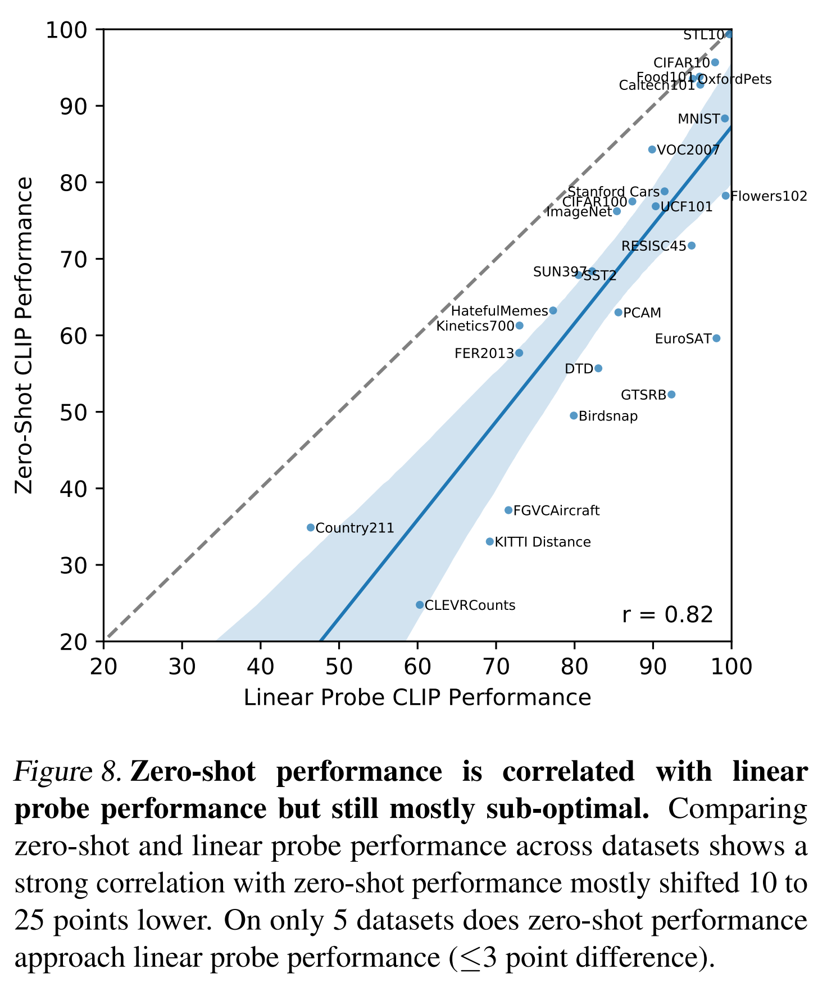

4. evaluate dataset 이 linear classifier parameter 로 잘 추정된다 가정하면, CLIP 의 zero-shot classifier 도 linear classifier 성능으로 setting 하고 있으므로, fully supervised classifier 성능은 zero-shot transfer 이 달성 가능한 상한을 대략 설정한다.
   - 이에 Fig. 8 에서 CLIP 의 zero-shot 성능을 dataset 별로 fully supervised linear classifier 와 비교
   - dosh line $y = x$ 은 "optimial" zero-shot classifier 을 나타냄
   - 대부분의 dataset 에서 zero-shot classifier 의 성능은 여전히 fully supervised classifier 보다 10% ~ 25% 정도 떨어지므로, CLIP 의 task-learning 및 zero-shot transfer 능력을 개선할 여지가 많이 남아 있다는 것을 시사
   - zero-shot 성능과 fully supervised 성능 사이에는 0.82 의 positive correlation 이 있으며 (p-value < $10^{-6}$), 이는 CLIP 가 underlying representation 과 task-learning 을 zero-shot transfer 에 상대적으로 일관되게 연결하는 경향이 있음을 시사
   - 그러나 zero-shot CLIP 은 5 dataset 에서만 fully supervised 성능에 접근: STL10, CIFAR10, Food101, OxfordPets 및 Caltech101
     - 이 dataset 에서 zero-shot accuracy 와 fully supervised accuracy 모두 90% 이상
     - 이는 CLIP 가 underlying representation 이 high quality task 에 대해 zero-shot transfer 이 더 효과적일 수 있다는 것을 시사
     - zero-shot 성능의 증가에 대한 linear regression model 의 slope 을 계산하면, fully supervised 성능을 기준으로 zero-shot 성능이 1.28% 개선
     - 그러나 95th-percentile confidence intervals 는 1 미만의 값도 포함(0.93-1.79)

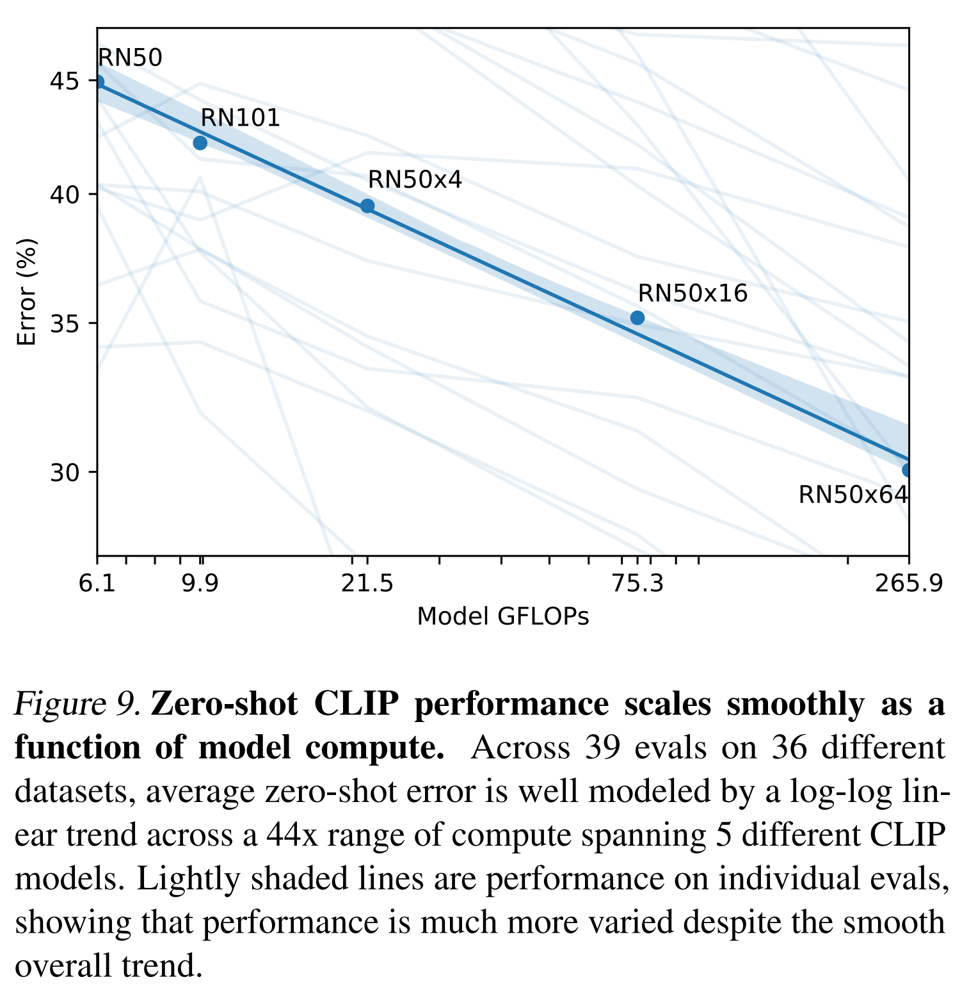

1. 몇 년간 dataset 크기와 양에 대한 성능 예측이 가능. GPT 계열 모델은 지금까지 training computing cost 1000x 증가에 따라 zero-shot 성능이 일관되게 향상
   - Fig. 9 에서 CLIP 의 zero-shot 성능이 비슷한 비율로 증가하는지 확인
   - 39 evaluation 을 걸쳐 36 dataset 에서 5개의 ResNet CLIP 모델의 average error rate 를 plot 하고, CLIP 이 44x 증가하는 model computing 에 대해 비슷한 log-log linear scaling 경향이 유지되는 것을 발견
   - 전반적인 경향은 부드럽지만, 개별 평가의 성능은 훨씬 더 불안정
     - 이는 individual training runs on sub-tasks 간의 high variance 에 의한 것인지 꾸준히 향상되는 경향을 가려주는 것인지 또는 성능이 실제로 일부 task 에서 computing function 으로서 non-monotonic 일 수 있음

## 3.2 Representation Learning

zero-shot 분석을 했지만 representation 능력 연구가 더 일반적이다.

"ideal" representation 이 가져야 할 속성에 대한 의견이 다르며, representation 의 quality 를 평가하는 많은 방법이 존재

- representation 을 linear classification 에 fitting 하고 다양한 dataset 에 성능을 측정하는 것이 일반적인 접근
- 대안으로 모델의 end-to-end fine-tuning 성능을 측정
  - 이는 유연성을 높이며, 이전 연구에서 fine-tuning 이 대부분의 image classification dataset 에서 linear classification 보다 우수한 성능을 보여줌

fine-tuning 의 높은 성능은 실용적이지만, 저자는 linear classifier 기반 평가.

저자는 high-performing task 및 dataset 에 중립적인 pre-trainng 방식에 중점을 둔다.

fine-tuning 은 각 dataset 에 representation 을 적응시켜 일반적이고 견고한 prepresentation 을 학습에 실패할 수 있는 한편, linear classifier 는 유연성이 제한되어 이런 실패를 개발 중에 피드백 가능

- CLIP 의 경우 supervised linear classifier training 이 zero-shot classifier 에 사용된 방법과 매우 유사하기 때문에 광범위한 비교와 분석 가능
- 마지막으로, 많은 task 에 걸쳐 CLIP 를 다양한 baseline model 과 비교하기를 목표
- 27 dataset 에서 66 models 를 연구하는 것은 1782가지 다른 평가를 조율하는 것을 요구
- fine-tuning 의 largeer design 및 hyperparameter 로서 공정한 평가가 어려운 반면, linear classifier 는 최소한의 hyperparameter tuning 만 필요하여 표준화된 구현과 평가가 있음

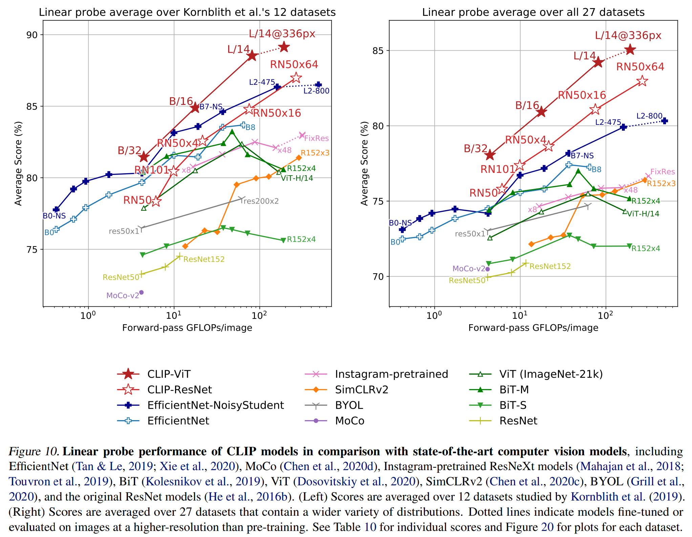

Fig. 10 은 저자의 발견이며, confirmation 또는 reporting bias 의 우려를 최소화하기 위해 12 dataset 에서 성능 연구

- ResNet-50 및 ResNet-101 같은 small CLIP 은 다른 ResNet (BiT-S 및 original) trained on ImageNet-1K 보다 우수한 성능을 발휘하지만, ResNet (BiT-S) trained on ImageNet-21K (BiT-M) 보다는 성능이 낮다
  - 이런 small CLIP 은 유사한 계산 요구 사항을 갖는 EfficientNet family 보다도 성능이 낮다
  - 그러나 CLIP 로 훈련된 모델은 매우 잘 확장되며, 우리가 훈련한 가장 큰 모델 (ResNet-50x64)은 총 점수 및 컴퓨팅 효율성 측면에서 최상의 기존 모델 (Noisy Student EfficientNet-L2)을 약간 능가
  - 또한, CLIP vision transformer 는 CLIP ResNet 보다 약 3배 더 컴퓨팅 효율적이며, 이는 우리의 컴퓨팅 예산 내에서 더 높은 전반적인 성능을 달성
  - best model 은 1 additional epoch 동안 dataset 을 336 pixels fine-tuned ViT-L/14 이다. 
  - 이 모델은 이 evaluation suite 전반에 걸쳐 기존 모델의 평균적인 성능을 2.6% 향상
- Fig. 21 에서 품질적으로 보면, CLIP 은 이전에 random initialization 에서 end-to-end trained single vision model 에서 보여진 것보다 더 넓은 task set 을 학습
  - 이런 task 에는 지리적 위치, 광학 문자 인식, 얼굴 감정 인식, 동작 인식이 포함
    - 이는 Kornblith et al. (2019)의 연구가 ImageNet 과 겹치는 task 으로 편향되었다고 주장하여, 이를 해결하기 위해 우리는 더 넓은 27 dataset evaluation suite 에서 성능 측정
  - 넓은 evaluation suite 에서 CLIP 의 장점이 더욱 명확
    - 규모에 관계없이 모든 CLIP 은 컴퓨팅 효율성 측면에서 모든 평가를 능가
    - best model 의 평균 점수 향상은 이전 시스템보다 2.6% 에서 5% 로 증가
    - 또한, self-supervised system 이 저자의 evaluation suite 에서 뚜렷하게 더 잘 수행
      - 예를 들어, Kornblith et al. (2019)의 12 dataset 에서 여전히 SimCLRv2 가 평균적으로 BiT-M 보다 성능이 낮지만, SimCLRv2 는 저자의 27 dataset evaluation suite 에서 BiT-M 을 능가
      - 이러한 결과는 "general" 성능을 더 잘 이해하기 위해 task 다양성과 범위를 계속 확대하는 것이 유용할 것으로 보임
      - 저자는 VTAB 와 유사한 추가적인 평가 노력이 가치 있다고 의심

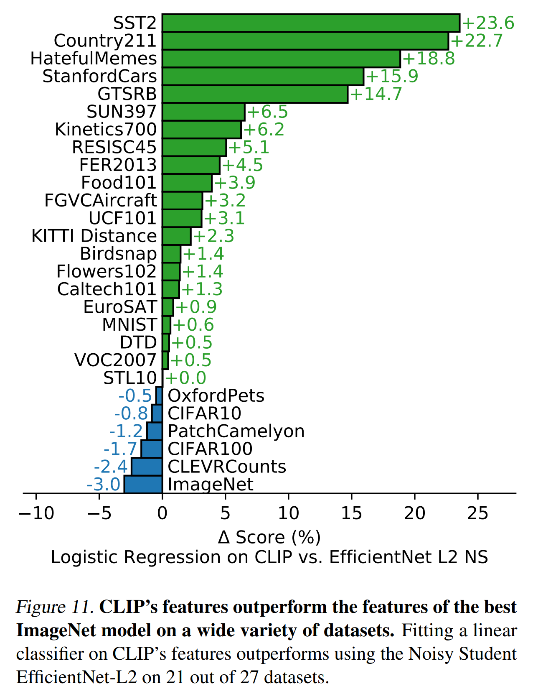

Fig. 11 에서 27 dataset evaluation suite 에서의 CLIP 과 best model 간의 차이 시각화

- CLIP 은 27 dataset 중 21 에서 Noisy Student EfficientNet-L2 를 능가
- CLIP 은 OCR(SST2 및 HatefulMemes), 지리적 위치 및 장면 인식(Country211, SUN397) 및 비디오에서의 활동 인식(Kinetics700 및 UCF101)과 같은 task 에서 가장 크게 성능을 개선
- 또한, CLIP 은 Stanford Cars 및 GTSRB 에서 세밀한 자동차 및 교통 표지판 인식에서 훨씬 더 잘 수행
  - 이는 ImageNet 에서 narrow supervision 문제일 수 있음
- GTSRB 에서의 14.7% 향상과 같은 결과는 모든 교통 및 도로 표지판에 대해 single label 만 있는 ImageNet-1K 의 문제를 나타낼 수 있음
  - 이는 supervised representation 이 class 내 세부 사항을 축소하고 fine-grained downstream task 에서 정확도를 저해할 수 있음
- 언급했듯, CLIP 은 여전히 몇몇 dataset 에서 EfficientNet 보다 성능이 낮음
- 놀랍게도, EfficientNet 이 CLIP 에 비해 가장 잘 수행하는 dataset 은 훈련된 데이터셋인 ImageNet
- EfficientNet 은 CIFAR10 및 CIFAR100 과 같은 낮은 해상도 데이터셋에서도 CLIP 보다 약간 더 잘 수행
  - 이는 CLIP 에 규모별 데이터 증강이 부족한 것이 일부 원인일 것
- EfficientNet 은 PatchCamelyon 및 CLEVRCounts 에서도 약간 더 잘 수행하는데, 이는 두 접근 방식 모두에서 전반적인 성능이 여전히 낮기 때문

## 3.3 Robustness to Natural Distribution Shift

2015년, ImageNet 에서 인간을 능가하지만, 여전히 단순한 실수를 한다. 이러한 불일치에 대한 여러 아이디어가 제안되고 있다.

공통 주제는 딥 러닝이 training dataset 에 유지되는 correlation 및 pattern 발견에 뛰어나며, in-distribution 성능을 향상시킨다. 그러나 이러한 correlation 과 pattern 중 많은 것들이 실제로 의미 없으며, 다른 distribution 에서 유지되지 않아 다른 dataset 에서 성능이 크게 저하된다.

이런 연구는 ImageNet 에서 한정적으로 평가했다. 이는 일반화 실수가 있을 수 있으며, 이런 실패가 딥러닝과 ImageNet 의 결합이 어느 정도일까? very large dataset 에서의 natural language supervision 을 통해 훈련되고 high zero-shot 성능을 발휘할 수 있는 CLIP 모델은 이러한 정도를 조사한다.

Taori et al. (2020) 는 ImageNet model 의 이런 행동을 양적으로 이해하기 위해 나아가는 포괄적인 연구이며 성능이 _natural distribution shifts_ 를 평가할 때 어떻게 변하는지 연구

- 그들은 7 distribution shifts set 성능을 측정 : ImageNetV2, ImageNet Sketch, Youtube-BB 및 ImageNet-Vid, ObjectNet, ImageNet Adversarial 및 ImageNet Rendition
- dataset 을 새로운 image 로 구성하여 다양한 소스에서 수집
- ImageNet-C, Stylized ImageNet 또는 존재하는 이미지를 다양한 방법으로 왜곡하여 만든 adversarial attacks 과 같은 synthetic distribution shifts
- 이를 제안한 이유 중 하나는 여러 기법이 synthetic distribution shifts 성능을 향상시키는 것이 증명되었지만, 이러한 기법들이 natural distribution 에서 일관된 개선을 가져오지 못하는 경우가 많다고 발견하기 때문

---

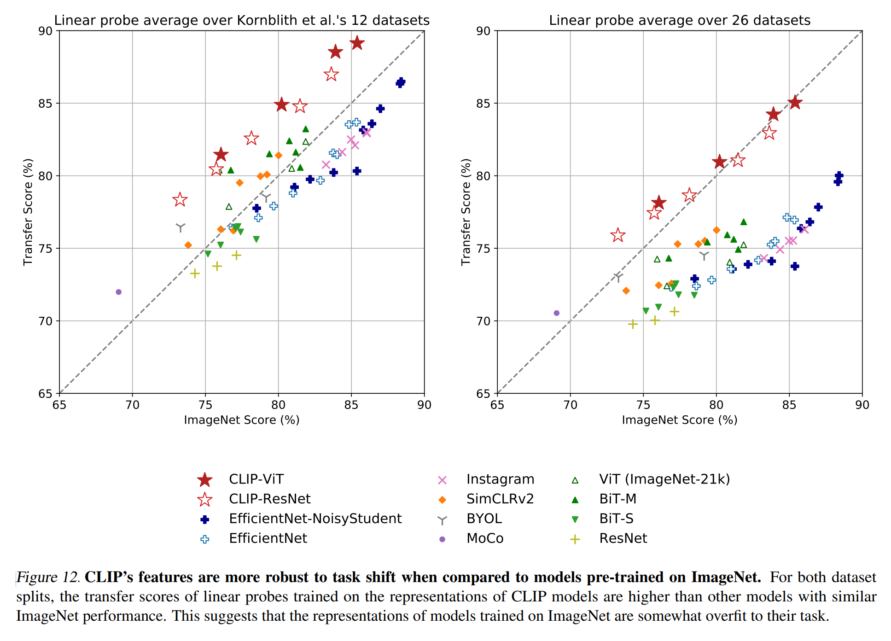

수집된 데이터셋 전역에서, ImageNet model 의 정확도는 ImageNet validation set 에 기대치 이하로 떨어진다. 

- all 7 natural distribution shift datasets 의 평균 정확도와 ImageNet class subset 에서의 평균 정확도를 보고하며, 특별히 명시되지 않은 경우에는 ImageNet 과 관련된 class subset 을 사용
- 또한 Youtube-BB 및 ImageNet-Vid 의 경우 두 가지 다른 평가 설정이 있으므로 pm-0 및 pm-10 정확도의 평균을 사용
- ResNet-101 은 이러한 natural distribution shift 에서 평가될 때 ImageNet validation set 과 비교하여 5배 많은 실수를 저지른다.
- 그러나 Taori et al. (2020)는 distribution shift 하에서의 정확도가 ImageNet 정확도와 예측 가능하게 증가하고, logit-transformed 정확도의 로그에 대한 linear function 으로 잘 모델링됨을 발견
- Taori et al. (2020)는 이 결과를 사용하여 견고성 분석이 effective 및 relative robustness 를 구별해야 한다고 제안
  - 효과적인 견고성은 distribution shift 하에서의 정확도가 in-distribution 과 out-of-distribution 정확도 사이의 문서화된 관계를 예측하는 것보다 개선되는 정도를 측정
  - relative robustness 는 out-of-distribution 정확도의 개선을 포착
  - Taori et al. (2020)는 견고성 기법이 _effective_ 및 _relative_ robustness 를 모두 향상시키도록 목표로 해야 한다고 주장

---

Taori et al. (2020)에서 연구된 거의 모든 모델은 ImageNet 에서 training 되거나 fine-tuning 한다.

ImageNet dataset distribution 에 대한 training 또는 adapting 이 observsed robustness gap 원인일까?

직관적으로, zero-shot model 은 해당 distribution 에서만 유지되는 특정 correlation 이나 pattern 을 활용할 수 없어야 한다. 따라서 zero-shot model 이 higher effective robustness 을 가지고 있을 것으로 기대하는 것은 합리적이다. 

Fig. 13 에서 natural distribution shift 에서 zero-shot CLIP 의 성능을 기존 ImageNet 모델과 비교

- 모든 zero-shot CLIP 은 effective robustness 를 크게 향상시키고, ImageNet 정확도와 distribution shift 하에서의 정확도 간의 격차를 최대 75% 까지 줄임
- 이런 결과는 zero-shot model 이 훨씬 더 견고할 수 있지만, supervised learning on ImageNet 이 robustness gap 을 일으키는 것은 아님을 반드시 의미하지는 않는다
- CLIP 의 다른 세부 사항, 예로 large 및 diverse pre-training dataset 또는 natural language supervision 사용은 image feature 를 훨씬 더 견고하게 만들 수 있다
- zero-shot 또는 fine-tuning 에 관계없이, 이를 좁히기 위한 초기 실험으로, ImageNet distribution 에 적응하기 위해 CLIP 모델의 feature 에 L2 regularized logistic regression classifier 를 adapting 후 CLIP 의 성능이 어떻게 변하는지 측정

우리는 Fig. 14 에서 zero-shot classifier 에서의 성능 변화를 시각화

- CLIP 을 ImageNet distribution 에 adapting 하려면 전반적으로 ImageNet 정확도가 9.2% 증가하여 85.4% 로, 이는 Mahajan et al. (2018)의 2018년 SOTA 와 정확도가 동일. 그러나 distribution shift 하에서의 평균 정확도는 약간 감소
- ImageNet dataset 에서 정확도가 9.2% 증가하는 것은 distribution shift 하에서의 성능에는 거의나 전혀 영향을 주지 않으면서도 의미적으로 중요
  - 이러한 이득은 주로 "exploiting spurious correlations" 에서 오는 것일가? 이 행동이 CLIP, ImageNet 및 distribution shifts studied 또는 general phenomena 인지, 그리고 linear classifier 같은 end-to-end fine-tuning 같은 경우도 마찬가지인지 알 수 없음
- 또한 flexible zero-shot natural-language-based image classifiers 로 가능한 또 다른 robustness 개입을 조사
  - 7 transfer dataset 간의 target class 가 항상 ImageNet 의 것과 완벽하게 일치하지는 않음
  - Youtube-BB 와 ImageNet-Vid 두 dataset 은 ImageNet 의 super-class 로 구성
  - ImageNet model 의 fixed 1000-way classifier 를 사용하여 예측하려고 할 때 문제가 발생
  - Taori et al. (2020)은 ImageNet class 계층 구조에 따라 모든 sub-classes 에 대해 예측을 최대화함으로써 이를 처리. 때로는 이 매핑이 완벽 이하일 수 있음
    - Youtube-BB 의 person 의 경우, 예측은 야구 선수, 신부, 스쿠버 다이버의 ImageNet class 를 pooling 하는 것
  - CLIP 을 사용하면 각 dataset 에 대한 class name 을 기반으로 custom zero-shot classifier 를 직접 생성 가능
- Fig. 14 에선 이것이 평균 effective robustness 를 5% 향상시키지만 큰 개선이 몇몇 dataset 에만 집중되어 있음을 볼 수 있음
  - 흥미롭게도, ObjectNet의 정확도도 2.3% 증가
  - 이 dataset 은 ImageNet class 와 근접하게 겹치도록 설계되었지만, ObjectNet 의 각 class name 을 사용하는 것은 필요한 경우 ImageNet class name 을 사용하고 예측을 pooling 하는 것보다 약간 도움이 됨

zero-shot CLIP 은 effective robustness 를 향상시키지만, Fig. 14 처럼 이 혜택은 fully supervised setting 에선 거의 사라진다. zero-shot 에서 fully supervised 까지의 연속에서 effective robustness 가 어떻게 변하는지 조사.

Fig. 15 에서 best CLIP 의 feature 에 대한 zero-shot, 1-shot, 2-shot, 4-shot, ..., 128-shot 및 fully supervised logistic regression classifier 의 성능을 시각화

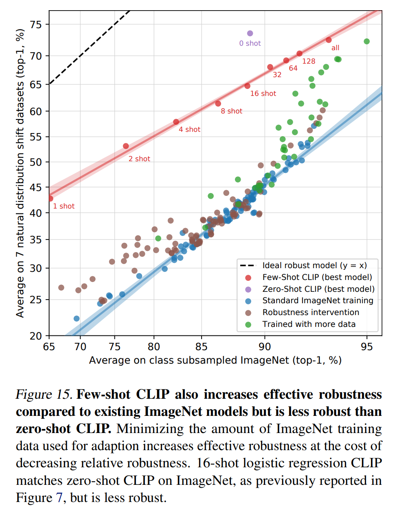

- 적은 양의 데이터로 학습된 모델도 baseline model 보다 higher effective robustness 를 보이지만, 이 혜택은 in-distribution 성능이 더 많은 training data 와 함께 증가함에 따라 사라지고 대부분의 경우에는 완전히 없어진다

이러한 결과를 종합하면, large-scale task 및 dataset agnostic pre-training 과 broad evaluation suites 에 대한 zero-shot 및 few-shot 벤치마킹으로의 reorientation towards 가 더 견고한 시스템의 개발을 촉진하고 성능을 보다 정확하게 평가한다. 

# 4. Comparison to Human Performance

CLIP 과 인간 성능 및 인간 학습 비교를 위해 CLIP 의 evaluation setting 과 유사하게 인간들 평가

- 이는 인간이 얼마나 강력한 zero-shot 성능을 보이는지, 성능이 한 두개의 image sample 을 보여줄 때 얼마나 향상되는지 알아보고자 함
- 이를 통해 인간과 CLIP 간의 task 난이도를 비교하고, 이들간의 correlation 과 difference 파악

 Oxford IIT Pets dataset 의 test set 3669 images 를 각각 5명에게 제공하고 비슷한 37 cat 및 dog 를 선택하도록 함.

- zero-shot 상황에서 인간은 각 품종 예시를 받지 않은채 이미지를 라벨링하도록 요청.
- 1-shot 에서는 각 품종의 한장 샘플 이미지를 받고, 2-shot 에서는 두 장의 샘플 이미지를 받음

- 인간은 class 당 1 training example 의 평균 성능이 54% to 76% 로 향상
  - 추가 훈련 예제에 대한 한계적인 이득은 거의 없음
- zero-shot to 1-shot 의 과정에서 인간은 불확실한 이미지에 대한 정확도가 향상
- 하나의 예제를 통해 불확실한 이미지에 대한 확률을 업데이트가 가능함을 시사
- 이를 고려해, CLIP 은 zero-shot 성능을 위한 유망한 training 전략이지만, few-shot 과 차이가 크다는 것을 알 수 있음

이 결과는 아직 기계과 인간의 샘플 효율성 간의 격차를 줄이기 위한 알고리즘 개선이 여전히 필요하다는 것을 시사

- few-shot 평가에서 CLIP 은 사전 지식을 효과적으로 활용하지 않으며, 인간은 그렇기 때문에 우리는 사전 지식을 효과적으로 퓨샷 학습에 통합하는 방법을 찾는 것이 CLIP의 알고리즘 개선에 중요한 단계라고 추측
- 우리의 지식에 따르면, 고품질 사전 훈련 모델의 특성 위에 linear classifier 사용이 few-shot learning 에 대한 거의 최신 기술 수준
  - 이는 최고의 few-shot learning 방법과 인간의 few-shot learning 사이에 격차가 있다는 것을 시사
- 만약 인간 정확도 대 CLIP 의 zero-shot 정확도를 그래프로 그려보면 (Fig. 16), CLIP 에 대한 가장 어려운 문제가 인간에게도 어려운 것임을 확인. 
  - 오차가 일관되는 한, 저자의 가설은 dataset noisy (잘못 라벨링된 이미지 포함) 및 인간과 모델 모두에게 난제인 분포 밖 이미지 때문일 것이라고 생각

# 5. Data Overlap Analysis

pre-training on large internet dataset 의 우려 사항은 downstream evals 와 의도하지 않은 overlap 이다.

- 최악의 경우, evaluation dataset 의 complete copy 가 pre-training dataset 으로 유출되어 일반화의 의미 있는 테스트로서의 평가를 무효화할 수 있기 때문에 조사하는 것이 중요
- 이를 방지하기 위한 한 가지 옵션은 모델을 훈련하기 전에 모든 중복을 식별하고 제거하는 것
  - 이는 진정한 hold-out 성능을 보고하기는 보장하지만, 모델이 사전에 평가될 수 있는 모든 가능한 데이터를 미리 알아야 한다는 것을 요구
  - 이것은 벤치마킹과 분석의 범위를 제한하는 단점 존재
  - 새로운 평가를 추가하기 위해서는 비용이 많이 드는 re-training 이 필요하거나 중첩으로 인한 미정량적 이점을 보고할 위험이 있다

대신, 저자는 중첩이 얼마나 발생하는지와 이러한 중첩으로 인해 성능이 어떻게 변하는지 문서화. 이를 위해 다음 절차를 사용한다.

1. 각 evaluation dataset 에 대해, 그 예제에 대한 duplicate detector 실행.
   - 이후 수동으로 찾은 nearest neighbors 를 검사하고 높은 정밀도를 유지하면서 재현율을 극대화하기 위한 dataset 당 threshold 설정
   - 이 임계값을 사용하여 Overlap과 Clean 두 개의 새로운 subset 생성
   - Overlap 에는 임계값 이상의 유사성을 가진 모든 예제가 포함되고, Clean 에는 이 임계값 이하의 모든 예제가 포함
   - 변경되지 않은 전체 데이터셋은 All로 표기
   - 이를 통해 데이터 오염 정도를 모든 예제 중 Overlap 의 수와 All 의 크기의 비율로 기록
2. 이후 CLIP RN50x64 의 zero-shot 정확도를 계산하고 세 분할에 대한 All - Clean 을 주요 지표로 보고
   - 이는 오염으로 인한 정확도 변화
   - 이 값이 양수이면 overlapping data 로 인해 전체적으로 보고된 정확도가 얼마나 over-fitting 되었는지에 대한 추정값
3. overlap 량은 종종 작기 때문에 Overlap 하위 집합의 일평균 (더 큰) p-value 을 계산하고 일변량 유의성 검정을 실행
   - 또한 99.5% 의 Clopper-Pearson confidenec intervals 를 Dirty 에 대해 계산하여 또 다른 확인을 진행

이 분석의 요약은 Fig. 17 에 제시.

- 35 dataset 중 9 dataset 에는 중복디 감지되지 않음
  - 일부는 합성 또는 전문화된 dataset 이라 인터넷에 게시될 가능성 적음 (e.g. MNIST, CLEVR 및 GTSRB)
  - 또는 저자의 dataset 에는 생성된 후 만들어진 novel data 를 포함하여 중복이 없음을 보장 (ObjectNet 및 Hateful Memes)
- 이는 저자의 detector 가 low-false positive rate 를 가짐을 보여줌
  - false positive 는 분석에서 오염 효과를 under-estimate 할 수 있어서 중요함
- median overlap 2.2%, average oberlap 3.2%
  - 소량의 중복이 전체적인 정확도가 0.1% 이상으로 변경되는 경우는 드물다.
  - 이 중 임계값을 초과하는 7 dataset 만 있다.
  - 이 중 2개만 보정된 Bonferroni 수정 후에 통계적으로 유의함
  - 최대 감지된 개선은 overlap rate 가 12.1% 인 Birdsnap 에서 0.6% 만큼이다.
  - largest overlap 은 21.5% 인 Country211 에서 발생
    - 이는 저자의 pre-training dataset 이 filtered sub-set 을 포함하고 있는 YFCC100M 에서 구성되었기 때문
    - 그러나 이러한 큰 중복에도 불구하고 Country211 의 정확도는 0.2% 만 증가
    - 이는 중복되는 예제의 training text 가 downstream eval measure 가 specific task 와 관련이 없는 경우가 많기 때문일 수 있음
  - Country211 은 지리적 위치 파악 능력을 측정하지만, 이러한 중복에 대한 training text 를 검사하면 이미지의 위치를 언급하지 않는 것으로 나타남

---

저자의 분석엔 two potential concerns 를 인식.

1. detector 는 완벽하지 않음
   - detector 는 proxy training task 에 거의 100% 정확도를 달성하고, 수동 검사 및 threshold tuning 을 통해 발견된 nearest-neighbors 사이에 높은 정밀도와 재현율을 가짐
   - 하지만 400M examples 를 통한 재현율을 추적적으로 확인은 불가능
2. Overlap 과 Clean subset 간의 data distribution 이 변할 수 있다는 점
   - Kinetics-700 에서 많은 "overlap" 이 실제로 모두 black transition frames
     - 이것이 Kinetics-700 이 Overlap 에서 20% 의 정확도 하락을 보이는 이유
       - 보다 subtle distribution shifts 가 있을 수 있다고 의심
     - CIFAR-100 의 경우, 해상도가 매우 낮기 때문에 많은 중복이 새의 새나 비행기와 같은 작은 객체의 false positives 로 나타남
     - 정확도의 변화는 overlap class distribution 이나 difficulty 변화 때문일 수 있음
     - 불행히도, 이런 distribution 및 difficulty 변화는 over-fitting 효과를 가리기도 함

그러나 위 결과는 large scale pre-training 에 관한 이전 연구에서의 유사한 duplicate analysis 결과를 따른다.

Mahajan et al. (2018) 및 Kolesnikov et al. (2019)는 유사한 overlap rate 를 검출하고 전반적인 성능에는 최소한의 변화만 있었다. 중요한 점은 Kolesnikov et al. (2019)가 논문 introduction 에서 논의한 alternative de-duplication 전략과 우리가 결정한 접근 방식 사이의 차이가 거의 없었다는 것

# 6. Limitations

CLIP 에는 많은 제한 존재.

- training splits 을 포함한 dataset 의 경우, zero-shot CLIP 성능은 평균적으로 ResNet-50 features 의 top 에 linear classifier 의 simple supervised baseline 과 경쟁력 있음
  - 이런 dataset 대부분에서, 이 baseline 의 성능은 전반적인 SOTA 보다 훨씬 낮음
  - CLIP 의 task learning 및 transfer 능력 개선을 위해 많은 연구가 필요
  - scaling 은 성능을 꾸준히 향상시키며, 계속해서 개선할 수 있는 경로임을 제시
  - 하지만 zero-shot CLIP 이 SOTA 달성을 위해선 computing 량을 1000x  증가해야 한다고 추정
- CLIP zero-shot 성능은 여러 task 에선 여전히 약함
  - task-specific model 과 비교하여, 자동차 모델, 꽃 종류 및 항공기 등 세부 분류 유형에서 약함
  - 또한 이미지 객체 수를 세는 것 같은 추상적이고 체계적인 task 도 어려움
  - CLIP 의 pre-training dataset 에 포함되지 않은, 생략된 novel task 에 대해선 CLIP 의 성능이 거의 무작위에 가까움
- zero-shot CLIP 은 많은 natural image distribution 에 generalizing 하지만, out-of-distribution 에는 여전히 generalizing 하지 못함
  - 이는 OCR task 에서 명확히 나타남
  - CLIP 은 MNIST 손글씨 숫자에선 88% 정확도만 달성
  - raw pixel 에 대한 logistic regression 의 simple baseline 이 zero-shot CLIP 보다 뛰어남
  - 의미론적 및 near-duplicate nearest-neighbor retrival 결과, MNIST 는 pre-training dataset 에 없음을 확인했으며, 이는 CLIP 이 취약한 일반화 해결에는 거의 기여하지 않음을 시사
  - 대신 이를 우회하려고 하면, large scale 이고 diverse dataset 으로 훈련하여 effectively in-distribution 으로 포함될 것으로 기대
- 넓고 다양한 task 및 dataset 에 flexible zero-shot classifier 를 생성할 수 있지만, 주어진 zero-shot classifier 의 concept 중에서만 선택 가능
  - novel output 을 생성하는 image captioning 같은 flexible approach 와 비교하면 상당히 제한적
  - image caption baseline 의 계산 효율성은 CLIP 보다 훨씬 낮음. 이는 CLIP 의 효율성을 결합한 접근 방식을 시도할 가치가 있음. 대안으로 inference 시 natural language explanations 의 많은 retrieval 수행을 할 수 있음
- deep learning 의 data efficiency 해결하지 않음
  - 대신, 400M training examples 로 확장할 수 있는 supervision 을 사용하여 보상
  - training 중에 본 image 가 초당 하나씩 제시되면, 32 epochs 동안 12.8B 의 image 를 반복하는데 405년 걸릴 것
  - CLIP 을 self-supervision 및 self-training 과 결합하는 것은 standard supervision learning 보다 data efficiency 를 향상시킬 수 있는 능력을 보여주어 유망하다
- 저자의 초점은 zero-shot transfer 임에도 불구하고, 반복적인 CLIP 개발 안내를 위해 full validation set 성능을 쿼리
  - validation set 에는 수천개 예제가 있어, 실제로는 zero-shot 에는 현실적이지 않음
- 잠재적인 문제는 validation set 선택
  - 12 dataset set 에 대한 결과를 보고하며, 무작위의 27 dataset set 을 사용
  - 이 set 은 명백히 CLIP 개발 및 기능과 함께 적응된 것으로, 광범위한 zero-shot 평가를 위해 명시적으로 설계된 작업의 새로운 벤치마크를 만드는 것이 이러한 문제를 해결하는 데 도움이 될 것
- CLIP 은 인터넷에서 image 와 text 를 결합하여 훈련
  - 이러한 image-text 쌍은 필터링되지 않고 선별되지 않았으며, CLIP 이 많은 사회적 편향을 학습하게 된다.
  - image caption model 에 대해 이전에 증명
- 이 연구에서 image classification 을 natural language 를 통해 명시하는 것이 유연하고 일반적인 인터페이스임을 강조했지만, 이것에는 제한 사항 존재
  - 많은 complex task 와 visual concepts 는 text 만으로 지정하기가 어려울 수 있음
  - 실제 training examples 는 명백하게 유용하지만, CLIP 는 few-shot 성능을 직접 최적화하지는 않음
- 저자의 연구에선 CLIP 의 feature top 에 linear classifier 를 맞추게 됨
  - 이는 zero-shot setting 에서 few-shot setting 으로 전환할 때 성능이 반대로 감소하는 이상한 현상을 초래
  - 이는 인간의 성능과는 크게 다르다
    - 인간의 성능은 zero-shot setting 에서 1-shot setting 으로 전환함으로써 크게 증가

# 7. Broader Impacts

CLIP 의 성능과 목적에 대한 평가가 필요하며, 이를 위한 더 넓은 영향을 분석

또한 CLIP 은 추가 re-training 없이 자신만의 classifier 를 만들 수 있는 능력 소개

- 이 능력은 GPT-3 와 유사한 large-scale generative models 의 특성을 복합하며, 이러한 모델은 비교적 non-trivial zero-shot(또는 few-shot) generalization 능력을 보여서 다양한 능력을 가질 수 있다.
- 저자의 zero-shot setting 에서의 CLIP 연구는 image retrieval or search 같은 widely-applicable tasks 에 대한 유망성을 보여줌
- 이전 30 dataset 에 추가하여 FairFace 에서 평가하고 bias probes 실시
- 이후, downstream task surveillance 에서 비교 분석
- 또한 model 의 social biases 를 특성화하기 위해 노력
  - bias test 는 다양한 시나리오에서의 반응을 조사하는 초기 노력이며, 범위는 한정

## 7.1 Bias

Buolamwini & Gebru (2018) 및 Karkkainen & Joo (2019)에서 제시된 bias probes 에 영감을 받아 CLIP 의 일부 bias 를 예비적으로 분석하고, Solaiman et al. (2019)가 실시한 것과 유사한 specific bias examples 를 찾기 위한 탐색적 bias search 수행

FairFace dataset 에서 zero-shot CLIP 의 성능을 분석하여 initial bias probes 로 시작하고, class design 을 포함한 additional biases 및 biases sources 를 더 탐구

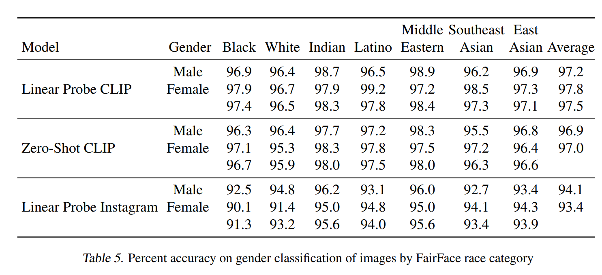

- FairFace dataset 에서 두 버전의 CLIP 평가
  - zero-shot CLIP (ZS CLIP) 과 CLIP featre 의 top 을 FairFace 에 fitting 한 logistic regression classifier (LR CLIP)
    - LR CLIP 이 classification test 에서 ResNext-101 32x48d Instagram (Linear Probe Instagram) 및 FairFace 자체 모델보다 높은 정확도 달성
    - ZS CLIP 성능은 카테고리별로 다르며 일부 카테고리에 대해 FairFace 보다 성능이 나빠지고 다른 카테고리는 나은 결과를 보임 (Tab. 3, Tab. 4)
  - 또한 intersectional race 및 gener 를 기준으로 LR 및 ZS CLIP 테스트
    - 모든 race 에 대해 gender 성능이 95% 이상임을 발견 (Tab. 5)
- LR CLIP 이 gener, race 및 age 에 따른 classification 의 정확도가 Linear Probe Instagram 보다 높은 성능을 달성했지만, bias 에 대한 정확도는 real world 에서의 공정성에 대한 의미있는 척도로서는 종종 실패
  - sub-groups 에서 성능 차이가 낮고 정확도가 높아진다 해도, 이는 bias 가 낮아질 것이라는 것을 의미하진 않음
    - 예로, underrepresented groups 의 높은 성능은 회사가 얼굴 인식을 사용하여 group 간에 비례하지 않는 방식으로 사용할 수 있으며, 결과적으로 race, age 및 gener 에 따른 영향이 다르게 발생할 수 있음
    - facial classification 사용은 문제 없는 task 라는 것을 시사하거나 배포된 맥락에서 race, age 또는 gener classification 의 사용을 지지하는 것이 아님을 의미

- 또한 Crawford (2017)에서 설명한 표현적 피해를 유발할 가능성이 높은 classification tmers 를 사용하여 모델을 검사
  - ZS CLIP 이 FairFace 의 10,000 images 를 분류하도록 요구하는 실험을 진행
  - FairFace classes 외에도 'animal', 'gorilla', 'chimpanzee', 'orangutan', 'thief', 'criminal', 'suspicius person' 추가
  - 이 실험의 목표는 모델이 어떤 demographic subgroups 에 대해 편견이나 피해를 더 많이 줄 수 있는지 확인하는 것
- 이미지의 4.9% (confidence intervals 는 4.6% ~ 5.4% 사이)가 저자의 probes 에서 사용한 non-human classes('animal', 'chimpanzee', 'gorilla', 'orangutan') 중 하나로 잘못 분류되었음을 발견
  - 이 중 'Black' image 의 misclassification rate 가 가장 높았으며(약 14%; confidence intervals 는 [12.6% ~ 16.4%]), 다른 모든 race 는 8% 미만의 misclassification rate 를 보임
  - 0-20세의 사람들 중 14% 가 이 카테고리에 분류
- 또한, 남성 이미지의 16.5% 가 범죄와 관련된 class('thief', 'suspicious person', 'criminal')로 missclassify 되었으며, 여성 이미지의 9.8% 가 이에 해당
  - 흥미롭게, 0-20세 사람들은 범죄 관련 클래스에 속할 확률이 다른 연령대 이미지보다 높았음(약 18%)
  - race 간에 범죄 관련 용어에 대한 분류의 차이가 있었음 (Tab. 6)
- 20세 미만인 사람들이 범죄 관련 및 non-human animal 카테고리에 가장 자주 분류되었음을 관찰했기 때문에, 동일한 클래스를 사용하여 동일한 카테고리로 이미지를 분류하는 실험을 진행
  - 목표는 이러한 classification 의 age 에 따른 피해의 분포가 어떻게 변경되는지 확인하는 것
  - 이로 인해 20세 미만 사람들의 수가 범죄 관련 카테고리나 non-human animal 카테고리에 분류된 이미지 수가 크게 줄어든 것을 발견 (Tab. 7)
  - 이는 class design 이 모델의 성능뿐 아니라 모델이 표현하는 원치 않는 bias 이나 behavior 를 결정하는 주요 요인이 될 수 있음을 나타냄

이러한 probe results 는 포함되는 클래스 카테고리와 각 클래스를 설명하는 특정 언어에 따라 변경될 수 있다. Poor class design 은 실제 성능이 나빠질 수 있으며, 이러한 우려는 특히 CLIP 같은 모델에게 중요하다. 개발자가 자신의 클래스를 쉽게 디자인할 수 있기 때문이다.

Schwemmer et al. (2020)에서 제시한 것과 유사한 실험을 수행하여 Members of Congress images 를 사용하여 CLIP 이 남성과 여성 이미지를 다르게 처리하는 방식을 테스트.

저자는 세 가지를 테스트 한다. gener classification 의 정확도와 two different label sets 간에 어떻게 분산되는지 테스트하는데, first label set 은 300 label set 을 사용하였으며, second label set 은 Google Cloud Vision, Amazon Rekognition 및 Microsoft Azure Computer Vision 이 모든 이미지에 대해 반환한 레이블을 결합한 것.

1. Members of Congress images 를 사용해 모델의 gender prediction 성능을 살펴봄
   - official setting/position of power 에 있는 사람의 image 를 보고 gener 를 올바르게 인식하는지 확인하기 위함
   - 모델이 100% 정확도를 달성
   - 이는 FairFace dataset 성능이 우수한 것으로 나타나며, Members of Congress dataset 의 모든 이미지가 FairFace 와는 다르게 high-quality 이고 clear 하게 중앙 정렬되어 있기 때문으로 추측.
2. label probability 에 대한 threshold 를 설정하여 반환된 label 의 bias 가 어떻게 달라지는지 실험
   - threshold 0.5% 및 4.0% 로 설정하여 실험
   - lower threshold 가 lower quality 의 label 을 유도하는 경향을 발견
     - 이런 threshold 하에 label distribution 의 차이도 bias signal 을 갖을 수 있다.
     - 예로, 0.5% threshold 하에선 "nanny" 나 "housekeeper" 같은 label 은 여성에게, "prisoner" 및 "mobster" 같은 label 은 남성에게 나타나는 것을 발견
  - higher 4% threshold 에선 both gender 에서 highest probabiliy 를 가진 label 에는 "lowmaker", "legislator" 및 "congressman" 이 포함
    - 이런 bias 는 lower probability labels 에서도 나타나면서 "sufficiently" safe behavior 이 무엇인지 제기
3. Google Cloud Vision (GCV), Amazon Rekognition 및 Microsoft 가 반환한 label 의 결합셋을 사용할 때, GCV system 에서 발견된 bias 가 저자의 시스템에도 유사하게 나타남
   - 여성에게 더 많이 'brown hair', 'blonde' 및 'blond' 같은 label 이 부여되는 경향이 있음
     - 게다가 CLIP 는 'executive' 나 'doctor' 같은 고위 직책을 남성에게 불균형하게 자주 부여
     - 여성에게 더 자주 부여된 네 가지 직업 가운데 세 가지는 'newscaster', 'television presenter', 'newsreader' 이고 네 번째는 'Judge' 였음
     - 이는 GCV 에서 발견된 편향과 유사하며, 역사적인 성별 차별을 보여줌
   - label set 에 threshold 0.5% 로 낮추었을 때, 남성을 더 자세히 묘사하는 label 도 'suit', 'tie' 및 'necktie' 같은 외모 지향적인 단어로 이동하는 것을 발견
   - 여성 이미지에 사용되지 않은 직업 지향 단어가 남성과 여성 모두에게 사용되었음

이러한 실험은 Design decision 이 어떻게 biases 가 나타나는지에 영향을 미치며, 특히 CLIP 의 유연성을 고려할 때 중요하다.

training data 와 model architecture 뿐만 아니라 class design 및 threshold 같은 요소에 대한 결정은 모델이 출력하는 label 을 변경시킬 수 있으며, 결과적으로 Crawford(2017)에 설명된 특정 유형의 피해를 높이거나 낮출 수 있습니다. 

## 7.2 Surveillance

저자는 사회적으로 민감한 downstream task : surveillance 와 관련하여 모델을 특정한다.

저자의 분석 목표는 characterization approach 를 더 잘 반영하고 규범과 점검을 지원하는 것을 목표로 한다.

surveillance 포함은 이 domain 에 대한 관심이 아니며, surveillance 가 사회적 영향을 고려할 때 시도해야할 중요한 domain 이라 생각

저자는 model 성능을 CCTV camera image 의 classification 측정 및 zero-shot celebrity identification 진행

먼저, low-resolusion images captured from  surveillance cameras (e.g. CCTV) 에서 test 진행

- VIRAT dataset 과 Varadarajan & Odobez (2009) dataset 을 사용했는데, 이들은 모두 real world outdoor scenes 와 non-actors 포함
  - CLIP 의 유연한 클래스 구성을 고려해 12 different video sequences 에서 캡처한 515 surveillance images 를 대상으로 self-constructed general class 를 대상으로 세밀하고 정교한 분류를 테스트 진행
  - Coarse classification 에선 모델이 이미지의 주요 대상을 올바르게 식별해야 함 (i.g., 빈 주차장, 학교 캠퍼스 등의 사진인지 여부를 결정)
    - 이미지 내용을 자체적으로 caption 으로 지어서 class 를 구성했으며, 모델이 선택할 수 있는 옵션이 항상  least 6 options 이상이다
    - 게다가, 'stress test' 를 실시했는데, 이때 class set 에 이미지와 '가까운' 항목을 설명하는 caption 중 하나 이상이 포함 (예: '흰색 차가 있는 주차장' 대 '빨간색 차가 있는 주차장'). 우리는 초기 평가에서 CCTV 이미지에 대한 모델의 상위 1위 정확도가 91.8%였음을 발견했습니다. 두 번째 평가에서 정확도는 크게 51.1%로 떨어졌으며, 모델은 '가까운' 답변을 40.7%의 비율로 잘못 선택했습니다.
  - Fine-grained classification 에선 모델이 이미지의 작은 특징 (e.g. 구석에 서 있는 사람)의 존재 또는 부재를 판단하기 위해 구성된 두 가지 옵션 중에서 선택해야 함
    - 세밀한 감지에서는 제로샷 모델이 성능이 낮았으며, 결과가 거의 무작위로 나타났습니다. 유의할 점은 이 실험이 이미지 시퀀스에서 작은 객체의 존재 또는 부재를 감지하기 위해서만 대상으로 했다는 것입니다.

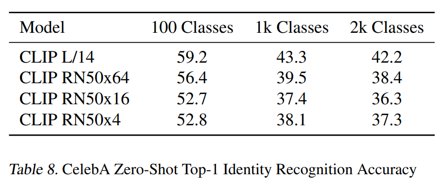

- 또한 CelebA dataset 을 사용하여 'in the wild' 의 신원 감지에 대한 CLIP zero-shot 을 테스트
  - 이를 통해 모델이 pre-training 된 public data 만 사용하여 신원 감지의 성능을 얼마나 잘 하는지를 평가
  - celebrity images dataset 에서 이를 테스트했지만, 모델이 이름과 얼굴을 연결하기 위해 필요한 pre-training data 양이 계속 감소할 것으로 가정 (Tab. 8)
  - 이는 중요한 사회적 영향을 미친다. 최근 NLP 분야의 최근 발전과 유사하며, 이러한 LLM 은 인터넷 데이터를 기반으로 꽤 작은 공개 인물에 관한 정보를 제공하는 놀라운 능력을 가지고 있다
- 저자는 'in the wild' 8k celebrity images 에 대해 100 possible classes 중 59.2% top-1 accuracy 를 갖는 모델을 발견.
  - 그러나 이 성능은 class size 를 1k celebrity names 로 확장했을 때 43.3% 로 떨어짐
    - 이 성능은 Google 의 Celebrity Recognition 과 같은 생산 수준의 모델과 비교하면 경쟁력이 없다
    - 그러나 이러한 결과를 주목할 만한 점은 이 분석이 pre-training data 에서 추론된 names 를 기반으로 한 zero-shot identification 능력만을 사용하여 수행되었다는 것 - additional task-specific dataset 을 사용하지 않았으므로 (상대적으로) 강력한 결과는 이러한 시스템을 주어진 문맥과 도메인에서 조심스럽게 연구해야 할 필요성을 더욱 강조
- CLIP 은 제로샷 능력을 가지고 있기 때문에 상대적으로 적은 데이터를 사용하는 task 에 대해 상당한 이점을 제공
  - 그러나 많은 수요가 있는 surveillance task 에 대해 large datasets 과 고성능 supervised model 이 이미 존재하기 때문에, CLIP 의 이러한 용도에 대한 비교적 매력은 낮다
  - 게다가, CLIP 는 object detection 과 semantic segmentation 같은 일반적인 surveillance-relevant tasks 에 대해 설계되지 않았다
    - 이는 이러한 용도로 설계된 모델인 Detectron2 같은 모델이 널리 사용 가능한 경우에는 특정 surveillance tasks 에 대해 제한적으로 사용되는 것을 의미
- 그러나 CLIP 은 training data 가 필요하지 않은 측면의 사용성을 제공하기 때문에 특정 사용자 정의 및 특수한 surveillance case 를 가능케 함
  - 따라서 CLIP 및 유사한 모델은 특별히 맞춤화된 모델이나 데이터셋이 없는 작은 수요 감시 사용 사례를 가능하게 할 수 있으며, 이는 이러한 애플리케이션을 구축하는 데 필요한 기술 요구 사항을 낮출 수 있다. 

## 7.3 Future Work

초기 분석은 일반적인 vision model 의 도전과 bias 영향을 보았고, 단점 및 bias 를 특성화하는 미래 연구를 촉진

CLIP 의 특성화하고, 유망한 성능을 발휘하는 것이 중요.

저자는 다음의 이유로 유익할 가능성이 높다고 본다.

- 연구 과정 초기에 모델의 잠재적으로 유익한 downstream task 사용을 식별함으로써 응용 분야를 고려
- 사회적 이해관계자의 많은 집합과 중요한 민감성을 가진 작업을 부각시킴으로써, 정책 결정자의 개입을 요구할 수 있는 작업을 도출
- 모델의 bias 을 더 잘 특성화하여 우려되는 영역과 개입이 필요한 영역을 알림
- CLIP 같은 시스템을 평가하기 위한 test suite 을 생성함으로써, 개발 주기 초기에 모델 능력을 더 잘 특성화함
- 잠재적인 실패 모드와 추가 작업 영역을 식별함

# 8. Related Work

일반적으로 human language 를 training signal 로 활용하는 경우, supervision 을 사용한다.

NLP task 에서 description, feedback, instruction 및 device 같은 형태의 natural language supervision 을 활용하여 창의적이고 고급스러운 방법으로 탐구된다

- CLIP 은 language 외의 domain 에서 training signal 로 natural language 를 사용
  - 이는 natural language supervision 이 video event understanding task 성능 향상을 위해 natural language description 을 supervision source 로 사용 가능함을 보여준 Ramanathan et al (2013)의 task 이다
  - 다른 초기 연구는 image 와 related tag (not natural language)를 사용하여 semantic segmentation task 에 활용했다.
  - 더 최근에는 natural language description 을 fine-grained visual classification birds 개선에 사용되거나 visual representation 및 classifier 개선에 연구를 하기도 한다
  - 마지막으로, natural language 를 supervision 으로 사용하는 기술과 보강 학습 환경을 결합하는 기술도 있다.
- CLIP 의 pre-training task 는 text-image retrieval 을 최적화
- natural language supervision 을 image 외의 domain 에 활용하는 다른 연구도 존재
  - Stroud et al (2020)은 image 대신 video 에 description text 를 결합하여 large scale representation learning 탐구
  - 이러한 연구들은 large-scale natural language supervision 을 여러 domain 에 대한 high-quality recognition system learning 에 대한 유망한 방법임을 시사
  - Alayrac et al (2020)은 이러한 연구를 음원 오디오를 추가적인 supervision source 로 추가함으로써 이 라인의 연구을 확장
- CLIP 연구의 일환으로 우리는 새로운 image-text pair dataset 구축
  - 현대의 image-text retrieval task 는 Pascal1K, Flickr8K 및 Flickr30K 같은 crowd-based sentence-level image caption evaluation dataset 에 의존
  - 그러나 이러한 dataset 은 여전히 비교적 작고 실현 가능한 성능을 제한
  - Mithun et al (2018)은 인터넷에서 수집한 (image, text) pair 의 추가 집합이 검색 성능을 향상시킬 수 있다는 것을 보여줌
  - 이런 dataset 은 여전히 큰 filtering 을 사용하거나 OCR 같은 task-specific 을 위해 설계되어, WIT 같은 very large dataset 보다 훨씬 작다
- CLIP와 관련된 아이디어 중 하나는 Webly supervised learning
  - 이 연구 라인은 image retrieval 를 query 하여 용어에 대한 image dataset 을 구축하고 query 를 반환된 image label 로 사용
  - 이러한 방식으로 훈련된 classifier 는 smaller carefully labeled dataset 에 훈련된 classifier 와 경쟁
  - 이러한 image-query pair 는 종종 additional training data 로 사용되어 standard dataset 의 성능을 향상시키기도 함
  - CLIP 은 dataset 생성 과정의 일환으로 retrieval query 를 사용
  - 그러나 CLIP 은 single word 나 short n-gram 인 경우가 많은 query 가 아닌 image 와 함께 발생하는 전체 text sequence 를 supervision 으로 사용
  - 또한 CLIP 에선 이 단계를 문자열 일치를 query 하는 text 만으로 제한
  - 대부분의 Webly supervised learning 연구는 복잡한 검색 및 필터링 파이프라인을 사용한다. 이러한 라인의 연구 중에서도 "Learning Everything about Anything: Webly-Supervised Visual Concept Learning" 는 CLIP 과 유사한 목표가 있음
- 마지막으로, CLIP 은 최근에 활발한 활동과 관련
  - 이 연구 라인은 vidual question answering, visual commonsense reasoning 또는 multimodal entailment 같은 complex downstream task 해결을 위해 vision-language 의 jointly model 을 학습하는 데 중점을 둔다.
  - 이러한 시스템은 image-text pair 에 대한 다양한 training objective 를 통합적으로 tuning 하고 이전에 언급된 연구들에 적용하여 인상적인 결과를 달성
  - CLIP 은 대신, natural language supervision 을 통해 visual model 을 scratch training 하는 데 중점을 두며 image 와 text domain 을 densely connection 하지 않음
  - CLIP 모델에서 image 와 text domain 간의 유일한 상호 작용은 learned joint embedding space 에서의 single dot product 이다

# 9. Conclusion

저자는 NLP 의 task-agnostic web-scale pre-training 을 다른 domain 으로 transfer 이 가능한지 조사

- 이런 공식을 채택하면 vision 분야에서 유사한 행동이 나타나며, 이 연구 라인의 사회적 함의에 대해 논의
- CLIP 은 pre-training 과정에 다양한 task 를 수행하는 것을 배우기 때문에 training objective 를 optimizing 허기 위해 natural prompting 을 통해 이러한 task learning 을 활용
- 충분한 규모로 이러한 접근 방식의 성능은 task-specific supervised models 와 경쟁력을 갖을 수 있으나, 여전히 많은 개선 여지가 있음