논문 및 이미지 출처 : <https://arxiv.org/pdf/2311.17049>

# Abstract

CLIP 과 같은 image-text foundation model 의 contrastive pretraining 은 광범위한 downstream task 에서 뛰어난 zero-shot performance 와 향상된 robustness 를 보여주었다. 그러나 이러한 model 은 상당한 memory 및 latency overhead 를 수반하는 large transformer-based encoder 를 사용하므로 mobile device 에 배포하는 데 어려움이 있다. 

이 연구에서는 runtime performance 에 최적화된 새로운 efficient image-text model 계열인 **MobileCLIP** 과, **multi-modal reinforced training** 이라는 새로운 efficient training approach 를 도입한다. 

* 제안하는 training approach 는 image captioning model 과 강력한 CLIP encoder ensemble 로부터의 knowledge transfer 를 활용하여 efficient model 의 accuracy 를 향상시킨다. 
* 저자의 접근법은 추가 knowledge 를 reinforced dataset 에 저장함으로써 train-time compute overhead 를 피한다. 
* MobileCLIP 은 여러 dataset 에서 zero-shot classification 및 retrieval task 에 대해 새로운 state-of-the-art latency-accuracy tradeoff 를 달성한다. 
* MobileCLIP-S2 variant 는 기존 최고 성능의 ViT-B/16 기반 CLIP model 과 비교할 때, 더 정확하면서도 2.3× 더 빠르다. 
* 저자는 또한 ViT-B/16 image backbone 기반 CLIP model 을 학습시켜, 기존 최고 성능 대비 38 개 evaluation benchmark 에서 평균 성능을 +2.9% 향상시킴으로써 multi-modal reinforced training 의 효과를 추가로 입증한다. 
* 또한 제안한 접근법이 non-reinforced CLIP training 과 비교하여 10×-1000× 향상된 learning efficiency 를 달성함을 보인다.

# 1. Introduction

CLIP 과 같은 large image-text foundation model 은 광범위한 downstream task 에서 뛰어난 zero-shot performance 와 향상된 robustness 를 보여주었다. 그러나 이러한 model 을 mobile device 에 배포하는 일은 큰 크기와 높은 latency 때문에 어렵다.

저자의 목표는 mobile device 에 적합한 새로운 aligned image-text encoder 계열을 설계하는 것이다. 이 목표를 실현하는 데에는 두 가지 주요 과제가 있다. 

* 첫째, 서로 다른 architecture 사이에는 runtime performance (e.g., latency) 와 accuracy 사이의 tradeoff 가 존재하므로, 다양한 architectural design 을 빠르고 철저하게 분석할 수 있어야 한다. 
  * CLIP model 의 large-scale training 은 computationally expensive 하여 efficient architecture design 의 빠른 개발과 탐색을 방해한다. 
  * 반면, 작은 규모에서의 표준 multi-modal contrastive learning 은 낮은 accuracy 를 초래하며, 이는 architecture design choice 를 안내할 유용한 signal 을 제공하지 못한다. 
* 둘째, 더 작은 architecture 의 reduced capacity 는 낮은 accuracy 로 이어지며, 이는 더 나은 training method 로 개선될 수 있다.

이러한 과제를 극복하기 위해, 저자는 dataset reinforcement method 에 기반한 새로운 training approach 를 개발한다: i) dataset 을 한 번 추가 정보로 reinforce 하고, ii) reinforced dataset 을 여러 번 실험에 사용한다. 

주어진 compute budget 에서, reinforced dataset 으로 학습하면 원래 dataset 과 비교하여 향상된 accuracy 를 얻는다. 저자는 efficient CLIP model 학습을 위한 dataset reinforcement 의 multi-modal variant 를 제안한다. 

* 구체적으로, image-text DataComp dataset 에 강력한 pretrained CLIP model ensemble 에서 얻은 synthetic caption 과 embedding 을 추가하여 reinforce 함으로써, DataCompDR 을 얻는다 (Fig. 3). 
* 저자는 reinforced dataset 의 두 가지 variant 를 도입한다. 하나는 efficient model design 의 빠른 iteration 에 적합한 DataCompDR-12M 이고, 다른 하나는 최상의 large-scale training performance 를 위한 DataCompDR-1B 이다.

DataCompDR 로 학습하면 표준 CLIP training 과 비교하여 learning efficiency 가 크게 향상된다. 

* 예를 들어, 8×A100 GPU 로 구성된 단일 node 에서, DataCompDR-12M 위에 ViT-B/16 기반 CLIP 을 scratch 부터 학습시킬 경우 약 하루 만에 ImageNet-val 에서 61.7% zero-shot classification 을 달성한다. 
* DataCompDR-1B 로 학습하면 여러 metric 에서 새로운 state-of-the-art performance 를 달성하면서도, 기존 연구와 비교하여 training compute budget 의 일부만 사용한다.

DataCompDR 을 활용하여, 저자는 design space 를 탐색하고 이전 연구보다 더 나은 latency-accuracy tradeoff 를 가지는 MobileCLIP 이라는 새로운 mobile-friendly aligned image-text encoder 계열을 얻었다 (Fig. 1). 

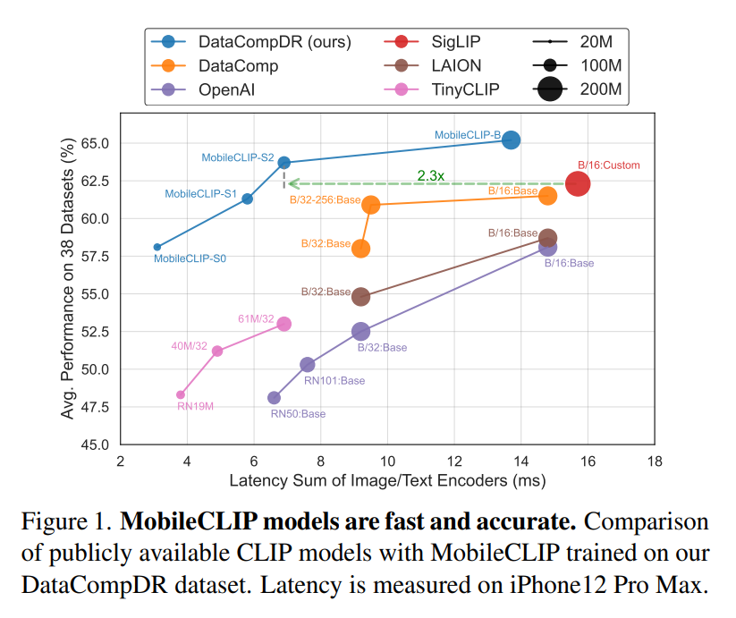

* 저자는 structural reparametrization 과 convolutional token mixing 을 포함한 여러 architectural design technique 을 활용하여 efficient image encoder 와 text encoder 를 얻는다. 
* MobileCLIP 은 서로 다른 mobile application 을 위한 다양한 크기와 latency 를 포괄하는 S0, S1, S2, B variant 를 포함한다. 
* 가장 빠른 variant 인 MobileCLIP-S0 는 표준 OpenAI ViT-B/16 CLIP model 보다 약 5× 더 빠르고 3× 더 작지만, 평균 accuracy 는 동일하다. 

저자의 기여는 다음과 같다.

* 저자는 mobile-friendly CLIP model 의 새로운 계열인 MobileCLIP 을 설계한다. MobileCLIP 의 variant 는 image encoder 와 text encoder 에서 structural reparametrization 을 사용하는 hybrid CNN-transformer architecture 를 사용하여 크기와 latency 를 줄인다.
* 저자는 pre-trained image captioning model 과 강력한 CLIP model ensemble 로부터의 knowledge transfer 를 통합하여 learning efficiency 를 향상시키는 새로운 training strategy 인 multi-modal reinforced training 을 도입한다.
* 저자는 reinforced dataset 의 두 가지 variant 인 DataCompDR-12M 과 DataCompDR-1B 를 도입한다. DataCompDR 을 사용하여, 저자는 DataComp 와 비교해 10x-1000x learning efficiency 를 입증한다.
* MobileCLIP family 는 zero-shot task 에서 state-of-the-art latency-accuracy tradeoff 를 달성하며, 새로운 최고 성능의 ViT-B/16 기반 CLIP model 도 포함한다.

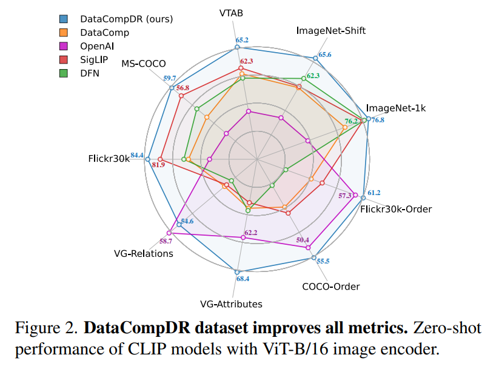

# 2. Related Work

#### Efficient learning for CLIP

향상된 training objective 를 활용함으로써 learning efficiency 를 개선할 수 있다. 예로는 image masking, unimodal self-supervision, fine-grained image-text alignment, image-text-label space 에서의 contrastive learning, pairwise Sigmoid loss 가 있다. CLIPA 는 cost-effective training 을 위해 multi-resolution training 을 제안하였다. 이러한 방법은 저자가 제안하는 방법과 상보적이다.

* CLIP training dataset 은 종종 web-scale 에서 수집된 noisy image-text pair 로 구성된다. 
* 원래 CLIP model 이후, 여러 연구는 large-scale 이고 filtering 된 dataset 에서 향상된 result 를 보여주었다. 
* Data collection 및 filtering 과 상보적으로, 최근 연구는 pretrained captioning model 이 생성한 visually enriched synthetic caption 을 real caption 과 함께 사용하는 것이 CLIP model 의 quality 를 향상시킬 수 있음을 보여준다. 

저자가 제안하는 reinforced multi-modal dataset 도 synthetically generated caption 으로부터 이점을 얻으며, 저자는 이것이 learning efficiency 향상에 핵심적임을 보인다.

* DIME-FM 과 같은 이전 연구는 zero-shot classification 에 초점을 맞추어 unimodal distillation 을 확장한다. 
* TinyCLIP 은 cross-modal affinity mimicking 과 weight inheritance 를 통해 compact CLIP model 을 학습한다. 
* Multi-modal distillation 은 student 가 특정 task 를 위한 fused vision-language model 인 setup 에서도 탐구되었다. 

저자가 제안하는 multi-modal reinforced training 또한 cross-modal affinity mimicking 을 포함한다. 또한 저자는 unimodal model ensembling 을 multimodal setup 으로 확장하고, CLIP model ensemble 로부터 얻은 target 을 저장한다.

* Offline knowledge distillation method 는 large teacher model 을 실행함으로써 발생하는 training-time overhead cost 를 완화하기 위해 최근 제안되었다. 

저자는 dataset reinforcement strategy 를 CLIP 의 multi-modal setup 으로 확장한다. 저자가 제안하는 reinforced multi-modal dataset 은 training-time computational overhead 를 추가하지 않으면서도 상당한 accuracy 향상을 가져온다.

#### Efficient architectures for CLIP

최근에는 resource constraint device 에서 vision task 를 수행하는 데 큰 가능성을 보여준 다양한 architecture 가 제안되었다. 이러한 architecture 는 대체로 purely convolutional, transformer based, 그리고 convolution-transformer hybrid 로 분류할 수 있다. 

마찬가지로 text encoding 에 대해서도 transformer based architecture 와 convolution-transformer hybrid architecture 가 존재한다. ViT architecture 를 pruning 하여 더 작고 더 빠른 CLIP model 을 얻는 연구나, vision-language model 의 더 빠른 inference 를 위해 image-text token 수를 줄이는 연구도 있었다. 

이러한 model 은 여전히 mobile device 에 배포하기에는 상당히 크고 비효율적일 수 있다. 이 연구에서 저자는 vision modality 와 text modality 모두에 대해 개선된 convolution-transformer hybrid architecture 를 도입하며, 이는 최근 state-of-the-art 를 능가한다. 앞선 최적화 기법은 저자의 model 효율성을 더욱 향상시키는 데 사용할 수 있다.

# 3. Multi-Modal Reinforced Training

저자의 multi-modal reinforced training 은 target model 학습을 위해 image captioning model 과 강력한 pretrained CLIP model ensemble 로부터의 knowledge transfer 를 활용한다. 이는 두 가지 주요 구성 요소로 이루어진다: i) synthetic caption 을 통해 image captioning model 의 knowledge 를 활용하는 것, ii) 강력한 pre-trained CLIP model ensemble 로부터 image-text alignment 를 knowledge distillation 하는 것이다. 

저자는 dataset reinforcement strategy 를 따르며 추가 knowledge (synthetic caption 과 teacher embedding) 를 dataset 에 저장함으로써 (Fig. 3 참조), captioning model 이나 ensemble teacher 를 평가하는 것과 같은 추가적인 training time computational overhead 를 피한다.

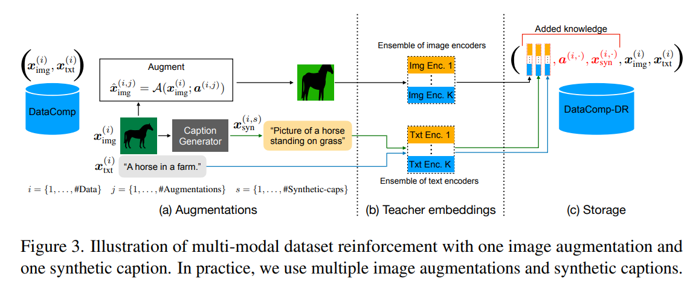

## 3.1. Dataset Reinforcement

#### Synthetic captions

CLIP model 을 학습하는 데 사용되는 image-text dataset 은 대부분 web 에서 수집되며, 본질적으로 noisy 하다. DataComp 및 data filtering network 와 같은 최근의 노력은 광범위한 filtering mechanism 을 사용하여 web-sourced dataset 의 quality 를 향상시킨다. 이러한 filtered dataset 은 noise 가 더 적지만, caption 이 여전히 충분히 descriptive 하지 않을 수 있다. 

caption 의 visual descriptiveness 를 높이기 위해 저자는 널리 사용되는 CoCa model 을 사용하고, 각 image $x^{(i)}_{\mathrm{img}}$ 에 대해 여러 synthetic caption $x^{(i,s)}_{\mathrm{syn}}$ 을 생성한다 (Fig. 3a 참조). image 당 생성되는 synthetic caption 수에 대한 ablation 은 Sec. 5.1 에 제시되어 있다. 

Fig. 5 는 CoCa model 이 생성한 synthetic caption 의 몇 가지 예를 보여준다. 

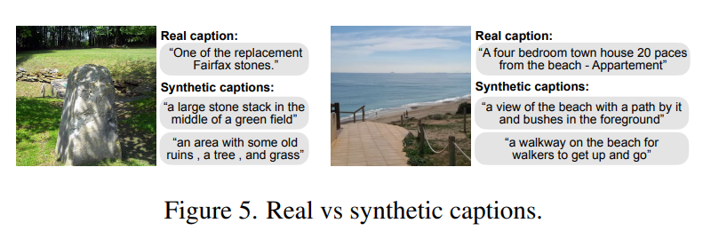

* real caption 은 synthetic caption 과 비교할 때 일반적으로 더 specific 하지만 더 noisy 하다. 
* 저자는 real caption 과 synthetic caption 의 조합이 최상의 zero-shot retrieval 및 classification performance 를 얻는 데 핵심적임을 보인다 (Tab. 3a).

#### Image augmentations

각 image $x^{(i)}_{\mathrm{img}}$ 에 대해, 저자는 parameterized augmentation function $\mathcal{A}$ 를 사용하여 여러 augmented image $\hat{x}^{(i,j)}_{\mathrm{img}}$ 를 생성한다.

$$
\hat{x}^{(i,j)}_{\mathrm{img}} = \mathcal{A}(x^{(i)}_{\mathrm{img}}; a^{(i,j)}), \tag{1}
$$

* 여기서 $a^{(i,j)}$ 는 $x^{(i)}_{\mathrm{img}}$ 로부터 $\hat{x}^{(i,j)}_{\mathrm{img}}$ 를 재현하는 데 충분한 augmentation parameter 이다 (Fig. 3a 참조).
* image 당 사용되는 augmentation 의 수와 종류에 대한 ablation 은 각각 Tab. 4a 와 Tab. 13 에 제시되어 있다.

#### Ensemble teacher

Model ensembling 은 독립적으로 학습된 model 집합으로부터 더 강력한 model 을 생성하기 위해 널리 사용되는 기법이다. 저자는 이 기법을 multi-modal setup 으로 확장하여, $K$ 개의 CLIP model ensemble 을 강력한 teacher 로 사용한다 (teacher ablation 은 Sec. 5.1 참조). 

저자는 augmented image $\hat{x}^{(i,j)}_{\mathrm{img}}$ 와 synthetic caption $x^{(i,s)}_{\mathrm{syn}}$ 에 대해 이 model 의 feature embedding 을 계산하여, $k$ 번째 teacher model 에 대한 $d_k$ 차원 vector $\psi^{(i,j,k)}_{\mathrm{img}}$ 와 $\psi^{(i,s,k)}_{\mathrm{syn}}$ 을 얻는다. 또한 저자는 ground-truth caption $x^{(i)}_{\mathrm{txt}}$ 의 teacher embedding $\psi^{(i,k)}_{\mathrm{txt}}$ 도 계산한다 (Fig. 3b 참조).

#### Reinforced dataset

저자는 원본 image $x^{(i)}_{\mathrm{img}}$ 와 caption $x^{(i)}_{\mathrm{txt}}$ 과 함께, image augmentation parameter $a^{(i,j)}$, synthetic caption $x^{(i,s)}_{\mathrm{syn}}$, 그리고 CLIP teacher 의 feature embedding $\psi^{(i,j,k)}_{\mathrm{img}}$, $\psi^{(i,s,k)}_{\mathrm{syn}}$, $\psi^{(i,k)}_{\mathrm{txt}}$ 를 추가 knowledge 로 dataset 에 저장한다 (Fig. 3c 참조). dataset reinforcement 는 한 번만 드는 비용이며, 이후 여러 efficient model training 및 experimentation 을 통해 amortize 된다는 점에 유의한다.

## 3.2. Training

#### Loss function

직관적으로, 저자의 loss function 은 여러 image-text teacher encoder 의 image-text pair 사이 affinity matrix 를 student image-text encoder 로 distill 한다. 

* $B$ 를 $b$ 개의 $(\mathrm{image}, \mathrm{text})$ pair 로 이루어진 batch 라 하고, $\Psi^{(k)}_{\mathrm{img}}, \Psi^{(k)}_{\mathrm{txt}} \in \mathbb{R}^{b \times d_k}$ 를 batch $B$ 에 대한 $k$ 번째 teacher ensemble model 의 $d_k$ 차원 image embedding 및 text embedding matrix 라 하자. 
* 이에 대응하여, target model 의 image embedding 및 text embedding matrix 를 $\Phi_{\mathrm{img}}, \Phi_{\mathrm{txt}} \in \mathbb{R}^{b \times d}$ 로 나타낸다. 
* 주어진 matrix $U$ 와 $V$ 에 대해, $\mathcal{S}_{\tau}(U,V) \in \mathbb{R}^{b \times b}$ 를 $UV^\top / \tau$ 에 row-wise Softmax operation 을 적용해 얻은 similarity matrix 라 하자. 
  * 여기서 $\tau$ 는 temperature parameter 이다. 
* 저자의 training loss 는 두 개의 구성 요소, 즉 표준 CLIP loss $\mathcal{L}_{\mathrm{CLIP}}(B)$ 와 knowledge distillation loss $L_{\mathrm{Distill}}(B)$ 로 이루어진다.

$$
\mathcal{L}_{\mathrm{Total}}(\mathcal{B}) = (1 - \lambda)\mathcal{L}_{\mathrm{CLIP}}(\mathcal{B}) + \lambda \mathcal{L}_{\mathrm{Distill}}(\mathcal{B}), \tag{2}
$$

$$
\mathcal{L}_{\mathrm{Distill}}(\mathcal{B}) = \frac{1}{2}L^{\mathrm{I2T}}_{\mathrm{Distill}}(\mathcal{B}) + \frac{1}{2}L^{\mathrm{T2I}}_{\mathrm{Distill}}(\mathcal{B}),
$$

$$
\mathcal{L}^{\mathrm{I2T}}_{\mathrm{Distill}}(\mathcal{B}) = \frac{1}{bK}\sum_{k=1}^{K} \mathrm{KL}\big(S_{\tau_k}(\Psi^{(k)}_{\mathrm{img}}, \Psi^{(k)}_{\mathrm{txt}})\|\mathcal{S}_{\tau_b}(\Phi_{\mathrm{img}}, \Phi_{\mathrm{txt}})\big),
$$

* 여기서 $\mathrm{KL}$ 은 Kullback-Leibler divergence 를 의미한다.
* $\mathcal{L}^{\mathrm{T2I}}_{\mathrm{Distill}}$ 은 $\mathcal{L}^{\mathrm{I2T}}_{\mathrm{Distill}}$ 의 text embedding 항과 image embedding 항을 서로 바꾸어 계산한다.
* $\lambda$ 는 tradeoff parameter 이다.

#### Efficient training

reinforced dataset 에 대한 training 은 dataset 에 저장된 추가 knowledge 를 활용하도록 data loader 와 loss function 을 수정하는 것만으로 충분하며, 표준 CLIP training 과 동일한 training cost 를 가진다. 

* 먼저, 저자는 dataset 에서 각 image $x^{(i)}_{\mathrm{img}}$ 와 이에 대응하는 ground-truth caption $x^{(i)}_{\mathrm{txt}}$ 를 load 한다. 
* 그런 다음, 저장된 augmentation parameter $a^{(i,j)}$ 중 하나를 무작위로 load 하여 augmented image $\hat{x}^{(i,j)}_{\mathrm{img}}$ 를 재현한다. 
* 또한 저장된 synthetic caption $x^{(i,s)}_{\mathrm{syn}}$ 중 하나를 무작위로 load 한다. 
* 마지막으로, $K$ 개의 teacher model 에 대응하는 저장된 embedding $\psi^{(i,j,k)}_{\mathrm{img}}$, $\psi^{(i,s,k)}_{\mathrm{syn}}$, $\psi^{(i,k)}_{\mathrm{txt}}$ 를 읽는다.

이렇게 load 된 data 를 사용하여, 저자는 두 개의 data batch 를 구성한다.

* $\mathcal{B}_{\mathrm{real}}$: $(\mathrm{augmented\ image}, \mathrm{real\ caption})$ pair 로 이루어진 batch
* $\mathcal{B}_{\mathrm{syn}}$: $(\mathrm{augmented\ image}, \mathrm{synthetic\ caption})$ pair 로 이루어진 batch

이후 저자는 Eq. (2) 의 training loss 를 $\mathcal{B}_{\mathrm{real}}$ 과 $\mathcal{B}_{\mathrm{syn}}$ 에 대해 각각 별도로 계산한다. 최종 loss 는 다음과 같다.

$$
\sum_{\mathcal{B} \in {B_{\mathrm{real}}, B_{\mathrm{syn}}}} \mathcal{L}_{\mathrm{Total}}(\mathcal{B}). \tag{3}
$$

student model 의 forward pass 이후에 total loss 를 계산할 수 있으며, distillation loss 계산에 필요한 teacher embedding 이 이미 dataset 의 일부로 즉시 사용 가능하므로 추가적인 teacher 관련 computation 이 필요하지 않는다는 점에 유의한다.

# 4. Architecture

## 4.1. Text Encoder

CLIP model 은 text encoding 을 위해 self-attention layer 로 구성된 고전적인 transformer 와 vision transformer 를 결합하였다. 이 model 은 효과적이지만, mobile deployment 를 위해서는 더 작고 더 efficient 한 model 이 선호된다. 최근 연구는 convolution 이 text encoding 에서도 충분히 효과적일 수 있음을 보여주었다. 그러나 저자는 purely convolutional architecture 가 transformer counterpart 에 비해 현저히 성능이 떨어진다는 것을 발견하였다. text encoding 에 완전한 convolutional architecture 를 사용하는 대신, 저자는 1-D convolution 과 self-attention layer 를 활용하는 hybrid text encoder 를 도입한다.

hybrid text encoder 를 위해, 저자는 train-time architecture 와 inference-time architecture 를 분리하는 convolutional token mixer 인 Text-RepMixer 를 도입한다. Text-RepMixer 는 RepMixer 에서 도입된 reparameterizable convolutional token mixing 에서 영감을 받았다. inference 시에는 skip connection 이 reparameterized 된다. 

architecture 는 Fig. 4 에 제시되어 있다. 

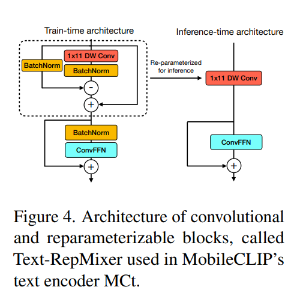

* Feed-Forward Network (FFN) block 의 경우, 저자는 linear layer 에 token mixer 와 유사한 kernel dimension 을 갖는 추가적인 depthwise 1-D convolution 을 더하여 ConvFFN block 을 얻는다. 
* 이 구조는 기존 연구에서 사용된 convolutional block 과 유사하며, 주요 차이는 batchnorm 을 사용하고 이를 뒤따르는 depthwise 1-D convolutional layer 와 folding 하여 efficient inference 를 가능하게 한다는 점이다. 
  * Text-RepMixer 의 design choice 는 Appendix F 에서 논의된다. 
* hybrid text encoder 의 최적 design 을 찾기 위해, 저자는 purely convolutional text encoder 로 시작하여 convolutional block 을 self-attention layer 로 체계적으로 대체해 나간다 (Tab. 5 참조). 

Tab. 1 은 CLIP 의 base text encoder 와 비교했을 때 저자의 text encoder 의 효과를 보여준다. 

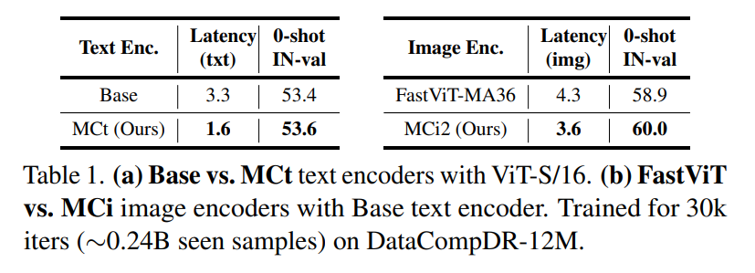

* 저자의 model 은 더 작고 더 빠르며, ViT-S/16 과 같은 efficient backbone 과 결합될 때 더 큰 base text encoder 와 유사한 performance 를 얻는다.

## 4.2. Image Encoder

최근 연구는 좋은 visual representation 학습을 위한 hybrid vision transformer 의 효과를 보여주었다. MobileCLIP 을 위해, 저자는 최근 FastViT architecture 에 기반한 개선된 hybrid vision transformer 인 MCi 를 도입하며, 아래에서 설명하는 몇 가지 핵심 차이점이 있다.

FastViT 에서는 FFN block 에 대해 4.0 의 MLP expansion ratio 가 사용된다. 최근 연구는 FFN block 의 linear layer 에 상당한 redundancy 가 있음을 드러냈다. parameter efficiency 를 향상시키기 위해, 저자는 expansion ratio 를 단순히 3.0 으로 낮추고 architecture 의 depth 를 증가시킨다. 이렇게 함으로써, image encoder 에서 동일한 수의 parameter 를 유지한다. 

세 가지 variant 에 대한 stage configuration 은 Appendix A 에 설명되어 있다.

* MCi0 는 stage configuration 이 기존 architecture 와 유사하다.
* MCi1 는 MCi0 의 더 깊은 version 이다.
* MCi2 는 MCi1 의 더 넓은 version 이다.

저자 variant 의 stage compute ratio 는 기존 architecture 와 유사하다. 저자는 이러한 design 이 latency 에는 최소한의 영향만 주면서, model capacity 에는 좋은 향상을 제공하며, 이는 downstream task performance 에 반영된다는 것을 발견하였다. 자세한 내용은 Appendix B 를 참조한다. 

Tab. 1 에서 저자는 CLIP model 의 image encoder 로 사용할 때, 유사한 크기의 FastViT-MA36 과 저자의 MCi encoder 를 비교한다.

* 저자의 model 은 훨씬 더 나은 zero-shot IN-val performance 를 얻는다.
* 동시에 16.3% 더 빠르다.

# 5. Experiments

이 section 에서는 저자의 experimental setup 과 result 를 제시한다.

#### Evaluation.

저자는 DataComp 의 evaluation benchmark 를 사용하여 image-text model 을 평가한다. 

* 구체적으로, ImageNet validation set 에 대한 zero-shot classification 과, 그 distribution shift 인 ImageNetV2, ImageNet-A, ImageNet-O, ImageNet-R, ObjectNet 을 보고하며, 이들의 평균을 IN-Shift 로 보고한다. 
* zero-shot image-text retrieval 에 대해서는 MSCOCO 및 Flickr30k dataset 에서 recall@1 을 보고한다. 
* 추가로, DataComp evaluation 의 전체 38 개 dataset 에 대한 평균 performance 도 보고한다. 
* 또한 저자는 최근 Attribute, Relation and Order (ARO) benchmark 의 일부인 Visual Genome Relation, Visual Genome Attributes, Flickr30k-Order, COCO-Order dataset 에서도 model 을 평가한다. 
* 이후 본문에서 IN-val 은 ImageNet validation set 에 대한 zero-shot accuracy 를 의미하고, Flickr30k 는 image-text retrieval 과 text-image retrieval 의 평균 zero-shot recall@1 을 의미한다. 
* 보고된 모든 metric 은 fine-tuning 없이 얻어진다.

#### Training setup.

저자는 ablation 과 large-scale experiment 를 위한 두 가지 setup 을 사용한다. 

* ablation 에서는 global batch size 8,192, 8× NVIDIA-A100-80GB GPU 를 사용하여 12.8M image-text pair dataset 에 대해 30k-45k iteration 동안 학습한다. 
* large-scale training 에서는 global batch size 65,536, 256× A100 GPU 를 사용하여 200k iteration 동안 학습한다. 모든 model 은 scratch 부터 학습된다. 자세한 내용은 Appendix B 에 있다.

#### Dataset.

저자는 DataComp dataset 의 image-text dataset 으로 학습한다. 가장 큰 dataset scale 에서 최상의 performance 를 제공하는 1.28B sample 의 Bestpool filtered subset 을 사용한다. 저자는 이 집합을 DataComp-1B 라고 부른다. 

빠른 experimentation 을 위해, 균일하게 sampling 된 12.8M pair 의 고정 subset 을 만들고 이를 DataComp-12M 이라 부른다. DataComp-12M 은 기존 연구에서 다루어지지 않았지만, 저자의 experiment 에서는 comparable 한 sample 수를 가지는 DataComp-medium 의 Bestpool subset 보다 일관되게 더 나은 performance 를 달성함을 관찰하였다.

#### DataCompDR: Reinforced DataComp.

저자는 multi-modal dataset reinforcement strategy 를 사용하여 DataComp dataset 을 reinforce 한다. 

* 구체적으로, DataComp-1B 와 DataComp-12M 을 reinforce 하여 DataCompDR-1B 와 DataCompDR-12M 을 만든다. 
  * 이는 one-time generation process 를 가지며, 그 비용은 여러 architecture 와 광범위한 ablation 에 걸쳐 amortize 된다. 
* 저자는 OpenCLIP 의 `coca_ViT-L-14` model 을 사용하여 image 당 5 개의 synthetic caption 을 생성하고, 강한 random image augmentation 을 사용한다 (DataCompDR-1B 에는 10 개, DataCompDR-12M 에는 30 개). 
* 또한 augmented image 와 real caption 및 synthetic caption 에 대해, 두 개의 강력한 teacher (`ViT-L-14` with pretrained weights `datacomp_xl_s13b_b90k` 및 `openai` in OpenCLIP) 로 구성된 ensemble 의 embedding 을 계산한다. 
  * embedding 은 $2 \times 768$-D vector 를 concatenate 한 1536-D 이다. 
* 저자는 모든 reinforcement 를 lossless compression 과 BFloat16 을 사용하여 저장한다. 

이러한 선택의 분석은 Sec. 5.1 에서 수행한다. DataCompDR 에서 one seen sample 은 하나의 무작위 augmented image, 하나의 ground-truth caption, 하나의 무작위로 선택된 synthetic caption 으로 이루어진 triplet 이다.

#### MobileCLIP architectures.

저자의 MobileCLIP architecture 는 MCi:MCt architecture pair 로 형성된다. 

* 구체적으로, 세 개의 small variant 인 MobileCLIP-S0 (MCi0:MCt), MobileCLIP-S1 (MCi1:Base), MobileCLIP-S2 (MCi2:Base) 를 만든다. 
* 여기서 Base 는 ViT-B/16 기반 CLIP 의 text-encoder 와 유사한 12-layer Transformer 이다. 
* 또한 저자는 표준적인 ViT-B/16:Base pair 도 학습하며, 이 학습된 model 을 MobileCLIP-B 라고 부른다.

#### Benchmarking latency.

latency 를 측정하기 위해, 저자는 각 method 에 해당하는 input size 를 사용한다. iPhone latency 측정을 위해, Core ML Tools (v7.0) 를 사용해 model 을 export 하고 iOS 17.0.3 이 설치된 iPhone 12 Pro Max 에서 실행한다. batch size 는 모든 model 에 대해 1 로 설정한다. protocol 은 기존 연구에서 설명된 동일한 절차를 따른다.

## 5.1. Ablation Studies

이 section 에서는 training 과 architecture 의 각 구성 요소가 미치는 영향을 분석한다. 별도로 명시하지 않는 한, 저자는 DataComp-12M 에서 global batch size 8k ($\sim 20$ epochs) 로 30k iteration 동안 학습한 ViT-B/16:Base encoder 를 사용한다. 

Tab. 2 는 training 에 대한 분석을 요약한다.

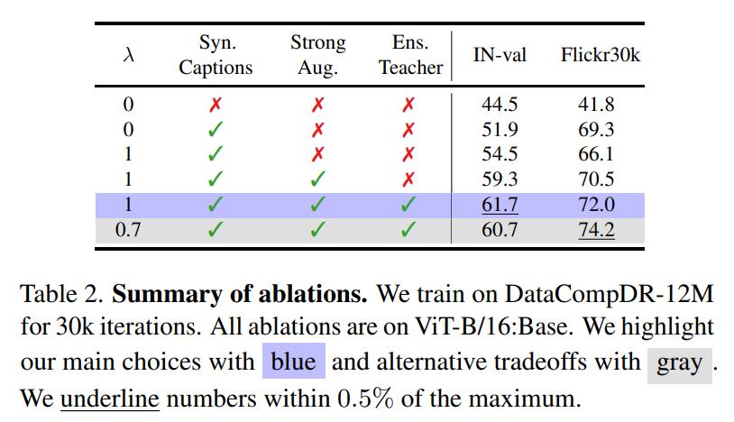

#### Strong image augmentations.

strong augmentation 을 사용하는 uni-modal supervised 및 self-supervised vision method 와는 달리, CLIP training recipe 는 image-text misalignment 를 피하기 위해 종종 light image augmentation 을 사용한다. 그러나 여러 연구는 distillation setup 에서 strong augmentation 의 효과를 보여주었다. 

Tab. 2 에서 저자는 strong image augmentation 이 distillation performance 를 향상시킴을 보인다.

* IN-val 에서 +4.8%
* Flickr30k 에서 +4.4%
* image augmentation 효과에 대한 자세한 ablation 은 Appendix C 에 제시되어 있다.

#### Synthetic captions.

image augmentation 과 유사하게, synthetic caption (또는 caption augmentation) 은 CLIP model 의 performance, 특히 image-text retrieval 을 추가로 향상시킬 수 있다. 일반적인 CLIP training ($\lambda = 0$) 에 대해, 저자는 Tab. 2 에서 synthetic caption 과 real caption 을 모두 포함하는 batch 를 사용하는 것이 performance 향상을 가져옴을 관찰한다.

* IN-val 에서 +7.4%
* Flickr30k 에서 +27.5%

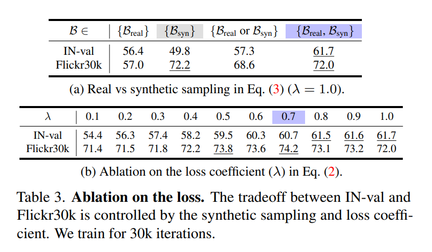

Tab. 3a 에서는 distillation loss 만 사용하는 CLIP training ($\lambda = 1$) 에 대해서도 유사한 경향을 관찰한다. Tab. 3b 에서는 $\lambda$ 의 효과를 분석하며, 다음과 같은 tradeoff 를 관찰한다.

* $\lambda = 1.0$ 은 IN-val 에 최적이다.
* $\lambda = 0.7$ 은 Flickr30k 에 최적이다.

synthetic caption 을 활용하는 이전 연구는 주로 retrieval 향상에 초점을 맞추는 반면, distillation 연구는 zero-shot classification 에 초점을 맞춘다. 저자는 large-scale experiment 에서 MobileCLIP-B 에 대해 $\lambda = 0.75$ 를 사용하여 이 tradeoff 를 조절하고, small variant 에 대해서는 $\lambda = 1.0$ 을 사용한다.

#### Ensemble teacher.

저자는 multi-modal reinforced training 에서 강력한 CLIP model ensemble 을 teacher 로 사용하는 것이 +2.4% IN-val 향상을 달성하는 데 핵심적임을 발견한다 (Tab. 2). 또한 가장 정확한 model 이 반드시 최고의 teacher 는 아니라는 점도 관찰한다. 서로 다른 teacher model 에 대한 포괄적인 분석은 Appendix D 에 있다.

#### Number of image augmentations and synthetic captions.

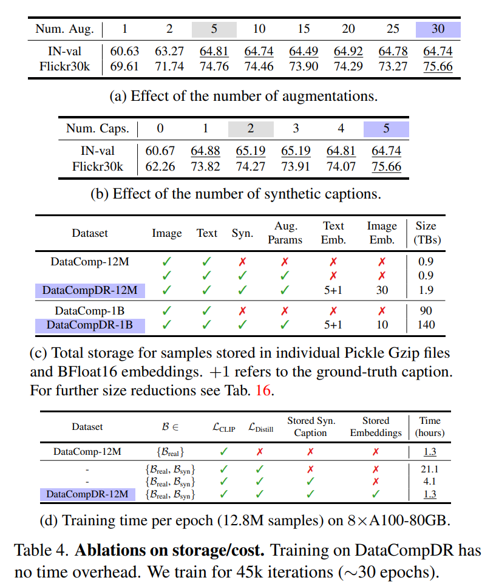

저자는 여러 image augmentation 과 synthetic caption 을 생성하고 이를 teacher embedding 과 함께 효율적으로 저장한다. Tab. 4a 와 Tab. 4b 에서 augmentation 수와 synthetic caption 수의 효과를 조사한다. 

* 저자는 최대 30 개 image augmentation 과 5 개 synthetic caption 을 사용하여 45k iteration ($\sim 30$ epochs) 동안 model 을 학습한다. 
* 그 결과 performance 는 5 개 augmentation 과 2 개 synthetic caption 부근에서 거의 saturation 되는 것을 관찰한다. 
  * 이는 각 augmentation 이 model 에 의해 추가 knowledge 가 완전히 학습되기 전까지 여러 번 재사용될 수 있음을 시사한다. 
* 필요할 경우 augmentation 과 synthetic caption 수를 줄이면 generation time 과 storage overhead 를 줄일 수 있다. 
* 최대 performance 를 위해, 저자는 DataCompDR-12M 과 DataCompDR-1B 를 각각 10 개와 30 개 augmentation, 그리고 5 개 synthetic caption 으로 reinforce 한다.

#### Training time.

reinforced training 의 주요 장점은 non-reinforced training 과 비교했을 때 시간 차이가 매우 작다는 점이다. 저자는 Tab. 4d 에 regular CLIP training, online distillation 을 포함한 training, caption generator 를 포함한 training 의 wall-clock time 을 제시한다. 측정은 8× A100-80GB GPU 를 가진 single node 에서 DataCompDR-12M 의 1 epoch 을 학습하는 시간을 기준으로 수행한다. DataCompDR-12M 에서 global batch size 8192 로 1 epoch 은 1562 iteration 이 걸린다.

* dataset reinforcement 가 전혀 없으면 training 은 16× 더 느리다.
* synthetic caption 의 partial reinforcement 만 있는 경우에도 3× 더 느리다.

#### Storage size.

저자는 original DataComp dataset 과 비교하여 reinforced dataset 의 storage requirement 를 보고한다. image-text pair 당 하나의 file 의 storage size 를 보고하며, reinforcement 가 존재하는 경우 해당 reinforcement 를 모두 같은 file 에 저장한다. file 은 Pickle format 으로 저장하고, 각 file 은 Gzip compression 으로 압축한다. image-text embedding 은 BFloat16 으로 저장한다. 

Tab. 4c 에서 DataCompDR-12M 의 12.8M sample 과 DataCompDR-1B 의 1.28B sample 에 대한 총 storage size 를 보고한다. Appendix E 에서는 추가적인 size reduction 에 대한 분석을 제공하고, BFloat16 사용이 accuracy 에 영향을 주지 않음을 검증한다. 최소 storage overhead 를 위해, 저자는 Tab. 4a 와 Tab. 4b 의 ablation 에 근거하여 다음을 권장한다.

* DataCompDR-12M 에서 30 epochs 학습 시 5 개 augmentation / synthetic caption
* DataCompDR-1B 에서 10 epochs 학습 시 2 개 augmentation / synthetic caption

#### Hybrid text encoder. 

저자는 zero-shot performance 에 거의 영향을 주지 않으면서 self-attention layer 를 효과적으로 대체할 수 있는 Text-RepMixer block 의 수를 ablation 한다. 이 ablation 을 위해, 6-layer purely convolutional text encoder 를 선택하고 중간에 self-attention layer 를 체계적으로 도입한다. 

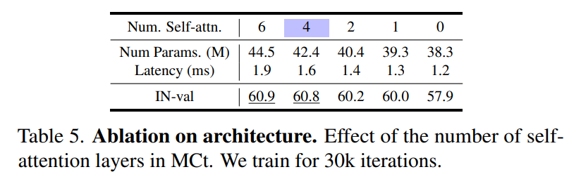

* Tab. 5 로부터, 단 하나의 self-attention layer 를 도입하는 것만으로도 zero-shot performance 가 크게 향상된다는 것을 발견한다. 
* 최상의 tradeoff 는 2 개의 Text-RepMixer block 과 4 개의 self-attention layer block 을 사용하는 경우이다. 
  * 이 variant 인 MCt 는 pure transformer variant 와 유사한 performance 를 얻으면서도 다음과 같은 장점을 가진다.
    * 5% 더 작다.
    * 15.8% 더 빠르다.

## 5.2. Small Scale Regime

Tab. 6 에서 저자는 12M-20M sample 을 가진 dataset 에서 학습된 method 를 비교한다. 이는 빠른 탐색 (e.g., architecture search) 을 위한 비교적 작은 범위이다.

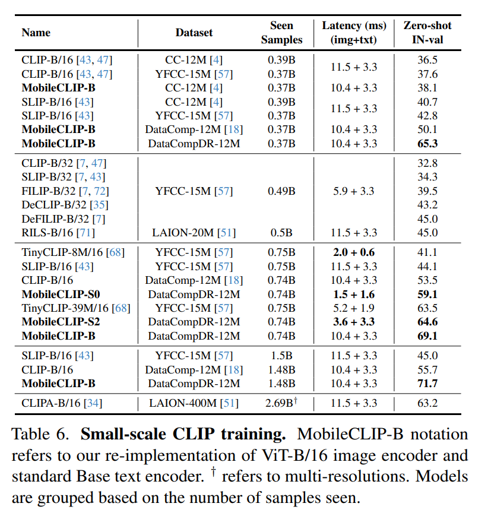

* DataCompDR-12M 에서 370M 미만의 seen sample 로 학습된 MobileCLIP-B 는, 최대 4× 더 긴 training 을 수행한 다른 모든 method 보다 현저히 더 우수한 성능을 보인다.
* 또한 MobileCLIP-B 는 seen sample 수가 증가함에 따라 뛰어난 scaling 을 보인다 ($65.3% \rightarrow 71.7%$). 이는 이전 연구인 SLIP 의 scaling ($42.8% \rightarrow 45.0%$) 과 비교된다.
* 효율성을 위해 multi-resolution training 을 사용하는 CLIPA 와 비교하면, DataCompDR-12M 으로 학습하는 것이 더 효율적이다.
  * CLIPA 는 2.69B multi-resolution seen sample 로 63.2% 를 달성한다.
  * 이는 대략 0.5B 개의 $224^2$ seen sample 과 동등한 compute 이다.
  * 그러나 이는 단지 0.37B seen sample 만으로 65.3% 를 달성한 MobileCLIP-B 보다 낮다.
* 또한 TinyCLIP-39M/16 은 MobileCLIP-S2 와 비교할 때 latency 가 더 높고 accuracy 가 더 낮다.
* TinyCLIP-8M/16 은 MobileCLIP-S0 보다 accuracy 가 현저히 낮다 ($41.1%$ vs $59.1%$).
  * 두 model 의 latency 는 비슷하다 (2.6 ms vs 3.1 ms).

## 5.3. Learning Efficiency

knowledge distillation 을 사용하여 더 오래 학습하는 것은 classification model 에서 일관되게 performance 를 향상시키는 것으로 알려져 있다. 

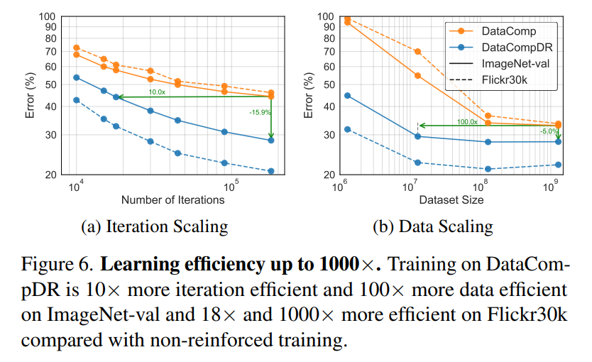

* Fig. 6a 에서 저자는 reinforced training 또한 더 긴 training 으로부터 이점을 얻는다는 것을 보이며, DataComp-1B 의 12M subset 만 사용하여 120 epochs 후 71.7% 의 ImageNet-val zero-shot accuracy 를 달성한다. 
  * 이에 비해 non-reinforced training 은 최고 성능이 55.7% accuracy 에 도달하는 데 그친다.

저자는 Fig. 6b 에서 dataset size 에 따른 scaling 도 보이며, 1.28M 부터 전체 1.28B sample 까지 DataComp-1B 의 subset 을 사용한다.

* 모든 experiment 에서 저자는 global batch size 65k 로 20k iteration 동안 학습한다.
  * 이는 1.28B subset 에 대해 1 epoch 학습과 동등하다.
* DataCompDR 에서의 training 은 1.28M sample 로도 55.2% 이상의 accuracy 에 도달한다.
* 반면 DataComp-1B 에서의 training 은 약 6% accuracy 에만 도달한다.

이 setup 에서 저자는 DataCompDR 을 사용할 때 100× 이상의 data efficiency 를 관찰한다. 또한 Flickr30k 성능에 대해서는 1000× data efficiency 를 관찰한다.

## 5.4. Comparison with State-of-the-art

Tab. 7 에서 저자는 large-scale training 을 사용하는 method 와 비교한다.

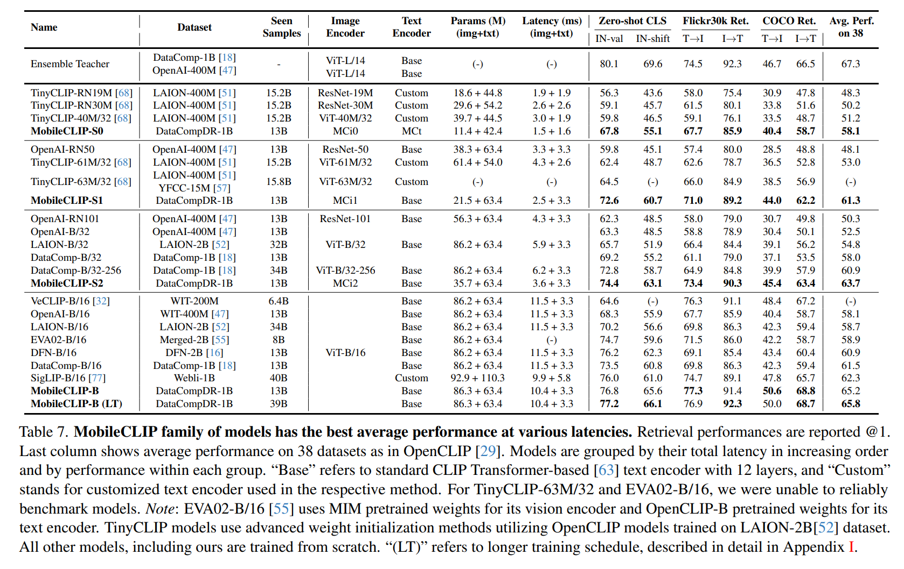

* DataCompDR-1B 에서 학습된 MobileCLIP-S0 는 TinyCLIP 과 같은 최근 연구보다 현저히 더 우수한 성능을 보인다.
* 또한 이는 DataComp 에서 학습된 ViT-B/32 model 과 유사한 performance 를 보이면서도 다음과 같은 장점을 가진다.
  * 2.8× 더 작다.
  * 3× 더 빠르다.
* MobileCLIP-S2 는 DataComp 에서 2.6× 더 길게 학습된 ViT-B/32-256 model 과 비교할 때 다음과 같은 성능을 보인다.
  * 38 개 dataset 에서 평균 performance 가 2.8% 더 좋다.
  * retrieval performance 가 현저히 더 좋다.
  * 1.5× 더 작다.
  * 1.4× 더 빠르다.
* MobileCLIP-B 는 WebLI dataset 에서 약 3× 더 길게 학습된 SigLIP-B/16 model 과 비교할 때 다음과 같은 성능을 보인다.
  * 38 개 dataset 에서 평균 performance 가 2.9% 더 좋다.
  * retrieval performance 가 더 좋다.
  * 26.3% 더 작다.

## 5.5. Retrieval Performance Analysis

저자는 최근의 Attribute, Relation and Order (ARO) benchmark 에서 model 을 평가한다. 

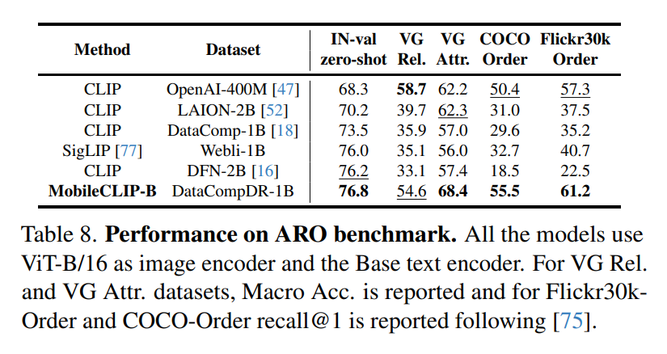

Tab. 8 에서 DataCompDR-1B 에서 학습된 MobileCLIP-B 를, publicly available 한 모든 ViT-B/16:Base model 과 비교한다.

* noisy web-scale dataset 을 사용하여 zero-shot classification 이나 retrieval 만을 최적화하면 natural scene 의 compositional understanding 이 저하될 수 있다. 
* DataCompDR 은 zero-shot classification 및 retrieval task 에서 좋은 performance 를 유지하면서도, ARO benchmark 에서 model 성능을 크게 향상시킨다.

최근의 SigLIP method 와 비교할 때, MobileCLIP-B 는 다음과 같은 성능을 보인다.

* Visual Genome Relation dataset 에서 19.5% 더 높은 accuracy
* Visual Genome Attributes dataset 에서 12.4% 더 높은 accuracy
* Flickr30k-Order dataset 에서 recall@1 이 69.7% 향상
* COCO-Order dataset 에서 recall@1 이 50.3% 향상

# 6. Conclusion

이 연구에서 저자는 on-device CLIP inference (low latency 와 size) 를 위해 설계된 MobileCLIP aligned image-text backbone 을 도입하였다. 

또한 pre-trained image captioning model 과 강력한 CLIP model ensemble 의 knowledge 로 DataComp 를 강화한 DataCompDR 도 도입하였다. 

저자는 reinforced dataset 으로 10×-1000× learning efficiency 를 입증하였다. DataCompDR 에서 학습된 MobileCLIP model 은 이전 연구와 비교하여 state-of-the-art latency-accuracy tradeoff 를 달성한다. MobileCLIP model 은 또한 더 나은 robustness 와 Attribute, Relation and Order (ARO) benchmark 에서 향상된 performance 를 보인다.

