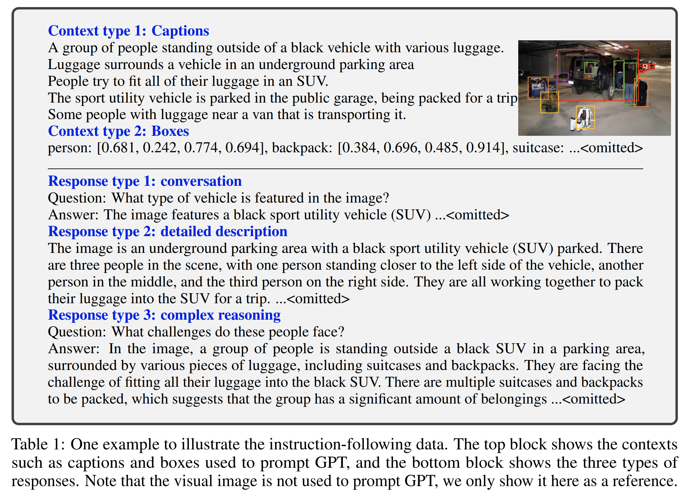
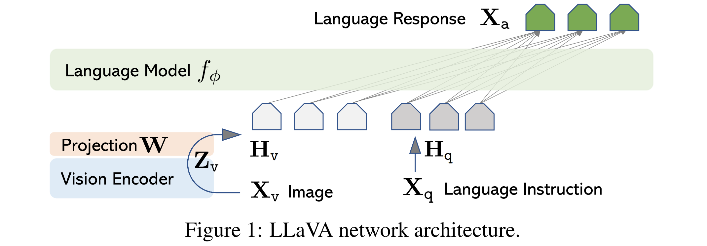
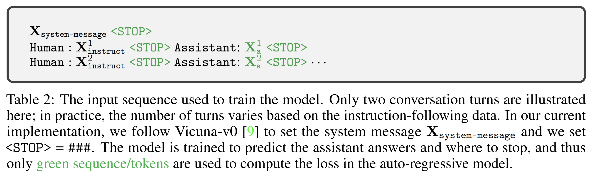
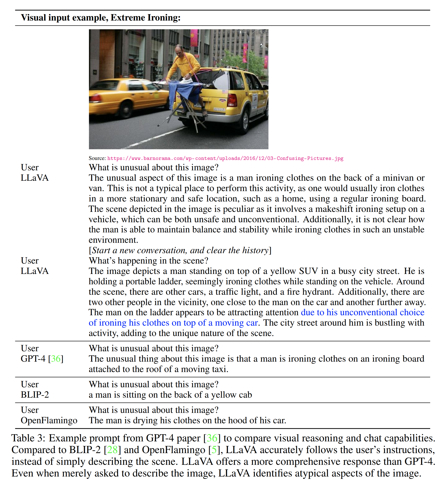
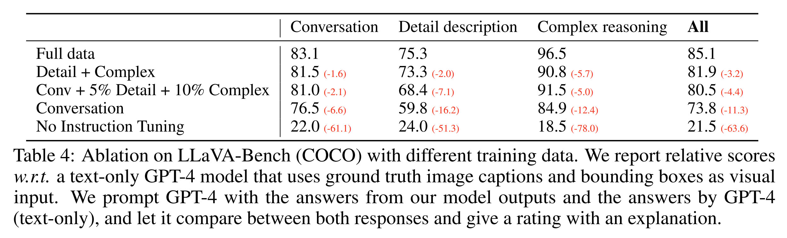
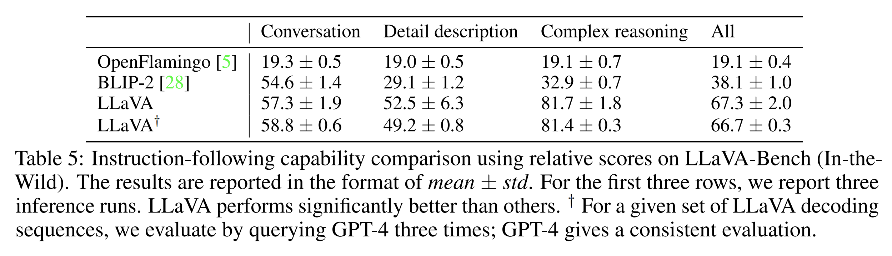
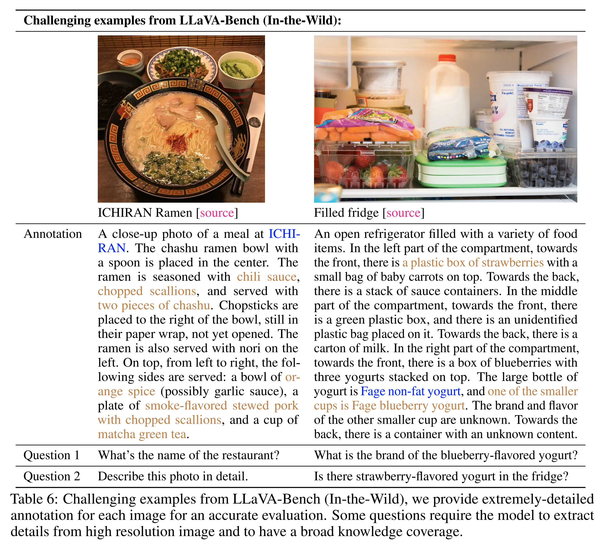
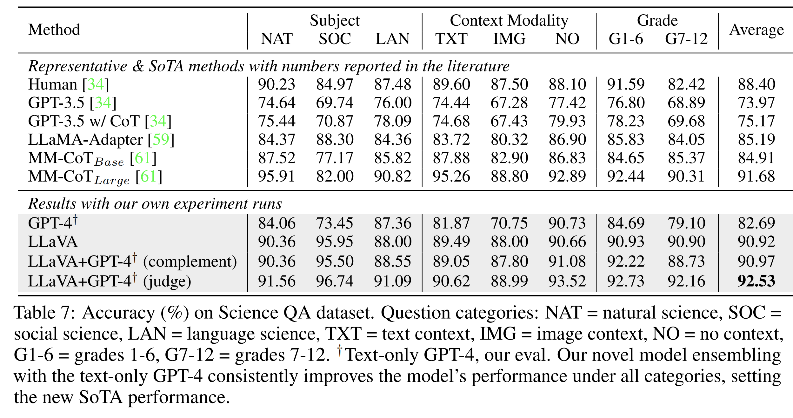
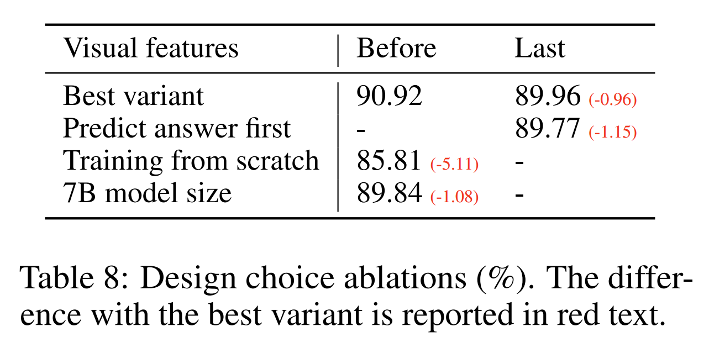

논문 및 이미지 출처 : <https://arxiv.org/pdf/2304.08485>

# Abstract

machine-generated instruction-following data 를 사용하여 large language models (LLMs) 를 instruction tuning 하는 것은 새로운 tasks 에 대한 zero-shot capabilities 를 향상시키는 것으로 알려져 있지만, 이 아이디어는 multimodal 분야에서는 덜 탐구되었다. 

저자는 language-only GPT-4 를 사용하여 multimodal language-image instruction-following data 를 생성하는 첫 번째 시도를 제시한다. 

* 이러한 생성된 data 에 대해 instruction tuning 을 수행함으로써, 저자는 general-purpose visual and language understanding 을 위해 vision encoder 와 LLM 을 연결한 end-to-end trained large multimodal model 인 **LLaVA: Large Language and Vision Assistant** 를 소개한다. 
* visual instruction following 에 대한 향후 연구를 촉진하기 위해, 저자는 다양하고 도전적인 application-oriented tasks 로 구성된 두 개의 evaluation benchmark 를 구축한다. 
  * 저자의 experiments 는 LLaVA 가 인상적인 multimodal chat abilities 를 보여주며, 때로는 보지 못한 images/instructions 에서 multimodal GPT-4 의 behaviors 를 나타내고, 
  * synthetic multimodal instruction-following dataset 에서 GPT-4 와 비교해 85.1% 의 relative score 를 달성함을 보여준다. 
* Science QA 에 대해 fine-tuning 했을 때, LLaVA 와 GPT-4 의 synergy 는 92.53% 의 새로운 state-of-the-art accuracy 를 달성한다. 저자는 GPT-4 generated visual instruction tuning data, 저자의 model, 그리고 code 를 publicly available 하게 공개한다.

# 1 Introduction

인간은 vision 과 language 와 같은 많은 channels 를 통해 세계와 상호작용하는데, 각 개별 channel 은 특정 concepts 를 표현하고 전달하는 데 고유한 장점을 가지며, 따라서 세계에 대한 더 나은 이해를 촉진한다. artificial intelligence 의 핵심 열망 중 하나는, 인간의 의도에 align 되어 실제 세계의 다양한 tasks 를 야생 환경에서 완료할 수 있도록 multi-modal vision-and-language instructions 를 효과적으로 따를 수 있는 general-purpose assistant 를 개발하는 것이다.

* 이를 위해, community 는 open-world visual understanding 에서 classification, detection, segmentation, captioning 과 같은 강력한 capabilities 를 가지는 language-augmented foundation vision models 의 개발에 대한 새로운 관심이 나타나는 것을 목격해 왔으며, 더불어 visual generation and editing 도 포함된다. 
* 보다 최신의 literature compilation 은 Computer Vision in the Wild reading list 를 참고하기 바란다. 이 계열의 연구에서는 각 task 가 하나의 single large vision model 에 의해 독립적으로 해결되며, task instruction 은 model design 에 암묵적으로 고려된다. 
* 또한 language 는 image content 를 설명하는 데만 사용된다. 이는 language 가 visual signals 를 language semantics 로 매핑하는 데 중요한 역할을 하도록 허용하는데, 이것은 인간 의사소통의 공통 channel 이다. 

그러나 이는 보통 사용자 instructions 에 대한 interactivity 와 adaptability 가 제한된 fixed interface 를 가지는 models 로 이어진다.

반면 large language models (LLM) 는 language 가 더 넓은 역할을 할 수 있음을 보여주었다. 

* 즉, 다양한 task instructions 가 language 로 명시적으로 표현될 수 있고, end-to-end trained neural assistant 가 관심 있는 task 로 전환하여 이를 해결하도록 안내할 수 있는 general-purpose assistant 의 universal interface 라는 역할이다. 
* 예를 들어, 최근 ChatGPT 와 GPT-4 의 성공은 인간 instructions 를 따르는 aligned LLMs 의 힘을 입증했고, open-source LLMs 개발에 대한 엄청난 관심을 자극했다. 
* 그중 LLaMA 는 GPT-3 의 성능에 필적하는 open-source LLM 이다. Alpaca, Vicuna, GPT-4-LLM 은 다양한 machine-generated high-quality instruction-following samples 를 활용하여 LLM 의 alignment ability 를 향상시키며, proprietary LLMs 와 비교해 인상적인 performance 를 보고한다. 

중요한 점은, 이 계열의 연구가 text-only 라는 것이다.

본 논문에서 저자는 visual instruction-tuning 을 제시하는데, 이는 instruction-tuning 을 language-image multimodal space 로 확장하려는 첫 번째 시도이며, general-purpose visual assistant 구축을 향한 길을 마련하기 위한 것이다. 구체적으로, 본 논문은 다음과 같은 contributions 을 가진다:

* **Multimodal instruction-following data.** 하나의 핵심 challenge 는 vision-language instruction-following data 의 부족이다. 
  * 저자는 ChatGPT/GPT-4 를 사용하여 image-text pairs 를 적절한 instruction-following format 으로 변환하는 data reformation 관점과 pipeline 을 제시한다.
* **Large multimodal models.** 저자는 CLIP 의 open-set visual encoder 와 language decoder Vicuna 를 연결하고, 저자가 생성한 instructional vision-language data 에 대해 end-to-end 로 fine-tuning 함으로써 large multimodal model (LMM) 을 개발한다. 
  * 저자의 empirical study 는 생성된 data 를 LMM instruction-tuning 에 사용하는 것의 효과를 검증하고, general-purpose instruction-following visual agent 를 구축하기 위한 practical tips 를 제안한다. 
  * GPT-4 와 ensemble 했을 때, 저자의 접근법은 Science QA multimodal reasoning dataset 에서 SoTA 를 달성한다.
* **Multimodal instruction-following benchmark.** 저자는 paired images, instructions, 그리고 detailed annotations 의 다양한 selection 으로 구성된 두 개의 도전적인 benchmark 를 포함하는 LLaVA-Bench 를 제시한다.
* **Open-source.** 저자는 다음 assets 를 public 에 공개한다: 생성된 multimodal instruction data, codebase, model checkpoints, 그리고 visual chat demo.

# 2 Related Work

#### Multimodal Instruction-following Agents

computer vision 에서 instruction-following agents 를 구축하는 기존 연구는 크게 두 가지 classes 로 분류할 수 있다.

* **(i) End-to-end trained models**
  * 이는 각 specific research topic 에 대해 별도로 탐구된다.
  * 예를 들어, vision-language navigation task 와 Habitat 은 embodied AI agent 가 natural language instructions 를 따르고 visual environments 에서 goals 를 완료하기 위해 일련의 actions 를 수행할 것을 요구한다.
  * image editing domain 에서는, input image 와 agent 가 무엇을 해야 하는지를 알려주는 written instruction 이 주어졌을 때, InstructPix2Pix 가 human instructions 를 따라 images 를 편집한다.
* **(ii) LangChain / LLMs 를 통해 다양한 models 를 조정하는 system**
  * 예를 들어, Visual ChatGPT, X-GPT, MM-REACT, VisProg, ViperGPT 가 이에 해당한다.

instruction-following agents 를 구축한다는 동일한 목표를 공유하지만, 저자는 multiple tasks 를 위한 end-to-end trained language-vision multimodal model 을 개발하는 데 초점을 맞춘다.

#### Instruction Tuning

natural language processing (NLP) community 에서, GPT-3, T5, PaLM, OPT 와 같은 LLMs 가 natural language instructions 를 따르고 real-world tasks 를 완료할 수 있도록 하기 위해, 연구자들은 LLM instruction-tuning 방법들을 탐구해 왔다. 그 결과 InstructGPT/ChatGPT, FLAN-T5, FLAN-PaLM, OPT-IML 과 같은 instruction-tuned counterparts 가 등장했다. 이러한 단순한 접근법이 LLMs 의 zero-shot 및 few-shot generalization abilities 를 효과적으로 향상시킬 수 있음이 밝혀졌다.

따라서 NLP 의 아이디어를 computer vision 으로 가져오는 것은 자연스럽다. 보다 넓게는, foundation models 를 활용한 teacher-student distillation 아이디어가 image classification 과 같은 다른 주제들에서도 연구되어 왔다. 

* Flamingo 는 zero-shot task transfer 와 in-context-learning 에서의 강력한 performance 때문에 multimodal domain 에서의 GPT-3 moment 로 볼 수 있다. 
* image-text pairs 로 training 된 다른 LMMs 에는 BLIP-2, FROMAGe, KOSMOS-1 이 포함된다. PaLM-E 는 embodied AI 를 위한 LMM 이다. 
* 최근의 “best” open-source LLM 인 LLaMA 를 기반으로, OpenFlamingo 와 LLaMA-Adapter 는 LLaMA 가 image inputs 를 사용할 수 있도록 하는 open-source 노력이며, open-source multimodal LLMs 구축의 길을 연다.

이러한 models 는 유망한 task transfer generalization performance 를 보여주지만, vision-language instruction data 로 명시적으로 tuning 되지는 않았으며, multimodal tasks 에서의 performance 는 보통 language-only tasks 와 비교해 부족하다. 

본 논문에서 저자는 이 간극을 메우고 그 효과를 연구하고자 한다. 마지막으로, visual instruction tuning 은 visual prompt tuning 과 다르다는 점에 주목해야 한다. 전자는 model 의 instruction-following abilities 를 향상시키는 것을 목표로 하는 반면, 후자는 model adaptation 에서의 parameter-efficiency 를 향상시키는 것을 목표로 한다.

# 3 GPT-assisted Visual Instruction Data Generation

community 는 CC 에서 LAION 에 이르기까지 image-text pairs 와 같은 public multimodal data 의 양이 급증하는 것을 목격해 왔다. 그러나 multimodal instruction following data 에 관해서는 사용 가능한 양이 제한적이며, 이는 부분적으로 human crowd-scouring 이 고려될 때 이러한 data 를 생성하는 과정이 시간이 많이 들고 덜 잘 정의되어 있기 때문이다. 

최근 GPT models 가 text-annotation tasks 에서 성공한 것에 영감을 받아, 저자는 널리 존재하는 image-pair data 를 기반으로 ChatGPT/GPT-4 를 활용하여 *multimodal instruction-following data* 를 수집할 것을 제안한다.

* image $X_v$ 와 그에 연관된 caption $X_c$ 가 주어졌을 때, assistant 에게 image content 를 설명하도록 지시하려는 의도를 가진 질문들의 집합 $X_q$ 를 만드는 것은 자연스럽다. 
* 저자는 GPT-4 에게 이러한 질문 목록을 curate 하도록 prompt 한다(자세한 내용은 Appendix 참조). 
* 따라서 image-text pair 를 instruction-following version 으로 확장하는 간단한 방법은 다음과 같다: $\text{Human : } X_q ; X_v \texttt{<STOP>} ; \text{Assistant : } X_c \texttt{<STOP>}$

비용이 적게 드는 구성 방식이지만, 이렇게 단순히 확장한 version 은 instructions 와 responses 모두에서 diversity 와 in-depth reasoning 이 부족하다.

이 문제를 완화하기 위해, 저자는 language-only GPT-4 또는 ChatGPT 를 강력한 teacher 로 활용하여 visual content 를 포함하는 instruction-following data 를 생성한다. 이들은 둘 다 input 으로 text 만 받는다. 구체적으로, image 를 visual features 로 encode 하여 text-only GPT 를 prompt 하기 위해, 저자는 두 가지 유형의 symbolic representations 를 사용한다.

* **(i) Captions**
  * 일반적으로 다양한 관점에서 visual scene 을 설명한다.
* **(ii) Bounding boxes**
  * 보통 scene 안의 objects 를 localize 하며, 각 box 는 object concept 와 그 spatial location 을 encode 한다.

하나의 예시는 Tab. 14 의 상단 block 에 제시되어 있다.

이러한 symbolic representation 은 image 를 LLM 이 인식 가능한 sequence 로 encode 할 수 있게 한다. 저자는 COCO images 를 사용하고, 세 가지 유형의 instruction-following data 를 생성한다. 각 유형에 대한 하나의 예시는 Tab. 14 의 하단 block 에 제시되어 있다. 각 유형마다 저자는 먼저 몇 개의 examples 를 수작업으로 설계한다. 이것들이 data collection 동안 존재하는 유일한 human annotations 이며, GPT-4 에 query 하기 위한 in-context-learning 의 seed examples 로 사용된다.

* **Conversation**
  * 저자는 assistant 와 이 사진에 대해 질문하는 사람 사이의 conversation 을 설계한다.
  * 답변은 assistant 가 image 를 보고 질문에 답하는 것과 같은 tone 으로 작성된다.
  * image 의 visual content 에 대해 다양한 질문들이 제기되며, 여기에는 object types, objects 의 개수 세기, object actions, object locations, objects 간 relative positions 가 포함된다.
  * definite answers 를 가지는 질문만 고려된다.
  * 자세한 prompt 는 Appendix 를 참조하기 바란다.
* **Detailed description**
  * image 에 대한 풍부하고 포괄적인 description 을 포함하기 위해, 저자는 그러한 의도를 가진 질문 목록을 만든다.
  * 이후 GPT-4 에 prompt 를 주고 그 목록을 curate 한다.
  * 자세한 prompts 와 curation process 는 Appendix 에 있다.
  * 각 image 에 대해, 저자는 목록에서 하나의 질문을 무작위로 sample 하여 GPT-4 에게 detailed description 을 생성하도록 요청한다.
* **Complex reasoning**
  * 위의 두 유형은 visual content 자체에 초점을 맞춘다.
  * 이를 기반으로 저자는 더 심층적인 reasoning questions 를 추가로 생성한다.
  * 답변은 보통 엄밀한 logic 을 따라 step-by-step reasoning process 를 요구한다.

저자는 총 158K 개의 unique language-image instruction-following samples 를 수집했으며, 여기에는 각각 58K 의 conversations, 23K 의 detailed description, 77K 의 complex reasoning 이 포함된다. 저자는 초기 experiments 에서 ChatGPT 와 GPT-4 의 사용을 ablation 했고, GPT-4 가 spatial reasoning 과 같은 측면에서 일관되게 더 높은 품질의 instruction-following data 를 제공한다는 것을 발견했다.

# 4 Visual Instruction Tuning

## 4.1 Architecture

주요 목표는 pre-trained LLM 과 visual model 의 capabilities 를 모두 효과적으로 활용하는 것이다. network architecture 는 Fig. 1 에 도시되어 있다. 

저자는 publicly available checkpoints 가운데 language tasks 에서 가장 뛰어난 instruction following capabilities 를 가진 Vicuna 를 저자의 LLM $f_\phi(\cdot)$ 로 선택하며, 이는 $\phi$ 로 parameterized 된다.

* input image $X_v$ 에 대해, 저자는 visual feature $Z_v = g(X_v)$ 를 제공하는 pre-trained CLIP visual encoder ViT-L/14 를 고려한다. 
* 마지막 Transformer layer 전과 후의 grid features 가 저자의 experiments 에서 고려된다. 
* 저자는 image features 를 word embedding space 로 연결하기 위해 단순한 linear layer 를 고려한다. 
  * 구체적으로, 저자는 trainable projection matrix $W$ 를 적용하여 $Z_v$ 를 language embedding tokens $H_v$ 로 변환하는데, 이들은 language model 의 word embedding space 와 동일한 dimensionality 를 가진다.
  $$
  H_v = W \cdot Z_v, \text{ with } Z_v = g(X_v)
  \tag{1}
  $$
  * 따라서 저자는 visual tokens $H_v$ 의 sequence 를 얻게 된다. 
  * 저자의 단순한 projection scheme 은 lightweight 하며, 이것은 data centric experiments 를 빠르게 반복할 수 있게 해준다. 
* image 와 language representations 를 연결하기 위한 더 정교한 schemes 도 고려될 수 있는데, 예를 들어 Flamingo 의 gated cross-attention 이나 BLIP-2 의 Q-former 가 있다. 

저자는 LLaVA 를 위한 더 효과적이고 정교한 architecture designs 에 대한 탐구를 future work 로 남긴다.

## 4.2 Training

각 image $X_v$ 에 대해, 저자는 multi-turn conversation data $(X_q^1, X_a^1, \cdots, X_q^T, X_a^T)$ 를 생성하며, 여기서 $T$ 는 전체 turns 수이다. 저자는 모든 answers 를 assistant 의 response 로 간주하고, $t$ 번째 turn 에서의 instruction $X_{\text{instruct}}^t$ 를 다음과 같이 정의하여 이를 sequence 로 구성한다.

$$
X_{\text{instruct}}^t =
\begin{cases}
\text{Randomly choose } [X_q^1, X_v] \text{ or } [X_v, X_q^1], & \text{the first turn } t = 1 \\
X_q^t, & \text{the remaining turns } t > 1
\end{cases}
\tag{2}
$$

이는 Tab. 2 에 도시된 multimodal instruction-following sequence 의 unified format 으로 이어진다. 저자는 LLM 의 original auto-regressive training objective 를 사용하여 prediction tokens 에 대해 instruction-tuning 을 수행한다.

구체적으로, 길이 $L$ 의 sequence 에 대해, 저자는 target answers $X_a$ 의 probability 를 다음과 같이 계산한다.

$$
p(X_a|X_v, X_{\text{instruct}}) = \prod_{i=1}^L p_\theta(x_i \mid X_v, X_{\text{instruct},<i}, X_a,<i)
\tag{3}
$$

* 여기서 $\theta$ 는 trainable parameters 이고, $X_{\text{instruct},<i}$ 와 $X_a,<i$ 는 각각 현재 prediction token $x_i$ 이전의 모든 turns 에 있는 instruction 및 answer tokens 이다. 
  * prediction tokens 의 예시는 Tab. 2 를 참조하기 바란다. 
* 식 (3) 의 conditionals 에 대해, 저자는 모든 answers 에 대해 image 가 grounded 되어 있다는 사실을 강조하기 위해 $X_v$ 를 명시적으로 추가하며, 가독성을 위해 $X_{\text{system-message}}$ 와 이전의 모든 $\texttt{<STOP>}$ 은 생략한다. 
* LLaVA model training 에 대해, 저자는 두 단계의 instruction-tuning procedure 를 고려한다.

#### Stage 1: Pre-training for Feature Alignment

concept coverage 와 training efficiency 사이의 균형을 맞추기 위해, 저자는 CC3M 을 595K 개의 image-text pairs 로 filtering 한다. filtering process 의 자세한 내용은 Appendix 를 참조하기 바란다. 

이 pairs 는 Sec. 3 에서 설명한 naive expansion method 를 사용하여 instruction-following data 로 변환된다. 각 sample 은 single-turn conversation 으로 취급될 수 있다. 

* Eq. (2) 의 input $X_{\text{instruct}}$ 를 구성하기 위해, image $X_v$ 에 대해 질문 $X_q$ 가 무작위로 sample 되며, 이는 assistant 에게 image 를 간단히 설명하도록 요청하는 language instruction 이다. 
* ground-truth prediction answer $X_a$ 는 원래의 caption 이다. 
* training 에서 저자는 visual encoder 와 LLM weights 를 모두 frozen 상태로 유지하고, trainable parameters $\theta = W$ (projection matrix) 만을 사용하여 식 (3) 의 likelihood 를 최대화한다. 

이러한 방식으로 image features $H_v$ 는 pre-trained LLM word embedding 과 align 될 수 있다. 이 단계는 frozen LLM 을 위한 compatible visual tokenizer 를 training 하는 것으로 이해할 수 있다.

#### Stage 2: Fine-tuning End-to-End

저자는 항상 visual encoder weights 를 frozen 상태로 유지하고, LLaVA 에서 projection layer 와 LLM 의 pre-trained weights 를 모두 계속 update 한다. 즉, trainable parameters 는 식 (3) 에서 $\theta = \{ W, \phi \}$ 이다. 저자는 두 가지 specific use case scenarios 를 고려한다.

* **Multimodal Chatbot.**
  * 저자는 Sec. 3 의 158K language-image instruction-following data 에 대해 fine-tuning 하여 Chatbot 을 개발한다.
  * 세 가지 response types 가운데, conversation 은 multi-turn 이고 나머지 두 가지는 single-turn 이다.
  * 이들은 training 에서 균등하게 sample 된다.
* **Science QA.**
  * 저자는 detailed lectures 와 explanations 로 answers 를 annotate 한 최초의 large-scale multimodal science question dataset 인 ScienceQA benchmark 에서 저자의 method 를 연구한다.
  * 각 question 에는 natural language 또는 image 형태의 context 가 제공된다.
  * assistant 는 natural language 로 reasoning process 를 제공하고, multiple choices 중에서 answer 를 선택한다.
  * 식 (2) 의 training 을 위해, 저자는 data 를 single turn conversation 으로 구성하고, question 과 context 를 $X_{\text{instruct}}$ 로, reasoning 과 answer 를 $X_a$ 로 사용한다.

# 5 Experiments

저자는 instruction-following 및 visual reasoning capabilities 에서 LLaVA 의 performance 를 두 가지 주요 experimental settings 로 평가한다. 각각 multimodal chatbot 과 ScienceQA dataset 이다. 

* 저자는 모든 models 를 8× A100s 로 training 하며, Vicuna 의 hyperparameters 를 따른다. 
* 저자는 filtered CC-595K subset 에서 learning rate $2e-3$ 및 batch size 128 로 1 epoch 동안 model 을 pre-train 하고, 제안한 LLaVA-Instruct-158K dataset 에서 learning rate $2e-5$ 및 batch size 32 로 3 epochs 동안 fine-tune 한다. 

더 많은 training details 는 Appendix 를 참조하기 바란다.

## 5.1 Multimodal Chatbot

저자는 LLaVA 의 image understanding 및 conversation abilities 를 보여주고, LLaVA 가 visual inputs 를 얼마나 잘 digest 하며 instruction-following capabilities 를 얼마나 잘 드러내는지 연구하기 위해 chatbot demo 를 개발했다. 저자는 먼저 original GPT-4 논문의 examples 를 사용하며, 이는 Tab. 3 에 제시되어 있다(Appendix 에 더 많은 examples 가 있음). 

* 이 examples 는 in-depth image understanding 을 요구한다. 비교를 위해, 저자는 해당 논문에서 multimodal GPT-4 의 prompt 와 response 를 인용하고, BLIP-2 와 OpenFlamingo model checkpoints 에 query 하여 그들의 response 를 얻는다.
* 놀랍게도, LLaVA 는 작은 multimodal instruction-following dataset ($\sim 80K$ unique images) 으로 training 되었음에도, 이러한 examples 에서 multimodal GPT-4 와 상당히 유사한 reasoning results 를 보여준다. 
  * 이러한 images 가 LLaVA 에는 out-of-domain 임에도 불구하고, LLaVA 는 여전히 scenes 를 이해하고 question instruction 을 따라 합리적인 response 를 제공할 수 있다. 
* 반면, BLIP-2 와 OpenFlamingo 는 사용자 instruction 을 적절한 방식으로 따라 답하는 대신, image 를 설명하는 데 집중한다.

#### Quantitative Evaluation

LLaVA 의 performance 를 체계적으로 이해하기 위해, 저자는 multimodal data 에서 model 의 instruction-following capability 를 측정하는 quantitative metric 을 제안한다. 저자는 generated responses 의 quality 를 측정하기 위해 GPT-4 를 활용한다. 

구체적으로, 저자는 image, ground-truth textual descriptions, 그리고 question 으로 구성된 triplets 를 만든다. 

* candidate models (e.g., LLaVA) 는 question 과 image 를 기반으로 answers 를 예측한다. 
* 근사적인 theoretical upper bound 를 제공하기 위해, 저자는 question 과 ground-truth textual descriptions 를 기반으로 text-only GPT-4 를 사용하여 reference prediction 을 만든다. 
* 두 models 의 responses 를 얻은 뒤, 저자는 question, visual information (textual descriptions 형식), 그리고 두 assistants 가 생성한 responses 를 judge, 즉 text-only GPT-4 에 입력한다. 
* judge 는 assistants 의 responses 에 대해 helpfulness, relevance, accuracy, 그리고 level of detail 을 평가하고, 1 에서 10 까지의 scale 로 overall score 를 부여한다. 
  * 높은 score 는 더 나은 overall performance 를 의미한다. 
* 또한 judge 는 evaluation 에 대한 포괄적인 explanation 도 제공하도록 요청받으며, 이를 통해 저자는 models 를 더 잘 이해할 수 있다.
* 저자는 visual input 으로 textural ground truth description 을 사용하는 text-only GPT-4 model 대비 relative scores 를 보고한다. 
* 저자는 model 의 performance 를 평가하기 위해 두 개의 benchmarks 를 구축한다.

#### LLaVA-Bench (COCO)

저자는 COCO-Val-2014 에서 무작위로 30 장의 images 를 선택하고, 각 image 에 대해 Sec. 3 의 data generation pipeline 을 사용하여 세 가지 유형의 questions (conversation, detailed description, complex reasoning) 를 생성한다. 총 90 개의 questions 이다. 이 benchmark 는 일관된 visual inputs 에서 model 의 alignment behavior 와 capabilities 를 연구한다. 

저자는 서로 다른 instruction-following data types 의 효과를 연구하기 위해 training datasets 를 바꾸며, 결과를 Tab. 4 에 제시한다.

* 첫째, instruction tuning 을 통해 model 의 user instructions following ability 는 50 points 이상 크게 향상된다.
* 둘째, 소량의 detailed description 및 complex reasoning questions 를 추가하면 model 의 overall capability 가 7 points 만큼 상당히 향상된다.
* 셋째, 이는 model 의 conversational questions 에 대한 performance 도 향상시키며, reasoning capabilities 의 향상이 conversational abilities 를 보완함을 시사한다.
* 마지막으로, 세 가지 data types 를 모두 사용할 때 85.1% 로 최고의 performance 를 얻는다.

#### LLaVA-Bench (In-the-Wild)

더 도전적인 tasks 에서의 model capability 와 새로운 domains 에 대한 generalizability 를 평가하기 위해, 저자는 indoor 및 outdoor scenes, memes, paintings, sketches 등을 포함하는 다양한 24 장의 images 와 총 60 개의 questions 를 수집하고, 각 image 에 highly-detailed 하고 manually-curated 된 description 및 적절히 선택된 questions 를 연결한다. 

저자는 Tab. 5 에서 LLaVA, BLIP, OpenFlamingo 를 비교한다. 

* visual instruction tuning 덕분에, LLaVA 는 BLIP-2 대비 $+29%$, OpenFlamingo 대비 $+48%$ 로 훨씬 더 나은 performance 를 달성한다. 
* ground-truth labels 에 접근할 수 있는 text-only GPT-4 와 비교했을 때, LLaVA 는 complex reasoning questions 에서 인상적인 81.7% performance 를 달성하며, overall score 는 67.3% 이다.

#### Limitations

이 LLaVA-Bench (In-the-Wild) 는 도전적으로 설계되어 model 의 weaknesses 를 드러내기 위한 것이다. 저자는 Tab. 6 에 관련 captions 및 questions 와 함께 두 가지 examples 를 제공한다.

* **ramen example (left)**
  * restaurant 의 이름에 정확히 답하기 위해서는 model 이 넓은 knowledge coverage 와 multilingual understanding capability 를 가져야 한다.
  * side dishes 를 정확히 설명하기 위해서는 model 이 Internet 으로부터 관련 multimodal information 을 retrieve 해야 할 수 있다.
* **fridge example (right)**
  * yogurt 의 정확한 brand 를 인식하려면 model 이 high resolution images 를 처리하고 광범위한 knowledge coverage 를 보유해야 한다.

저자는 또한 LLaVA 의 흥미로운 failure 도 관찰했다. 

* fridge 에 strawberry-flavored yogurt 가 있는지 물었을 때, fridge 안에는 yogurt 와 strawberries 만 있음에도 yes 라고 응답한다. 
  * 이는 때때로 LLaVA 가 image 를 “bag of patches” 처럼 인식하여, image 내부의 복잡한 semantics 를 파악하지 못함을 나타낸다. 
* 저자는 LLaVA 가 이러한 benchmarks 에서 강력한 baseline 으로 기능하기를 바라며, 저자의 findings 가 더 강력한 LMMs 개발을 위한 future work 에 영감을 줄 수 있기를 기대한다.

## 5.2 ScienceQA

ScienceQA 는 3 개 subjects, 26 개 topics, 127 개 categories, 379 개 skills 에 걸쳐 풍부한 domain diversity 를 가지는 21k 개의 multimodal multiple choice questions 를 포함한다. 

* benchmark dataset 은 각각 12726, 4241, 4241 examples 를 가지는 training, validation, test splits 로 나뉜다. 
* 저자는 GPT-3.5 model (text-davinci-002) with and without chain-of-thought (CoT), LLaMA-Adapter, 그리고 현재 이 dataset 에서 SoTA method 인 multimodal chain-of-thought (MM-CoT) 를 포함한 두 가지 representative methods 를 고려한다. 

더 많은 baseline numbers 는 해당 benchmark 논문을 참조하기 바란다.

결과는 Tab. 7 에 보고된다. 

* LLaVA 에 대해, 저자는 마지막 layer 이전의 visual features 를 사용하고, model 이 먼저 reasons 를 예측한 다음 answer 를 예측하도록 하며, 12 epochs 동안 training 한다. 
  * 이는 90.92% accuracy 를 산출하며, SoTA 인 91.68% 에 매우 가깝다. 
* LLMs 의 한계를 탐구하기 위해, 저자는 또한 GPT-4 에 2-shot in-context-learning 을 사용하여 prompt 하며, 82.69% accuracy 를 달성한다. 
  * 이는 GPT-3.5 의 75.17% 와 비교하여 7.52% absolute gain 이다. 
* 상당수의 questions 에 대해, GPT-4 는 images 나 plots 와 같은 context 가 불충분하다고 보고하기 때문에 실패한다는 점을 저자는 언급한다. 

저자는 저자의 model 과 GPT-4 의 outcomes 를 결합하기 위한 두 가지 schemes 를 고려한다.

* **(i) A GPT-4 complement**
  * GPT-4 가 answers 를 제공하지 못할 때마다, 저자는 저자의 method 의 prediction 을 사용한다.
  * 이 scheme 은 90.97% accuracy 를 산출하며, 이는 저자의 method 단독 적용과 거의 동일하다.
* **(ii) GPT-4 as the judge**
  * GPT-4 와 LLaVA 가 서로 다른 answers 를 생성할 때마다, 저자는 GPT-4 에 question 과 두 outcomes 를 기반으로 자신의 최종 answer 를 제공하도록 다시 prompt 한다.
  * 그 정신은 CoT 와 유사하지만, 다른 model 로부터의 external knowledge 를 활용한다.
  * 놀랍게도, 이 scheme 은 모든 question classes 에 대해 일관된 improvement 를 제공할 수 있으며, 92.53% 의 새로운 SoTA accuracy 를 달성한다.

흥미롭게도, images 를 처리할 수 없는 text-only GPT-4 가 image 를 context 로 가지는 questions 에서도 model 의 overall performance 를 향상시킨다. 이는 일부 questions 가 실제로 올바른 answer 를 위해 image context 를 필요로 하지 않기 때문이다. 

GPT-4 judge 는 이러한 cases 를 식별하고, LLaVA 가 저지르는 일부 errors 를 수정할 수 있다. 예시는 Appendix 를 참조하기 바란다. 

저자가 아는 한, 이것은 GPT-4 가 model ensembling 에 사용된 첫 번째 사례이다. 저자는 이 finding 이 LLMs 를 model ensembling 에 활용하기 위한 더 효과적인 methods 를 탐구하는 future research 를 장려할 수 있기를 기대한다.

#### Ablations

저자는 Tab. 8 에서 ScienceQA 에 대한 여러 design choices 를 ablation 한다.

* **(i) Visual features**
  * 저자는 CLIP vision encoder 의 마지막 layer feature 를 사용해 보았고, 이는 89.96% 를 산출하여 마지막 layer 이전의 feature 보다 0.96% 낮다.
  * 저자는 이것이 CLIP 의 마지막 layer features 가 마지막 이전 layer 보다 더 global 하고 abstract 한 image properties 에 집중할 수 있기 때문이라고 가정한다.
  * 반면 마지막 이전 layer 는 specific image details 를 이해하는 데 유용한 localized properties 에 더 집중할 수 있다.
* **(ii) Chain-of-thought**
  * model prediction 에서 answer 와 reasoning process 사이의 순서를 결정하기 위해, 저자는 두 variants 모두를 실행했다.
  * 그 결과, answer-first 는 12 epochs 에서 최고 수치인 89.77% accuracy 를 보고한다.
  * 반면 reasoning-first 는 6 epochs 에서 빠르게 89.77% accuracy 에 도달하지만, 더 많은 training 에서 추가 향상은 없다.
  * model 을 24 epochs 동안 training 해도 performance 는 향상되지 않는다.
  * 저자는 CoT-like reasoning-first strategy 가 convergence 를 크게 향상시킬 수 있지만, 최종 performance 에 대한 기여는 상대적으로 작다고 결론짓는다.
* **(iii) Pre-training**
  * 저자는 pre-training 을 생략하고 Science QA 에서 scratch 부터 직접 training 한다.
  * performance 는 85.81% accuracy 로 하락한다.
  * 이 5.11% absolute degradation 은 방대한 pre-trained knowledge 를 보존하면서 multimodal features 를 align 하는 데 있어 저자의 pre-training stage 의 중요성을 나타낸다.
* **(iv) Model size**
  * 저자는 최고의 13B model 과 모든 configurations 를 동일하게 유지하고, 7B model 을 training 한다.
  * 이는 89.84% accuracy 를 산출하며, 90.92% 보다 1.08% 낮다.
  * 이는 model scale 의 중요성을 보여준다.

# 6 Conclusion

본 논문은 visual instruction tuning 의 효과를 입증했다. 저자는 language-image instruction-following data 를 생성하기 위한 automatic pipeline 을 제시했으며, 이를 기반으로 인간의 intent 를 따라 visual tasks 를 완료하는 multimodal model 인 LLaVA 를 training 한다. 

이 model 은 ScienceQA 에 fine-tuning 되었을 때 새로운 SoTA accuracy 를 달성하고, multimodal chat data 에 fine-tuning 되었을 때 뛰어난 visual chat capabilities 를 달성한다. 또한, 저자는 multimodal instruction-following capability 를 연구하기 위한 최초의 benchmark 를 제시한다. 

본 논문은 visual instruction tuning 에서의 초기 단계이며, 주로 real-life tasks 에 초점을 맞춘다. academic benchmarks 에서의 LLaVA 의 더 많은 quantitative results 는 visual instruction tuning 을 적용한 improved baselines 를 참조하기 바란다. 저자는 저자의 연구가 더 강력한 multimodal models 구축에 대한 future research 에 영감을 줄 수 있기를 바란다.
