논문 및 이미지 출처 : <https://arxiv.org/pdf/2308.12966>

# Abstract

이 연구에서 저자는 text 와 image 를 모두 지각하고 이해하도록 설계된 large-scale vision-language model (LVLM) 의 집합인 **Qwen-VL series** 를 소개한다. 

Qwen-LM 을 기반으로 시작하여, 저자는 정교하게 설계된 (i) visual receptor, (ii) input-output interface, (iii) 3-stage training pipeline, 그리고 (iv) multilingual multimodal cleaned corpus 를 통해 여기에 visual capacity 를 부여한다. 

기존의 image description 및 question-answering 을 넘어서, 저자는 image-caption-box tuple 을 align 함으로써 Qwen-VL 의 grounding 및 text-reading 능력을 구현한다. 그 결과로 얻어진 model 들인 Qwen-VL 과 Qwen-VL-Chat 은 유사한 model scale 조건에서 다양한 visual-centric benchmark 와 서로 다른 setting 에서 generalist model 의 새로운 기록을 세운다. 

예를 들어, image captioning, question answering, visual grounding 과 같은 benchmark 와 zero-shot, few-shot 과 같은 setting 이 이에 해당한다. 또한 실제 world dialog benchmark 에서, instruction-tuning 된 Qwen-VL-Chat 은 기존 vision-language chatbot 과 비교해 우수성을 보여준다. 모든 model 은 향후 연구를 촉진하기 위해 공개되어 있다.

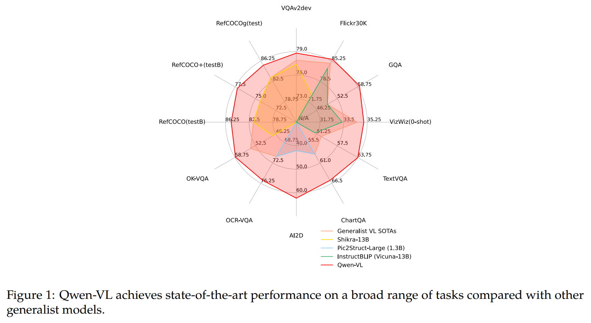

# 1 Introduction

최근 Large Language Models (LLMs) 은 text generation 및 comprehension 에서의 강력한 capability 로 인해 폭넓은 주목을 받아 왔다. 이러한 model 은 instruction fine-tuning 을 통해 user intent 와 더 잘 align 될 수 있으며, 그 결과 강한 interactive capability 와 intelligent assistant 로서 productivity 를 향상시킬 잠재력을 보여준다. 그러나 native large language model 은 순수한 text world 에만 존재하며, image, speech, video 와 같은 다른 일반적인 modality 를 처리하는 능력이 부족하다. 이로 인해 application scope 에 큰 제약이 발생한다. 이러한 동기에서, large language model 에 visual signal 을 지각하고 이해하는 능력을 부여하기 위해 Large Vision Language Models (LVLMs) 가 개발되었다. 이러한 large-scale vision-language model 은 실제 world 의 vision-central problem 을 해결하는 데 유망한 잠재력을 보여준다.

그럼에도 불구하고, LVLM 의 한계와 잠재력을 탐구하기 위한 많은 연구가 수행되었음에도 현재의 open-source LVLM 은 항상 불충분한 training 및 optimization 문제를 겪고 있으며, 그 결과 proprietary model 보다 크게 뒤처져 있다. 이는 open-source community 에서 LVLM 의 추가적인 탐구와 application 을 저해한다. 더 나아가, 실제 world visual scenario 는 매우 복잡하기 때문에, fine-grained visual understanding 은 LVLM 이 사람을 효과적이고 정밀하게 보조하기 위해 핵심적인 역할을 한다. 그러나 이 방향으로의 시도는 소수에 불과했으며, 대다수의 open-source LVLM 은 여전히 coarse-grained 방식으로 image 를 지각하고 object grounding 이나 text reading 과 같은 fine-grained perception 능력이 부족하다.

이 논문에서 저자는 하나의 해법을 탐구하고, open-sourced Qwen family 의 최신 구성원인 **Qwen-VL series** 를 제시한다. 

* Qwen-VL 은 Qwen-7B language model 을 기반으로 한 매우 높은 성능과 범용성을 갖춘 vision-language foundation model 의 series 이다. 
* 저자는 language-aligned visual encoder 와 position-aware adapter 를 포함하는 새로운 visual receptor 를 도입하여 LLM 기반부에 visual capacity 를 부여한다. 
* 전체 model architecture 와 input-output interface 는 매우 간결하며, 저자는 방대한 image-text corpus 위에서 전체 model 을 최적화하기 위해 3-stage training pipeline 을 정교하게 설계한다.

Qwen-VL 이라고 명명된 저자의 pre-trained checkpoint 는 visual input 을 지각하고 이해하며, 주어진 prompt 에 따라 원하는 response 를 생성하고, image captioning, question answering, text-oriented question answering, visual grounding 과 같은 다양한 vision-language task 를 수행할 수 있다. Qwen-VL-Chat 은 Qwen-VL 을 기반으로 한 **instruction-tuned vision-language chatbot** 이다. 

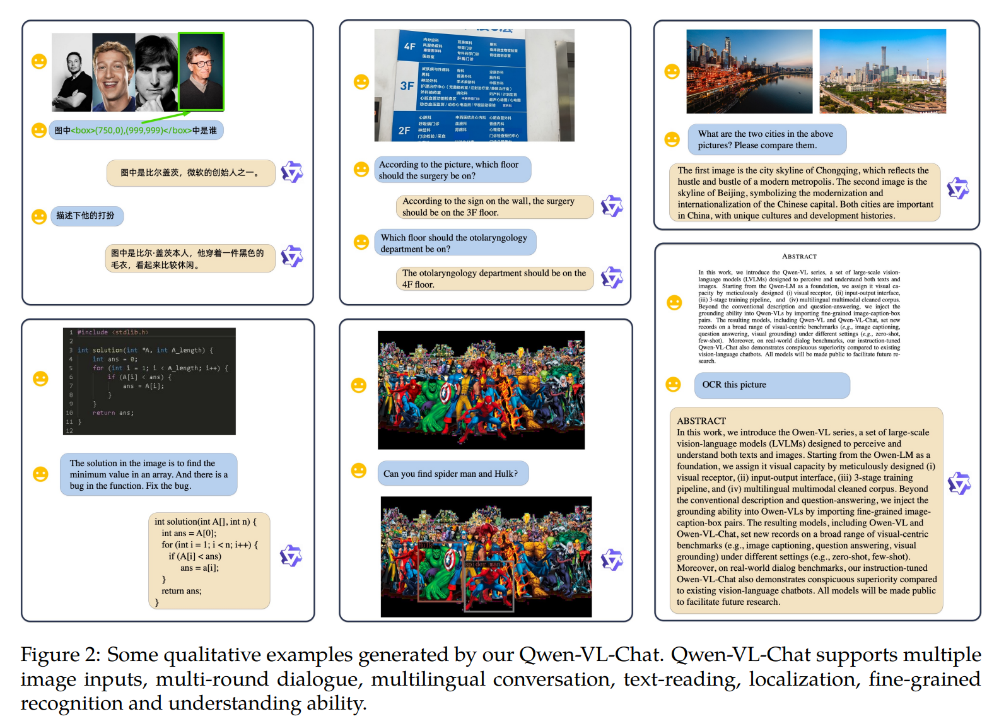

Fig. 2 에서 보이듯이, Qwen-VL-Chat 은 user 와 상호작용할 수 있으며 user 의 의도에 따라 입력 image 를 지각할 수 있다. 구체적으로, Qwen-VL series model 의 특징은 다음과 같다.

* Leading performance: Qwen-VL 은 유사한 scale 의 counterpart 와 비교했을 때 방대한 vision-centric understanding benchmark 에서 최고 수준의 accuracy 를 달성한다. 또한 Qwen-VL 의 뛰어난 성능은 captioning, question-answering, grounding 과 같은 전통적인 benchmark 에만 국한되지 않고, 최근 도입된 일부 dialogue benchmark 까지 포괄한다.
* Multi-lingual: Qwen-LM 과 유사하게, Qwen-VL 은 상당량의 corpus 가 English 와 Chinese 로 이루어진 multilingual image-text data 위에서 training 된다. 이러한 방식으로 Qwen-VL 은 English, Chinese, 그리고 multilingual instruction 을 자연스럽게 지원한다.
* Multi-image: training 단계에서 저자는 임의로 interleaved 된 image-text data 를 Qwen-VL 의 input 으로 허용한다. 이 특징은 여러 image 가 주어졌을 때 Qwen-Chat-VL 이 이를 비교하고, 이해하고, context 를 분석할 수 있게 한다.
* Fine-grained visual understanding: training 에서 사용한 더 높은 resolution 의 input size 와 fine-grained corpus 덕분에, Qwen-VL 은 매우 경쟁력 있는 fine-grained visual understanding 능력을 보인다. 기존 vision-language generalist 와 비교했을 때, Qwen-VL 은 grounding, text-reading, text-oriented question answering, 그리고 fine-grained dialog 성능에서 훨씬 더 우수하다.

# 2 Methodology

## 2.1 Model Architecture

Qwen-VL 의 전체 network architecture 는 3 개의 component 로 구성되며, model parameter 의 세부 사항은 Tab. 1 에 제시되어 있다.

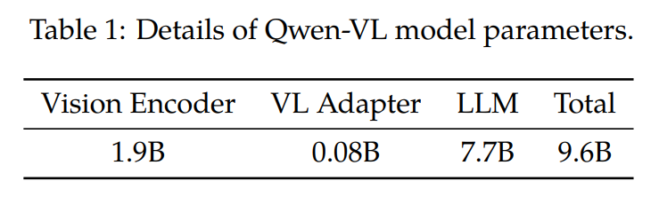

* **Large Language Model:** Qwen-VL 은 foundation component 로 large language model 을 채택한다. 이 model 은 Qwen-7B 의 pre-trained weight 로 initialize 된다.
* **Visual Encoder:** Qwen-VL 의 visual encoder 는 Vision Transformer (ViT) architecture 를 사용하며, Openclip 의 ViT-bigG 의 pre-trained weight 로 initialize 된다. 
  * training 과 inference 동안 모두, 입력 image 는 특정 resolution 으로 resize 된다. 
  * visual encoder 는 stride 14 로 image 를 patch 로 분할하여 image feature 의 집합을 생성하면서 image 를 처리한다.
* **Position-aware Vision-Language Adapter:** 긴 image feature sequence 에서 발생하는 efficiency 문제를 완화하기 위해, Qwen-VL 은 image feature 를 압축하는 vision-language adapter 를 도입한다. 
  * 이 adapter 는 무작위로 initialize 된 single-layer cross-attention module 로 구성된다. 
  * 이 module 은 trainable vector (Embeddings) 의 group 을 query vector 로 사용하고, visual encoder 에서 얻은 image feature 를 key 로 사용하여 cross-attention 연산을 수행한다. 이 mechanism 은 visual feature sequence 를 길이 256 의 고정된 길이로 압축한다. 
    * query 수에 대한 ablation 은 Appendix E.2 에 제시되어 있다. 
  * 추가로, fine-grained image comprehension 에서 positional information 의 중요성을 고려하여, compression 동안 positional detail 이 손실될 가능성을 완화하기 위해 cross-attention mechanism 의 query-key pair 에 2D absolute positional encoding 을 도입한다. 
  * 이후 길이 256 의 압축된 image feature sequence 가 large language model 로 입력된다.

## 2.2 Inputs and Outputs

* **Image Input:** image 는 visual encoder 와 adapter 를 통해 처리되며, 그 결과 고정 길이의 image feature sequence 가 생성된다. 
  * image feature input 과 text feature input 을 구분하기 위해, 두 개의 special token 인 `` 와 `</img>` 를 각각 image feature sequence 의 시작과 끝에 추가하여 image content 의 시작과 끝을 나타낸다.
* **Bounding Box Input and Output:** model 의 fine-grained visual understanding 및 grounding capability 를 향상시키기 위해, Qwen-VL 의 training 은 region description, question, detection 형태의 data 를 포함한다. 
  * image-text description 이나 question 을 다루는 기존 task 와 달리, 이 task 는 지정된 format 으로 region description 을 정확하게 이해하고 생성하는 능력을 model 에 요구한다. 
  * 임의의 bounding box 에 대해, normalization process 를 적용하고 값 범위를 $[0, 1000)$ 내로 맞춘 뒤, 이를 지정된 string format 인 `"(Xtoplef t, Ytoplef t),(Xbottomright, Ybottomright)"` 로 변환한다. 
    * 이 string 은 text 로 tokenization 되며, 추가적인 positional vocabulary 를 필요로 하지 않는다. 
  * detection string 과 일반 text string 을 구분하기 위해, bounding box string 의 시작과 끝에 두 개의 special token 인 `<box>` 와 `</box>` 를 추가한다. 
  * 또한 bounding box 와 그에 대응하는 descriptive word 또는 sentence 를 적절히 연결하기 위해, 또 다른 special token 집합인 `<ref>` 와 `</ref>` 를 도입하여 bounding box 가 가리키는 content 를 표시한다.

# 3 Training

Fig. 3 에 나타난 바와 같이, Qwen-VL model 의 training process 는 3 단계로 구성된다. 즉, 2 단계의 pre-training 과 마지막 instruction fine-tuning training 단계이다.

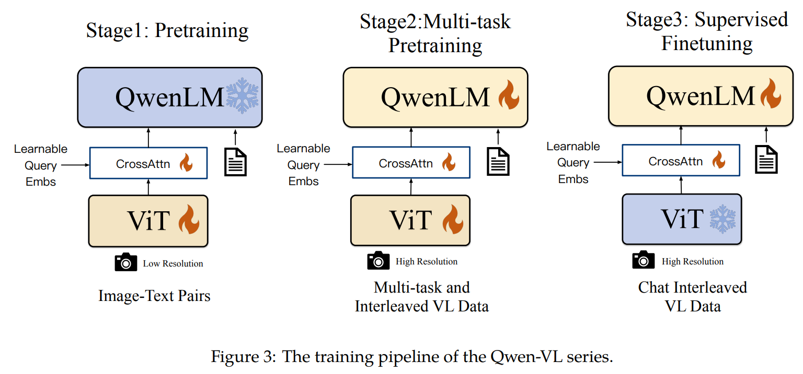

## 3.1 Pre-training

첫 번째 pre-training 단계에서, 저자는 주로 large-scale, weakly labeled, web-crawled image-text pair 집합을 사용한다. 

pre-training dataset 은 여러 공개적으로 접근 가능한 source 와 일부 in-house data 로 구성된다. 저자는 dataset 에 존재하는 특정 pattern 을 정제하기 위해 노력했다. Tab. 2 에 요약된 바와 같이, 원래 dataset 은 총 50 억 개의 image-text pair 를 포함하며, cleaning 이후에는 14 억 개의 data 가 남는다. 이 중 77.3% 는 English (text) data 이고 22.7% 는 Chinese (text) data 이다.

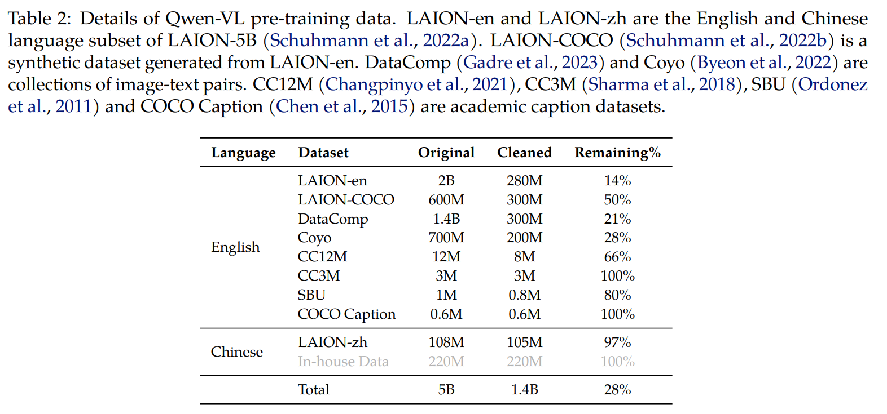

* Tab. 2 는 Qwen-VL pre-training data 의 세부 사항을 제시한다. LAION-en 과 LAION-zh 는 LAION-5B 의 English 및 Chinese language subset 이다. 
* LAION-COCO 는 LAION-en 으로부터 생성된 synthetic dataset 이다. DataComp 와 Coyo 는 image-text pair 의 collection 이다. CC12M, CC3M, SBU, COCO Caption 은 academic caption dataset 이다.

---

* 이 단계에서 저자는 large language model 을 freeze 하고 vision encoder 와 VL adapter 만 optimize 한다. 
* 입력 image 는 $224 \times 224$ 로 resize 된다. training objective 는 text token 의 cross-entropy 를 최소화하는 것이다. 
* 최대 learning rate 는 $2e^{-4}$ 이고, training process 는 image-text pair 에 대해 batch size 30720 을 사용한다. 
* 첫 번째 pre-training 전체 단계는 50,000 step 동안 지속되며, 약 15 억 개의 image-text sample 을 소비한다. 

더 많은 hyperparameter 는 Appendix C 에 자세히 설명되어 있고, 이 단계의 convergence curve 는 Fig. 6 에 제시되어 있다.

## 3.2 Multi-task Pre-training

두 번째 multi-task pre-training 단계에서, 저자는 더 큰 input resolution 과 interleaved image-text data 를 갖는 high-quality, fine-grained VL annotation data 를 도입한다. Tab. 3 에 요약된 바와 같이, 저자는 7 개의 task 에 대해 동시에 Qwen-VL 을 학습시켰다.

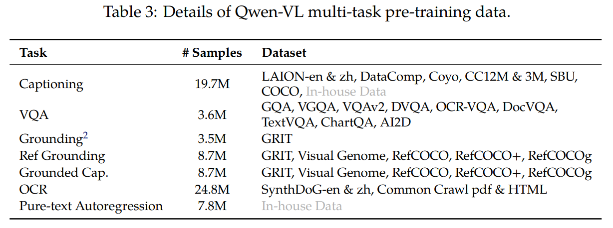

* text generation 을 위해, 저자는 LLM 의 capability 를 유지하기 위해 in-house 수집 corpus 를 사용한다.
* captioning data 는 sample 수가 훨씬 적고 LAION-COCO 를 제외한다는 점을 제외하면 Tab. 2 와 동일하다.
* VQA task 를 위해, 저자는 GQA, VGQA, VQAv2, DVQA, OCRVQA, DocVQA 를 포함하는 공개 data 의 mixture 를 사용한다.
* grounding task 를 위해, 저자는 Kosmos-2 를 따라 GRIT dataset 을 약간 수정하여 사용한다.
* reference grounding 및 grounded captioning duality task 를 위해, 저자는 GRIT, Visual Genome, RefCOCO, RefCOCO+, RefCOCOg 로부터 training sample 을 구성한다.
* text-oriented task 를 향상시키기 위해, 저자는 Common Crawl 에서 pdf 및 HTML format data 를 수집하고, 자연 풍경 background 를 사용하여 English 및 Chinese language 의 synthetic OCR data 를 생성한다.
* 마지막으로, 저자는 동일 task data 를 길이 2048 의 sequence 로 packing 하여 interleaved image-text data 를 단순하게 구성한다.

---

저자는 visual encoder 의 input resolution 을 $224 \times 224$ 에서 $448 \times 448$ 로 증가시켜, image down-sampling 에 의해 발생하는 information loss 를 줄인다. 또한 vision transformer 의 더 높은 resolution 에 대해, window attention 과 global attention 에 대한 ablation 을 Appendix E.3 에 제시한다. 저자는 large language model 을 unlock 하고 전체 model 을 학습시켰다. training objective 는 pre-training 단계와 동일하다.

## 3.3 Supervised Fine-tuning

이 단계에서 저자는 instruction following 및 dialogue capability 를 향상시키기 위해 instruction fine-tuning 을 통해 Qwen-VL pre-trained model 을 fine-tune 하였고, 그 결과 interactive 한 Qwen-VL-Chat model 을 얻었다. 

multi-modal instruction tuning data 는 주로 caption data 또는 LLM self-instruction 을 통해 생성된 dialogue data 에서 오는데, 이러한 data 는 종종 single-image dialogue 및 reasoning 만 다루며 image content comprehension 에 한정된다. 

저자는 localization 및 multi-image comprehension capability 를 Qwen-VL model 에 포함시키기 위해 manual annotation, model generation, strategy concatenation 을 통해 추가적인 dialogue data 집합을 구성한다. 저자는 model 이 이러한 capability 를 더 넓은 범위의 language 와 question type 으로 효과적으로 transfer 한다는 것을 확인한다. 

추가로, 저자는 dialogue capability 에서 model 의 universality 를 보장하기 위해 training 동안 multi-modal dialogue data 와 pure text dialogue data 를 혼합한다. instruction tuning data 의 양은 350k 이다. 이 단계에서 저자는 visual encoder 를 freeze 하고 language model 및 adapter module 을 optimize 한다. 저자는 이 단계의 data format 을 Appendix B.2 에서 보여준다.

# 4 Evaluation

이 section 에서 저자는 다양한 multi-modal task 에 대한 전반적인 evaluation 을 수행하여 저자 model 의 visual understanding ability 를 종합적으로 평가한다. 이하에서, Qwen-VL 은 multi-task training 이후의 model 을 의미하고, Qwen-VL-Chat 은 supervised fine-tuning (SFT) stage 이후의 model 을 의미한다. Tab. 9 는 사용된 evaluation benchmark 와 이에 대응하는 metric 을 자세히 요약하여 제시한다.

## 4.1 Image Caption and General Visual Question Answering

image caption 과 general visual question answering (VQA) 은 vision-language model 을 위한 두 가지 전통적인 task 이다. 구체적으로, image caption 은 주어진 image 에 대해 description 을 생성할 것을 model 에 요구하고, general VQA 는 주어진 image-question pair 에 대해 answer 를 생성할 것을 model 에 요구한다.

image caption task 를 위해, 저자는 Nocaps 와 Flickr30K 를 benchmark 로 선택하고, metric 으로 CIDEr score 를 보고한다. 저자는 `"Descripe the image in English:"` 라는 prompt 와 함께 greedy search 를 사용하여 caption 을 생성한다.

general VQA 를 위해, 저자는 VQAv2, OKVQA, GQA, ScienceQA (Image Set), VizWiz VQA 를 포함하는 5 개의 benchmark 를 사용한다. VQAv2, OKVQA, GQA, VizWiz VQA 에 대해서는, 저자는 `"{question} Answer:"` 라는 prompt 와 greedy decoding strategy 를 사용한 open-ended answer generation 을 적용하며, model 의 output space 에 어떤 constrain 도 두지 않는다. 그러나 ScienceQA 에 대해서는, 저자는 model 의 output 을 가능한 option 으로 제한하고, open-ended 방식 대신 가장 높은 confidence 를 가진 option 을 model prediction 으로 선택하며, Top-1 accuracy 를 보고한다.

image caption 및 general VQA task 에 대한 전체 성능은 Tab. 4 에 보고되어 있다. 결과에서 보이듯이, Qwen-VL 과 Qwen-VL-Chat 은 두 task 모두에서 이전 generalist model 과 비교해 명백히 더 나은 result 를 달성한다.

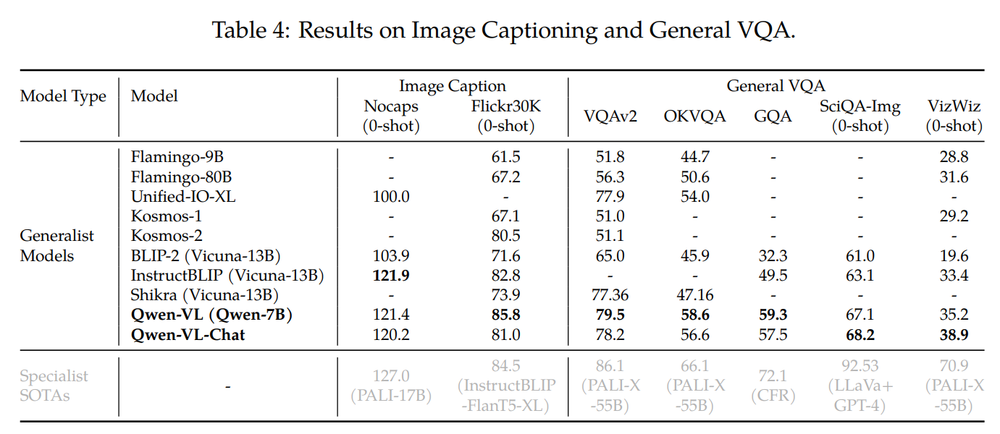

* zero-shot image caption task 에서, Qwen-VL 은 Flickr30K karpathy-test split 에서 state-of-the-art 성능, 즉 85.8 CIDEr score 를 달성하며, 심지어 훨씬 더 많은 parameter 를 가진 이전 generalist model 도 능가한다. 예를 들어, 80B parameter 를 가진 Flamingo-80B 를 능가한다.
* general VQA benchmark 에서도, 저자 model 은 다른 model 과 비교해 뚜렷한 장점을 보인다.
  * VQAv2, OKVQA, GQA benchmark 에서, Qwen-VL 은 각각 79.5, 58.6, 59.3 accuracy 를 달성하며, 이는 최근 제안된 LVLM 을 큰 폭으로 능가하는 수치이다.
  * 또한 Qwen-VL 이 ScienceQA 와 VizWiz dataset 에서도 강한 zero-shot 성능을 보인다는 점은 주목할 만하다.

## 4.2 Text-oriented Visual Question Answering

text-oriented visual understanding 은 실제 world scenario 에서 폭넓은 application prospect 를 가진다. 저자는 TextVQA, DocVQA, ChartQA, AI2Diagram, OCR-VQA 를 포함하는 여러 benchmark 에서 text-oriented visual question answering 에 대한 저자 model 의 ability 를 평가한다. 

마찬가지로, result 는 Tab. 5 에 제시되어 있다. 이전 generalist model 및 최근 LVLM 과 비교할 때, 저자 model 은 대부분의 benchmark 에서 더 나은 성능을 보이며, 그 차이는 자주 큰 폭으로 나타난다.

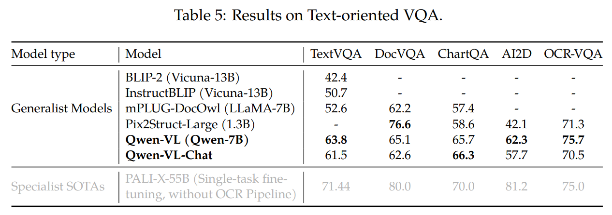

## 4.3 Refer Expression Comprehension

저자는 RefCOCO, RefCOCOg, RefCOCO+, GRIT 와 같은 refer expression comprehension benchmark 들에 대한 evaluation 을 통해 저자 model 의 fine-grained image understanding 및 localization ability 를 보여준다. 구체적으로, refer expression comprehension task 는 description 의 안내 아래 target object 를 localization 할 것을 model 에 요구한다. result 는 Tab. 6 에 제시되어 있다. 이전 generalist model 이나 최근 LVLM 과 비교할 때, 저자 model 은 모든 benchmark 에서 top-tier result 를 얻는다.

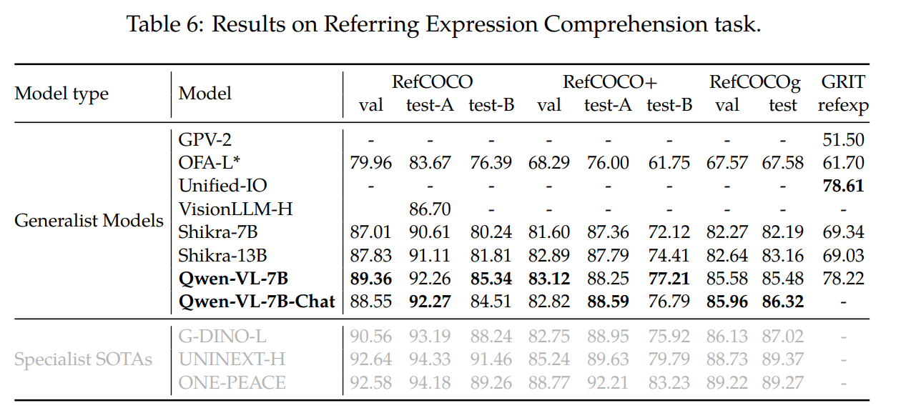

## 4.4 Few-shot Learning on Vision-Language Tasks

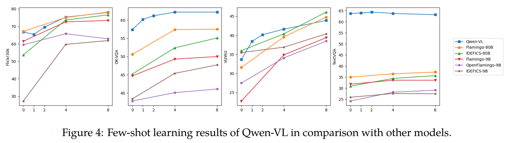

저자 model 은 또한 만족스러운 in-context learning, 즉 few-shot learning ability 를 보인다. 

* Fig. 4 에서 보이듯이, Qwen-VL 은 OKVQA, Vizwiz, TextVQA, Flickr30k 에서 in-context few-shot learning 을 통해 더 나은 성능을 달성하며, 이는 유사한 수의 parameter 를 가진 model 과 비교한 결과이다. 
  * 여기에는 Flamingo-9B, OpenFlamingo-9B, IDEFICS-9B 가 포함된다. Qwen-VL 의 성능은 훨씬 더 큰 model 인 Flamingo-80B 및 IDEFICS-80B 와도 비교 가능한 수준이다. 
* 저자는 few-shot exemplar 를 구성하기 위해 단순한 무작위 sample 방식을 채택하며, 더 나은 result 를 얻을 수 있음에도 RICES 와 같은 정교한 few-shot exemplar construction method 는 사용하지 않는다.

## 4.5 Instruction Following in Real-world User Behavior

기존의 전통적인 vision-language evaluation 에 더해, 실제 world user behavior 하에서 Qwen-VL-Chat model 의 capacity 를 평가하기 위해 저자는 TouchStone, SEED-Bench, MME 에 대한 evaluation 을 추가로 수행한다.

* TouchStone 은 open-ended vision-language instruction-following benchmark 이다.
  * 저자는 TouchStone benchmark 에서 English 와 Chinese 모두에 대해, Qwen-VL-Chat 의 instruction-following ability 를 다른 instruction-tuned LVLM 과 비교한다.
* SEED-Bench 는 Multimodal LLM 을 평가하기 위한 정확한 human annotation 이 부여된 19K 개의 multiple-choice question 으로 구성되며, spatial 및 temporal understanding 을 모두 포함하는 12 개의 evaluation dimension 을 포괄한다.
* MME 는 총 14 개의 subtask 에 대해 perception 과 cognition ability 를 모두 측정한다.

세 benchmark 에 대한 result 는 Tab. 7 에 제시되어 있다. 

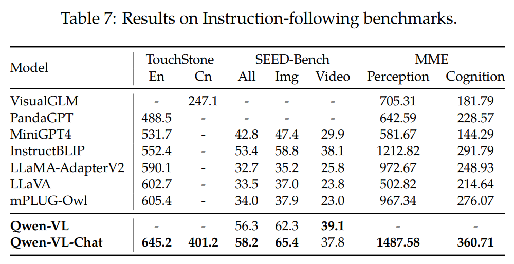

Qwen-VL-Chat 은 세 dataset 모두에서 다른 LVLM 대비 뚜렷한 장점을 달성하였으며, 이는 저자 model 이 다양한 user instruction 을 이해하고 답변하는 데 더 우수하게 작동함을 나타낸다.

* SEED-Bench 에서, 저자는 단순히 4 개 frame 을 sampling 하는 것만으로도 model 의 visual capability 가 video task 로 효과적으로 transfer 될 수 있음을 발견했다.
* TouchStone 에 제시된 전체 score 측면에서, 저자 model 은 다른 LVLM 과 비교해 명확한 우위를 보이며, 특히 Chinese capability 측면에서 그러하다.
* broad category 수준의 ability 측면에서, 저자 model 은 understanding 및 recognition 에서 더욱 두드러진 장점을 보이며, 특히 text recognition 및 chart analysis 와 같은 영역에서 그러하다.

더 자세한 정보는 TouchStone dataset 을 참조하기 바란다.

# 5 Related Work

최근 몇 년 동안, 연구자들은 vision-language learning 에 상당한 관심을 보여 왔으며, 특히 multi-task generalist model 의 개발에 큰 관심을 기울여 왔다.

* CoCa 는 image-text retrieval 과 vision-language generation task 를 동시에 다루기 위해 encoder-decoder 구조를 제안한다.
* OFA 는 customized task instruction 을 사용하여 특정 vision-language task 를 sequence-to-sequence task 로 변환한다.
* Unified I/O 는 segmentation 과 depth estimation 같은 더 많은 task 를 unified framework 에 추가로 도입한다.

또 다른 연구 범주는 vision-language representation model 구축에 초점을 맞춘다.

* CLIP 은 contrastive learning 과 대규모 data 를 활용하여 image 와 language 를 semantic space 에서 align 하며, 그 결과 광범위한 downstream task 전반에서 강한 generalization capability 를 얻는다.
* BEIT-3 는 mixture-of-experts (MOE) 구조와 unified masked token prediction objective 를 사용하여, 다양한 visual-language task 에서 state-of-the-art result 를 달성한다.
* vision-language learning 에 더해, ImageBind 와 ONE-PEACE 는 speech 와 같은 더 많은 modality 를 unified semantic space 에 align 하여, 더 일반적인 representation model 을 만든다.

유의미한 진전을 이루었음에도 불구하고, 이전 vision-language model 은 여전히 여러 한계를 가진다. 예를 들어, instruction following 에서의 낮은 robustness, unseen task 에서의 제한된 generalization capability, 그리고 in-context ability 의 부족이 있다. large language model (LLMs) 의 급속한 발전과 함께, 연구자들은 LLM 기반의 더 강력한 large vision-language model (LVLMs) 을 구축하기 시작했다.

* BLIP-2 는 freeze 된 vision foundation model 과 LLM 을 align 하기 위해 Q-Former 를 제안한다.
* 한편, LLAVA 와 MiniGPT4 는 LVLM 의 instruction following capability 를 향상시키기 위해 visual instruction tuning 을 도입한다.
* 또한, mPLUG-DocOwl 은 digital document data 를 도입함으로써 LVLM 에 document understanding capability 를 통합한다.
* Kosmos2, Shikra, BuboGPT 는 visual grounding capability 를 추가로 강화하여, region description 과 localization 을 가능하게 한다.

이 연구에서 저자는 image captioning, visual question answering, OCR, document understanding, visual grounding capability 를 Qwen-VL 에 통합한다. 그 결과 model 은 이러한 다양한 style 의 task 에서 뛰어난 성능을 달성한다.

# 6 Conclusion and Future Work

저자는 multimodal research 를 촉진하는 것을 목표로 하는 large-scale multilingual vision-language model 집합인 Qwen-VL series 를 공개한다. Qwen-VL 은 다양한 benchmark 에서 유사한 model 을 능가하며, multilingual conversation, multi-image interleaved conversation, Chinese 에서의 grounding, 그리고 fine-grained recognition 을 지원한다. 앞으로 저자는 다음과 같은 몇 가지 핵심 dimension 에서 Qwen-VL 의 capability 를 추가로 향상시키는 데 전념한다.

* speech 와 video 같은 더 많은 modality 와 Qwen-VL 을 통합하는 것.
* model size, training data, 그리고 더 높은 resolution 을 확장하여 Qwen-VL 을 증강하고, 이를 통해 multimodal data 내의 더 복잡하고 정교한 관계를 처리할 수 있게 하는 것.
* 특히 high-fidelity image 와 fluent speech 를 생성하는 방향으로, Qwen-VL 의 multi-modal generation 능력을 확장하는 것.
