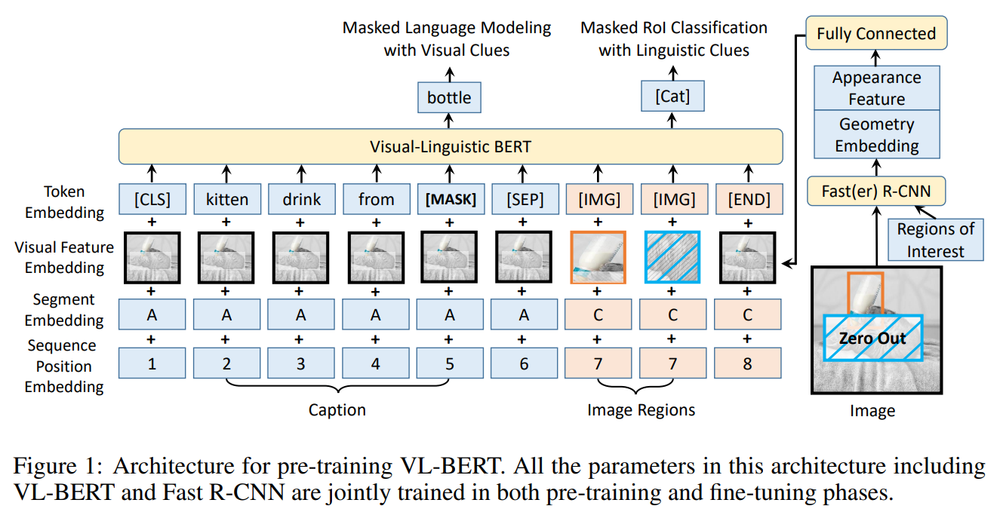
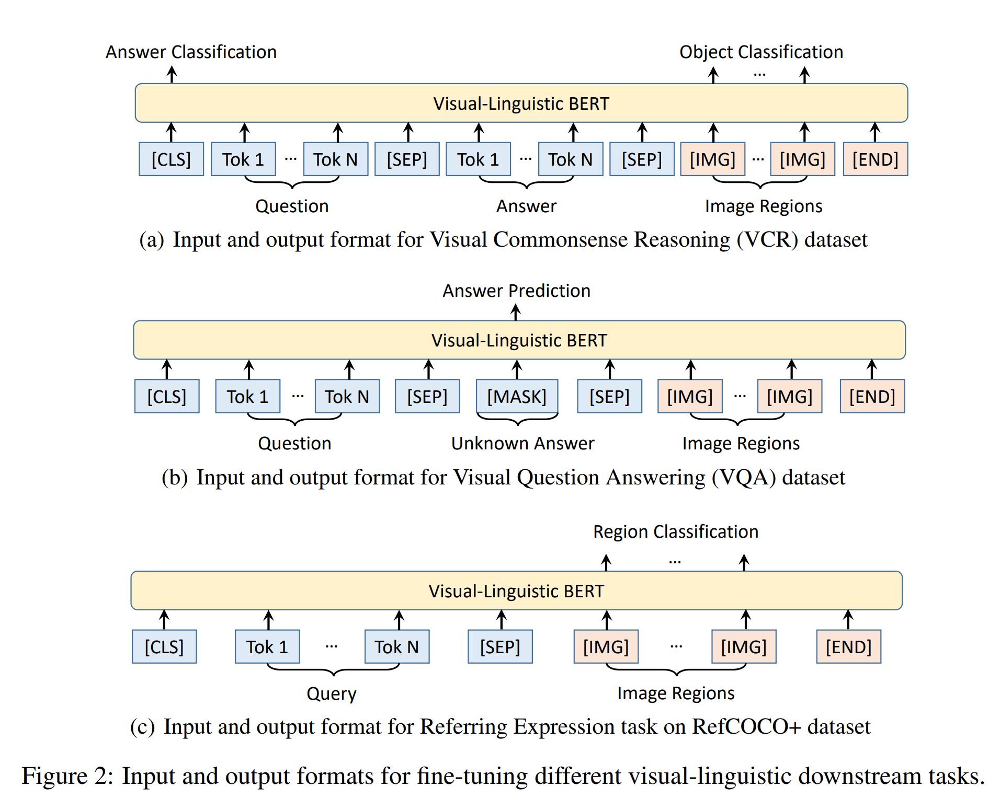
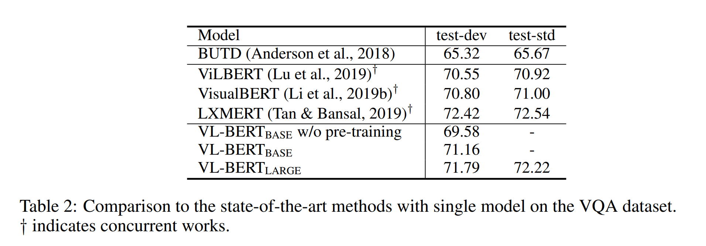
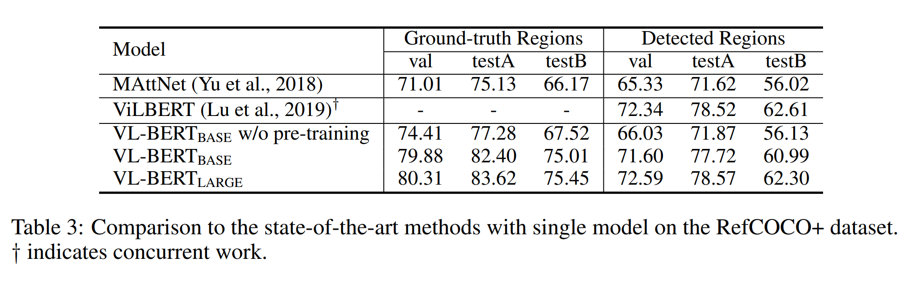
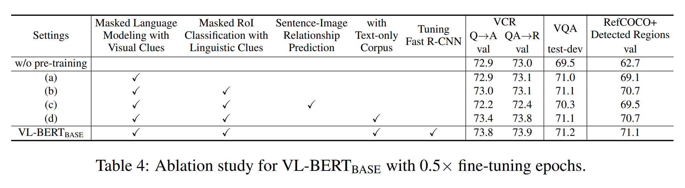

논문 및 이미지 출처 : <https://arxiv.org/pdf/1908.08530.pdf>

# Abstract

vision-linguistic task 를 위한 new pre-trainable generic representaton 소개. 이를 Visual-Linguistic BERT (VL-BERT)라고 한다. 

- 간단하면서도 강력한 Transformer 모델을 기반으로 채택
- visual 및 linguistic embedded features 를 모두 input 으로 확장
  - 여기서 입력의 각 요소는 input sentence 의 word 거나 input image 의 region-of-interest (RoI) 중 하나
- VL-BERT 는 대부분의 visual-linguistic downstream task 에 적합하도록 설계
- generic representation 을 더 잘 활용하기 위해, massive-scale Conceptual Captions dataset 및 text-only corpus 를 함께 VL-BERT pre-train
- 광범위한 실험 분석 결과, pre-training procedure 가 visual-linguistic 단서를 더 잘 조율하고 visual commonsense reasoning, visual question answering 및 referring expression comprehension 같은 downstream task 에 도움됨을 보여줌
- VCR 벤치마크의 single model 로 1등을 차지함에 유의한 가치가 있음

# 1. Introduction

다양한 domain tasks 에 적용 가능한 generic feature representation 의 pre-training 은 성공의 상징

- Vision : pre-training ImageNet classification 으로 설계되어 다양한 image recognition task 에 효과적
- NLP : large corpus 에 "masked language model" (MLM) objective pre-training Transformer 가 다양한 NLP task 에 뛰어난 성과 거둠

하지만 vision-language intersection tasks: visual question answering (VQA), visual commonsense reasoning (VCR) 같은 task 에는 위같은 pre-trained generic feature representation 이 부족함.

이전엔 image recognition 을 위한 pre-trained netowkr 와 NLP 를 각각 task-specific way 로 결합했지만, task-specific model 은 visual-linguistic pre-training 없이 specific target task 에 fine-tuning 되어, target task 가 희소한 경우 overfitting 에 시달릴 수 있으며 pre-training 의 이점을 얻기 어렵다.

pre-training task 가 target task 와 매우 다르기 때문이며, visual-linguistic tasks 에 대한 common ground 가 부족하다.

---

vision-linguistic task 를 위한 여러 아키텍처의 목표 중 하나는 vision 및 linguistic domain 의 multi-modal information 을 효과적으로 집계하는 것

- VQA task 에서 correct answer 를 선택하기 위해 question 과 answer 에서 visual information 을 통합하고 input image 에서 visual information 을 집계하며 linguistic meaning 을 visual clues 와 일치시키는 것 필요 $\rightarrow$ 저자는 visual 및 linguistic information 을 효과적으로 일치시키는 generic representation 을 도출하는 것
- NLP 에서 Transformer attention 이 성공적이며, BERT 의 MLM-based pre-training 고 함께 사용 가능
- attention module 은 sentence 의 word embedded features 를 aligning 하는데 강력/유연하며, 성능 향상

---

위를 바탕으로 VL-BERT 라는 vision-linguistic task 를 위한 pre-trainable generic representation 개발 (Fig. 1)

- VL-BERT 는 visual 및 linguistic embedded features 를 모두 input 으로 취하는 (multi-modal) Transformer attention module
- 각 요소는 input sentence 의 word 거나 input image 의 region-of-interest (RoI) 중 하나며, 특정 입력 형식 구분을 위해 특정 special elements 도 함께 있음
- 각 요소는 contents, position, categories 등 정의된 호환성에 따라 모든 다른 요소에서 정보를 적응적으로 집계 가능
  - word / RoI 의 content features : domain specific (WordPiece embedding 을 word features, RoI 의 경우 Fast R-CNN features)
- multi-modal Transformer attention modules 를 multiple layers 쌓음으로써, 파생된 representation 은 visual-linguistic clues 를 효과적으로 집계하고 정렬하는 데 풍부한 능력 갖음
- specific visual-linguistic tasks 를 위해 task-specific branches 추가 가능

---

더 나은 generic representation 활용을 위해 VL-BERT 를 large visual-linguistic corpus 및 text-only dataset 에 pre-training

- pre-training loss on visual-linguistic corpus 는 randomly masked words 또는 RoI 를 예측
  - 이러한 pre-training 은 VL-BERT 의 visual-linguistic clues 를 집계하고 정렬하는 능력을 강화
  - 반면 loss on text-only corpus 는 BERT 의 standard MLM loss 로, 긴 및 복잡한 문장에 대한 일반화를 향상

---

종합적인 경험적 증거로 VL-BERT 는 visual question answering 및 referring expression comprehension 같은 visual-linguistic downstream tasks 에서 SOTA (리더보드 1위) 달성

# 2. Related Work

#### Pre-training for Computer Vision

deep network 전엔 pre-training 이 성숙하지 않아, vision task model 에 generic representation 을 유도하기 위해 다양한 설계 선택이 있었다.

ImageNet classification 에서 AlexNet 이 성공적인 convolution neural network (CNNs) 로 부활한 후 ImageNet pre-trained CNNs 는 object detection, semantic segmantation, instance segmentation 같은 downstream task 를 향상

최근은 ImageNet pre-training 없이 messive-scale target dataset 에 scratch CNNs training 연구도 있다.

- 이는 ImageNet pre-training 의 성능과 비슷
- 하지만 scarce data 의 target task 의 성능 향상을 위해 적절한 massive dataset 의 pre-training 이 중요하다 강조

#### Pre-training for Natural Language Processing (NLP)

low-level linguistic feature representation 인 word embedding 개선을 위한 연구가 있었으며, 이를 기반으로 다양한 NLP task architecture 가 설계 되었다.

Transformer 에서 Transformer attention module 이 다양한 NLP task 에 대한 generic block 으로 제안된 후, GPT, BERT, GPT-2, XLNet, XLM 및 RoBERTa 같은 방식이 제안

이 중 BERT 는 간단하고 우수한 성능으로 인기가 많다.

#### Pre-training for Visual-Linguistic Tasks

visual-linguistic tasks 에 대한 모델은 specific task 에 대해 조합하는 방식으로 진행되고 model training 또한 specific dataset 에서만 수행됐다.

- VisualBERT : visual-linguistic task 에 대한 pre-training 첫 시도
  - video clip 에서 파생된 clusters (visual words) 에 할당
  - masked video clips 로 cluster ID 를 예측함으로서 pre-training loss 발생
  - video clip 의 급격한 clustering 으로 인해 visual content 가 손실되고 visual network parameter 의 upadte 가 힘듦
- CBR : 위의 clustering mechanism 제거
- 위 두 연구는 time dimension 에서 linear structure 를 갖는 video 에 적용된다. image-based visual-linguistic task 에 연구하는 것이 바람직

최근 visual-linguistic task 를 위한 generic representation 유도를 위한 노력이 있다.

- ViLBERT, LXMERT : input sentence 및 image 에 적용되는 two single-modal network
- two source 의 information 을 결합하는 cross-modal Transformer 사용하여 향상
- ViLBERT 는 two-stream 설계가 single-stream 통합보다 우수하다 주장
  - VL-BERT 는 attention pattern 에한이 없는 Transformer 기반으로한 통합
  - visual-linguistic content 를 VL-BERT 아 주입하여 초기에 자유롭게 상호작용
  - VL-BERT 는 two-stream 설계보다 우수

또한, VL-BERT 와 다른 최근 연구 간의 세 가지 주목할만한 차이점이 존재

1. 다른 모든 최근 연구 (e.g. ViLBERT 및 LXMERT) 에서 사용된 Sentence-Image Relationship Prediction task 가 visual-linguistic representation pre-training 에 도움이 되지 않음을 발견
   - 따라서 이러한 task 는 VL-BERT 에 포함하지 않음 
2. VL-BERT 를 visual-linguistic 및 text-only dataset 에 pre-training
   - 이러한 joint pre-training 은 long 및 complex sentences 대한 일반화를 향상
3. visual representation 의 향상된 tuning
   - VL-BERT 에선 visual feature 를 파생시키는 Fast R-CNN 의 parameter 도 update
   - visual clue 를 사용한 masked RoI Classification Pre-training task 에서 visual clues 누출을 피하기 위해 masking task 가 convolution layer 의해 생성된 feature map 이 아닌 input raw pixel 에서 수행

# 3. VL-BERT

## 3.1 Revisit BERT Model

$x=\{x_1, \dots, x_N\}$ 을 BERT 의 input 요소라 하자. 이는 embedded feature encoding sentence words 이다.

이는 multi-layer bidirectional Transformer 로 처리한다.

- 각 요소의 embedding features 는 adaptive attention weights 와 함께 다른 요소로부터의 feature 를  집계하는 방식으로 layer-by-layer 로 변환

$x^l = \{ x^l_1, \dots x^l_N\}$ 이 $l$-th layer 의 feature 라 하자. ($x^0$ 은 input $x$ 로 설정)

$(l+1)$-th layer 의 features $x^{l+1}$ 은 다음과 같이 계산

$$
\begin{align}
  \tilde{h}^{l+1}_i &= \sum^M_{m=1}W^{l+1}_m \left \{ \sum^N_{j=1} A^m_{i,j} \cdot V^{l+1}_m x_j^l \right \} && \text{Multi-head Attention,} \\
  h^{l+1}_i &= \text{LayerNorm}(x^l_i + \tilde{h}^{l+1}_i) && \text{Residual Connection,} \\
  \tilde{x}^{l+1}_i &= W^{l+1}_2 \cdot \text{GELU}(W^{l+1}_1 h^{l+1}_i + b^{l+1}_1) + b^{l+1}_2 && \text{Feed-forward,} \\
  x^{l+1}_i &= \text{LayerNorm}(h^{l+1}_i + \tilde{x}^{l+1}_i) && \text{Residual Connection,}
 \end{align}
$$

- $m$ : attention heads index
- $A^m_{i,j} \propto \exp[ (Q^{l+1}_m x_i^l)^T(K_m^{l+1} x^l_i) ]$  : $m$-th head 의 $i$ 와 $j$ 간의 attention weights
  - 이는 $\sum^N_{j=1} A^m_{i,j} = 1$ 로 normalizing
- $W^{l+1}_m, Q^{l+1}_m, K^{l+1}_m$ 및 $V^{l+1}_m$ : $m^{th}$ attention heads 에 대한 learnable weights
- $W^{l+1}_1, W^{l+1}_2$ 및 $b^{l+1}_1$ 및 $b^{l+1}_2$ : learnable weights 및 biases

---

- 위 Eq. 1~4 operation 은 input sequence 의 order 에 관계없이 적용되며, 즉 permuted input 의 final BERT representation 은 동일한 permutation 을 거친 original input 의 final BERT representation 과 동일하다.
- BERT 의 position elements 는 sequence positional embedding 에 의해 해당 element 의 embedding feature 에 인코딩

이러한 분리된 representation 덕에 BERT 는 다양한 NLP 에 pre-training 및 fine-tuning 가능

BERT pre-training 에는 masked language modeling (MLM) 을 도입했으며, 특정 input word 의 embedding feature 가 randomly masking (special token [MASK] 로 대체)

BERT 는 모든 다른 unmasked elements 의 언어적 단서로부터 masked words 를 예측하도록 훈련

BERT 의 overall MLM-based training 다음의 joint probability distribution 을 최적화하는 것과 동일

$$
\begin{equation}
  \log P(x|\theta) = \frac{1}{Z(\theta)} \sum^N_{i=1} \log \phi_i (x|\theta),
\end{equation}
$$

- $\phi_i (x|\theta)$ : input $x_{\backslash i}$ 에 대한 $i$-th element 에 해당하는 BERT 의 final output feature
- $x_{\backslash i}$ : $x_{\backslash i} =\{ x_1, \dots, x_{i-1}, [\text{MASK}], x_{i+1}, \dots, x_N \}$

MLM-based loss 는 다음과 같다.

$$
\begin{equation}
  L_{\text{MLM}}(\theta) = -E_{x \sim D, i \sim \{ 1, \dots, N \}} \log \phi_i (x),
\end{equation}
$$

- $x$ : training set $D$ 에서 무작위 샘플된 sentence
- $i$ masking words 에 대한 무작위 샘플된 location

---

두 번째 pre-training task 인 Next Sentence Prediction 은 two sentence 간의 relationship 을 modeling

- two sentence 는 input document 에서 샘플하며, model 은 두 번째 sentence 가 첫 번째 sentence 의 후속 문장인지 예측
- BERT 에서 샘플된 two sentence 는 special elements [CLS] 및 [SEP] 로 각각 첫 번째와 두 번째 문장 앞에 삽입된 하나의 input sequence 로 연결
- Sigmoid classifier 가 [CLS] element 에 해당하는 final output feature 에 추가되어 예측을 수행
- input sequence 를 $x$ 로, $t \in \{0,1\}$ 로 정의하여 two sentence 간의 relationship 을 나타낸다.

loss function 은 다음과 같다.

$$
\begin{equation}
  L_{\text{NSP}} (\theta) = -E_{(x,t) \sim D} [t \log (g(x_0^L)) + (1-t) \log (1-g(x^L_0))],
\end{equation}
$$

- $x_0^L$ : [CLS] element ($L$-th layer) 의 final output feature
- $g(x^L_0)$ : classifier output

## 3.2 Model Architecture

Fig. 1 은 VL-BERT 구조

- VL-BERT 는 original BERT 을 수정하여 새로운 요소를 추가하여 visual contents 를 수용하고, visual feature embedding 에 새로운 유형의 visual feature embedding 을 넣는 방식
- BERT 와 유사하게, 백본은 multi-layer bidirectional Transformer encoder 로 구성되어, all input elements 간의 dependency modeling 을 가능케함
- BERT 는 sentence only 만 처리하는 반면, VL-BERT 는 visual 및 linguistic elements 를 모두 input 으로 받는다
  - visual elements 는 image 내의 regions-of-interest (RoI) feature, linguistic elements 는 input sentences 의 sub-words
  - RoIs 는 object detectors 또는 특정 task 의 annotation 으로 생성된 bounding boxes 일 수 있다.

---

다양한 vision-linguistic tasks (e.g. <Caption, Image> for image captioning, <Question, Answer, Image> for VQA 및 VCR) 은 입력 형식이 다양하지만 Transformer attention 의 unordered representation 특성 덕에 (e.g. sentence 의 word position 이 positional embedding 에 의해 인코딩되어 input sequence 는 순서가 아님), input elements 및 embedding features 가 적절하게 설계되면 generic representation 을 유도할 수 있다.

input elements 에는 visual, linguistic 및 다양한 input formats 이 구분되는 special elements 가 포함된다. 

- input sequence 는 항상 special classification element ([CLS]) 로 시작하여 linguistic elements 로 계속하고, visual elements 를 이어서, special ending element ([END])로 끝난다.
- linguistic elements 내의 여러 sentence 사이 및 linguistic 및 visual elements 사이에는 special separation element ([SEP])가 삽입된다.
- 각 input element 에 대한 embedding feature 는 **token embedding**, **visual feature embedding**, **segment embedding** 및 **sequence position embedding** 네 가지 유형의 embedding 의 summation
  - 이 중 visual feature embedding 은 visual clues 를 포착하기 위해 새롭게 도입
  - 다른 세 가지 embedding 은 기존 BERT 에서 제안된 설계를 따름

#### Token Embedding

BERT 를 따라, linguistic words 는 30,000 vocabulary 의 WordPiece embedding 로 embed

- 각 special element 는 special token 로 할당
- visual elements 의 경우, 각각에 special [IMG] token 할당

#### Visual Feature Embedding

먼저 visual appearance feature 및 visual geometry embedding 을 결합하여 visual feature embedding 으로 형성하는 방법 설명

- 각 RoI 에 해당하는 visual element 의 경우, visual appearance feature 는 Fast R-CNN detector (즉, Faster R-CNN detection branch)를 적용하여 추출
  - 여기서 각 RoI 의 output layer 이전의 feature vector 가 visual feature embedding 으로 사용 (2048-d)
- non-visual elements 의 경우, 해당 visual appearance features 는 input image 전체에 대해 추출된 feature
  - 이는 input image 전체를 덮는 RoI 에 Faster R-CNN 을 적용하여 얻음
- visual gemometry embedding 은 image 의 각 input visual element 의 geometry location 을 VL-BERT 에 알려주기 위해 설계
  - 각 RoI 는 $(\frac{x_{LT}}{W}, \frac{y_{LT}}{H}, \frac{x_{RB}}{W}, \frac{h_{RB}}{H})$ 처럼 4-d vector 로 표현
    - $(x_{LT}, y_{LT})$ 및 $(x_{RB}, y_{RB})$ : 각각 top-left 및 bottom-right 모서리 좌표
    - $W,H$ : input image 의 weight 및 height
    - Relation Networks 를 따라, 4-d vector 는 다른 wavelengths 의 sine 및 cosine functions 를 계산하여 high-dimensional representation 으로 임베딩
- visual feature embedding 은 input elements 각각에 붙여지며, 이는 visual appearance feature 및 visual geometry embeddings 의 연결을 입력으로 받는 fully connected layer 의 output 이다.

#### Segment Embedding

세 가지 유형의 segment A, B, C 가 다른 소스의 input elements 를 구분하기 위해 정의. 즉, A 와 B는 각각 첫 번째 및 두 번째 input sentence 의 words 를 나타내고, C 는 input image 의 RoI 를 나타냄

- 예로, <Question, Answer, Image> 의 입력 형식의 경우 A 는 Question, B 는 Answer, C 는 Image 를 나타냄
- <Caption, Image> 의 입력 형식의 경우 A 는 Caption, C 는 Image 를 나타냄
- learned segment embedding 은 어떤 segment 에 속하는지 나타내기 위해 every input element 에 추가

#### Sequence Position Embedding

learned sequence position embedding 은 BERT 와 동일하게 input element 의 order 를 나타내는 every input element 에 추가

- input visual elements 간에는 natural order 가 없으므로 input sequence 의 permutation 은 동일한 결과를 얻는다.
- 따라서 all visual elements 에 대한 sequence position embedding 은 동일

## 3.3 Pre-Training VL-BERT

VL-BERT 의 generic feature representation 은 적절히 설계된 pre-training task 로 massive-scale dataset 에 pre-training 할 수 있게 함

VL-BERT 를 visual-linguistic 및 text-only dataset 에서 pre-training

- visual-linguistic corpus 로 Conceptual Captions dataset 사용
  - 이 dataset 은 web data 에서 수집된 caption 으로 annotated image 가 약 3.3M 포함하며, automatic pipeline 으로 처리됨
  - Conceptual Captions dataset 의 문제는 caption 대부분이 simple cluses 로 구성되어 있어 downstream task 에 대해 너무 짧고 단순하다는 것
- 짧고 단순한 text scenario 의 overfitting 을 피하기 위해, VL-BERT 를 long-complex sentence 가 포함된 text-only corpus 에서도 pre-training
  - BERT pre-training 에도 사용된 BooksCorpus 및 English Wikipedia dataset 사용

---

SGD training 의 mini-batch 에서, Conceptual Captions 및 BooksCorpus & English Wikipedia 를 randomly sample (1:1 ratio)

Conceptual Captions sample 의 경우, VL-BERT 의 입력 형식은 <Caption, Image> 로 설정

여기서 image 의 RoI 는 pre-trained Faster R-CNN object detector 로 localizing 및 categorizing 된다.

Two pre-training tasks 를 사용하여 loss 를 발생시킨다.

---

#### _Task #1: Masked Language Modeling with Visual Clues_

BERT 의 MLM task 와 유사하지만 차이점은 VL-BERT 에 visual clues 가 통합되어 visual 및 linguistic contents 사이의 dependencies 를 포착한다는 것

- pre-training 중에 input sentence 의 각 words 가 randomly masking (15% probability)
- masked words 의 경우, special token [MASK] 로 대체
- 모델은 masked words 를 예측하도록 훈련. 이는 unmasked words 및 visual features 를 기반으로 함
- 이 task 는 network 가 sentence words 사이의 dependencies 를 modeling 하는 것 뿐만 아닌 visual 및 linguisitic contents 를 align 하는데 도움

예로, Fig. 1 이 input image 없이 "kitten drinking from [MASK]" 가 있다면, masked words 는 "bowl", "spoon" 및 "bottle" 같은 containers 가 될 수 있다.

- 이 representation 은 "bottle" word 와의 관련성을 포착해야함
- image 의 해당 RoIs 올바른 추측을 해야함
- pre-training 중, masked word 에 해당하는 output feature 는 vocabulary 전체의 classifier 에 주입되고 Softmax cross-entropy loss 를 발생

#### _Task #2: Masked RoI Classification with Linguistic Clues_

- image 의 각 RoI 는 randomly masking (15% probability)
- pre-training task 는 다른 단서로부터 masked RoI 의 category label 을 예측하는 것
- 다른 elements 의 visual feature embedding 에서 visual clues 유출을 방지하기 위해, masked RoI 의 픽셀을 Fast R-CNN 을 적용하기 전에 0 으로 설정
- pre-training 중 masked RoI 에 해당하는 final output feature 는 object category classification 을 위한 Softmax cross-entropy loss 를 가진 classifier 에 주입
- pre-trained Faster R-CNN 로 예측된 category label  는 ground-truth 로 설정

Fig. 1 을 예로, image 의 cat 에 해당하는 RoI 가 masking 되어 있고 category 는 visual clues 로 예측될 수 없다.

- "kitten drinking from bottle" 이란 input caption 이 있으면, 모델은 linguistic clues 로부터 category 를 추론할 수 있다.

---

BooksCorpus & English Wikipedia dataset sample 의 경우, VL-BERT 에 대한 입력 형식은 <Text, ∅> 로 되어 visual information 이 포함되지 않는다

- Fig. 1 에서 "visual feature embedding" 은 모든 단어에 대한 shaed learnable embedding
- training loss 는 BERT 같이 MLM standard task 에서 나옴

요약하면, visual-linguistic corpus pre-training 은 visual 및 linguistic contents 사이의 detailed alignment 를 향상시킴

이러한 detailed alignment 은 많은 downstream task 에 매우 중요 (e.g. Visual Grounding 에서 모델은 language query 에 기반하여 image 에 가장 관련 있는 object 나 region 을 찾는다)

한편, text-only corpus pre-training 은 long-complex sentence 를 이해하는 데 관련된 downstream task 에 용이하게 함

## 3.4 Fine-Tuning VL-BERT

VL-BERT 는 다양한 visual-linguistic task 에 대한 generic feature representation 으로 설계됨

VL-BERT 를 다양한 downstream task 에 대한 fine-tuning 은 간단

- VL-BERT 에 적절한 formatted input 및 output 을 제공하고 all parameter end-to-end fine-tuning
  - input 의 경우, typical format <Caption, Image> 와 <Question, Answer, Image> 는 주요 visual-linguistic tasks 를 커버
- VL-BERT 는 더 많은 sentence 및 image 를 지원하기 위해 적절한 segment embedding 이 도입되면 다양한 input source 를 구별할 수 가능
- output 에선 일반적으로, [CLS] element 의 final output feature 가 sentence-image-relation level 예측에 사용
- words 또는 RoIs 의 final output feature 는 word-level 및 RoI-level prediction 를 위해 사용
- input 및 output format 외에도, task-specific loss function 및 training strategies 를 tuning 해야한다

# 4. Experiment

## 4.1 Pre-Training

VL-BERT 를 Conceptual Captions 를 visual-linguistic corpus 로, BooksCorpus 및 English Wikipedia 를 text-only corpus 로 pre-training

- VL-BERT 는 visual information 을 캡처하는 new inputs 를 기존 BERT 모델에 추가하여 개발되어 BERT 와 동일한 parameter 로 초기화
- VL-BERT$_{\text{BASE}}$ 및 VL-BERT$_{\text{LARGE}}$ 각각 원래 BERT$_{\text{BASE}}$ 및 BERT$_{\text{LARGE}}$ 에서 개발된 모델을 나타냄
- VL-BERT 에 추가된 new parameter 는 평균이 0, 표준 편차가 0.02 인 Gaussian distribution 으로 무작위로 초기화
- visual content embedding 은 Faster R-CNN + ResNet-101 에 의해 생성, 이는 object detection 을 위해 pre-traing on Visual Genome parameter 로 초기화 (BUTD 참조)
- pre-training on Conceptual Captions 전에, pre-trained Faster R-CNN 을 적용하여 RoI 를 추출
  - 구체적으로, 각 image 에서 detection score 0.5 보다 높은 최대 100 개의 RoI가 선택
  - 최소 한 image 에선 detection score threshold 에 관계없이 최소 10 RoIs 가 선택됨

## 4.2 Fine-Tuning on Downstream Tasks

### 4.2.1 Visual Commonsense Reasoning (VCR)

Visual Commonsense Reasoning (VCR) 은 image 의 higher-order cognitive 및 commonsense understanding 에 초점

Zellers et al. (2019) dataset 은 주어진 image 와 categorized RoI list 가 제공되며, cognition level 의 question 이 제기됨

model 은 question 에 대한 right answer 를 택하고 이에 대한 rationable explanation 를 제공해야 함. 

각 question 에는 4 candidate answer 및 4 candidate rationales 가 있다.

이런 holistic task (Q → AR) 은 two sub-tasks 분해. 연구자들은 specific indivisual models 를 훈련 가능: question answering (Q → A) 및 answer justification (QA → R)

- VCR dataset 은 100k unique movie scenes (100k imaGES)를 포함하는 265K question, answer 및 rationale pair 로 구성
- 이는 각 213k questions 및 80k images, 27k questions 및 10k images, 25k questions 및 10k images 로 구성된 training validation, test set 으로 분할

---

VCR 의 실험 프로토콜은 R2C 와 동일

- train split 에 훈련되며, val 및 test set 에 평가
- 기존 R2C 에서, task-specific "Grounding", "Contextualization" 및 "Reasoning" module 설계
- 단순히 task 에 대한 VL-BERT 의 generic representation 채용
- Fig. 2 (a) 는 input format <Question, Answer, Image> 를 설명
  - sub-task Q $\rightarrow$ A 의 경우, 'Q' 및 'A' 가 Question section 및 Answer section 을 채움
  - sub-task QA $\rightarrow$ R 의 경우, 'Q' 및 'A' 의 연결이 Question section 을 채우고 'R' 이 Answer section 을 채움
- VL-BERT 에 대한 input RoIs 는 dataset 의 ground-truth annotations
- [CLS] element 의 final output features 는 주어진 answer 가 올바른 선택인지 예측하기 위해 Softmax classification 에 주입
- fine-tuning 중엔, answer 정확성과 linguistic clues 를 사용한 RoI classification 에 대한 two loss 채택

Tab. 1 에 실험 결과 제시

- pre-training VL-BERT 은 final Q $\rightarrow$ AR task 에서 1.0% 성능 향상. 이로서 pre-training 효과 입증
  - R2C 와 달리, ad-hoc task-specific module 을 사용하지 않음
  - 대신 VL-BERT 의 generic representation 을 간단하게 채택하고 full model 을 end-to-end joint training
- R2C 와 동일한 input, output 및 protocol 에도 불구하고, R2C 보다 large margin 으로 성능 향상하여, simple cross-modal architecture 의 힘을 보여줌
- 다른 최근 연구인 ViLBERT, VisualBERT 및 B2T2 와 비교하면, VL-BERT 는 SOTA 달성

### 4.2.2 Visual Question Answering (VQA)

VQA task 에선 natural image 및 인지수준의 question 이 제시되며, 알고리즘은 correct answer 를 생성하거나 선택해야 한다.

널리 사용되는 VQA v2.0 dataset 에 대한 실험 진행

- 이 dataset 은 COCO image 기반으로 구축
- VQA v2.0 dataset train (83k images 및 444k questions), validation (41k images 및 214k questions), test (81k images 및 448k questions) 로 분할
- BUTD 실험 프로토콜을 따르며 각 question 에 대한 알고리즘은 3,129 answers 로 구성된 shared set 에 해당하는 answer 를 선택

---

Fig. 2 (b) 는 VQA task 에 대한 input format 설명

- <Question, Answer, Image> 형식
- possible answer 가 question 과 독립적인 shared pool 에서 가져오기 때문에 Answer section 에는 [MASK] 만 채웁
- BUTD 와 마찬가지로, VL-BERT 의 input RoI 는 Faster R-CNN detector pre-trained on Visual Genome 에 의해 생성
- answer prediction 은 [MASK] 의 output feature 를 기반으로 하는 multi-class classifier 에 의해 이뤄짐
- fine-tuning 중엔 possible answser 에 대한 multi-class cross-entropy loss 에 의해 훈련이 진행

---

Tab. 2 에 실험 결과 제시

- Pre-training VL-BERT 은 1.6% 성능 향상하여 pre-training 의 중요성을 입증
- VL-BERT 는 BUTD 와 동일한 inputs (즉, question, image 및 RoI), output 및 실험 프로토콜을 공유하지만, 정확성 측면에서 BUTD 를 5% 이상 초과
- LXMERT 를 제외한 다른 최근 연구보다 VL-BERT 가 더 나은 성능을 달성
  - 이는 LXMERT 가 massive visual question answering data 에 대해 pre-training 되었지만, 저자의 모델은 caption 및 text-only dataset 에만 pre-training 되어있기 때문. 여기엔 VQA task 격차가 여전히 존재

### 4.2.3 Referring Expression Comprehension

referring expression 은 image 의 object 를 참조하는 natural language phrase

- referring expression comprehension task 는 주어진 referring expression 으로 image 의 object 를 localizing 하는 것 
- RefCOCO+ dataset을 평가에 활용
  - 이 dataset 은 COCO dataset 의 20k image 에서 50k referred objects 에 대한 141k expression 으로 구성
  - RefCOCO+ 의 referring expression 은 absolute location words 사용이 불가능 (e.g. left dog)
  - 따라서 referring expression 은 순수한 appearance-based descriptions 에 초점
  - RefCOCO+ 은 training set (train), validation set (val), 그리고 two testing set (testA 및 testB)로 분할
  - 여러 사람을 포함하는 이미지는 testA 세트에 있고, 다른 카테고리의 여러 객체를 포함하는 이미지는 testB 세트에 존재
  - training, validation 및 test image 사이엔 중복이 없음

---

Fig. 2 (c) 는 referring expression comprehension 을 설명

- <Query, Image> 형식
- model training 및 evaluation 은 MAttNet 의 detected boxes 또는 ground-truth RoI 에 진행
- 결과는 각각 ground-truth region 또는 detected region 을 report
- training 중, all input RoI 에 대한 classification score 를 계산
- 각 RoI 에 대해, binary classification loss 적용
- inference 중, input referring expression 의 referred object 에서 highest classification scores 를 가진 RoI 를 직접 선택

---

Tab. 3 은 실험 결과를 제시

- pre-trained VL-BERT 는 성능을 크게 향상
- MAttNet 과 비교하여 VL-BERT 는 훨씬 간단하지만 task-specific architecture 설계 없이 훨씬 우수한 결과를 달성
- VL-BERT 는 ViLBERT 와 유사한 성능을 달성

## 4.3 Ablation Study

Tab. 4 는 pre-training VL-BERT 의 주요 설계 선택 사항을 비교

- 실험 효율성을 위해, VL-BERT 의 fine-tuning epochs section 4.2 의 0.5x 이며, VL-BERT$_{\text{BASE}}$ 만 사용
- 전반적으로, VL-BERT 의 pre-training 은 모든 3 downstream tasks 성능을 향상 ("w/o pre-training" 및 VL-BERT$_{\text{BASE}}$ 설정 비교)
- 성능 향상 폭은 작업에 따라 다릅니다
  - setting (a), "w/o pre-training" 과 비교하면, Visual Clues 를 사용한 Masked Language Modeling Task #1 의 이점을 확인. Task #2 인 Linguistic Clues 를 사용한 Masked RoI Classification 을 추가로 통합하여 RefCOCO+ 에서 정확도가 더욱 향상되지만, VCR 과 VQA 에선 정체됨
    - 이는 RefCOCO+ 만 final output feature 에 대응하는 [IMG] 토큰을 사용하여 예측하기 때문일 것
    - 따라서 이러한 feature 의 pre-training 이 유익
  - setting (c) 는 ViLBERT 및 LXMERT 같이 Sentence-Image Relationship Prediction task 을 포함. 이는 모든 3 downstream task 의 정확도를 저해할 것이다.
    - 이는 Sentence-Image Relationship Prediction task 가 unmatched image 및 caption pairs 를 negative example 로 도입할 수 있기 때문
    - 이러한 unmatched sample 은 다른 작업의 훈련을 방해할 수 있음 
  - setting (d) 는 pre-training 중 text-only corpus 를 추가
  - setting (b) 와 비교하여, 모든 3 downstream 성능을 향상시키며 VCR 에서 가장 유의미
    - 이는 VCR task 가 VQA 및 RefCOCO+ 보다 복잡하고 긴 sentence 를 포함하기 때문
    - visual features 를 생성하는 Fast R-CNN 의 parameter 를 추가로 fine-tuning 함으로써 VL-BERT$_{\text{BASE}}$ 의 final setting 을 얻을 수 있음
    - network 의 end-to-end training 은 all downstream task 에 유익

# 5. Conclusion

본 논문은 visual-linguistic task 를 위한  new pre-trainable generic representation 인 VL-BERT 개발

- VL-BERT 는 ad-hoc task-specific modules 대신 간단하면서 강력한 Transformer 모델을 백본으로 채택
- 이 모델은 massive-scale Conceptual Captions dataset 과 text-only corpus 를 함께 pre-training
- 포괄적인 경험적 분석은 pre-training procedure 가 visual-linguistic clues 를 더 잘 조정하고, 따라서 downstream task 에 도움이 되는 것을 보여줌

# Appendix

## Visualization of Attention Maps in VL-BERT

