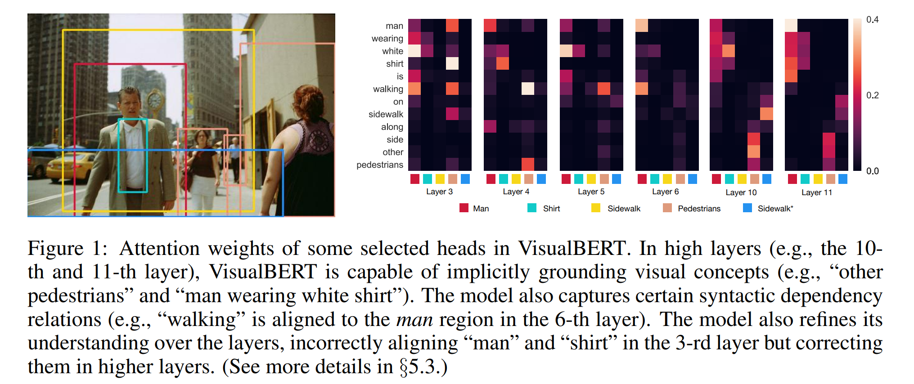
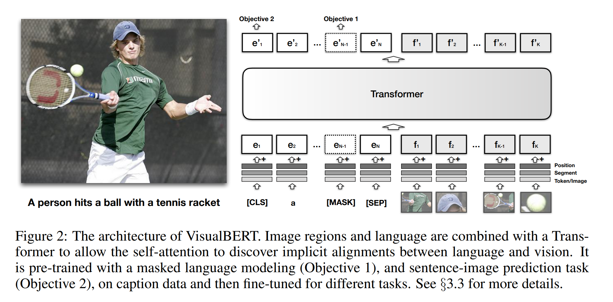
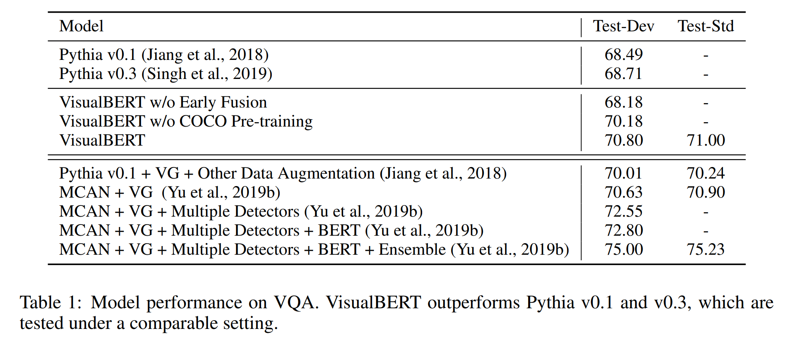
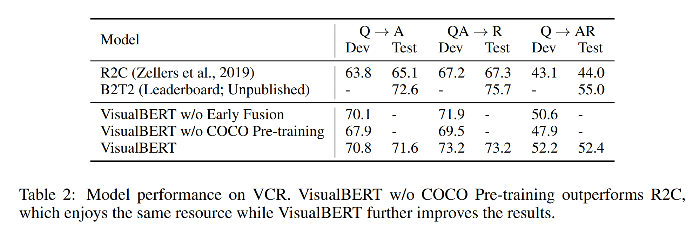
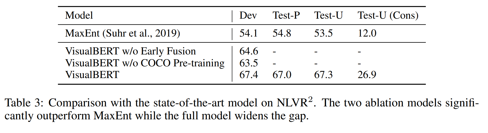
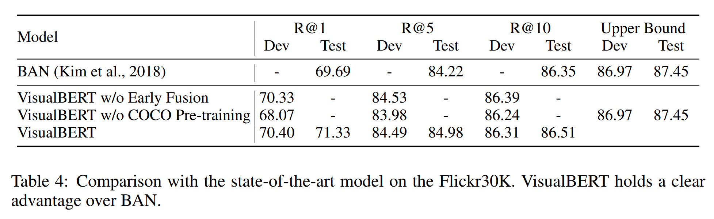
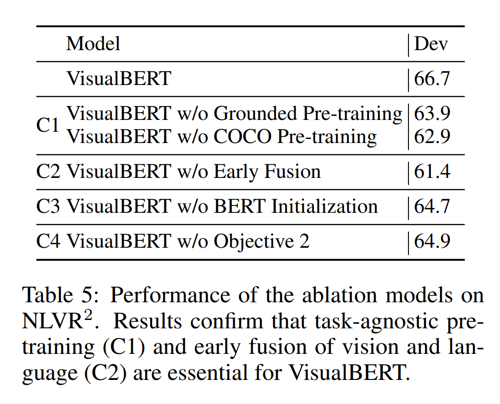
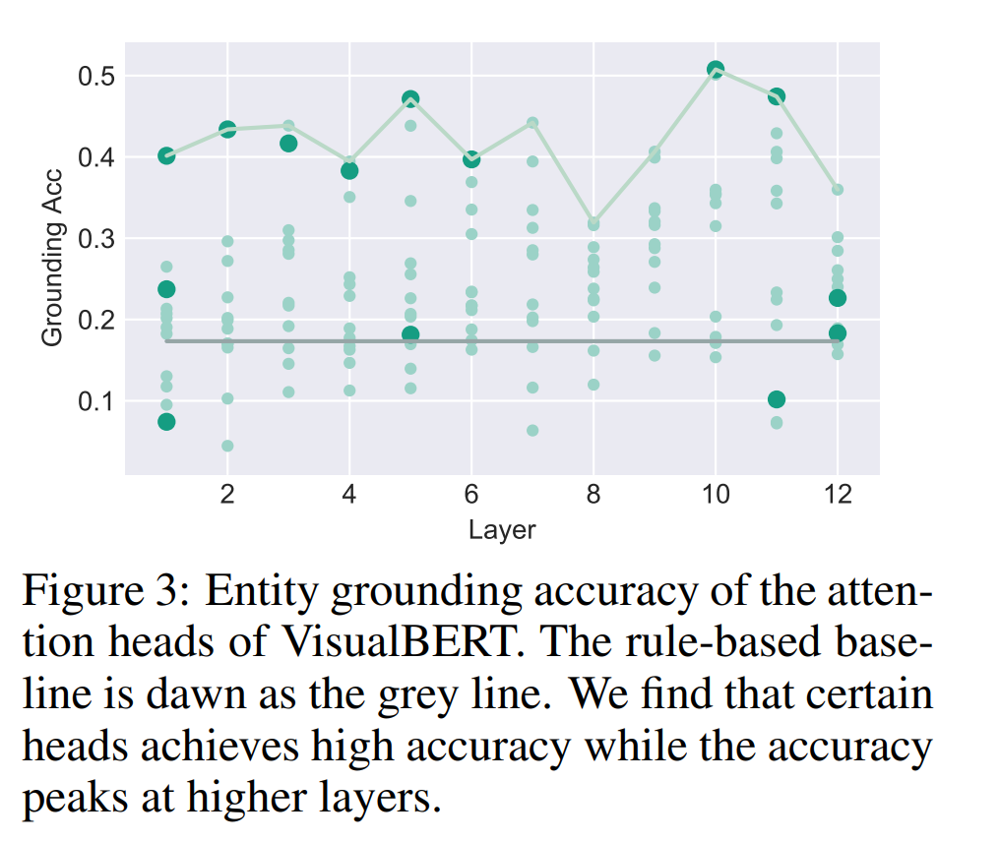
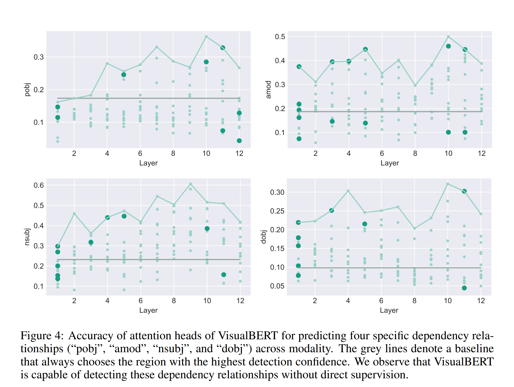

논문 및 이미지 출처: <https://arxiv.org/pdf/1908.03557.pdf>

# Abstract

vision-language tasks 의 넓은 범위에 modeling 하기 위한 간단하고 유연한 프레임워크인 **VisualBERT** 제안

- input text 요소 및 input image 영역을 self-attention 으로 implicitly align 하는 Transformer layer stack 로 구성
- image caption data 에 VisualBERT pre-training 을 위해 two visually-grounded language model objectives 제안
- VQA, VCR, NLVR$^2$ 및 Flickr30K 을 포함한 vision-language tasks 실험에서 매우 간단하지만 SOTA 를 능가하거나 견줄 정도
- 추가 분석으로 supervision 없이 language 요소를 image 영역에 매칭시킬 수 있으며, 동사와 해당 이미지 영역간의 문법적 관계에도 민감

# 1. Introduction

vision 과 language combining task 는 시각적 정보가 풍부한 시스템의 추론 능력에 대한 평가를 제공

- object 가 무엇인지 인식하는 이상으로, captioning, visual question answering 및 visual reasoning 과 같은 vision-language tasks 는 이미지의 _detailed semantics_ 를 이해하도록 요구
- 이는 객체, 특성, 부분, 공간적 관계, 동작 및 의도를 포함한 세부 의미를 natural language 로 표현하고 언어로 어떻게 참조되고 구체화되는지를 이해하는데 도전

---

본 논문에서는 풍부한 vision 과 text 의 의미를 포착하기 위해 설계된 간단하고 유연한 모델인 VisualBERT 제안

- NLP 를 위한 Transformer 기반 모델인 BERT 와 Faster-RCNN 같은 pre-trained objective 시스템을 통합하여 vision-and-language tasks 에 적용
- 특히, object 에서 추출된 image features 는 unordered input tokens 로 처리되어 text 와 함께 VisualBERT 에 주입
- text 및 image inputs 은 VisualBERT 의 multiple Transformer layers 에서 공동으로 처리
- words 및 object 사이의 rich interaction 은 모델이 text 와 image 사이의 복잡한 관계를 포착할 수 있도록 함

---

BERT 와 유사하게, exteral resource 에서의 pre-training VisualBERT  는 downstream 적용에 이점을 주므로, images 와 text 간의 관계를 학습하기 위해 image 의 _detailed semantics_ 가 natural language 로 표현되는 image caption data 에 VisualBERT pre-training 을 고려한다.

저자는 pre-training 을 위해 two _visually-grounded_ language model 을 제안

1. text 일부가 masking 되고 model 은 remaining text 와 visual context 를 기반으로 masked words 를 예측
2. 모델은 text 가 image 와 일치하는지 여부를 결정하도록 훈련

image caption data 에 대한 이런 pre-training 은 VisualBERT 가 transferable text 및 visual representations 를 학습하는데 중요함을 보여줌

저자는 vision-language tasks 에 대해 포괄적 실험 수행

1. visual question answering (VQA)
2. visual commonsense reasoning (VCR)
3. natural language for visual reasoning (NLVR$^2$)
4. region-to-phrase grounding (Flickr30K)

결과 COCO image caption dataset 에 VisualBERT 를 pre-training 함으로써 VisualBERT 가 SOTA model 을 능가하거나 견주는 것을 보여줌

- 또한 저자의 설계가 정당화하기 위해 ablation 연구 제공
- 나아가 VisualBERT 는 내부적으로 word 와 image regions 를 align 하기 위해 attention weights 를 할당하는 방법을 보여줌
- pre-training 을 통해 VisualBERT 가 entities 를 grounding 하고 word 및 image region 사이의 특정 dependency relationships 를 인코딩하는 방법을 보여주며, 이는 이미지의 detailed semantics 에 대한 모델의 이해력을 향상시킴 (Fig. 1)

# 2. Related Work

vision-language tkas 해결을 위해 일반적으로 text encoder, image feature extractor, multi-modal fusion module 및 answer classifier 로 구성된다.

대부분 task specific 을 위해 설계되지만, VisualBERT 는 new task 에 적용되거나 다른 task-specific model 에 통합될 수 있다.

---

image 의 _detailed semantics_ 이해는 visual 이해에 중요하며, 이러한 의미의 modeling 은 vision-language model 에 도움이 될 수 있다는 이전 연구 결과가 있다.

예로, 

- Visual Genome (Krishna et al., 2017) 의 attribute annotations 는 VQA 의 object detector 를 향상시키는데 사용
- (Anderson et al., 2018). Santoro et al. (2017), Norcliffe-Brown et al. (2018) 및 Cadene et al. (2019)은 attention module 을 사용하여 이미지 내 objects 간의 관계를 explicitly modeling 을 탐구 
- Li et al. (2019)는 object relations 를 명시적으로 인코딩하기 위해 그래프 구축

VisualBERT 에서 self-attention mechanism 은  모델이 객체 간의 implicit relations 를 포착할 수 있도록 하며, image caption data 에 대한 pre-training 은 모델이 이러한 관계를 포착하는 법을 배우는데 효과적이다.

---

저자는 NLP 의 transformer-based representation model 인 BERT 에서 영감을 얻음

- language modeling objective 로 pre-training 하여 universal language encoder 를 학습하는 연구에 속함
- VideoBERT : video 를 음성으로 변환하고 이미지와 결합하여 Transformer 를 적용하여 joint representation 학습
  - 하지만 VideoBERT 는 cooking video 에 대한 captioning 을 평가했으며, vision-language task 에 대한 포괄적인 분석 수행
- ViLBERT : BERT 와 유사한 아키텍처를 사용하여 image 와 text 의 joint representation 을 학습하는 것을 제안했지만, vision 과 language 를 위한 별도의 Transformer 를 가지며 서로만 attend 할 수 있다. (결과, parameter 가 두 배)

저자의 결과는 이전 연구와 일관성이 있다. (두 task 중 하나에서 우월) 하지만 방법들은 완전히 비교할 수 없는데, 서로 다른 visual representation 과 pre-training resource 가 사용되었기 때문이다.

# 3. A Joint Representation Model For Vision And Lanugage

## 3.1 Background

BERT 는 subwords 를 input 으로 사용하는 Transformer 이며 language modeling objectives 로 훈련된다.

input sentence 의 all subwords 는 일련의 embeddings $E$ 로 매핑된다.

각 embedding $e \in E$ 은 다음과 같이 계산된다.

1. subword 의 특정한 token embedding $e_t$
2. token 이 text 의 어느 부분에서 온 것인지 나타내는 segment embedding $e_s$ (e.g. entailment pair)
3. sentence 내의 token position 을 나타내는 position embedding $e_p$

input embeddings $E$ 은 multi-layer Transformer 를 통해 전달되어 subwords 의 contextualized representations 를 구축

BERT 는 두 단계로 훈련

1. pre-training: 두 가지 language modeling objectives 의 조합
   1. 일부 input tokens 를 special token (즉, [MASK]) 로 randomly replace 하는 masked language modeling
   2. next sentence prediction 으로, 모델에게 sentence pair 을 제공하고 document 의 연속된 두 sentence 인지 분류하도록 훈련
2. 특정 task 에 적용하기 위해, task-specific input, output layer, objectives 및 task data 로 fine-tuning

## 3.2 VisualBERT

저자의 핵심 아이디어는 Transformer 내부의 self-attention mechanism 을 재사용하여 input text 와 regions 를 implicitly align 하는 것

BERT 의 all components 에 더하여, image 를 모델링하기 위해 visual embedding set $F$ 을 도입한다.

- 각 $f \in F$ : object detector 에서 파생된 image 내의 bounding region 에 해당

$F$ 의 각 embedding 은 세 개의 embedding 을 합산하여 계산

1. $f_o$ : $f$ 의 bounding region 의 visual feature representation
2. $f_s$ : text embedding 과 대조적으로 image embedding 을 나타내는 segment embedding
3. $f_p$ : input 의 일부로 words 와 bounding regions 간의 alignment 가 제공될 때 사용되는 position mebedding 으로, aligned words 에 해당하는 position embeddings 의 합으로 설정

이러한 visual embeddings 은 original text embedding set 과 함께 multi-layer Transformer 에 전달되어 모델이 두 입력 간의 유용한 alignment 를 발견하고, new joint representation 을 구축하도록 함

## 3.3 Training VisualBERT

BERT 와 유사한 훈련 절차를 채택

하지만 VisualBERT 는 language 및 visual input 을 동시에 수용해야하므로 paired data 에 도달하게 된다.

각각 5 independent captions 와 images 의 paried 를 포함하는 COCO dataset 에서 다음 세 단계 훈련 절차를 구성

#### Task-Agnostic Pre-training

VisualBERT 를 COCO dataset 에서 두 개의 _visually-grounded_ language model objectives 로 훈련

1. Masked language modeling with images
   - text input 의 일부 요소가 masking 되어 예측되어야 하지만, image regions 에 해당하는 vector 는 masking 되지 않음
2. Sentence-image prediction
   - COCO 에서 한 image 에 대응하는 여러 caption 이 있는 경우, 두 개의 caption 으로 구성된 text segment 제공
   - 한 caption 은 이미지를 설명하고, 다른 하나는 해당 이미지에 대응하거나 다른 caption 을 무작위로 선택된 caption 일 확률이 50%

모델은 위 두 가지 상황을 구별하는 데 훈련된다.

#### Task-Specific Pre-Training

VisualBERT 를 downstream task 에 fine-tuning 하기 전에, masked language modeling 과 image objective 의 task data 를 사용한 model 훈련이 유익한 것을 발견

이 단계에선 모델이 new target domain 에 적응할 수 있도록 한다.

#### Fine-Tuning

BERT 의 fine-tuning 을 모방하며 tkas-specific input, output 및 objective 가 도입되고, Transformer 가 task 에 대한 성능을 최대화하도록 훈련

# 4. Experiment

vision-language application 의 네 가지 다양한 유형에 평가

- Visual Question Answering : VQA 2.0
- Visual Commonsense Reasoning : VCR
- Natural Language for Visual Reasoning (NLVR$^2$)
- Resion-to-Phrase Grounding : Flickr30K

---

all tasks 에 대해, COCO 의 Karpathy train split 을 사용하여 task-agnostic pre-training 에 대한 pre-training 수행

- 이 split 에는 약 100K image 및 5 captions 존재
- Transformer encoder 는 BERT$_{\text{BASE}}$ 와 동일한 구성: layers 12, hidden size 768, self-attention heads 12
- parameter 는 pre-trained BERT$_{\text{BASE}}$ parameter 에 초기화

---

image representation 의 경우, 각 데이터셋마다 서로 다른 standard object detector 가 있어 region proposals 및 region features 를 생성한다.

이들과 비교를 위해, 설정을 따르며 결과적으로 다양한 task 에 대해 다른 image feautres 사용됨

일관성 유지를 위해 COCO 에 task-agnostic pre-training 중, end tasks 에 사용되는 것과 동일한 image features 사용

각 데이터셋에 대해, VisualBERT 의 세 가지 변형 사용

#### VisualBERT

COCO 에서 pre-training 을 거친 BERT 의 parameter initialization 의 full model 로, task data 에 pre-training 하고, task 에 fine-tuning

#### VisualBERT w/o Early Fusion

initial Transformer layer 에서 image representation 이 text 와 결합되지 않고, new Transformer layer 에서 very end 에서 결합되는 VisualBERT

이를 통해 whole Transformer stack 을 통해 language 및 vision 간의 상호작용이 성능에 중요한지 테스트

#### VisualBERT w/o COCO Pre-training

COCO caption 에 대한 task-agnostic pre-training 을 skip 한 VisualBERT

이는 pre-training 의 중요성을 검증하기 위해 수행

---

- BERT 를 따라, Adam 을 사용하여 SGD 로 optimize
- warm-up step 수는 특별히 지정되지 않는 한 total training step 수 10% 로 설정
- batch size 는 하드웨어 제약에 충족되게 선택하며, 128 보다 긴 sequence 는 상한으로 설정
- Tesla V100s 및 GTX 1080Tis 에서 수행
- 모든 실험은 최대 4 Tesla V100s 에 각 16GB GPUs memory 를 사용하여 복제
- pre-trained on COCO 은 4 cards 에서 하루 이내 완료되며 task-specific pre-training 및 fine-tuning 은 이보다 덜하다.

## 4.1 VQA

주어진 image 및 question 에 대해 올바른 대답을 하는 task

VQA 2.0 을 사용하며, COCO 의 images 에 대한 1 million question 을 구성돼있다.

빈도 높은 3,129 answers 를 예측하도록 훈련하며 Visual Genome 에 pre-training 된 ResNeXt-based Faster-RCNN 의 image features 사용

- same visual features 및 bounding region proposals 수를 사용하는 baselines, 저자의 모델 및 Visual Genome (+VG) external question-answer pairs, multiple detectors (+Multiple Detectors) 및 모델들의 앙상블을 사용한 다른 비교 불가한 방법을 포함하여 report
- 비교 가능한 설정에서 현존하는 연구보다 간단하고 우수한 성능

## 4.2 VCR

VCR 은 110k movie scenes 에서 290K questions 로 구성되어, visual commonsense 에 초점을 맞춰있다.

- 이 task 는 개별 모델을 훈련하는 two multi-choice sub-tasks: question answering (Q $\Rightarrow$ A) 및 answering justification (QA $\Rightarrow$ R) 로 분해
- image feature 는 ResNet50 에서 얻으며, dataset 에서 제공되는 "gold" detection bounding boxes 및 segmentations 를 사용
- dataset 은 text 에서 참조된 words 및 bounding regions 간의 alignments 를 제공하며, 일치하는 words 및 regions 에 대해 동일한 position embeddings 를 사용하여 활용
- 

---

저자는 dataset 과 함께 발표된 BERT (R2C) 를 기반으로 하는 모델과 리더보드 (B2T2) 에서 SOTA model 과 비교

- 축약된 VisualBERT w/o COCO Pre-training 은 R2C 와 동일한 리소스를 사용하지만 더 간단하며 뛰어난 성능을 보임
- full model 은 더욱 향상
- COCO 및 VCR 간에는, VCR 이 movie scenes, COCO 는 image caption 이라는 domain 차이가 있음에도 COOCO pre-training 이 도움을 줌

## 4.3 NLVR$^2$

NLVR$^2$ 은 natural language 및 image 에 대한 joint reasoning dataset 으로 semantic 다양성, compositionality 및 visiual reasoning challenge 포함

- 이 task 는 image pair 에 대한 natural language caption 이 참인지 여부 판별
- 이 dataset 은 web unage 로 English senteces paired 의 100k 예제 포함
- VisualBERT 의 segment embedding mechanism 을 수정하여 서로 다른 image 및 서로 다른 segment embedding 의 features 를 할당

- Detectron 의 기존 detector 를 사용하여 image feature 를 제공하고 이미지 당 144 proposals 사용
- 결과, VisualBERT w/o Early Fusion과 VisualBERT w/o COCO pre-training 은 SOTA 인 MaxEnt 를 크게 능가하며 VisualBERT는 더욱 큰 성능 향상을 보임

## 4.4 Flickr30K Entities

Flickr30K Entities dataset 은 caption 의 phrase 를 이미지 내의 bounding regions 에 연결하는 능력을 테스트

- 이 task 는 sentence 로부터 span 이 주어졌을 때, 해당 span 과 일치하는 bounding regions 선택하는 것
- 30k images 와 약 250k annotations 구성
- BAN 설정을 채택하며 Faster R-CNN pre-trained on Visual Genome 의 image features 사용
- task specific fine-tuning 을 위해, additional self-attention block 도입하고 각 heads 의 average attention weights 를 사용하여 boxes 와 phrases 사이의 alignment 예측
- phrase 에 grounding 하기 위해, model prediction 으로 phrase 의 last sub-word 로부터 attention 을 가장 많이 받는 box 선택

- 결과, VisualBERT SOTA 인 BAN 보다 우수한 성능을 보임
- early fusion 없는 ablation model 및 full model 간의 유의미한 차이를 관찰하진 못함. 아마 task 에 더 얕은 아키텍처만으로도 충분하다는 것을 시사

# 5. Analysis

## 5.1 Ablation Study

NLVR$^2$ 에 ablation study 수행하며 두 가지 ablation model 포함 및 VisualBERT 의 네 가지 변형을 비교

이 모델들은 image 당 36 features 에만 훈련 (full model 포함)

저자의 분석 (Table 5) 은 VisualBERT 의 네 가지 요소에 대한 기여를 조사

#### C1: Task-agnostic Pre-training

task-agnostic pre-training 의 기여를 조사를 위해 pre-training 을 skipping 한 것 (VisualBERT w/o COCO Pre-training)과 COCO 의 image 없이 text 만 pre-training (VisualBERT w/o Grounded Pre-training)

두 변형은 성능이 저하되며, vision 및 lanugage paired 에 pre-training 하는 것이 중요함을 보여줌

#### C2: Early Fusion

VisualBERT w/o Early Fusion 을 포함하여 image 와 text features 간의 early interaction 의 중요성을 검증

vision 및 language 간의 multiple interaction layers 가 중요

#### C3: BERT Initialization

BERT initialization 의 기여를 이해하기 위해, randomly initialized parapmeter 로 변형을 도입하고, 이후 full model 처럼 훈련된다.

language-only pre-trained BERT 의 weights 는 중요해보이지만, 성능이 예상만큼 저하되지 않고, COCO pre-training 중 grounded language 에 대한 많은 유용한 측면을 학습하고 있음을 주장

#### C4: The sentence-image prediction objective

task-agnostic pre-training 중 sentence-image prediction objective 가 없는 모델 도입 (VisualBERT w/o Objective 2)

결과 이 objective 가 다른 구성 요소와 비교하여 긍정적이지만 그 영향이 덜 중요하다는 것을 시사

---

전반적인 결과로 중요한 설계 선택은 task-agnostic pre-training (C1) 및 vision-language early fusion (C2)임을 확인

pre-training 에선 additional COCO data 포함과 images 및 captions 모두 사용하는 것은 필수

## 5.2 Dissecting Attention Weights

#### Entity Grounding

먼저 VisualBERT 의 entity grounding 을 수행할 수 있는 attention heads 를 찾는다. 즉, sentence 의 entity 에 해당하는 bounding region 에 attending 하는 것이다.

구체적으로, Flickr30K 의 평가셋에서 ground truth alignment 를 사용

- sentence 내의 각 entity 및 VisualBERT 의 각 attention head 에 가장 많은 attention weight 를 받는 bounding region 을 살펴봄
- word 는 image regions 뿐 아니라 text 의 words 에도 attending 할 가능성이 높아, 이 평가에선 words 에 대한 head' attention 을 masking 하고 image regions 는 유지한 후, 어느 attention 의 attending 이 Flickr30K 의 annotation 과 일치하는지 계산 
  - VisualBERT 의 all 144 attention heads 에 대한 정확도를 layer 별로 나열한 것을 Fig. 3 에서 확인
- 항상 가장 높은 detection confidence 의 region 을 선택하는 baseline 고 고려
  - VisualBERT 는 entity grounding 을 위해 직접 supervision 을 받지 않았더라도 높은 정확도에 달성하는 것 발견
  - grounding accuracy 는 higher layers 에서 더 향상
  - 모델이 lower layer 에서 two input 을 합성할 때 덜 확실하지만 어떻게 정렬해야 하는지 인식하는 것으로 나타남

#### Syntactic Grounding

BERT 의 attention head 가 syntactic relationships 를 발견할 수 있는 것을 이미 관찰되어, VisualBERT 가 발견한 syntactic relationships 는 어떻게 grounding information 을 전달하는지 분석

특히, dependency relation 으로 연결된 two words $w_1 \overset{2}{\rightarrow} w_2$ 가 주어진 경우, $w_2$ 의 attention head 가 $w_1$ 에 해당하는 region 에 얼마나 자주 attending 하는지, 그 반대도 분석

- Fig. 1 의 "walking" 과 "man" 이 관련된 경우, Stanford Dependency Parsing 하에 "nsubj" 관계를 통해 서로 연결되어 있기 때문에 "walking" 에서 "man" 에 해당하는 region 에 attending 하는 attention head 를 확인하려 함.
- VisualBERT 의 syntactic sensitivity 를 평가하기 위해 AllenNLP 의 dependency parser 를 사용하여 Flickr30K 의 all sentence 를 parsing. 이후 각 attention head 에 대해 특정 dependency relationship 을 가진 두 단어가 있고 그 중 하나가 Flickr30K 의 ground-truth grounding 이 있는 경우, head attention weight 가 ground-truth grounding 을 얼마나 정확히 예측하는지 계산
- all dependency relationships 를 조사한 결과, VisualBERT 는 확신있는 bounding region 을 추측하기 보단 훨씬 더 우수한 성능을 보이는 각 관계에 대해 최소 one head 가 존재
- 특히 몇 가지 dependency relationship 을 Fig. 4 에서 강조
  - 많은 heads 가 동사와 인수를 정확히 연결시키는 것 (즉, "pobj", "nsub" 및 "dobj" dependency relations) 으로 보임
  - 이는 visual 요소에 암시적, 그리고 supervision 없이 해결함을 보여줌

## 5.3 Qualitative Analysis

VisualBERT 가 image 및 text 를 처리하는 동안 layer 별로 어떻게 attending 하는지 Fig. 1 및 Fig. 5 에서 보여줌

- 각 ground-truth box 에 해당 bounding region 과 가장 가까운 predicted bounding region 을 수동으로 다른 카테고리와 그룹화
- 모델이 활발히 attending 하고 있는 region 도 포함
- 이후 동일한 카테고리 내의 words 에 해당 region 의 attention weights 를 집계
- highest entity grounding accuracy 를 달성한 6 layers 의 best heads 를 보여줌

전반적으로 Transformer layer 를 통해 alignment 를 개선하는 것으로 보임

- Fig. 5 의 왼쪽 하단 이미지에, 처음엔 "husband" 와 "woman" 모두 여성에 해당하는 region 에 attending
- 계산 끝에는 woman 과 man 을 분리하여 올바르게 정렬
- syntactic alignment 로도 많은 예시가 있으며, 같은 이미지에 "teased" 라는 단어는 남성과 여성 둘 다에 정렬되고 "by" 는 남성에 정렬되고, "her" 은 여성에게 정렬됨

# 6. Conclusion and Future Work

본 논문은 joint vision-language representation 을 위한 pre-trained model 인 VisualBERT 제안

- 네 가지 평가에서 강력한 성능을 달성하면서도 간단함
- 추가 분석으로, attention mechanism 으로 해석 가능한 방식으로 포착하는 것을 시사
