논문 및 이미지 출처 : <https://arxiv.org/pdf/1909.11740.pdf>

# Abstract

Vision-Language (V+L) task 에선 multimodality inputs 를 동시에 처리하여 visual 및 textual 이해를 위해선 joint image-text embedding 이 핵심

본 논문에선 4 image-text datasets (COCO, Visual Genome, Conceptual Captions 및 SBU Captions) 에서 large-scale pre-training 을 통해 학습된 UNITER(Universal Image-Text Representation)를 소개

- joint multimodal embeddings 으로 다양한 downstream V+L task 를 구동할 수 있음
- 저자는 4 pre-training task 설계: Masked Language Modeling (MLM), Masked Region Modeling (MRM, 3 variants), Image-Text Matching (ITM) 및 Word-Region Alignment (WRA)
- 이전 연구와 달리, pre-training tasks 에서 conditional masking 사용 (즉, masked language/region modeling 은 image/text 의 full observation 에 conditioning)
- global image-text alignment 를 위한 ITM 외에도, pre-training 중에 words 및 image 간의 fine-tuned alignments 를 _명시적_으로 촉진시키기 위해 Optimal Transport (OT)을 사용하는 WRA 를 제안
- 포괄적인 분석 결과, conditional masking 및 OT-based WRA 가 pre-training 향상에 기여하는 것을 보여줌
- 또한 pre-training tasks 의 optimal cpombination 을 찾기 위한 ablation study 실시
  - 다양한 실험 결과, UNITER 가 Visual Question Answering, Image-Text Retrieval, Referring Expression Comprehension 및 NLVR$^2$ 를 포함한 6 V+L task 에서 SOTA 달성

# 1. Introduction

대부분의 V+L task 는 visual 과 textual clues gap 을 연결하기 위해 joint multimodal embedding 에 의존한다.

이런 representation 은 specific tasks 에 맞춰지며, 예로 MCB, BAN 및 DFAF 는 Visual Question Answering (VQA) 를 위한 multimodal fusion methods 를 제안한다.

SCAN 및 MAttNet 은 Image-Text Retrieval 및 Referring Expression Comprehension 을 위해 words 와 image regions 사이의 latend alignment 를 학습한다.

이런 모델은 해당 벤치마크에 SOTA 를 달성하지만, highly task-specific learned representation 으로, 다른 task 에 일반화가 어렵다

이는 all V+L tasks 에 대한 universal image-text representation 을 학습할 수 있을까? 하는 질문이 발생

---

저자는 **UN**iversal **I**mage-**TE**xt **R**epresentation (UNITER)를 소개

- joint multimodal embedding 을 위한 large-scale pre-trained model
- Transformer 를 모델의 핵심으로 채택하여, contextualized representation learning 을 위해 설계된 self-attention mechanism  활용
- BERT 에 영감을 받아, 이는 large-scale language modeling 을 Transformer 를 NLP task 성공적으로 적용한 바 있음
  - 4 pre-training tasks 를 통해 UNITER 를 pre-training: (i) Masked Language Modeling (MLM) _conditioned on image_; (ii) Masked Region Modeling (MRM) _conditioned on text_; (iii) Image-Text Matching (ITM); 및 (iv) Word-Region Alignment (WRA)
  - MRM 의 효과를 더 조사하기 위해 3 MRM variants 제안: (i) Masked Region Classification (MRC); (ii) Masked Region Feature Regression (MRFR); 및 (iii) Masked Region Classification with KL-divergence (MRC-kl)

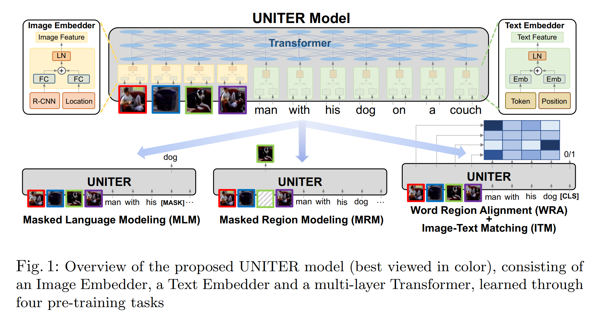

- UNITER 는 먼저 image regions (visual feature 및 bounding box features) 및 textual wordws (tokens 및 positions)를 Image Embedder 및 Text Embedder 의 common embedding space 로 인코딩
- 이후 Transformer module 이 pre-training tasks 를 통해 각 region 및 words  에 대한 generalizable contextualized embeddings 를 학습
- 이전의 연구의 multimodal pre-training 에 비해
  1. 저자의 masked language/region modeling 은 image/text 의 full observation 에 conditioning 으로 적용되며, joint random masking 이 아님
  2. 저자는 words 및 image regions 간의 fine-grained alignment 를 _명시적_으로 촉진하기 위해 Optimal Transport (OT)을 사용하여 novel WRA pre-training task 소개
     - 직관적으로, OT-based learning 은 distribution matching 을 optimizing 하기 위해 한 distribution 을 other distribution 으로 transporting cost 를 최소화
   - 저자의 맥락에서, embedding 을 image regions 에서 sentence 내의 words 로 transporting cost 를 최소화하여 cross-modal alignment 를 좋은 방향으로 optimizing
   - conditional masking 및 OT-based WRA images 및 text 간의 misalignment 를 완화하고 downstream tasks 에 대한 더 나은 joint embeddings 로 이어진다는 것을 보여줌

UNITER 의 generalizable power 증명을 위해 6 V+L tasks 에서 9 dataset 평가

- VQA; Visual Commonsense Reasoning (VCR); NLVR$^2$; Visual Entailment; Image-Text Retrieval (zero-shot 포함); 및 Regerring Expression Comprehension
- 4 subset 의 large-scale V+L dataset 에 훈련: COCO; Visual Genome (VG); Conceptual Captions (CC); 및 SBU Captions
- 실험 결과 9 downstream dataset 에서 큰 성능 향상 및 SOTA 달성
- CC 및 SBU data 에 추가 훈련하여 (downstream task 의 unseen images/text 포함) COCO 및 VG 에 성능 향상

논문의 기여를 요약하면 다음과 같다.

- V+L tasks 에 대해 강력한 **UN**iversal **I**mage-**TE**xt **R**epresentation, UNITER 도입
- Conditional Masking for masked language/region modeling 을 제시하고 pre-training 에 대한 novel Optimal-Transport-based Word-Region Alignment tasksㅈ 제안
- 넓은 범위의 V+L 벤치마크에서 SOTA 달성하여 기존의 multimodal pre-training methods 를 large margin 능가
- 실험 확장 및 multimodal encoder training 에 대한 각 pre-training task/dataset 의 효과성을 분석

# 2. Related Work

최근 supervision learning 이 vision task 에 적용되고, ELMo, BERT, GPT2, XLNet, RoBERTa 및 ALBERT 같은 pre-trained language model 이 large language corpus 에 효과적인 pre-training 및 contextualized text representation learning 을 위해 Transformer 를 사용하여 NLP task 에 발전을 이루어 self-supervised learning 이 multi-modal task 에 관심이 크게 증가.

이는 large-scale image/video 및 text pairs 를 pre-training 한 다음 downstream task 에 fine-tuning 하는 것이다.

- VideoBERT 및 CBT 는 BERT 로 video-text pairs 에 video frame feature 및 linguistic tokens 에 대한 joint distribution 을 학습
- ViLBERT 및 LXMERT 는 two Transformer 가 image 및 text 각각 독립적으로 적용하는 two-stream architecture 도입
  - later stage 에서 third Transformer 로 융합
- B2T2, VisualBERT, Unicoder-VL 및 VL-BERT 는 image 와 text 에 single Transformer 를 적용하는 single-stream architecture 제안
- VLP 는 image caption 및 VQA 에 pre-training 한 모델 적용
- 최근 multi-task learning 및 adversarial training 으로 성능을 향상하는데 촉진되고, VALUE 는 pre-trained model 을 이해하기 위한 probing tasks 를 개발

#### Our Contributions

UNITER 와 다른 방법의 주요 차이점은 두 가지

- UNITER 은 MLM 과 MRM 에서 conditional masking 으로, one modality 만 masking 하고 다른 것들은 유지
- Optimal Transport 를 사용한 novel Word-Region Alignment pre-training task 로, alignment 같은 이전 연구는 task-specific loss 를 암시적으로만 강제
- ablation study 로 pre-training 의 optimal combination 을 조사하고 이전 연구보다 큰 폭으로 여러 V+L dataset 에서 SOTA 달성

# 3. UNiversal Image-TExt Representation

## 3.1 Model Overview

Fig. 1 에 UNITER architecture 가 나와있다.

- image 및 sentence pair 가 주어지면 image 의 visual region 과 sentence 의 textual tokens 를 input 으로 사용
- 저자는 Image Embedder 와 Text Embedder 를 설계하여 각각의 embedding 을 추출
  - 이러한 embedding 은 multi-layer Transformer 에 주입되어 visual regions 및 textual tokens 간의 cross-modality contextualized embedding 를 학습
- Transformer 의 self-attention mechanism 은 order-less 이므로, tokens 의 position 및 regions 의 locations 를 명시적으로 인코딩하는 것이 필요
- 구체적으로, _Image Embedder_ 는 먼저 각 region 의 visual features (pooled ROI features) 를 추출하기 위해 Faster R-CNN 사용
  - 또한 각 region 에 대한 location feature 를 7-dimensional vector 를 통해 인코딩
  - visual 및 location feature 는 fully-connected (FC) layer 를 통해 project 된 후 동일한 embedding space 로 이동
  - 각 regions 에 대한 final visual embedding 은 two FC outputs 를 합산한 다음 layer normalization (LN) layer 를 통해 얻음
- _Text Embedder_ 의 경우, BERT 를 따르며 input sentence 를 WordPieces 로 tokenizing
  - 각 sub-word token 에 대한 final representation 은 word embedding 및 position embedding 을 합산한 다음 다른 LN layer 를 통해 얻음

---

저자는 pre-training 을 위해 4 main tasks 도입: Masked Language Modeling _conditioned on image regions_ (MLM), Masked Region Modeling _conditioned on input text_ (with three variants) (MRM), Image-Text Matching (ITM), and
Word-Region Alignment (WRA)

- Fig. 1 처럼, MRM 및 MLM 은 BERT 와 유사
  - 일부 words 및 inputs 의 regions 를 randomly masking 하고 words 또는 regions 를 Transformer 의 output 으로 복구하는 방식으로 학습
  - 구체적으로, word masking 은 token 을 special token [MASK] 로 대체하며, region masking 은 visual feature vector 를 모두 0 으로 대체하여 구현된다.
  - both modality masking 대신, one modality 만 masking 하고 다른 modality 는 유지하여, masked region 이 masked word 로 설명되는 potential misalignment 를 방지
- ITM 을 통해 whole image 와 sentence 사이의 instance-level alignment 를 학습
  - training 중, positive 및 negative image-sentence pairs 를 sampling 하여 이들의 matching scores 학습
- word tokens 및 image regions 간의 fine-grained alignment 를 제공하기 위해 저자는 Optimal Transport 를 사용하여 WRA 제안
  - 이를 통해 contextualized image embedding 을 word embeddings 으로 최소 비용으로 transporting 하는 것을 효과적으로 계산 (반대도 동일)
  - inferred transport plan 은 이런 cross-modal alignment 를 개선하기 위한 원동력으로 작동
  - 경험적으로, conditional masking 및 WRA 가 성능 향상에 기여하는 것을 보여줌
  - 이러한 task 로 UNITER pre-training 을 위해 각 mini-batch 에 대한 on task randomly sample 한 후 SGD update 당 on objective 훈련

## 3.2 Pre-training Tasks

#### Masked Language Modeling (MLM)

image region 을 $v = \{ v_1, \dots, v_K \}$, input words 를 $w = \{ w_1, \dots, w_T \}$ 로 표시하고 mask 는 $m \in \mathbb{N}^M$ 으로 나타냄

MLM 에선, input words 를 15% probability 로 randomly masking 하고 masked ones $w_m$ 를 special token [MASK] 로 대체

목표는 주변 words $w_{\backslash m}$ 과 all image regions $v$ 를 관찰하여 masked words 를 예측하는 것

이를 위해 negative log-likelihood 를 최소화

$$
\begin{equation}
    \mathcal{L}_{\text{MLM}} (\theta) = -\mathbb{E}_{(w,v)\sim D} \log P_\theta (w_m | w_{\backslash m}, v),
\end{equation}
$$

- $\theta$ : trainable parameters
- $(w,v)$ : whole training set $D$ 의 sample

#### Image-Text Matching (ITM)

ITM 에선, special token [CLS] 이 model 에 주입되는데, 이는 both modalitIES 의 fused representation 을 나타냄.

- ITM inputs 은 sentence 및 image regions set 이며, output 은 binary label $y \in \{ 0,1 \}$ 이며 sampled pair 과 일치하는지 여부를 나타냄
- [CLS] token 의 representation 을 input image-text pair 의 joint representation 으로 추출한 다음, 이를 FC layer 및 sigmoid function 에 주입하여 0 ~ 1 사이의 score 로 예측
  - 저자는 output score 를 $s_\theta (w,v)$ 로 표시
- ITM supervision 은 [CLS] token 에 대해 이루어지짐
- training 중, 각 step 에서 dataset $D$ 에서 positive 또는 negative pair 를 sample
  - negative pairs 는 paired sample 에서 image 또는 text 를 다른 sample 에서 randomly-selected 로 대체하여 생성
  - optimizing 에 대한 binary cross-entropy loss 를 적용:

$$
\begin{equation}
    \mathcal{L}_{\text{ITM}}(\theta) = -\mathbb{E}_{(w,v) \sim D} [y \log s_\theta (w, v) + (1 - y)\log (1-s_\theta (w,v))].
\end{equation}
$$

#### Word-Region Alignment (WRA)

WRA 에 대한 Optimal Transport (OT) 를 사용하며, transport plan $\text{T} \in \mathbb{R}^{T \times K}$ 은 $w$ 및 $v$ 간의 alignment optimizing 을 학습

OT 는 WRA 에 대한 good choice 로 여겨지는 몇 가지 특성이 있다:

- _Self-normalization_ : $\text{T}$ 의 all elements 의 합은 1
- _Sparsity_ : 정확히 해결했을 때, OT 는 $(2r-1)$ non-zero elements 를 포함하는 sparse solution $\text{T}$ 생성
  - $r = max(K,T)$ 이며 더 해석 가능하고 견고한 alignment 를 이끌어냄
- _Efficiency_ : conventional linear programming solvers 와 비교하여, 저자의 solution 은 matrix-vector products 만 필요로 하는 반복적인 procedure 를 사용하여 쉽게 얻을 수 있음
  - 따라서 large-scale model pre-training 쉽게 적용 가능

구체적으로, $(w, v)$ 는 two discrete distributions $\mu, \nu$ 로 간주 가능

- $\mu = \sum^T_{i=1} \text{a}_i \delta_{w_i}$ 및 $\nu = \sum^T_{j=1} \text{b}_j \delta_{b_i}$ 으로 공식화
- $\delta_{w_i}$ : $w_i$ 를 중심으로 하는 Dirac function 으로 공식화
- weight vectors $\text{a} = \{ \text{a}_i \}^T_{i=1} \in \Delta_T$ 및 $\text{b} = \{ \text{b}_j \}^K_{j=1} \in \Delta_K$ 는 각각 T- 및 K-dimensional simplex 에 속하는데(즉, $\sum^T_{i=1} \text{a}_i = \sum^K_{j=1} \text{b}_i = 1$), $\mu$ 와 $\nu$ 모두 probability distribution 이기 때문
- $\mu$ 와 $\nu$ 사이의 OT distance (따라서 $(w, v)$ pair 대한 alignment loss)는 다음과 같이 정의:

$$
\begin{equation}
    \mathcal{L}_{\text{WRA}}(\theta) = D_{ot}(\mu, \nu) = \underset{\text{T} \in \Pi (\text{a}, \text{b})}{\min} \sum^T_{i=1} \sum^K_{j=1}\text{T}_{ij} \cdot c(\text{w}_i, \text{v}_j),
\end{equation}
$$

- $\Pi(\text{a}, \text{b}) = \{ \text{T} \in \mathbb{R}^{T \times K}_+ | \text{T}1_m = \text{a}, \text{T}^\top 1_n = \text{b} \}, 1_n$ : n-dimensional all-one vector 를 표시
- $c(\text{w}_i, \text{v}_j)$ : $\text{w}_i$ 및 $\text{v}_j$ 사이의 distance 를 평가하는 cost function
- 저자의 실험에서, cosine distance $c(\text{w}_i, \text{v}_j) = 1 - \frac{\text{w}_i^\top \text{v}_j}{||\text{w}_i||_2||\text{v}_j||_2}$ 이 사용됨
- matrix $\text{T}$ 는 transport plan 으로 표시되며, two modalities 간의 alignment
- 불행히, $\text{T}$ 에 대한 정확한 최소화는 계산상 불가능하며, 저자의 OT distance 를 근사하는 IPOT 알고리즘 고려
- $\text{T}$ 해결 후, OT distance 는 parameters $\theta$ 를 업데이트하는 데 사용 가능한 WRA loss 로 작용

#### Masked Region Modeling (MRM)

MLM 과 유사하게, image region 을 sampling 하고 이들의 visual features 를 15% probability 로 masking

- model 은 remaining regions $\text{v}_{\backslash m}$ 과 all words $\text{w}$ 가 주어졌을 때, masked regions $\text{v}_m$ 을 재구성하는 것으로 학습
  - masked regions 의 visual features 은 0 으로 대체
- discrete labels 로 표시되는 textual token 과 달리, visual features 는 high-dimensional 및 continuous 이므로 class likelihood 를 통해 supervise 될 수 없다.

저자는 MRM 에 대한 3 variants 를 제안하며, 이들은 동일한 objective base 를 공유:

$$
\begin{equation}
  \mathcal{L}_{\text{MRM}}(\theta) = \mathbb{E}_{(\text{w}, \text{v}) \sim D} f_\theta (\text{v}_m | \text{v}_{\backslash \text{m}}, \text{w})
\end{equation}
$$

1. Masked Region Feature Regression (MRFR)
   - 각 masked region $\text{v}_m^{(i)}$ 의 transformer output 을 해당 visual feature 로 regressive learning
   - 구체적으로, FC layer 를 적용하여 Transformer output 을 input ROI pooled feature $r(\text{v}_m^{i})$ 과 동일한 차원의 vector $h_\theta(\text{v}_m^{(i)})$ 로 변환
   - 이후, two: $f_\theta (\text{v}_m|\text{v}_{\backslash m}, \text{w}) = \sum^M_{i=1} ||h_\theta (\text{v}_m^{(i)}) - r (\text{v}^{(i)_m})||^2_2$ 사이에 L2 regression 적용  
2. Masked Region Classification (MRC)
   - 각 masked region 에 대한 object semantic class 를 예측하도록 학습
   - 먼저, masked region $\text{v}_m^{(i)}$ 의 Transformer output 을 FC layer 에 주입하여 $K$ object classes 의 score 를 예측
   - 이후, score 를 softmax function 을 통해 normalized distribution $g_\theta (\text{v}_m^{(i)})$ 으로 변환
   - 여기선 ground-truth label, object categories 이 없음
   - 따라서, Faster R-CNN 의 object detection output 을 사용하고, masked region 의 detected object category label (with highest confidence score) 로 사용
   - 이는 one-hot vector $c(\text{v}_m^{(i)})$ 로 변환
   - final objective 는 cross-entropy (CE) loss 를 최소화: $f_\theta (\text{v}_m|\text{v}_{\backslash m}, \text{w}) = \sum^M_{i=1} \text{CE}(c(\text{v}_m^{(i)})), g_\theta(\text{v}_m^{(i)})$
3. Masked Region Classification with KL-Divergence (MRC-kl)
   - MRC 는 object detection model 에서 가장 가능성 있는 object class 를 hard label (0 or 1) 으로 취하며, detected object class 는 해당 region 의 ground-truth label 임을 가정
   - 실제로는 사실이 아닐수도 있는데, ground-truth label 이 없기 때문
   - 따라서 MRC-kl 에선 이러한 가정을 피하기 위해 soft label 을 supervision signal 로 사용하며, 이는 detector 의 raw output (즉, object classes 의 distribution $\tilde{e}(\text{v}_m^{(i)})$) 을 의미
   - MRC-kl 는 이러한 knowledge 를 UNITER 로 distill 하기 위해, two distribution 간의 KL divergence 를 최소화: $f_\theta (\text{v}_m|\text{v}_{\backslash m}, \text{w}) = \sum^M_{i=1} D_{KL}(\tilde{c}(\text{v}_m^{(i)}))|| g_\theta(\text{v}_m^{(i)})$

## 3.3 Pre-training Datasets

저자는 COCO, Visual Genome (VG), Conceptual Captions (CC), 그리고 SBU Captions 의 4 V+L dataset 을 기반으로 pre-training dataset 구성

pre-training 에는 image 및 sentence pairs 만 사용되며, 이는 추가 image-sentence pairs 를 더 쉽게 수집할 수 있어 모델 프레임워크를 확장 가능하게 만듦

pre-training 의 서로 다른 dataset 의 영향을 연구하기 위해 4 datasets 을 2 category 로 나눔

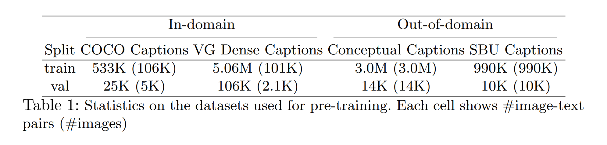

1. COCO 의 image captioning data 와 VG 의 dense captioning data 로 구성
   - 이를 "In-domain" data 라 하며, 대부분의 V+L tasks 가 이 두 dataset 에 구축
   - "fair" data split 을 얻기 위해, COCO 의 raw training 및 validation splits 을 병합하고, downstream tasks 에 나타나는 모든 validation 및 text image 는 제외
   - 또한 COCO 및 Flickr30K image 모두 Flickr 에서 크롤링되어 중복될 수 있어, URL 일치를 통해 모든 co-occurring Flickr30K 도 제외
   - 비슷한 규칙이 Visual Genome 에도 적용
   - 위 방법으로, image-text pairs 만 사용하여 중복 이미지를 필터링하고 내부 검증에도 사용되는 dataset 크기가 절반이 되어 5.6M image-text pairs for training 및 131K image-text pairs validation 을 얻어, LXMERT 의 dataset 과 크기가 다름
 - model training 을 위해 Conceptual Captions 및 SBU Captions 에서 추가 Out-of-domain data 사용

# 4. Experiments

UNITER 을 6 V+L tasks 에서 평가

이를 위해 pre-trained model 을 각 target task 에 end-to-end training 으로 fine-tuning

두 모델 사이즈: UNITER-base with 12 layers 및 UNITER-large with 24 layers 에 대한 결과 보고

## 4.1 Downstream Tasks

VQA, VCR 및 NLVR$^2$ task 에서는 input image (or images pair) 와 natural language question (or description)이 주어지고, 모델은 image 의 visual content 를 기반으로 answer (or description)을 예측

- Visual Entailment 에선 SNLI-VE dataset 애 평가
  - 목표는 주어진 이미지가 입력 문장을 semantically entails 를 예측
  - 성능을 측정하기 위해 3 classes ("Entailment", "Neutral" 및 "Contradiction") Classification accuracy 사용
- Image-Text Retrieval 에선 2 datasets (COCO 및 Flickr30K)을 고려하고 모델을 두 설정에서 평가: Image Retrieval (IR) and Text Retrieval (TR)
- Referring Expression (RE) Comprehension 에선 query description 이 주어진 경우, 모델이 image region proposals 중 target 을 선택해야 함
- 모델은 ground-truth objects 및 detected proposals (MAttNet) 모두에서 평가
- VQA, VCR, NLVR$^2$, Visual Entailment 및 Image-Text Retrieval 의 경우, [CLS] token 의 representation 에서 input image-text pairs 의 joint embedding 추출을 위해 multi-layer perceptron (MLP) 사용
- RE Comprehension 의 경우 MLP 를 사용하여 region-wise alignment score 계산
  - 이러한 MLP layer 는 fine-tuning stag 에서 학습
  - 구체적으로, VQA, VCR, NLVR2, Visual Entailment 및 RE Comprehension 을 classification 문제로 정의하고 ground-truth answers/responses 에 대한 cross-entropy 를 최소화
- Image-Text Retrieval 의 경우, ranking 문제로 정의
  - fine-tuning 중, image 및 text pairs 3 개를 sampling 하고, sentence/image 를 무작위로 다른 것으로 대체하여 one positive pair 및 two negative pairs 를 얻음
  - positive 와 negative pairs 에 대한 similarity score (joint embedding 기반)를 계산하고 triplet loss 를 통해 그 사이의 마진을 최대화

## 4.2 Evaluation on Pre-training Tasks

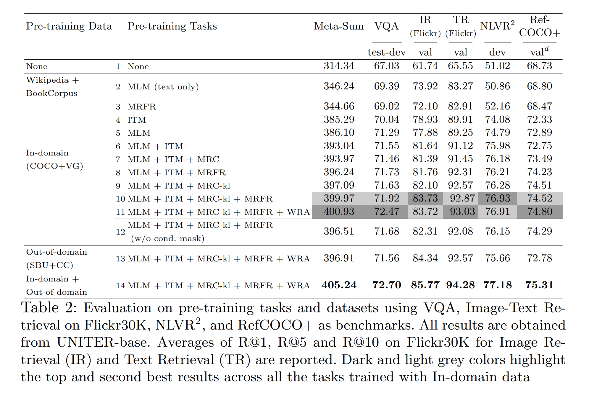

VQA, NLVR$^2$, Flickr30K 및 RefCOCO+ 에 ablation study 를 진행하여 서로 다른 pre-training setting 의 효과성 분석

각각의 standard metrics 외에도, 모든 벤치마크의 합산을 한 Meta-Sum 을 global metric 으로 사용

먼저, 두 baseline 을 설정: 

- Tab. 2 의 line 1 (L1) 은 no pre-training 을 포함. L2는 pre-trained weights 를 사용하여 초기화된 MLM 의 결과
  - pre-trained MLM 은 text-only 만 사용하여 훈련됐지만, L1 대비 Meta-Sum 이 약 +30 이득
  - 따라서 우리는 L2 의 pre-trained weights 를 다음 실험을 위해 모델 초기화에 사용
- pre-trained task 의 효과를 ablation study 로 검증
  - L2 와 L3을 비교하면, MRFR (L3)은 NLVR$^2$ 에서만 MLM (L2)보다 더 나은 결과를 얻음
  - 반면, ITM (L4) 또는 MLM (L5) 만으로 pre-training 된 경우, 모든 tasks 에서 L1 및 L2 baselines 에 비해 상당한 성능 향상 관찰
  - 다양한 pre-training tasks 를 결합할 때, MLM + ITM (L6)은 single ITM (L4) or MLM (L5) 보다 개선
  - MLM, ITM 및 MRM 을 jointly training 할 때(L7-L10), 저자는 모든 벤치마크에서 일관된 성능 향상 관찰
  - MRM 의 3 variants 중에서 (L7-L9), MRC-kl (L9) 이 MLM + ITM 과 결합할 때 best 성능(397.09)을 달성하고, MRC (L7)가 worst 결과 (393.97)를 얻음
  - MRC-kl 과 MRFR 을 MLM 과 ITM 과 결합할 때(L10), 두 task 는 서로 보완적임을 발견하여 second highest Meta-Sum score 얻음
  - highest Meta-Sum Score 는 MLM + ITM + MRC-kl + MRFR + WRA (L11)로 달성
  - WRA 를 추가하면 VQA 및 RefCOCO+ 에서 특히 성능이 크게 향상
  - 이는 pre-training 중 WRA 를 통해 학습된 words 및 regions 간의 fine-grained alignment 가 region-level recognition or reasoning 과 관련된 downstream task 에 이익을 주는 것을 나타냄
  - 저자는 이 optimal pre-training setting 을 추가 실험에 사용
- 추가로, conditional masking 의 기여를 비교 연구를 통해 검증
  - pre-training 중 두 가지 modalities 를 동시에 randomly masking 하는 경우, 즉 w/o conditional masking (L12), conditional masking 을 비교하여 Meta-Sum score (396.51)가 감소하는 것을 관찰 (399.97)
  - 이는 conditional masking 전략이 효과적으로 더 나은 joint image-text representation 학습이 모델에 가능케 함을 나타냄
- 마지막으로, pre-training data 의 효과를 연구
  - 지금까지 In-domain data 지만 Out-of-domain data (Conceptual Captions + SBU Captions)에서도 pre-training
  - Pre-trained on In-domain data (COCO + Visual Genome) 은 성능이 낮아지는 것 (L13 에서 396.91)은 Out-of-domain data 가 더 많은 이미지를 포함하고 있더라도, 모델은 여전히 pre-training 중에 유사한 downstream image 에 노출되는 것이 더 많은 이득을 얻을 수 있음을 보여줌
  - 저자는 In-domain 및 Out-of-domain data 모두에 모델을 pre-training
  - data size 가 두 배로 증가하며 모델은 계속해서 향상 (L14 에서 405.24)

## 4.3 Results on Downstream Tasks

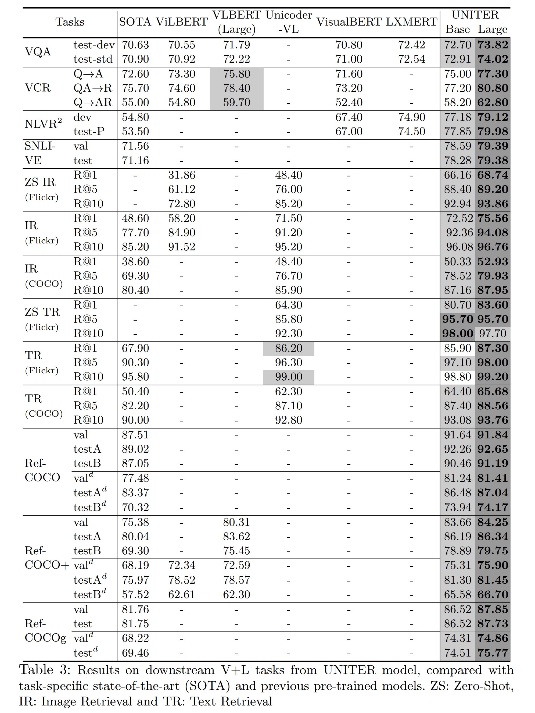

Tab. 3 은 모든 downstream task 대한 UNITER 의 결과 제시

- base 및 large model 은 In-domain + Out-of-domain dataset 에 pre-training 되며, optimal pre-training setting: MLM + ITM + MRC-kl + MRFR + WRA 사용
- 각 downstream task 에 대해 task-specific model 및 다른 pre-trained model 과 비교
- SOTA task-specific model 은 다음과 같다: VQA 의 MCAN, NLVR$^2$ 의 MaxEnt, VCR 의 B2T2, Image-Text Retrieval 의 SCAN, SNLI-VE 의 EVE-Image 및 RE Comprehension (RefCOCO, RefCOCO+ 및 RefCOCOg)의 MAttNet
- 다른 pre-trained model 은 다음과 같다: ViLBERT, LXMERT, Unicoder-VL, VisualBERT 및 VLBERT
- 결과, UNITER-large 이 모든 벤치마크에서 new SOTA 달성
- UNITER-base 도 VQA 를 제외한 모든 task 에서 다른 모델보다 큰 폭으로 우세
  - 구체적으로, UNITER-base 은 VCR 의 Q $\rightarrow$ AR 에서 약 +2.8%, NLVR$^2$ 약 +2.5%, SNLI-VE 약 +7%, Image-Text Retrieval 의 R@1 에서 약 +4% (zero-shot 약 +15%), 그리고 RE Comprehension 약 +2% 이득을 보임
  - LXMERT 는 downstream VQA(+VG+GQA) data 로 pre-train 되었는데, 이는 모델을 VQA task 에 adapting 하는 데 도움이 될 수 있지만, NLVR$^2$ 같은 unseen task 에서 평가할 때 UNITER-base 는 LXMERT 보다 3% 이득
  - 또한, models pre-trained on image-text pairs only 중에서 UNITER-base 가 VQA 1.5% 이상 우세
  - 또한, VilBERT 와 LXMERT 는 two-stream model 이 single-stream model 보다 우세함을 관찰했지만, 저자의 결과는 pre-training setting 으로 single-stream model 이 new SOTA 달성할 수 있음을 경험적으로 보여줌
  - 그리고 훨씬 fewer parameters 로 SOTA (UNITER-base: 86M, LXMERT: 183M, VilBERT: 221M)

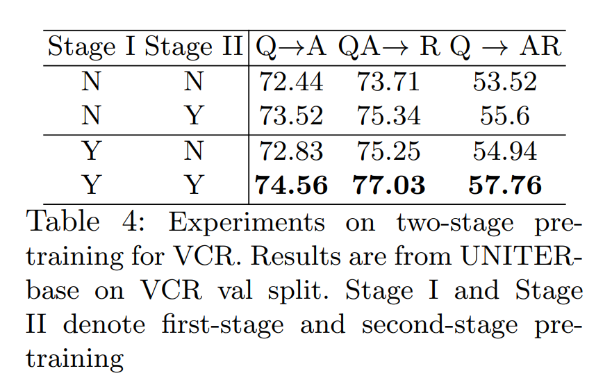

- VCR 의 경우, 저자는 two-stage pre-training 제안
  - 1. standard pre-training datasets 에 pre-training 하고, 이후 2. downstream VCR dataset 에 pre-training
  - 흥미롭게도,  VLBERT 와 B2T2 는 pre-training VCR 이 크게 도움되지 않는다는 것을 관찰했지만, 저자의 second-stage 의 pre-training 이 모델 성능을 크게 향상시킬 수 있음을 발견
  - 그러나 first-stage pre-training 은 여전히 도움이 되지만 제한적인 효과를 가져옴 (Tab. 4)
  - 이는 제안된 two-stage 접근법이 pre-training dataset 에서 unseen new data 에 대해 저자의 pre-training model 에 매우 효과적임을 나타냄

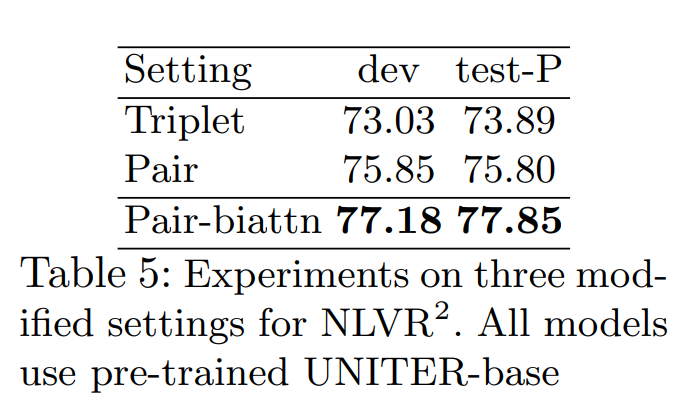

- 다른 task 와 다르게, NLVR$^2$ 는 two images 를 input 으로 사용
  - 따라서 image-sentence pairs 로 pre-trained UNITER 를 직접 fine-tuning 하기엔 최적의 성능을 이끌지 못할 수 있다.
  - 이는 pre-training stage 에서 paired images 간의 상호작용이 학습되지 않기 때문.
  - 따라서 NLVR$^2$ 에 3 modified setting 실험 (Tab. 5):
    1. _Triplet_ : images pairs 및 query 의 joint embedding
    2. _Pair_ : 각 image 및 query caption 의 individual embedding
    3. _Pair-biattn_ : _Pair_ model 에 bidirectional attention 을 추가하여 image 간의 상호 작용을 학습
    - _Triplet_ setting 보다 _Pair_ setting 의 성능이 더 좋으며, 심지어 image pairs 간의 cross-attention 없이도 그럼
    - 이는 UNITER 가 image-text pairs 로 pre-training 되어 발생하는 것으로 추측
    - 따라서, pair-based pre-trained model 을 triplet input 에 fine-tuning 하는 것은 어려운 것
    - 하지만, _Pair-biattn_ 의 bidirectional attention mechanism 은 image 간의 cross-attention 의 부족을 보완하므로 가장 우수한 성능 제공
    - 이는 UNITER 의 top layer 의 최소한의 조작만으로도 pre-trained model 이 pre-training task 와 전혀 다른 new tasks 에도 adapting 가능함을 보여줌

## 4.4 Visualization

저자는 UNITER 모델의 attention map 의 여러 pattern 관찰

저자의 attention mechanism 은 inter- 및 intra-modality 방식으로 작동

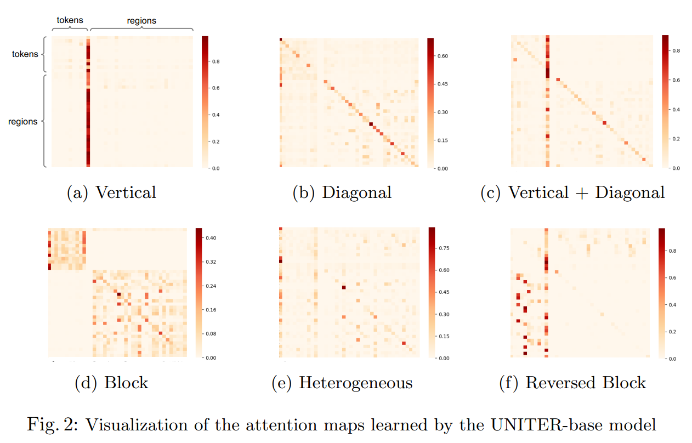

- _Vertical_ : special tokens [CLS] or [SEP] 에 대한 attention
- _Diagonal_ : token/region 자체 또는 preceding/following tokens/regions 에 대한 attention 
- _Vertical + Diagonal_ : vertical 및 diagonal 혼합
- _Block_ : intra-modality attention, i.e. textual self-attention 및 visual self-attention
- _Heterogeneous_ : categorize 가 안되고 actual input 에 의존적인 다양한 attention 
- _Reversed Block_ : inter-modality attention, 즉, text-to-image 및 image-to-text attention

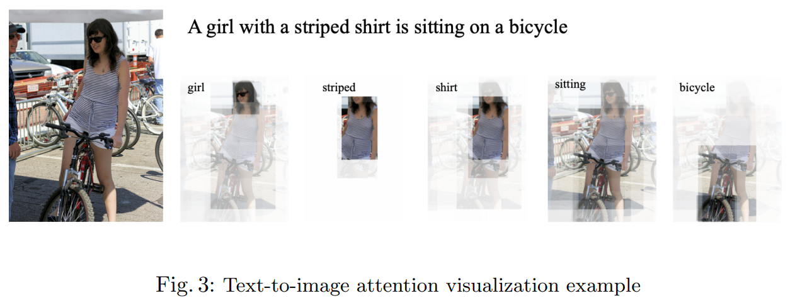

_Reversed Block_ (Fig. 2f)은 tokens 및 regions 간의 cross-modality alignment 를 보여준다.

Fig. 3 에선, regions 및 tokens 간의 local cross-modality alignment 를 visualizing 하기 위해 text-to-image attention 을 예시로 듦

# 5. Conclusion

본 논문은 UNITER 제안

- vision-language task 를 위한 UNiversal Image-TExt Representation 을 제공하는 large-scale pre-trained model
- 4 pre-training tasks 를 제안하며, 광범위한 ablation study 로 평가
- in-domain 및 out-of-domain datasets 로 훈련된 UNITER 는 multiple V+L task 에 SOTA 를 큰 폭으로 능가

# Appendix

## A.1 Dataset Collection

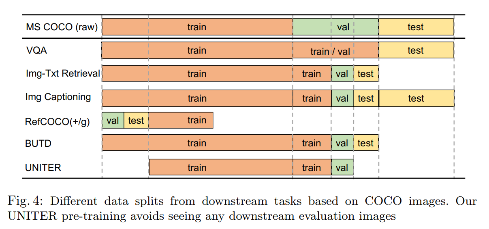

## A.2 Implementation Details

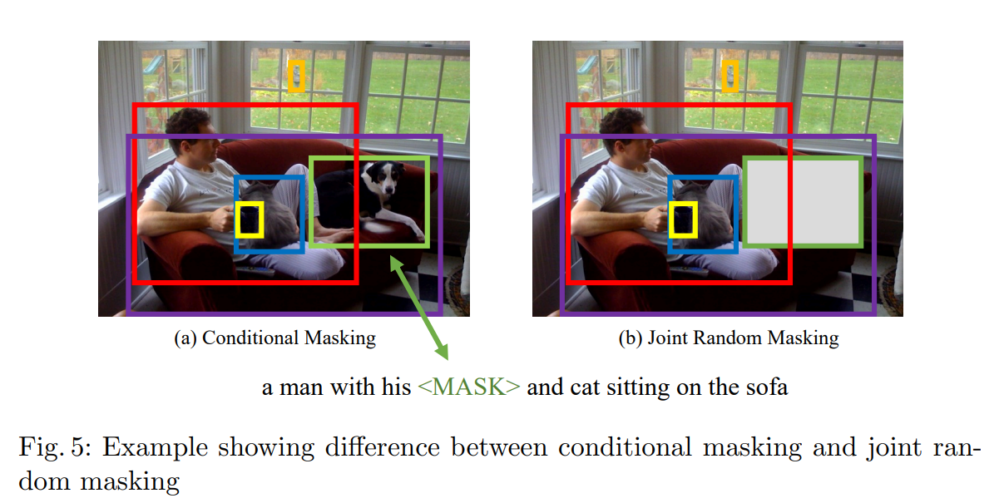

## A.3 Conditional Masking vs. Joint Random Masking

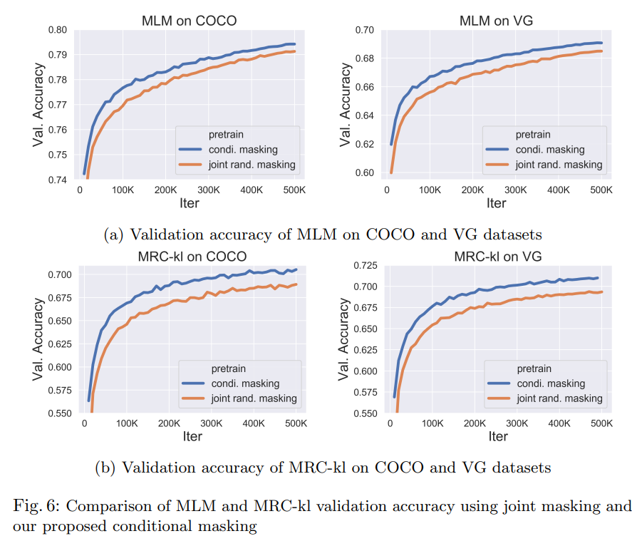

## A.4 More Ablation Studies on Pre-training Settings

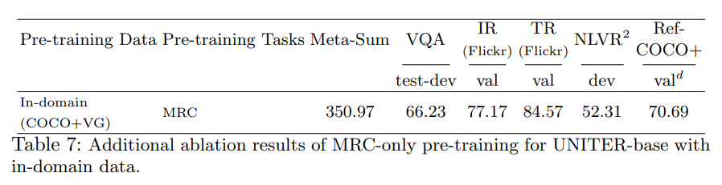

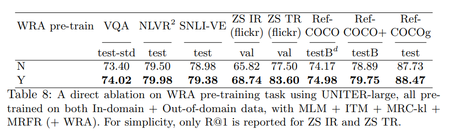

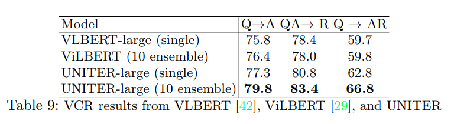

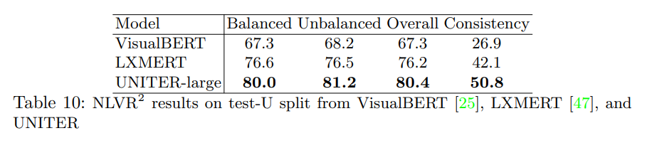

## A.5 More Results on VCR and NLVR2

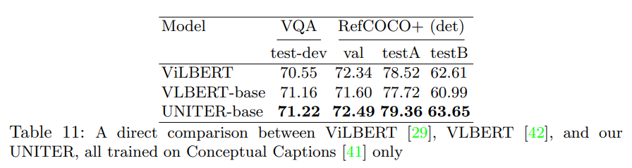

## Additional Visualization

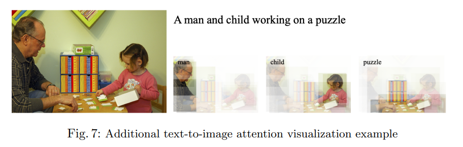