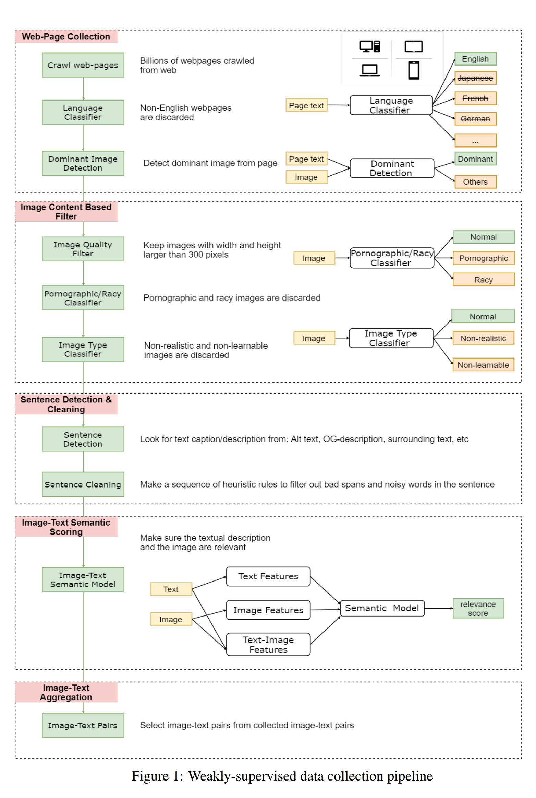
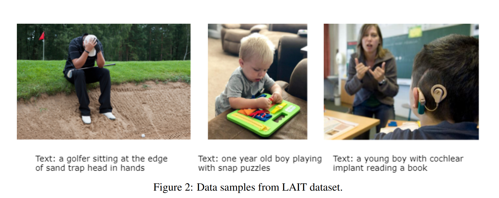
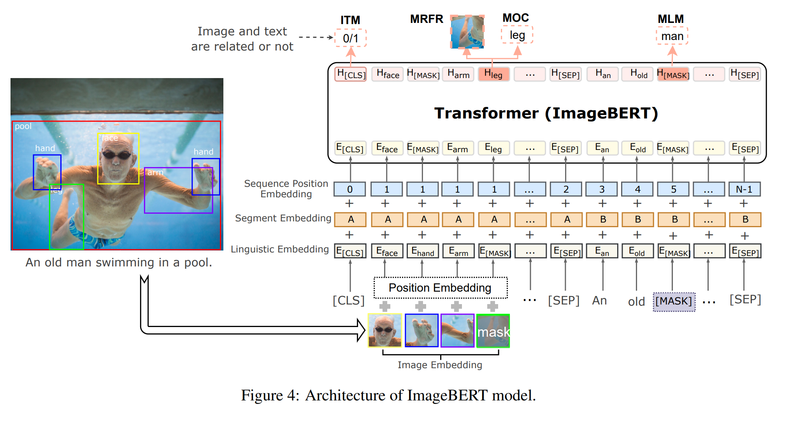
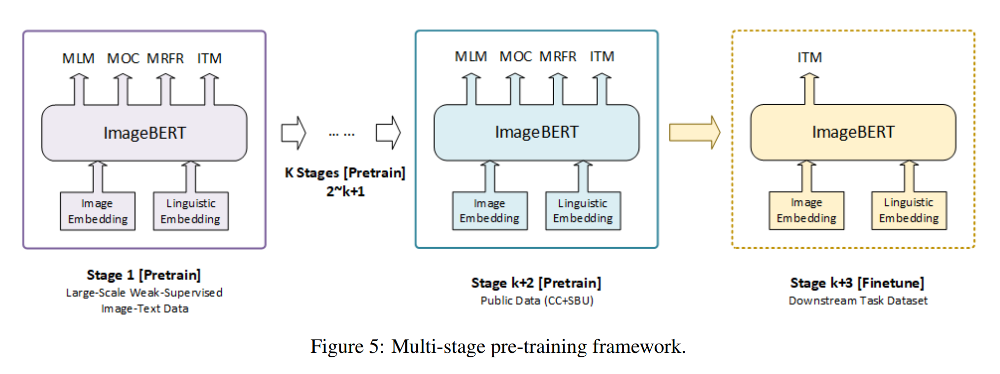
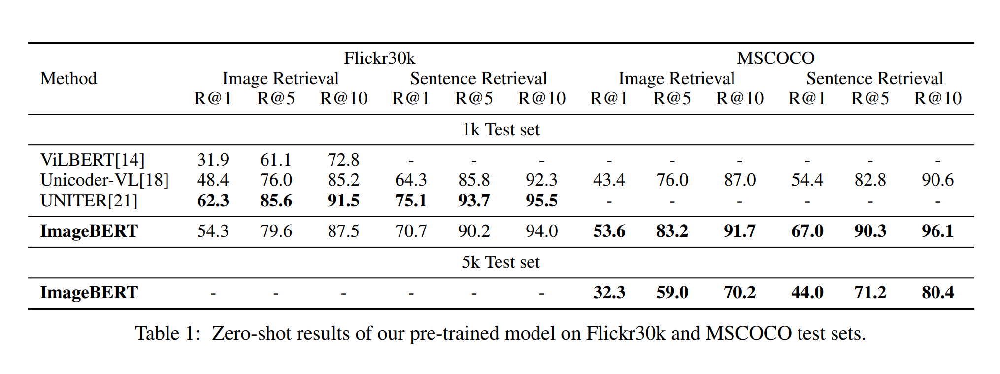
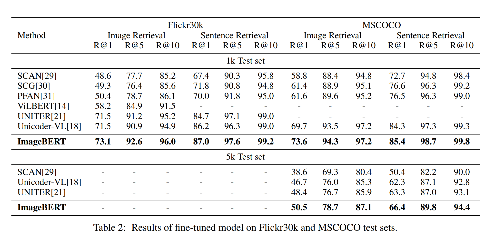
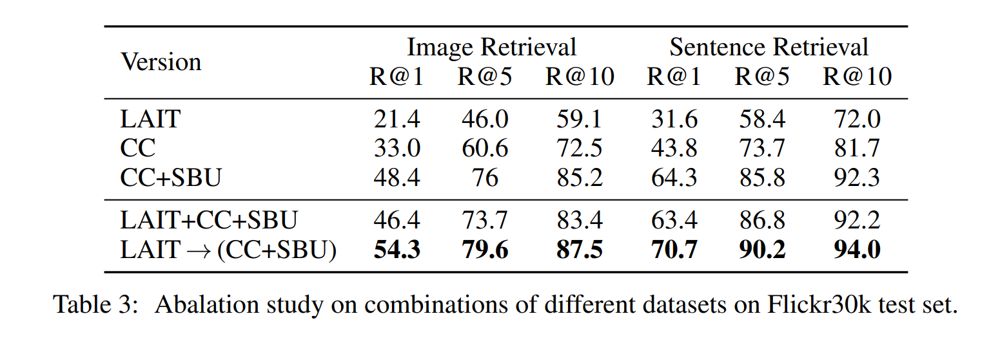
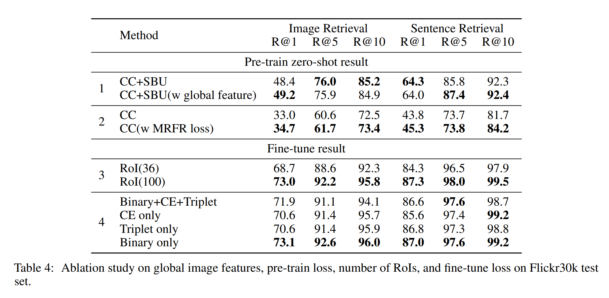

논문 및 이미지 출처 : <https://arxiv.org/pdf/2001.07966.pdf>

# Abstract

본 논문에선 image-text joint embedding 을 위한 new vision-language pre-trained model **ImageBERT** 제안

- Transformer 기반 모델로, 서로 다른 modality 를 input 으로 받고 이들 간의 relationship 을 modeling
- 이는 4 task pre-training 을 동시에 진행: Masked Language Modeling (MLM), Masked Object Classification (MOC), Masked Region Feature Regression (MRFR) 및 Image Text Matching (ITM)
  - pre-training quality 향상을 위해, web 에서 Large-scale weAk-supervised Image-Text(LAIT) dataset 수집
  - 먼저 이 dataset 에 모델을 pre-training 후, Conceptual Captions 및 SBU Captions 에 second stage pre-training 실행
- 실험 결과, multi-stage pre-training 이 single-stage pre-training 을 능가한다는 것을 보여줌
- 또한, pre-trained ImageBERT 은 image 및 text retrieval tasks 에 fine-tuning 하여 평가
- MSCOCO 및 Flickr30k dataset 모두에서 SOTA 달성

# 1. Introduction

vision-language task 관심이 높아지고 있다. 

- Text-Image Retrieval : text 가 주어지면 관련 이미지 검색 및 그 반대
- Visual Question Answering (VQA) : 이미지 관련 질문이 있을 때, 답변 예측
- Visual Commonsense Reasoning (VCR) : 상식적인 질문에 답변할 뿐 아닌 답변을 지원하는 이유를 선택
- Image Captioning : 각 input image 에 대한 설명을 생성하는 것

이전 연구는 주로 BERT 같은 pre-trained model 과 ResNet 을 훈련시킨 후, downstream task 에 대한 multi-modal input 으로 late fussion 방식을 사용

- 이런 late fusion layer 는 training 을 위해 task-specific labels data 가 요구되며, 많은 multi-modal tasks 의 경우 충분한 task annotations 확보는 어렵고 비용이 듦

BERT, XLNet 및 RoBERTa 같은 pre-trained model on NLP 의 성공으로, cross-modal pre-training 연구가 활발해져, 이러한 모델은 large-scale corpus 기반으로 early stage 에서 language 및 vision contents 에 대한 joint representations 학습 후 task-specific fine-tuning 으로 downstream task 에 적용한다. 

본 논문에선 cross-modal pre-training 에해 검토후 유사성과 차이점을 비교하고, ImageBERT 를 cross-modal pre-training 에 대한 strong baseline 으로 제시

- MSCOCO 및 Flicker30K text-to-image 및 image-to-text retrieval task 에서 SOTA 달성
- 웹에서 수집한 10M text-image pairs 를 포함한 new corpus 구축

# 2. Related Work

Transformer 가 cross-modal 연구에 널리 사용되었으며, 거의 모든 최신 연구가 Transformer 를 기반하지만 다양한 방식으로 차이 존재

- **Model Architecture** : BERT 는 one or two sentences 를 입력으로 사용하는 NLP task 를 위해 pre-training 됨. BERT 구조를 cross-modal tasks 적용을 위해 다양한 modalities 를 처리하는 많은 방법이 존재
  - ViLBERT 및 LXMERT : 각각 이미지와 문장에 single-modal Transformer 적용한 다음, 이 두 modality 간의 cross-modal Transformer 로 결합
  - VisualBERT, B2T2, Unicoder-VL, VL-BERT, Unified VLP, UNITER 등 : 이미지와 문장을 하나의 입력으로 결합
- **Image visual tokens** : 최신 논문들은 이미지에 대한 object detection model 을 적용하고 regions-of-interest (ROIs)을 image descriptor 로 취급.
  - 다른 연구는 pre-trained detection model 을 사용했지만, VL-BERT 는 detection network 를 image-text joint embedding network 와 함께 훈련시켰으며 global image features 를 training 에 추가
  - region-based image feature 는 좋은 descriptor 이며, 직접 Transformer 에 주입될 수 있는 visual token sequence 형성
- **Pre-train data** : 
  - Conceptual Catpion 은 image-text pre-training 을 위해 가장 널리 사용되는 데이터로, 3M image description 을 가지고 있으며 다른 데이터셋보다 상대적으로 큼
  - UNITER 는 4 DATASET(Conceptual Catpion, SBU Catpion, Visual Genome 및 MSCOCO)을 결합하여 9.6M training corpus 를 형성했으며 많은 image-text cross-modal tasks 에서 SOTA 달성
  - LXMERT 는 pre-training 에 일부 VQA training data 를 추가하고 VQA task 에 SOTA 달성. 데이터 품질과 양이 모델 훈련에 중요한 역할을 하며, 새로운 모델을 설계할 때 더 많은 주의 필요

# 3. Large-Scale Weak-supervised Image-Text Data Collection

cross-modal pre-training 은 대량이면서 고품질의 vision-language pairs 가 필요. 최근 cross-modal pre-trained model 은 Conceptual Captions (CC) (3M image 및 descriptions) 및 SBU Caption (1M image 및 user-associated captions) 를 사용한다.

이러한 dataset 의 크기는 여전히 수백만 파라미터 모델 또는 향후에 충분하지 않으며, 수동 이미지 설명은 고품질이지만 비용이 크다. 하지만 인터넷에는 무수히 많은 웹 페이지가 있다.

이에 동기를 받아, 본 논문은 Web 에서 large-scale image-text data 를 수집하기 위해 weak-supervised 방식 설계. (Fig. 1)

데이터 양과 품질은 vision-language pre-training task 에 중요하며, 결과 LAIT (Large-scale waAk-supervised Image-Text) dataset 으로 평균 13 words 로 구성된 설명과 10M images 포함

실험에서 LAIT 가 vision-language pre-training 유용한 것으로 나타날 것이며, Fig. 2 에 예를 제시

- **Web-page Collection** : web-page billion 에서 크롤링하고, 모든 downstream task 가 영어로 이루어져 다른 언어는 모두 버림. 다음 각 web-page 구문 분석 후 image URL 을 수집하고, HTML 및 DOM tag 로 이미지 감지. 
- **Image Content Based Filtering** : image content 기반으로 data 를 추가 필터링. weight height 모두 300 pixel 이상인 큰 이미지만 유지하며, 음란물 및 성적 콘텐츠는 버린다. 또한 downstream task 의 이미지는 모두 실제 시계의 natural image 이므로, 비자연 및 비현실적으로 학습이 어려운 이미지는 거부하는 binary classifier 적용
- **Sentence Detection & Cleaning** : HTML 의 사용자 정의 메타데이터(Alt 또는 Title 속성), 이미지 주변 텍스트 등; 저자는 휴리스틱 규칙의 sequence 를 사용하여 문장에서 bad span 및 noisy words (스팸/음란물)를 걸러내고, 정상 길이의 문장만 남김. 마지막으로 out-of-vocabulary 비율이 높은 문장은 버림
- **Image-Text Semantic Scoring** : bad image 는 걸러내고 noisy 있는 text 정리한 후, text 와 image 가 의미적으로 관련 있는지 확인하고자 한다. small supervised image-text data 를 사용해 weak image-text semantic model 을 훈련시켜 <text, image> pair 가 의미적으로 관련이 있는지 여부를 예측하고, 이후 이를 수십억 규모의 image-text pair 에 적용하여 관련 없는 쌍을 걸러냄. semantic model 은 text-only features, image content features 및 text-image cross-modal features 를 포함한 수백 가지 features 을 기반으로 훈련
- Image-Text Aggregation: 하나의 이미지가 여러 웹 페이지에서 다운로드되어 서로 다른 텍스트 설명을 가질 수 있는 경우가 있다. 이 경우 best scored <text, image> pair 만 선택. 동일한 설명을 가진 이미지가 너무 많은 경우에는 이러한 모든 pair 를 corpus 에서 삭제

# 4. ImageBERT

Fig. 4 는 ImageBERT model 의 전반적인 구조

- BERT 와 유사하게, Transformer 를 기본 구조로 사용하지만, image visual token 및 textual token 모두 입력으로 취함
- image 와 text input 은 embedding layers 를 통해 서로 다른 embedding 으로 인코딩
  - image visual token 은 Faster-RCNN 에서 추출된 RoI features
- 이후 이러한 embedding 은 multi-layer bidirectional self-attention Transformer 에 주입되어 visual regions 및 linguistic tokens 간의 relationships 를 학습하는 cross-modality Transformer 형성

4.1 임베딩 모델링

Transformer 를 위한 입력을 준비하는 방법 소개

#### Linguistic embedding

BERT 와 유사한 word pre-processing 채택

- input sentence 는 WordPiece 를 사용해 $n$ sub-word tokens $\{ w_0, \cdots, w_{n-1} \}$ 으로 토큰화
- [CLS] 및 [SEP] 같은 special token 도 토큰화된 텍스트 순서에 추가
- 각 sub-word 의 final embedding 은 original word embedding, segment embedding 및 sequence position embedding 을 결합하여 생성
- 이러한 all embeddings 는 public pre-trained BERT 에서 초기화

#### Image embedding

linguistic embedding 과 유사하게, 비슷한 프로세스를 통해 visual input 으로 생성된다.

- Faster-RCNN 은 image 에서 $o$ RoIs $\{ r_0, \cdots, r_{o-1}\}$ 에서 feature 를 추출하기 위해 사용
- detected object 는 linguistic part 에 whole image 의 visual contexts 를 제공할 뿐만 아니라 detailed region information 을 통해 specific terms 와 관련될 수 있음
- 또한 global image 에 대한 object location 을 5-D vectors $c^{(i)} = (\frac{x_{tl}}{W},\frac{y_{tl}}{H},\frac{x_{br}}{W},\frac{y_{br}}{H},\frac{(x_{br}-x_{tl})(y_{br}-y_{tl})}{WH})$ 으로 인코딩하여 image embeddings 에 position embeddings 를 추가
  - $(x_{tl}, y_{tl})$ 및 $(x_{br}, y_{br})$ : object bounding box 의 top-left 및 bottom-right 좌표
  - $\frac{(x_{br}-x_{tl})(y_{br}-y_{tl})}{WH}$ : whole image 에 대한 proportional area
- object features 및 location embeddings 모두 linguistic embeddings 와 동일한 차원으로 project
- 각 image RoI $r^{(i)}$ 에 대한 final representation $e^{(i)}$ 은 이의 object embedding $v^{(i)} = ImageEmbed(r^{(i)})$, segment embedding $s^{(i)} = SegmentEmbed(i)$, image position embedding $\text{p}^{(i)}_{img} = PositionEmbed(\text{c}^{(i)})$ 및 sequence position embedding $\text{p}^{(i)}_{seq} = PositionEmbed(i)$ 를 합산하여 다음을 얻는다.

$$
\text{e}^{(i)} = LN (\text{v}^{(i)} + s^{(i)}+\text{p}^{(i)}_{img}+\text{p}^{(i)}_{seq})
$$

- 각 embedding 은 Transformer sub-layers 의 hidden size 와 동일한 embedding size 의 vector 로 project 되며 Layer Normalization (LN) 을 따름
- 또한 detection model 로부터의 각 region 의 classification label 를 label prediction task 로 사용
- Ablation 연구에서 region features 에 global image features 를 추가하는 것을 실험

#### Sequence position and segment embedding

- 각 token 에 대한 sequence position embedding 은 input tokens 의 순서
- detected RoI 는 순서가 없고 object 좌표는 이미 image embedding 에 추가되어 있기 때문에, all visual tokens 에 대한 dummy position 을 고정
- linguistic 부분에선, textaul description 의 word order 를 나타내기 위해 ascending sequence 사용
- 각 input tokens 엔 서로 다른 modalities 를 구별하기 위해 segment embedding 추가

## 4.2 Multi-stage Pre-training

다른 소스에서 수집된 다른 dataset 은 서로 다른 품질 및 분포를 가질 수 있다.  다양한 pre-training data 활용을 위해 Fig. 5 처럼 multi-stage pre-training framework 제안

downstream task 를 따라, pre-trained model 은 먼저 large-scale out-of-domain 을 사용해 small-scale in-domain data 을 따라 훈련해야 한다. 이렇게 하여 final task 에 더 잘 수렴할 수 있다.

- multi-stage pre-training 에서, 동일한 network 구조에 여러 pre-train stages (e.g. k+2 stages)를 순차 적용하여 다양한 dataset 활용
- 저자의 multi-stage framework 는 pre-training statge 에 적용되어 다양한 out-of-domain 을 더 잘 활용
- 구체적으로, ImageBERT 에는 two-stage pre-training 전략 사용
  1. LAIT dataset 사용
  2. Conceptual Caption 및 SBU Captions 와 같은 public dataset 사용
- 두 pre-training 모두 4 pre-training tasks 를 포함한 동일한 훈련 전략 사용
- 모든 dataset 을 동시에 훈련하는 single-stage pre-training 실험을 수행했지만, multi-stage pre-training 만큼 잘 작동하지 않음
- final fine-tuning stage 에선, 처음 two stage 에서의 model 및 parameter 를 동일하게 사용하지만, 모든 masked terms 또는 masked objects 를 버림
- ablation 연구엔, image-text retrieval task 에 대한 다양한 fine-tuning objective 실험

## 4.3 Pre-training tasks

#### Task 1: Masked Language Modeling (MLM)

이 task 는 BERT training 의 MLM task 와 동일하다.

- $n$ input sub-word tokens 를 $\text{w} =- \{w_0, \cdots, w_{n-1} \}$ 로 표시
- input token 15% 확률로 randomly masking
- masked indices 를 $\text{m}_T \in \mathbb{N}^M$ 으로 표시
  - masked word : $w_{m_T}$
  - non-masked word : $w_{\backslash m_T}$
- masked token 은 special token [MASK] 로 대체되며, random token 또는 remains 는 각각 80%, 10%, 10% 확률로 바뀌지 않는다
- surrounding text 에 기반하여 textual tokens 및 visual features 간의 cross-attention 으로 예측하며, 이를 $\text{v} = \{v_0, \cdots, v_{o-1} \}$ 표시
- negative log-likelihood 를 최소화:

$$
\mathcal{L}_{\text{MLM}} (\theta) = -E_{(\text{v},\text{w})\sim D} \sum^{M-1}_{i=0} CE (l_\theta (v^{(i)}_{mI}), f_\theta (v^{(i)}_{mI}))
$$

#### Task 2: Masked Object Classification (MOC)

이 task 는 MLM task 의 확장이다. language modeling 과 유사하게, visual object tokens 에 masked modeling 을 수행한다.

- 각 object token 을 15% 확률로 randomly masking 한 후, masked token 을 0 으로 하거나 original token 으로 유지할 확률 각각 90%, 10%
- object tokens 의 masked indices 를 $\text{m}_I \in \mathbb{N}^M$ 으로 표시
  - masked token : $v_{mI}$
  - non-masked token : $v_{\backslash m_I}$
  - $M$ masked input tokens 의 $i^{th}$ : $v^{(i)}_{mI}$
- $M$ masked object token 예측을 위해, 저자는 Faster R-CNN model 의 labeled classification categories 를 ground truth labels $l_\theta (v_{m_I}^{(i)})$ 으로 취급
- Transformer 의 masked token 에 대한 output vecctor 가 $f_\theta (v_{m_I}^{(i)}) \in \mathbb{R}$ 라 가정하자.
  - 여기에 fully-connected layer 를 추가하여 $K$ object classes 로부터 correct label 예측
  - 이때, final objective 는 linguistic features $\text{w}$ 의 context 와 함께 cross-entropy (CE) loss 사용:

$$
\mathcal{L}_{MOC}(\theta) = -E_{(\text{v}, \text{w})\sim D} \sum^{M-1}_{i=0} CE (l_\theta (v^{(i)}_{mI}), f_\theta (v^{(i)}_{mI}))
$$

#### Task 3: Masked Region Feature Regression (MRFR)

MOC 유사하게, MRFR 또한 visual content 를 modeling 하지만, object feature prediction 에 더 정확히 작동

- 이 task 는 masked object 의 embedding feature 를 regress 하는 것을 목표: $h_\theta (v_{m_I}^{(i)})$
- output feature vector 위에 fully-connected layer 를 추가하여 input RoI object feature 와 동일한 차원으로 project: $r_\theta (v_{m_I}^{(i)})$
- 이후 L2 loss 를 적용하여 ground truth feature 에 regress:

$$
\mathbb{L}_{MRFR}(\theta) = -E_{(\text{v}, \text{w})\sim D} \sum^{M-1}_{i=0} || h_\theta (v_{m_I}^{(i)}) - r_\theta (v_{m_I}^{(i)}) ||^2_2
$$

위 3 tasks 의 경우 conditional mask 을 사용하며, input image 와 text 관련있을 때 all mask losses 를 계산

#### Task 4: Image-Text Matching (ITM)

language modeling task 및 visual content modeling task 를 추가하여, image-text alignment 학습을 위해 ITM task 추가

- 각 training sample 에 대해, 각 image 에 negative sentence 를 randomly sampling 하고 각 sentence 에 대해 negative image 를 randomly sampling 하여 negative training data 생성
- 따라서 각 image-text pair $(\text{v}, \text{w})$ 에 대한 ground truth label $y \in \{0,1\}$ 으로 표기하며, input sample pair 가 관련됐는지 여부 나타냄
- BERT 와 유사하게, input sequence 의 first token 으로 [CLS] 를 ImageBERT 에 추가하고, 그 위에 fully-connected layer 를 적용하여 image-text similarity score $s_\theta (\text{v}, \text{w})$ 를 얻음
- binary classification loss 를 사용하여 optimizing:

$$
\mathcal{L}_{ITM}(\theta) = -E_{(\text{v}, \text{w}) \sim D} [y \log s_\theta (\text{v}, \text{w}) + (1-y)\log(1-s_\theta (\text{v}, \text{w}))]
$$

## 4.4 Fine-tuning tasks

pre-training 후, 모델을 Image-Text Retrieval task 에 fine-tuning 하고 평가

이 task 엔 two sub-tasks 포함: image retrieval 및 text retrieval

- image retrieval : image content 를 설명하는 input caption sentence 가 주어졌을 때 image 를 검색하는 것 목표
- text retrieval : 반대 방향으로 유사한 task 수행
- two-stage pre-training 후 MSCOCO 및 Flickr30k dataset 에 fine-tuning
- fine-tuning 중에, input sequence 형식은  pre-training 과 동일하지만 object 또는 word masking 이 없음
- 다양한 negative sampling 방법에 해당하는 two fine-tuning objectives 제안: image-to-text (각 image 에서 negative sentence sampling) 및 text-to-image (각 text 에서 negative sentence sampling)
- 또한 best model quality 를 얻기 위해 세 가지 다른 손실에 대한 실험을 수행:

#### Binary Classification Loss

이는 negative sample 의 예측이 올바른지 보장하기 위한 것: negative sample 의 output score 는 positive sample 과 다르게만 되는 것이 아니라, right labels 도 예측되어야 한다.

ground truth label $y \in 0, 1$ 를 가진 image-text pair $(\text{v}, \text{w})$ 에 대해 Transformer 에서 출력된 first token $t_{(\text{v}, \text{w})}$ 의 embedding 을 $c_\theta (t_{(\text{v}, \text{w})}) \in \mathbb{R}$ 으로 취함

이후 optimization 으로 binary classification loss 적용

$$
\mathcal{L}_{BCE}(\theta) = -E_{(\text{v}, \text{w})} [y \log c_\theta (t_{(\text{v}, \text{w})}) + (1-y)\log(1-c_\theta ( t_{(\text{v}, \text{w})} ))]
$$

#### Multi-class Classification Loss

이는 positive 및 negative samples 사이의 간격을 확대하기 위해 가장 널리 사용되는 loss.

- 각 positive pair $(\text{v}, \text{w})^+$ 에 대해 $P − 1$ 개의 negative pair $(\text{v}, \text{w})^-$ 을 다른 caption 또는 image 에서 sampling
- 이후 $P$ pairs' first tokens $t_{(\text{v}, \text{w})}^{(j)}$ 에 대해 correct label $l_{(\text{v}, \text{w})}$ 을 예측하기 위한 scoring function 을 추가하고 final objective 로 cross-entropy loss 적용

$$
\mathcal{L}_{CE} (\theta) = -E_{(\text{v}, \text{w})}^{(j)} \sum^{P-1}_{j=0} CE (s(t_{(\text{v}, \text{w})}^{(j)}), l_{(\text{v}, \text{w})}^{(j)})
$$

#### Triplet Loss

저자는 triplet loss 를 사용하여 positive 및 hardest negative sample 간의 간격을 최대화

- multi-class classification loss 에서 언급했듯, 각 positive pair $(\text{v}, \text{w})^+$ 에 대해, $P-1$ negative pairs $(\text{v}, \text{w})^-$ 을 다른 caption 또는 image 에서 계산된 similarity scores $s(t_{(\text{v}, \text{w})^-})$ 와 함께 sampling
- hardest negative samples 는 $n_h^- = \arg \max_{(\text{v}, \text{w})^j \neq (\text{v}, \text{w})^+}s(t_{(\text{v}, \text{w})^j})$ 로 주어짐
- 이후 positive sample 및 hardest negative sample 에 triplet loss 적용

$$
\mathcal{L}_{Triplet}(\theta) = -E_{(\text{v}, \text{w})}^{(j)} \sum_{n^- \in \mathcal{N}} \max [0, s(t_{(\text{v}, \text{w})^+}), s(n^-_h)]
$$

# 5. Experiments

Image-Text retrieval task 에 pre-trained model 평가를 위해 zero-shot 및 더 많은 fine-tuning 결과 제시

MSCOCO 및 Flickr30k dataset 에서 image-retrieval 및 text-retrieval task 에 대해 SOTA 와 비교

## 5.1 Evaluation for the Pre-trained Model

#### Pre-trained data

LAIT dataset 에서 BERT-base 모델에서 파라미터를 초기화한 stage-1 로 모델을 pre-training

이후 public dataset (Conceptual Captions 및 SBU Captions)에서 stage-2 로 pre-training

#### Experiment settings

- 768 hidden unit, 3072 intermediate unit 및 12 attention heads 를 가진 12-layer Transformer 사용
- dropout 0.1 및 GELU activation function
- input sequence max length 144
- 1600 category 의 Visual Genome dataset 에 pre-train 된 Faster RCNN model 에서 추출된 100 visual tokens 및 special tokens 포함
- pre-training 중 batch size 48, learning rate 1e-4 Adam
- 4 V100 GPU 17 epochs 훈련
- MLM, MOC 및 MRFR tasks 에서 conditional mask 사용하고 input pairs 가 positive sample 일 때만 masked loss 계산
- 다른 연구와 마찬가지로 $R@K(K = 1, 5, 10)$ 같은 metric 을 사용하여 성능 평가
  - 이 metric 은 top $K$ 결과에서 올바르게 일치하는 pairs 의 백분율 측정
- Flickr30k 및 MSCOCO 에 각 image 당 5 caption 이 포함되어, sentence retrieval task 는 image retrieval task 보다 쉽고 더 높은 점수를 얻을 수 있음

#### Zero-shot result of pre-train model

fine-tuning 없이 Flickr30k 및 MSCOCO test set 에 pre-trained model 을 평가하여 품질 측정

- MSCOCO 에서 SOTA 를 달성했지만 UNITER 보다는 성능이 낮음
- 여기서는 stage-2 pre-training 결과만 보여주며, stage-1 pre-training 결과는 ablation study 참조
- Unicoder-VL 은 public in-domain datasets (Conceptual Caption 및 SBU Captions)을 사용하여 single pre-training stage 만 포함
- UNITER 는 pre-training stage 중에 일부 domain dataset (VG 및 MSCOCO)을 추가하여 best zero-shot 결과를 얻음
- 그러나 fine-tuning 후에도 비교 가능한 결과를 얻음 (Tab. 2)
- 또한 SOTA 와 비교할 때, single pre-training stage 만 있는 다른 방법과 비교하여, multi-stage pre-training 전략은 pre-training 중에 더 유용한 지식을 학습할 수 있으며, 결과 downstream task fine-tuning stage 에 기여

## 5.2 Evaluation for Fine-tuning Model

#### Experiment settings

LAIT 및 다른 public dataset (Conceptual Captions 및 SBU Captions)에서의 two-stage pre-training 후, 잘 훈련된 모델을 downstream task 인 Image-Text retrieval 을 위해 적용하고 ITM task 를 위해 fine-tuning

실험은 Flickr30k 및 MSCOCO 모두에서 수행.

- fine-tuning 중 batch size 24, learning rate 5e-5 설정
- 4 V100 GPU 를 사용하여 130 epoch 동안 훈련

#### Fine-tuning results

- FOCO 모두 (1k 및 5k test set 모두)에서 SOTA 달성하고, 다른 모든 방법을 능가하는 것을 볼 수 있음
- 이는 저자의 LAIT 데이터와 저자의 multi-stage pre-training 전략이 cross-modal joint learning 에 효과적임을 증명

## 5.3 Ablation Studies

#### Pre-train dataset

다른 dataset 의 조합으로 pre-training 실험 진행.

- 다른 모든 설정보다 여러 가지 다른 domain dataset 을 multi-stage 로 사용하는 것이 훨씬 더 좋은 결과를 달성

#### Global image features

detected RoIs 가 전체 image 의 모든 정보를 포함하지 않을 수 있음을 유의해야함. 따라서 visual part 에 global image feature 을 추가

- 저자는 input image 에서 global visual feature 를 추출하기 위해 세 가지 다른 CNN 모델 (DenseNet, Resnet, GoogleNet)을 사용
- 그러나 모든 metric 이 개선되진 않음

#### Pre-train loss

UNITER 에서 영감 받은 MRFR loss 를 pre-training 에 추가하여 zero-shot 결과에서 엄청난 개선 달성

이는 visual contents 를 더 잘 modeling 하기 위해 더 어려운 task 를 추가하는 것이 visual-textual joint learning 에 기여 함을 시사 (Tab. 4, 2)

#### Number of objects (RoIs) from image

모델의 visual part 의 중요성을 이해하기 위해 다양한 objects 수에 대한 실험 수행

- 모든 실험에 100 objects 설정으로 pre-training task 의 input image 에 대해 충분한 context 제공
- Faster R-CNN model 로 detection network 의 confidence score 로 정렬된 top-100 ranked objects 추출
- 일부 bounding box 가 겹치거나 중복 정보를 포함할 수 있어, 다양한 object 수의 영향을 실험
- Tab. 4, 3 에서 보이듯, less objects (ViLBERT 와 동일)를 사용하면 나은 결과를 얻지 못함

#### Fine-tune loss

section 4.4 의 3 losses 의 조합을 fine-tuning 에 시도.

Tab. 4, 4 에 보이듯, binary cross-entropy loss 자체가 image-text retrieval task 에 가장 좋은 fine-tuning 결과 제공

# 6. Conclusion

본 논문은 Transformer 기반의 new vision-language pre-trained model 인 ImageBERT 제안

또한 존재하는 vision-language dataset 중 가장 큰 양을 가지고 있으며 LAIT 의 효과를 first multi-stage pre-training 전략의 효과성 입증

정밀한 인간 라벨이 없는 large-scale out-of-domain data 는 pre-trained model 품질에 가치를 추가하고, 이에 따라 해당 downstream task 에 이익을 줄 수 있음을 볼 수 있음

ImageBERT 은 MSCOCO 및 Flickr30k 에서 image retrieval 및 sentence retrieval task 모두에서 SOTA 달성 