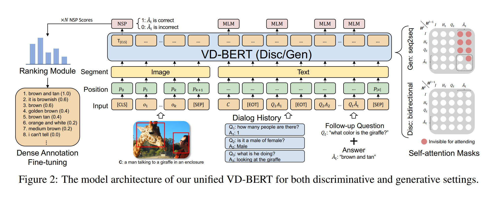
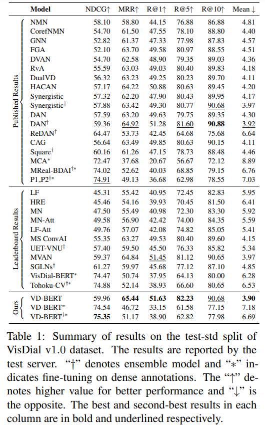
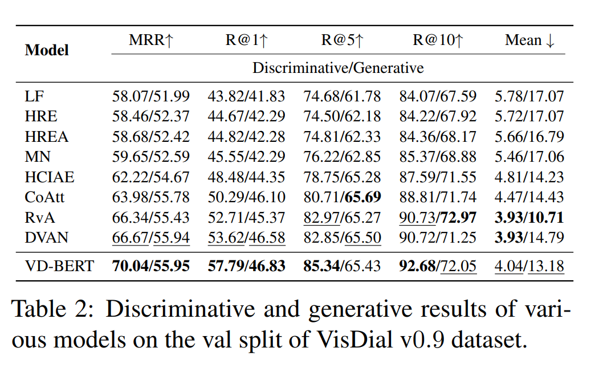
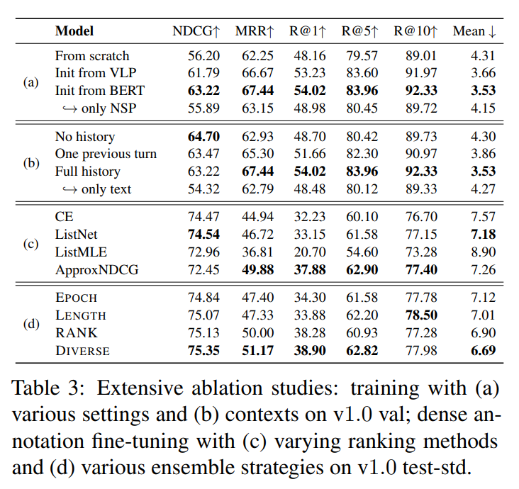
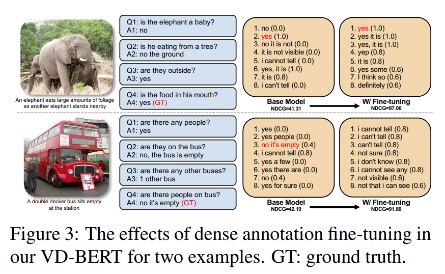
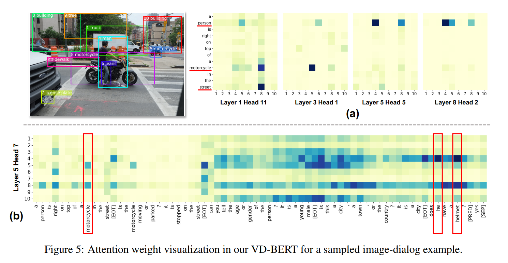
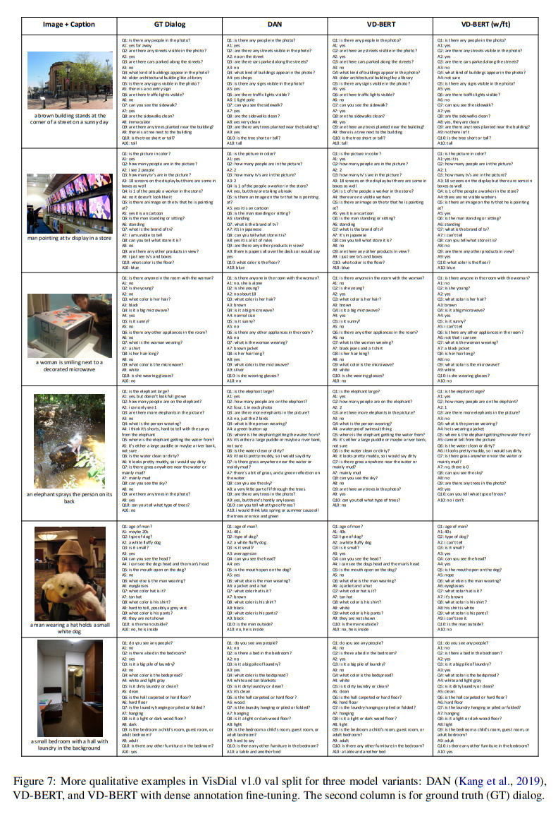

논문 및 이미지 출처 : <https://arxiv.org/pdf/2004.13278.pdf>

# Abstract

visual dialog 는 image content 및 dialog history 를 추론하여 일련의 질문에 대답해야 하는 어려운 vision-languag task 다.

기존 연구는 상호작용 모델링을 위해 다양한 attention mechanism 에 초점을 맞춘다. 대조적으로, 본 연구는 visual dialog task 를 위해 pre-trained BERT 를 활용하여 간단하면서도 효과적인 통합 vision-dialog Transformer framework 인 **VD-BERT** 를 제안

- single-stream Transformer encoder 를 사용하여 image 와 multi-turn dialog 간의 모든 상호 작용을 포착하고
- 동일한 아키텍처를 통해 answer ranking 및 answer generation 모두 지원하며, 통합
- 더 중요한 것은 _visually grounded_ training 을 통해 vision 및 dialog content 를 효과적으로 fusion 하기 위해 BERT 를 적응
- external vision-language data 에 대한 pre-training 이 필요하지 않아, vision dialog 리더보드에서 single model 및 ensemble setting 에 top position 을 달성하여 SOTA 달성 (74.54 및 75.35 NDCG 점수)

# 1. Introduction

Visual Dialog (VisDial) 는 visual content 에 대한 질문을 대답하는 AI agent 구축이 목표다.  

기존 single-turn Visual Question Answering (VQA) 와 달리, VisDial 는 agent 가 visual content 이해와 함께 multiple round 상호 작용으로 질문에 답변을 해야한다.

- 다양한 attention mechanism 개발로 visual 및 dialog content 를 잘 fusion 하는 것이 목표이며, 질문 예측만 하는 VQA 와 달리 history 를 추가로 고려해야 한다. (Fig. 1a)
- 기존 연구 대부분은 question 관련 image region 및 dialog history 에 attending 하기 위해 question 을 query 로 사용하며, 이들의 상호 작용은 다변 예측을 위해 더 나은 visual-historical cues 를 얻기 위해 활용.
  - 다시 말해, 이런 방법은 _unibidirectional_ - question 에서 다른 entities 로 향함 (Fig. 1b)
- 본 논문은 unified Transformer encoder 를 사용하여 all entities 간의 _bidirectional_ attention flow 를 허용 (Fig. 1c)
  - 이렇게 하여, all entities 가 동시에 "information seeker" (query) 및 "information provider" (key-value) 의 역할을 수행하여 potential attention 을 발휘할 수 있음
  - 저자는 Transformer 를 encoding backbone 으로 채택하여, BERT 의 representation learning 능력을 채택
  - vision-language pre-training 에 영감을 받아, BERT 를 VisDial task 에서 vision 및 dialog contents 의 간단하고 효과적인 fusion 을 달성

---

최근 연구는 BERT 를 multimodal task 에 adapting 하는 시도가 있다. 

이들은 large-scale external vision-language data 에 BERT-like 모델을 self-supervised objectives 로 pre-training 한 다음 downstream task 에 fine-tuning 한다. 이로써 VQA, image captioning, image retrieval 및 visual reasoning 같은 task 에 좋은 결과를 얻었다.

하지만 visual dialog 는 독특한 multi-turn 구조를 가지고 있어, pre-training 으로 visual dialog 에서 어떻게 이점을 얻을지는 명확하지 않다.

구체적으로, VisDial dataset 의 각 이미지는 최대 10 dialog turns 과 관련이 있으며, 이는 VQA 또는 image captioning 보다 훨씬 logner contexts 를 포함한다.

---

본 논문은 VisDial task 를 위한 novel unified vision-dialog Transformer framework 인 **VD-BERT** 제안

- image 를 detected object series 로 인코딩하고 image caption 및 multi-turn dialog 와 함께 Transformer encoder 에 주입
- pre-trained language representation 을 더 잘 활용하기 위해 encoder 를 BERT 로 초기화
- two modalities 의 기능을 효과적으로 fusion 하기 위해 _two visually grounded_ training objectives - Masked Language Modeling (MLM) 및 Next Sentence Prediction (NSP) 활용
- BERT 의 기존 MLM 및 NSP 와 달리, masked token 이나 next answer 를 예측할 때 visual information 을 추가로 고려

---

VisDial 모델은 판별적 또는 생성적 중 하나의 설정으로 훈련. 

- discriminative settings: 모델은 answer candidates pool 에 순위 매김
- generative settings: 추가적으로 모델이 답변을 생성 가능
- 이전 연구처럼 두 유형의 decoder 사용하는 대신, 두 가지 다른 Self-Attention Mask 를 가진 unified Transformer 에 의존하여 두 가지 setting 을 모두 지원
- inference 중, VD-BERT 는 NSP score 에 따라 answer candidate ranking 을 매기거나 MLM task 를 재귀적으로 적용하여 answer sequence 생성
- 또한, dense annotations 로 모델을 fine-tuning 하여 ranking optimization module 이 있는 각 answer candidate 에 대한 relevance score 를 명시

요약하면 다음을 기여:

- VisDial 를 위해 pre-trained model 을 탐구하는 최초의 시도. BERT 가 복잡한 VisDial 상호작용을 포착하기 위해 visual grounded training 을 통해 이 task 에 효과인 adapting 이 될 수 있음을 보여줌. 또한, VD-BERT 는 명시적인 decoder 없이 discriminative 및 generative training setting 을 모두 지원하는 first unified model
- external vision-language data 에 pre-training 없이도, VisDial benchmark 의 generative setting 에서 SOTA 달성했으며, discriminative setting 에서도 유망한 결과를 얻음
- 다양한 training 측면과 dense annotations 에 대한 fine-tuning 에서 모델 성능을 분석하고, attention visualization

# 2. Related Work

#### Visual Dialog

Visual Dialog task 최근 제안되어, dialog agent 가 이미지 기반의 일련의 질문에 답변해야 하며, 이는 image contents 를 texts 에 따라 이해하며 dialog history 를 통해 reasoning 도 하는 어려운 vision-language task 다.

- 기존 연구는 dialog history 와 entities 간의 상호 작용을 modeling 하기 위해, 다양한 attention mechanism 개발에 초점
  - DAN : dual attention module 을 제안하여 dialog history 에 관련한 context 를 참조한 다음, indicative image region 을 찾음
  - ReDAN : imgae 와 dialog history 간 상호 작용을 multi-step reasoning 을 통해 탐구
- 저자는 single-stream Transformer encoder 내부의 self-attention 을 활용해 complex interactions 를 통합하는 방식으로 포착하고 all entities 에 대한 "holistic" contextualized representation 을 유도
  - 이와 유사한 Schwartz et al. (2019) 은 two entities 간의 상호 작용을 modeling 할 수 있는 general factor graph attention 인 FGA 를 제안하지만, 이는 pairwise 방식
  - 최근 연구는 many entities 간의 상호 작용을 modeling 하기 위해 Transformer 를 적용하지만, 이 모델은 answer entity 의 important early interaction 을 무시하고, BERT 를 자연스럽게 활용할 수 없음
- architecture 관점에서, 주로 이전 연구와 두 가지 측면에서 다름:
  1. 이전 연구는 final similarity computation layer 에 answer candidates 만 고려하는 반면, VD-BERT 는 각 answer candidates 를 input layer 에 통합하여 이를 early 및 deep fusion 을 지원
  2. 기존 모델은 discriminative 및 generative setting 을 위해 별도의 two type decoder 를 사용하는 반면, VD-BERT 는  추가 decoder 없이 two different self-attention masks 를 가진 unified Transformer encoder 를 채택하여 양쪽 setting 을 모두 원활하게 지원

#### Pretraining in Vision and Language

vision-language pre-training 을 NLP task 성능을 크게 향상시킨 BERT 를 사용하여 확장한 시도가 있음

- Transformer encoder 를 backbone 으로 text 와 image 를 독립적으로 encoding 하는 two-stream (ViLBERT, XMERT)
- text 와 image 를 함께 encoding 하는 single-stream (B2T2, Unicoder-VL, VisualBERT, VL-BERT, UNITER)
- VD-BERT 는 후자
- 위 모델은 VQA, image retrieval 및 visual reasoning 같은 vision-language task 에 개선 이룸
- 최근 VLP 는 다양한 self-attention masks 를 사용하여 생성
  - 이들은 VQA 및 image caption 을 위해 제안
  - 저자는 VLP 에 영감을 받아 visual dialog task 에 맞춤
- 이 논문과 밀접한 VisDial-BERT 도 visual dialog 를 위해 pre-trained ViLBERT 사용
- 저자의 연구는 VisDial-BERT 보다 두 가지 주요 장점 존재
  1. VD-BERT 는 discriminative 및 generative setting 모두 지원하는 반면, VisDial-BERT 는 discriminative setting 만 제한
  2. 저자는 large-scale external vision-language data 에 대한 pre-training 을 요구하지 않고도 나은 성능 발휘

# 3. The VD-BERT Model

먼저 visual dialog task 를 공식화.

- $t$-turn image $I$ 에 기반한 question $Q_t$ 및 dialog history $H_t = \{ C, (Q_1, A_1), \dots, (Q_{t-1}, A_{t-1}) \}$ 가 주어지면, agent 는 100 answer candidates list $\{\hat{A}^1_t, \hat{A}^2_t, \dots, \hat{A}^{100}_t\}$ 을 ranking 함으로써 answer $A_t$ 예측해야함
- 일반적으론 answer 예측을 위한 two type decoder 가 있음:
  - _discriminative_ decoder : answer candidates 를 _rank_ 하고 cross entropy loss 로 훈련됨
  - _generative_ decoder : answer 를 _synthesize_ 하고 maximum log-likelihood loss 로 훈련됨

1. 먼저, image 및 dialog history 를 encoding 하기 위해 unified vision-dialog Transformer 를 사용하여 early fusion 방식으로 answer candidate $\hat{A}_t$ 를 input 에 추가하여 interaction 을 modeling
2. 다음, bidirectional 및 seq2seq 유형의 two self-attention masks 를 사용해 효과적인 vision 및 dialog fusion 을 위해 모델을 훈련하는데 visually grounded MLM and NSP objectives 채택
   - 이는 discriminative and generative settings 모두 작동 가능
3. 마지막으로, dense annotations 에 대해 추가 fine-tuning 을 위해 ranking optimization module 고안

## 3.1 Vision-Dialog Transformer Encoder

#### Vision Features

이전 연구를 따라, Faster R-CNN pre-trained on Visual Genome 채용

- $O_I = \{ o_1, \dots, o_k \}$ : image $I$ 에 대한 vision feature
  - 각 object feature $o_i$ : 2048-d RoI feature
  - $k$ : detected objects 수 (36 으로 고정)
- 이 objects 는 순서가 없으므로, normalized bounding box coordinates 를 spatial location 으로 사용
- $(x_1, y_1)$ 및 $(x_2, y_2)$ : $i$-th object 의 bottom-left 및 top-right corner 좌표
- location information 은 5-d vector $p_i = (\frac{x_1}{W}, \frac{y_1}{H}, \frac{x_2}{W}, \frac{y_2}{H}, \frac{(x_2-x_1)(y_2-y_1)}{WH})$
  - $W$ 및 $H$ : input image 의 width 및 height
  - last element 는 object relative area
  - rich representation 을 위해 $p_i$ 를 class id 및 confidence score 로 확장

#### Language Features

all textual elements (caption 및 multi-turn dialog) 를 long sequence 로 묶는다.

BERT 를 따라 absolute positional code 와 함께 포함된 word sequence **w** 로 분할하기 위해 WordPiece tokenizer 사용

#### Cross-Modality Encoding

image 및 text 를 Transformer encoder 에 주입하기 위해 image object 를 language elements 와 함게 whole input sequence 로 통합한다.

- BERT 와 유사하게, special token [CLS] 를 sequence 시작에 사용하고 [SEP] 를 two modalities 구분을 위해 사용
- 모델에 multi-turn dialog 구조를 주입하기 위해 dialog turn 이 끝날 때, 모델에 알리는 special token [EOT] 사용
  - 이와 같이, input sequence 를 $\text{x} = ([CLS], o_1, \dots, o_k, [SEP], C, [EOT], Q_1A_1, [EOT], \dots, Q_t\hat{A}_t, [SEP])$ 로 준비
  - 답변 예측을 위해 모델에 알리기 위해서 $Q_t\hat{A}_t$ pair 사이에 [PRED] token 추가
- 마지막으로, 각 input token embedding 은 layer normalization  을 사용하여 position embedding 및 segment embedding (image 또는 text 인지 나타내는 0 or 1)과 결합

#### Transformer Backbone

- embedded vision-language input $H^0 = [e_1, \dots, e_{|\text{x}|}]$ 로 표시
- $L$-stacked Transformer block 으로 contextual representation multiple level $H^l = [h_1^l, \dots, h_{|\text{x}|^l}]$ 로 인코딩
  - $l$-th Transformer block 을 $H^l = \text{Transformer}(H^{l-1}), l \in [1,L]$ 로 표시
- 각 Transformer block 내부에, 이전 layer 의 output $H^{l-1} \in \mathbb{R}^{|\text{x}| \times d_h}$ 는 다음과 같이 multi-head self-attention 으로 집계

$$
\begin{align}
  Q = H^{l-1}W_l^Q, K = H^{l-1}W_l^K, V = H^{l-1}W_l^V, \\
  M_{ij} \left\{\begin{align*}
  0, &&& \text{allow to attend,}\\ 
  -\infin, &&& \text{prevent from attending,}
  \end{align*}\right. \\
  A_l = \text{softmax}(\frac{QK^T}{\sqrt{d_k}} + M)V
\end{align}
$$

- $W_l^Q, W_l^K, W_l^V \in \mathbb{R}^{d_h \times d_k}$ : queries, keys 및 values 계산을 위한 learnable weights
- $M \in \mathbb{R}^{|x| \times |x|}$ : two layer 가 서로 attending 할지 결정하는 self-attention mask
- 이후 $A_l$ 을 next layer 의 $H^l$ 계산을 위해 feedforward layer 에 주입

## 3.2 Visually Grounded Training Objectives

VD-BERT 를 훈련시키기 위해 masked language modeling (MLM) 과 next sentence prediction (NSP) 라는 two _visually grounded_ training objectives 사용

- 특히, inter-modality (i.e. image-dialog) 및 intra-modality (i.e. image-image, dialog-dialog) 의 dense interactions 포착을 목표로 함
- BERT 의 MLM 과 유사하게, text segment ([EOT] 및 [SEP] 같은 special token 포함)에서 15% tokens 를 randomly masking 하고 special token [MASK] 으로 대체
- 이후, 모델은 surrounding tokens $\text{w}_{\backslash m}$ 뿐 아니라 image $I$ 를 기반으로 복원:

$$
\begin{equation}
  \mathcal{L}_{MLM} = -E_{(I, \text{w}) \sim D} \log P(w_m | \text{w}_{\backslash m}, I),
\end{equation}
$$

- $w_m$ : masked token
- $D$ : training set
- Zhou et al. (2020)을 따라, image segment 에선 similar masked object/region modeling 은 수행하지 않음

---

NSP 의 경우, BERT 에서 two sentences 간, 또는 (또는 ViLBERT 같이 다른 vision-language pre-training model) image-text pair 간의 relationship 을 modeling 하는 대신, VD-BERT 는 image 와 dialog history 를 고려하여 appended answer candidate $\hat{A}_t$ 가 올바른지 여부를 예측하는 것을 목표:

$$
\begin{equation}
  \mathcal{L}_{NSP} = -E_{(I, w) \sim D} \log P(y|S(I,w)),
\end{equation}
$$

- $y \in \{0,1\}$ : $\hat{A}_t$ 가 올바른지 나타냄
- $S(\cdot)$ : final layer 의 [CLS] representation $T_{[CLS]}$ 를 기반으로 확률을 예측하는 binary classifier

#### Discriminative Setting

discriminative setting 에서 training 을 위해 selecting answer task 를 pointwise binary classification 문제로 변환

- candidate pool의 answer $\hat{A}_t$ 를 sampling 하여 input sequence 에 추가하고 NSP head 에 sampled answer 가 올바른지 여부를 구분하도록 요청
- all tokens 가 서로 attending 하도록 _bidirectional_ self-attention mask 를 사용하여 Eq.2 의 mask matrix M 을 모두 0 으로 설정
- imbalanced class distribution 을 피하기 위해 각 epochs 에서 positive 및 negative instances 비율을 1:1 로 유지
- 모델이 negative instance 에 대해 더 많은 penelty 를 주도록 하기 위해 각 다른 epoch 에서 positive instance 에 대해 99 negative pool 에서 randomly sampling
- inference 중, NSP head 의 positive class score 에 따라 answer candidate 를 rank

#### Generative Setting

answer 생성을 auto-regressive 하기 위해, VD-BERT 를 _sequence-to-sequence_ (seq2seq) self-attention mask 로 훈련

- 이를 위해, 각 Transformer block 의 input sequence 를 two subsequences, _context_ 및 _answer_ 로 분할:

$$
\begin{equation}
  \text{x} \stackrel{\triangle}{=} (I, \text{w}) = (\underbrace{I, H_t, Q_t,}_{\text{context}}\hat{A}_t).
\end{equation}
$$

- context 내의 tokens 가 fully visible 하도록 M 의 left part 를 모두 0 으로 설정하여 attending 하도록 허용
- answer sequence 의 경우, "future" tokens 를 mask out (M 에서 $-\infin$ 으로 설정)하여 auto-regressive attentions 를 얻음 (Fig. 2 red dots)
- inference 중, 명시적인 decoder 없이 sequential MLM operations 을 수행하는 same unified Transformer encoder 에 의존
- 구체적으로, 반복적으로 sequence 끝에 [MASK] token 을 추가하여 one-step prediction 을 트리거하고 next token prediction 을 위해 predicted token 으로 대체
- decoding process 는 greedy sampling 을 기반하며 [SEP] 이 생성 될 때 종료되며, log-likelihood scores 결과는 answer candidates ranking 결정에 사용

## 3.3 Fine-tuning with Rank Optimization

일부 answer candidate 는 의미적으로 유사할 수 있음 (e.g. “brown and tan” vs “brown” in Fig. 2)

- VisDial v1.0 은 추가로 dense annotations 를 제공하여 100 answer candidates $[s_1, \dots, s_{100}]$ with $s_i \in [0,1]$ 에 대한 real-valued relevance scores 지정
- 이를 fine-tuning 하기 위해, all answer candidates 에 대한 모델의 NSP scores 를 vector $[p_1, \dots, p_{100}]$ 으로 결합
- dense annotation fine-tuning 은 보통 Learning to Rank (LTR) 문제이므로 일부 ranking optimization methods 를 활용
- Tab. 3c 에서 다양한 방법을 비교 후, VD-BERT ranking module 로 ListNet 과 top-1 approximation 을 채택:

$$
\begin{align}
  \mathcal{L}_{ListNet} = -\sum^N_{i=1}f(s_i)\log(f(p_i)), \\
  f(x_i) = \frac{\exp (x_i)}{\sum^N_{j=1}\exp (x_j)}, i = 1, \dots, N.
\end{align}
$$

- training efficiency 를 위해, 각 instance 에 대해 answers $N=30$ (out of 100)만 사용하여 candidate list 를 sub-sample
- dense annotations 에서 contrastive signals 를 잘 활용하기 위해, sub-sampling 은 먼저 0 이 아닌 relevance scores 를 가진 candidates 를 randomly pick 한 다음 0 scores 로 선택합니다 (candidates 12% 는 평균적으로 0이 아님)

# 4. Experimental Setup

#### Dataset

VisDial v0.9 및 v1.0 dataset 에서 평가

- v0.9 : training set 82,783 image 및 validation set 40,504 image 로 구성
- v1.0 : v0.9 의 training 및 validation set 을 하나의 training set 으로 결합하고 validation 을 위해 추가 2,064 image, test 를 위해 추가 8,000 image
- 각 image 는 one caption 과 10 question-answer pairs 와 연결
- 각 question 은 100 answer candidates list 와 짝지어지며, 이 중 하나가 correct answer 로 간주
- v1.0 validation split 및 v1.0 training split 일부 (2,000 images)에 대해 추가로 dense annotation 제공
  - dense annotation 은 일부 candidates 가 ground truth answer 와 유사한 의미를 가질 수 있기 때문에 평가를 더 합리적으로 만듦
  - 예로, Fig. 2의 “brown and tan” and “brown” 과 같은 candidates

#### Evaluation Metric

- Recall@K $(K ∈ \{1, 5, 10\})$, Mean Reciprocal Rank (MRR) 및 Mean Rank 같은 ranking metrics 를 사용하여 모델 평가
- 여기서 한 답변만이 정확하다고 가정됨
- dense annotations 를 획득 후 2018 VisDial challenge 에서 각 answer candidates 의 relevance degree 를 고려하는 NDCG metrics 을 주요 메트릭으로 채택되어 우승자를 결정

#### Configuration

- 12 Transformer blocks 로 구성된 BERT$_{\text{BASE}}$ 를 backbone 으로 사용
  - 각 block 은 12 attention heads 및 768 hidden state dimension
- max input sequence length(36 visual object 포함)를 250 으로 유지
- Adam 을 사용하여 initial learning rate 3e-5, batch size 32
  - initial learng rate 는 linearly decay schedule 로 warmup 0.1 채택
- 4 V100 GPU cluster 16G memory 를 사용하여 MLM 및 NSP loss(equal coefficients)을 사용하여 VD-BERT 30 epochs training
  - training efficiency 를 위해, previous dialog turn 하나만 사용
- appended answer candidate 가 올바르지 않은 경우, negative sample 로 인해 도입된 nosisy 를 줄이기 위해 answer sequence 에서 MLM 은 수행하지 않음
- 그 후, NSP 로 training set 의 whole dialog history 를 사용하여 또는 generative setting 에서 answer sequence 의 MLM 을 사용하여 추가 10 epochs 훈련
- discriminative setting 에선 dense annotation fine-tuning 을 위해, VD-BERT 에 대한 ListNet loss 로 5 epochs 훈련

# 5. Results and Analysis

VD-BERT 를 VisDial dataset 의 SOTA 와 비교

## 5.1 Main Results

VisDial v1.0 및 v0.9 dataset 에 대한 비교 report

#### Comparison

저자는 NMN, CorefNMN, GNN, FGA, DVAN, RvA, DualVD, HACAN, Synergistic, DAN, ReDAN, CAG, Square, MCA, MReal-BDAI 및 P1 P2와 같은 SOTA baseline 고려 (MVAN, SGLNs, VisDial-BERT 및 Tohoku-CV)

#### Results on VisDial v1.0 test-std

- single-model 및 ensemble setting 에 SOTA.
  - single-model VD-BERT 는 여러 metric 을 통해 all single-model 과 비교해 개선을 이룸
  - Synergistic,, DAN (R@10 제외), 및 ReDAN (NDCG 제외)와 같은 ensemble variants 포함
  - dense annotation 에 대한  추가 fine-tuning 으로 인해 NDCG score 가 급격하게 증가하여, single-model setting 에서 SOTA setting 으로, 거의 15% 절대 개선 이룸
  - 이는 dense annotation fine-tuning 이 NDCG score 향상에 중요한 역할을 한다는 것을 의미
  - 더욱이, 저자의 앙상블은 SOTA 를 달성하여 (75.35 NDCG), 2019 VisDial winner MReal-BDAI (74.02 NDCG)를 약 1.3 absolute point 이상으로 앞섬
- NDCG 와 metrics 간의 inconsistency
  - dense annotation fine-tuning 이 NDCG 에 큰 향상을 가져올 때, 저자 또한 VD-BERT 의 MRR score 를 65.44 to 46.72 로 크게 줄이는 등 다른 metrics 에 심각한 반작용이 있다는 것을 알 수 있음
  - 이러한 현상은 MReal-BDAI, VisDial-BERT, Tohoku-CV Lab 및 P1 P2 같은 최근 모델에도 관찰
  - 이들의 NDCG score 는 다른 metrics 가 급격하게 감소하는 것을 제외하고는 dense annotation fine-tuning 이 없는 경우에 비해 약 10% absolute points 높음
- 저자의 VD-BERT 는 VisDial-BERT 보다 간단하고 효과적
  - VisDial-BERT 는 vision-language pre-trained model 을 visual dialog 에 사용하는 최근 연구
  - single-model 성능은 74.47 NDCG 로만 report. 그에 비해 VD-BERT 는 더 좋은 결과를 달성하지만, Conceptual Captions 및 VQA 와 같은 large-scale external vision-language datasets 에서 pre-training 하지 았았다.
  - 또한, VisDial-BERT 는 앙상블을 통해 개선되지 않는 반면, VD-BERT 의 NDCG score 를 75.35로 높이기 위해 효과적인 앙상블 전략을 설계 (Tab. 3d 참조)

#### Results on VisDial v0.9 val

- v0.9 validation split 에서 discriminative 및 generative 결과를 보여줌
- 저자는 비교에 LF, HRE, HREA, MN, HCIAE, CoAtt, RvA 및 DVAN 을 선택
- 이들은 v0.9 validation 에서 두 설정에 대한 결과를 포함
- 저자의 모델은 discriminative setting 에 훨씬 더 나은 결과가 지속적 (e.g. DVAN 66.67 대비 70.04 MRR), generative setting 에서 SOTA 얻음 (e.g. DVAN 55.94 대비 55.95 MRR)
- 이는 unified Transformer encoder 를 사용해 VD-BERT 가 two setting 에서 효과적임을 확인
- 이에 비해 VisDial-BERT 는 discriminative setting 만 지원

## 5.2 Ablation Study

먼저 Tab. 3a 에서 다른 training setting 이 결과에 미치는 영향 연구

- BERT weight 로 초기화하는 것이 visual dialog task 에 많은 혜택을 준다는 것을 관찰
- weights 를 scratch training 한 모델에 비해 약 7% absolute NDCG score 증가
- 놀랍게도, VLP pre-trained on Conceptual Captions 의 weights 로 초기화된 모델은 BERT 로부터 초기화된 것보다 더 좋은 결과를 내지 못함
  - 이는 image captions 및 multi-turn dialogs 간의 domain discrepancy 와 약간 다른 실험 설정 (e.g. 저자는 image 에서 36 objects 를 추출하고 이들은 100 objects 를 사용) 때문
  - 또 이유는 one million image-dialog turn pairs 를 제공하는 VisDial data 가 효과적인 vision 및 dialog fusion 을 위해 BERT 를 적절하게 적응할 수 있는 충분한 context 을 제공
  - 또한 visually grounded MLM 이 BERT 를 multimodal setting 으로의 transferring 에 중요하며, 오직 NSP 만 사용할 때 큰 성능 하락

---

Tab. 3b 에서 training 에 사용된 dialog context 의 변화가 결과에 미치는 영향 조사

- longer dialog history ("Full history")를 사용할 때 저자의 모델 대부분의 ranking metrics 에서 더 나은 결과 제공
- 그러나, dialog history 를 사용하지 않은 경우 가장 높은 NDCG score 얻음
  - 이는 dense annotation 이 dialog history 를 적게 고려하여 annotation 이 달렸을 수 있다는 것을 나타냄
  - "Full history" model 에서 visual cues 를 제거하면 all metrics 에서 score 가 하락. 특히 NDCG 에서 하락
  - 그러나, 이 버전은 "No history" variant 와 비교할 때 여전히 유사한 결과를 얻으며, 이는 textual information 이 VisDial task 를 지배한다는 것을 보여줌

---

Tab. 3c 에선 다양한 listwise ranking optimization methods 인 Cross Entropy (CE) training: ListNet, ListMLE 및 approxNDCG 과 비교

- 이러한 방법 중 ListNet 가 최고의 NDCG 및 Mean Rank 를 달성하며, approxNDCG 는 VisDial v1.0 test-std 에서 최고의 MRR 및 Recall 을 달성
- 따라서 저자는 ranking module 로 ListNet 을 사용

---

Tab. 3d 에선 다양한 모델 선택 기준을 사용하여 최상의 앙상블 성능을 달성하는 방법 탐구

- EPOCH, LENGTH 및 RANK 라는 세 가지 기준을 고려
- 이것들은 각각 single model 의 다른 epochs 에서 예측, 다양한 context length 로 훈련된 다른 모델에서 예측 및 tab. 3(b)-(c)의 다른 ranking methods 에서 훈련된 모델에서 예측을 나타냄
- 각 기준에서 4 predictions 를 사용하고 다양한 예측을 조합하여 normalized ranking scores 를 합산
- EPOCH 가 앙상블 성능에 가장 적게 기여하는 반면, RANK 모델은 LENGTH 모델보다 도움이 더 많았으며, 이들의 다양한 집합이 최상의 성능을 얻음

## 5.3 Fine-tuning on Dense Annotations

dense annotation fine-tuning 의 영향을 중점으로 Tab. 1 에서 NDCG 및 other ranking metrics 사이의 inconsistency issue 를 분석

#### Case Study

Fig. 3 에서 dense annotation fine-tuning 이 NDCG scores 를 향상시키는 방법을 질적으로 입증하기 위해 두 예제를 보여줌

- 위 예제에서, fine-tuning 이 모델과 유사한 의미를 공유하는 답변에 더 높은 순위를 부여하도록 도움
  - 이러한 답변은 "yes, it is" 및 "yep" vs. "yes" 같이 정답으로 간주될 수 있음
- 아래 예제에서, sparse 및 dense annotations 간의 mismatch 를 발견
  - "no, it's empty" 라는 정답은 0.4 relevance score 만 받았는데, "i don't know" 같은 uncertain answers 는 더 관련성이 있는 것으로 간주됨
  - 이 경우 fine-tuning 이 NDCG scores 의 증가에도 불구하고 correct answer 를 예측하지 못하도록 만듦

#### Relevance Score and Question Type Analysis

먼저 dense annotation fine-tuning 을 위한 다양한 metrics 의 변화를 보여줌

- 이 실험에서는 VisDial v1.0 val 에서 test set 으로 200 instance 를 randomly sampling 하고 나머지를 ListNet ranking methods 로 fine-tuning 에 사용
- 더 많은 epochs 로 fine-tuning 할수록 NDCG 는 계속 증가하는 반면, 다른 메트릭 (Recall@K 및 MRR)은 하락
- 나아가, ground-truth's relevance scores 와 question type (Tab. 4)에 따라 VisDial v1.0 val set 의 2,064 instance 를 분류
  - relevance score 와 4 question types: _Yes/no_, _Number_, _Color_ 및 _Others_ 에 대해 $\{0.0, 0.2 ∼ 0.4, 0.6 ∼ 0.8, 1.0\}$ 고려
- 이후 DAN 과 dense annotation fine-tuning 을 사용한 VD-BERT 로 분류된 VisDial v1.0 val set 의 NDCG score 를 분석
  - 우리는 DAN 이 좋은 NDCG score 를 달성하고 예측을 재현하는 소스 코드를 제공하기 때문에 DAN 을 선택
- relevance score 의 distribution 을 조사해 보면 sparse annotation 과 dense annotation 이 잘 맞는 경우가 31% 이고 완전히 맞지 않는 경우가 9% 임
  - 이러한 mismatch 정도가 증가함에 따라 (relevance score 가 1.0 $\rightarrow$ 0.0 으로 변경) DAN 및 저자의 모델은 모두 NDCG 에서 급격한 하락 (63.29 $\rightarrow$ 43.86 및 70.25 $\rightarrow$ 48.07)
  - 반면 dense annotation fine-tuning 은 모든 그룹에 대해 NDCG score 를 크게 향상
  - 특히 가장 불일치하는 그룹에 대해서 (저자의 경우 48.07 $\rightarrow$ 82.84)
  - 이러한 결과는 sparse annotation 과 dense annotation 의 불일치가 NDCG 및 다른 metrics 간의 불일치의 주요 이유임을 확인
- question types 에 대해
  - _Yes/No_ 가 일반적이고 쉬운 유형 (76%)
  - _Number_ 는 가장 어려우며 적은 유형 (3%)
  - 저자의 모델은 대부분의 question types 에서 DAN 보다 10% 이상 우수한 성능
  - dense annotation fine-tuning 은 모든 question types 에서 저자의 모델에 큰 향상을 줌
  - 특히 기타 유형에서는 30% 이상의 절대적인 이득을 얻음

## 5.4 Attention Visualization

VD-BERT 해석을 위해 Fig. 5a 에 top 10 detected objects 에 대한 attention weights 를 시각화

- 여러 레이어의 많은 heads 가 image 에서 인물과 오토바이와 같은 몇 가지 objects 를 올바르게 지지하고 있음을 관찰
- 심지어, 인물 $\leftrightarrow$ 오토바이 (L8H2) 및 오토바이 $\leftrightarrow$ 거리 (L1H11)같은 상관 관계가 나타남
- 게다가, higher layers 의 heads 는 image 의 인물과 오토바이 같은 특정 객체에 더 집중하는 경향이 있음
- 다음으로, VD-BERT 가 image 와 multi-turn dialog 사이의 상호 작용을 어떻게 포착하는지 살펴봄
  - 다른 vision-language task 와 달리 visual dialog 는 더 복잡한 multi-turn 구조를 가지고 있어 효과적인 fusion 을 위한 장벽이 될 수 있음

Figure 5b 처럼 VD-BERT 는 객체를 지지하고 몇 가지 객체 관계를 발견할 수 있음

- 예로, 헬멧은 이미지에서 인물과 오토바이와 밀접한 관련이 있음 (가장 오른쪽 빨간 상자)
- 더 흥미로운 점은 질문에서 비주얼 대용어 지시어를 이미지의 인물로 해결할 수 있다는 것(가운데 빨간 상자)
- Fig. 6 및 7 에서 더 예제 제공

# 6. Conclusion

저자는 pre-trained BERT 를 활용한 unified vision-dialog transformer 인 VD-BERT 제안

- VD-BERT 는 single-stream transformer encoder 내에 image 와 multi-turn dialog 간의 모든 상호 작용을 modeling 할 수 있으며
- simple visually grounded training 을 통해 both modalities 의 feature 를 효과적으로 fusion
- 게다가, answer 를 ranking 하거나 generative 가 가능
- external vision-language dataset pre-training 없이도, discriminative setting 에서 SOTA 를 확립하고 visual dialog benchmark 에서 generative setting 에 유망한 결과 얻음

