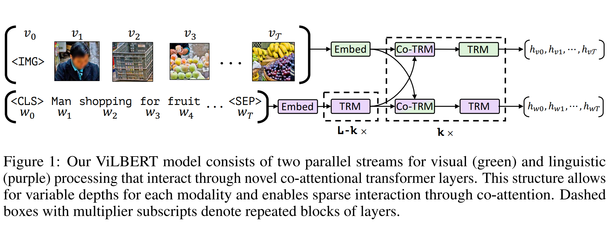
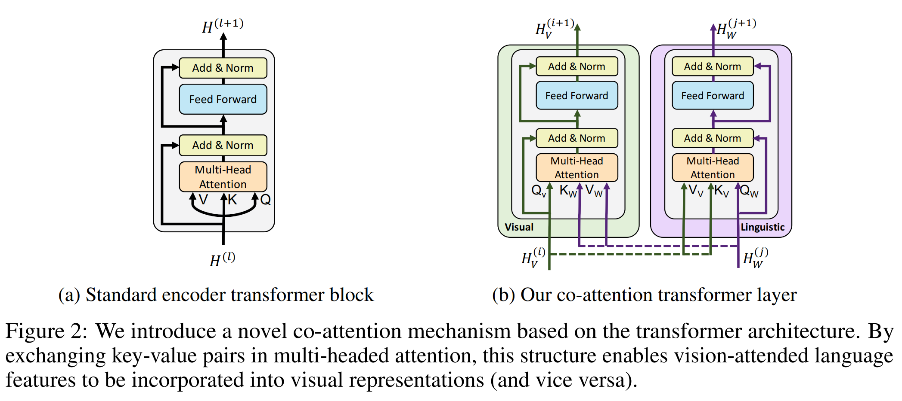
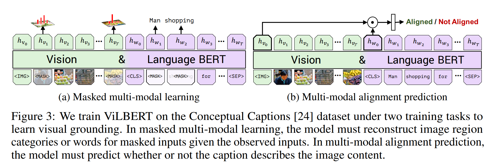
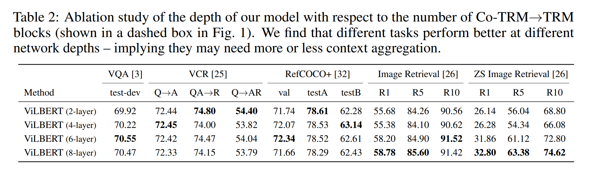

논문 및 이미지 출처 : <https://proceedings.neurips.cc/paper/2019/file/c74d97b01eae257e44aa9d5bade97baf-Paper.pdf>

# Abstract

저자는 ViLBERT (Vision-and-Language BERT) 제시

- image content 와 natural language 의 task-agnostic joint representations 을 학습하기 위한 모델
- BERT 를 multi-modal two-stream model 로 확장
- visual 및 textual inputs 를 separate streams 로 처리하며, co-attentional transformer layers 를 통해 상호작용
- 저자는 Conceptual Captions dataset 을 통해 pre-training 을 한 후, base architecture 를 minor addtion 으로 vision-language tasks 인 visual question answering, visual commonsense reasoning, referring expressions 및 caption-based image retrieval 에 transfer
  - 이러한 tasks 에 기존의 task-specific models 와 비교하여 네 가지 task 에서 SOTA 달성

이 연구는 vision 과 language 사이의 grounding 을 학습하는 것에서, task training 의 일부만 취급하는 것이 아닌 pre-trainable 및 transferable 방향으로의 전환을 의미

# 1. Introduction

image, video 등 3D context 에서 natural language 를 생성하거나 응답하는 "vision-language" 라는 범주로 참조되지만, natural language 와 visual stimuli (즉 _visual grounding_) 의 align 이 필요하지만 vision-language task 에 대해 이 능력을 얻기 위한 통합된 방법이 갖춰지지 못하고 있다.

- 주요 전략은 separate lanugage 및 vision models 을 large-scale tasks 에 pre-training 한 후, 다른 task-training 의 일환으로 align 을 학습하는 것
- 이는 paired visiolinguistic data 가 제한되거나 편향될 경우, 일반화가 잘 되지 않는 근시적인 정렬이 나타날 수 있다.

---

vision-language tasks 에 대한 _pretrain-then-transfer_ learning 은 보편적이며, large-scale data 에 훈련된 large model 의 편리성과 강력한 representational power 로 인해 표준이 되었다.

이러한 domains 에서, pre-trained model 은 target tasks 에 유용한 정보를 제공할 수 있다.

visual 및 linguistic 이해는 vision-language task 에 중요하지만, 어떻게 관련되는지도 중요하므로, 저자는 visual grounding 에 대한 common model 에 관심을 주며, 이러한 연결을 학습하고 vision-language tasks 에서 이를 활용할 수 있는 모델인 것이다. 즉, visual grounding 을 위해 pre-training

이러한 joint visual-linguistic representations 학습을 위해, self-supervised learning 에서 영감을 받았다. 이는 'proxy' tasks 수행을 위해 모델을 훈련함으로써 large, unlabelled data 의 풍부한 의미와 구조적 정보를 포착할 수 있다.

이러한 proxy tasks 는 데이터 내의 구조를 활용하여 자동으로 supervised tasks 를 생성한다. (e.g. 이미지 칼라화 또는 text 의 masked words 를 재구성)

self-supervised learning 의 큰 영향은 ELMo, BERT 및 GPT 같은 언어 모델같은 접근 방식을 통해, visual grounding 을 학습하기 위해 vision 과 language 사이의 alignment 가 가능한 적절한 data source 를 식별해야 한다.

본 연구에서 Conceptual Captions dataset 을 고려하며, 이는 웹에서 alt-text 를 가진 이미지에서 자동 수집된 ~3.3 million images 로 구성된다.

---

저자는 paired visiolinguistic data 에서 task-agnostic visual grounding 학습을 위해 joint model 을 제안하며, 이는 Vision & Language BERT (ViLBERT) 라 부른다.

- BERT language model 을 text 와 image 를 함께 이해하기 위해 확장한 것
- 주요 기술 혁신은 vision 및 language processing 을 위한 separate stream 을 도입하고, co-attentional transformer layers 를 통해 상호작용할 수 있도록 하는 것
  - 이 구조는 각 modality 의 처리 요구 사항을 수용하고 다양한 representation depths 에서 modality 간 상호 작용을 제공할 수 있다.
  - 이 구조가 single-stream model 보다 우수한 성능을 보여주는 것을 입증
- BERT 의 training task 와 유사하게, 저자는 Conceptual Captions 에서 모델을 two proxy tasks 로 훈련. 즉, unmasked inputs 을 바탕으로 masked words 와 image regions 의 semantics 예측, image 와 text segment 여부 예측
- 저자는 pre-trained model 을 기반으로 vision-language task 에 적용
  - visual question answering, visual commonsense reasoning, referring expressions 및 caption-based image retrieval 의 네 가지 vision-language task 에서 SOTA 달성
  - pre-trained vision-language models 사용으로 SOTA 보다 2~10% 성능 향상
- 모델의 구조는 task 에 따라 간단히 수정하여, multiple vision-language tasks 에 걸쳐 visual grounding 의 공통 기능으로 작동

# 2. Approach

## 2.1 Preliminaries: Bidirectional Encoder Representations from Transformers (BERT)

BERT 는 attention-based bidirectional language model

large corpus 에서 pre-trained 하면, BERT 는 다양한 NLP task 에 transfer learning 으로 매우 효과적임을 입증

- word token $w_0, \dots, w_T$ 의 sequence 에서 작동하며, 이러한 tokens 는 learned encoding 에 매핑되어 $L$ "encoder-style" transformer blocks 를 통과하여 final representation $h_0, \dots, h_T$ 를 생성
- $H^{(l)}$ : $l$-th layer 이후의 intermediate representations 에 해당하는 rows $h_0^{(l)}, \dots, h_T^{(l)}$ 인 matrix

Transformer 의 세부 사항을 추상화하면, single encoder-style transformer block 의 계산은 Fig. 2a 에 나타남

- 이 블록은 multi-headed attention block 을 포함하며, small fully-connected network 가 이어지고, 둘 모두 residual 로 묶임
- intermediate representation $H^{(l)}$ 이 사용되어 $Q$, $K$ 및 $V$ 을 계산하여 multi-headed attention block 구동
- 특히, queries, keys 간의 dot-product similarity 는 value vectors 에 대한 attentional distributions 를 결정
- 결과 weight-averaged value vectors 가 attention block 의 output 을 형성

저자는 이 query-conditional key-value attention mechanism 을 수정하여 ViLBERT 를 위한 mutli-model co-attentional transformer module 을 개발 (Fig. 2b)

#### Text Representation

BERT 는 vocabulary words 와 special tokens: $\text{SEP}$, $\text{CLS}$ 및 $\text{MASK}$ 로 구성된 discrete tokens sequence 로 작동

주어진 token 에 대한 input representation 은 token-specific learned embedding, position (즉, sequence 의 token index) 및 segment (즉, 여러 문장이 있을 시 token sequence index)에 대한 encoding 의 합

#### Training Tasks and Objectives

BERT model 은 large corpus 에서 two tasks 에 대해 end-to-end 로 훈련된다: _masked language modeling_ 및 _next sentence prediction_

- masked language modeling task 는 input tokens 를 masked $X_M$ 및 observed $X_O$ tokens 에 대응하는 disjoint set 으로 randomly divide (대략 15% token masking)
  - masked tokens 는 80% 로 special $\text{MASK}$ token 으로 대체되고, 10% 로 random word 로 대체되며, 10% 는 변경되지 않는다.
  - 이후 BERT 는 observed set 을 기준으로 masked tokens 를 재구성하기 위해 훈련된다.
  - 구체적으로ㅡ 각 index 의 final representations (즉, $h_i$) 를 vocabulary 에 대한 distribution 으로 매핑하는 linear layer 가 학습되며, cross-entropy loss 하에 훈련
- next sentence prediction 에서 BERT 는 format $\{\text{CLS}, w_{A1},\dots,w_{AT}, \text{SEP}, w_{B1}, \dots, w_{BT}, \text{SEP} \}$ 를 따르는 two text segments $A$ 및 $B$ 가 전달되고, $B$ 가 source text 에서 $A$ 를 따르는지 여부를 예측하도록 훈련
  - 구체적으로, final representation 인 $\text{CLS}$ token (즉, $h_{\text{CLS}}$)에 작동하는 linear layer 가 이 label 에 대한 binary cross-entropy loss 를 최소화하도록 훈련

## 2.2 ViLBERT: Extending BERT to Jointly Represent Images and Text

BERT 의 modeling 에 영감받아, paired data 에서 language 및 visual content 의 joint representation 을 학습하기 위한 training tasks 와 analogous models 개발

구체적으로, static images 와 해당 text 를 joint representing 고려

---

한 간단한 방법은 BERT 에서 minimal changes 를 가하는 것

단순히 clustering 을 통해 visual inputs space 를 discretizing 하고 이러한 visual 'tokens' 을 text inputs 와 정확히 같은 방식으로 처리하며, pre-trained BERT 로 시작

이는 여러 단점이 있다.

1. initial clustering 은 discretization error 를 일으키고 important visual details 를 잃을 수 있다.
2. 두 modalities 의 input 을 동일하게 처리하며, input representation 의 initial level 때문에 본질적으로 복잡할 수 있는지 또는 서로 처리 수준이 필요할 수 있음을 무시
   - 예로, image regions 은 sentence 의 word 보다 더 약한 관계를 가질 수 있으며, visual features 는 보통 very deep network 의 output 임.
3. pre-trained weights 를 addtional visual 'token' large set 에 맞추는 것은 learned BERT 를 손상시킴
   - 대신, 각 modality 를 개별적으로 modeling 하고 attention-based interactions 의 small set 을 통해 fusing 하는 two-stream architecture 개발
   - 이 방식은 각 modality 에 대한 variable network depth 를 허용하고 서로 다른 depths 에서 cross-moal connections 를 가능하게 함

---

ViLBERT 는 image regions 및 text segments 위에서 작동하는 two parallel BERT-style models 로 구성 (Fig. 1)

- 각 stream 은 transformer block (TRM) 과 novel co-attentional transformer layers (Co-TRM) 의 연속으로 구성하며 modalities 간의 정보 교환이 가능
- 주어진 image $I$ 가 region features $v_1, \dots, v_T$ set 으로 표현되고 text input $w_0,\dots,w_T$ 가 있을 때, final representations $h_{v0}, \dots, h_{vT}$ 를 출력
- two stream 간의 교환은 specific layer 사이로 제한되며, text stream 은 visual features 와 상호작용하기 전에 훨씬 더 많은 처리를 거친다: chosen visual features 가 이미 상당히 high-level 이며 sentence words 와 비교하며 제한된 context-aggregation 이 필요

#### Co-Attentional Transformer Layers

intermediate visual 및 linguistic representations $H_V^{(i)}$ 및 $H_W^{(j)}$ 가 주어지면, 이 module 은 standard transformer block 과 마찬가지로 query, key 및 value matrices 계산 (Fig. 2b)

하지만 각 modalities 의 keys 및 values 는 다른 modality's multi-headed attention block 에 input 으로 전달되며, 결과 attention block 은 다른 modality 로부터 condition 된 각 modality 에 대한 attention-pooled features 생성: visual stream 에서 image-conditioned language attention 을, linguistic stream 에 language-conditioned image attention 을 수행

후자는 vision-language model 에서 볼 수 있는 일반적인 attention mechanism 모방.

Transformer block 의 나머지 부분은 이전과 마찬가지로 진행되며, initial representation 및 residual add 를 포함하여 multi-modal feature 를 생성

#### Image Representations

저자는 pre-trained object detection network 에서 bounding boxes 및 visual features 를 추출하여 image regions features 를 생성

text 의 words 와 달리 image resions block 은 순서가 없다. 대신, spatial location 를 인코딩하여 region position (normalized top-left 및 bottom-right coordinates) 와 image area 를 차지하는 image regions 의 비율에서 5-d vector 를 구성한다.

이를 visual feature 과 일치하도록 proejct 한 다음 합산한다.

저자는 image resion sequence 의 시작을 entire image 를 나타내는 special $\text{IMG}$ tokens 로 표시 (즉, entire image 에 대한 mean-pooled visual features 와 entire image 에 대당하는 spatial encoding)

훈련 작업 및 목표. 이전 섹션에서 설명한 것과 유사하게, 우리는 두 가지 사전 훈련 작업을 고려합니다: 마스킹된 다중 모달 모델링 및 다중 모달 정렬 예측.

#### Training Tasks and Objectives

이전 섹션의 two pre-training tasks: _masked multi-modal modeling_ 및 _multi-modal alignment prediction_ 고려

---

masked multi-modal modeling task (Fig. 3a) 은 standard BERT 의 masked language modeling task 를 따르며, 약 15% 의 words 와 image region inputs 가 masking 되고 remaining inputs 을 사용하여 다시 생성하는 작업을 한다.

- masked image regions 는 image feature 가 90% 의 경우 제거되고, 10% 는 변경되지 않는다.
- masked text inputs 은 BERT 와 동일하게 처리
- masked feature values 에 직접 regressing 하는 대신, 대응하는 image regions 의 semantic classes 에 대한 distribution 을 예측
  - 이를 supervising 하기 위해, feature extraction 에 사용된 동일한 pre-trained detection model 에서 region 에 대한 output distribution 을 취한다.
  - 이 선택으로 language 가 종종 visual content 의 high-level semantic 만 인식하고 정확한 image features 를 재구성하기는 어렵다는 개념을 반영
  - 나아가, regression loss 를 적용하면 masked image 및 text input 에서 발생하는 loss 를 균형 잡기 어려울 수 있음

---

multi-modal alignment task (Fig. 3b) 은 모델이 $\{\text{IMG}, v_1, \dots, v_T,\text{CLS}, w_1, \dots, w_T, \text{SEP} \}$ 같은 image-text pair 를 받고 image 와 text 가 정렬되어 있는지 (즉, text 가 image 를 설명하는지) 예측해야 한다.

- 저자는 outputs $h_{\text{IMG}}$ 및 $h_{\text{CLS}}$ 를 holistic representation 으로 취한다.
- vision-language model 에서 다른 common structure 를 차용하여, overall representation 을 $h_{\text{IMG}}$ 와 $h_{\text{CLS}}$ 사이의 element-wise product 로 계산하고 image 와 text 가 정렬되었는지 binary prediction 하는 linear layer 를 학습
- Conceptual Captions dataset 에는 aligned image-caption pairs 만 포함되어 image-caption pair 의 negative 를 생성하기 위해 image 또는 caption 을 다른 것으로 randomly replace

# 3. Experimantal Settings
## 3.1 Training ViLBERT

ViLBERT 훈련을 위해 Conceptual Captions dataset 에 제시된 training task 적용

- Conceptual Captions 는 web images alt-text 가 활성화된 3.3 millions image-caption pairs 를 자동 수집된 collections
- 자동 수집 및 정제 과정에서 some noise 가 발생하고, 'caption' 은 사람같지 않거나 세부 정보가 부족한 경우가 있다. 하지만 이 dataset 은 매우 다양한 visual content 를 제공하고 저자의 목적에 적합
- 일부 다운로드가 깨진 상태로, 3.1 million image-caption pairs 에서 훈련

#### Implementation Details

ViLBERT 의 linguistic stream 은 BookCorpus 및 English Wikipedia 에서 pre-trained BERT 를 초기화

- 각 block 이 hidden state size 762 와 attention heads 12 의 transformer block 으로 구성된 BERT$_{\text{BASE}}$ 모델 사용
- training time 우려로 BASE model 을 택했지만, LARGE model 로 더 향상시킬 수 있을 것으로 보임
- Faster R-CNN (ResNet-101 backbone)을 Visual Genome dataset 에서 pre-traning
- class detection probability 이 confidence threshold 를 초과하는 regions 를 선택하고 10 to 36 의 high-scoring boxes 를 유지
- 각 selected resion $i$ 에 대한 $v_i$ 는 해당 region 에서 mean-pooled convolutional feature 로 정의
- visual stream 의 transformer 및 co-attentional transformer block 은 hidden state size 1024 이고 attention heads 8 을 갖는다

---

- batch size 512, 8 개의 TitanX GPU 에서 10 epochs training
- Adam Optimizer 를 사용하고 initial learning rates 1e-4
- model training 을 위해 warm up 과 linear decay learning rate schedule 사용
- 두 training task 모두 동일하게 weighted

## 3.2 Vision-and-Language Transfer Tasks

ViLBERT 를 네 가지 vision-language task 에 transferring 한다.

pre-trained base model 을 수정하여 new task 를 수행하도록 하고 이후 entire model 을 end-to-end 로 training 하는 fine-tuning 전략 사용

모든 케이스에서 수정은 최소화한다: classification layer 를 learning

#### Visual Question Answering (VQA)

VQA task 는 image 의 natural language question 에 대한 answering 요구

- COCO dataset 1.1 million question 으로 구성된 VQA 2.0 dataset 에 훈련 및 평가
- VQA 를 위해 ViLBERT 를 fine-tuning 하기 위해 image 및 text representation $h_{\text{IMG}}$ 및 $h_{\text{CLS}}$ 의 element-wise product 의 top two layer MLP 를 학습
  - 이 representation 을 3,129 possible answer 로 매핑
- VQA 를 multi-label classification task 로 취급하고 각 답변의 관련성에 따라 soft target score 할당
- 이후 soft target score 에 binary cross-entropy loss 를 사용하여 최대 20 epochs 동안 batch size 256 으로 훈련
- initial learning rate 4e-5
- interfnce 에, 간단하게 softmax 취함

#### Visual Commonsense Reasoning (VCR)

주어진 이미지에, VCR task 는 visual question answering (Q $\rightarrow$ A) 및 answer justification (QA $\rightarrow$ R) 두 문제를 제시. 둘 다 multiple-choice 문제

- holistic setting (Q $\rightarrow$ AR) 은 선택된 답변과 선택된 이유 모두 올바른 것을 요구
- VCR dataset 은 110k movie scenes 에서 파생된 290k multiple choice QA 문제로 구성
- VQA 와 다르게 object tasks 를 통합하여 직접적인 grounding supervision 을 제공하고 referring expressions 은 제외
- 이 task 를 fine-tuning 하려면 각 질문과 답변을 연결하여 네 가지 다른 text input 을 형성하고 각각을 이미지와 함께 ViLBERT 에 전달
- 이후, post-elementwise product representation 의 top linear layer 를 학습하여 각 pair 에 대한 score 예측
- final prediction 은 이러한 네 가지 scores 에 대한 softmax
- 최대 20 epochs 동안 64 batch size 로 cross-entropy loss 하에 훈련
- initial learning rate 2e-5

#### Grounding Referring Expressions

referring expression task 는 natural language reference 가 주어지면 image region 을 localizing 하는 것

- RefCOCO+ dataset 에서 훈련 및 평가
  - 이 task 에 대한 일반적인 방법은 referring expression 을 고려하여 image regions proposals 를 rerank 하는 것
  - 따라서 COCO dataset 에서 pre-training 된 Mask R-CNN 을 사용하는 Mattnet 에서 제공하는 bounding box proposals 를 직접 사용
- fine-tuning 을 위해 각 image regions $i$ 의 final representation $h_{v_i}$ 를 learned linear layer 에 전달하여 matching scores 를 예측
- 각 proposal box 를 ground truth box 와의 IoU 를 계산하고 0.5 thresholding 을 처리하여 label 지정
- 최대 20 epochs 동안 batch size 256 로 binary cross-entropy loss 로 훈련하고 initial learning rate 4e-5 이다.
- inference 시 highest scoring region 을 예측으로 사용

#### Caption-Based Image Retrieval

Caption-based image retrieval 은 content 를 설명하는 caption 이 제공된 경우 image pool 에서 image 를 식별하는 task

- 각각 다섯 개의 caption 으로 구성된 31,000 Flickr images 로 구성된 Flickr30K dataset 에서 훈련 및 평가
- 1,000 images 를 검증 및 테스트하고 나머지로 훈련
- 저자는 각 image-caption pair 에 대해 세 가지 방해 요소를 randomly sampling 하여 4-way multiple-choice setting 에서 훈련
  - 즉, 임의의 caption 과 image 또는 target image 의 100 nearest neighbors 중 hard negative 를 대체
- 각각에 대해 alignment score (alignment prediction pre-training) 계산하고 softmax 적용
- true image-caption pairs 선택을 위해 cross-entropy loss 하에 훈련하며 20 epochs 및 batch size 64 와 initial learning rate 2e-5 설정
- inference 시, test set 의 caption-image pairs 를 scoring 하고 sort
- 효율성을 위해, fist Co-TRM layer 이전의 linguistic stream representation 을 캐시하여 linguistic representation 을 효과적으로 freezing

#### 'Zero-shot' Caption-Based Image Retrieval

이전 tasks 들은 모두 dataset specific fine-tuning 을 포함하는 transfer tasks 이다ㅓ.

이 'zero-shot' task 는 Flickr30k 의 caption-based image retrieval 에 _fine-tuning 없이_ pre-trained multi-modal alignment prediction 을 직접 적용 (따라서 zero-shot)

이 task 의 목표는 pre-training 이 text 를 grounding 하는 능력을 개발하여, specific fine-tuning 없이 visual 및 linguistic 변화에 일반화될 수 있음을 보여줌

Conceptual Captions dataset 에 pre-trained ViLBERT 을 직접 사용. 

저자는 alignment prediction objective 를 scoring function 으로 사용하고 caption-based image retrieval 과 동일하게 분할하여 테스트

# 4. Results and Analysis

### Baselines

#### Single-Stream

single-stream 은 visual 및 linguistic inputs 에 대해, parameter 및 processing stacks 을 sharing 하는 transformer blocks 를 통해 두 mod0ality inputs 를 처리하는 single BERT 로 구성되어 있다.

- 이 모델은 저자의 모델보다 modalities 간의 deeper visual processing 및 earlier interaction 을 가져오기 때문에 BERT$_{\text{BASE}}$ 에 수정을 가하지 않으며, BERT$_{\text{BASE}}$ 로 초기화 되었고 full model 과 동일하게 훈련
- 저자는 two-stream architecture 영향을 확인하기 위해 위의 baseline 과 비교
- both stream 이 전반적으로 상호 작용하기 때문에 효율성을 위해 어떠한 representation 도 캐시할 수 없어서 image retrieval 및 zero-shot image retrieval 에 대한 baseline 을 high computational cost 로 인해 평가하지 않음

#### ViLBERT

pre-training 을 거치지 않은 ViLBERT 이며, linguistic stream 에 대한 BERT 초기화를 유지하고 image regions 를 full ViLBERT model 과 동일한 Faster R-CNN model 로 나타냄

baseline 과 비교를 통해 Conceptual Captions 에 대한 pretraining process 에 의한 것이 아닌 architecture, language initialization, 또는 visual features 로 인한 task-specific baseline 에 대한 이익은 분리

### Task-Specific Baselines

저자는 각 task 에서 SOTA 기술과의 결과를 제시

VQA의 DFAF, VCR의 R2C, RefCOCO+ 의 MAttNet, 그리고 caption-based image retrieval 의 SCAN

### Results

#### Our architecture improves performance over a single-stream model.

- pre-trained (Single-Stream vs ViLBERT) 및 non-pre-trained (Single-Stream† vs ViLBERT†) ViLBERT 의 single-stream baseline 대해 모든 task 에서 개선을 관찰 
- 가장 큰 이득은 VQA 와 RefCOCO+ 에서 관찰

#### Our pretraining tasks result in improved visiolinguistic representations.

- proxy tasks 의 pre-trained ViBERT 를 사용할 때 task 간에 2% 및 13% (ViLBERT vs ViLBERT†) 사이의 개선을 이룸
- Single-Stream 에서도 개선을 관찰하여 proxy task 가 다른 model architecture 에 일반화될 수 있음을 확인

#### Finetuning from ViLBERT is a powerful strategy for vision-and-language tasks.

- single base architecture 를 사용하여 transfer task 성능이 모든 네 가지 task 에서 SOTA 능가
- VCR, RefCOCO+ 및 image retrieval 의 SOTA 기술을 큰 폭으로 개선하여 SOTA 달성 (7-10% point 개선)
- 나아가 각 task 에 single classifier 만 추가하는 것으로 간단함

### Effect of Visual Stream Depth

Tab. 2 에서 다양한 depths 의 ViLBERT 로부터의 transferring 비교

- CO-TRM $\rightarrow$ TRM blocks 의 반복되는 수에 따른 depths 고려 (Fig. 1 의 dashed box)
- VQA 및 Image Retrieval tasks 가 더 큰 depths 에서 이득을 받는 것을 발견
- 성능은 6 layer depth 까지 증가하면 단조롭게 증가
- zero-shot image retrieval 은 depths 가 증가함에 따라 여전히 큰 이득
- 반면, VCR 및 RefCOCO+ 는 shallower models 에서 이득을 보는 것으로 보임

### Benefits of Large Training Sets

pre-training dataset 크기가 ViLBERT 에 미치는 영향도 연구

- Conceptual Caption dataset 의 25% 및 50% 의 random subset 을 취하여 위와 동일한 설정으로 ViLBERT pre-training 및 fine-tuning
- dataset 양 증가함에 다라 정확도가 단조롭게 증가하며, 이는 더 많은 pre-training data 로부터 혜택을 받는 것을 시사

### What does ViLBERT learn during pretraining?

Conceptural Caption pre-training 동안 ViLBERT 가 무엇을 배우는지 파악하기 위해 zero-shot caption-based image retrieval 및 일부 예제를 본다.

- zero-shot 성능은 매우 낮지만 (Tab. 1 right), pre-trained model (31.86 vs 58.20 R1)보다 합리적으로 수행
- 이는 ViLBERT 가 pre-training 중 vision 과 language 간의 meaningful alignment 를 학습했음을 나타낸다.

# 5. Related Work

### Self-Supervised Learning

최근 vision-language 모두에 self-supervied learning 에 관심이 생기며, 데이터의 규칙성을 자동으로 supervising 하여 task 에 대한 깊은 모델이 훈련된다.

- vision 측면은 진전이 있지만, self-supervised image representations 는 여전히 image classification task 에서 훈련된 모델보다 뒤쳐지고 있다.
- 반면 language 의 self-supervised model 은 상당한 개선을 이뤘다.
- 본 연구에선 BERT 를 확장하여 joint visual-linguistic representation 학습을 위한 모델과 proxy task 개발

### Vision-and-Language

많은 vision-language task 를 다뤘지만 visually rounded dialog, question answering 과 instruction 같은 embodied tasks, image 및 video captioning 같은 text generation 에 대해선 놓치고 있다.

- 이러한 task 들도 self-supervised 방식으로 이점을 얻을 수 있다.
- 기존의 greedy decoders 에 beam-search 가 적용되지 않는 것 처럼 bidirectional model 의 output text 를 효과적으로 디코딩하는 방법이 불분명 

### Self-Supervised Learning for Vision-And-Language

저자의 방법은 video 와 language 간의 joint representations 에 대한 concurrent 연구이다.

- 이 연구는 cooking videos 와 text-to-speech 를 pairing 한 것에서 파생
  - 이러한 연구에는 visual 및 linguistic inputs 에 대한 통합된 BERT 를 제시하며, Single-Stream baseline 과 유사
  - 이들은 두 가지 task 에 learned model 적용: cooking videos 의 zero-shot activity recognition 과 audio transcripts 의 blank-filling 
  - 반면 저자는 web 의 다양한 image 를 대상으로 image 와 descriptive text 를 학습하고 vision-language model 의 transfer learning 에 중점을 둔다.

### Recent works on Vision-And-Language pre-training

- LXMERT : cross-modality model 에 대한 구체적인 설계 사용
  - webly supervised Conceptual Caption dataset 대신 in-domain datasets (즉, COCO 및 Visual Genome) 에 pre-training 사용
- VisualBERT : pre-training 을 위해 out-of-domain 및 in-domain dataset 모두 사용하고 language 측면만 MLM 객체 적용
- Unicoder : online hardest negative mining 을 사용하여 image caption retrieval tasks 에 중점
- VLBERT, Unified VLP 및 UNITER : joint vision-linguistic pre-training 에 대한 유망한 개선을 보여줌

# 6. Conclusion

- 저자는 image content 와 text 를 위한 joint model 을 개발하고 large automatically-collected dataset 에서 visual grounding 을 학습하기 위해 pre-training
- ViLBERT 는 co-attentional transformer block 도입을 위한 novel two-stream architecture 를 제안
- 합리적인 ablation 실험에서 능가하고 여러 확립된 vision-language tasks 로 transfer 할 때 SOTA 능가
- 이러한 task 로 transferring 구현이 간단하고 쉬움
  - 각 task 에 대한 classifier 만 추가하면 됨
