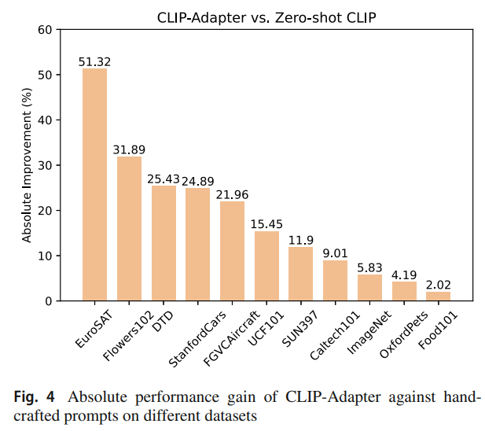
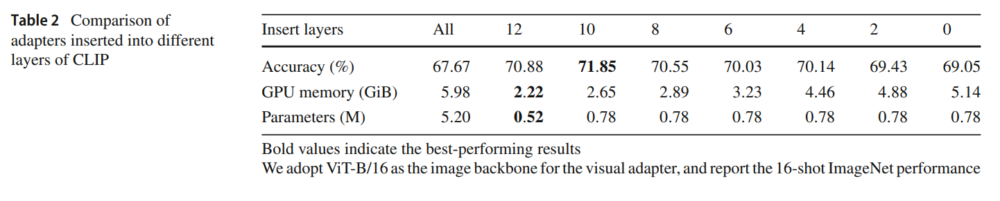
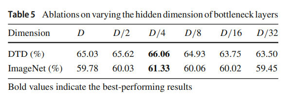
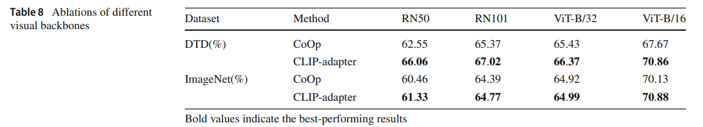

논문 및 이미지 출처 : <https://link.springer.com/article/10.1007/s11263-023-01891-x>

# Abstract

large-scale contrastive vision-language pretraining 은 visual representation learning 에서 상당한 진전을 보이고 있다.

기존 fixed discrete labels set 을 사용하여 훈련된 traditional visual systems 와 달리, CLIP 에선 open-vocabulary setting 에서 images 와 raw texts 를 직접 align 하여 학습하는 new paradigm 을 도입하였다.

downstream tasks 에선 carefully chosen text prompt 가 사용되어 zero-shot prediction 을 수행한다.

non-trivial prompt engineering 을 피하기 위해, context optimization 이 제안되어 few-shot training examples 로 task-specific prompts 를 continuous vectors 로 학습할 수 있게 하였다.

본 논문에선 prompt tuning 외에 더 나은 vision-language 모델을 달성할 수 있는 대안적인 방법이 있음을 보여준다.

prompt tuning 이 textual input 을 위한 것이라면, 저자는 CLIP-Adapter 를 제안하여 visual 또는 language branch 에 feature adapters 를 사용하여 fine-tuning 을 수행한다. 

구체적으로, CLIP-Adapter 는 additional bottleneck layer 를 채택하여 new features 를 학습하고, pretrained features 와 residual-style feature blending 을 수행한다.

그 결과, CLIP-Adapter 는 단순한 디자인을 유지하면서도 context optimization 을 능가할 수 있다.

다양한 visual classification tasks 에서의 실험 및 광범위한 ablation studies 으로 효과를 입증한다.

# 1. Introduction

visual understanding tasks, 예로 classification, object detection, 및 semantic segmentation 은 더 나은 architecture 설계와 large-scale high-quality dataset 을 기반으로 상당히 향상되었다.

하지만, 모든 visual task 를 위해 large-scale high-quality dataset 을 수집하는 것은 많은 노동이 필요하고 확장하기에 너무 비용이 많이 든다.

이를 해결하기 위해 "pretraining-finetuning" paradigm, 즉 ImageNet 같은 large-scale dataset 에서 pre-training 을 하고 다양한 downstream tasks 에 대해 fine-tuning 하는 방식이 visual domain 에서 널리 채택되었다. 

그러나 이런 방식은 여전히 많은 downstream tasks 에 대해 fine-tuning 하기 위해 huge annotations 가 필요하다.

---

최근 Contrastive Language-Image Pretraining (CLIP) 은 large-scale noisy image-text pairs 를 사용한 contrastive learning 을 활용하여 visual tasks 를 해결하기 위해 제안되었다. 

CLIP 은 suitable hand-crafted templates 을 prompt 로 사용하여 다양한 visual classification tasks 에서 주목할 만한 성과를 annotations 없이 (i.e., zero-shot transfer) 달성한다. 

prompt-based zero-shot transfer learning 은 유망한 성과를 보여주었지만, designing good prompt 은 여전히 상당한 시간과 domain knowledge 를 요구하는 engineering 문제로 남아 있다.

이를 해결하기 위해, Context Optimization (CoOp) 은 carefully-chosen hard prompts 를 대체하기 위해 continuous soft prompts 를 few-shot examples 로 학습하도록 제안되었다. 

CoOp 은 zero-shot CLIP 및 linear probe CLIP 설정 모두에서 few-shot classification 성능을 크게 향상시켜, large-scale pre-trained vision-language model 에서 prompt tuning 의 가능성을 보여준다. 

---

본 논문에선 prompt tuning 이 아닌 feature adapters 를 통해 better adapting vision-language model 을 위한 다른 접근 방식을 제안한다.

CoOp 이 soft prompt optimization 을 수행하는 것과 달리, 저자는 light-weight additional feature adapters 에 대해 단순히 fine-tuning 을 수행한다. 

CLIP 의 over-parameterization 문제와 enough training examples lack 때문에, naive fine-tuning 은 특정 dataset 에 over-fitting 될 수 있으며 모든 CLIP layers 에서 forward 와 backward propagation 으로 인해 training process 가 매우 느려질 수 있다. 

---

Parameter-efficient transfer learning 에서의 adapter modules 에 영감을 받아, 저자는 CLIP 의 all parameters 를 optimizing 하는 대신 small parameter weights 만 fine-tuning 하는 CLIP-Adapter 를 제안한다(Fig. 1). 

- CLIP-Adapter 는 light-weight bottleneck architecture 를 채택하여 parameter 수를 줄여 few-shot learning 의 potential over-parameterization 문제를 방지한다.
- 한편, CLIP-Adapter 는 Adapter 과 두 가지 측면에서 다르다: 
  - CLIP-Adapter 는 visual 또는 language backbone 의 last layers 에 이어 two linear layers 만 추가한다. 
    - 이는 original pre-trained CLIP encoder 가 이미 strong representation 능력을 갖추고 있으므로 residuals 형식의 lightweight adaptation 만 필요하기 때문이다. 
  - 반면, original adapter modules 는 language backbone 의 모든 layers 에 삽입된다; 또한, CLIP-Adapter 는 residual connection 을 통해 original zero-shot visual 또는 language embedding 을 해당 fine-tuning feature 와 혼합한다. 
    - 이러한 "residual-style blending" 을 통해 CLIP-Adapter 는 original CLIP 에 저장된 knowledge 와 few-shot training examples 에서 비롯된 freshly learned knowledge 을 동시에 활용할 수 있다.

Fig. 2 는 CLIP-Adapter 와 다른 visual classification architecture 간의 차이점을 직관적으로 설명한다.

전반적으로, 저자의 기여는 다음과 같이 요약할 수 있다:

- 저자는 fine-tuning 을 통해 efficient few-shot transfer learning 을 달성하기 위해 residual-style feature blending 을 수행하는 CLIP-Adapter 를 제안
- CoOp 과 비교하여, CLIP-Adapter 는 훨씬 더 간단한 설계를 가지면서도 better few-shot classification 성능을 달성하여, CLIP-Adapter 가 prompt tuning 에 대한 유망한 대안임을 입증
- 저자는 CLIP-Adapter 의 특성을 분석하기 위해 열한 개의 classification datasets 에 대한 광범위한 ablation studies 를 수행

# 2. Related Work

## 2.1 Model Fine-Tuning

deep network 는 large high-quality data 수집과 annotation 에 비용이 많이 들며, 일부 special domain 에선 불가능할 수 있다.

"pretraining-finetuning" paradigm 은 다양한 CV 및 NLP tasks 에 좋은 해결책을 제공하며, 오랜 기간 널리 채택되어 왔다.

downstream tasks 에 대해 데이터 efficient fine-tuning 을 위해, adapter modules 은 backbone 의 weight 를 고정하고, 각 Transformer layers 에 learnable linear layers 를 삽입하도록 제안되었다.

이후 Parallel Adapter 및 VL-Adapter 같은 후속 작업은 Adapter 의 능력을 language 및 multi-modal task 로 확장하였다.

그 외에도 black-box tuning, ladder side-tuning, sparse structure search, Scaling & Shifting 같은 방법들은 large language 및 vision model 을 parameter-efficient 방식으로 adapting 하기 위한 다양한 기술을 도입하였다.

기존 접근 방식과 달리, 제안된 CLIP-Adapter 는 CLIP 이 생성한 feature embedding 또는 classifier weight 에 simple residual transformation layer 를 적용한다.

Residual connection 과 bottleneck linear layer 덕에 CLIP-Adapter 는 few-shot learning settings 에서 CLIP 의 성능을 향상시키고, 최근 제안된 CoOp 보다 우수한 성능을 달성할 수 있다.

Distribution shifting 에서 performance gap 을 완화하기 위해, WiSE-FT 는 CLIP 의 out-of-distribution robustness 를 향상시키기 위한 post-ensemble 방법을 제안한다.

반면, CLIP-Adapter 는 training stage 전반에 걸쳐 original features 와 CLIP-Adapter 의 output 사이에서 동적으로 균형을 맞추고 혼합하기 위해 learnable gating ratio 를 채택한다.

## 2.2 Prompt Design

Prompt design 은 GPT 시리즈 성공에 의해 대중화되었다. 

GPT-3 는 large-scale dataset 으로 학습된 large-scale autoregressive language model 이 base architecture 를 fine-tuning 하지 않고도 zero-shot 또는 few-shot 방식으로 모든 NLP tasks 를 수행할 수 있음을 보여주었다.

new "pretrain, prompt, and predict" paradigm 을 따르면서, 다양한 prompt design 접근 방식이 최근 제안되었다. 

초기 시도로, 이런 접근 방식 중 하나는 pretrained language 또는 vision-language model 을 natural language discrete prompts 로 tuning 하는 것에 중점을 뒀다. 또는 proper natural language discrete prompts 를 발굴하거나 생성하여 prompt engineering 을 수행한다.

반면, continuous prompts 는 pretrained language models 의 제약을 우회하며, 다양한 접근 방식에 채택되었다.

최근 vision tasks 에도 도입되어, GPT-3에서 영감을 받아, CLIP 은 400M image-text pairs 에 대해 large-scale contrastive learning model 을 학습시키며, prompt-based zero-shot visual classification 의 잠재력을 보여주었다. 

CLIP 을 backbone 으로 사용하여, CoOp 은 continuous prompts 를 optimizing 함으로써 vision tasks 에서 hand-crafted discrete prompts 를 크게 능가할 수 있음을 보여주었다.

본 논문에선 prompt tuning 외에도 vision-language model 을 개선할 수 있는 또 다른 경로가 있음을 보여준다. parameter 일부만 fine-tuning 하여도 vision tasks 에서 유사하거나 더 나은 성능을 달성할 수 있으며, 훨씬 간단한 설계를 가질 수 있다.

## 2.3 Vision-Language Models

Vision 과 language 간의 interaction 을 탐구하는 것은 인공지능에서 핵심 연구 주제이다.

이전에는, bottom-up top-down attention, BAN, Intra-Inter, 및 MCAN 같은 attention-based approaches 가 vision-language tasks 를 지배해왔다. 

BERT 의 성공에서 영감을 받아, ViLBERT, LXMERT, UNITER, Oscar, ALBEF, 및 BEiT 은 multi-modal inference 의 경계를 더욱 넓혔다.

최근, CLIP 과 ALIGN 은 vision-language contrastive representation learning 의 힘을 보여주었다.

이들은 fine-tuning 없이도 광범위한 vision tasks 에서 놀라운 결과를 달성한다.

CLIP 과 supervised training 간의 gap 을 더 줄이기 위해, CoOp 은 visual classification tasks 에서 성능을 향상시키기 위한 continuous prompt optimization 방법을 제안한다.

CoOp 이 prompt design 의 관점에서 vision-language 모델을 개선하는 반면, 저자의 CLIP-Adapter 는 lightweight feature adapters 를 사용하여 간단한 fine-tuning 을 탐구한다.

# 3. Our Approach

## 3.1 Classifier Weight Generation for Few-Shot Learning

DNN 을 사용한 image classification 의 basic framework 를 먼저 살펴보자: 

- image $I \in \mathbb{R}^{H \times W \times 3}$ 가 주어졌을 때 ($H$ 와 $W$ 는 각각 image 의 height 와 width), cascade basic components (e.g., CNN, Transformer 또는 둘의 혼합)으로 구성된 neural network backbone 은 $I$ 를 받아서 feature manifold $f \in \mathbb{R}^D$ 로 변환한다. 
  - $D$ : feature 의 dimension.
- classification 수행을 위해, image feature vector $f$ 는 classifier weight matrix $W \in \mathbb{R}^{D \times K}$ 와 곱해지며,
  - $K$ : 분류해야 하는 class 수를 나타낸다.
- matrix multiplication 후, $K$-dimensional logit 을 얻을 수 있다.
- Softmax function 은 이 logit 을 $K$ class 에 대한 probability vectors $p \in \mathbb{R}^K$ 로 변환한다.

전체 과정은 다음과 같은 수식으로 표현할 수 있다:

$$
\begin{equation}
  f = \text{Backbone}(I), \quad p_i = \frac{\exp(W_i^T f / \tau)}{\sum_{j=1}^K \exp(W_j^T f / \tau)},
\end{equation}
$$

- $\tau$ : Softmax temperature
- $W_i$ : class $i$ 에 대한 prototype weight vectors
- $p_i$ : category $i$ 에 대한 probability 

---

Supervised training 과 달리, 본 논문에선 few-shot examples 를 사용한 image classification 에 관심이 있다.

backbone 과 classifier 를 few samples 로 scratch training 은 특정 dataset 에 over-fitting 되기 쉽고, test split 에서 심각한 성능 저하를 겪을 수 있다.

일반적으로 few-shot learning 의 대표적인 paradigm 은 large-scale dataset 에서 먼저 backbone 을 pretrain 한 다음, zero-shot prediction 을 직접 수행하거나 few-shot examples 에서 additional fine-tuning 을 통해 learned knowledge 을 downstream tasks 에 transfer 하는 것이다.

- CLIP 은 zero-shot transfer style 을 따르며, 먼저 large-scale noisy image-text pairs 에서 contrastive learning 을 통해 visual backbone 과 text encoder 를 pretrain 한 후, fine-tuning 없이 직접 image classification 를 수행한다.
- $K$ categories 와 해당 natural language name $\{C_1, \dots, C_K\}$ 을 포함하는 image classification downstream dataset 이 주어졌을 때, CLIP 은 각 categories name $C_i$ 를 pre-defined hard prompt templates $H$ 에 넣어서 이를 구성한다.
- 그런 다음 language feature extractor 가 결과적인 prompt 를 classifier weight $W_i$ 로 encoding 한다.

classifier weight 생성 과정을 다음과 같이 나타낸다:

$$
\begin{equation}
  W_i = \text{Text-Encoder}(\text{Tokenizer}([H; C_i])).
\end{equation}
$$

- 대안적으로, CoOp 은 hand-crafted hard prompts 대신 continuous prompts 를 채택한다.
- CoOp 은 randomly initialized learnable soft token 들의 list $S \in \mathbb{R}^{L \times D}$ 을 생성하며,
  - $L$ : soft token sequence length
- soft token sequence $S$ 는 각 class name $C_i$ 에 연결되어 prompt 를 형성한다.

전체 과정을 다음과 같이 나타낸다:

$$
\begin{equation}
  W_i = \text{Text-Encoder}([S; \text{Tokenizer}(C_i)]).
\end{equation}
$$

CLIP 과 CoOp 모두에서, 생성된 classifier weight $W_i$ 와 함께, $i \in \{1, \dots, K\}$ 일 때, Eq. (1) 에 따라 class $i$ 에 대한 prediction probability $p_i$ 를 계산할 수 있다.

## 3.2 CLIP-Adapter

CoOp 의 prompt tuning 과 달리, 저자는 few-shot image classification 에서 더 나은 vision-language 모델을 달성하기 위해 additional feature adapters 를 fine-tuning 하는 대안적인 framework 를 제안한다. 

이전에 널리 채택된 "pretrain-finetuning" paradigm 은 few-shot settings 에서 CLIP backbone 전체를 fine-tuning 하는 데 실패할 것이라고 주장한다.

이는 방대한 양의 parameters 및 training examples 부족때문이며, 따라서 저자는 CLIP-Adapter 를 제안하며, few-shot fine-tuning 중에 original CLIP backbone 을 고정시키는 동안 CLIP 의 language 및 image branches 에 naive additional learnable bottleneck linear layers 를 추가한다.

하지만, additional layers 를 사용한 단순한 fine-tuning 은 여전히 few-shot examples 에 over-fitting 될 수 있다.

over-fitting 을 처리하고 CLIP-Adapter 의 robustness 을 향상시키기 위해, 저자는 residual connections 을 채택하여 fine-tuning 된 knowledge 를 CLIP backbone 의 original knowledge 와 동적으로 혼합한다.

---

구체적으로,

- input image $I$ 와 categories 의 natural language name set $\{C_i\}_{i=1}^K$ 이 주어졌을 때, original CLIP backbone 에서 Eq. (1) 과 (2) 를 사용하여 image feature $f$ 와 classifier weight $W$ 를 계산한다.
- 이후, 각각 two linear transformation layers 로 구성된 two learnable feature adapters, $A_v(\cdot)$ 와 $A_t(\cdot)$ 가 통합되어 각각 $f$ 와 $W$ 를 변환한다.
- pretrained CLIP 에 의해 encoding 된 original knowledge 를 잊지 않기 위해 feature adapter 에는 residual connection 이 사용된다.
- 성능을 optimizing 하기 위해 original knowledge 를 유지하는 정도를 조정하는 데 도움이 되는 "residual ratio" 로 two constant values $\alpha$ 와 $\beta$ 가 사용된다.

요약하면, feature adapters 는 다음과 같이 쓸 수 있다:

$$
\begin{equation}
  A_v(f) = \text{ReLU}(f^T W_{v1}) W_{v2},
\end{equation}
$$

$$
\begin{equation}
  A_t(W) = \text{ReLU}(W^T W_{t1}) W_{t2},
\end{equation}
$$

- $W_{v1}$, $W_{v2}$ 및 $W_{t1}$, $W_{t2}$ : 각각 visual branch 와 text branch 를 위한 bottleneck linear layers 의 weight.
- fine-tuning 을 통해 캡처된 new knowledge 는 residual connections 을 통해 original features 와 더해진다:

$$
\begin{equation}
  f' = \alpha A_v(f)^T + (1 - \alpha)f,
\end{equation}
$$

$$
\begin{equation}
  W' = \beta A_t(W)^T + (1 - \beta)W.
\end{equation}
$$

- new image feature $f'$ 와 classifier weight $W'$ 를 얻은 후, 또한 Eq. (1) 을 사용하여 category probability vectors $P = \{p_i\}_{i=1}^K$ 를 계산하고, 
- highest probability 를 가진 class 를 선택하여 image categories 를 예측한다: $\hat{i} = \arg \max_i p_i.$

few-shot learning 중에, $A_v(\cdot)$ 와 $A_t(\cdot)$ 의 weight 는 original CLIP 을 따르는 contrastive loss 로 optimizing 된다:

$$
\begin{equation}
  \mathcal{L}_\theta = - \frac{1}{N} \sum_{i=1}^N \log \frac{\exp(W_i^T f_i / \tau)}{\sum_{j=1}^N \exp(W_j^T f_i / \tau)},
\end{equation}
$$

- $N$ : training examples 의 총 수
- $\theta = \{W^v_1, W^v_2, W^t_1, W^t_2\}$ : CLIP-Adapter 의 all learnable parameters

## 3.3 Variants of CLIP-Adapter

CLIP-Adapter 에는 3 variants 가 있다: (1) text branch 는 고정한 채 image branches 에 대한 feature adapter 만 fine-tuning 하는 경우, (2) image branch 는 고정한 채 text branch 에 대한 feature adapter 만 fine-tuning 하는 경우, (3) CLIP backbone 의 image 와 text branch 모두를 fine-tuning 하는 경우이다. 

hyper-parameter $\alpha$ 와 $\beta$ 에 관해서는, 서로 다른 dataset 에서 optimal $\alpha$ 와 $\beta$ 값이 다르다는 것을 관찰했다. 

hyper-parameter 수동 선택은 시간이 걸리니, $\alpha$ 와 $\beta$ 를 learnable parameter 로 설정하여, 이를 differentiable manner 로 학습하는 방법도 탐구했다.

이렇게 하면 $\alpha$ 와 $\beta$ 는 hyper-network $Q$ 를 통해 visual feature 나 classifier weight 로부터 동적으로 예측될 수 있다: $\alpha, \beta = \mathcal{Q}(f, W)$.

# 4. Experiments

## 4.1 Experimental Setups

### 4.1.1 Datasets

CLIP 과 CoOp 을 따라, CLIP-Adapter 효과 검증을 위해 11 image classification datasets 를 선택.

이는 ImageNet, StanfordCars, UCF101, Caltech101, Flowers102, SUN397, DTD, EuroSAT, FGVCAircraft, OxfordPets, 그리고 Food101 이다.

구체적으로, CLIP-Adapter 는 1, 2, 4, 8, 16-shot few-shot settings 에서 학습한 후, full test split 에서 조정된 모델을 테스트한다. 

few-shot learning 의 randomness 를 고려하여, 3 runs 의 average accuracy 를 보고한다.

모든 실험은 단일 NVIDIA A100 GPU 에서 수행.

### 4.1.2 Implementation Details

별도 언급이 없는 경우, 기본적으로 CLIP-Adapter 의 first variants 를 채택하여, classifier weight 를 고정한 상태에서 image feature 를 fine-tuning 한다. i.e., visual adapter 만 CLIP-Adapter 를 구현한다.

text adapter 를 활성화하는 다른 variants 변형의 결과는 Sec. 4.2.5에서 제시한다.

- CoOp 과 동일한 training hyper-parameter 를 사용
- batch size 32, all dataset 에 대해 learning rate 는 $1 \times 10^{-5}$ 를 사용한다. 단, residual ratio 인 $\alpha$ 는 예외이다.
  - 각 dataset 에 대해 $\alpha$ 의 다른 값 선택을 통해 hyper-parameter search 를 수행하고, 
  - all search space 중 가장 좋은 성능을 보고한다.
- ResNet-50 을 visual backbone(visual encoder)으로 사용하며, 12 layer Transformer 를 classifier weight generator(text encoder)로 사용한다.
- visual 및 text bottleneck layer 의 hidden embedding dimension 은 original embedding dimension 의 1/4 인 256 으로 설정한다.
- CoOp 의 learnable continuous prompt 와 달리, CLIP-Adapter 는 textual input 으로 CLIP 과 동일한 simple hand-crafted hard prompt 를 사용한다.
- generic-category image dataset 의 경우, 예로, ImageNet 의 경우 "a photo of a {class}" 를 hard prompt templates 으로 채택한다.
- fine-grained classification dataset 의 경우, 해당 domain keyword 를 templates 에 지정하여 더 나은 성능을 낸다.
  - 예로, EuroSAT 의 경우 "a centered satellite photo of {class}" 같이 templates 을 사용하며, 다른 fine-grained dataset 도 이와 유사하게 처리한다.

### 4.1.3 Notes on Image Pre-processing

기존 방법에 two image pre-processing 방법이 있다.

첫 번째는 CLIP, 두 번째는 CoOp 에서 보고된 방법이다.

각각을 CLIP stype 과 CoOp stype pre-processing 으로 명명한다.

이 두 방법은 모두 random cropping, resizing 및 random horizontal flip transformations 로 구성된다.

이들의 차이점은 resizing 방법이며,

- CLIP style pre-processing 은 cropped image 의 short side 를 224 로 resizing 하되, original aspect ratio 는 유지한다.
- 반면, CoOp style 은 이미지의 양쪽을 224 로 resizing 한다.
- 기본적으로 CoOp style pre-processing 를 따른다.

## 4.2 Comparison on Few-Shot Learning

### 4.2.1 Baseline Models

CLIP-Adapter 를 Zero-shot CLIP, Linear probe CLIP, CoOp 의 3 baselines 와 비교한다.

공정한 비교를 위해 CLIP-Adapter 는 Zero-shot CLIP 과 동일한 hand-crafted hard prompt 를 공유한다.

- CoOp : discrete token 을 learnable continuous vectors 로 대체한다. 따라서 class token 을 prompt templates 의 multiple candidate position 에 배치할 수 있으며, 이는 front, middle 또는 end 에 배치될 수 있다.
  - 여기에선 16 token soft prompt 의 end 에 class token 을 배치하고, 이 context 를 다른 class 간에 공유하는 CoOp 의 최상의 성능 변형을 선택한다.
- Linear probe CLIP : visual encoder top 에 additional linear classifier 를 학습시키며, few-shot learning 방식을 따른다. 
  - 이는 image feature 와 classifier weight 를 dynamic 및 residual fashion 으로 fine-tuning 하는 저자의 bottleneck adapter 와는 다르다.

### 4.2.2 Performance Comparison and Analysis

main result 는 Fig. 3에 제시되어 있다.

- 11 dataset 에 대한 average accuracy 에서 CLIP-Adapter 는 all different shot settings 에서 3 baselines 를 능가하며, 뛰어난 few-shot learning 능력을 입증한다.
- 특히, 1-shot 이나 2-shot learning settings 같은 극한 조건에선 CLIP-Adapter 가 기준 모델에 비해 더 큰 성능 향상을 달성하며, data-deficient training 상황에 더 나은 일반화 능력을 보인다.

- Zero-shot CLIP 과 비교했을 때, CLIP-Adapter 는 all 11 dataset 에서 유의미한 성능 향상을 달성한다.
  - 16-shot learning setting 의 11 dataset 에 대한 절대 성능 향상 순위는 Fig. 4 에 표시되어 있다. 
- EuroSAT 에서 FGVCAircraft 까지의 상위 5 fine-grained dataset 에 대해 CLIP-Adapter 는 20% 에서 50% 에 이르는 큰 성능 향상을 보인다.
- Caltech101 과 ImageNet 과 같은 더 도전적이고 일반적인 dataset 에선 향상이 더 작아진다.
- OxfordPets 와 Food101의 경우, Zero-shot CLIP 의 original 결과가 이미 상당히 우수하기 때문에 CLIP-Adapter 는 상대적으로 제한된 개선을 보인다.

---

- 유사한 스타일인 Linear probe CLIP 과 비교했을 때, CLIP-Adapter 는 전반적인 성능 이점을 보여준다.
  - 1-shot 및 2-shot learning settings 에선 Linear probe CLIP 이 Zero-shot CLIP 의 성능에 거의 도달하지 못하지만, CLIP-Adapter 는 항상 Zero-shot CLIP 을 초과하고 Linear probe CLIP 을 큰 차이로 능가한다.
  - 예로, 1-shot 및 2-shot learning settings 에서의 절대 마진은 OxfordPets 에서 각각 53.6% 및 42.16%, ImageNet 에서 각각 37.17% 및 27.58% 이다.
- CoOp 과 비교했을 때, CoOp 은 이미 Zero-shot CLIP 에 비해 큰 향상을 얻었지만, CLIP-Adapter 는 all dataset 과 다양한 shot settings 에서 여전히 CoOp 을 능가한다.
  - CLIP-Adapter 는 CoOp 의 prompt-tuning 이 아닌 완전히 다른 관점 (i.e., fine-tuning) 에서 few-shot learning 을 처리한다는 점에 유의해야 한다.
  - 이는 prompt-fixed pre-trained vision-language 모델에 대해 residual connection 이 있는 lightweight adapters 를 fine-tuning 하는 것이 prompt engineering 보다 더 나은 성능을 달성할 수 있음을 시사한다.

### 4.2.3 Efficiency Comparison and Analysis

Tab 1에서, 저자는 여러 방법에 대한 parameter 수, training budget, inference speed 비교를 제공한다.

- baselines 와 비교했을 때, CLIP-Adapter 는 최고의 정확도를 달성하면서도 parameter 와 efficiency 사이에서 best trade-off 를 유지한다.
- 구체적으로, CLIP-Adapter 는 Linear probe CLIP 보다 half parameter 만 사용한다.
- CLIP-Adapter 는 Linear probe CLIP 보다 37분 더 소요되지만, 7.89% 의 큰 정확도 향상을 이룬다. 또한, CLIP-Adapter 는 CoOp 보다 16배 적은 training time 과 29배 빠른 inference speed 를 가진다.
  - CoOp 은 적은 수의 parameter 만을 사용하지만, learnable prompt 를 text encoder 앞에 배치하고, Fig. 1 의 녹색 점선으로 표시된 것처럼 forward 및 back propagation 모두 요구한다.
- large-scale text encoder 의 weight 와 gradient 를 계산하는 것은 더 많은 GPU memory 와 training time 을 필요로 한다. 반면, CLIP-Adapter 는 hand-crafted prompt 를 활용하며, lightweight adapters 를 통해서만 gradient 를 backpropagation 하여 뛰어난 계산 효율성을 달성한다.

### 4.2.4 Observation on Optimal Residual Ratio

흥미롭게도, 저자는 optimal residual ratio $\alpha$ 가 어느 정도 "pretrain-finetuning" paradigm 에서 서로 다른 dataset 의 특성을 반영한다는 것을 관찰한다.

- pre-trained dataset 과 fine-tuning dataset 사이의 의미적 차이가 클수록, CLIP-Adapter 는 original CLIP 의 output 보다 newly adapted feature 에서 더 많은 knowledge 를 학습해야 하므로, larger optimal residual ratio 을 필요로 한다.
- 반대로, 의미적 차이가 적을수록 optimal residual ratio 은 작아진다. 
  - 예로, satellite image 의 EuroSAT 나 detailed textures 의 DTD 같은 specialized domain 의 fine-grained dataset 의 경우, optimal residual ratio $\alpha$ 는 보통 0.6 에서 0.8 사이에 위치한다.
  - 반면에, Caltech-101 과 ImageNet 과 같은 종합적이고 일반적인 image dataset 의 경우, optimal $\alpha$ 은 보통 0.2 정도이다.

### 4.2.5 Variants with Text Adapter

CLIP-Adapter 의 다른 two variants, 즉 visual adapter 는 고정하고 text adapter 만 fine-tuning 하는 것과 text 와 visual adapters 모두 fine-tuning 하는 것을 조사한다.

각 dataset 에 대해 residual ratio 를 수동으로 선택하는 대신, time-efficient 를 고려하여 learnable parameter $\alpha$ 와 $\beta$ 를 사용하며, 이는 만족스러운 성능도 달성할 수 있다.

저자는 두 가지 범주로 나눌 수 있는 4 dataset (EuroSAT & DTD, Caltech101 & ImageNet)에서 이들의 성능을 비교한다.

- text adapter 와 visual adapter 는 유사한 성능을 발휘하며, 둘 다 Zero-shot CLIP 보다 크게 classification accuracy 를 향상시킨다.
- 또한, visual adapter 만 사용하는 것이 text adapter 만 사용하는 것보다 더 좋다.
  - 이는 pre-trained dataset 과 fine-tuning dataset 간의 visual feature 의 의미적 차이가 text feature 보다 더 크기 때문에, few-shot image classification 에선 text feature adapting 보다 image feature adapting 이 더 중요하다는 것을 나타낸다.
- 놀랍게도, both adapters 를 함께 사용하는 것이 visual adapter 만 사용하는 것보다 더 나은 성능을 보이지 않는다.
  - 이는 text 와 visual adapter 가 redundant information 을 캡처하거나 심지어 서로 충돌할 수 있음을 시사한다.

### 4.2.6 Where to Insert CLIP-Adapter?

기본적으로, 저자는 CLIP 의 encoder end 에 residual-stype adapter 를 삽입한다. 저자는 또한 visual backbone 의 other position 에 adapter 를 장착하는 것을 조사한다.

Tab. 2 에서, ViT-B/16 을 visual backbone 으로 사용하고, 각각 2, 4, 6, 8, 10, 12th-layer 후에 visual adapter 를 추가한다. 여기서 12th-layer variant 는 저자의 best solution 을 나타낸다.

- 저자의 접근법은 end 에 삽입되었을 때 최소한의 계산 비용으로 우수한 성능을 달성한다.
- early layer 에 삽입하면 gradient 를 backpropagation 하기 위해 더 많은 계산 자원이 필요하며, 어느 정도 CLIP 의 pre-trained knowledge 를 손상시킨다.
- all layers 에 adapter 를 삽입하면 총 5.20M parameter 가 생성되며, 이는 12th-layer 에만 삽입하는 것(0.52 M)보다 훨씬 무거운 부담이 된다.
  - 후자는 few-shot learning data 의 overfitting 문제를 잘 완화하고, end 에 adapter 를 삽입하여 CLIP 의 pre-trained knowledge 를 크게 보존할 수 있다.

### 4.2.7 Comparison with Other Adapter Methods

Tab. 3 에서, 저자는 기존의 adapter-based methods 를 CLIP 에 장착하고 저자의 CLIP-Adapter 와 비교한다.

- 저자의 접근법은 성능과 효율성 모두에서 이들을 능가한다.
  - 이는 residual connection 을 통해 end 에 adapter 를 삽입하여 CLIP pre-training 에서 얻은 knowledge 를 크게 보존하는 반면, 다른 방법들은 non-residual forms 를 채택하고 backbone 의 middle 에 densely insert 하여 CLIP 의 pre-trained knowledge 에 부정적인 영향을 미치고 overfitting 을 초래하기 때문이다.

### 4.2.8 Comparison with ELEVATER Benchmark Baselines

Tab. 4 에서, 저자는 pre-trained vision-language model 에 대해 새롭게 제안된 ELEVATER benchmark 와 CLIP-Adapter 를 비교한다.

ELEVATER 는 3 baselines 를 포함한다: Random-Init with Two-Projection, Language-Init with Two-Projection, 그리고 Language-Init with One-Projection.

- text encoder 에 randomly initialized additional projection layer 을 학습시키는 것과 비교하여, 저자의 CLIP-Adapter 는 더 높은 classification accuracy 를 달성한다.
- 이는 residual design 이 CLIP 의 pre-trained knowledge 를 크게 보존할 수 있기 때문이다.

## 4.3 Visualization of Learned Manifold

저자는 EuroSAT dataset 에서 CLIP, CoOp, non-residual CLIP-Adapter, residual CLIP-Adapter 를 학습한 후, t-SNE 를 사용하여 이들의 manifold 를 시각화한다.

숫자 0 에서 9 는 각각 AnnualCrop, Forest, Herbaceous Vegetation Land, Highway or Road, Industrial Buildings, Pasture Land, Permanent Crop Land, Residential Buildings, River, Sea or Lake categories 를 나타낸다.

- high-dimensional classification space 에서, Fig. 6(d) 에서의 residual CLIP-Adapter 가 서로 다른 categories 에 속한 image features 의 훨씬 더 뚜렷한 분리를 보여준다.
- 혼동되기 쉬운 categories 인 Highway or Road (red), Crop Land (pink), Pasture Land (brown)의 경우, 다른 방법들과 비교했을 때 CLIP-Adapter 는 동일 class 의 image manifold 간의 similarity 를 감지하는 데 더 효과적이다. 
- 요약하자면, 시각화 결과는 CLIP-Adapter 가 few-shot settings 에서 더 나은 feature manifold 를 학습하는 데 능숙하다는 것을 입증한다.

## 4.4 Ablation Studies

### 4.4.1 Dimension of Bottleneck Layer

먼저 bottleneck layer 의 hidden dimension 을 변화시키면서 ablation study 를 수행한다.

$D$ 는 original image feature 의 dimension 을 나타낸다.

- hidden dimension을 $D$ 에서 $D/32$ 로 줄이면, middle dimension 이 너무 작거나 너무 크면 성능이 크게 저하되며, optimal bottleneck dimension 은 $D/4$ 로, 충분한 의미를 보존하면서도 중복되지 않는다는 것을 관찰할 수 있다.

### 4.4.2 Residual Ratio

또한 residual ratio $\alpha$ 에 대한 ablation study 을 수행한다.

- fine-grained dataset DTD 의 optimal residual ratio은 0.6 이며, 일반적인 dataset ImageNet 의 경우 0.2 이다.
- 이는 fine-grained dataset 의 adapting 이 old knowledge 보다 더 많은 new knowledge 를 필요로 하고, generic dataset 에선 그 반대라는 Sec. 4.2.4 의 관찰을 검증한다.
- $\alpha$ 가 0 인 경우 new knowledge 가 학습되지 않으므로 Zero-shot CLIP 과 동일하다.
- $\alpha$ 를 1.0 으로 설정하면 분류는 완전히 적응된 feature(CLIP-Adapter w/o Res)에 의존하게 된다. 그러나 이는 optimal 이 아닌데, CLIP-Adapter 가 이러한 조건에선 over-fitting(overfitting)되는 경향이 있기 때문이다.
- Tab. 6 과 Fig. 6 을 함께 고려하면, CLIP-Adapter 에서 residual connection 을 가지는 장점은 다음과 같다:
  1. few-shot examples 에서 over-fitting 을 피하고 Zero-shot knowledge 의 도움으로 CLIP-Adapter 의 generalization 능력을 향상시킨다; 
  2. (2) few-shot fine-tuning 을 통해 더 나은 image feature 또는 classifier weight 를 학습할 자유를 보장한다.

### 4.4.3 Influence of Prompt Styles

다양한 prompt style 이 few-shot 성능에 미치는 영향을 조사한다.

ImageNet dataset 의 경우, CLIP-Adapter 의 textual input 으로 사용되는 default hard prompt 는 단순히 "a photo of a {class}" 이다. 이외에도 7 hard prompt 를 사용한 prompt ensembling 도 시도한다. 

7 hard prompt templates 은 다음과 같다: "itap of a {class}", "a bad photo of the {class}", "a origami {class}", "a photo of the large {class}", "a {class} in a video game", "art of the {class}" 및 "a photo of the small {class}".

또 다른 후보 prompt style 은 hard prompt 와 learnable soft prompt 의 혼합이다.

- prompt ensemble 전략이 hard prompt 보다 약간 더 우수한 성능을 보이며, 세 가지 prompt style 중에서 최고의 성능을 달성한다.
- 결과는 raw texts description 이 다양한 상황에서 효과적이고 견고한 유용한 knowledge 를 포함하고 있음을 입증한다.
- 반면, soft prompt 는 명확한 의미를 가지지 않으며, Zero-shot knowledge 를 위한 이상적인 소스가 아니다.

### 4.4.4 Ablation of Visual Backbones

few-shot learning 성능에 대한 visual backbone 의 영향을 연구한다 (16-shot).

후보 visual backbone 에는 ResNet-50, ResNet-101, ViT-B/32, 그리고 ViT-B/16 이 포함된다.

CLIP-Adapter 는 DTD 및 ImageNet dataset 모두에서 visual backbone 을 다양하게 변경해도 CoOp 보다 항상 우수한 성능을 발휘한다.

### 4.4.5 Robustness Under Distribution Shift

CLIP-Adapter 의 robustness 을 추가로 검증하기 위해, 저자는 distribution shift 에 따른 성능 변화를 관찰하기 위한 실험도 수행한다.

ImageNet 에서 CLIP-Adapter 를 학습시키고, 각각 4 out-of-distribution dataset: ImageNetV2, ImageNet-Sketch, ImageNet-A, 그리고 ImageNet-R 에서 평가한다.

CLIP-Adapter 는 다른 baselines 보다 항상 우수한 성능을 발휘하며, distribution shift 에 대한 충분한 robustness 을 보여준다.

### 4.4.6  Finetuning Whole CLIP versus CLIP-Adapter

CLIP 을 full fine-tuning 하면 over-fitting 이 발생할 수 있다는 주장을 검증하기 위해, 저자는 CLIP-Adapter 의 다양한 구성 요소에 대한 ablation study 을 수행한다 (training 을 위해 freezing 을 해제).

CLIP 의 encoder 를 fine-tuning 할 때는 최고 정확도를 얻기 위해 제안된 대로 early stopping 을 사용한다.

- CLIP 의 visual 또는 text encoder 를 fine-tuning 하면 성능이 저하되고 training time이 더 오래 걸린다는 것을 알 수 있다.
- 이는 hude-parameter CLIP 이 few-shot dataset 에서 over-fitting 된다는 것을 나타내며, 제안된 adapter 의 효과를 증명한다.

# 5. Conclusions and Future Work

저자는 CLIP-Adapter 를 few-shot image classification 를 위한 prompt-based 접근 방식의 대안으로 제시한다. 

CLIP-Adapter 는 small additional bottleneck layer 만 fine-tuning 하여 "pretrain-finetuning" paradigm 을 되살린다. 

generalization 능력을 더욱 향상시키기 위해, 저자는 residual ratio 로 parameterized residual connection 을 채택하여 Zero-shot knowledge 와 newly adapted feature 를 동적으로 혼합한다.

실험 결과, CLIP-Adapter 는 다양한 few-shot settings 에서 11 image classification dataset 에서 경쟁력 있는 baselines 보다 뛰어난 성능을 발휘한다.

광범위한 ablation study 은 저자의 설계를 입증하며, CLIP-Adapter 가 더 나은 특징 manifold 를 학습하는 능력을 증명한다.

# A Result Comparison Under CLIP-Style Preprocessing

Fig. 7 에서 저자는 11 dataset 에서의 few-shot learning 에 대한 CLIP-stype preprocessing 하에서의 결과 비교를 제시한다.

CoOp-style preprocessing 과 비교했을 때, 모든 방법의 성능이 CLIP-stype preprocessing 하에서 향상된다.

본문에 있는 Fig. 3 과 유사하게, CLIP-Adapter 는 여전히 다양한 shot 설정에서 다른 baselines 보다 우수한 성능을 보인다.