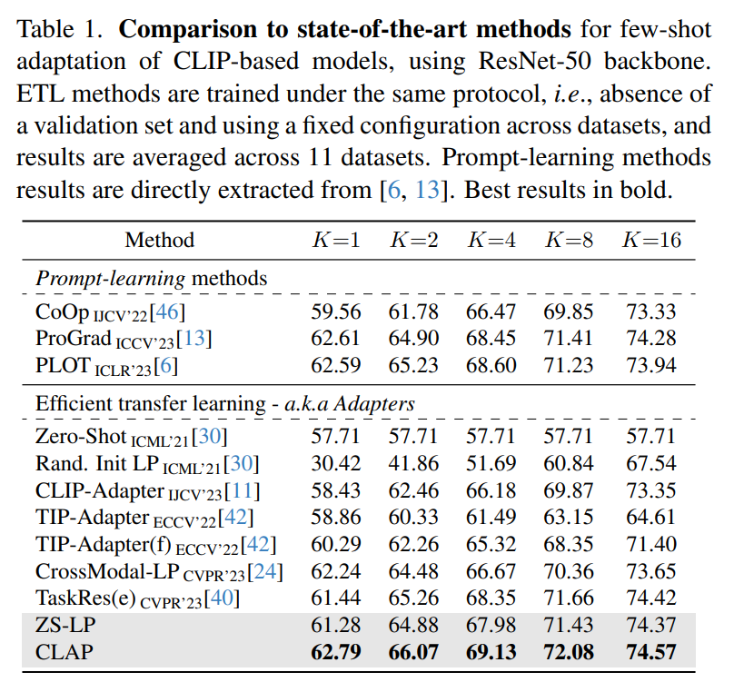
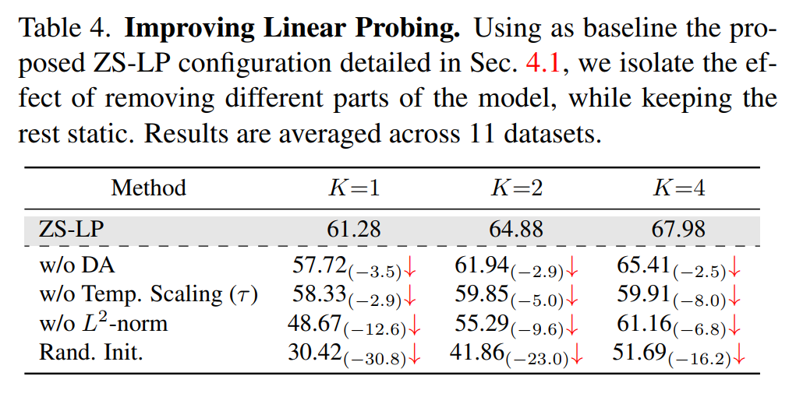
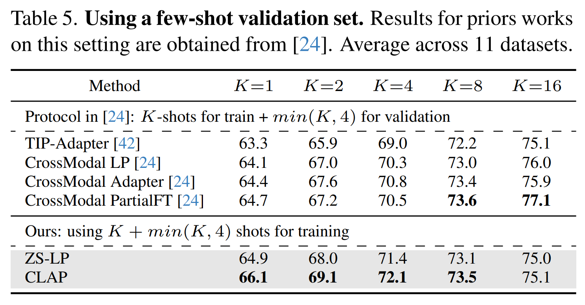

논문 및 이미지 출처 : <https://openaccess.thecvf.com/content/CVPR2024/papers/Silva-Rodriguez_A_Closer_Look_at_the_Few-Shot_Adaptation_of_Large_Vision-Language_CVPR_2024_paper.pdf>

# Abstract

Efficient Transfer Learning (ETL)은 few labaled samples 로 large-scale pre-trained language-vision model 을 downstream tasks 에 적응시키기 위해 점점 더 많은 주목을 받고 있다. 

최신 ETL 이 좁게 정의된 실험적 설정에서만 strong 성능을 보이며, large-scale labaled samples corpus 를 기반으로 한 careful hyper-parameter 조정이 필요하다는 사실을 발견했다. 

특히, 두 가지 흥미롭고 놀라운 실험적 관찰을 하게 되었다. 

1. simple Linear Probing baseline 을 능가하기 위해서는, 이러한 방법들이 각 target task 에서 hyper-parameter 를 optimizing 해야 한다는 점. 
2. distribution drifts 가 있을 때 이 방법들이 일반적으로 standard zero-shot predictions 보다 성능이 떨어지며, 때로는 극적으로 떨어진다는 것이다.

기존 문헌에서 설정한 비현실적인 가정, 즉 large validation set 에 대한 접근과 optimal hyper-parameter 를 위한 case-specific grid-search 를 동기로 하여, 저자는 실제 scenarios 의 요구 사항을 충족하는 새로운 접근법을 제안한다. 

보다 구체적으로, general Augmented Lagrangian 의 adaptation 을 통해 맥락에 맞게 조정하여 balancing term 을 optimizing 하는 CLass-Adaptive linear Probe(CLAP) objective 를 도입했다. 

CLAP 을 다양한 datasets 와 scenarios 에서 종합적으로 평가한 결과, CLAP 이 일관되게 SOTA 보다 우수한 성능을 보이면서도 훨씬 더 효율적인 대안임을 입증했다.

# 1. Introduction

CLIP 같은 large vision-language models(VLMs)은 전례 없는 성능으로 연구 환경을 변화시키고 있다. 

- 이는 400M image-text pairs 로 구성된 extensive dataset 에서 학습되며, contrastive learning 을 통해 이 data 를 활용한다. 
- Once trained VLMs 는 learned rich representation 덕분에 다양한 visual recognition 에서 뛰어난 zero-shot 성능을 제공한다. 
- 그럼에도, 이러한 학습에 요구되는 extensive hardware 및 data-driven resources 는 이러한 모델이 singular training 될 수 있음을 시사한다. 
- 또한, 이러한 network 의 large-scale 는 few labaled samples 만을 포함하는 small downstream tasks 에서 model parameters 를 조정하는 데 중요한 문제를 제기하며, full model 의 fully fine-tuning 은 비현실적이다.

이를 완화하기 위한 대안은, learnable parameters 의 small set 을 추가하여 VLMs 을 fine-tuning 하는 것이다. 

- 이 parameters 는 adaptation step 에서 optimizing 된다.
- 이러한 tunable weights 는 visual 또는 text prompts 형태로 input space 에 도입되거나, network 전반에 걸쳐 adapter 형태로 추가될 수 있다.
- 두 접근법 모두 Efficient Transfer Learning (ETL) 문헌에 포함되지만, prompt learning 은 여전히 entire network 를 통해 gradients 를 back-propagation 해야 한다. 
- 따라서, resource reuse 에 부담을 줄 뿐만 아니라, 이들은 _black-box_ adaptation 을 막아 잠재적으로 source data leaking 에 대한 우려를 제기하며, 이는 privacy-oriented applications 에서 중요한 문제다. 
- 반면에 adapter-based strategies 는 extra parameters set, 일반적으로 last layer 에서만 gradients 를 필요로 하여, 비용이 많이 드는 fine-tuning 프로세스와 데이터 유출을 피하면서도 최신 성능을 제공한다.

few-shot learning 패러다임 하에서 VLMs 을 fine-tuning 하는 adapter-based methods 에서 관찰된 진전에도 불구하고, target task 에서 성능을 향상하면서도 generalization 능력을 유지하는 것은 여전히 도전 과제다. 

- 이는 few-shot adaptation 중 사용된 support set samples 에 대한 심각한 overfitting 으로 인해, updated class prototypes 이 pre-trained model 이 처음 제공한 zero-shot prototypes 에서 크게 벗어나기 때문일 가능성이 크다. 
- 실제로, CLIP-Adapter 와 TIP-Adapter 같은 인기 있는 adapter-based ETL 전략은 initial zero-shot inference 와 support set 의 new information integration 간의 trade-off 를 제어하기 위해 model-specific hyper-parameter 와 learning scheduler 와 관련된 다른 key hyper-parameter 를 신중하게 조정한다. 
- 더 나아가, 최근 연구 결과는 이러한 연구들이 hyper-parameter 를 조정하기 위해 large-scale rwar awr 을 사용하는 것으로 보인다고 제안한다.

이러한 hyper-parameter 가 specific task 에 optimizing 될 때, other task 에 대한 strong generalization 성능을 보이지 않는다는 한계가 명백해진다. 

사실, 최신 방법들은 단순한 잘 초기화된 Linear Probing (LP) adaptation 을 능가하는 동질적인 구성을 찾는 데 어려움을 겪는다. 

- 특히, realistic adaptation scenarios (Fig. 1)에서, 이 간단한 baselines 에 비해 최대 21% 의 성능 저하를 관찰할 수 있다. 
- 이러한 관행은 model selection 에 bias 를 가하게 되는데, 이는 larger labeled samples set 에 접근할 수 있고, 각 경우에 맞게 model hyper-parameter 를 조정할 수 있다고 가정하는 것은 _unrealistic_ 할 뿐만 아니라 _impractial_ 하다(grid search 는 각 경우에 대해 수행되어야 한다). 
- 따라서, ETL 방법의 model selection 전략이 support samples 에만 기반하지 않는다면, 그 방법은 불완전하며 현실적인 few-shot adaptation 문제에 비실용적이라고 주장한다.

---

본 연구에서는 training 중 support samples 만 접근 가능한 보다 엄격하지만 현실적인 scenarios 로 few-shot ETL 노력을 재조정하려 한다. 

- evaluation subset 이 없는 상황은 model selection strategy 를 포함하는 novel adapters 를 요구하며, 이는 다양한 tasks 에 걸쳐 강력해야 한다. 
  - 흥미롭게도, 저자는 zero-shot prototypes 에서 CLIP 을 초기화한 Linear Probing (ZS-LP)이 더 복잡한 ETL 솔루션보다 더 우수한 baselines 이라는 것을 실험적으로 관찰했다. 
  - 이 baselines ZS-LP 를 더욱 개선하고, new tasks 에서 initial zero-shot representation 과 updated class prototypes 간의 trade-off 를 optimizing 하기 위해, adaptation 중에 original zero-shot prototypes 에서 large deviations 가 발생하지 않도록 panelty 를 부과하는 것을 제안한다. 
- 그러나, 결과적인 learning objective 에는 두 가지 주요 문제가 있다. 
  1. original 과 updated prototypes 간의 deviation 를 제어하기 위해 포함된 penalty 는 all classes 에 대해 동일한 scalar value 로, 학습하기 어려운 classes 가 있을 때 모델 성능에 부정적인 영향을 미칠 수 있다. 
  2. penalty balancing weights 는 validation set 를 사용해 설정해야 하며, 이는 validation set 이 없는 scenarios 와 상충된다. 
- 이러한 한계를 해결하기 위해, 저자는 Augmented Lagrangian Multiplier 접근법에 기반한 CLass-Adaptive linear Probe(CLAP)를 제안한다.

저자의 기여를 요약하면 다음과 같다:

- SOTA few-shot ETL adapters 가 각 task 에 대해 신중하게 조정된 hyper-parameter set 을 필요로 하며, 이는 현실적이지 않고 실용적이지 않다는 것을 실험적으로 관찰했다. 
  - 놀랍게도, tasks 전반에 걸쳐 fixed configuration 을 채택하면, 이러한 방법들은 CLIP 의 zero-shot prototypes 으로 초기화된 simple Linear Probing 전략에 비해 크게 성능이 떨어질 가능성이 있다.
- 저자는 Linear Probing 에서 original class prototypes 과 updated class prototypes 간의 trade-off 를 다루기 위한 원칙적인 솔루션을 제안하며, zero-shot prototypes 으로부터 large deviations 가 발생하지 않도록 penalty term 을 통합한다. 
  - 결과로 나온 limited optimization 문제에서 발생하는 근본적인 문제들을 해결하기 위해, 수정된 Augmented Lagrangian Multiplier (ALM) 방법을 제시한다. 
  - 이는 penalty balancing weights 를 fine-tuning 할 필요성을 완화시키며, 이 weights 는 optimization process 의 outer iteration 에서 학습된다. 
  - 제시된 scenarios 에 ALM 을 적응시키기 위해 두 가지 중요한 선택: 
    1. class prototypes 과 data augmentation 를 활용하여, original ALM 에서 samples 및 class-wise multipliers 를 사용하는 대신, class-wise multipliers 를 사용하는 것을 선택했다; 
    2. 제시된 scenarios 에서는 validation set 에 접근할 수 없으며, support samples 에서만 feedback 을 받을 수 있다. 따라서, 잠재적인 over-fitting 을 피하기 위해 outer-step update 를 한 번만 수행한다.
- CLAP 의 성능을 평가하기 위해 11 classification benchmark 의 few-shot adaptation, domain generalization, full fine-tuning 방법과의 비교, 그리고 저자의 선택을 검증하기 위한 ablation studies 등을 포함한 광범위한 실험을 제공한다. 
  - Fig. 1 과 Exp Sec 에서 보여준 바와 같이, CLAP 은 다양한 작업에서 일관된 성능을 제공하며, 모든 scenarios 에서 SOTA ETL 들을 크게 능가한다.

# 2. Related Work

#### Vision-language pre-trained models.

Vision-Language Models (VLMs) 출현으로 패러다임 전환을 맞이하고 있다. 

이러한 network 는 특히 CV 및 NLP 에서 큰 개선을 이루면서 점점 더 인기를 끌고 있다.

현재의 학습 패러다임은 이미지를 별도로 encoding 하고 text 와 함께 제공되는 data 의 dual stream 을 구성하여, large-scale contrastive learning 을 통해 image 와 text representations 를 latent space 에서 연결한다.

특히, CLIP 및 ALIGN 같은 모델은 text 및 image 간의 distribution discrepancy 를 성공적으로 완화시켰으며, 주로 classification task 에서 뛰어난 zero-shot 능력을 보여주었다.

#### Full fine-tuning.

전체 VLM 을 specific task 에 맞게 조정하는 방법에 대한 연구가 진행되고 있다. 그러나 이 전략은 몇 가지 단점을 가지고 있다. 

- 구체적으로, entire model 을 fine-tuning 하면 model optimization complexity 가 증가하고, ETL 에 비해 optimization process 에 시간이 더 소요되며, backbone weights 에 접근할 수 있어야 하기 때문에 black-box adaptation 이 불가능하다. 
- 게다가, full fine-tuning 방법은 보통 small dataset 에서 over-fitting 되는 경향이 있어, target task 에 대해 large corpus target task 가 필요하며, 이는 많은 현실적인 scenarios 에서 비현실적일 수 있다.

#### Efficient transfer leaning.

ETL 은 이러한 문제를 해결하기 위해 small learnable parameters 를 업데이트하고 limited annotated samples 를 활용하는 방법이다. 

현재 ETL 문헌은 Prompt Learning 및 Adapter-based approach 로 나눌 수 있다. 

- Prompt Learning 은 NLP 에서 발전한, 최근 VLMs 에 성공적으로 채택되었다. 이러한 방법에서는 모델에 제공된 text tokens 만 optimizing 한다
  - 그러나 이러한 기술은 entire network 를 통해 gradients 를 back-propagation 해야 하기 때문에 long training steps 를 필요로 하며, 이는 efficient adaptation 의 정신에 어긋난다. 또한, black-box adaptation 도 불가능하다.

반면에 adapter-based methods 는 일반적으로 latest layers 의 small subset parameters 만 조정하기 때문에 훨씬 더 가벼운 대안을 제공한다. 

- 예를 들어, CLIP-Adapter 는 CLIP 에서 생성된 visual embedding 을 수정하기 위해 two-layer MLP 를 통합한다. 
- TIP-Adapter 는 few-shot support samples 에서 얻은 visual prototypes 를 활용하여 test image 의 visual embedding 과 similarity 을 계산하고, 이후 CLIP 의 visual embedding 을 수정하는 데 사용한다.

# 3. Preliminaries

## 3.1. Contrastive vision-language pre-training

large-scale VLMs, 예로 CLIP 은 large-scale heterogeneous dataset 에서 학습되며, image 와 text representations 이 joint embedding space 에서 상관되도록 한다.

형식적으로, CLIP 은 vision encoder $f_\theta(\cdot)$ 와 text encoder $f_\phi(\cdot)$ 로 구성되며, 각각 data points 의 rich representation 을 학습하는 것을 목표로 한다. 

이러한 points 는 $ℓ_2$-normalized shared embedding space 에 project 되어 visual embeddings $v$ 와 text embeddings $t$ 가 생성된다. 

entire network 는 contrastive loss 를 사용하여 pairs 로 된 image 와 text 의 projected embeddings 간의 similarity 를 maximizing 하도록 optimizing 된다.

## 3.2. Transferability

#### Zero-shot inference..

특정 downstream image classification tasks 를 위해, CLIP 기반 모델은 category prompts (i.e., target class 의 text description)와 test image 간의 similarity 에 기반하여 예측을 제공할 수 있다. 

- $C$ categories set 과 각 category 에 대해 $N$ text prompts set, $\{ \{ T_{n,c} \}_{n=1}^N \}_{c=1}^C$ 가 주어지면, 일반적인 방법은 각 target category 의 zero-shot prototypes 을 $ℓ_2$-normalized text embeddings 의 center 를 계산하여 얻는다: $t_c = \frac{1}{N} \sum_{n=1}^N f_\phi(T_{n,c})$. 
- 따라서, 주어진 query image $x$에 대해, zero-shot prediction 은 vision embedding $v = f_\theta(x)$ 과 category prototypes $t_c$ 사이의 softmax cosine similarity 를 통해 얻어진다:

$$
\begin{equation}
    \hat{y}_c = \frac{\exp(v \cdot t_c^\top / \tau)}{\sum_{i=1}^{C} \exp(v \cdot t_i^\top / \tau)},
\end{equation}
$$

- $\tau$ : pre-training stage 에서 learned temperature parameter
- $v \cdot t^\top$ : vector 가 $ℓ_2$-normalized 이기 때문에 cosine similarity 과 동일

#### Few-shot learning.

이 scenarios 는 downstream tasks 에서 limited supervisory information 을 가정하며, 각 target category 에 대해 few examples 만 제공된다. 

- 형식적으로, $K$ images 를 각 target category 에 대해 가진 support set $S = \{ (x^{(m)}, y^{(m)}) \}_{m=1}^{M=K \times C}$ 을 나타내며, 
  - 여기서 $K$ 은 small value (e.g., $K \in \{1, 2, 4, 8, 16\}$) 을 취하고, 
  - $y \in \{0, 1\}^C$ 는 주어진 image $x$ 에 대한 one-hot label
- objective 는 이 limited support set 을 사용하여 pre-trained model 을 adapting 하는 것

## 3.3. Efficient transfer learning with adapters

일반적인 형태의 ETL 방법은 pre-trained features ($v', t' = f_\psi(v, t)$) 의 transformations set (adapter $\psi$) 을 학습하며, 이는 Eq. (1) 에서 new tasks 를 위해 softmax scores 를 생성한다. 

adapter $\psi$ 는 support set samples 에 대해 널리 사용되는 cross-entropy (CE) loss 을 minimizing 하여 optimizing 할 수 있다:

$$
\begin{equation}
    \min_\psi \; \frac{1}{M} \sum_{m=1}^{M} \mathcal{H}(y^{(m)}, \hat{y}^{(m)}),
\end{equation}
$$

- $\mathcal{H}(y, \hat{y}) = -\sum_{c=1}^C y_c \log \hat{y}_c$

## 3.4. Pitfalls of existing few-shot ETL methods

최근 VLM 에 맞춘 ETL 방법은 support samples 에서 제공되는 supervision 을 VLM 에서 학습한 prior knowledge 으로 강화하는 데 집중하고 있다. 

pre-trained model 은 strong knowledge 을 축적하고 visual 및 textual concepts 를 align 할 수 있다. 

이 prior knowledge 를 유지하는 것은 따라서 stronger adapter 를 생성하여 few-shot samples 에서 도입된 specific bias 를 넘어서 일반적인 개념으로 generalization 할 수 있다. 

이 맥락에서 CLIP 의 zero-shot prototypes 은 신뢰할 수 있는 영역에서 learning procedure 를 초기화하는 데 유용한 대리 역할을 한다. 

- 예로, CLIP-Adapter 는 Eq. (1) 에서 zero-shot prototypes based inference 를 유지하지만, visual features 를 수정하기 위해 residual multi-layered perceptron 을 포함한다, $v' = v + \alpha_r f_\psi(v)$. 
- TIP-Adapter 는 zero-shot prototypes 의 similarity 와 support samples 에 대한 weights similarity 를 결합하여 complexity layer $f_\psi(\cdot, \beta)$ 를 추가한다.
  - predicted logits $l_c = \alpha_{tipA} f_\psi(v, \beta) + v \cdot t_c^\top / \tau$ 와 같이 hyperparameter $\beta$ 로 조절됨 
- TaskRes 는 support samples 을 사용하여 initial zero-shot prototypes $w_{TR}$ 의 수정을 학습한다. 
  - initial 및 final prototypes 간의 divergence 는 residual ratio 로 조절된다: $t' = t + \alpha_{TR} w_{TR}$.
- 그럼에도, 이러한 hyper-parameter 를 설정하기 위한 model selection 이 부족하다

# 4. Proposed approach

## 4.1. Revisiting Linear Probing

VLMs 를 적응시키는 가장 간단한 접근 방식은 Linear Probing 으로, 이는 pre-trained features 위에 multiclass logistic regression linear classifier 를 맞추는 것을 의미한다.

형식적으로, objective 는 주어진 visual embedding $v$ 에 대해 softmax class scores 를 제공하는 class-wise prototypes $w_c$ 를 학습하는 것이다:

$$
\begin{equation}
    \hat{y}_c = \frac{\exp(v \cdot w_c^\top / \tau)}{\sum_{i=1}^C \exp(v \cdot w_i^\top / \tau)}.
\end{equation}
$$

- $w_c$ prototypes 는 Eq. (2) 같이 support samples 에 대한 cross-entropy loss 를 minimizing 하도록 학습될 수 있으며, 이는 standard SGD 를 사용하여 이루어진다.
- 또한, ETL 에서 일반적인 관행은 trained weights 를 regularizing 하는 것으로, $ℓ_2$-norm 을 additional term 으로 minimizing 하여 empirically-optimized non-negative balancing term $\lambda_{wd}$ 에 의해 조절된다.
- few-shot adaptation 에 대한 제한된 성능에도 불구하고, LP 가 lightweight adaptation 전략으로, 특히 optimization 중 convexity 덕에 유용하다는 점에서 furher exploration 이 필요하다고 생각한다. 
- 본 연구는 linear probing 의 업데이트된 관점을 제시한다. 
  1. class weights 는 CLIP 의 zero-shot prototypes 을 사용하여 초기화한다, 이는 최신 ETL 방법들이 수행하는 방식이다
  2. loss function 에서 weight decay 를 교체하고 각 업데이트 후 prototypes 을 $ℓ_2$-normalization 하여 adaptation 과정에서 pre-training scenarios 를 정확히 맞춘다, 이는 [Finetune like you pretrain: Improved finetuning of zero-shot vision models.] 에서 영감을 받았다.
     -  유사하게, cosine similarity 는 CLIP 의 pre-trained temperature $\tau$ 로 scaling 된다.
  3. LP 에서 일반적으로 포함되지 않는 data augmentation 을 통합한다. 
     - 이러한 업데이트된 linear probing 버전을 vision-language models 에 대해 ZS-LP1이라고 부른다. 
     - 흥미롭게도, ZS-LP 는 특정 hyper-parameter 조정 없이 strong baselines 역할을 한다 (Tab. 1).

## 4.2. Constrained Linear Probing

well-initialized linear probing 이 ETL 을 위한 strong baselines 을 제공하긴 하지만, updated prototypes 이 initial strong generalization 영역에서 벗어날 수 있다. 

이는 few-shot settings 에서 특히 문제인데, 제공된 few support samples 가 대표성이 부족하고 specific biases 를 포함하여 잘못된 상관관계를 생성할 수 있어 adaptation 후 generalization 가 저하될 수 있다. 

따라서 VLM 모델이 제공하는 strong basis 를 유지하고 prototype degradation 를 방지하기 위해, Eq. (2) 의 loss 에 constraint 을 적용하는 방법을 채택한다.

#### Retaining prior knowledge.

zero-shot points 에서 prototype degradation 를 방지하는 직접적인 방법은 cross-entropy minimizing 을 제약하여 resulting prototypes 이 initial solution (i.e., initial prototypes set $\mathcal{T} = [t_1, \dots, t_c]$) 에 가까이 유지되도록 하는 것이다. 

구체적으로, 이 constrained optimization 문제는 다음과 같이 정의될 수 있다:

$$
\begin{equation}
    \begin{aligned}
        \min_{\mathcal{W}} \quad \frac{1}{M} \sum_{m=1}^M H(y^{(m)}, \hat{y}^{(m)}) \\
        \text{s.t.} \quad w_c = t_c \quad \forall c \in \{1, \dots, C\},
    \end{aligned}
\end{equation}
$$

- $\mathcal{W} = [w_1, \dots, w_C]$ : learnable class prototypes set
- constrained problem 의 minumum 에 approximate 하기 위해, penalty-based optimization approach 를 사용하여 위의 공식을 unconstrained problem 으로 변환하고, class prototypes 과 zero-shot anchors set 간의 $ℓ_2$-penalty 를 사용하는 방법을 제안한다:

$$
\begin{equation}
    \min_{\mathcal{W}} \quad \sum_{m=1}^M H(y^{(m)}, \hat{y}^{(m)}) + \lambda \sum_{m=1}^M \sum_{c=1}^C ||t_c - w_c^{(m)}||_2^2,
\end{equation}
$$

- $\lambda \in \mathbb{R}^+$ : 해당 penalty 의 기여를 조절하는 scalar weights
- $w_c^{(m)}$ : support samples $m$ 에 대해 left term 을 minimizing 하는 optimal class prototypes
- 명확성을 위해 각 set 의 cardinality 로 정규화된 값은 생략.

#### Sample and class-specific constraints.

Eq. (4) 의 constrained problem 과 관련된 문제는 single uniform penalty 를 사용하는 unconstrained formulation 으로 근사되며, individual data samples 나 classes 는 고려하지 않는다. 

all samples 와 categories 는 실제로 다양한 intrinsic learning challenges 를 제시할 수 있다. 

따라서 Eq. (5) 의 문제는 정확하게 해결되지 않는다. 

더 나은 대안은 각 samle 및 class 에 대해 multiple penalty weights $\lambda$ 를 통합하는 것으로, 이를 통해 penalty weights set $\Lambda \in \mathbb{R}^{M \times C}_+$ 을 생성한다. 

resulting optimization problem 은 다음과 같이 정의될 수 있다:

$$
\begin{equation}
    \min_{\mathcal{W}} \quad \sum_{m=1}^M \mathcal{H}(y^{(m)}, \hat{y}^{(m)}) + \sum_{m=1}^M \sum_{c=1}^C \Lambda_{mc} ||t_c - w_c^{(m)}||_2^2.
\end{equation}
$$

- optimization 관점에서, 만약 Eq. (4) 에 대해 optimal class-prototypes set $\mathcal{W}^*$ 가 존재한다고 가정하면, Eq. (4) 에 관련된 Lagrangian 의 saddle point 로서 $(\mathcal{W}^*, \Lambda^*)$ 가 존재한다.
- 이 경우, $\Lambda^*$ 는 문제로 나타나는 Lagrange multipler 이며, $\Lambda = \Lambda^*$ 가 Eq. (6) 을 해결하기 위한 best choice 로 직관적이다.
- 그러나 Lagrange multiplers $\Lambda^*$ 를 Eq. (6) 의 penalties 의 weights 로 사용하는 것은 실제로 어려울 수 있다.
  - 특히, DNN 을 훈련할 때 사용되는 많은 기존 전략이 직관적인 minimizing 을 방해한다. 
  - 첫째, mini-batch gradient descent 는 각 single observation 의 updated prototypes 를 mean prototype per class 로 평균화하여 sample-wise constraint 를 달성하기 어렵게 만든다. 
  - 또한, support samples 에 대한 data augmentation 을 수행하면 augmented version 에 대해 distinct penalty weights 가 생성되어 original samples 보다 분류가 더 어렵거나 쉬울 수 있다.

이러한 도전 과제를 완화하기 위해, sample-wise penalty 를 완화하여 다음과 같이 해결한다:

$$
\begin{equation}
    \min_{\mathcal{W}} \quad \sum_{m=1}^M \mathcal{H}(y^{(m)}, \hat{y}^{(m)}) + \sum_{c=1}^C \lambda_c ||t_c - w_c||_2^2,
\end{equation}
$$

- $\lambda \in \mathbb{R}^C_+$ : class-wise penalty weights set
- problem complexity 가 sample-wise penalties weights 를 제거하여 감소되었지만, 여전히 class-wise penalties weights $C$ 를 선택해야 하는 최적화의 도전이 있다. 
- 이는 많은 categories 를 포함하는 dataset(e.g., ImageNet (C = 1000)) 에선 penalty weights $\lambda \in \mathbb{R}^C_+$ 을 적절히 선택하는 것이 laborious process 일 수 있다. 
- 또한, 이러한 값을 "수동으로" 선택하는 것은 ETL 에 대한 _valiation-free_ solution 을 제공하는 저자의 목표와 상충한다.

## 4.3. Class Adaptive Constraint for Linear Probing

#### General Augmented Lagrangian.

Augmented Lagrangian Multiplier(ALM) 은 penalty weights 를 학습하는 매력적인 대안이다. 

이러한 optimization 방법은 constrained problem 을 penalty 와 primal-dual steps 의 상호작용으로 해결하며, 잘 알려진 장점이 있다. 

형식적으로, general constrained optimization problem 을 다음과 같이 정의할 수 있다:

$$
\begin{equation}
    \min_x \quad g(x) \quad \text{s.t.} \quad h_i(x) \leq 0, \quad i = 1, \dots, n,
\end{equation}
$$

- $g : \mathbb{R}^d \to \mathbb{R}$ : _objective function_
- $h_i : \mathbb{R}^d \to \mathbb{R}$ : _constraint function set_
- 이 문제는 일반적으로 다음과 같은 일련의 unstrained problems 를 해결하여 접근한다:

$$
\begin{equation}
    \min_{x, \lambda} \quad \mathcal{L}^{(j)}(x) = g(x) + \sum_{i=1}^n P(h_i(x), \rho_i^{(j)}, \lambda_i^{(j)}),
\end{equation}
$$

- $P : \mathbb{R} \times \mathbb{R}_+^+ \times \mathbb{R}_+^+ \to \mathbb{R}$ : _penalty-Lagrangian function_
  - 이 function 의 derivative 의 first variable $P'(z, \rho, \lambda) \equiv \frac{∂}{∂z}P(z, \rho, \lambda)$ 가 존재하며, 이는 $z \in \mathbb{R}$ 및 $(\rho, \lambda) \in (\mathbb{R}_{++})^2$ 에 대해 positive 및 continuous 이다.
- $\rho^{(j)} = (\rho_i^{(j)})_{1 \leq i \leq n} \in \mathbb{R}_+^n$ 와 $\lambda^{(j)} = (\lambda_i^{(j)})_{1 \leq i \leq n} \in \mathbb{R}_+^n$ 는 iteration $j$ 에서의 penalty $P$ 에 관련된 penalty parameters 및 multiplers parameters

---

ALM 은 two iterations 로 나눌 수 있다: _outer_ iterations (index $j$) 에선 _penalty multiplers_ $\lambda$ 와 _penalty parameters_ $\rho$ 를 업데이트하고, _inner_ iterations 에선 $\mathcal{L}^{(j)}$ (Eq. (9)) 를 이전 솔루션을 초기화로 사용하여 minimizing 한다.

특히, penalty multiplers $\lambda^{(j)}$ 는 다음과 같이 업데이트된다. 

$$
\begin{equation}
    \lambda_i^{(j+1)} = P'(h_i(x), \rho_i^{(j)}, \lambda_i^{(j)}).
\end{equation}
$$

- 이 방법을 사용하면 constraint 를 위반할 때, penalty multiplers 가 증가하고, 그렇지 않을 때는 감소하게 된다. 
- 따라서 이 전략은 penalty weights 를 _adaptive_ 및 _learnable_ 방식으로 결정하는 데 도움을 준다.

#### Our solution.

저자는 Eq. (7)의 문제를 해결하기 위해 ALM 접근 방식을 제안한다. 

구체적으로, 저자는 문제를 재구성하여 $(\rho, \lambda) \in \mathbb{R}^C_{++} \times \mathbb{R}^C_{++}$ 에 의한 parameterized penalty function $P$ 를 통합한다.

이는 다음과 같이 정의된다:

$$
\begin{equation}
    \min_{\mathcal{W}, \lambda} \quad \sum_{m=1}^M \mathcal{H}(y^{(m)}, \hat{y}^{(m)}) + \sum_{c=1}^C P(t_c - w_c, \rho_c, \lambda_c).
\end{equation}
$$

adaptation 중 feedback 을 얻을 수 있는 유일한 data 는 support set $S$ 이다. 

따라서 epoch $j + 1$ 에서 class $c$ 에 대한 penalty multipers 는 다음과 같이 정의된다:

$$
\begin{equation}
    \lambda_c^{(j+1)} = \frac{1}{|\mathcal{S}|} \sum_{(x, y) \in \mathcal{S}} P'(t_c - w_c, \rho_c^{(j)}, \lambda_c^{(j)}).
\end{equation}
$$

이전 연구에서 제안된 바와 같이 [Numerical comparison of augmented lagrangian algorithms for nonconvex problems, Class adaptive network calibration.], 저자는 penalty function $P$ 로 PHR function 을 사용한다. 

PHR function 은 다음과 같이 정의된다:

$$
\begin{equation}
    \mathrm{PHR}(z, \rho, \lambda) = \begin{cases} 
    \lambda z + \frac{1}{2} \rho z^2 & \text{if } \lambda + \rho z \geq 0; \\
    -\frac{\lambda^2}{2 \rho} & \text{otherwise}.
    \end{cases}
\end{equation}
$$

- support samples 에서 Lagrange multipliers 를 추정하는 것은 training data 에 over-fitting 될 수 있다. 
- additional data points 에 접근할 수 없기 때문에, 저자는 간단한 전략을 따르며, $\lambda$ update 를 one iteration 만 수행한다
- 주어진 target task 에 대해, 저자는 text embeddings 을 anchor 로 사용하여 다양한 visual domain 에 걸쳐 구체적인 개념의 generalization 가능한 representation 을 제공한다. 
- 따라서 저자는 zero-shot prototypes $t_c$ 을 Eq. (12) 문제의 initial approximation 으로 고려한다 (first _inner_ step). 
- $\lambda$ 를 무작위로 초기화하는 대신, convergence 를 방해할 수 있으므로, 주어진 class 의 penalty weight 는 해당 class 에 속하는 all support samples 에 대한 zero-shot softmax scores 의 평균으로 계산한다.
  - i.e., $\lambda_c^\star = \frac{1}{|\mathcal{B}^+_c|} \sum_{i \in B^+_c} \hat{y}^{(i)}_c,$ 및 $\mathcal{B}^+_c = \{ i|i \in M, y_c^{(i)} = 1 \}$.
- 이러한 값들은 $w_c$ 를 Eq. (3) 의 _inner_ step ($t_c$) 에서 발견된 solution 으로 대체하여 얻어진다.
  - 이는 constraint $w_c = t_c$ 을 만족하며, 결과적으로 penalty 가 0이 된다. 
  - 이제 PHR 에 대해 $z$ 에 대한 derivative 를 취하면, one iteration 후 _learned_ value $\lambda$ 값이 실제로 $\lambda_c^\star$ 임을 확인할 수 있다.

# 5. Exeriments 

## 5.1. Setup

#### Datasets: Few-shot adaptation.

저자는 기존 ETL 문헌을 따르고, 모든 방법을 11 dataset 에서 벤치마킹. 

datasets: Imagenet, Caltech101, OxfordPets, StanfordCars, Flowers102, Food101, FGVCAircraft, SUN397, DTD, EuroSAT, UCF101. 

이 dataset 들은 generic object 부터 action 및 fine-grained categories 까지 다양한 CV classification task 를 포함한다. 

few-shot adpater 를 훈련하기 위해, 각 class 에 대해 K shots ($K ∈ \{1, 2, 4, 8, 16\}$) 을 무작위로 선택한다. 

마지막으로, 평가를 위해 각 dataset 이 제공하는 test set 을 사용하며, data split 은 TaskRes 및 CoOp 과 동일하다.

#### Domain generalization capabilities.

저자는 모델의 domain shifts 에 대한 robustness 을 기존 ETL 연구를 따라 평가한다. 

ImageNet 을 source domain 으로 사용하고, 그 variants 을 target task 으로 삼는다. 

여기에는 ImageNetV2, ImageNet-Sketch, ImageNet-A, ImageNet-R 이 포함된다. 

이 scenarios 에서 모델은 source domain 에서 few labeled samples 만 보고, target data 는 오로지 테스트 용도로 사용된다. 

또한, 저자는 이 setting 을 활용하여 entire VLM 을 fine-tuning 하는 것과 비교하여 efficient adapters 의 사용을 정당화한다.

#### Implementation details.

- 모든 실험은 CLIP 의 pre-trained features 를 기반으로 하며, 다양한 backbone(ResNet-50 및 ViT-B/16) 을 사용한다.
- Ablation study 에선 ResNet-50 을 backbone 으로 사용한다. 
- 각 downstream task 에 대해 먼저 support shots 의 all pre-trained features 를 추출한 다음, 이를 통해 adaptation 실험을 수행한다. 
- data augmentation 은 feature extraction stage 에서 random zoom, crops, flips 사용하여 적용하며 TaskRes 및 CoOp 을 따른다. 
- 각 support samples 에 대해 augmentations 수는 20 으로 설정한다. 
- dataset 당 same text prompts 를 사용했다.

저자는 few-shot adaptation 에서 validation set 를 사용하는 것이 비현실적이라는 주장을 따르며, all dataset, shot 수, visual backbone 에 대해 동일한 설정으로 ZS-LP 와 CLAP 을 훈련했다.

- 구체적으로, adapter 를 300 epoch= 동안 optimization 하며, SGD optimizer 와 momentum 0.9를 사용한다. 
- support set 에서의 over-fitting 을 피하기 위해 상대적으로 large initial learning rate 0.1 을 사용하며, training 중에는 cosine decay scheduler 를 따른다. 
- 모든 실험은 3 random seeds  실행하며, 결과는 평균화된다.

#### Baselines and adaptation protocol.

저자의 접근 방식과 유사성을 기반으로 adapter-based methods 을 주요 경쟁자로 선정. 

- 이에는 Clip-Adapter, TIP-Adapter, TaskRes, Cross-Modal 이 포함된다. 
- 기존 연구들은 광범위한 test set 이나 독립적인 additional validation subset 을 사용하여 few-shot adaptation 을 위한 중요한 hyper-parameter 를 조정한다. 
- 하지만 Fig. 1 같이, test scenarios 에 대해 hyper-parameter set 을 조정하지 않으면 성능이 극적으로 감소한다. 
- 실제 요구 사항에 맞추어, 저자는 validation 또는 test samples 가 없고 hyper-parameter 가 all tasks 에서 고정된 엄격한 few-shot adaptation protocol 을 정의한다.

## 5.2. Results

#### Efficient transfer learning.

Tab. 1 에 few-shot adaptation 을 위한 adapter-based approaches 의 성능을 11 dataset 에서 평균화한 결과를 보고한다. 

보다 현실적이고 실용적인 _validation-free_ setting 의 결과를 포함한다.

또한, prompt learning-based approaches 에 대해서는 이전 문헌에서 보고된 결과를 포함하여 보다 포괄적인 비교를 제공한다.

- well-initialized Linear Probe, 즉 CLIP zero-shot weights 를 사용하는 것은 이전 연구에서 논의된 성능 저하를 보이지 않으며, 실제로 SoTA 접근 방식에 대한 경쟁력 있는 대안이 된다. 
- CLIP-Adapter 나 TIP-Adapter 같은 더 복잡한 접근 방식은 validation set 이 없는 경우 원래 결과에 비해 성능이 크게 감소한다. 
  - 흥미롭게도, TaskRes(e)는 updated text projection 을 사용하는 일종의 two-stage zero-shot initialization Linear Probing 으로서 강력한 성능을 제공한다. 
  - 그러나 original task 의 향상된 버전이 어떻게 얻어지는지에 대한 자세한 설명이 부족하여 공정한 비교가 어렵다. 
- weights update 를 zero-shot knowledge 에 가깝게 유지하는 것(CLAAP)은 다양한 shot 에서 일관된 개선을 보이며, 특히 data 가 매우 적은 상황에서 유용하다. 
  - 이는 VLM 의 base knowledge 를 유지하는 것이 adaptation 중 unrepresentative shots 로 인해 divergence 를 피하는 데 중요함을 시사한다.

#### Domain generalization.

adaptation 이 신중하게 수행되지 않으면 결과 모델이 pre-trained knowledge 를 왜곡하고, new data domain 이 포함된 경우 성능이 저하될 수 있다. 

따라서 이러한 domain generalization scenarios 에서 novel adapter 의 robustness 을 평가하는 것은 특별히 중요하다. 

이를 위해 adapter 를 ImageNet 에서 per class 16-shot 으로 최적화하고, ImageNet variants 에서 직접 평가한다. 

이 설정에서는 validation dataset 이 없다고 가정하며, all adapter 는 수렴할 때까지 동일한 설정으로 훈련한다. 

- ZS-LP 는 source domain 에서 other complex adapters 에 비해 strong baselines 역할을 한다. 
  - 더욱 주목할 만한 것은, CLIP-Adapter 나 TIP-Adapter 같은 이전 SoTA adapters 가 unseen domain 에 generalization 하지 못한다는 것이다. 
  - 실제로 최근 ViT 를 사용할 때, 기존 adapter-based 접근 방식은 distribution shifts 가 있는 경우 standard zero-shot prediction 을 초과하지 않는다. 
- 반면, CLAP 은 in-distribution 성능에서 가장 우수하며, all backbone 에서 domain shifts 에 대해 일관된 개선을 보인다.

#### Is it worth optimizing the entire model?

이제 CLAP 을 full fine-tuning 하는 접근 방식인 LP-FT, WiSE-FT, FLYP 과 비교한다. 

전자의 두 방법은 early stopping 을 위해 validation set 를 필요로 하고, 후자의 두 방법은 early stopping 과 mixing coefficient hyper-parameter $\alpha$ 를 조정하는 데 validation set 를 사용한다. 

따라서 $K$-shot 문제의 경우, 이 방법들은 실제로 각 class 에 대해 $2K$-shot 을 요구한다. i.e., $K$ 는 훈련을 위해, $K$ 는 validation 을 위해 필요하다. 

CLAP 의 경우, balancing penalty term 이 support set 를 사용하여 최적화되며 validation set 가 필요 없다. 

따라서 공정한 비교를 위해, full model 의 $K$-shot 성능을 CLAP 의 $2K$-shot 결과와 비교해야 한다. 

따라서 Tab. 3 에는 각 class 에 대해 8 labeled image 를 사용할 때의 모델 성능이 포함된다.

- data 가 적은 경우 full fine-tuning 이 적절히 비교할 때 ETL 보다 반드시 우수하지는 않다는 결론을 내릴 수 있다. 
- 특히, CLAP 은 fine-tuning 방법들에 비해 in-distribution 성능이 우수하고, OOD dataset 에서도 합리적인 성능을 보이며, fine-tuning 방법들보다 tunable parameter 비율이 훨씬 적다.

## 5.3. Ablation experiments

#### On the need for model selection strategies.

CLIP-Adapter, TIP-Adapter, TaskRes 같은 관련 방법들은 성능을 직접적으로 제어하는 hyper-parameter 를 포함하고 있다. 

그럼에도 불구하고, 이러한 방법들은 일반적으로 model selection 전략을 포함하지 않는다. 

반대로, 앞서 강조한 바와 같이, 이러한 연구들은 large-scale valiation subset 을 사용해 각 scenarios 에 맞게 설정을 조정한다는 증거가 있다. 

이 관찰을 조사하기 위해, 저자는 이러한 방법들을 cross dataset model selection 실험에서 평가한다. 

specific task (i.e., dataset) 에서 best hyper-parameter value 는 entire test subset 을 사용하여 Oracle scenarios 에서 찾으며, 다른 dataset 에 대한 adaptation 시에 사용된다. 

- Fig. 1 에 나타난 matrix 는 zero-shot initialization Linear Probing (ZS-LP)에 대한 상대적 개선을 보여준다. 
  - 이 결과는 hyper-parameter value 가 highly task-dependent 이며, SoTA 방법들이 이 simple baselines 보다 뛰어나려면 target task 에서 hyper-parameter 를 조정해야 한다는 것을 경험적으로 보여준다. 이는 실제로 비현실적이다. 
- 반대로, CLAP 은 더 많은 dataset 에서 일관된 결과를 보이며, specific task 에 대한 특별한 수정 없이도 최악의 경우에도 robustness 를 보여준다.

#### Details in Linear Probing matter.

앞서 Sec. 4.1 같이, LP 는 few-shot adaptation 에서 제한된 성능 때문에 이전 문헌에서 권장되지 않았다. 

- 그러나 저자는 이 행동이 LP 가 [Learning transferable visual models from natural language supervision] 에서 도입된 원래 방식에서 비롯된 것이라고 주장한다. 
  - 이는 이전의 self-supervision learning 에서 영감을 얻었다. 
- 실제로, 대조적인 VLMs 에 맞춘 전략은 이전 연구에서 관찰된 LP 의 성능 저하를 완화시킨다. 
  - 특히, zero-shot initialization, pre-training 과 동일한 temperature scaling, class prototypes 의 명시적 $ℓ_2$ normalization 을 사용하면 few-shot adaptation 의 generalization 가 크게 개선된다 (Tab. 4). 
  - 이는 FT 같은 다른 주제에 관한 문헌과 일치하며, adaptation 조건이 pre-training setting 과 일치해야 한다고 제안한다.
- 또한, LP 에서 일반적으로 생략되는 data augmentation(DA) 같은 다른 휴리스틱을 포함하는 것도 특별히 중요하다.

#### Using a few-shot validation set.

Cross-Modal adapter 는 실험 설정 조정 및 early stopping 을 위해 ($min(K, 4)$) samples 로 구성된 validation set 를 사용한다. 

이 설정이 더 적절하지만, 여전히 model selection 을 위한 additional shots 가 필요하다. 

공정성을 위해, validation set 가 필요 없는 방법들과의 성능 비교는 $K + min(K, 4)$ shots 를 사용하여 훈련하여 수행해야 한다.

- 이 공정한 벤치마크가 설정되면 (Tab. 5 참조), 단순 ZS-LP 가 다시 strong baselines 으로 뛰어난 성과를 보이며, few-shot 영역에서 더 복잡한 방법들보다 우수하다. 
- large-shots (K > 8)을 사용할 때만 부분 fine-tuning 과 ETL 방법이 validation samples 에서 약간의 이점을 얻는다. 
  - 그러나 validation set 를 사용하는 model selection 은 grid search 으로 인해 adaptation 중에 계산 작업량과 처리 시간을 증가시킨다.

# 6. Limitations

이 연구에서는 large-scale vision-language models 의 효율적인 적응을 위해 CLass-Adaptive Linear Probe (CLAP) objective 를 소개하였다. 

이는 일반적인 Augmented Lagrangian 방법의 적응에 기반한 것이다. 

그 우수성에도 불구하고, 저자의 경험적 검증은 shot 수가 증가함에 따라 저자의 접근 방식의 이점이 줄어드는 것을 시사하며, adaptation samples 수가 많을 경우 다른 전략이 선호될 수 있음을 나타낸다.