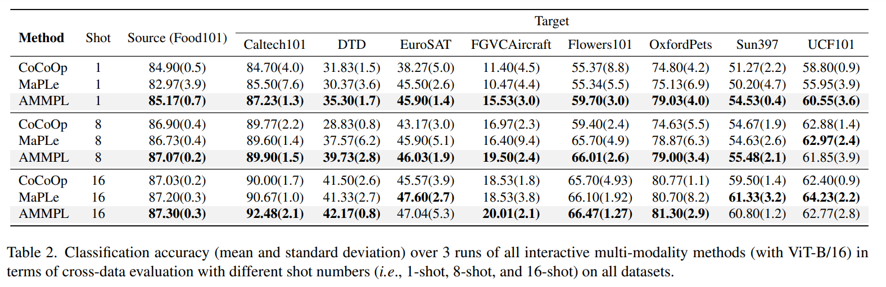

논문 및 이미지 출처 : <https://arxiv.org/pdf/2312.00823>

# Abstract

현재의 prompt learning 방법들은 large pre-trained models 를 효과적으로 재사용할 수 있도록 설계되었지만, 여전히 해결해야 할 한계점이 존재한다. 

즉, 각 이미지의 meaningless patches 를 고려하지 않으며, in-sample generalization 과 out-of-sample generalization 을 동시에 고려하지 않고 있다.

본 논문에서는 이러한 문제를 해결하기 위해 _adaptive multi-modality prompt learning_ 을 제안한다. 

- 이를 위해 이전의 text prompt learning 을 활용하고 new image prompt learning 방법을 제안한다. 
- image prompt learning 방법은 meaningless patches 를 먼저 masking 한 후, 이를 learnable parameter 와 text information 을 통해 padding 함으로써 in-sample 과 out-of-sample generalization 을 달성한다.
- 또한, 각 prompt 가 서로에게 auxiliary information 을 제공하여 두 가지 generalization 을 더욱 강화한다.
- real dataset 에 대한 실험 결과, 저자의 방법이 다양한 downstream task 에서 SOTA 들을 능가한다.

# 1. Introduction

large pre-trained vision-language models (e.g. CLIP, ALIGN, BLIP)은 text-image alignment 에서 큰 잠재력을 보여주었지만, prompt learning (PL)은 다양한 downstream task 를 위한 diverse alignment 를 학습하는데 인기가 많다

구체적으로, prompt learning 기법은 large pre-trained models 가 정의하는 shared space 내에서 image 를 text 와 더 잘 align 하기 위해 input data 를 fine-tuning 하도록 설계된다. 이는 model 의 큰 parameter 를 tuning 할 필요 없이 pre-trained model 을 재사용할 수 있도록 하며, 다양한 downstream task 에 적합하다.

---

이전의 prompt learning 방법은 세 가지 범주로 나눌 수 있다: single-modality PL, non-interactive multi-modality PL, interactive multi-modality PL.

특히, single-modality PL 은 large pre-trained model 을 사용하는 individual prompts 를 설계한다.

- 예로, VPT 는 pre-trained image encoder 를 효과적으로 사용하기 위해 image 를 prompting
- single-modality PL 은 one modality 만 prompting 하므로 other modality 는 무시한다. 

non-interactive multi-modality PL 은 image modality 와 text modality 모두를 prompting 하기 위해 설계.

- 예로, IVLP 는 image 와 text 에 대한 두 prompt 를 학습하여 unseen data 의 known classes 에 대한 generalization 을 보여준다. 본 논문에서는 이를 **_in-sample_** generalization 이라 칭한다.
- 그러나 이전의 non-interactive multi-modality PL 은 unseen class 에 대한 효과적인 prompt 설계가 어려워 overfitting 문제가 발생하기 쉽다.

최근에는 interactive multi-modality PL 방법들이 two prompts 를 학습하고 unseen data 의 unseen classes 에 대한 generalization 능력을 얻기 위해 설계되었다. 본 논문에서는 이를 **_out-of-sample_** generalziation 이라 칭한다.

- 예로, MaPLe 는 two prompts 간의 interaction 을 촉진하여 out-of-sample generalization 능력을 달성한다.

현재의 multi-modality PL 은 pre-trained model 에 널리 사용되지만 여전히 해결해야할 한계가 있습니다. 다중 모달리티 PL 방법은 대규모 사전 훈련된 모델에서 널리 사용되고 있지만, 여전히 해결해야 할 한계가 있습니다.

1. 이미지의 모든 patch 가 유용하지는 않음.
   - 이미지 카테고리와 관련이 없는 patch (meaningless patch)는 이미지 카테고리를 결정하는 데 부정적인 영향을 미칠 수 있으며, 이전의 PL 방법에서는 이를 무시했다.
   - 최근 문헌 (e.g. VP) 에서는 모든 patch 에 noise 를 추가하여 meaningless patch 의 영향을 줄이려고 하지만, 이는 유의미한 patch 에 영향을 미칠 수 있다.
   - real application 에선 하나의 downstream task (또는 이미지 카테고리)에서 meaningless patch 가 다른 downstream task (또는 이미지 카테고리)에서 유용할 수 있으므로, meaningless patch 를 처리하는 것이 필수적이며 어렵다.
2. 이전 PL 방법들은 in-sample generalization 과 out-of-sample generalization 을 동시에 달성하는 것을 고려하지 않음
   - 구체적으로, downstream task 에는 training 과정에서 본 class 또는 category 와 training 과정에서 보지 못한 class 가 포함된다.
   - 일반적으로 두 종류의 generalization 에 강한 PL 방법은 well-known class shift 문제를 해결한다.
   - 문헌에서는 single modality 및 non-interactive multi modality PL 방법이 in-sample 만 개선하려고 하여 overfitting 을 쉽게 초래한다.
   - 반면, interactive multi modality PL 방법은 in-sample generalization 을 무시하고 out-of-sample generalization 달성에 중점을 둔다. 따라서 이전 PL 방법들은 class shift 에 강하지 않다.

---

이 논문에서는 위의 문제를 해결하기 위해 new interactive multi modality PL 방법, 즉 Adaptive Multi-Modality Prompt Learning (AMMPL)을 제안한다.

AMMPL 은 세 가지 module (text prompt learning, image prompt learning, adaptive interactive learning)으로 구성된다.

- 구체적으로, 저자는 CoCoOp 를 따라 text prompt learning 을 수행하기 위해 text representation 을 생성한다.
  - proposed image prompt learning 은 먼저 probability matrix 를 학습하고, Bernoulli sampling 을 사용하여 각 카테고리에 대해 meaningless patch 를감지하고 masking 한다.
- masked patch 로 구성된 image 는 learnable parameter 와 text information 로 padding 한 후 image encoder 에 입력된다.
  - 이로 인해 image 내 meaningless patch 를 합리적으로 처리하여 _첫 번째 문제를 해결한다_.
- 또한, probability matrix 는 meaningless patch 를 large probability 로 설정하고 meaningless patch 를 small probability 로 설정하여 in-sample generalization 능력을 향상시킨다.
  - Bernoulli sampling 은 probability matrix 의 large values 를 선택할 가능성을 줄여서 out-of-sample generalization 능력을 향상시킨다
  - 따라서 저자의 image prompt learning 방법은 _두 번째 문제를 해결한다_.
- 또한, 저자의 adatively interactive learning 은 two modalities 간의 information inferaction 를 수행한다.
  - 구체적으로, light-weight (i.e., Fig. 1 의 N$_1$) 는 image information 을 전달하여 text prompt learning 의 효과를 높인다.
  - 유사하게, Fig. 1 의 N$_2$ 는 image prompt learning 을 개선하고 이전 방법의 두 가지 문제를 탐색한다.
  - 따라서 저자의 adaptively inferactive learning 은 이전 PL 방법의 _두 가지 문제를 해결하는 데 도움이 된다_.

이전 방법들과 비교할 때, 저자의 방법의 주요 기여는 두 가지이다.

1. 저자는 이전 PL 방법의 두 가지 문제를 해결하기 위해 new image prompt learning 제안.
   - 이는 image prompt learning 에서 meaningless patch 의 영향을 탐구한 최초의 연구 
2. 저자는 two light-weight networks 를 조사하여 two modalities 간의 information inferaction 수행. 
   - 그 결과, 각 network 는 다른 network 를 촉진.
   - 또한, text encoder 의 network 는 image prompt learning 을 강화하여 이전 PL 방법의 문제를 해결.

# 2. Methodology

## 2.1 Motivations

pre-trained vision-language model CLIP 은 two encoders: 즉, text 를 위한 Transformer 기반의 text encoder 와 image 를 위한 ResNet 또는 ViT 를 사용하는 image encoder 이다. 

최근 prompt learning 기술이 text 나 image 를 encoder 에 입력하기 전에 처리하는 데 널리 사용되고 있으며, 이는 large pre-trained models 의 많은 파라미터를 조정하지 않고도 downstream task 의 효과를 개선하는 것을 목표로 하고 있다.

NLP 분야에서 prompt learning 의 큰 성공에 영감을 받아, CLIP 의  초기 prompt learning 기술은 fine-tuning text modality 로 text encoder 의 잠재력을 충분히 탐구하는 데 초점을 두었다. 이를 text prompt learning 이라고 한다.

downstream task 의 초점이 일반적으로 image 에 관련되기 때문에, 최신 PL 방법들은 text prompt learning 과 image prompt learning 모두에 집중하고 있다.

그러나 이전 PL 방법들은 여전히 두 가지 문제를 해결해야 한다.

1. image 의 meaningless patch 의 영향을 무시한다. 그 결과 CLIP 은 image 에 대한 irrelevant representation 을 추출하여 이후 text-image alignment 을 저하시킬 수 있다.
2. PL 방법들은 class shift 에 강하지 않으며, 즉 in-sample generalization 과 out-of-sample generalization 모두를 고려하지 않는다. 결과적으로, 실제 시나리오에서 다양한 downstream task 를 처리하기 어렵다.

이 논문에서는 위의 문제를 해결하기 위해 new interactive multi-modality prompt learning 방법을 제안한다.

구체적으로, 저자는 먼저 CoCoOp 을 따라 text prompt learning 을 수행하고 (Section 2.2), 이후 image prompt learning (Section 2.3)과 adaptively interactive learning (Section 2.4)을 설계하여 위의 문제를 해결한다.

## 2.2 Text Prompt Learning

CLIP 에서 text encoder 는 fixed context tokens 를 사용하므로 다양한 downstream task 에 비효율적이다.

따라서 text prompt learning 기술은 adaptable context token 을 구성하도록 설계된다. 예로, CoCoOp 은 input text 의 각 context token 을 learnable vector 로 변환하여 특정 downstream task 에 맞는 semantic context information 을 학습한다.

따라서 본 논문은 CoCoOp 을 따라 text prompt learning 을 수행한다.

구체적으로, 저자는 먼저 모든 context token 을 동일한 길이의 learnable vector $v \in \mathbb{R}^l$ 로 표현한다.

- $l$ : word embedding (즉, CLIP 에서는 $l = 512$)
- fixed context "a photo of a" 를 $M$ learnable vectors 로 교체. 즉, learnable context $\{v^1_i, v^2_i, \ldots, v^M_i\}$

결과적으로, $i$-th class 의 text prompt 는 $t_i = \{v^1_i, v^2_i, \ldots, v^M_i, c_i\}$ 로 표현

- $c_i$ : $i$-th class 의 name
- all class 에 대한 text prompt tensor 는 다음과 같다:

$$
\begin{equation}
  T = \begin{bmatrix}
  v_1^1, v^2_1, \cdots, v^M_1, c_1 \\
  v^1_2, v_2^2, \cdots, v^M_2, c_2 \\
  \vdots \\
  v^1_k, v^2_k, \cdots, v^M_k, c_k
  \end{bmatrix}, \quad T \in \mathbb{R}^{k \times (M+1) \times l},
\end{equation}
$$

- $k$ : class number

저자는 text prompt $T$ 를 text encoder $\text{TextEn}(\cdot)$ 에 입력하여 text representation 을 얻고, 이후 text projection function $\text{TextProj}(\cdot)$ 를 통해 final text representation $Z$ 를 얻는다:

$$
\begin{equation}
  Z = \text{TextProj}(\text{TextEn}(T)), \quad Z \in \mathbb{R}^{k \times d},
\end{equation}
$$

- $d$ : text representation 의 dimension
- training 과정 중, $\text{TextEn}(\cdot)$ 와 $\text{TextProj}(\cdot)$ 의 parameter 는 freezing 되고, $T$ 의 parameter 는 다양한 task 를 유연하게 처리할 수 있도록 adaptiveply adjust.
- Eq. (2) 로 text prompt learning 을 수행한 후, text prompt $T$ 는 individual class 에 대한 specific context 를 학습하여 text encoder 가 각 class 또는 category 에 대한 fine-grained text representation 을 추출할 수 있도록 한다.

## 2.3 Image Prompt Learning

text encoder 외에, image prompt learning 고려도 중요하다. 이는 CLIP 이 image input 및 text input 을 모두 포함하고 있기 때문이다.

이전 PL 방법에서의 두 가지 문제를 해결하기 위해서는, 먼저 image 를 multiple patches 로 나누고, 그 다음에 image encoder 에 meaningless patch 와 meaningful patches 가 포함된 image 를 입력하기 전에 meaningless patches 를 처리해야 한다.

또한, in-sample generalization 과 out-of-sample generalization 모두를 얻는 것이 기대된다. 이를 달성하기 위해 제안된 image prompt learning 은 두 단계로 구성된다: 즉, patch mask 및 patch adding.

### 2.3.1 Patch Mask

Fig. 3 에 나타난 바와 같이, 비행기는 일반적으로 공항과 함께 나타나는 반면, 개는 개울과 함께 나타난다.

즉, image category "비행기" 는 비행기의 patch 와 image category 와 관련된 other patch (e.g., 공항과 관련된 patch)에 의해 결정된다.

반대로, other patch 는 이 category 결정에 거의 정보를 제공하지 않는다.

또한, 서로 다른 image category 는 서로 다른 patch 에 의해 결정된다. 따라서 image prompt learning 에서는 1) meaningless patch (즉, image category 와 관련없는 patch)를 meaningful patch 에서 구별하고, 2) 서로 다른 image category 마다 다른 prompt 를 설계해야 한다.

명백히, CLIP 의 backbone 중 하나(즉, ViT)를 따라 모든 image 를 $b \times b$ patch 로 나눈 다음, image partition 을 기반으로 meaningless patch 를 감지할 수 있다.

MAE 의 영감을 받아, 저자는 먼저 각 category 마다 random matrix 를 설정하여 all patches 를 binary values 로 randomly masking 한 다음, image 를 element-wise Hadamard product 를 수행하여 image encoder 의 input 으로 사용한다.

결과적으로 random matrix (a.k.a., mask matrix) 는 최종 결과를 출력하도록 adaptively update. 즉, 각 category 의 meaningless patch 는 binary value "0" 을 가지며, image encoder 는 masked patch 의 representation 을 unmasked patches 의 representation 과 구별하여 출력한다. 그러나 random matrix 의 binary value 는 back-propagation 을 어렵게 만든다.

본 논문에서는 위의 문제를 해결하기 위해, 먼저 각 image category 에 대해 continuous probability matrix 를 생성한 다음, 이 probability matrix 에서 Bernoulli sampling 을 수행하여 mask matrix 를 얻는다.

discrete mask matrix 에서 얻은 gradient 를 continuous probability matrix 에 직접 할당하여 back-propagation 이 가능하도록 한다. (Section 2.5). 결과적으로 optimizing 후, 각 category 에 대한 mask matrix 를 얻을 수 있습니다.

구체적으로, 모든 image 를 $b \times b$ patch 로 나눈 후, $P_i \in \mathbb{R}^{b \times b}$ 를 $i$-th class 의 probability matrix 로 나타낸다.

- $P_i$ 의 모든 요소는 patch 가 meaningless patch 일 확률이다.
- 모든 $k$ category/class 에 대한 probability matrix 는 다음과 같은 tensor 로 표현할 수 있다: $P \in \mathbb{R}^{k \times b \times b}$.
- 저자는 $P \in \mathbb{R}^{k \times b \times b}$ 에서 Bernoulli sampling 을 수행하여 binary tensor $M \in \mathbb{R}^{k \times b \times b}$ (짧게 Bernoulli mask) 를 얻는다:

$$
\begin{equation}
  m_{j,c}^i = \begin{cases}
  1 & \text{with prob.} \ r = \text{Clamp}(p^{j,c}_i, 0, 1) \\
  0 & \text{with prob.} \ 1 - r
  \end{cases}
\end{equation}
$$

- $r$ : 1 로 sampling 될 확률
- $\text{Clamp}(\cdot, 0, 1)$ : $P$ 의 각 요소 를 0 과 1 사이로 제한.
- $j$ 와 $c$ 는 각각 matrix 의 raw 및 column coordinates.
- $M$ 의 요소가 0 이면 해당 patch 는 masking.

저자는 $M \in \mathbb{R}^{k \times b \times b}$ 와 original image $I \in \mathbb{R}^{b \times b \times u}$ 간의 element-wise Hadamard 요소별 Hadamard product 을 통해 다음을 얻는다:

$$
\begin{equation}
  \tilde{I} = M \odot I, \quad \tilde{I} \in \mathbb{R}^{k \times b \times b \times u}
\end{equation}
$$

- $u$ : image 의 channle 수 (e.g., RGB)
- $M$ 의 binary value 에 따라 $\tilde{I}$ 에서 meaningful patches 는 binary value 가 1 일 경우 유지된다.
- Eq. (3) 은 learnable probability tensor 와 Bernoulli sampling 을 도입하여 random mask matrix 에서 발생하는 back-propagation 문제를 해결한다
  - 결과적으로 Eq. (4) 는 meaningless patch 와 meaningful patch 를 구별할 수 있어 이전 PL 방법에서의 첫 번째 문제를 해결한다.
  - optimal probability tensor $P$ 는 specific class 에 대한 fine-grained sampling rate 를 달성하여 in-sample generalization 능력을 개선한다.
- 또한 Bernoulli sampling 에 의해 도입된 uncertainty 으로 인해 얻어진 mask tensor $M$ 는 다양성을 보인다.
  - 이러한 randomness 또는 uncertainty 은 out-of-sample generalization 능력을 개선할 수 있다.
  - 따라서 patch mask 는 dynamic probability tensor 와 uncertainty mask tensor 를 설계하여 robust class shift 를 달성함으로써 이전 PL 방법에서의 두 번째 문제를 해결한다.

제안된 patch mask 가 이전 PL 방법에서의 두 가지 문제를 해결하지만, masked patches (i.e., pixel value 값이 모두 0)와 image 의 다른 patches 간에는 pixel value 의 큰 차이가 있다.

image 의 pixel 차이가 클 경우 더 많은 training 반복과 더 많은 training data 가 필요하며, 이는 모델이 수렴하는 데 어려움을 겪을 수 있다.

따라서, 저자는 이 문제를 해결하기 위해 masked patch 에 information 을 padding 하는 방법을 조사한다.

### 2.3.2 Patch Padding

missing value padding 기술에 영감을 받아, 직관적인 해결책은 mean value padding 을 사용하여 masked 및 other patches 간의 pixel 차이를 해결하는 것이다. 그러나 mean value padding 은 다양성이 부족하여 서로 다른 image category 에 대해 other prompt 를 학습하는데 어려움을 겪을 수 있다.

본 논문에서는 patch padding step 를 설계하여 mean value padding 방법을 대체하고, 목표에 따라 pixel gap issue 를 완화한다: 1) image encoder 에 task-relevant information; 및 2) text modality 의 auxiliary information 을 활용 (Section 2.4).

첫 번째 목표를 달성하기 위해, 저자는 $\tilde{I}$ 의 masked patches 를 padding 하기 위해 learnable parameters 를 조사한다. 이는 masked patches 가 image encoder 에서 task-relevant information 을 포함하도록 한다.

구체적으로, 저자는 모든 category 에 대한 parameter 와 $N_i \in \mathbb{R}^{q \times q \times u}$ 로 나타낼 수 있는 $i$-th class 의 parameter 를 학습하는 것을 제안한다.

- $q \times q$ 는 patch 의 pixel size

따라서 all classes 의 parameter 는 $N \in \mathbb{R}^{k \times q \times q \times u}$ 로 나타낼 수 있다.

그런 다음, parameter 를 broadcast 하여 해당 classes 의 masked patches 를 padding:

$$
\begin{equation}
  \hat{I} = \tilde{I}[\text{MASKED}] \oplus N, \qquad \hat{I} \in \mathbb{R}^{k \times b \times b \times u},
\end{equation}
$$

- $\oplus$ : broadcast addition
- Eq. (5) 의 optimizing 과 함께, downstream task 의 supervision information 을 masked patches 에 포함시켜, masked patches 가 parameter 로 padding 되고 pixel 차이가 완화된다.
- 결과적으로, masked patches 는 image encoder 가 specific image category 에 대한 different masked patches 를 감지하도록 유도한다.

저자는 이후 prompted image $\hat{I}$ 를 image encoder 에 입력하여 image representation $X$ 를 얻는다:

$$
\begin{equation}
  X = \text{ImageProj}(\text{ImageEn}(\hat{I})), \qquad X \in \mathbb{R}^{k \times d},
\end{equation}
$$

- $d$ : text representation 의 dimension
- text prompt learning 과 유사하게, image encoder $\text{ImageEn}(\cdot)$ 와 image projection function $\text{ImageProj}(\cdot)$ 의 parameter 는 training 과정 동안 freezing 되며, parameter $P$ 와 $N$ 은 다양한 task 이나 input image 를 유연하게 처리하도록 adaptively adjusting 된다

text prompt learning 과 image prompt learning 은 독립적이지만, two modalities 간의 상관관계는 서로에게 auxiliary information 을 제공하는 것으로 입증되었다. 따라서, 각 modality 를 개선하기 위해 two modality 간의 상관관계를 고려하는 것이 필수적이다.

## 2.4 Adaptively Interactive Learning

이전의 interactive PL 방법들은 two modalities 간의 interactivity 를 학습하여 other modality 에 대한 auxiliary information 을 제공함으로써 generalization 능력 향상에 초점을 맞춘다.

그러나 이러한 방법들은 다음과 같은 문제점을 가지고 있다: 

- 많은 이전 방법들은 모델 내부의 complex internal structures 를 처리하여 auxiliary information 을 얻도록 설계되었으므로, model convergence 을 달성하기 위해 more training samples 가 필요하다.
  - 예로, MaPLe 와 DPT 은 all layers 에서 auxiliary information 을 propagate 하여 more training samples 를 요구
- 많은 이전 방법들은 other modality 에서의 auxiliary information 을 무시하고 one modality 에서 auxiliary information 을 전달.
  -  예로, CoCoOp 와 DPT 은 text modality 에서 image modality 로 auxiliary information 전파

본 논문에서는 위의 문제를 해결하기 위해 two modalities 간의 auxiliary information 을 전달하는 adaptively interactive learning 을 제안한다.

구체적으로, text representation $Z$ image representation $X$ 가 주어졌을 때, $i$-th class 의 $Z$ 와 $X$ 의 representation 을 각각 two light-weight networks 에 입력하여 $i$-th class 의 interaction information 을 얻는다:

$$
\begin{equation}
  \left\{\begin{matrix}
  E_i = f^i_T (z_i), & E_i \in \mathbb{R}^{q \times q \times u} \\ 
  h_i = f^i_I (x_i), & h_i \in \mathbb{R}, 
  \end{matrix}\right.
\end{equation}
$$

- $f^i_T(\cdot)$ 및 $f^i_I(\cdot)$ : 각각 $i$-th class 의 text 및 image light-weight network.

이후, learned interaction information 을 two modalities 에 입력한다. 결과적으로, text prompt $T$ 의 $i$-th class 의 각 context token 은 다음과 같이 업데이트:

$$
\begin{equation}
  v^m_i = v^m_i + h_i,
\end{equation}
$$

- $m \in \{1, 2, \ldots, M\}$

동시에, image prompt 의 $i$-th class 의 learnable parameters 는 다음과 같이 업데이트:

$$
\begin{equation}
  N_i = N_i + E_i
\end{equation}
$$

Eq. (8) 와 Eq. (9) 에 기반하여, 제안된 adaptively interactive learning 은 one modality 에서 other modality 로 auxiliary information 을 제공하도록 설계되었다.

- 제안된 방법은 all layer 가 아닌 input data 로만 auxiliary information 을 전달하므로, model convergence 를 쉽게 할 수 있다.
- 또한 Eq. (9)는 learnable parameter 의 masked patches 를 padding 하는데 사용되며, 이는 image encoder 가 text information image 의 meaningful patches 간의 관계를 활용하는 데 유리하다.
- 제안된 image prompt learning 이 Section 2.3 에서 in-sample generalization 와 out-of-sample generalization 모두를 달성한 것으로 입증되었으므로, image information 과 text information 간의 interaction (즉, masked patches 에 padding 된 text information)은 제안된 multi modality prompt learning 의 두 가지 generalization 능력을 강화하는 데 도움을 준다.

CLIP 과 유사하게, 저자는 Eq. (2) 에서 얻은 text representation $Z$ 와 Eq. (6)에서 얻은 image representation $X$ 를 사용하여 prediction probability 를 계산한다:

$$
\begin{equation}
  p(\hat{y} | X) = \frac{\exp(\text{sim}(x_{\hat{y}}, z_{\hat{y}}) / \tau)}{\sum_{i=1}^k \exp(\text{sim}(x_i, z_i) / \tau)}
\end{equation}
$$

- $\text{sim}(\cdot, \cdot)$ : cosine similarity score
- $\tau$ : temperature parameters
- prediction $\hat{y}$ 은 highest cosine similarity score 를 가진 class
- 또한, classification task 로, standard cross-entropy loss $\mathcal{L}$ 이 제안된 방법의 objective loss

## 2.5 Optimization

image prompt learning 의 optimizing 에서 Bernoulli mask $M$ 은 non-continuous 이다.

이로 인해 $\frac{\partial M}{\partial P} = 0$ 과 $\frac{\partial L}{\partial P} = 0$ 이 된다. 

결과적으로 standard back-propagation 방법을 사용하여 probability tensor $P$ 의 gradient update 가 안된다.

본 논문에서는 probability tensor $P$ 의 gradient 를 학습하기 위한 간단하면서도 효과적인 방법을 제안한다.

구체적으로, forward propagation 동안 Bernoulli mask M 의 computational graph 를 다음과 같이 재구성:

$$
\begin{equation}
  M = \text{Detach}(M - P) + P
\end{equation}
$$

- $\text{Detach}(\cdot)$ : tensor 를 computational graph 에서 detach (분리).
- back-propagation 동안 Bernoulli mask $M$ 의 gradient 를 tensor $P$ 로 직접 propagate:

$$
\begin{equation}
  \frac{\partial L}{\partial P} = \frac{\partial L}{\partial M}
\end{equation}
$$

- Eq. (11) 은 Bernoulli mask 를 two components, 즉 probability tensor $P$ 와 Bernoulli mask 간의 차이 $\text{Detach}(M - P)$ 로 재구성한다. 이때 $P$ 는 미분 가능(differentiable)한다.
  - 따라서 재구성된 Bernoulli mask 를 통해 loss 를 계산하고, loss calculation 에서 얻은 gradient 를 Eq. (12)를 통해 $P$ 로 back-propagation 할 수 있다.
- Eq. (12)를 기반으로, 제안된 방법은 back-propagation 과정에서 discrete Bernoulli mask $M$ 을 간접적으로 update 하여 continuous probability tensor $P$ 에 대해 효율적으로 gradient update 를 수행할 수 있다.

# 3. Experiments

## 3.1. Experimental Settings

- AMMPL 을 7 comparison methods 와 함께 9 benchmark dataset 에서 평가한다
- 평가 항목은 one in-sample task (i.e., few-shot learning)과 two out-of-sample task (i.e., base-to-novel class 의 generalization 및 cross-data evaluation) 이다.
- 사용된 dataset 에는 다음이 포함됩니다:
  - 4 fine-grained dataset (즉, OxfordPets, Flowers102, Food101, FGVCAircraft)
  - one generic-objects dataset (즉, Caltech101)
  - one statellite-image dataset (즉, EuroSAT)
  - one texture dataset (즉, DTD)
  - one action recognition dataset (즉, UCF101)
  - one scene recognition dataset (즉, Sun397)
- 비교 방법에는 세 가지 single modality PL (즉, DLP, VPT, VP), one non-interactive multi-modality PL (즉, IVLP), 및 multi-modality PL (즉, CoCoOp, DPT, MaPLe) 이 포함

## 3.2. In-sample Few-shot Generalization

모든 방법의 in-sample generalization 을 평가하기 위해 다양한 shot (즉, 1, 2, 4, 8, 16)의 few-shot learning 학습 결과를 보고(Fig. 4 참조). 

- AMMPL 이 SOTA 달성. 
- 저자의 방법은 all single-modality PL 방법 (즉, DLP, VPT, VP)과 non-interactive multi-modality PL (즉, IVLP)을 능가.
  - 예로, AMMPL 은 1-, 2-, 4-, 8-, 16shot 에서 평균적으로 각각 1.62%, 2.30%, 2.45%, 1.73%, 1.66% 향상된 성능을 보임.
  - 이는 probability tensor $P$ 가 optimal sampling rate 를 달성하기 때문.
  - 따라서 Bernoulli mask $M$ 은 meaningless patches 를 가리고, proposed patch padding 은 useful infformation 을 padding 할 수 있음
  - 이 두 가지는 image encoder 가 in-sample generalization 능력을 향상시키도록 보장
- interactive multi-modality PL (즉, CoCoOp, DPT, MaPLe)보다 큰 차이로 성능이 우수.
  - 이는 individual modalities 에 대한 auxiliary information 을 제공하기 때문.
  - 반면, 이러한 방법들은 modality 간의 interaction 에 과도한 중점을 두어 training samples 에 대한 model fitting 이 sub-optimal 일 수 있음

## 3.3 Out-of-sample Generalization

### 3.3.1 Generalization from Base-to-Novel Classes

out-of-sample generalization 을 조사하기 위해, 먼저 모든 방법(즉, AMMPL, CoCoOp, MaPLe)을 base classes 에서 학습한 후 novel classes 에서 평가한다.

base classes 및 novel classes 는 동일한 dataset 에서 가져온다.

- Tab. 1 의 second column 을 기반으로, AMMPL 은 MaPLe 에 비해 평균적으로 1.2% 향상. 이러한 이유는 다음과 같음
  - probability tensor $P$ 은 randomness 로 인해 masked patch 에 대해 다양한 representation 을 생성하며, 이는 out-of-sample generalization 을 개선하는 regularization term 으로 작용;
  - input side 에서의 interactions 이 overfitting 문제를 효과적으로 완화. few-shot learning 과 유사하게, Tab. 1 의 first column 에서 저자의 방법이 in-sample generalization 또한 재확인됨.
- [Zero-Shot Learning - The Good, the Bad and the Ugly] 논문을 따라 in-sample generalization 과 out-of-sample generalization 간의 harmonic mean 을 평가
  - Tab. 1 의 third column 결과를 바탕으로, AMMPL 은 두 가지 generalization 을 동시에 달성

### 3.3.2 Cross-data Evaluation

AMMPL 의 in-sample generalization 을 추가로 평가하기 위해, cross-data evaluation 평가 수행

이는 one dataset 에서 model training 후 other datasets 에서 model 을 평가하는 것을 요구.

- 구체적으로, all interactive PL (즉, AMMPL, CoCoOp, MaPLe)을 source dataset (즉, Food101 또는 OxfordPets)에서 다양한 shot (즉, 1, 8, 16) 으로 학습한 후, 나머지 8 datasets 에서 이 방법들을 테스트.
- 결과는 source dataset Food101 에 대한 Tab. 2 보고.

결과적으로

- AMMPL 은 1-, 8-, 16-shot 에서 각각 평균적으로 3.55%, 0.69%, 0.28% 향상된 성능을 보임. 명백히, AMMPL 은 shot 이 적을 때 상당한 장점을 보인다.
- 그러나 shot 수가 증가함에 따라 MaPLe 에 의해 성능이 점차 근접하게 된다.
  - 그 이유는 AMMPL 이 in-sample generalization 과 out-of-sample generalization 간의 trade-off 를 맞추기 위해 input data 내에서만 상호 작용하기 때문.
  - 반면, MaPLe 은 all coding layer 에서 상호 작용하여 shot 수가 증가함에 따라 out-of-sample generalization 을 점진적으로 개선한다. 그러나 MaPLe 은 out-of-sample generalization 만 달성한다.

## 3.4 Ablation Studies

AMMPL 의 key components 에는 patch mask, patch padding 및 adaptively interactive learning 이 포함된다.

individual component 의 효과를 입증하기 위해, 이러한 component 의 다양한 조합을 사용하여 in-sample generalization task(즉, few-shot learning)과 out-of-sample generalization task (즉, base-to-novel 의 generalization 및 cross-data evaluation)의 성능을 조사.

- 우선, all component 를 포함한 방법이 single component 에 비해 평균적으로 2.19% 향상된 성능을 보임.
  - 이는 image prompt learning 과 adaptively interactive learning 이 필수적임을 나타냄.
- image prompt learning 이 adaptively interactive learning 보다 우수
  - 후자는 두 가지 generalization 을 강화하기 위해 auxiliary information 을 제공하는데 사용하기 때문
- patch mask 는 성능이 약하지만 patch padding 과 결합했을 때 좋은 성능을 보임.
  - 이는 pixel 간의 차이가 model learning 에 부정적인 영향을 미친다는 것을 나타냄.
  - patch padding 후에 pixel 차이가 완화되어 model learning 이 specific tasks 에 대해 robust 해짐

추가로, 제안된 patch mask 의 효과를 입증하기 위해 masked patch 를 시각화한다 (Fig. 3 참조).

- 결과적으로, training interactions 증가에 따라 image 의 meaningless patch 가 점차적으로 masking
- 예로, Fig. 3 의 second raw 에서 mask 가 dog(즉, meaningful patch)에서 background(즉, meaningless patch)으로 점차 이동함.

## 3.5 Conclusion

본 논문에서는 text prompt learning, image prompt learning, 및 adaptively interactive learning 으로 구성된 adaptively multi-modality prompt learning (AMMPL)을 제안.

- 이를 위해 CoCoOp 를 따라 text prompt learning 을 수행.
- 또한, meaningless patch 를 처리하고 in-sample generalization 과 out-of-sample generalization 을 달성하기 위한 image prompt learning 을 제안.
- 추가로, text 와 image 간의 상호 작용을 통해 two generalizations 를 강화하는 adaptively inferactive learning 을 제안했다.
- real datasets 에 대한 광범위한 실험 결과는 저자의 방법이 SOTA 에 비해 우수한 성능을 달성함을 보여줌