# Abstract

Pre-trained vision-language (V-L) model 은 downstream task 로의 generalization 기준을 설정하는 주목할 만한 후보 중 하나이다. 기존 연구에서는 V-L model 의 다양한 특성, 예를 들어 text input 에 대한 민감성과 multimodal prompt 전반에 걸친 tuning 과정의 어려움 등이 탐구되었다. CLIP 과 같은 V-L model 의 고급 활용에서, 최근 접근 방식들은 hand-craft prompt 대신 학습 가능한 prompt 를 배치하여 generalization 성능을 향상시키고 앞서 언급한 문제를 해결한다. Image fusion 에서 널리 사용되는 layer-wise training 에서 영감을 받아, CLIP 의 서로 다른 modality branch 를 sequential training 과정으로 적응시키는 것이 generalization 향상에 효과적임을 확인하였다. 

Multimodal prompting 문제를 해결하기 위해, vision 과 language 두 modality 의 prompt 를 순차적으로 token 단위로 tuning 하는 *token-wise Adaptive for multi-modal Prompt Learning* (**APLe**) 을 제안한다. 

- APLe 는 두 modality 간 prompt learning 을 adaptive 하게 수행하여, SOTA baseline 과 동등한 경쟁력 있는 generalization 성능을 보인다. 
- 특히, APLe 는 CLIP zero-shot knowledge 를 token-wise knowledge training framework 에 채택하여 prompt 길이와 overfitting 실험에서 강건성을 보인다.

# 1 Introduction

Vision-language (V-L) pretraining 은 image recognition, object detection, segmentation 과 같은 computer vision task 를 수행하는 새로운 패러다임이며, 다른 연구 분야에서도 generalization 능력을 향상시키는 응용을 촉발하였다. CLIP 은 contrastive learning 을 활용하여 대규모 text-image pair 를 align 함으로써 이 패러다임의 성공을 보여주었다. CLIP 은 hand-craft query 로부터 text embedding 을 생성하고 image embedding 과 cosine similarity 를 계산하여 이미지를 분류하는 간단한 inference 과정을 도입하여, 다양한 task 에서 뛰어난 generalization 능력을 입증하였다.

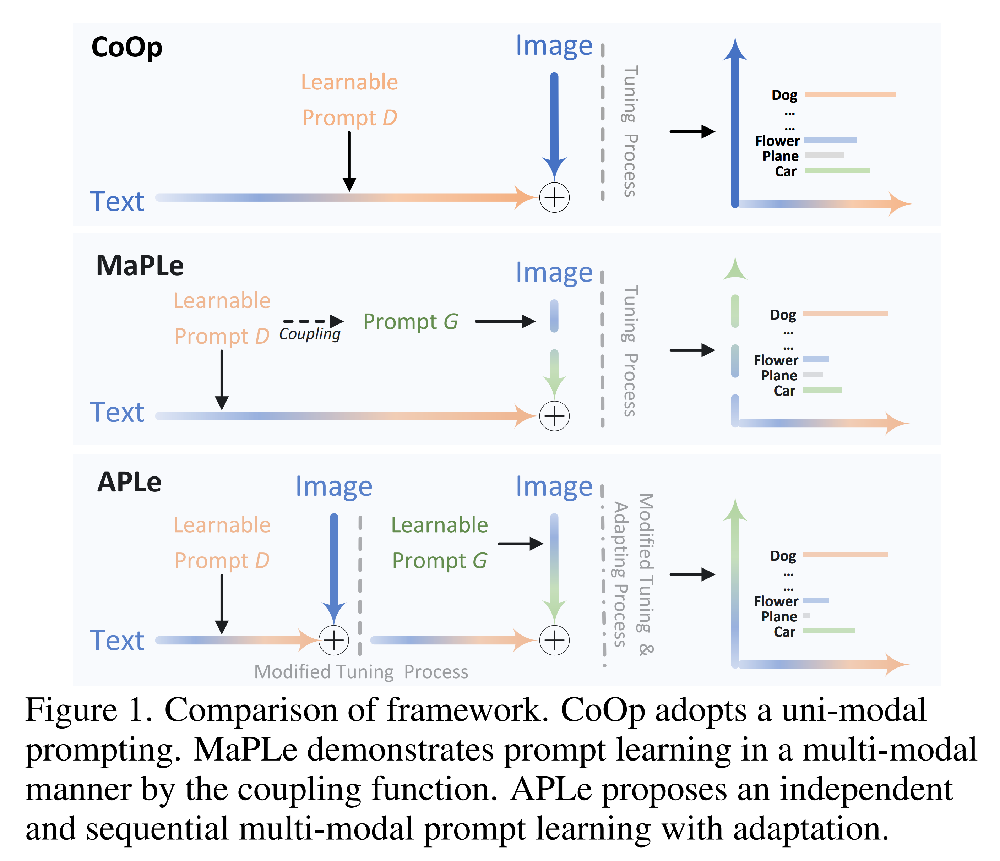

CLIP 은 새로운 가능성을 열었고, CoOp 은 Fig. 1 과 같이 hand-craft prompt 대신 학습 가능한 연속 prompt 를 text input 으로 사용하였다. CoOp 은 image classification 정확도에서 뛰어난 성과를 보이며 vision-language pretraining 패러다임의 가능성과 도전을 드러냈다. MaPLe 은 language prompt 만 활용할 경우 downstream task 에 대한 generalization 성능이 불충분하다고 주장하며, Fig. 1 과 같이 두 modality 모두에서 prompt learning 을 수행하였다. MaPLe 은 language prompt 를 coupling function 을 통해 vision prompt 로 변환하여 시작한다.

MaPLe 은 contrastive learning 에서 두 modality 의 동작을 충분히 활용하지만, coupling 메커니즘은 modality 간 복잡성과 조건이 다르기 때문에 동일하게 prompt learning 을 수행하는 데 한계가 있다. 이러한 메커니즘은 prompt length 에 의한 overfitting 과 같은 generalization 저하 문제를 초래할 수 있다. 이에, 이미지의 서로 다른 feature 를 독립적으로 추출·처리하는 image fusion 과 layer-wise training 에서 영감을 받아, 저자는 Fig. 1 의 framework 와 같이 multi-modal prompt learning 을 독립적이고 순차적으로 수행하는 token-wise **A**daptive for multi-modal **P**rompt **Le**arning (APLe) 을 제안한다.

Generalization 평가를 위한 기본 실험에서, APLe 는 특히 domain shift 가 있는 dataset 에서 기존 방법과 유사한 성능을 보였다. APLe 는 두 modality 로부터의 지식을 활용하고, sequential prompt learning 과 image adaptation 을 통해 강건성을 입증한다. 기존 접근 방식들은 image condition 과 multi-modal prompt condition 을 충분히 고려하지 못한 반면, APLe 는 이를 효과적으로 다룬다. 결과적으로, APLe 는 이미지 복잡성과 prompt 길이에 의해 발생하는 문제를 해결하여 baseline 대비 경쟁력 있는 generalization 성능을 달성한다.

본 논문의 주요 기여는 다음과 같다.

* 저자는 V-L model 을 채택하기 위해 token-wise adaptive for multi-modal prompt learning 을 제안한다. 이는 prompt length 에 의한 overfitting 과 multi modality 로 인한 feature 복잡성 문제를 모두 해결하는 최초의 접근이다.
* Generalization 성능 확장을 위해, CLIP zero-shot knowledge 를 prompt 단위로 통합할 수 있는 token-wise knowledge training framework 를 제안한다. 이 framework 는 두 modality 의 knowledge 를 간섭 없이 학습할 수 있도록 하여 adaptive 하고 stable generalization 성능을 달성한다.
* Zero-shot knowledge 로 prompt learning 을 수행한 뒤 token adaptation function 을 적용하여 knowledge conflicts 를 완화하고 modality 간 협력을 촉진한다. 이를 통해 APLe 는 V-L representation 을 정렬할 수 있다.

# 2 Related Work

#### Vision Language Models.

Vision-language interaction 을 탐구하는 multi-modal 연구는 핵심 주제이다. 초기에는 BAN, Intra-Inter, MCAN 과 같은 attention 기반 접근 방식들이 downstream task 에 기여하였다. 이후, BERT-like architecture 를 채택한 ViLBERT, LXMERT, UNITER 가 modality 간 reasoning 의 범위를 확장하였다. 최근에는 CLIP 과 ALIGN 이 representation learning 을 통해 stable generalization 성능으로 vision-language task 를 주도하고 있다.

V-L model 을 downstream task 에 채택하는 기존 접근 방식은 fine-tuning 과 linear probing 으로 zero-shot 또는 few-shot 성능이 제한된다. 그러나 인터넷에서 수집한 abundant data (e.g., CLIP 의 약 400M image-text pair, ALIGN 의 약 1B pair) 덕분에, 두 모델은 zero-shot 및 few-shot learning 에서 V-L pretraining 패러다임의 강점을 입증하였다. CLIP 과 ALIGN 에서 영감을 받아, 최근에는 few-shot image recognition, object detection, segmentation 등 특정 task 에서 뛰어난 generalization 성능을 보이는 접근들이 제안되었다.

#### Prompt Design.

Prompt design 은 NLP task 에서 사용된 “pre-train, prompt, and predict” 패러다임에서 시작되었다. 최근에는 V-L model 을 downstream task 에 채택하기 위해 language branch 에 prompt 를 입력하여 generalization 성능을 향상시키는 prompt learning 패러다임이 등장했다. 이러한 추세 속에서 language-only prompting model 인 CoOp, vision-only prompting model 인 VPT, 그리고 multi-modal prompting 인 MaPLe 등이 제안되었다.

#### Prompt Learning in Vision and Language.

초기 연구 CoOp 은 learnable token 을 language branch 에 삽입하여 CLIP 을 fine-tuning 했다. 후속 연구 Co-CoOp 은 conditional prompt 를 활용하여 generalization 범위를 확장했다. Vision branch 에 prompt learning 을 적용한 첫 연구는 VPT 이며, 다른 연구에서는 video understanding task 에 prompt learning 을 도입했다. 최근 연구 MaPLe 은 coupling function 을 사용하여 vision 과 language branch 모두에 learnable token 을 적용했다. MaPLe 은 coupling function 이 vision 과 language representation 간 alignment 를 향상시켜 generalization 성능을 끌어올렸다.

# 3 Method

제안하는 접근 방식은 downstream task 에서 V-L pretraining model 인 CLIP 을 다룬다. 저자는 vision 과 language 두 modality 가 모두 downstream task 에 동등하게 기여한다고 주장하며, 동시에 prompt learning 에서의 복잡성 차이 문제를 탐구한다. 이러한 문제를 효율적으로 해결하기 위해, APLe 은 두 modality 로부터 prompt 를 독립적이고 순차적으로 학습하도록 하는 framework 를 제안한다. 

구체적으로, APLe 은 prompt learning 전에 Gaussian filter image adapter 를 부착하여 image feature 의 복잡성을 완화하고, 다양한 scale 에 걸쳐 image feature 를 향상시키며 noise 를 줄인다. 이후 APLe 은 two blocks 로 구성된다.

1. **sequential token-wise knowledge training block** 은 learnable prompt 를 token 으로 사용하여 CLIP zero-shot model 과 함께 학습하여 generalization knowledge 를 획득하고, other modality 의 간섭 없이 독립적·순차적으로 학습하도록 한다.
2. **multi-modal token adaptation block** 은 token 간의 시너지를 촉진하여 V-L model 에 적응시킨다.

## 3.1 Revisiting CLIP

CLIP 은 vision-language model 을 적용하여 image recognition 및 classification task 를 해결하는 기본 구조를 제시한다. 기존 많은 방법들이 CLIP 의 architecture 를 따르며, neural network backbone, transformer, Vision Transformer (ViT) 와 같은 구성 요소가 최근 연구와 APLe 에도 계승되었다. CLIP 에서 feature representation 을 적응시키기 위해, text encoder 는 length $T$ 의 hand-craft query $Q$ 를 prompt 로 변환하여 feature 로 만들고, image encoder 는 image features $I \in \mathbb{R}^{3\times H\times W}$ 로 변환하여 cosine similarity 를 계산하고 예측을 생성한다.

#### Text Feature Block.

초기 text query $Q$ (“a photo of {class}”) 는 tokenization 및 embedding 과정을 거친다. 이후 transformer layer $B$ 가 word embedding 을 계산하고 projection function 으로 전달하여 cosine similarity 계산에 사용한다.

$$
\begin{align}
    W = \text{Embed}(\text{Tokenizer}(Q)), \quad W \in \mathbb{R}^{T \times d_{lang}} \\
    W_n = B_n(W_{n-1}), \quad n = 1, 2, 3, \dots, K \\
    Z_K = \text{TextProj}(W_K), \quad Z \in \mathbb{R}^{d_{vis-lang}}
\end{align}
$$

#### Image Feature Block.

Text 와 유사하지만 tokenization 은 생략하고, class identification token $c$ 를 결합하는 concatenation function 이 추가된다.

$$
\begin{equation}
    E = \text{PatchEmbed}(I)
\end{equation}
$$

여기서 $E \in \mathbb{R}^{M^2\times d_{vis}}$ 이며, fixed-size patch $M=14$ 이다.

$$
\begin{equation}
    [c_n, E_n] = \mathcal{V}_n([c_{n-1}, E_{n-1}]), \quad n = 1, 2, 3, \dots, K
\end{equation}
$$

여기서 $c$ 는 class identification token, $\[ , ]$ 는 concatenation, $\mathcal{V}$ 는 vision transformer layer 이다.

$$
\begin{equation}
    f = \text{ImageProj}(c_K), \quad f \in \mathbb{R}^{d_{vis-lang}}
\end{equation}
$$

여기서 $c_k$ 는 Eq. 5 의 $K$ steps 에서 생산된 것이다.

결과는 Eq. 7 마지막 연산에 대해 $\text{ImageProj}$ projection function 에 의해 common V-L latent space 로 transfer 된다.

#### Overall.

Prompt 로부터 생성된 text feature $Z_i$ 와 target image 의 image feature $f$ 를 사용하여, 예측 class $i \in \{1, 2, \dots, C\}$ 의 최종 cosine similarity 계산 및 예측은 다음과 같다.

$$
\begin{equation}
    p_i = \frac{\exp(\text{sim}(Z_i \cdot f)/\tau)}{\sum_{j=1}^C \exp(\text{sim}(Z_j \cdot f))}
\end{equation}
$$

여기서 $\tau$ 는 temperature parameter, $\text{sim}(\cdot)$ 은 cosine similarity, $p_i$ 는 prediction result 다.

## 3.2 APLe: Token-Wise Knowledge Training and Multi-Modal Token Adaptation

저자는 기존 uni-modal 또는 multi-modal 방법들이 vision 과 language modality 의 차이에 대한 잠재력과 도전을 충분히 고려하지 않고 learnable prompt training 을 수행한다고 본다. 이를 해결하기 위해, 저자는 두 modality 의 prompt 를 독립적·순차적으로 학습하고 V-L model 의 잠재력을 최대한 활용하는 token-wise training 및 adaptation framework 를 제안한다. APLe 의 전체 구조는 Fig. 2 에 나타나 있다.

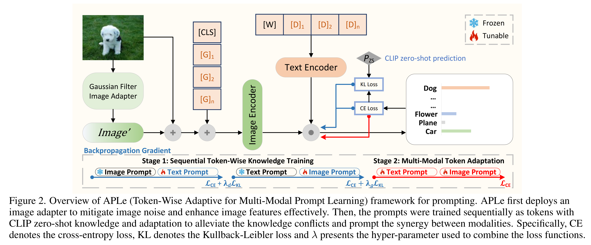

### Image Fusion with Adapter

이미지의 복잡성 차이는 prompt learning 을 어렵게 한다. 이를 해결하기 위해, APLe 은 image recognition task 에서 사용된 기존 기법에서 영감을 받아, original image 로부터 명확하고 정제된 image feature 를 얻기 위해 간단한 함수를 도입한다. image $I$ 는 Fast Fourier Transform $\mathcal{F}(\cdot)$ 과 Gaussian filter $\mathcal{G}(\cdot)$ 를 거쳐 noise 를 억제하고 미세한 feature 를 강화한다.

$$
\begin{align}
    \mathcal{G}(x, y) = \frac{1}{2\pi\sigma^2} \cdot e^{-\frac{x^2 + y^2}{2\sigma^2}} \\
    I'=\mathcal{G}(\mathcal{F}(I))
\end{align}
$$

여기서 $\sigma$ 는 $\mathcal{G}(\cdot)$ 의 standard deviation (본 연구에서는 0.05), $x$, $y$ 는 각 pixel 의 좌표이다.

$$
\begin{equation}
    \bar{I} = \alpha I + (1 - \alpha) \cdot \mathcal{F}^{-1}(I')
\end{equation}
$$

이후, image fusion operation 은 adjusted image 와 original image 를 적용한다. 여기서 $\alpha$ 는 0.9 다. image fusion $\bar{I}$ 의 결과는 image embedding 로 순차적으로 처리한다.

Image fusion 의 목적은 image feature 의 분산을 안정화하고 간섭을 억제하는 것이며, 이를 완전히 제거하지 않는다. Image fusion 은 image feature 의 복잡성을 줄이고, 이후 APLe 의 vision token training 으로 이를 보완하여 generalization 성능을 향상시킨다.

$$
\begin{equation}
    p_i = \frac{\exp(\text{sim}(Z_i \cdot \bar{f})/\tau)}{\sum_{j=1}^C \exp(\text{sim}(Z_j \cdot \bar{f}))}
\end{equation}
$$

image feature embedding pipeline 에 fusion image $\bar{I}$ 를 도입하여, text feature $Z$ 와의 contrastive learning 및 $p_i$ 예측을 위해 new image feature $\bar{f}$ 를 Eq. 11 에 사용된다.

#### Feature Embedding

APLe 은 기존 방식과 달리, text 와 image 각각에 대해 learnable prompt $D$ 와 $G$ 를 decoupling 방식으로 초기화하고, 해당 modality feature 에 Eq. 13 과 Eq. 16 처럼 concatenation 한다. Deep prompting 의 효과를 유지하기 위해 deep transformer layer 를 사용하며, learnable token 길이 $m=2$, deep transformer layer depth $S=8$, $d_{lang} = 512$, $d_{vis} = 768$, $d_{vis-lang} = 512$ 로 설정한다.

#### Text Feature Embedding

text encoding 은 CLIP 과 유사하지만, learnable token $D$ 는 embedding 된다.

$$
\begin{align}
    W = \text{Embed}(\text{Tokenizer}(Q)), \quad W \in \mathbb{R}^{T \times d_{lang}} \\
    [W_s, D_s] = \mathcal{B}_j([W_{s-1}, D_{s-1}]), \quad s = S+1, \dots, K, \quad D \in \mathbb{R}^{m \times d_{lang}} \\
    Z_K = \text{TextProj}(W_K), \quad Z \in \mathbb{R}^{d_{vis-lang}}
\end{align}
$$

#### Image Feature Embedding

image encoding 또한 CLIP 에 상응하지만, image 는 먼저 embedding process 를 따라 image fusion 에 의해 처리된다. 이후, 결과는 learnable vision token $G$ 과 함께 concatenation 된다.

$$
\begin{align}
    E = \text{PatchEmbed}(I) \\
    [c_s, E_s, G_s] = \mathcal{V}_j([c_{s-1}, E_{s-1}, G_{s-1}]), \quad s = S+1, \dots, K, \quad G \in \mathbb{R}^{m \times d_{vis}} \\
    f = \text{ImageProj}(c_K), \quad f \in \mathbb{R}^{d_{vis-lang}}
\end{align}
$$

이 decoupling 구조는 vision 과 language prompt 가 서로의 제약을 받지 않고 독립적으로 학습할 수 있게 하여 multi-modal prompt learning 능력을 향상시킨다.

#### Training and Adaptation

APLe 은 multi-modal prompt learning 의 generalization 능력을 향상시키기 위해, 두 단계의 학습 절차를 수행한다.

**(1) Sequential Token-Wise Knowledge Training**

각 modality 의 prompt 를 하나씩 순차적으로 token 단위로 학습하며, 다른 modality 는 고정한다. training 중 CLIP zero-shot knowledge 를 통합하여 generalization 성능을 높이고 prompt 설정에 의한 overfitting 가능성을 줄인다. Language 와 vision prompt 각각에 $\lambda_d$ 와 $\lambda_g$ 를 적용한다.

$$
\begin{align}
    \text{Stage 1:} \quad \mathcal{L}^I_{\text{total}} &= \mathcal{L}_{ce}(p_i, C_i) + \lambda_d \mathcal{L}_{kl}(p_i, p^{zs}_i) \\
    \mathcal{L}^I_{\text{total}} &= \mathcal{L}_{ce}(p_i, C_i) + \lambda_g \mathcal{L}_{kl}(p_i, p^{zs}_i)
\end{align}
$$

여기서 $\mathcal{L}_{ce}$ 는 classification prediction 에 대한 cross-entropy loss, $\mathcal{L}_{kl}$ 은 trained model 의 prediction $p_i$ 와 CLIP zero-shot prediction $p^{zs}_i$ 간의 Kullback-Leibler divergence loss 이다. $\lambda_d = 0.5$, $\lambda_g = 0.3$ 으로 설정한다.

**(2) Multi-Modal Token Adaptation**

Token-wise knowledge training 후, 두 branch 의 token synerge 를 촉진하고 downstream task 에서의 generalization 능력을 높이기 위해 zero-shot knowledge 없이 retraining 을 수행한다.

$$
\begin{equation}
    \text{Stage 2:} \quad \mathcal{L}^{II}_{\text{total}} = \mathcal{L}_{ce}(p_i, C_i)
\end{equation}
$$

# 4 Experiments

APLe 의 성능을 평가하기 위해, CLIP, CoOp, Co-CoOp, MaPLe 을 포함한 기존 방법들과 비교 실험을 수행하였다. 실험 및 데이터셋 구성은 baseline 과 동일하게 하며, 3 가지 실험과 15 개 데이터셋을 사용한다. 데이터셋은 Caltech101, DTD, EuroSAT, FGVCAircraft, Flowers102, Food101, ImageNet, OxfordPets, StanfordCars, SUN397, UCF101, 그리고 ImageNetSketch, ImageNetV2, ImageNet-A, ImageNet-R (ImageNet 으로부터 domain shift) 이다.

## 4.1 Fundamental Experiment

Zero-shot learning 성능을 평가하기 위해 데이터셋을 base class 와 novel class 로 나누고, 3 회 평균 정확도와 두 정확도의 조화 평균(HM)을 산출한다.

* **Base-to-Novel Generalization**: APLe 을 16-shot 환경에서 base class 로 학습하고 두 그룹에서 평가한다.
* **Cross-Dataset Generalization**: Zero-shot 및 transfer learning 을 평가하기 위해 ImageNet 의 1000 클래스 전체를 16-shot 으로 학습한 뒤, 다른 10 개 데이터셋에서 평가한다.
* **Domain Generalization**: Cross-dataset 학습 모델을 사용하여 ImageNet 으로부터 domain shift 가 있는 4 개 데이터셋에서 평가한다.

## 4.2 Base-to-Novel Generalization

Tab. 1 은 11 개 데이터셋에서 APLe 와 CLIP, CoOp, Co-CoOp, MaPLe 의 성능을 비교한 것이다.

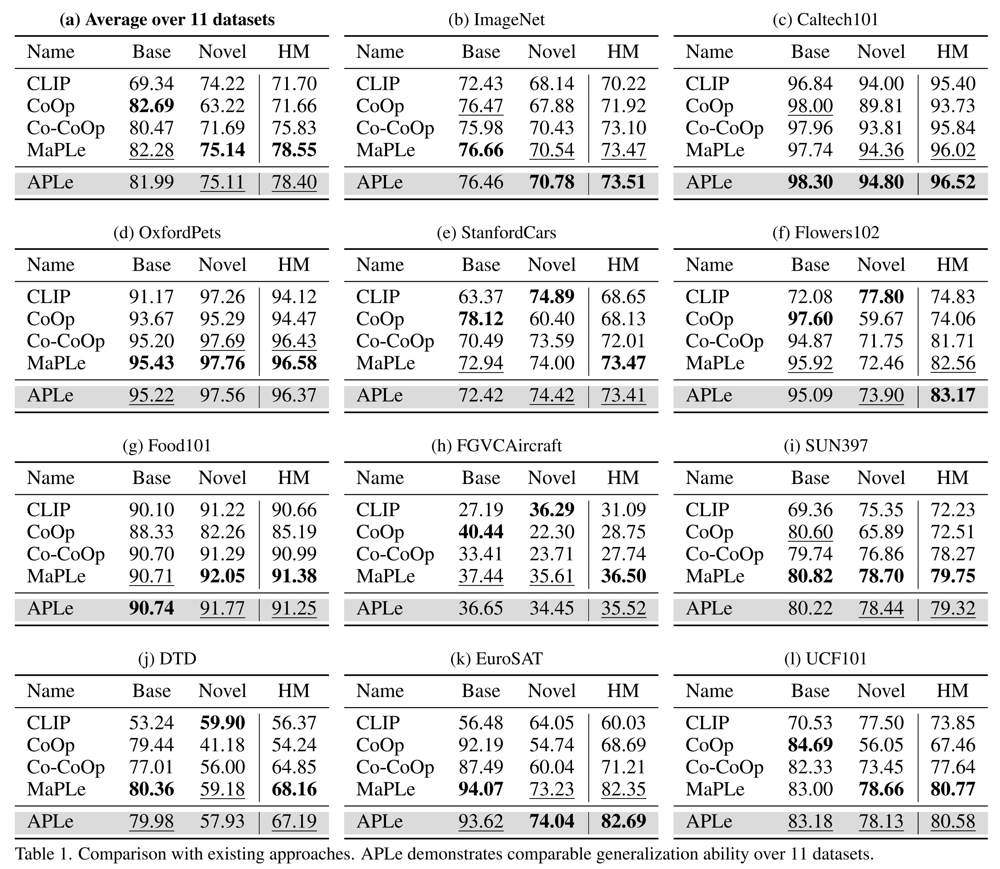

* **Base Class 성능**
  * Co-CoOp 은 CoOp 대비 base class 평균 정확도를 82.69% → 80.47% 로 낮췄다. 
  * APLe 은 독립·순차 학습 구조를 통해 평균 정확도를 81.99% 로 안정화하며, Co-CoOp 대비 모든 데이터셋에서 개선된 generalization 성능을 보였다.
* **Novel Class 성능**
  * Co-CoOp 대비 APLe 은 image branch 에 conditioning 과 zero-shot knowledge 를 적용하여 대부분 데이터셋에서 향상되었고, OxfordPets 에서만 0.13% 하락했다. Novel class 평균 정확도는 71.69% → 75.11% 로 증가했고, HM 기준 2.57% 향상되었다.
* **APLe vs MaPLe**
  * APLe 과 MaPLe 은 평균 정확도에서 비슷하며, APLe 은 5/11 데이터셋에서 우위, 4 개에서는 동등, 나머지 DTD(-1.15%)와 FGVCAircraft(-1.16%)에서 열세를 보였다.

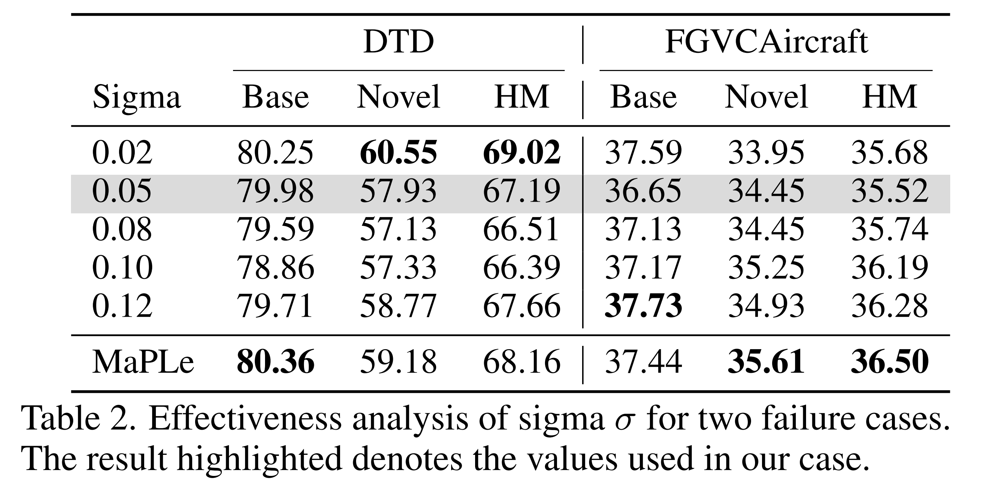

* **Failure Case 분석**
  * MaPLe 의 성공과 APLe 의 실패 사례에 대해 분석
  * Gaussian filter 의 $\sigma$ 값을 변화시키면 DTD 와 FGVCAircraft 에서 서로 다른 최적값(각각 0.02, 0.12)을 보인다. 
  * DTD 는 고주파·엣지 보존이 필요하고, FGVCAircraft 는 noise 억제를 위한 강한 smoothing 이 유리하다는 점을 시사한다.

## 4.3 Cross-Dataset Generalization

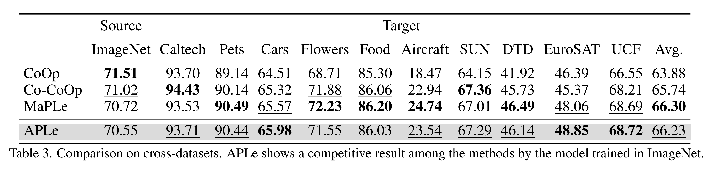

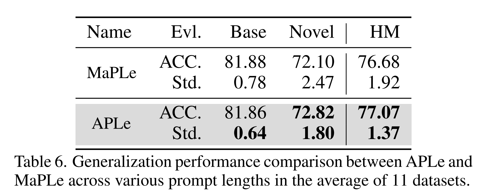

ImageNet 1000 클래스 학습 후 10 개 타 데이터셋에서 평가했다. Tab. 3 에 따르면, APLe 은 source dataset 에서는 중간 수준이나, 10 개 중 6 개에서 Co-CoOp, 5 개에서 MaPLe 을 능가하며 평균 정확도 66.23% 로 3 개의 최고 기록을 경신했다.

## 4.4 Domain Generalization

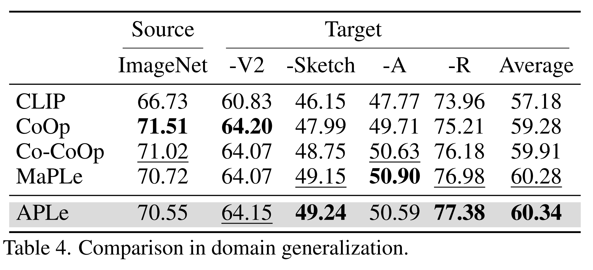

ImageNet 학습 모델을 out-of-domain 데이터셋에 평가한 결과, APLe 은 CoOp, Co-CoOp, MaPLe 대비 경쟁력 있는 평균 성능을 보였다. Token-wise knowledge training 과 multi-modal prompt adaptation 덕분에 domain shift 환경에서 강한 generalization 능력을 확보했다.

## 4.5 Vital Experiments and In-Depth Analysis

앞서 언급한 기본 실험에서 APLe 은 최신 state-of-the-art model 과 비슷한 성능을 달성하였다. APLe 의 또 다른 중요한 점은 language text 와 vision prompt 학습 간의 협력을 촉진하여, prompt learning 설정에서 발생하는 문제를 해결한다는 것이다. 다음의 핵심 실험과 심층 분석에서 APLe 은 downstream task 에서 baseline 대비 뛰어난 강건성과 포괄적인 generalization 능력을 보여준다.

#### Prompt Length and Overfitting

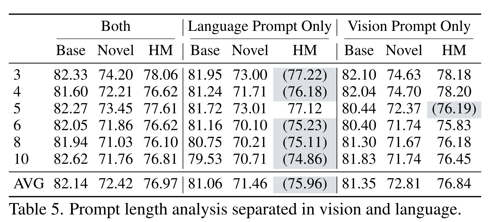

우선 token-wise training 과 adaptation 을 적용하지 않은 단순 구조에서, vision prompt, language prompt, 그리고 두 prompt 모두에 대해 서로 다른 prompt 길이에서의 성능을 탐구하였다(Tab. 5).

* Vision prompt 길이가 늘어날 경우, 또는 두 prompt 길이가 모두 늘어날 경우, 성능은 소폭의 변동과 함께 완만히 하락한다.
* 반면 text prompt 길이가 증가하면 정확도가 뚜렷하게 감소한다. 즉, language prompt 에서는 길이 확장이 더 큰 영향을 주며, 각 길이에서 가장 낮은 점수(blue highlight)를 기록하는 경향을 보였다.

이러한 정확도 저하는 기존 연구에서 prompt 길이 등 설정에 따른 **overfitting** 으로 설명된다. 결과적으로 prompt learning 동작은 modality 에 따라 다르며, generalization 능력과 knowledge conflict 위험도 다르게 나타난다.

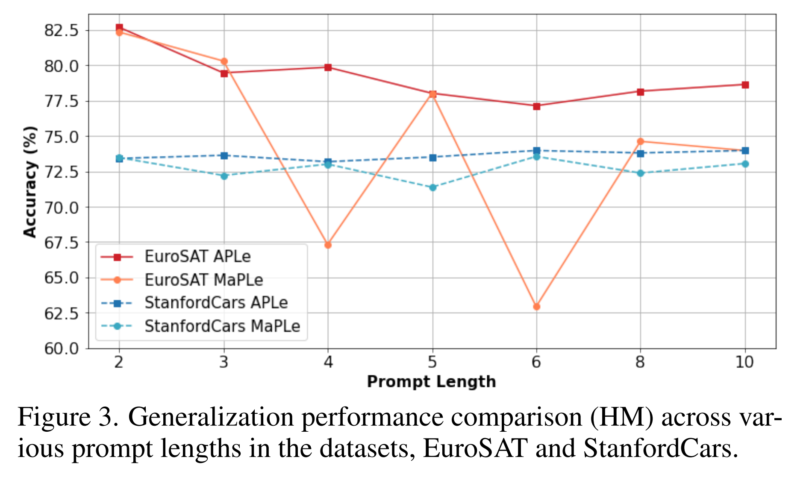

APLe 의 sequential token-wise knowledge training 과 token adaptation framework 는 이러한 modality token 간 차이와 prompt 길이 증가에 따른 overfitting 을 완화하여 V-L model 의 generalization 성능을 향상시킨다.

MaPLe 과의 비교에서는 HM(조화 평균)과 표준편차 두 가지 지표를 사용했다. HM 은 generalization 성능을, 표준편차는 7 가지 길이에서의 예측 변동성을 나타낸다. Tab. 6 에서 APLe 은 MaPLe 대비 정확도와 표준편차 모두에서 우위에 있었다. APLe 의 평균 정확도와 표준편차는 각각 77.07%, 1.37, MaPLe 은 76.68%, 1.92 이다. 특히 Fig. 3 에서 EuroSAT 과 StanfordCars 의 HM 곡선이 APLe 쪽이 훨씬 안정적임을 볼 수 있다.

Overfitting 실험 결과, APLe framework 가 generalization 성능을 강화하고 baseline 대비 뛰어난 강건성을 제공함을 확인할 수 있었다.

#### Effectiveness of Multi-Modal Token Adaptation

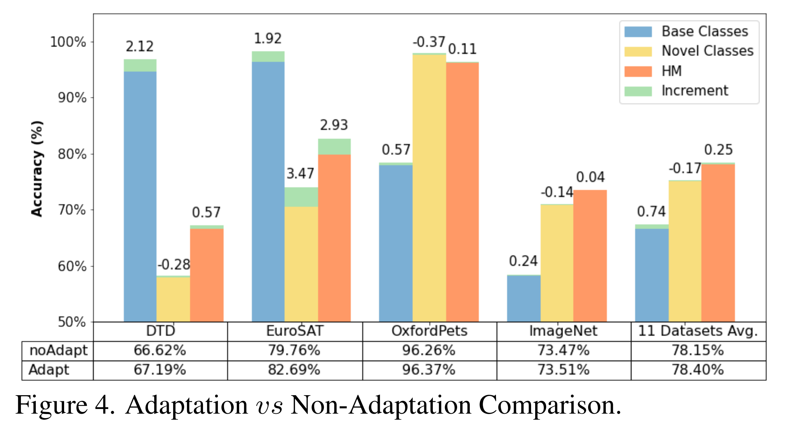

APLe 의 framework 는 CLIP zero-shot knowledge 를 통합하여 각 modality 의 prompt 가 포괄적·독립적으로 학습되도록 하고, prompt 설정에 의한 overfitting 문제를 완화한다. 그러나 이는 두 modality 간 효과적인 협력에는 어려움을 줄 수 있다.

이에 token adaptation 을 도입하여 prompt 간 시너지를 촉진하고 generalization 성능을 더욱 향상시켰다. Fig. 4 분석 결과, DTD, EuroSAT, OxfordPets, ImageNet 및 11 개 데이터셋 평균에서 base class 와 전체 성능 모두에서 유의한 향상을 보였다. 이는 token adaptation 이 prompt learning 과정에서 APLe 의 generalization 향상에 기여함을 시사한다.

#### Effectiveness of Hyper-Parameter \$\lambda\$

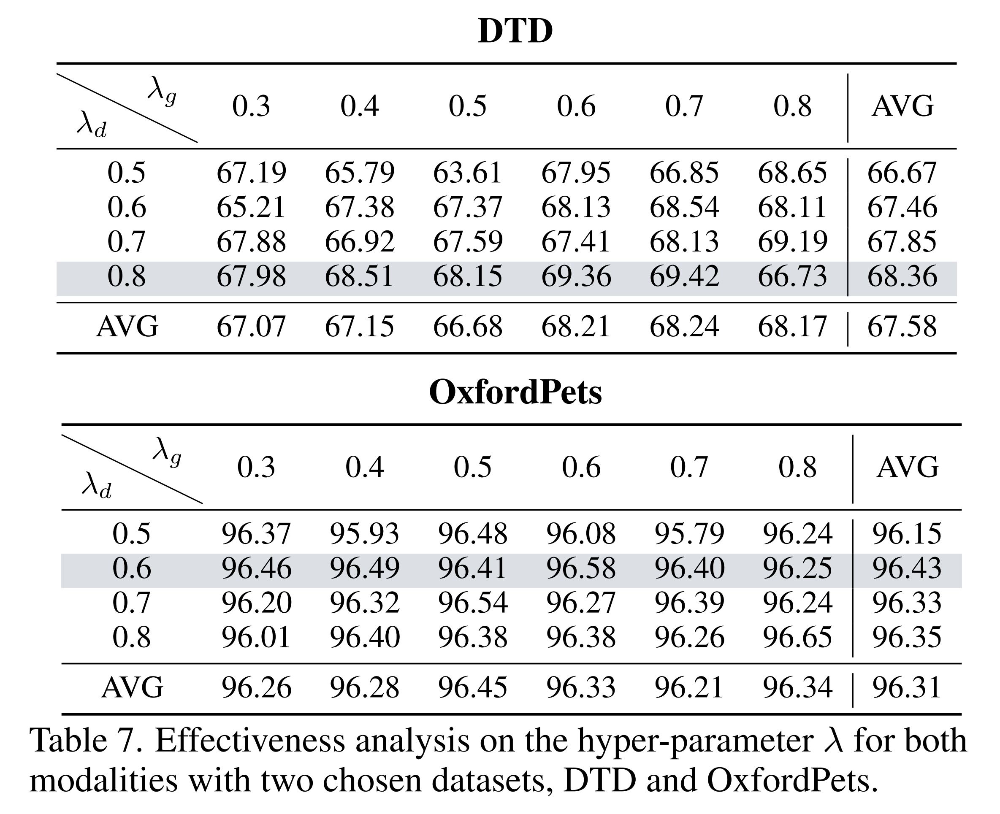

마지막으로, Eq. 18–19 에서 설명한 바와 같이 token-wise training 결과를 zero-shot knowledge 와 통합할 때 사용하는 \$\lambda\_d\$ (language) 와 \$\lambda\_g\$ (vision) 의 영향을 분석하였다(Tab. 7).

Vision 과 language modality 는 feature representation 복잡성이 다르며, 이는 성능과 knowledge conflict 위험에 차이를 만든다.

* **DTD** (texture 가 많은 데이터셋)에서는 \$\lambda\_d\$ 값이 커질수록 정확도가 증가하며, \$\lambda\_g\$ 값이 커지면 변동이 예상된다. \$\lambda\_d \approx 0.8\$ 일 때 최고 성능(blue highlight)을 기록했다.
* **OxfordPets** (소수의 fine-grained 클래스)에서는 \$\lambda\_d \approx 0.6\$ 일 때 최고 성능을 보였다.

이 결과는 language modality 의 prompt 가 vision prompt 보다 knowledge 학습 및 conflict 완화에서 더 안정적인 generalization 능력을 제공함을 시사한다.

# 5 Conclusion

Prompt learning 은 prompt 길이 등의 설정에 민감하며, prompt 가 길어질수록 overfitting 위험이 커진다. 또한 modality 간 차이 역시 학습 난이도를 높이고 overfitting 위험을 가중시킨다.

이를 해결하기 위해 APLe 은 **sequential token-wise knowledge training** 과 **adaptation framework** 를 도입하여 multi-modal prompt learning 의 문제를 해결하였다.

제안한 방법은 3 가지 기본 실험에서 최신 방법과 유사한 성능을 달성했으며, 특히 domain shift 데이터셋에서 평균 정확도 향상이 두드러졌다. 또한 prompt 길이와 overfitting 분석에서 APLe 은 전 구간에 걸쳐 뛰어난 generalization 성능을 보였다.

결론적으로, APLe 은 V-L model 을 downstream task 에 적용하는 데 있어 강건하고 적응력 있는 접근 방식으로 자리매김한다.