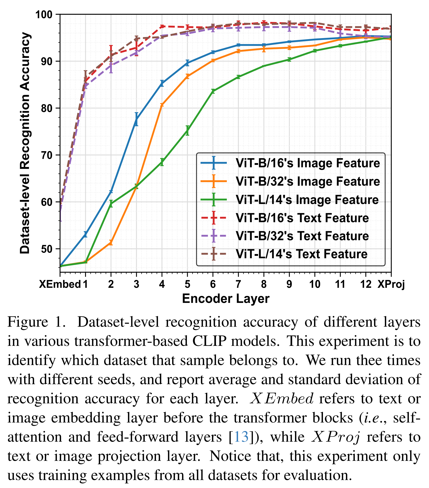
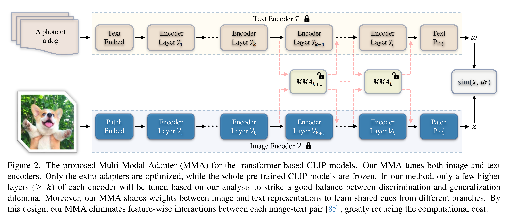
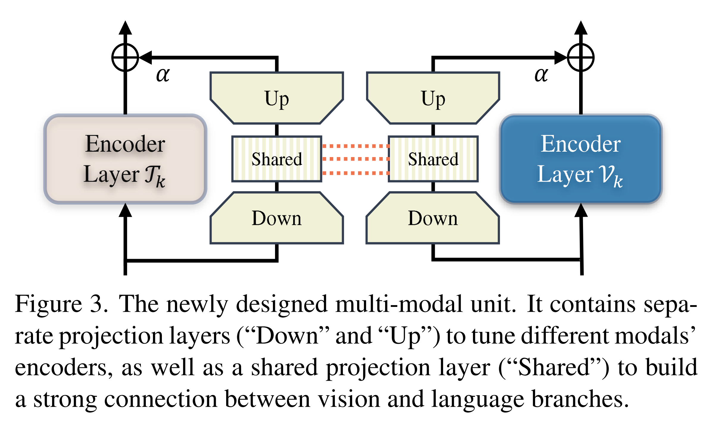
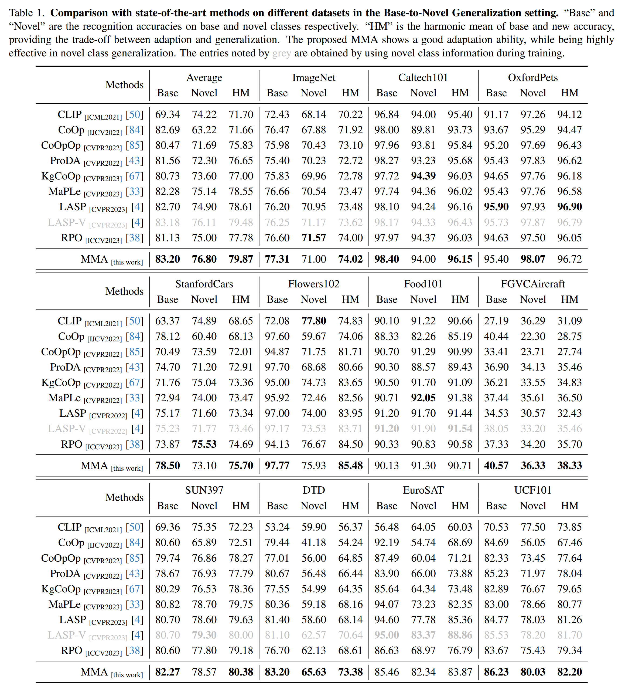
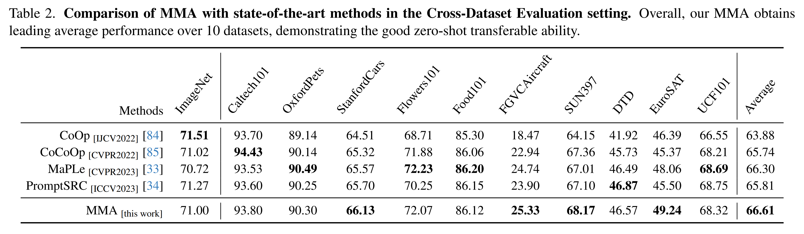
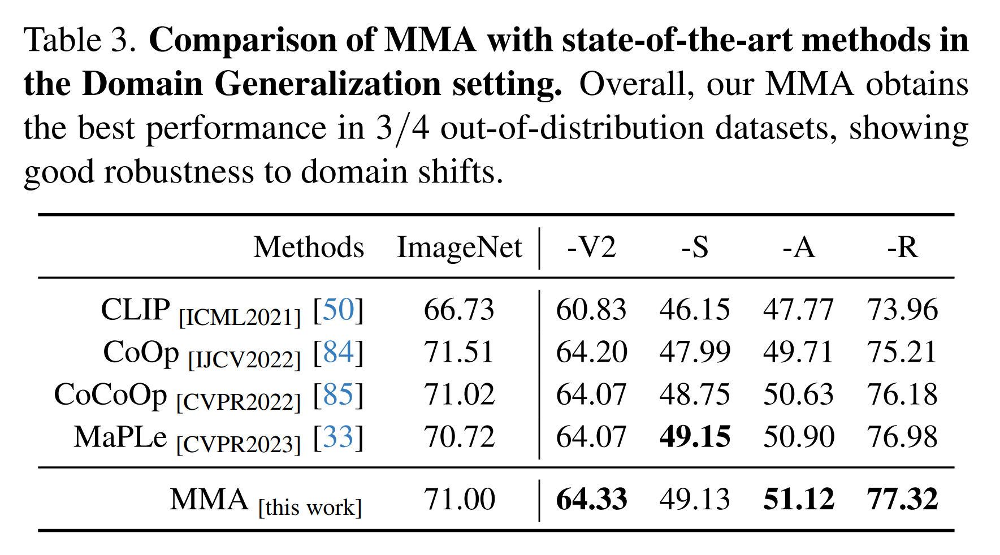
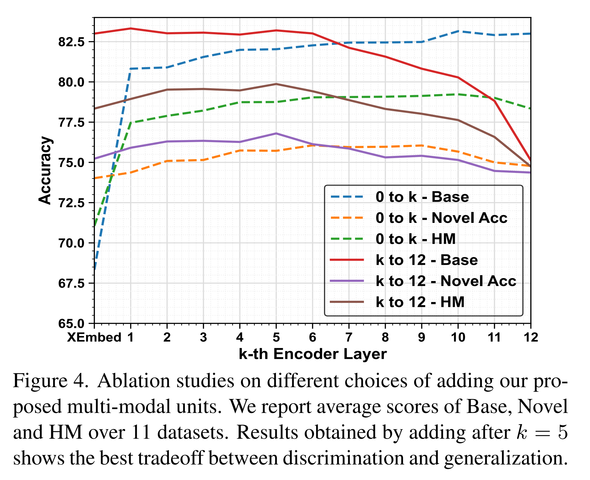
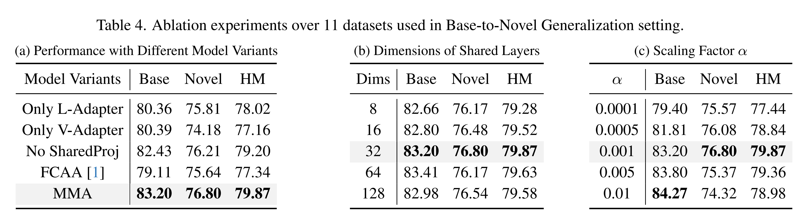
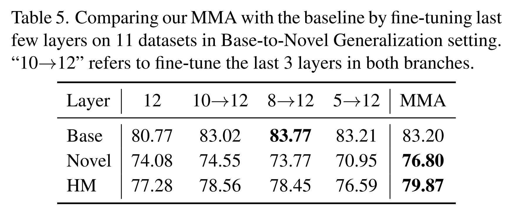

논문 및 이미지 출처 : <https://openaccess.thecvf.com/content/CVPR2024/papers/Yang_MMA_Multi-Modal_Adapter_for_Vision-Language_Models_CVPR_2024_paper.pdf>

# Abstract

Pre-trained Vision-Language Models (VLMs) 는 다양한 downstream task 에서 transfer learning 을 위한 뛰어난 foundation model 로 활용되어 왔다. 하지만 few-shot generalization task 에 VLM 을 튜닝하는 데에는 **discrimination-generalization dilemma**, 즉 general knowledge 를 보존하면서 task-specific knowledge 를 fine-tune 해야 한다는 문제가 있다. 

이 두 가지 유형의 representation 을 정확하게 구별하는 것은 여전히 도전 과제로 남아 있다. 본 논문에서는 text 와 vision branch 로부터의 representation 간의 정렬을 개선하기 위해 VLM 용 **Multi-Modal Adapter (MMA)** 를 제안한다. MMA 는 서로 다른 branch 로부터의 feature 를 shared feature space 로 집계하여, gradient 가 branch 간에 전달될 수 있도록 한다.

MMA 를 어떻게 통합할지를 결정하기 위해 vision 과 language branch 의 다양한 dataset 에서 feature 의 **discriminability** 와 **generalizability** 를 체계적으로 분석하였고, 다음과 같은 사실을 발견하였다.

1. higher layers 는 discriminable dataset-specific knowledge 를 포함하고, lower layers 는 보다 generalizable knowledge 를 포함한다.
2. language feature 가 visual feature 보다 더 discriminable 하며, 특히 lower layers 에서 두 modality 간 feature 의 의미적 차이가 크다.

따라서 MMA 는 transformer 의 few higher layers 에만 통합함으로써 discrimination 과 generalization 간의 최적 균형을 달성한다. 저자는 novel class, novel target dataset, domain generalization 의 세 가지 task 에서 제안 기법의 효과를 평가하였다. 다양한 SOTA 와 비교하여, MMA 는 모든 평가에서 선도적인 성능을 달성하였다.

# 1. Introduction

large-scale datasets 로 학습된 deep network 들은 image classification, object detection, semantic segmentation, person re-identification 등 다양한 vision task 에서 성능을 크게 향상시켰다.

최근에는 Vision-Language Models (VLMs) 가 foundation model 로 도입되었다. VLMs 는 visual 및 textual information 을 공동으로 처리함으로써, image 와 language 사이의 복잡한 상호작용에 대한 통합된 이해를 형성한다. VLMs 는 관련된 image-text pairs (positive pairs) 는 가깝게, negative pairs 는 멀게 만드는 representation space 를 구축하기 위해 web-scale datasets (e.g. CLIP 은 400M) 에서 학습된다. 이렇게 학습된 VLMs 는 task-specific tuning 없이도 다양한 downstream task 에 대해 일반화 성능이 뛰어나다.

그러나 이러한 VLM 은 parameter 수가 방대하여 downstream task, 특히 few-shot generalization setting (i.e., target domain data 가 거의 없는 경우) 에서 fine-tuning 이 어렵다. 이러한 pre-trained VLMs 를 효과적으로 적응시키기 위해 **prompt engineering** 이 중요한 역할을 한다. Prompt engineering 은 원하는 output 을 유도하기 위한 input query 를 설계하는 과정이다. 예를 들어, CLIP 에서는 “a photo of a <category>”, “a bad photo of a <category>” 와 같은 handcrafted text prompt 들을 text encoder 에 입력하여 category-wise embeddings 를 계산한다. 그런 다음 이 embedding 과 image encoder 가 출력한 visual embedding 을 매칭시켜 class 를 예측한다.

하지만 효과적인 prompt 설계는 전문 지식과 많은 시간이 필요하다. 이를 해결하기 위해, 많은 연구자들이 learnable prompt 를 text, image encoder, 또는 양쪽 모두에 추가하였다. training 시, pre-trained VLM 전체는 고정시키고 prompt 만 학습하므로, prompt learning 은 다양한 downstream task 에 pre-trained VLM 을 적용하는 실용적인 접근법으로 부상하였다.

Prompt learning 외에도, pre-trained model 을 다양한 downstream task 에 맞게 적응시키기 위한 **lightweight module** 인 adapter 를 활용하는 방법도 있다. Prompt learning 과는 달리, adapter 는 shallow network 로서 feature fusion 을 통해 모델의 generalizability 를 향상시킨다. 예를 들어, 최근 방법인 Clip-Adapter 와 AdaptFormer 는 pre-trained model 의 출력과 adapter 의 출력을 더하는 방식으로 feature 를 융합한다. 마찬가지로, 학습 시 adapter 만 학습하고 나머지는 고정한다. 또한 prompt learning 과 달리, adapter 는 네트워크 구조에 독립적으로 동작하며 ResNet, ViT, Swin, Diffusion Model 등 다양한 network 에 쉽게 통합 가능하다.

이러한 adapter 들은 많은 NLP 와 vision application 에서 효율적인 도구로 활용되고 있지만, 두 가지 주요 한계가 존재한다.

1. 대부분의 기존 adapter 들 (e.g., LoRA, AdaptFormer) 은 **uni-modal** information 을 기반으로 한다. CLIP 같은 VLM 은 vision 과 language 의 **dual-modal** signals 가 공존하며 예측에 공동으로 기여한다. 간단한 방법은 각 modality 에 독립적으로 adapter 를 적용하는 것이지만, 이 접근은 text 와 image representation 간의 관계를 고려하지 않기 때문에 modality 간 정렬이 부족하여 task-specific 한 cue 를 충분히 학습하지 못한다.
2. 기존 방법들은 text 와 image representation 의 특성을 고려하지 않는다. Transfer learning 은 일반적으로 **discrimination-generalization dilemma** 에 직면한다. 즉, task 간 구별되는 feature 는 fine-tune 해야 하고, 다양한 task 에 일반화되는 feature 는 보존해야 한다. 예를 들어 AdaptFormer 은 모든 transformer block 에 adapter 를 삽입하는데, 이는 충분한 training data 가 있을 때는 잘 동작하지만, 데이터가 부족할 때는 overfitting 이 발생할 수 있다. 따라서 feature 의 특성 (discriminability, generalizability) 을 고려하는 것이 중요하다.

이를 해결하기 위해, 저자는 text 와 image representation 의 정렬을 개선하기 위한 새로운 구조인 **Multi-Modal Adapter (MMA)** 를 제안한다. MMA 는 text 와 vision branch 각각의 task-specific 지식을 학습하기 위한 독립적인 projection layer 를 포함하고 있다. 또한 두 modality 간의 정렬을 촉진하기 위해, **unified feature-projection layer** 를 설계하였다. fine-tuning 중에는 이 unified feature space 에서 두 modality 로부터의 gradient 가 소통되어 alignment 가 향상된다.

또한, 다양한 데이터셋에서 두 branch 의 feature 에 대한 discriminability 와 generalizability 를 평가하였다. 이 dataset-level feature classification 을 통해, higher layer feature 는 task-specific feature 로서 fine-tune 되어야 하고, lower layer feature 는 pre-trained generalizable feature 로서 고정되어야 함을 확인하였다. 따라서 adapter 는 higher layer 에만 통합한다. 이 설계는 각 데이터셋의 training samples 수가 적어 feature 특성을 파악하기 위한 통계 정보가 부족하다는 문제를 피할 수 있다.

요약하면, 본 논문의 주요 기여는 다음과 같다:

- Transformer 기반 CLIP model 에 대해 feature representation 을 체계적으로 분석하기 위한 dataset-level 분석 방법을 도입하였다. 이 분석은 보다 효과적이고 효율적인 VLM adapter 구축에 기여한다.
- image encoder 와 text encoder 각각의 feature representation 을 개선하기 위한 독립적인 projection layer 와, vision-language representation 정렬을 위한 공유 projection 을 포함한 새로운 adapter 를 제안하였다.
- 제안한 adapter 를 CLIP model 에 통합하고, 다양한 few-shot generalization task 에 대해 평가하였다. 실험 결과, 제안 방법은 비교된 모든 방법들 중에서 선도적인 성능을 달성하였다.

# 2. Related Work

#### Vision-Language Models

최근 VLMs (Vision-Language Models) 의 발전은 CV 분야, 특히 language 와 image 를 결합하는 task 에 큰 영향을 미쳤다. 대표적인 모델로는 CLIP, ALIGN, FILIP, Florence, LiT, Kosmos 등이 있다. 이러한 모델들은 web-scale multi-modal data z로부터 **self-supervised paradigm** 을 활용하여 학습된다.

예를 들어, CLIP 과 ALIGN  은 각각 약 4억 개와 10억 개의 이미지-텍스트 쌍으로부터 **contrastive loss** 를 사용하여 학습되었다. 더 많은 multi-modal 데이터를 수집함으로써, 이러한 모델들은 다양한 downstream application 에서 뛰어난 성능을 보인다.

하지만 generalized representation 을 학습하는 능력에도 불구하고, 이러한 pre-trained VLM 을 specific 한 downstream task 에 효율적으로 적응시키는 것은 여전히 중요한 과제이며, 특히 few-shot setting 에서는 더욱 그렇다. 이를 해결하기 위해, few-shot image recognition, object detection, segmentation 등 다양한 task 를 위한 많은 연구들이 제안되어 왔다. 이와 달리, 본 논문에서는 **few-shot generalization task** 에서 VLM 을 효과적으로 적응시키기 위한 **new multi-modal adapter** 를 제안한다.

### Efficient Transfer Learning for VLMs

pre-trained model 을 downstream task 에 transfer 하기 위해, 기존 방법들은 보통 pre-trained network 의 all parameters 를 fine-tune 한다. 하지만 model 크기가 커짐에 따라, 이러한 전통적인 방법은 막대한 연산 비용 때문에 한계에 부딪힌다. 또한, trainable parameters 수가 많을수록 특히 few-shot setting 에서는 **overfitting** 문제가 발생할 수 있다.

이에 따라, NLP 커뮤니티에서는 여러 **parameter-efficient method** 들이 제안되었고, 이러한 접근은 vision 및 VLM 커뮤니티로 확장되었다. 이들 방법은 크게 두 가지 범주로 나눌 수 있다:

* **token-based prompt learning**
* **network-based adapter 방식**

**Prompt learning** 에서, VLM 의 language component 에 textual instruction 을 제공함으로써 모델의 task 이해도와 적응력을 향상시킨다. 예를 들어, CoOp 은 CLIP 의 language branch 에서 continuous prompt vector 집합을 최적화하여 few-shot 학습 성능을 개선하였다. CoCoOp 은 이를 확장하여 이미지 인스턴스에 따라 conditional prompt 를 생성한다.

기타 연구들은 다음과 같은 방법을 통해 성능을 높인다:

* 다양한 prompt distribution 를 capture
* pre-trained CLIP 을 general knowledge 로 사용하여 학습 과정을 regularization 하여 overfitting 을 완화
* image 와 text branch 양쪽에 multi-modal prompt 를 구축

이러한 방법들은 vision-language representation 간의 정렬을 유의미하게 향상시켜, CoOp 및 CoCoOp 보다 다양한 측면에서 뛰어난 성능을 보인다.

**Adapter 방식** 에서는, 기존 연구들이 주로 **uni-modal adapter** 를 활용하여 tuning 을 수행한다. 예를 들어, Clip-Adapter 와 Tip-Adapter 은 image encoder 이후에 adapter layer 를 추가한다. 최근에는 text-video retrieval 을 위한 **multi-modal adapter** 가 제안되었으며, 이는 self-attention 과 feed-forward MLP module 뒤에 삽입된다.

이러한 VLM 을 위한 다양한 발전은 **full fine-tuning 에서 partially learning-based method 로의 패러다임 전환**을 의미한다. 하지만 이러한 방법들은 특히 few-shot generalization task 와 같은 다양한 challenging 한 downstream task 에 대해 pre-trained VLM 의 잠재력을 최대한 활용하려면 **layer 별로 서로 다른 동작 방식**을 고려해야 한다는 점을 강조한다.

# 3. Methods

기존 연구들을 따르며, 저자는 transformer-based pre-trained CLIP model 을 기반으로 한다. 즉, text encoder 와 vision encoder 양쪽 모두에서 transformer 를 사용한다. 아래에서는 먼저 CLIP 에 대한 기본 개념을 소개하고, 이후 저자의 제안 기법인 MMA 를 설명한다.

## 3.1. Preliminary

CLIP 은 NLP 와 CV 분야에서 주목을 받은 대표적인 Vision-Language Model (VLM) 이다. 이 모델은 text encoder $\mathcal{T}$ 와 vision encoder $\mathcal{V}$ 로 구성된 two branches 를 가지며, text description 과 visual contents 사이의 의미적 차이를 이해하고 연결할 수 있도록 한다. 이 two branches 는 web-scale image-text pairs 에 대해 contrastive objective 으로 jointly pre-training 되어, related pairs 는 가까이, unrelated pairs 는 멀리 위치하게 된다. 이러한 large-scale pre-training 을 통해 CLIP 은 image 와 text description 을 동시에 인코딩할 수 있으며, 다양한 downstream task 를 수행할 수 있다.

특히 이미지 $I$ 가 입력되면 image encoder $\mathcal{V}$ 를 통해 feature $x$ 를 다음과 같이 추출한다:

$$
\begin{align}
\bm{x}_0 &= \text{PatchEmbed}(\bm{I}) \\
[\bm{c}_i, \bm{x}_i] &= \mathcal{V}_i([\bm{c}_{i-1}, \bm{x}_{i-1}]) \quad i=1,2,...,L \\
\bm{x} &= \text{PatchProj}(\bm{c}_L)
\end{align}
$$

여기서 `PatchEmbed` 는 입력 이미지 $I$ 를 fixed-size patches 로 분할하고 이를 feature 로 투영한다. 이후 learnable class token $c_0$ 가 feature 와 함께 연결되어 $[\bm{c}_0, \bm{x}_0]$ 를 구성하며, 이들은 $L$ 개의 transformer blocks $\{\mathcal{V}\}^L_{i=1}$ 을 순차적으로 통과한다. 마지막으로 `PatchProj` 는 last transformer block $\mathcal{V}_L$ 의 class token $c_L$ 을 image feature $x$ 로 변환하여 vision-language space 에 위치시킨다.

마찬가지로, text description $T$ 가 주어지면 text encoder $\mathcal{T}$ 를 통해 text feature $w$ 를 다음과 같이 추출한다:

$$
\begin{align}
[\bm{w}_0^j]_{j=1}^{N} &= \text{TextEmbed}(\bm{T}) \\
[\bm{w}_i^j]_{j=1}^{N} &= \mathcal{T}_i([\bm{w}_{i-1}^j]_{j=1}^{N}) \quad i=1,2,...,L \\
\bm{w} &= \text{TextProj}(\bm{w}_L^N)
\end{align}
$$

이 과정은 세 단계로 이루어진다:

* `TextEmbed` 가 input text description $T$ 를 token 으로 분할하여 $N$ 개의 word embedding 으로 변환
* $L$ 개의 transformer block $\{\mathcal{T}\}^L_{i=1}$ 을 통해 feature abstraction 수행
* last token $w_L^N$ 을 `TextProj` 로 투영하여 vision-language space 에 mapping

이렇게 얻어진 image feature $x$ 와 text feature $w$ 를 통해 cosine similarity $sim(x, w)$ 를 계산함으로써, 서로 다른 domain 또는 task 에 대해 task-specific prediction 이 가능하다.

## 3.2. MMA: Multi-Modal Adapter

저자의 연구는 few-shot generalization task 에 초점을 맞춘다. 여기서는 pre-trained CLIP model 을 제한된 학습 예시만 가진 base class 로 먼저 fine-tuning 한 뒤, 학습되지 않은 novel class 나 다른 유형의 dataset 에 대해 직접적으로 성능을 평가한다.

이러한 task 에서는, 좋은 representation 은 다음 두 가지 속성을 동시에 가져야 한다:

* **discriminable**: 다양한 dataset 간의 차이를 구별할 수 있어야 함
* **generalizable**: 다양한 dataset 에 걸쳐 invariant 해야 함

하지만 few-shot 환경에서는 dataset 당 사용 가능한 sample 수가 적어 이러한 특성을 정량화하기 어렵다. 이에 저자는 에서 제시된 dataset bias 개념에 착안하여, sample 이 어떤 dataset 에 속하는지를 식별하는 **dataset-level recognition** task 를 도입하였다.

* 즉, **more discriminable features** 는 서로 다른 dataset 간의 차이를 잘 구별할 수 있고,
* **more generalizable features** 는 dataset 간에 불변성을 유지한다.

이러한 직관을 바탕으로, 저자는 세 가지 transformer 기반 CLIP model (ViT-B/16, ViT-B/32, ViT-L/14) 을 이용해 분석을 수행하였다. 이들 모델은 image encoder 와 text encoder 구조가 Eq. (1)–(6) 과 동일하며, transformer block 의 수 $L = 12$ 이다. 모든 layer 에서 feature 를 추출하고, linear classifier 를 학습시켜 dataset-level recognition 을 수행하였다.

**Fig. 1 의 실험 결과는 다음과 같은 두 가지 관찰을 제공한다:**

* **Observation-1**: image encoder 와 text encoder 양쪽 모두에서 higher layers 는 dataset-specific 한 **discriminable representation** 을, lower layers 는 다양한 dataset 간의 **generalizable representation** 을 포함한다. 이는 downstream task 에 대해 hgiher layers 는 fine-tune 하기 쉽고, lower layers 는 general knowledge 를 보존하는 데 유리함을 의미한다.

* **Observation-2**: 대부분의 경우, text feature 가 visual feature 보다 더 구별력이 크며, 특히 lower layers 에서 두 modality 간 feature gap 이 더 크다. 이는 특히 training sample 이 적을 때, lower layers 간 정렬이 higher layers 간 정렬보다 더 어렵다는 것을 시사한다.

위의 관찰을 바탕으로, 저자는 다음과 같은 adapter 기반 tuning framework 를 제안한다.

#### Macro Design

Observation-1 에 기반하여, 저자는 **Multi-Modal Adapter (MMA)** 를 Fig. 2 와 같이 설계한다. 기존의 adapter 기법들이 전체 network 에 adapter 를 추가하는 것과 달리, 저자의 adapter $\mathcal{A}$ 는 image encoder 와 text encoder 의 **few higher layers** 에만 추가된다.

**Image encoder $\mathcal{V}$ 의 경우**, $k$-th transformer block 부터 adapter $\mathcal{A}^v$ 를 삽입하며, Eq. (2) 를 다음과 같이 수정한다:

$$
\begin{align}
[\bm{c}_i, \bm{x}_i] &= \mathcal{V}_i([\bm{c}_{i-1}, \bm{x}_{i-1}]) \quad i = 1,2,...,k-1 \\
[\bm{c}_j, \bm{x}_j] &= \mathcal{V}_j([\bm{c}_{j-1}, \bm{x}_{j-1}]) + \alpha \underline{\mathcal{A}^v_j([\bm{c}_{j-1}, \bm{x}_{j-1}])} \quad j = k,...,L
\end{align}
$$

- 여기서 밑줄은 trainable blocks 를 의미하며, 
- $\alpha$ 는 task-specific knowledge 와 pre-trained knowledge 간의 균형을 조절하는 계수이다. 
- $\alpha = 0$ 이면 adapter 가 없는 기존 transformer block 으로 복원된다.

**Text encoder $\mathcal{T}$ 에 대해서도**, adapter $\mathcal{A}^t$ 를 삽입하며, Eq. (5) 는 다음과 같이 수정된다:

$$
\begin{align}
[\bm{w}_i^j]_{j=1}^N &= \mathcal{T}_i([\bm{w}_{i-1}^j]_{j=1}^N) \quad i = 1,2,...,k-1 \\
[\bm{w}_j^j]_{j=1}^N &= \mathcal{T}_j([\bm{w}_{j-1}^j]_{j=1}^N) + \alpha \underline{\mathcal{A}^t_j([\bm{w}_{j-1}^j]_{j=1}^N)} \quad j = k,...,L
\end{align}
$$

### Micro Design

현재 방식은 image 와 text branch 에 adapter 를 **독립적으로** 적용하여 task-specific knowledge 를 학습한다. 하지만 Observation-2 에 따르면 vision 과 language 간의 의미적 차이가 크기 때문에, 특히 few-shot 환경에서는 두 branch 간 alignment 가 어렵다.

이를 해결하기 위해 저자는 **shared projection layer 를 포함하는 multi-modal unit** 을 Fig. 3 과 같이 제안한다.

이 unit 은 다음과 같은 단계로 구성된다:

* 각 branch input 을 **separate projection layer** 를 통해 same dimension feature 로 투영
* 이후 **shared projection layer** 를 사용하여 dual-modal signal 을 융합
* 마지막으로 **separate projection layer** 를 통해 각 branch output dimension 에 맞게 재조정

공식적으로는 다음과 같이 요약된다:

**Image encoder 의 adapter:**

$$
\begin{equation}
  \begin{aligned}
    \mathcal{A}^v_k(\bm{z}_k) &= W^v_{ku} \cdot \delta(W_{ks} \cdot \delta(W^v_{kd} \cdot \bm{z}_k)) \\
    \bm{z}_k &= [\bm{c}_k, \bm{x}_k]
  \end{aligned}
\end{equation}
$$

**Text encoder 의 adapter:**

$$
\begin{equation}
  \begin{aligned}
    \mathcal{A}^t_k(\bm{z}_k) &= W^t_{ku} \cdot \delta(W_{ks} \cdot \delta(W^t_{kd} \cdot \bm{z}_k)) \\
    \bm{z}_k &= [\bm{w}_k^j]_{j=1}^N
  \end{aligned}
\end{equation}
$$

여기서 $W^v_{ku}, W^v_{kd}$ 와 $W^t_{ku}, W^t_{kd}$ 는 각각 image 와 text branch 에 대응되는 $k$-th **Up** 과 **Down** projection layer 이며, $W_{ks}$ 는 두 branch 에 공유되는 projection layer 이다. 이 **shared projection layer** 가 modality 간의 bridge 역할을 하며, gradient 가 서로에게 전달되어 더 나은 정렬 성능을 유도한다.

# 4. Experiments

저자는 MMA 의 성능을 기존 연구들 을 바탕으로 다음 세 가지 평가 지표로 검증하였다:

* Base-to-Novel Class Generalization
* Cross-dataset Evaluation
* Domain Generalization

모든 실험은 **16-shot setting** 으로, 각 category 당 training example 이 16 개뿐인 환경에서 수행되었다.

#### Generalization from Base-to-Novel Classes

많은 기존 연구들 과 같이, 총 11 개의 image classification dataset 에 대해 평가하였다:

* **object recognition datasets**: ImageNet, Caltech101
* **fine-grained recognition**: OxfordPets, StanfordCars, Flowers102, Food101, FGVCAircraft
* **scene understanding dataset**: SUN397
* **texture dataset**: DTD
* **satellite-image recognition dataset**: EuroSAT
* **action classification dataset**: UCF101

이러한 dataset 은 recognition task 의 다양성을 반영하며, model 의 generalization 능력을 폭넓게 평가할 수 있다. 본 실험에서는 기존 연구들과 동일하게, few-shot setting (16-shot) 에서 base class 로만 학습한 후, base 와 novel category 모두에 대해 테스트하였다.

#### Cross-dataset Evaluation

Base-to-Novel 실험과 유사하게, 위 11 개 dataset 을 활용하였다. CoCoOp 에 따라, 모든 model 은 ImageNet (1000 개 category, category 당 16 개 sample) 에서 학습되고, 이후 **다른 dataset 에 대해 추가적인 튜닝 없이** 바로 평가된다.

### Domain Generalization

Out-of-distribution dataset 에 대한 robustness 를 평가하기 위해 Zhou et al. 에서 제안한 실험을 따른다. ImageNet 에서 fine-tuning 한 model 을 다음의 4 가지 domain shift version 에 대해 평가하였다:

* ImageNetV2
* ImageNet-Sketch
* ImageNet-A
* ImageNet-R

#### Implementation Details

기존 연구 들과 동일하게 모든 실험은 few-shot (16-shot) setting 에서 수행되었다. 사용된 backbone 은 ViT-B/16 기반 CLIP model 이다.

* **Base-to-Novel 실험**:

  * multi-modal unit 은 $k=5$ 번째 transformer block 부터 마지막 block 까지 vision 과 language branch 모두에 적용
  * shared projection layer 차원은 32
  * word embedding 은 “a photo of a <category>” 템플릿 사용
  * 학습 epoch 수: 5
  * batch size: ImageNet 에서 128, 나머지 10 개 dataset 에서 16

* **Cross-dataset, Domain Generalization 실험**:

  * MaPLe 과 같이 $k=9$, 학습 epoch 수는 1
  * optimizer: SGD (momentum 0.9, weight decay 0.0005)
  * cosine learning rate schedule 사용, mixed precision 기반 single GPU 에서 학습
  * Base/Novel class 에 대해서는 3 개 seed 로 3 회 반복한 결과의 평균 accuracy 와 harmonic mean (HM) 을 보고
  * 나머지 실험에서는 dataset 별 class accuracy 만 보고

## 4.1. Main Results

#### Base-To-Novel Generalization

다음과 같은 SOTA 방법들과 MMA 의 성능을 비교하였다:

* **zero-shot baseline**: CLIP
* **text-based prompt learning**: CoOp, CoCoOp, ProDA, KgCoOp, LASP, LASP-V
* **multi-modal prompt learning**: RPO, MaPLe

11 개 dataset 에 대해 base, novel class accuracy 와 HM 을 Tab. 1 에 정리하였다.

**결론 1**: MMA 는 base, novel, HM 모든 지표에서 11 개 dataset 평균 성능이 가장 높았다.

* LASP 는 learned prompt 가 수작업 prompt 와 일치하도록 하는 text-to-text loss 를 사용하여 base-novel 간 trade-off 를 개선하였다.
* LASP-V 는 novel class 정보를 추가하여 LASP 를 개선하였다.
* 저자의 MMA 는 novel class 정보 없이도 LASP 와 LASP-V 를 모두 능가하였다.
  * base class 성능: +0.02 향상
  * novel class 성능: LASP 대비 +1.9, LASP-V 대비 +0.69 향상
* 이는 MMA 가 보다 유연하고 unseen scenario 에 쉽게 배포될 수 있음을 시사한다.

**결론 2**: 최근 MaPLe 은 learnable prompt 를 text/image encoder 의 lower-to-higher layer 에 삽입하고, feature 정렬을 위한 coupling function 을 도입하였다.

* MMA 는 MaPLe 대비 다음의 성능 향상을 보였다:
  * base accuracy: +0.92
  * novel accuracy: +1.66
  * HM: +1.32

**결론 3**: 어떤 방법도 모든 dataset 에 대해 모든 지표에서 최고 성능을 보이지는 않았다.

* MMA 는 base class 에서 8/11 dataset 에서 우수, novel class 에서는 4/11 에서 우수
* LASP-V 는 base 2/11, novel 3/11 에서 최고
* zero-shot CLIP 은 Flowers102 의 novel class 와, Caltech101, OxfordPets, Food101 에서 다른 방법과 유사한 성능

이 결과는 Base-to-Novel generalization 이 여전히 **challenging** 하며, MMA 가 가장 우수한 trade-off 를 달성함을 보여준다.

#### Cross-Dataset Evaluation

MMA 는 ImageNet 의 1000 개 category 로 학습한 뒤, 나머지 10 개 dataset 에 대해 직접 평가하였다.

* 결과는 Tab. 2 에 요약됨
* MMA 는 평균 accuracy **66.61** 로 최고 성능을 기록하였다.
* MaPLe 대비 절반 이상의 dataset 에서 더 나은 성능을 보였다.
* 학습에 사용된 ImageNet 에서도 CoOp, CoCoOp 에 필적하거나 약간 더 우수한 성능
  * → MMA 는 **우수한 zero-shot transferability** 를 보임

#### Domain Generalization

기존 연구 처럼, ImageNet 에서 학습한 모델을 4 개의 domain-shift dataset 에 대해 직접 평가하였다.

* 결과는 Tab. 3 에 정리됨
* MMA 는 4 개 중 3 개 dataset 에서 **최고 성능**을 달성
  * → Domain shift 에 대한 **robustness** 가 뛰어남을 시사함

## 4.2. Ablation Experiments

#### Variants of Adding MMA

먼저 MMA 를 encoder 의 어떤 layer 에 추가할지를 평가하였다. 두 가지 방법을 고려하였다:

* **XEmbed \~ k 번째 layer**까지 MMA 를 추가
* **k 번째 layer \~ 마지막 layer**까지 MMA 를 추가

여기서 $k = \text{XEmbed}, 1, ..., 12$ 이다. 결과는 Fig. 4 에 제시되어 있다.

* 첫 번째 방식에서는, $k$ 가 증가할수록 **base class 성능은 향상**되지만 **novel class 성능은 감소**하였다.
* 두 번째 방식에서는, $k \approx 5$ 인 경우 **base class 성능이 유지**되며, **$k < 5$ 일 때 novel class 성능이 크게 향상**되었다.
* 따라서 **$k=5$ 일 때 HM 이 79.87 로 가장 높았으며**, 이는 저자의 주요 분석 결과를 뒷받침한다.

#### Adapting Variant Options

다양한 adapter 설계 옵션들의 효과를 평가하였다. 실험된 변형은 다음과 같다:

* vision branch 에만 adapter 를 추가 (V-)
* language branch 에만 adapter 를 추가 (L-)
* **shared projection layer 제거** (No SharedProj)
* MMA 를 **Flamingo-style cross-attention** 으로 대체한 FCAA (Flagmingo-style Cross Attention Adapter)

Tab. 4a 에 11 개 recognition dataset 평균 결과를 정리하였다.

* uni-modal adapter (V- 또는 L-) 는 dual-branch adapter 보다 성능이 떨어짐
* **shared projection layer 를 포함**할 경우, HM 이 **79.20 → 79.87** 로 증가
  * → modality 간 feature alignment 의 중요성을 입증함

#### Dimension of the Shared Layer

공유 projection layer 의 차원 수는 두 modality 간 관계를 학습하기 위한 파라미터 수를 결정한다.
이를 평가하기 위해 공유 layer 의 dimension 을 달리하며 ablation 실험을 수행하였다 (Tab. 4b).

* base class accuracy 는 중간 dimension 에서 가장 높았음
* novel class accuracy 는 **dimension ≈ 32** 근처에서 포화 현상을 보임
  * → shared layer dimension 이 클수록 파라미터 수가 많아지며 **overfitting 위험**이 증가할 수 있음

#### Scaling Factor $\alpha$

scaling factor $\alpha$ 는 general feature 와 task-specific feature 사이의 중요도를 조절한다.

Tab. 4c 에서 $\alpha$ 값을 달리한 실험을 통해 다음을 확인하였다:

* $\alpha = 0.001$ 일 때 base-novel 간 **trade-off (HM)** 가 가장 우수
* $\alpha$ 가 클수록 base class 에 빨리 적응하지만 novel class 성능은 저하
* $\alpha$ 가 작으면 downstream task 에 대해 모델이 학습되기 어려움

#### Fine-tuning Last Few Layers

마지막으로, MMA 대신 단순히 마지막 몇 개 layer 만 fine-tuning 하는 방법과 비교하였다 (Tab. 5).

* fine-tuning layer 수가 많을수록 base class 에는 효과적이지만,
* **novel class 에서는 성능 저하**
  * → pre-trained VLM 의 **general knowledge 가 손상**될 수 있기 때문

# 5. Conclusion

대규모 VLM (e.g.,, CLIP) 을 downstream task 에 적응시키는 것은, 학습 가능한 파라미터 수가 방대한 반면 사용할 수 있는 학습 sample 수가 제한되어 있다는 점에서 큰 도전 과제이다.

이에 본 논문에서는 vision 과 language branch 양쪽 모두에 대해 **representation alignment** 를 개선하기 위한 **Multi-Modal Adapter (MMA)** 를 제안하였다. 특히 few-shot 환경에서 중요한 역할을 하는 **discriminability** 와 **generalizability** 를 데이터셋 전반에 걸쳐 체계적으로 분석하였으며, 그 결과에 따라 transformer 의 **few higher layers 에 선택적으로 MMA 를 적용**함으로써 optimal balance 를 달성하였다.

저자는 본 접근법을 다음 세 가지 대표 task 에 대해 평가하였다:

* **novel class generalization**
* **target dataset 적응**
* **domain shift 상황에서의 일반화**

다양한 state-of-the-art 방법들과 비교한 결과, MMA 는 이 모든 평가 항목에서 **우수한 성능을 달성**하였다.
