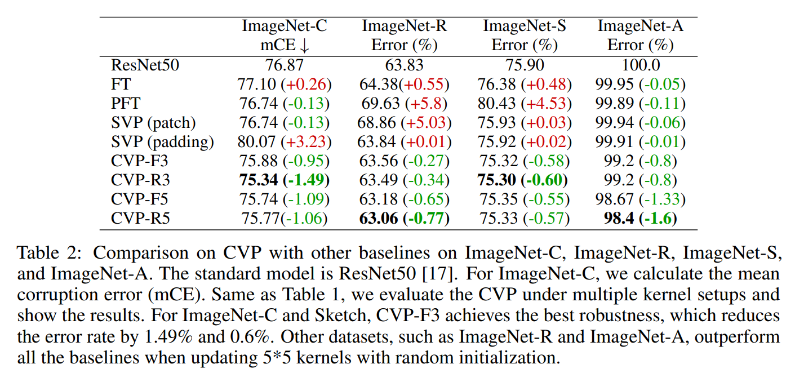
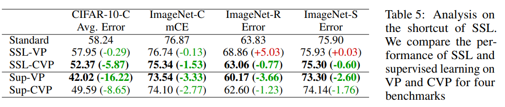
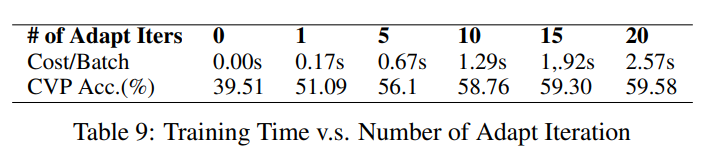

논문 및 이미지 출처 : <https://proceedings.neurips.cc/paper_files/paper/2023/file/58be158bf831a706b1a66cffbc401cac-Paper-Conference.pdf>

# Abstract

- Vision models 는 종종 out-of-distribution (OOD) samples 에 취약(vulnerable)하며, 이를 수정하기 위해 adaptation 이 필요.
- visual prompts 는 large-scale vision models 에 input space adaptation 의 lightweight method 를 제공하지만, high-dimensional additive vectors 와 labeled data 에 의존
- 이는 label 이 없는 self-supervised test-time setting 에서 model adapting 할 때 overfitting 을 초래

---

- 저자는 robust visual perception 을 위해 label-free test-time adaptation 을 위해 convolutional visual prompt (CVP)를 소개
- CVP 의 structured nature 은 standard visual prompts 에 비해 1% 미만의 fewer trainable parameters 를 요구하여 overfitting 을 방지
- 다양한 OOD visual perception tasks 에 대한 광범위한 실험과 분석을 통해 저자의 접근 방식이 효과적이며 여러 large-scale models 에서 최대 5.87% 까지 robustness 를 향상시킴

# 1. Introduction

Deep model 은 in-distribution data 에서 test 할 때 인간을 능가하지만, unforeseen out-of-distribution (OOD) data, 예로, unexpected corruptions 및 shiftings 을 만날 때 성능이 급락.

- 이러한 취약성은 특히 safety-critical applications 및 high-stakes tasks 에서 이러한 model 이 배포될 때 심각한 위험을 초래
- 이전 연구들은 training time 에 OOD data 에 대한 generalization 향상 방법을 연구했으나, test time 에 OOD data 에 model apdating  연구는 거의 없었으며, 대부분은 model weight 수정을 필요로 함

---

Visual prompting 은 test time 시 model 을 수정하지 않고 adapting 하는 효율적이고 경량화된 방법으로 등장 (adversarial reprogramming)

- 이는 model 전체 weight 를 fine-tuning 하는 것과 달리, input space 에서 context 를 제공하여 model 의 original task 를 수정할 수 있음
- fewer OOD samples 를 요구하고, 실용적인 applications 에서 model version management 를 단순화
- 하지만 OOD samples 는 label 있어야 하므로, 이러한 방법은 예상치 못한 distribution shift 에 대처할 수 없음.

---

최근 연구는 test time 시 self-supervised loss 를 minimizing 함으로써 "reversal vectors" 라는 high-dimensional prompt vectors 를 input 에 직접 추가하며 adversarial input 을 복구하여 unseen attacks 에 방어한다.

하지만, (given bound 내에) 임의의 양 의 pixel 에 damage 를 입히는 adversarial attacks 과 달리, structured changes 는 unstructured high dimensional vector prompts 로는 효과적으로 처리되지 않는다.

self-supervised objective 는 종종 shortcut 과 trivial solutions 를 가지므로, right structures 가 없는 prompt 는 성능 향상을 최소화하는 경우가 많음.

---

이 논문은 test time 시 visual OOD samples 에 adapting 하기 위한 inductive bias 로 convolutional structure 를 사용하는 **Convolutional Visual Prompt (CVP)** 를 제시

- 이전 연구는 convolutional operations 가 local motifs 가 있는 structured data 를 처리하는 데 효과적임을 보여줌.
- 이에 영감을 받아 CVP 는 small tunable parameters 를 가진 convolutional kernels 로, 전형적인 unstructured visual prompts 의 1% 미만의 parameter 만 사용하여 매우 경량화되고 효율적 (Fig. 1)

저자의 실험은 self-supervised adaptation 을 위한 structured inductive bias 의 중요성을 보여줌: high-dimensional free-form visual prompts 와 비교하여, low-rank structured prompts 는 견고성을 3.38% 향상시키며, CIFAR-10-C 에서 convolutional structure 를 가진 prompt 는 low-rank prompt 보다 2.94% 더 우수

ImageNet-Rendition, ImageNet-Sketch, 및 CIFAR-10 과 ImageNet 의 15 types unforeseen corruptions 에서 CVP 는 인기 있는 large-scale visual models (ResNet50, WideResNet18, CLIP 등)에서 견고성을 5.87% 향상

저자의 방법은 input space 를 수정하므로, established test-time model weight adaptation 방법과 보완할 수 있으며, multiple self-supervised objectives 에 일반화할 수 있다.

# 2. Related Work

#### Domain Generalization

- OOD data 는 machine learning models 의 성능을 크게 저하시킬 수 있음.
- Domain generalization (DG)는 training 시 target domain data 를 알지 못한 채로 OOD samples 로 model 을 adapting 하는 것을 목표로 함
- OOD data 에 model apdating 하는 것은 또한 견고성을 향상시킴.
- Test-time adaptation 은 distribution shift 에 대한 robustness 를 위한 새로운 패러다임으로, 주로 deep models 의 weight 를 업데이트
- BN : batch normalization statistics 를 사용하여 model 을 업데이트하고, TENT 는 각 batch 의 conditional entropy 를 minimizing 하여 model weight 를 adapting
- TTT : rotation prediction 을 위한 auxiliary self-supervision model 로 training 하고 SSL loss 를 이용하여 model 을 adapting 하는 시도
- MEMO : single sample 을 augment 하고 augmented samples 의 marginal entropy model 을 adapting
- Test time transformation ensembling (TTE) : fixed transformations set 으로 image 를 augment 하고 averaging 을 통해 outputs 를 ensembling
- model 을 update 하지 않는 두 task 는 [Adversarial attacks are reversible with natural supervision., Robust perception through equivariance] 로, OOD sample 이 아닌 adversarial sample 의 pixel 을 수정하여 self-supervised objectives 를 minimizing

#### Visual Prompting

prompting 은 NLP 분야에 specific task 에 맞게 model 을 adapting 하기 위해 context 를 제공하기 위해 제안.

- 이 아이디어를 활용하여, visual prompt 는 vision task 와 foundation model 을 위한 input space 에서 small trainable parameters 로 model 을 adapting
- 다른 연구들은 target classification task 를 위해 model repurpose 를 로 adversarial perturbations sample 을 prompt 하는 것을 제안
  - 이를 _Adversarial Reprogramming_ 이라 함
- Black-box adversarial reprogramming : limited data 로 downstream classification task 를 위해 black-box model 을 reprogramming
- V2S : time-series data classification task 를 위해 speech recognition model 을 reprogramming
- Robust visual prompts : attack 하에 model 의 adversarial robustness 를 향상시키기 위해 training 에 tuning
  - 그러나 이 연구는 distribution 이  분포가 자연적으로 변동되는 domain generalization 에 아직 적용되지 않음.

#### Self-supervised learning (SSL)

SSL 은 annotations 없이 image 를 통해 효과적인 representation 학습

- 이전 연구들은 다양한 pretext tasks (jigsaw puzzles, rotation prediction, image colorization 및 deep clustering) 에서 학습된 representation 이 image classification, object detection 및 test-time domain adaptation 등 여러 downstream task 에 활용될 수 있음을 보여줌
- SSL 의 또 다른 잘 알려진 분파는 contrastive learning 으로, sample transformation 에 대한 관련 feature 를 그룹화하고 dataset 에서 다른 비슷하지 않은 sample 과는 거리를 두는 것을 목표로 함
- 일부 방법들은 outlier detection 을 위해 SSL 을 사용하며, 이는 일반화 가능한 OOD features 를 학습하고 test-time 에 이를 거부하는 것을 목표로 함.
- training phase 에서 target domain distribution 에 대한 정보를 요구하는 이러한 방법들과 달리, 저자의 방법은 test phase 에서 예기치 않은 domain 에 대한 정보를 요구하지 않고 model adapting 가능

# 3. Test-Time Convolutional Visual Prompting

## 3.1 Learning Intrinsic Structure with Self-Supervision Task

OOD data 에 대한 model robustness 를 향상시키는 표준 방법은 training robust 이다.

- 여기서 training algorithm 은 inference time 에 발생할 수 있는 corruption 과 distribution shifts 를 예상하고 이에 대해 training 한다
  - 그러나 test-time shifting 을 예상하는 것은 real world 에서 종종 비현실적인 강한 가정
  - 따라서 저자는 unforeseen corruption 및 unknown shifts 에 동적으로 적응하여 test time 에 robustness 를 향상
- inference time 에 model adapting 의 이상적인 경우는, target task 의 ground truth label 을 아는 것이지만, test data 는 label 이 없기 때문에 이는 불가능
  - unlabeled 에 대한 downstream classification tasks 의 성능을 크게 향상시키기 위해서는 target classification task 와 rich information 을 공유하는 적절한 self-supervision task 를 선택해야 함.
- training time 에 representation learning 을 위한 good self-supervision tasks 에 대한 많은 연구가 있음
  - 예로, jigsaw puzzles, rotation prediction, image colorization 및 deep clustering 은 image classification, object detection 및 test-time domain adaptation 같은 여러 downstream task 에 적용될 수 있음
- visual recognition 의 경우, 인기 있는 self-supervised objective 는 contrastive learning 으로, same image transformation  의 feature 을 nearby place 에 mapping 하는 representation 을 학습, 이는 다음과 같이 공식화:

$$
\begin{equation}
    \mathcal{L}_s(x) = -\mathbb{E}_{i,j} \left[ y^s_{i,j} \log \frac{\exp(\cos(z_i, z_j)/\tau)}{\sum_k \exp(\cos(z_i, z_k)/\tau)} \right],
\end{equation}
$$

- $z$ : pre-trained backbone 의 extrected $x$ contrastive features
- $y^s_{i,j}$ : positive pairs 및 negative pairs 를 나타내는 0-1 vector
  - 만약 $y^s_{i,j}$ 가 1 이라면, $i$-th feature $z_i$ 및 $j$-th feature $z_j$ 는 모두 $x$ sample 에서 나온 것이며, 그렇지 않으면, 다른 $x$ 에서 나온 것이다.
  - $\cos(·, ·)$ : cosine similarity
  - $\tau$ : temperature scaling value
- 저자는 contrastive loss 를 사용하여 SSL model $\mathcal{C}$ 의 parameter 를 optimizing
  - training 을 위한 objective function 은 $\min_{\theta_\mathcal{C}} \mathbb{E}_{(x) \sim \mathcal{X}_s}[\mathcal{L}_s(\cdot)]$ 로 정의
  - $\mathcal{X}_s$ : training 을 위한 source domain data
  - 저자는 non-corruption dataset 에서 가져온 clean samples 에서만 training
  - 저자는 이 task 를 ablation study 에서 other self-supervised tasks 와 비교

training time 에 self-supervised task 를 training 하기 때문에, self-supervised task 는 training 과 동일한 distribution 의 test data 에서 높은 성능을 발휘한다. 저자의 결과는 test 시 distribution shift 에서 self-supervised task 의 성능이 크게 떨어지는 것을 발견 (Fig. 2)

- 이는 self-supervised task 에 유용한 정보가 classification performance 하락 외에도 부수적으로 corrupt 된다는 것을 시사

이전 연구들은 self-supervised tasks 와 perception task 간의 상당한 mutual ionformation 을 보여주며, self-supervised task 로 pre-training 하면 recognition task 의 성능이 향상됨을 입증.

저자는 inference 시 self-supervised loss 를 minimizing 하도록 model 을 adapting 하는 것을 제안하며, self-supervised task 는 recognition task 에서 많은 정보를 capture 하는 proxy. self-supervised task 의 information 을 복구하면서, distribution shifts 로 인한 corrupted perception tasks 의 정보를 복구할 수 있다.

## 3.2 Test-time Adaptation for Vision Models

- inference time adaptation 은 model 이 new distribution 의 고유 특성에 online 으로 adapting 할 수 있도록 한다.
  - 하지만 핵심 문제는 저자가 model adapting 을 위해 사용하는 SSL objective 가 proxy 로, 종종 loss 를 줄이지만 model 을 잘못된 방식으로 adapting 시키는 trivial solution 이 있다는 것
  - foundation models 를 포함해 vision model 을 adapting 하기 위한 몇 가지 확립된 방법이 존재

#### Finetuning (FT)

FT 는 deep model을 adapting 하는 standard way.

- 이는 종종 deep models 의 all parameters 또는 partially 를 optimizing 하며, 이는 무거우며 모델을 re-initializing 및 updating 하기 위해 large space 가 필요
- 이전 연구는 supervised task 에서 fine-tuning 될 때 이 방법이 효과적임을 보여주지만, 몇 가지 예에서 self-supervised task 로 adapting 하는 것에는 충분한 탐구가 되지 않았음
- 저자는 self-supervised task 를 사용한 finetunig 방법을 논의

#### Partial Finetuning (PFT)

PFT 는 batch-normalization layer 의 statistics 만 변경하여 inference 시 model 을 adapting 하는 다른 방법

- 이 방법은 test data 와 mean 과 standard deviation 에서 distribution 가 drift 하며 test-time adaptation 을 통해 이를 회복할 수 있다 가정.
- 가장 가까운 기존 작업은 BN, Tent 및 MEMO.
- Tent : BN statistics 를 업데이트하지만 same distribution 에서 계속 training 해야 함
- MEMO : single test data point 만 필요하지만, 전체 model update 와 heavy augmentations 로 인해 알고리즘이 느림

여기서 저자는 제안된 contrastive learning-based self-supervised loss 를 통해 batch normalization 을 adapting

#### Visual Prompts (VP)

VP 는 pre-trained models 를 adapting 하기 위한 lightweight way 로 등장

- vision model 에 visual prompt 를 적용하는 두 가지 방법 존재
  - image $x$ 로 두고, input image 에 vector $v$ 를 추가: $x = x + v$
  - low-rank visual prompt 의 경우, optimizing 중 $v$ 에서 low-rank matrix 사용
- 대부분 visual prompt 는 training setting 에 연구가 되어, inference time 에는 탐구되지 않음.
- [Adversarial attacks are reversible with natural supervision., Robust perception through equivariance] : adversarial perturbation 을 수정하고 model reobustness 향상을 위해 image 에 추가 visual prompt 를 optimizing

## 3.3 Adapting via Convolutional Visual Prompts

self-supervised objective 에 대한 trivial solution 을 피하기 위해 right structure 을 추가하는 것이 효과적인 방법.

저자는 이제 test distribution 에 적응하도록 deep model 을 안내하는 Convolution Visual Prompts (CVP) 를 소개

- convolution 은 visual task 에 성공적인 inductive bias 로 증명되었으며, sample efficient.
- 저자의 가정은 image data 에서 large family distribution shift 가 visually structure 되어 있으며, 이를 convolution 으로 modeling 할 수 있다는 것.
- 저자의 prompt 는 간단하며 다음과 같이 정의:

$$
\begin{equation}
    x = x + \lambda \text{conv}(x, k)
\end{equation}
$$

- convolutional prompt 의 주요 장점 중 하나는 prompt 의 parameter 수가 다른 prompt (e.g., patch prompt 및 padding prompt) 보다 상당히 적다는 것 (1%)
- full model weight adapting 과 비교하여, 저자의 방법은 visual distribution shifts 의 구조를 활용하여 경량화되고 빠름.
- 저자의 lightweight adjustment 는 과도한 계산 및 메모리 오버헤드 없이 model 이 novel data points 에 빠르게 업데이트할 수 있도록 함.
- vision model 이 엣지 장치에 지속적으로 배포됨에 따라 제한된 컴퓨팅 자원을 고려할 때 이는 매우 중요.

# 4. Experiments

이 섹션에선 실험 설정의 세부 사항을 설명하고 기존 VP 및 기존 test-time approach 와 비교하여 CVP 의 성능 평가

CVP 에 대한 포괄적인 연구를 수행하며, 여기에는 다양한 prompt 설계, kernel vs structure analysis, 여러 SSL task, batch size 및 adapt iteration 에 대한 sensitivity analysis, GradCam visualization 및 CVP 의 optimization cost 포함

## 4.1 Experiment Setting

#### Dataset.

우리 방법은 5 OOD dataset 에서 평가: CIFAR-10-C, ImageNet-C, ImageNet-R, ImageNet-Sketch, 그리고 ImageNet-A.

- **Synthesis OOD Data**: corruption data 는 real-world corruption 을 시뮬레이션하기 위해 다양한 유형의 변환(e.g., snow, brightness, contrast)으로 합성
  - dataset 에는 CIFAR-10-C 와 ImageNet-C 가 포함
  - 둘 다 original dataset 의 corruption version 으로, 15 corruption types 와 5 severity levels 가 포함
  - larger severity level 은 데이터에 more corruption 이 추가됨을 의미
  - 저자의 방법을 잘 평가하기 위해, 각 15 corruption types 에 대해 공식 GitHub 코드를 기반으로 5 severities samples 생성
- **Natural OOD Data**: ImageNet-Rendition 은 Flickr 에서 수집된 ImageNet 의 200 object classes 의 특정 유형이 포함된 30,000 images 포함
  - ImageNet-Sketch dataset 은 50,000 sketch images 포함
  - ImageNet-Adversarial 은 natural world 에서 수집된 7,500 images 가 포함된 natural adversarial shifting dataset

#### Model.

backbone model architecture 는 CIFAR-10-C 를 위해 WideResNet18 과 ResNet26 에 pre-training 됨

- ImageNet-C, Rendition, Sketch 를 위해서는 ResNet50 에 pre-training 됨
- 저자는 SSL model training 을 위해 backbone model 의 fully connected layer 전에 logit features 를 추출
- SSL model 은 contrastive learning task 를 위해 one-dimensional features 을 추출하는 단순한 MLP
- 저자는 또한 prompt 방법을 foundation CLIP model 로 확장하여, vision encoder 만 prompting

#### Baseline Details.

저자는 CVP 와 여러 test-time adaptation benchmarks 를 비교

- **Standard**: baseline 은 adaptation 없이 pre-trained model 을 사용
  - CIFAR-10-C 의 경우, baseline 은 WideResNet18 과 ResNet 에서 50,000 clean CIFAR-10 training dataset 으로 훈련됨
  - ImageNet1K-C 의 경우, baseline 은 ResNet50 에서 약 1.2M clean ImageNet training dataset 으로 훈련
- **Finetune (FT)**: 저자는 self-supervised loss 로 inference time 동안 다가오는 모든 batch 를 위해, full model weight 를 조정
  - 실험에서, one-batch fine-tuning 후, model 은 initial weight status 로 복원되고 new type 의 corruption sample 을 받음
- **Partial Finetune (PFT)**: partial fine-tuning 은 inference time 마다 batch normalizationl ayers 만 조정하여 model 에 sample batch 를 adapting 시킴
  - finetuning baseline 과 마찬가지로, model 은 one-batch adaptation 후 initial weight status 로 복원
- **SVP**: contrastive loss 를 통해 optimizing 된 $\ell_p$-norm perturbation 으로 adversarial sample 을 수정하여 adversarial attacks 을 역전시키는 prompt method
  - 저자는 patch 와 padding 의 두 prompt setting 으로 이 방법 확장
  - patch setting 의 경우, input 에 perturbation 의 전체 크기 patch 를 직접 추가
  - padding setting 의 경우, perturbation 의 프레임을 input outside 에 포함

#### Design of Convolutional Visual Prompts (CVP)

저자는 convolutional kernels 를 추가해 input samples 를 prompting 함.

- 여기서 1.) fixed or random kernel initialization, 2.) 3\*3 or 5\*5  kernel sizes 포함
- 실험 결과 all kernel setups 평가를 보여줌
  - initialization 의 경우, 저자는 kernel size $k$ 를 uniform distribution or fixed values 로 초기화 가능
  - fixed initialization 의 경우, sharpness kernel 에서 시작하는 것이 효과적임을 경험적으로 발견
- 저자는 projected gradient descent 의 1 to 5 interations 로 optimizing
- 원래 구조를 보존하기 위해, 저자는 input 과 convolved output 을 learnable parameters λ 로 결합
- 저자는 convolutional kernel $k$ 와 λ 를 self-supervised loss $\mathcal{L}_s$ 로 jointly optimizing
- λ 의 범위는 predefine 되어 있으며 경험적으로 고정된 범위로 설정
  - CIFAR-10-C 의 경우, 범위는 [0.5, 3] 로 설정되고, 
  - ImageNet-C 의 경우 [0.5, 1] 로 설정

## 4.2 Experimental Results

Tab. 1 은 CIFAR-10-C 에서 CVP 의 평가 결과를 보여줌

- 저자는 standard, VP (patch/padding), fine-tuning (FT), partially fine-tuning (PFT) 과 같은 5 baselines 와 2 models 를 사용하여 CVP 를 비교
- 또한, CVP 의 다양한 커널 설정 (fixed/random initialization 및 different kernel sizes) 을 탐색
- 결과에 따르면, WideResNet18 에서 CVP 는 random initialized 3\*3 kernel 을 업데이트할 때 average error rate 가 5.87% 로 가장 크게 감소
- ResNet-26 의 경우, CVP 는 일관되게 error rate 2.8% 줄임.

Tab. 2 는 ImageNet-C, Rendition, Sketch, 및 Adversarial 에 대한 결과

- standard baseline 은 ResNet50 에 pre-trained
- ImageNet-C 의 경우, ResNet50 과 표준 AlexNet 의 성능 비율을 기준으로 average corruption error (mCE) 를 report
- ImageNet dataset 의 larger dimension (224) 때문에, larger kernel size 가 input 에서 더 많은 정보를 효과적으로 capture
- 따라서, 커널 크기를 3*3 및 5*5로 설정했습니다. 우리의 결과는 CVP가 랜덤 초기화된 5*5 커널로 업데이트할 때, ImageNet-R과 A에서 각각 0.77% 및 1.6%로 가장 높은 오류율 감소를 달성한다는 것을 나타냅니다. CVP는 ImageNet-C와 Sketch에 대해서도 모든 기준선을 일관되게 능가합니다. VP(패치)와 VP(패딩)는 대부분의 데이터셋에서 성능을 저하시켜, 더 많은 학습 가능한 파라미터를 가진 비구조적 섭동이 일반적인 OOD 데이터의 자연적 이동에 적응하는 데 비효과적임을 시사합니다.

**테이블 3**에서는 대규모 기초 모델인 CLIP [52]에서 CVP의 성능을 추가로 평가합니다. 기준선 VP(패딩) 및 VP(패치)와 비교할 때, CVP는 랜덤 초기화된 5*5 커널 크기로 업데이트할 때 모든 데이터셋에서 최고의 성능을 달성합니다.

#### CVP Complements Other Test-Time Adaptation Methods

저자의 방법은 input space 를 수정하고 adapted samples 의 representation 을 original manifold 에 정렬하기 때문에, model weight 를 조정하는 기존의 test-time adaptation approach 도 보완. 따라서, 저자는 CVP 를 MEMO, BN, TENT 와 같은 여러 기존 방법과 결합. 

- 공정한 비교를 위해 모든 실험에서 batch size 를 16 으로 설정
- parameter setting 의 경우, CIFAR-10-C 에 대해 3\*3 kernel size 로, ImageNet-C, R, S, A 에 대해서는 5\*5로 설정
- adaptation iteration 는 모두 5

Tab. 4 는 5 benchmarks 에 대한 결과를 보여줌

- CVP 는 TENT 를 1.83 points 향상시키고 표준 방법과 비교하여 error rate 21.55% 감소
- other datasets 에서도, CVP 는 TENT 방법 위에서 lowest error rate 달성
- 그러나, BN 방법은 small batch settings 성능 저하

# 5. Ablation Study

#### SSL Objective 와 Shortcut 회피를 위한 Low-Rank

SSL (Self-Supervised Learning) objective 는 visual recognition task 의 proxy 이기 때문에, SSL objective 만을 minimizing 하는 것은 overfitted prompt 를 생성할 수 있으며, visual recognition 의 향상에는 크게 기여하지 않을 수 있다. 

이러한 suboptimal 을 피하기 위해서는 적절한 inductive bias 을 추가하는 것이 일반적인 방법이다.

highly structured visual data 의 경우, adaptation 중 shortcut 방지를 위해 추가할 수 있는 best inductive bias 연구

---

convolution 외에도, 저자는 SVD (singular value decomposition)를 통한 low-rank structure visual prompt (LVP) 조사.

low-rank matrices 를 optimizing 하는 알고리즘(algorithm 2) 을 사용하여 LVP 를 생성하고, natural corruption 을 reverse 하는 능력에 대해 low-rank prompt 와 convolution 을 비교

Tab. 6 및 Fig. 3 에서, LVP 와 CVP 모두에서 prompt rank 가 증가할수록 corruption 을 reverse 하여 clean image 를 생성하는 성능이 저하되며, real shifting 과 approximated shifting 간의 $\ell_2$ norm distance 가 증가하는 것을 확인

#### CVP in Supervised Learning

SSL 은 final task 의 proxy 이기 때문에 test-time adaptation 을 위해 CVP 가 필요.

SSL 을 최소화하지만, final task 의 성능이 suboptimal.

Tab. 5 에서 supervised learning setting (Sup-VP 및 Sup-CVP) 과 SSL setting (SSL-VP 및 SSL-CVP) 에서 VP 와 CVP 를 비교

- 모든 실험에서 Tab. 4 와 동일한 optimization setting 및 parameters 를 사용했으며, supervised setting 에선 각 batch 에 prompt 를 적용하고 ground truth 로 update
- ground truth 로 학습했기 때문에, VP 와 CVP 모두 SSL 보다 높은 정확도를 달성했으며, VP 가 CVP 보다 높은 성능을 보임
- 이는 label 이 없는 경우, structured convolutional prompt 가 성능 향상에 필요함을 보여줌

#### Generalize CVP to other SSL tasks.

CVP 는 다른 self-supervision task 로 일반화될 수 있음을 보여줌. 

Tab. 7 에서는 contrastive learning, rotation prediction 및 masked autoencoder (MAE) 등 3 SSL task 에서 CVP 의 성능을 비교

- 모든 SSL task 에서 CVP 가 ImageNet-C 의 모든 severity level (s1~s5) 에서 robust accuracy 가 향상시킴을 확인.
- contrastive learning 이 rotation prediction 보다 더 나은 성능을 보였고, MAE 가 가장 좋은 성능을 보임.

#### Batch Size 및 Adaptation Iteration 수의 영향

Figure 4(a) 에서는 batch size 가 다양한 prompt 방법의 성능에 미치는 영향을 실험적으로 보여줌.

- batch size 를 2, 4, 8, 16, 32 로 설정하고 Finetune, VP (patch), VP (patch) 와 CVP 의 정확도를 비교
- batch size 가 2일 때, Finetune 의 성능은 36.95% 로 CVP (71.53%) 보다 낮았음.
- batch size 를 4와 8 로 늘리면 Finetune 과 VP 의 성능이 약간 향상되지만 여전히 CVP 보다 낮음.
- 전반적으로 CVP 는 small batch setting 에서 adaptation 에 우위를 보임.

Figure 4(b) 에서는 adaptation iteration 횟수에 따른 성능을 보여줌.

- iteration 횟수가 증가할수록 CVP 는 self-supervised objective 에 overfitting 될 위험이 낮아짐을 실험적으로 확인

#### Saliency Map 의 Visualization

CVP 가 corrupted input 에 adapting 하는 방식을 더 잘 이해하기 위해 다양한 유형의 손상에 대한 saliency map 을 시각화.

Fig. 5 에서 왼쪽에서 오른쪽으로 첫 번째 행은 original, corrupted, adapted samples; 두 번째 행은 predicted labels 에 대한 Grad-CAM.

- Grad-CAM 의 빨간 영역은 모델이 타겟 입력에 집중하는 부분을 강조.
- corrupted sample 에서 heap map 이 target object 에서 초점을 잃는 것을 실험적으로 발견
- CVP 이후, adapted sample 의 heap map 의 빨간 영역이 원본 이미지와 유사한 부분에 다시 초점을 맞추며, self-supervised visual prompt 가 input adaptation 을 개선하고 모델이 올바른 영역에 다시 집중하게 만듦

#### Training Cost v.s. Different Kernel Size

Tab. 8 에서는 CVP 의 다양한 kernel size 를 평가하고, kernel size 를 적절하게 증가시키면 성능이 약간 향상될 수 있음을 실험적으로 확인

- one corruption-type impulse noise 를 선택하여 결과를 보여줌.
- kernel size 를 증가시키면 optimization cost 가 증가
- impulse noise 의 경우, kernel size 7\*7 이 가장 높은 robust accuracy 를 달성했지만 optimization cost 가 훨씬 높음.

#### Training Time v.s. Number of Adapt Iteration

Fig. 4(b) 에서는 adaptation iteration 횟수에 따른 CVP 의 성능을 보여줌.

- adaptation iteration 횟수가 증가할수록 training time 이 증가.

Tab. 9 에서는 CIFAR-10-C 의 gaussian noise type with severity 1 에 대한 결과를 보여줌

- adaptation iteration 횟수 (0 to 20) 에 따른 accuracy 와 batch 정확도와 per batch training time 비교
- CVP 는 몇 epoch (1 epoch) 만으로도 VP 보다 더 큰 성능 향상

#### CVP 가 Corrupted Images 를 Normal One 으로 Reverse 하는가?

Sliced Wasserstein Distance (SWD) 및 structural similarity index measure (SSIM) 를 통해 distribution distance 측정.

저자는 두 input distributions 간의 distance 를 측정: source domain distribution 및 target domain distribution (before/after CVP adaptation)

SWD 를 통한 두 input distribution 간의 거리를 계산하기 위해, high dimensional probability distribution 을 linear projection 을 통해 group 의 marginal distribution 을 얻은 다음, 해당 marginal distribution 에 대해 $p$-Wasserstein Distance 를 계산

Tab. 10 과 Fig. 6 에서 severity 1 의 CIFAR-10-C 에 대한 SWD 결과를 보여줌.

- 평균적으로 CVP 는 adaptation 후 더 낮은 SWD 를 달성하여, adaptation 후 target distribution 이 source distribution 에 더 가까워짐을 의미
- prompting 후 average SWD 는 0.7% 감소

# 6. Conclusion

Self-supervised convolutional visual prompt (CVP) 는 OOD samples 의 test-time adaptation 을 위한 새로운 방법.

- 기존 label 을 사용해 visual prompt 를 훈련하는 방식과 달리, CVP 는 label 이 필요없으며 경량화 됨.
- 이전 visual prompt 의 1% 미만의 learnable parameters 를 사용하여, test time  ㅔ self-supervised objective 를 adapting 할 때 overfitting 의 위험을 피할 수 있음
- 5 SOTA benchmark 의 결과는 CVP 가 model 의 robustness 를 5.87% 향상시키며, 기존의 weight-adaptation 방법을 보완함을 보여줌.
- 광범위한 ablation study 에 따르면 distribution shifts 는 실제로 구조화되어 있으며, 따라서 CVP 는 adapting 중에 VP 보다 구조를 더 잘 포착
  - 이는 visual prompt 기술과 test time 에 adapting 에 새로운 통찰력을 제공