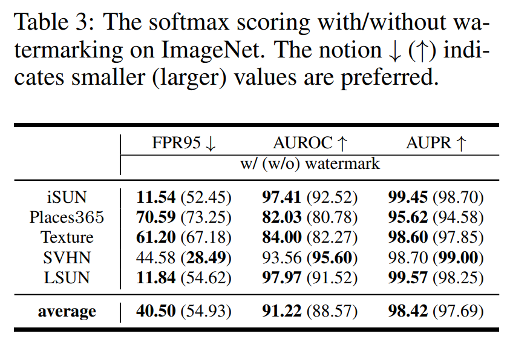
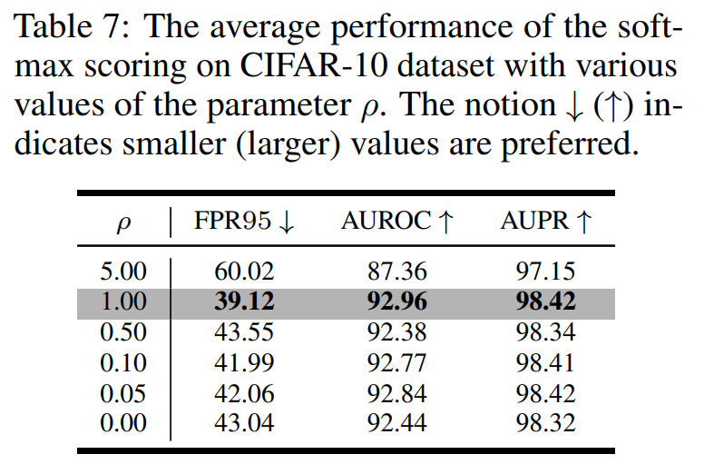
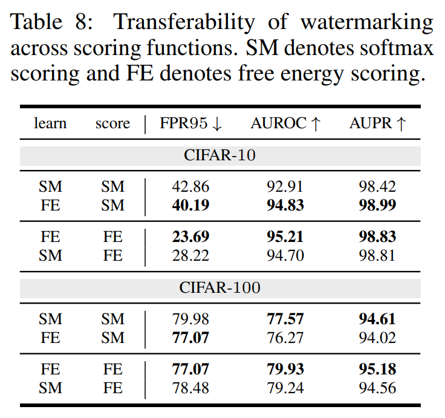

논문 및 이미지 출처 : <https://proceedings.neurips.cc/paper_files/paper/2022/file/63fa7efdd3bcf944a4bd6e0ff6a50041-Paper-Conference.pdf>

# Abstract

_out-of-distribution_(OOD) detection 은 well-trained deep models 에서 추출된 representation 을 기반으로 OOD data 를 식별하는 것을 목표로 한다.

그러나 기존 방법들은 deep models 의 _reprogramming_ property 를 크게 무시하고 있어, intrinsic strength 를 완전히 발휘하지 못할 수 있다.

well-trained deep models 의 parameters 를 수정하지 않고도 data-level  data  수준의 manipulation (e.g., data 에 specific feature perturbation 을 추가)을 통해 이 model 을 new purpose 로 reprogramming 할 수 있는 것이다.

이 특성은 classification model 을 OOD detection (new task)에 뛰어나도록 reprogramming 할 수 있다는 동기를 부여하며, 이에 따라 이 논문에서 watermarking 이라는 일반적인 방법론을 제안한다.

구체적으로, original data 의 features 에 겹쳐지는 unified pattern 을 학습하며, watermarking 후 model 의 detection 능력이 크게 향상된다.

광범위한 실험을 통해 watermarking 의 효과를 검증하고, OOD detection 에서 deep models 의 reprogramming 특성의 중요성을 입증한다.

# 1. Introduction

open-world 에서의 deep learning 은 종종 training data (i.e., in-distribution (ID) data) 의 label space 와 겹치지 않는 out-of-distribution (OOD) input 에 직면하게 된다.

안전이 중요한 응용 프로그램에서는 deep models 가 ID data 에 대해 신뢰할 수 있는 예측을 제공하는 동시에, OOD data 를 감지하고 detected data 에 대해 예측을 피하는 것이 중요하다.

이는 OOD detection task 으로 이어지며, 이는 real world 에서 많은 주목을 받고 있다.

OOD data 식별은 여전히 어려운 과제다. deep models 은 OOD data 에 대한 overconfident 을 가질 수 있기 때문이다. 유망한 기술로, _classification-based_ OOD detection 은 ID data 로 well-trained classification model 에서 파생된 various scoring function 을 이용하여, small scores 를 가진 input 을 OOD case 로 간주한다.

일반적으로, scoring function 은 logit outputs, gradients, embedding features 등으로 정의될 수 있다.

well-trained model 을 방해하거나 extra computation 을 요구하지 않고, 이러한 function 은 ID data 로부터 학습된 model 의 inherent capability 를 활용한다. 일반적으로, 이러한 장점은 re-training cost 가 매우 높고 true OOD data 를 획득하기 어려운 현실에서 중요하다.

---

기존 연구는 deep models 의 _reprogramming_ property 를 크게 무시하고 있다. well-trained model 은 original inputs 의 proper transformations (e.g., universal feature perturbation) 통해 new task 에 reprogramming 될 수 있다.

예로, ImageNet dataset pre-trained model 이 생물 의학 이미지를 분류하는 데 reprogramming 될 수 있다. 이 property 는 well-trained model 을 효과적인 OOD detection 에 adapting 할 가능성을 시사한다. 따라서 저자는 deep models 의 reprogramming 특성이 OOD detection 에 도움이 될 수 있는지 조사하고자 처음으로 시도한다.

본 논문에서는 original inputs 에 watermark 를 추가하여 well-trained model 을 reprogramming 하는 새로운 방법을 제안한다. _watermark_ 는 original inputs 과 동일한 shape 를 가지며, test-time input 에 추가할 수 있는 static pattern 이다 (Fig. 1).

pre-trained scoring strategy (e.g., free energy scoring) 을 강화하여 watermarked ID 와 OOD data 간의 OOD scores gap 을 확대한다 (Fig. 2).

unseen OOD data 에 대한 knowledge lack 으로 인해 proper watermark 를 찾는 것은 쉽지 않다. 이를 해결하기 위해 저자는 효과적인 watermarking 을 위한 learning framework 를 제안한다.

insight 는 well-trained model 이 watermarked ID inputs 에 대한 high scores 를 생성하면서, 동시에 model 이 ID pattern 을 인식하지 못한 경우에는 low confidence 를 반환하도록 regularizing 하는 것이다.

이 경우, model 은 watermarked ID input 에 대해 상대적으로 high score 를 가지며, OOD data 에 대해선 low 를 유지한다 (Fig. 2). 이 이유는 model 이 watermarked input 을 접하지만 ID pattern 을 보지 못했기 때문이다.

저자의 구현은 여러 representative scoring strategies 를 채택하고, specified learning objective 를 설계하며, 효과적인 watermarking 을 학습하기 위한 optimization algorithm 을 제안한다.

watermarking 이해를 위해, Fig. 1 의 CIFAR-10 dataset 에서 학습된 watermark 와 free energy scoring 표기한다.

- learned watermark 의 centre area 는 original input pattern 을 크게 보존하며, detection 을 guide 하는 semantic message 를 포함한다. 
- 반면, original input 의 edge area 는 watermark 의 specific pattern 에 의해 겹쳐지며, 이는 OOD detection 을 활성화하는데 model 에 의해 숨겨진 knowledge 를 _encoding_ 하는 것으로 보인다.

Fig. 2 는 free energy scoring 의 예제인 learned watermark 의 효과를 보여준다.

- watermarking 후, scoring distribution 은 훨씬 집중되고, ID (i.e., CIFAR-10) 및 OOD (i.e., SVHN 및 Texture dataset) data 간의 gap 을 현저히 커지는 것을 볼 수 있다.
- 저자는 다양한 OOD evaluation benchmarks 에 대해 광범위한 실험을 수행했으며, 그 결과는 저자의 제안이 효과적임을 입증한다.

watermarking 의 성공은 다음과 같은 측면에서 기인한다:

1.  well-trained model on classification 은 OOD detection 을 위해 reprogramming 될 가능성이 있다.
2.  reprogramming 은 image classification 에서 time series analysis 까지 연구되어 다양한 domain 에 걸쳐 일반적인 방법이다
3.  OOD detection 은 real-world OOD distribution 에 대한 knowledge lack 으로 더 나빠진다. 다행히,  low dimension data-level 의 manipulation 만으로도 이 문제를 크게 완화할 수 있다.

전체적으로, 이러한 data-level 의 manipulation 은 기존 방법과 직교하며, OOD detection 에서 새로운 길을 제공할 가능성이 있다.

# 2. Related Works

#### OOD Detection

OOD detection 은 지정된 metrics/score 와 관련된 gap 통해 ID 와 OOD data 를 구분하며, 기존 방법은 대략 3 cagegories: _classification-based_, _density-based_, _distance-based_ 로 나눌 수 있다

- _classification-based_ : well-trained model 에서 추출된 representations 를 OOD scoring 에 사용한다.
- _distance-based_ : input 이 embedding space 의 clas center 에서 얼마나 떨어져 있는지를 측정
- _density-based_ : probabilistic models 를 사용하여 input density 를 추정하고, small likelihood values 를 가진 OOD data 를 식별

deistance 및 density-based method 는 complex computation 와 optimization 어려움을 겪을 수 있다. 따라서, 더 많은 연구자들이 classification-based 방법 개발에 집중하고 있으며, 최근 benchmark  dataset 에서 큰 진전을 이루고 있다.

#### Model Reprogramming

model reprogramming 은 data-level manipulation 만으로 well-trained model 을 new task 에 재활용하는 것으로, deep models 의 어떠한 model parameters 도 변경하지 않고 다양한 task 을 수행할 수 있음을 나타낸다.

이전 연구에서 data-level manipulation 은 일반적으로 target task 를 위해 learned static padding (저자의 제안과 다름)을 text-time data 에 추가하는 것을 의미한다.

model reprogramming 의 효과는 image classification 과 time-series analysis 에서 검증되었다. 

본 논문에서는 deep models 의 reprogramming 특성을 효과적인 OOD detection 에 사용한다

# 3. Preliminary

input label $\mathcal{X} \subset \mathbb{R}^d$ 및 label space $\mathcal{Y} = \{1, \ldots, c\}$ 가 있다 하자.

저자는 $\mathcal{X} \times \mathcal{Y}$ 상의 ID distribution $D_{\text{ID}}^{\mathcal{X},\mathcal{Y}}$, 이로부터 독립적으로 추출된 size $n$ 의 training sample $S_n = \{(x_i, y_i)\}_{i=1}^n$, 그리고 $S_n$ 의 well-trained classification model $f : \mathcal{X} \to \mathbb{R}^c$ (logit output)을 고려한다.

model $f(\cdot)$ 을 기반으로, classification-based OOD detection 의 목표는 test-time inputs 가 ID distribution $\mathcal{D}^{\text{ID}}_\mathcal{X}$ 를 갖는지 OOD distribution $D^{\text{OOD}}_\mathcal{X}$ 를 갖는지를 구별할 수 있는 detection model  $g : \mathcal{X} \to \{0, 1\}$ 을 설계하는 것이다.

일반적으로, $D^{\text{OOD}}_\mathcal{X}$ 는 label set $\mathcal{Y}$ 와 intersection 이 없는 irrelevant distribution 으로 정의되며, 따라서 $f(\cdot)$ 에 의해 예측되어서는 안 된다.

전체적으로, OOD case 0 으로, ID case 는 1 로 나타내며, detection model $g(\cdot)$ 는 다음과 같이 정의된다:

$$
\begin{equation}
    g(x; \tau) = 
    \begin{cases} 
    1 & s(x; f) \geq \tau \\ 
    0 & s(x; f) < \tau 
    \end{cases}
\end{equation}
$$

- $\tau \in \mathbb{R}$ : threshold
- $s : \mathcal{X} \to \mathbb{R}$ : fixed parameter $f(\cdot)$ 에 의해 정의된 scoring function

여기선 classification-based OOD detection 의 두 가지 대표적인 방법, 즉 _softmax scoring_ 및 _free energy scoring_ 에 중점을 둔다.

#### Softmax Scoring Function

Softmax Scoring Function 은 OOD detection 에서 maximum softmax prediction 을 사용하며, scoring function $s_{\text{SM}}(\cdot)$ 는 다음과 같이 정의된다:

$$
\begin{equation}
    s_{\text{SM}}(x; f) = \max_k \text{softmax}_k f(x),
\end{equation}
$$

- $\text{softmax}_k(\cdot)$ : softmax outputs 의 $k$-th element
- 일반적으로, $s_{\text{SM}}(x; f)$ 가 크면 input $x$ 를 ID case 로, 작으면 OOD case 로 간주

#### Free Energy Scoring Function

Free Energy Scoring Function 는 logit outputs 와 logsumexp operation 을 사용하여 정의된 free energy function 을 사용하며, 다음과 같이 정의된다:

$$
\begin{equation}
    s_{\text{FE}}(x; f) = \log \sum_k \exp f_k(x) / T,
\end{equation}
$$

- $T > 0$ : temperature parameter 로, 1 로 고정
- 이는 input 의 density 와 어느 정도 일치하여 softmax scoring 보다 overconfidence 문제에 덜 취약하다.

# 4. Watermarking Strategy

#### Definition.

watermark $w \in \mathbb{R}^d$ 는 original inputs 와 동일한 shape 를 가진 unified pattern 이다.

이는 test-time inputs 에 정적으로 추가되며, 저자는 $∀x \in \mathcal{X}$ 에 대해 $w + x$ 를 _watermarked input_ 이라 한다.

expectation 에서, specified scoring function $s(\cdot)$ 에 대해, 저자의 watermarking 은 model 이 watermarked data 에 대해 OOD detection 에 뛰어나도록 해야 한다.

#### Learning Strategy.

scoring function $s(\cdot)$ 이 주어졌을 때, pre-trained rules 에 의해 exact watermark pattern 을 고안하는 것은 어려운 일이다.

따라서, OOD detection 에 proper watermarks 를 위해, 저자는 ID 및 OOD data 를 모두 고려한 학습 목표를 고안해야 한다.

저자는 일반적으로 OOD distribution $D^{\text{OOD}}_{\mathcal{X}, \mathcal{Y}}$ 에 대한 정보를 가지고 있지 않지만, 여전히 model 이 scoring 에서 ID 와 OOD data 를 구별하는 데 뛰어나기를 원한다.

이 어려움을 해결하기 위해, 저자는 watermarked ID data 가 관찰될 때 model 이 high scores 를 생성하게 만들며, 동시에 watermark 가 ID pattern 이 존재하지 않을 때 model 이 low score 를 반환하도록 regularizing 한다.

model 의 관점에서, watermarked OOD input 이 주어지면 score 는 낮아야 한다. 이는 watermark 가 OOD data 를 인식하도록 훈련되지 않았기 때문이며, OOD data 의 patterns 가 ID data 와 매우 다르기 때문이다.

#### Benefits of Watermarking

Watermarking 은 model 을 직접 reprogramming 하여 저자의 specified scoring task 에 adapting 하여 original model 의 detection 능력을 크게 향상시킨다.

반면, 이전 방법들은 일반적으로 Eq. (1) 처럼 오직 threshold $\tau$ 에 의해 specific tasks 에 apdating 한다.

그러나 이는 scoring densities 가 non-separable 할 때 flase positive (ID) 와 flase negative (OOD) rates 사이의 trade-off 을 요구한다 (cf., Fig. 2(a)).

또한, watermarking 은 original classification training procedure 를 수정하지 않기 때문에, 저자의 제안은 real-world system 에 쉽게 배포될 수 있다. 비록 watermark 도 학습되어야 하지만, parameter space 는 low dimension 에 있으며, learning procedure 는 시스템이 배포된 후에 _post-hoc_ 수행될 수 있다.

#### Comparison with Existing Works.

OOD detection 에서 이 논문은 deep models 의 reprogramming property 를 사용하는 첫 시도로, watermarking 이라는 효과적인 learning framework 를 제안한다.

첫눈에 저자의 방법론은 OOD detection 을 위한 data-level perturbation 을 수행하는 ODIN 과 유사해 보이다. 그러나 그들의 instance-specified perturbation 은 test 중 extra backward-forward iterations 를 필요로 하지만, 저자의 방법은 그렇지 않다.

더 나아가, ODIN 은 softmax scoring 을 위해 설계되었지만, 저자의 제안은 OOD detection 에서 훨씬 일반적이다.

# 5. Realizations of Watermarking Strategy

#### Learning Objectives.

앞서 언급한 바와 같이, 저자는 ID 와 OOD situations 를 별도로 고려해야 하며, 관련된 loss function 은 각각 $\ell^{\text{ID}}(\cdot)$ 와 $\ell^{\text{OOD}}(\cdot)$ 로 표시된다.

ID 의 경우, ID training data 가 필요하며, 이들의 watermarkde counterparts 에 대해 high scores 를 받도록 한다. 반면, test-time OOD data 에 대한 knowledge lack 이 많기 때문에, 여기선 watermark 만 사용하며, model 이 watermark 만 인식할 때 점수를 가능한 낮게 만들기를 기대한다.

더욱이, OOD 의 경우 watermark 만 사용하여 training 하므로, learned watermark 는 detection model 에 대해 매우 민감하다. 즉, model 은 small perturbations 에 직면했을 때 다른 예측을 반환할 수 있다. 따라서 watermarked OOD inputs 은 low scores 를 보장받을 수 없을 수도 있다.

이를 해결하기 위해, training 중에 watermark 를 추가로 perturb 한다. 

여기서 저자는 Gaussian noise 를 채택하여, $\epsilon \sim \mathcal{N}(0, \sigma_1 \mathbf{I}_d)$ 인 $d$-dimension 의 _independent_ 및 _identically distributed_ (i.i.d) Gaussian noise (mean 0 및 standard deviation $\sigma_1 \mathbf{I}_d$) 를 사용한 $\epsilon + w$ 형태의 perturbed watermark 를 생성한다.

그런 다음, overall risk 는 다음과 같이 작성:

$$
\begin{equation}
    \mathcal{L}_n(w) = \underbrace{\sum_{n} \ell^{\text{ID}}(x_i + w, y_i; f)}_{{\mathcal{L}^{\text{ID}}_n(w)}} + \beta \underbrace{\sum_{n} \ell_{\text{OOD}}(\epsilon_j + w; f)}_{\mathcal{L}^{\text{OOD}}_n(w)},
\end{equation}
$$

- $\beta \ge 0$ : trade-off parameters
- $\mathcal{L}^{\text{ID}}_n(w)$ : ID data 의 risk
- $\mathcal{L}^{\text{OOD}}_n(w)$ : OOD data 의 risk

#### Optimization.

proper watermark 를 찾기 위해, 저자는 first-order gradient update 를 사용하여 watermark 의 요소를 iteratively update.

그러나 data-level optimization 은 deep learning 에서 여전히 어려우며, 결과가 suboptimal points 에 머무를 수 있다.

일반적인 접근 방식은 first-order gradients 의 signum 를 사용하여 다음을 통해 현재 watermark 의 update rule 을 guiding 하는 것이다:

$$
\begin{equation}
    w \leftarrow w - \alpha \, \text{sign}(\nabla_w \mathcal{L}_n(w)),
\end{equation}
$$

- $\text{sign}(\cdot)$ : sign function
- $\alpha > 0$ : step size

더욱이, generality 와 insensibility 를 위해, 저자는 uniformly low loss (i.e., smooth loss landscape) 를 가진 neighbourhood 에 있는 lies 를 선호한다. 

그러므로, 저자는 low loss value 및 smooth loss landscape 모두를 추구하는 effective optimization framework 인 _sharpness-aware minimization_ (SAM) 를 채택한다.

구체적으로, original risk $\mathcal{L}_n(w)$ 가 주어지면, SAM problem 은 다음과 같다:

$$
\begin{equation}
    \mathcal{L}^{\text{SAM}}_n(w) = \max_{\|\kappa\|_2 \le \rho} \underbrace{\left[ \mathcal{L}_n(w + \kappa) - \mathcal{L}_n(w) \right]}_\text{sharpness} + \mathcal{L}_n(w) = \max_{\|\kappa\|_2 \le \rho} \mathcal{L}_n(w + \kappa)
\end{equation}
$$

- $\rho \ge 0$ : constraint

효율성을 위해, SAM 은 $\kappa$ 에 대해 0 주위의 first-order Taylor expansion 을 사용하여 다음과 같은 근사 해를 얻는다:

$$
\begin{equation}
    \kappa = \rho \, \text{sign}(\nabla_w \mathcal{L}_n(w)) \frac{|\nabla_w \mathcal{L}_n(w)|^{q-1}}{\left( \|\nabla_w \mathcal{L}_n(w)\|_q^q \right)^{1/p}},
\end{equation}
$$

- $1/p + 1/q = 1$ 이며, 단순화를 위해 $p = q = 2$ 로 설정
- 따라서, SAM 의 estimation form 은 $\mathcal{L}_n(w + \kappa)$ 로 작성되며, 이에 대한 updating rule 은

$$
\begin{equation}
    w \leftarrow w - \alpha \, \text{sign}(\nabla_w \mathcal{L}_n(w + \kappa)),
\end{equation}
$$

- 이는 effective watermark 를 유도하는 efficient optimization algorithm 을 제공해줌

#### The Overall Algorithm.

요약하자면, watermarking 의 overall learning framework 를 설명한다.

먼저, watermark 는 mean 0 이고 small standard deviation $\sigma_2 \mathbf{I}_d$ 를 가진 i.i.d Gaussian noise 로 초기화된다.

learning procedure 는 각 updating step 마다 3 stages 로 구성:

- **Negative Sampling**: ID sample 과 동일한 size $m$ 의 mini-barch 에 대해 noise data $\epsilon$ 을 sampling
- **Risk Calculating**: ID 및 OOD data 의 risk 를 계산하고, overall risk 는 Eq. (4) 의 sum 과 trade-off parameter $\beta$ 로 주어진다.
- **Watermark Updating**: first-order 가 pixel-level 의 watermark update 를 guiding 하며, gradient signum 과 SAM 을 사용하여 Eq. (8) 와 같이 reliable update 수행.

learned watermark 는 OOD detection 을 위해 text-time inputs 에 추가되며, pre-defined scoring function 을 사용하는 detection model 이 배치된다.

#### Two Realizations.

여기선 OOD detection 의 두 가지 대표적인 방법, 즉 softmax scoring 과 free energy scoring 에 중점을 두고 설명한다.

**_Softmax Scoring-based Watermarking_**

[Deep anomaly detection with outlier exposure.] 에 따르면 $\ell^\text{ID}_\text{SM}(\cdot)$ 은 cross entropy loss 로 설정하고, $\ell^\text{OOD}_\text{SM}(\cdot)$ 은 uniform distribution 에 대한 cross entropy 로 설정한다. 즉,

$$
\begin{equation}
    \ell^\text{ID}_\text{SM}(x, y; f) = - \log \text{softmax}_{y} f(x) \quad \text{and} \quad \ell^\text{OOD}_\text{SM}(x; f) = - \sum_{k} \frac{1}{c} \log \text{softmax}_{k} f(x),
\end{equation}
$$

- 이는 softmax scoring-based watermarking 의 learning objectives 를 Eq. (4)에 실현.

**_Free-Energy Scoring-based Watermarking_**

[Energy-based out-of-distribution detection.] 에서는 free energy scoring 을 사용하여 model re-training 을 위한 learning objectives set 을 사용한다.

그러나 free energy function 의 logsumexp operation 은 optimization 이 어렵고 computing 문제가 매우 많다.

이를 해결하기 위해 저자는 log operation 을 삭제하고 overall risk 를 다음과 같은 learning objectives 를 항상 positive 양수로 만든다:

$$
\begin{equation}
    \ell^\text{ID}_\text{FE}(x; f) = \sum_{k} \exp - f_k(x)/T_1 \quad \text{and} \quad \ell^\text{OOD}_\text{FE}(x; f) = \sum_{k} \exp f_k(x)/T_2,
\end{equation}
$$

- free energy scoring 에 대한 Eq. (4) 의 learning objectives 를 실현

# 6. Experiments

이 섹션에서 OOD detection 을 위한 watermarking 의 광범위한 실험을 수행한다.

구체적으로, 다양한 OOD evaluation benchmark 에서 우리의 방법의 효과를 입증하고, learning framework 에서 중요한 hyper-parameters 에 대한 실험을 진행하며, 제안 사항의 향상된 해석을 위한 추가 실험을 제공한다.

모든 방법은 Pytorch 1.81 및 CUDA 11.1 을 사용하여 구현되었으며, GeForce RTX 3090 GPU 와 AMD Ryzen Threadripper 3960X Processor 를 갖춘 여러 머신에서 실험을 진행하였다.

#### ID and OOD Datasets.

CIFAR-10, CIFAR-100, ImageNet 을 ID dataset 으로 사용하였으며, data pre-processing 에는 horizontal flip 및 normalization 이 포함된다.

또한, OOD dataset 으로는 Textures, SVHN, Places365, LSUN, iSUN 등의 일반적으로 사용되는 benchmark 를 채택한다.

#### Evaluation Metrics.

OOD detection 성능은 3 metrics 를 통해 측정된다. 이들은 모두 threshold-independent 이다.

1. ID data 의 true positive rate 가 95% 일 때 OOD sample 의 false positive rate (FPR95)
2. receiver operating characteristic curve 의 area (AUROC), 이는 ID input 이 OOD input 보다 greater score 를 가질 확률로 해석.
3. precision-recall curve 의 area (AUPR), 이는 서로 다른 base rate 를 조정.

#### Configuration.

이전 연구 [Energy-based out-of-distribution detection.] 에 따라 WideResNet (WRN-40-2)을 backbone model 로 사용한다. 

CIFAR benchmark 의 경우, model 은 stochastic gradient descent 로 200 epochs 동안 훈련되며, batch size 64, momentum 0.9, initial learning rate 0.1 이다.

learning rate 는 100 및 150 epochs 후에 10 으로 나누어진다.

ImageNet benchmark 의 경우, model 은 stochastic gradient descent 로 120 epoch 동안 훈련되며, batch size 32, momentum 0.9, initial learning rate 0.05 이다.

learning rate 는 60 및 90 epochs 후에 10 으로 나누어진다.

#### CIFAR Benchmarks.

learned watermark 는 Fig. 3 에 나타나 있다.

- centre areas 는 original inputs pattern 을 유지하고 있으며, 이는 OOD detection 에 도움이 된다.
- 반면, watermark 의 edge areas 는 original features 를 왜곡시키며, OOD detection 에서 original model 의 능력을 더욱 향상시킬 수 있는 pattern 을 겹쳐 놓는다.

그 다음으로, CIFAR-10 및 CIFAR-100 dataset 에서 watermarking 의 개선 효과를 입증한다. 

Softmax Scoring 결과는 Tab. 1에서 확인할 수 있다

- 저자의 watermarking 은 평균 FPR95 를 2.99 ~ 12.84 까지 줄이고, 평균 AUROC 를 3.09 ~ 3.69 까지 증가시키며, 평균 AUPR 을 1.10 ~ 1.18 까지 높였다.
- 또한, considered test-time OOD dataset 에서도 watermarking 후에 안정적인 개선이 있으며, CIFAR-100 dataset 에서 Places365 와 관련된 결과는 제외된다.

Free Energy Scoring 결과는 Tab. 2 에서 확인할 수 있다

- watermarking 을 통한 개선도 상당하며, 평균 FPR95를 4.54 ~ 13.98 까지, 평균 AUROC 를 3.43 ~ 4.65 까지, 평균 AUPR 을 1.13 ~ 1.37 까지 향상시켰다.

Tab. 1 과 Tab. 2 는 watermarking 의 효과성을 입증할 뿐만 아니라 제안된 watermarking 의 일반성도 보여준다.

CIFAR-10 과 CIFAR-100 dataset 을 비교해 보면, CIFAR-10 에서의 watermarking 개선이 CIFAR-100 보다 훨씬 크며, 이는 large semantic space 가 효과적인 OOD detection 에 대한 도전을 확대할 수 있다는 이전의 관찰과 일치한다.

Fig. 4 는 CIFAR-10 에서 watermarking 전 (a)과 후 (b)의 scoring distribution 을 보여준다.

여기선 Free Energy Scoring 을 예로 들었다. 공간 제약으로 인해 두 가지 test-time OOD dataset, 즉 Texture 와 SVHN 만을 고려한다.

- watermarking 후, ID (i.e., CIFAR-10)와 OOD (i.e., Texture 와 SVHN) data 간의 distribution gap 이 확대되어 detection 능력이 향상됨을 알 수 있다.

#### ImageNet Benchmark.

[MOS: towards scaling out-of-distribution detection for large semantic] 가 CIFAR benchmark 에서 개발된 많은 SOTA 가 1k class 의 large semantic space 로 인해 ImageNet dataset 에서 잘 작동하지 않는다고 보여준다.

large semantic space 에서 watermarking 의 효과를 검증하기 위해, ImageNet 을 ID dataset 으로 사용하여 실험을 수행하였으며, 결과는 Tab. 3 과 Tab. 4 에 요약되어 있다.

- Softmax Scoring 의 경우, 평균 FPR95 를 54.93 to 40.50 로 줄였고; 
- Free Energy Scoring 의 경우, 평균 FPR95 를 52.73 to 43.23 로 줄였다.
- 이는 large semantic space 에서도 watermarking 이 여전히 잘 작동하며, OOD detection 능력이 상당히 향상된다는 것을 보여준다.

#### Near OOD Detection.

위의 실험은 ID 와 OOD data 가 semantic 및 styles 적으로 far OOD detection settings 에 중점을 두었다.

이제, ID 와 OOD data 가 similar styles 를 가진 도전적인 상황, 즉 Near OOD situation 에서 우리의 watermarking 전략의 효과를 추가로 입증한다.

Sec. 5 에서의 common learning setup 외에도, standard constrative learning 에는 harmful data augmentations 인 shifting augmentations 을 고려한다.

이는 ID data 와 유사한 Near OOD data 를 구성하는 데 사용할 수 있다.

두 가지 대표적인 shifting augmentations 은 “permute” (permute evenly partitioned data)과 “rotate” (original data 를 90도 회전)이다.

Shifting-augmented ID data 는 OOD data 로 간주되어, random Gaussian noise 와 함께 $\ell^{OOD}(\cdot)$ 에 입력된다.

Near OOD 실험은 Tab. 5 에 요약되어 있으며, CIFAR-10 을 ID data 로, CIFAR-100 을 OOD data 로 사용했다.

- common learning setup 은 watermarking 이 없는 경우(w/o watermark)보다 개선된 성능을 보여줌.
- 또한, shifting augmentations (permute 와 rotate)를 활용한 watermarking 은 model 의 detection 능력을 추가로 향상시킬 수 있으며, Softmax 와 Free Energy Scoring 에 대해 각각 최대 8.60 과 4.70 의 FPR95 개선을 가져옴.

#### Effect of Hyper-parameters.

learning framework 의 추가 해석을 위해, Gaussian noise 의 standard deviation $\sigma_1$ 과 SAM 의 perturbation constraint $\rho$ 같은 다양한 hyper-parameters setup 에 대한 learned watermark 의 성능을 비교한다.

Tab. 6 은 다양한 $\sigma_1$ value (0.00 to 2.00)에 대한 결과를 나열하고 있다.

- $\sigma_1$ 은 watermark 에 추가된 Gaussian noise 의 standard deviation 으로, 서로 다른 값은 다양한 정도의 perturbation 을 나타낸다.
- watermark (e.g., $\sigma_1 = 0.40$) 의 mild perturbation 은 실제로 detection 결과를 개선할 수 있으며, 평균 FPR95, AUROC, AUPR 각각 10.05, 1.60, 0.34 의 개선을 가져온다.
  - 이는 Gaussian noise 가 training 중에 적용되지 않을 경우 learned watermark 가 small perturbation 에 민감하다는 것을 나타낸다.
  - 그러나 extreme values (e.g., $\sigma_1 = 2.00$)은 watermark pattern 을 압도할 수 있어 해로울 수 있다.

Tab. 7 에선 SAM의 다양한 $\rho$ value 에 대한 실험 결과를 요약하고 있다.

- 일반적으로 large $\rho$ value 는 해의 neighbours range 가 넓어야 하며, 결과의 안정성이 개선될 것으로 예상된다.
  - 그러나 이러한 해는 watermark 의 용량을 너무 많이 소모할 수 있어 learning procedure 를 일부 불만족스러운 결과로 이끌 수 있다.
  - 반면에, 적절한 hyper-parameters 선택으로 SAM 을 활용하면 watermarking 이 실제로 혜택을 본다.
  - 특히, SAM 없이 (i.e., $\rho = 0.00$)의 결과와 비교할 때, suitable $\rho$ (i.e., $\rho = 1.0$)를 가진 watermark 의 detection 능력은 평균 FPR95, AUROC, AUPR 각각 3.92, 0.52, 0.10 의 개선을 보인다.

#### Transferability of watermarking.

추가로 저자는 다양한 scoring functions 로 학습한 watermarking 전략의 transferabilit 를 탐구한다.

예로, 저자는 Softmax Scoring 으로 학습된 watermark 를 Free Energy Scoring 에서 적용했을 때의 효과를 연구한다.

결과는 Tab. 8 에 요약되어 있다. 

"learn" 이 FE 이고 "score" 이 SM 인 경우, watermark 는 Free Energy Scoring 으로 학습되고 Softmax Scoring 으로 테스트된다.

결과를 보면,

- Free Energy Scoring 으로 학습된 watermark 는 Softmax Scoring 에서도 재사용될 수 있으며(더 나은 결과도 보임), 반대로는 성능이 저하된다.
  - 이는 Eq. (10) 의 제안된 learning objectives 학습 목표가 Softmax Scoring 과 Free Energy Scoring 모두에 대해 일반적이고 효과적임을 나타낸다.
- 그러나 서로 다른 dataset 간의 transferability 는 관찰되지 않았다.
  - 예로, Softmax Scoring 의 경우, CIFAR-10 에서 학습된 watermark 를 CIFAR-100 에 적용했을 때, 평균 FPR95 는 51.93 (42.86 to 94.79), AUROC 는 35.29 (92.91 to 57.62), AUPR 은 12.00(98.42 to 86.42로) 감소했다.

# 7. Conclusion

이 논문에서는 model 의 OOD(Out-of-Distribution) detection 능력을 data-level manipulation 만으로 크게 향상시킬 수 있음을 보여준다.

이를 위해 저자는 "watermarking" 이라는 일반적이고 효과적인 방법론을 제안한다.

전반적으로, 저자는 original inputs 에 겹쳐질 수 있는 discriminative pattern 을 학습하여 OOD scores 가 ID 와 OOD data 간에 훨씬 더 구별 가능하게 만든다.

저자의 결과는 OOD detection 에서 유망한 방향을 제시하며, 이는 앞으로의 탐색을 위한 좋은 기회를 제공한다.