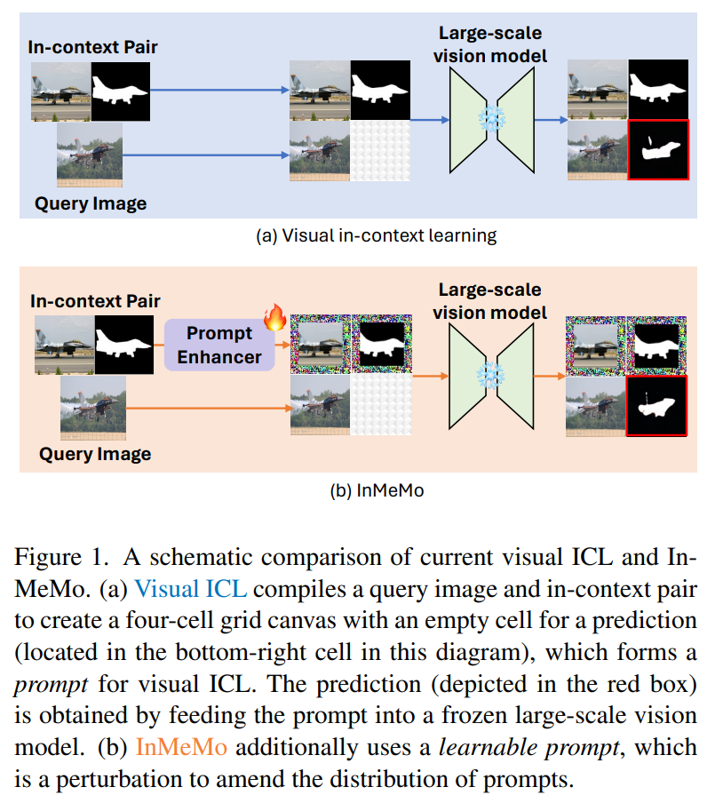
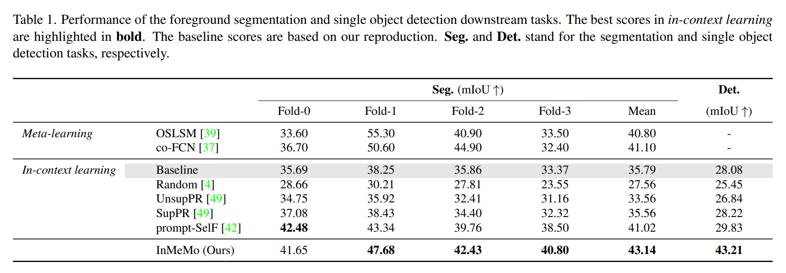
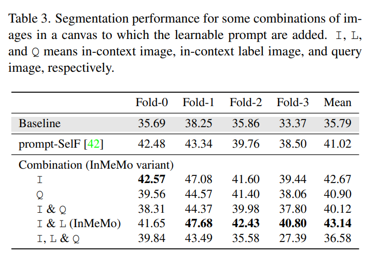

논문 및 이미지 출처 : <https://openaccess.thecvf.com/content/WACV2024/papers/Zhang_Instruct_Me_More_Random_Prompting_for_Visual_In-Context_Learning_WACV_2024_paper.pdf>

# Abstarct

extensive datasets 로 learning 된 large-scale model 은 various task 에 걸쳐 high generalizability 으로 인해 선호되는 approach 으로 등장했다.

NLP 에서 인기 있는 전략인 in-context learning (ICL) 은 이러한 model 을 사용하여 various task 을 수행하는데, 이는 updating model parameter 없이 instructive prompts 를 제공하는 방식이다.

이 아이디어가 CV 분야에서도 탐구되고 있으며, input-output image pair (in-context pair 라 함)을 model 에 제공하고 query image 를 prompt 로 사용하여 desired output 을 예시로 보여준다.

visual ICL 의 효능은 종종 prompt 의 quality 에 따라 달라진다. 따라서 저자는 Instruct Me More (InMeMo)라는 방법을 도입하여 learnable perturbation (prompt)으로 in-context pairs 을 보강하여 그 잠재력을 탐구한다.

mainstream tasks 에 대한 저자의 실험 결과, InMeMo 는 SOTA 를 능가한다는 것을 보여준다.

구체적으로, learnable prompt 가 없는 baselines 과 비교했을 때 InMeMo 는 foreground segmentation 및 single object detection tasks 에서 mIoU scores 를 각각 7.35 및 15.13 만큼 향상킨다.

저자의 연구 결과는 InMeMo 가 lightweight learning 으로 visual ICL 의 성능을 향상시키는 versatile 및 efficient way 를 제공한다는 것을 시사한다.

# 1. Introduction

최근 large-scale model 의 발전은 놀라운데, 이들은 diverse downstream task 에 대해 뛰어난 generalizability 을 보여주었으며, 많은 가능성을 가지고 있다.

ChatGPT/GPT3 같은 model 은 NLP task 을 위한 _in-context learning_ (ICL)의 본질적인 능력을 강조해 왔다. 

ICL 은 model parameter 조정 없이 prompt 를 사용하여 unseen samples 를 예측함으로써 new tasks 를 수행할 수 있게 하여, model parameter adjustments 의 필요성을 없애고 training cost 를 줄여준다.

large-scale model 의 real-world applications 를 위한 fundamental approach 로서의 잠재력은 매우 크지만, CV task 을 위한 ICL 은 여전히 탐구 단계에 머물러 있다.

- MAE-VQGAN 은 image segmentation, inpainting, style transfer 같은 various tasks 에서 CV 의 ICL 가능성을 보여주는 선구적인 노력이다.
  - 이는 Fig. 1(a) 처럼 grid format 의 visual prompt 를 사용하며, query image 와 input-output pair (in-context pair)을 포함한다.
  - 이는 input image 와 해당 label image 로 구성된 task 을 예시로 보여준다. 
- 일부 연구에선 model 이 desired outputs 를 생성하도록 하는 better instructing 을 위해 in-context pair 의 중요한 역할을 강조한다.
  - 즉, visual ICL 은 semantics, viewpoint 등에서 query image 와 유사한 in-context image 를 요구하며, Fig. 2 처럼 in-context pair retrieval 가 필수 단계가 된다.

주목할 만한 성공에도 불구하고, retrieved in-context pair 은 retrieval할 dataset 의 크기가 제한되어 있고 large-scale vision model 의 prompt 와 knowledge 간의 gap 이 있어 optimal 이 아닐 수 있다.

이 관찰은 저자에게 한 가지 아이디어를 불러일으킨다: _visual ICL 에서 downstream task 에 대해 model 에 better instruct 를 prompt 로 변환할 수 있을까?_

learnable prompting 은 model 자체를 수정하지 않고 model input transformation 을 적용하여 various downstream task 에 적응하는 방법으로, image classification 에서 우수한 성능을 보여준다.

이 방법은 parameter-efficient transfer learning (PETL) 의 일종으로 볼 수 있으며, large-scale model 에서 fine-tuning 보다 효과적이다.

주로 large-scale model 은 enormous training parameters 를 포함하며, fine-tuning 에도 significant computational resources 가 필요하기 때문이다.

특히, learnable prompt 는 상당한 불일치가 있을 때에도 data 를 맞추는 robust capability 를 보여주었다.

따라서 저자는 visual learnable prompt 로 large-scale model 을 instructing 하기 위한 visual ICL 방법인 **In**struct **Me** **Mo**re (InMeMo)를 개척하고 있다.

- in-context pair retrieval 후, 저자는 VP 에서처럼 prompt enhancer 를 사용하여 pair 을 수정한다. 
- 기존의 visual ICL 방법과 마찬가지로, InMeMo 는 enhanced pair 과 query image 를 canvas 라 하는 single image 로 compile 한 후, 이를 pre-trained large scale vision model 에 주입한다.
- 저자의 learnable prompt 는 query 에 대한 ground-truth label image 를 생성하기 위해 supervised manner 로 훈련된다.

**Contributions.**

InMeMo 는 lightweight training process 의 PETL approach 이다.

주어진 downstream task 에 전념하는 learnable prompt 는 entire prompt 의 distribution 을 more task-specific  으로 변환하여 large-scale model 의 encoding 및 decoding efficiency 를 향상킨다.

저자의 실험 결과는 foreground segmentation 및 single object detection task 에서 SOTA 성능을 보여줌으로써 저자의 주장을 성공적으로 뒷받침한다.

비록 InMeMo 를 위해 training 이 필수적이지만, 이는 lower-quality visual prompt 로 인한 문제를 효과적으로 완화한다.

# 2. Related Work

## 2.1. In-Context Learning

ICL 은 GPT-3 같은 large-scale language model (LLMs) 에서 최근에 등장한 NLP 패러다임이다.

specific task 에 대한 여러 pre-defined input-output pair 을 사용하여, 이 접근법은 model parameter 를 조정하지 않고도 성능을 향상시킬 수 있다.

ICL 은 여러 가지 장점으로 강력함이 입증되었다. 예로, LLM 과 소통할 수 있는 interpretable interface 를 제공하고, 인간의 의사결정 과정과 유사하며, language model 을 service 로 구현하는 데 사용될 수 있다. 또한, mathematics reasoning problem, question answering, compositional generalization 등의 various fields 에서 새로운 응용을 이끌어내고 있다.

CV 분야에서 ICL 은 여전히 한정된 기존 연구를 가진 새로운 개념이다. visual ICL 의 도전 과제는 model 이 해결할 task 을 지정하는 것이다. 

NLP 의 ICL 은 textual instruction 을 사용하지만, visual ICL 에선 input-output image pair (in-context pair) 과 query image 를 사용하여 desired output 을 예시로 보여주는 방식을 제안했다.

- [What makes good examples for visual in-context learning?] 은 supervised manner 로 prompt selection model 을 training 하고, prompt (in-context pair) selection 과 model 에 제공되는 prompt 수가 visual ICL 성능 향상의 핵심임을 증명했다.
- [Exploring effective factors for improving visual in-context learning.] 는 prompt selection 을 위해 pixel-level 의 in-context pair retrieval 을 제안했다. 또한, 이들은 in-context pair 와 query image 의 8 arrangements 을 조사하고 결과를 융합하여 ICL 성능을 향상시켰다.

---

in-context pair 은 downstream task 에서 optimizing performance 에 필수적인 것으로 입증되었다.

그럼에도, 이전 문헌에서는 visual ICL 성능 향상을 위해 in-context pair 의 transformation 은 조사하지 않았다.

저자는 in-context pair 에 learnable perturbation 을 도입하여 downstream task 성능을 향상시키는 잠재적 이점을 탐구하고자 한다.

## 2.2. Learnable Prompting

NLP 에서, prompt 는 LLM 이 downstream task 에 better adapting 하도록 guiding 하는 데 사용될 수 있다.

예로, 

- GPT-3 는 various downstream task 에 대해 뛰어난 generalizability 을 보여주었지만, 종종 costly manually-designed prompting 이 필수다
- 또한, full fine-tuning 은 large-scale model size 때문에 computational resources 를 요구한다.
- PETL 은 adapter 및 prompt tuning 같이 LLM 의 samll subset 또는 additional parameter set 을 optimizing 하여 full fine-tuning 과 비교하여 competitive performance 를 달성한다.

NLP 분야에서 PETL 의 뛰어난 성능 덕분에, 많은 이전 연구들은 vision 및 vision-language model 에서 다양한 시도를 했다.

이는 일반적으로 model 의 일부를 fine-tuning 하거나 input image 에 learnable prompt 를 추가하는 방식과 함께 이루어진다.

후자의 approach 으로, VP 는 CLIP 같은 large-scale frozen model 의 transferability 를 향상시키기 위해 learnable pixel-level input-independent visual prompting (VP) 를 input image 에 통합하는 것을 제안했다.

이 optimization process 는 large-scale model 보다 smaller parameter set 를 포함하므로 VP 는 visual ICL 에 well-suited extension 된다.

본 논문에서는 이러한 목적을 위해 VP 의 잠재력을 탐구한다.

# 3. Method

specific downstream task 에 대한 input $x$ 및 label (output) image $y$ 의 dataset pair $\mathcal{S} = \{(x, y)\}$ 가 있다 하자.

- $|\mathcal{S}| = n$

이 dataset 과 query image $x_q$ 를 input 으로 주어졌을 때, task 의 prediction $y_q$ 가 생성된다.

Fig. 3 은 InMeMo 의 개요를 보여준다. 

- query image $x_q$ 는 prompt retriever 로 입력되어 dataset $\mathcal{S}$ 에서 in-context pair $(x, y)$ 를 찾습니다.
- prompt enhancer 는 이를 받아 learnable prompt 로 pair $(x', y')$ 를 생성한다.
- 이 pair 은 query image $x_q$ 와 결합되어 4-cell grid canvas 를 형성하며, 이는 $(x', y', x_q, \varnothing)$ 로 표시된다.
  - $\varnothing$ : empty cell
  - 이 canvas 는 frozen pre-trained large-scale vision model $E$ 로 입력되어 visual tokens $\hat{z} = E(x', y', x_q, \varnothing)$ 을 얻는다.
- empty cell 에 해당하는 visual tokens 는 task 의 prediction $\hat{y}_q$ 를 encoding 한다.
- Decoder $D$ 는 $\hat{y}_q = D(\hat{z})$ 로 prediction $\hat{y}_q$ 를 제공한다.

InMeMo 의 key component 는 learnable parameters $\phi$ 를 가진 prompt enhancer $t_\phi$ 이다.

저자는 retriever 가 충분한 품질의 in-context pair 을 찾지 못하더라도 task 을 명확히 지정할 수 있도록 dataset $\mathcal{S}$ 로 prompt enhancer 를 훈련한다.

## 3.1. Prompt Retriever

주어진 query image 에 대한 high-quality in-context pair 을 찾는 것은 더 나은 성능을 위해 중요하다.

저자의 prompt retriever 는 prompt selection 을 위해 VP 에서의 pixel-level retrieval 을 따른다.

먼저, off-the-shelf feature extractor (e.g., CLIP visual encoder)를 사용하여 query image $x_q$ 와 in-context image $x \in \mathcal{S}$ 의 $\ell_2$-normalized visual features 를 얻는다.

query image 와 유사한 visual feature 인 $\mathcal{S}$ 의 in-context pair 는 in-context pair $(x, y)$ 가 사용된다. 즉,

$$
\begin{equation}
    (x, y) = \argmax_{(x^\star, y^\star) \in S} v(x_q)^\top v(x^\star),
\end{equation}
$$

- $v(·)$ : normalization 후의 visual features 제공

## 3.2. Prompt Enhancer

learnable prompt 는 VP 에서 영감을 받아 domain shift problem 를 해결하며, source model 의 parameter tuning 없이 source domain input data 를 target domain downstream task 에 맞게 adapting 하는 것을 제공한다.

- 저자는 VP 에서와 같이 image 의 edge 에 추가된 pixel-level perturbation 을 learnable prompt 를 사용하여 task 성능을 촉진한다.
- learnable prompt 의 주요 역할은 input image 를 수정하는 것이므로, 저자의 prompt enhancer 는 in-context pair 에 learnable prompt 를 추가한다.
  - 이러한 extended input-output examples 는 frozen model 에 desired output 으로  implicitly instruct 하여 in-context pair 과 query image 간의 gap 을 좁힌다.
- 저자의 learnable prompt 는 input-agnostic 하여 동일한 task 의 all in-context pair 에 동일한 prompt 가 공유된다.
  - 이는 저자의 learnable prompt 가 task  식별자로 간주될 수 있음을 의미한다.

prompt retriever 로부터 얻은 pair $(x, y)$ 가 주어졌을 때, prompt enhancer 는 다음과 같은 $(x', y')$ 를 생성하기 위해 $\phi$ 로 parameterize 된 learnable prompt $t_\phi$ 를 추가한다:

$$
\begin{equation}
    x' = x + \delta t_\phi, \;\; y' = y + \delta t_\phi,
\end{equation}
$$

- $\delta$ : perturbation 의 magnitude 를 지정
- prompt $t_\phi$ 는 image space 에 있음
- $\phi$ : backpropagation 을 통해 학습 가능한 edge 주위의 pixel set. other pixels 는 모두 zero

## 3.3. Prediction

[Visual prompting via image inpainting.] 를 따라 저자는 pre-trained MAE $E$ 가 $(x', y')$ 와 $x_q$ 로부터 visual token $\hat{z}$ 를 생성하는 MAE-VQGAN model 을 채택한다.

pre-trained VQGAN decoder $D$ 는 $\hat{z}$ 로부터 resulting image $\hat{y}_q$ 를 생성한다.

in-context pair 과 query 를 canvas $\hat{c} = (x', y', x_q, \varnothing)$ 로 compile 후, $E$ 는 latent visual token $\hat{z} = (\hat{z}_1, \ldots, \hat{z}_K)$ 를 예측한다. 구체적으로,

$$
\begin{equation}
    \hat{z}_k = \argmax_w E_{kw}(\hat{c}),
\end{equation}
$$

- $\hat{z}_k \in \hat{z}$ : spatial position $k$ 의 vocabulary $\mathcal{V}$ 의 visual token.
- $E_{kw}$ : $k$ 에 대한 $w \in \mathcal{V}$ 의 probability 를 제공.

그 후 $D$ 는 다음에 의해 label image 를 생성:

$$
\begin{equation}
    \hat{y}_q = D(\hat{z})
\end{equation}
$$

- 저자는 query $x_q$ 에 대한 prediction $\hat{y}_q$ 로 얻는다.

## 3.4. Training

InMeMo 에서 유일한 learnable parameter는 prompt 는 $t_\phi$ 이다.

저자는 이를 specific task 에 대해 $\mathcal{S}$ 에서 training 한다.

loss 는 [Visual prompting via image inpainting.] 와 동일하며, $t_\phi$ 를 제외한 all parameters 는 고정된다.

---

저자는 먼저 $\mathcal{S}$ 에서 pair $(x_q, y_q)$ 를 query 로서 무작위로 선택한다.

그런 다음 prompt retriever 를 사용하여 $x_q$ 에 대한 InMeMo prediction process 에 적용하여 $\hat{z}$ 를 계산한다. 단, retriever 는 $\mathcal{S} \setminus \{(x_q, y_q)\}$ 를 사용한다.

label image $y_q$ 는 training 에 사용된다. 

저자는 retrieved in-context pair $(x, y)$ 및 $(x_q, y_q)$ 를 canvas $c = (x, y, x_q, y_q)$ 로 compile 한다.

pre-trained VQGAN encoder $F$ 와 연결된 $D$ 는 $D$ 로 $y_q$ 를 재구성하는 ground-truth visual token $z$ 를 제공한다. 즉,

$$
\begin{equation}
    z_k = \argmax_w F_{kw}(c),
\end{equation}
$$

- $F_{kw}$ : position $k$ 에 대한 $w \in \mathcal{V}$ 의 probability

저자의 learnable prompt $t_\phi$ 를 training 시키기 위한 loss $L$ 은 다음과 같이 주어진다.

$$
\begin{equation}
    L(\phi) = \mathbb{E}[\text{CE}(E_k(\hat{c}), z_k)],
\end{equation}
$$

- CE : cross entropy loss
- $E_k(\hat{c}) \in \mathbb{R}^{|\mathcal{V}|}$ : $\mathcal{V}$ 의 각각의 token 에 대한 probability
- expectation 은 all $(x_q, y_q) \in \mathcal{S}$ 뿐만 아니라 $y_q$ 에 해당하는 all visual token $z_k$ (i.e., ∅ 의 latent visual token, masked index 로 표현됨)에서 계산된다.

## 3.5. Interpretation

Eq. (2) 와 같이 image 에 $t_\phi$ 를 추가하면 prompt 의 distribution 은 특정 방향으로 변환된다.

Eq. (6) 에 의해 $t_\phi$ 를 결정하는 것은 $\mathcal{S}$ 에서 설명된 task 에 대한 아이디어를 $\phi$ 에 encoding 하여 in-context pair $(x, y)$ 에서 완전히 전달되지 않는 complementary information 을 제공한다.

저자의 training 은 visual token classification 전에 latent space 에서 image patches $\hat{c}$ 와 $c$ 의 distribution 을 roughly align 한다 생각한다.

이는 canvas 에 ground-truth label image $y_q$ lack 으로 인해 본질적으로 다른 이러한 distribution 에 대해 특히 효과적일 수 있다.

따라서 저자의 best expectation 은 $\phi$ 가 $y_q$ 의 distribution 을 collectively capture 하여 prompt 의 distrubution 을 ground-truth prompts  (ground-truth label $y_q$ 를 포함)와 가깝게 만드는 것이다.

이를 통해 encoder $E$ 는 ground-truth label 에 가까운 label image 를 decoding 할 수 있는 더 그럴듯한 visual token 더 근접할 수 있게 된다.

# 4. Experiments

## 4.1. Experimental Setup

#### Datasets and Downstream Tasks.

InMeMo 를 평가하기 위해 [Visual prompting via image inpainting.] 의 실험 설정을 따른다.

downstream task 로는 foreground segmentation 과 single object detection 를 수행한다.

1. **Foreground segmentation** 은 in-context pair 을 사용하여 query image 에서 명확한 객체를 추출하는 것을 목표로 한다.
   - 저자는 Pascal-5i dataset 을 사용하며, 이 dataset 은 각각 5 classes 를 포함하는 4-fold subset 으로 나뉜다. 
2. **Single object detection** 는 in-context pair 의 coarse-grained bounding box 로 지정된 fine-grained features 를 model 이 capture 할 수 있는지를 평가.
   1. 저자는 PASCAL VOC 2012 의 image 와 bounding box 를 사용하여 실험을 진행
   2. [Visual prompting via image inpainting.] 와 일치하도록, training set 에서 annotation mask 가 entire image 의 50% 미만을 차지하고, test set 에선 20% 를 차지하는 sample 만 포함하는 dataset $\mathcal{S}$ 의 subset 을 사용한다.

#### Methods for comparison.

모든 실험은 pre-trained large-scale vision model 로 MAE-VQGAN 을 사용한다. 

InMeMo 는 visual ICL 의 최신 방법들 (i.e., Random, UnsupPR, SupPR, 및 prompt-SelF) 및 meta learning 에서 파생된 few-shot segmentation 방법들 (i.e., OSLSM 및 co-FCN)과 비교된다.

저자의 baselines 은 learnable prompt 없이 pixel-level retrieval 이다.

#### Implementation details.

foreground segmentation 의 경우, 저자는 learning  세트의 각 부분을 별도로 learning 하여 각 부분을 task 으로 보고, 각 부분에 대한 learnable prompt 를 얻는다.

single object detection 의 경우, training set 전체에서 in-context pair 을 retrieval 하여 InMeMo 를 학습시킨다.

test 를 위해, test set 의 각 image 는 training set 에서 in-context pair 을 retrieval 하기 위한 query image 로 간주된다.

---

- prompt enhancer 의 image size 는 $224 × 224$ 로 조정된다.
- learnable prompt 는 각 edge 에서 30 pixels 를 차지하므로, $\phi$ 는 $(224^2 - (224 - 2 \times 30)^2) \times 3$ parameter 를 포함한다.
- image 는 canvas 생성을 위해 $111 × 111$ 로 다시 resizing
- learnable prompt 와 함께 in-context pair $(x', y')$, query image $x_q$, empty image ∅ 가 각각 top-left, top-right, bottom-left 및 bottom-right 에 배치되며, 이는 [Visual prompting via image inpainting.] 의 default arrangement 를 따름.
- 저자는 $\delta$ 를 1 로 설정.
- InMeMo 는 PyTorch 를 사용하여 구현되었으며 Adam 으로 100 epochs 동안 training
- training 은 cosine annealing warm restarts scheduler 를 기반으로 learning rate 40 으로 시작된다
-  InMeMo 의 주요 장점은 효율성이다. 이 training 은 batch size 32 로 single NVIDIA GeForce RTX 4090 에서 작동한다.

## 4.2. Comparison with State-of-the-Art

저자는 InMeMo 를 이전의 visual ICL 방법과 meta-learning-based few-shot learning 과 비교했다.

Tab. 1 에 나와 있는 분석 결과,

- InMeMo 는 two downstream tasks 모두에서 이전의 SOTA 을 능가했으며, 특히 single object detection task 에서 두드러진 성과를 보였음.
- InMeMo 는 baselines 을 현저히 초과했다.
- 저자의 방법은 일부 fold 및 Avg. 에서 meta-learning-based methods 를 능가하기도 했다.
- 이는 learnable prompt 를 visual ICL 에 통합하는 것이 효과적임을 강조한다.

더 구체적으로, 

- foreground segmentation task 의 경우 InMeMo 는 Fold-0 에서 best scores 를 얻지는 못했지만, 그럼에도 baselines 을 상당히 초과했다.
- Prompt-SelF 의 성능은 bagging effect 에 의해 영향을 받을 수 있다. 즉, Prompt-SelF 는 canvas 내 image 의 8 different arrangement 에 적용되고 결과를 융합하여 large-scale vision model 의 latent expertise 을 활용한다.
- 반면, InMeMo 는 single query 에 대해 한 번만 inference 를 실행한다.
- bagging 은 성능을 개선할 수 있는 흥미로운 조정이 될 수 있지만, 여전히 저자는 InMeMo 자체의 상당한 이득을 강조한다.
- 특히, InMeMo 는 single object detection task 에서 뛰어난 능력을 보여주며, 기존의 SOTA 를 13.38 points 차이로 능가했다.
- 이 성능 향상은 InMeMo 가 image 내 small object 를 감지하는 데 있어 fine-grained features 를 포착하는 뛰어난 능력을 보여준다.

이러한 결과는 저자의 직접적이고 효율적인 approach 을 조명한다.

in-context pair 을 수정함으로써, 저자는 learnable prompt 를 효과적으로 활용하여 visual ICL 의 성능을 향상시킬 수 있다.

더욱이, InMeMo 는 69,840 additional parameter 만 사용하고 minimal training resources 를 요구하는 경량 특성으로 두드러진다. 

InMeMo 의 shared pixel-level learned prompt 는 더욱 효율적이고 효과적인 visual ICL 로 나아가는 길을 열 잠재력을 지니고 있다.

## 4.3. Domain Shift Analysis

Real-world applications 에선 종종 dataset $\mathcal{S}$ 와의 domain shift 가 발생하여 model 성능에 차이가 나타난다.

이러한 domain shift 는 dataset 간에 관찰될 수 있으며, dataset 간의 성능 차이는 model robustness 를 평가하는 benchmark 가 될 수 있다. 

InMeMo 의 domain shift sensitivity 를 평가하기 위해 [What makes good examples for visual in-context learning?] 와 동일한 설정을 따라 COCO dataset 을 사용하여 inference 를 수행한다.

COCO dataset 은 Pascal-5$^i$ 의 범주를 반영하는 4 subset 으로 나뉘며, 이를 COCO-5$^i$ 이라고 한다. 

in-context pair 은 COCO-5$^i$ 에서 가져오고, query image 는 Pascal-5$^i$ 의 validation set 에서 가져온다.

이 specific configuration 은 $COCO → Pascal$ 으로 명명한다.

Tab. 2 는 저자의 domain shift 평가 결과를 요약한 것.

- $COCO → Pascal$ configuration 에서 baselines 은 mIoU scores 가 2.42 하락했다.
- 반면, InMeMo 는 40.03% 를 기록하며 3.11 하락했다.
- 이들 간의 차이는 0.69 로, InMeMo 가 domain shift 에 대한 robustness 를 나타낸다.

따라서, learnable prompt 를 통한 visual ICL 은 transferable 이 있어 InMeMo 를 various real-world applications 에서 신뢰할 수 있게 만든다.

## 4.4. More Analysis on InMeMo

#### Qualitative comparison.

저자는 InMeMo 를 baselines, prompt-SelF2, 및 ground-truth (GT)과 정성적으로 비교한다.

foreground segmentation task 과 single object detection task 의 example 은 Fig. 4 에 나와 있다. 

- foreground segmentation task (Fig. 4(a)) 에서 InMeMo 는 ground-truth label image 에 충실한 세부 사항을 생성한다.
  - 흥미롭게도, InMeMo 는 achromatic image 가 제공되거나 in-context image 와 query image 간의 color disparity 가 클 때도 robustness 를 유지한다. 
  - 또한, InMeMo 는 foreground size 의 perturbation (오른쪽에서 4 column)에 대해 저항하며 query image 의 background 를 구별한다.
  - 그러나 in-context image 와 query image 의 features (e.g., semantics, viewpoint, sizes, poses)가 유사할 때 InMeMo 의 성능은 baselines 및 prompt-SelF 와 일치한다.
- single object detection task (Fig. 4(b)) 에서 InMeMo 는 detail-orientaed nature 를 일관되게 보여주며 color variations 이나 in-context pair 의 object size 차이에 영향을 받지 않는다.
  - 특히 foreground 가 in-context pair 에 거의 없는 시나리오에서의 능력은 주목할 만한다.
  - 그럼에도, foreground segmentation task 와 마찬가지로, in-context image 와 query image 가 강하게 유사할 때 InMeMo 는 prompt-SelF 의 성능을 동일해진다.

#### Which images should the learnable prompt be added?

저자의 권장 사항은 learnable prompt 를 in-context pair 에만 도입하는 것이다.

이는 in-context pair 의 guding nature 를 고려할 때 visual ICL 의 효능을 향상시키는 데 중요한 역할을 하는 것으로 보인다.

learnable prompt 가 추가되는 image 의 differnet combinations 가 미치는 잠재적 영향을 구별하기 위해 5 InMeMo perturbation 을 평가했다: in-context image 만(I), query image 만(Q), in-context image 와 query image (I & Q), in-context image 와 in-context label image (I & L, InMeMo와 동일), in-context image, in-context label image, query image (I, L, & Q).

이 combination 의 scores 는 Tab. 3 에 요약되어 있다. 

- learnable prompt 는 location 에 상관없이 visual ICL 성능을 향상시킨다는 것을 발견.
- 놀랍게도, in-context image 에 prompt 를 추가하는 것이 InMeMo variants 중 가장 낮은 성능을 보였지만 prompt-SelF 를 능가했다.
- 이는 learnable prompt 가 in-context pair 의 품질을 효과적으로 향상시키고 visual ICL 성능을 향상시킬 수 있음을 나타낸다.
- 저자는 또한 learnable prompt 를 in-context 와 query image(I & Q) 에 모두 추가할 때보다 한 image (I, Q)에만 추가할 때 성능이 덜 효과적이라는 것을 발견했다.
  - 이는 무관한 learnable prompt 때문일 수 있다.
- 동일한 prompt 가 in-context 와 query image 모두에 추가될 때, model 은 이들 간의 gap 를 효과적으로 좁히는 데 어려움을 겪는다.
- 마찬가지로, 이는 I, L, & Q configuration 에서 성능이 저하되는 원인이 되며, 특히 더 어려운 Fold-3 에서 두드러진 성능 저하가 나타난다.

#### Is InMeMo performance sensitive to the dataset size?

learnable prompt 의 효율성과 단순성을 감안할 때, dataset $\mathcal{S}$ 의 크기와 InMeMo 의 성능 간의 관계를 설명하고자 했다.

각 Fold 에 대해 각 class 에서 무작위로 16, 32, 64, 128, 256 개의 image 를 선택하여 $\mathcal{S}$ 를 구성하는 실험을 수행했다.

Fig. 5 는 그 관계를 나타낸다.

- 저자의 경험적 결과는 per class 에 최소 64 images 를 사용할 때 전반적인 성능(Mean)이 baselines scores (35.79%) 를 초과한다는 것을 시사한다(36.04%).
- image 수가 증가함에 따라 성능이 향상되는 경향이 있다. 특히 비교적 쉬운 Fold-1 의 경우, InMeMo 는 16 images 로 mIoU accuracy 36.63% 를 달성하며 other fold 를 지속적으로 능가한다.
- Fold-0 는 32 images 부터 정확도가 크게 증가하여 256 에서 포화 상태에 이릅니다.
- Fold-2 는 image 수 증가에 따라 일관되게 상당한 향상을 보이다.
- Fold-3 에서는 64 to 128 images 로 상당한 증가가 있으며, 그 이후에는 score 가 포화 상태에 이르며 all images 를 사용할 때 점차 증가한다.
- 일반적으로 easier fold 의 경우, InMeMo 는 fewer images 를 필요로 하지만, 복잡한 장면을 처리할 때 dataset size 를 증가시키면 InMeMo 의 성능을 향상시킬 수 있다.

#### Inter-class generalizability of InMeMo.

저자는 InMeMo 가 열악한 dataset 에서 잘 작동한다는 것을 입증했으며, dataset $\mathcal{S}$ 에 포함되지 않은 unseen class 에 대한 generalizability 을 궁금해했다.

이를 위해 20 classes 의 각 class 에 대해 learnable prompt 를 학습시켰다.

구체적으로,

-$\mathcal{S}_ω$ 를 Pascal-5$^i$ 의 class $ω$ 에 대한 image 와 label image 의 subset 으로 나타낸다.
- InMeMo training 은 $\mathcal{S}_ω$ 의 image 를 query 로 사용한다.
- 또한 $\mathcal{S}_ω$ 의 image 와 label image pair 을 in-context pair 으로 사용한다.
- 그런 다음 $ω' ≠ ω$ 인 경우 $\mathcal{S}_ω'$ 의 image 를 query 및 in-context pair 으로 사용하여 class 간 generalizability 을 측정한다.
- differnet classes 는 various levels 의 어려움을 가지므로, Tab. 1 에서 mean mIoU scores (43.14%) 보다 높은 _intra-class_ 성능만 표시한다.
- `bus` 와 `sheep` 이 가장 일반적인 class 임을 발견했다.
  - 이는 different classes 에서 학습된 prompt 가 이 two classes 에서 높은 정확도 (mIoU 50% 이상)를 나타냄을 의미한다.
  - 반면, `person` 은 other classes 에서 성능이 저조하여 가장 generalizability 이 낮다.
  - 이 3 classes 를 제외하고 9 classes 만 남긴다.
- inter-class (및 intra-class) scores 는 Fig. 6 에 나와 있다.

- 그림은 intra-class scores 가 항상 all other classes 중 최고가 아님을 나타낸다.
- `transportation` super-class 내에서는 class 간 strong generalizability 을 볼 수 있다. (`aeroplane-train`, `car-train`, 및 `motorbike-train`)
  - 반면 `transportation` classes 은 일반적으로 `dog` 와 `horse` 같은 `animals` classes 같은 low scores 를 가진다.
- `animals` 내에서는, class 는 보통 strong generalizability 을 보이지만 `cow` 는 예외이다.
  - 그러나 이들은 `transportation`class 에는 generalization 되지 않았다.
  - different class 간의 간의 예외도 식별할 수 있는데, 예로 `aeroplane` 는 `car` 와 wak generalizability 을 가지며 `horse` 는 `train` 과 strong generalization 을 가진다.
  - 이는 label image 의 유사성(e.g., `train` 과 `cow` 는 종종 image 의 더 큰 영역을 차지함)과 class-specific difficulty (e.g., `cow` 를 위해 learned prompt 는 대부분의 경우 generalization 되지 않음) 때문이라고 생각한다.

추가 자료에 있는 20 class 의 all pair 에 대한 mean mIoU scores 는 34.32% 이다.

이 scores 는 Tab. 1 의 대부분의 방법과 비교할 만하지만 InMeMo 의 all fold 에 대한 mean scores 에서 상당히 떨어진다.

이는 대상 task 에 대한 learnable prompt 조정의 중요성을 시사한다.

# 5. Conclusion

InMeMo 는 visual ICL 을 용이하게 하는 lightweight tool 인 learnable prompt 를 in-context pair 에 통합하여 two downstream tasks 에서 SOTA 성능을 보여준다.

learnable prompt 는 visual ICL 이 prediction 에서 fine-grained details 를 재구성하고, query image 와 충분히 유사하지 않은 low-quality 의 in-context pair 으로 인한 간섭을 극복할 수 있게 한다.

또한, InMeMo 가 domain shift (e.g., Pascal dataset to COCO dataset)에도 robustness 를 보여줌.

**_Limitations_**

InMeMo 는 competitive performance 달성하기 위해 class 당 minumum 64 images 가 필요한다.

또한, 특정 class 에 대한 learnable prompt 는 other class 에 generalization 되지 않습니다. 따라서 target task 에 맞춘 learnable prompt 가 더 나은 성능을 내는 핵심 요소이다.