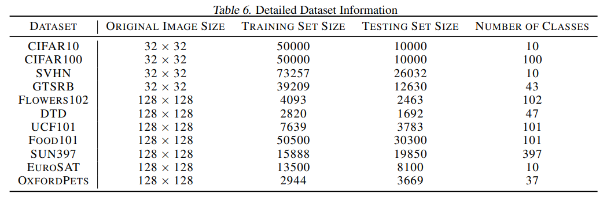
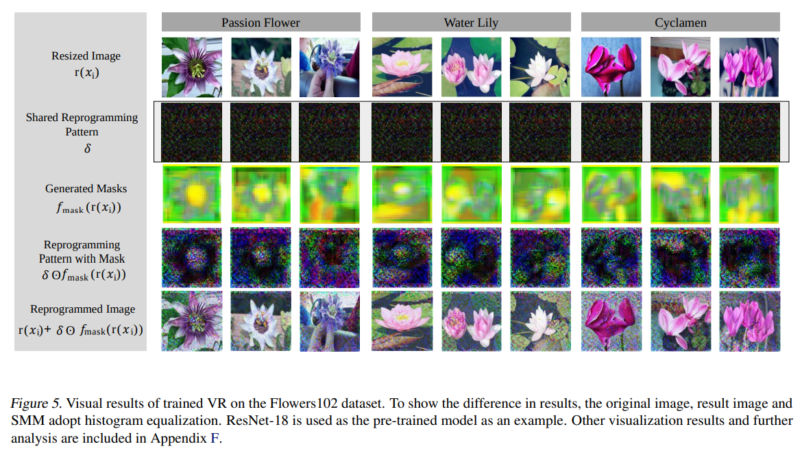

논문 및 이미지 출처 : <https://arxiv.org/pdf/2406.03150>

# Abstract

_Visual Reprogramming_ (VR)은 pre-trained model (e.g., ImageNet classifier)을 target task(e.g., medical data prediction)로 repurposing 하는 prompting 기술로서 model 내부의 parameter 를 tuning 하는 대신 input image 에 _small-scale pattern_ 을 추가한다.

input samples 의 position 은 보통 all sample 에 공윧회는 pre-defined mask 에 의해 결정된다.

본 논문에선 shared mask 가 sample-level adaptation 의 부족으로 인해 VR 의 generalization 을 제한하고 approximation error 를 증가시킬 수 있음을 보여준다.

이러한 발견을 바탕으로, _sample-specific multi-channel masks_ (SMM) 이라는 new framework VR 을 설계한다

구체적으로, 

- SMM 은 lightweight ConvNet 과 patch-wise interpolation 을 사용하여 공유되고 pre-defined mask 대ㅔ신 sample-specific three-channel masks 를 생성한다.
- individual sample 에 대한 different masks 를 생성하므로, SMM 은 기존 SOTA VR 방법에 비해 target task 의 approximation error 를 이론적으로 감소시킨다.
- 또한 ResNet 과 ViT 모두에서 성능 향상을 실증적으로 입증한다.
- SMM 의 성공은 VR 이 다양한 target task 를 위해 pre-trained model 의 잠재 지식을 활용하는 데 있어 더 넓은 적용 가능성을 강조한다.

# 1. Introduction

최근 연구에 따르면 well-trained/pre-trained models 를 활용하여 new tasks (e.g., target tasks)을 수행할 수 있으며, 이를 통해 task-specific model 을 scratch 가 필요 없다.

visual tasks 에서, pre-trained model 을 fine-tuning 하는 것 조차 높은 training costs 가 발생하기 때문에, _visual reprogramming_ (VR) 또는 adversarial reprogramming 이 제안되어 target task 에 pre-train 된 model 을 재사용하고 있다.

구체적으로, VR 은 pre-trained model 을 freezing 하고 target image 에 learnable patterns (보통 noise)를 추가하여 input space 만 변경하는 prompting 방법이다.

학습할 pattern 의 location 은 보통 all sample 에서 공유되는 pre-defined binary mask 에 의해 결정된다. 

VR 방법의 주요 이점은 image size 와 비슷한 pattern 을 학습하는 것이 model 내의 많은 parameter 를 fine-tuning 하는 것 보다 훨씬 적은 computing cost 를 요구한다는 점으로, VR 은 pre-trained model 을 사용하는 유망한 연구로 자리잡고 있다.

---

본 논문에서는 shared mask 가 VR 의 generalization 능력을 저하시킬 수 있음을 Fig. 1 및 2 에서 보여준다.

두 Figure 에서 전형적인 VR 방법인 watermarking 을 사용하여 ImageNet-pretrained classifier 를 OxfordPets dataset image classification 에 재사용 했다.

- Fig. 1 에서 저자는 optimal mask 가 individual images 마다 다르다는 것을 발견.
  - 세 가지 masks (full, medium, narrow)를 watermarking 에 적용하여 Sphynx, Abyssinian, Bengal 세 고양이 이미지의 classification confidence 를 관찰한 결과, Sphynx 에는 medium mask, Abyssinian 에는 full mask, Bengal 에는 narrow mask 가 가장 적합하다는 것을 알 수 있었다.
  - 이는 individual image 에 대해 다른 mask 가 필요함을 시사
- Fig. 2 에서는 shared mask 를 사용하는 watermarking 이 many individual samples 의 training loss 를 증가시킬 수 있음을 발견 (Fig. 2 의 red).
  - 이 현상은 VR 방법의 learning capacity 이 pre-trained model 의 all parameters 를 fine-tuning 하는 것보다 훨씬 낮음을 보여준다. (Fig. 2 blue)

위 예는 VR 에 single shared mask 를 사용하는 것의 주요 단점을 보여줌.

- 이는 sample-specific multi-channel masks (SMM)라는 new VR framework 를 제안하게 된 동기
- SMM 은 기존 연구에서 적용된 _fixed_ binary mask 대신하여 sample 마다 다를 수 있는 _generative_ three-channel mask 사용 (Fig. 3).

SMM 은 two modules: mask generator module 및 patch-wise interpolation module 로 구성

- mask generator : individual taget-domain images (i.e., samples) 를 input 으로 받아 각 sample 대해 different masks 를 output 으로 하는 lightweight _convolutional neural network_ (CNN)
  - generator 의 last layer 에는 three-channel mask 를 생성하도록 설계되어 rich-color images (CIFAR10/100)와 monotonous-color images (SVHN) 모두에서 더 나은 성능을 발휘.
- generated mask 는 학습할 pattern 과 동일한 크기여야 하므로, mask size 가 pattern 과 일치하지 않을 때, patch-wise interpolation module 을 사용하여 generated mask 를 pattern 에 맞게 재조정하여 mask generator 의 training process 를 원활하게 한다 (Sec. 3).

SMM 이 효과적인 이유를 이해하기 위해, 저자는 VR 의 다양한 hypothesis set 의 approximation error 를 이론적으로 분석.

three hypothesis set 을 고려: pre-defined binary mask 를 사용한 shared patterns, mask 없는 sample-specific patterns, 그리고 저자의 SMM

저자는 SMM 이 smaller approximation error 를 가지고 있음을 보여준며 (Proposition 4.3), 이는 SMM 의 효과를 확인.

SMM 의 효능을 추가로 입증하기 위해, 11 datasets 를 대상으로 실증 평가를 수행하고, 개별 SMM 구성 요소의 영향을 구분하는 ablation study 포함.

이는 generated mask 의 분석 및 해석, 특징 공간의 비교 시각화를 통해 보완되며 특히, pre-trained ResNet 및 ViT 모두에서 SMM 의 효과를 입증하여 SMM 이 일반적으로 사용되는 classifier architecture 와 호환됨을 확인했다 (Tab. 1 및 2).

이론적 분석과 유망한 실험 결과는 SMM 이 VR 을 통해 well-trained/pre-trained model 의 knowledge 를 다양한 target task 에 효율적으로 활용할 수 있음을 확고히 증명하며, VR 의 설명적 분석에 대한 새로운 통찰을 제공하고 향후 연구의 새로운 길을 열어줌.

# 2. Preliminaries and Related Works

## 2.1 Problem Setting of Model Reprogramming

model reprogramming 은 pre-trained models 을 자원 제약이 있는 target task 에 adapting 하기 위한 효율적인 transfer learning 패러다임을 제공한다. 이 패러다임은 광범위한 model parameter fine-tuning 을 피하고 input 과 output 을 전략적으로 변환하여 기존 지식을 재활용한다. 다음으로, model reprogramming 을 위한 공식 문제 설정을 제시한다.

target task 의 data distribution 을 $\mathcal{D}_T$ 로 나타내고, 이는 $\mathcal{X}^T \times \mathcal{Y}^T$ 위에 정의한다.

- $\mathcal{X}^T \subseteq \mathbb{R}^{d_T}$ : data space
- $\mathcal{Y}^T = \{ 1, \dots, k_T \}$ : label space
- $\mathcal{D}_T$ 의 observation 을 $\{(x^T_i, y^T_i)\}^n_{i=1}$ 으로 나타냄 (i.e., target task 의 training set)

한편, pre-trained model $f_P : \mathcal{X}^P \to \mathcal{Y}^P$ 가 주어졌을 때,

- $\mathcal{X}^P \subseteq \mathbb{R}^{d_P}$ 및 $\mathcal{Y}^P$ 는 training $f_P$ 에 사용된 data 및 label space 를 나타냄  (s.t. $|\mathcal{Y}^T| \leq |\mathcal{Y}^P|$ 로, pre-trained task 의 label space 가 target task 의 label space 보다 큼)

그럼 model reprogramming 에서, training objective 는 다음과 같이 공식화됨:

$$
\begin{equation}
  \min_{\theta \in \Theta, \omega \in \Omega} \frac{1}{n} \sum_{i=1}^n \ell(f_{\text{out}}(f_P(f_{\text{in}}(x^T_i|\theta))|Y^P_{\text{sub}}, \omega), y^T_i),
\end{equation}
$$

- $f_{\text{in}}(.|\theta) : \mathcal{X}^T \mapsto \mathcal{X}^P$ 및 $f_{\text{out}}(.|\mathcal{Y}^P_{\text{sub}}, \omega) : \mathcal{Y}^P_{\text{sub}} \mapsto \mathcal{Y}^T$ 는 각각 input transformation 과 output label mapping function
- parameters 는 $\theta \in \Theta$ 와 $\omega \in \Omega$.
- $\mathcal{Y}^P_{\text{sub}} \subseteq \mathcal{Y}^P$ 는 다양한 방법으로 결정될 수 있다
- $\ell : \mathcal{Y}^T \times \mathcal{Y}^T \mapsto \mathbb{R}^+ \cup \{0\}$ : loss function.

reprogramming 기법은 visual, text, speech, music, 그리고 cross-modal tasks 에 널리 적용되었다.

visual tasks 의 context 에서, reprogramming 은 bio-medical measurement, machine learning fairness, watermarking 을 통한 배포 외 검출 등에 잠재력을 보였다.

application 전망을 넘어, 저자는 다음으로 specific input 및 output mapping function ($f_\text{in}$ 및 $f_\text{out}$)의 기술적 세부 사항을 논의한다.

## 2.2. Prompting and Input Visual Reprogramming

visual tasks 에서 일반적인 prompting 방법은 주로 ViT architecture 에 적용되어, extra parameter 를 pre-trained model 에 도입하여 training efficiency 를 향상시킨다.

prompts 는 placement 에도 flexible 하다.

예로, 

- _visual prompt tuning_ 은 prompt 를 encoder layers  앞에 image embedding 과 함께 position 하며,
- _effective 및 efficient visual prompt tuning_ 은 prompt 를 self-attention layer 내에 포함시키기도 한다.
- _Transformer with hierarchical prompting_ 은 prompt token 을 학습하여 대략적인 image class 를 나타낸다.

한편, prompting 은 vision-language framework 인 CLIP 에도 적용된다.

- CoOP 및 CoCoOP 은 textual prompt 를 learnable vectors 로 대체하여, input image 에 따라 target task 에 대한 adaptability 를 향상시킨다.
- MaPLe 은 vision 과 language 를 연결하여 layer-specific mapping 을 학습한다.
- 이 방법들은 prompt placements 와 function 면에서 서로 다르다.

반면, VR 은 visual essence 를 변경하지 않고 input image pattern 에 learnable noise 를 추가하여 forward propagation 전에, model-agnostic prompting 기법을 제공한다.

- 처음 [Adversarial reprogramming of neural networks] 에 의해 제안된 VR 은 padding-based methods 와 watermarking 을 포함하도록 발전하여 downstream target task 를 용이하게 한다.
- AutoVP 는  scalable pre-adding images 를 사용하여 두드러진다.
- 기존 VR 연구의 중요한 제한점은 _all target samples_ 의 _shared_ noise patterns 사용으로, sample-level characteristics 를 무시하고 generalization 을 저해한다는 점이다.

저자는 이 격차를 해결하기 위해 SMM 을 제안한다.

## 2.3. Output Mapping of Reprogramming

learning-based output mapping, 즉 model $f_\text{out}$ 는 ILM-VP (Chen et al. (2023)) 에 의해 제안된 것으로, $\mathcal{Y}_P$ 의 subset 에서 $\mathcal{Y}_T$ 로의 one-to-one mapping 으로 단순화될 수 있다.

따라서 additional parameter 가 필요하지 않는다. 이 mapping 의 한 구현은 _random label mapping_ (Rlm) 으로, $f_\text{out}$ 는 임의로 할당된 injective function 이다.

이는 다음과 같이 공식화된다:

$$
\begin{equation}
  f^{\text{Rlm}}_{\text{out}}(y|\mathcal{Y}^P_{\text{sub}}) = \text{rand}(\{0, 1, ..., k^T\}),
\end{equation}
$$

- $\text{rand}(\{0, 1, ..., k^T\})$ : $\{0, 1, ..., k^T\}$ set 에서의 임의의 요소를 선택함을 의미
- $\mathcal{Y}^P_{\text{sub}}$ 는 Eq. (1) 의 optimization 이전의 $\mathcal{Y}^T$ 와 동일한 크기 (i.e., $k^T$) 로, $Y^P$ 에서 임의로 선택됨.
- $f^{\text{Rlm}}_{\text{out}}$ 이 injective 이기 때문에, two distinct elements $y_1 \neq y_2$ 에 대해 $f^{\text{Rlm}}_{\text{out}}(y_1|\mathcal{Y}^P_{\text{sub}}) \neq f^{\text{Rlm}}_{\text{out}}(y_2|\mathcal{Y}^P_{\text{sub}})$ 을 보장.

다른 대표적인 output-mapping 방법은 target task 에 대해 $Y^P_{\text{sub}}$ 와 $f_\text{out}$ 를 결정한다.

예로, pre-trained model 과 target data 의 라벨 할당 빈도에 기반한 방법이 있다.

- 이는 _frequent label mapping_ (Flm)이라 불린다.
- ILM-VP (Chen et al. (2023)) 은 $f_\text{in}$ 의 learning 중 label mapping 의 변화를 반영하여, 매 training iteration 에서 $f_\text{out}$ 을 업데이트하는 _iterative label mapping_ (Ilm)을 제안한다.

# 3. Sample-specific Multi-channel Masks

저자는 ILM-VP (Chen et al. (2023)) 을 참고하여, $f_\text{out}$ 을 non-parametric mapping 으로 간주하면서 $f_\text{in}$ 에 초점을 맞춘다.

따라서, Eq. (1) 에서의 trainable parameters $θ ∈ Θ$ 에 대한 논의를 제한.

input VR 의 문제 구조는 Fig. 7 와 같다.

## 3.1. Framework of SMM

whole dataset 의 shared parameters 와 individual samples 간의 variability 를 허용하기 위해 다음과 같은 VR 가설을 고려하는 것이 직관적:

$$
\begin{equation}
  f_{\text{in}}(x_i | \phi, \delta) = r(x_i) + \delta \odot f_{\text{mask}}(r(x_i) | \phi),
\end{equation}
$$

- $r : \mathcal{X}_T \to \mathbb{R}^{d_P}$ : image dimension 을 $d_T$ 에서 $d_P$ 로 확장하는 resizing function 으로, 일반적으로 bilinear interpolation upsampling 으로 구현.
- $r(x_i) \in \mathbb{R}^{d_P}$ : $x_i$ 에 해당하는 resized image
- mask generation function $f_{\text{mask}} : \mathbb{R}^{d_P} \to \mathbb{R}^{d_P}$ : 각 image 에 대한 noise placements 를 나타내는 mask 를 생성하며, $\phi \in \Phi$ 로 parameterize
- image 에 추가되는 trainable noise pattern 은 $\delta \in \mathbb{R}^{d_P}$ 로 나타냄.
- 이 가설을 적용하는 이유는 Proposition 4.3 에서 설명되고, ablation study 에서 검증됩니다(cf. Tab. 3)

저자의 SMM framework 의 training objective 는 optimal $\phi^*$ 와 $\delta^*$ 를 찾아서 다음을 만족하는 것:

$$
\begin{equation}
  \argmin_{\phi \in \Phi, \delta \in \mathbb{R}^{d_P}} \mathbb{E}_{(x_i, y_i) \sim D_T} \left[ \ell \left( f_{\text{out}} \left( f_P \left( r(x_i) + \delta \odot f_{\text{mask}}(r(x_i) | \phi) \right) \right), y_i \right) \right].
\end{equation}
$$

- $\delta$ : VR (Bahng et al. (2022)) 및 ILM-VP (Chen et al. (2023)) 을 dataset 의 all images 에 대해 _shared_
- $f_\text{mask}$ : 각 individual image 에 대한 sample-specific multi-channel masks 를 _uniquely_ 생성하여 sample-specific adaptation 을 가능케 함

Fig. 3 은 SMM 의 workflow 와 이전 padding-based 및 resizing-based (i.e., watermarking) VR 방법들을 비교한다.

이전 연구들과 비교할 때, SMM 은 _mask generator module_ 와 _patch-wise interpolation module_ 을 통합하여 $f_\text{mask}(·|ϕ)$ 를 특징으로 한다.

구체적으로, 

- SMM 은 target image 를 resizing 으로 시작하여 mask generator 를 통해 해당 3-channel mask 를 생성한다.
- generated mask 가 pattern size 보다 작으면, patch-wise interpolation module 이 upsampling 을 수행하여 back-propagation 과정에서 derivation step 없이 학습을 용이하게 함.
- 그 후, learnable pattern $\delta$ 가 mask 와 pixel-wise 로 multiply 되어 이미지에 추가된다.
- resulting image 는 _fixed_ pre-trained classifier 에 입력된다.

## 3.2. Lightweight Mask Generator Module

mask generator $f_\text{mask}$ 는 $\delta$ 를 허용하기 위해 different locations 를 우선시하면서 input image 와 동일한 크기의 mask 를 출력해야 한다.

저자는 CNN 을 mask generator 로 사용한다.

CNN 은 localized visual perception 을 반영하는 데 능숙하며, multilayer perceptron 보다 적은 파라미터를 사용하기 때문이다.

- CNN 의 입력은 resized image $r(x_i)$
- 위 Fig 처럼 맞춤형 CNN 을 적용하면, output 은 height $H$ 와 width $W$ 가 각각이고, pooling layers 수 $l$ 인 경우, $\left\lfloor \frac{H}{2^l} \right\rfloor \times \left\lfloor \frac{W}{2^l} \right\rfloor$ dimension 의 3-channel mask 가 된다.
- input/output size 및 parameter 수 통계에 대한 분석은 Tab. 4 와 같다.

### 3.3. Patch-wise Interpolation Module

patch-wise interpolation module 은 CNN-generated mask 를 $\left\lfloor \frac{H}{2^l} \right\rfloor \times \left\lfloor \frac{W}{2^l} \right\rfloor$ 에서 original size $H \times W$ per channel 로 다시 확대 ($l = 0$ 일 때는 생략).

adjacent image area 의 고유한 일관성과 gradient calculations 의 concise operation 의 이점을 고려하여, 저자는 upsampling 과정에서 $\left\lfloor \frac{H}{2^l} \right\rfloor \times \left\lfloor \frac{W}{2^l} \right\rfloor$ grid 를 사용하며, 각 patch size 는 $2^l \times 2^l$ 이다. 이는 각 패치 내의 값은 동일하게 유지되며, non-divisible 의 경우 closest patch 를 mirroring 한다.

그러므므로, 이후 CNN 의 output 을 얻기 위해, 저자는 각 patch 내의 주변 영역에 동일한 값으로 padding 하여 각 pixel 을 $2^l \times 2^l$ pixel 로 확장한다.

전통적인 interpolation 은 복잡한 derivation computation 을 도입할 수 있지만, 저자의 모듈은 값을 직접 할당하여 training 을 단순화한다.

patch-wise interpolation 이 traditional interpolation 에 비해 가지는 장점은 Tab. 5 와 같다.

patch size $2^l$ 의 효과는 Sec. 5 참고

### 3.4. Learning Strategy

shared noise pattern $\delta$ 와 mask generator $f_\text{mask}$ 의 learning process 는 Alg. 1 에 나타난다.

parameter $\delta$ 와 $\phi$ 는 각 epoch 마다 iteratively update 된다. 

initialization 영향을 줄이기 위해, $\delta$ 는 training 전 zero matrix 로 설정되며 $\{0\}^{d_P}$ 로 나타낸다.

# 4.  Understanding Masks in Visual Reprogramming for Classification

이 Section 에선 SMM 이 이전의 대표적인 VR 방법들보다 더 강력한 model learning 능력 제공하며, 이는 probably approximately correct (PAC) learning framework 에서 approximation error 를 줄임으로써 입증된다.

먼저 PAC learning 에서 approximation error 의 정의를 제시한다.

#### 4.1. Definition (Approximation Error)

input space $\mathcal{X}$, discrete label space $\mathcal{Y}$, $\mathcal{X} \times \mathcal{Y}$ 와 함께 probability density function $p(x,y)$ 로 정의된 distribution $\mathcal{D}$ 를 가진 random variable $(X, Y)$ 와 hypothesis space $\mathcal{F} = \{f : \mathcal{X} \to \mathcal{Y}\}$ 을 고려한다.

$\mathcal{D}$ 에 대한 $\mathcal{F}$ 의 approximation error 는 다음과 같이 정의:

$$
\begin{equation}
  \text{Err}^{\text{apx}}_\mathcal{D}(\mathcal{F}) = \inf_{f \in \mathcal{F}} \mathbb{E}_{(X,Y) \sim \mathbb{D}}[\ell(f(X), Y)] - \mathcal{R}^*_\mathcal{D},
\end{equation}
$$

- $\ell : \mathcal{Y} \times \mathcal{Y} \to \mathbb{R}^+ \cup \{0\}$ : loss function
- $\mathcal{R}^*_\mathcal{D}$ : 다음과 같이 정의된 $\mathcal{D}$ 상의 Bayes risk:

$$
\begin{equation}
  \mathcal{R}^*_\mathcal{D} = \int_X \left[1 - \sup_{y \in \mathcal{Y}} \Pr(y|x)\right] p_X(x)dx.
\end{equation}
$$

- $\Pr(y|x)$ : $x$ 를 관찰한 후의 class $y$ 의 posterior probability
- $p_X(x) = \sum_{y \in \mathcal{Y}} p(x, y)$ : $X$ 의 marginal distribution.

hypothesis space $\mathcal{F}$ 의 approximation error 는 $\mathcal{F}$ 의 minimum achievable error 와 distribution $\mathcal{D}$ 상의 theoretical minumum error 간의 closeness 를 측정한다.

일반적으로 $\mathcal{F}$ 의 complexity 가 증가하면 approximation error 가 줄어드는 경향이 있다.

다음 정리에서 hypothesis space 가 subset relation 을 가질 때, two approximation errors 간의 연결을 보여준다.

#### 4.2. Theorem

_input space $\mathcal{X}$, discrete label space $\mathcal{Y}$, 및 $\mathcal{X} \times \mathcal{Y}$ 상의 distribution $\mathcal{D}$ 가 주어졌을 때, two hypothesis spaces $\mathcal{F}_1 \subseteq \{f : \mathcal{X} \to \mathcal{Y}\}$ 와 $\mathcal{F}_2 \subseteq \{f : \mathcal{X} \to \mathcal{Y}\}$ 가 $F_1 \subseteq F_2$ 를 만족하면 $\text{Err}^{\text{apx}}_\mathcal{D}(\mathcal{F}_1) \geq \text{Err}^{\text{apx}}_\mathcal{D}(\mathcal{F}_2).$ 을 가진다._

Theorem 4.2 은 two hypothesis spaces 간의 subset relation 을 이해하는 것이 approximation errors 간의 연결을 도출하는 열쇠임을 보여준다.

$\mathcal{F}_1$ 및 $\mathcal{F}_2$ 의 approximation error 는 다음과 같이 공식화:

$$
\begin{align*}
  \text{Err}^{\text{apx}}_\mathcal{D} (\mathcal{F}_1) = \inf_{f \in \mathcal{F}_1} \mathbb{E}_{(X,Y) \sim \mathcal{D}}[\ell(f(X), Y)] - \mathcal{R}^*_\mathcal{D}, \\
  \text{Err}^{\text{apx}}_\mathcal{D} (\mathcal{F}_2) = \inf_{f \in \mathcal{F}_2} \mathbb{E}_{(X,Y) \sim \mathcal{D}}[\ell(f(X), Y)] - \mathcal{R}^*_\mathcal{D}.
\end{align*}
$$

직관적으로,

$$
  \mathcal{F}_1 \supseteq \mathcal{F}_2 \Leftrightarrow \forall f \in \mathcal{F}_2, f \in \mathcal{F}_1
$$

$\mathcal{F}_1 \subseteq \mathcal{F}_2$ 를 가정하면, 다음을 얻는다:

$$
\begin{align*}
  &\forall f \in \mathcal{F}_1, f \in \mathcal{F}_2, \\
  &\Rightarrow \inf_{f \in \mathcal{F}_1} \mathbb{E}_{(X,Y) \sim \mathcal{D}}[\ell(f(X), Y)] \geq \inf_{f \in \mathcal{F}_2} \mathbb{E}_{(X,Y) \sim \mathcal{D}}[\ell(f(X), Y)] \\
  &\Rightarrow \text{Err}_{\text{apx}}^\mathcal{D} (\mathcal{F}_1) \geq \text{Err}_{\text{apx}}^\mathcal{D} (\mathcal{F}_2).
\end{align*}
$$

다음으로 shared mask 에 의해 유도된 hypothesis space 와 SMM 에 의해 유도된 hypothesis space 을 정의.

#### Hypothesis Space Induced by Shared Mask.

shared mask 를 사용하는 VR 방법들 (Chen, 2022; Bahng et al., 2022)은 각 sample $x_i$ 에 대해, mask 가 constant matrix $M \in \{0, 1\}^{d_P}$ 이라고 가정한다.

따라서 fixed pre-trained model $f_P$ 와 fixed output mapping function $f_{\text{out}}$ 가 주어지면 (단순화를 위해, 이 Section 에선 $f_{\text{out}} \circ f_P$ 를 $f'_P$ 로 나타냄), shared mask 에 의해 유도된 hypothesis space 는 다음과 같다:

$$
\mathcal{F}^{\text{shr}}(f'_P) = \{f | f(x) = f'_P(r(x) + M \odot \delta), \forall x \in \mathcal{X} \},
$$

- $\delta \in \mathbb{R}^{d_P}$
- padding-based reprogramming 방법에선 $M$ 이 target image 의 location 에 의해 결정되는 fixed mask 이다. (ILM-VP, Chen 2022).
- $x_i$ 가 위치하는 위치는 보통 $r(x_i)$ 의 centor - $\{ i : M_i = 0 \}$ 이며, 이는 training 에서 제외되며, 나머지 locations - $\{ i : M_i = 1 \}$ 는 trainable parameters $\delta$ 를 나타낸다.
- watermarking-based methods(VR, Bahng et al., 2022) 에서는 $x_i$ 가 $r(x_i)$ 로 upsampling 되며, $\{ i : M_i = 1 \}$ 은 $r(x_i)$ 에 추가된 $\delta$ 의 effective locations 를 나타냄.

#### Hypothesis Space Induced by SMM.

Eq. (4) 에 기반하여 SMM 에서 사용되는 hypothesis space 를 다음과 같이 얻을 수 있다:

$$
\mathcal{F}^{\text{smm}}(f'_P) = \{f | f(x) = f'_P(r(x) + f_{\text{mask}}(r(x)) \odot \delta), \forall x \in \mathcal{X} \}.
$$

- $f_{\text{mask}}(r(x))$ 는 $M$ 과 달리 $\{0, 1\}^{d_P}$ 대신 $\mathbb{R}^{d_P}$ 에 속한다.

다음으로, 이전 VR 방법들과 SMM 의 approximation errors 간의 relation 을 분석.

#### SMM Has a Lower Approximation Error.

Theorem 4.2 및 위의 two hypothesis space 에 기반하여 다음 proposition 을 도출할 수 있다.

#### 4.3. Proposition

_fixed pre-trained model $f_P$, fixed output mapping function $f_{\text{out}}$, 및 $\mathcal{F}^{\text{shr}}$와 $\mathcal{F}^{\text{smm}}$ 의 definitions 가 주어졌을 때, $\mathcal{F}^{\text{shr}}(f'_P) \subseteq \mathcal{F}^{\text{smm}}(f'_P)$ 이 성립한다. 따라서, Theoram 4.2 에 기반하여, 저자는 다음을 얻는다:_

$$
\begin{equation}
  \text{Err}^{\text{apx}}_{\mathcal{D}_T}(\mathcal{F}^{\text{shr}}(f'_P)) \geq \text{Err}^{\text{apx}}_{\mathcal{D}_T}(\mathcal{F}^{\text{smm}}(f'_P)),
\end{equation}
$$

- _$f'_P = f_{\text{out}} \circ f_P$, $\mathcal{F}_{\text{smm}}(f'_P)$ 에서 사용된 $f_{\text{mask}}$ 는 Sec. 3.2 에서 설명된 CNN_
- _$\mathcal{D}_T$ : target task 의 distribution_

---

_Proof_. 

특별히 설계된 kernel 과 padding size 를 사용하면, CNN 의 output 을 input image 의 size 와 일치하도록 재구성할 수 있다. 

$d_P = H \times W \times C$ 로 가정하면, $M' \in \{0, 1\}^{H \times W \times C \times 1}$ 및 $f'_{\text{mask}}(·) \in \mathbb{R}^{H \times W \times C \times 1}$ 를 각각 $M$ 과 $f_{\text{mask}}(·)$ 의 transposed flattened 로 정의.

$f'_{\text{mask}}(·)$ 의 last layer 가 CNN 이라면, CNN 의 input 이 resized image $r(x)$ 이고, $x \in \mathcal{X}_T$ (그리고 $r(x) \in \mathbb{R}^{d_P}$) 일 때, 저자는 $f'_{\text{mask}}(r(x)) = W_{\text{last}} f''_{\text{mask}}(r(x)) + b_{\text{last}}$ 을 갖는다.

- $b_{\text{last}}$ : last layer 의 bias
- $W_{\text{last}}$ : last CNN layer 의 flattened input (i.e., $f''_{\text{mask}}(r(x))$ ) 에서 flattened output 으로 mapping 하는 것을 의미
- 이는 last CNN layer 의 parameter 를 사용하여 유도할 수 있음
- 가능한 모든 $W_{\text{last}}$ 의 집합을 $\{W_{\text{last}}\}$ 로 나타내고, all-zero matrix $O$ 로 나타낸다

다음과 같이 표현할 수 있다:

$$
\begin{align}
  &b_{\text{last}} \in \mathbb{R}^{H \times W \times C \times 1}, M' \in \{0, 1\}^{H \times W \times C \times 1} \notag \\
  &\Rightarrow \forall M', M' \in \{b_{\text{last}} | b_{\text{last}} \in \mathbb{R}^{H \times W \times C \times 1}\}\\
  &O \in \{W_{\text{last}}\} (\text{When all weights in the last CNN layer is 0,} W_\text{last} \text{ is a zero matrix}) \notag\\
  &\Rightarrow f(x) = O^{H \times W \times C \times 1} \in \{f | f(x) = W_{\text{last}} f''_{\text{mask}}(r(x)), \forall x \in \mathcal{X}_T\}\\
  &\Rightarrow \{f | f(x) = M', \forall x \in \mathcal{X}^T\} \subseteq \{f | f(x) = f'_{\text{mask}}(r(x)), \forall x \in X^T\} (\text{Given Eq. (8) and Eq. (9)}) \notag\\
  &\Rightarrow \{f | f(x) = M, \forall x \in \mathcal{X}^T\} \subseteq \{f | f(x) = f_{\text{mask}}(r(x)), \forall x \in \mathcal{X}^T\}\notag \\
  &\Rightarrow \{f | f(x) = M \odot \delta, \forall x \in \mathcal{X}^T\} \subseteq \{f | f(x) = f_{\text{mask}}(r(x)) \odot \delta, \forall x \in \mathcal{X}^T\}\notag \\
  &\Rightarrow \mathcal{F}^{\text{shr}}(f'_P) \subseteq \mathcal{F}^{\text{smm}}(f'_P) (\text{since }f'_P \text{ is fixed})\notag \\
  &\Rightarrow \text{Err}^{\text{apx}}_{\mathcal{D}_T} (\mathcal{F}^{\text{smm}}(f'_P)) \leq \text{Err}^{\text{apx}}_{\mathcal{D}_T} (\mathcal{F}_{\text{shr}}(f'_P))\notag
\end{align}
$$
---

Proposition 4.3 은 SMM 이 이전의 shared mask VR 방법들보다 lower approximation error 에 달성함을 보여줌.

#### Estimation Error Analysis of SMM.

lower approximation error 가 lower excess risk 를 보장하지는 않지만, $f_{\text{mask}}$ 는 $f'_P$ 에 비해 0.2% 미만의 extra parameter 를 도입하므로, 이 VR 설정에서 $\mathcal{F}^{\text{smm}}(f'_P)$ 의 model complexity 는 manageable 하다.

$f'_P$ 의 이러한 dominance 는 $\mathcal{F}^{\text{smm}}(f'_P)$ 의 estimation error 가 $\mathcal{F}^{\text{shr}}(f'_P)$ 의 estimation error 를 크게 초과하지 않으며, approximation error 의 이점을 상쇄하지 않을 가능성이 높음을 시사한다.

또한 $\mathcal{F}^{\text{smm}}(f'_P)$ 의 additional estimation error 가 미미함을 보여주기 위해 over-firrint 관점에서 경험적 정당화를 제공한다 (Fig. 12).

training 과 test performance 의 차이를 비교함으로써, SMM 이 model over-fitting risk 를 증가시키지 않음을 입증하여 estimation error 가 미미함을 시사한다.

#### Excess Risk Analysis of SMM.

excess risk decomposition 에 따르면, SMM 은 또한 lower excess risk 를 가지며, 결과적으로 shared mask VR 방법들보다 우수한 generalization 능력을 가질 것으로 예상된다.

#### Analysis Based on Sample-specific Patterns.

"sample-specific" 개념을 구축한 후, SMM 의 대안으로 _sample-specific pattern_ 을 각 image 에 대해 directly learning 을 조사.

이 context 에서 hypothesis space 는 다음과 같이 표현:

$$
  \mathcal{F}^{\text{sp}}(f'_P) = \{f | f(x) = f'_P(r(x) + f_{\text{mask}}(r(x))), \forall x \in \mathcal{X} \}
$$

$\mathcal{F}^{\text{sp}}(f'_P) \subseteq \mathcal{F}^{\text{smm}}(f'_P)$ 를 쉽게 확인할 수 있으며, 이는 $Err^{\text{apx}}_{\mathcal{D}_T}(\mathcal{F}^{\text{sp}}(f'_P)) \geq Err^{\text{apx}}_{\mathcal{D}_T}(\mathcal{F}_{\text{smm}}(f'_P))$ 을 의미한다. 즉, SMM 은 sample-specific pattern 에 대한 directly learning 보다 lower approximation 을 가진다.

---

fixed $f'_P$ 에 대해 $\mathcal{F}^{\text{sp}}(f'_P) \subseteq \mathcal{F}^{\text{smm}}(f'_P)$ 임을 보이고, 결과적으로 $Err^{\text{apx}}_{\mathcal{D}_T}(\mathcal{F}^{\text{sp}}(f'_P)) \geq Err^{\text{apx}}_{\mathcal{D}_T}(\mathcal{F}_{\text{smm}}(f'_P))$ 임을 보인다.

_Proof_.

possible $\delta$ 의 set $\triangle$ 이라 하며, all-one matrix 를 $J$ 라 하면 다음과 같다:

$$
\begin{align*}
  &\Rightarrow J^{d_P} \in \triangle \\
  &\Rightarrow \{f|f(x) = f_{\text{mask}}(r(x)) \odot J^{d_P}, \forall x \in \mathcal{X}^T\} \subseteq \{f|f(x) = f_{\text{mask}}(r(x)) \odot \delta, \forall x \in \mathcal{X}_T\} \\
  &\Rightarrow \{f|f(x) = f_{\text{mask}}(r(x)), \forall x \in \mathcal{X}_T\} \subseteq \{f|f(x) = f_{\text{mask}}(r(x)) \odot \delta, \forall x \in \mathcal{X}_T\} \\
  &\Rightarrow \mathcal{F}^{sp}(f'_P) \subseteq F^{smm}(f'_P) (\text{Since } f'_P \text{ is fixed}) \\
  &\Rightarrow \text{Err}^{\text{apx}}_{\mathcal{D}_T}(\mathcal{F}^{smm}(f'_P)) \leq \text{Err}^{\text{apx}}_{\mathcal{D}_T}(\mathcal{F}^{\text{sp}}(f'_P))
\end{align*}
$$
---

# 5. Experiments

#### Pre-trained Models and Target Tasks.

- ILM-VP (Chen et al. (2023)) 을 따라, pre-trained model 로 ResNet-18, ResNet-50 을 사용한다. ViT-B32 의 성능도 테스트.
- 이 모든 모델들은 ImageNet-1K (Deng et al., 2009)에서 pre-trained
- target task 은 CIFAR10, CIFAR100, SVHN, GTSRB, Flowers102, DTD, UCF101, Food101, EuroSAT, OxfordPets, SUN397 을 포함한다.
- ILM-VP 을 따라 dataset 을 분할

#### Baselines.

본 방법은 padding-based 및 resizing-based methods 와 비교:

1. **Pad** : original image 를 center 에 배치하고 주변에 noise pattern 추가.
2. **Narrow**: noise pattern 을 whole image 덮는 narrow padding binary mask 추가합니다 (width 는 input image size 의 1/8 인 28).
3. **Medium**: watermarking size (width 56)의 1/4 이 되는 mask 를 추가.
4. **Full**: Wang et al. (2022)을 whole image 를 덮는 full watermarking 추가.

공정한 비교되도록 하기 위해, shared noise pattern training 시 Chen et al. (2023)의 learning rate 및 milestones 를 따름

- initial learning rate 는 0.01, learning rate decay 는 0.1
- 총 200 epoch 을 실행하고 100th 및 145th epoch 이 milestone
- mask generator 의 training details 는 Tab. 9
- 실험은 single A100 GPU 에서 3 seeds 로 run
- averaged test accuracy 를 report

#### Results on ResNets.

Tab. 1 은 VR 방법들을 사용한 ResNet-18 과 ResNet-50 의 accuracy 를 보고 

- SMM 이 대부분의 dataset 에서 two model 에서 더 높은 accuracy 나타냄.
- 이점은 target domain 이 original domain 과 크게 다른 dataset (SVHN, Flowers102, EuroSAT)에서 더 두드러짐.
  - SVHN 에서 ResNet-18 과 ResNet-50 이 각각 6.1% 및 3.1% 향상되었으며, Flowers102 에선 10% 이상의 향상이 관찰.
- DTD 에서는 padding-based method 가 ResNet-18 에서 더 나은 결과를 보임.
  - 이는 noise watermarking 이 분류해야 할 texture 에 악영향을 미치는 resizing-based method 의 단점으로 보임.
- 이러한 도전적인 환경에서도, SMM 은 larger pre-trained model ResNet-50 을 사용할 때 higher accuracy 를 나타냄.

#### Results on ViT.

input reprogramming 이 다양한 pre-trained classifiers 에 적용될 수 있음을 상기하며, ViT 에 대한 연구로 전환.

Tab. 2 에 상세히 나와 있듯이, 

- baselines 와의 비교 연구는 Flowers102 (21.8%), Food101 (15.4%), SUN397 (7.3%)와 같은 dataset 에서 상당한 성능 향상을 보여줌.
  - 이 결과들은 SMM 이 larger pre-trained model 에서 더 높은 성능 향상을 가져올 수 있음을 시사.
- EuroSAT 같은 dataset 에선 all resizing-based method 가 약간의 성능 저하를 보이며, 이는 상대적으로 간단한 dataset 에서의 over-fitting 결과일 수 있음.
- UCF101 에선 초기에는 다른 전략 (Narrow 또는 Medium masking)보다 성능이 낮았으나, 적절한 learning rate parameters 를 선택한 후, 49.9% 의 정확도를 달성
- 전반적으로, 위의 실험들은 SMM 의 다양한 pre-trained model 과 target domain 에 대한 aaplicability 를 보여줌

다음으로, ablation 및 parameters study 결과를 report.

#### Impact of Masking

different masking strategies 의 영향을 조사. 제안된 SMM 과 비교하여 3 variants 를 비교:

1. Shared-pattern VR $f_\text{in}(x_i) = r(x_i) + \delta$ 로, $M$ 이 maximal flexibility 를 위해 image dimension 과 all-one matrix 이다.
   - 이는 $f_\text{mask}$ 를 사용하지 않는 "full watermarks" baseline 으로 default
2. masking 없는 Sample-specific pattern $f_\text{in}(x_i) = r(x_i) + f_\text{mask}(r(x_i))$.
3. SMM 의 Single-channel version $f_\text{in}(x_i) = r(x_i) + \delta \odot f^s_\text{mask}(r(x_i))$ 로, mask generator 의 penultimate-layer output 을 평균화

이 variants 들은 Tab. 3 의 first 3 columns 에 해당한다. 이는 input VR 에서 sample specificity, masking 및 SMM 이 도입한 multiple channels 의 영향을 평가하는 데 도움이 됨.

Tab. 3 에서 보듯이, 

- SMM 은 all dataset 에서 가장 뛰어난 성능을 보여줌.
- 주요 관찰은 shared pattern $\delta$ 만 유지하면 feature-rich dataset (CIFAR10, Flowers102, UCF101)에서 VR 의 효과가 감소한다는 것이다.
- 또한 $\delta$ 없이 $f_\text{mask}$ 만 사용하면 per class 가 충분한 training data 를 가진 dataset (CIFAR10, SVHN, GTSRB, SUN397)에서 suboptimal performance
- 더불어, single-channel method 는 특히 image 가 fewer varying color palettes 인 dataset(GTSRB, Flowers102)에서 덜 효과적.
- 전반적으로, SMM 의 shared noise 는 충분한 training data 제공될 때 모델 성능을 향상시키며, sample-specific $f_\text{mask}$ 는 detailed feature 구분이 필요한 classification task 에 특이성을 제공한다.
- 마지막으로, multi-channel 은 channel-specific priorities 를 가능하게 한다.

#### Impact of Patch Size.

SMM 에서 중요한 hyperparameter 인 Max-Pooling layers $l$ 은 patch size $s^l$ 를 의미한다.

5-layer mask generator 는 4 Max-Pooling layers 를 가지므로, $\{2^0, 2^1, 2^2, 2^3, 2^4\}$ 의 patch size 영향을 조사한다.

결과는 Fig. 4에 나타나 있다. 

- patch size 가 증가함에 따라 SMM 의 accuracy 는 처음에는 증가하다가, 그 후에는 정체되거나 감소한다.
- 이는 지나치게 작은 patch 가 over-fitting 을 초래할 수 있고, 지나치게 큰 patch size 가 SMM 에서 세부 사항 손실을 초래할 수 있음을 시사한다.
- 따라서 all dataset 에서 patch size 는 8 로 설정했다.

#### Visualization of SMM, shared patterns and output reprogrammed images.

Flowers102 dataset 에서의 visualization results 는 Fig. 5 에 나타나 있다.

- passion flowers 를 분류할 때, classification accuracy 에 중요한 꽃잎 위의 noise pattern 을 mask 하여 유용한 정보를 noise 에 의해 가려지지 않도록 보호하는 것을 관찰할 수 있다.
- passion flowers 의 꽃술과 같은 다른 특징들은 'oxeye', 'daisy' 및 'orange dahlia' 같은 다양한 유사 클래스에 널리 존재하므로, 꽃의 중심이 분류에 방해가 될 수 있다.
  - 따라서 passion flowers 를 분류할 때 꽃의 중심에 있는 noise 는 mask 되지 않는다
- 'water lily' 을 분류할 때, SMM 은 image 의 방해 요소에 대한 noise 를 강화한다.
  - 비슷하게, 'cyclamen' 을 분류할 때, 유사한 줄기는 'gaura' 와 'rose' 와 같은 다른 class 에서 흔히 발견되며, 이는 정확한 분류를 방해한다.
  - 따라서 SMM 이 이러한 방해 요소에 더 많은 noise 를 도입하는 것이 합리적이다.
- 이러한 결과는 SMM 이 이미지의 중요한 부분을 유지하고 방해 요소를 제거할 수 있음을 보여준다.

#### Feature Space Visualization Results.

Fig. 6 은 label mapping layer 이전의 output layer feature 의 tSNE visualization 결과를 보여준다. 

- VR 방법을 적용하기 전, target domain 의 output feature space 는 제한된 클래스 분리를 보여준다.
- baseline methods 와 함께, 향상된 분리를 관찰할 수 있지만, 특정 class pair (SVHN의 '3, 5' 와 '6, 8', EuroSAT의 'River' 과 'highway or road')은 여전히 feature space 에서 구분되지 않는다.
- $f_\text{mask}$ 를 적용하면, 저자의 방법은 incorrectly clustered classes 를 성공적으로 해결하여 SMM 의 효과를 강조한다.

#### Comparison with Finetuning-based Methods.

SMM 을 두 가지 유행하는 fine-tuning approachs: fine-tuning 및 low-rank adaptation 과 비교.

이 비교는 input VR 의 두 가지 주요 이점을 강조:
  
1. lower-resolution images 가 포함된 target task 에서의 효과
2. fine-tuning 방법과 정형 관계 및 호환성.

#### More Experiments

training curve 는 훈련 곡선은 위와 같다.

# 6. Conclusion

본 논문에서는 기존 VR 방법에서 all samples 에 대해 shared mask 를 사용하는 것의 주요 단점을 확인하였다.

특히, sample diversity 를 수용하지 못하여 특정 sample 의 training loss 가 증가하는 문제를 발견하였다.

이에 대한 대응으로, 저자는 new SMM learning framework 을 제안.

이 framework 는 lightweight neural net-based mask generator 를 통합하여 per-asmple 3-channel masks 를 생성하고, patch-wise interpolation module 을 사용하여 mask 를 model input 에 맞게 resize 하고 align 한다.