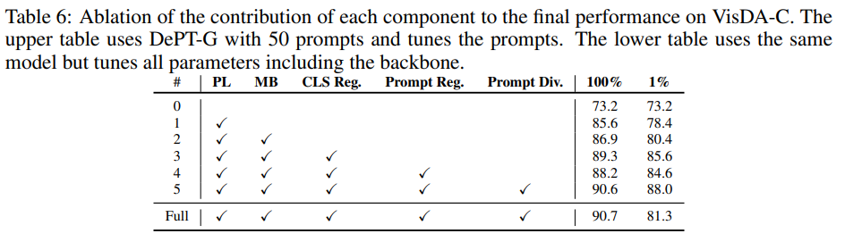

논문 및 이미지 출처 : <https://arxiv.org/pdf/2210.04831>

# Abstract

model 은 test-time 중 unseen data 에 adapting 하여, real-world deployment 상황에 distribution shift 로 인한 성능 저하를 방지할 수 있어야 한다.

본 논문은 source data 를 접근하지 않고 target domain 에 model adapting 하는 실용적이면서 도전적인 test-time adaptation (TTA) 를 다룬다.

저자는 _Data-efficient Prompt Tuning_ (DePT) 라는 간단한 방법을 제안하며, 두 가지 핵심 요소 포함:

1. DePT 는 vision transformer 에 visual prompt 를 삽입하고 adapting 하는 동안 source-initialized prompts 만 tuning
   - 이러한 parameter-efficient fine-tuning 은 learning objective 의 noise 에 overfitting 되지 않고 model representation 을 adapting 할 수 있음을 발견
2. DePT 는 memory bank-based online pseudo-labeling 을 통해 source representation 을 target domain 으로 bootstrap
   - prompt 에 특화된 hierarchical self-supervised regularization 이 jointly optimizing 되어 self-training 중 error accumulation 을 완화

DePT 는 fewer tunable parameters 로 주요 adaptation benchmark 인 VisDA-C, ImageNet-C, DomainNet-126 에서 SOTA 성능을 보일 뿐만 아니라, 1% 또는 10% 의 data 만으로도 100% 데이터와 비교하여 성능 저하가 크지 않은 data efficiency 도 입증

또한 DePT 는 online 또는 multi-source TTA setting 으로 확장될 수 있는 유연성도 갖추고 있다.

# 1. Introduction

DNN 은 testing data (target domain)가 training data (source domain)와 same distribution 을 따를 때 우수한 성능을 발휘한다.

그러나 distribution shift 가 발생하면 testing data 에 대한 generalization 능력이 보장되지 않는다.

- simple domain shift 조차 (e.g., common corruptions 또는 appearance variation) 성능 저하를 초래할 수 있음.
- domain shift 해결하는 것은 간단하지 않음.
- 한편으로는 무한한 수의 domain 을 다룰 수 있는 single model 을 훈련하는 것은 불가능하며, 다른 한편으로는 각 domain 에 대한 individual models 를 훈련하는 것은 많은 annotated samples 가 필요하여 data collection 및 labeling costs 가 많이 듦

---

본 논문에선 실용적이면서도 도전적인 test-time domain adaptation (TTA) 문제를 다룸.

- 기존의 unsupervised domain adaptation (UDA) 과 비교하여, TTA 는 source domain initialized model 을 testing 중에 source data 에 접근하지 않고 unlabeled target domain data 로 adapting
- TTA 는 source data 를 공유하는 것의 privacy issue 를 피할 수 있어 실제 응용에서 바람직
- 저자는 offline 및 online TTA setting 모두에 중점
  - offline adaptation 의 경우, source-free adaptation 으로도 알려져 있으며, model 은 unlabeled target data 로 먼저 업데이트된 후 inferencing 수행
  - online adaptation 의 경우, model 이 testing data 가 stream 으로 들어올 대마다 계속 업데이트되고 inference 가 동시에 이루어짐

TTA 의 주요 도전 과제는 두 가지:

1. source domain initialized model 을 noisy unsupervised learning objective 로 어떻게 효과적으로 조정할까? 주어진 노이즈가 많은 비지도 학습 목표로 어떻게 효과적으로 조정할 것인가? 
   - Tent : batch normalization layers 의 parameters 를 optimizing 하며, 이는 parameter-efficient 하지만 adapting 능력이 부족
   - SHOT : feature encoder 를 tuning
   - AdaContrast : full model training
   - 현재의 over-parameterized models 를 고려할 때, 이러한 방법들은 특히 target domain data 양이 제한적일 때 신뢰할 수 없는 unsupervised learning objective 에 overfitting 되기 쉬움
2. unlabeled target domain data 만 주어진 상태에서, 어떤 종류의 learning objective 를 사용할 것인가?
   - 기존 연구들은 entropy minimization, self-supervised auxiliary task, pseudo labeling, 또는 이러한 objectives 들의 combination 을 포함한 unsupervised objectives 를 사용할 것을 제안
   - 그러나 이러한 unsupervised objectives 는 main task 와 잘 맞지 않거나, noisy supervision 을 제공

---

본 연구에서는 **P**rompt **T**uning 을 통한 **D**ata-**e**fficient test-time adaptation (DePT)을 제안

이 방법은 간단하지만 효과적이며, 두 가지 주요 요소를 통해 앞서 언급한 두 가지 도전 과제를 해결:

1. learnable visual prompts collection 은 vision Transformer 과 함께 labeled source data 로 training 됨
   - adaptation phase 에서, prompt 와 classification head 만 fine-tuning 하고 backbone parameter 는 freezing
   - source domain 에서 학습된 knowledge 는 변경되지 않은 backbone 에 유지되며, prompts 만 tuning 하여 target domain adaptation 을 효과적으로 tuning 가능
2. unlabeled target domain data 만 주어진 상태에서, DePT 는 self-training 을 통해 source domain initialized model 을 bootstrap
   - pseudo label 은 먼저 예측되고, memory bank 에서 nearest neighbor data points 의 soft voting 을 통해 정제됨
   - self-training 중 error accumulation 를 더 줄이기 위해 prompt 에 대해 hierarchical fine-grained self-supervised regularization term 을 설계하여 더 나은 target domain representation learning 을 장려
- 이 두 objectives 는 상호 보완적이며 jointly optimizing

---

DePT 의 두 가지 요소는 여러 장점을 제공하며 major domain adaptation benchmarks: VisDA-C, ImageNet-C, DomainNet-126 에서 SOTA 발휘.

test-time 중 prompt tuning 은 full fine-tuning 보다 parameter-efficient

Fig. 1 처럼

- tunable parameters 가 0.19% 에 불과한 DePT 는 이전 SOTA 인 AdaContrast 보다 1.2% 높은 성능을 달성
- 또한, parameter efficiency 는 DePT 에 data efficiency 도 가져옴
- AdaContrast 와 비교할 때, DePT 는 low data 환경에서도 큰 성능 향상을 보임.
  - 예로, VisDA-C 에서 unlabeled target domain data 의 1% 만으로도 DePT 는 88.0% 의 average accuracy 달성하며, 이는 AdaContrast 보다 7.1% 높은 수치.
  - 더 도전적인 online TTA setting 에선 DePT 가 VisDA-C 에서 85.9% 의 average accuracy 로 우수한 성능을 보임.
  - corruptions 에 대한 robustness 에서, DePT 는 ImageNet-C 의 15 corruptions 중 14 에서 seversity level 5 에서 가장 낮은 error rate 를 기록하며, average accuracy 는 34.9%
  - 또한, DePT 는 multi-source domain adaptation 같은 더 많은 DA 시나리오로 확장할 수 있는 유연성도 가지고 있음

# 2. Related Work

#### Unsupervised domain adaptation (UDA)

UDA setting 은 일반적으로 사용되며, 여기서 training distribution (source domain)의 labeled data 와 함께 testing distribution (target domain)의 unlabeled data 가 training 중에 사용됨

많은 연구들이 style transfer, feature alignment 또는 adversarial training 을 통한 domain-invariant feature learning 을 사용하여 이 문제를 해결하려고 함.

그러나 UDA setting 은 source 와 target domain data 가 모두 training 중에 접근 가능하다는 강한 가정을 가지고 있으며, 이는 모델이 배포된 후 source data 에 접근하는 것이 어려울 때 항상 성립하는 것은 아님. 게다가, new domain 이 등장할 경우 이러한 방법들은 전체 프레임워크를 재훈련해야 함.

#### Test-time domain adaptation (TTA)

TTA 은 adaptation 동안 source domain data 이 없는 더 도전적이고 실용적인 setting.

이러한 특성 덕분에 TTA 는 source data sharing 의 privacy issue 와 transmission burden 을 피할 수 있으며, model 을 한 번 training 하고 unknown test distribution 에도 model 을 adapting 할 수 있음

- offline TTA 는 본질적으로 source-free domain adaptation 으로, model inference 전에 unlabeled target domain data 로 여러 epochs 로 업데이트 가능
- online TTA setting 에선 testing data 가 stream 으로 들어올 때마다 model 이 batch-by-batch 로 계속 업데이트되고 inference 가 동시에 이루어 져야 함

최근 몇몇 연구들은 다양한 unsupervised objective 와 model modulation 방법을 통해 TTA setting 을 탐구

- test-time training (TTT) : test-time optimization objective 로 self-supervised rotation prediction task 도입
- Tent : batch normalization parameter 를 entropy minimizing 로 modulating
- SHOT : information maximization 과 pseudo labeling 의 조합으로 feature extractor 를 target domain 에 adapting
- SHOT++ : high-confidence samples 의 label 을 low-confidence samples 에 전파하는 semi-supervised learning step 을 추가로 적용
- HDMI : 또한 information maximization 을 optimizing 하지만 여러 가설에 대해 disparity regularization 도입
- AdaContrast : memory bank-based pseudo labeling 및 contrastive loss 사용하여 full model tuning

DePT 는 이러한 접근 방식과 몇 가지 중요한 차이점을 가지고 있음

대부분의 이러한 방법들은 ConvNet 에 대해 제안되었지만 저자는 vision Transformer 로 전환함.

model modulation 의 경우, 저자는 backbone parameter 를 freezing 하고 target-specific prompts 를 learning

learning objective 의 경우, 저자는 online memory bank pseudo labeling loss 와 prompt 에 특화된 hierarchical self-supervised loss 를 jointly optimizing

DePT 는 다양한 DA 상황에 유연하게 적용될 수 있음.

#### Self-supervised learning.

이 방법은 unsupervised visual representation learning 에서 큰 진전을 이룸. 

= 초기 시도들은 colorization, rotation prediction, jigsaw 같은 pretext tasks 를 self-supervised objective 로 사용
- 또 다른 많은 연구들은 contrastive learning 에 중점을 두어, positive pairs representation 을 더 가깝게 하고 negative pairs 를 더 멀리 퍼뜨림
- 최근 연구들은 신중하게 설계된 structure 나 learning objective 로 instance 간의 차별 없이 unsupervised features 를 학습할 수 있음을 보여주고 있음
- unsupervised visual representation learning 외에도, 연구자들은 model robustness 및 domain adaptation 에 self-supervised objectives 를 adapting 하는 것을 탐구
- 저자는 BYOL 과 DINO 에 영감을 받아, pseudo labels 와 jointly optimizing 되는 hierarchical self-supervised regularization 제안

#### Prompt tuning

prompt tuning 은 NLP 에서 시작.

prompt 는 pre-trained language model 에게 task 에 대한 힌트를 제공하기 위해 input 에  prepend 되는 text instruction

주로 휴리스틱을 통해 구성된 text prompt 외에도, continuous vector 인 soft prompt 는 full fine-tuning 과 comparable performance 를 발휘하면서도 less tunable parameter 를 가짐.

prompt tuning 은 visual task 에서도 탐구된다.

- BRS : prediction refinement 를 위해 input 을 perturb
- L2P : continual learning 을 위해 제안
- Bahng et al.(2022) : large-scale models 를 adapting 하기 위해 pixel space 에 prompt 를 padding
- VPT : transfer learning 을 위해 제안된 관련 연구
  - VPT 는 pre-trained model 에 randomly initialized prompts 를 삽입한 후 downstream task 의 label 로 optimizing
- DAPL : UDA setting 에 prompt learning 을 도입했지만, large-scale vision-language model 에 크게 의존

반면, DePT 는 text encoder 가 필요 없으며, source domain data 로 학습된 visual prompt 를 unlabeled target domain data 로 업데이트

# 3. Method

저자는 adaptation 중 source data 에 접근할 수 없는 close-set test-time adaptation (TTA) setting 을 다룸.

- source domain training 에서, source domain $\mathcal{D}_s$ 에서 $n_s$ labeled samples $\{ x^i_s, y^i_s \}^{n_s}_{i=1}$ 가 주어짐
  - $x_i^s \in \mathcal{X}_s$ : data
  - $y_i^s \in \mathcal{Y}_s$ : corresponding label
- model 은 parameter $\theta$ 를 가지며, function $f_s : \mathcal{X}_s \rightarrow \mathcal{Y}_s$ 를 학습하도록 훈련된 general architecture 를 가지고 있다고 가정.
- model 은 neural network 로 reparameterize 되어 있으며, 두 modules 를 구성: feature encoder $g_s : \mathcal{X}_s \rightarrow \mathbb{R}^d$ 와 classifier $h_s : \mathbb{R}^d \rightarrow \mathbb{R}^C$
  - $d$ : feature dimension
  - $C$ : class
- target domain adaptation 동안, target domain $\mathcal{D}_t$ 에서 unlabeled data $\{x_i^t\}_{i=1}^{n_t}$ 가 주어지며,
  - 여기서 $x_i^t \in \mathcal{X}_t$
- TTA 의 목표는 source domain trained model $f_s$ 을 target domain 에 맞춰 $f_t : \mathcal{X}_t \rightarrow \mathcal{Y}_t$ 로 adapting
- target domain 이 source 와 동일한 label space 를 공유한다고 가정
  - 즉 $\mathcal{Y}_s = \mathcal{Y}_t = \mathcal{Y}$

## 3.1 Visual Prompt Tuning

TTA 동안 model modulating 은 간단하지 않음

- TTA 의 optimization objective 는 unsupervised learning 이며 일반적으로 noisy 가 많아, full parameter 를 tuning 하는 것은 민감하고 발산하기 쉬우며, 특히 target data 수가 제한될 경우 noise 에 overfitting 하기 쉬움
- 반면, little parameter 만 tuning 하면 적응 용량이 제한됨. 따라서 저자는 이 딜레마를 해결하기 위해 visual prompt tuning 을 채택하는 것을 제안

---

Visual prompt 는 Transformer layer 의 input 에 prepend 되는 learnable continuous parameters set 이다.

- Vision Transformer (ViT) 의 경우, input image 는 먼저 patches 로 나뉘고, 그런 다음 $d$-dimensional image tokens $E_0$ 로 embedding 된다.
  - Jia et al. (2022) 와 유사하게, 저자는 image embedding layer 이후, prompt 를 CLS token 및 image token 과 함께 Transformer layer 의 input 에 연결
- adaptation capacity 를 조절하기 위해 DePT 는 Transformer layer 의 다양한 level 에서 new prompts 를 삽입
  - 구체적으로, 저자는 Transformer layer 를 $M$ stages 로 나누며, 각 stage 는 $m = N/M$ layers 를 가진다
  - $p$ prompts 프롬프트 $P$ collection 이 각 stage 의 first layer 에 image 및 CLS token 과 연결되어 삽입
- 저자는 $M = \{ 1, 4, 12 \}$ 를 선택하여, DePT 의 three variants 인 DePT-Shallow, DePT-Group 및 DePT-Deep 를 형성.
- Prompt 가 추가된 ViT 는 다음과 같이 공식화

$$
\begin{equation}
   \begin{aligned}
      [c_i, Z_i, E_i] &= L_i([c_{i−1}, P_{i−1}, E_{i−1}]) \quad i = 1, m + 1, 2m + 1, \ldots, N − m \\
      [c_i, Z_i, E_i] &= Li([c_{i−1}, Z_{i−1}, E_{i−1}]) \quad i = else \\
      y &= head(c_N)
   \end{aligned}
\end{equation}
$$

- $c_i$ 및 $Z_i$ : $i$-th Transformer layer 에서 계산 CLS token 과 prompt feature 의 집합을 나타냄
- stages $M$ 과 prompts 수 $p$ 를 변경함으로써, 저자는 다른 adaptation capacity 에 대한 tunable parameters 수를 쉽게 조절할 수 있음
- prompt augmented ViT model 은 cross-entropy loss 를 사용해 labeled source data 를 통해 function $f_s : \mathcal{X}_s \rightarrow \mathcal{Y}_s$ 를 학습
- 이때 all parameters, 즉 prompts 와 backbone 을 optimizing
- test-time adaptation phase 에서, target model 을 source model 의 weight 로 초기화
  - 저자는 prompt 와 classification head 의 parameter 만 tuning 하며, 다른 parameter 는 freezing
  - source domain 에서 학습된 knowledge 는 frozen backbone 에 유지
  - prompt 는 self-attention 을 통해 representation 을 non-linear 하게 조정하기 위해 target-speicifc knowledge 를 학습하도록 fine-tuning
  - classification head 는 new decision boundary 를 학습

## 3.2 Learning Objective

저자의 learning objective 는 two parts 로 구성.

1. memory bank refinement mechanism 을 사용한 online pseudo labeling 이 source domain 에서 학습된 representation 을 target domain 으로 bootstrap 하는 데 사용
2. 저자는 pseudo labels 의 noise 를 줄이고 target representation quality 를 향상시키기 위해 CLS token 과 aggregated prompt 에 대한 self-supervised objective 를 설계하여 hierarchiacal regularization 을 형성

### 3.2.1 Pseudo Labeling

Pseudo labeling 은 semi/self-supervised learning 에서 널리 사용

Tarvainen & Valpola (2017); Sohn et al. (2020); Chen et al. (2022) 에서 영감을 받아, 저자는 student-teacher model 과 online memory bank refinement 를 사용하여 pseudo labels 를 생성

- 구체적으로, student $f_t$ 와 teacher $f_t'$ 는 same architecture 를 공유하며, adaptation 시작 시 source model 의 weight $\theta_s$ 로 초기화
- teacher 는 gradient 로 update 되지 않지만, student 의 weight 로부터 exponential moving average (EMA) 을 통해 update
- teacher 는 target sample 의 feature embeddings 및 predicted probabilities 를 저장하는 memory bank 를 유지
- memory bank 는 training mini-batches 로부터 first-in-first-out queue 로 online update

---

- unlabeled target domain data $x_t$ 가 주어지면, weak 및 strong random image transformation: $\mathcal{T}_w$ 및 $\mathcal{T}_s$ 가 적용
- weakly augmented view 의 embedding 은 먼저 student 로부터 얻어짐.
- pseudo label 은 memory bank 에서 top-$k$ nearest neighbors 로부터 probability average 를 취하는 soft voting 으로 얻어집니다: $\hat{y}_t = \argmax \mathcal{V} (f_t(\mathcal{T}_w(x_t)))$
- $\mathcal{V}$ : memory bank 를 통한 soft voting 을 나타냄
- student 는 strong-augmented view 의 prediction 이 $\hat{y}_t$ 와 일치하도록 cross-entropy loss 로 training:

$$
\begin{equation}
   \mathcal{L}_{pl} = \frac{1}{n_t} \sum_{i=1}^{n_t} H(\hat{y}_t, f_t(\mathcal{T}_s(x_t))),
\end{equation}
$$

- $H(a, b) = -a \log b$ 

직관적으로, student 는 training 중 fast updating 되므로 student 가 생성한 pseudo label 은 noisy 가 많을 수 있다.

EMA 로 업데이트된 teacher 는 training 동안 student 의 ensemble 로 볼 수 있다.

teacher 가 유지하는 memory bank 는 더 안정적이고 고품질의 예측을 저장

soft voting 은 nearby data point clusters 를 추가로 활용하여 더 정확한 pseudo label 을 생성

### 3.2.2 Hierarchical Self-Supervised Regularization

domain shift 로 인해 source domain 에서 학습된 model 은 target data 의 good representation 을 직접적으로 생성할 수 없음. 즉, same class 의 image representation 가 분산될 수 있음.

비록 student-teacher model 과 memory bank refinement 가 pseudo-labels 의 품질을 크게 향상시킬 수 있지만, self-training 중 error accumulation 를 완전히 피할 수는 없다. 따라서 저자는 proposed prompt augmented ViT 를 위해 hierarchical self-supervised regularization 을 설계하여 model 의 target data representation 을 개선

- prompt augmented ViT 의 경우, ViT encoder output 의 CLS token $c_N$ 은 classification 을 위한 holistic image representation 역할을 함
- prompts 는 CLS token 과 유사하게 작동: Transformer layer 의 input 에 prepending
- self-attention 을 통해, prompts 는 other tokens 에 domain-specific information 을 주입하고, other tokens 로부터 instance feature 를 집계할 수 있음
- 각 prompt 는 image 의 다양한 속성 및 특징에 attend
  - 저자는 이를 aggregated prompt 라 부르며, 이는 image 의 fine-grained representation 역할을 함
  - 다양한 stages 를 통한 aggregated prompts 는 다양한 levels feature 에 attend 하여 hierarchical representation 을 형성할 수 있음
  - Caron et al. (2021) 및 Grill et al. (2020) 에서 영감을 받아, same image 의 different views 가 주어졌을 때, holistic feature representation (CLS token)과 hierarchical fine-grained representation (aggregated prompts)을 더 가깝게 함

---

저자는 DINO framework 를 few key modifications 하여 사용

- student encoder $g_t$ 와 EMA teacher encoder $g_t'$ 는 pseudo labeling section 에서 사용한 것과 동일
- CLS token $c_t$ 또는 target sample $x_t$ 의 aggregated prompts $Z_i$ 를 $K$ dimension 으로 project 되는 projection head $q_t: \mathbb{R}^d \rightarrow \mathbb{R}^K$ 가 도입
  - prompt augmented ViT 의 각 stage 는 own projection head 를 가짐.
- target sample 의 two random strong-augmented view 가 생성
  - 하나는 student 에, 다른 하나는 teacher 에 전달
  - student 로부터 project 된 CLS token 과 aggregated prompts 가 얻어짐: $\tilde{c_t} = q_t(c_t)$, $\{\tilde{Z_i} = q_t(Z_i)\}_{i \in \mathcal{I}}$
  - teacher 의 경우도 마찬가지: $\tilde{c_t'}$, $\{\tilde{Z_i'}\}_{i \in I}$
    - $\mathcal{I} = \{m, 2m, \ldots, N\}$ : 각 stage 의 last Transformer layer 의 index
- CLS token 에 대한 holistic regularization 의 경우, DINO loss 를 적용
  - student output 의 probability distribution 은 softmax function 을 적용해 얻어짐: $P_t(x_t) = \text{softmax}(\tilde{c_t})$,
  - teacher 의 경우도 마찬가지: $P_t'(x_t)$.
  - student 는 teacher 의 predicted distribution 을 일치시키기 위해 cross-entropy loss 를 minimizing:

$$
\begin{equation}
   \mathcal{L}_{ss \_ cls} = H(P_t'(x_t), P_t(x_t)).   
\end{equation}
$$

- DINO 의 centering 및 sharpening 기법도 collapse 를 방지하기 위해 사용됨.
- hierarchical fine-grained regularization 의 경우, student 및 teacher 의 aggregated prompt 간의 mean squared error 를 minizing:

$$
\begin{equation}
   \mathcal{L}_{ss \_ prompt} = \frac{1}{M} \sum_{i \in \mathcal{I}} \sum_{j=1}^{p} \left( 2 - 2 \cdot \frac{\langle \tilde{Z}^j_i, \tilde{Z}^{j'}_i \rangle}{||\tilde{Z}^j_i||_2 \cdot ||\tilde{Z}^{j'}_i||_2} \right ).
\end{equation}
$$

- regularization 은 aggregated prompts one by one 으로 적용되지만 (즉, student 의 $i$-th aggregated prompt 는 teacher 의 $i$-th aggregated prompt 와 더 가까워지도록 함), model 은 all aggregated prompt 가 유사해지는 trivial solution 을 학습하는 경향이 있음.
- 이를 방지하기 위해, 다른 prompt 가 다른 feature 에 attending 하여 rich target-specific knowledge 를 학습할 수 있도록 diversity term 추가.
- 구체적으로, student 의 $p$ aggregated prompts 간 cosine distance 를 maximizing:

$$
\begin{equation}
   \mathcal{L}_{ss \_ div} = \frac{1}{M} \sum_{i \in \mathcal{I}} \sum_{j=1}^{p} \sum_{k=j}^{p} \left( 1 - \frac{\langle \tilde{Z}^j_i, \tilde{Z}^k_i \rangle}{||\tilde{Z}^j_i||_2 \cdot ||\tilde{Z}^k_i||_2} \right),
\end{equation}
$$

- $j$ 및 $k$ : $i$-th Transformer layer 의 output 에서의 aggregated prompts 의 index
- 따라서 DePT 는 TTA 를 위해 다음 loss function 를 minimizing

$$
\begin{equation}
   \mathcal{L} = \alpha \mathcal{L}_{pl} + \beta_1 \mathcal{L}_{ss \_ cls} + \beta_2 \mathcal{L}_{ss \_ prompt} - \lambda \mathcal{L}_{ss \_ div}.
\end{equation}
$$

# 4. Experiments

## 4.1 Experimantal Setup

저자는 DePT 의 효과와 다용성을 다양한 TTA 시나리오에서 평가하며, 세 가지 major domain adaptation benchmarks 를 다룸.

- **VisDA-C** : 12-class 의 synthesis-to-real object recognition task 에 중점을 둔 large-scale adaptation benchmark
  - 저자는 training set 을 source 로, validation set 을 target 으로 사용
  - source domain 은 3D 모델을 렌더링하여 생성된 152k synthesis images 로 구성되고, target domain 은 Microsoft COCO 에서 sampling 된 55k real images 로 구성
- **ImageNet-C** : 15 타입의 corruptions 에 대한 model robustness 를 평가하기 위한 large-scale benchmark
- **DomainNet-126** : multiple domains 의 image 를 제공하여 classification task 수행
  - original DomainNet dataset 은 label 에 noisy labels 가 있으므로, 저자는 이전 연구를 따라 DomainNet 의 subset 을 사용
  - 이는 4 domains (Real, Sketch, Clipart, Painting) 에서 126 classes 포함

#### Models

CNN 을 backbone 으로 사용하던 이전 연구와 달리 (e.g., ResNet26/50/101), 저자는 ViT-B 를 adapting 하기 위한 strong backbone network 로 사용

실험에서는 timm 라이브러리에서 model 과 ImageNet pre-trained weight 사용

#### Baselines

baseline 비교에서 classical UDA 방법과 test-time adaptation 방법을 모두 비교

- UDA 으로는 DANN, CDAN, CAN, SWD, MCC 과 비교
- 모든 UDA 방법은 source 와 target domain data 를 모두 접근해야 하지만, 저자의 방법은 그렇지 않음
- TTA 방법으로는 Tent, SHOT, CFA, AdaContrast 와 비교

## 4.2 VISDA-C Dataset Results

#### DePT 는 much less tunable parameters 로도 SOTA performance

Tab. 1 은 UDA 및 TTA 방법과 DePT 를 비교

- source data 에 접근할 수 없는 상태에서도, strong ViT-B backbone 을 사용한 DePT 는 UDA 방법보다 더 나은 성능을 보여줌
- TTA 방법 중에서, much less tunable parameters 로 DePT-G (0.16M) 와 DePT-D (0.47M) 는 strong baseline AdaContrast (85.8M) 보다 각각 +1.4% 와 +1.5% 더 우수한 성능을 보여줌
- DePT-S 는 단 0.048M 의 tunable parameters 로도 adaptation 없이 큰 개선 (+16.5%) 을 보여줌
- backbone 이 freezing 되어 있음에도 불구하고, prompt tuning 을 통해 target domain 에 대한 representation 을 효과적으로 조정

#### DePT 는 limited data settings 하에 더 많은 이점을 얻음.

이전 TTA 방법들은 일반적으로 target domain data 가 adaptation 에 충분하다고 가정. 그러나 label 이 없더라도, 많은 양의 target domain data 를 얻는 것은 여전히 일부 시나리오에서는 비용이 많이 듦. 

따라서 저자는 target domain data 양이 TTA 방법 성능에 미치는 영향을 조사하며, 1%, 10%, 50% 및 100% 의 target data 를 사용하여 평가 (Fig. 3 (A)). 

- DePT 는 strong data 효율성을 보여줌.
- DePT-G 는 1% data 에서도 87.97% 의 average accuracy 를 유지하며, 이는 100% data 에서보다 2.59% 낮음.
- 반면 AdaContrast 의 average accuracy 는 1% data 에서 80.87% 로, 100% data 에서보다 8.48% 낮음. 
- DePT-D 의 adaptation capacity 는 target data 가 풍부할 때, 예로 100% data 에서 가장 높음. 
- DePT-D 는 1% data 에서 DePT-G 및 DePT-S 보다 더 큰 감소를 보이지만, 여전히 AdaContrast 보다 우수
- DePT-S 의 절대 성능은 높지 않지만, 데이터 양 변화에 대한 best robustness 를 보여주며, 1% datat 에서 100% data 와 비교하여 1.17% 만 감소

#### DePT 는 더 도전적인 online TTA setting 에서도 strong performance 를 보여줌

online setting 에서는 model 이 일련의 stream 으로 batch 되어 들어오는 target data 에 adapting

- 각 data batch 는 training once 에 사용될 수 있음
- learning rate decay 를 적용하지 않고, memory bank 를 끄고 model prediction 을 직접 pseudo label 로 사용
- Tab. 1 bottom 은 online DePT 의 성능을 보여줌
- DePT 는 average 85.9% 의 accuracy 를 달성하며, AdaContrast 를 +4.6% 초과

## 4.3 IMAGENET-C Dataset Results

#### DePT 는 various corruption types 에 효과적

- Tab. 2 는 ImageNet-C 의 highest severity (level-5) corruptions 에 대한 top-1 error rate 를 보여줌.
- offline adaptation 에선, SHOTIM, CFA, AdaContrast 와 비교
- DePT-G 는 15 types 중 14 에서 lowest error 달성
- online adaptation setting 에선, DePT-G 가 online AdaContrast 및 CFA 보다 각각 3.7% 및 1.2% 우수한 성능을 보임

## 4.4 Domainnet Dataset Results

#### DePT 는 7 domain shifts 에서 일관되게 향상

Tab. 3 은 DomainNet-126 dataset 에서 7 domain shifts 에 대한 비교를 보여줌

- DePT 의 3 variants 모두 adaptation 없이도 all 7 domain shifts 에 일관된 향상을 보여줌.
- DePT-G 가 가장 우수한 성능을 보이며 average accuracy 81.7% 를 달성
- 제안된 DePT-G 와 DePT-D 는 smaller tunable parameters 에도 불구하고, 이전의 SOTA AdaContrast 를 능가
- online settings 에선 DePT 가 AdaContrast 보다 3.1% 높은 성능을 보임.
- ViT-B backbone 을 사용하는 모델들이 R50 backbone 보다 domain shifts 에 대해 더 stronger robustness 를 보인다는 것도 발견

### one-on-one adaptation 을 넘어

DePT 를 multi-source TTA setting 에서도 평가

Tab. 4 를 보면, 

- DePT 는 domain-specific prompts set 과 shared domain-agnostic prompt 를 사용하여 multi-soure domain knowledge 를 가장 잘 활용
- 이에 반해, SHOT 은 개별적인 domain adaptation 을 수행한 후 enseble 로 예측을 함.
- 이는 multi-source domains 를 jointly optimizing 하지 않음

## 4.5 Analysis

#### Visual prompt tuning 은 better target representation 에 도움이 됨

Fig. 3(B) 은 adaptation 전후의 target feature embedding 의 t-SNE visualization 을 보여줌.

- adaptation 전에는, clusters 들이 mixing 되어, domain shift 로 인해 구별하기 어려움
- adaptation 후에는, embedding 이 더 분산되고, wrong cluster 에 속한 sample 수가 줄어듦
- backbone 이 freezing 되어 있음에도 불구하고, prompts 는 attention layer 을 통해 representation 을 효과적으로 tuning

#### Prompt tuning 은 adaptation 에 대해 효과적

Tab. 5 는 prompt 수의 영향을 보여줌

- stage 나 prompt 수를 늘리면 tunable parameters 가 더 많이 도입됨.
- VisDA-C validation set 에는 rich unlabeled data 가 있기 때문에, tunable parameters 를 늘리면 일반적으로 성능이 향상
- 예로, DePT-G-100 과 DePT-D-50 은 SOTA adaptation performance 달성
- 놀랍게도, one prompt 로도 DePT 는 괜찮은 adaptation accuracy 를 달성

#### 각 loss 의 기여도

Tab. 6 은 VisDA-C 의 100% 및 1% data 에서 각 loss 의 contribution 을 보여줌.

- pseudo labeling 및 memory bank refinement 는 target domain 의 accuracy 를 향상시킬 수 있지만, 향상 정도는 데이터 양에 따라 다름.
- 100% data 에서는 12.4% 향상되지만, 1% data 에서는 7.2% 만 향상.
- CLS token 에 self-supervise objective 를 추가하면 model 이 target domain 의 더 나은 representation 을 학습할 수 있음
- 저자는 prompt 에 hierarchical regularization 을 추가하려 시도
- 그러나 직접 regularization 을 추가하면 prompt 가 붕괴됨.
- diversity term 을 추가하여, final performance 은 100% data 에서 90.6%, 1% data 에서 88.0% 로 향상
- bottom 은 prompt tuning 의 기여도를 보여줌
- same learning objective 로 all parameters 를 tuning 하면 rich target data (100%)에서 good accuracy 를 달성하지만, limited data (1%)에서는 overfitting 되기 쉬움

# 5. Conclusion

저자는 visual prompt tuning 을 통한 data-efficient test-time adaptation approach 를 제안

- 저자는 labeled source domain data 를 사용하여 model 과 함께 visual prompt collection 을 pre-training
- adaptation 중, prompt 만 tuning 하여 backbone 을 freezing 한 채로 target-specific knowledge 를 학습
- Transformer 의 각 stage input 에 특정 수의 prompt 만 삽입하는 유연한 방식을 제안
  - 이를 통해 stage 및 prompt 수를 변경하여 adaptation capacity 및 tunable parameters 를 쉽게 제어할 수 있음.
- online pseudo labeling 과 memory bank refinement 이 test-time prompt tuning 을 위한 hierarchical self-supervised objective 과 함께 jointly learning
- 저자는 VisDA-C, ImageNet-C 및 DomainNet-126 dataset 으로 제안된 방법을 광범위하게 평가하고, 저자의 간단한 방법이 여러 설정에서 SOTA 성능과 우수한 데이터 효율성을 이끌어낼 수 있음을 보여줌.
- 또한, 저자는 DePT 의 효과성과 유연성을 online 및 multi-source adaptation settings 에서도 추가로 검증