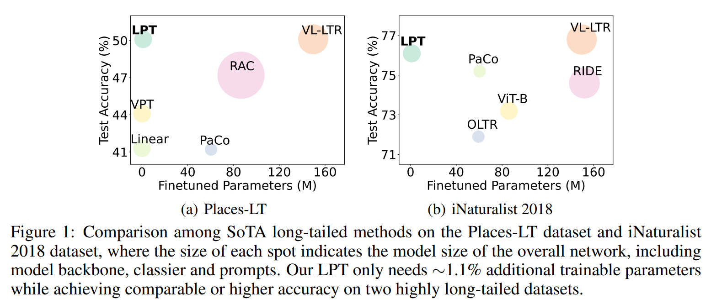
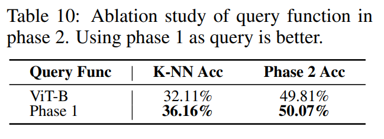

논문 및 이미지 출처 : <https://openreview.net/pdf?id=8pOVAeo8ie>

# Abstract

long-tailed classification tasks 의 경우, 대부분 연구에선 large-scale (unlabeled) dataset 에서 big model 을 pre-training 후, long-tailed data adapting 을 위해 pre-trained model 을 fine-tuning 한다.

하지만 이 방법은 computing cost 가 높고, 다른 task 에 대해 다양한 model 을 배포하는 데 드는 비용이 크며, long-tailed data 의 특정 특징에 overfitting 하여 generalization capability 가 약화되는 경향이 있다.

이를 완화하기 위해, 저자는 long-tailed classification task 를 위한 effective Long-tailed Prompt Tuning (LPT) 을 제안

- LPT 는 frozen pre-trained model 을 long-tailed data 을 adapting 하기 위해 여러 trainable prompts 를 도입
- 더 나은 효과를 위해, 저자는 prompt 를 two groups 로 나눔:
  1. general features 를 학습하고 pre-trained model 을 target long-tailed domain 으로 adapting 하기 위한 whole long-tailed dataset 에 대한 shared prompt
  2. similar features 를 가진 samples 들의 group-specific feature 를 모으고, pre-trained model 에 fine-grained discrimination ability 를 부여하기 위한 group-specific prompts
- 그런 다음, 저자는 이러한 prompt 를 학습하기 위한 two-phase training 패러다임을 설계
  1. pre-trained model 을 desired long-tailed domain 으로 adapting 하기 위해 기존 supervised prompt tuning 을 통해 shared prompt 학습
  2. learned shared prompt 를 query 로 사용하여 group-specific prompt set 에서 similar samples 의 group 에 대해 best matched set 을 선택하고, 이러한 similar samples 의 common feature 를 파악하여 이 prompts 를 optimizing 하며 dual sampling 전략 및 e asymmetric Gaussian Clouded Logit loss 을 사용
- pre-trained model 을 고정하고 few prompts 만 fine-tuning 함으로써, LPT 는 training cost 와 few prompt 의 storing 을 통한 deployment cost 를 줄일 수 있으며, pre-trained model 의 strong generalization ability 를 유지
- 다양한 long-tailed benchmark 에서 실험 결과, 약 1.1% 의 extra trainable parameters 만으로 LPT 는 이전의 full model fine-tuning 보다 비슷하거나 더 높은 성능을 달성하며, domain-shift 에 대해 더 robust

# 1. Introduction

long-tailed data 에서 학습하는건 딥러닝의 도전적인 과제다. 이는 network 가 majority classes 에 overfitting 되고 minority classes 는 무시하는 경향이 있기 때문이다.

이런 negative effect 를 없애기 위해 이전 연구들은 세 가지 측면을 집중한다:

1. 각 mini-batch data 에서 all classes 간의 balance 를 맞추기 위해 long-tailed data distribution re-sampling
2. minority classes 에 heavier weights 를 부여하기 위해 training loss re-weighting
3. specially-designed decoupled training, knowledge distillation 또는 ensemble learning

---

long-tailed learning 에서의 negative effect 를 어느 정도 완화하고 더 나은 전체 성능을 달성했지만, 이러한 방법들은 일반적으로 large-scale datasets (e.g., ImageNet) pre-trained models 또는 scratch 의 feature extractors 및 linear classifiers 를 training 할 필요가 있다. 따라서 다음과 같은 세 가지 문제가 발생한다.

1. long-tailed data 를 adapting 하기 위해, whole model fine-tuning 에는 higher extra training cost 가 필요
2. whole model fine-tuning 은 pre-trained model 의 generalization ability  를 손상시킴
   - pre-trained model on large-scale dataset 은 다양한 종류의 feature 를 구별하는 강력한 능력을 갖추고 있지만, fine-tuning 은 long-tailed data 의 특정 feature 에 overfitting 하여 generalization ability 를 약화시키고 long-tailed learning 에서 자주 발생하는 domain shift 또는 out-of-distribution 처리에 어려움을 겪음.
3. fine-tuning 은 다른 learning task 에 대해 매우 다른 모델을 생성하여 model compatibility 를 파괴하고 실질적인 deployment cost 를 증가시킴

#### Contributions.

이를 완화하기 위해, 저자는 novel 및 effective Long-tailed Prompt Tuning (LPT) approach 제안.

- 구체적으로, LPT 는 pre-trained model (e.g., Vision Transformer (ViT)) 을 기반으로 하며, 이 pre-trained model 에 extra trainable prompts 를 도입하고, 결국 long-tailed data 에 adapting 하기 위해 이 prompt 만 fine-tuning
- prompt 는 두 가지 종류가 있음:
  1. general features (knowledge) 를 학습하고 pre-trained model 을 target domain 에 adapting 하기 위한 all classes 에 대한 shared prompts
  2. similar feature 를 가진 samples 의 group-specific features 를 모으고 pre-trained model 에 fine-grained distinguishing ability 를 부여하기 위한 group-specific prompts
- effective training 을 위해, 저자는 이 두 가지 prompts 를 학습하기 위한 two-phase training framework 설계
  1. first phase : long-tailed training dataset 에 대한 shared prompts 및 classifier optimizing. 이 phase 의 목표는:
     1. prompt tuning 을 통해 pre-trained model 을 target domain 에 adapting 하고,
     2. trained classifier 로 pre-training 된 model 에 training data 에 대한 discriminative ability 를 부여하는 것
  2. second phase : newly added group-specific prompt set 을 학습하고 first phase 에서 사용된 classifier 를 더욱 fine-tuning
     - 구체적으로, input 을 받으면 LPT 는 learned shared prompts 와 함께 pre-trained model 에 input 을 제공하고, output class token 을 사용하여 group-specific prompt set 의 corresponding key 와 cosine similarity 를 계산하여 matched small set 을 선택
     - 이후, trainable matched group-specific prompts 를 shared prompt 와 함께 pre-trained model 에 도입하여 class-specific attributes 를 학습하고, dual sampling 전략과 asymmetric Gaussian Clouded Logit (A-GCL) 로 학습

---

이 LPT 는 기존 방법에서 언급한 세 가지 문제를 잘 완화할 수 있음.

- training cost 측면에서, LPT 는 크기가 pre-trained model 보다 훨씬 작은 few prompts 만 fine-tuning 하면 되므로 whole pre-trained model 을 fine-tuning 하는 것보다 훨씬 적은 training cost 를 사용
- generalization ability 측면에서, LPT 는 prompts 만 fine-tuning 하고 pre-trained model 를 고정하므로 pre-trained model 의 strong generalization capacity 을 유지할 수 있다.
- compatibility 측면에서, LPT 는 다른 learning tasks 에 대해 pre-trained model 을 공유하고 small-sized prompts 만 저장하면 되므로 model compatibility 를 크게 높이고 실질적인 deployment cost 를 줄임.

Fig. 1 에서 보이듯,

- 다양한 long-tailed classification benchmark 에서 prompts 의 additional parameters 가 약 1.1% 에 불과한 상태로 LPT 는 이전의 fine-tuning 보다 비슷하거나 높은 성능 달성
- 특히, training 및 test 를 위한 vision-based data 만 사용하여 LPT 는 Places-LT dataset 에서 50.1% 의 overall classification accuracy 와 46.9% 의 few-shot accuracy 를 달성하며, vision-only data 로 train 된 이전 방법들보다 각각 8.9% 및 11.6% 의 개선을 이룸.
- 이외에도, 더 많은 실험 결과는 long-tailed data 와 domain shift 에 대한 LPT 의 우수성과 generalization 및 robustness 를 보여줌

# 2. Related Work 

#### Long-tailed Image Classification

highly imbalanced data distribution 으로 인한 negative effect 를 해결하기 위해 이전 연구들은 주로 세 가지 다른 측면에 집중

1. data sampling : hand-crafted sampler, data augmentation 또는 meta-learning-based sampler 를 활용하여 head 및 tail classes 간의 training data 를 균형있게 함
2. loss re-weighting : confidence scores 에 hand-crafted bias 를 추가하거나, hand-crafted weight 를 설정하여 re-scaling logits 하거나, meta-learning-based method 사용
3. decoupled training 전략 과 ensemble learning methods

최근 vision-language-based methods 도 제안되었으며, 이는 extra language data 나 external database 를 도입하여 training 및 testing 동안, auxiliary confidence scores 를 생성하고, 마지막으로 whole CLIP-based model 을 long-tailed data 로 fine-tuning

이러한 all parameters 를 fully fine-tuning 하는 방법들과는 달리, 저자는 pre-trained model 의 강력하고 편향되지 않은 feature representation ability 를 활용하여 long-tailed data 에서 유연하고 정확한 classifier 를 얻기 위한 prompt tuning 방법을 구축하는 것을 목표로 함.

#### Efficient Tuning.

efficient tuning 방법 (prompt, adapter, LoRA 및 others) 는 pre-trained model 의 representation ability 를 활용하여 few trainable parameters 만 fine-tuning 하여 downstream task 에서 더 나은 성능을 달성하는 것을 목표로 함

본 논문에선 prompt tuning 에 중점을 둠.

특히, Jia et al. (2022) 은 prompt 를 pre-trained ViT on ImageNet 에 도입했으며, Bahng et al. (2022) 은 prompt 를 image edge 에 삽입하고 optimizing. Wang et al. (2022) 도 prompt tuning 을 continue learning framework 에 도입하여 multiple learnable prompt 를 사용하여 해당 task 처리.

위의 연구들과는 달리, LPT 는 large-scale 이면서도 highly imbalanced training data 를 사용하여 prompt tuning 의 transfer ability 를 탐구하는 데 중점을 두며, 이에 따라 comparable accuracy 달성

# 3. Preliminary Study

## 3.1 Performance Investigation of VPT

이전 연구에서 prompt tuning 은 balanced distribution 에서 제한된 데이터로 fine-tuning 하는데 중점을 두어, large-scale long-tailed 에 대한 transfer learning ability 는 탐구되지 않았다.

저자의 방법을 시작하기 위해, prompt tuning 이 long-tailed learning 에 이점을 제공하는지 여부를 정량적으로 평가한다.

이를 위해 ViT-B pre-trained on ImageNet-21k 을 사용하여, linear probing 과 효과적인 prompt tuning 방법인 VPT 의 성능을 large-scale Places-LT dataset 에서 비교한다. 

- 구체적으로, linear probing 은 pre-trained 및 fixed feature extractor 의 top 에 linear classifier 를 fine-tuning 하는 것이 목표
- 반면, VPT 는 종종 input token 을 learnable prompt (token) 및 pre-trained model top 의 linear classifier 와 연결
- training 중에, 저자는 이러한 두 가지 방법을 사용하여 각각의 learnable parameters 를 독립적으로 20 epochs 동안 optimizing 하며, learning rate 0.02 와 weight decay $1e-4$ 와 같은 well-tuned hyper-parameters 를 사용.

Tab. 1 은 linear probing 과 VPT 의 정량적 결과를 요약

- class-balanced sampling 없이, VPT 는 37.52% 의 overall accuracy 를 달성하며, many/medium/few-shot accuracy 에서 각각 3.94%, 3.33%, 4.52% 로 linear probing 을 능가
- 특히, class-balanced sampling 을 도입한 후, VPT 는 44.17% 의 overall accuracy 를 달성하며, few-shot accuracy 에서 상대 방법보다 8.67% 더 높은 성능을 보임.

이러한 관찰을 기반으로, 저자는 다음과 같이 결론을 내림:

- prompt tuning 은 long-tailed classification 에서 overall accuracy 를 지속적으로 향상시킬 수 있으며;
- prompt tuning 은 long-tailed distribution 에 더 robust 하고, tail categories 에 더 많은 이점을 제공
- 그러나 Tab. 1 에서 볼 수 있듯이, long-tailed problem 에서 prompt tuning 의 성능은 충분하지 않으며 여전히 최신 기술에 비해 뒤처져 있음.

## 3.2 Analysis of Prompt Tuning

그럼에도 불구하고, prompt tuning 이 long-tailed learning tasks 의 성능을 향상시키는 이유는 여전히 불분명하다.

prompt tuning 을 정량적 및 정성적으로 분석하기 위해, 저자는 Places-LT 에서 일련의 실험을 수행.

- 먼저, domain adaptation 관점에서 learned prompt 를 조사하기 위해 Linear Discriminant Analysis (LDA) 를 채택
- 구체적으로, 저자는 Sec. 3.1 에서 사용된 Places-LT 에서 ViT-B fine-tuned VPT on Places-LT 와 pre-trained ViT-B 를 사용하여 ImageNet val set 과 Places-LT val set 의 feature 를 추출하고, 이러한 특징을 사용하여 대응하는 LDA vectors 를 visualization

그림 2에서 정성적 결과를 보면,

- pre-trainde ViT-B 의 경우 ImageNet 에서 추출된 feature (red cluster) 가 Places-LT 의 feature (green cluster) 와 멀리 떨어져 있으며; 
- VPT fine-tuned ViT-B 의 경우 ImageNet 에서 추출된 feature (yellow cluster) 가 Places-LT 의 feature (blue cluster) 과 align 되어 가까이 있음을 쉽게 알 수 있음
- 이러한 관찰은 1) _VPT 의 learned prompt 가 fine-tuned data distribution (Places-LT) 를 pre-trained data distribution (ImageNet) 와 정렬하는 데 도움이 되므로, pre-trained model 이 long-tailed learning task 의 target domain 에 adapting 될 수 있음을 나타냄_

---

다음으로, 저자는 group-specific 관점에서 learned prompt 를 조사

- 구체적으로, Places-LT 의 각 class 에 대해 이 class 를 하나의 group (cluster)로 취급
- 그런 다음 각 group i (1 ≤ i ≤ C, dataset 의 총 C classes) 에 대해, 각 sample 과 해당 group center 사이의 평균 거리를 계산하고, 이를 각 group 의 inner-class distance $R_i$ 로 간주
- 또한, two group center 사이의 average distance 인 inter-class distance $D$ 를 정의하고, inner-class distance $R_i$ 의 average 과 inter-class distance $D$ 간의 ratio $\gamma$ 를 계산. 즉, $\gamma = \frac{1}{CD}\sum_i R_i$
- 직관적으로, group 의 inner-class distance $R_i$ 가 작을수록 group 이 더 조밀해짐. 따라서 $\gamma$ 가 작을수록 group 이 더 구별 가능해짐.
- 따라서, 저자는 learned features 가 구별 가능한지 여부를 측정하기 위해 $\gamma$ 를 metric 으로 사용하며, Tab. 2 에서 결과 보고

- VPT fine-tuned pre-trained model 의 feature 가 vanilla pre-trained model 보다 average inner-class distance 가 작고 $\gamma$ ratio 도 작음을 볼 수 있음
- 이는 VPT 의 다양한 classes feature 가 더 쉽게 구별할 수 있음을 나타냄
- 또한 저자는 pre-trained ViT-B 와 VPT fine-tuned pre-trained ViT-B 사이의 K-NN 평가도 수행
- Tab. 2 는 VPT 가 K-NN 정확도에서 pre-trained ViT-B 보다 1.1% 더 높은 성능을 보여, VPT fine-tuned model 의 더 높은 구별 능력을 나타냄.
- 따라서, 저자는 2) _learned prompt 가 pre-trained model 의 discriminative ability 를 더욱 향상시킬 수 있으며, 이는 long-tailed classification problems 에 도움이 된다는 결론을 내릴 수 있음_

# 4. Long-Tailed Prompt Tuning

Sec. 3 의 관찰에 영감을 받아, 저자는 prompt tuning 에 기반한 efficient 및 effective long-tailed learning method 를 설계

하지만 long-tailed learning 의 vanilla VPT 는 여전히 SOTA 에 비해 뒤쳐진다. long-tailed learning 에서 prompt tuning 의 overall performance 를 더욱 향상시키기 위해, 저자는 effective _Long-tailed Prompt Tuning_ (LPT) 방법을 제안하며, 그 프레임워크와 훈련 절차는 Fig. 3 에 있다.

일반적으로, LPT 는 all classes 에 대해 general feature 나 knowledge 를 학습하고 pre-trained model 을 target domain 에 adpting 시키며 동시에 training data 에 대한 discriminative ability 를 부여하는 _shared prompt_ 와 group-specific feature 를 수집하고 first phase 에서 사용된 classifier 를 추가로 fine-tuning 하여 더 높은 성능을 달성하는 _group-specific prompt_ 를 포함한다.

two prompt set 은 각각 shared prompt tuning 과 group prompt tuning 을 통해 optimizing 한다.

## 4.1 Phase 1: Shared Prompt Tuning

Fig. 3 에서 shared prompt tuning phase 는 pre-trained ViT 와 L layers 를 사용하여, L individual learnable token sequence 로 구성된 VPT-Deep 의 shared prompt $u = [u_1, ..., u_L]$ 와 cosine classifier $f(·; θ_f)$ 를 optimizing 하는 것을 목표로 함.

- 구체적으로, 주어진 input image $I$ 를 통해, LPT 는 pre-trained patch embedding layer 를 통해 initial patch token $z_0$ 를 얻는다.
- 그런 다음, class token ([CLS]) $c_0$ 와 pre-trained transformer encoder 를 사용하여, ViT 의 $i$-th layer (1 ≤ $i$ ≤ L) 에서 $i$-th block 에서 사용하는 query 를 $q^{attn}_i = [c_{i-1}, z_{i-1}]$ 로 정의하고, 해당 key 와 value 를 $k^{attn}_i = v^{attn}_i = [c_{i-1}, z_{i-1}, u_i]$ 로 정의한 다음, $u$ 로 $(c_i, z_i)$ 를 업데이트:

$$
\begin{equation}
  (c_i, z_i) = FFN_i(Attn_i(q^{attn}_i, k^{attn}_i, v^{attn}_i)),
\end{equation}
$$

- $[·, ..., ·]$ : token 수 방향으로 token concatenation operation
- $Attn_i$ 와 $FFN_i$ 는 $i$-th pre-trained ViT block 의 self-attention layer 와 feed-forward network 이다.
- 그런 다음 final class token $c_L$ 은 cosine classifier $f$ 에 입력되어 per-class confidence score $s = f(c_L; θ_f)$ 를 계산
- 마지막으로, 주어진 input $I$ 의 ground-truth $y$ 와 함께, $u$ 와 $θ_f$ 를 optimizing 하기 위해 phase 1 training 중에 $L_{P_1} = L_{cls}(s, y)$ 를 minimizing
  - $L_{cls}$ : both phase 에서 사용되는 classification loss

## 4.2 Phase 2: Group Prompt Tuning

long-tailed learning 의 어려움을 줄이기 위한 직관적인 솔루션은 feature 의 유사성을 기반으로 training data 를 multiple groups 으로 나누는 것이다. 따라서 각 group 내의 group-specific knowledge 를 공유하고 recognition 의 어려움을 줄이는 데 도움이 된다.

이를 동기로, 

- similar features 를 가진 samples 를 위한 group-specific features 를 모으고 pre-trained model 에 fine-grained discriminative ability 를 부여하기 위해, 저자는 다양한 group prompts 를 사용하여 서로 다른 classes 의 samples 를 처리하고, 각 group prompt 를 통해 group-specific features 를 모아 long-tailed classificatio 에 이롭게 하고자 한다.
- 따라서, 저자는 $m$ individual learnable prompts $\mathcal{R} = \{ (k_1, r^1), \dots, (k_m, r^m) \}$ 로 구성된 group-specific prompts 를 도입
  - $k_i$ : 해당 $i$-th group prompt $r_i$ 의 key 이며,
  - 각 $r_i$ 는 $L-K$ trainable token sequence 를 갖는다
- computational cost 및 additional parameters 수를 줄이기 위해, first $K$ block 에선 shared prompt 만 사용하고 last $L-K$ block 에 group-specific prompt set $\mathcal{R}$ 을 도입

저자는 Sec. 3.2 의 observation (2) 에 기초하여, Wang et al. (2022) 처럼 pre-trained ViT 의 output class token 을 사용하기보다는 Phase 1 에서 query $q = c_L$ 을 선택한다. class token $c_L$ 은 종종 stronger discriminative ability 를 가지고 있기 때문이다.

주어진 query $q$ 에 대해, 저자는 다음과 같이 $\mathcal{R}$ 에서 best-matched prompt 를 적응적으로 선택:

$$
\begin{equation}
  [w_1, \dots, w_k] = \text{top-k}(\langle q, [k_1, \dots, k_m] \rangle, k)
\end{equation}
$$

- top-k$(·, k)$ : largest $k$ cosine similarty 의 prompt indices $w = [w_1, \dots, w_k]$ 를 반환
- $⟨·, ·⟩$ : cosine similarity operator 를 의미

여기서 keys optimization 논의. 직관적으로, keys 를 optimizing 하는 간단한 방법은 same class 의 queries 가 특정 key 에 매칭되도록 강제하는 것이다. 그러나, 이 방법은 어떤 class 가 정확히 어떤 prompt 에 매칭될 수 있는지 해석하기 어려워서 실행 불가능하다.

대신, 저자는 matched query 와 key 간의 distance 를 simply minimizing 하여 이러한 key 를 적응적인 optimizing 을 선호한다. 이 관점에서 query function 를 설계한다.

Sec. 3.2 에서 관찰한 바와 같이, fine-tuned phase 1 의 각 class 에 의해 생성된 feature cluster 는 밀집되어 있다.

따라서 same class 의 query 에 대해, 임의로 query $q_i$ 와 key $k'$ 를 선택하고 $1 - \langle q_i, k' \rangle$ 을 minimizing 하면, 다른 query 와 $k'$ 간의 distance 가 자연스럽게 minimizing 된다.

왜냐하면 이러한 query 는 고정되어 있으며 충분히 밀집되어 있기 때문이다. 따라서 training 중 각 key 는 하나 이상의 nearby clusters 에 가깝게 학습되어, 최종적으로 해당 group prompt 가 group-specific feature 을 모으도록 유도한다. 

게다가, 

1. VPT 가 prompt ensembling 에서 이점을 얻고,
2. 더 많은 group-specific knowledge 를 도입하면 tail classes 의 sample 을 인식하는 데 이로울 수 있다.

$\mathcal{R}$ 의 one matched group prompt 를 사용하는 대신, LPT 는 다음과 같이 multiple selected prompt 로 prompt ensembling 을 수행:

$$
\begin{equation}
  r = \text{sum}([r^{w1}, \dots, r^{wk}])/k
\end{equation}
$$

- 따라서 ensembled group prompt $r$ 을 생성
- 주어진 $r$ 로, LPT 는 computational cost 를 줄이기 위해 Phase 1 의 feature $(c_K, z_K)$ 를 $(\hat{c}_K, \hat{z}_K)$ 로 재사용하고, $i$-th block 에서 사용되는 query 를 $\hat{q}^{\text{attn}}_i = [\hat{c}_{i-1}, \hat{z}_{i-1}]$ 로 정으하며, key 와 value 를 $\hat{k}^{\text{attn}}_i = \hat{v}^{\text{attn}}_i = [\hat{c}_{i-1}, \hat{z}_{i-1}, u_i, r_{i-K}]$ 로 정의하며, 최종적으로 $(\hat{c}_i, \hat{z}_i)$ 를 다음과 같이 업데이트:

$$
\begin{equation}
  (\hat{c}_i, \hat{z}_i) = \text{FFN}_i(\text{Attn}_i(\hat{q}^{\text{attn}}_i, \hat{k}^{\text{attn}}_i, \hat{v}^{\text{attn}}_i))
\end{equation}
$$

- $K+1 ≤ i ≤ L$ 는 ViT 의 last $L-K$ pre-trained blocks 의 index
- 다음으로, output class token $\hat{c}_L$ 을 cosine classifier $f$ 에 입력하여 per-class confidence scores $\hat{s} = f(\hat{c}_L; \theta_f)$ 를 계산한다.
- 최종적으로, 해당 input $I$ 의 ground-truth $y$ 를 가 주어진 상태에서, 저자는 classification loss $L_{\text{cls}}$ 와 query $q$ 와 해당 matched keys $[k_{w_1}, \dots, k_{w_k}]$ 간의 cosine similarity 를 포함한 $L_{P_2}$ 를 minimizing 한다. 이는 다음과 같다:

$$
\begin{equation}
  L_{P_2} = \beta L_{\text{cls}}(\hat{s}, y) + (1 - \frac{1}{k} \sum_{i \in w} \langle q, k_i \rangle )
\end{equation}
$$

- $\beta$ : $L_{\text{cls}}$ 의 scale factor

---

class-balanced sampling 또는 instance-balanced samplikng 을 단순히 사용하는 것은 tail classes 또는 head class 에 심각한 overfitting 을 초래할 수 있다.

head class 와 tail class 간의 성능을 균형 있게 하고 overfitting 을 피하기 위해, 저자는 dual sampling 전략을 도입한다.

- Phase 2 의 각 training iteration 에서, LPT 는 instance-balanced sampler 에서 mini-batch $\{I\}_{ins}$ 를 randomly sampling 한다.
- $\{I\}_{ins}$ 에 대해선, $\beta = 1$ 로 설정하여 $L_{P_2}$ 를 계산하고, $\{I\}_{ins}$ 의 samplg 에 대해서는 $\beta = \eta(E - e)/E$ 로 설정한다.
  - $\eta$ : $\{I\}_{ins}$ 의 initialized weight
  - $E$ : maximum epoch 수
  - $e$ : 현재 epoch 수

## 4.3 Loss Function

마지막으로, 저자는 두 phase 의 training 에서 사용된 classification loss $L_{\text{cls}}$ 을 소개

LPT 는 성능을 더욱 향상시키기 multiple classification losses 을 사용할 수 있지만, 저자는 asymmetric CGL loss $L_{A-GCL}$ 을 채택하여 training data 의 statistic label frequency 를 기반으로 logits 을 조정하고 positive 및 negative classes 간의 gradient 를 re-weight 한다.

일반성을 잃지 않으면서, LPT 의 Phase 2 의 계산된 예제를 사용하여 $L_{A-GCL}$ 을 설명. (Li et al., 2022) 를 따라, 저자는 $i$-th class 의 confidence score 를 다음과 같이 re-scale:

$$
\begin{equation}
  v_i = \alpha (\hat{s}_i - (\log n_{\text{max}} - \log n_i) \| \epsilon \|)
\end{equation}
$$

- $\alpha$ : scaling factor
- $\epsilon$ : gaussian distribution 에서 나온 random variable
- $n_i$ 와 $n_{\text{max}}$ : 각각 $i$-th class 의 label frequency 와 training set 에서 maximum label frequency 를 의미한다.
- 그런 다음, 저자는 per-class probability $p = [p_1, \ldots, p_C]$ 를 다음과 같이 계산:

$$
\begin{equation}
  [p_1, \ldots, p_C] = \text{softmax}([v_1, \ldots, v_C]).
\end{equation}
$$

- 다음으로, 저자는 long-tailed learning 에서 negative gradient 의 영향을 제거하기 위해 asymmetric re-weighting 을 사용
- $I$ 의 ground-truth class 가 $j$ 라고 가정하면, $L_{A-GCL}$ 을 다음과 같이 계산:

$$
\begin{equation}
  L_{A-GCL} = (1 - p_j)^{\lambda+} \log(p_j) + \sum_{1 \leq i \leq C, i \neq j} (p_i)^{\lambda-} \log(p_i),
\end{equation}
$$

- $\lambda+$ 와 $\lambda-$ : 각 ground-truth class 와 negative class 에 대한 focusing parameter
- 마지막으로, LPT 의 two phase 동안 $L_{\text{cls}} = L_{A-GCL}$ 을 선택

# 5. Experiments

## 5.1 Comparison with State-of-the-art Methods

#### Comparison on Places-LT.

일반적으로, 이러한 방법들은 vision-only pre-trained methods 와 vision-language (VL) pre-trained methods 의 두 groups 로 대략 나눌 수 있다.

- VL-based methods 는 training 및 testing 동안 extra data (i.e., Wiki text data or external ImageNet-21k database) 를 도입할 수 있다.
- LPT 는 first group 에 속하며 extra data 에 의존하지 않는다.

Tab. 3 은 competing methods 의 evaluation results.

- 다른 vision-only pre-trained methods 와 비교했을 때, LPT 는 1.01M (1.1%) 의 additional trainable parameters 만으로 overall accuracy 및 few-shot accuracy 를 50.1% 및 46.9% 를 달성하며, 각각 SOTA 의 PaCo 를 8.9% 및 11.6% 초과
- 심지어 training 및 testing 에 extra data 를 사용하는 VL-based method 인 VL-LTR 와 비교해도, LPT 는 동일한 overall accuracy 를 달성하면서 더 높은 few-shot accuracy 를 얻음

#### Comparison on CIFAR100-LT.

그 다음, imbalanced ratio $τ = 10, 50, 100, 200$ 인 CIFAR100-LT 에서 LPT 를 평가.

evaluation results 는 Tab. 4 에 있음.

- LPT 는 4 imbalanced ratios 에서 모든 경쟁 방법들을 능가.
- 특히, LPT 는 $τ = 100$ 에서 정확도 측면에서 CLIP-pre-trained BALLAD 를 11.3% 초과.
- 이 결과는 long-tailed distribution 을 가진 common object-centric data 에서 LPT 의 효과를 나타냄.

#### Comparison on iNaturalist 2018.

마지막으로, large-scale 및 fine-grained iNaturalist 2018 에서 LPT 를 탐구.

결과는 Tab. 5 에 있다.

- LPT 는 overall 76.1% 및 few-shot accuracy 79.3% 를 달성하며, 모든 다른 SOTA vision-only pretrained methods 를 능가.
- 특히, LPT 는 fully fine-tuned ViT-L/16 보다 0.2% 더 뛰어남
- 이 결과는 LPT 가 prompt tuning 만으로 large-scale long-tailed data 를 처리할 수 있으며, comparable accuracy 를 달성할 수 있음을 보여준다.
- VL-based method 은 CLIP pre-trained models 와 extra testing data 를 모두 활용하므로, extra data 는 object-centric long-tailed 시나리오에 더 많은 혜택을 주기 때문에 LPT 는 이러한 방법들과 작은 격차를 보인다.

## 5.2 Robustness with Domain Shift

domain shift 또는 out-of-distributed data 에 대한 LPT 의 robustness 를 평가하기 위해, 저자는 ImageNet-LT _train_ set 에서 LPT 를 optimizing 한 후, ImageNet-Sketch _val_ set 의 fine-tuned LPT 를 평가.

ImageNet-Sketch dataset 은 1,000 classes 에서 다양한 sketches 를 포함하며 natural images 와는 매우 다르다.

여기서 저자는 동일한 pre-trained ViT-B 를 사용하는 linear probing 과 fully fine-tuning 을 baseline methods 로 선택한다.

evaluation results 는 Tab. 6 에 있다.

- LPT 는 ImageNet-Sketch dataset 에서 36.22% 의 정확도를 달성하여, linear probing 과 fully fine-tuning 을 각각 4.67% 및 3.97% 초과한다.
- 한 가지 가능한 설명은 LPT 가 training 중 domain-specific knowledge 를 수집하고 prompt tuning 을 통해 pre-trained model 을 target domain 에 adapting 시켜, 다른 domain 에서 input image 를 제공할 때 LPT 기능을 LPT 에서 학습한 domain 으로 전환하여 long-tailed learning 에서 domain shift 의 영향을 줄일 수 있다는 것이다.

## 5.3 Ablation Study

#### Effect of Each Phase

먼저 LPT 의 각 training phase 와 component 의 효과를 분석

Tab. 8 은 per-phase ablation study 의 평가 결과를 보여준다.

여기서 저자는 linear probing 과 VPT 를 baseline 으로 선택한다.

- phase 1 training 후, type (a) 와 type (b) 는 각각 overall accuracy 에서 8.04% 및 11.58% 초과하여 해당 baseline 을 능가한다.
- 한편, type (a) 와 비교해, prompt 를 도입한 후 type (b) 는 overall accuracy 와 few-shot accuracy 에 각각 7.77% 및 15.74% 초과한다.
- 이 결과는 다음을 나타낸다:
  1. prompt 도입이 long-tailed learning 에서 overall accuracy 및 tail class accuracy 를 향상
  2. LPT 의 phase 1 은 learnable prompt 의 representation ability 를 완전히 발휘하여 더 나은 classification results 도출
  3. 또한 type (b) 의 cross entropy loss 를 $\mathcal{L}_{A-GCL}$ 로 대체할 때, type (c) 는 overall accuracy 를 49.41% 를 달성하고 few-shot accuracy 에서 4.07% 향상을 얻는다.
  4. 마지막으로, group-specific prompts 와 LPT 의 phase 2 도입 후, type (d) 는 Places-LT 에서 overall accuracy 50.07% 를 달성하여, 다른 input samples 를 처리하기 위해 다른 group prompts 를 사용하는 것이 long-tailed learning 의 난이도를 줄이고 classification accuracy 를 향상시킬 수 있음을 나타낸다.

#### Different Model Size and Pretrained Models

LPT 의 compatibility 를 검증하기 위해, 저자는 ViT-Tiny/Small/Base 로 LPT 를 평가하며, 모든 ViT 는 ImageNet-21k 로 pre-training 되었다.

results 는 Tab. 7 에 나와 있다.

- LPT 는 3 pre-trained models 로 각각 37.40%, 44.66%, 50.07% 의 정확도를 달성하며, shared prompt 만 사용하는 모델을 각각 4.85%, 4.16%, 0.66% 초과한다.
  - 이러한 결과는 LPT 의 compatibility 를 입증한다
- 또한, less parameters 인 ViT-T 와 ViT-S 는 ViT-B 보다 더 많은 domain-specific knowledge 와 group-specific features 를 제공받아 LPT 에서 더 많은 이점을 얻고 더 큰 정확도 향상을 달성한다.
- 또한, 저자는 ViT-B 를 계속 사용하고 다양한 pre-trained model 에서 LPT 의 효과를 분석한다.
- evaluation results 는 더 나은 self-supervised learning methods 와 더 많은 pre-trained data 가 더 나은 정확도로 이어진다는 것을 나타내며, LPT 후 50.07% 를 달성한다.

#### Decoupled Training

decoupled training 효과를 검증하기 위해, 저자는 shared prompt 와 group-specific prompts 를 jointly optimizing 하는 ablation study 수행

공정성을 위해 joint-trained model 을 80 epochs 로 optimizing

결과는 Tab. 9 에 있다.

- decoupled training 을 통한 LPT 는 overall accuracy 50.07% 를 달성하여 joint training 보다 2.59% 초과
- 이 결과는 joint training 동안 shared prompt 가 여전히 동시에 업데이트되어 training 중 query function 이 sub-optimal 이어서 matching results 가 더 나빠진다는 것을 나타낸다.
- 반면, decoupled training 은 fixed optimal shared prompt 를 query function 으로 사용하여 더 나은 결과를 얻는다.

#### Query Function and Group Size m.

저자는 query function 과 group size m 을 추가 분석

Wang et al. (2022) 는 query function 으로 pre-training 된 ViT 를 사용했기 때문에, LPT Phase 1 을 query function 으로 사용하는 것이 더 나은지 여부를 검증하기 위해 ablation study 수행

구체적으로, LPT design 을 따라 cosine similarity 를 distnace metric 으로 사용하고 두 query function 의 K-NN accuracy 를 평가한 후, 다양한 query function 으로 Phase 2 accuracy 를 평가하며, 이는 Tab. 10 에 있다.

- Phase 1 은 36.16% K-NN accuracy 를 달성하며, pre-trained ViT-B 보다 4.05% 초과하여 Phase 1 의 query 가 matching prompt 를 위한 더 높은 품질을 얻는다는 것을 나타낸다.
- 한편, ViT-B query 로 LPT 와 비교할 때, Phase 1 query 로 LPT 는 overall accuracy 50.07% 를 달성하여 Phase 1 을 query function 으로 사용하는 효과를 입증한다.
- 또한, 저자는 $\mathcal{R}$ m 의 size 를 5 to 40 으로 다양화하고, m = 20 일 때 LPT 가 가장 높은 accuracy 50.07% 를 달성하며 m 에 대해 robustness 를 발견

#### Statistic of Prompt Matching.

group-specific prompts 의 key 가 same class 의 sample 을 adaptively learning 이 가능한지 검증하기 위해, 각 class 에서 sample 의 matching results 를 집계

더 나은 시각화를 위해, 각각 many/medium/few-shot class 에서 two classes 를 randomly select 하고, best-matched prompt 와 secend best-matched prompt 의 비율을 보여주며, 이는 Fig. 4 에 있다.

각 class 에서, cosine similarity top-2 의 prompt 와 일치하는 sample 이 대부분을 차지하는 것을 확인.

이 결과는 Sec 4.2 의 $k = 2$ 를 사용하는 adaptive prompt matching 및 prompt ensembling 과 일치하며, group-specific prompts 의 효과를 입증한다.

# 6. Conclusion

저자는 long-tailed learning 문제 해결을 위해 Long-tailed Prompt Tuning (LPT) 을 제안.

LPT 는 다음으로 구성:

1. all classes 를 위한 shared prompt 는 general features 또는 knowledge 을 학습하고 pre-trained model 을 target domain 에 adapting 하기 위함이다.
2. group-specific prompt 는 similar feature 을 가진 sample 들을 위한 group-specific feature 을 수집하고, pre-trained model 에 fine-grained discriminative ability 을 부여하기 위함이다.

효과적인 훈련을 위해 저자는 two-phase training framework 제안.

1. shared prompt 를 optimizing 하여 pre-trained model 을 target domain 에 adapting 하고,
2. dual sampling 전략과 asymmetric GCL loss 을 사용하여 similar samples 의 common feature 을 발굴하며 group-specific prompt 을 optimizing

실험 결과 약 1.1% 의 trainable parameters 로 LPT 의 효과성과 효율성을 입증하며, domain shift 에 대한 robustness 도 함께 보여줌.