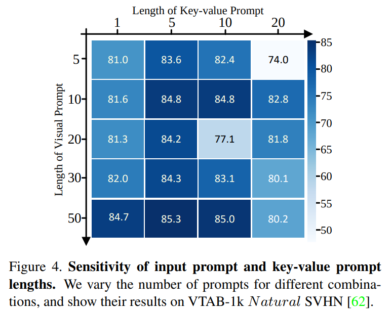

논문 및 이미지 출처 : <https://openaccess.thecvf.com/content/ICCV2023/papers/Han_E2VPT_An_Effective_and_Efficient_Approach_for_Visual_Prompt_Tuning_ICCV_2023_paper.pdf>

# Abstract

Transformer-based model 크기가 계속 커짐에 따라 new tasks 를 위해 이러한 large-scale pre-trained vision model 을 fine-tuning 하는 것은 점점 더 많은 parameter 를 필요로 함

parameter-efficient learning 은 fine-tuning 중 tunable parameter 수를 줄이기 위해 개발됨

이러한 방법들이 유망한 결과를 보이지만, 여전히 full fine-tuning 과 비교하여 상당한 성능 격차가 존재

이 도전 과제를 해결하기 위해 저자는 large-scale Transformer-based model adapting 을 위한 Effective 및 Efficient Visual Prompt Tuning (E$^2$VPT) 제안

- 구체적으로, 저자는 self-attention 과 input layer 에 각각 learnable key-value prompts 와 visual prompt 를 도입하여 model fine-tuning 의 효과를 향상
- 또한, 모델 성능을 유지하면서 low importance prompts 를 systematically pruning 하는 prompt pruning procedure 를 설계하여 모델의 효율성을 크게 향상시킴.
- 실험 결과, 저자의 접근 방식은 two benchmarks 에서 SOTA baselines 를 능가하며, considerably low parameter usage (e.g., VTAB-1k 에서 model parameters 0.32%)을 나타냄.

# 1. Introduction

AI 의 발전은 성능 향상 뿐 아닌 지속 sustainable deployment 에도 중점을 둬야 한다. visual task 에선 성능 개선을 추구하는게 매력적이지만, 현재 model size 가 빠르게 증가함에 따라 energy-intensive 및 computationally expensive training 이 필요하게 되었다.

Transformer-based architecture 는 현재 ViT-Huge (632M) 와 Swin-Large (197M) 와 같은 visual model 에서 지배적이며, 이는 ResNet (25M) 같은 CNN 보다 훨씬 더 많은 파라미터를 포함한다.

이러한 large-scale model 에 대한 scratch training 은 limitied data 와 낮은 정확도에서의 느린 수렴 등의 문제를 야기한다. 이러한 문제를 극복하기 위한 일반적인 패러다임은 _pretrain-then-finetune_ 으로, 이는 방대한 양의 training data 필요성을 줄이고 다양한 visual tasks 의 처리를 가속화한다.

그러나 traditional _full fine-tuning_  은 각 task 에 대해 backbone parameter 의 complete copy 를 저장하고 배포해야 하므로 계산 비용이 많이 들고 빠른 모델 배포에 적합하지 않다.

---

이 문제를 해결하기 위해 크게 세 가지 주요 범주로 나눌 수 있다: partial tuning, extra module 및 prompt tuning

- _Partial tuning_ : classifier head 또는 last few layers 같은 backbone 의 일부만 fine-tuning 하고 나머지는 freezing
- _Extra module_ : network 에 learnable bias term 또는 additional adapters 를 삽입하여 적응
- _Prompt Tuning_ :  Transformer 의 input layer 에 prompt token 을 추가하여 backbone 자체를 변경하거나 fine-tuning 하지 않음

이러한 모든 방법은 _pretrain-then-finetune_ 패러다임 내에서 작동하여 full fine-tuning 과 비교하여 learnable parameter 수를 줄일 수 있다. 그러나 유망한 결과에도 불구하고, 기존의 parameter-efficient approach 에는 두 가지 주요 한계가 있다.

1. 이들은 Transformer 의 self-attention mechanism 의 core architecture 를 면밀히 조사하지 않아 full fine-tuning 과 큰 성능 격차가 발생
2. 합리적인 성능을 달성하기 위해 비교적 많은 수의 파라미터를 fine-tuning 해야 하며, parameter-efficiency 의 극한을 탐구하지 못함.

이 관점은 두 근본적인 질문으로 이어짐: 

이러한 관점은 두 가지 근본적인 질문으로 이어집니다: ❶ large-scale transformer-based vision models 에 대해 prompt tuning 의 **effectiveness** 를 어떻게 입증할 수 있는가? ❷ tunable parameters 를 줄이기 위해 parameter **efficiency** 의 극한을 어떻게 탐구할 수 있을까?

이 두 가지 질문이 저자의 연구의 기초이다. 저자는 직관은 이전의 prompt tuning 처럼 input 수정에만 집중하는 대신, fine-tuning 중 self-attention mechanism 을 개선할 잠재력을 명확히 조사하고, parameter efficiency 의 극한을 탐구해야 한다는 것

- 

question ❶ 에 대한 응답으로, 

- 저자는 Transformer 의 self-attention mechanism 을 분석하고, 이는 global context 내에서 long-range token dependencies 을 capture 하는데 중요한 역할을 함.
- input visual prompt 에 추가하여, 저자는 learnable key-value prompts 를 도입하고 이를 self-attention layer 의 key 및 value matrices 에 통합
- key-value prompts 는 fine-tuning 중 input visual prompts 와 함께 jointly learning
- 이 접근법은 Transformer 의 well-designed prompt architecture 을 효과적으로 활용하여 상당한 성능 향상을 가져옴.
- 또한, 현재 Transformer architecture 에 대한 일반적인 plug-and-play prompt module 을 제공하며, vision domain 에서 언급된 모든 연구와 개념적으로 다른 fine-tuning solution 을 제공

question ❷ 에 대한 동기 부여로, 

- 저자는 model performance 를 유지하면서 parameter 수를 줄이기 위한 pruning 전략을 제안
- 저자의 접근법은 주어진 task 에 대해 original over-parameterized network 의 text accuracy 를 맞출 수 있는 sub-network 가 존재한다는 lottery ticket hypothesis (LTH) 에서 영감을 받음.
- 이 패러다임을 바탕으로, 저자는 prompt tuning 의 핵심 설계를 재검토하고 learnable parameter 수를 더욱 줄임
- 구체적으로, 성능에 크게 기여하는 prompt token 을 유지하면서 fine-tuning 중 redundant 또는 unnecessary prompt tokens 을 pruning
- 이러한 불필요한 prompt 를 pruning 함으로써 prompt tuning efficiency 를 크게 향상시키면서 성능을 유지

question ❶-❷ 에 대한 답변으로, 저자는 **E**ffective 및 **E**fficient **V**isual **P**rompt **T**uning (E$^2$VPT)을 제안

- E2VPT 는 architecture aware 및 pruning-anchored  의 novel prompt tuning framework
- 저자 제안하는 접근법은 visual 및 key-value prompt 를 설계하여 fewer parameters 로 우수한 성능을 달성하는 방법을 자세히 설명
- 다양한 벤치마크, 백본 및 다른 pre-training objectives 에 대한 설득력 있는 실험 결과를 제시
- 구체적으로, 저자의 접근법은 VTAB-1k 에서 full fine-tuning 과 비교하여 평균 5.85% 의 정확도 향상을 달성하며, VPT 와 비교하여 1.99% 향상
- 더욱이, 기존 방법보다 훨씬 적은 learnable parameters 를 사용하며, VTAB-1k 에서 백본 파라미터의 평균 0.32% 만을 차지함. 
- 저자는 또한 VPT 와의 비교 우위를 hyperbolic visualization 을 통해 설명.
- 마지막으로, language domain 에 대한 강력한 알고리즘 일반화를 설명합니다.

# 2. Related Work

### 2.1. 비전 트랜스포머

NLP 에서 Transformer 의 성공에 영감을 받아, 이를 image classification, image segmentation, objective detection, pose estimation 등 다양한 supervised vision tasks 로 확장함.

또한, Self-supervised pre-training 패러다임도 탐구되어 SOTA 도출

Transformer 는 visual-related 분야에 탁월한 성능과 확장성 덕분에 CNN 을 능가한다. 

그러나 다양한 vision task 에 Transformer 를 적용하기 위해 필요한 상당한 계산 및 parameter overhead 는 무시할 수 없다

예를 들어, 최근의 Transformer-based model 인 MViTv2-Large (218M), ViT-G (1.8B), SwinV2-G (3.0B), V-MoE (14.7B) 는 상당한 계산 비용을 초래한다.

따라서 저자는 Transformer-based architecture 의 계산 비용을 줄이면서 pretrain-then-finetune 패러다임에서 높은 성능을 유지하도록 설계된 E2VPT 를 제안한다.

### 2.2. 파라미터 효율적인 미세 조정

비전 커뮤니티에선 Vision Transformer 의 등장과 함께 효율적인 모델 훈련이 많은 관심을 받고 있지만, 이러한 모델들은 효과적이고 널리 사용되지만 실질적인 배포와 적응에는 너무 큰 경우가 많음.

그 결과, pretrain-then-finetune 패러다임이 일반적으로 사용된다. full fine-tuning 은 강력한 성능을 보장하지만, 네트워크의 all parameters 를 업데이트하는 데 드는 비용이 많이 든다.

이 문제를 극복하기 위해, 연구자들은 parameter efficiency 와 강력한 성능 간의 균형을 맞추는 대안을 탐구하고 있으며, 이는 크게 세 가지 그룹으로 나눌 수 있음: _partial tuning_, _extra module_, _prompt tuning_.

- _Partial tuning_ : PEFT 로 널리 사용됨. 이 방법은 대부분의 백본을 고정하고, fewer parameters 만 fine-tuning.
  - 예로, linear 또는 MLP head 또는 백본의 일부 blocks/layers 만 fine-tuning
  - 이 방법은 간단하고 구현이 쉽지만, full fine-tuning 에 비해 성능 격차가 큰 경우가 많음. 
- _Extra module_ :  fine-tuning 을 위해 learnable plug-in architecture 설계
  - 예로, original network 를 고정하면서 side structure 도입
  - 백본에 additional residual units 을 삽입한 연구도 있음.
  - 그러나 이러한 방법의 단점은 inserted module 이 특정 architecture 에 맞춤화되어 다른 아키텍처에는 일반화되지 않을 수 있다는 점
  - 또한, 이러한 모듈은 partial tuning 에 비해 더 많은 파라미터를 소모하는 경우가 많음. 
- _Prompt tuning_ : 이는 원래 language domain 에서 빠른 모델 적응을 위해 제안됨.
  - 이 방법은 백본의 input 에 learnable vector set 을 추가하고, fine-tuning 중 이 task-specific prompt 만 update.
  - 최근에는 visual-related prompting 이 vision domain 에 도입되어 input sequence 에 visual prompt 를 설계하고 full fine-tuning 과 competitive performance 를 보임
  - 그러나 현재의 방법들은 Transformer-based architecture 의 내부 설계를 고려하지 않아 덜 효과적인 prompting solution 제공

반면, 저자는 아키텍처를 고려하고 pruning 을 기반으로 하여, 위에서 논의된 방법들과 개념적으로 차별화.

# 3. Our E$^2$VPT Approach

## 3.1 Problem Definition

large data set 및 task 에 pre-training 된 vision transformer $T$ 가 있다고 가정.

- vision transformer 의 input patches sequence $I = {I_1, I_2, ... , I_m}$ 로
  - $m$ : image patch total number
- 각 patch 는 positional encoding 을 사용해 $d$-dimensional 로 project
  - 즉, $E = \{E_j | 1 ≤ j ≤ m\}$ 이며 $E_j = Emb(I_j)$. 
- vision transformer $T$ 는 $N$ identical transformer layers 로 구성되며, 다음과 같음:

$$
\begin{equation}
    \begin{align*}
        Z^1 &= L_1(E) \\
        Z^i &= L_i(Z^{i-1}) \quad i = 2, 3, ..., N
    \end{align*}
\end{equation}
$$

- 각 transformer layer 는 multi-head self-attention (MSA) 와 feed-forward (FFN) 의 stack:

$$
\begin{equation}
    L(·) = FFN (MSA (·))
\end{equation}
$$

new task 가 주어졌을때, target 은 small parameters 만 tuning 하면서 task 에서 good performance 를 낼 수 있는 model $\hat{T}$ 를 fine-tuning 하는 것이다.

visual prompt tuning 의 맥락에서, $\hat{T} = {\textcolor{skyblue}{T}, \textcolor{red}{P}}$ 는 $\textcolor{skyblue}{\text{frozen}}$ backbone $\textcolor{skyblue}{\text{T}}$ 와 very few tunable parameters 인 $\textcolor{red}{\text{trainable}}$ prompts  $\textcolor{red}{\text{P}}$ 를 포함

## 3.2 Effective Prompting

기존 prompt tuning 은 Transformer layer 의 input sequence 에 visual prompt 를 추가해 tuning 하는데 중점을 두며, Transformer arhcitecture 내부 설계는 고려하지 않음.

그러나 prompt tuning 의 효과를 높이고 optimal fine-tuning 의 성능을 달성하기 위해, 저자는 input sequence 내의 visual prompts $P_I$ 외에도 key-value prompt $P_K$ 및 $P_V$ 를 통합하는 새로운 접근 방식을 제안

직관적으로, input sequence 에 삽입된 input visual prompts 는 new task 를 나타내기 위해 학습됨

key-value prompt 는 self-attention module 의 key 밒 value parameter matrices 와 결합되어 data 에서 new attention pattern 을 capture 하는 것을 학습

#### Visual Prompts

visual prompts 는 input visual tokens 와 동일한 dimensionality 를 가지는 $d$-dimensional embedding vectors set 이다.

- 이 prompts 는 각 transformer encoder layer 의 input sequence 에 추가되어 all input tokens 와 상호작용.
- visual prompt 는 traditional prompt tuning method 의 prompt token 과 유사한 역할을 하며, model 이 new task 를 수행하도록 하는 task-specific embeddings 를 학습
- 형식적으로, 이러한 visual prompt 는 $P_I = \{ P^1_I, P^2_I, ... , P^N_I \}$ 로 정의
  - $P^i_I$ : $i_{th}$ encoder layer 의 learnable visual prompts
  - $N$ : layer total number
- 이후 encoder layer 는 다음과 같이 나타냄:

$$
\begin{equation}
    \begin{align*}
        Z^1 &= \textcolor{skyblue}{\text{L}_1} (\textcolor{red}{\text{P}^1_I}, \textcolor{skyblue}{E}) \\
        Z^i &= \textcolor{skyblue}{\text{L}_i} (\textcolor{red}{\text{P}^i_I}, Z^{z})\quad i = 2, 3, ..., N
    \end{align*}
\end{equation}
$$

- $Z^i$ : $i_{th}$ encoder layer 에 의해 계산된 context embedding
- input image patches $E$ 의 embedding 은 backbone 의 frozen Emb projection 으로 초기화

#### Key-Value Prompts

- visual prompt 는 new task 에 대한 knowledge learning 에 유용
- 하지만 new data 에서의 information interaction 유도에는 충분하지 않다. 이는 new data 에서의 fine-tuning 이 image distribution 을 pre-trained image examples 와 크게 다를 수 있기 때문.
- 따라서 fine-tuning data 에서 new information 을 capture 하고 new pattern 을 학습하기 위해 input token 간의 attention 을 더욱 효과적으로 수행하는 모델 능력을 강화하는 것이 중요

이를 위해, 저자는 각 encoder layer 내의 attention module 에 new key-value prompts set $P_K$ 및 $P_V$ 를 도입하는 새로운 접근 방식 제안 (Fig. 2(a))

- 이러한 key-value prompts 는 few columns 이지만, original attention module 의 key-value matrices 와 동일한 raws 를 가지는 small matrices
- new attention 계산을 위해, key 밒 value matrices 은 각각 해당하는 $P_K$ 및 $P_V$ prompt 와 결합
  - 이 과정은 다음과 같이 정의:

$$
\begin{equation}
    \begin{align*}
        L(·) = \textcolor{skyblue}{\text{FFN}} (\textcolor{red}{\text{MSA}} (·)) \\
        MSA(·) = concat(softmax(\frac{\textcolor{skyblue}{Q_h}\textcolor{red}{K'_h}^T}{\sqrt{d}})\textcolor{red}{V'_h})
    \end{align*}
\end{equation}
$$

- FFN : feed forward network
- MSA : encoder layer 내부의 multi-head attention
- $h$ : $h_{th}$ head
- $\textcolor{red}{K'}$ 및 $\textcolor{red}{V'}$ : new key 및 value embedding matrices:

$$
\begin{equation}
    K' = concat(\textcolor{skyblue}{K}, \textcolor{red}{P_K}), V' = concat(\textcolor{skyblue}{V}, \textcolor{red}{P_V})
\end{equation}
$$

- $K$ 및 $V$ : backbone 의 original key 및 value matrices
- 이렇게 key-value prompt 가 new data 에 대한 model adapting 을 돕는데 기여할 수 있음
- 저자의 구현에서는 separate learnable vectors 를 tuning 하는 대신, 각 Transformer layer 내에서 $P_K$ 및 $P_V$ prompts 를 parameter sharing 을 가능케 함
- 저자의 동기는 두 가지: 
  1. 저자의 실험 결과에 따르면 shared prompt 를 사용하면 fine-tuning 성능이 일관되게 향상
  2. shared prompt vectors 를 사용하면 learnable transformer part 의 parameter usage 가 절반으로 줄어들어 parameter-effcient 를 높임

---

self-attention mechanism 에서 query matrix $Q$ 는 또 다른 중요한 요소.

하지만 $Q$ 에 대한 additional prompting 은 두 가지 이유로 바람직하지 않음:

1. $Q$ 에 대한 prompt 는 $Q$ 와 $K$ 의 각 pairs 사이의 attention score 계산과 유사. 따라서 $Q$ 와 $K$ 모두에 대한 prompt 는 불필요.
2. $Q$ 의 변화는 attention map  의 output 형태에 영향을 미쳐 next layer 에서의 일치하지 않는 차원에 대한 additional linear projection 이 필요. 이는 parameter efficient 측면에서 감당할 수 없음.

## 3.3 Efficient Prompting

저자의 effective prompting 기법은 fine-tuned model 의 성능을 향상시키는 것을 목표로 함.

자연스럽게 드는 질문은, moidel performance 를 희생하지 않고 tunable prompts 수를 줄일 수 있는가이다.

lottery ticket hypothesis (LTH) 에 따르면, 주어진 task 에서 unnecessary weights 없이 original over-parameterized network 와 동일한 test performance 를 달성할 수 있는 sub-network 가 존재한다.

이 가설에 영감을 받아, 저자는 다양한 visual prompt 를 masking 하는 실험을 수행하며, 다양한 prompt 가 model performance 에 미치는 영향이 다르며 일부는 오히려 negative impact 를 미치는 것을 발견.

이 발견을 바탕으로, 저자는 visual prompt 에 대한 prompt pruning 방법을 제안

- 이 방법의 주요 목표는 가장 영향력 있는 prompt 를 유지하면서 redundant 또는 unnecessary 를 제거하는 것.
- less important prompt 를 제거함으로써, 저자는 prompt tuning 의 efficiency 를 크게 향상시키면서 성능을 유지할 수 있음.
- 이를 달성하기 위해, 저자는 token-wise pruning 및 segment-wise pruning 이란 두 가지 세분화 수준에서 작동하는 cascade pruning 전략 설계 (Fig. 2(d)).
  - token-wise pruning 은 처음에 가장 중요하지 않은 visual prompt 를 식별하고 제거
  - 이후, segment-wise pruning 은 남아 있는 각 prompt 를 multiple segments 로 나누고 negative segments 를 filtering
  - learnable visual prompts 의 parameter usage 를 공동으로 줄임으로써, 저자의 두 단계 pruning 접근법은 re-training 단계에서, rewinding stage 에서 re-train 될 수 있는 soft filtered prompt 생성

### Token-wise Pruning.

저자는 각 Transformer layer 의 input visual prompt 와 연관된 learnable mask variable $ρ = \{ ρ_1, ρ_2, ... , ρ_M \}$ ($M$ 은 visual prompt length) 를 도입

- $ρ_k \in \{ 0, 1 \}$
- 0 은 해당 learnable input prompt 가 pruning 되었다는 것을 의미
- 이후 masked visual prompt 는 $\widetilde{P_k} = ρ_k · P_k$ 가 됨.
- pruning position 결정을 위해, 저자는 각 prompt token 의 importance score 를 계산하고 lowest scores 를 가진 position 을 제거
- importance score 는 mask variables $ρ_k$ 에 대한 model 의 sensitivity 의 기대값으로 정의:

$$
\begin{equation}
    S_{P_k} = \mathbb{E}_{x \sim \mathcal{D}_x}|\frac{∂\mathcal{L}(x)}{∂ρ_k}|
\end{equation}
$$

#### Segment-wise Pruning.

저자는 각 prompt 내의 negative prompt segments 를 배제하기 위해 , segment-wise pruning 를 추가로 조사.

- 각 prompt token 의 embedding 을 먼저 동일하게 $R$ parts 로 나눔
- 각 part 는 isolated unit 으로 취급되며 jointly optimizing
- token-wise pruning 과 유사하게, prompt token 내의 각 segment 에 mask 를 할당하고 importance score 가 낮은 segment filtering

#### Rewinding.

two-level cascade pruning 수행 후, weight rewinding stage 는 soft filtered prompt tokens 를 re-training 하는데 중점을 둠

- 이 과정은 pruning stage 에서 각 layer 의 importance scores 를 매긴 후, importance score 가 낮은 경우 해당 mask variable 를 0 으로 설정하는 것을 포함
- 다음, soft filtered input prompts 는 fine-tuning 중에 original combination (learning rate, weight decay) 를 사용하여 다른 learnable parameters 를 함께 재훈련

# 4. Experiment

## 4.1. Experimental Setup

#### Datasets.

저자의 실험은 두 가지 image classification benchmark 수행

- **VTAB-1k** : 19 benchmark Visual Task Adaptation 을 수집하여, 세 가지 그룹으로 분류됨:
  1. _Natural_ : 일반 카메라로 촬영된 자연 이미지를 포함
  2. _Specialized_ : 특수 장비로 촬영된 이미지를 포함
  3. _Structured_ : 기하학적 이해를 요구하는 작업(e.g., counting, distance)을 포함
  - VTAB-1k 의 각 task 에는 1000 training examples 포함
  - 이전 연구를 따라, 저자는 hyper-parameter tuning 을 위해 training set 을 800-200 split
  - 최종 평가는 full training data 를 사용하여 수행
- **FGVC** : CUB-200-2011, NABirds, Oxford Flowers, Stanford Dogs 및 Stanford Cars 를 포함한 5 benchmark Fine-grained Visual Classification 포함
  - 이전 연구를 따라, training set 은 무작위로 90% train 과 10% val 로 split
  - 저자는 hyper-parameter tuning 을 위해 val 사용

#### Baselines.

공정한 비교를 위해, 이전 연구를 따라 E²VPT 와 널리 사용되는 PEFT 비교

image classification 에 대한 두 가지 vision transformer architecture: Vision Transformer (ViT) 와 Swin Transformer (Swin) 의 결과 논의.

또한 E²VPT 를 두 가지 self-supervision objective, MAE 및 MoCo v3 에 적용

#### Training.

저자는 각 task 에 대해 best tuning hyperparameter, learning rate (e.g., [50, 25, 10, 5, 2.5, 1, 0.5, 0.25, 0.1, 0.05]) 및 weight decay (e.g., [0.01, 0.001, 0.0001, 0.0])를 맞추기 위해 grid search

- 주목할 점은, E²VPT 는 이전 연구에서 특별히 설계된 large learning rate 를 필요로 하지 않음.
- 모든 모델의 learning rate 는 cosine decay 를 따라 일정하며, 100 epochs (10 warm-up epochs) 동안 훈련
- 저자는 이전 연구에서와 같은 batch size 설정을 따름: 각각 ViT-Base/16에 대해 64/128, Swin-Base 에 대해 80. 각 token 의 segment 수 는 8 로 설정
- prunikng stage 의 백분율은 10% 에서 90% 사이에서 10% 간격으로 linear search
- rewinding stage 는 한번만 재훈련

#### Reproducibility

E²VPT 는 Pytorch 로 구현.

실험은 NVIDIA A100-40GB GPU 에서 수행.

## 4.2. Comparison with State-of-the-Arts

각각 ViT, Swin 및 두 가지 self-supervised objectives - MAE 및 MoCo v3 에 대한 E²VPT 의 성능과 견고성을 검사

#### E²VPT on ViT

저자는 3 runs 를 4 task groups 에 대한 VTAB-1k 및 FGVC benchmark 의 평균 정확도 점수를 Tab. 1 에 보고하며 E²VPT 를 다른 8 tuning protocols 와 비교

- 구체적으로, Full 은 backbone 및 classification head 모두 업데이트;
- Linear, Parital-1 (top layer) 및 MLP-3 (3 MLP layers) 는 partial tuning
- Sidetune, Bias 및 Adapter 는 backbone 에 new trainable parameters 를 추가하는 extra module
- VPT 는 가장 최근의 visual prompt tuning

이 결과로부터 몇 가지 주요 관찰이 있음.

- E²VPT 는 대부분의 경우에서 full fine-tuning 을 능가할 수 있으며, 24 task 중 12 에서 그럼.
  - 예로, 저자의 모델은 FGVC 에서 0.68%, VTAB-1k Structured 에서 9.75% 의 개선을 달성
  - 이 관찰은 large-scale vision model adaptation 의 신속성을 위한 저자의 접근법의 효과 보여줌.
  - 반면, 저자의 모델은 backbone 에서 0.39% 의 parameter 만 training 하므로, full fine-tuning 보다 훨씬 parameter-efficient
- prompt tuning 기반 접근법이 일반적으로 partial fine-tuning (Partial-1) 및 extra module (Adapter) 과 같은 PEFT 를 능가하는 것을 보는 것은 놀라운 일이 아님.
  - 이는 large-scale vision model 에 대한 prompt tuning 의 뛰어난 adapting 을 나타냄.
  - prompt tuning 의 learnable parameter 수 또한 다른 방법보다 작음.
- 저자의 접근법은 항상 강력한 VPT 모델을 능가하며, learnable prompt 수가 더 적음.
  - 이는 key-value prompt 의 효과적인 설계와 효율적인 prompt pruning 의 효과를 보여줌
  - VPT 는 input visual prompt 의 설계에만 집중하기 때문에, new data 에서 image patch 간의 정확한 상호작용을 capture 하는데 실패함.
  - 반면, E²VPT 의 key-value prompt 는 이 격차를 효과적으로 메움.

#### E²VPT on Hierarchical Transformer

저자의 아키텍처 디자인의 효과와 일반화를 증명하기 위해, 저자는 E²VPT 를 hierarchical transformers - Swin 으로 확장하며, 이 모델은 MSA layer 는 local shifted windows 에서 사용되고, patch embedding 은 deeper layers 에서 병합됨

- 일반성을 위해, 저자는 ViT architecture 의 동일한 설정을 따라 K-V learnable paris 를 prepend 하고 이전 연구를 따라 input vectors 를 변경 (i.e., 이러한 learnable vectors 는 local windows 내에서 attend 되며 patch merging 시 무시됨).
- pruning 의 경우, deeper local window 내에서 통합할 때 성능이 떨어지는 것을 발견
  - 따라서 저자는 pruning stage 는 first stage 만 할당
- Swin 은 [CLS] 를 사용하지 않으며, classification head 의 input 으로 global pooling 적용
  - 저자의 방법을 적응할 때 이 설계를 따름.
- 광범위한 실험은 ImageNet-21k supervised pre-trained Swin-Base 에서 배포.
- E²VPT 는 VTAB-1k 의 세 가지 problem classes 에서 all other PEFT 를 지속적으로 능가하며, full fine-tuning 을 처음으로 VTAB-1k _Specialized_ 및 _Structured_ 에서 능가 (i.e., 0.21%)

#### Different Pretraining Methods

저자는 VPT 의 접근법을 따라, pretrained backbone with unlabeled data 에서 두 가지 self-supervised objectives, MAE 및 MoCo v3 으로 실험을 수행.

- VPT 는 이러한 objective 에서 결론을 내리지 못했지만, 저자의 제안된 방법인 E²VPT 는 다른 방법을 능가하고 full fine-tuning 과 competitive performance 달성 (MAE 에선 19 instance 중 8, MoCo v3 에선 19 instance 중 12).
- 저자는 VPT 에서 논의된 격차를 활용했으며, 이는 self-supervised ViT 가 supervising 된 것과 근본적으로 다르다는 것을 나타내며, 저자의 방법의 일반성을 두 가지 pre-training objective 에 대해 입증

## 4.3. Diagnostic Experiments

#### Impact of Different Components.

E²VPT 의 다양한 구성 요소(visual prompt, key-value prompt, pruning 및 rewinding) 가 미치는 영향을 조사하기 위해 2 task 에서 실험 수행.

- SVHN 에 대해, visual prompt 만 사용한 모델이 78.1% 의 정확도를 달성
- key-value prompt 를 각각 pruning 과 rewinding 기법을 적용한 결과, 각각 5.7% 및 0.9% 의 추가 향상이 나타났으며, 이는 self-attention module 에서 key-value prompt tuning 기술과 pruning 메커니즘의 효과를 입증
- 마지막으로, 모든 구성 요소를 결합한 결과, 85.3% 의 최고의 성능을 달성.
- FGVC NABirds 에서도 유사한 경향이 관찰.

#### Prompt Location.

E²VPT 와 다른 방법들 간의 근본적인 차이점은 self-attention 에 도입된 learnable key-value prompt 이다.

- 구현에서 저자는 key-value prompt 를 key 와 value matrices sequence 앞에 추가함.
- learnable prompt 의 적절한 배치를 결정하기 위해 추가 조사 필요
- VTAB-1k 에 대한 ablation 결과를 Tab. 5(a) 에 포괄적으로 제공

- learnable prompt 를 key 와 value matrices 앞 또는 뒤에 추가하는 두 가지 경우 모두 competitive 결과를 보여줌
- 이는 prompt location 에 대한 robustness 입증
- 평균적으로 약간 더 나은 결과를 보여주는 "Before" 를 모든 실험에서 기본 방법으로 선택 (e.g., 73.94% vs 73.91%).

#### Initialization.

Tab. 5(b) 는 VTAB-1k benchmark 에 대한 두 가지 널리 사용되는 initialization 방법 (_truncated normal_ 및 _He initialization_) 에 대한 성능을 보고.

- 결과는 He initialization 이 일반적으로 더 안정적이고 바람직한 성능을 제공함을 보여줌.
- 그러나 일부 특정 과제에서는(e.g., VTAB-1k Specialized Diabetic Retinopathy Detection 에서 정확도가 1.1% 더 높음) truncated normal 이 약간 더 나은 결과를 보여줌.
- 결론적으로, E²VPT 는 다양한 초기화 방법에 대해 robust 하며 full fine-tuning 과 일관된 성능을 달성할 수 있음

#### Prompt Length

prompt length 는 E²VPT 에서 조정해야 하는 유일한 hyper-parameter.

모델 성능에 미치는 다양한 prompt length 의 영향을 분석하기 위해, VTAB-1k Natural SVHN 에서 visual prompt 와 key-value prompt length 에 대한 종합적인 연구를 수행

- visual prompt length 는 일반적으로 [5, 10, 20, 30, 50] 으로 제한되며, key-value prompt length 는 대부분의 dataset 에서 표준 구성인 [1, 5, 10, 50] 으로 제한.
- 다양한 prompt length combination 에 대한 모델 성능 결과는 Fig. 4 에 보고

- 50 visual prompt 를 사용할 때, 상대적으로 shorter key-value prompt 가 성능에 눈에 띄게 도움이 된다는 것을 알 수 있음 (e.g., key-value prompt 를 도입하지 않은 경우 78.1% 에서 key-value prompt 하나를 도입한 경우 84.7%).
- key-value prompt length 를 더 늘리면 성능이 약간 향상 (e.g., 5 key-value prompt 사용한 경우 85.3%).
- 또한, 많은 수의 key-value prompt 를 성능이 떨어진다는 것을 알 수 있음 (e.g., 20 key-value prompt 사용한 경우 80.2%).
- 다른 visual prompt length 에서도 유사한 패턴이 관찰
- self-attention layer 에서도 heavy parameter engineering 이 original attention map 을 왜곡하여 adapting 에 해를 끼칠 수 있다고 주장

## 4.4  Visualization

이전 연구를 따라, FGVC 의 3 tasks (CUB-200-2011, Oxford Flowers, Stanford Dogs) 에 대해 VPT 와 저자의 model training set 에서의 hyperbolic visualizations 결과를 보여줌.

- 구체적으로, hyperbolic space 는 constant negative curvature 를 가진 Riemannian manifold
- hyperbolic space 의 여러 isometric models 가 있지만, 이전 연구을 따라 Poincare ball model 을 사용
- 저자는 "hyperboloid" distance metric 을 사용하여 UMAP 을 사용해 dimension 을 2D 로 축소
- ViT-Base 는 두 가지 pre-training 방식 (즉, tuned model on VPT 및 저자의 rewinded model)으로 encoder 역할을 함
- model 을 fine-tuning 동안 고정하고 output embedding 을 hyperbolic space 로 mapping
- Adam optimizer 와 learning rate $3×10^{−5}$ 를 모든 setting 에 적용
- weight decay 는 0.01 이고 batch size 는 900
- 모든 모델은 공정한 비교를 위해 50 steps 동안 학습되며, gradient clip 은 norm 3

Fig. 3 은 learned embeddings 이 Poincare disk 에 어떻게 배열되는지 보여줌.

- E²VPT 에선 sample 들이 label 에 따라 clustering 되고 각 cluster 가 disk 의 경계에 더 가까워져 encoder 가 class 를 잘 구분하는 것을 나타냄
- 반면, VPT 에선 일부 sample 들이 중심으로 이동하고 혼합되는 것을 관찰
- project 과정에서 혼란이 있을 수 있음을 시사
- 이러한 시각화 결과는 new tasks 에서 input image 로부터  separatable embeddings 을 생성하는 데 있어 제안된 E²VPT 의 효과를 추가 검증

# 5. Conclusion

현재의 대부분의 _pretrain-then-tinetune_ 패러다임은 parameter usage 를 줄이려 하지만 transformer-based architecture 의 내부 설계를 간과하고 있음. 이 관점에서 저자는 adapting 중 transformer architecture modeling 을 위한 novel parameter efficient visual prompt tuning 인 E²VPT 를 제시

이 접근법은 여러 가지 장점을 가지고 있음: 

1. self-attention 메커니즘을 고려하여 현재의 parameter-efficient fine-tuning 보다 우수한 성능 발휘
2. input visual prompt 에서 parameter usage 사용을 줄이기 위해, pruning 및 rewinding 단계를 적용
3. 이러한 체계적인 장점은 effectiveness 및 efficiency 알고리즘이 가능하게 함.
