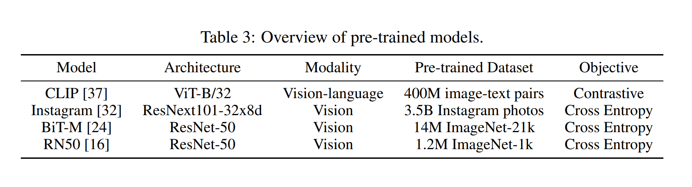
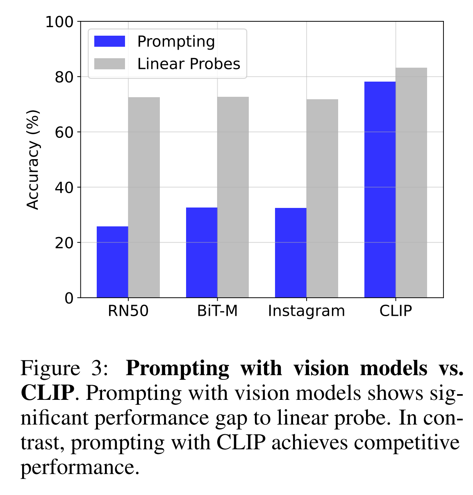
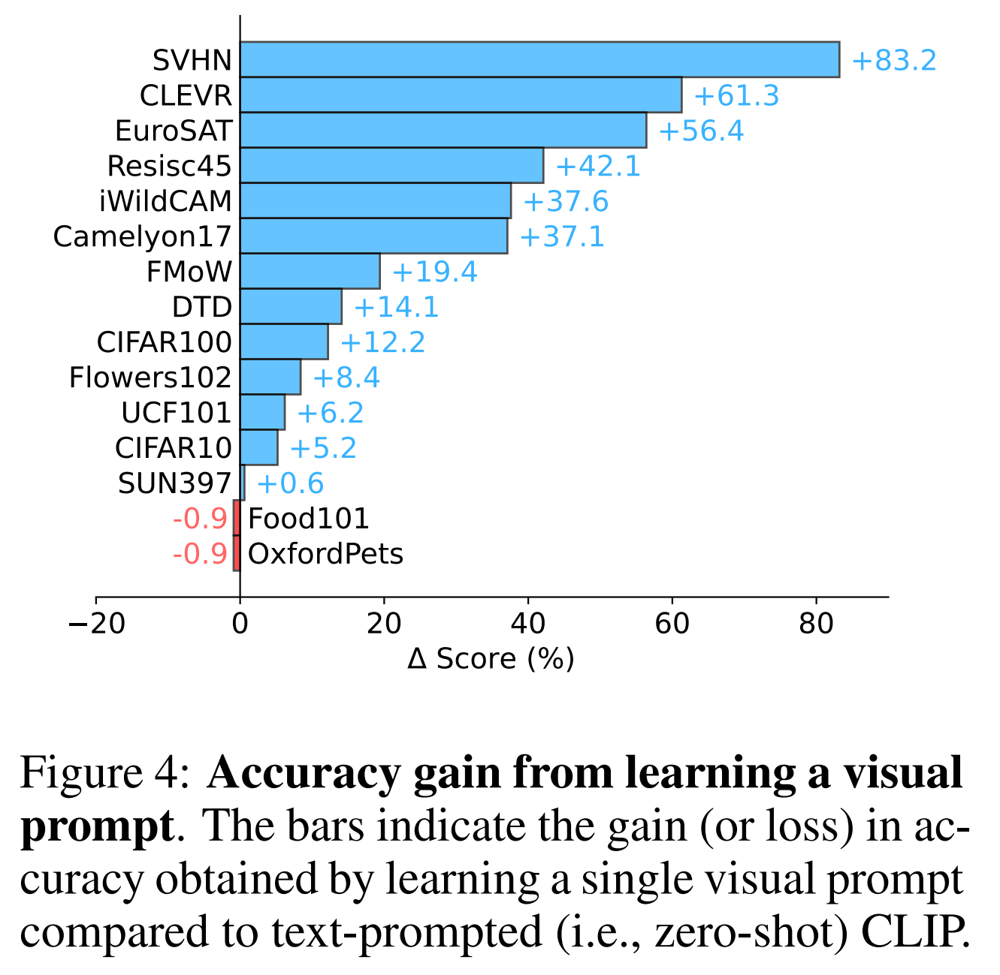
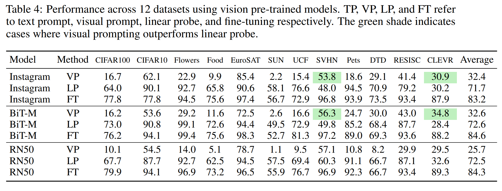
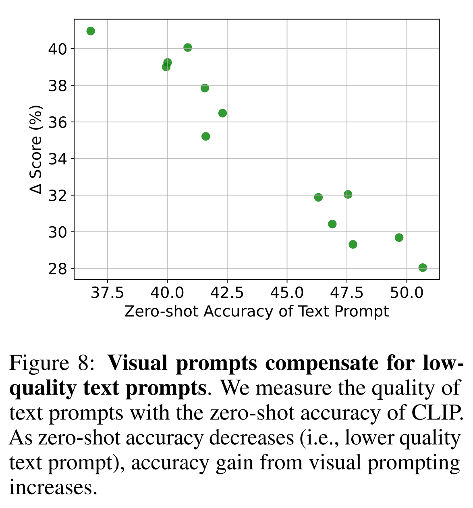

논문 및 이미지 출처 : <https://arxiv.org/pdf/2203.17274>

# Abstract

lage-scale models 을 vision 에 적응시키기 위해 _visual prompt_ 효과를 조사

- prompt tuning 과 adversarial reprogramming 의 최근 방법을 따라, frozen model 이 perturbation 을 통해 new task 를 수행하도록 single image perturbation 을 학습.
- 포괄적인 실험으로 visual prompt 가 CLIP 에 특히 효과적이며, distribution shift 에 강하고 standard linear probes 와 competitive performance 에 달성함을 입증.
- 저자는 downstream dataset 의 속성, prompt design 및 output transformation 이 adaptation performance 에 미치는 영향을 추가로 분석
- visual prompt 의 놀라운 효과는 vision 분야의 pre-trained model 을 적응시키는 새로운 관점을 제공

# 1. Introduction

new task 학습 시, current knowledge 에서 이를 확장하는 경향이 있다. 예로, 문장에 대해 이해하는 능력을 키우는 것으로, "학교 버스를 놓쳤어요" 라는 문장은 특정한 감정을 전달하며, 그 뒤에 "그래서 나는 [MASK] 느꼈어요" 라는 문장이 오면, 적절한 감정 단어를 제공할 수 있다. 

이 패러다임은 _prompting_ 으로, 최근 NLP 에서 large-scale language models 를 new task 에 적응시키기 위해 downstream dataset 을 pre-training task 의 형식으로 변환하는 방식이 인기다.

parameters 를 업데이트하지 않고도 모델에 제공된 prompt 의 mask 를 채우기 위해 기존 knowledge base 를 사용하여 new task 의 expert 가 된다.

prompting 은 NLP 에 특화되어, 다음 목적을 가지고 있다: _data space_ 를 수정하여 frozen pre-trained model 를 적응시키는 것이다. 이 일반성을 고려할 때, _pixel_ 혙애를 고려하여, pixel space 를 수정하여 frozen visual models 가 new task 를 해결할 수 있는지 본다.

---

adversarial reprogramming 은 input perturbations 를 통해 model 은 adversary 로 선택한 task 를 수행하도록 재목적화하는 일종의 adversarial attack 이다.

서로 다른 용어와 동기를 가지고 있지만, 이러한 input perturbations 은 본질적으로 visual prompt 역할을 하여 pixel 을 수정하여 모델을 new task 에 적응시킨다.

기존의 방법들은 adversarial goals 에 집중하거나 small-scale 과 model 에 제한적으로 적용되었다.

서로 다른 커뮤니티에서 기원한 adversarial reprogramming 과 prompting 은 input (i.e., prompt enginerring) and/or output (i.e., answer engineering) transforming 을 통해 _data-space adaptation_ 을 수행한다는 일반적인 아이디어를 공유한다.

---

NLP prompting 에 영감을 받아, 저자는 large-scale model 을 vision 분야에 적응시키기 위해 _visual prompting_ 의 효과을 조사하고자 한다

- pixel space 가 본질적으로 continuous 하기 때문에, prompt 는 continuous task-specific vector 로 취급하는 최근 접근 방식을 따른다
- model parameter 를 freezing 한 상태에서 single image perturbation(i.e., "soft prompt")를 backpropagation 을 통해 학습
- 저자는 CLIP 을 위해 discrete text prompt 를 사용하고 vision model 을 위해 hard-coded mapping 을 사용하여 model output 을 downstream label 에 mapping 한다

---

visual prompting 은 기존 adaptation 과 다른 것은, 현재 vision 분야의 standard adaptation 방법은 fine-tuning 과 linear brobe 이다.

두 방식 모두 모델에 어느 정도 접근이 필요: fine-tuning 의 경우 entire parameters, linear probe 의 경우 model output(보통 penulimate layer 의 activation).

반면, visual prompting 은 model input 을 적응시킨다. 

- visual prompting 획득 후, test 시 model 접근이 필요 없음
  - 이는 시스템의 최종 사용자가 통제할 수 있는 고유 application 을 가능케 함
  - 예로, 보행자는 visual prompting 을 착용하여 자동차에 대한 가시성을 높일 수 있으며, 자동차 자체나 그 vision system 에 접근할 필요가 없다

저자는 4 pre-trained models 및 15 image classification dataset 을 통해 포괄적 실험 수행.

visual prompting 이 CLIP 에 대해 놀라운 효과를 보이며 distribution shift 에 robust 하며, standard linear probe 와 competitive performance 를 달성함을 입증

저자는 downstream dataset 의 속성, prompt design 및 output transformation 이 성능에 미치는 영향을 추가로 분석

목표는 specific task 에 SOTA 달성이 아닌, vision 분야에서 pre-trained model 을 적응시키는 새로운 패러다임을 널리 탐구하는 것

visual prompting 의 놀라운 효과는 vision 에서 pre-trained model 을 적용시키고 사용하는 새로운 관점을 제공

## 2. Related Work

## 2.1 Natural Language Prompting

NLP prompting 에 영감을 받았으며 NLP 의 prompting 은 downstream dataset 을 (masked) language modeling 문제로 재구성하여, frozen language model 이 parameters 를 업데이트하지 않고도 new task 에 직접 적응할 수 있도록 함. 

prompt 는 task-specific _template_ (e.g., "나는 너무 [MASK]을 느꼈다")과 label word(e.g., "행복/무서움")를 구성하여 공백을 채우는 것을 포함한다.

그러나 적절한 prompt 를 만드는 것은 domain expert 와 상당한 노력이 필요하다.

---

prefix tuning 또는 prompt tuning 은 model parameters 를 freezing 한 상태에서 backpropagation 을 통해 "soft prompt" 를 학습하여 문제를 완화한다.

prefix tuning 은 language model 이 다양한 generation task 에 적응할 수 있도록 task-specific continuous vector (i.e. prefix) 를 학습한다.

prefix tuning 은 이 prefix 를 각 encoder layer 에 처리하는 반면, prompt tuning 은 tunable token 을 input 에만 처리하여 단순화한다.

Billion 급 parameters 를 가진 large-scale model 에 적용될 때, 적절히 최적화된 prompt 는 model full fine-tuning 과 competitive performance 를 달성하면서도 메모리 사용량과 작업별 저장소를 크게 줄인다.

pixel space 의 prompt 는 본질적으로 continuous 하여, 저자는 이 작업의 연장선상에서 pixel 을 직접 최적화한다.

## 2.2 Prompting with Images

image prompting 을 시도한 초기 방법이 있다. prefix tuning 과 유사하게, 

Frozen 은 vision encoder 를 학습시켜 frozen language model 로부터 gradient 를 받아 image-conditional prompt 를 만든다. image 는 vision encoder 에서 continuous embedding 으로 표현되어, frozen language model 이 multimodal task 를 수행할 수 있도록 _visual prefix_ 로 사용된다. 

CPT 는 color block 과 color-based textual prompts 를 사용하여 visual prompt 를 만들고, visual grounding 을 빈칸 채우기 문제로 변환한다. 

그러나 이 방법들은 language-based model 의 능력을 확장하는 데 초점을 맞추고 있다. 반면, 저자는 visual representation 과 image classification dataset 에 대해 prompting 의 효율성을 조사하는데 중점을 둔다.

즉, pre-trained model 이 vision encoder 로 구성되어 있다 가정하고 image dataset 을 재구성하는데 집중한다.

Visual prompt tuning 은 Vision Transformers 에 특화된 visual prompt 를 제안하는 동시적 연구다. 

이 방법은 각 Transformer encoder layer 에 tunable parameters set 을 전처리하여 deep prompt tuning 을 사용한다.

## 2.3 Adversarial Reprogramming and Unadversarial Examples

 Adversarial reprogramming 은 single, class-agnostic perturbation 이 모델을 attacker 로 선택한 new task 를 수행하도록 reprogram 하는 adversarial attack 의 일종이다. adversarial goal 에도 불구하고, 이 framework 는 본질적으로 prompting 과 동일한 목적을 제공한다: downstream dataset 의 input and/or output 을 수정하고 frozen model 을 new task 에 적응시키는 것이다. 
 
그러나 vision 의 기존 방법은 adversarial goal 을 달성하거나 small-scale vision model 과 simple dataset 에 대한 제한된 응용을 보여준다. 마찬가지로, unadversarial examples 는 (pre-)trained task 의 성능을 향상시키는 것을 목표로 함.

이는 specific class(i.e., classs-conditional)에 대한 성능을 향상시키는 image perturbation 을 학습한다.

저자의 연구에선 adversarial reprogramming 을 visual prompt 의 한 형태로 재조명하고, large-scale vision model 을 적응시키는데 효율성을 조사한다.

## 2.4 Adapting Pre-trained Models in Vision

Fig. 2 는 pre-trained model 을 적응시키는 방법을 요약

fine-tuning 및 linear probing 은 new domain 이나 다른 output 의미를 가진 new task 에 적응시키는데 flexible 하게 사용 가능

하지만 이 방법들은 어느 정도의 모델 접근이 필요: fine-tuning 에는 parameters, linear probing 의 경우 model output(일반적으로 penultimate layer 이전의 activations).

domain adaptation 은 model adaptation 에 대한 흥미로운 대안으로, image-to-image translation 와 같은 기술을 사용하여 model 의 input 만 수정한다.

domain adaptation 과 마찬가지로 visual prompting 도 모델의 입력을 수정한다. 따라서 사용자가 visual prompt 를 발견한 후 test 시 모델 자체에 대한 제어가 필요하지 않다.

이는 고유한 응용 프로그램을 열어준다. 예로, 사용자는 input 만으로 조작할 수 있는 online API 에 domain adapted image 를 제공할 수 있다.

domain adaptation 은 source domain 을 target domain 처럼 보이도록 adapting 하는데 중점을 두며, source 와 target dataset 을 모두 사용할 수 있어야 한다.

반면, 저자는 visual prompting 이 모델을 더 임의 조정이 가능함을 보여준다. 예로, 한 classification task 를 수행하는 model 이 input pixel 을 perturbate 하는 것 만으로도 완전히 다른 classification task 를 수행하도록 적응할 수 있다.

또한 domain adaptation 방법은 일반적으로 input-conditional 인 반면, 이 논문에서 탐구하는 visual prompt 는 NLP 와 같이 frozen (i.e., input-agnostic) prompt 가 전체 dataset 에 걸쳐 추가된다.

# 3. Methods

prompting 과 adversarial reprogramming 이 같은 목적을 달성: data-space adaptation

일반적으로 두 단계로 구성한다.

- input transformation (prompt engineering) : input 에 적용될 task 를 지정하는 적절한 prompt 설계
- output transformation (answer engineering) : model 의 output/answer 을 target label 에 mapping

## 3.1 Pre-trained Models

pixel prompt 는 모든 visual representation 에 적용 가능.

저자는 세 가지 vision model 과 하나의 vision-language 를 선택한다

- Instagram 에서 pre-training 한 ResNetXt (Instagram)
- Big Transformer (BiT-M)
- ImageNet-1K 에서 pre-training 한 ResNet (RN50)
- CLIP

vision model 은 fixed set 의 pre-determined classes 를 예측하도록 훈련되어, unseen classes 를 예측하기 위해 별도의 layer 를 학습해야하는 반면, CLIP 은 text prompt 로 unseen class 에 유연하게 zero-shot trasnfer 을 수행할 수 있는 vision-language model 이다.

Instagram 에서 pre-training 한 ResNeXt 의 경우, ImageNet-1k 에서 추가로 fine-tuned model 을 사용.

저자는 다음과 같이 요약하며, 다양한 input modality, pre-trained dataset size, model architecture 등.

## 3.2 Input Transformation

visual prompt 설계엔 여러 가지가 있을 수 있다.

pixel space 는 자연어보다 덜 discrte 하기 때문에, 손수 만ㅇ드는 것이 어렵다.

실제로 각 downstream task 에 유용한 visual context 가 어떤 것인지도 명확하지 않다.

직관적으로, visual prompt 는 반드시 interpretability 할 필요는 없다; 이는 기계 학습 모델의 결정을 돕는 시각적 단서임.

따라서 모델이 visual context 를 최적화하도록 한다.

저자는 visual prompt 를 backpropagation 으로 직접 최적화하는 간단한 gradient-based approach 를 따른다.

### 3.2.1 Prompt Tuning

frozen pre-trained model $F$ 및 downstream task dataset $\mathcal{D} = \{ (x_1, y_1), \dots, (x_m, y_m) \}$ 이 주어졌을 때, 목표는 $\phi$ 로 parameterize 된 single, task-specific visual prompt $v_\phi$ 를 학습하는 것이다.

prompt 는 input image 에 추가되어 prompted image $x + v_\phi$ 를 형성한다.

training 중, model 은 correct label $y$ 의 likelihood 를 maximizing 한다.

$$
\begin{equation}
  \max_{\phi} P_{\theta;\phi}(y|x + v_\phi),
\end{equation}
$$

- 이때 gradient update 는 prompt parameters $\phi$ 에만 적용되며 model parameters $\theta$ 는 freezing

evaluation 중, optimized prompt 는 all test-time images 에 추가된다.

$$
\begin{equation}
  X_{\text{test}} = \{x_1 + v_\phi, ... , x_n + v_\phi\},
\end{equation}
$$

- 그리고 이는 frozen model $F$ 를 통해 처리

목표는 visual prompt 를 실용적인 적응 방법으로 탐색하는 것.

따라서 perturbations 를 감지할 수 없게 하는 어떠한 adversarial constraint 도 필요하지 않다. 또한 adversarial reprogramming 은 downstream dataset 이 pre-trained dataset 보다 lower-resolution 을 갖도록 가정하여, input perturbations 가 downstream dataset 주위에 padding 된다.

실제 applications 는 downstream dataset 의 resolution 이 다양할 수 있어, 모든 dataset 을 pre-trained model 의 input size 로 resizing 하고 prompt 를 input 영역에 직접 추가한다.

### 3.2.2 Prompt Design

visual prompt 를 template 및 size 측면에서 여러 설계 방법이 있음

세 가지 visual template 을 다룸

- random location 의 pixel patch
- fixed location 의 pixel patch
- padding

various prompt sizes $p$ 를 탐구하며, 실제 parameter 수는 $Cp^2$, padding 의 경우 $2Cp(H+W-2p)$ 이다.

- $C, H, W$ 는 각각 image channel, height 및 width
- section 6.2 에서 $p = 30$ padding 이 다른 설계에 비해 best performance 를 보여준다.
  - 저자는 이를 모든 실험의 기본값으로 설정

## 3.3 Output Transformation

model output 을 target label 로 mapping 하기 위해 vision model 및 CLIP 은 다른 방식 사용

- standard vision model 은 image class 를 number ID 로 취급 (e.g., "cat" 은 "index 1")
  - hard-coded mapping 을 사용하여 downstream class index 를 pre-trained class index 에 임의로 mapping 하고, unassigned indeces 는 loss computation 에서 제외
- CLIP 같은 vision-language model 의 경우, text prompt 를 output transformation function 으로 사용
  - image class 는 text 로 표현되며(e.g., "cat"), downstream task 의 context 를 지정하기 위해 prompt 추가(e.g., "a photo of a [object]"). 
  - single, fixed text prompt 를 사용하고 visual prompt 만 최적화
  - CLIP zero-shot transfer protocol 을 따르고 각 class 에 대한 embedding cosine similarity 를  계산하며, 이는 softmax 를 통해 probability distribution 으로 normalizing
  - 가장 높은 확률을 가진 class 가 model output 으로 선택

## 4. Implementation Details

visual prompt 학습을 위한 CLIP 의 objective function 은 evaluation setting 과 동일.

- 즉, prompted text string 이 text encoder 를 통해 처리되어 linear classifier 의 weight 를 생성하며, 저자는 image 에 대해 cross entroy loss 만 계산한다.
- vision model 의 경우, new class indices 에 대해 cross entropy loss 계산

모든 실험에서,

- prompt size 30 의 padding template 사용
- 모든 image 는 pre-trained model 의 input size 와 일치하도록 224 × 224 조정
- 각 모델의 evaluation setting 과 동일하게 전처리
- pre-trained model 의 evaluation setting 을 면밀히 따르는 것이 good prompt 학습에 중요함을 발견
- all visual prompt 는 1,000 epochs 동안 훈련
- learning rate 40 의 SGD
  - 이는 cosine schedule 을 사용하여 감쇠
- batch size 는 CLIP 의 경우 256, BiT-M 과 RN50 의 경우 128, Instagram 의 경우 32

# 4. Experimental Setup

## 4.1 Datasets

visual prompt 가 new tasks 에 model 을 얼마나 잘 적응시키는지 평가하기 위해 12 dataset 에서 측정

- CIFAR100, CIFAR10, Flowers102, Food101, EuroSAT, SUN397, DTD, UCF101, SVHN, OxfordPets, Resisc45, 및 CLEVR

또한, distributtion shift 에 대한 robustness 측정을 위해, 즉 training distribution 및 test distribution 이 다를 때, WILDS 의 세 가지 image classification dataset 에 평가

- Camelyon17, FMoW, 및 iWildCAM
  - Camelyon17의 경우, training 및 test set 은 다른 병원에서 가져온 조직 패치로 구성
  - FMoW 의 경우, training 및 test set 은 다른 지역 및 년도로부터 가져옴
  - iWildCAM 은 서로 다른 set 의 camera trap 에서 찍은 사진으로 구성
  - training set 에서 visual prompt 를 학습하고 test set 에서 성능 평가

## 4.2 Baseline Models

visual prompting 적응 방법과 비교하여 성능이 얼마나 좋은지 측정을 위해, fine-tuning, linear probe 및 text prompt (i.e., zero-shot transfer) 과 비교.

- fine-tuning 및 linear probe 는 vision 의 standard adaptation method
  - fine-tuning : adaptation 중 full model parameters 업데이트
  - linear probe : model parameters 를 freezing 한 채 linear layer 를 학습하여 model output (보통 penultimate layer 의activations) 을 adapting
  - text prompting : "This is a photo of a [LABEL]" 을 default 
    - CLEVR 의 경우 "This is a photo of [LABEL] objects" 를 사용하며, class label 은 "three" 부터 "ten" 까지
    - Camelyon17 의 경우, "a tissue region [LABEL] tumor" 를 사용하며, class label 은 "containing" 과 "not containing"

# 5. Results

## 5.1 Effectiveness of CLIp

먼저 prompting 을 lightweight adaptation 인 linear probe 와 비교.

Fig. 3 은 pre-trained model 에 대한 12 datasets 에서 average test accuracy 를 보여줌.

- vision model 또는 adversarial reprogramming 을 사용한 Prompting 은 standard linear probe 에 비해 상당한 성능 차이 (+40%) 를 보임.
- 반면, prompting 은 CLIP 에서 놀라운 효과를 보이며 linear probe 와 competitive performance 를 보여줌

- Prompting 은 EuroSAT, SVHN 및 CLEVR 에서 linear probe 를 각각 1.1%, 23%, 15.4% 초과
- 평균적으로, visual prompt 학습은 text prompt 사용 (i.e., zero-shot transfer)에 비해 24% 성능 향상

흥미로운 점은, visual prompt 성능은 dataset 에 따라 달랐음

이 현상에 대해, dataset 특성이 성능에 미치는가 section 6.1 에서 다룸.

12 dataset 에 대한 전체 결과는 다음과 같다.

## 5.2 Robustness to Distribution Shift

model parameters 는 freezing 된 상태로 유지되어, prompting 은 pre-trained model 의 general knowledge 수정을 방지함

이는 downstream dataset 의 spurious correlations 에 overfitting 될 가능성을 줄이며, distribution shift 에 대한 robustness 를 향상시킴.

- WILDS benchmark 를 사용하여, particular domain 의 image 를 포함하는 training set 에서 visual prompt 를 학습하고, different domains (e.g., hospitals, regions, yaers, cameras 의 images) 가 포함된 test set 으로 transfer 하는 방법을 봄

Table 2 는 

- Linear Probe 및 Fine Tuning 과 비교한 average performance gap 이 각각 4.5% 및 3.5% 로 더 감소했음을 보여줌
- Camelyon17 에서는 Visual Prompt 방식이 Linear Probe 와 Fine Tuning 을 각각 4.9% 및 6.5% outperform
- 이는 다양한 범위의 domain shift 가 발생하는 real-world deployment 에서 prompting 이 실용적 유용성을 시사

vision model 에 대한 robustness results 는 다음과 같다.

# 6. Understanding Visual Prompts

## 6.1 Downstream Dataset

저자는 visual prompting 성능이 downstream dataset 에 따라 다양한 것을 발견

Fig. 4 에서 보이듯,

- 가장 성능 좋은 dataset 은 83.2% 의 accuracy 향상을 달성한 반면,
- 성능이 가장 저조한 dataset 은 1% 의 accuracy loss 를 보여줌

위 현상 설명을 위해, 저자는 visual prompting 이 _unfamiliar_ downstream dataset 을 pre-trained dataset 과 더 유사하게 변환함으로써 distribution gap 을 해소한다고 가정

이 가설에 따르면, visual prompt 는 pre-traine distribution 내에 있는 dataset 엔 도움이 되진 않지만, out-of-distribution 의 dataset 에는 도움이 될 수 있다

CLIP 의 pre-trained dataset 은 공개되지 않았지만, ImageNet 의 SOTA zero-shot 성능 달성을 위해 excessively tuning 됨

따라서 저자는 ImageNet 을 proxy 로 사용

저자는 FID score 를 사용하여 ImageNet 과 downstream dataset 간의 distribution similarity 을 측정함으로써 가설을 검증.

이러한 score 를 visual prompting 의 accuracy 향상과 비교. 

computation limitation 으로 인해, ImageNet-1k training set 에서 100k images 를 randomly sampling 하여 metric 계산

Figure 5 에서 

- downstream dataset 이 ImageNet 과 더 out-of-distribution 일수록 일반적인 성능 향상이 관찰된다. (e.g. CLEVR, SVHN)

---

다른 가설은 각 dataset 당 single prompt 를 학습하는 것과 관련 있다.

low perceptual diversity 를 가진 dataset 에는 충분할 수 있지만, diversity 증가에 따라 single visual prompt 는 full distribution 을 capture 하는데 실패할 수 있다.

저자는 LPIPS 를 사용하여 perceptual diversity 를 측정한다.

각 dataset 에 대해, two randomly sampled image pairs 간의 LPIPS 를 측정하고 average score 를 report

Fig. 5 에서

- perceptual diversity 가 낮은 dataset 에 대해 sigle prompt 학습이 더 나은 향상을 보여줌

## 6.2 Prompt Design

right prompt 설계 선택 (i.e. template 및 size)는 성능에 큰 영향을 미칠 수 있다.

세 가지 template: random location 의 pixel patch, fixed location 의 pixel patch 및 padding 에 대해 prompt size $p = 1, \dots, 224$ 에 대한 ablation sdudy 수행

frozen CLIP 을 사용항 EuroSAT dataset 의 accuracy 를 측정

Figure 6.2 는 fixed-location template (i.e., padding, fixed patch)를 사용하는 것이 더 나은 성능을 보임

- fixed-location template 의 경우, prompt size 증가에 따라 (i.e., more trainable parameters) 성능이 향상되다가 +70k parameters 에서 성능이 하락하기 시작
- 놀랍게도, simplest approach - _single_-pixel prompt 추가 - 는 text-prompted CLIP 보다 3% 향상된 성능을 낼 수 있다는 것을 발견 (그림 7)
- 전반적으로, $p = 30$ 의 padding 이 실험에서 가장 좋은 성능을 보여줌
  - 이는 응용 범위가 image classification 이며, interset tends object 가 image center 에 위치하였기 때문이라고 생각
- other visual tasks 에는 상당히 different design choices 가 필요할 수 있다고 생각된다

## 6.3 Output Transformation

output transformation 을 어떻게 설계하냐에 따라 prompting performance 조사

vision model 의 경우, hard-coded mapping 을 사용.

downstream task indices 는 pre-trained class indices 에 임의로 할당된다.

이 mapping 이 downstream performance 에 어떤 영향을 미치는지 분석한다.

- OxfordPets 의 downstream subset 을 사용하여 dogs 및 cats classifying 의 simple toy dataset 을 구성.
- ImageNet-1k 에서 pre-training 된 ResNet(RN50) 을 사용하여 두 경우를 비교: 

1) downstream class 가 유사한 의미를 가진 pre-trained class 에 할당되는 경우 (unseen "dog" 가 pre-trained "chihuahua" index 에 할당됨)
 
2) indices 를 swap (cat 이 dog index 에 할당되고 그 반대의 경우). (1) 은 100% 를 달성했고 (2) 는 62.5% 를 달성했다; class indices 간의 similar semantics 가 성능에 중요하다. 이는 vision model 과 CLIP 간의 성능 격차를 설명 가능

CLIP 의 경우, output transformation 에 text prompt 사용

backpropagation 을 통해 visual prompts 를 학습하므로, learning signal 은 저자가 사용한 text prompt 에 따라 달라짐.

CLIP 의 zero-shot accuracy 는 더 나은 text prompt 를 사용하여 크게 향상된다 보고된 바 있음

따라서, text prompt 의 품질이 visual prompt 의 성능에 영향을 미친다고 가정한다. 

EuroSAT 에서, CLIP 의 zero-shot performance 에 따라 text prompt 품질을 측정한다. 

Fig. 8 은 visual prompt 의 성능 향상이 zero-shot performance 가 low zero-shot performance 의 text prompt 에서 더 높다는 것을 보여줌. 즉, visual prompt 는 low-quality text prompt 를 보완할 수 있다.

best text prompt 를 수동으로 찾는 것은 매우 번거로운 일이기 때문에, 이 결과는 visual prompt 의 유용성을 강조

# 7. Discussion

본 논문은 pre-trained model 의 input transformation 으로 classification accuracy 개선 방법을 조사.

visual prompting 의 넓은 해석은 input space 를 수정하여 pre-trained model 을 _any_ direction 으로 tuning 하는 방법을 생각할 수 있다.

예로, image-to-image model 에 대한 visual prompt 는 input visual style 을 변경하는데 사용할 수 있다.

이 연구는 "universal" visual prompt 탐구이지만 (i.e., all input image 에 적용되는 single prompt), prompt 는 input-conditional 로 만들 수 있으며 이는 less universal 이지만 더 정확할 수 있다.

(a) input-specific or input-agnostic, (b) accuracy 향상 또는 감소, (c) pre-trained model 의 유형과 같은, 구체적인 설계 선택 사항들은 prompt 의 미래 응용 프로그램을 창출하기 위해 수정될 수 있다.

저자가 전달하고자 하는 자연스러운 질문은, 어떤 상황에서 visual prompting 을 선호할 수 있는지 이다.

Fine-tuning 은 model 수정이 가능하다 가정하지만 항상 그런 것은 아닐 수 잇다. (e.g., model 이 제 3자가 소유한 API 로 노출될 경우)

prompting 은 몇몇 경우에 linear probe 보다 성능이 낮을 수 있지만, 이 연구의 목표는 여러 dataset 과 pre-trained model 에서 작동하는 "pixel space" 의 prompting mechanism 의 존재를 보여주고, vision model 이 효과적으로 적응될 수 있는 새로운 방법을 제시하는 데 있음을 강조하고자 한다.

초점은 SOTA 능가가 아닌, 더 나은 성능을 위해 여러 prompt ensembling, Linear Probe 나 Fine-tuning 과 함께 사용하는 Prompting, 또는 pre-trained model 확장 (e.g., CLIP 의 ViT-L/14, 이는 공개되어 있지 않음)과 같은 접근 방법들을 향후 연구로 남겨 둠.

# 8. Conclusion

vision 에서의 standard adaptation 은 주로 separate task-specific head 를 도입하고 model parameters 나 activation 을 적응시키는데 집중하 반면, 저자는 visual prompting 을 실용적인 적응 방법으로 조사. 

저자는 gradient-based method 를 사용하여 single, input-agnostic 한 왜곡을 학습하였으며, 이를 통해 얼려진 모델을 downstream task 를 수행할 수 있도록 재활용할 수 있었다. 

다양한 pre-trained model 과 dataset 을 거쳐 여러 실험을 통해, 우리는 CLIP 이 visual prompting 에 특히 적합하며 linear probe 와 competitive 한 결과를 달성할 수 있음을 입증한다.

저자의 독특한 발견이 심도 있는 연구를 촉발하며, 다음과 같은 분야로의 추가 연구를 기대

(1) pixel space adaptation 의 효과적인 사용 시기와 그 이유에 대한 더 나은 이해
(2) vision system 의 flexible 및 adaptable mechanism 에 기여하는 더 나은 visual prompt 개발