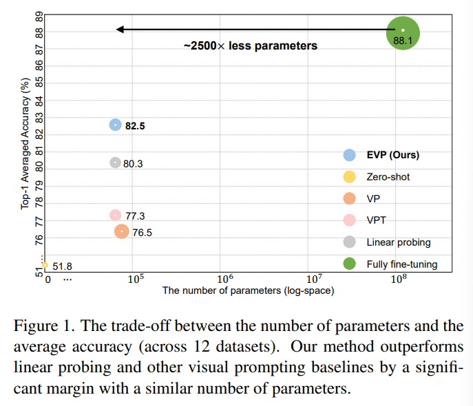
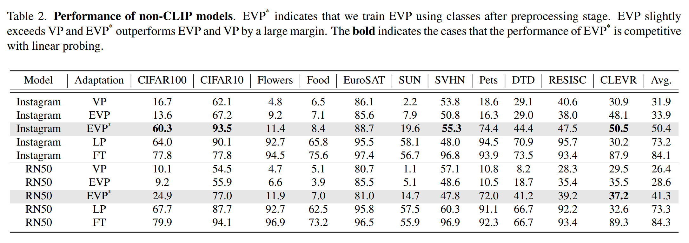
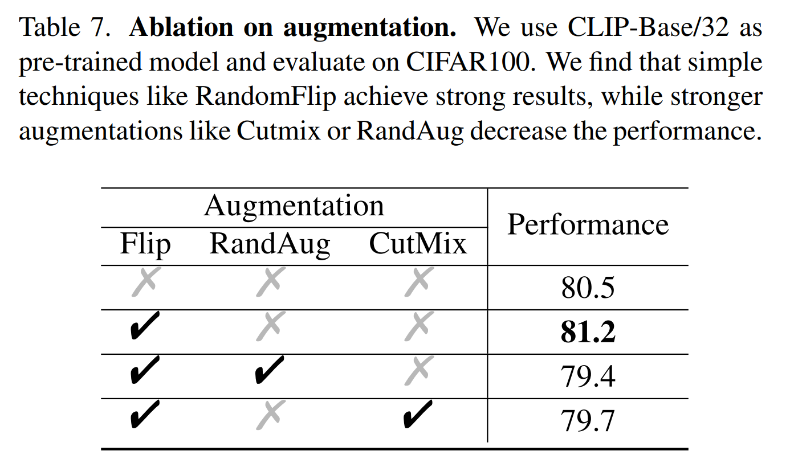

논문 및 이미지 출처 : <https://arxiv.org/pdf/2212.10556>

# Abstract

본 논문은 pre-trained model 을 downstream recognition tasks 에 adapting 하기 위한 간단하고 효과적인 visual prompting 방법 제시

두 가지 주요 설계 포함:

1) prompt 와 image 를 직접 더하는 대신, prompt 를 independent trainable component 로 취급
   - prompt 와 image 를 조화시키는 전략이 중요하다는 것을 보여주고, 적절히 축소된 image 주위에 prompt 를 변형시키는 것이 경험적으로 가장 잘 작동하는 것을 발견
2) transferable adversarial examples 를 구축할 때, 흔히 사용되는 two "old tricks", 즉 input diversity 및 gradient normalization 를 visual prompting 에 re-introduction
   - 이런 기술은 최적화를 개선하고 prompt 가 더 잘 일반화되도록 함

이 방법의 효과를 입증하기 위해 광범위한 실험 결과를 제공한다.

CLIP model 을 사용하여, 저자의 prompting 을 12 popular classification dataset 에서 평균 정확도 82.5% 의 새로운 기록을 세워, 이전 기술을 +5.2% outperform 달성.

주목할 점은, 이 prompt 성능이 linear probing 을 +2.2% outperform 하고 특정 dataset 에선 full fine-tuning 과 일치할 수 있다는 것.

또한, 저자의 prompting 은 다양한 data-scale 및 distribution shift 에 competitive performance 를 보여줌

# 1. Introduction

vision 및 language processing 모두에서 성공하기 위한 경로로서 점점 large-scale dataset 에서의 pre-training 을 경험한다.

이런 pre-trained model 들은 foundation models 로 불린다.

fully fine-tuning 은 이러한 foundation models 를 다양한 downstream task 에 효과적으로 adapting 하기 위한 가장 널리 퍼진 패러다임 중 하나로, 많은 parameters 로 인해 계산 비용이 많이 든다. 

이는 foundation models 을 new task 에 adapting 하기 위한 더 효율적인 대안이 필요로 하게 만든다.

input space 만 수정하는 _Prompting_  은 NLP 에서 효과적이고 효율적인 해결책을 제공한다. 예로, text prompting 은 fully fine-tuning 에 근접한 성능을 나타낼 수 있다.

이 유망한 결과는 연구자들로 하여금 computer vision 분야에도 유사한 성공을 이룰 수 있는지 조사하게 만든다.

이 방향에서의 초기 노력으로는 VPT 와 VP 가 있으며, 이는 foundation model 을 adapting 하기 위해 pixel level 에서 token 이나 perturbation 을 직접 추가하는 small learnable parameters 를 추가한다.

하지만 performance 와 parameter efficiency 간의 trade-off 를 면밀히 살펴보면 (Fig. 1), 이러한 advanced visual prompt 방법들이 less competitive 한 것으로 나타난다.

예로, comparable parameters 를 가짐에도, VPT 와 simple linear probe baseline 사이에는 상당한 격차가 있다 (77.3% vs 80.3%).

본 논문은 visual prompt 의 full potential 을 pixel level 에서 발휘하고, 나아가 linear probing 과 같은 다른 대안들보다 더 강력할 수 있는지 탐구한다.

---

흥미롭게, 적절한 수정과 함께 visual prompting 은 foundation model 을 다양한 visual tasks 에 adapting 하는 데 있어 효과적인 패러다임으로 변모할 수 있음을 발견

1) VP 와 같이 prompt 와 image 를 직접 더하는 것이 original image information 을 손상시켜 prompt 의 학습을 제한할 수 있다.
   - 이를 해결하기 위한 간단한 전략으로, 저자는 original image 를 더 작은 크기로 축소한 후, prompt 를 주위에 padding 한다.
   - 즉, prompt 와 image 는 겹치지 않고 서로 분리되어 유지
   - 이 전략은 prompt 의 independent optimization 를 가능케 하고, padding size 를 조정하여 computation overheads 를 제어할 수 있는 flexibility 제공

2) loss function 의 maximizing 또는 minimizing 을 목표로 하는 adversarial examples 에서 유사한 기술을 도입하여 visual prompt 의 성능을 향상시킴
   - 구체적으로, gradient normalization 과 input diversity 가 prompt 의 generalization 능력을 향상시키는데 더 효과적임을 발견

---

저자는 standard protocol 을 따라 12 visual benchmark 에서 실험 수행

- CLIP 을 사용한 결과, 저자의 방법이 average accuracy 82.5% 를 달성하여 이전의 visual prompting 인 VPT 를 +5.2% outperform
- 더욱 흥미로운 것은 이 82.5% 결과가 linear probing (80.3%) 보다 +2.2% 강력하며, 특정 dataset 에선 fully fine-tuning 과도 comparable 한 것이다.
- 다양한 data-scale 과 distribution shift 처리하는 데 있어 저자의 방법이 우수함을 확인

## 2. Related Work

#### Prompt learning in NLP

prompt 핵심 아이디어는 input text 를 downstream task 에 맞게 재구성하여 frozen language model 이 task 를 더 잘 "_understand_" 하고 수행할 수 있도록 하는 것.

이전의 수동 설계 text prompt 가 downstream task 에서 few-shot 또는 zero-shot setting 에서 뛰어난 표현 능력을 발휘할 수 있도록 도와준다 보지만, 이는 특정 domain knowledge 가 필요로 한다.

이를 해결하기 위해, prompt tuning 에 집중하기 시작하여, gradient information 을 통해 continuous prompt vector 를 직접 optimizing 하는 것을 포함한다.

본 연구에선 computer vision 에서의 prompt learning 을 조사하는데, 이는 언어가 아닌 시각적 신호를 포함하며, high-level semantic information 을 훨씬 적게 포함하기 때문에 더 어려운 task 다.

#### Visual prompt learning

prompt 성공 후, computer vision 분야에서 prompt 사용을 탐구하기 시작. 예로, CoOp 은 vision-language model 에 prompt tuning 을 적용하여 downstream task 에서 classification loss 를 minimizing 하여 soft prompt 학습.

VP 와 VPT 는 image 와 함께 prompt 를 사용하는데 초점을 두고 있음: VP 는 pixel space 에서 prompt 를 직접 최적화하고, VPT 는 ViT 에 learnable token set 을 삽입하여 prompt tuning 제안.

이런 방법들은 visual prompt learning 의 잠재력을 보여주지만, Fig. 1 처럼, linear probing 과 같은 다른 방법에 비해 성능이 그다지 경쟁력 있지 않다.

본 연구에선 visual prompt learning 을 강화하고 foundation model 이 다양한 visual task 에서 성능을 향상시킬 수 있는 강력한 잠재력을 입증하는 것을 목표로 한다.

#### Adversarial examples

machine learning model 은 adversarial attacks 에 취약함이 알려져 있다.

fast gradient sign method (FGSM) 과 projected gradient descent (PGD) 는 deep learning model 을 속일 수 있는 adversarial examples 를 생성하기 위해 일반적으로 사용되는 기술이다.

그러나 이러한 adversarial examples 는 다른 모델을 속이는 데 잘 transfer 되지 않는다.

이후 연구들은 adversarial examples 의 optimizing 어려움이 이러한 weak transferability 의 원인임을 보여주었으며, 다양한 input patterns 및 momentum-based gradient accumulation 같은 기술이 transferability 를 향상시키기 위해 제안되었다.

adversarial examples 생성과 prompt learning 사이의 유사성을 고려하여, 저자는 transferable adversarial examples 를 구축하는 기술을 재검토하여 visual prompting 강화에 관심을 가진다.

# 3. Methodology

foundation model 을 downstream task 에 맞추기 위한 단순하고 효과적인 pixel level 의 visual prompt 방법인 Enhanced Visual Prompting (EVP) 를 제시한다.

## 3.1. Preliminaries

#### VPT

ViT 에 learnable parameters set 을 추가하여 visual prompt 를 수행한다.

공정한 비교를 위해 여기선 first layer 의 input 에만 prompt 를 삽입하는 VPT-Shallow 버전을 고려한다.

구체적으로, Fig. 2(a) 처럼, VPT 는 learnable class token [CLS] 와 patch embedding $E$ sequence 사이에 prompts $P$ 를 삽입하여 new input $x = [\text{CLS}, P, E]$ 를 생성

#### VP

learnable prompt 와 input image 를 pixel level 에서 직접 더하여 foundation model 을 downstream task 에 맞춘다.

prompt $v_\phi$ 는 input-agnostic 및 task-specific 으로 설계되어, Fig. 2(b) 처럼 input image 의 border 에 배치된다.

training 중, prompt $v_\phi$ 를 optimizing 하여 correct label $y$ 의 lokelihood 를 maximizing 한다: $max_{v_\phi} P(y|x + v_\phi)$.

inference 중, optimized prompt 가 test image 에 추가된다: $X_{test} = \{ x^1_{test} + v_\phi, \dots, x^n_{test} + v_\phi \}$

## 3.2. Designing EVP

설계는 VP 에 기반하지만, 몇 가지 간단한 수정이 있다.

VP 의 문제는 prompt 와 image 를 직접 합치면서 original image information 에 손상이 있다는 점이다.

예로, Fig. 2(b) 의 고양이 귀가 added prompt 에 의해 크게 겹쳐져 가려진다. 이는 prompt learning 을 방해할 수 있다. (section 5.1 ablation 참고)

이를 해결하기 위해, Fig. 2(c) 처럼, EVP 는 input image 를 축소하고 그 주위에 prompt 를 padding 한다.

- 구체적으로, input image $X \in \mathbb{R}^{K \times K \times 3}$ 를 $\hat{x} \in \mathbb{R}^{k \times k \times 3}$$ 으로 축소한 다음, $(K^2 - k^2) \times 3$ prompt 로 padding 하여 output image $\hat{X} \in \mathbb{R}^{K \times K \times 3}$ 를 얻는다
- VP 와 유사하게, training 중 prompt 를 optimizing 하여 correct label 의 likelihood 를 최대화하고, inference 중 optimized prompt 를 shrunk test samples 주위에 padding 하여 예측에 사용한다.

EVP 와 VPT 모두 prompt 와 image 를 겹치지 않게 유지하지만, 중요한 차이 존재

EVP 의 prompt 는 나중에 positional embedding 이 함께 추가되지만, VPT 에서는 그렇지 않다.

section 5.2 의 ablation study 에 보이듯, positional information 은 visual prompting 에서 강력한 성능을 달성하는데 중요하다.

## 3.3 Training Strategy of EVP

prompting 과 adversarial attack 사이엔 strong relationship 이 있다.

adversarial attacks 에선 주어진 image $x_i$ 에 대해 network 를 오도할 pixel perturbation $g_i$ 를 학습하는 것이 목표다.

이를 공식화하면 $\min_{g_i}P(y_i | x_i + g_i)$.

visual prompting 은 adversarial attacks 의 역과정으로 볼 수 있으며, 이 목표는 correct label $y$ 의 likelihood 를 maximizing 할 template $v$ 를 학습하는 것이다.

이 관계를 고려하여, adversarial attacks 에서 사용되는 기술, 특히 transferable adversarial examples 를 구축하는데 중점을 둔 기술이 visual prompting 에 유용할 수 있는지 탐구

#### Input diversity

이전 연구 [DI-2-FGSM](https://openaccess.thecvf.com/content_CVPR_2019/papers/Xie_Improving_Transferability_of_Adversarial_Examples_With_Input_Diversity_CVPR_2019_paper.pdf) 에선 input diversity 가 optimization 에 도움되며, adversarial examples 의 transferability 를 향상시킬 수 있음을 보여준다.

이후 연구에선 "diverse input" 의 개념이 다양한 data augmentation 전략을 적용하여 adversarial examples 를 생성하는 것으로 일반화될 수 있음을 보여주었다.

저자는 이 개념을 visual prompting 에 다시 도입한다.

구체적으로, EVP 는 RandomHorizontalFlip, RandAug, Cutmix 를 포함한 다양한 augmentation 을 고려한다.

Section 5.3 처럼, RandomHorizontalFlip 과 같은 simple augmentation 전략만으로도 visual prompting 을 크게 향상시킬 수 있음을 발견

#### Gradient normalization

adversarial attacks 에선 $L_1$, $L_2$, 또는 $L_\infty$ norm 과 같은 normalization 기법을 gradient update 에 적용하는 것이 일반적이다.

예로, $L_2$ norm 을 사용하여, gradient 는 normalizing 된다.

$$
\begin{equation}
   x^{adv} = x + \gamma \frac{\triangledown_xJ(x,y)}{|| \triangledown_xJ(x,y) ||_2},
\end{equation}
$$

- $\gamma$ : learning rate
- $J$ : loss function
- $\triangledown_xJ$ : input $x$ 에 관한 loss function 의 gradient

저자는 visual prompting 에 gradient normalization 을 도입

EVP 의 matrix representation 을 $V_e = W \odot M$ 을 정의한다.

- $W \in \mathbb{R}^{K \times K \times 3}$ : prompt parameters
- $M \in \mathbb{R}^{K \times K \times 3}$ : mask matrix
- $\odot$ : element-wise matrix product
- mask matrix $M$ : prompt 의 spatial location 을 encoding
- size $k \times k$ 의 central 은 모두 0 이고 나머지 모두는 1

실제로, EVP 의 gradient 를 $W$ 의 gradient 의 $L_2$ norm 으로 나누는 것이 best performance 를 발휘함을 발견

$$
\begin{equation}
   V^{t+1}_e = V^t_e - \gamma \frac{\triangledown_{V^t_e}J}{|| \triangledown_WJ ||_2},
\end{equation}
$$

다양한 normalization 전략의 albation 및 상세한 결과는 section 5.3

# 4. Experiments

#### Datasets.

visual prompting 을 12 downstream classification datasets 에 평가:  CIFAR100, CIFAR10, Flowers102, Food101, EuroSAT, SUN397, SVHN, DTD, OxfordPets, Resisc45, CLEVR, 및 DMLab.

추가적으로, visual prompting 을 out-of-distribution dataset 에 대한 robustness (Camelyon17, FMoW, 및 iWildCAM), 그리고 2 corruption datasets (CIFAR100-C 및 CIFAR10-C) 에서 테스트

#### Baselines.

EVP 의 성능을 TP (text prompting), VP, VPT, LP (linear probing) 및 FT (fully fine-tuning) 등 다른 일반적인 prompting 및 fine-tuning protocol 과 비교.

구체적으로, 다음을 주목:

1) TP 는 CLIP 의 zero-shot 과 동등
2) LP 는 classification head 로 linear layer 사용
3) FT 는 backbone 및 classification head 의 all parameters 업데이트

## 4.1. CLIP

VP protocol 을 따라, 12 classification datasets 에서 CLIP-Base/32 model 을 사용하여 평가를 수행.

Tab. 1 에 전체 결과가 있으며, two strong baselines 인 LP 및 VPT 와의 상세 비교는 Fig. 3 에 있다.

- EVP 는 일관되게 이전 prompting 방법들과 유사하거나 fewer parameters 로 능가한다.
- 평균적으로, EVP 는 VP 보다 6.0%, VPT 보다 5.4% 향상 보임

효과성 추가 평가를 위해, 널리사용되는 fine-tuning protocol 인 linear probing 과 EVP 비교.

Tab. 1 및 Fig. 3 결과에 따르면,

- EVP 는 12 datasets 중 7 에서 linear probing 을 능가
- 평균적으로, EVP 는 82.5% accuracy 달성. 이는 linear probing 보다 2.2% 높은 수치
- 또한 padding size 를 조정하여 parameter 수를 쉽게 조절 가능하여 더욱 flexible
- 반면, linear probing 의 parameter 수는 downstream task 의 class categories 의 수에 의존된다.

마지막으로, 

- EVP 는 fully fine-tuning 과 비교하여 상당히 parameter efficient 하며, parameter 수는 단 0.04% 에 불과
- 두 방법 간에는 여전히 performance gap 존재, EVP 평균 정확도는 82.5% 이고 fully fine-tuning 은  88.1% 이다
- 하지만, EVP 는 CIFAR100, CIFAR10, EuroSAT, DMLab, Pets 를 포함한 일부 dataset 에서 유사한 결과를 얻거나 능가하는 성능을 보임

## 4.2. Non-CLIP Models

이 섹션에선 non-CLIP models 에서 EVP 의 효과 평가.

non-CLIP model 을 downstream task 에 adapting 하는데 하나의 어려움은 original classification head 가 의미적으로 덜 의미있거나 predefined classes 으로 mapping 된다는 것.

VP 에서 사용된 direct 및 naive solution 은 downstream classes 를 pre-trained classe 에 임의로 매핑하고 할당되지 않은 classes 를 폐기하는 것이다.

하지만 저자는 pre-trained 및 downstream classes 간에 정확한 대응 관계가 알려져 있지 않더라도 similarity 가 존재할 수 있다고 가정한다.

이는 visual prompting 을 구현하기 전에 potential similarity 를 활용하기 위해 pre-processing stage 를 제안한다.

- 구체적으로, 각 downstream class 에 대해, 해당 class 의 downstream images 를 pre-trained model 에 주입하고 pre-trained classes 에서의 예측을 조사
- 이후, highest prediction frequency 의 pre-trained class 의 corresponding class 로 간단히 선택한다
- pre-processing 후, correspondence 를 fix 하고 visual prompting method 를 학습

전반적으로, Tab. 2 의 결과는 non-CLIP model 을 downstream task 에 적응시키는데 있어 EVP 의 효과를 보여줌

- arbitrary mapping 을 사용할 때, EVP 의 성능이 baseline VP 보다 이미 향상되었지만 (~ 2%), pre-processing stage 를 사용하면 EVP 의 성능이 더욱 크게 향상된다.
- 예로, Instagram pre-training model 에선 33.9% 에서 50.4% 로, ImageNet-train ResNet-50 에선 28.6% 에서 41.3%로 향상
- 그러나, EVP* 의 성능은 Flowers102 및 Food101 같은 fine-grained dataset 에선 강력하지 않음을 주목
- 이는 이러한 유형의 task 에서 pre-trained class 와 downstream classes 간의 correspondence 를 찾는 것이 더 어려울 수 있음을 시사

## 4.3. Robustness

EVP 의 robustness 를 다른 prompting 및 fine-tuning protocol 과 비교.

EVP 의 robustness 를 out-of-distribution (OOD) 및 corruption dataset 에서 평가

#### OOD robustness

WILDS benchmark 를 사용하여 EVP 의 distribution shift 에 대한 robustness 를 테스트

모델은 specific domain 에서 학습되고 different domain 에서 평가. 예로, different regions, cameras 및 hospital

Tab. 3 결과는,

- EVP 가 다른 prompting 을 최소 4.5% 능가함을 보여줌
- 이 설정에선 EVP 는 linear probing (+3.7%) 및 fully fine-tuning (+0.7%) 뛰어넘음
- EVP 가 OOD 외 sample 을 처리하는 데 잠재력을 갖고 있음을 강조

#### Robustness on corruption datasets.

이는 EVP 의 robustness 를 common image corruptions 에 평가한다.

CIFAR100-C 및 CIFAR10-C corruption dataset 에서 EVP 를 테스트하며, 이는 각각 19 common image corruptions 를 CIFAR100 및 CIFAR10 dataset 에 적용한 것이다.

CIFAR100 및 CIFAR10 dataset 에서 EVP 를 학습한 후 해당 corruption dataset 에서 성능을 평가

평균 정확도는 Tab. 3 에 보고

- EVP 가 다른 prompting 및 linear probing 보다 큰 차이로 뛰어남을 확인
- EVP 가 commonm image corruption 처리에 fully fine-tuning 과 비슷한 성능을 보임을 주목
  - 즉, 71.5% vs 71.9%. 
- 이는 image 에 대한 corruption 이 다른 baseline 의 성능을 저하시킬 수 있는 반면, prompt 를 independent component 로 취급하는 전략이 이 문제를 완화할 수 있기 때문
  - 즉, EVP 의 prompt 는 inference 중 corrupted images 와 직접 결합되지 않고 주위에 padding 됨

## 4.4 Different Data Scales

이 섹션에선, EVP 의 성능을 다양한 data scales 에서 평가

저자는 EVP 를 각 class 에 대해 training data 가 1%, 4%, 7%, 10% 만 사용하여 학습

이는 few-shot learning 이 NLP 에서 prompting 의 중요한 측면이기 때문에, 흥미로운 부분임.

저자는 EVP 가 제한된 데이터로도 강력한 성능을 발휘할 수 있는지 검증한다.

평균 정확도 및 각 데이터셋의 결과는 Fig. 4 에 있음. 이를 통해 다음을 관찰한다.

- visual prompting (VP, VPT, EVP)은 일관되게 linear probing 보다 뛰어나며, 이는 제한된 라벨 데이터로 학습하는 데 visual promting 의 효과를 입증
- 모든 visual prompting 중에서 EVP 는 일관되게 best performance 를 달성하며, 이는 다양한 데이터 규모에서 강력한 일반화 능력을 보여줌

# 5. Ablation Study

## 5.1. Original Image Information

먼저 input image 의 original information 유지가 얼마나 중요한지 조사.

이를 위해 learnable parameters 수를 일정하게 유지하면서 input image 의 size 를 변화시킨다.

즉, original image 의 border information 를 다양한 정도로 손상시킨다.

결과는 Tab. 4 에 제시

- 12 dataset 중 9 개 에서 corruption 정도가 감소할수록 성능이 향상되는 것을 확인할 수 있음
- 이는 original image information 을 유지하는 것이 중요함을 나타냄

## 5.2. Prompting Positional Embedding

다음으로 positional embeddings 의 영향을 조사.

EVP 는 learnable visual prompts 및 image patch embeddings 의 position 을 모두 encoding 하는 반면, VPT 는 image patch embedding 에만 positional embeddings 를 포함한다.

저자는 다양한 구성들을 비교하여 visual prompting 에서 positional embedding 의 중요성을 pixel 및 token level 에서 입증한다.

---

pixel level 에서, 저자는 **EVP-small w/PE** 로 명명하고, 두 가지 추가 변형을 정의:

1) **EVP-big w/PE** : original image 를 learnable pixels 로 padding 하고, original positional embeddings 를 적절한 크기로 interpolating 한 다음, positional embedding 을 image patch embedding 과 learnable pixels 모두에 추가
2) **EVP-big w/o PE** : original image 를 learnable pixels 로 padding 하고, positional embeddings 를 image patch embedding 에만 추가

결과는 Tab. 5 에서 보여준다.

- **EVP-big w/ PE** 가 가장 좋은 성능을 보이는 반면, **EVP-big w/o PE** 가 가장 낮은 성능을 보인다.
- 예로, **EVP-small w/ PE** 는 fewer parameters 및 lower resolution 임에도 불구하고, 5 dataset 에서 평균 6.1%(86.7% vs 78.6%) 차이로 **EVP-big w/o PE** 를 능가
- 이러한 결과는 visual prompting 에서 positional embedding 을 추가하는 것이 매우 중요함을 입증

---

token level 에서, 저자는 learnable tokens 에 positional embedding 을 단순히 추가하는 것만으로 성능이 향상됨을 발견.

이를 더 조사하기 위해, learnable tokens 에 다양한 positional embedding 을 추가하여 서로 다른 prompting choices 를 설계한다.

구체적으로, prompting choices 를 VP$_n$T 로 명명하며, 여기서 $n$-th positional embeddings 는 learnable tokens 에 추가된다 (Fig. 5).

실험에서 저자는 $n = \{ 1, 25, 50 \}$ 을 선택하여 original image 의 head, middle, tail 부분에 token 을 삽입하는 효과를 연구한다. (결과적으로 총 50 tokens)

Tab. 6 의 결과는

- learnable tokens 에 positional embedding 을 통합하면 visual prompting 의 성능이 일관되게 크게 향상됨을 보여준다.
- 예로, 평균 정확도가 VP$_1$T 에서 +2.4%, VP$_{25}$T 에서 +1.8%, VP$_{50}$T 에서 +1.4% 증가한다.
- 이 결과는 context 에서 positional embedding 의 중요성을 확인시켜준다.

## 5.3. Training strategy

이 섹션에선 transferable adversarial learning 의 다양한 "old tricks" 가 visual prompting 에 미치는 영향을 조사.

먼저, CIFAR100 dataset 에서 RandomHorizontalFlip, RandAug, Cutmix 같은 augmentation 효과를 살펴본다

Tab. 7 과 같이, 

- RandomHorizontalFlip 같은 simple augmentation 은 만족스러운 결과 발견
- Cutmix 나 RandAug 와 같은 고급 방법은 over-regularization 으로 인해 성능을 저하할 수 있음
- 예로, CIFAR100 에서는 RandomHorizontalFlip 이 정확도를 0.7% 향상시키지만, RandAug 와 CutMix는 각각 1.1%와 0.8%의 정확도 저하를 초래

---

다음으로, CIFAR100 dataset 에서 $L_1$ norm, $L_2$ norm 및 $L_\infty$ norm 을 포함한 다양한 gradient normalization 전략에 대한 ablation study 수행

Tab. 8 의 결과에 따르면,

- $L_2$ norm 이 세 전략 중에서 일관되게 가장 좋은 성능을 보임
- 게다가, $L_2$ norm 의 최적 구성을 조사한 결과, image 전체의 gradient 를 사용하여 norm 계산한 것 ($L_2$-whole)이, visual prompting pixel 의 gradient 만 사용하는 것 ($L_2$-partial)보다 더 나은 성능을 보인다는 것을 발견
- 즉, 81.2% vs 79.4%

## 5.4. VPT-DEEP

VPT-DEEP 는 성능 향상을 위해 각 Transformer layer 의 input space 에 learnable token 을 추가로 도입한 VPT 의 고급 버전이다.

여기서는 EVP 와의 성능을 간단히 비교한다.

구체적으로, section 4.1 의 설명한 설정을 따라 CLIP-base 으로 실험을 진행.

결과에 따르면, 

- VPT-DEEP 는 기본 VPT 보다 4.6% 더 높은 성능을 보이며 (77.3% to 81.9%)
- EVP 의 평균 정확도인 82.5% 보다는 약간 낮은 성능

이러한 발견은 EVP 가 우수한 prompting 전략임을 확인. 또한, EVP 와 VPT-DEEP 이 각각 다른 측면의 prompting(pixel-level 및 feature-level)에 초점을 맞추고 있다는 점에서 두 방법을 결합하면 더 강력한 visual prompting 기술을 개발할 수 있는 가능성이 있다.

# 6. Conclusion

저자는 pixel-level 에서 visual prompt 를 사용하여 pre-trained model 을 다양한 downstream task 에 adapting 하기 위한 간단하고 효과적인 방법인 EVP 제안

EVP 는 original image information 을 유지하고 성능을 향상시키기 위해 adversarial learning 기법을 통합한다.

EVP 가 다른 visual prompting 방법을 능가하며 다양한 환경에서 linear probing 을 능가함을 보여준다.

또한, EVP 는 다양한 data-scale 및 distribution 외 sample 에 대한 robustness 를 다룰 때 강력한 성능을 보임